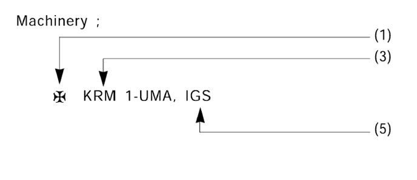

# PART 1 Classification and Surveys

> RULES FOR CLASSIFICATION OF STEEL SHIPS / RA-01-E / 2025 / EN / Rules

## CHAPTER 1 CLASSIFICATION

### Section 1 General

#### 101. Definitions (2020)

The definitions of terms used in **Ch 1, Ch 2** and **Ch 3** are to be as specified in the following, unless otherwise specified elsewhere.

- **1.** **Classification** means recording the name and relevant data of a ship which has been satisfactorily surveyed in accordance with this Society's Rules and approved by the Classification Committee, on the computer register.
- **2.** **Register of Ships** means a documentation containing the name, principal particulars, etc., of all KR registered ships.
- **3.** **Classification Technical Rules** include Rules and Guidance. *(2021)*
  - **(1)** **Rules** means the Rules which have been established/amended by this Society to undertake classification and survey on ships, offshore units and relevant equipment.
  - **(2)** **Guidance** means the Guidance relating to the Rules and other Guidance.
- **4.** **Class Notation** means a notation in which the characteristics of a ship is expressed in letters or symbols, indicating that it meets the compulsory application requirements of the ship and/or additional voluntary standards requirements. Class notation consists of construction symbols, service restriction notation of hull/machinery, equipment, ship type notation, special feature notations, additional special feature feature notations and additional installation notations. *(2022)*
- **5.** **Date of contract for construction** ***(2022)***
  - **(1)** The date of contract for construction of a vessel is the date on which the contract to build the vessel is signed between the prospective Owner and the shipbuilder. This date and the construction numbers(i.e. hull numbers) of all the vessels included in the contract are to be declared to the Society by the party applying for the assignment of class to a newbuilding.
  - **(2)** The date of contract for construction of a series of vessels, including specified optional vessels for which the option is ultimately exercised, is the date on which the contract to build the series is signed between the prospective Owner and the shipbuilder.
  - **(3)** In application to **Par 2**, vessels built under a single contract for construction are considered a series of vessels if they are built to the same approved plans for classification purposes. However, vessels within a series may have design alterations from the original design provided;
    The optional vessels will be considered part of the same series of vessels if the option is exercised not later than 1 year after the contract to build the series was signed.
    - **(A)** Such alterations do not affect matters related to classification, or
    - **(B)** If the alterations are subject to classification requirements, these alterations are to comply with the classification requirements in effect on the date on which the alterations are contracted between the prospective owner and the shipbuilder or, in the absence of the alteration contract, comply with the classification requirements in effect on the date on which the alterations are submitted to the Society for approval.
  - **(4)** If a contract for construction is later amended to include additional vessels or additional options, the date of contract for construction for such vessels is the date on which the amendment to the contract, is signed between the prospective Owner and the shipbuilder. The amendment to the contract is to be considered as a new contract to which **Par 1** to **Par 3** above apply.
  - **(5)** If a contract for construction is amended to change the ship type, the date of contract for construction of this modified vessel, or vessels, is the date on which revised contract or new contract is signed between the Owner, or Owners, and the shipbuilder.
- **6.** **Sister-ship** means a ship intended to be built by the same builder, based on the plans and documents approved for other ships and regarded as the same or similar by the Society. *(2022)*
- **7.** **Classification Survey during Construction** menas the survey which is carried out on new building ship that is built in accordance with the Classification Technical Rules from the initial stage of construction with the purpose of registering to this Society.
- **8.** **Double Class Vessel** means a vessel which is classed by two Societies and where each Society works as if it is the only Society classing the vessel and performs all surveys in accordance with its own Rules, requirements and schedule. *(2025)*
- **9.** **Dual Class Vessel** means a vessel which is classed by two Societies. These Societies have a written bilateral agreement that outlines sharing of work, including a working plan, and procedures and, in case of newbuilding, a written trilateral agreement with the shipyard. *(2025)*
- **10.** **Bilateral Agreement** means an agreement adopted by the two Societies with Dual Class Vessels. *(2025)*
- **11.** **Trilateral Agreement** means an agreement adopted by the shipyard and the two Societies involved in dual class arrangement (first Society and second Society) for describing the responsibilities between the two Societies during new construction of a vessel. *(2025)*
- **12.** **First Society** means a Society classing a vessel which, under request of the Owner, enters a double or dual class arrangement with another Society.
- **13.** **Second Society** means a Society which is requested by an Owner to accept a vessel already classed, or to be classed, by another Society into its class under double or dual class arrangement.
- **14.** **The Owner** means including Charterer, representatives of Owner, Representatives of Charterer and master of ship.
- **15.** **Periodical Survey** means Special Survey, Intermediate Survey and Annual Survey.
- **16.** **Verification** menas a service that confirms through the provision of objective evidence(analysis, observation, measurement, test, or records or other evidence) that specified requirements have been met.
- **17.** **Condition(s) of Class** mean(s) requirements to the effect that specific measures, repairs, surveys etc is(are) to be carried out within a specific time limit in order to retain Classification.
- **18.** **Alternative design** means a design that deviate from the Rules of the Society.
- **19.** **Novel feature** means a technology that has no previous experience in the environment being proposed and based on novel design principles or features to which the Classification Rules are not directly applicable.
- **20.** **Force majeure** means damage to the ship; unforeseen inability of the Society to attend the vessel due to the governmental restrictions on right of access or movement of personnel; unforeseeable delays in port or inability to discharge cargo due to unusually lengthy periods of severe weather, strikes or civil strife; acts of war; or other force majeure(such as Pandemic). *(2021)*
- **21.** **Water/oil-tight** means capable of preventing the passage of water through the structure in either direction with a proper margin of resistance under the pressure due to the maximum head of water which it might have to sustain. *(2022)*
- **22.** **Weathertight** means that in any sea conditions water will not penetrate into the ship. *(2022)*
- **23.** **Air/gas-tight** means that air or gas between adjacent areas (or boundaries) does not pass through. *(2022)*
- **24.** **Structural Testing or Tank Testing** means a hydrostatic test carried out to demonstrate the structural adequacy of design and tightness of tank boundaries. *(2022)*
- **25.** **Cargo spaces** mean spaces used for cargo, cargo oil tanks tanks for other liquid cargo and trunks to such spaces. *(2022)*
- **26.** **Sea casualty** means any accidents of collision, grounding, explosion, fire, breakdown of machinery and equipment, and marine pollution on KR classed ships. *(2022)*
- **27.** **Cofferdam** means an empty space arranged so that compartments on each side have no common boundary. *(2024)*
- **28.** **Void space** or **Void** means an enclosed empty space in a ship. *(2021)*
- **29.** **Tank** is the generic term for spaces intended to carry liquid, such as, seawater, fresh water, oil, liquid cargoes, FO(Fuel Oil), DO(Diesel Oil), etc. *(2023)*

#### 102. Classification and Continuation of the Classification (2021)

- **1.** Steel ships built and surveyed in accordance with the Rules of the Society(hereafter referred to as "the Rules") or with the alternatives equivalent to the Rules will be assigned a class designation by the Society and registered in the Register of Ships.
- **2.** Tests and Inspections specified in the Rules of the Society are to be carried out under attendance of the Surveyor, unless expressly specified otherwise. *(2021)*
- **3.** All ships classed with the Society are, for continuation of the classification, to be subjected to the periodical and other surveys, and are to be maintained in good condition in accordance with the requirements of the Rules.
- **4.** When a ship classed with the Society makes an alteration or modification of such an extent as to influence to the ship's original performances, the plans have to be submitted for the Society's approval before the work is commenced and the alteration work has to be supervised by the Surveyor.

#### 103. Standard application of the Rules

- **1.** The Rules are framed on the understanding that ships will be properly loaded and handled and not, unless stated in the class notation, provide special distributions and concentrations of loading.
- **2.** The plans of ships designed for specific condition of loading or particular features in respect of the hull, machinery or equipment are also to be submitted for approval.

#### 104. Exclusion from the Rules

The Society cannot assume responsibility for trim, hull vibration or other technical characteristics not covered by the Rules. However, the Society may advise on such matters upon application by an Owner.

#### 105. Equivalence (2023)

The Society may consider the acceptance of alternatives and novel features which deviate from or are not directly applicable to the Rules, provided that they are “deemed to be equivalent to the Rules to the satisfaction to the Society”.
Note : "deemed to be equivalent to the Rules to the satisfaction to the Society" includes the following cases.

### Section 2 Class Notations

#### 201. Class notations 【See Guidance】

The class notations assigned to the ships classed with the Society are to be in accordance with the followings:

- **1.** Upon the request of the applicant(i.e., the Owner or the Builder), character of class including class notations shall be assigned to ships which have been built to comply with the corresponding requirements of the Rules. In addition to **201.** (7) and (8), the Special Feature Notation such as designated cargo or purpose, etc. may be appended at the request of the Owner when considered appropriate by the Society. *(2020)*
- **2.** The Society may change or update the class notations at any time in consultation with the applicant, provided that the Class Notations already recognized are not suitable for the intended service(type, use and etc.), navigation and any other required rules. *(2020)*

  |  |
  | --- |
  |  |
  |  |
  - **(1)** **Construction symbols**
    The construction symbols assigned to the ships according to the distinction of Classification Survey are to be in accordance with the followings:
    **✠** ; For ships built under the supervision of the Society.
    No symbol ; For ships considered to be fit as the result of surveys by the Surveyor after construction with the exception of the above mentioned construction symbols.
  - **(2)** **Service restriction notations of hull**
    The following service restriction notations will be given for ships with hull construction and strength found to be in compliance with the Rules:
    KRS 1 ; For ships unrestricted in service area.
    KRS 0 ; For ships restricted in service area.
  - **(3)** **Service restriction notations of machinery**(apply to ships having main propulsion machinery) *(2021)*
    The following service restriction notations will be given for ships with machinery and electrical installations found to be in compliance with the Rules:
    KRM 1 ; For ships unrestricted in service area.
    KRM 0 ; For ships restricted in service area.
  - **(4)** **Service restriction notations of equipment**
    The following service restriction notations will be given for ships with equipment found to be in compliance with the Rules:
    No symbol ; For ships unrestricted in service area.
    C ; For ships approved with the condition of coastal service.
    S ; For ships approved with the condition of smooth water service.
  - **(5)** **Additional installations notations**
    - **(A)** Ships designed for the application of additional installations on hull items will be distinguished after the character of hull by the class notation such as "LI", "CHA", "HMS" or "HMS1", etc. and on machinery items will be distinguished after the character of machinery by the class notation such as "CMA", "UMA", "DPS", "NBS", "IGS", "COW", "STCM" or "RMC", etc. *(2018)*
    - **(B)** Such notations shall, when there is an application by the Builder or the Owner, be assigned after confirming that the requirements are met. However, installations affecting the safety of lives and ships are to be satisfied with the relevant requirements and be assigned with the appropriate notations. *(2021)*
  - **(6)** **Ship type notations**
    Ships designed in compliance with particular Rules intended to apply to that type of ship will be indicated by the appropriate designations such as Oil Tanker 'ESP'(FBC), Bulk Carrier 'ESP', Cargo Ship, Passenger Ship, Tug Boat, Barge, etc. affixed to the character of hull.
  - **(7)** **Special feature notations** ***(2020)***
    The Special Feature Notations may be located under the character of the ship type notations. These special feature notations could consist of the hull structure and the cargo tank type fitted for the kind and nature of cargoes, ice strengthening, in-water survey, cargo loading condition, design temperature, design pressure, the apparent specific gravity of cargoes, Also, the restriction of navigation area and condition may be remarked additionally.
  - **(8)** **Additional Special feature notations** ***(2020)***
    When considered necessary by the Society, the Additional Special Feature Notations may be located side by appended to the character of Special Feature Notations. These special feature notations could consist of the direct strength assessment, direct fatigue assessment, hull construction monitoring, and/or longitudinal strength of hull girder in flooded condition for bulk carriers, etc.
  - **(9)** The details for ship type, special feature notations and additional installations notations of class notations are given in **Annex 1-1** of the Guidance. *(2021)*

#### 202. Class notations of large yachts

The class notations of large yachts classed with the Society are to be in accordance with the requirements specified in **Pt 1, Ch 1, 103.** of the **Guidance for Large Yachts** irrespective of the requirements in **201.**

#### 203. Class notations of recreational crafts

The class notations of recreational crafts classed with the Society are to be in accordance with the requirements specified in **Ch 1, 103.** of the **Guidance for Recreational Crafts** irrespective of the requirements in **201.**

### Section 3 Classification Survey during Construction (2022)

#### 301. Classification Survey during Construction 【See Guidance】

For a ship requiring Classification Survey during Construction, the construction, materials, scantlings and workmanship of the hull, equipment and machinery are to be examined in detail in order to ascertain that they meet the appropriate requirements of the Rules.
Furthermore, the hull survey for Classification Survey during Construction for ships subject to **Annex 1-12** is to be in accordance with **Annex 1-12.** *(2021)*

#### 302. Approval of plans 【See Guidance】

For a ship requiring Classification Survey during Construction, the plans and documents showing the details of the construction, materials, scantlings and particulars of the hull, equipment and machinery are to be submitted in triplicate and approved before the work is commenced. The same applies also to the cases of any subsequent modifications to the approved drawings or documents.

#### 303. Materials and equipment

All materials used for a ship requiring Classification Survey during Construction are to be manufactured under approved method or under alternative process considered equivalent to the approved method and are to be adequate to the relevant requirements of the Rules. The Society may request the relevant documents such as certificate of materials or equipment, etc. for the confirmation of the materials or equipment which are used.

#### 304. Machinery installation 【See Guidance】

Main engines, shafting arrangement, boilers, pressure vessels, electrical equipment, essential auxiliary machinery, and piping arrangements to be installed on a ship intended for classification are to be surveyed during construction. Shop trials are to be carried out on completion under a same condition as installed on-board ship or a similar condition as far as practicable. Various tests on any special part amongst the automatic or remote control systems and measuring devices considered necessary by the Society may be requested at the manufacturing sites.

#### 305. Workmanship

For Classification Survey of a ship, the materials, workmanship and arrangements are to be surveyed under the supervision of the Surveyor from the commencement of the work until the completion of the ship. When the machinery is constructed under Classification Survey, this survey is to be related to the period from the commencement of the work until the final test under working conditions. Any item found not to be in accordance with the Rules or the approved plans, or any material, workmanship or arrangement found to be unsatisfactory are to be rectified.

#### 306. Tests 【See Guidance】

In the Classification Survey during Construction, hydrostatic, watertight and performance tests are to be carried out in accordance with the relevant part of the Rules. Also the control systems and measuring device after installation are to receive the necessary tests, as deemed necessary by the Society. In addition, the survey of watertight cable penetrations(bulkheads and decks) and watertight pipe penetrations(bulkheads or decks) are to be in accordance with the following. *(2024)*

- **1.** **Surveys of Watertight Cable Transits** ***(2021)***
  - **(1)** Watertight cable transits are to be installed and maintained in accordance with the manufacturer’s requirements and in accordance with the requirements of the relevant Type Approval certification.
  - **(2)** Cable Transit Seal Systems Register
    It is to include a marking / identification system, documentation referencing manufacturer manual(s) for each type of cable transit installed, the Type Approval certification for each type of transit system, applicable installation drawings, and a recording of each installed transit documenting the as built condition after final inspection in the shipyard. It is to include sections to record any inspection, modification, repair and maintenance.
    - **(A)** A Cable Transit Seal Systems Register (Register) is to be provided by the shipbuilder for all watertight cable transits fitted to the vessel. For an example of a register see Appendix 1-12-5 “Recommendatory Sample - Cable Transit Seal Systems Register”. The Register can be in either a hard copy or digitized media.
    - **(B)** The Register shall be reviewed by the attending Surveyor to confirm it contains a list of the watertight cable transits, applicable cable transit information and sections to maintain in-service maintenance and survey records.
    - **(C)** For manned vessels the Register is to be held onboard of the vessel. For unmanned vessels, if a suitable storage location does not exist onboard, the Register may be held ashore. The Register is to be readily available for the attending surveyor.
  - **(3)** For Installation and Maintenance of Watertight Cable Transits, it is to be confirmed that:
    **2. Any penetration used for the passage of heat-sensitive piping systems through a watertight bulkhead or deck on a passenger ship** ***(2024)***
    - **(A)** Cable transits have been installed, and where disrupted have been reinstated, in accordance with the manufacturer’s requirements and in accordance with the requirements of Type Approval.
    - **(B)** Where specified, appropriate specialized tools have been used.
  - **(1)** Any penetration used for the passage of heat-sensitive piping systems through a watertight bulkhead or deck on a passenger ship under SOLAS Ch. II-1 Reg. 13.2.3 shall be tested with the heat-sensitive piping and shall be type approved for watertight integrity specified in **Ch 3, Sec 41** of **Guidance for Approval of Manufacturing Process and Type Approval, Etc.** after fire test specified in **Ch 3, Sec 26, Table 3.26.3** “Pipe and duct penetrations” of the same Guidance.
    In addition, prototype testing for fire test and watertightness test need not be carried out if the pipe penetration is made of steel or equivalent material having a thickness of 3 mm or greater and a length of not less than 900 mm (preferably 450 mm on each side of the division), and there are no openings. Such penetrations shall be suitably insulated by extension of the insulation at the same level of the division.
    See also SOLAS Ch. II-2 Reg. 9.3.1 with respect to piping. However, the penetration must still comply with the watertight integrity requirement in SOLAS Ch. II-1 Reg. 2.17.
  - **(2)** SOLAS Ch. II-1 Reg. 13.2.3 shall be applicable to heat-sensitive piping systems and shall not be applied to cable penetrations in watertight bulkheads and decks.
  - **(3)** Above piping penetrations have been installed, and where disrupted have been reinstated, in accordance with the manufacturer’s requirements and in accordance with the requirements of Type Approval.

#### 307. Stability (2023)

- **1.** In the Classification Survey during Construction for passenger ships and ships of 24 $\mathrm{m}$ and above in length other than passenger ships, stability experiments are to be carried out upon completion of the ship. A final stability information booklet adequate for the service intended and prepared on the basis of the stability particulars determined by the results of stability experiments, is to be approved by the Society and supplied to the master. However, a preliminary stability information booklet approved by the Society in lieu of a final stability information booklet may be provided on-board for a specific period.
  Note :
  1) In application to 1 above, the requirements shall not apply to the following ships not engaged on international voyage and less than 24 meters in length.
  - **(1)** Tug boat, Salvage, Dredger or Survey ship
  - **(2)** Steel barges
  - **(3)** Ships other than passenger ships or car ferries operating in water area within lakes, rivers and harbours
  - **(4)** Floating structures used for the storage in bulk of oil or waste etc.
  - **(5)** Floating structures used for the storage in bulk of dangerous goods
    2) Stability experiments stated in the Rules mean inclining experiments and rolling tests. Where the rolling period could be calculated in accordance with the formula specified in 2008 IS Code Part A, the rolling tests may be dispensed with except those specially required by the Society.
- **2.** The preparation and approval of stability booklets in above **Par 1** are to demonstrate that their intact stability is adequate for the service intended. Adequate intact stability means compliance with standards laid down by the relevant Administration or those of the Society taking into account the ship's size and type. The level of intact stability for ships with a length of 24 $\mathrm{m}$ and above should not be less than that provided by Part A of IMO Res. MSC.267 (85) (Adoption of the international code on intact stability, 2008) as amended by MSC.319(89), MSC.398(95), MSC.413(97), MSC.414 (97), MSC.415(97), MSC.443(99) and MSC.444(99) as applicable to the type of ship being considered.
  Where other criteria are accepted by the Administration concerned, these criteria may be used for the purpose of classification. Evidence of approval by the Administration concerned may be accepted for the purpose of classification. *(2025)*
- **3.** Where an loading instrument having a stability computation capability as supplemental use of stability information booklet specified in **Par 1** is provided, the test report of representative operational conditions is to be submitted to the Society, and the loading instrument shall cover all stability requirements applicable to the ship such as intact, damage and grain stability, etc.
  When the stability information include sufficient loading conditions of the ship, some part of the function may be omitted. The instrument is to be confirmed by the Surveyor upon installation in accordance with the test report approved by the Society. Where a loading instrument is installed onboard, the approval and survey procedures are given in **Annex 1-10** of the Guidance. *(2021)*

#### 308. Trials

Trials are to be carried out for all equipment, machinery and electrical equipment under working conditions after completion of the ship in order to ascertain their performances. In the sea trials, speed test, astern test, steering test, emergency steering test and turning test are to be carried out. In addition, the operating conditions of machinery and other behaviors of the ship during the trial are to be examined.

#### 309. In Case of Dual Class Vessel (2025) 【See Guidance】

- **1.** Each Society acts on behalf of the other Society in accordance with the trilateral agreement adopted by the two Societies and the shipyard. This agreement shall clearly define modalities such as submission of plans, rules to be applied, harmonizing and resolution of plan approval comments between societies. A format for the minimum content of a trilateral agreement refers to IACS Procedural Requirements (PR) 1B Annex 5; *(2025)*
- **2.** Plans and documents related to classification requirements are to be submitted to each Society by the shipyard; *(2025)*
- **3.** One set of plans and documents fully approved by the First Society shall be provided to the Second Society by the shipyard and each Society is to perform review and approval of plans based on its own classification Rules. As a minimum scope, the approval of the plans listed in **Ch 1, 309** of the Guidance is required by the Second Society to verify compliance with its applicable classification Rules. The Second Society is to record written documentary evidence of the abovementioned plans which were approved as complying with the Second Society’s own Rules or with other requirements confirmed acceptable in accordance with its own Rules; *(2025)* **【See Guidance】**
- **4.** Each Society is to perform the survey during fabrication, construction and testing of the vessel based on its own classification Rules and in accordance with the work agreed by the two Societies and described in the trilateral agreement, and/or the bilateral agreement adopted by the two Societies, if any; *(2025)*
- **5.** Each Society is to provide to the other Society information and records related to the Classification Survey during Construction such as plan approval including following up and closing of comments imposed, surveys, inspection, witnesses and tests etc., to perform the surveys and verify compliance with the relevant requirements;
- **6.** Each Society is to issue an Interim Certificate of Classification for the vessel upon satisfactory completion of the Classification Survey during Construction and full records being provided by both Societies respectively: *(2025)*
- **7.** Records in relation to the provisions of above paragraphs are maintained, demonstrating achievement of the requirements in the items covered by the services performed, as well as the effective operation of the quality system; and *(2025)*
- **8.** In case of termination of the trilateral agreement, this should be officialised by a document signed by all the involved Parties. In case whereby the First Society would not be involved anymore, the Second Society would have to take full responsibility for the classification of the ship(s) and might sign a MoU with the shipyard as per IACS Procedural Requirements 42 (Procedure for Assigning Class for a New Building project when the design is already approved by an Initial Society (Based on the Classification Rules and a Memorandum of Understanding (MoU) Between a Class Society, a Shipyard and, if applicable, a Ship Owner).
  The same applies if the shipyard wishes to withdraw some ships from the trilateral agreement. *(2025)*

#### 310. Acceptance of design approved by other Societies (2023)

- **1.** For a vessel with the design as previously approved by any Society which is subject to verification of compliance with QSCS(Quality System Certification Scheme) of IACS, the Society is to be applied for the separate procedures as specified by the Society or the IACS Procedural Requirements(PR) 42 (Procedure for Assigning Class for a New Building project when the design is already approved by an Initial Society (Based on the Classification Rules and a Memorandum of Understanding (MoU) Between a Class Society, a Shipyard and, if applicable, a Ship Owner). *(2025)*

### Section 4 Classification Survey after Construction

#### 401. Classification Survey after Construction 【See Guidance】

- **1.** In the Classification Survey after Construction, the actual scantlings of main parts of the ship are to be measured in addition to such examinations of the construction, materials, workmanship and actual conditions of hull, machinery, outfittings and equipment “as required for the Special Survey” corresponding to the ship's age in order to ascertain that they meet the relevant requirements in the Rules. *(2023)*
  Note : The term "as required for the Special Survey" means to carry out the relevant survey of Special Survey including thickness measurements, Docking Survey, Surveys of Propeller Shaft and Stern Tube Shaft, Etc., Boiler Survey of which is to be based on the age and type of the vessel.
- **2.** The Society may request further examinations, tests and measurements, including but not limited to material testing, non-destructive testing, hydraulic and hydrostatic tests and sea trial.
  However, in case of passenger ships subject to the Korean Ship Safety Act, sea trial shall be carried out as specified by the Society. *(2023)*

#### 402. Submission of plans 【See Guidance】

In the Classification Survey after Construction, plans and documents as may be required for Classification Survey during Construction are to be submitted. If plans cannot be obtained, facilities are to be given for the Surveyor to take the necessary informations from the ship.

#### 403. Classification Survey of ships classed by other Societies or TOC(Transfer of Classification) (2017) 【See Guidance】

When a ship holding class with any Society which is subject to verification of compliance with QSCS(Quality System Certification Scheme) of IACS is intended for classification, plans and documents to be submitted and survey items, etc. are to be in accordance with the Guidance relating to the Rules.
In case of Passenger Ships and Fishing Vessels, the procedures pertaining to "TOC" shall be applied. But survey items are to be in accordance with **401.** Classification Survey after Construction.

#### 404. Stability (2023)

In the Classification Survey after Construction for passenger ships and ships of 24 $\mathrm{m}$ and above in length other than passenger ships, stability experiments are to be carried out. A final stability information booklet adequate for the service intended and prepared on the basis of the stability particulars determined by the results of stability experiments, is to be approved by the Society and supplied to the master.
However, a preliminary stability information booklet approved by the Society in lieu of a final stability information booklet may be provided on-board for a specific period. Stability experiments may be dispensed with provided that “sufficient information based on previous stability experiments” is available and neither alteration nor repair affecting the stability has been made since the previous experiments.
Note :
1) Stability criteria and a standardized form of the stability information booklet are to comply with the requirements given in **307.**
2) The term "the sufficient information based on previous stability experiments" means the information on stability experiments approved by any Society which is subject to verification of compliance with QSCS(Quality System Certification Scheme) of IACS or the relevant flag state(including recognized organizations authorized by the relevant flag state to act on its behalf)

### Section 5 Certificates and Reports

#### 501. Certificate of Classification

- **1.** Where ships have undergone the Classification Survey during or after Construction to the satisfaction of the Surveyor and approved by the Classification Committee, the ships will be classed and entered in the Register of Ships with the issue of the Certificate of Classification.
- **2.** Where ships have undergone the Special Survey to the satisfaction of the Surveyor, the Certificate of Classification is issued newly.

#### 502. Interim Certificate of Classification (2020)

- **1.** Where ships have undergone a Classification Survey during or after Construction to the satisfaction of the Surveyor, the Interim Certificate of Classification will be issued to permit the ship to trade while the Certificate of Classification is prepared.

#### 503. Conditional Certificate of Classification (2020)

- **1.** A Conditional Certificate of Classification is to be issued where a single direct voyage to a repair yard/survey port/another place of laid-up or demolition yard, etc., in lieu of a Classification Certificate. In this case, “a single direct voyage is allowed” means the cases as specified in **901. 5** or **7**.
- **2.** In addition, where deemed necessary by the Society, it issues the Conditional Certificate of Classification as specified by the Society

#### 504. Certificate for construction survey

Where ships not intending to be classed have undergone the survey during construction, or marine engines, boilers, auxiliary machinery and outfittings have undergone the surveys during construction to the satisfaction of the Surveyor, the Certificate for Construction Survey will be issued.

#### 505. Survey reports (2019)

On completion of the Classification Survey and the surveys assigned to maintain the classification, the Survey Reports will be issued. Ship's particulars, survey results, the date and description of the next surveys, etc. are to be stated in the Survey Reports.
The Owner can get relevant information on "KR e-Fleet'(Website).

#### 506. Keeping of the certificates and survey reports (2020)

The Certificate of Classification(incl. the Interim Certificate of Classification or the Conditional Certificate of Classification), Particular Sheets and Survey Reports, etc. are always to be kept on board by the master of the ship and are to be produced when requested by the Surveyor.
Keeping Method on board is Electronic or hard copy format.

#### 507. Mention on certificate

- **1.** Where ships classed with the Society have satisfactorily undergone the periodical survey, or where the period of validity of the Certificate of Classification is extended, or where the anniversary date is amended, the periodical survey or the case will be endorsed on the Appendix of Certificate of Classification or Interim Certificate of Classification.
- **2.** **Assigning of date of build**
  - **(1)** The year, month and date at which the Classification Survey during Construction is completed shall be specified as the "Date of Build". Where there is substantial delay between completion of the Classification Survey during Construction and the ship commencing active service, the date of commissioning may be also specified.
  - **(2)** Where the ship is altered, the Date of Build shall be remain assigned to the ship and the altered parts are to be complied with **Ch 2, Sec 12.**

#### 508. Re-issue and return of certificate (2020)

- **1.** When the Certificate of Classification(incl. the Interim Certificate of Classification or the Conditional Certificate of Classification), Particular Sheets, or Survey Reports are lost or impaired, or when the items stated in them require alteration, the application for re-issue must be made without delay.
- **2.** When a ship holding the Interim Certificate of Classification or the Conditional Certificate of Classification, is furnished with the Certificate of Classification, when the certificate is re-issued except in the case of its loss, or when the classification is cancelled, the old certificate is to be returned to the Society without delay.

#### 509. Certificates of related equipment

The Society may, upon application, survey such equipment relating to ships as prime movers, shaftings, boilers, pressure vessels, auxiliary machinery, electrical equipment and other machinery installations and issue certificates where they are to the satisfaction of the Surveyor.

#### 510. Class Maintenance Certificate (2023)

The Society will issue a Class Maintenance Certificate after the confirmation on the effective maintaining of class according to the rules is made when the Owner of a ship or the person having obtained the Owner's consent applies for it.

### Section 6 Application for Survey

#### 601. Classification Survey (2021)

The application for Classification Survey is to be made by the Builder for a ship during construction and by the Owner for a ship after construction. The application is to be submitted in writing to the Society. But, ships subject to Classification Survey are to be applied for the separate requirements as specified by the Society and the Society reserves the right to decline or cancel the application where deemed necessary by the Society as follows: *(2025)*

- **1.** Where the requested survey is not progressed after the application has been submitted so the intention of the survey application is not clear
- **2.** Where the survey fees are not paid,
- **3.** The ship is not complied with the requirements of the Society, etc.

#### 602. Periodical and other surveys (2021)

The application for surveys of ship for the continuation of her classification is to be made by the Owner. The application is to be submitted in writing to the Society. But, the Society reserves the right to decline the application where deemed necessary by the Society as follows:

- **1.** Where the requested survey is not progressed after the application has been submitted so the intention of the survey application is not clear
- **2.** Where the survey fees are not paid
- **3.** The procedure for suspension/withdrawal specified in **Sec 9** of the Rules is to be applied to the ship, etc.

#### 603. Re-issue of certificate (2020)

The application for re-issue and return of the Classification Certificate(incl. the Interim Certificate of Classification or the Conditional Certificate of Classification), Particular Sheets and Survey Reports are to be made by the Owner.

### Section 7 Responsibilities and Cooperation Duties of the Owners

#### 701. General (2020)

- **1.** The classification of a ship is based on the understanding that the ship is loaded, operated and maintained in a proper manner by competent and qualified seafarers or operating personnel in accordance with the environmental, loading, operating and other criteria on which classification is based.
- **2.** It is the responsibility to ensure that the *International Convention for Load Lines, Safety of Life at Sea*, other related Conventions and other related governmental regulations are maintained in an appropriate state including ensuring the validity of all relevant and applicable statutory certificates.
- **3.** It is the responsibility to ensure proper maintenance of the ship until the next survey required by the Rules, including ensuring the validity of the all relevant and applicable class certificates.

#### 702. Report items

When any of the following cases occurs, the Owner is to report to the Society without delay:

#### 703. Cooperation of survey

- **1.** All such preparations as required for Classification Survey and surveys necessary for the maintenance of class are to be made by the applicant of the survey in accordance with the requirements of the Rules. To permit safe and effective survey, such preparations are to include the provision of the work environment and safety measures in the way of suitable lighting, ventilation and access condition.
- **2.** The Owner, master, chief engineer or their representatives are to attend the survey according to the items to be examined and are to give necessary assistances.
- **3.** When a ship is to be surveyed, it is the duty of the Owner to inform the Surveyor of the correct place and items of survey.
- **4.** Where it is intended to use service suppliers for the survey of ship, the service suppliers approved by the Society are used as a general rule, and the approval procedure and items are to be in accordance with the Guidance for **Approval of Service Suppliers**. *(2021)*
- **5.** The applicant of the survey is to ensure that there is no falsehood in the description on the application form, the notice and the presented data, etc. to the Society.

#### 704. Cooperation Duties (2017)

Notwithstanding the general duty of confidentiality owed by the Society to its clients as specified in **806.**, the Society's clients hereby accept that the Society will participate in Early Warning Scheme which requires each Society to provide the involved Societies (the Classification Societies classing a sister or a similar ship to the one involved in the incident) with relevant technical information (but not including any drawings relating to the ship which may be the specific property of another party) on serious hull structural and engineering systems failures, as defined in the Early Warning Scheme (Refer to IACS PR No.2A Procedure for Hull Failure Incident Reporting and PR No.2B Procedure for Early Warning of Serious Hull Failure Incidents - “Early Warning Scheme - EWS”) to enable such useful information to be shared and utilized to facilitate the proper working of Early Warning Scheme.
The Society will provide its client with written details of such information upon sending the same to the involved Societies.

### Section 8 Competence, and Duties of Surveyors and Responsibility and Scope of Classification (2021)

#### 801. Competence of Surveyors 【See Guidance】

- **1.** Upon receiving an application for survey, the Surveyor may conduct survey at all reasonable times. *(2021)*
- **2.** The Surveyor may suspend surveys when the necessary preparations required in the Classification Technical Rules have not been made or any appropriate attendant is not present. *(2021)*
- **3.** The Surveyor may, if deemed necessary by the condition of a classed ship, request additional surveys of a part though such part may not fall under the survey items.
- **4.** The Surveyor will notify the survey applicant of his recommendations for repairs or renewals when the hull, machinery or other equipment are in conflict with the requirements of the Classification Technical Rules, damaged, or worn out. Upon this notification the applicant is to carry out the repairs to the satisfaction of the Surveyor. *(2021)*

#### 802. Duties of Surveyors

- **1.** The Surveyor is to undertake relevant surveys when there is an application for survey of a Classification Survey during/after Construction or a classed ship or materials, equipments etc. *(2021)*
- **2.** For the convenience of the Owner, the Surveyor is to avoid any unnecessary duplication of surveys or repair works in carrying out his surveys.

#### 803. Liability of Classification Society

- **1.** (Liability) The Society shall be responsible for damage or loss incurred by the shipowner arising from a negligence of the Society. The liability will be limited to the greater of an amount equal to 10 times the sum actually paid for services alleged to be deficient, or USD 1,000,000.
- **2.** The limitation on liability specified in **Par 1** does not apply in case of a willful act or imprudent feasance despite being cognizant of the fact that there is a concern for damage, or nonfeasance.
- **3.** (Time bar) Rights of claims against the survey and other contracted services provided by the Society shall become nullified after 6 months from the date when the Owner had notice of the damage.
- **4.** (Jurisdiction and Governing laws) All disputes which may arise from the services by the Society shall be subject to the exclusive jurisdiction of Korean court and be governed by the Laws of Korea.

#### 804. Scope of Classification (2021)

- **1.** The Society is not an insurer or guarantor of the integrity or safety of a vessel or of any of its equipment or machinery. The validity, applicability, and interpretation of any certificate, report, plan or document review or approval are governed by the Rules, Guidances and standard of the Society who shall remain the sole judge thereof.
- **2.** The Society only is qualified to apply its Rules and to interpret them. Any reference to them has no effect unless it involves the Society's intervention.
- **3.** The Society accepts no responsibility for the use of information related to its Services which was not provided for the purpose by the Society or with its assistance.

#### 805. Independence of Classification Society

The Society and its staff shall not be affected by designer, manufacturer, supplier, installer, purchaser, owner, user, maintainer and any other individuals of the item subject to the service and shall perform its works for the customers fairly from independent position.

#### 806. Confidentiality

The Society and its staff shall not be perused, transferred or disclosed the confidential information obtained through the handling of records to the third party without the consent of the relevant customer, unless otherwise requested by the national Administration, investigative agency or a law court.

#### 807. Use of ship's information

The Society may release vessel specific information related to the classification and statutory certification status. This information may be published on the Society's web-site or by other media and may include the information related the vessel's classification, the names, dates and locations of all surveys performed by the Society, the expiration date of all classification and statutory certificates issued by the Society, survey due dates, transfer, suspensions, withdrawals and reinstatements of class.

#### 808. Provide with submitted plans and documents

The Society may provide the copy of the submitted plans and documents as considered necessary by the Society for the maintenance of the ship at the request of the Owner.

### Section 9 Suspension/Withdrawal of Class and Reclassification

#### 901. Suspension/Reinstatement of class

- **1.** The classification is automatically suspended.
  - **(1)** when the Special Survey has not been completed by the due date or by the expiry date of any extension granted in **Ch 2, 401. 1** unless the vessel is under attendance for completion of the Special Survey prior to resuming trading by the due date or by the expiry date of any extension granted in **Ch 2, 401. 1**.
  - **(2)** when the Annual Survey or Intermediate Survey has not been completed by the end of the corresponding survey time window unless the vessel is under attendance for completion of the Annual Survey or Intermediate Survey by the end of the corresponding survey time window.
    Classification will be reinstated upon satisfactory completion of the surveys due. The Special Surveys to be carried out are to be based upon the survey requirements at the original date due and not on the age of the vessel when the survey is carried out. Such surveys are to be credited from the date originally due. However, the vessel is disclassed from the date of suspension until the date class is reinstated. *(2021)*
- **2.** The classification may be suspended in accordance with the Society's suspension procedure. *(2020)*
  Classification will be reinstated if the cause of such suspension are removed, or upon verification that the overdue survey has been satisfactorily dealt with. Suspension of class decided by the Society takes effect from the date when the condition for suspension of class are met and will remain in effect until such time as the class is reinstated once the due items and/or surveys have been dealt with.
  - **(1)** When a vessel is not operated in compliance with the rule requirements, such as in cases of services or conditions not covered by the class notation, or trade outside the navigation restrictions for which the class was assigned.
  - **(2)** When the Society considers that a ship has not complied with the Rules.
  - **(3)** When any damage to the ship is to such an extent as affecting her class and is not repaired in accordance with the Rules of the Society, or when alterations or conversions affecting her class are carried out without the approval of the Society.
  - **(4)** When a ship proceeds to sea with less freeboard than that assigned, or when the freeboard marks are placed higher on the sides of the ship than the position assigned.
  - **(5)** When the assigned surveys to maintain the classification, except Annual Survey, Intermediate Survey and Special Survey, is not dealt with, or postponed by agreement, by the due date.
  - **(6)** When the Continuous Survey item(s) due or overdue at the time of Annual Survey is not surveyed, or postponed by agreement.
  - **(7)** When failure to report to the Society without delay on the “Reports items” of the Responsibilities and Cooperation Duties of the owner specified in **Ch 1, 702.** *(2020)*
  - **(8)** When a ship is detained following a Port State Control inspection with serious deficiencies found *(2021)*
  - **(9)** When a ship for which statutory certificates have been withdrawn by the relevant Administration or a ship is operating with no certificate of ship's nationality without any special reason *(2021)*
  - **(10)** A ship that violates or is doubtful of violating sanctions, prohibitions, or restrictions imposed by a nation, international or supranational organizations. *(2022)*
  - **(11)** When it is judged that the Society may lose social credibility or be exposed to other negative situations due to a ship or shipowner. *(2022)*
  - **(12)** In the event of non-payment of fees
- **3.** Vessels laid-up in accordance with the Society's Rules prior to surveys becoming overdue need not be suspended when surveys addressed above become overdue. However, vessels which are laid-up after being suspended as a result of surveys going overdue, remain suspended until the overdue surveys are completed.
- **4.** When a vessel is dual classed and in the event that the other Society involved takes action to suspend the class of the vessel for technical reasons, the Society will, upon receipt of this advice, also suspend the class of the vessel in accordance with the Society's suspension procedure, unless it can otherwise document that such suspension is incorrect.
- **5.** When a vessel is intended for a demolition voyage with any periodical survey overdue, the vessel's class suspension may be held in abeyance and consideration may be given to allow the vessel to proceed on a single direct ballast voyage from the lay up or final discharge port to the demolition yard. In such cases a Conditional Certificate of Classification with conditions for the voyage noted may be issued provided the attending Surveyor finds the vessel in satisfactory condition to proceed for the intended voyage.
- **6.** **Force Majeure** ***(2020)***
  If, due to circumstances reasonably beyond the owner's or the Society's control, the vessel is not in a port where the overdue surveys can be completed at the expiry of the periods allowed, the Society may allow the vessel to sail, in class, directly to an agreed discharge port, and if necessary, hence, in ballast, to an agreed port at which the survey will be completed, provided the Society:
  - **(1)** exams the ship's records;
  - **(2)** carries out the due and/or overdue surveys and examination of Conditions of Class at the first port of call when there is an unforeseen inability of the Society to attend the vessel in the present port, and *(2020)*
  - **(3)** has satisfied itself that the vessel is in condition to sail for one trip to a discharge port and subsequent ballast voyage to a repair facility if necessary.(Where there is unforeseen inability of the Society to attend the vessel in the present port, the master is to confirm that his ship is in condition to sail to the nearest port of call.)
  - **(4)** If, due to force majeure conditions such as Pandemic (e.g. COVID-19), the due survey of the vessel can not be completed at the expiry of the periods allowed, the Society may allow the vessel to sail, in class until the agreed period under the following conditions: *(2023)*
    The surveys to be carried out are to be based upon the survey requirements at the original date due and not on the age of the vessel when the survey is carried out. Such surveys are to be credited from the date originally due.
    If class has already been automatically suspended in such cases, it may be reinstated subject to the conditions prescribed in this paragraph.
    - **(A)** approval by the relevant flag state (if applicable)
    - **(B)** exams the ship’s records
    - **(C)** carries out the due and/or overdue surveys and examination of Conditions of Class at the first port of call with available facilities where Surveyor can reasonably attend to complete.
    - **(D)** review of evidence provided by the Owner confirming that the vessel is in a satisfactory condition in class for the agreed period of postponement (where the Society may request remote survey or acceptable photo, video or other evidence of condition of structures or equipment)
    - **(E)** obtain written statement from the Master stating that the vessel is in compliance with the Rules and Regulations of the Society and is in condition to satisfactorily continue in service for the agreed period.
- **7.** When a vessel is intended for a single voyage from laid-up position to a repair yard or another place of lay-up with any periodical survey overdue, the vessel's class suspension may be held in abeyance and consideration may be given to allow the vessel to proceed on a single direct ballast voyage from the site of lay up to a repair yard or another place of lay-up, provided the Society finds the vessel in satisfactory condition after surveys, the extent of which are to be based on surveys overdue and duration of lay-up. A Conditional Certificate of Classification with conditions for the intended voyage may be issued. This is not applicable to vessels whose class was already suspended prior to being laid-up. *(2020)*
- **8.** If the requirements relating to the optional notations are not satisfied, the optional notations may be suspended or withdrawn only and the Classification shall be maintained. *(2018)*

#### 902. Withdrawal of class 【See Guidance】

- **1.** The classification may be withdrawn under the approval of the Classification Committee.
  - **(1)** when class of a vessel has been suspended for a period of six(6) months. A longer suspension period may be granted when the vessel is not trading as in cases of lay-up, awaiting disposition in case of a casualty or attendance for reinstatement.
  - **(2)** when the vessel is reported as a constructive total loss.
  - **(3)** when the vessel is lost.
  - **(4)** when the vessel is reported scrapped.
  - **(5)** when the Surveyor reports that the vessel has not complied with the Rules of the Society as regards surveys to maintain the classification specified in **Ch 2, 103.**
  - **(6)** When a ship is detained following a Port State Control inspection with serious deficiencies found *(2021)*
  - **(7)** When a ship for which statutory certificates have been withdrawn by the relevant Administration or a ship is operating with no certificate of ship's nationality without any special reason *(2021)*
  - **(8)** A ship that violates or is doubtful of violating sanctions, prohibitions, or restrictions imposed by a nation, international or supranational organizations. *(2022)*
  - **(9)** When it is judged that the Society may lose social credibility or be exposed to other negative situations due to a ship or shipowner. *(2022)*
- **2.** Notwithstanding **Par 1**, the class may be withdrawn from the Society in consequence of a request from the Owner.

#### 903. Deferment for Class Withdrawal (2021)

In the case of a fishing vessel that is in operation for a long period of time, when submitting the survey plan and documents certifying that she is being operated, a longer suspension period may be granted by an approval of the Classification Committee.

#### 904. Reclassification

When reclassification is desired for a ship for which the class previously assigned has been withdrawn, the Society will carry out a survey for reclassification, appropriate to the age of the ship and condition of the ship and the circumstances of the case. If, at such survey, the ship be found in good and efficient condition in accordance with the requirements of the Rules, the Society will be prepared to reinstate her classification.

### Section 10 Fees

#### 1001. Survey fees

- **1.** When the surveys or testing of materials are carried out by the Surveyor, fees will be charged for the surveys, testing of materials, and the certificates issued in accordance with separately established Tariff of Fees.
- **2.** When travelling is required on account of a survey, the travelling expenses, communication expenses, and other expenses incurred by such travel will be charged.
- **3.** When the attendance of a survey is required to suit the convenience of the Owners, outside of normal working hours or on holidays, an extra fee will be charged.

#### 1002. Fees for plan approval

In the case of plans and other documents approval by the Society, fees will be charged in accordance with separately established Tariff of Fees.

### Section 11 Appeal on Disagreement

#### 1101. Appeal on disagreement

In case of disagreement between the Owners or Builders and the Surveyor regarding the application of the Rules, materials, workmanship and extent of repairs, etc. relating to any survey carried out by the Society, an appeal may be made to the Society.

#### 1102. Re-survey

The Society will carry out re-survey when an appeal on disagreement is made.

#### 1103. Fees for re-survey

The fees and expenses of re-survey are to be paid by the party appealing.

### Section 12 Related Regulations, Conventions, etc. and Surveys (2022)

#### 1201. Governmental regulations

The Society may require to apply governmental regulations for items not specified in the Rules.

#### 1202. International conventions

- **1.** Following ships classed or intended to be classed with the Society are to meet the International Convention for Load Lines, Safety of Life at Sea and other related conventions,
  - **(1)** Ships flying Korean flag to which the conventions apply.
  - **(2)** Ships flying foreign flags, to which the conventions apply, where the Society is authorized by the concerned Governments to issue certificates and requested by the Owner.
- **2.** Unless explicitly stipulated otherwise in the text of the regulations in the International Convention for the Safety of Life at Sea, Load Lines and the Prevention of Pollution from Ships and any of their mandatory Codes, distances are to be measured by using moulded dimensions.

#### 1203. IACS Unified Interpretations

- **1.** Ships classed with the Society are to be complied with the International Association of Classification Societies(IACS) Unified Interpretations(UIs) applicable to a ship, its machinery and equipment, in accordance with the implementation dates and provisions stated in the UI, when the Society is acting as a recognized organization, authorized by a flag State Administration to act on its behalf, unless provided with written instruction to apply a different interpretation by the flag Administration.
- **2.** The requirements specified in **Par 1** above does not require the application of IACS UIs to ships retroactively, except for those UIs which explicitly require retroactive application.

### Section 13 Classification of Other Installations or Equipment

#### 1301. Classification (2021)

The Society may, upon application, survey such installations or equipment other than those relating to ship as mobile offshore drilling units, mobile offshore units, fixed offshore structures, dredgers, floating docks and other installations or equipment, and they will be registered to the Society with the issue of Certificate of Classification where they are in satisfaction of the Surveyor. In this case, **Annex 1-1** of the Guidance is to be referred for the assignment of the class notation.

#### 1302. Certificates and reports

Where the installations or equipment have undergone the Classification Survey during or after Construction to the satisfaction of the Surveyor in accordance with the requirement in **1301.** the certificates and reports will be issued according to the requirements of **Sec 5**.

#### 1303. Construction and survey (2023)

Constructions and surveys of installations or equipment intending to be registered are to be in accordance with **“**the Guidance**”** relating to the Rules.
Note : The term "the Guidance" means the requirements specified in related Classification Technical Rules.

#### 1304. Maintenance of classification (2023)

Installations or equipment classed to the Society are to be upon the examination at the surveys assigned to maintain the classification in accordance with **“**the requirements specified by the Society**”**. The application for survey is to be made by the Owners or managers in substitute for the Owners.
Note : The term “the requirements specified by the Society” means the requirements specified in the relevant Classification Technical Rules of the Society.

#### 1305. Related requirements

The requirements specified in **Sec 6** to **Sec 11** are applicable to the installations or equipment stated in this Section.

### Section 14 External Audit

#### 1401. External Audit

- **1.** The auditors of external body such as flag state administration, etc. may conducts audits of processes followed by the Society to assess the degree of compliance with the relevant audit requirements.
- **2.** Auditors of **Par 1** may accompany KR personnel at any stage of work which may necessitate the auditors having access to a vessel or access to the premises of a manufacturer or shipbuilder. In such instances, prior authorization for the auditor's access and any necessary assistances will be sought by the Society.

### Section 15 Miscellaneous

#### 1501. New installation of materials containing asbestos

- **1.** This requirement is to apply to materials used for the structure, machinery, electrical installations and equipment.
- **2.** For all ships, new installation of materials which contain asbestos is to be prohibited. 
