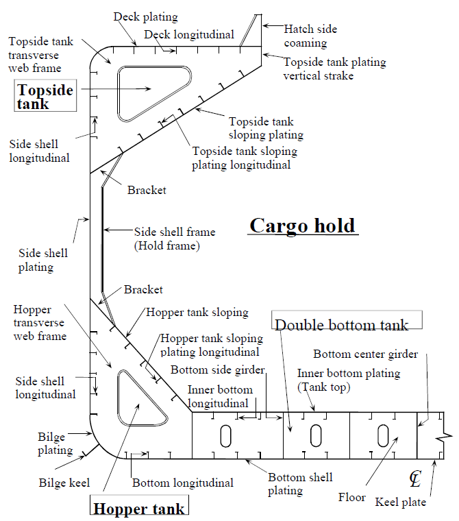
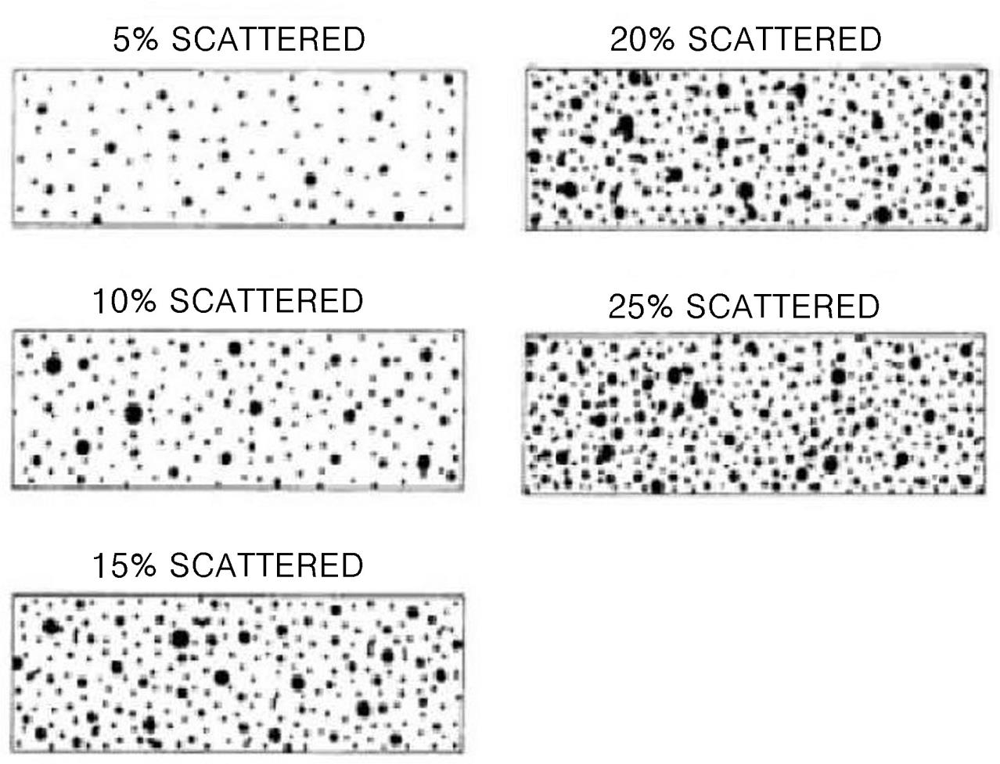
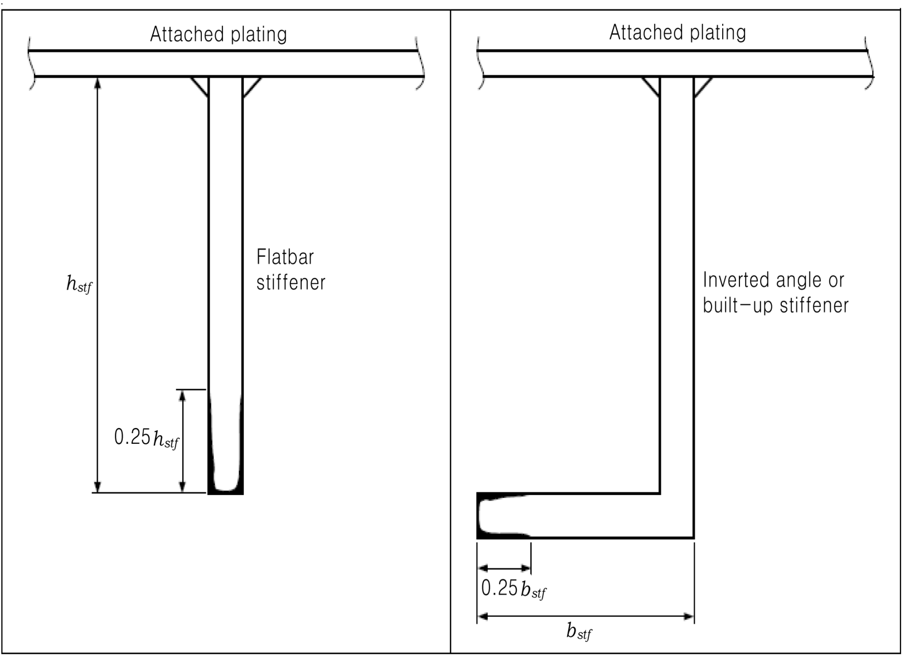
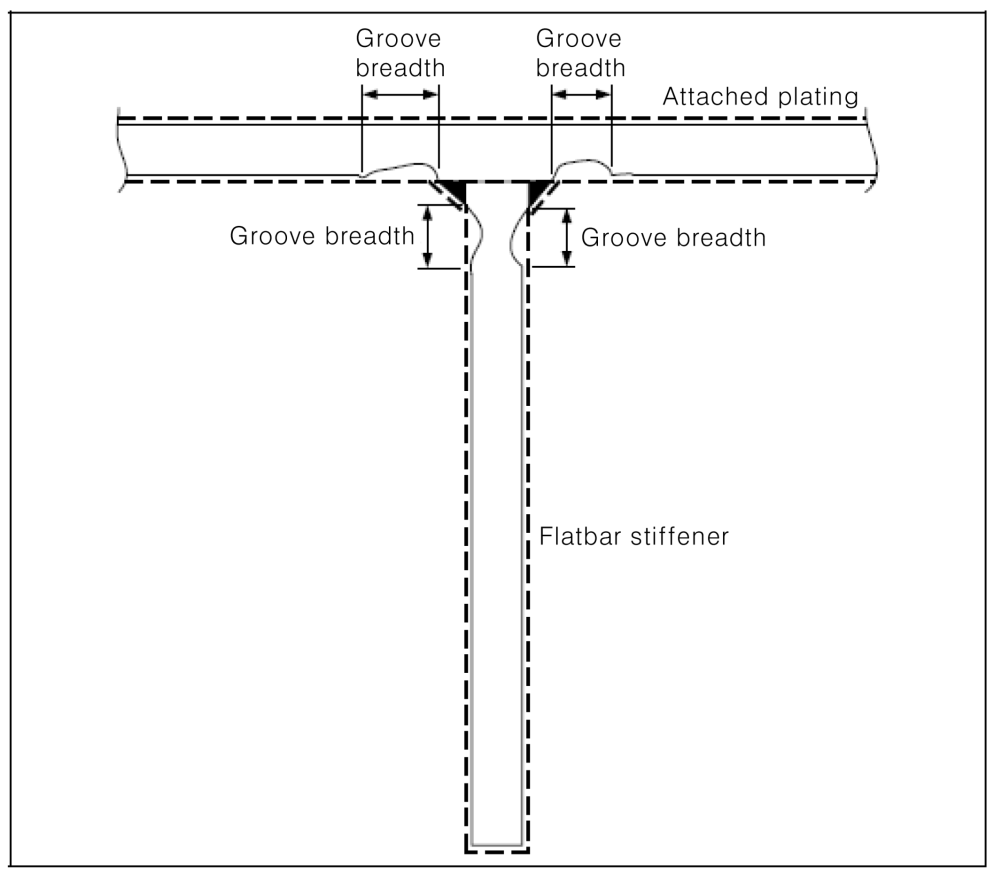
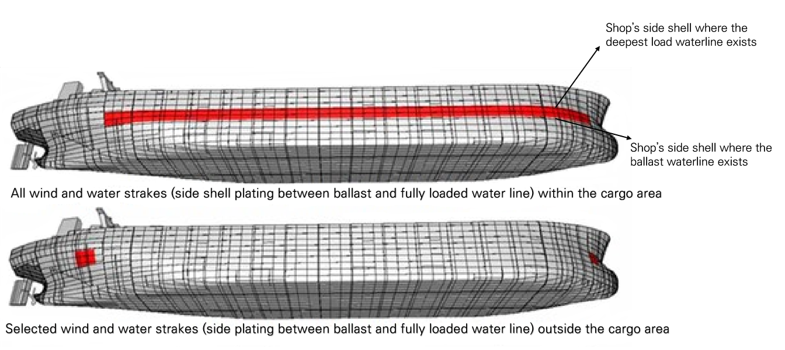
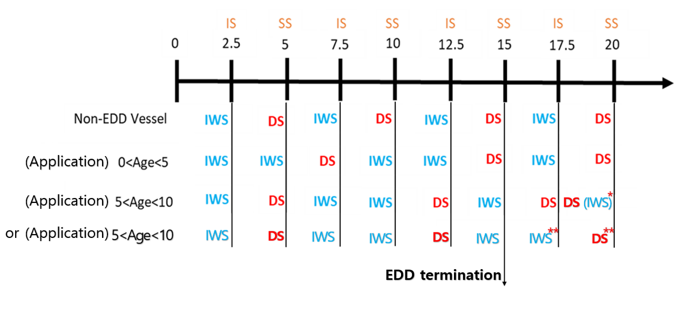

# PART 1 Classification and Surveys

> RULES FOR CLASSIFICATION OF STEEL SHIPS / RA-01-E / 2025 / EN / Rules

## CHAPTER 2 PERIODICAL AND OTHER SURVEYS

### Section 1 General

#### 101. Application (2023)

**Ch 2** and **Ch 3** apply to all self-propelled vessels, unless otherwise specified elsewhere.

#### 102. Definitions

The definitions of terms used in **Ch 2** and **Ch 3** are to be as specified in the followings, unless otherwise specified elsewhere.

- **1.** **Anniversary date** means the day and the month of each year which will correspond to the due date of the next Special Survey from the completion date of the initial Classification Survey or of the Special Survey.
- **2-1.** **B ulk carrier** means a ship which is constructed generally with single deck, double bottom, topside tanks and hopper side tanks in cargo spaces, and is intended primarily to carry dry cargo in bulk. Combination carriers are included. For single skin combination carriers additional requirements are specified in **Ch 3, Sec 3.** Ore and combination carriers are not covered by the IACS Common Structural Rules for Bulk Carriers(**Pt 11**). *(2020)*
- **2-2.** **Double Skin Bulk Carrier** is a ship which is constructed generally with single deck, double bottom, topside tank and hopper side tanks in cargo spaces, and is intended primarily to carry dry cargo in bulk, including such types as ore carriers and combination carriers, in which all cargo holds are bounded by a double-side skin (regardless of the width of the wing space).
  For combination carriers with longitudinal bulkheads additional requirements are specified in **Sec 3** or **Sec 5,** as applicable. Ore and combination carriers are not covered by the IACS Common Structural Rules for Bulk Carriers(**Pt 11**). *(2020)*
  (Common for **2-1** & **2-2**) The following ships are not covered by the IACS Common Structural Rules for Bulk Carriers and Oil Tankers(**Pt 13**).
  - Ore carriers
  - Combination carriers
  - Wood chip carriers
  - Cement, fly ash and sugar carriers provided that loading and unloading is not carried out by grabs heavier than 10 tons, power shovels and other means which may damage cargo hold structure
  - Ships with inner bottom construction adapted for self-unloading
- **2-3.** **Self-unloading bulk carrier means** a ship which is constructed generally with single deck, double bottom, hopper side tanks and topside tanks and with single or double side skin construction in cargo length area and intended to carry and self-unloading dry cargoes in bulk. For unloading cargoes, the ship is equipped with a conveyor system and is to be complied with the requirements of **Pt 7, Ch 3** of the Rules. *(2021)*
- **3-1.** **Oil tanker** means a ship which is constructed primarily to carry oil in bulk in cargo tanks forming an integral part of the ship's hull, including ship types such as combination carriers (Ore/Oil ships etc.) but ships carrying oil in independent tanks not part of the ship's hull, such as asphalt carriers, are excluded from the ships subject to the enhanced survey programme (ESP). *(2024)*
- **3-2.** **Double hull oil tanker** is a ship which is constructed primarily for the carriage of oil in bulk, which have the cargo tanks forming an integral part of the ship's hull and is protected by a double hull which extends for the entire length of the cargo area, consisting of double sides and double bottom spaces for the carriage of water ballast or void spaces. *(2024)*
- **4.** **Oil** means for the purpose of the Rules, means petroleum in any form including crude oil, fuel oil, sludge, oil refuse and refined products other than petrochemicals which are subject to the provisions of Annex II of MARPOL 73/78. *(2020)*
- **5.** **Chemical tanker** means a ship constructed or adapted and used for the carriage in bulk of any liquid product listed in **Pt 7, Ch 6, Sec 17.**
- **6.** **6**. **Tanker** means a ship as constructed or adapted for the carriage in bulk of liquid cargoes of an inflammable nature. Oil Tankers, Combination Carriers, Chemical Tanker and Liquefied Gas Carriers are included in this category. *(2022)*
- **7.** **7**. **General dray cargo ship** means carrying soild cargoes. For more details, refer to 1. (1) of **1501.** *(2022)*
- **8.** **Liquefied gas carrier** means a ship constructed or adapted and used for the carriage in bulk of any liquid product listed in **Pt 7, Ch 5, Sec 19.**
- **9.** **Ballast tank** is a tank that is being used primarily for salt water ballast.
  For Bulk Carriers and Double Skin Bulk Carriers subject to the requirements of **Ch 3, Sec 2 and Sec 6**, a **ballast tank** is a tank which is used primarily for salt water ballast, or, where applicable, a space which is used for both cargo and slat water ballast will be treated as a ballast tank when substantial corrosion has been found in that space. A Double Side Tank is to be considered as a separate tank even if it is in connection to either the topside tank or the hopper side tank.
  And For Oil Tankers, Chemical Tankers and Double Hull Oil Tankers subject to the requirements of **Ch 3, Sec 3, Sec 4 and Sec 5** respectively, a **ballast tank** is a tank which is used primarily for the carriage of salt water ballast. *(2023)*
- **10.** **Space** is a separate compartment including holds and tanks. For Bulk Carriers and Double Skin Bulk Carriers subject to the requirements of **Ch 3, Sec 2 and Sec 6**, **spaces** are separate compartments including holds, tanks, cofferdams and void spaces bounding cargo holds, decks and the outer hull. *(2020)*
- **11.** **Transverse section** includes all longitudinal members contributing to longitudinal hull girder strength, such as plating, longitudinals and girders at the deck, sides, bottom, inner bottom, hopper sloping, topside sloping and longitudinal bulkhead.
  For a transversely framed vessels, a **transverse section** includes adjacent frames and their end connections in way of transverse sections.
  An example of typical transverse section in way of cargo hold is shown **Fig 1.2.1** *(2020)*
  
  **Fig. 1.2.1 Typical transverse section in way of cargo hold (from IACS Rec. 76)**
- **12.** **Representative space/tank** is a space/tank which is expected to reflect the conditions of other spaces/tanks of similar type and service and with similar corrosion prevention systems. When selecting representative spaces/tanks, account is to be taken of the service and repair history on board and identifiable critical structural areas and/or suspect areas.
- **13.** **Suspect area** is a **“**location**”** showing substantial corrosion and/or is considered by the Surveyor **“**to be prone to rapid wastage**”**. *(2023)*
  Note : The term "location prone to rapid wastage" means one of the following cases among the location specified in **Annex 1-5, Table 2** of the Guidance:
  1) Area with standing bilge water
  2) Bulkheads facing fuel oil tanks being heated
- **14.** **Substantial corrosion** is an extent of corrosion such that assessment of corrosion pattern indicates a wastage in excess of 75 % of allowable margins, but within acceptable limits. For vessels built under the IACS Common Structural Rules(**Pt 11**, **Pt 12** or **Pt 13**), substantial corrosion is an extent of corrosion such that the assessment of the corrosion pattern indicates a measured thickness between $t_{ ren}$ + 0.5 $\mathrm{mm}$ and $t_{ ren}$.
  Renewal thickness($t_{ ren}$) is the minimum allowable thickness, in $\mathrm{mm}$, below which renewal of structural members is to be carried out.
- **15.** **Excessive Corrosion** means corrosion that exceeds the allowable limit, so that steel is to be renewed. *(2020)*
- **16.** **Extensive Area of Corrosion (Extensive corrosion)** means corrosion of hard and/or loose scale, including pitting, over 70% or more of the plating surface in question, accompanied by evidence of thinning. *(2020)*
- **17.** **Overall Survey** means a survey intended to report on the overall condition of the hull structure and determine the extent of additional Close-up Surveys.
- **18.** **Close-up Survey** means a survey where the details of structural components are within the close visual inspection range of the Surveyor, i.e. normally within reach of hand.
- **19.** **Corrosion prevention system**
  A corrosion prevention system is normally considered a full hard protective coating. Hard protective coating is usually to be epoxy coating or equivalent.
  Other coating systems, which are neither soft nor semi-hard coatings, may be considered acceptable as alternatives provided that they are applied and maintained in compliance with the manufacturer's specifications.
  Where soft coating means a coating that remains soft so that is wears off at low mechanical impact or when touched; often based on oil(vegetable or petroleum) or lanolin(sheep wool grease) and semi-hard coating means a coating that dries or converts in such a way that it stays flexible although hard enough to touch and walk upon.
- **20.** **Coating condition^1)** is defined as follows: *(2020)*
  - **(1)** **GOOD** condition with only minor spot rusting
  - **(2)** **FAIR** condition with local breakdown at edges of stiffeners and weld connections and/or light rusting over 20 % or more of areas under consideration, but less than as defined for POOR condition
  - **(3)** **POOR** condition with general breakdown of coating over 20 % or more, or hard scale at 10 % or more, of areas under consideration
    (Note) **^1)** : Reference is made to IACS Recommendation 87 – “Guidelines for Coating Maintenance & Repairs for Ballast Tanks and Combined Cargo/Ballast Tanks on Oil Tankers” *(2020)*
- **21.** **Prompt and thorough repair** is a permanent repair completed at the time of survey to the satisfaction of the Surveyor, therein removing the need for the imposition of any associated Condition of Class. *(2020)*
- **22.** **Enhanced survey programme** means, in addition to **Ch 2**, an enhanced survey method applied for hull structure and piping systems in way of cargo holds/tanks, pump rooms, cofferdams, pipe tunnels, void spaces within the cargo area and all ballast tanks in accordance with **Ch 3.**
  In addition, the related programme applies only to ships having integral tanks in the cargo area. And in accordance with Ch 3, 102. 1, the Owner in cooperation with the Society is to work out a specific survey programme prior to the commencement of related surveys.
  Additionally ships subject to the Korean Ship Safety Act is to be also complied with the requirements of **Sec 19, 1901**. *(2021)*
- **23.** **Critical structural area** is location which has been identified from calculations to require monitoring or from the service history of the subject ship or from similar ships or sister ships, if available, to be sensitive to cracking, buckling or corrosion which would impair the structural integrity of the ship.
- **24.** **Special consideration or specially considered** (in connection with Close-up Surveys and thickness measurements) means sufficient close-up inspection and thickness measurements are to be taken to confirm the actual average condition of the structure under the coating.
- **25.** **Air pipe head**
  Air pipe heads installed on the exposed decks are those extending above the freeboard deck or superstructure decks.
- **26-1.** **Cargo length area, ship carrying dry cargo ship** is that part of the ship which contains all cargo holds and adjacent areas including fuel tanks, cofferdams, ballast tanks pipe tunnels and void spaces. *(2020)*
- **26-2.** **Cargo area, ship carrying liquid cargo in bulk** is that part of the ship which contains cargo tanks, slop tanks and cargo/ballast pump-rooms, compressor room, cofferdams, ballast tanks and void spaces adjacent to cargo tanks and also deck areas throughout the entire length and breadth of the part of the ship over the above mentioned spaces. *(2020)*
- **27.** **General Corrosion(Overall Corrosion or Uniform Corrosion)** appears as a non-protective rust which can uniformly occur on tank internal surfaces that are uncoated, or where coating has totally deteriorated. The rust scale continues to break off, exposing fresh metal to corrosive attack. Thickness cannot be judged visually until excessive loss has occurred. An example of General corrosion is shown **Fig. 1.2.2** *(2020)*
  
  **Fig. 1.2.2 General corrosion (from IACS Rec. 76)**
- **28.** **Pitting corrosion** is defined as scattered corrosion spots/areas with local material reductions which are greater than the general corrosion in the surrounding area. Pitting intensity is defined in **Fig 1.2.3.** *(2020)*
  
  **Fig 1.2.3 Pitting intensity diagrams**
- **29.** **Edge corrosion** is defined as local corrosion at the free edges of plates, stiffeners, primary support members and around openings. An example of edge corrosion is shown in **Fig 1.2.4.** *(2020)*
  
  **Fig 1.2.4 Edge corrosion**
- **30.** **Grooving corrosion** is typically local material loss adjacent to weld joints along abutting stiffeners and at stiffener or plate butts or seams. An example of grooving corrosion is shown in **Fig 1.2.5.** *(2020)*
  
  **Fig 1.2.5 Grooving corrosion**
- **31.** **Length** ***(2017)***
  The length of ship (*L*) is the distance in metres on the load line from the fore side of the stem to the after side of the rudder post in case of a ship with rudder post, or to the axis of rudder stock in case of a ship without rudder post or stern post. L is not to be less than 96% and need not be grater than 97% of the extreme length on the load line. (i.e. length (L) as defined in **Pt 3, Ch 1, Sec. 102**)
- **32.** **Remote Inspection Techniques(RIT)** ***(2019)***
  Remote Inspection Technique is a means of survey that enables examination of any part of the structure without the need for direct physical access of the surveyor(refer to IACS Rec.42).
- **33.** **Remote Survey** ***(2023)***
  A “Remote Survey” is a process of verifying that a ship and its equipment are in compliance with the rules of the Classification Society where the verification is undertaken, or partially undertaken, without physical attendance on board the ship by a surveyor.
  **34. Combined cargo/ballast tank** is a tank which is used for the carriage of cargo or ballast water as a routine part of the vessel's operation and will be treated as a ballast tank. Cargo tanks in which water ballast might be carried only in exceptional cases per MARPOL Annex I, Ch 4, Reg. 18.3 are to be treated as cargo tanks. *(2020)*
- **35.** **Integral tanks** mean tanks that form a structural part of hull and influenced in the same manner by the loads that stress the adjacent hull structure. *(2020)*
- **36.** **Independent tanks** mean self-supporting tanks. They do not form part of the ship's hull and are not essential to the hull strength. *(2020)*
- **37.** **Membrane tanks** mean non-self-supporting tanks that consist of thin liquid and gastight layer (membrane) supported through insulation by the adjacent hull structure. *(2020)*
- **38.** **Semi-membrane tanks** mean non-self-supporting tanks in the loaded condition and consist of a layer, parts of which are supported through insulation by the adjacent hull structure. *(2020)*
- **39.** **Strength deck** means the deck at a part of ship's length is the uppermost deck at that part to which the shell plates extend.
  However, in way of superstructures, except sunken superstructures, not exceeding o.15L in length, the strength deck is the deck just below the superstructure deck. The deck just below the superstructure deck may be taken as the strength deck even in way of the superstructure exceeding 0.15l in length at the option of the designer. *(2020)*
- **40.** **Freeboard deck** means normally the uppermost continuous deck.
  However, in cases where openings without permanent closing means exist on the exposed part of the uppermost continuous deck or where openings without permanent watertight closing means exist on the side of the ship below that deck, the freeboard deck is the continuous deck below that deck. For non-ordinary features of the freeboard deck, refer to the **Pt 3 Ch 1, 114**. *(2020)*
- **41.** **Sheer Streak** means the top strake of a ship's side shell plating. *(2020)*
- **42.** **Superstructure** means a decked structure on the freeboard deck, extending from side to side of the ship or having its side walls at the position not farther than 0.04 Bffrom the side of ship. Raised quarter deck is to be considered as a superstructure. *(2020)*
- **43.** **Deckhouse** menas a decked structure on the freeboard or superstructure deck which does not comply with the definition of a superstructure. *(2020)*
- **44.** **Strake** means a course, or row, of shell, deck, bulkhead, or other plating. *(2020)*
- **45.** **Wind and Water Strakes** mean the strakes of a ship’s side shell between the ballast and the deepest load waterline. Generally the two(2) strakes located in the vicinity of the load waterline. Due to vessel’s trim, the strakes may vary over the length of the vessel. An example of wind and water strakes is shown **Fig 1.2.6** *(2020)*
  
  **Fig 1.2.6 Wind and Water Strakes (from the IACS Rec. 96)**
- **46.** **Turret mooring** is a mooring method that allows only ship's angular movement relative to the turret so that it may be weathervane. The turret is generally connected to the seabed using a spread mooring system. *(2020)*
- **47.** **Turret compartments** is those spaces and trunks that contain equipment and machinery for retrieval and release of the disconnectable turret mooring system, high-pressure hydraulic operating systems, fire protection arrangements and cargo transfer valves. *(2020)*

#### 103. Kinds of surveys

Periodical and other surveys to maintain the classification are divided as follows;

#### 104. Duplication of surveys

When heavier kind of survey is carried out at the due range or in advance of a periodical survey, the periodical survey may be dispensed with.

#### 105. Execution of heavier survey (2023)

At the periodical survey, any items **“**as specially considered necessary by the Surveyor**”** or specially requested by the Owner may be inspected to the standard of heavier periodical surveys.
Note : The term "as specially considered necessary by the Surveyor" means the cases as specified in **Ch 1, 801.** of the Guidance.

#### 106. Laid-up ships (2018)

- **1.** Where classed ships are laid-up and the ower notifies the Society of the fact, no normal periodical surveys are to be carried out during laid-up period.
- **2.** Laid-up survey at the beginning of laid-up are to be performed in accordance with **Annex 1-17** of the Guidance. *(2021)*
- **3.** In order to put the laid-up ship into service, the ship is to receive the re-commissioning survey in accordance with **Annex 1-17** of Guidance. *(2021)*
- **4.** If the Owner does not notify the Society of the laid-up of the ship or the surveys as required in this Article is not implemented, the classification may be suspended or withdrawn in accordance with **Ch 1, Sec 9, 901.**
- **5.** Laid-up attestation may be issued at the request of the Owner provided that the laid-up condition is in satisfactory after the laid-up survey with approved Laid-up Maintenance Program in accordance with **Annex 1-17** of the Guidance. *(2021)*

#### 107. Tests

- **1.** At the periodical survey, when the repair to the ship is likely to affect the ship's speed or safety, the speed trials and inclining experiment may be required.
- **2.** If “significant repairs” are carried out to main or auxiliary machinery or steering gear, consideration is to be given to a sea trial to attending Surveyor's satisfaction. *(2021)*
  Note : "significant repairs" means the repairs may affect on the ship’s speed or steering performance such as change of the main propulsion engine or the auxiliary engine, over 10% change of output of the main propulsion engine or the auxiliary engine, change of shape or main dimension of the propeller and change of the steering gear or steering capability.
- **3.** If the significant repairs as stated in **Par 2**, is considered by the Society to have any impact on response characteristics of the propulsion systems, then the scope of sea trial is to also include a test plan for astern response characteristics based on those required for such an equipment or systems when fitted to the new ship. Refer to **Pt 5 Ch 1 103. 5** for astern testing requirements.
  The tests are to demonstrate the satisfactory operation of the equipment or system under realistic service conditions at least over the maneuvering range of the propulsion plant, for both ahead and astern directions.
  Depending on the actual extent of the repair, the Society may accept a reduction of the test plan. *(2018)*

#### 108. Repairs

- **1.** When the Surveyor recommends the necessity of repairs in consequence of the surveys, he is to notify the applicant the reasons of his recommendations and the applicant after such notification must receive the supervision of the Surveyor during the repairs.
- **2.** Any damage in association with wastage over the allowable limits(including buckling, grooving, detachment or fracture), or extensive areas of wastage over the allowable limits, which “affects or, in the opinion of the Surveyor, will affect the vessel's structural, watertight or weathertight integrity”, is to be promptly and thoroughly repaired.
  Areas to be considered include and in this case, see **Annex 1-18** of the Guidance for more specific areas. *(2021)*
  - **(1)** side shell frames, their end attachments and adjacent shell plating
  - **(2)** deck structure and deck plating
  - **(3)** bottom structure and bottom plating
  - **(4)** watertight or oiltight bulkheads
  - **(5)** hatch cover and hatch coamings
  - **(6)** items in **202. 1** (1) (f), (g) and (6)
  - **(7)** for bulk carriers and double skin bulk carriers;
    - bottom structure and bottom plating
    - side structure and side plating
    - deck structure and deck plating
    - inner bottom structure and inner bottom plating
    - inner side structure and inner side plating
    - watertight or oil tight bulkheads
    - hatch covers and hatch coamings
    - bunker and vent piping system, including ventilators
  - **(8)** for oil tankers, chemical tankers and double hull oil tankers;
    - bottom structure and bottom plating
    - side structure and side plating
    - deck structure and deck plating
    - watertight or oiltight bulkheads
    - hatch covers or hatch coamings, where fitted
    Note : "affects or, in the opinion of the Surveyor, will affect the vessel's structural, watertight or weathertight integrity" means the case where the Surveyor considered that the vessel's intended voyages or services are not able to be achieved safely because of the damages in vessel's structure, including buckling, grooving, detachment or fracture, or the lose of vessel's watertight or weathertight integrity.
- **3.** For location where adequate repair facilities are not available, consideration may be given to allow the vessel to proceed directly to a repair facility. This may require discharging the cargo and/or temporary repairs for the intended voyage.
- **4.** Additionally, “when a survey results in the identification of structural defects or corrosion, either of which, in the opinion of the Surveyor, will impair the vessel's fitness for continued service”, remedial measures are to be implemented before the ship continues in service. *(2021)*
  Note : "when a survey results in the identification of structural defects or corrosion, either of which, in the opinion of the Surveyor, will impair the vessel's fitness for continued service" means the case where the Surveyor considered that the vessel's intended voyages or services are not able to be achieved safely because of defects or corrosion identified from the survey results.
- **5.** Where the damage found on structure mentioned in **Par 2** is isolated and of a localized nature which does not affect the ship's structural integrity(as for example a minor hole in a cross-deck strip), consideration may be given by the Surveyor to allow an appropriate temporary repair to restore watertight or weather tight integrity after evaluation of the surrounding structure and impose an associated Condition of Class in accordance with IACS PR No.35(Procedure for Imposing and Clearing Condition of Class), with a specific time limit in order to complete the permanent repair and retain classification. *(2020)*
- **6.** **Voyage repairs and maintenance**
  - **(1)** Where repairs to hull, machinery or equipment, which affect or may affect classification, are to be carried out by a riding crew during a voyage, they are to be planned in advance. A complete repair procedure including the extent of proposed repair and the need for Surveyor's attendance during the voyage is to be submitted to the Society in advance and the repair procedure is to be in accordance with the separate requirement specified by the Society.
    Where in any emergency circumstance, emergency repairs are to be effected immediately, the repairs should be documented in the ship's log and submitted thereafter to the Society for use in determining further survey requirements. *(2021)*
    Note : "emergency circumstance" means the circumstance which affect or may affect the ships maneuvering, survival, marine pollution or protection of the cargoes directly.
  - **(2)** The above is not intended to include maintenance and overhaul to hull, machinery and equipment in accordance with manufacturer's recommended procedures and established marine practice and which does not require the approval of the Society. However, any repairs as a result of such maintenance and overhauls which affects or may affect classification is to be noted in the ship's log and submitted to the attending Surveyor for use in determining further survey requirements.

#### 109. Wear limit on structural members (2021)

When the thickness of hull structural members or the scantlings of equipment, etc. exceed the wear limit, they have to be renewed with those having the original scantlings or the scantlings “considered suitable” by the Society. However, when the original scantlings were larger than the required ones, or when “deemed appropriate by the Society”, these requirements may be modified taking into account of the location, extent, kind of the wear.
Note : The terms "considered suitable" or "deemed appropriate by the Society" mean to comply with the requirements specified in the Classification Technical Rules such as **Pt 2** and **Pt 3** etc. of the Rules.

#### 110. Survey planning meeting and safety meetings (2018)

- **1.** The establishment of proper preparation and close co-operation between the attending Surveyor(s) and the Owner’s representatives onboard prior to and during the survey are an essential part in the safe and efficient conduct of the survey. During the survey on board safety meetings are to be held regularly.
- **2.** Prior to the commencement of any part of the Special, Intermediate and Annual Survey, a survey planning meeting is to be held between the attending Surveyor(s), the Owner's representative in attendance, the thickness measurement firm operator/other service suppliers(as applicable) and the master of the ship or an appropriately qualified representative appointed by the master or company for the purpose to ascertain that all the arrangements envisaged in the survey programme(ESP Vessel only) or regarding the related surveys are in place, so as to ensure the safe and efficient conduct of the survey work to be carried out. *(2021)*
  Note : "an appropriately qualified representative" means a ship's officer.
- **3.** The following is an indicative list of items that are to be addressed in the meeting.
  (D Survey progress scheme, survey requirement and if necessary, survey items attending stages are discussed

#### 111. Procedures for thickness measurements (2021) 【See Guidance】

- **1.** **1**. The required thickness measurements, if not carried out by the Society itself, are to be witnessed by a Surveyor. The Surveyor is to be on board to the extent necessary to control the process. In this case, the control of thickness measurement process is to be in accordance with **Annex 1-5** of the Guidance.
- **2.** Thickness measurement is normally to be carried out by means of ultrasonic test equipment. The accuracy of the equipment is to be proven to the Surveyor as required. Thickness measurements are to be carried out by a firm approved by the Society in accordance with **Guidance for Approval of Service Suppliers,** except that in respect of measurements on non-ESP ships less than 500 gross tonnage and all fishing vessels, the firm need not be so approved. *(2019)*
- **3.** **Thickness measurements and Close-up Surveys**
  In any kind of survey, i.e. Special, Intermediate, Annual or other Surveys having the scope of the foregoing ones, thickness measurements, when required by **Table 1.2.9**, **Table 1.2.11**, **Table 1.3.2**, **Table 1.3.5**, **Table 1.3.8**, **Table 1.3.11** or **Table 1.3.14** of structures in areas where Close-up Surveys are required shall be carried out simultaneously with Close-up Surveys. *(2019)*
  Consideration may be given by the attending Surveyor to allow use of Remote Inspection Techniques (RIT) as an alternative to close-up survey. Surveys conducted using a RIT are to be completed to the satisfaction of the attending Surveyor. *(2017)*
  When RIT is used for a close-up survey, temporary means of access for the corresponding thickness measurements as specified in **Table 1.2.9**, **Table 1.2.11**, **Table 1.3.2**, **Table 1.3.5**, **Table 1.3.8**, **Table 1.3.11** or **Table 1.3.14** is to be provided unless such RIT is also able to carry out the required thickness measurements. *(2019)*
  Where the ship has been constructed with FRP, aluminum alloy, stainless steel(except for clad steel plating) or other anti-corrosion materials, the thickness measurements for hull structure members and pipes may be dispensed with. *(2022)*
- **4.** In all cases the extent of the thickness measurements is to be sufficient as to represent the actual average condition.
- **5.** A thickness measurement report is to be prepared. The report is to give the location of measurements, the thickness measured as well as corresponding original thickness. Furthermore, the report is to give the date when the measurement was carried out, type of measuring equipment, names of personnel and their qualifications and has to be signed by the operator. The thickness measurement report is to follow the principles as specified in **Annex 1-5** of the Guidance.
- **6.** The Surveyor is to review the final thickness measurements report and countersign the cover page.

#### 112. Thickness measurements Acceptance Criteria (2024)

The acceptance criteria for thickness measurements are according to **Annex 1-5, Table 1** and/or specific IACS URs depending on ship’s age and structural elements concerned, e.g. UR S21(UR S21 Rev.6 applies for ships contracted for construction on or after 1 July 2024) or UR S21A(UR S21A applies for ships contracted for construction on or after 1 July 2012, Rev.1 of UR S21A applies for ships contracted for construction on or after 1 July 2016. UR S21A was withdrawn from 1 July 2024 and replaced by UR S21 Rev.6) for all cargo hatch covers and coamings on exposed decks

#### 113. Remote Inspection Techniques (RIT) (2019)

- **1.** **1**. The RIT is to provide the information normally obtained from a close-up survey. RIT surveys are to be carried out in accordance with the requirements given here-in, the requirements of IACS Recommendation 42 ‘Guidelines for Use of Remote Inspection Techniques for surveys’ and **Guidance for Remote Inspection Techniques**.
  These considerations are to be included in the proposals for use of a RIT which are to be submitted in advance of the survey so that satisfactory arrangements can be agreed with the Society. *(2021)*
- **2.** The equipment and procedure for observing and reporting the survey using a RIT are to be discussed and agreed with the parties involved prior to the RIT survey, and suitable time is to be allowed to set-up, calibrate and test all equipment beforehand.
- **3.** When using a RIT as an alternative to close-up survey, if not carried out by the Society itself, it is to be conducted by a firm approved as a service supplier according to **Guidance for Approval of Service Suppliers** and is to be witnessed by an attending surveyor of the Society.
- **4.** The structure to be examined using a RIT is to be sufficiently clean to permit meaningful examination. Visibility is to be sufficient to allow for a meaningful examination. The Society is to be satisfied with the methods of orientation on the structure.
- **5.** The Surveyor is to be satisfied with the method of data presentation including pictorial representation, and a good two-way communication between the Surveyor and RIT operator is to be provided.
- **6.** If the RIT reveals damage or deterioration that requires attention, the Surveyor may require traditional survey to be undertaken without the use of a RIT.

#### 114. In case of Dual Classed Vessel (2021)

- **1.** Each Society acts on behalf of the other Society in accordance with the bilateral agreement adopted by the two Societies. This agreement shall clearly define the scope of work of each Society. *(2021)*
- **2.** Each Society is to review whether the work undertaken by other Society on its behalf has been completed as agreed. *(2021)*
- **3.** The procedures for maintaining(periodical surveys etc.) dual classed vessel are prescribed in the separate Instruction.
- **4.** Even though a Dual Classed Vessel that does not have a written agreement with other Society is treated as Double Classed Vessel.

#### 115. Preparations for survey

- **1.** **Conditions for survey**
  - **(1)** The Owner is to provide the necessary facilities for a safe execution of the survey.
  - **(2)** Tanks and spaces are to be safe for access, i.e. safe measured such as gas freed, ventilated, and illuminated.
  - **(3)** In preparation for survey and thickness measurements and to allow for a thorough examination, all spaces are to be cleaned including removal from surfaces of all loose accumulated corrosion scale. Spaces are to be sufficiently clean and free from water, scale, dirt, oil residues etc. to reveal corrosion, deformation, fractures, damages, or other structural deterioration. However, those areas of structure whose renewal has already been decided by the Owner need only be cleaned and descaled to the extent necessary to determine the limits of the areas to be renewed.
  - **(4)** Sufficient illumination is to be provided to reveal corrosion, deformation, fractures, damages or other structural deterioration.
  - **(5)** Where soft or semi-hard coatings have been applied, safe access is to be provided for the Surveyor to verify the effectiveness of the coating and to carry out an assessment of the conditions of internal structures which may include spot removal of the coating. When safe access cannot be provided, the soft or semi-hard coating is to be removed.
  - **(6)** Casings, ceilings or linings, and loose insulation, where fitted, are to be removed, as required by the Surveyor, for examination of plating and framing. Compositions on plating are to be examined and sounded, but need not be disturbed if found adhering satisfactorily to the plating. *(2023)*
    Note :
    The Surveyor is to consider the following items and so on when require to remove casings, ceilings
    or linings, and loose insulation.
    A) where abnormality such as record or indication of abnormal deterioration, etc. is suspect
    B) where substantial corrosion, significant deformation, fracture, damage or other defect is evident or suspect
    C) where wastage is evident or suspect
    D) where considered to be prone to rapid wastage
  - **(7)** In refrigerated cargo spaces the condition of the coating behind the insulation is to be examined at representative locations. The examination may be limited to verification that the protective coating remains effective and that there are no visible structural defects. Where POOR coating condition is found, the examination is “to be extended as deemed necessary by the Surveyor”. The condition of the coating is to be reported. If indents, scratches, etc., are detected during surveys of shell plating from the outside, insulations in way are to be removed as required by the Surveyor, for further examination of the plating and adjacent frames. *(2023)*
    Note :
    A) The term "to be extended as deemed necessary by the Surveyor" means the extent of insulations to determine the extent of the poor coating condition behind the insulation.
    B) The Surveyor is to consider the following items and so on when require to remove casings, ceilings or linings, and loose insulation. *(2023)*
    a) where abnormality such as record or indication of abnormal deterioration, etc. is suspect
    b) where substantial corrosion, significant deformation, fracture, damage or other defect is evident or suspect
    c) where wastage is evident or suspect
    d) where considered to be prone to rapid wastage
- **2.** **Access to structures**
  - **(1)** For survey, means are to be provided to enable the Surveyor to examine the hull structure in a safe and practical way.
  - **(2)** For survey in cargo holds and ballast tanks, one or more of the following means for access, acceptable to the Surveyor, is to be provided:
    - **(A)** permanent staging and passages through structures
    - **(B)** temporary staging and passages through structures
    - **(C)** hydraulic arm vehicles such as conventional cherry pickers, lifts and movable platforms
    - **(D)** boats or rafts
    - **(E)** other equivalent means
  - **(3)** For Surveys conducted by use of a remote inspection technique, one or more of the following means for access, acceptable to the Surveyor, is to be provided: *(2019)*
    - **(A)** Unmanned robot arm
    - **(B)** Remotely Operated Vehicles(ROV)
    - **(C)** Unmanned Aerial Vehicles / Drones
    - **(D)** Other means acceptable to the Society.
- **3.** **Equipment for survey** ***(2023)***
  - **(1)** One or more of the following fracture detection procedures may be required if “deemed necessary by the Surveyor” :
    Note : The term"deemed necessary by the Surveyor" means the cases as specified in **Ch 1, 801. 2** of the Guidance.
    - **(A)** radiographic equipment
    - **(B)** ultrasonic equipment
    - **(C)** magnetic particle equipment
    - **(D)** dye penetrant
- **4.** **Survey**^1) **at sea or at anchorage** ***(2020)***
  - **(1)** Survey at sea or at anchorage may be accepted provided the Surveyor is given the necessary assistance from the personnel onboard. Necessary precautions and procedures for carrying out the survey are to be in accordance with **Par 1, Par 2** and **Par 3** above.
  - **(2)** A communication system is to be arranged between the survey party in the tank or space and the responsible officer on deck. This system is to also include the personnel in charge of ballast pump handling if boats or rafts are used.
  - **(3)** When boats or rafts are used, appropriate life jackets are to be available for all participants. Boats or rafts are to have satisfactory residual buoyancy and stability even if one chamber is ruptured. A safety check-list is to be provided.
  - **(4)** Surveys of tanks by means of boats or rafts may only be undertaken at the sole discretion of the Surveyor, who is to take into account the safety arrangements provided, including weather forecasting and ship response under foreseeable conditions. *(2023)*
    (Note) **^1)** : Reference is made to IACS Recommendation 39 – “Safe Use of Rafts or Boats for Survey” *(2020)*
    2) The term "at the sole discretion of the Surveyor" means the cases as specified in **Ch 3,**

#### 102. 6 (3) of the Rules. (2023)

#### 116. Special consideration for military vessels (2019)

Special consideration may be given in application of relevant sections of this chapter to commercial vessels owned or chartered by Governments, which are utilized in support of military operations or service.

#### 117. Internal examination for ballast tanks with semi-hard coating (2019)

As for the requirements regarding semi-hard coatings, these coatings, if already applied, will not be accepted form the next Special or Intermediate Survey commenced on or after 1 July 2010, whichever comes first, with respect to waving the annual internal examination of the ballast tanks.

### Section 2 Annual Survey

#### 201. Due range

- **1.** Annual Survey is to be carried out within 3 months before or after each anniversary date.
- **2.** Annual Survey may be carried out in advance even if it is not due, upon application by the Owner. However, if Annual Survey is carried out more than 3 months earlier than the anniversary date, the anniversary date will be newly assigned to the date of 3 months later than the date on which the survey was completed. *(2023)*
- **3.** A survey planning meeting is to be held prior to the commencement of the survey. *(2018)*

#### 202. Hull, equipment and fire-extinguishing appliances

- **1.** The survey is to consist of an examination for the purpose of ensuring, as far as practicable, that the hull, hatch covers, hatch coamings, closing appliances, equipment and related piping are maintained in a satisfactory condition.
  - **(1)** Examination of weather decks, ship side plating above waterline, hatch covers and coamings.
  - **(2)** Checking that no alterations have been made to the hull or superstructures that would affect the calculations determining the position of the load lines.
  - **(3)** Checking of the positions of the deck line and load line which, if necessary, are to be remarked and re-painted.
  - **(4)** Examining the means of securing the weathertightness of cargo hatchways, other hatchways and other openings on the freeboard and superstructure decks.
  - **(5)** Examining the watertight integrity of the closures to any openings in the ship's side below the freeboard deck.
  - **(6)** Examining the ventilators and air pipes, including their coamings and closing appliances.
  - **(7)** Examining the scuppers, inlets and discharges.
  - **(8)** Examining the garbage chutes.
  - **(9)** Examining the means provided to minimize water ingress through the spurling pipes and chain lockers.
  - **(10)** Examining the side scuttles and deadlights.
  - **(11)** Examining the bulwarks including the provision of freeing ports, special attention being given to any freeing ports fitted with shutters.
  - **(12)** Examining the guardrails, gangways, walkways and other means provided for the protection of the crew and for gaining access to and from crew's quarters and working spaces.
  - **(13)** Checking, when applicable, the fittings and appliances for timber cargoes on deck.
  - **(14)**
    - **(A)** Confirming that the drainage from enclosed cargo spaces situated on the freeboard deck is satisfactory.
    - **(B)** Examining visually the drainage facilities for blockage or other damage and confirming the provision of means to prevent blockage of drainage arrangements, for closed vehicle and ro-ro spaces and special category spaces where fixed pressure water-spraying systems are used (SOLAS 08, Reg.II-2/20.6.1.5).
  - **(15)** Examining engine room and boiler room including exposed engine casings and their openings, engine room skylights, ventilator openings and their closing appliances.
  - **(16)** Examining flush scuttles and manhole covers.
  - **(17)** General condition of outside of the hull above the water line including weather deck and the arrangement for drainage, mooring and anchoring(including the hull structures in the vicinity of the fittings) are to be examined so far as could be seen.
    For ships built after 1 January 2007 subject to the *International Convention for the Safety of Life at Sea(SOLAS)*, confirming that the towing and mooring equipment is clearly and properly marked with any restriction associated with its safe operation.
  - **(18)** Examining the superstructure end bulkheads, and examining the collision and the other watertight bulkheads as far as can be seen.
  - **(19)** Examining and testing(locally and remotely) all the watertight doors in watertight bulkheads.
  - **(20)** Examining penetrations and stop valves on watertight bulkheads and closing appliances of openings on superstructure end bulkheads. If “considered necessary by the Surveyor”, performance test for closing appliances of openings on superstructure end bulkheads is to be carried out. *(2023)*
    Note : The term "considered necessary by the Surveyor" means the cases as specified in **Ch 1, 801. 6** of the Guidance.
  - **(21)** Examining, when applicable, the special requirements for ships permitted to sail with reduced freeboard.
  - **(22)** Checking the ballasting arrangements (SOLAS 74/06/17 Reg.II-1/20) *(2023)*
  - **(23)** Examining each bilge pump and confirming that the bilge pumping system for each watertight compartment is satisfactory.
  - **(24)** Confirming, when appropriate and as far as is practicable when examining internal spaces on oil tankers and bulk carriers, that the means of access to cargo and other spaces remain in good condition (SOLAS 74/00/02, Reg.II-1/3-6).
  - **(25)** Examining the functionality of bilge well alarms to all cargo holds and conveyor tunnels
    (SOLAS 74/97/04, Reg.XII/9).
  - **(26)** For bulk carriers, examining the hold, ballast and dry space water level detectors and their audible and visual alarms (SOLAS 74/02, Reg.XII/12).
  - **(27)** For bulk carriers, checking the arrangements for availability of draining and pumping systems forward of the collision bulkhead (SOLAS 74/02, Reg.XII/13).
  - **(28)** For container ships equipped with container securing arrangements in accordance with **Pt 7, Ch 4, 1003.** of the Rules, the container securing arrangements are to be examined as follows:
  - **(29)** For container ships provided with container lashing calculation program and instrument approved by the Society in accordance with the requirements of **Guidance Pt 7, Annex 7-2** and assigned "CL" as Special Feature Notations, it is to be confirmed that the container lashing calculation program and the instrument having the performance and functions as deemed appropriate by the Society is installed on board. *(2023)*
  - **(30)** For ships provided with a loading instrument on longitudinal strength in accordance with the requirements of **Pt 3, Ch 3, 104.,** the fallowing items are to be confirmed. *(2025)*
    - **(A)** It is to be checked that the approved loading manual is available onboard.
    - **(B)** The loading instrument is to be checked for accuracy at regular intervals by the ship's master by applying test loading conditions.
  - **(31)** For ships provided with a loading instrument on stability in accordance with the requirements of **Ch 1, 307.,** the following items are to be confirmed. *(2025)*
    - **(A)** It is the responsibility of the ship’s master to check the accuracy of the onboard computer for stability calculations by applying at least one approved test condition. If a Surveyor is not present for the computer check, a copy of the test condition results obtained by the computer check is to be retained on board as documentation of satisfactory testing for the Surveyor’s verification.
    - **(B)** The testing procedure shall be carried out in accordance with **Annex 1-10** Loading Instrument on Stability, 3. (9).
  - **(32)** Documentations on board including the stability data, etc. approved by the Society are to be confirmed to be kept on board.
  - **(33)** Examining the fire protection arrangements in cargo, vehicle and ro-ro spaces, including fire safety arrangements in accordance with **Pt 8, Ch 13, Sec 6** of the Rules for vehicle carriers carrying motor vehicles with compressed hydrogen or natural gas in their tanks for their own propulsion as cargo, as applicable, and confirming, as far as practicable and as appropriate, the operation of the means of control provided for closing the various openings *(2020)*
  - **(34)** Suspect areas *(2017)*
    Suspect areas identified at previous surveys are to be examined. Thickness measurements are to be taken of the areas of substantial corrosion and the extent of thickness measurements is to be increased to determine the extent of areas of substantial corrosion. **Table 1.2.5** may be used as guidance for these additional thickness measurements. These extended thickness measurements are to be carried out before the Annual Survey is credited as completed.
    However, the substantial corrosion areas identified on bulk carriers built under IACS Common Structural Rules(**Pt 11** or **Pt 13**) are to be in accordance with **Ch 3, 202. 5, 203. 4** (c), **204. 5** (2) in case of single skin bulk carriers or **Ch 3, 602. 5, 603. 4** (c), **604. 5** (2) in case of double skin bulk carriers.
    Note : These requirements are not applicable to cargo tanks of oil tankers, chemical tankers and double hull oil tankers, surveyed in accordance with **Ch 3, Sec 3, Sec 4** and **Sec 5.**
  - **(35)** Examination of ballast tanks *(2023)*
    Examination of ballast tank when required as a consequence of the results of the Special Survey and Intermediate Survey is to be carried out. When “considered necessary by the Surveyor”, or where extensive corrosion exists, thickness measurement is to be carried out.
    If the results of these thickness measurements indicate that substantial corrosion is found, then the extent of thickness measurements is to be increase to determine the extent of areas of substantial corrosion. **Table 1.2.5** may be used as guidance for these additional thickness measurements. These extended thickness measurements are to be carried out before the Annual Survey is credited as completed.
    Note : The term "considered necessary by the Surveyor" means the cases as specified in **Ch 1, 801. 3** of the Guidance.
  - **(36)** Examining, for bulk carriers of 150 $\mathrm{m}$ and above, where applicable, the ship's structure in accordance with the Ship Construction File, taking into account identified areas that need special attention, verifying that the Ship Construction File is updated, where applicable. (SOLAS 10, Reg.II-1/3-10 and MSC.287(87)). *(2024)*
  - **(37)** Surveys of Watertight Cable Transits *(2021)*
    - **(A)** Watertight cable transits are to be installed and maintained in accordance with the manufacturer’s requirements and in accordance with the requirements of the relevant Type Approval certification.
    - **(B)** The owner is to maintain the Register to record any disruption (repair, modification or opening out and closing) to a cable transit or to record the installation of a new cable transit.
    - **(C)** Cable transits have been installed, and where disrupted have been reinstated, in accordance with the manufacturer’s requirements and in accordance with the requirements of Type Approval.
    - **(D)** Where specified, appropriate specialized tools have been used.
    - **(E)** The Register is to be reviewed to confirm it is being maintained and as far as practicable the transits are to be examined to confirm their satisfactory condition.
    - **(F)** Where there are records entered since the last annual survey of any disruption to the cable transits or installation of new cable transits, the satisfactory condition of those transits is to be confirmed by review of records and, if deemed necessary, by examination. The results are to be recorded in the Register against the specific cable transit.
  - **(38)** Any penetration used for the passage of heat-sensitive piping systems through a watertight bulkhead or deck on a passenger ship *(2024)*
    - **(A)** Watertight piping penetrations are to be installed and maintained in accordance with the manufacturer’s requirements and in accordance with the requirements of the relevant Type Approval certification.
    - **(B)** Watertight piping penetrations have been installed, and where disrupted have been reinstated, in accordance with the manufacturer’s requirements and in accordance with the requirements of Type Approval.
  - **(39)** For ships provided with the equipment employed in the mooring of ships at single point mooring specified in **Pt 4, Ch 10, 101. 7** and assigned the additional class notation "EQ-SPM", the general function and deformation condition of this equipment employed in the mooring of ships at single point mooring and hull supporting structures are to be checked. *(2017)*
- **2.** For fire-extinguishing appliances, the survey is to be in accordance with the Guidance relating to the Rules. **【See Guidance】**
- **3.** For ships subject to the enhanced survey programme such as **bulk carriers, oil tankers** and **chemical tankers**, etc., in addition to items of **Par 1** through **Par 2**, the additional requirements in accordance with **Ch 3** are to be taken. However, if the duplicated survey items are exist, these are not to be applied twice.
- **4.** For additional requirements applicable to water level detectors fitted on single hold cargo ships, refer **Sec 15**.
- **5.** In addition to **Par 1** through **Par 2, Ch 15** is also to be taken for general dry cargo ships and **Ch 16** is also to be taken for liquefied gas carriers. However, if the duplicated survey items are exist, these are not to be applied twice.
- **6.** In addition to **Par 1** through **Par 2, Ch 17** is also to be taken for shell and inner doors, etc. of RoRo ships. However, if the duplicated survey items are exist, these are not to be applied twice.
- **7.** In addition to **Par 1** through **Par 2**, relevant requirements of **Ch 18** and/or **Ch 19** are also to be taken if applicable.

#### 203. Machinery, electrical installations and additional installations

- **1.** Confirming that the machinery, boilers and other pressure vessels, associated piping systems and fittings are installed and protected so as to reduce to a minimum any danger to persons on board, due regard being given to moving parts, hot surfaces and other hazards.
- **2.** Confirming that the normal operation of the propulsion machinery can be sustained or restored even though one of the essential auxiliaries becomes inoperative.
- **3.** Confirming that means are provided so that the machinery can be brought into operation from the dead ship condition without external aid.
- **4.** Carrying out a general examination of the machinery, the boilers, all steam, hydraulic, pneumatic and other systems and their associated fittings to see whether they are being properly maintained and with particular attention to the fire and explosion hazards.
- **5.** Examining and testing the operation of main and auxiliary steering arrangements, including their associated equipment and control system.
- **6.** Confirming that the means of communication between the navigating bridge and the steering gear compartment and the means of indicating the angular position of the rudder are operating satisfactorily.
- **7.** Confirming that with ships having emergency steering positions there are means of relaying heading information and, when appropriate, supply visual compass reading to the emergency steering position.
- **8.** Confirming that various alarms required for hydraulic power-operated, electric and electro-hydraulic steering gears are operating satisfactorily and that the re-charging arrangements for hydraulic power-operated steering gears are being maintained.
- **9.** Examining the means for the operation of the main and auxiliary machinery essential for propulsion and the safety of the ship, including, when applicable, the means of remotely controlling the propulsion machinery from the navigating bridge(including the control, monitoring, reporting, alert and safety actions) and the arrangements to operate the main and other machinery from a machinery control room.
- **10.** Confirming the operation of the ventilation for the machinery spaces.
- **11.** Confirming that the engine room telegraph, the second means of communication between the navigating bridge and the machinery space and the means of communication with any other positions from which the engines are controlled are operating satisfactorily.
- **12.** Confirming that the engineer's alarm is clearly audible in the engineer's accommodation.
- **13.** Examining, as far as practicable, visually and in operation, the electrical installations, including the main source of power and the lighting systems.
- **14.** Confirming, as far as practicable, the operation of the emergency sources of electrical power including their staring arrangements, the systems supplied and, when appropriate, their automatic operation.
- **15.** Examining, in general, that the precautions provided against shock, fire and other hazards of electrical origin are being maintained.
- **16.** Examining, where applicable, the alternative design and arrangements for machinery or electrical installations, or fire safety, in accordance with the test, inspection and maintenance requirements, if any, specified in the approved documentation.
- **17.** Confirming, as far as practicable, that no changes have been made in the structural fire protection, examining any manual and automatic fire doors and proving their operation, testing the means of closing the main inlets and outlets of all ventilation systems and testing the means of stopping power ventilation systems from outside the space served.
- **18.** Confirming that the means of escape from accommodation, machinery and other spaces are satisfactory.
- **19.** Examining the arrangements for gaseous fuel for domestic purpose.
- **20.** Examining visually the condition of any expansion joints in sea water systems.
- **21.** External survey of boilers and thermal oil heaters including test of safety and protective devices, and test of safety valve using its relieving gear, is to be carried out. For exhaust gas economizers, the safety valves are to be tested by the Chief Engineer at sea within the Annual Survey. This test is to be recorded in the log book for review by the attending Surveyor prior to crediting the Annual Survey.
- **22.** Examination for the pressure relief devices of the refrigerating machinery given in **Pt 5, Ch 6, Sec 12** is to be carried out. Where the test results done by ship's crew are considered satisfactory by the Surveyor, the test may be dispensed with. **【See Guidance】**
- **23.** The surveys for water jet propulsion systems and azimuth or rotatable thruster are to be carried out in accordance with the **Annex 1-9** of the Guidance. *(2021)*
- **24.** The surveys for additional installations(cargo refrigerating installations, cargo handling appliances, automation and remote control systems, dynamic positioning system, navigation bridge systems, hull monitoring systems, diving system, high voltage shore connection systems, cargo vapour emission control systems and ballast water management, etc.) are to be carried out in accordance with the requirements specified in Pt 9, etc.
- **25.** Gas-fuelled ships other than ships carrying liquefied gases in bulk and ships carrying CNG in bulk are also to meet with the requirements in **Ch 4, 301. of the Rules/Guidance for the Classification of Ships Using Low-flashpoint Fuels**, in addition to the requirements in this section.
- **26.** Where considered necessary by the Surveyor, opening up examination of the above items may be requested. **【See Guidance】**
- **27.** Where harmonic filters are installed on main busbars of electrical distribution system, other than those installed for single application frequency drives such as pump motors, confirming the measurement records for harmonic distortion levels experienced on the main busbar. *(2020)* **【See Guidance】**
- **28.** The Surveys for Exhaust gas emission abatement system(SCR, EGR & EGCS) are to be carried out in accordance with **Guidance for Prevention System of Pollution from Ships** *(2022)*
- **29.** In addition to **Par 1** through **Par 28** relevant requirements of **Ch 19** are also to be taken if applicable. *(2021)*
- **30.** For the survey for towing winch emergency release system which is specified in **Pt 7, Ch 9, Sec 8,** the following requirements are to be complied with. *(2021)*
  - **(1)** Operation of the towing winch emergency release system is to be confirmed with the reference to the documented instructions for surveys provided by the manufacturer. Operation of the winch emergency release system under no load condition is to be verified. Where practical, activation of the emergency release system may be confirmed by observation of the winch brake.
  - **(2)** The function of the alarms associated with the emergency release system is to be verified, as far as practicable and reasonable.
  - **(3)** The condition of the emergency release system is to be visually examined to confirm it remains in satisfactory condition.
  - **(4)** The means of emergency release of the towline in the event of a blackout is to be examined, and where additional sources of energy are arranged for this purpose, the sources of energy are to be visually inspected and operationally tested.
  - **(5)** It is to be verified that the performance capabilities and operating instructions of the emergency release system are documented and made available on board the ship on which the winch has been installed.

#### 204. Additional requirements to ship types

- **1.** **Oil tankers(including tankers) :** ***(2023)***
  The additional requirements are to apply to Annual Survey as follows, as far as practicable. Where “considered necessary by the Surveyor”, the performance test and overhauling may be required.
  Note : The term "considered necessary by the Surveyor" means the cases as specified in **Ch 1, 801. 6** of the Guidance.
  - **(1)** Checking the deck foam system, including the supplies of foam concentrate and testing that the minimum required number of jets of water at the required pressure in the fire main is obtained when the system is in operation.
  - **(2)** Examining the inert gas system, and in particular:
    Note : The term "where necessary" means the cases as specified in **Ch 1, 801. 6** of the Guidance.
    - **(A)** Examining externally for any sign of gas or effluent leakage.
    - **(B)** Confirming the proper operation of both inert gas blowers.
    - **(C)** Observing the operation of the scrubber room ventilation system.
    - **(D)** Non-return devices as the followings; *(2020)*
      - **(a)** examining externally deck seals and checking the deck seal for automatic filling and draining, and the arrangements for protecting the system against freezing;
      - **(b)** where a double block and bleed valve is installed, checking the automatic operations of the block and the bleed valves upon loss of power;
      - **(c)** where two shut-off valves in series with a venting valve in between are used as non-return devices, checking the automatic operation of the venting valve, and the alarm for faulty operation of the valves;
    - **(E)** Examining the operation of all remotely operated or automatically controlled valves and, inparticular, the flue gas isolating valves.
    - **(F)** Observing a test of the interlocking feature of soot blowers.
    - **(G)** Observing that the gas pressure regulating valve automatically closes when the inert gas blowers are secured.
    - **(H)** Checking, as far as practicable, the following alarms and safety devices of the inert gas system using simulated condition **“**where necessary”. *(2023)*
      - **(a)** high oxygen content of gas in the inert gas main.
      - **(b)** low gas pressure in the inert gas main.
      - **(c)** low pressure in the supply to the deck water seal.
      - **(d)** high temperature of gas in the inert gas main.
      - **(e)** low water pressure or low water-flow rate.
      - **(f)** accuracy of portable and fixed oxygen-measuring equipment by means of calibration gas.
      - **(g)** high water level in the scrubber.
      - **(h)** failure of the inert gas blower.
      - **(i)** failure of the power supply to the automatic control system for the gas regulating valve and to the instrumentation for continuous indication and permanent recording of pressure and oxygen content in the inert gas main.
      - **(j)** high pressure of gas in the inert gas main.
    - **(I)** Checking the means for separating the cargo tank not being inerted from the inert gas main; *(2020)*
    - **(J)** Checking the alarms of the two oxygen sensors positioned in the space or spaces containing the inert gas system; *(2020)*
  - **(3)** Checking, when practicable, the proper operation of the inert gas system on completion of the checks listed above. And then the inert gas systems using stored carbon dioxide, oil fuel combustion type systems, etc. except those using flue gases, are to be tested to ascertain that they are in good working order.
  - **(4)** Examining the fixed fire-fighting system for cargo pump rooms, and confirming, as far as practicable, the operation of the remote means for closing the various openings.
  - **(5)** Checking for all tankers, the provision of at least one portable instrument for measuring oxygen and one for measuring flammable vapour concentrations, together with a sufficient set of spares, and suitable means for the calibration of these instruments. (SOLAS 10 Reg.II-2/4.5.7.1)
  - **(6)** Examining the arrangements for gas measurement in double-hull spaces and double bottom spaces, including the fitting of permanent gas sampling lines, where appropriate.
    (SOLAS 10 Reg.II-2/4.5.7.2)
  - **(7)** Examining, as far as possible, and testing the fixed hydrocarbon gas detection system in double-hull and double-bottom spaces. (SOLAS 10 Reg.II-2/4.5.7.3 and FSSC Ch.16) *(2022)*
  - **(8)** Checking protection of cargo pump room and in particular:
    - **(A)** Checking temperature sensing devices for bulkhead gland and alarms.
    - **(B)** Checking interlock between lighting and ventilation.
    - **(C)** Checking gas detection system.
    - **(D)** Checking bilge level monitoring devices and alarms.
  - **(9)** Confirming, when appropriate, that the requisite arrangements to regain steering capability in the event of the prescribed single failure are being maintained.
  - **(10)** Examining the cargo tank openings, including gaskets, covers, coamings and screens.
  - **(11)** Examining the cargo tank pressure/vacuum valves and devices to prevent the passage of flame.
  - **(12)** Examining the devices to prevent the passage of flame on vents to all bunker, oily-ballast and oily-slop tanks and void spaces, as far as practicable. *(2024)*
  - **(13)** Examining the cargo tank venting, cargo tank purging and gas-freeing and other ventilation systems.
  - **(14)** Examining the cargo, crude oil washing, ballast and stripping systems both on deck and in the cargo pump-rooms and the bunker system on deck.
  - **(15)** Confirming that all electrical equipment in dangerous zones is suitable for such locations, is in good condition and is being properly maintained.
  - **(16)** Confirming that potential sources of ignition in or near the cargo pump-room are eliminated, such as loose gear, combustible materials, etc., that there are no signs of undue leakage and that access ladders are in good condition.
  - **(17)** Examining all pump-room bulkheads for signs of oil leakage or fractures and, in particular, the sealing arrangements of all penetrations of cargo pump-room bulkheads.
  - **(18)** Examining, as far as practicable, the cargo, bilge, ballast and stripping pumps for undue gland seal leakage. Verifying the proper operation of electrical and mechanical remote operating and shutdown devices and operation of cargo pump-room bilge system, and checking that pump foundations are intact.
  - **(19)** Confirming that the pump-room ventilation system is operational, ducting is intact, dampers are operational and screens are clean.
  - **(20)** Verifying that installed pressure gauges on cargo discharge lines and level indicator systems are operational.
  - **(21)** Examining access to bow arrangement.
  - **(22)** Examining the towing arrangement for tankers of not less than 20,000 tonnes deadweight.
  - **(23)** Examining the emergency lighting in all cargo pump rooms of tanker constructed after 1 July 2002.
  - **(24)** Check that cargo tanks, process plant and piping systems specified in Pt 7, Ch1, 1104. are electrically bonded and connected to the hull of the ships by visual inspection. *(2024)*
  - **(25)** Confirming that the corrosion prevention system fitted to dedicated ballast water tanks when appropriate is maintained. (SOLAS 74/00 Reg.II-1/3-2)
  - **(26)** Confirming that the coating system in cargo oil tanks of crude oil tankers, when appropriate, is maintained and that in-service maintenance and repair activities are recorded in the coating technical file.
  - **(27)** Examining, for oil tankers of 150 m in length and above, where appropriate, the ship's structure in accordance with the Ship Construction File, taking into account identified areas that need special attention, verifying that the Ship Construction File is updated, where applicable. (SOLAS 10, Reg.II-1/3-10 and MSC.287(87)). *(2024)*
- **2.** **Chemical tankers** ***(2023)***
  The additional requirements are to apply to Annual Survey as follows, as far as practicable. Where “considered necessary by the Surveyor”, the performance test and overhauling may be required.
  Note : The term "considered necessary by the Surveyor" means the cases as specified in **Ch 1, 801. 6** of the Guidance.
  - **(1)** Confirming, when appropriate, that the requisite arrangements to regain steering capability in the event of the prescribed single failure are being maintained.
  - **(2)** Examining the cargo tank openings, including gaskets, covers, coamings and screens.
  - **(3)** Examining the cargo tank pressure/vacuum valves and devices to prevent the passage of flame.
  - **(4)** Examining the devices to prevent the passage of flame on vents to all bunker, oily-ballast and oily-slop tanks and void spaces, as far as practicable. *(2024)*
  - **(5)** Examining the cargo tank venting, cargo tank purging and gas-freeing and other ventilation systems.
  - **(6)** Examining the cargo, tank cleaning, ballast and stripping systems both on deck and in the cargo pump-rooms and the bunker system on deck.
  - **(7)** Examining, as far as practicable, the cargo, bilge, ballast and stripping pumps for undue gland seal leakage. Verification of the proper operation of electrical and mechanical remote operating and shutdown devices and operation of cargo pump-room bilge system, and checking that pump foundations are intact.
  - **(8)** Confirming that the pump-room ventilation system is operational, ducting is intact, dampers are operational and screens are clean.
  - **(9)** Verifying that installed pressure gauges on cargo discharge lines and level indicator systems are operational.
  - **(10)** Confirming that wheelhouse doors and windows, sidescuttles and windows in superstructure and deckhouse ends facing the cargo area are in a satisfactory condition.
  - **(11)** Confirming that potential sources of ignition in or near the cargo pump-room are eliminated, such as loose gear, combustible materials, etc., that there are no signs of undue leakage and that access ladders are in good condition.
  - **(12)** Confirming that removable pipe lengths or other approved equipment necessary for cargo separation are available in the pump room and are in a satisfactory condition.
  - **(13)** Examining all pump room bulkhead for signs of cargo leakage or fractures and, in particular, the sealing arrangements of all penetrations of pump room bulkheads.
  - **(14)** Confirming that the remote operation of cargo pump bilge system is satisfactory.
  - **(15)** Examining the bilge and ballast arrangements and confirming that pumps and pipelines are identified.
  - **(16)** Confirming, when applicable, that the bow or stern loading and unloading arrangements are in order and testing the means of communication and the remote shut down for the cargo pumps.
  - **(17)** Examining the cargo transfer arrangements and confirming that any hoses are suitable for their intended purpose and, where appropriate, type-approved or marked with date of testing.
  - **(18)** Examining, as far as practicable, the cargo heating or cooling systems, including any sampling arrangements, and confirming that the means for measuring the temperature and associated alarms are operating satisfactorily.
  - **(19)** Examining, as far as practicable, the cargo tank vent systems, including the pressure/vacuum valves and secondary means to prevent over or under pressure and flame screens and the arrangements of cargo tank purging with inert gas, as applicable. *(2020)*
  - **(20)** Examining the gauging devices, high-level alarms and valves associated with overflow control.
  - **(21)** Confirming that arrangements for sufficient gas to be carried or generated to compensate for normal losses and that the means provided for monitoring ullage spaces are satisfactory.
  - **(22)** Confirming that arrangements are made for sufficient medium to be carried where drying agents are used on air inlets to cargo tanks.
  - **(23)** Confirming that all electrical equipment in dangerous zones is suitable for such locations, is in satisfactory condition and has been properly maintained.
  - **(24)** Examining the fixed fire-fighting system for the cargo pump room and the deck foam system for the cargo area and confirming that their means of operation are clearly marked.
  - **(25)** Confirming that the condition of the portable fire extinguishing equipment for the cargoes to be carried in the cargo area is satisfactory.
  - **(26)** Examining, as far as practicable, and confirming the satisfactory operation of, the arrangements for the ventilation of spaces normally entered during cargo handling operations and other spaces in the cargo area.
  - **(27)** Examining, as far as practicable, that the intrinsically safe systems and circuits used for measurement, monitoring, control and communication purposes in all hazardous locations are being properly maintained.
  - **(28)** Examining the equipment for personal protection and in particular that:
    - **(A)** the protective clothing for crew engaged in loading and discharging operation and its stowage is in a satisfactory condition;
    - **(B)** the required safety equipment and associated breathing apparatus and associated air supplies and, when appropriate, emergency-escape respiratory and eye protection are in a satisfactory condition and are properly stowed;
    - **(C)** medical first-aid equipment, including stretchers and oxygen resuscitation equipment are in a satisfactory condition;
    - **(D)** arrangements have been made for the antidotes for the cargoes actually carried to be on board;
    - **(E)** decontamination arrangements and eyewashes are operational;
    - **(F)** the required gas detection instruction are on board and that arrangements have been made for the supply of the appropriate vapour detection tubes;
    - **(G)** the arrangements for the stowage of cargo samples are satisfactory;
  - **(29)** Confirming that the system for continuous monitoring of the concentration of flammable vapours is satisfactory. And, confirming that sampling points or detector heads are located in suitable positions in order that potentially dangerous leakages are readily detected. *(2024)*
  - **(30)** Examining externally and confirming that the pumping and piping systems, including a stripping system if fitted, and associated equipment remain as approved.
  - **(31)** Examining externally the tank washing piping and confirming that the type, capacity, number, and arrangement of the tank washing machine are as approved.
  - **(32)** Examining externally the wash water heating system.
  - **(33)** Examining externally, as far as practicable, the underwater discharge arrangements.
  - **(34)** Confirming that the means of controlling the rate of discharge of the residue is as approved.
  - **(35)** Confirming that the flow rate indicating device is operable.
  - **(36)** Confirming that the ventilation equipment for residue removal is as approved.
  - **(37)** Examining externally, as far as it is accessible, the heating system required for solidifying and high viscosity substances.
  - **(38)** Confirming that any cargo tank high-level alarms are operable.
  - **(39)** Examining any additional requirements for the carriage of cargoes listed on the relevant Certificate.
  - **(40)** Examining access to bow arrangement.
  - **(41)** Examining the towing arrangement for tankers of not less than 20,000 tonnes deadweight.
  - **(42)** Examining the emergency lighting in all cargo pump rooms of tanker constructed after 1 July 2002.
  - **(43)** Check that cargo tanks, process plant and piping systems specified in Pt 7, Ch1, 1104. are electrically bonded and connected to the hull of the ships by visual inspection. *(2024)*
  - **(44)** Confirming that the corrosion prevention system fitted to dedicated ballast water tanks when appropriate is maintained. (SOLAS 74/00 Reg.II-1/3-2)
- **3.** **Liquefied gas carriers** ***(2023)***
  The additional requirements are to apply to Annual Survey as follows, as far as practicable, during a loading or discharging operation. Access for cargo tanks or inerted hold spaces, however, need not be surveyed unless otherwise specially required by the Surveyor. Where “considered necessary by the Surveyor”, the performance test and overhauling may be required.
  Note : The term "considered necessary by the Surveyor" means the cases as specified in **Ch 1, 801. 6** of the Guidance.
  - **(1)** Confirming, when appropriate, that the requisite arrangements to regain steering capability in the event of the prescribed single failure are being maintained.
  - **(2)** Examining the cargo tank openings, including gaskets, covers, coamings and screens.
  - **(3)** Examining the devices to prevent the passage of flame on vents to all bunker, oily-ballast tanks and void spaces, as far as practicable. *(2024)*
  - **(4)** Examining the cargo tank venting, cargo tank purging and gas-freeing and other ventilation systems.
  - **(5)** Examining the cargo, ballast and stripping systems both on deck and in the cargo compressor rooms and the bunker system on deck. *(2024)*
  - **(6)** Confirming that all electrical equipment in dangerous zones is suitable for such locations, is in good condition and has been properly maintained.
  - **(7)** Confirming that potential sources of ignition in or near the cargo compressor-room are eliminated, such as loose gear, combustible materials, etc., that there are no signs of undue leakage and that access ladders are in good condition.
  - **(8)** Examining all cargo compressor-room bulkheads for signs of oil leakage or fractures and, in particular, the sealing arrangements of all penetrations of cargo compressor-room bulkheads.
  - **(9)** Confirming that ventilation systems for the compressor-room and the electric motor room are operational in the proper direction, ducting is intact, dampers are operational and screens are clean. *(2018)*
  - **(10)** Verifying that installed pressure gauges on cargo discharge lines and level indicator systems are operational.
  - **(11)** Confirming that special arrangements to survive conditions of damage are in order.
  - **(12)** Examining, where applicable, the alternative design and arrangements for the segregation of the cargo area, in accordance with the test, inspection and maintenance requirements, if any, specified in the approved documentation. *(2020)*
  - **(13)** Confirming that wheelhouse doors and windows, sidescuttles and windows in superstructure and deckhouse ends in the cargo area are in a satisfactory condition.
  - **(14)** Examining the cargo machinery spaces and turret compartments, including their escape routes. *(2020)*
  - **(15)** Confirming the manually operated emergency shutdown system together with the automatic shutdown of the cargo pumps and compressors are satisfactory.
  - **(16)** Examining the cargo control room.
  - **(17)** Examining the gas detection arrangements for cargo control rooms and the measures taken to exclude ignition sources where such spaces are classified as hazardous areas. *(2024)*
  - **(18)** Confirming the arrangements for the air locks are being properly maintained.
  - **(19)** Examining, as far as practicable, the bilge, ballast and oil fuel arrangements.
  - **(20)** Examining, when applicable, the bow or stern loading and unloading arrangements with particular reference to the electrical equipment, fire-fighting arrangements and means of communication between cargo control room and the shore location.
  - **(21)** Confirming that the sealing arrangements at gas domes are satisfactory
  - **(22)** Confirming that portable or fixed drip tray or deck insulation for cargo leakage is in order. *(2018)*
  - **(23)** Examining the cargo and process piping, including the expansion arrangements, insulation from the hull structure, pressure relief and drainage arrangements and water curtain protection as appropriate. *(2024)*
  - **(24)** Confirming that the cargo tank and interbarrier space pressure and relief valves, including safety systems and alarms, are satisfactory.
  - **(25)** Confirming that the any liquid and vapour hoses are suitable for their intended purpose and, where appropriate, type-approved or marked with date of testing.
  - **(26)** Examining the arrangements for the cargo pressure/temperature control including, when fitted, the thermal oxidation systems and any refrigeration system, and confirming that any associated safety measures and alarms are satisfactory. *(2024)*
  - **(27)** Examining the cargo, bunker, ballast and vent piping systems, including PRVs, vacuum relief valves, vent masts and protective screens, as far as practicable, and confirming that the PRVs are type-approved or marked with date of testing *(2021)*
  - **(28)** Confirming that arrangements are made for sufficient inert gas to be carried to compensate for normal losses and that means are provided for monitoring the spaces.
  - **(29)** Confirming that the use of inert gas has not increased beyond that needed to compensate for normal losses by examining records of inert gas usage.
  - **(30)** Confirming that any air-drying system and any interbarrier and hold space purging inert gas system are satisfactory.
  - **(31)** Confirming that electrical equipment in gas-dangerous spaces and zones is in a satisfactory condition and is being properly maintained.
  - **(32)** Examining the arrangements for the fire protection and fire extinction and testing the remote means of starting one main fire pump.
  - **(33)** Examining the fixed fire-fighting system for enclosed cargo machinery spaces and for the enclosed cargo motor room within the cargo area, and confirming that its means of operation is clearly marked. *(2024)*
  - **(34)** Examining the water spray system for cooling, fire protection and crew protection and confirming that its means of operation is clearly marked.
  - **(35)** Examining the dry chemical powder fire-extinguishing system for the cargo area and confirming that its means of operation is clearly marked.
  - **(36)** Examining the appropriate fire-extinguishing system for the enclosed cargo machinery spaces for ships that are dedicated to the carriage of a restricted number of cargoes and the internal water spray system for the turret compartments, and confirming that their means of operation is clearly marked. *(2023)*
  - **(37)** Examining, as far as practicable, and confirming the satisfactory operation of, the arrangements for the artificial ventilation of spaces in the cargo area normally entered during cargo handling operations. *(2024)*
  - **(38)** Examining, and confirming the satisfactory operation of, the arrangements for the mechanical ventilation of spaces normally entered other than those covered by (37) above. *(2024)*
  - **(39)** Examining, and testing as appropriate and as far as practicable, the liquid level indicators, overflow control, pressure gauges, high pressure and, when applicable, low pressure alarms, and temperature indicating devices for the cargo tanks.
  - **(40)** Examining, and testing as appropriate, the gas detection equipment.
  - **(41)** Confirming that two sets of portable gas detection equipment suitable for the cargoes to be carried and a suitable instrument for measuring oxygen levels have been provided.
  - **(42)** Checking the provision of equipment for personal protection and in particular that:
    - **(A)** two complete sets of safety equipment each permitting personnel to enter and work in a gas-filled space are provided and are properly stowed;
    - **(B)** the requisite supply of compressed air is provided and examining, when applicable, the arrangements for any special air compressor and low-pressure air line system.
    - **(C)** medical first-aid equipment, including stretchers and oxygen resusciation equipment and antidotes, when available, for the products to be carried are provided.
    - **(D)** respiratory and eye protection suitable for emergency escape purposes are provided.
    - **(E)** examining when applicable, the arrangements to protect personnel against the effects of major cargo release by a special suitably designed and equipped space within the accommodation area;
    - **(F)** examining, when applicable, the arrangements for the use of cargo as fuel and testing, as far as practicable, that the gas supply to the machinery space is cut off should the exhaust ventilation not be functioning correctly and that master gas fuel valve may be remotely closed from within the machinery space.
  - **(43)** The log books are to examined with regard to correct functioning of the cargo containment and cargo handling systems. The hours per day of the reliquefaction plants or the boil-off rate is to be considered.
  - **(44)** All accessible gas-tight bulkhead penetrations including gas-tight shaft sealings are to be visually examined.
  - **(45)** The means for accomplishing gas tightness of the wheelhouse doors and windows is to be examined. All windows and side scuttles within the area required to be of the fixed type (non-opening) are to be examined for gas tightness. the closing devices for all air intakes and openings into accommodation spaces, service spaces, machinery spaces, control stations and approved openings in superstructures and deckhouses facing the cargo area or bow and stern loading/unloading arrangements, are to be examined.
  - **(46)** Cargo handing systems
    The cargo handling piping and machinery, e.g. cargo and process piping, cargo heat exchangers, vaporizers, pumps, compressors and cargo hoses are in general to be visually examined, as far as possible, during operation.
  - **(47)** Cargo containment venting systems
    Venting systems, including protection screens if provided, for the cargo tanks, interbarrier spaces and hold spaces are to be visually examined externally. It is to be verified that the cargo tank relief valves are sealed and that the certificate for the relief valves opening/closing pressure is onboard.
  - **(48)** Instrumentation and safety systems
    - Visual external examination
    - Comparing of read outs from different indicators
    - Consideration of read outs with regard to the actual cargo and/or actual condition
    - Examination of maintenance records with reference to cargo plant instrumentation maintenance manual
    - Verification of calibration status of the measuring instruments
    - **(A)** The instrumentation of the cargo installations with regard to pressure, temperature and liquid level is to be verified in good working order by one or more of the following methods:
    - **(B)** The logbooks are to be examined for confirmation that the emergency shutdown system has been tested.
  - **(49)** Environmental control for cargo containment systems
    - **(A)** Inert gas/ dry air installations including the means for prevention of backflow of cargo vapour to gas-safe spaces are to be verified as being in satisfactory operating condition.
    - **(B)** For membrane containment systems normal operation of the nitrogen control system for insulation and interbarrier spaces shall be confirmed to the Surveyor by the Master.
  - **(50)** Miscellaneous
    - **(A)** Check that cargo tanks, process plant and piping systems specified in Pt 7, Ch1, 1104. are electrically bonded and connected to the hull of the ships by visual inspection. *(2024)*
    - **(B)** Arrangements for burning methane boil-off are to be visually examined as far as practicable. The instrumentation and safety systems are to be verified as being in good working order in accordance with (47) (A) above.
    - **(C)** The relevant instruction and information material such as cargo handling plans, filling limit information, cooling down procedures etc. are to be verified as being onboard.
    - **(D)** Mechanical ventilation fans in gas dangerous spaces are to be visually examined.
  - **(51)** Examining access to bow arrangement.
  - **(52)** Examining the towing arrangement for tankers of not less than 20,000 tonnes deadweight.
  - **(53)** Examining the emergency lighting in all cargo pump rooms of tanker constructed after 1 July 2002.
  - **(54)** Confirming that the corrosion prevention system fitted to dedicated ballast water tanks when appropriate is maintained. (SOLAS 74/00 Reg.II-1/3-2)
  - **(55)** Examining the cargo tank pressure/vacuum valves and appropriate protective screens/devices to prevent the passage of flame. **【See Guidance】** *(2024)*
  - **(56)** Examining, as far as practicable, the cargo, bilge, ballast and stripping pumps for undue gland seal leakage, verification of proper operation of electrical and mechanical remote operating and shutdown devices and operation of cargo compressor-room bilge system, and checking that pump foundations are intact. *(2024)*
- **4.** **Pushers and integrated pusher barges :**
  The additional requirements for the connection system between pusher and integrated pusher barge are to apply to Annual Survey as follows.
  - **(1)** Confirmation of operating condition of connection system according to the operation procedure.
  - **(2)** Examination of connection condition including the supporting structures.
  - **(3)** Examination of hydraulic system for leak and operating condition, if fitted.
  - **(4)** Examination of hinge arm and joint pins, if fitted.
  - **(5)** Examination of mechanical locking/unlocking device including operating condition, if fitted.

### Section 3 Intermediate Survey

#### 301. Due range

- **1.** Intermediate Survey is to be carried out within 3 months before or after the second or third anniversary date from the completion date of the initial Classification Survey or of the previous Special Survey.
  However, for passenger ships, submersibles, nuclear ships, high speed crafts* and WIG Craft for passenger, Intermediate Survey is to be carried out within 3 months before or after each anniversary date. *(2022)*
  * Note : Where, high-speed craft means ships subject to HSC Code or ships subject to standards for high-speed craft of the Korean Ship Safety Act.
- **2.** Intermediate Survey may be carried out in advance even if it is not due, upon application by an Owner.
  However, if Intermediate Survey is carried out more than 3 months earlier than the anniversary date, the anniversary date will be newly assigned to the date of 3 months later than the date on which the survey was completed. *(2023)*
- **3.** “A part of Intermediate Survey items” which are additional to the requirements of the Annual Survey may be surveyed either at or between the 2nd and 3rd Annual Survey, except those ships mentioned in **Par 1** of which Intermediate Survey is to be carried out every year. *(2021)*
  Note : "A part of Intermediate Survey items" means the following items among all survey items of Intermediate Survey.
  - **(1)** Compartments survey(except compartments which are to be surveyed at each periodical survey)
  - **(2)** Thickness measurement
  - **(3)** Docking Survey as a part of Intermediate Survey(except the ships of which Docking Survey is to be carried out at each periodical survey)
  - **(4)** Overhauling survey of machinery(except the ships subject to CMS or PMS)
- **4.** A survey planning meeting is to be held prior to the commencement of the survey.
- **5.** Concurrent crediting to both Intermediate Survey and Special Survey for surveys and thickness measurements of spaces are not acceptable.

#### 302. Hull, equipment and fire-extinguishing appliances

At the Intermediate Survey, in addition to all the requirements for Annual Survey, the following items are to be surveyed:

- **1.** Internal examination of ballast tanks and cargo spaces are given in **Table 1.2.1.**

  **Table 1.2.1 Internal examination of ballast tanks and cargo spaces**

  |   | 5 years〈 age ≤ 10 years | 10 years〈 age ≤ 15 years | 15 years〈 age |
  | --- | --- | --- | --- |
  | Ballast tanks | Representative ballast tanks1), 2), 3), 4) | All ballast tanks2), 3), 4) | All ballast tanks2), 3), 4) |
  | Cargo holds | - | 1. Ships carrying logs: each one of cargo hold at the forward and aft ends | 1. Ships carrying logs: each one of cargo hold at the forward and aft ends 2. Ships carrying dry cargoes^5): selected cargo holds |
  | Cargo tanks^6) | - | Selected cargo tanks | Selected cargo tanks |
  | (NOTES) 1) If there is no hard protective coating, soft or semi-hard coating, or POOR coating condition, the examination is to be extended to other ballast tanks of the same type. 2) If such examinations reveal no visible structural defects, the examination may be limited to a verification that the corrosion prevention system remains effective. 3) For ballast tanks, excluding double bottom ballast tanks, if there is no hard protective coating, soft or semi-hard coating, or POOR coating condition and it is not renewed, the tanks in question is are to be internally examined at annual intervals. *(2020)* 4) When such condition as above 3) are found in double bottom ballast tanks, the tanks in question may be internally examined at annual intervals. *(2020)* 5) General dry cargo ships subject to **Sec 15** or, bulk carriers or double skin bulk carriers subject to **Ch 3, Sec 2** or **Sec 6** are exempted and each relevant requirements are applied. 6) Liquefied gas carriers subject to **Sec 16** or, oil tankers, chemical tankers or double hull oil tankers subject to **Ch 3, Sec 3, Sec 4** or **Sec 5** are exempted and each relevant requirements are applied. |   |   |   |
- **2.** For fire-extinguishing appliances, the survey is to be in accordance with “the Guidance” relating to the Rules. *(2023)*
  Note : "the Guidance" means the requirements specified in **202.** of the Guidance. In this case, for foam fire-extinguishing systems, the foam is to be tested by the manufacturer or recognized test organization and the test records are to be submitted for approval.
- **3.** For ships subject to the enhanced survey programme such as **bulk carriers, oil tankers** and **chemical tankers**, etc., in addition to items of **Par 1** through **Par 2**, the additional requirements in accordance with **Ch 3** are to be taken. However, if the duplicated survey items are exist, these are not to be applied twice.
- **4.** In addition to **Par 1** through **Par 2, Ch 15** is also to be taken for general dry cargo ships and **Ch 16** is also to be taken for liquefied gas carriers. However, if the duplicated survey items are exist, these are not to be applied twice.
- **5.** In addition to **Par 1** through **Par 2**, relevant requirements of **Ch 18** and/or **Ch 19** are also to be taken if applicable.

#### 303. Machinery, electrical installations and additional installations

At each Intermediate Survey, in addition to all the requirements of Annual Survey, the following requirements are to be complied with.

- **1.** **Steam turbines for main engines**
  - **(1)** Examinations are to be carried out while rotating the rotor after removing the upper part of the turbine and rotor shaft bearings. The examinations on rotors may be dispensed with when deemed unnecessary by the Surveyor. **【See Guidance】**
  - **(2)** The clutch coupling is to be examined.
- **2.** **Internal combustion engines for main engines**
  - **(1)** Partial open-up survey for one cylinder is, in principle, to be carried out as follows, however, the extent may be extended when deemed necessary by the Surveyor. **【See Guidance】**
    - **(A)** Internal examinations of the cylinders and combustion side of the cylinder covers are to be carried out. Pistons may not have to be removed except when deemed necessary by the Surveyor.
    - **(B)** Examinations are to be carried out while rotating the crank shaft after removing the upper part of the main bearing and crank-pin bearing corresponding to the cylinder opened. The deflection of crank webs are to be measured and where deemed necessary the alignment of the bearing are to be adjusted.
  - **(2)** Examination for high-rotating-speed internal combustion engines is to be done by the requirement specified in the above (1), but the measurement for crank web deflections may be dispensed with. However, where total running hours for the internal combustion engine is confirmed and found in satisfactory by the Surveyor, the survey may be extended until next overhauling hours recommended by the manufacturer since the previous overhauling survey. **【See Guidance】**
  - **(3)** The survey for a passenger ship is to be in accordance with the Guidance relating to the Rules. **【See Guidance】**
- **3.** **Gas turbines for main engines 【See Guidance】**
  Survey for gas turbines are to be in accordance with the Guidance relating to the Rules. *(2018)*
- **4.** **Auxiliary engines**
  Examinations on auxiliary engines driving generators(except emergency use) and other auxiliary machinery related with ship propulsion are to be carried out in accordance with the requirements for main engine.
- **5.** **Other essential auxiliaries 【See Guidance】**
  General examinations are to be carried out on other essential auxiliary machinery. Detailed examinations may, however, be required when deemed necessary by the Surveyor.
- **6.** **Electrical installations 【See Guidance】**
  Where deemed necessary by the Surveyor, insulation resistance test is to be made.
- **7.** The surveys for water jet propulsion systems and azimuth or rotatable thruster are to be carried out in accordance with the **Annex 1-9** of Guidance. *(2021)*
- **8.** The surveys for additional installations(cargo refrigerating installations, cargo handling appliances, automation and remote control systems, dynamic positioning system, navigation bridge systems, hull monitoring systems, diving system, high voltage shore connection systems, cargo vapour emission control systems and ballast water management, etc.) are to be carried out in accordance with the requirements specified in **Pt 9**, etc.
- **9.** Gas-fuelled ships other than ships carrying liquefied gases in bulk and ships carrying CNG in bulk are also to meet with the requirements in **Ch 4, 302.** of the **Rules/Guidance for the Classification of Ships Using Low-flashpoint Fuels,** in addition to the requirements in this section.
- **10.** The Surveys for Exhaust gas emission abatement system(SCR, EGR & EGCS) are to be carried out in accordance with **Guidance for Prevention System of Pollution from Ships** *(2022)*
- **11.** In addition to **Par 1** through **Par 10**, relevant requirements of **Ch 19** are also to be taken if applicable. *(2021)*

#### 304. Additional requirements to ship types 【See Guidance】

At each Intermediate Survey, in addition to all the requirements of Annual Survey, the following requirements are to be complied with.

- **1.** **Oil tankers(including tankers)** ***(2020)*** **:**
  The additional requirements are to apply to Intermediate Survey as follows, as far as practicable.
  - **(1)** Should there be any doubt as to its condition when examining the various piping systems, the piping may be required to be pressure tested, gauged or both. Particular attention is to be paid to repairs such as welded doublers.
  - **(2)** Testing the insulation resistance of electrical circuits in dangerous zones such as cargo pump rooms and area adjacent to cargo tanks but in case where a proper record of testing is maintained consideration should be given to accepting recent readings.
  - **(3)** Check that cargo tanks, process plant and piping systems specified in Pt 7, Ch1, 1104. are electrically bonded and connected to the hull of the ships by visual inspection. *(2024)*
- **2.** **Chemical tankers :**
  The additional requirements are to apply to Intermediate Survey as follows, as far as practicable.
  - **(1)** Verifying from the cargo record book that the pumping and stripping arrangements have been emptying the tanks efficiently and are all in working order;
  - **(2)** Confirming, if possible, that the discharge outlets are in good condition;
  - **(3)** Confirming the satisfactory operation of the recording device, as fitted, and verifying by an actual flow test that it has an accuracy of ± 15 % or better;
  - **(4)** Confirming that the ventilation equipment for residue removal is satisfactory and that the pressure in the driving medium for portable fans for ventilation equipment for residue removal can be achieved to give the required fan capacity.
  - **(5)** Examination of vent line drainage arrangements.
  - **(6)** Check that cargo tanks, process plant and piping systems specified in Pt 7, Ch1, 1104. are electrically bonded and connected to the hull of the ships by visual inspection. *(2024)*
  - **(7)** Generally examining the electrical equipment and cables in dangerous zones such as cargo pump rooms and areas adjacent to cargo tanks to check for defective equipment, fixtures and wiring. The insulation resistance of the circuits should be tested and in cases where a proper record of testing is maintained, consideration should be given to accepting recent readings.
- **3.** **Liquefied gas carriers :**
  The additional requirements are to apply to Intermediate Survey as follows, as far as practicable. This survey is preferably to be carried out with the ship in a gas-free conditions. The extent of the testing required for this survey will normally be such that the survey cannot be carried out during a loading or discharging operation, and then testing cargo handling installations with related automatic control, alarm and safety systems for correct functioning.
  - **(1)** Check that cargo tanks, process plant and piping systems specified in Pt 7, Ch1, 1104. are electrically bonded and connected to the hull of the ships by visual inspection. *(2024)*
  - **(2)** Generally examining the electrical equipment and cables in hazardous areas and zones such as cargo machinery spaces and areas adjacent to cargo tanks to check for defective equipment, fixtures and wiring. The insulation resistance of the circuits should be tested and in cases where a proper record of testing is maintained consideration should be given to accepting recent readings. *(2024)*
  - **(3)** Confirming that the heating arrangements, if any, for steel structures are satisfactory.
  - **(4)** The instrumentation of the cargo installation with regard to pressure, temperature and liquid level is to be visually examined and to be tested by changing the pressure, temperature and level as applicable and comparing with test instruments. Simulated testing may be accepted for sensors which are not accessible or for sensors located within cargo tanks or inerted hold spaces. The testing is to be include testing of alarm and safety function.
  - **(5)** The piping of the gas detection system is to be visually inspected for corrosion and damage as far as practicable. The integrity of the suction lines between suction points and analyzing units is to be verified as far as possible. Gas Detectors are to be calibrated or verified with sample gases.
  - **(6)** The emergency shutdown system is to be tested, without flow in the pipe lines, to verify that the system will cause the cargo pumps and compressors to stop.
  - **(7)** Electrical equipment in gas-dangerous spaces and zones is to be examined as far as practicable with particular respect to the following:
    - **(A)** Protective earthing(Spot check)
    - **(B)** Integrity of enclosures
    - **(C)** Damage of outer sheath of cable
    - **(D)** Function testing of pressurized equipment and of associated alarms
    - **(E)** Testing of systems for de-energizing non-certified safe electrical equipment located in spaces protected by air-locks, such as electrical motor-rooms, cargo control room, etc.
    - **(F)** Testing of insulation resistance of circuits. Such measurements are only to be made when the ship is in a gas-free or inerted condition. Where proper records of testing are maintained consideration may be given to accepting recent readings by the ship's crew.
  - **(8)** The instrumentation and safety systems for burning cargo as fuel are to be examined in accordance with (5). Inspection and maintenance of electrical equipment installed in hazardous area shall be complied with the requirements given in IEC60079-17, Part 17.
  - **(9)** Examination for non-metallic membranes of pressure relief valves for cargo tanks in accordance with the Guidance relating to the Rules. **【See Guidance】**

### Section 4 Special Survey(Hull, Equipment and Fire-extinguishing Appliances)

#### 401. Due range

- **1.** The first Special Survey is to be completed within 5 years from the date of the initial Classification Survey and thereafter within 5 years from the credited date of the previous Special Survey.
  Under 'exceptional circumstances', the Society may grant an extension not exceeding three(3) months to allow for completion of the Special Survey provided that the vessel is attended and the attending Surveyor(s) so recommend(s) after the following has been carried out:
  Where ‘exceptional circumstance' means unavailability of dry-docking facilities; unavailability of repair facilities; unavailability of essential materials, equipment or spare parts; or delays incurred by action taken to avoid severe weather conditions.
  - **(1)** Annual Survey;
  - **(2)** re-examination of Conditions of Class; *(2020)*
  - **(3)** progression of the Special Survey as far as practicable;
  - **(4)** in the case where dry docking is due prior to the end of the class extension, an underwater examination is to be carried out by an approved diving company. An underwater examination by an approved company may be dispensed with in the case of extension of dry-docking survey not exceeding 36 months interval provided the ship is without outstanding Condition of Class regarding underwater parts. *(2020)*
    In this case, the next period of class will start from the expiry date of the Special Survey before the extension was granted.
- **2.** In the case that the Certificate of Classification will expire when the vessel in expected to be at sea, an extension to allow for completion of the Special Survey may be granted provided there is documented agreement to such an extension prior to the expiry date of the certificate, and provided that positive arrangements have been made for attendance of the Surveyor at the first port of call, and provided that the Society is satisfied that there is technical justification for such an extension.
  Such an extension is to be granted only until arrival at the first port of call after the expiry date of the certificate. However, if owing to 'exceptional circumstances' the Special Survey cannot be completed at the first port of call, above **Par 1** may be followed, but the total period of extension shall in no case be longer than three(3) months after the original due date of the Special Survey.
- **3.** For surveys completed within 3 months before the expiry date of the Special Survey, the next period of class will start from the expiry date of the Special Survey. For surveys completed more than 3 months before the expiry date of the Special Survey, the next Special Survey shall be assigned at the date of 5 years after the completion date of the concerned Special Survey.
  In cases where the vessel has been laid up or has been out of service for a considerable period because of a major repair or modification and the Owner elects to only carry out the overdue surveys, the next period of class will start from the expiry date of the Special Survey. If the Owner elects to carry out the next due Special Survey, the next Special Survey shall be assigned at the date of 5 years after the completion date of the concerned Special Survey.
- **4.** The Special Survey including docking survey, compartment survey and thickness measurement may be commenced at the 4th Annual Survey and be progressed with a view to completion by the 5th anniversary date. *(2022)*
  Note : 1) For passenger ships, submersibles, nuclear ships, high speed crafts, and WIG Craft for passenger, this requirement does not apply.
  2) In applying Note 1 above, high-speed craft means ships subject to HSC Code or ships subject to standards for high-speed craft of the Korean Ship Safety Act.
- **5.** When the “Special Survey is commenced” prior to the 4th Annual Survey, the entire survey is to be completed within 15 months if such work is to be credited to the Special Survey. *(2021)*
  Note : 1) For passenger ships, submersibles, nuclear ships, high speed crafts, and WIG Craft for passenger, this requirement does not apply.
  2) In applying Note 1 above, high-speed craft means ships subject to HSC Code or ships subject to standards for high-speed craft of the Korean Ship Safety Act.
  3) "Special Survey is commenced" means the following items among all survey items of Special Survey.
  - **(1)** Compartments survey(except compartments which are to be surveyed at each Periodical Survey)
  - **(2)** Thickness measurement
  - **(3)** Docking Survey(except the ships of which Docking Survey is to be carried out at each periodical survey)
  - **(4)** Overhauling survey of machinery(except the ships subject to CMS or PMS)
  - **(5)** Examination of **403. 1** (3) of the Rules
  - **(6)** Examination of **Sec 5-2, 3** of the Rules
- **6.** A survey planning meeting is to be held prior to the commencement of the survey.
- **7.** Concurrent crediting to both Intermediate Survey and Special Survey for surveys and thickness measurements of spaces are not acceptable.
- **8.** **Continuous Survey of Hull**
  For ships other than those subject to **Ch 3 Hull Surveys of Ships subject to the Enhanced Survey Programme** and **Sec 15 Hull Surveys for General Dry Cargo Ships,**
  - **(1)** A part of hull items of the Special Survey can be carried out on the Continuous Survey System basis, at the request of an Owner if has been approved by the Society.
    A part of hull items of the Special Survey(i.e. hull continuous survey items) means the internal examination, thickness measurements, survey in dry-dock, survey for anchor/chain cables, tank pressure test and survey for hatch covers/ coamings. Ships on the Continuous Survey System are not exempt from other periodical surveys.
  - **(2)** When such a system is adopted all the hull continuous survey items of the particular Special Survey must be completed at the end of the five-year Special Survey period.
  - **(3)** During each survey cycle, all the hull continuous survey items are to be surveyed (and tested, where required) in regular rotation, as far as practicable, with uniform annual share within the five-year Special Survey period.
    In general, approximately 20 % of the total number of the hull continuous survey items of the Special Survey is to be completed each year.
  - **(4)** At the end of the five-year Special Survey period, for the purpose of completion of Special Survey, a survey at least in the scope of an Annual Survey is be carried out during which the Surveyor will satisfy himself/herself as to whether all items required to be surveyed have been surveyed throughout, and with satisfactory results.
    The Surveyor may inspect individual parts again if **“**deemed necessary by the Surveyor”. *(2023)*
    Note : The term "deemed necessary by the Surveyor" means the cases as specified in **Ch 1, 801. 1** of the Guidance.
  - **(5)** The Owner is entitled to fix the sequence in which the individual hull continuous survey items are intended to be surveyed. However, the sequence in each survey cycle shall be linked with that of the previous one in such a way that the interval between consecutive (in two cycles) examinations of each hull continuous survey items should not generally exceed five years.
    The survey in dry-dock may be held at any time within the five-year Special Survey period, provided all the requirements of **Sec 6** are also complied with.
    For ships more than 10 years of age, the ballast tanks are to be internally examined twice in each five-year Special Survey period, i.e. once within the scope of the Intermediate Survey and once within the scope of the Continuous Survey of Hull for the Special Survey.
  - **(6)** The Surveyor may extend the inspection at his/her discretion, to other items if the inspections carried out revealed any defects.
  - **(7)** The approval for surveys to be carried out on a Continuous Survey System basis may be withdrawn at discretion of the Society.**【See Guidance】**

#### 402. Kinds of Special Surveys

The first Special Survey on a ship after the Classification Survey during Construction is designated as Special Survey No. 1 and subsequent Special Surveys are designated as Special Survey No. 2, No. 3, etc. The kinds of Special Surveys on a ship for the Classification Survey after Construction are to be determined based upon the Special Surveys applied to the Classification Survey according to the ship's age.

#### 403. Requirements of survey (2018)

- **1.** The Special Survey is to include, in addition to the requirements of the Annual Survey, examination, tests and checks of sufficient extent to ensure that the hull, equipment and related piping, as required in (9), are in satisfactory condition and is fit for the intended purpose for the new period of class of 5 years to be assigned, subject to proper maintenance and operation and the periodical surveys being carried out at the due dates.
  The examinations of the hull are to be supplemented by thickness measurements and tank testing as required in (12) and (13), to ensure that the structural integrity remains effective.
  The aim of the examination is to discover substantial corrosion, significant deformation, fractures, damages, or other structural deterioration, that may be present. *(2021)***【See Guidance】**
  - **(1)** The vessel is to be placed in a drydock or upon a slipway and all items of **603.** are to be examined. However ships subject to the "Extended Dry-docking Interval System" specified in **605.**, this examination can be carried out in accordance with **605.** *(2021)***【See Guidance】**
  - **(2)** Hatch covers and coamings
    The hatch covers and coamings are to be surveyed as follows:
  - **(3)** The anchors and chain cables are to be ranged, examined and the required complement and condition verified. The chain locker, holdfasts, hawse pipes and chain stoppers are to be examined and pumping arrangements of the chain locker tested.
    At Special Survey No. 2 and subsequent Special Surveys, chain cables are to be gauged and renewed in cases where their mean diameter is 12 % or more below the original required nominal size. *(2023)*
    Note : Where ships subject to “Extended Dry-docking Interval System" specified in 605. are carried out In-water Survey in lieu of Docking Survey during Special Survey, and provided they were examined/tested as far as practicable specified in (3) and found in a satisfactory condition, the range and examination of anchors and chain cables(including measurements, if applicable), internal examination of chain lockers and testing of the pumping arrangements for the chain lockers may be carried out next scheduled Docking Survey.
  - **(4)** Inside of the hull is to be examined after articles not permanently attached to the hull are removed as far as possible and after all limber boards, mud boxes, strainers of bilge suction pipes, etc. are opened and interior of the hull is cleaned.
  - **(5)** All decks are to be examined, attention being paid to the welded parts of the strength deck, structures in way of discontinuities and corners of hatchway openings, etc. It is also to be ascertained whether the deck composition satisfactorily adheres to the plating.
  - **(6)** The protected structures are to be examined in accordance with **Table 1.2.2. 【See Guidance】**

    **Table 1.2.2 Examination of the protected structures at each Special Survey**

    | Special Survey No. 1 | Special Survey No. 2 | Special Survey No. 3 and Subsequent |
    | --- | --- | --- |
    | 1) Single bottom construction is to be examined after removing at least one strake of bottom ceilings on each side of the centerline and the bilges and flooring plates in machinery space where deemed necessary. Special attention is to be paid to ascertain that the cement of other composition laid on the inner surface of bottom plating is in satisfactory condition. 2) Where a double bottom is fitted, a sufficient amount of ceiling as deemed necessary by the Surveyor is to be removed and the condition of the top plating examined. | In addition to the requirements of Special Survey No. 1, 1) Throughout the ship, in way of single bottoms one strake of ceilings on each side near to the keelson and in way of double bottoms and deep water or oil tanks ceilings at bilge (including limber hole) and centre line part, lower parts of pillars and bulkheads, shaft tunnels and any other parts deemed necessary by the Surveyor are to be removed and the internal structures are to be examined. 2) Shell plating in way of the side scuttles is to be examined with special attention, and where deemed necessary by the Surveyor, the thickness of the said parts and any other parts of the structure being excessively corroded is to be gauged. 3) The condition of steel deck plating under wooden deck is to be examined by drilling the worn parts of wooden deck. | In addition to the requirements of Special Survey No. 2, 1) All ceilings, sparrings, wood linings, casings in the holds, and floor plates in the machinery spaces are to be removed in sufficient quantities to enable the Surveyor to examine the conditions of structure under them. The ship is to be made free from rust inside and outside in order to expose for examination the framing and plating together with discharges, scuppers, air and sounding pipes, and the steel-work is to be examined. 2) Wood planks and other covering on steel decks are to be removed as required by the Surveyor and examined. Cement chocks on the ship's sides at bilges and decks are to be examined, portions of them are to be removed as deemed necessary by the Surveyor so that the condition of the shell plating and adjacent steel-work can be ascertained. 3) Where deemed necessary by the Surveyor, the lining in way of the side scuttles is to be removed as required by the Surveyor, and the shell plating examined. 4) Where the holds are insulated for carriage of refrigerated cargoes, the limbers and hatches are to be removed, and where considered necessary by the Surveyor, a sufficient amount of insulation is to be removed in each of the chambers to enable the Surveyor to ascertain the condition of the plating and framing. |
  - **(7)** Internal examination of spaces *(2020)*
    Note : "deemed necessary by the Surveyor" means the cases as specified in **Ch 1, 801. 3** of the Guidance.
    Note : "considered necessary by the Surveyor" means the cases as specified in **Ch 1, 801. 3** of the Guidance.

    **Table 1.2.3 Minimum requirements for Internal examination of spaces at each Special Survey** ***(2020)***

    | No. of Special Survey Spaces |   | Special Survey No. 1 | Special Survey No. 2 | Special Survey No. 3 | S. Survey No. 4 and Subsequent |
    | --- | --- | --- | --- | --- | --- |
    | Cargo holds(and their 'tween decks where fitted), cargo tanks |   | ○ | ○ | ○ | ○ |
    | Double bottom tanks, deep tanks, ballast tanks, peak tanks |   | ○ | ○ | ○ | ○ |
    | Pump room, pipe tunnel, duct keel, machinery spaces, dry spaces, cofferdams, void spaces |   | ○ | ○ | ○ | ○ |
    | Structural downflooding ducts and structural ventilation ducts(If installed)^3 *(2022)* |   | - | - | ○ | ○ |
    | Fuel oil tanks^△ | Engine room | - | - | 1 | 1 |
    | Fuel oil tanks^△ | Cargo length area | - | 1 | 2 | Half, minimum 2 |
    | Fuel oil tanks^△ | If no tanks in Cargo length area, additional fuel tank(s) outside of engine room(if fitted) | - | 1 | 1 | 2 |
    | Lubrication oil tanks^△ |   | - | - | - | 1 |
    | Fresh water tanks^△ |   | - | 1 | ○ | ○ |
    | Bilge Holding Tank *(2022)* |   | ○ | ○ | ○ | ○ |
    | Other tanks in E/Room (ex, waste -/sludge -/drain -/ bilge – etc.) *(2022)* |   | - | - | 1 | ○ |
    | (NOTES) 1. Purpose of tank has a priority in application. ○ : All tanks and spaces are to be internally examined. △ : As follows: 1) These requirements apply to tanks of integral (structural) type. 2) If a selection of tanks is accepted to be examined, then different tanks are to be examined at each Special Survey, on a rotational basis. 3) Peak tanks (all uses) are subject to internal examination at each Special Survey. 4) At Special Survey No. 3 and subsequent surveys, one deep tank for fuel oil in the cargo length area is to be included, if fitted. 2. Fuel oil tanks which do not form part of the ship’s structures are to be examined in accordance with **502. 2.** (9), (c). *(2020)* 3. Definitions : downflooding ducts and ventilations ducts which are integrated to the ship's structures 1) **Downflooding ducts** are fitted in order to meet the SOLAS damage stability criteria. Their purpose is to transfer water to a lower compartment in case of water ingress and thereby improve stability in the damaged condition. Downflooding ducts are normally found on the ship sides, integrated into the structure by using the side shell plating as one of their boundaries. 2) **Structural ventilation ducts** are stiffened in such a way that the boundaries can withstand loads other than just the loads from air pressure and may be integrated with the ship structure or self supporting. These ducts are used in cases where a ventilation duct is crossing a watertight bulkhead, or in spaces that may be filled in case of damages according to the damage scenarios calculated for the ship. (Ex, Structural ventilation ducts installed in cargo length area for the carriage of vehicles such as RoRo Ship, Passenger Ship-RoRo or Passenger Ship-Car Ferry etc. One of their boundaries is composed of a side shell plating, which is integrated into the ship's structure.) |   |   |   |   |   |
  - **(8)** The arrangements for mooring and anchoring are to be examined and their performances are to be tested. However, the performance tests may be dispensed with “at the discretion of the Surveyor”. *(2023)*
    Note : The term "at the discretion of the Surveyor" means the other cases except for the cases as specified in **Ch 1, 801. 6** of the Guidance.
  - **(9)** The performance of hand bilge pumps is to be tested. All bilge and ballast piping systems are to be examined and operationally tested to working pressure to attending Surveyor's satisfaction to ensure that tightness and condition remain satisfactory.
  - **(10)** Fire protection, fire equipment and its operation tests.
  - **(11)** For **container ships,** equipped with container securing arrangements in accordance with **Pt 7, Ch 4, 1003.** of the Rules, the container securing arrangements are to be examined as follows: *(2018)*
  - **(12)** Thickness measurement *(2023)*
    When thickness measurements indicate substantial corrosion, the extent of thickness measurements is to be increased to determine areas of substantial corrosion. **Table 1.2.5** may be used as guidance for these additional thickness measurements. These extended thickness measurements are to be carried out before the survey is credited as completed.
    Note : The term "deemed necessary" means the other cases except for the cases as specified in **Ch 1, 801. 3** of the Guidance.

    **Table 1.2.4 Minimum requirements for Thickness Measurements at Special Survey** **1. General Ships** ***(2023)***

    | Special Survey No. 1 | Special Survey No. 2 | Special Survey No. 3 | Special Survey No. 4 and Subsequent |
    | --- | --- | --- | --- |
    | 1. Suspect areas throughout the vessel | 1. Suspect areas throughout the vessel 2. One transverse section of deck plating within the amidships 0.5 $L$(in way of a cargo space, if applicable) | 1. Suspect areas throughout the vessel 2. Two transverse sections within the amidships 0.5 $L$ (in way of two cargo spaces, if applicable)4), 5), 6), 7) 3. All cargo hold hatch covers and coamings (plating and stiffeners)^9) 4. Internals in forepeak and afterpeak water ballast tanks *(2020)* 5. All transverse bulkheads in all cargo tanks^8) 6. All transverse bulkheads in all ballast tanks^8) | 1. Suspect areas throughout the vessel 2. A minimum of three transverse sections within the amidships 0.5 $L$(in way of cargo spaces, if applicable)5), 6), 7) 3. All cargo hold hatch covers and coamings (plating and stiffeners)^9) 4. Internals in forepeak and aftpeak water ballast tanks *(2020)* 5. All exposed main deck plating full length 6. Representative exposed superstructure deck plating (poop, bridge and forecastle deck) 7. Lowest strake and strakes in way of 'tween decks of all transverse bulkheads in cargo spaces together with internals in way 8. All wind and water strakes, port and starboard, full length 9. All keel plates full length. Also, additional bottom plates in way of cofferdams, machinery space and aft end of tanks 10. Plating of seachests. Shell plating in way of overboard discharges as considered necessary by the attending Surveyor 11. All transverse bulkheads and one web frame ring in all cargo tanks^8) 12. All transverse bulkheads and all web frame ring in all ballast tanks^8) |
    | (NOTES) 1) In application to this table, General Ships* means ships except Other Ships in **Table 1.2.4, 2.** *(2022)* (* In case there is a separate requirement for thickness measurement in the relevant classification technical rules, the relevant classification technical rules are to be applied.) 2) Thickness measurement locations are to be selected to provide the best representative sampling of areas likely to be most exposed to corrosion, considering cargo and ballast history and arrangement and condition of protective coatings. 3) Thickness measurements of internals may be reduced to extent of measurement points that is sufficient to confirm the actual average condition of the structure under the coating by the Surveyor if the hard protective coating is in GOOD condition. *(2019)* 4) For ships more than 100 meters in length, at Special Survey No. 3, thickness measurements of exposed deck plating within amidship 0.5 $L$ may be required. 5) For ships less than 100 meters in length, the number of transverse sections required at Special Survey No. 3 may be reduced to one (1), and the number of transverse sections required at Special Survey No. 4 and subsequent may be reduced to two (2). 6) For the pure car carrier, the extent of thickness measurement for transverse sections may be considered as follows: - Exposed deck plate, side shell plate, bottom shell plate, inner bottom plate and longitudinal members in double bottom spaces. 7) Where the evaluation of longitudinal strength is required, all longitudinal structural members at the corresponding sections are to be gauged. 8) This requirement is to be applied only for tankers(including barges) carrying liquid cargo. 9) Subject to cargo hold hatch covers of approved design which structurally have no access to the internals, thickness measurement shall be done of accessible parts of hatch covers structures. |   |   |   |

    **Table 1.2.4 Minimum requirements for Thickness Measurements at Special Survey (continued)** **2. Other Ships**

    | Special Survey No. 1 | Special Survey No. 2 | Special Survey No. 3 | Special Survey No. 4 and Subsequent |
    | --- | --- | --- | --- |
    | 1. Suspect areas throughout the vessel | 1. Suspect areas throughout the vessel 2. One transverse section of deck plating^5), side shell plating and bottom plating within the amidships 0.5 $L$ | 1. Suspect areas throughout the vessel 2. Two transverse sections of deck plating^5), side shell plating and bottom plating within the amidships 0.5 $L$ 3. Internals in forepeak and afterpeak water ballast tanks *(2020)* | 1. Suspect areas throughout the vessel 2. Two transverse sections of side shell plating within the amidships 0.5$L$ 3. Full length, 1) All exposed main deck plating^5) 2) Representative exposed superstructure deck plating(poop, bridge and forecastle deck) 3) Selected wind and water strakes 4) Bottom plating 5) Flat keel plating 4. Internals in forepeak and afterpeak water ballast tanks *(2020)* |
    | (NOTES) 1) In application to this table, Other Ships* means the ship specified as follows except Special Purpose Ship - Waste in **Annex 1-1, 1.1** of the Guidance relating to the Rules. *(2022)* - the ship type 12, 13 - the ship less than 500 GT and not engaged on international voyages among ship type **15, 16, 17, 19, 20** and **26** to **32** (* In case there is a separate requirement for thickness measurement in the relevant classification technical rules, the relevant classification technical rules are to be applied.) 2) Thickness measurement locations are to be selected to provide the best representative sampling of areas likely to be most exposed to corrosion. 3) Thickness measurements of internals may be reduced to extent of measurement points that is sufficient to confirm the actual average condition of the structure under the coating by the Surveyor if the hard protective coating is in GOOD condition. *(2019)* 4) When the evaluation of longitudinal strength is required, all longitudinal members at the corresponding sections are to be gauged. 5) For fishing vessel, thickness measurement requirements in way of deck(gutter water way part and hatch coaming part) may be modified at the discretion of the Surveyor if the structure remains effectively protected against corrosion by a permanent type special coating. |   |   |   |

    | Structural Member | Extent of Measurement | Pattern of Measurement |
    | --- | --- | --- |
    | Plating | Suspect area and adjacent plates | 5 point pattern over 1 $\mathrm{m} ^{2}$ |
    | Stiffeners | Suspect area | 3 measurements each in line across web and flange |
  - **(13)** Tank testing *(2023)*

    **Table 1.2.6 Minimum requirements for tank testing**

    | No. of Special Survey Tanks | Special Survey No. 1 | Special Survey No. 2 | Special Survey No. 3 | Special Survey No. 4 and Subsequent |
    | --- | --- | --- | --- | --- |
    | All water tanks (including cargo holds used for ballast and excluding fresh water tank) and all cargo tanks *(2018)* | ○ | ○ | ○ | ○ |
    | Fuel oil tank, lubrication oil tank, fresh water tank, bilge holding tank and other tanks in E/Room (ex, waste -/sludge -/drain -/ bilge – etc.) *(2022)* | △ | △ | △ | △ |
    | (NOTES) 1. Purpose of tank has a priority in application. 2. Boundaries of tanks are to be tested with a head of liquid to the top of air pipes or to near the top of hatches for ballast/cargo holds. Boundaries of fuel oil, lube oil and fresh water tanks are to be tested with a head of liquid to the highest point that liquid will rise under service conditions. 3. ○ : All tanks are to be tested. △ : *(2020)* 1) These requirements apply to tanks of integral (structural) type. 2) Tank testing of fuel oil, lube oil and fresh water tanks, etc. may be specially considered based on a satisfactory external examination of the tank boundaries, and a confirmation from the Master stating that the pressure testing has been carried out according to the requirements with satisfactory results. *(2022)* 3) Fuel oil tanks which do not form part of the ship’s structures are to be examined in accordance with **502. 2.** (9), (c). 4. For the cargo tanks(except cargo tanks for the liquefied natural gas), tests may be dispensed with, provided after an external and internal examination of the tanks, the Surveyor is satisfied with the condition of the tanks. 5. The Surveyor may extend the testing as **“**deemed necessary**”**. Where "deemed necessary" means the cases as specified in **Ch 1, 801. 4** of the Guidance. *(2023)* |   |   |   |   |
  - **(14)** Where “considered necessary by the Surveyor”, the effectiveness of shell plating, watertight bulkheads, shaft tunnels, watertight doors and the closing appliances of openings on superstructure end bulkheads is to be confirmed. *(2023)*
    Note : The term "considered necessary by the Surveyor" means the cases as specified in **Ch 1, 801. 6** of the Guidance.
  - **(15)** Engine room structure is to be examined. Particular attention is to be given to tank tops, shell plating in way of tank tops, brackets connecting side shell frames and tank tops, and engine room bulkheads in way of tank top and bilge wells.
    Particular attention is to be given to the sea suctions, sea water cooling pipes and overboard discharge valves and their connections to the shell plating.
    Where wastage is evident or suspect, thickness measurements are to be carried out, and renewals or repairs made when wastage exceeds allowable limits. *(2018)*
  - **(16)** For all ships, automatic air pipe heads are to be completely examined(both externally and internally) as indicated in **Table 1.2.7.** *(2025)*
    For designs where the inner parts cannot be properly inspected from outside, this is to include removal of the head from air pipe. Particular attention is to be paid to the condition of the zinc coating in heads constructed from galvanized steel. *(2018)*

    **Table 1.2.7 Survey requirements for automatic air pipe heads at Special Survey**

    | Special Survey No. 11), 2) | Special Survey No. 21), 2) | Special Survey No. 3 and Subsequent^3) |
    | --- | --- | --- |
    | ․ Two air pipe heads, one port and one starboard, located on the exposed decks in the forward 0.25 $L$, preferably air pipes serving ballast tanks ․ Two air pipe heads, one port and one starboard, on the exposed decks, serving spaces aft of 0.25 $L$, preferably air pipes serving ballast tanks | ․ All air pipe heads located on the exposed decks in the forward 0.25 $L$ ․ At least 20% of air pipe heads on the exposed decks serving spaces aft of 0.25 $L$, preferably air pipes serving ballast tanks | ․ All air pipe heads located on the exposed decks |
    | (NOTES) 1) The selection of air pipe heads to be examined is left to the attending Surveyor. 2) According to the results of this examination, the Surveyor may require the examination of other heads located on the exposed deck. 3) Exemption may be considered for air pipe heads where there is substantial evidence of replacement after the last Special Survey. |   |   |
  - **(17)** For ships provided with a loading instrument on longitudinal strength in accordance with the requirements of **Pt 3, Ch 3, 104.,** this checking is to be done in the presence of the Surveyor. *(2025)*
  - **(18)** For ships provided with a loading instrument on stability in accordance with the requirements of **Ch 1, 307.,** the following items are to be confirmed. *(2025)*
    - **(A)** This checking for all approved test loading conditions is to be done in presence of the Surveyor.
    - **(B)** The testing procedure shall be carried out in accordance with **Annex 1-10** Loading Instrument on Stability, 3. (9).
  - **(19)** Surveys of Watertight Cable Transits *(2021)*
    - **(A)** The requirements for Special Survey may be undertaken by the attending Surveyor or by a firm approved as a service supplier according to the **Guidance for Approval of Service Suppliers.**
    - **(B)** All transits are to be examined to confirm their satisfactory condition and the Register is to be reviewed to confirm it is being maintained. The Special Survey is to be recorded in the Register, in which a single record entry will be sufficient to record the survey of all transits.
    - **(C)** From review of the Register, where there are records entered since the last special survey of any disruption to the cable transits or installation of new cable transits (except which are reviewed and examined at previous annual surveys), the satisfactory condition of those transits is to be confirmed by the attending Surveyor by review of records and examination of the transits; the results are to be recorded in the Register against each of those cable transits.
    - **(D)** In case the cable transits have been examined by an approved service supplier, the attending surveyor is to review the Register in order to ascertain that it has been properly maintained by the owner and correctly endorsed by the service supplier.
  - **(20)** For ships provided with the equipment employed in the mooring of ships at single point mooring specified in **Pt 4, Ch 10, 101. 7** and assigned the additional class notation "EQ-SPM", the function and deformation condition of this equipment employed in the mooring of ships at single point mooring and hull supporting structures are to be closely checked and confirmed its satisfactory conditions. Where “deemed necessary”, non-destructive examinations may be required. *(2023)*
    Note : The term "deemed necessaryr" means the cases as specified in **Ch 1, 801. 2** of the Guidance.
- **2.** **2**. For ships subject to the enhanced survey programme such as **bulk carriers, oil tankers** and **chemical tankers**, etc., in addition to items of **Par 1** the additional requirements in accordance with **Ch 3** are to be taken. However, if the duplicated survey items are exist, these are not need to be applied twice.
- **3.** For additional requirements applicable to water level detectors fitted on single hold cargo ships, refer **Sec 15.**
- **4.** In addition to **Par 1, Ch 15** is also to be taken for general dry cargo ships and **Ch 16** is also to be taken for liquefied gas carriers. However, if the duplicated survey items are exist, these are not need to be applied twice.
- **5.** In addition to **Par 1, Ch 17** is also to be taken for shell and inner doors, etc. of RoRo ships. However, if the duplicated survey items are exist, these are not to be applied twice.
- **6.** In addition to **Par 1**, relevant requirements of **Ch 18** and/or **Ch 19** are also to be taken if applicable.

#### 404. Fire-extinguishing appliances (2023)

For fire-extinguishing appliances, the survey is to be in accordance with the **302. 2.**

### Section 5-1 Special Survey(Machinery, Electrical Installations and Additional Installations)

#### 501. Due range

The due range of Special Survey(Machinery, electrical installations and additional installations) is to be complied with the requirements specified in **401.**

#### 502. Requirements of survey

At the Special Survey(Machinery, electrical installations and additional installations), in addition to the requirements for Intermediate Survey, the following requirements are to be complied with.

- **1.** **Requirements of main engines and auxiliary engines**
  - **(1)** At the Special Survey for main engines, the following requirements are to be conformed to with respect to the type of engine, where deemed necessary by the Surveyor, control devices, governing devices and safety devices are to be tested. **【See Guidance】**
    However, those total running hours not more than the overhauling time recommended by the manufacturer since the previous overhauling survey, the survey is to be in accordance with the Guidance relating to the Rules. **【See Guidance】**
  - **(2)** For auxiliary engines, the requirements corresponding to those of the main engine are to be conformed to.
- **2.** **Requirements of machinery except for main engines and auxiliary engines** ***(2018)***
  - **(1)** All shafts(except the propeller and stern tube shafts), thrust blocks and line shaft bearings are to be examined. The lower halves of bearings need not be exposed, if alignment and wear are found satisfactory.
  - **(2)** Reduction gears are to be examined. Where deemed necessary by the Surveyor, reduction gears are to be opened up and the gear wheels, pinions, gear shafts and bearings are to be examined. **【See Guidance】**
  - **(3)** Air compressors with their intercoolers, filters and/or oil separators and safety devices, and all pumps and components used for essential services are to be opened up as considered necessary by the Surveyor and examined. **【See Guidance】**
  - **(4)** Operational conditions of steering gear are to be examined. Where deemed necessary by the Surveyor, main parts are to be opened up and examined. **【See Guidance】**
  - **(5)** Operational conditions of windlass, mooring winches and cargo winches are to be examined. Where deemed necessary by the Surveyor, main parts of them are to be opened up and examined. **【See Guidance】**
  - **(6)** Evaporators are to be opened up and examined. Their safety valves are also to be checked under working condition.
  - **(7)** The foundation bolts and chocks of main and auxiliary engines, gear casings, thrust blocks and line shaft bearings are to be examined.
  - **(8)** All air receivers and other pressure vessels for essential services together with their mountings and safety devices are to be opened up and examined internally and externally. If internal examination of them is not practicable, they are to be tested hydraulically to 1.5 times the working pressure, and if considered necessary by the Surveyor, performance test of safety valves for the above mentioned devices is to be carried out. **【See Guidance】**
  - **(9)** Pumping and piping arrangements
  - **(10)** Where deemed necessary by the Surveyor, the performance tests of pressure gauges, revolutions and thermometers are to be made. **【See Guidance】**
  - **(11)** Where automatic and remote controls are fitted up for essential machinery, they are to be tested to demonstrate that they are in good working order.
  - **(12)** Main steam pipes, where considered necessary by the Surveyor are to be examined after removing the lagging indicated by the Surveyor. The thickness of pipes is also to be checked as necessary. **【See Guidance】**
  - **(13)** The following safety inspections are to be carried out for the cargo refrigerating machinery given in **Pt 5, Ch 6, 1201. 1.**
  - **(14)** The survey for towing winch emergency release system which is specified in **Pt 7, Ch 9, Sec. 8** the following requirements are to be complied with. *(2021)*
    - **(A)** The Annual Survey requirements are to be carried out, with the additional instructions for special survey provided by the manufacturer, as appropriate, being followed.
    - **(B)** The full functionality of the emergency release system is to be tested to the satisfaction of the surveyor. Testing may be conducted either during a bollard pull test or by applying the load against a strong point on the deck of the tug or the shore that is certified to the appropriate load.
    - **(C)** The emergency release system is to be tested at a towline load that is equal to the lesser of 30% of the maximum design load or 80% of vessel bollard pull in both a normal power condition and power blackout condition to the satisfaction of the surveyor.
  - **(15)** The Surveys for Exhaust gas emission abatement system(SCR, EGR & EGCS) are to be carriedout in accordance with **Guidance for Prevention System of Pollution from Ships** *(2022)*
- **3.** **Electrical equipment**
  In the Special Survey for electrical equipment, the following requirements are to be conformed to.
  - **(1)** Main and emergency switchboards, section panels, and sub-distribution fuse panels are to be examined and overcurrent protective devices and fuses inspected to verify that they provide suitable protection for their respective circuits.
  - **(2)** The generators are to be running under the loaded condition, either separately or in parallel and the performances of speed governors, switches and circuit breakers are to be tested.
  - **(3)** The insulation resistances of generators, switchboards, motors, cables and other electrical equipment are to be tested and adjusted if it is found not to comply with the requirements given in **Pt 6, Ch 1, 1701. 1.** However, this test may be dispensed with, where it is found that the measured records remain efficient and they comply with the requirements specified in **Pt 6, Ch 1, 1701. 1.**
  - **(4)** Where deemed necessary by the Surveyor, the lighting arrangements, internal communication and signalling systems, mechanical ventilation systems, and other electrical equipment are to be tested for effectiveness. **【See Guidance】**
- **4.** The surveys for water jet propulsion systems and azimuth or rotatable thruster are to be carried out in accordance with the **Annex 1-9** of the Guidance. *(2021)*
- **5.** The surveys for additional installations(cargo refrigerating installations, cargo handling appliances, automation and remote control systems, dynamic positioning system, navigation bridge systems, hull monitoring systems, diving system, high voltage shore connection systems, cargo vapour emission control systems and ballast water management, etc.) are to be carried out in accordance with the requirements specified in **Pt 9**, etc.
- **6.** Gas-fuelled ships other than ships carrying liquefied gases in bulk and ships carrying CNG in bulk are also to meet with the requirements in **Ch 4, 303.** of the **Rules/Guidance for the Classification of Ships Using Low-flashpoint Fuels**, in addition to the requirements in this section.
- **7.** Where CMS specified in **Sec 9** is applied, the performance test for safety devices including the items other than CMS are to be surveyed.
- **8.** A mooring trial is to be carried out to attending Surveyor's satisfaction to confirm satisfactory operation of main and auxiliary machinery.
- **9.** In addition to **Par 1** through **Par 8**, relevant requirements of **Ch 19** are also to be taken if applicable.

### Section 6 Docking Survey

#### 601. Due range 【See Guidance】

- **1.** There is to be a minimum of two examinations of the outside of the ship's bottom and related items during each five-year Special Survey period. One such examination is to be carried out in conjunction with the Special Survey. In all cases the interval between any two such examinations is not to exceed 36 months.
- **2.** Notwithstanding the requirements specified in **Par 1** above, for passenger ships, submersibles, nuclear ships, high speed crafts and WIG Craft for passenger, the docking survey is to be a part of the Periodical Survey. But the Docking Survey may be subject to the requirements as provided separately by the Society. *(2022)*
  * Note : Where, high-speed craft means ships subject to HSC Code or ships subject to standards for high-speed craft of the Korean Ship Safety Act.
- **3.** In addition to **Par 1** through **Par 2**, relevant requirements of **Ch 19** are also to be taken if applicable.

#### 602. Extension of survey

The Docking Survey may be extended upon the request of the Owner as follows:

- **1.** Where the Special Survey is extended in accordance with **401. 1** and **2**, an extension of Docking Survey can be granted in accordance with the requirements specified in **401. 1** (4).
- **2.** An extension of Docking Survey of 3 months beyond the due date can be granted upon the approval of the Society in exceptional circumstances defined in **401. 1.**

#### 603. Requirements of survey

- **1.** The ship is to be placed in a drydock or on a slipway, and it is to be placed on blocks of sufficient height and with the necessary staging to permit the examination of elements such as shell plating including bottom and bow plating, stern frame and rudder, sea chests and valves, propeller, etc.
- **2.** The shell plating is to be examined for excessive corrosion, or deterioration due to chafing or contact with the ground and for any undue unfairness or buckling. “Special attention” is to be paid to bilge keels. *(2021)*
  Note : The term "special attention" means a careful examination of the connection between the bilge strakes and the bilge keels.
- **3.** Rudder, rudder pintles, rudder shafts and couplings and stern frame are to be examined. If “considered necessary by the Surveyor”, the rudder is to be lifted or the inspection plates removed for the examination of pintles. The clearance in the rudder bearings is to be ascertained and recorded. If it exceeds the values given below, the bush is to be adjusted. Where applicable, pressure test of the rudder may be required “as deemed necessary” by the Surveyor. *(2023)*
  Note :
  1) The term "considered necessary by the Surveyor" in that "If considered necessary by the Surveyor, the rudder is to be lifted or the inspection plates removed for the examination of pintles." means the cases as specified in **Ch 1, 801. 1** of the Guidance.
  2) The term "as deemed necessary" in that "the pressure test of the rudder may be required as deemed necessary by the Surveyor." means the case which repair work relating with the air tightness of rudder is done and/or the cases as specified in **Ch 1, 801. 1** of the Guidance.

  | Pintle (Diameter of Pintle : $d _{p}$) | Allowable clearance |
  | --- | --- |
  | $d _{p}$ ≤ 50 $\mathrm{mm}$ | 3.0 $\mathrm{mm}$ |
  | 50 $\mathrm{mm}$ < $d _{p}$ ≤ 100 $\mathrm{mm}$ | 5.0 $\mathrm{mm}$ |
  | 100 $\mathrm{mm}$ < $d _{p}$ | 0.01 $d _{p}$ + 4.0 $\mathrm{mm}$ |
  | Neck bearing (Diameter of rudder stock : $d _{s}$) | 0.01 $d _{s}$ + 2.0 $\mathrm{mm}$ |
- **4.** Sea chests and their gratings, sea connections and overboard discharge valves and cocks and their fastenings to the hull or sea chests are to be examined. Valves and cocks need not be opened upmore than once in a special survey period (5 years) unless “considered necessary by the Surveyor”. *(2025)*
  Note : The term "considered necessary by the Surveyor" means the cases as specified in **Ch 1, 801. 6** of the Guidance.
- **5.** The propeller is to be examined. The efficiency of the oil gland, if fitted, is to be ascertained and clearance or weardown in the stern bush are to be measured. For controllable pitch propellers and special type propellers, the sealing and tightness conditions are to be ascertained and recorded. In the case where the pitch control device is fitted, it is to be ascertained that the device is in good working order. However, if “considered necessary by the Surveyor”, the device is to be opened up for further examination. *(2023)*
  Note : The term "considered necessary by the Surveyor" means the cases as specified in **Ch 1, 801. 6** of the Guidance.
- **6.** Visible parts of side thrusters and anti-rolling devices are to be examined. Other propulsion systems which also have manoeuvring characteristics (such as waterjet propulsion systems, azimuth or rotatable thrusters/directional propellers, vertical axis propellers) are to be examined externally with focus on the condition of gear housing, propeller blades, bolt locking and other fastening arrangements and sealing arrangement of propeller blades, propeller shaft and steering column shall be verified. Furthermore the surveys are to be carried out in accordance with **Annex 1-9** of the Guidance. *(2021)*
- **7.** The clearance between the propeller shaft and the after bearing of stern tube as well as the shaft bracket if fitted is to be measured for water-lubricated stern tube bearings, and if it exceeds the values given below, the bearing is to be replaced or repaired. Stern tube shafts are also to be comply with these requirements.

  | Diameter of propeller shaft $D _{p}$ | Allowable clearance |
  | --- | --- |
  | $D _{p}$ ≤ 230 $\mathrm{mm}$ | 6.0 $\mathrm{mm}$ |
  | 230 $\mathrm{mm}$ < $D _{p}$ ≤ 305 $\mathrm{mm}$ | 8.0 $\mathrm{mm}$ |
  | 305 $\mathrm{mm}$ < $D _{p}$ | 9.5 $\mathrm{mm}$ |
- **8.** For ships with IWS notation, the requirements to assign the IWS notation specified in **604. 3.** (8) are to be confirmed for continuing compliance.
- **9.** For ships with EDD notation, the requirements to assign the EDD notation specified in **605. 2.** are to be confirmed for continuing compliance. *(2023)*
  Note : In case ships are subject to “Extended Dry-docking Interval System” which have been carried out In-water Survey in lieu of Docking Survey during Special Surveys, the requirements specified in **403. 1** (3) are to be carried out.

#### 604. In-water Survey

- **1.** The Society may accept an In-water Survey in lieu of the intermediate docking between Special Surveys required in a five year period on ships less than 15 years of age. “Special consideration of the Society is to be given” to ships of 15 years of age or over before being permitted to have such In-water Survey. For ships with ESP notation of 15 years of age and over, such In-water Surveys are not to be allowed. *(2021)*
  Note : “Special consideration is to be given” means survey status, latest docking survey reports and thickness measurement records, etc. are to be considered.
- **2.** In-water Survey in lieu of the Docking Survey may be restricted at the discretion of the Society if there are record or indication of abnormal deterioration, existing outstanding Condition of Class for repairs, or damage to underwater part of the shell plating, the rudder, the propeller, the propeller shaft, sea connections or overboard discharge valves. *(2020)*
- **3.** Where an In-water Survey in lieu of the intermediate docking between Special Surveys is desired, the survey procedures are as follows:
  - **(1)** Plans and documents
    The following plans and documents are to be submitted to the Surveyor and the divers.
  - **(2)** Constructions, arrangements, etc.
    Where an In-water Survey in lieu of the docking survey is desired, the following construction and arrangements are to be made.
  - **(3)** Condition of survey
  - **(4)** Survey extent
    Special consideration shall be given to ascertaining rudder bearing clearances and stern bush weardown of oil stern bearings based on a review of the operating history, on board testing and stern oil sample reports. These considerations are to be included in the proposals for In-water Survey which are to be submitted in advance of the survey so that satisfactory arrangements can be agreed with the Society.
  - **(5)** Practice of In-water Survey
  - **(6)** Diving report
    The following items are to be stated in the diving report.
  - **(7)** Further surveys
    Note : The term "deemed necessary by the Surveyor" means the cases where the damage of internal structural member is evident or suspect, the cases as specified in **Ch 1, 801. 3** and/or **6** of the Guidance.
  - **(8)** For a ship with IWS of additional special feature notation, the following requirements are to be complied with, in addition to the requirements specified in preceding (1) to (7). *(2023)*
    Such markings may be consist of a weld bead or center punch, and a contrasting color coating. Other suitable arrangements or means may be considered as equivalent where “deemed appropriate by the Society”. *(2021)*
    Note : The term "deemed appropriate by the Society" means the cases where name plate, signal device and/or position indicating device, etc. is provided so that the diver is able to orient his/her position relative to the ship.

#### 605. Extended Dry-docking Interval System

- **1.** **General**
  - **(1)** The "Extended Dry-docking Interval System" is in any case subject to approval by the relevant flag state. The approval or acceptance of this rule by the relevant flag state doesn't means the approval for the application of Extended Dry-docking Interval System on the relevant ship, and the separate approval by the each relevant flag state is required for the application of Extended Dry-docking Interval System.
  - **(2)** The "Extended Dry-docking Interval System" applies to ship types as following; *(2019)*
    - **(A)** Liquefied Gas Carrier notation,
    - **(B)** Ro-Ro Ship notation,
    - **(C)** Container Ship notation,
    - **(D)** Cargo Ship notation(incl. General Dry Cargo Ships specified in **Sec 15.**),
    - **(E)** Barge notation.
  - **(3)** In application to **601. 1**, at the request of the Owners, where “deemed appropriate by the Society” considering survey history, damage history and coating conditions, etc. it is possible until the ship reaches 15 years of age to perform the first and second Docking Survey due from the completion date of the Classification Survey during Construction or the completion date of the previous Docking Survey as an In-water Survey, and the third Docking Survey has to be performed in dry-dock or on a slipway within 7.5 years from the completion date of the Classification Survey during Construction or the completion date of the previous Docking Survey. *(2023)*
    Note : The term "deemed appropriate by the Society" means the cases where all requirements specified in **605.** of the Rules are comply with.
  - **(4)** The Owner can apply to join the "Extended Dry-docking Interval System" before the date on which the ship reaches 10 years of age.
    When the Owner applied to join the "Extended Dry-docking Interval System" after the No.1 Special Survey and the Docking Survey assigned between 10 years to 15 years of age has carried out in dry-dock or on a slipway, the No. 3 Special Survey may be carried out as an In-water Survey, and afterwards the first Intermediate docking survey and each Special Survey shall, in principle, be carried out in dry-docking or on a slipway.
    However, where the requirements of **403. 3. Ch 2** of the Guidance are complied with, the Docking Survey as a part of Special Survey may be replaced by In-water Survey.
    In addition, notwithstanding **605, 1.** (3), when the Owner applied to join the "Extended Dry-docking Interval System" after the No.1 Special Survey, the "Extended Dry-docking Interval System" may be applied up to the 20 years of age provided that where “Special consideration” is obtained from the Society in advance upon the application of the Owner. *(2024)*
    (refer to below figure)
    
    Note : 1. Where IS, SS, IWS and DS mean Intermediate Survey, Special Survey, In—water Survey and Docking Survey respectively.
- **2.** In case of “Special consideration”, survey records including survey status and survey reports & etc. are to be reviewed to confirm that all requirements of **605. 1.** (1) and **605. 2.** are complied with.
  ***** IWS shall be carried out in accordance with **403. 3**, **Ch 2** of the Guidance.
  ****** In case the “Extended Dry-docking Interval System” is extended to 20 years of age after “Special consideration”.
  - **(5)** In the case of a change in Owner or flag, the application of the "Extended Dry-docking Interval System" is to be reconsidered and a Docking Survey may be assigned or required immediately.
  - **(6)** The Society reserves the right to suspend the "Extended Dry-docking Interval System" at any time “if it is determined that a dry-docking is necessary”. *(2023)*
    Note : The term "if it is determined that a dry-docking is necessary" means the following cases and so on.
    - **(A)** where the necessary requirements for Extended Dry-docking Interval System are not comply with **605. 2** of the Rules. *(2021)*
    - **(B)** where Docking Survey is necessary from the result of In-water Survey reveals damage or deterioration that requires repairs that affect the vessel’s fitness for continued service. *(2021)*
    - **(C)** where withdrawal for application of the Extended Dry-docking Interval System is requested by the Owner
    - **(D)** where Docking Survey is necessary from the results of reconsideration for application of the approved Extended Dry-docking Interval System where the Owner or flag is changed
  - **(7)** The EDD notation shall be assigned as an additional special feature notation to ships carrying out the "Extended Dry-docking Interval System".
- **2.** **Necessary requirements**
  The necessary requirements for implementation of the "Extended Dry-docking Interval System" are as followings.
  - **(1)** To be applied the Owner's Hull Inspection and Maintenance Program according to **Annex 1-13** of the Guidance
  - **(2)** Ships contracted for construction on or after 1 July 2011 and classed through the Classification Survey during Construction are to have IWS notation according to **604. 3** (8), and the other ships can be carried out the In-water Survey according to **604. 2** and **3.**
  - **(3)** To have STCM(stern tube condition monitoring) notation. Ships not assigned STCM notation are to be fitted with a shaft bearing and sealing system of approved design with implementation of regular monitoring procedures
  - **(4)** For ships contracted for construction on or after 1 July 2011, the dry film thickness(DFT) of the coating system for shell plating below the load water line excluding antifouling for the shell plating is to be more than 300 $\mu m$ and for the other ships it is to be more than 250 $\mu m$. In addition, the anodes are to be fitted and/or the impressed current cathodic protection system is to be installed and maintained.
  - **(5)** In lieu of (4) above, the Society may accept the other coating system provided that the coating manufacturer proves with relevant documents that the applied coating system is designed to last for the 7.5 years.
  - **(6)** Ballast tanks shall have a corrosion prevention system and to be maintained in GOOD coating condition.
  - **(7)** The hull below load waterline is to be free of any Condition of Class *(2022)* **【See Guidance】**
- **3.** **Approval and survey**
  - **(1)** Documents and approval
    For implementation of the "Extended Dry-docking Interval System" the following documents shall be presented to the Society. The Society will issue an approval document for the "Extended Dry-docking Interval System" after review the presented documents. This approval document is to be placed on-board.
    - **(A)** Application for “Extended Dry-docking Interval System"
    - **(B)** Description of the system for the "Extended Dry-docking Interval System" with flow charts of the system organization within the company
    - **(C)** Plans and/or information showing the ship is satisfy to the necessary requirements for the "Extended Dry-docking Interval System" specified in **Par 2** above including the followings
      - **(a)** Manual for the Hull Inspection and Maintenance Program according to **Annex 1-13** of the Guidance
      - **(b)** Inspection procedures for In-water Survey
      - **(c)** Procedure for stern tube condition monitoring
      - **(d)** Coating system for shell plating below the load water line
    - **(D)** Other documents as deemed necessary by the Society
  - **(2)** Implementation survey
    - Check whether the Owner's Hull Inspection and Maintenance Program specified in **Annex 1-13** of the Guidance is operated satisfactorily.
    - Check the stern tube condition monitoring
    - Check the impressed current cathodic protection system, if fitted
    - **(A)** Additional to the approval according to (1) above, the implementation survey is to be carried out within one year from the date of the approval of the "Extended Dry-docking Interval System" to verify that the "Extended Dry-docking Interval System"is implemented in accordance with the approval document.
    - **(B)** During the implementation survey, the attending Surveyor is to check the following items.
      - **(a)** An approval document for the "Extended Dry-docking Interval System"
      - **(b)** Documents specified in **Par 3** (1) (B) to (D)
      - **(c)** Whether the Master is familiar with the “Extended Dry-docking Interval System”
      - **(d)** A random check for compliance of the necessary requirements specified in **Par 2** above including the followings.
  - **(3)** Annual audit
    - Check whether the Owner's Hull Inspection and Maintenance Program specified in **Annex 1-13** of the Guidance is operated satisfactorily and confirmation of random compartments
    - Check the stern tube condition monitoring
    - Check the impressed current cathodic protection system, if fitted
    - **(A)** An annual audit is to be carried out to check the operation of the "Extended Dry-docking System" at Periodical Survey
    - **(B)** At the annual audit the attending Surveyor is to check the following items.
      - **(a)** An approval document for the "Extended Dry-docking Interval System"
      - **(b)** Documents specified in **Par 3** (1) (B) to (D)
      - **(c)** Whether the Master is familiar with the “Extended Dry-docking Interval System”
      - **(d)** Check for compliance of the necessary requirements specified in **Par 2** above including the followings.

### Section 7 Surveys of Propeller Shaft and Stern Tube Shaft, Etc.

#### 701. General 【See Guidance】

- **1.** Unless alternative means are provided to assure the condition of the propeller shaft assembly, these requirements apply to all vessels with conventional shafting fitted with a propeller. *(2018)*
- **2.** The surveys for water jet propulsion systems and azimuth or rotatable thruster are to be carried out in accordance with **Annex 1-9** of the Guidance. *(2021)*
- **3.** **Definitions**
  - **(1)** **Shaft** means propeller shaft and tube shaft, and does not include the intermediate shaft which is considered part of the propulsion shafting inside the vessel.
  - **(2)** **Propeller shaft** means the part of the propulsion shaft to which the propeller is fitted.
  - **(3)** **Stern tube shaft** means a shaft placed between the intermediate shaft and propeller shaft, normally arranged within a stern tube or running in open water.
  - **(4)** **Stern tube** means a tube or pipe fitted in the shell of a ship at the stern (or rear part of the ship), below the water-line, through which passes the tube shaft or aftermost section of the propeller shaft.
  - **(5)** **Oil lubricated bearing** means a bearing which uses oil to lubricate the bearings and is sealed against the environment(such as seawater) by adequate sealing devices.
  - **(6)** **Water lubricated bearing** means a bearing cooled and lubricated by water(fresh or salt).
  - **(7)** **Closed loop system fresh water lubricated bearing** means a bearing which uses fresh water to lubricate the bearings and is sealed against the environment(such as seawater) by adequate sealing devices.
  - **(8)** **Open system water lubricated bearing** means a bearing which uses water to lubricate the bearing and is exposed to the environment. *(2020)*
  - **(9)** **Adequate means for protection against corrosion** means an approved means for protection of the shaft against corrosion by sea water.
  - **(10)** **Corrosion resistant shaft** is a shaft which is made of approved corrosion resistant material.
  - **(11)** **Stern tube sealing system** means the equipment installed on the inboard extremity and, for closed systems, at outboard extremity of the sterntube.
    - **(A)** Inboard Seal is the device fitted on the fore part of the sterntube that achieve the sealing against the possible leakage of the lubricant media in to the ship internal.
    - **(B)** Outboard seal is the device fitted on the aft part of the sterntube that achieve the sealing against the possible sea water ingress and the leakage of the lubricant media.
  - **(12)** **Service records** are regularly recorded data showing in-service conditions of the shaft and may include, as applicable: lubricating oil temperature, bearing temperature and oil consumption records (for oil lubricated bearings) or water flow, water temperature, salinity, pH, make-up water and water pressure (for closed loop system fresh water lubricated bearings depending on design).
  - **(13)** **Oil sample examination** means a visual examination of the stern tube lubricating oil taken in presence of the surveyor with a focus on water contamination.
  - **(14)** **Lubricating oil analysis** means analyzing lubricating oil at regular intervals not exceeding 6 months taking into account IACS Rec.36(Recommended procedure for the determination of contents of materials and other contaminants in stern tube lubricating oil). The documentation on lubricating oil analysis is to be available on board. Oil samples, to be submitted for the analysis, is to be taken under service conditions.
  - **(15)** **Fresh water sample test** means a test to be carried out as follows:
    - **(A)** Fresh water sample test is to be carried out at regular intervals not exceeding 6 months.
    - **(B)** Samples are to be taken under service conditions and are to be representative of the water circulating within the sterntube.
    - **(C)** Analysis results are to be retained on board and made available to the surveyor.
    - **(D)** At time of survey, the sample for the test is to be taken at the presence of the surveyor.
    - **(E)** Fresh water sample test is to include the following parameters:
      - **(a)** chlorides content,
      - **(b)** pH value,
      - **(c)** presence of bearing particles or other particles (only for laboratory analysis, not required for tests carried out in presence of the Surveyor).
  - **(16)** **Keyless connection** means the forced coupling methodology between the shaft and the propeller without a key achieved through interference fit of the propeller boss on the shaft tapered end.
  - **(17)** **Keyed connection** means the forced coupling methodology between the shaft and the propeller with a key and keyway achieved through the interference fit of the propeller boss on the shaft tapered end.
  - **(18)** **Flanged connection** means the coupling methodology, between the shaft and the propeller, achieved by a flange, built in at the shaft aft end, bolted to propeller boss.
  - **(19)** **Alternative means** are shafting arrangements such as, but not limited to, an approved Condition Monitoring Scheme and / or other reliable approved means for assessing and monitoring the condition of the tail shaft, bearings, sealing devices and the stern tube lubricant system capable to assure the condition of the propeller shaft assembly with an equivalent level of safety as obtained by survey methods as applicable in this Section. **【See Guidance】** *(2017)*

#### 702. Oil lubricated shafts or closed loop system fresh water lubricated shafts

- **1.** **Shaft survey methods 【See Guidance】**
  - **(1)** Method 1
    - **(A)** Drawing the shaft and examining the entire shaft, seals system and bearings
    - **(B)** For keyed and keyless connections, after removing the propeller to expose the forward end of the taper, examining by an approved surface crack-detection method all around the shaft in way of the forward portion of the taper section, including the keyway. For shaft provided with liners, the non-destructive examination is to be extended to the after edge of the liner. For keyless connections, when the propeller is force-fitted, the pull-up length is to be in accordance with the Guidance relating to the Rules.
    - **(C)** For flanged connection, the coupling bolts and flange radius are to be examined by means of an approved surface crack detection method:
      - **(a)** whenever the coupling bolts of any type of flange-connected shaft are removed or the flange radius is made accessible in connection with overhaul, repairs, or
      - **(b)** when deemed necessary by the surveyor.
    - **(D)** Checking and recording the bearing clearances.
    - **(E)** Verification that the propeller is free of damages which may cause the propeller to be out of balance.
    - **(F)** Verification of the satisfactory conditions of inboard and outboard seals during the re-installation of the shaft and propeller.
    - **(G)** Recording the bearing weardown measurements (after re-installation)
  - **(2)** Method 2
    - **(A)** For keyed and keyless connections, after removing the propeller to expose the forward end of the taper, examining by an approved surface crack-detection method all around the shaft in way of the forward portion of the taper section, including the keyway. For keyless connections, when the propeller is force-fitted, the pull-up length is to be in accordance with the Guidance relating to the Rules.
    - **(B)** For flanged connection, the coupling bolts and flange radius are to be examined by means of an approved surface crack detection method:
      - **(a)** whenever the coupling bolts of any type of flange-connected shaft are removed or the flange radius is made accessible in connection with overhaul, repairs, or
      - **(b)** when deemed necessary by the surveyor.
    - **(C)** Checking and recording the bearing weardown measurements.
    - **(D)** Visual Inspection of all accessible parts of the shafting system.
    - **(E)** Verification that the propeller is free of damages which may cause the propeller to be out of balance.
    - **(F)** Seal liner found to be or placed in a satisfactory condition.
    - **(G)** Verification of the satisfactory re-installation of the propeller including verification of satisfactory conditions of inboard and outboard seals.
    - **(H)** Pre-requisites to satisfactorily verify in order to apply Method2:
      - **(a)** Review of service records.
      - **(b)** Review of test records of:
      - **(i)** Lubricating oil analysis (for oil lubricated shafts), or
        - **(ii)** Fresh water sample test (for closed system fresh water lubricated shafts).
      - **(c)** Oil sample examination (for oil lubricated shafts), or fresh water sample test (for closed system fresh water lubricated).
      - **(d)** Verification of no reported repairs by grinding or welding of shaft and/or propeller.
  - **(3)** Method 3
    - **(A)** Checking and recording the bearing weardown measurements.
    - **(B)** Visual Inspection of all accessible parts of the shafting system.
    - **(C)** Verification that the propeller is free of damages which may cause the propeller to be out of balance.
    - **(D)** Seal liner found to be or placed in a satisfactory condition.
    - **(E)** Verification of satisfactory conditions of inboard and outboard seals.
    - **(F)** Pre-requisites to satisfactorily verify in order to apply Method3:
      - **(a)** Review of service records.
      - **(b)** Review of test records of:
      - **(i)** Lubricating oil analysis (for oil lubricated shafts), or
        - **(ii)** Fresh water sample test (for closed system fresh water lubricated shafts).
      - **(c)** Oil sample examination (for oil lubricated shafts), or fresh water sample test (for closed system fresh water lubricated).
      - **(d)** Verification of no reported repairs by grinding or welding of shaft and/or propeller.
- **2.** **Extension of shaft survey**
  - **(1)** Instead of the survey specified in **Par 1**, after survey of the following items, the survey interval may be prolonged for not more than 2.5 years from the due date.
    - **(A)** Checking and recording the bearing weardown measurements, as far as practicable.
    - **(B)** Visual Inspection of all accessible parts of the shafting system.
    - **(C)** Verification that the propeller is free of damages which may cause the propeller to be out of balance.
    - **(D)** Verification of the effectiveness of the inboard seal and outboard seals.
    - **(E)** Pre-requisites to satisfactorily verify in order to apply extension up to 2.5 years:
      - **(a)** Review of service records.
      - **(b)** Review of test records of:
      - **(i)** Lubricating oil analysis (for oil lubricated shafts), or
        - **(ii)** Fresh water sample test (for closed system fresh water lubricated shafts).
      - **(c)** Oil sample examination (for oil lubricated shafts), or fresh water sample test (for closed system fresh water lubricated).
      - **(d)** Verification of no reported repairs by grinding or welding of shaft and/or propeller.
      - **(e)** Confirmation from the Chief Engineer that the shafting arrangement is in good working condition.
  - **(2)** Instead of the survey specified in **Par 1**, after survey of the following items, the survey interval may be prolonged for not more than 1 year from the due date.
    - **(A)** Visual Inspection of all accessible parts of the shafting system.
    - **(B)** Verification that the propeller is free of damages which may cause the propeller to be out of balance.
    - **(C)** Verification of the effectiveness of the inboard seal and outboard seals.
    - **(D)** Pre-requisites to satisfactorily verify in order to apply extension up to 1 year:
      - **(a)** Review of the previous weardown and clearance recordings.
      - **(b)** Review of service records.
      - **(c)** Review of test records of:
      - **(i)** Lubricating oil analysis (for oil lubricated shafts), or
        - **(ii)** Fresh water sample test (for closed system fresh water lubricated shafts).
      - **(d)** Oil sample examination (for oil lubricated shafts), or fresh water sample test (for closed system fresh water lubricated).
      - **(e)** Verification of no reported repairs by grinding or welding of shaft and/or propeller.
      - **(f)** Confirmation from the Chief Engineer that the shafting arrangement is in good working condition.
  - **(3)** Instead of the survey specified in **Par 1**, after survey of the following items, the survey interval may be prolonged for not more than 3 months from the due date.
    - **(A)** Visual Inspection of all accessible parts of the shafting system.
    - **(B)** Verification of the effectiveness of the inboard seal.
    - **(C)** Pre-requisites to satisfactorily verify in order to apply extension up to 3 months:
      - **(a)** Review of the previous weardown and clearance recordings.
      - **(b)** Review of service records.
      - **(c)** Review of test records of:
      - **(i)** Lubricating oil analysis (for oil lubricated shafts), or
        - **(ii)** Fresh water sample test (for closed system fresh water lubricated shafts).
      - **(d)** Oil sample examination (for oil lubricated shafts), or fresh water sample test (for closed system fresh water lubricated).
      - **(e)** Verification of no reported repairs by grinding or welding of shaft and/or propeller.
      - **(f)** Confirmation from the Chief Engineer that the shafting arrangement is in good working condition.
- **3.** **Oil lubricated shafts**
  - **(1)** Survey intervals
    - **(A)** For surveys completed within 3 months before the shaft survey due date, the next period will start from the shaft survey due date.
    - **(B)** Survey method and survey interval as per types of propeller connections are as follows:
      - **(a)** For flanged connection, Method1, Method2 or Method3 is applicable and the survey interval for each method is 5 years.
      - **(b)** For Keyless connection, Method1, Method2 or Method3 is applicable and the survey interval for each method is 5 years. The maximum of two consecutive Method 3 surveys is applicable and the maximum interval between two surveys carried out according to Method1 or Method2 is not to be exceed 15 years, except in the case when one extension for no more than 3 months is granted. *(2018)*
      - **(c)** For Keyed connection, Method1 or Method2 is applicable and the survey interval for each method is 5 years.
  - **(2)** Extension of survey
    - **(A)** For all types of propeller connections, extension of shaft survey specified in **Par 2** may be applied as follows:
      - **(a)** Extension as per **Par 2** (1) (2.5 years extension): no more than one extension can be granted. No further extension, as per **Par 2** (2) and (3), can be granted.
      - **(b)** Extension as per **Par 2** (2) (1 year extension): no more than two consecutive "1 year extensions" can be granted. In the event an additional extension is requested the requirements specified in **Par 2** (1) are to be carried out and the shaft survey due date, prior to the previous extension(s), is extended for a maximum of 2.5 years. *(2017)*
      - **(c)** Extension as per **Par 2** (3) (3 months extension): no more than one "3 months extension" can be granted. In the event an additional extension is requested, the requirements specified in **Par 2** (2) or (1) are to be carried out and the shaft survey due date, prior to the previous extension, is extended for a maximum of 1 year or 2.5 years. *(2017)*
    - **(B)** Period of extension
      - **(a)** The extension survey should normally be carried out within 1 month of the shaft survey due date and the extension counts from the shaft survey due date.
      - **(b)** If the extension survey is carried out more than 1 month prior to the shaft survey due date, then the period of extension counts from the date of the extension survey was completed.
- **4.** **Closed loop system fresh water lubricated shafts**
  - **(1)** Survey intervals
    - **(A)** For surveys completed within 3 months before the shaft survey due date, the next period will start from the shaft survey due date.
    - **(B)** Survey method and survey interval as per types of propeller connections is as follows:
      - **(a)** For flanged connection, Method1, Method2 or Method3 are applicable and the survey interval for each method is 5 years.
      - **(b)** For Keyless connection, Method1, Method2 or Method3 are applicable and the survey interval for each method is 5 years.
      - **(c)** For Keyed connection, Method1 or Method2 are applicable and the survey interval for each method is 5 years.
  - **(2)** Extension of survey
    - **(A)** For all types of propeller connections, extension of shaft survey specified in **Par 2** may be applied as follows:
      - **(a)** Extension as per **Par 2** (1) (2.5 years extension): no more than one extension can be granted. No further extension, as per **Par 2** (2) and (3), can be granted.
      - **(b)** Extension as per **Par 2** (2) (1 year extension): no more than two consecutive "1 year extensions" can be granted. In the event an additional extension is requested the requirements specified in **Par 2** (1) are to be carried out and the shaft survey due date, prior to the previous extension(s), is extended for a maximum of 2.5 years. *(2017)*
      - **(c)** Extension as per **Par 2** (3) (3 months extension): no more than one "3 months extension" can be granted. In the event an additional extension is requested, the requirements specified in **Par 2** (2) or (1) are to be carried out and the shaft survey due date, prior to the previous extension, is extended for a maximum of 1 year or 2.5 years. *(2017)*
    - **(B)** Period of extension
      - **(a)** The extension survey should normally be carried out within 1 month of the shaft survey due date and the extension counts from the shaft survey due date.
      - **(b)** If the extension survey is carried out more than 1 month prior to the shaft survey due date, then the period of extension counts from the date of the extension survey was completed.
  - **(3)** In application of above (1) and (2), the maximum interval between two surveys carried out according to Method1 is not to exceed 15 years, except in the case when one extension for no more than three months is granted.
- **5.** **A summary of survey intervals and survey methods specified in Par 1 to Par 4 is given in the following :**

  **Oil Lubricated Shaft *(2017)***

  | Type of propeller connection Survey interval | Flanged connection | Keyless connection | Keyed connection^(b) |
  | --- | --- | --- | --- |
  | Every 5 years^(a) | Method1, Method2 or Method3 | Method1, Method2 or Method3^(c) | Method1 or Method2 |
  | Extension 2.5 years | Yes^(d) | Yes^(d) | Yes^(d) |
  | Extension 1 year | Yes^(e) | Yes^(e) | Yes^(e) |
  | Extension 3 months | Yes^(f) | Yes^(f) | Yes^(f) |
  | Closed Loop System Fresh Water Lubricated Shaft |   |   |   |
  | Type of propeller connection Survey interval | Flanged connection | Keyless connection | Keyed connection^(b) |
  | Every 5 years^(a) | Method1^(g), Method2 or Method3 | Method1^(g), Method2 or Method3 | Method1^(g) or Method2 |
  | Extension 2.5 years | Yes^(d) | Yes^(d) | Yes^(d) |
  | Extension 1 year | Yes^(e) | Yes^(e) | Yes^(e) |
  | Extension 3 months | Yes^(f) | Yes^(f) | Yes^(f) |
  | (NOTES) (1) For surveys (Method1, Method2 or Method3) completed within 3 months before the shaft survey due date, the next period will start from the shaft survey due date. (2) The extension survey should normally be carried out within 1 month of the shaft survey due date and the extension counts from the shaft survey due date. If the extension survey is carried out more than 1 month prior to the shaft survey due date, then the period of extension counts from the date of the extension survey was completed. (REMARKS) (a) Unless an Extension type (Extension 2.5 years, Extension 1 year or Extension 3 months) is applied in between. (b) Method 3 not allowed. (c) Maximum of two consecutives Method 3 surveys. The maximum interval between two surveys carried out according to Method 1 or Method 2 shall not exceed 15 years, except in the case when one extension for no more than three months is granted. (d) No more than one extension can be granted. No further extension of other type can be granted. (e) No more than two consecutive extensions can be granted. In the event an additional extension is requested the requirements of the 2.5 year extension are to be carried out and the shaft survey due date, prior to the previous extension(s), is extended for a maximum of 2.5 years. (f) No more than one three months extension can be granted. In the event an additional extension is requested the requirements of the 1 year extension or 2.5 years extension are to be carried out and the shaft survey due date prior to the previous extension is extended for a maximum of 1 year or 2.5 years. (g) The maximum interval between two surveys carried out according to Method 1 shall not be more than 15 years. |   |   |   |

#### 703. Open System Water Lubricated Shafts

- **1.** **Shaft survey methods**
  - **(1)** Method4 **【See Guidance】**
    - **(A)** Drawing the shaft and examining the entire shaft(including liners, corrosion protection system and stress reducing features, where provided), inboard seal system and bearings
    - **(B)** For keyed and keyless connections, after removing the propeller to expose the forward end of the taper, examining by an approved surface crack-detection method all around the shaft in way of the forward portion of the taper section, including the keyway. For shaft provided with liners, the non-destructive examination is to be extended to the after edge of the liner. For keyless connections, when the propeller is force-fitted, the pull-up length is to be in accordance with the Guidance relating to the Rules.
    - **(C)** For flanged connection, the coupling bolts and flange radius are to be examined by means of an approved surface crack detection method:
      - **(a)** whenever the coupling bolts of any type of flange-connected shaft are removed or the flange radius is made accessible in connection with overhaul, repairs, or
      - **(b)** when deemed necessary by the surveyor.
    - **(D)** Checking and recording the bearing clearances.
    - **(E)** Verification that the propeller is free of damages which may cause the propeller to be out of balance.
    - **(F)** Verification of the satisfactory conditions of inboard seals during the re-installation of the shaft and propeller.
- **2.** **Extension of survey**
  - **(1)** Instead of the survey specified in **Par 1**, after survey of the following items, the survey interval may be prolonged for not more than 1 year from the due date.
    - **(A)** Visual Inspection of all accessible parts of the shafting system.
    - **(B)** Verification that the propeller is free of damages which may cause the propeller to be out of balance.
    - **(C)** Checking and recording the clearances of bearing.
    - **(D)** Verification of the effectiveness of the inboard seals.
    - **(E)** Pre-requisites to satisfactorily verify in order to apply extension up to 1 year:
      - **(a)** Review of the previous clearance recordings. *(2017)*
      - **(b)** Review of service records.
      - **(c)** Verification of no reported repairs by grinding or welding of shaft and/or propeller.
      - **(d)** Confirmation from the Chief Engineer that the shafting arrangement is in good working condition.
    - **(F)** No more than one extension can be granted. No further extension, as per below (2), can be granted.
  - **(2)** Instead of the survey specified in **Par 1**, after survey of the following items, the survey interval may be prolonged for not more than 3 months from the due date.
    - **(A)** Visual Inspection of all accessible parts of the shafting system.
    - **(B)** Verification that the propeller is free of damages which may cause the propeller to be out of balance.
    - **(C)** Verification of the effectiveness of the inboard seals.
    - **(D)** Pre-requisites to satisfactorily verify in order to apply extension up to 3 months:
      - **(a)** Review of the previous clearance recordings. *(2017)*
      - **(b)** Review of service records.
      - **(c)** Verification of no reported repairs by grinding or welding of shaft and/or propeller.
      - **(d)** Confirmation from the Chief Engineer that the shafting arrangement is in good working condition.
    - **(E)** No more than one extension can be granted. In the event an additional extension is requested, the requirements specified in above (1) are to be carried out and the shaft survey due date, prior to the previous extension, is extended for a maximum of 1 year.
  - **(3)** Period of extension
    - **(A)** The extension survey should normally be carried out within 1 month of the shaft survey due date and the extension counts from the shaft survey due date.
    - **(B)** If the extension survey is carried out more than 1 month prior to the shaft survey due date, then the period of extension counts from the date of the extension survey was completed.
- **3.** **Survey intervals**
  Survey intervals between surveys according to Method 4 are as follows:
  - **(1)** For surveys completed within 3 months before the shaft survey due date, the next period will start from the shaft survey due date.
  - **(2)** For keyless propeller connections, the maximum interval between two consecutive dismantling and verifications of the shaft cone by means of non-destructive examination is not to be exceed 15 years.
  - **(3)** Configurations allowing 5 year intervals
    - **(A)** Single shaft operating exclusively in fresh water.
    - **(B)** Single shaft provided with adequate means of corrosion protection, single corrosion resistant shaft.
    - **(C)** All kinds of multiple shafts arrangements.
  - **(4)** Shaft not belonging in one of the configurations listed in above (3) is to be surveyed every 3 years.
- **4.** A summary of survey intervals and survey methods specified in **Par 1** to **Par 3** is given in the following:

  | - Single shaft operating exclusively in fresh water. - Single shaft provided with adequate means of corrosion protection, single corrosion resistant shaft. - All kinds of multiple shafts arrangements. |   | Other shaft configuration. |   |
  | --- | --- | --- | --- |
  | All kinds of propeller connection^(d) |   | All kinds of propeller connection^(d) |   |
  | Every 5 years^(a) | Method4 | Every 3 years^(a) | Method4 |
  | Extension 1 year | Yes^(b) | Extension 1 year | Yes^(b) |
  | Extension 3 months | Yes^(c) | Extension 3 months | Yes^(c) |
  | (NOTES) (1) For survey(Method4) completed within 3 months before the shaft survey due date, the next period will start from the shaft survey due date. (2) The extension survey should normally be carried out within 1 month of the shaft survey due date and the extension counts from the shaft survey due date. If the extension survey is carried out more than 1 month prior to the shaft survey due date, then the period of extension counts from the date of the extension survey was completed. (REMARKS) (a) Unless an Extension type(Extension 1 year or Extension 3 months) is applied in between. (b) No more than one extension can be granted. No further extension, of other type, can be granted. (c) No more than one extension can be granted. In the event an additional extension is requested the requirements of the 1 year extension are to be carried out and the shaft survey due date prior to the previous extension is extended for a maximum of 1 year. (d) For keyless propeller connections, the maximum interval between two consecutive dismantling and verifications of the shaft cone by means of non-destructive examination is not to be exceed 15 years. |   |   |   |

### Section 8 Boiler Survey

#### 801. Due range

- **1.** The following boilers(including thermal oil heaters) are to be internally examined minimum twice during each 5 year Special Survey period. In all cases the interval between any two such examinations is not to exceed 36 months. An extension of the internal examination of the boiler up to 3 months beyond the due date can be granted, in exceptional circumstance after survey required in **802. 2** is satisfactorily carried out. Where ‘exceptional circumstance' means unavailability of repair facilities; unavailability of essential materials, equipment or spare parts; or delays incurred by action taken to avoid severe weather conditions.
  - **(1)** Water tube boilers used for propulsion, including reheat boilers
  - **(2)** All other boilers of essential service
  - **(3)** Boilers of non-essential service having working pressure exceeding 3.5 bar and a heating surface exceeding 4.5 $\mathrm{m} ^{2}$
- **2.** For main boilers with smoke tube type or single main boiler with water tube type which are over 7.5 years of age, the surveys are to be carried out within 3 months before or after every year.

#### 802. Survey items

- **1.** The surveys of boilers are to be carried out as follows, and where deemed necessary by the Surveyor, the parts of lagging are to be removed and inspected. Where deemed necessary by the Surveyor, further surveys may be required. **【See Guidance】**
  - **(1)** At each survey, the boilers, superheaters and economizers are to be examined internally on water-steam side and fire side. Boiler mountings and safety valves are to be examined at each survey and opened out as considered necessary by the Surveyor. When direct visual internal inspection is not feasible due to the limited size of the internal spaces, such as for small boilers and/or narrow internal spaces, this may be replaced by a hydrostatic pressure test or by alternative verifications as determined by the Society. *(2017)* **【See Guidance】**
  - **(2)** The adjustment of the safety valves is to be verified during each boiler internal survey. Boiler safety valve and relieving gear are to be examined and tested to verify satisfactory operation. However, for exhaust gas heated economizers, if steam cannot be raised at port, the safety valves may be set by the Chief Engineer at sea, and the results recorded in the log book for review by the Surveyor.
  - **(3)** Review of the following records since the last Boiler Survey is to be carried out as part of the survey:
- **2.** For the extension according to **801. 1**, the following survey is to be carried out:
  - **(1)** External examination of the boiler
  - **(2)** Boiler safety valve relieving gear is to be examined and operationally tested
  - **(3)** Boiler protective devices operationally tested
  - **(4)** Review of the following records since the last boiler Survey:
- **3.** In addition to the other requirements **Par 1** above(internal examination) in exhaust gas heated economizers of the shell type, all accessible welded joints are to be subjected to a visual examination for cracking. Non-destructive Testing may be required as deemed necessary by the Surveyor. **【See Guidance】**
- **4.** The surveys of thermal oil heaters are to be carried out as follows. Where deemed necessary by the Surveyor, further surveys may be required. **【See Guidance】**
  - **(1)** The tightness of the installation to flange connections and valves and packings is to be examined.
  - **(2)** The coils in the oil fired furnace are to be externally examined.
  - **(3)** Plant instrumentation including regulation and safety systems is to be examined and tested.
  - **(4)** Liquid relief valves are to be examined, and the pressure is to adjusted.
  - **(5)** For thermal oil heater tubes heated by exhaust gas, hydraulic testing to the design pressure is to be carried out.
  - **(6)** Fuel oil equipment are to be examined.

#### 803. Survey for ships in which boiler condition monitoring is performed 【See Guidance】

For ships assigned with the BCM notation in accordance with the Guidance, parts of survey items required in **801.1** may carried out by the chief engineer at alternate surveys. *(2021)*

### Section 9 Continuous Survey of Machinery

#### 901. Due range

- **1.** At the request of the Owner, and upon approval of the proposed arrangements by the Society, continuous survey of machinery(hereafter referred to as "CMS") may be undertaken for all the items of machinery installations to be surveyed at the Special Survey in accordance with the Guidance relating to the Rules. When such a system is adopted, all the requirements of the Special Survey are to be surveyed in rotation within 5 year period and to be completed.
- **2.** CMS is to be carried out at the time of or during the periodical survey. However, at the request of the owner, CMS may be carried out as an Occasional Survey.

#### 902. Survey items 【See Guidance】

- **1.** The procedure of CMS is to be complied with **Annex 1-7** of the Guidance. *(2021)*
- **2.** Where any machinery installations were overhauled and inspected by the Chief Engineer the overhauled inspections may substitute for the CMS in accordance with **Annex 1-7** of the Guidance. However, for ships subject to Korean Ship Safety Act, each part of the main internal combustion engine and internal combustion engine to drive main generator among machinery permissible for the Chief Engineer's inspection, open-up survey by the Surveyor for at least one of two CMS cycles is to be carried. *(2022)*
- **3.** If any defects of the CMS is found, further examinations of overhauling are to be carried out where deemed necessary by the Surveyor.
- **4.** For passenger ships, the CMS is to be complied with the Guidance relating to the Rules.
- **5.** The CMS is to be commenced after the classification of Ships to the Society in accordance with the Guidance relating to the Rules.
- **6.** The withdrawal of CMS is to be complied with the requirements of the Guidance relating to the Rules.

#### 903. Planned Maintenance System

- **1.** At the request of the Owner, where deemed appropriate by the Society in accordance with **Annex 1-8** of the Guidance, the Planned Maintenance System(hereinafter referred to as "PMS") may be applied by the maintenance procedures scheme as an alternative to the Continuous Machinery Survey(CMS). But passenger ships shall not apply to PMS and the Society may consider a special application for PMS on ships exceeding 15 years old based on their condition. However, where deemed necessary by the Surveyor, the overhaul inspection of the equipment may be required. *(2021)* **【See Guidance】**
- **2.** PMS certificate is to be issued and the inspection based on the PMS may be carried out by the chief engineer certified by this Society. The implementation survey and annual audit are to be in accordance with the requirements of the Guidance relating to the Rules. **【See Guidance】**
- **3.** In case the ship under PMS, the condition monitoring equipment(hereinafter referred to as "CM"). approved by the Society and Condition Based Maintenance(hereinafter referred to as “CBM”) are to be in accordance with **Annex 1-8** of the Guidance. *(2021)*
- **4.** The damage and repairs for PMS are to be in accordance with the requirements of the Guidance relating to the Rules. **【See Guidance】**
- **5.** The withdrawal of PMS is to be in accordance with the requirements of the Guidance relating to the Rules. **【See Guidance】**
- **6.** Where there is change of ship management or shipowner, the approved PMS may be reconsidered.

### Section 10 Occasional Survey

#### 1001. Occasional Survey (2022) 【See Guidance】

All classed ships are to be subjected to Occasional Surveys when they fall under either of the following conditions at the periods other than those of Periodical Survey: *(2022)*
Note : The term "deemed necessary by the Surveyor" means the cases as specified in **Ch 1, 801. 1** of the Guidance.

#### 1002. Items of survey

In the Occasional Surveys, the necessary parts are to be examined in each case of **1001.**

### Section 11 Remote Survey (2019)

#### 1101. Remote Survey

- **1.** **Application** ***(2023)***
  - **(1)** Remote Survey shall be only carried out on the request of the Owner and approved by the flag state administration, and in accordance with the **Guidance for Remote Survey**.

### Section 12 Alteration Survey

#### 1201. Alteration survey

All classed ships are to be subjected to survey when hull, machinery, or equipment are about to be altered.

#### 1202. Approval of plans

When it is intended to obtain a surveys for alterations, plans and documents equivalent to the survey during construction are to be submitted to the Society for the approval before the work is commenced.

#### 1203. Items of survey

- **1.** In the surveys for alterations, the altered parts are to be examined in accordance with the survey items equivalent to the survey during construction.
- **2.** “Where a complete replacement or addition of a major portion of the ship(see Footnote below) is involved at the alteration”, the Date of Build(i.e. the year, month and date at which the alteration survey is completed) associated with each altered major portion of the ship shall be indicated, where it has been agreed between the Society and the Owner that the newer structure shall be on a different survey cycle, in the Certificate of Classification in addition to the Date of Build assigned to the ship, and survey requirements for each altered major portion of the ship shall be based on this Date of Build. Such survey due dates may be aligned with ships survey due date at the discretion of the Society. *(2023)*
  Note :
  "Where a complete replacement or addition of a major portion of the ship is involved at the alteration" means the case one or more whole compartments are completely replaced or added, and it is to be applied to this compartment. *(2023)*
  For example, a major portion of the ship may include a complete forward or after section, a complete main cargo section (which may include a complete hold/tank of a cargo ship), a complete block of deck structure of a passenger ship or a structural modification of a single hull to a double hull ship.

### Section 13 Survey of Ships Carrying Dangerous Goods and Other Special Cargoes

#### 1301. Surveys (2023)

For surveys of ships carrying dangerous goods and other special cargoes, the Society may request to apply, in addition to the Rules, Korean Ship Safety Act, related international conventions and other regulations as deemed appropriate.
Note : The term "other regulations as deemed appropriate" means the following requirements and so on.
1) International Code for the Construction and Equipment of Ships Carrying Dangerous Chemicals in Bulk : IBC Code
2) International Code for the Construction and Equipment of Ships Carrying Liquefied Gases in Bulk : IGC Code
3) International Maritime Dangerous Goods Code : IMDG Code
4) International Code for the Safe Carriage of Packaged Irradiated Unclear Fuel, Plutonium and High-level Radioactive Wastes on board ships : INF Code

### Section 14 Additional Installations Survey

#### 1401. Surveys

The surveys for additional installations(cargo refrigerating installations, cargo handling appliances, automatic and remote control systems, dynamic positioning systems, navigation bridge systems, hull monitoring systems, diving system, high voltage shore connection systems, cargo vapour emission control systems and ballast water management, etc.) are to be carried out in accordance with the requirements specified in **Pt 9**, etc.

### Section 15 Hull Surveys for General Dry Cargo Ships

#### 1501. General

- **1.** **Application**
  - **(1)** In addition to the other requirements specified in **Ch 2**, the requirements apply to all self-propelled general dry cargo ships of 500 $\mathrm{GT}$ and above carrying solid cargoes other than:
    - bulk carriers and double skin bulk carriers subject to the enhanced survey programme(ESP)
    - dedicated container carriers
    - ro-ro cargo ships
    - refrigerated cargo ships
    - dedicated wood chip carriers
    - dedicated cement carriers
    - livestock carriers
    - deck cargo ship(A ship that is designed to carry cargo exclusively above deck without any access for cargo below deck)
    - general dry cargo ships of double side-skin construction, with double side-skin extending for the length of the cargo area, and for the height of the cargo hold to the upper deck(Special consideration may also given to ships that are of double side-skin construction but with single skin in way of several frames e.g. in way of forebody full form at the forward end of the foremost cargo hold.) *(2020)*
    However, the requirements specified in **1502. 7** and **1504. 7** also apply to those cargo ships, which, although belonging to the ship types listed above that are excluded from the application of this requirements, are fitted with a single cargo hold.
    Regarding to the hull surveys for General Dry Cargo Ships, for ships with hybrid cargo hold arrangements, e.g. with some cargo holds of single-side skin and others of double-side skin, the requirements of the **Sec 15** are to be applied only to structure in way of the single-side skin cargo hold region. *(2019)*
  - **(2)** The requirements apply to surveys of hull structure and piping systems in way of the following spaces;
    - **(A)** cargo holds, cofferdams, pipe tunnels, void spaces and fuel oil tanks within the cargo area
    - **(B)** all ballast tanks
  - **(3)** The requirements contain the minimum extent of examination, thickness measurements and tank testing. The survey is to be extended when substantial corrosion and/or structural defects are found and include additional Close-up Survey “when necessary”. *(2023)*
    Note : The term "when necessary" means the cases as specified in **Ch 1, 801. 5** of the Guidance.
- **2.** **Definitions**
  - **(1)** Refer to the Definitions of **Ch 2, Sec 1, 102.** *(2020)*
- **3.** **Procedures for thickness measurements**
  - **(1)** Follow the procedure for thickness measurement of **Ch 2, Sec 1, 111.** *(2018)*

#### 1502. Annual Survey

- **1.** **General**
  - **(1)** The due range of Annual Survey is to be in accordance with the requirements of **201.**
  - **(2)** The survey is to consist of an examination for the purpose of ensuring, as far as practicable, that the hull, hatch covers, coamings and piping are maintained in a satisfactory condition.
  - **(3)** A survey planning meeting is to be held prior to the commencement of the survey. *(2018)*
- **2.** **Examination of the hull**
  - **(1)** Examination of the hull plating and its closing appliances as far as can be seen.
  - **(2)** Examination of watertight penetrations as far as practicable.
- **3.** **Examination of weather deck, hatch covers and coamings**
  - **(1)** Confirmation is to be obtained that no unapproved changes have been made to the hatch covers, hatch coamings and their securing and sealing devices since the last survey.
  - **(2)** Where mechanically operated steel covers are fitted, checking the satisfactory condition of:
  - **(3)** Where portable covers, wooden or steel pontoons are fitted, checking the satisfactory condition where applicable of:
  - **(4)** Checking the satisfactory condition of hatch coaming plating and their stiffeners including Close-up Survey.
  - **(5)** Random checking of the satisfactory operating of mechanically operated hatch covers is to be made including:
    Note : For survey of air pipes, flame screens on the open ends of air pipes and ventilations refer to **202. 1** (1) (f) to (h) and (6).
- **4.** **Suspect areas**
  Suspect areas identified at previous surveys are to be examined. Thickness measurements are to be taken of the areas of substantial corrosion and the extent of thickness measurements is to be increased to determine the extent of areas of substantial corrosion.
  **Table 1.2.5** may be used as guidance for these additional thickness measurements. These extended thickness measurements are to be carried out before the Annual Survey is credited as completed.
- **5.** **Examination of cargo holds**
  The examination of cargo holds in Annual Survey is to be in accordance with the follows.

  |   | 10 years < age ≤ 15 years^3) | 15 years < age1), 2), 3) |
  | --- | --- | --- |
  | Overall Survey | ․ One forward cargo hold (and their associated 'tween deck spaces, where fitted) ․ One after cargo hold (and their associated 'tween deck spaces, where fitted) | All cargo hold (and their associated 'tween deck spaces, where fitted) |
  | Close-up Survey | - | 1. Cargo holds: ․ one forward lower cargo hold ․ one other lower cargo hold 2. Extent: ․ Close-up examination of sufficient extent, minimum 25 % of frames, to establish the condition of the lower region of the shell frames including approx. lower one third length of side frame at side shell and side frame end attachment and the adjacent shell plating |
  | Others | - | All piping and penetrations in cargo holds, including overboard piping, are to be examined |
  | (NOTES) 1) Where the hard protective coating in cargo holds, as applicable, is found to be in GOOD condition, the extent of Close-up Surveys may be reduced by sufficiently confirming the actual average condition of the structure under the coating. *(2019)* 2) Where this level of survey reveals the need for remedial measures, the survey is to be extended to include a Close-up Survey of all of the shell frames and adjacent shell plating of those cargo holds and associated 'tween deck spaces(as applicable) as well as a Close-up Survey of sufficient extent of all remaining cargo holds and 'tween deck spaces(as applicable). 3) When “considered necessary by the Surveyor”, or where extensive corrosion exists, thickness measurement is to be carried out. If the results of these thickness measurements indicate that substantial corrosion is found, the extent of thickness measurements is to be increased to determine the extent of areas of substantial corrosion. **Table 1.2.5** may be used as guidance for these additional thickness measurements. These extended thickness measurements is to be carried out before the Annual Survey is credited as completed. Where the term "considered necessary by the Surveyor" means the cases as specified in **Ch 1, 801. 3** of the Guidance. *(2023)* |   |   |
- **6.** **Examination of ballast tanks** ***(2023)***
  Examination of “ballast tanks when required” as a consequence of the results of the Special Survey and Intermediate Survey is to be carried out. When “considered necessary by the Surveyor”, or where extensive corrosion exists, thickness measurement is to be carried out.
  If the results of these thickness measurements indicate that substantial corrosion is found, then the extent of thickness measurements is to be increased to determine the extent of areas of substantial corrosion.
  **Table 1.2.5** may be used as guidance for these additional thickness measurements. These extended thickness measurements are to be carried out before the Annual Survey is credited as completed.
  Note : 1) The term "ballast tanks when required" means the ballast tanks which are assigned to be internally examined at annual intervals from the results of Intermediate Survey or Special Survey.
  2) The term "considered necessary by the Surveyor" means the cases as specified in **Ch 1, 801. 3** of the Guidance. *(2023)*
- **7.** **Additional Annual Survey requirements for single hold cargo ships (See 1501. 1 (1)) after determining compliance with SOLAS II-1/25 (2020)**
  For ships^1) complying with the requirements of SOLAS II-1/25 for hold water level detectors, the Annual Survey is to include an examination and a test, at random, of the water ingress detection system and of their alarms.
  Remarks
  1) Cargo ships other than bulk carriers having a single cargo hold below the freeboard deck or cargo holds below the freeboard deck which are not separated by at least one bulkhead made watertight up to the deck and come fall under following (1) or (2) are to be installed relevant systems in accordance with the requirements of **Pt 7 Ch 3, 1403. 3.**
  - **(1)** Ships having a length(L) of less than 80 m if constructed on or after 1 July 1998
  - **(2)** Ships having a length(L) of less than 100 m if constructed before 1 July 1998
    However, the water level detectors required by **1403. 3** need not be fitted in ships fitted with water level detectors complying with the requirements in **1403. 1**, or in ships having suitable width watertight side compartments each side of the cargo hold length extending vertically at least from inner bottom to freeboard deck.

#### 1503. Intermediate Survey

- **1.** **General**
  - **(1)** The due range of Intermediate Survey is to be in accordance with the requirements of **301.**
  - **(2)** At each Intermediate Survey, in addition to the requirements of the Annual Survey, the following items are to be surveyed. Those items which are additional to the requirements of the Annual Survey may be surveyed either at or between the 2nd and 3rd Annual Survey.
  - **(3)** A survey planning meeting is to be held prior to the commencement of the survey.
  - **(4)** Ships over 15 years of age, the following is to apply:
    However, tank testing specified in **1504. 6**, survey of automatic air pipe heads(See Notes in **1504. 1** (6) and **1504. 4** (4)) and internal examination of fuel oil, lube oil and fresh water tanks(See **1504. 4** (1)) are not required unless deemed necessary by the attending Surveyor. *(2023)*
    Note : The Surveyor is to consider the cases specified in **Ch 1, 801. 6** of the Guidance when requiring the internal examination.
- **2.** **Examination of ballast tanks**
  The examination of ballast tanks in Intermediate Survey is to be in accordance with the follows.

  | 5 years < age ≤ 10 years1), 2), 3) | 10 years < age ≤ 15 years1), 3) | 15 years < age |
  | --- | --- | --- |
  | ․ Overall Survey of representative ballast tanks ․ Survey of suspect areas found at previous surveys in accordance with the requirements specified in **1502. 4.** | ․ Overall Survey of all ballast tanks ․ Survey of suspect areas found at previous surveys in accordance with the requirements specified in **1502. 4.** | **1503. 1** (4) to be applied |
  | (NOTES) 1) If such Overall Survey reveals no visible structural defects, the examination may be limited to a verification that the corrosion prevention system remains efficient. 2) Where POOR coating condition, soft or semi-hard coating, corrosion or other defects are found in ballast tanks or where a hard protective coating was not applied from the time of construction, the examination is to be extended to other ballast tanks of the same type. 3) In ballast tanks other than double bottom ballast tanks, where a hard protective coating is found in POOR condition, and it is not renewed, where soft or semi-hard coating has been applied, or where a hard protective coating was not applied from the time of construction, the tanks in question are to be examined and thickness measurements carried out as **“**considered necessary**”** at annual intervals. When such breakdown of hard protective coating is found in double bottom ballast tanks, where a soft or semi-hard coating has been applied, or where a hard protective coating has not been applied, the tanks in question may be examined at annual intervals. When “considered necessary by the Surveyor**”**, or where extensive corrosion exists, thickness measurements are to be carried out. Where the term "considered necessary" and "considered necessary by the Surveyor" means the cases as specified in **Ch 1, 801. 3** of the Guidance. *(2023)* |   |   |
- **3.** **Examination of cargo holds**
  The examination of cargo holds in Intermediate Survey is to be in accordance with the follows.

  | 5 years < age ≤ 10 years | 10 years < age ≤ 15 years^1) | 15 years < age |
  | --- | --- | --- |
  | ․ Overall Survey of one forward and one after cargo hold(and their associated 'tween deck spaces, where fitted) ․ Survey of suspect areas found at previous surveys in accordance with the requirements specified in **1502. 4.** | ․ Overall Survey of all cargo holds(and their associated 'tween deck spaces, where fitted) ․ Survey of suspect areas found at previous surveys in accordance with the requirements specified in **1502. 4.** | **1503. 1** (4) to be applied |
  | (NOTES) 1) When **“**considered necessary by the Surveyor**”**, or where extensive corrosion exists, thickness measurements are to be carried out. If the results of these thickness measurements indicate that substantial corrosion is found, then the extent of thickness measurements is to be increased to determine the extent of areas of substantial corrosion. **Table 1.2.5** may be used as guidance for these additional thickness measurements. These extended thickness measurements are to be carried out before the survey is credited as completed. Where the term "considered necessary by the Surveyor" means the cases as specified in **Ch 1, 801. 3** of the Guidance. *(2023)* |   |   |

#### 1504. Special Survey

- **1.** **General**
  - **(1)** The due range of Special Survey is to be in accordance with the requirements of **401.**
  - **(2)** A survey planing meeting is to be held prior to the commencement of the survey.
  - **(3)** The Special Survey is to include, in addition to the requirements of the Annual Surveys, examination, tests and checks of sufficient extent to ensure that the hull and related piping, as required in (5), are in a satisfactory condition and is fit for the intended purpose for the new period of class of 5 years to be assigned, subject to proper maintenance and operation and to periodical surveys being carried out at the due dates.
  - **(4)** All cargo holds, ballast tanks, including double bottom tanks, pipe tunnels, cofferdams and void spaces bounding cargo holds, decks and outer hull are to be examined, and this examination is to be supplemented by thickness measurement and testing as required in **Par 5** and **Par 6**, to ensure that the structural integrity remains effective.
    The aim of the examination is to discover substantial corrosion, significant deformation, fractures, damages or other structural deterioration, that may be present.
  - **(5)** All piping systems within the spaces specified in (4) above are to be examined and operationally tested to working pressure to attending Surveyor's satisfaction to ensure that tightness and condition remain satisfactory.
  - **(6)** The survey extent of ballast tanks converted to void spaces is to be specially considered in relation to the requirements for ballast tanks. Where the hard protective coating in void space is found to be in a GOOD condition, the extent of Close-up Surveys and thickness measurements may be reduced by sufficiently confirming the actual average condition of the structure under the coating. *(2022)*
    Note : For survey of automatic air pipe heads refer to **403. 1** (17).
  - **(7)** A survey in dry dock is to be a part of the Special Survey. The Overall and Close-up Surveys and thickness measurements, as applicable, of the lower portions of the cargo holds and ballast tanks are to be carried out in accordance with the applicable requirements for Special Surveys, if not already performed.
    Note : Lower portions of the cargo holds and ballast tanks are considered to be the parts below
    light ballast water line.
    However, ships subject to the "Extended Dry-docking Interval System" specified in **605.**, this survey in dry dock can be carried out in accordance with **605.**
- **2.** **Tank protection**
  - **(1)** Where provided, the condition of the corrosion prevention system of ballast tanks is to be examined.
    For ballast tanks, excluding double bottom ballast tanks, where a hard protective coating is found in POOR condition and it is not renewed, where a soft or semi-hard coating has been applied, or where a hard protective coating was not applied from the time of construction, the tanks in question are to be examined at annual intervals. Thickness measurements are to be carried out as “deemed necessary by the Surveyor”. *(2023)*
    Note : The term "deemed necessary by the Surveyor" means the cases as specified in **Ch 1, 801. 3** of the Guidance.
  - **(2)** When such breakdown of hard protective coating is found in double bottom ballast tanks and it is not renewed, where a soft or semi-hard coating has been applied, or where a hard protective coating was not applied from the time of construction, the tanks in question may be examined at annual intervals. When “considered necessary by the Surveyor”, or where extensive corrosion exists, thickness measurements are to be carried out. *(2023)*
    Note : The term "considered necessary by the Surveyor" means the cases as specified in **Ch 1, 801. 3** of the Guidance.
  - **(3)** Where the hard protective coating in tanks is found to be in a GOOD condition, the extent of Close-up Surveys and thickness measurements may be reduced by sufficiently confirming the actual average condition of the structure under the coating. *(2020)*
- **3.** **Hatch covers and coamings**
  In addition to the requirements in **1502. 3** of the Annual Survey, the following items are to be surveyed.
  - **(1)** Checking of the satisfactory operation of all mechanically operated hatch covers is to be made, including:
  - **(2)** Checking the effectiveness of sealing arrangements of all hatch covers by hose testing or equivalent is to be carried out.
  - **(3)** Close-up Survey and thickness measurement**^*** of the hatch cover and coaming plating and stiffeners are to be carried out as given in **Table 1.2.8** and **Table 1.2.9.**
    **^*** Subject to cargo hold hatch covers of approved design which structurally have no access to
    the internals, Close-up Survey/thickness measurement shall be done of accessible parts of
    hatch covers structures.
- **4.** **Extent of Overall and Close-up Survey**
  - **(1)** An Overall Survey of all spaces, excluding fuel oil, lube-oil and fresh water tanks, is to be carried out at each Special Survey. *(2020)*
    Note : For fuel oil, lube oil and fresh water tanks, reference is to be made to **Table 1.2.3.**
  - **(2)** The minimum requirements for Close-up Surveys at Special Surveys are given in **Table 1.2.8.**
  - **(3)** The Surveyor may extend the Close-up Survey as deemed necessary taking into account the maintenance of the spaces under survey, the condition of the corrosion prevention system and where spaces have structural arrangements or details which have suffered defects in similar spaces or on similar ships according to available information.
  - **(4)** For areas in spaces where hard protective coatings are found in a GOOD condition, the extent of Close-up Surveys according to **Table 1.2.8** may be reduced by sufficiently confirming the actual average condition of the structure under the coating. *(2019)*
    Note : For examination of automatic air pipe heads, reference is to be made to **Table 1.2.7.**
- **5.** **Extent of thickness measurement** ***(2017)***
  - **(1)** The minimum requirements for thickness measurements at Special Survey are given in **Table 1.2.9.**
  - **(2)** The Surveyor may extend the thickness measurements as “deemed necessary”. When thickness measurements is to be increased to determine the extent of thickness measurements is to be increased to determine the extent of areas of substantial corrosion. **Table 1.2.5** may be sued as guidance for these additional thickness measurements. *(2023)*
    Note : The term "deemed necessary" means the cases as specified in **Ch 1, 801. 3** of the Guidance.
  - **(3)** For areas in spaces where hard protective coatings are found to be in a GOOD condition, the extent of thickness measurement according to **Table 1.2.9** may be reduced to extent of measurement points that is sufficient to confirm the actual average condition of the structure under the coating. *(2019)*
  - **(4)** Transverse sections are to be chosen where the largest reductions are suspected to occur or are revealed from deck plating measurements. *(2017)*
- **6.** **Extent of tank testing**
  - **(1)** All boundaries of ballast tanks and deep tanks used for water ballast within the cargo length area are to be pressure tested. For fuel oil tanks within the cargo length area, representative tanks are to be pressure tested.
  - **(2)** The Surveyor may extend the tank testing as “deemed necessary”. *(2023)*
    Note : The term "deemed necessary" means the cases as specified in **Ch 1, 801. 4** of the Guidance.
  - **(3)** Tank testing of fuel oil tanks is to be carried out with a head of liquid to the highest point that liquid will rise under service conditions. Tank testing of fuel oil tanks may be spacially considered based on a satisfactory external examination of the tank boundaries, and a confirmation from the Master stating that the pressure testing has been carried out according to the requirements with satisfactory results.
- **7.** **Additional Annual Survey requirements for single hold cargo ships (See 1501. 1 (1)) after determining compliance with SOLAS II-1/25** ***(2020)***
  For ships(Refer to the **1502. 7**) complying with the requirements of SOLAS II-1/25 for hold water level detectors, the Special Survey is to include an examination and a test of the all water ingress detection system and their alarms.

  | Special Survey No. 1 | Special Survey No. 2 | Special Survey No. 3 | Special Survey No. 4 and Subsequent |
  | --- | --- | --- | --- |
  | 1. Selected shell frames in one forward and one aft cargo hold and associated 'tween deck spaces (*1) 2. One selected cargo hold transverse bulkhead (*2) 3. All cargo hold hatch covers and coamings (plating and stiffeners)(*4) | 1. Selected shell frames in all cargo holds and 'tween deck spaces (*1) 2. One transverse bulkhead in each cargo hold (*2) 3. Forward and aft transverse bulkhead in one side ballast tank, including stiffening system (*2) 4. One transverse web with associated plating and framing in two representative ballast tanks of each type (i.e. topside, hopper side, side tank or double bottom tank) (*3) 5. All cargo hold hatch covers and coamings (plating and stiffeners)(*4) 6. Selected areas of all deck plating and underdeck structure inside line of hatch openings between cargo hold hatches (*5) 7. Selected areas of inner bottom plating (*6) | 1. All shell frames in the forward lower cargo hold and 25 % frames in each of the remaining cargo holds and 'tween deck spaces including upper and lower end attachments and adjacent shell plating (*1) 2. All cargo hold transverse bulkheads (*2) 3. All transverse bulkheads in ballast tanks, including stiffening system (*2) 4. All transverse webs with associated plating and framing in each ballast tank (*3) 5. All cargo hold hatch covers and coamings (plating and stiffeners)(*4) 6. All deck plating and underdeck structure inside line of hatch openings between cargo hold hatches (*5) 7. All areas of inner bottom plating (*6) | 1. All shell frames in all cargo holds and 'tween deck spaces including upper and lower end attachments and adjacent shell plating (*1) 2. All cargo hold transverse bulkheads (*2) 3. All transverse bulkheads in ballast tanks, including stiffening system (*2) 4. All transverse webs with associated plating and framing in each ballast tank (*3) 5. All cargo hold hatch covers and coamings (plating and stiffeners)(*4) 6. All deck plating and underdeck structure inside line of hatch openings between cargo hold hatches (*5) 7. All areas of inner bottom plating (*6) |
  | (NOTES) 1) (*1) to (*6) means as follows and are illustrated for the general drawing for Close-up Survey area in **Annex 1-6, 1** (1) of the Guidance (*1) Cargo hold transverse frames (*2) Cargo hold transverse bulkhead plating, stiffeners and girders (*3) Transverse web frame or watertight transverse bulkhead in ballast tanks (*4) Cargo hold hatch covers and coamings. Subject to cargo hold hatch covers of approved design which structurally have no access to the internals, Close-up Survey/thickness measurement shall be done of accessible parts of hatch covers structures. (*5) Deck plating and underdeck structure inside line of hatch openings between cargo hold hatches (*6) Inner bottom plating 2) Close-up Survey of cargo hold transverse bulkheads is to be carried out at the following levels: ․ Immediately above the inner bottom and immediately above the 'tween decks, as applicable ․ Mid-height of the bulkheads for holds without 'tween decks ․ Immediately below the main deck plating and 'tween deck plating |   |   |   |

  **Table 1.2.9 Minimum requirements for thickness measurements at Special Survey of General Dry Cargo Ships**

  | Special Survey No. 1 | Special Survey No. 2 | Special Survey No. 3 | Special Survey No. 4 and Subsequent |
  | --- | --- | --- | --- |
  | 1. Suspect areas | 1. Suspect areas 2. One transverse section of deck plating in way of a cargo length area within the amidships 0.5 $L$ 3. Measurement for general assessment and recording of corrosion pattern of those structural members subject to Close-up Survey according to **Table 1.2.8** | 1. Suspect areas 2. Two transverse sections within the amidships 0.5 $L$ in way of two different cargo spaces^2) 3. Measurement for general assessment and recording of corrosion pattern of those structural members subject to Close-up Survey according to **Table 1.2.8** 4. Within the cargo length area, each deck plate outside line of cargo hatch openings 5. All wind and water strakes within the cargo length area 6. Selected wind and water strakes outside the cargo length area | 1. Suspect areas 2. Within the cargo length area: 1) A minimum of three transverse sections within the amidships 0.5 $L$^2) 2) Each deck plate outside line of cargo hatch openings 3) Each bottom plate, including lower turn of bilge 4) Duct keel or pipe tunnel plating and internals 3. Measurement for general assessment and recording of corrosion pattern of those structural members subject to Close-up Survey according to **Table 1.2.8** 4. All wind and water strakes full length |
  | (NOTES) 1) Thickness measurement locations are to be selected to provide the best representative sampling of areas likely to be most exposed to corrosion, considering cargo and ballast history and arrangement and condition of protective coatings. 2) For ships less than 100 meters in length, the number of transverse sections required at Special Survey No. 3 may be reduced to one and the number of transverse sections at Special Survey No. 4 and subsequent surveys may be reduced to two. |   |   |   |

### Section 16 Hull Surveys for Liquefied Gas Carriers

#### 1601. General

- **1.** **Application**
  - **(1)** In addition to the other requirements specified in **Ch 2**, the requirements apply to all self-propelled ships carrying liquefied gases in bulk.
  - **(2)** The requirements apply to surveys of hull structure and piping systems, except piping covered by **204. 3, 304. 3** and **Sec 5-2, 3**, in way of the following spaces;
    Refer to **204. 3, 304. 3** and **Sec 5-2, 3** for periodical surveys of cargo carriage and handling installations
    - **(A)** pump rooms, compressor rooms, cofferdams, pipe tunnels, void spaces and fuel oil tanks within the cargo area
    - **(B)** all ballast tanks
  - **(3)** The requirements contain the minimum extent of examination, thickness measurements and tank testing. The survey is to be extended when substantial corrosion and/or structural defects are found and include additional Close-up Survey “when necessary”. *(2023)*
    Note : The term "when necessary" means the cases as specified in **Ch 1, 801. 5** of the Guidance.
- **2.** **Definitions**
  - **(1)** Refer to the Definitions of **Ch 2, Sec 1, 102.** *(2020)*
- **3.** **Procedures for thickness measurements**
  - **(1)** Follow the procedure for thickness measurement of **Ch 2, Sec 1, 111.** *(2018)*

#### 1602. Annual Survey

- **1.** **General**
  - **(1)** The due range of Annual Survey is to be in accordance with the requirements of **201.**
  - **(2)** The survey is to consist of an examination for the purpose of ensuring, as far as practicable, that the hull and piping are maintained in a satisfactory condition.
  - **(3)** A survey planning meeting is to be held prior to the commencement of the survey. *(2018)*
- **2.** **Examination of the hull**
  - **(1)** Examination of the hull plating and its closing appliances as far as can be seen.
  - **(2)** Examination of watertight penetrations as far as practicable.
- **3.** **Examination of weather deck**
  - **(1)** Examination of flame screens on the open ends of air pipes to all bunker tanks.
  - **(2)** Examination of bunker and vent piping systems.
- **4.** **Examination of cargo pump rooms and compressor rooms and, as far as practicable, pipe tunnels if fitted**
  - **(1)** Examination of all pump room and compressor room bulkheads for signs of leakage or fractures and, in particular, the sealing arrangements of all penetrations of pump room and compressor room bulkheads.
  - **(2)** Examination of the condition of all piping systems, except those covered by **204. 3, 304. 3** and **Sec 5-2, 3.**
    Note : For survey of air pipes, flame screens on the open ends of air pipes and ventilations refer to **202. 1** (1) (f) to (h) and (6).
- **5.** **Suspect areas**
  Suspect areas identified at previous surveys are to be examined.
  Thickness measurements are to be taken of the areas of substantial corrosion and the extent of thickness measurements is to be increased to determine the extent of areas of substantial corrosion. **Table 1.2.5** may be used as guidance for these additional thickness measurements. These extended thickness measurements are to be carried out before the Annual Survey is credited as completed.
- **6.** **Examination of ballast tanks** ***(2023)***
  Examination of “ballast tanks when required” as a consequence of the results of the Special Survey and Intermediate Survey is to be carried out. When “considered necessary by the Surveyor”, or where extensive corrosion exists, thickness measurement is to be carried out.
  If the results of these thickness measurements indicate that substantial corrosion is found, then the extent of thickness measurements is to be increased to determine the extent of areas of substantial corrosion. **Table 1.2.5** may be used as guidance for these additional thickness measurements. These extended thickness measurements are to be carried out before the Annual Survey is credited as completed.
  Note : 1) The term "ballast tanks when required" means the ballast tanks which are assigned to be internally examined at annual intervals from the results of Intermediate Survey or Special Survey.
  2) The term "considered necessary by the Surveyor" means the cases as specified in **Ch 1, 801. 3** of the Guidance. *(2023)*

#### 1603. Intermediate Survey

- **1.** **General**
  - **(1)** The due range of Intermediate Survey is to be in accordance with the requirements of **301.**
  - **(2)** At each Intermediate Survey, in addition to the requirements of the Annual Survey, the following items are to be surveyed. Those items which are additional to the requirements of the Annual Survey may be surveyed either at or between the 2nd and 3rd Annual Survey.
  - **(3)** A survey planning meeting is to be held prior to the commencement of the survey.
- **2.** **Examination of ballast tanks**
  - **(1)** The Overall Survey of ballast tanks in Intermediate Survey is to be in accordance with the follows.

    | 5 years < age ≤ 10 years1), 2), 3) | 10 years < age1), 3) |
    | --- | --- |
    | Overall Survey of representative ballast tanks | Overall Survey of all ballast tanks |
    | (NOTES) 1) If such examinations reveals no visible structural defects, the examination may be limited to a verification that the corrosion prevention system remains efficient. 2) If there is no hard protective coating, soft or semi-hard coating or POOR coating condition, the examination is to be extended to other ballast tanks of the same type. 3) For ballast tanks, excluding double bottom ballast tanks, if there is no hard protective coating, soft or semi-hard coating, or POOR coating condition and it is not renewed, the tanks in question are to be internally examined at annual intervals. 4) When such conditions as above 3) are found in double bottom ballast tanks, the tanks in question may be internally examined at annual intervals. |   |
  - **(2)** The minimum requirements for Close-up Survey of ballast tanks in Intermediate Survey is to be in accordance with the follows.

    | 10 years < age ≤ 15 years | 15 years < age |
    | --- | --- |
    | Close-up Survey of: 1. all web frames and both transverse bulkheads in a representative ballast tank (*1) and (*2) 2. the upper part of one web frame in another representative ballast tank 3. one transverse bulkhead in another representative ballast tank (*2) | Close-up Survey of: 1. all web frames and both transverse bulkheads in two representative ballast tanks (*1) and (*2) |
    | (NOTES) 1) (*1) and (*2) mean as follows; (*1) : Complete transverse web frame including adjacent structural members (*2) : Transverse bulkhead complete, including girder system and adjacent structural members, and adjacent longitudinal bulkhead structure 2) Ballast tanks include topside, double hull side, double bottom, hopper side, or any combined arrangement of the aforementioned, and peak tanks where fitted. 3) For areas in tanks where hard protective coatings are found to be in GOOD condition, the extent of Close-up Surveys may be reduced by sufficiently confirming the actual average condition of the structure under the coating by the Society. *(2019)* 4) For ships having independent tanks of type C, with a midship section similar to that of a general cargo ship, the extent of Close-up Surveys may be reduced by sufficiently confirming the actual average condition of the structure under the coating by the Society. *(2019)* 5) The Surveyor may extend the Close-up Survey as deemed necessary taking into account the maintenance of the tanks under survey, the condition of the corrosion prevention system and also in the following cases: - in particular, in tanks having structural arrangements or details which have suffered defects in similar tanks, or on similar ships according to available information; - in tanks having structures approved with reduced scantlings. |   |

#### 1604. Special Survey

- **1.** **General**
  - **(1)** The due range of Special Survey is to be in accordance with the requirements of **401.**
  - **(2)** A survey planing meeting is to be held prior to the commencement of the survey.
  - **(3)** The Special Survey is to include, in addition to the requirements of the Annual Surveys, examination, tests and checks of sufficient extent to ensure that the hull and related piping, as required in (5), are in a satisfactory condition and is fit for the intended purpose for the new period of class of 5 years to be assigned, subject to proper maintenance and operation and to periodical surveys being carried out at the due dates.
  - **(4)** Ballast tanks, including double bottom tanks, pump rooms, compressor rooms, pipe tunnels, cofferdams and void spaces bounding cargo tanks, decks and outer hull are to be examined, and this examination is to be supplemented by thickness measurement and testing as required in **Par 4** and **Par 5**, to ensure that the structural integrity remains effective.
    The aim of the examination is to discover substantial corrosion, significant deformation, fractures, damages or other structural deterioration, that may be present.
  - **(5)** All piping systems within the spaces specified in (4) above, except those covered by **204. 3, 304. 3** and **Sec 5-2, 3**, are to be examined and operationally tested to working pressure to attending Surveyor's satisfaction to ensure that tightness and condition remain satisfactory.
  - **(6)** The survey extent of ballast tanks converted to void spaces is to be specially considered in relation to the requirements for ballast tanks.
    Where the hard protective coating in void space is found to be in a GOOD condition, the extent of Close-up Surveys and thickness measurements may be reduced by sufficiently confirming the actual average condition of the structure under the coating. *(2022)*
    Note : For survey of automatic air pipe heads refer to **403. 1** (17).
  - **(7)** A survey in dry dock is to be a part of the Special Survey. The Overall and Close-up Surveys and thickness measurements, as applicable, of the lower portions of the ballast tanks are to be carried out in accordance with the applicable requirements for Special Surveys, if not already performed.
    Note : Lower portions of the ballast tanks are considered to be the parts below light ballast water line.
    However, ships subject to the "Extended Dry-docking Interval System" specified in **605.**, this survey in dry dock can be carried out in accordance with **605.** *(2024)*
- **2.** **Tank protection**
  - **(1)** Where provided, the condition of the corrosion prevention system of ballast tanks is to be examined.
    For ballast tanks, excluding double bottom ballast tanks, where a hard protective coating is found in POOR condition and it is not renewed, where a soft or semi-hard coating has been applied, or where a hard protective coating was not applied from the time of construction, the tanks in question are to be examined at annual intervals. Thickness measurements are to be carried out as “deemed necessary by the Surveyor”. *(2023)*
    Note : The term "deemed necessary by the Surveyor" means the cases as specified in **Ch 1, 801. 3** of the Guidance.
  - **(2)** When such breakdown of hard protective coating is found in double bottom ballast tanks and it is not renewed, where a soft or semi-hard coating has been applied, or where a hard protective coating was not applied from the time of construction, the tanks in question may be examined at annual intervals. When “considered necessary by the Surveyor”, or where extensive corrosion exists, thickness measurements are to be carried out. *(2023)*
    Note : The term "considered necessary by the Surveyor" means the cases as specified in **Ch 1, 801. 3** of the Guidance.
  - **(3)** Where the hard protective coating in ballast tanks is found to be in a GOOD condition, the extent of Close-up Surveys and thickness measurements may be reduced by sufficiently confirming the actual average condition of the structure under the coating. *(2019)*
- **3.** **Extent of Overall and Close-up Survey**
  - **(1)** An Overall Survey of all spaces, excluding fuel oil, lube-oil and fresh water tanks, is to be carried out at each Special Survey. *(2020)*
    Note : For fuel oil, lube oil and fresh water tanks, reference is to be made to **Table 1.2.3.**
  - **(2)** The minimum requirements for Close-up Surveys at Special Surveys are given in **Table 1.2.10.**
  - **(3)** The Surveyor may extend the Close-up Survey as deemed necessary taking into account the maintenance of the tanks under survey, the condition of the corrosion prevention system and where tanks have structural arrangements or details which have suffered defects in similar spaces or on similar ships according to available information.
  - **(4)** For areas in tanks where hard protective coatings are found in a GOOD condition, the extent of Close-up Surveys according to **Table 1.2.10** may be reduced by sufficiently confirming the actual average condition of the structure under the coating. *(2019)*
    Note : For examination of automatic air pipe heads, reference is to be made to **Table 1.2.7.**
- **4.** **Extent of thickness measurement**
  - **(1)** The minimum requirements for thickness measurements at Special Survey are given in **Table 1.2.11.**
  - **(2)** The Surveyor may extend the thickness measurements as “deemed necessary”.
    When thickness measurements indicate substantial corrosion, the extent of thickness measurements is to be increased to determine the extent of areas of substantial corrosion. **Table 1.2.5** may be used as guidance for these additional thickness measurements. *(2023)*
    Note : The term "deemed necessary" means the cases as specified in **Ch 1, 801. 3** of the Guidance.
  - **(3)** For areas in tanks where hard protective coatings are found to be in a GOOD condition, the extent of thickness measurement according to **Table 1.2.11** may be reduced to extent of measurement points that is sufficient to confirm the actual average condition of the structure under the coating. *(2019)*
  - **(4)** Transverse sections are to be chosen where the largest reductions are suspected to occur or are revealed from deck plating measurements.
- **5.** **Extent of tank testing**
  - **(1)** All boundaries of ballast tanks and deep tanks used for water ballast within the cargo area are to be pressure tested. For fuel oil tanks within the cargo length area, representative tanks are to be pressure tested.
  - **(2)** The Surveyor may extend the tank testing as “deemed necessary”. *(2023)*
    Note : The term "deemed necessary" means the cases as specified in **Ch 1, 801. 4** of the Guidance.
  - **(3)** Tank testing of fuel oil tanks is to be carried out with a head of liquid to the highest point that liquid will rise under service conditions.
    Tank testing of fuel oil tanks may be spacially considered based on a satisfactory external examination of the tank boundaries, and a confirmation from the Master stating that the pressure testing has been carried out according to the requirements with satisfactory results.

    | Special Survey No. 1 | Special Survey No. 2 | Special Survey No. 3 and Subsequent |
    | --- | --- | --- |
    | 1. One web frame in a representative ballast tank of the topside, hopper side and double hull side type (*1) 2. One transverse bulkhead in a ballast tank (*3) | 1. All web frame in a ballast tank, which is to be a double hull side tank or a topside tank. If such tanks are not fitted, another ballast tank is to be selected. (*1) 2. One web frame in each remaining ballast tank (*1) 3. One transverse bulkhead in each ballast tank (*2) | 1. All web frames in all ballast tanks (*1) 2. All transverse bulkheads in all ballast tanks (*2) |
    | (NOTES) 1) (*1) to (*3) mean as follows and the typical midship sections of liquefied gas carriers are illustrated in **Annex 1-6 of the Guidance.** (*1) : Complete transverse web frame including adjacent structural members (*2) : Transverse bulkhead complete, including girder system and adjacent structural members, and adjacent longitudinal bulkhead structure (*3) : Transverse bulkhead lower part including girder system and adjacent structural members 2) Ballast tanks include topside, double hull side, double bottom, hopper side, or any combined arrangement of the aforementioned, and peak tanks where fitted. 3) For areas in tanks where hard protective coatings are found to be in GOOD condition, the extent of Close-up Surveys may be reduced by sufficiently confirming the actual average condition of the structure under the coating by the Society. *(2019)* 4) For ships having independent tanks of type C, with a midship section similar to that of a general cargo ship, the extent of Close-up Surveys may be reduced by sufficiently confirming the actual average condition of the structure under the coating by the Society. *(2019)* 5) The Surveyor may extend the Close-up Survey as deemed necessary taking into account the maintenance of the tanks under survey, the condition of the corrosion prevention system and also in the following cases: - in particular, in tanks having structural arrangements or details which have suffered defects in similar tanks, or on similar ships according to available information; - in tanks having structures approved with reduced scantlings. |   |   |

    **Table 1.2.11 Minimum requirements for thickness measurements at Special Survey of Liquefied Gas Carriers**

    | Special Survey No. 1 | Special Survey No. 2 | Special Survey No. 3 | Special Survey No. 4 and Subsequent |
    | --- | --- | --- | --- |
    | 1. Suspect areas 2. One section of deck plating for the full beam of the ship within 0.5 $L$ amidships in way of a ballast tank, if any 3. Measurement for general assessment and recording of corrosion pattern of those structural members subject to Close-up Survey according to **Table 1.2.10** | 1. Suspect areas 2. Within the cargo area: 1) Each deck plate 2) One transverse section within 0.5 $L$ amidships in way of a ballast tank, if any 3. Selected wind and water strakes outside the cargo area 4. Measurement for general assessment and recording of corrosion pattern of those structural members subject to Close-up Survey according to **Table 1.2.10** | 1. Suspect areas 2. Within the cargo area: 1) Each deck plate 2) Two transverse sections^1) 3) All wind and water strakes 3. Selected wind and water strakes outside the cargo area 4. Measurement for general assessment and recording of corrosion pattern of those structural members subject to Close-up Survey according to **Table 1.2.10** | 1. Suspect areas 2. Within the cargo area: 1) Each deck plate 2) Three transverse sections^1) 3) Each bottom plate 4) Duct keel plating and internals 3. All wind and water strakes, full length 4. Measurement for general assessment and recording of corrosion pattern of those structural members subject to Close-up Survey according to **Table 1.2.10** |
    | (NOTES) 1) At least one section is to include a ballast tank within 0.5 $L$ amidships, if any. 2) For ships having independent tanks of type C, with a midship section similar to that of a general cargo ship, the extent of thickness measurements may be increased to include the tank top plating at the discretion of the Surveyor. Where the Surveyor is to consider the cases specified in **Ch 1, 801. 3** of the Guidance when require to increase the thickness measurements. *(2023)* 3) For areas in spaces where hard protective coatings are found to be in GOOD condition, the extent of thickness measurements may be reduced to extent of measurement points that is sufficient to confirm the actual average condition of the structure under the coating by the Society. *(2019)* 4) The Surveyor may extend the thickness measurements as **“**deemed necessary**”**. Where substantial corrosion is found, the extent of thickness measurements is to be increased to the satisfaction of the Surveyor. Where the term "deemed necessary" means the cases as specified in **Ch 1, 801. 3** of the Guidance. *(2023)* |   |   |   |

### Section 17 Survey Requirements for Shell and Inner Doors, Etc. of RoRo Ships

#### 1701. General

- **1.** **Application**
  In addition to the other requirements specified in **Ch 2**, these requirements are applicable to the survey of bow, inner, side shell and stern doors of RoRo passenger(Ro-Pax) and RoRo cargo ships, to the extent appropriate to the arrangement and equipment of each ship.
- **2.** **Definitions**
  - **(1)** **RoRo ship** is a ship which utilizes a loading ramp to enable wheeled vehicles to be rolled-on and rolled-off the ship.
  - **(2)** **RoRo passenger ship**(Ro-Pax) is a passenger ship with RoRo spaces or special category spaces.
  - **(3)** **RoRo spaces** are spaces not normally sub-divided in any way and normally extending to either a substantial length or the entire length of the ship, in which motor vehicles with fuel in their tanks for their own propulsion and/or goods(packaged or in bulk, in or on rail or road cars, vehicles (including road or rail tankers), trailers, containers, pallets, demountable tanks or in or on similar stowage units or, other receptacles) can be loaded and unloaded normally in a horizontal direction.
  - **(4)** **Special category spaces** are those enclosed vehicle spaces above or below the bulkhead deck, into and from which vehicles can be driven and to which passengers have access. Special category spaces may be accommodated on more than one deck provided that the total overall clear height for vehicles does not exceed 10 $\mathrm{m}$.
  - **(5)** **Securing device** is a device used to keep the door closed by preventing it from rotating about its hinges.
  - **(6)** **Supporting device** is a device used to transmit external or internal loads from the door to a securing device and from the securing device to the ship's structure, or a device other than a securing device, such as a hinge, stopper or other fixed device, that transmits loads from the door to the ship's structure.
  - **(7)** **Locking device** is a device that locks a securing device in the closed position.
- **3.** Examples of typical bow, inner, side shell and stern doors are illustrated in **Annex 1-14** of the Guidance.

#### 1702. Annual Survey

- **1.** The survey is to consist of an examination to verify, as far as is practicable, that the bow, inner, side shell and stern doors are maintained in a satisfactory condition.
- **2.** Confirmation is to be obtained that no unapproved changes have been made to the bow, inner, side shell and stern doors since the last survey.
- **3.** **Documents**
  If an Operating and Maintenance Manual(OMM) is required, it is to be verified that an approved copy is on board and any possible modifications are included. It is to be verified that documented operating procedures for closing and securing doors are kept on board and posted at an appropriate place.
  The Surveyor shall examine the OMM with special attention to the register of inspections and its contents as a basis for the survey.
- **4.** **Structural examination** ***(2021)***
  Bow, inner, side shell and stern doors are to be examined with particular attention paid to:
  - **(1)** Structural arrangement of doors including plating, secondary stiffeners, primary structure, hinging arms and welding;
  - **(2)** Shell structure surrounding the opening of the doors and the securing, supporting and locking devices including shell plating, secondary stiffeners, primary structure, and welding;
  - **(3)** Hinges and bearings, thrust bearings;
  - **(4)** Hull and door side supports for securing, supporting and locking devices;
  - **(5)** Close-up Survey of securing, supporting and locking devices including welding, refer to **Table 1.2.12**.
    Whenever a crack is found, an examination with NDT is to be carried out in the surrounding area and for “similar items as considered necessary by the Surveyor”.
    Note : The term "similar items as considered necessary by the Surveyor" means the items where similar crack is suspect because their structure or arrangement is similar to those the crack is found. *(2021)*
- **5.** **Measurement of clearances**
  Clearances of hinges, bearings and thrust bearings are to be taken, where no dismantling is required. Where the function test is not satisfactory, dismantling may be required to measure the clearances. If dismantling is carried out, a visual examination of hinge pins and bearings together with NDT of the hinge pin is to be carried out. Clearances of securing, supporting and locking devices are to be measured, where indicated in the OMM.
- **6.** **Sealing arrangement**
  An examination of packing material/rubber gaskets and retaining bars or channels, including welding is to be carried out.
- **7.** **Drainage arrangement**
  An examination of drainage arrangement, including bilge wells and drain pipes is to be carried out, where fitted. A test of the bilge system between the inner and outer doors is to be carried out.
- **8.** **Function test of doors**
  Checking of the satisfactory operation of the bow, inner, side shell and stern doors during a complete opening and closing operation is to be made, as applicable, including:
  - **(1)** Proper working of the hinging arms and hinges;
  - **(2)** Proper engagement of the thrust bearings;
  - **(3)** Device for locking the door in the open position;
  - **(4)** Securing, supporting and locking devices;
  - **(5)** Proper sequence of the interlock system for the opening/closing system and the securing and locking devices;
  - **(6)** Mechanical lock of the securing devices;
  - **(7)** Proper locking of hydraulic securing devices in the event of a loss of the hydraulic fluid, according to the procedure provided by the OMM;
  - **(8)** Correct indication of open/closed position of doors and securing/locking devices at navigation bridge and other control stations;
  - **(9)** Isolation of the hydraulic securing/locking devices from other hydraulic systems;
  - **(10)** Confirmation that the operating panels are inaccessible to unauthorized persons;
  - **(11)** Verification that a notice plate giving instructions to the effect that all securing devices are to be closed and locked before leaving harbour is placed at each operating panel and supplemented by warning indicator lights;
  - **(12)** Examination of electrical equipment for opening, closing and securing the doors.
- **9.** **Function test of indicator system**
  Checking of the satisfactory operation of the indicator system, where fitted, is to be carried out, as applicable, including:
  - **(1)** Proper visible indication and audible alarm on the navigation bridge panel, according to the selected function "harbour/sea voyage" and on the operating panel;
  - **(2)** Lamp test function on both panels;
  - **(3)** Verification that it is not possible to turn off the indicator light on both panels;
  - **(4)** Verification of fail safe performance, according to the procedure provided by the OMM;
  - **(5)** Confirmation that power supply for indicator system is supplied by the emergency source or other secure power supply and independent of the power supply for operating the doors;
  - **(6)** Proper condition of sensors and protection from water, ice formation and mechanical damage.
- **10.** **Test of water leakage detection system**
  Where fitted, the water leakage detection system is to be tested including proper audible alarm on the navigation bridge panel and on the engine control room panel, according to the procedure provided by the OMM.
- **11.** **Test of television surveillance system**
  Where fitted, the television surveillance system is to be tested including proper indication on the navigation bridge monitor and on the engine control room monitor.
- **12.** **Tightness test** ***(2023)***
  A hose test or equivalent is to be carried out. If the visual examination and function test have shown satisfactory results, the tightness test of shell doors on RoRo cargo ships need not be carried out unless considered necessary by the attending Surveyor.
  Note : The Surveyor is to consider the cases specified in **Ch 1, 801. 1** of the Guidance when requiring the tightness test.
- **13.** **NDT and Thickness Measurements** ***(2023)***
  When “considered necessary by the Surveyor”, NDT and thickness measurements may be required after visual examination and function test.
  Note : The term "considered necessary by the Surveyor" means the cases as specified in **Ch 1, 801. 2** and/or **3** of the Guidance.

  | Cylinder securing pins, supporting brackets, back-up brackets(where fitted) and their welded connections |
  | --- |
  | Hinge pins, supporting brackets, back-up brackets(where fitted) and their welded connections |
  | Locking hooks, securing pins, supporting brackets, back-up brackets(where fitted) and their welded connections |
  | Locking pins, supporting brackets, back-up brackets(where fitted) and their welded connections |
  | Locating and stopper devices and their welded connections |

#### 1703. Special Survey

- **1.** The Special Survey is to include, in addition to the requirements of the Annual Survey as required in **1702.**, examination, tests and checks of sufficient extent to verify that the bow, inner, side shell and stern doors, are in satisfactory condition and considered able to remain in compliance with applicable requirements, subject to proper maintenance and operation in accordance with the Operation and Maintenance Manual(OMM) or manufacturer's recommendations and the periodical surveys being carried out at the due dates for the five year period until the next Special Survey.
- **2.** The examinations of the doors are to be supplemented by thickness measurements and testing to verify compliance with applicable requirements so that the structural and weathertight integrity remain effective.
  The aim of the examination is to identify corrosion, significant deformation, fractures, damages or other structural deterioration, that may be present.
- **3.** The bow, inner, side shell and stern doors are to be surveyed as follows:
  - **(1)** A survey of the items listed in **1702. 4**, including Close-up Survey of securing, supporting and locking devices, together with welding, is to be carried out, refer to **Table 1.2.12**.
  - **(2)** Non-destructive testing and thickness measurements are to be carried out on securing, supporting and locking devices, including welding, to “the extent considered necessary by the Surveyor”**^1)**.
    Whenever a crack is found, an examination with NDT is to be carried out in the surrounding area and for “similar items as considered necessary by the Surveyor”**^2)**. *(2021)*
    Note **^1)** The term "the extent considered necessary by the Surveyor" means the securing, supporting and locking devices which have substantial corrosion, significant deformation, fracture, damage or other defect is evident or suspect.
    **^2)** The term "similar items as considered necessary by the Surveyor" means the items where similar crack is suspect because their structure or arrangement is similar to those the crack is found.
  - **(3)** The maximum thickness diminution of hinging arms, securing, supporting and locking devices is to be in accordance with the requirements specified by the Society for primary structures, but is not to be more than 15% of the as-built thickness or “the maximum corrosion allowance of the Society”, whichever is less. Certain designs may be subject to the Society's special consideration. *(2021)*
    Note : "the maximum corrosion allowance of the Society" is to be comply with the requirements specified by the maker.
  - **(4)** Checking the effectiveness of sealing arrangements by hose testing or equivalent is to be carried out.
  - **(5)** Clearances of hinges, bearings and thrust bearings are to be taken. Unless otherwise specified in the OMM or by manufacturer's recommendation, the measurement of clearances on RoRo cargo ships may be limited to representative bearings where dismantling is needed in order to measure the clearances. If dismantling is carried out, a visual examination of hinge pins and bearings together with NDT of the hinge pin is to be carried out.
  - **(6)** The non-return valves of the drainage system are to be dismantled and examined.

### Section 18 Additional Requirements

#### 1801. Strength and securing of small hatches, fittings and equipment on the fore deck

- **1.** Ships that are described in **Pt 4, Ch 9, 101. 1** that are contracted for construction on or after 1 January 2004 are to comply with the requirements specified in **Pt 4, Ch 9** by the time of delivery.
- **2.** Ships described in **Pt 4, Ch 9, 101. 2** that are contracted for construction prior to 1 January 2004 are to comply with the requirements specified in **Pt 4, Ch 9.**
  - **(1)** For ships which will be 15 years of age or more on 1 January 2004 by the due date of the first Intermediate or Special Survey after that date;
  - **(2)** For ships which will be 10 years of age or more on 1 January 2004 by the due date of the first Special Survey after that date;
  - **(3)** For ships which will be less than 10 years of age on 1 January 2004 by the date on which the ship reaches 10 years of age.
- **3.** Ships described in **Pt 4, Ch 9, 101.**, contracted for construction prior to 1 July 2007, are to comply with the requirements specified in **Pt 4, Ch 9, 201.** of the Guidance relating to the Rules by the relevant compliance date specified in **Par 1** or **Par 2** above, or by the due date of the first Special Survey after 1 July 2007, whichever is later. Completion prior to 1 July 2007 of a Special Survey with a due date after 1 July 2007 cannot be used to postpone compliance.

#### 1802. Water level detectors on single hold cargo ships other than bulk carriers

Among the ships subject to the requirements specified in **Pt 7, Ch 3, 1402. 2,** ships constructed before 1 January 2007 shall comply with the requirements specified in **Pt 7, Ch 3, 1403. 3** not later than the date of the first Intermediate or Special Survey of the ship to be carried out after 1 January 2007, whichever comes first, but not later than 31 December 2009.

### Section 19 Special Requirements for Ships Subject toKorean Ship Safety Act or Fishing Vessels Act

#### 1901. Special requirements for ships subject to Korean Ship Safety Act 【See Guidance】

- **1.** In application to **202. 2**(Fire-extinguishing appliances at Annual Survey), **302. 2**(Fire-extinguishing appliances at Intermediate Survey) and **404.**(Fire-extinguishing appliances at Special Survey), the survey for fire-extinguishing appliances is to be in accordance with the relevant requirements of *Korean Ship Safety Act*.
- **2.** In application to **203.**(Machinery, electrical installations and additional installations at Annual Survey), insulation resistance test and performance test of electrical installations are to be made. These tests may be dispensed with, where it is found that the measured records of insulation resistance remain efficient and they comply with the requirements specified in **Pt 6, Ch 1, 1701. 1.** However, insulation resistance test and performance test of electrical installations are not to be dispensed with for passenger ships employed to domestic voyage. *(2017)*
- **3.** In application to **301.**(Due range of Intermediate Survey), Intermediate Surveys as per Sec. 3 and Docking Survey(In-water Survey not to be allowed) for Ships of 24$\mathrm{m}$ in length and above and 30 years of age and over after launching date are to be carried out within 3 months before or after each anniversary date. *(2020)*
- **4.** At the Intermediate Survey according to **Par 3** above, the following relevant requirements are applied only at the Intermediate Survey carried out within 3months before or after the second or third anniversary date from the completion date of the previous Special Survey in accordance with **301**(Due range of Intermediate Survey). *(2020)*
  - **(1)** **1503.** (Intermediate Hull Survey of General Dry Cargo Ships)
  - **(2)** **1603.** (Intermediate Hull Survey of Liquefied Gas Carrier)
  - **(3)** **Ch 3, 201. 1** (3), (4), (6) and **203.** (General and Intermediate Hull Survey of Bulk Carriers)
  - **(4)** **Ch 3, 303.** (Intermediate Hull Survey of Oil Tankers**)**
  - **(5)** **Ch 3, 403.** (Intermediate Hull Survey of Chemical Tankers)
  - **(6)** **Ch 3, 503.** (Intermediate Hull Survey of Double Hull Oil Tankers)
  - **(7)** **Ch 3, 603.** (Intermediate Hull Survey of Double Skin Bulk Carriers)
- **5.** At the Intermediate Survey according to **Par 3** above, the surveys in **303.**(Machinery, electrical installations and additional installations at Intermediate Survey) **Par 1** to **Par 4** are applied only at the Intermediate Survey carried out within 3 months before or after the second or third anniversary date from the completion date of the previous Special Survey in accordance with **301.**
- **6.** In application to **303. 2.** (2) and **502. 1.** (1), the due date of examinations/overhauling survey for internal combustion engines, which are installed on ships engaged on domestic voyage only, is to be in accordance with the relevant requirements of Korean Ship Safety Act. *(2022)*
- **7.** In case of ships’s age 15 years and over, docking survey is not to be replaced by In-water Survey at Intermediate Survey. *(2021)*
- **8.** In application to **303.**(Machinery, electrical installations and additional installations at Intermediate Survey), spare parts for ships are to be examined.
- **9.** **A**ccording to the Classification Technical Rules, Oil Tanker carrying oil in independent tanks not part of ship’s hull such as an asphalt carrier does not fall within the scope of the Enhanced Survey Programme(ESP). But this ship above subject to the 「Korean Ship Safety Act」 is classified as Oil Tankers and the 「Standard for Enhanced Survey」 is applied, Therefore this ship is to be subject to the Enhanced Survey. *(2021)*
- **10.** In application to **Ch 3 Sec 1 101. 2.**(Procedural requirements for certain ESP Survey), on duoble skin bulk carriers and oil tankers 100,000DWT and above at the intermediate hull classification survey between 10 and 15 years of age, the survey of hull structure and piping system to which these requirements applies is to be performed by two at least exclusive Surveyors, where substantial corrosion and/or structural defects are found. *(2019)*
- **11.** In application to **Pt 9, Ch 2**(Cargo handling appliances), the cargo handling appliances, except cargo ramps, of safe working load not less than 1 ton are to be included. *(2019)*

#### 1902. Special requirements for ships subject to Korean Fishing Vessels Act

- **1.** Vessels subject to the Korean Fishing Vessels Act shall apply the relevant laws. And the following **2.** to **9**. should be applied. *(2020)*
- **2.** When a Korean flagged Deep-Sea Fishing Vessel(except for factory ship or carrier) approved for pelagic fishing by the Korean Government, at the time of Annual or Intermediate Survey, is not at the location where the survey can be taken due to the fishing operation in foreign waters, the relevant survey may be postponed within 12 months from the anniversary date through the approval of the Society.
- **3.** For fishing vessels of 24 $\mathrm{m}$ in length and above and less than 5 years of age after launching date, Annual Surveys for statutory survey of Korean Government may be omitted. *(2021)*
- **4.** The extends and method of thickness measurement, wear limit, measures and records of the results of thickness measurement, etc. shall be carried out in accordance with Article 55, Clauses 2, and 3 of the Enforcement Decree of Fishing Vessels Act and Attached Table No. 14 of it. *(2019)*
- **5.** For fishing vessels of 24 $\mathrm{m}$ in length and above and 30 years of age and over after launching date, the requirements for thickness measurements at Intermediate Survey are to be the same extent as the previous Special Survey.
- **6.** In application to **203., 303.** and **502.**(Machinery, electrical installations and additional installations at Annual Survey, Intermediate Survey and Special Survey), insulation resistance test and performance test of electrical installations are to be made.
- **7.** In case of ships’s age 15 years and over, docking survey is not to be replaced by In-water Survey at Intermediate Survey. *(2021)*
- **8.** In application to **303.**(Machinery, electrical installations and additional installations at Intermediate Survey), for engines specified in **303. 2** and **3**, operation test of alarms and safety devices is to be made. However, this test may be omitted for an engine which is installed onboard within less than 5 years.
- **9.** In application to **Pt 9, Ch 2**(Cargo handling appliances), for the ships not less than 300 gross tonnage, the cargo handling appliances of safe working load not less than 1 ton are to be included. *(2019)* 
