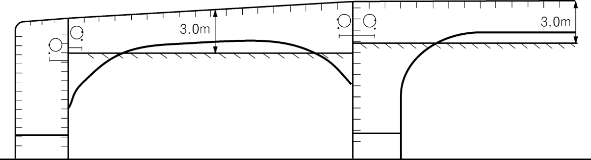

# PART 1 Classification and Surveys

> RULES FOR CLASSIFICATION OF STEEL SHIPS / RA-01-E / 2025 / EN / Rules

## CHAPTER 3 HULL SURVEYS OF SHIPS SUBJECT TOTHE ENHANCED SURVEY PROGRAMME

### Section 1 General

#### 101. Application

- **1.** In addition to the requirements specified in **Ch 2,** these requirements apply to hull surveys of ships subject to the enhanced survey programme such as **bulk carriers, oil tankers** and **chemical tankers,** etc.
- **2.** **Procedural requirements for certain ESP surveys**
  The objective of these requirements are to improve the quality of surveys. These requirements apply to surveys of hull structures and piping systems in way of cargo holds and/or cargo tanks, cofferdams, cargo pump rooms, pipe tunnels, void spaces, within the cargo length area and all ballast tanks. In the case of Bulk Carriers, selected fuel oil tanks within the cargo length area might be part of the areas to be surveyed according to the applicable provisions of the **Ch 3, Sec. 2** Bulk Carriers or **Ch 3, Sec. 6** Double Skin Bulk Carriers.
  Taking in to consideration, the size of vessels and scope of surveys for vessels noted below, it is more effective to have more than one Surveyor examine the required spaces, holds or tanks and to provide mutual support and consultation during the surveys in recommending repairs and actions required for Conditions of Class. *(2020)*
  - **(1)** On ships 20,000 DWT and above, subject to ESP, starting with Special Survey No. 3, at special and intermediate hull classification surveys, the survey of hull structure and piping systems to which these requirements applies is to be carried out by at least two exclusive Surveyors.
    On bulk carriers 100,000 DWT and above of single side skin construction at the intermediate hull classification survey between 10 and 15 years of age, the survey of hull structure and piping systems to which these requirements applies is to be performed by two at least exclusive Surveyors. *(2017)*
  - **(2)** This requires that at least two exclusive Surveyors attend on board at the same time to perform the required survey(this also applies to voyage surveys).
    Where compatible with relevant laws and regulations, on dual class vessels, the requirement for two Surveyors may be fulfilled by having one Surveyor attend from each Society. *(2020)*
  - **(3)** Though each attending Surveyor is not required to perform all aspects of the required survey, they are required to consult with each other and to do joint Overall and Close-up Surveys to the extent necessary to determine the condition of the vessel areas to which these requirements applies.
    The extent of these surveys should be sufficient for the Surveyors to agree on actions required to complete the survey with respect to renewals, repairs, and other Conditions of Class. Each Surveyor is required to co-sign the survey report or indicate their concurrence in an equivalent manner. *(2020)*
  - **(4)** The following surveys may be witnessed by a single Surveyor;
    - Thickness measurements in accordance with **Ch 2, 111**. of the Rules
    - Tank testing in accordance with the applicable **Ch 3** of the Rules
    - Repairs carried out in association with intermediate and special hull classification survey, the extent of which have been agreed upon by the required two Surveyors during the course of the surveys
  - **(5)** Surveyors used to fulfill this requirements are to be qualified in the survey processes involved.
  - **(6)** The onboard attendance of the Surveyors is to be documented according to the separate requirements specified by the Society.

#### 102. Preparations for survey

- **1.** **Survey programme**
  - **(1)** The Owner in cooperation with the Society is to work out a specific survey programme prior to the commencement of any part of:
    - the Special Survey
    - the Intermediate Survey for ships subject to the enhanced survey programme over 10 years of age.
    The survey programme is to be in a written format, based on the information in **Annex 1-3, Table 1** of the Guidance. The survey is not to commence until the survey programme has been agreed.
    The survey programme at Intermediate Survey may consist of the survey programme at the previous Special Survey supplemented by the executive hull summary of that Special Survey and later relevant survey reports. The survey programme is to be worked out taking into account any amendments to the survey requirements implemented after the last Special Survey carried out.
    Prior to the development of the survey programme, the survey planning questionnaire is to be completed by the Owner based on the information set out in **Annex 1-3, Table 2** of the Guidance, and forwarded to the Society.
  - **(2)** In developing the survey programme, the following documentation is to be collected and consulted with a view to selecting cargo holds/tanks, tanks, areas, and structural elements to be examined:
    - **(A)** Bulk carriers and double skin bulk carriers
      - **(a)** Survey status and basic ship information
      - **(b)** Documentation on-board, as described in **103. 2** and **3**
      - **(c)** Main structural plans(scantling drawings), including information regarding use of high tensile steels(HTS)
      - **(d)** Relevant previous survey and inspection reports from both the Society and the Owner
      - **(e)** Information regarding the use of the ship's holds and tanks, typical cargoes and other relevant data
      - **(f)** Information regarding corrosion prevention level on the new building
      - **(g)** Information regarding the relevant maintenance level during operation
    - **(B)** Oil tankers, chemical tankers and double hull oil tankers
      - **(a)** Survey status and basic ship information
      - **(b)** Documentation on-board, as described in **103. 2** and **3**
      - **(c)** Main structural plans of cargo and ballast tanks(scantling drawings), including information regarding use of high tensile steels(HTS), clad steel and stainless steel(for chemical tankers)
      - **(d)** Executive hull summary
      - **(e)** Relevant previous damage and repair history
      - **(f)** Relevant previous survey and inspection reports from both the Society and the Owner
      - **(g)** For oil tankers and double hull oil tankers cargo and ballast history for the last 3 years, including carriage of cargo under heated conditions, for chemical tankers information regarding the use of the ship's tanks, typical cargoes and other relevant data
      - **(h)** Details of the inert gas plant and tank cleaning procedures
      - **(i)** Information and other relevant data regarding conversion or modification of the ship's cargo and ballast tanks since the time of construction
      - **(j)** Description and history of the coating and corrosion prevention system, if any
      - **(k)** Inspections by the Owner’s personnel during the last 3 *years* with reference to structural deterioration in general, leakages in tank boundaries and piping and condition of the coating and corrosion prevention system, if any. Guidance for reporting is shown in **Annex 1-4** "Owners Inspection Report" *(2019)*
      - **(l)** Information regarding the relevant maintenance level during operation including port state control reports of inspection containing hull related deficiencies, Safety Management System non-conformities relating to hull maintenance, including the associated corrective action(s)
      - **(m)** Any other information that will help identify suspect areas and critical structural areas
  - **(3)** The submitted survey programme is to include relevant information including at least:
    - **(A)** Bulk carriers and double skin bulk carriers
      - **(a)** Basic ship information and particulars
      - **(b)** Main structural plans(scantling drawings), including information regarding use of high tensile steels(HTS)
      - **(c)** Plan of tanks and holds
      - **(d)** List of tanks and holds with information on use, protection and condition of coating
      - **(e)** Conditions for survey(e.g., information regarding hold and tank cleaning, gas freeing, ventilation, lighting, etc.)
      - **(f)** Provisions and methods for access to structures
      - **(g)** Equipment for surveys
      - **(h)** Nomination of hold and tanks and areas for Close-up Survey
      - **(i)** Nominations of sections and areas for thickness measurement
      - **(j)** Nomination of tanks for tank pressure testing
      - **(k)** Damage experience related to the ship in question
    - **(B)** Oil tankers, chemical tankers and double hull oil tankers
      - **(a)** Basic ship information and particulars
      - **(b)** Main structural plans of cargo and ballast tanks(scantling drawings), including information regarding use of high tensile steels(HTS), clad steel and stainless steel(for chemical tankers)
      - **(c)** Arrangement of tanks
      - **(d)** List of tanks with information on their use, extent and condition of coatings and corrosion prevention systems
      - **(e)** Conditions for survey(e.g., information regarding tank cleaning, gas freeing, ventilation, lighting, etc.)
      - **(f)** Provisions and methods for access to structures
      - **(g)** Equipment for surveys
      - **(h)** Nomination of tanks and areas for Close-up Survey
      - **(i)** Nomination of areas and sections for thickness measurement
      - **(j)** Nomination of tanks for tank pressure testing and the pipes that are to undergo pipe pressure testing as per **404. 6** (for chemical tankers)
      - **(k)** Identification of the thickness measurement firm *(2019)*
      - **(l)** Damage experience related to the ship in question
      - **(m)** Critical structural areas and suspect areas, where relevant
  - **(4)** The Society will advise the Owner of the maximum acceptable structural corrosion diminution levels applicable to the vessel.
  - **(5)** Use may also be made of the process contained in **Annex 1-3, Par 1** of the Guidance in conjunction with the preparation of the required survey programme. This process is a recommended tool which may be invoked at the discretion of the Society, “when considered necessary and appropriate”. *(2021)*
    Note : The term "when considered necessary and appropriate" means the cases where it may assist in identifying critical structural areas, nomination suspect areas and in focus ing attention on structural elements or areas of structural elements which may be particularly susceptible to, or evidence a history of, wastage or damage.
- **2.** **Conditions for survey**
  - **(1)** The Owner is to provide the necessary facilities for a safe execution of the survey.
    - **(A)** In order to enable the attending Surveyors to carry out the survey, provisions for proper and safe access are to be agreed between the Owner and the Society and are to be in accordance with IACS PR No.37(Procedural Requirement for Confined Space Safe Entry).
    - **(B)** Details of the means of access are to be provided in the survey planning questionnaire.
    - **(C)** In cases where the provisions of safety and required access are judged by the attending Surveyor(s) not to be adequate, the survey of the spaces involved is not to proceed.
  - **(2)** Spaces(including cargo holds and tanks) are to be safe for access. Spaces(including cargo holds and tanks) are to be gas free and properly ventilated. Prior to entering a tank, void or enclosed space, it is to be verified that the atmosphere in that space is free from hazardous gas and contains sufficient oxygen. *(2020)*
  - **(3)** In preparation for survey and thickness measurements and to allow for a thorough examination, all spaces are to be cleaned including removal from surfaces of all loose accumulated corrosion scale. Spaces are to be sufficiently clean and free from water, scale, dirt, oil residues etc. to reveal corrosion, deformation, fractures, damages, or other structural deterioration as well as the condition of the coating.
    However, those areas of structure whose renewal has already been decided by the Owner need only be cleaned and descaled to the extent necessary to determine the limits of the areas to be renewed.
  - **(4)** Sufficient illumination is to be provided to reveal corrosion, deformation, fractures, damages or other structural deterioration as well as the condition of the coating.
  - **(5)** Where soft or semi-hard coatings have been applied, safe access is to be provided for the Surveyor to verify the effectiveness of the coating and to carry out an assessment of the conditions of internal structures which may include spot removal of the coating.
    When safe access cannot be provided, the soft or semi-hard coating is to be removed.
- **3.** **Access to structures**
  - **(1)** For Overall Survey, means are to be provided to enable the Surveyor to examine the hull structure in a safe and practical way.
  - **(2)** For Close-up Survey(for bulk carriers(except double skin bulk carriers), Close-up Survey of the hull structure, other than cargo hold shell frames), one or more of the following means for access, acceptable to Surveyor, is to be provided:
    - **(A)** permanent staging and passages through structures
    - **(B)** temporary staging and passages through structures
    - **(C)** hydraulic arm vehicles such as conventional cherry pickers, lifts and movable platforms
    - **(D)** boats or rafts
    - **(E)** portable ladders
    - **(F)** other equivalent means
  - **(3)** For Close-up Surveys of the cargo hold shell frames of bulk carriers(except double skin bulk carriers) less than 100,000 $\mathrm{DWT}$, one or more of the following means for access, acceptable to the Surveyor, is to be provided:
    - **(A)** permanent staging and passage through structures
    - **(B)** temporary staging and passage through structures
    - **(C)** portable ladder restricted to not more than 5 $\mathrm{m}$ in length may be accepted for surveys of lower section of a shell frame including bracket
    - **(D)** hydraulic arm vehicles such as conventional cherry pickers, lifts and movable platforms
    - **(E)** boats or rafts provided the structural capacity of the hold is sufficient to withstand static loads at all levels of water
    - **(F)** other equivalent means
  - **(4)** For Close-up Surveys of the cargo hold shell frames of bulk carriers(except double skin bulk carriers) 100,000 $\mathrm{DWT}$ and above, the use of portable ladders is not accepted, and one or more of the following means for access, acceptable to the Surveyor, is to be provided:
    Notwithstanding the above requirements: *(2019)*
    - **(A)** Annual Surveys, Intermediate Survey under 10 years of age and Special Survey No. 1
      - **(a)** permanent staging and passage through structures
      - **(b)** temporary staging and passage through structures
      - **(c)** hydraulic arm vehicles such as conventional cherry pickers, lifts and movable platforms
      - **(d)** boats or rafts provided the structural capacity of the hold is sufficient to withstand static loads at all levels of water
      - **(e)** other equivalent means
    - **(B)** Subsequent Intermediate Surveys and Special Surveys
      - **(a)** either permanent or temporary staging and passage through structures for Close-up Survey of at least the upper part of hold frames
      - **(b)** hydraulic arm vehicles such as conventional cherry pickers for surveys of lower and middle part of shell frames as alternative to staging
      - **(c)** lifts and movable platforms
      - **(d)** boats or rafts provided the structural capacity of the hold is sufficient to withstand static loads at all levels of water
      - **(e)** other equivalent means
      - **(a)** the use of a portable ladder fitted with a mechanical device to secure the upper end of the ladder is acceptable for the "close-up examination of sufficient extent, minimum 25 % of frames, to establish the condition of the lower region of the shell frames including approx. lower one third length of side frame at side shell and side frame end attachment and the adjacent shell plating of the forward cargo hold" at Annual Survey, required in **202. 4**(10 *years* < age ≤ 15 *years*, Close-up Survey), and the "one other selected cargo hold" required in **202. 4**(15 *years* ≤ age, Close-up Survey). *(2019)*
      - **(b)** The use of hydraulic arm vehicles or aerial lifts (“Cherry picker”) may be accepted by the attending surveyor for the close-up survey of the upper part of side shell frames or other structures in all cases where the maximum working height is not more than 17 m. *(2019)*
- **4.** **Equipment for survey**
  - **(1)** Thickness measurement is normally to be carried out by means of ultrasonic test equipment. The accuracy of the equipment is to be proven to the Surveyor as required.
  - **(2)** One or more of the following fracture detection procedures may be required if **“**deemed necessary by the Surveyor”: *(2023)*
    Note : The term "deemed necessary by the Surveyor" means the cases as specified in **Ch 1, 801. 2** of the Guidance.
    - **(A)** radiographic equipment
    - **(B)** ultrasonic equipment
    - **(C)** magnetic particle equipment
    - **(D)** dye penetrant
  - **(3)** Explosimeter, oxygen-meter, breathing apparatus, lifelines, riding belts with rope and hook and whistles together with instructions and guidance on their use are to be made available during the survey. A safety check-list is to be provided.
  - **(4)** Adequate and safe lighting is to be provided for the safe and efficient conduct of the survey.
  - **(5)** Adequate protective clothing is to be made available and used during the survey(e.g. safety helmet, gloves, safety shoes, etc.).
- **5.** **Rescue and emergency response equipment**
  If breathing apparatus and/or other equipment is used as 'Rescue and emergency response equipment' then the equipment should be suitable for the configuration of the space being surveyed.
- **6.** **Survey at sea or at anchorage**
  - **(1)** Survey at sea or at anchorage may be accepted provided the Surveyor is given the necessary assistance from the personnel onboard. Necessary precautions and procedures for carrying out the survey are to be in accordance with **Par 1, Par 2, Par 3** and **Par 4** above.
  - **(2)** A communication system is to be arranged between the survey party in the tank or space under examination and the responsible officer on deck. This system is to also include the personnel in charge of ballast pump handling if boats or rafts are used.
  - **(3)** Surveys of tanks or applicable holds by means of boats or rafts may only be undertaken with the agreement of the Surveyor, who is to take into account the safety arrangements provided, including weather forecasting and ship response under foreseeable conditions and provided the expected rise of water within the tank or hold does not exceed 0.25 $\mathrm{m}$.
  - **(4)** When rafts or boats are used for Close-up Survey the following conditions are to be observed.
    On no account is to the level of the water be rising while the boat or raft is in use.
    - **(A)** only rough duty, inflatable rafts or boats, having satisfactory residual buoyancy and stability even if one chamber is ruptured, are to be used.
    - **(B)** the boat or raft is to be tethered to the access ladder and an additional person is to be stationed down the access ladder with a clear view of the boat or raft.
    - **(C)** appropriate lifejackets are to be available for all participants.
    - **(D)** the surface of water in the tank or hold is to be calm(under all foreseeable conditions the expected rise of water within the tank or hold is not to exceed 0.25 $\mathrm{m}$) and the water level stationary.
    - **(E)** the tank, hold or space must contain clean ballast water only. Even a thin sheen of oil or cargo on the water is not acceptable.
    - **(F)** at no time is the water level to be allowed to be within 1 $\mathrm{m}$ of the deepest under deck web face flat so that the survey team is not isolated from a direct escape route to the tank hatch. Filling to levels above the deck transverses is only to be contemplated if a deck access manhole is fitted and open in the bay being examined, so that an escape route for the survey party is available at all times. Other effective means of escape to the deck may be considered.
    - **(G)** if the tanks(or spaces) are connected by a common venting system, or inert gas system, the tank in which the boat or raft is to be used is to be isolated to prevent a transfer of gas from other tanks(or spaces).
  - **(5)** Rafts or boats alone may be allowed for inspection of the under deck areas for tanks or spaces, if the depth of the webs is 1.5 $\mathrm{m}$ or less.
  - **(6)** If the depth of the webs is more than 1.5 $\mathrm{m}$, rafts or boats alone may be allowed only:
    If neither of the above conditions are met, then staging or an "other equivalent means" is to be
    provided for the survey of the under deck areas.
    
    **Fig 1.3.1 Maximum water level in a tank** ***(2024)***
    - **(A)** when the coating of the under deck structure is in GOOD condition and there is no evidence of wastage; or
    - **(B)** if a permanent means of access is provided in each bay to allow safe entry and exit. This means:
      - **(a)** access direct from the deck via a vertical ladder and a small platform fitted approximately 2 $\mathrm{m}$ below the deck in each bay; or
      - **(b)** access to deck from a longitudinal permanent platform having ladders to deck in each end of the tank. The platform shall, for the full length of the tank, be arranged in level with, or above, the maximum water level needed for rafting of under deck structure. For this purpose, the ullage corresponding to the maximum water level is to be assumed not more than 3 $\mathrm{m}$ from the deck plate measured at the midspan of deck transverses and in the middle length of the tank. (For oil tankers, chemical tankers and double hull oil tankers, see **Fig 1.3.1**)
  - **(7)** The use of rafts or boats alone in (5) and (6) above does not preclude the use of boats or rafts to move about within a tank during a survey.
- **7.** **Survey planning meeting**
  - **(1)** Follow the procedure of Survey planning meeting of **Ch 2, Sec 1. 110.** *(2018)*

#### 103. Documentation on board

- **1.** **General**
  - **(1)** The Owner is to obtain, supply and maintain on board documentation as specified in **Par 2** and **Par 3** below, which is to be readily available for the Surveyor.
  - **(2)** The documentation is to be kept on board for the life time of the ship.
  - **(3)** For tankers and bulk carriers subject to SOLAS Ch II-1 Pt A-1 Reg.3-10, the Owner is to arrange the updating of the Ship Construction File(SCF) throughout the ship's life whenever a modification of the documentation included in the SCF has taken place.
    Documented procedures for updating the SCF are to be included within the Safety Management System.
- **2.** **Survey report file**
  - **(1)** A survey report file is to be a part of the documentation on board consisting of
    - **(A)** Reports of structural surveys
    - **(B)** Executive hull summary
    - **(C)** Thickness measurement reports
  - **(2)** The survey report file is to be available also in the Owner's and the Society's management offices.
- **3.** **Supporting documents**
  - **(1)** The following additional documentation is to be available onboard.
    The midship section plan to be supplied on board the ship is to include the minimum allowable hull girder sectional properties for hold/tank transverse section in all cargo holds/tanks)
    - **(A)** Main structural plans of cargo holds, cargo tanks and ballast tanks (for vessels built under IACS Common Structural Rules(**Pt 11**, **Pt 12** or **Pt 13**), these plans are to include for each structural element both the as-built and renewal thickness. Any thickness for voluntary addition is also to be clearly indicated on the plans.
    - **(B)** Previous repair history
    - **(C)** Cargo and ballast history
    - **(D)** Extent of use of inert gas plant and tank cleaning procedures
    - **(E)** The Owners inspection report with reference to (Refer to the **Annex 1-4** of the Guidance) *(2021)*
      - **(a)** structural deterioration in general
      - **(b)** leakages in bulkheads and piping
      - **(c)** condition of corrosion prevention system, if any
    - **(F)** Any other information that will help identify critical structural areas and/or suspect areas requiring inspection
    - **(G)** Survey programme as required in **102. 1** until such time as the Special Survey or Intermediate Survey, as applicable, has been completed
  - **(2)** For tankers and bulk carriers subject to SOLAS Ch II-1 Pt A-1 Reg.3-10, the Ship Construction File(SCF), limited to the items to be retained onboard, is to be available on board.
- **4.** **Review of documentation on board**
  - **(1)** Prior to survey, the Surveyor is to examine the completeness of the documentation onboard, and its contents as a basis for the survey.
  - **(2)** For tankers and bulk carriers subject to SOLAS Ch II-1 Pt A-1 Reg.3-10, on completion of the survey, the Surveyor is to verify that the update of the Ship Construction File(SCF) has been done whenever a modification of the documentation included in the SCF has taken place.
    If the updating of the SCF onboard is not completed at the time of survey, the Surveyor records it and requires confirmation at the next periodical survey. *(2018)*
    In addition, the surveyor is to confirm that the service contract with of the Archive Center is valid. If the updating of the SCF Supplement ashore is not completed at the time of survey, the Surveyor records it and requires confirmation at the next periodical survey. *(2018)*
    - **(A)** For the SCF stored on board ship, the surveyor is to examine the information on board ship. In cases where any major event, including, but not limited to, substantial repair and conversion, or any modification to the ship structures, the surveyor is to also verify that the updated information is kept on board the ship.
    - **(B)** For the SCF stored on shore archive, the surveyor is to examine the list of information included on shore archive. In cases where any major event, including, but not limited to, substantial repair and conversion, or any modification to the ship structures, the surveyor is to also verify that the updated information is stored on shore archive by examining the list of information included on shore archive or kept on board the ship.
  - **(3)** For tankers and bulk carriers subject to SOLAS Ch II-1 Pt A-1 Reg.3-10, on completion of the survey, the Surveyor is to verify any addition and/or renewal of materials used for the construction of the hull structure are documented within the Ship Construction File list of materials.

#### 104. Procedures for thickness measurements (2021)

- **1.** **General** ***(2018)***
  - **(1)** Follow the procedure for thickness measurement of **Ch 2, Sec 1, 111.** *(2018)*
- **2.** **Locations and number of measurements**
  - **(1)** For vessels not built under IACS Common Structural Rules(**Pt 11**, **Pt 12** or **Pt 13**), the requirements for locations and number of thickness measurements are according to **Annex 1-5, Table 3-1** of the Guidance and/or specific requirements, if exist, e.g. IACS UR S31(Renewal Criteria for Side Shell Frames and Brackets in Single Side Skin Bulk Carriers and Single Side Skin OBO Carriers not Built in accordance with UR S12 Rev.1 or subsequent revisions).
  - **(2)** For vessels built under IACS Common Structural Rules(**Pt 11**, **Pt 12** or **Pt 13**), the requirements for locations and number of thickness measurements are according to followings.
    - **(A)** Considering the extent of thickness measurements according to the different structural elements of the ship and survey(Special, Intermediate and Annual Survey), the locations of the points to be measured are given for the most important items of the structure.
    - **(B)** **Annex 1-5, Table 3-2** of the Guidance provides explanations and/or interpretations for the application of those requirements indicated in the Rules, which refer to both systematic thickness measurements related to the calculation of global hull girder strength and specific measurements connected to Close-up Surveys.
    - **(C)** Figures in **Annex 1-5, Table 3-2** of the Guidance are provided to facilitate these explanations and/or interpretations, and to show typical structural arrangements.
- **3.** **Reporting** ***(2018)***
  - **(1)** Follow the procedure for thickness measurement of **Ch 2, Sec 1, 111.**

#### 105. Acceptance criteria for the corrosion

- **1.** For vessels not built under IACS Common Structural Rules(**Pt 11**, **Pt 12** or **Pt 13**), the acceptance criteria for the corrosion is according to **Annex 1-5, Table 1** of the Guidance and/or specific requirements, if exist, e.g. IACS S18(Evaluation of Scantlings of Corrugated Transverse Watertight Bulkheads in Bulk Carriers Considering Hold Flooding), S19(Evaluation of Scantlings of the Transverse Watertight Corrugated Bulkhead between Cargo Holds Nos. 1 and 2, with Cargo Hold No. 1 Flooded, for Existing Bulk Carriers), S21(Evaluation of Scantlings of Hatch Covers and Hatch Coamings of Cargo Holds of Bulk Carriers, Ore carriers and Combination Carriers), UR S31(Renewal Criteria for Side Shell Frames and Brackets in Single Side Skin Bulk Carriers and Single Side Skin OBO Carriers not Built in accordance with UR S12 Rev.1 or subsequent revisions) as applicable. *(2019)*
- **2.** For vessels built under IACS Common Structural Rules(**Pt 11**, **Pt 12** or **Pt 13**), the acceptance criteria for the corrosion is according to Ch 13 of IACS Common Structural Rules for Bulk Carriers(**Pt 11**), Sec 12 of IACS Common Structural Rules for Double Hull Oil Tankers(**Pt 12**), Sub-part 1, Ch 13 of IACS Common Structural Rules for Bulk Carriers and Oil Tankers(**Pt 13**) and as specified in the followings.
  - **(1)** Acceptance criteria for pitting corrosion
    If pitting intensity in an area where coating is required, according to Ch 3, Sec 5 of IACS Common Structural Rules for Bulk Carriers(**Pt 11**) or Sub-part 1, Ch 3, Sec 4 of IACS Common Structural Rules for Bulk Carriers and Oil Tankers(**Pt 13**), is higher than 15 % (**Ch 2,** see **Fig 1.2.3**), thickness measurements are to be performed to check the extent of pitting corrosion.
    The 15 % is based on pitting or grooving on only one side of a plate.
    In cases where pitting is exceeding 15 %, as defined above, an area of 300 $\mathrm{mm}$ or more, at the most pitted part of the plate, is to be cleaned to bare metal and the thickness is to be measured in way of the five deepest pits within the cleaned area. The least thickness measured in way of any of these pits is to be taken as the thickness to be recorded.
    The minimum remaining thickness in pits, grooves or other local areas is to be greater than the following without being greater than the renewal thickness($t_{ ren}$):
    - 75 % of the as-built thickness, in the frame and end brackets webs and flanges(only for single skin bulk carriers)
    - 70 % of the as-built thickness, in the side shell, hopper tank and topside tank plating attached to the each side frame, over a width up to 30 $\mathrm{mm}$ from each side of it.
    For plates with pitting intensity less than 20 % (**Ch 2,** see **Fig 1.2.3**), the measured thickness, $t_{ m}$ of any individual measurement is to meet the lesser of the following criteria:
    $t _{m} \geq 0.7 \left( t _{as-built} - t _{vol add} \right)$ $\mathrm{mm}$
    $t _{m} \geq t _{ren} - 1$ $\mathrm{mm}$
    where,
    $t _{as-built}$ as-built thickness of the member, in $\mathrm{mm}$
    $t _{vol add}$ voluntary thickness addition; thickness, in $\mathrm{mm}$, voluntarily added as the Owner's extra margin for corrosion wastage in addition to $t _{c}$
    $t _{ren}$ renewal thickness(minimum allowable thickness, in $\mathrm{mm}$, below which renewal of structural members is to be carried out) defined in Ch 13, Sec 2 of IACS Common Structural Rules for Bulk Carriers(**Pt 11**), Ch 12, Sec 12 of IACS Common Structural Rules for Double Hull Oil Tankers(**Pt 12**) or Sub-part 1, Ch 13, Sec 2 of IACS Common Structural Rules for Bulk Carriers and Oil Tankers(**Pt 13**), as applicable.
    $t _{c}$ total corrosion addition, in $\mathrm{mm}$, defined in Ch 3, Sec 3 of IACS Common Structural Rules for Bulk Carriers(**Pt 11**), Sec 6 of IACS Common Structural Rules for Double Hull Oil Tankers(**Pt 12**) or Sub-part 1, Ch 3, Sec 3 of IACS Common Structural Rules for Bulk Carriers and Oil Tankers(**Pt 13**), as applicable.
    $t _{m}$ measured thickness, in $\mathrm{mm}$, on one items, i.e. average thickness on one item using the various measurements taken on this same item during periodical ship's in service surveys.
    The average thickness across any cross section in the plating is not to be less than the renewal
    criteria for general corrosion given in Ch 13 Sec 2 of IACS Common Structural Rules for Bulk
    Carriers(**Pt 11**), Ch 12, Sec 12 of IACS Common Structural Rules for Double Hull Oil Tankers (**Pt 12**) or Sub-part 1, Ch 13, Sec 2 of IACS Common Structural Rules for Bulk Carriers and Oil Tankers(**Pt 13**), as applicable. *(2019)*
    - **(A)** Side structures: for bulk carriers and double skin bulk carriers
    - **(B)** Other structures
  - **(2)** Acceptance criteria for edge corrosion
    $t _{m} \geq 0.7 \left( t _{as-built} - t _{vol add} \right)$ $\mathrm{mm}$
    $t _{m} \geq t _{ren} - 1$ $\mathrm{mm}$
    where,
    For $t _{as-built}$, $t _{vol add}$, $t _{ren}$, $t _{c}$ and $t _{m}$, refer to **Ch 3, Sec 1, 105. 2.** (1), (B) *(2019)*
    - **(A)** Provided that the overall corroded height of the edge corrosion of the flange, or web in the case of flat bar stiffeners, is less than 25 % (**Ch 2,** see **Fig 1.2.4**), of the stiffener flange breadth or web height, as applicable, the measured thickness, $t _{m}$, is to meet the lesser of the following criteria:
    - **(B)** The average measured thickness across the breadth or height of the stiffener is not to be less than the renewal criteria defined in Ch 13 of IACS Common Structural Rules for Bulk Carriers(**Pt 11**), Sec 12 of IACS Common Structural Rules for Double Hull Oil Tankers(**Pt 12**) or Sub-part 1, Ch 13 of IACS Common Structural Rules for Bulk Carriers and Oil Tankers(**Pt 13**), as applicable.
    - **(C)** Plate edges at openings for manholes, lightening holes, etc. may be below the minimum thickness given in Ch 13 IACS Common Structural Rules for Bulk Carriers(**Pt 11**), Sec 12 of IACS Common Structural Rules for Double Hull Oil Tankers(**Pt 12**) or Sub-part 1, Ch 13 of IACS Common Structural Rules for Bulk Carriers and Oil Tankers(**Pt 13**), as applicable, provided that:
      - **(a)** the maximum extent of the reduced plate thickness, below the minimum given in Ch 13 of IACS Common Structural Rules for Bulk Carriers(**Pt 11**), Sec 12 of IACS Common Structural Rules for Double Hull Oil Tankers(**Pt 12**) or Sub-part 1, Ch 13 of IACS Common Structural Rules for Bulk Carriers and Oil Tankers(**Pt 13**), as applicable, from the opening edge is not more than 20 % of the smallest dimension of the opening and does not exceed 100 $\mathrm{mm}$.
      - **(b)** rough or uneven edges may be cropped-back provided that the maximum dimension of the opening is not increased by more than 10 % and the remaining thickness of the new edge is not less than $t _{ren} - 1$ $\mathrm{mm}$.
  - **(3)** Acceptance criteria for grooving corrosion
    $t _{m} \geq 0.75 \left( t _{as-built} - t _{vol add} \right)$ $\mathrm{mm}$
    $t _{m} \geq t _{ren} - 0.5$ $\mathrm{mm}$
    but is not to be less than
    $t _{m} = 6$ $\mathrm{mm}$
    where,
    For $t _{as-built}$, $t _{vol add}$, $t _{ren}$, $t _{c}$ and $t _{m}$, refer to Ch 3, Sec 1, 105. 2. (1), (B) *(2019)*
    - **(A)** Where the groove breadth is a maximum of 15 % of the web height, but not more than 30 $\mathrm{mm}$ (**Ch 2,** see **Fig 1.2.5**), the measured thickness, $t _{m}$, in the grooved area is to meet the lesser of the following criteria:
    - **(B)** Structural members with areas of grooving greater than those in (A) above are to be assessed based on the criteria for general corrosion as defined in Ch 13 of IACS Common Structural Rules for Bulk Carriers(**Pt 11**), Sec 12 of IACS Common Structural Rules for Double Hull Oil Tankers(**Pt 12**) or Sub-part 1, Ch 13 of IACS Common Structural Rules for Bulk Carriers and Oil Tankers(**Pt 13**), as applicable, using the average measured thickness across the plating/stiffener.

#### 106. Reporting and evaluation of survey

- **1.** **Evaluation of survey report**
  - **(1)** The data and information on the structural condition of the vessel collected during the survey is to be evaluated for acceptability and continued structural integrity of the vessel.
  - **(2)** In case of oil tankers(including double hull oil tankers) of 130 $\mathrm{m}$ in length and upwards(i.e. length for freeboard($L _{f}$) as defined in **Pt 3, Ch 1, 103.**), the ship's longitudinal strength is to be evaluated by using the thickness of structural members measured, renewed and reinforced, as appropriate, during the Special Surveys carried out after the ship reached 10 years of age in accordance with the criteria for longitudinal strength of the ship's hull girder for oil tankers specified in the separate requirements specified by the Society.
    However, the only thickness measurement records which have been measured within one(1) year period from the date of the longitudinal strength evaluation shall be considered valid.
  - **(3)** For bulk carriers(including double skin bulk carriers) built under IACS Common Structural Rules for Bulk Carriers(**Pt 11**), the ship's longitudinal strength is to be evaluated by using the thickness of structural members measured, renewed and reinforced, as appropriate, during the Special Surveys carried out after the ship reaches 15 years of age (or during the Special Survey No. 3, if this is carried out before the ship reaches 15 years) in accordance with the criteria for longitudinal strength of the ship's hull girder specified in **Ch 13** of IACS Common Structural Rules for Bulk Carriers(**Pt 11**).
    However, the only thickness measurement records which have been measured within one(1) year period from the date of the longitudinal strength evaluation shall be considered valid.
  - **(4)** Notwithstanding (2) and (3) above, for ships built under IACS Common Structural Rules for Bulk Carriers and Oil Tankers(**Pt 13**), the ship's longitudinal strength is to be evaluated by using the thickness of structural members measured, renewed and reinforced, as appropriate, during the Special Surveys carried out after the ship reached 10 years of age in accordance with the criteria for longitudinal strength of the ship's hull girder specified in Sub-part 1, Ch 13 of IACS Common Structural Rules for Bulk Carriers and Oil Tankers(**Pt 13**).
    However, the only thickness measurement records which have been measured within one(1) year period from the date of the longitudinal strength evaluation shall be considered valid.
  - **(5)** The final result of evaluation of the ship's longitudinal strength required (2) to (4) above, after renewal or reinforcement work of structural members, if carried out as a result of initial evaluation, is to be reported as a part of the executive hull summary.
- **2.** **Reporting**
  An executive hull summary of the survey and results is to be issued to the Owner and placed on board the vessel for reference at future surveys. The executive hull summary is to be endorsed by the Society.
- **3.** When a survey is split between different survey stations, a report is to be made for each portion of the survey. A list of items examined and/or tested(pressure testing, thickness measurements etc.) and an indication of whether the item has been credited, are to be made available to the next attending Surveyor(s), prior to continuing or completing the survey.

### Section 2 Bulk Carriers

#### 201. General

- **1.** **Application**
  - **(1)** In addition to the requirements specified in **Ch 2**, the requirements apply to surveys of hull structure and piping systems in way of the following spaces for all bulk carriers with ESP notation other than double skin bulk carriers as defined in **601. 2** (1).
  - **(2)** The requirements contain the minimum extent of examination, thickness measurement and tank testing. The survey is to be extended when Substantial Corrosion and/or structural defects are found and include additional Close-Up Survey “when necessary”. *(2023)*
    Note : The term "when necessary" means the cases as specified in **Ch 1, 801. 5** of the Guidance.
  - **(3)** Ships, specified in **Pt 7, Annex 7-5, 1** of the Guidance, which are required to comply with IACS UR S19(Evaluation of Scantlings of the Transverse Watertight Corrugated Bulkhead between Cargo Holds Nos. 1 and 2, with Cargo Hold No.1 Flooded, for Existing Bulk Carriers) are subject to the additional thickness measurement guidance contained in **Annex 1-5, Table 9** of the Guidance with respect to the vertically corrugated transverse watertight bulkhead between cargo hold Nos.1 and 2 for purpose of determining compliance with UR S19 prior to the relevant compliance deadline stipulated in UR S23(Implementation of IACS UR S19 and S22 for Existing Single Side Skin Bulk Carriers) as following and at subsequent Intermediate Surveys(for ships over 10 years of age) and Special Surveys for purpose of verifying continuing compliance with UR S19.
    - **(A)** For ships which were 20 years of age or more on 1 July 1998, by the due date of the first Intermediate or the due date of the first Special Survey to be held after 1 July 1998, whichever comes first, the compliance with the requirements specified in **Pt 7, Annex 7-5** of the Guidance is to be confirmed.
    - **(B)** For ships which were 15 years of age or more but less than 20 years of age on 1 July 1998, by the due date of the first Special Survey to be held after 1 July 1998, but not later than 1 July 2002, the compliance with the requirements specified in **Pt 7, Annex 7-5** of the Guidance is to be confirmed.
    - **(C)** For ships which were 10 years of age or more but less than 15 years of age on 1 July 1998, by the due date of the first Intermediate, or the due date of the first Special Survey to be held after the date on which the ship reaches 15 years of age but not later than the date on which the ship reaches 17 years of age, the compliance with the requirements specified in **Pt 7, Annex 7-5** of the Guidance is to be confirmed.
    - **(D)** For ships which were 5 years of age or more but less than 10 years of age on 1 July 1998, by the due date, after 1 July 2003, of the first Intermediate or the first Special Survey after the date on which the ship reaches 10 years of age, whichever occurs first, the compliance with the requirements specified in **Pt 7, Annex 7-5** of the Guidance is to be confirmed.
    - **(E)** For ship which were less than 5 years of age on 1 July 1998, by the date on which the ship reaches 10 years of age, the compliance with the requirements specified in **Pt 7, Annex 7-5** of the Guidance is to be confirmed.
    - **(F)** Completion prior to 1 July 2003 of an Intermediate or Special Survey with a due date after 1 July 2003 cannot be used to postpone compliance. However, completion prior to 1 July 2003 of an Intermediate Survey the window for which straddles 1 July 2003 can be accepted.
  - **(4)** Ships, specified in **Pt 7, Ch 3, Sec 17** which required to comply with IACS UR S31(Renewal Criteria for Side Shell Frames and Brackets in Single Side Skin Bulk Carriers and Single Side Skin OBO Carriers not Built in accordance with UR S12 Rev.1 or subsequent revisions) are subject to the additional thickness measurement guidance contained in **Pt 7, Ch 3, Sec 17** and the separate requirements specified by the Society with respect to the side shell frames and brackets for the purpose of determining compliance with UR S31 prior to the relevant compliance deadline stipulated in UR S31 as following and at subsequent Intermediate and Special Surveys for purpose of verifying continuing compliance with UR S31.
    - **(A)** Bulk Carriers subject to the requirements specified in **Pt 7, Ch 3, Sec 17** are to be assessed for compliance with the requirements of this rules and steel renewal, reinforcement or coating, where required in accordance with this rules, is to be carried out in accordance with the following schedule and at subsequent Intermediate and Special Surveys.
      - **(a)** For bulk carriers which will be 15 years of age or more on 1 January 2004 by the due date of the first Intermediate or Special Survey after that date;
      - **(b)** For bulk carriers which will be 10 years of age or more on 1 January 2004 by the due date of the first Special Survey after that date;
      - **(c)** For bulk carriers which will be less than 10 years of age on 1 January 2004 by the date on which the ship reaches 10 years of age.
      - **(d)** Completion prior to 1 January 2004 of an Intermediate or Special Survey with a due date after 1 January 2004 cannot be used to postpone compliance. However, completion prior to 1 January 2004 of an Intermediate Survey the window for which straddles 1 January 2004 can be accepted.
    - **(B)** OBO carriers subject to the requirements specified in **Pt 7, Ch 3, Sec 17** are to be assessed for compliance with the requirements of this rules and steel renewal, reinforcement or coating, where required in accordance with this rules, is to be carried out in accordance with the following schedule and at subsequent Intermediate and Special Surveys.
      - **(a)** For OBO carriers which will be 15 years of age or more on 1 July 2005 by the due date of the first Intermediate or Special Survey after that date;
      - **(b)** For OBO carriers which will be 10 years of age or more on 1 July 2005 by the due date of the first Special Survey after that date;
      - **(c)** For OBO carriers which will be less than 10 years of age on 1 July 2005 by the date on which the ship reaches 10 years of age.
      - **(d)** Completion prior to 1 July 2005 of an Intermediate or Special Survey with a due date after 1 July 2005 cannot be used to postpone compliance. However, completion prior to 1 July 2005 of an Intermediate Survey the window for which straddles 1 July 2005 can be accepted.
  - **(5)** For bulk carriers with hybrid cargo hold arrangements, e.g. with some cargo holds of single side skin and others of double side skin, the requirements of **Sec 6** are to apply to cargo hold of double side skin and associated wing spaces.
  - **(6)** All bulk carriers, which required to comply with IACS UR S30(Cargo Hatch Cover Securing Arrangements for Bulk Carriers not Built in accordance with UR S21(Rev.3)), not built in accordance with **Pt 7, Ch 3, Sec 9** are to comply with the requirements specified in **Pt 7, Ch 3, Sec 18** in accordance with the following schedule:
    - **(A)** For ships which will be 15 years of age or more on 1 January 2004 by the due date of the first Intermediate or Special Survey after that date;
    - **(B)** For ships which will be 10 years of age or more on 1 January 2004 by the due date of the first Special Survey after that date;
    - **(C)** For ships which will be less than 10 years of age on 1 January 2004 by the date on which the ship reaches 10 years of age.
    - **(D)** Completion prior to 1 January 2004 of an Intermediate or Special Survey with a due date after 1 January 2004 cannot be used to postpone compliance. However, completion prior to 1 January 2004 of an Intermediate Survey the window for which straddles 1 January 2004 can be accepted.
- **2.** **Definitions**
  - **(1)** Refer to the Definitions of **Ch 2, Sec 1, 102.** *(2020)*

#### 202. Annual Survey

- **1.** **General**
  - **(1)** The due range of Annual Survey is to be in accordance with the requirements of **Ch 2, 201.**
  - **(2)** The survey is to consist of an examination for the purpose of ensuring, as far as practicable, that the hull, weather decks, hatch covers, coamings and piping are maintained in a satisfactory condition and should take into account the service history, condition and extent of the corrosion prevention system of ballast tanks and areas identified in the survey report file. *(2019)*
- **2.** **Examination of the hull**
  - **(1)** Examination of the hull plating and its closing appliances as far as can be seen.
  - **(2)** Examination of watertight penetrations as far as practicable.
- **3.** **Examination of weather decks, hatch covers and coamings**
  - **(1)** Confirmation is to be obtained that no unapproved changes have been made to the hatch covers, hatch coamings and their securing and sealing devices since the last survey.
  - **(2)** A thorough survey of cargo hatch covers and coamings is only possible by examination in the open as well as closed positions and is to include verification of proper opening and closing operation. As a result, the hatch cover sets within the forward 25 % of the ship’s length and at least one additional set, such that all sets on the ship are assessed at least once in every 5-year period, are to be surveyed open, closed and in operation to the full extent on each direction at each Annual Survey, including:
    The closing of the covers is to include the fastening of all peripheral and cross joint cleats or other securing devices. Particular attention is to be paid to the condition of the hatch covers in the forward 25 % of the ship’s length, where sea loads are normally greatest.
    - **(A)** stowage and securing in open condition
    - **(B)** proper fit and efficiency of sealing in closed condition
    - **(C)** operational testing of hydraulic and power components, wires, chains, and link drives
  - **(3)** If there are indications of difficulty in operating and securing hatch covers, additional sets above those required by (2), at the discretion of the Surveyor, are to be tested in operation.
  - **(4)** Where the cargo hatch securing system does not function properly, repairs are to be carried out under the supervision of the Society. Where hatch covers or coamings undergo substantial repairs, the strength of securing devices should be upgraded to comply with Rules **Pt 4, Ch 2, Sec 5**. *(2019)*
  - **(5)** For each cargo hatch cover set, at each Annual Survey, the following items are to be surveyed:
    - **(A)** cover panels, including side plates, and stiffener attachments that may be accessible in the open position by Close-up Survey(for corrosion, cracks, deformation)
    - **(B)** sealing arrangements of perimeter and cross joints(gaskets for condition and permanent deformation, flexible seals on combination carriers, gasket lips, compression bars, drainage channels and non return valves)
    - **(C)** clamping devices, retaining bars, cleating(for wastage, adjustment, and condition of rubber components)
    - **(D)** closed cover locating devices(for distortion and attachment)
    - **(E)** chain or rope pulleys
    - **(F)** guides
    - **(G)** guide rails and track wheels
    - **(H)** stoppers
    - **(I)** wires, chains, tensioners, and gypsies
    - **(J)** hydraulic system, electrical safety devices and interlocks
    - **(K)** end and interpanel hinges, pins and stools where fitted
  - **(6)** At each hatchway, at each Annual Survey, the coamings, with plating, stiffeners and brackets are to be checked for corrosion, cracks and deformation, especially of the coaming tops, including Close-up Survey. *(2019)*
  - **(7)** Where considered necessary, the effectiveness of sealing arrangements may be proved by hose or chalk testing supplemented by dimensional measurements of seal compressing components. *(2023)*
    Note : The Surveyor is to consider the cases specified in **Ch 1, 801. 1** of the Guidance when requiring the tightness test.
  - **(8)** Where portable covers, wooden or steel pontoons are fitted, checking the satisfactory condition, where applicable, of:
    - **(A)** wooden covers and portable beams, carriers or sockets for the portable beam, and their securing devices
    - **(B)** steel pontoons, including Close-up Survey of hatch cover plating
    - **(C)** tarpaulins
    - **(D)** cleats, battens and wedges
    - **(E)** hatch securing bars and their securing devices
    - **(F)** loading pads/bars and the side plate edge
    - **(G)** guide plates and chocks
    - **(H)** compression bars, drainage channels and drain pipes(if any)
  - **(9)** Examination of flame screens on the open ends of air pipes to all bunker tanks.
  - **(10)** Examination of bunker and vent piping systems, including ventilators.
- **4.** **Examination of cargo holds** ***(2021)***
  The examination of cargo holds in Annual Survey is to be in accordance with the follows.

  |   | 10 years〈 age ≤ 15 years2), 3) | 15 years〈 age2), 3) |
  | --- | --- | --- |
  | Overall Survey | All cargo holds | All cargo holds |
  | Close-up Survey | 1. Cargo Holds: - forward cargo hold 2. Extent: Close-up examination of sufficient extent, minimum 25% of frames, to establish the condition of the lower region of the shell frames including approx. lower one third length of side frame at side shell and side frame end attachment and the adjacent shell plating^1) | 1. Cargo Holds: - forward cargo hold - one other selected cargo hold 2. Extent: Close-up examination of sufficient extent, minimum 25% of frames, to establish the condition of the lower region of the shell frames including approx. lower one third length of side frame at side shell and side frame end attachment and the adjacent shell plating^1) |
  | Others | All piping and penetrations in cargo holds, including overboard piping, are to be examined. | All piping and penetrations in cargo holds, including overboard piping, are to be examined. |
  | (NOTES) 1) Where this level of survey reveals the need for remedial measures, the survey is to be extended to include a Close-up Survey of all of the shell frames and adjacent shell plating of that cargo hold as well as a Close-up Survey of sufficient extent of all remaining cargo holds. 2) When **“**considered necessary by the Surveyor**”**, or where extensive corrosion exists, thickness measurement is to be carried out. If the results of these thickness measurements indicate that substantial corrosion is found, the extent of thickness measurements is to be increased in accordance with **Annex 1-5, Table 14** of the Guidance. These increased thickness measurements are to be carried out before the Annual Survey is credited as completed. Suspect areas identified at previous surveys are to be examined. Areas of substantial corrosion identified at previous surveys are to have thickness measurement taken. For vessels built under the IACS Common Structural Rules(**Pt 11** or **Pt 13**), the annual thickness gauging may be omitted where a hard protective coating has been applied in accordance with the coating manufacturer's requirements and is maintained in GOOD condition. Where the term "considered necessary by the Surveyor" means the cases as specified in **Ch 1, 801. 3** of the Guidance. *(2023)* 3) Where a hard protective coating in cargo holds is found to be in GOOD condition, the extent of Close-up Surveys and thickness measurements may be reduced by sufficiently confirming the actual average condition of the structure under the coating. *(2019)* |   |   |
- **5.** **Examination of ballast tanks** ***(2023)***
  Examination of **“**ballast tanks when required” as a consequence of the results of the Special Survey and Intermediate Survey is to be carried out. When **“**considered necessary by the Surveyor**”**, or where extensive corrosion exists, thickness measurements are to be carried out.
  If the results of these thickness measurements indicate that substantial corrosion is found, the extent of thickness measurements is to be increased in accordance with **Annex 1-5, Table 14** of the Guidance. These extended thickness measurements are to be carried out before the survey is credited as completed. Suspect areas identified at previous surveys are to be examined.
  Areas of substantial corrosion identified at previous survey are to have thickness measurements taken. For vessels built under IACS Common Structural Rules(**Pt 11** or **Pt 13**), the annual thickness gauging may be omitted where a hard protective coating has been applied in accordance with the coating manufacturer's requirements and is maintained in GOOD condition.
  Note :
  1) The term "ballast tanks when required" means the ballast tanks which are assigned to be internally examined at annual intervals from the results of Intermediate Survey or Special Survey.
  2) The term "considered necessary by the Surveyor" means the cases as specified in **Ch 1, 801. 3** of the Guidance. *(2023)*
- **6.** **Additional Annual Survey requirements for the foremost cargo hold of ships subject to SOLAS XII/9.1**
  - **(1)** Ships subject to SOLAS XII/9.1 are those meeting all the following conditions;
    - Bulk Carriers of 150 $\mathrm{m}$ in length and upwards of single side skin construction,
    - carrying solid bulk cargoes having a density of 1780 #eqnID-120_s1and above,
    - contracted for construction before 1 July 1999, and
    - constructed with an insufficient number of transverse watertight bulkheads to enable them to withstand flooding of the foremost cargo hold in all loading conditions and remain afloat in a satisfactory condition of equilibrium as specified in SOLAS XII/4.3.
  - **(2)** In accordance with SOLAS XII/9.1, for the foremost cargo hold of such ships, the additional survey requirements listed in the Guidance relating to the Rules shall apply. **【See Guidance】**
- **7.** **Additional Annual Survey requirements after determining compliance with SOLAS XII/12 and XII/13**
  - **(1)** For ships complying with the requirements of SOLAS XII/12 for hold, ballast and dry space water level detectors, the Annual Survey is to include an examination and a test, at random, of the water ingress detection systems and of their alarms.
  - **(2)** For ships complying with the requirements of SOLAS XII/13 for the availability of pumping systems, the Annual Survey is to include an examination and a test of the means for draining and pumping ballast tanks forward of the collision bulkhead and bilges of dry spaces any part of which extends forward of the foremost cargo hold, and of their controls.

#### 203. Intermediate Survey

- **1.** **General**
  - **(1)** The due range of Intermediate Survey is to be in accordance with the requirements of **Ch 2, 301.**
  - **(2)** At each Intermediate Survey, in addition to the requirements of the Annual Survey, the following items are to be surveyed. Those items which are additional to the requirements of the Annual Survey may be surveyed either at or between the 2nd and 3rd Annual Survey.
  - **(3)** Bulk carriers exceeding 10 years of age up to 15 years of age, the following is to apply:
    Note : The Surveyor is to consider the cases specified in **Ch 1, 801. 6** or **4** of the Guidance when requiring the internal examination or the pressure test.
  - **(4)** Bulk carriers over 15 years of age, the following is to apply:
    Note : The Surveyor is to consider the cases specified in **Ch 1, 801. 6** or **4** of the Guidance when requiring the internal examination or the pressure test.
    Note : Lower portions of the cargo holds and ballast tanks are considered to be the parts below light ballast water line.
- **2.** **Examination of ballast tanks**
  The examination of ballast tanks in Intermediate Survey is to be in accordance with the follows.

  | 5 years〈 age ≤ 10 years1), 2), 3) | 10 years〈 age ≤ 15 years | 15 years〈 age |
  | --- | --- | --- |
  | 1. Overall Survey of representative ballast tanks 2. Overall Survey and Close-up Survey of suspect areas identified at previous surveys | **203. 1** (3) to be applied. | **203. 1** (4) to be applied. |
  | (NOTES) 1) The selection is to include fore and aft peak tanks and a number of other tanks, taking into account the total number and type of ballast tanks. If such Overall Survey reveals no visible structural defects, the examination may be limited to verification that the corrosion prevention system remains efficient. 2) Where a hard coating is found to be in less than GOOD condition, corrosion or other defects are found in ballast tanks or where a hard protective coating was not applied from the time of construction, the examination is to be extended to “other ballast tanks of the same type”*****. *(2024)* ***** “Other ballast tanks of same type” is to be applied as followings; a) aft peak & fore peak shall be considered as same type. b) In case other ballast tanks are not of identical construction, the additional tank(s) is(are) to be examined because the progression of corrosion is not only related to the construction type, and the corrosion prevention system and the history of usage of the tanks are to be considered. c) In case of water ballast hold, all water ballast holds are surveyed. 3) In ballast tanks other than double bottom ballast tanks, where a hard protective coating is found to be in less than GOOD condition, and it is not renewed, or where soft or semi-hard coating has been applied, or where a hard protective coating was not applied from the time of construction, the tanks in question are to be examined and thickness measurements carried out as considered necessary at annual intervals. *(2024)* When such breakdown of hard protective coating is found in double bottom ballast tanks, of where a soft or semi-hard coating has been applied, or where a hard protective coating has not been applied, the tanks in question may be examined at annual intervals. When “considered necessary by the Surveyor”, or where extensive corrosion exists, thickness measurements are to be carried out. Where the term "considered necessary by the Surveyor" means the cases as specified in **Ch 1, 801. 3** of the Guidance. *(2023)* |   |   |
- **3.** **Examination of cargo holds**
  The examination of cargo holds in Intermediate Survey is to be in accordance with the follows.

  |   | 5 years〈 age ≤ 10 years^1) | 10 years〈 age ≤ 15 years | 15 years〈 age |
  | --- | --- | --- | --- |
  | Overall Survey | All cargo holds | **203. 1** (3) to be applied. | **203. 1** (4) to be applied. |
  | Close-up Survey *(2019)* | 1. Cargo holds: - forward cargo hold - one other selected cargo hold. 2. Extent : Survey of sufficient extent, minimum 25% of frames, is to be carried out to establish the condition of: shell frames including their upper and lower end attachments, adjacent shell plating, and transverse bulkheads 3. Suspect areas found at previous surveys | **203. 1** (3) to be applied. | **203. 1** (4) to be applied. |
  | (NOTES) 1) Where **“**considered necessary by the Surveyor**”** as a result of the Overall and Close-up Survey, the survey is to be extended to include a Close-up Survey of all of the shell frames and adjacent shell plating of that cargo hold as well as a Close-up Survey of sufficient extent of all remaining cargo holds. Where the term "considered necessary by the Surveyor" means the cases as specified in **Ch 1, 801. 5** of the Guidance. *(2023)* |   |   |   |
- **4.** **Extent of thickness measurement** ***(2022)***
  - **(1)** Bulk carriers exceeding 5 years of age up to 10 years of age, the following is to apply:
    For vessels built under IACS Common Structural Rules(**Pt 11** or **Pt 13**), the identified substantial corrosion areas may be: *(2021)*
    Note : For existing bulk carriers, where Owners may elect to coat or recoat cargo holds as noted above, consideration may be given to the extent of the Close-up Surveys and thickness measurement. Prior to the coating of cargo holds of existing ships, scantlings should be ascertained in the presence of a Surveyor.
  - **(2)** Bulk carriers exceeding 10 years of age up to 15 years of age, **Par 1** (3) above is to apply.
  - **(3)** Bulk carriers exceeding 15 years of age, **Par 1** (4) above is to apply.

#### 204. Special Survey

- **1.** **General**
  - **(1)** The due range of Special Survey is to be in accordance with the requirements of **Ch 2, 401.**
  - **(2)** The Special Survey is to include, in addition to the requirements of the Annual Survey, examination, tests, and checks of sufficient extent to ensure that the hull and related piping, as required in (4), is in a satisfactory condition and is fit for its intended purpose for the new period of class of 5 years to be assigned subject to proper maintenance and operation and to periodical surveys being carried out at the due dates.
  - **(3)** All cargo holds, ballast tanks, including double bottom tanks, pipe tunnels, cofferdams and void spaces bounding cargo holds, decks and outer hull are to be examined, and this examination is to be supplemented by thickness measurement and testing as required in **Par 5** and **Par 6**, to ensure that the structural integrity remains effective.
    The aim of the examination is to discover substantial corrosion, significant deformation, fractures, damages or other structural deterioration, that may be present.
  - **(4)** All piping systems within the spaces specified in (3) above are to be examined and operationally tested to working pressure to attending Surveyor's satisfaction to ensure that tightness and condition remains satisfactory.
  - **(5)** The survey extent of ballast tanks converted to void spaces is to be specially considered in relation to the requirements for ballast tanks. Where the hard protective coating in void space is found to be in a GOOD condition, the extent of Close-up Surveys and thickness measurements may be reduced by sufficiently confirming the actual average condition of the structure under the coating. *(2022)*
    Note : For survey of automatic air pipe heads refer to **403. 1** (17).
  - **(6)** A survey in dry dock is to be a part of the Special Survey. The Overall and Close-up Surveys and thickness measurements, as applicable, of the lower portions of the cargo holds and ballast tanks are to be carried out in accordance with the applicable requirements for Special Surveys, if not already performed.
    Note : Lower portions of the cargo holds and ballast tanks are considered to be the parts below light ballast water line.
- **2.** **Space protection** ***(2024)***
  - **(1)** Where provided, the condition of the corrosion prevention system of ballast tanks is to be examined. For ballast tanks, excluding double bottom ballast tanks, where a hard protective coating is found to be in less than Good condition and it is not renewed, or where a soft or semi-hard coating has been applied, or where a hard protective coating has not been applied from the time of construction, the tanks in question are to be examined at annual intervals. Thickness measurements are to be carried out as “deemed necessary by the Surveyor”. *(2024)*
    Note : The term "deemed necessary by the Surveyor" means the cases as specified in **Ch 1, 801. 3** of the Guidance.
  - **(2)** When such breakdown of hard protective coating is found in double bottom ballast tanks and it is not renewed, where a soft or semi-hard coating has been applied, or where a hard protective coating has not been applied from the time of construction, the tanks in question may be examined at annual intervals. When “considered necessary by the Surveyor”, or where extensive corrosion exists, thickness measurements are to be carried out. *(2023)*
    Note : The term "considered necessary by the Surveyor" means the cases as specified in **Ch 1, 801. 3** of the Guidance.
  - **(3)** Where a hard protective coating is provided in cargo holds and is found in GOOD condition, the extent of Close-up Surveys and thickness measurements may be reduced by sufficiently confirming the actual average condition of the structure under the coating. *(2019)*
- **3.** **Hatch covers and coamings**
  In addition to the requirements in **202. 3** of the Annual Survey, the following items are to be surveyed.
  - **(1)** Checking of the satisfactory operation of all mechanically operated hatch covers is to be made, including:
  - **(2)** Checking the effectiveness of sealing arrangements of all hatch covers by hose testing or equivalent.
  - **(3)** Close-up Survey and thickness measurement* of the hatch cover and coaming plating and stiffeners are to be carried out as given in **Table 1.3.1** and **Table 1.3.2.**
    * Subject to cargo hold hatch covers of approved design which structurally have no access to
    the internals, Close-up Survey/thickness measurement shall be done of accessible parts of
    hatch covers structures.
- **4.** **Extent of Overall and Close-up Survey**
  - **(1)** An Overall Survey of all spaces specified in **201. 1** (1) (a) and (b) is to be carried out at each Special Survey. Fuel oil tanks in cargo length area are to be surveyed as follows: *(2020)*

    | Special Survey No. 1 | Special Survey No. 2 | Special Survey No. 3 | Special Survey No. 4 and Subsequent |
    | --- | --- | --- | --- |
    | - | One | Two | Half, minimum two |
    | (NOTES) 1. These requirements apply to tanks of integral (structural) type. 2. If a selection of tanks is accepted to be examined, then different tanks are to be examined at each Special Survey, on a rotational basis. 3. Peak tanks (all uses) are subject to internal examination at each Special Survey. 4. At Special Survey No. 3 and subsequent Special Surveys, one deep tank for fuel oil in the cargo area is to be included, if fitted. |   |   |   |
  - **(2)** The minimum requirements for Close-up Survey at Special Survey are given in **Table 1.3.1.**
  - **(3)** The Surveyor may extend the Close-up Survey as deemed necessary taking into account the maintenance of the spaces under survey, the condition of the corrosion prevention system and where spaces have structural arrangements or details which have suffered defects in similar spaces or on similar ships according to available information.
  - **(4)** For areas in spaces where hard protective coatings are found to be in a GOOD condition, the extent of Close-up Surveys according to **Table 1.3.1** may be reduced by sufficiently confirming the actual average condition of the structure under the coating. (Refer also to **204. 2** (3)) *(2019)*
- **5.** **Extent of thickness measurement**
  - **(1)** The minimum requirements for thickness measurements at Special Survey are given in **Table 1.3.2.** For additional thickness measurement guidelines applicable to the vertically corrugated transverse watertight bulkhead between cargo hold Nos. 1 and 2 on ships subject to compliance with IACS URs S19 and S23, reference is to be made to **201. 1** (3) and **Annex 1-5**, **Table 9** of the Guidance.
    For additional thickness measurement guidelines applicable to the side shell frames and brackets on ships subject to compliance with IACS UR S31, reference is to be made to **201. 1** (4) and **Pt 7, Ch 3, Sec 17** of the Rules and the separate requirements specified by the Society.
  - **(2)** Provisions for extended measurements for areas with substantial corrosion are given in **Annex 1-5, Table 14** of the Guidance and as may be additionally specified in the survey programme as required in **102. 1.** These extended thickness measurements are to be carried out before the survey is credited as completed. Suspect areas identified at previous surveys are to be examined. Areas of substantial corrosion identified at previous surveys are to have thickness measurements taken.
    For vessels built under IACS Common Structural Rules(**Pt 11** or **Pt 13**), the identified substantial corrosion areas may be: *(2021)*
    - **(A)** protected by a hard protective coating applied in accordance with the coating manufacturer's requirements and examined at annual intervals to confirm the coating in way is still in GOOD condition, or alternatively
    - **(B)** required to be measured at annual intervals.
  - **(3)** The Surveyor may further extend the thickness measurements as “deemed necessary”. *(2023)*
    Note : The term "deemed necessary" means the cases as specified in **Ch 1, 801. 3** of the Guidance.
  - **(4)** For areas in tanks where hard protective coatings are found to be in a GOOD condition, the extent of thickness measurement according to **Table 1.3.2** may be reduced by sufficiently confirming the actual average condition of the structure under the coating. (Refer also to **204. 2** (3)) *(2019)*
  - **(5)** Transverse sections are to be chosen where largest reductions are suspected to occur or are revealed from deck plating measurements, one of which is to be in the amidships area.
  - **(6)** Representative thickness measurement to determine both general and local levels of corrosion in the shell frames and their end attachments in all cargo holds and ballast tanks is to be carried out.
    Thickness measurement is also to be carried out to determine the corrosion levels on the transverse bulkhead plating. The extent of thickness measurements may be reduced by confirming the actual average condition of the structure under the coating provided the Surveyor is satisfied by the Close-up Survey, that there is no structural diminution, and the hard protective “coating where applied remains efficient”. *(2021)*
    Note : "coating where applied remains efficient" means the cases where the coatings are found in a GOOD condition.
- **6.** **Extent of tank testing**
  The minimum requirements for tank testing at Special Survey are given in **Table 1.3.3.**
- **7.** **Additional Special Survey requirements after determining compliance with SOLAS XII/12 and XII/13**
  - **(1)** For ships complying with the requirements of SOLAS XII/12 for hold, ballast and dry space water level detectors, the Special Survey is to include an examination and a test of the all water ingress detection systems and of their alarms.
  - **(2)** For ships complying with the requirements of SOLAS XII/13 for the availability of pumping systems, the Special Survey is to include an examination and a test of the means for draining and pumping ballast tanks forward of the collision bulkhead and bilges of dry spaces any part of which extends forward of the foremost cargo hold, and of their controls.

    **Table 1.3.1 Minimum requirements for Close-up Survey at Special Survey of Bulk Carriers**

    | Special Survey No. 1 | Special Survey No. 2 | Special Survey No. 3 | Special Survey No. 4 and Subsequent |
    | --- | --- | --- | --- |
    | 1. 25% of shell frames in the forward cargo hold at representative positions, and selected frames in remaining cargo holds (*1) 2. One transverse web with associated plating and longitudinals in two representative ballast tanks of each type (i.e. topside, or hopper side tank) (*2) 3. Two selected cargo hold transverse bulkheads, including internal structure of upper and lower stools, where fitted (*3) 4. All cargo hold hatch covers and coamings (plating and stiffeners) (*4) | 1. All shell frames in the forward cargo hold and 25% of shell frames in each of the remaining cargo holds including upper and lower end attachments and adjacent shell plating. For bulk carriers 100,000 $\mathrm{DWT}$ and above, all shell frames in the forward cargo hold and 50% of shell frames in each of the remaining cargo holds, including upper and lower end attachments and adjacent shell plating. (*1) 2. One transverse web with associated plating and longitudinals in each ballast tank (*2) 3. Forward and aft transverse bulkhead in one ballast tank, including stiffening system (*2) 4. All cargo hold transverse bulkheads, including internal structure of upper and lower stools, where fitted (*3) 5. All cargo hold hatch covers and coamings (plating and stiffeners) (*4) 6. All deck plating and under deck structure inside line of hatch openings between all cargo hold hatches. (*5) | 1. All shell frames in the forward and one other selected cargo hold and 50% of frames in each of the remaining cargo holds, including upper and lower end attachments and adjacent shell plating (*1) 2. All transverse webs with associated plating and longitudinals in each ballast tank (*2) 3. All transverse bulkheads in ballast tanks, including stiffening system (*2) 4. All cargo hold transverse bulkheads, including internal structure of upper and lower stools, where fitted (*3) 5. All cargo hold hatch covers and coamings (plating and stiffeners) (*4) 6. All deck plating and under deck structure inside line of hatch openings between all cargo hold hatches. (*5) | 1. All shell frames in all cargo holds, including upper and lower end attachments and adjacent shell plating (*1) 2. All transverse webs with associated plating and longitudinals in each ballast tank (*2) 3. All transverse bulkheads in ballast tanks, including stiffening system (*2) 4. All cargo hold transverse bulkheads, including internal structure of upper and lower stools, where fitted (*3) 5. All cargo hold hatch covers and coamings (plating and stiffeners) (*4) 6. All deck plating and under deck structure inside line of hatch openings between all cargo hold hatches. (*5) |
    | (NOTES) 1. (*1) to (*5) means as follows and are illustrated of the general drawing for Close-up Survey area in **Annex 1-6, 1** (2) of the Guidance: *(2021)* (*1) : Cargo hold transverse frames (*2) : Transverse web frame or watertight transverse bulkhead in ballast tanks (*3) : Cargo hold transverse bulkheads stiffeners and girders (*4) : Cargo hold hatch covers and coamings. Subject to cargo hold hatch covers of approved design which structurally have no access to the internals, Close-up Survey/thickness measurement shall be done of accessible parts of hatch covers structures. (*5) : Deck plating and under deck structure inside line of hatch openings between cargo hold hatches 2. Close-up Survey of transverse bulkheads to be carried out at four levels: Level(a) : Immediately above the inner bottom and immediately above the line of gussets (if fitted) and shedders for ships without lower stool. Level(b) : Immediately above and below the lower stool shelf plate (for those ships fitted with lower stools), and immediately above the line of the shedder plates. Level(c) : About mid-height of the bulkhead. Level(d) : Immediately below the upper deck plating and immediately adjacent to the upper wing tank, and immediately below the upper stool shelf plate for those ships fitted with upper stools, or immediately below the topside tanks. |   |   |   |

    **Table 1.3.2 Minimum requirements for thickness measurements at Special Survey of Bulk Carriers**

    | Special Survey No. 1 | Special Survey No. 2 | Special Survey No. 3 | Special Survey No. 4 and Subsequent |
    | --- | --- | --- | --- |
    | 1. Suspect areas | 1. Suspect areas 2. Within the cargo length: 1) Two transverse sections of deck plating outside line of cargo hatch openings 3. 1) Wind and water strakes in way of the transverse sections considered under **2** above 2) Selected wind and water strakes outside the cargo length area 4. Measurement, for general assessment and recording of corrosion pattern, of those structural members subject to Close-up Survey according to **Table 1.3.1** 5. See **201. 1** (4), **Pt 7, Ch 3, Sec 17** and the separate requirements specified by the Society for additional thickness measurement guidelines applicable to the side shell frames and brackets on ships subject to compliance with IACS UR S31 | 1. Suspect areas 2. Within the cargo length: 1) Each deck plate outside line of cargo hatch openings 2) Two Transverse Sections, one in the amidship area, outside line of cargo hatch openings 3) All wind and water strakes 3. Selected wind and water strakes outside the cargo length area 4. Measurement, for general assessment and recording of corrosion pattern, of those structural members subject to Close-up Survey according to **Table 1.3.1** 5. See **201. 1** (3) and **Annex 1-5, Table 9** of the Guidance for additional thickness measurement guidelines applicable to the vertically corrugated transverse watertight bulkhead between cargo hold Nos. 1 and 2 on ships subject to compliance with IACS URs S19 and S23 6. See **201. 1** (4), **Pt 7, Ch 3, Sec 17** and the separate requirements specified by the Society for additional thickness measurement guidelines applicable to the side shell frames and brackets on ships subject to compliance with IACS UR S31 | 1. Suspect areas 2. Within the cargo length: 1) Each deck plate outside line of cargo hatch openings 2) Three Transverse Sections, one in the amidship area, outside line of cargo hatch openings 3) Each bottom plate 3. All wind and water strakes, full length 4. Measurement, for general assessment and recording of corrosion pattern, of those structural members subject to Close-up Survey according to **Table 1.3.1** 5. See **201. 1** (3) and **Annex 1-5, Table 9** of the Guidance for additional thickness measurement guidelines applicable to the vertically corrugated transverse watertight bulkhead between cargo hold Nos. 1 and 2 on ships subject to compliance with IACS URs S19 and S23 6. See **201. 1** (4), **Pt 7, Ch 3, Sec 17** and the separate requirements specified by the Society for additional thickness measurement guidelines applicable to the side shell frames and brackets on ships subject to compliance with IACS UR S31 |

    **Table 1.3.3 Minimum requirements for tank testing at Special Survey of Bulk Carriers**

    | No. of Special Survey Tanks or spaces | Special Survey No. 1 | Special Survey No. 2 | Special Survey No. 3 | Special Survey No. 4 and Subsequent |
    | --- | --- | --- | --- | --- |
    | All boundaries of ballast tanks, deep tanks and cargo holds used for water ballast within the cargo length area | ○ | ○ | ○ | ○ |
    | (NOTES) 1. For fuel oil tanks within the cargo length area, only representative tanks are to be pressure tested. 2. The Surveyor may extend the tank testing as **“**deemed necessary**”**. Where the term "deemed necessary" means the cases as specified in **Ch 1, 801. 4** of the Guidance. *(2023)* 3. Boundaries of ballast tanks are to be tested with a head of liquid to the top of air pipes. 4. Boundaries of ballast holds are to be tested with a head of liquid to near to the top of hatches. 5. Boundaries of fuel oil tanks are to be tested with a head of liquid to the highest point that liquid will rise under service conditions. Tank testing of fuel oil tanks may be specially considered based on a satisfactory external examination of the tank boundaries, and a confirmation from the Master stating that the pressure testing has been carried out according to the requirements with satisfactory results. 6. The testing of double bottom and other spaces not designed for the carriage of liquid may be omitted, provided a satisfactory internal examination together with an examination of the tanktop is carried out. |   |   |   |   |

### Section 3 Oil Tankers

#### 301. General

- **1.** **Application**
  - **(1)** In addition to the requirements specified in **Ch 2**, the requirements apply to surveys of hull structure and piping systems in way of the following spaces for all oil tankers with ESP notation other than Double Hull Oil Tankers as defined in **501. 2** (1).
  - **(2)** The requirements contain the minimum extent of examination, thickness measurements and tank testing. The survey is to be extended when substantial corrosion and/or structural defects are found and include additional Close-up Survey “when necessary”. *(2023)*
    Note : The term "when necessary" means the cases as specified in **Ch 1, 801. 5** of the Guidance.
- **2.** **Definitions**
  - **(1)** Refer to the Definitions of **Ch 2, Sec 1, 102**. *(2020)*

#### 302. Annual Survey

- **1.** **General**
  - **(1)** The due range of Annual Survey is to be in accordance with the requirements of **Ch 2, 201.**
  - **(2)** The survey is to consist of an examination for the purpose of ensuring, as far as practicable, that the hull and piping are maintained in a satisfactory condition and should take into account the service history, condition and extent of the corrosion prevention system of ballast tanks and areas identified in the survey report file. *(2019)*
- **2.** **Examination of the hull**
  - **(1)** Examination of the hull plating and its closing appliances as far as can be seen.
  - **(2)** Examination of watertight penetrations as far as practicable.
- **3.** **Examination of weather decks**
  - **(1)** Examination of cargo tank openings including gaskets, covers, coamings and flame screens.
  - **(2)** Examination of cargo tanks pressure/vacuum valves and flame screens.
  - **(3)** Examination of flame screens on the open ends of air pipes to all bunker tanks.
  - **(4)** Examination of cargo, crude oil washing, bunker and vent piping systems, including vent masts and headers.
- **4.** **Examination of cargo pump rooms and pipe tunnels(if fitted)**
  - **(1)** Examination of all pump room bulkheads for signs of oil leakage or fractures and, in particular, the sealing arrangements of all penetrations of pump room bulkheads.
  - **(2)** Examination of the condition of all piping systems.
- **5.** **Examination of ballast tanks** ***(2023)***
  Examination of “ballast tanks where required” as a consequence of the results of the Special Survey(See **304. 2**) and Intermediate Survey(See **303. 3**) is to be carried out. When “considered necessary by the Surveyor”, or when extensive corrosion exists, thickness measurements are to be carried out and
  if the results of these thickness measurements indicate that substantial corrosion is found, the extent of thickness measurements is to be increased in accordance with **Annex 1-5, Table 15** of the Guidance. These extended thickness measurements are to be carried out before the survey is credited as completed. Suspect areas identified at previous surveys are to be examined. Areas of substantial corrosion identified at previous surveys are to have thickness measurements taken.
  Note :
  1) The term "ballast tanks when required" means the ballast tanks which are assigned to be internally examined at annual intervals from the results of Intermediate Survey or Special Survey.
  2) The term "considered necessary by the Surveyor" means the cases as specified in **Ch 1, 801. 3** of the Guidance. *(2023)*

#### 303. Intermediate Survey

- **1.** **General**
  - **(1)** The due range of Intermediate Survey is to be in accordance with the requirements of **Ch 2, 301.**
  - **(2)** At each Intermediate Survey, in addition to the requirements of the Annual Survey, the following items are to be surveyed. Those items which are additional to the requirements of the Annual Survey may be surveyed either at or between the 2nd and 3rd Annual Survey.
  - **(3)** Oil tankers exceeding 10 years of age up to 15 years of age, the following is to apply:
    Note : The Surveyor is to consider the cases specified in **Ch 1, 801. 4** or **1** of the Guidance when requiring the pressure test or the longitudinal strength evaluation of hull girder.
  - **(4)** Oil tankers over 15 years of age, the following is to apply:
    Note : The Surveyor is to consider the cases specified in **Ch 1, 801. 4** or **1** of the Guidance when requiring the pressure test or the longitudinal strength evaluation of hull girder.
    Note : Lower portions of the cargo and ballast tanks are considered to be the parts below light ballast water line.
- **2.** **For weather decks, an examination as far as applicable of:**
  - **(1)** Cargo, crude oil washing, bunker, ballast, steam and vent piping systems as well as vent masts and headers is to be carried out.
  - **(2)** If upon examination there is any doubt as to the condition of the piping, the piping may be required to be pressure tested, thickness measured or both.
- **3.** **Extent of examination**
  The examination in Intermediate Survey is to be in accordance with the follows.

  | 5 years〈 age ≤ 10 years1), 2) | 10 years〈 age ≤ 15 years | 15 years〈 age |
  | --- | --- | --- |
  | 1. All ballast tanks 2. Suspect areas identified at previous surveys | **303. 1** (3) to be applied. | **303. 1** (4) to be applied. |
  | (NOTES) 1) When **“**considered necessary by the Surveyor**”**, thickness measurement and testing are to be carried out to ensure that the structural integrity remains effective. Where the term "considered necessary by the Surveyor" means the cases as specified in **Ch 1, 801. 3** of the Guidance. *(2023)* 2) A ballast tank is to be examined at subsequent annual intervals where: - a hard protective coating has not been applied from the time of construction, or - a soft or semi-hard coating has been applied, or - substantial corrosion is found within the tank, or - the hard protective coating is found to be in less than GOOD condition and the hard protective coating is not repaired to the satisfaction of the Surveyor. |   |   |

#### 304. Special Survey

- **1.** **General**
  - **(1)** The due range of Special Survey is to be in accordance with the requirements of **Ch 2, 401.**
  - **(2)** The Special Survey is to include, in addition to the requirements of the Annual Survey, examination, tests and checks of sufficient extent to ensure that the hull and related piping, as required in (4), is in a satisfactory condition and is fit for its intended purpose for the new period of class of 5 years to be assigned, subject to proper maintenance and operation and to periodical surveys being carried out at the due dates.
  - **(3)** All cargo tanks, ballast tanks, including double bottom tanks, pump rooms, pipe tunnels, cofferdams and void spaces bounding cargo tanks, decks and outer hull are to be examined, this examination is to be supplemented by thickness measurement and testing as required in **Par 4** and **Par 5**, to ensure that the structural integrity remains effective.
    The aim of the examination is to discover substantial corrosion, significant deformation, fractures, damages or other structural deterioration, that may be present.
  - **(4)** Cargo piping on deck, including crude oil washing(COW) piping, cargo and ballast piping within the spaces specified in (3) above are to be examined and “operationally tested to working pressure” to attending Surveyor's satisfaction to ensure that tightness and condition remain satisfactory.
    Special attention is to be given to any ballast piping in cargo tanks and cargo piping in ballast tanks and void spaces, and Surveyors are to be advised on all occasions when this piping, including valves and fittings are opened during repair periods and can be examined internally. *(2021)*
    Note : The term "operationally tested to working pressure" means the confirmation of the leakage or excessive vibration, etc.
  - **(5)** A survey in dry dock is to be a part of the Special Survey. The Overall and Close-up Surveys and thickness measurements, as applicable, of the lower portions of the cargo tanks and ballast tanks are to be carried out in accordance with the applicable requirements for Special Surveys, if not already performed.
    Note : Lower portions of the cargo and ballast tanks are considered to be the parts below light ballast water line.
- **2.** **Tank protection** ***(2023)***
  Where provided, the condition of the corrosion prevention system of cargo tanks is to be examined. A ballast tank is to be examined at subsequent annual intervals where:
  - a hard protective coating has not been applied from the time of construction, or
  - a soft or semi-hard coating has been applied, or
  - substantial corrosion is found within the tank, or
  - the hard protective coating is found to be in less than GOOD condition and the hard protective coating is not repaired to the satisfaction of the Surveyor.
  Thickness measurements are to be carried out as “deemed necessary by the Surveyor”.
  Note : The term "deemed necessary by the Surveyor" means the cases as specified in **Ch 1, 801. 3** of the Guidance. *(2023)*
- **3.** **Extent of Overall and Close-up Survey**
  - **(1)** An Overall Survey of all spaces specified in **301. 1** (1) (a) and (b) is to be carried out at each Special Survey. *(2020)*
  - **(2)** The minimum requirements for Close-up Survey at Special Survey are given in **Table 1.3.4.**
  - **(3)** The Surveyor may extend the Close-up Survey as deemed necessary taking into account the maintenance of the tanks under survey, the condition of the corrosion prevention system and also in the following cases:
  - **(4)** For areas in tanks where hard protective coatings are found to be in GOOD condition, the extent of Close-up Surveys according to **Table 1.3.4** may be reduced by sufficiently confirming the actual average condition of the structure under the coating. *(2019)*
- **4.** **Extent of thickness measurement**
  - **(1)** The minimum requirements for thickness measurements at Special Survey are given in **Table 1.3.5.**
  - **(2)** Provisions for extended measurements for areas with substantial corrosion are given in **Annex 1-5, Table 15** of the Guidance, and as may be additionally specified in the survey programme as required in **102. 1.** These extended thickness measurements are to be carried out before the survey is credited as completed.
    Suspect areas identified at previous surveys are to be examined. Areas of substantial corrosion identified at previous surveys are to have thickness measurements taken. *(2021)*
  - **(3)** The Surveyor may further extend the thickness measurements as “deemed necessary”. *(2023)*
    Note : The term "deemed necessary" means the cases as specified in **Ch 1, 801. 3** of the Guidance.
  - **(4)** For areas in tanks where hard protective coatings are found to be in a GOOD condition, the extent of thickness measurements according to **Table 1.3.5** may be reduced by sufficiently confirming the actual average condition of the structure under the coating. *(2019)*
  - **(5)** Transverse sections are to be chosen where the largest reductions are suspected to occur or are revealed from deck plating measurements.
  - **(6)** In case where two or three sections are to be measured, at least one is to include a ballast tank within 0.5 $L$ amidships. In case of oil tankers of 130 $\mathrm{m}$ in length and upwards(i.e. length for freeboard($L _{f}$) as defined in **Pt 3, Ch 1, 103.**) and more than 10 years of age, for the evaluation of the ship's longitudinal strength as required in **106. 1** (2), the sampling method of thickness measurements is given in **Annex 1-5, Par 6** of the Guidance. *(2021)*
- **5.** **Extent of tank testing 【See Guidance】**
  - **(1)** The minimum requirements for tank testing at Special Survey are given in **Table 1.3.6.**
  - **(2)** Cargo tank testing carried out by the ship’s crew under the direction of the Master may be accepted by the Surveyor provided the following conditions are complied with: *(2024)*

    **Table 1.3.4 Minimum requirements for Close-up Survey at Special Survey of Oil Tankers, Ore/Oil Ships and etc.^1)** ***(2023)***

    | Special Survey No. 1 | Special Survey No. 2 | Special Survey No. 3 | Special Survey No. 4 and Subsequent |
    | --- | --- | --- | --- |
    | 1. One web frame ring in a ballast wing tank, if any, or a cargo wing tank, used primarily for water ballast (*1) 2. One deck transverse in a cargo oil tank (*2) 3. One transverse bulkhead in a ballast tank (*4) 4. One transverse bulkhead in a cargo oil wing tank (*4) 5. One transverse bulkhead in a cargo oil centre tank (*4) | 1. All web frame rings in a ballast wing tank, if any, or a cargo wing tank, used primarily for water ballast (*1) 2. One deck transverse in each of the remaining ballast tanks, if any (*2) 3. One deck transverse in a cargo wing tank (*2) 4. One deck transverse in two cargo centre tanks (*2) 5. Both transverse bulkheads in a wing ballast tank, if any, or a cargo wing tank used primarily for water ballast (*3) 6. One transverse bulkhead in each remaining ballast tank (*4) 7. One transverse bulkhead in a cargo oil wing tank (*4) 8. One transverse bulkhead in two cargo centre tanks (*4) | 1. All web frame rings in all ballast tanks (*1) 2. All web frame rings in a cargo wing tank (*1) 3. A minimum of 30% of all web frame ring in each remaining cargo wing tank (*1)^2) 4. All transverse bulkheads in all cargo and ballast tanks (*3) 5. A minimum of 30% of deck and bottom transverse including adjacent structural members in each cargo centre tank (*5) 6. As “considered necessary by the Surveyor” (*6) | 1. All web frames rings in all ballast tanks (*1) 2. All web frame rings in a cargo wing tank (*1) 3. A minimum of 30% of all web frame ring in each remaining cargo wing tank (*1)^2) 4. All transverse bulkheads in all cargo and ballast tanks (*3) 5. A minimum of 30% of deck and bottom transverse including adjacent structural members in each cargo centre tank (*5) 6. As “considered necessary by the Surveyor” (*6) 7. Additional transverses included as “deemed necessary by the Society” |
    | (NOTES) 1) (*1) to (*6) mean as follows and are illustrated of the general drawing for Close-up Survey area in **Annex 1-6**, **1**, (3) of the Guidance: *(2021)* (*1) : Complete transverse web frame ring including adjacent structural members (*2) : Deck transverse including adjacent deck structural members (*3) : Transverse bulkhead complete including girder system and adjacent structural members (*4) : Transverse bulkhead lower part including girder system and adjacent structural members (*5) : Deck and bottom transverse including adjacent structural members (*6) : Additional complete transverse web frame ring 2) The 30 % is to be rounded up to the next whole integer. 3) The term "considered necessary by the Surveyor" and "deemed necessary by the Society" means the cases as specified in **Ch 1, 801. 5** of the Guidance. *(2023)* |   |   |   |

    **Table 1.3.5 Minimum requirements for thickness measurements at Special Survey of Oil Tankers, Ore/Oil Ships and etc.**

    | Special Survey No. 1 | Special Survey No. 2 | Special Survey No. 3 | Special Survey No. 4 and Subsequent |
    | --- | --- | --- | --- |
    | 1. Suspect areas 2. One transverse section of deck plating for the full beam of the ship within the cargo area (in way of a ballast tank, if any, or a cargo tank used primarily for water ballast) 3. Measurements, for general assessment and recording of corrosion pattern, of those structural members subject to Close-up Survey according to **Table 1.3.4** | 1. Suspect areas 2. Within the cargo area: 1) Each deck plate 2) One transverse section 3. Measurements, for general assessment and recording of corrosion pattern, of those structural members subject to Close-up Survey according to **Table 1.3.4** 4. Selected wind and water strakes outside the cargo area | 1. Suspect areas 2. Within the cargo area: 1) Each deck plate 2) Two transverse sections^1) 3) All wind and water strakes 3. Measurements, for general assessment and recording of corrosion pattern, of those structural members subject to Close-up Survey according to **Table 1.3.4** 4. Selected wind and water strakes outside the cargo area | 1. Suspect areas 2. Within the cargo area: 1) Each deck plate 2) Three transverse sections^1) 3) Each bottom plate 3. Measurements, for general assessment and recording of corrosion pattern, of those structural members subject to Close-up Survey according to **Table 1.3.4** 4. All wind and water strakes, full length |
    | (NOTES) 1) At least one section is to include a ballast tank within 0.5 $L$ amidships. |   |   |   |

    **Table 1.3.6 Minimum requirements for tank testing at Special Survey of Oil Tankers, Ore/Oil Ships and etc.**

    | **Special Survey No. 1** | **Special Survey No. 2 and Subsequent** |
    | --- | --- |
    | 1. All ballast tank boundaries 2. Cargo tank boundaries facing ballast tanks, void spaces, pipe tunnels, pump-rooms or cofferdams | 1. All ballast tank boundaries 2. All cargo tank bulkheads |
    | (NOTES) 1. The Surveyor may extend the tank testing as **“**deemed necessary**”**. Where the term "deemed necessary" means the cases as specified in **Ch 1, 801. 4** of the Guidance. *(2023)* 2. Boundaries of ballast tanks are to be tested with a head of liquid to the top of air pipes. 3. Boundaries of cargo tanks are to be tested to the highest point that liquid will rise under service conditions. |   |
    - **(A)** a tank testing procedure, specifying fill heights, tanks being filled and bulkheads being tested, etc. has been submitted by the Owner and reviewed by the Society prior to the testing being carried out.
    - **(B)** the tank testing is carried out prior to overall survey or close-up survey. *(2024)*
    - **(C)** the tank testing is carried out within the Special Survey window and not more than 3 months prior to the date on which the overall or close-up survey is completed. *(2024)*
    - **(D)** the tank testing has been satisfactorily carried out and there is no record of leakage, distortion or substantial corrosion that would affect the structural integrity of the tank.
    - **(E)** the satisfactory results of the testing is recorded in the ship’s logbook. and *(2024)*
    - **(F)** the internal and external condition of the tanks and associated structure are found satisfactory by the Surveyor at the time of the Overall and Close-up Survey.

### Section 4 Chemical Tankers

#### 401. General

- **1.** **Application**
  - **(1)** In addition to the requirements specified in **Ch 2**, the requirements apply to all Chemical Tankers, with ESP notation, with integral tanks.
    If a chemical tanker is constructed with both integral and independent tanks, these requirements are applicable only to that portion of the cargo length containing integral tanks.
    Combined gas carriers/chemical tankers with independent tanks within the hull, are to be surveyed as gas carriers.
  - **(2)** The requirements apply to surveys of hull structure and piping systems in way of following spaces. The requirements are not applicable for independent tanks on deck:
  - **(3)** These requirements contain the minimum extent of examination, thickness measurements and tank testing. The survey is to be extended when substantial corrosion and/or structural defects are found and include additional Close-up Survey when necessary. *(2023)*
    Note : The term "when necessary" means the cases as specified in **Ch 1, 801. 5** of the Guidance.
- **2.** **Definitions**
  - **(1)** Refer to the Definitions of **Ch 2, Sec 1, 102.** *(2020)*

#### 402. Annual Survey

- **1.** **General**
  - **(1)** The due range of Annual Survey is to be in accordance with the requirements of **Ch 2, 201.**
  - **(2)** The survey is to consist of an examination for the purpose of ensuring, as far as practicable, that the hull and piping are maintained in a satisfactory condition and should take into account the service history, condition and extent of the corrosion prevention system of ballast tanks and areas identified in the survey report file. *(2019)*
- **2.** **Examination of the hull**
  - **(1)** Examination of the hull plating and its closing appliances as far as can be seen.
  - **(2)** Examination of watertight penetrations as far as practicable.
- **3.** **Examination of weather decks**
  - **(1)** Examination of cargo tank openings including gaskets, covers, coamings and flame screens.
  - **(2)** Examination of cargo tanks pressure/vacuum valves and flame screens.
  - **(3)** Examination of flame screens on the open ends of air pipes to all bunker tanks.
  - **(4)** Examination of cargo, bunker and vent piping systems, including vent masts and headers.
- **4.** **Examination of cargo pump rooms and pipe tunnels(if fitted)**
  - **(1)** Examination of all pump room bulkheads for signs of chemical leakage or fractures and, in particular, the sealing arrangements of all penetrations of pump room bulkheads.
  - **(2)** Examination of the condition of all piping systems.
- **5.** **Examination of ballast tanks** ***(2023)***
  Examination of “ballast tanks where required” as a consequence of the results of the Special Survey(See **404. 2**) and Intermediate Survey (See **403. 3**) is to carried out. When “considered necessary by the Surveyor”, or when extensive corrosion exists, thickness measurements are to be carried out and if the results of these thickness measurements indicate that substantial corrosion is found, the extent of thickness measurements is to be increased in accordance with **Annex 1-5, Table 16** of the Guidance. These extended thickness measurements are to be carried out before the survey is credited as completed.
  Suspect areas identified at previous surveys are to be examined. Areas of substantial corrosion identified at previous surveys are to have thickness measurements taken.
  Note :
  1) The term "ballast tanks when required" means the ballast tanks which are assigned to be internally examined at annual intervals from the results of Intermediate Survey or Special Survey.
  2) The term "considered necessary by the Surveyor" means the cases as specified in **Ch 1, 801. 3** of the Guidance. *(2023)*

#### 403. Intermediate Survey

- **1.** **General**
  - **(1)** The due range of Intermediate Survey is to be in accordance with the requirements of **Ch 2, 301.**
  - **(2)** At each Intermediate Survey, in addition to the requirements of the Annual Survey, the following items are to be surveyed. Those items which are additional to the requirements of the Annual Survey may be surveyed either at or between the 2nd and 3rd Annual Survey.
  - **(3)** Chemical tankers exceeding 10 years of age up to 15 years of age, the following is to apply:
    Note : The Surveyor is to consider the cases specified in **Ch 1, 801. 4** of the Guidance when requiring the pressure test.
  - **(4)** Chemical tankers over 15 years of age, the following is to apply:
    Note : The Surveyor is to consider the cases specified in **Ch 1, 801. 4** of the Guidance when requiring the pressure test.
    Note : Lower portions of the cargo and ballast tanks are considered to be the parts below
    light ballast water line.
- **2.** **For weather decks, an examination as far as applicable of:**
  - **(1)** Cargo, bunker, ballast, steam and vent piping systems as well as vent masts and headers is to be carried out.
  - **(2)** If upon examination there is any doubt as to the condition of the piping, the piping may be required to be pressure tested, thickness measured or both.
- **3.** **Extent of examination**
  The examination in Intermediate Survey is to be in accordance with the follows.

  | 5 years〈 age ≤ 10 years1), 2) | 10 years〈 age ≤ 15 years | 15 years〈 age |
  | --- | --- | --- |
  | 1. Overall Survey of representative ballast tanks 2. Examination of suspect areas identified at previous surveys | **403. 1** (3) to be applied. | **403. 1** (4) to be applied. |
  | (NOTES) 1) If such inspections reveal no visible structural defects, the examination may be limited to a verification that the hard protective coating remains in GOOD condition. 2) A ballast tank is to be examined at subsequent annual intervals where: - a hard protective coating has not been applied from the time of construction, or - a soft or semi-hard coating has been applied, or - substantial corrosion is found within the tank, or - the hard protective coating is found to be in less than GOOD condition and the hard protective coating is not repaired to the satisfaction of the Surveyor. |   |   |

#### 404. Special Survey

- **1.** **General**
  - **(1)** The due range of Special Survey is to be in accordance with the requirements of **Ch 2, 401.**
  - **(2)** The Special Survey is to include, in addition to the requirements of the Annual Survey, examination, tests and checks of sufficient extent to ensure that the hull and related piping, as required in (4), is in a satisfactory condition and is fit for its intended purpose for the new period of class of 5 years to be assigned, subject to proper maintenance and operation and to periodical surveys being carried out at the due dates.
  - **(3)** All cargo tanks, ballast tanks, including double bottom tanks, pump rooms, pipe tunnels, cofferdams and void spaces bounding cargo tanks, decks and outer hull are to be examined, this examination is to be supplemented by thickness measurement and testing as required in **Par 4** and **Par 5**, to ensure that the structural integrity remains effective.
    The aim of the examination is to discover substantial corrosion, significant deformation, fractures, damages or other structural deterioration, that may be present.
  - **(4)** Cargo piping on deck and cargo and ballast piping within the spaces specified in (3) above are to be examined and “operationally tested to working pressure” to attending Surveyor's satisfaction to ensure that tightness and condition remain satisfactory.
    Special attention is to be given to any ballast piping in cargo tanks and cargo piping in ballast tanks and void spaces, and Surveyors are to be advised on all occasions when this piping, including valves and fittings are opened during repair periods and can be examined internally. *(2021)*
    Note : The term "operationally tested to working pressure" means the confirmation of the leakage or excessive vibration, etc.
  - **(5)** A survey in dry dock is to be a part of the Special Survey. The Overall and Close-up Surveys and thickness measurements, as applicable, of the lower portions of the cargo tanks and ballast tanks are to be carried out in accordance with the applicable requirements for Special Surveys, if not already performed.
    Note : Lower portions of the cargo and ballast tanks are considered to be the parts below light ballast water line.
- **2.** **Tank protection** ***(2023)***
  Where provided, the condition of the corrosion prevention system of cargo tanks is to be examined. A ballast tank is to be examined at subsequent annual intervals where:
  - a hard protective coating has not been applied from the time of construction, or
  - a soft or semi-hard coating has been applied, or
  - substantial corrosion is found within the tank, or
  - the hard protective coating is found to be in less than GOOD condition and the hard protective coating is not repaired to the satisfaction of the Surveyor.
  Thickness measurements are to be carried out as “deemed necessary” by the Surveyor.
  Note : The term "deemed necessary by the Surveyor" means the cases as specified in **Ch 1, 801. 3** of the Guidance. *(2023)*
- **3.** **Extent of Overall and Close-up Survey**
  - **(1)** An Overall Survey of all spaces specified in **401. 1** (2) (a) and (b) is to be carried out at each Special Survey. *(2020)*
  - **(2)** The minimum requirements for Close-up Survey at Special Survey are given in **Table 1.3.7.** The survey of stainless steel tanks may be carried out as an Overall Survey supplemented by Close-up Survey as “deemed necessary” by the Surveyor. *(2023)*
    Note : The term "deemed necessary" means the cases as specified in **Ch 1, 801. 5** of the Guidance.
  - **(3)** The Surveyor may extend the Close-up Survey as deemed necessary taking into account the maintenance of the tanks under survey, the condition of the corrosion prevention system and also in the following cases:
  - **(4)** For areas in tanks where hard protective coatings are found to be in GOOD condition, the extent of Close-up Surveys according to **Table 1.3.7** may be reduced by sufficiently confirming the actual average condition of the structure under the coating. *(2019)*
- **4.** **Extent of Thickness Measurement**
  - **(1)** The minimum requirements for thickness measurements at Special Survey are given in **Table 1.3.8.** *(2022)*
  - **(2)** Provisions for extended measurements for areas with substantial corrosion are given in **Annex 1-5, Table 16** of the Guidance and as may be additionally specified in the survey programme as required in **102. 1.** These extended thickness measurements are to be carried out before the survey is credited as completed.
    Suspect areas identified at previous surveys are to be examined. Areas of substantial corrosion identified at previous surveys are to have thickness measurements taken. *(2021)*
  - **(3)** The Surveyor may further extend the thickness measurements as “deemed necessary”. *(2023)*
    Note : The term "deemed necessary" means the cases as specified in **Ch 1, 801. 3** of the Guidance.
  - **(4)** For areas in tanks where hard protective coatings are found to be in a GOOD condition, the extent of thickness measurements according to **Table 1.3.8** may be reduced to extent of measurement points that is sufficient to confirm the actual average condition of the structure under the coating. *(2019)*
  - **(5)** Transverse sections are to be chosen where the largest reductions are suspected to occur or are revealed from deck plating measurements.
  - **(6)** In case where two or three sections are to be measured, at least one is to include a ballast tank within 0.5 $L$ amidships.
- **5.** **Extent of tank testing** ***(2023)***
  - **(1)** The minimum requirements for tank testing at Special Survey are given in **Table 1.3.9.**
  - **(2)** Cargo tank testing carried out by the vessel's crew under the direction of the Master may be accepted by the Surveyor provided the following conditions are complied with:
    Note : The guidance on pressure testing of boundaries of cargo oil tanks under direction of the master specified in **304. 6** of the Guidance is to be applied. *(2023)*
    - **(A)** a tank testing procedure, specifying fill heights, tanks being filled and bulkheads being tested, etc. has been submitted by the Owner and reviewed by the Society prior to the testing being carried out.
    - **(B)** there is no record of leakage, distortion or substantial corrosion that would affect the structural integrity of the tank.
    - **(C)** the tank testing has been satisfactorily carried out within Special Survey window not more than 3 months prior to the date of the survey on which the Overall or Close-up Survey is completed.
    - **(D)** the satisfactory results of the testing is recorded in the vessel's logbook.
    - **(E)** the internal and external condition of the tanks and associated structure are found satisfactory by the Surveyor at the time of the Overall and Close-up Survey.
- **6.** **Chemical tankers over 10 years of age**
  - **(1)** Selected steel cargo pipes outside cargo tanks and ballast pipes passing through cargo tanks are to be:
  - **(2)** Special attention is to be given to cargo/slop discharge piping through ballast tanks and void spaces.

    **Table 1.3.7 Minimum requirements for Close-up Survey at Special Survey of Chemical Tankers^1)** ***(2023)*** 1) Single Skin Chemical Tankers

    | **Special Survey** **No. 1** | **Special Survey** **No. 2** | **Special Survey** **No. 3** | **Special Survey No. 4** **and Subsequent** |
    | --- | --- | --- | --- |
    | 1. One web frame ring in a ballast wing tank (${} ^{*}$A) 2. One deck transverse in a cargo tank or on deck (${} ^{*}$B) 3. One transverse bulkhead lower part in a ballast tank (${} ^{*}$D) 4. One transverse bulkhead lower part in a cargo wing tank (${} ^{*}$D) 5. One transverse bulkhead lower part in a cargo centre tank^2) (${} ^{*}$D) | 1. All web frame rings in a ballast wing tank or double bottom ballast tank (${} ^{*}$A) 2. One deck transverse in each remaining ballast tank or on deck (${} ^{*}$B) 3. One deck transverse in a cargo wing tank or on deck (${} ^{*}$B) 4. One deck transverse in two cargo centre tanks or on deck (${} ^{*}$B) 5. Both transverse bulkhead in a ballast wing tank (${} ^{*}$C) 6. One transverse bulkhead lower part in each remaining ballast tank (${} ^{*}$D) 7. One transverse bulkhead lower part in two cargo centre tanks^2) (${} ^{*}$D) 8. One transverse bulkhead lower part in a cargo wing tank (${} ^{*}$D) | 1. All web frame rings in all ballast tanks (${} ^{*}$A) 2. All web frame rings in a cargo wing tank (${} ^{*}$A) 3. One web frame ring in each remaining cargo tank (${} ^{*}$A) 4. All transverse bulkheads in all cargo tanks (${} ^{*}$C) 5. All transverse bulkheads in all ballast tanks (${} ^{*}$C) | 1. All web frame rings in all ballast tanks (${} ^{*}$A) 2. All web frame rings in a cargo wing tank (${} ^{*}$A) 3. One web frame ring in each remaining cargo tank (${} ^{*}$A) 4. All transverse bulkheads in all cargo tanks (${} ^{*}$C) 5. All transverse bulkheads in all ballast tanks (${} ^{*}$C) 6. Additional transverse areas as “deemed necessary by the Society” |
    | (NOTES) 1) (${} ^{*}$A) to (${} ^{*}$D) mean as follows and are illustrated of the general drawing for Close-up Survey area in **Annex 1-6** of the Guidance: *(2021)* (${} ^{*}$A) : Complete transverse web frame ring including adjacent structural members (${} ^{*}$B) : Deck transverse including adjacent deck structural members (${} ^{*}$C) : Transverse bulkhead complete including girder system and adjacent structural members (${} ^{*}$D) : Transverse bulkhead lower part including girder system and adjacent structural members 2) Where no centre cargo tanks are fitted(as in the case of centre longitudinal bulkhead), transverse bulkheads in wing tanks are to be surveyed. 3) The term "deemed necessary by the Society" means the cases as specified in **Ch 1, 801. 5** of the Guidance. |   |   |   |

    **Table 1.3.7 Minimum requirements for Close-up Survey at Special Survey of Chemical Tankers ^1) (continued)** ***(2023)*** 2) Double Skin Chemical Tankers

    | **Special Survey** **No. 1** | **Special Survey** **No. 2** | **Special Survey** **No. 3** | **Special Survey No. 4** **and Subsequent** |
    | --- | --- | --- | --- |
    | 1. One web frame ring in a ballast double hull tank^2) (#eqnID-1561) 2. One deck transverse in a cargo tank or on deck (#eqnID-1572) 3. One transverse bulkhead in a ballast tank^2) (#eqnID-1584) 4. One transverse bulkhead in a cargo wing tank (#eqnID-1595) 5. One transverse bulkhead in a cargo centre tank^3) (#eqnID-1605) | 1. All web frame rings in a ballast wing tank or ballast double hull tank^2) (#eqnID-1611) 2. The knuckle area and the upper part(3 metres approx) of one web frame in each remaining ballast tank (#eqnID-1626) 3. One deck transverse in two cargo tanks (#eqnID-1632) 4. One transverse bulkhead in each ballast tank^2) (#eqnID-1644) 5. One transverse bulkhead in two cargo centre tanks^3) (#eqnID-1655) 6. One transverse bulkhead in a cargo wing tank (#eqnID-1665) | 1. All web frame rings in all ballast tanks (#eqnID-1671) 2. All web frame rings in a cargo wing tank (#eqnID-1687) 3. One web frame ring in each remaining cargo tank (#eqnID-1697) 4. All transverse bulkheads in all cargo tanks (#eqnID-1703) 5. All transverse bulkheads in all ballast tanks (#eqnID-1714) | 1. All web frame rings in all ballast tanks (#eqnID-1721) 2. All web frame rings in a cargo wing tank (#eqnID-1737) 3. One web frame ring in each remaining cargo tank (#eqnID-1747) 4. All transverse bulkheads in all cargo tanks (#eqnID-1753) 5. All transverse bulkheads in all ballast tanks (#eqnID-1764) 6. Additional transverse areas as “deemed necessary by the Society” |
    | (NOTES) 1) (*1) to (*7) mean as follows and are illustrated of the general drawing for Close-up Survey area in **Annex 1-6** of the Guidance: *(2021)* (*1) Web frame in a ballast tank means vertical web in side tank, hopper web in hopper tank, floor in double bottom tank and deck transverse in double deck tank(where fitted), including adjacent structural members. In fore and aft peak tanks web frame means a complete transverse web frame ring including adjacent structural members. (*2) Deck transverse, including adjacent deck structural members(or external structure on deck in way of the tank, where applicable) (*3) Transverse bulkhead complete in cargo tanks, including girder system, adjacent structural members (such as longitudinal bulkheads) and internal structure of lower and upper stools, where fitted. (*4) Transverse bulkhead complete in ballast tanks, including girder system and adjacent structural members, such as longitudinal bulkheads, girders in double bottom tanks, inner bottom plating, hopper side, connecting brackets. (*5) Transverse bulkhead lower part in cargo tank, including girder system, adjacent structural members (such as longitudinal bulkheads) and internal structure of lower stool, where fitted. (*6) The knuckle area and the upper part(3 metres approximately), including adjacent structural members. Knuckle area is the area of the web frame around the connections of the slope hopper plating to the inner hull bulkhead and the inner bottom plating, up to 2 metres from the corners both on the bulkhead and the double bottom. (*7) Web frame in a cargo oil tank means deck transverse, longitudinal bulkhead structural elements and cross ties, where fitted, including adjacent structural members. 2) Ballast double hull tank means double bottom tank plus double side tank plus double deck tank, as applicable, even if these tanks are separate. 3) Where no centre cargo tanks are fitted(as in the case of centre longitudinal bulkhead), transverse bulkheads in wing tanks are to be surveyed. 4) The term "deemed necessary by the Society" means the cases as specified in **Ch 1, 801. 5** of the Guidance. *(2023)* |   |   |   |

    **Table 1.3.8 Minimum requirements for thickness measurements at Special Survey of Chemical Tankers** ***(2023)***

    | **Special Survey** **No. 1** | **Special Survey** **No. 2** | **Special Survey** **No. 3** | **Special Survey No. 4** **and Subsequent** |
    | --- | --- | --- | --- |
    | 1. Suspect areas | 1. Suspect areas 2. Within the cargo area: 1) Each deck plate 2) One transverse section 3. Measurements, for general assessment and recording of corrosion pattern, of those structural members subject to Close-up Survey according to **Table 1.3.7** 1) or 2), as applicable 4. Selected wind and water strakes outside the cargo area | 1. Suspect areas 2. Within the cargo area: 1) Each deck plate 2) Two transverse sections^1) 3) All wind and water strakes 3. Measurements, for general assessment and recording of corrosion pattern, of those structural members subject to Close-up Survey according to **Table 1.3.7** 1) or 2), as applicable 4. Selected wind and water strakes outside the cargo area | 1. Suspect areas 2. Within the cargo area: 1) Each deck plate 2) Three transverse sections^1) 3) Each bottom plate 3. Measurements, for general assessment and recording of corrosion pattern, of those structural members subject to Close-up Survey according to **Table 1.3.7** 1) or 2), as applicable 4. All wind and water strakes, full length |
    | (NOTES) 1) At least one section is to include a ballast tank within 0.5 $L$ amidships. |   |   |   |

    **Table 1.3.9 Minimum requirements for tank testing at Special Survey of Chemical Tankers**

    | **Special Survey No. 1** | **Special Survey No. 2 and Subsequent** |
    | --- | --- |
    | 1. All ballast tank boundaries 2. Cargo tank boundaries facing ballast tanks, void spaces, pipe tunnels, pump-rooms or cofferdams | 1. All ballast tank boundaries 2. All cargo tank bulkheads |
    | (NOTES) 1. The Surveyor may extend the tank testing as **“**deemed necessary**”**. Where the term "deemed necessary" means the cases as specified in **Ch 1, 801. 4** of the Guidance. *(2023)* 2. Boundaries of ballast tanks are to be tested with a head of liquid to the top of air pipes. 3. Boundaries of cargo tanks are to be tested to the highest point that liquid will rise under service conditions. 4. The testing of double bottom and other spaces not designed for the carriage of liquid may be omitted, provided a satisfactory internal examination together with an examination of the tanktop is carried out. |   |

### Section 5 Double Hull Oil Tankers

#### 501. General

- **1.** **Application**
  - **(1)** In addition to the requirements specified in **Ch 2**, the requirements apply to surveys of hull structure and piping systems in way of the following spaces for all double hull oil tankers with ESP notation.
  - **(2)** The requirements contain the minimum extent of examination, thickness measurements and tank testing. The survey is to be extended when substantial corrosion and/or structural defects are found and include additional Close-up Survey “when necessary”. *(2023)*
    Note : The term "when necessary" means the cases as specified in **Ch 1, 801. 5** of the Guidance.
- **2.** **Definitions**
  - **(1)** Refer to the Definitions of **Ch 2, Sec 1, 102.** *(2020)*

#### 502. Annual Survey

- **1.** **General**
  - **(1)** The due range of Annual Survey is to be in accordance with the requirements of **Ch 2, 201.**
  - **(2)** The survey is to consist of an examination for the purpose of ensuring, as far as practicable, that the hull and piping are maintained in a satisfactory condition and should take into account the service history, condition and extent of the corrosion prevention system of ballast tanks and areas identified in the survey report file. *(2019)*
- **2.** **Examination of the hull**
  - **(1)** Examination of the hull plating and its closing appliances as far as can be seen.
  - **(2)** Examination of watertight penetrations as far as practicable.
- **3.** **Examination of the weather deck**
  - **(1)** Examination of cargo tank openings including gaskets, covers, coamings and flame screens.
  - **(2)** Examination of cargo tanks pressure/vacuum valves and flame screens.
  - **(3)** Examination of flame screens on the open ends of air pipes to all bunker tanks.
  - **(4)** Examination of cargo, crude oil washing, bunker and vent piping systems, including vent masts and headers.
- **4.** **Examination of cargo pump rooms and pipe tunnels(if fitted)**
  - **(1)** Examination of all pump rooms bulkheads for signs of oil leakage or fractures and, in particular, the sealing arrangements of all penetrations of pump room bulkheads.
  - **(2)** Examination of the condition of all piping systems.
- **5.** **Examination of ballast tanks** ***(2023)***
  Examination of “ballast tanks where required” as a consequence of the results of the Special Survey(See **504. 2**) and Intermediate Survey(See **503. 3**) is to be carried out. When “considered necessary by the Surveyor”, or when extensive corrosion exists, thickness measurements are to be carried out and if the results of these thickness measurements indicate that substantial corrosion is found, the extent of thickness measurements is to be increased in accordance with **Annex 1-5, Table 17** of the Guidance. These extended thickness measurements are to be carried out before the survey is credited as completed.
  Suspect areas identified at previous surveys are to be examined. Areas of substantial corrosion identified at previous surveys are to have thickness measurements taken.
  Note :
  1) The term "ballast tanks when required" means the ballast tanks which are assigned to be internally examined at annual intervals from the results of Intermediate Survey or Special Survey.
  2) The term "considered necessary by the Surveyor" means the cases as specified in **Ch 1, 801. 3** of the Guidance. *(2023)*
- **6.** For vessels built under IACS Common Structural Rules(**Pt 12** or **Pt 13**), the identified substantial corrosion areas are to be examined and additional thickness measurements are to be carried out.

#### 503. Intermediate Survey

- **1.** **General**
  - **(1)** The due range of Intermediate Survey is to be in accordance with the requirements of **Ch 2, 301.**
  - **(2)** At each Intermediate Survey, in addition to the requirements of the Annual Survey, the following items are to be surveyed. Those items which are additional to the requirements of the Annual Survey may be surveyed either at or between the 2nd and 3rd Annual Survey.
  - **(3)** Double hull oil tankers exceeding 10 years of age up to 15 years of age, the following is to apply:
    However, pressure testing of cargo and ballast tanks and the requirements for longitudinal strength evaluation of hull girder as required in **106. 1** (2) are not required unless deemed necessary by the attending Surveyor. *(2023)*
    Note : The Surveyor is to consider the cases specified in **Ch 1, 801. 4** or **1** of the Guidance when requiring the pressure test or the longitudinal strength evaluation of hull girder.
  - **(4)** Double hull oil tankers over 15 years of age, the following is to apply:
    However, pressure testing of cargo and ballast tanks and the requirements for longitudinal strength evaluation of hull girder as required in **106. 1** (2) are not required unless deemed necessary by the attending Surveyor. *(2023)*
    Note : The Surveyor is to consider the cases specified in **Ch 1, 801. 4** or **1** of the Guidance when requiring the pressure test or the longitudinal strength evaluation of hull girder.
    Note : Lower portions of the cargo and ballast tanks are considered to be the parts below
    light ballast water line.
  - **(5)** For vessels built under IACS Common Structural Rules(**Pt 12** or **Pt 13**), the identified substantial corrosion areas are to be examined and additional thickness measurements are to be carried out.
- **2.** **For weather decks, an examination as far as applicable of:**
  - **(1)** Cargo, crude oil washing, bunker, ballast, steam and vent piping systems as well as vent masts and headers is to be carried out.
  - **(2)** If upon examination there is any doubt as to the condition of the piping, the piping may be required to be pressures-tested, thickness measured or both.
- **3.** **Extent of examination**
  The examination in Intermediate Survey is to be in accordance with the follows.

  | 5 years < age ≤ 10 years1), 2) | 10 years < age ≤ 15 years | 15 years < age |
  | --- | --- | --- |
  | 1. Overall Survey of representative ballast tanks 2. Examination of suspect areas identified at previous surveys | **503. 1** (3) to be applied. | **503. 1** (4) to be applied. |
  | (NOTES) 1) If such inspections reveal no visible structural defects, the examination may be limited to a verification that the hard protective coating remains in GOOD condition. 2) A ballast tank is to be examined at subsequent annual intervals where: - a hard protective coating has not been applied from the time of construction, or - a soft or semi-hard coating has been applied, or - substantial corrosion is found within the tank, or - the hard protective coating is found to be in less than GOOD condition and the hard protective coating is not repaired to the satisfaction of the Surveyor. |   |   |

#### 504. Special Survey

- **1.** **General**
  - **(1)** The due range of Special Survey is to be in accordance with the requirements of **Ch 2, 401.**
  - **(2)** The Special Survey is to include, in addition to the requirements of the Annual Survey, examination, tests and checks of sufficient extent to ensure that the hull and related piping, as required in (4), is in a satisfactory condition and is fit for its intended purpose for the new period of class of 5 years to be assigned, subject to proper maintenance and operation and to periodical surveys being carried out at the due dates.
  - **(3)** All cargo tanks, ballast tanks, including double bottom tanks, pump rooms, pipe tunnels, cofferdams and void spaces bounding cargo tanks, decks and outer hull are to be examined, this examination is to be supplemented by thickness measurement and testing as required in **Par 4** and **Par 5**, to ensure that the structural integrity remains effective.
    The aim of the examination is to discover substantial corrosion, significant deformation, fractures, damages or other structural deterioration, that may be present.
  - **(4)** Cargo piping on deck, including crude oil washing(COW) piping, cargo and ballast piping within the spaces specified in (3) above are to be examined and “operationally tested to working pressure” to attending Surveyor's satisfaction to ensure that tightness and condition remain satisfactory.
    Special attention is to be given to any ballast piping in cargo tanks and cargo piping in ballast tanks and void spaces, and Surveyors are to be advised on all occasions when this piping, including valves and fittings are opened during repair periods and can be examined internally. *(2021)*
    Note : The term "operationally tested to working pressure" means the confirmation of the leakage or excessive vibration, etc.
  - **(5)** A survey in dry dock is to be a part of the Special Survey. The Overall and Close-up Surveys and thickness measurements, as applicable, of the lower portions of the cargo tanks and ballast tanks are to be carried out in accordance with the applicable requirements for Special Surveys, if not already performed.
    Note : Lower portions of the cargo and ballast tanks are considered to be the parts below light ballast water line.
- **2.** **Tank protection** ***(2023)***
  Where provided, the condition of the corrosion prevention system of cargo tanks is to be examined. A ballast tank is to be examined at subsequent annual intervals where:
  - a hard protective coating has not been applied from the time of construction, or
  - a soft or semi-hard coating has been applied, or
  - substantial corrosion is found within the tank, or
  - the hard protective coating is found to be in less than GOOD condition and the hard protective coating is not repaired to the satisfaction of the Surveyor.
  Thickness measurements are to be carried out as “deemed necessary by the Surveyor”.
  Note : The term "deemed necessary by the Surveyor" means the cases as specified in **Ch 1, 801. 3** of the Guidance.
- **3.** **Extent of Overall and Close-up Survey**
  - **(1)** An Overall Survey of all spaces specified in **501. 1** (1) (a) and (b) is to be carried out at each Special Survey. *(2020)*
  - **(2)** The minimum requirements for Close-up Survey at Special Survey are given in **Table 1.3.10.**
  - **(3)** The Surveyor may extend the Close-up Survey as deemed necessary taking into account the maintenance of the tanks under survey, the condition of the corrosion prevention system and also in the following cases:
  - **(4)** For areas in tanks where hard protective coatings are found to be in GOOD condition, the extent of Close-up Surveys according to **Table 1.3.10** may be reduced by sufficiently confirming the actual average condition of the structure under the coating. *(2019)*
- **4.** **Extent of thickness measurement**
  - **(1)** The minimum requirements for thickness measurements at Special Survey are given in **Table 1.3.11.**
  - **(2)** Provisions for extended measurements for areas with substantial corrosion are given in **Annex 1-5, Table 17** of the Guidance and as may be additionally specified in the survey programme as required in **102. 1.** These extended thickness measurements are to be carried out before the survey is credited as completed.
    Suspect areas identified at previous surveys are to be examined. Areas of substantial corrosion identified at previous surveys are to have thickness measurements taken.
    For vessels built under IACS Common Structural Rules(**Pt 12** or **Pt 13**), the identified substantial corrosion areas are required to be examined and additional thickness measurements are to be carried out at Annual and Intermediate Surveys. *(2021)*
  - **(3)** The Surveyor may further extend the thickness measurements as “deemed necessary”. *(2023)*
    Note : The term "deemed necessary" means the cases as specified in **Ch 1, 801. 3** of the Guidance.
  - **(4)** For areas in tanks where hard protective coatings are found to be in a GOOD condition, the extent of thickness measurements according to **Table 1.3.11** may be reduced by sufficiently confirming the actual average condition of the structure under the coating. *(2019)*
  - **(5)** Transverse sections are to be chosen where the largest reductions are suspected to occur or are revealed from deck plating measurements.
  - **(6)** In case where two or three sections are to be measured, at least one is to include a ballast tank within 0.5 $L$ amidships. In case of oil tankers of 130 $\mathrm{m}$ in length and upwards(i.e. length for freeboard($L _{f}$) as defined in **Pt 3, Ch 1, 103.**) and more than 10 years of age, for the evaluation of the ship's longitudinal strength as required in **106. 1** (2), the sampling method of thickness measurements is given in **Annex 1-5, 6** of the Guidance.
    In case of ships built under IACS Common Structural Rules for Bulk Carriers and Oil Tankers(**Pt 13**), for the evaluation of the ship's longitudinal strength as required in **106. 1** (4), the sampling method of thickness measurements is given in **Annex 1-5, 6** of the Guidance. *(2021)*
- **5.** **Extent of tank testing** ***(2023)***
  - **(1)** The minimum requirements for tank testing at Special Survey are given in **Table 1.3.12**.
  - **(2)** Cargo tank testing carried out by the ship’s crew under the direction of the Master may be accepted by the Surveyor provided the following conditions are complied with: *(2024)*
    Note : The guidance on pressure testing of boundaries of cargo oil tanks under direction of the master specified in **304. 6** of the Guidance is to be applied. *(2023)*

    | Special Survey No. 1 | Special Survey No. 2 | Special Survey No. 3 | Special Survey No. 4 and Subsequent |
    | --- | --- | --- | --- |
    | 1. One web frame, in a ballast tank^2) (*1) 2. One deck transverse, in a cargo oil tank (*2) 3. One transverse bulkhead, in a ballast tank^2) (*4) 4. One transverse bulkhead, in a cargo oil centre tank^3) (*5) 5. One transverse bulkhead, in a cargo oil wing tank (*5) | 1. All web frames, in a ballast tank^2) (*1) 2. The knuckle area and the upper part (5 meters approximately) of one web frame in each remaining ballast tank (*6) 3. One deck transverse, in two cargo oil tanks (*2) 4. One transverse bulkhead, in each ballast tank^2) (*4) 5. One transverse bulkhead, in two cargo oil centre tanks^3) (*5) 6. One transverse bulkhead, in a cargo oil wing tank (*5) | 1. All web frames, in all ballast tanks (*1) 2. All web frames, including deck transverse and cross ties, if fitted, in a cargo oil tank (*7) 3. One web frame, including deck transverse and cross ties, if fitted, in each remaining cargo oil tank (*7) 4. All transverse bulkheads, in all cargo oil (*3) and ballast (*4) tanks | 1. As for Special Survey No. 3 2. Additional transverse areas as “deemed necessary by the Society” |
    | (NOTES) 1) (*1) to (*7) mean as follows and are illustrated of the general drawing for Close-up Survey area in **Annex 1-6, 1** (5) of the Guidance: *(2021)* (*1) Web frame in a ballast tank means vertical web in side tank, hopper web in hopper tank, floor in double bottom tank and deck transverse in double deck tank(where fitted), including adjacent structural members. In fore and aft peak tanks web frame means a complete transverse web frame ring including adjacent structural members. (*2) Deck transverse, including adjacent deck structural members(or external structure on deck in way of the tank, where applicable) (*3) Transverse bulkhead complete in cargo tanks, including girder system, adjacent structural members (such as longitudinal bulkheads) and internal structure of lower and upper stools, where fitted. (*4) Transverse bulkhead complete in ballast tanks, including girder system and adjacent structural members, such as longitudinal bulkheads, girders in double bottom tanks, inner bottom plating, hopper side, connecting brackets. (*5) Transverse bulkhead lower part in cargo tank, including girder system, adjacent structural members(such as longitudinal bulkheads) and internal structure of lower stool, where fitted. (*6) The knuckle area and the upper part(5 metres approximately), including adjacent structural members. Knuckle area is the area of the web frame around the connections of the slope hopper plating to the inner hull bulkhead and the inner bottom plating, up to 2 metres from the corners both on the bulkhead and the double bottom. (*7) Web frame in a cargo oil tank means deck transverse, longitudinal bulkhead structural elements and cross ties, where fitted, including adjacent structural members. 2) Ballast tank : Apart from the fore and aft peak tanks, the term "ballast tank" has the following meaning: - all ballast compartments(hopper tank, side tank and double-deck tank, if separate from double-bottom tank) located on one side, i.e. portside or starboard side, and additionally double-bottom tank on port side plus starboard side, when the longitudinal central girder is not watertight and, therefore, the dou ble bottom tank is a unique compartment from portside to starboard side; or - all ballast compartments(double-bottom tank, hopper tank, side tank and double‑deck tank) located on one side, i.e. portside or starboard side, when the longitudinal central girder is watertight and, therefore, the portside double‑bottom tank separate from the starboard-side double‑bottom tank.". *(2019)* 3) Where no centre cargo tanks are fitted(as in the case of centre longitudinal bulkhead), transverse bulkheads in wing tanks are to be surveyed. 4) The term "deemed necessary by the Society" means the cases as specified in **Ch 1, 801. 5** of the Guidance. *(2023)* |   |   |   |

    **Table 1.3.11 Minimum requirements for thickness measurements at Special Survey of Double Hull Oil Tankers** ***(2023)***

    | Special Survey No. 1 | Special Survey No. 2 | Special Survey No. 3 | Special Survey No. 4 and Subsequent |
    | --- | --- | --- | --- |
    | 1. Suspect areas | 1. Suspect areas 2. Within the cargo area: 1) Each deck plate 2) One transverse section 3. Measurements, for general assessment and recording of corrosion pattern, of those structural members subject to Close-up Survey according to **Table 1.3.10** 4. Selected wind and water strakes outside the cargo area | 1. Suspect areas 2. Within the cargo area: 1) Each deck plate 2) Two transverse sections^1) 3) All wind and water strakes 3. Measurements, for general assessment and recording of corrosion pattern, of those structural members subject to Close-up Survey according to **Table 1.3.10** 4. Selected wind and water strakes outside the cargo area | 1. Suspect areas 2. Within the cargo area: 1) Each deck plate 2) Three transverse sections^1) 3) Each bottom plate 3. Measurements, for general assessment and recording of corrosion pattern, of those structural members subject to Close-up Survey according to **Table 1.3.10** 4. All wind and water strakes, full length |
    | (NOTES) 1) At least one section is to include a ballast tank within 0.5$L$ amidships. |   |   |   |

    **Table 1.3.12 Minimum requirements for tank testing at Special Survey of Double Hull Oil Tankers**

    | Special Survey No. 1 | Special Survey No. 2 and Subsequent |
    | --- | --- |
    | 1. All ballast tank boundaries 2. Cargo tank boundaries facing ballast tanks, void spaces, pipe tunnels, pump-rooms or cofferdams | 1. All ballast tank boundaries 2. All cargo tank bulkheads |
    | (NOTES) 1. The Surveyor may extend the tank testing as **“**deemed necessary**”**. Where the term "deemed necessary" means the cases as specified in **Ch 1, 801. 4** of the Guidance. *(2023)* 2. Boundaries of ballast tanks are to be tested with a head of liquid to the top of air pipes. 3. Boundaries of cargo tanks are to be tested to the highest point that liquid will rise under service conditions. 4. The testing of double bottom and other spaces not designed for the carriage of liquid may be omitted, provided a satisfactory internal examination together with an examination of the tanktop is carried out. |   |
    - **(A)** a tank testing procedure, specifying fill heights, tanks being filled and bulkheads being tested, etc. has been submitted by the Owner and reviewed by the Society prior to the testing being carried out.
    - **(B)** the tank testing is carried out prior to overall survey or close-up survey. *(2024)*
    - **(C)** the tank testing is carried out within the Special Survey window and not more than 3 months prior to the date on which the overall or close-up survey is completed. *(2024)*
    - **(D)** the tank testing has been satisfactorily carried out and there is no record of leakage, distortion or substantial corrosion that would affect the structural integrity of the tank. *(2024)*
    - **(E)** the satisfactory results of the testing is recorded in the ship’s logbook. and *(2024)*
    - **(F)** the internal and external condition of the tanks and associated structure are found satisfactory by the Surveyor at the time of the Overall and Close-up Survey.

### Section 6 Double Skin Bulk Carriers

#### 601. General

- **1.** **Application**
  - **(1)** In addition to the requirements specified in **Ch 2**, the requirements apply to surveys of hull structure and piping systems in way of the following spaces for all double skin bulk carriers with ESP notation.
    - **(A)** cargo holds, cofferdams, pipe tunnels, void spaces, fuel oil tanks within the cargo length area
    - **(B)** all ballast tanks
  - **(2)** The requirements contain the minimum extent of examination, thickness measurements and tank testing. The survey is to be extended when Substantial Corrosion and/or structural defects are found and include additional Close-up Survey “when necessary”. *(2023)*
    Note : The term "when necessary" means the cases as specified in **Ch 1, 801. 5** of the Guidance.
  - **(3)** For some cargo holds of single side skin, and where IACS UR S19 or S30 is required to be complied, the requirements of **Sec 2** are to apply as applicable.
- **2.** **Definitions**
  - **(1)** Refer to the Definitions of **Ch 2, Sec 1, 102.** *(2020)*

#### 602. Annual Survey

- **1.** **General**
  - **(1)** The due range of Annual Survey is to be in accordance with the requirements of **Ch 2, 201.**
  - **(2)** The survey is to consist of an examination for the purpose of ensuring, as far as practicable, that the hull, weather decks, hatch covers, coamings and piping are maintained in a satisfactory condition and should take into account the service history, condition and extent of the corrosion prevention system of ballast tanks and areas identified in the survey report file. *(2019)*
- **2.** **Examination of the hull**
  - **(1)** Examination of the hull plating and its closing appliances as far as can be seen.
  - **(2)** Examination of watertight penetrations as far as practicable.
- **3.** **Examination of weather deck, hatch covers and coamings**
  - **(1)** Confirmation is to be obtained that no unapproved changes have been made to the hatch covers, hatch coamings and their securing and sealing devices since the last survey.
  - **(2)** A thorough survey of cargo hatch covers and coamings is only possible by examination in the open as well as closed positions and is to include verification of proper opening and closing operation.
    As a result, the hatch cover sets within the forward 25 % of the ship’s length and at least one additional set, such that all sets on the ship are assessed at least once in every 5-year period, are to be surveyed open, closed and in operation to the full extent on each direction at each Annual Survey, including:
    The closing of the covers is to include the fastening of all peripheral and cross joint cleats or other securing devices. Particular attention is to be paid to the condition of the hatch covers in the forward 25% of the ship’s length, where sea loads are normally greatest.
    - **(A)** stowage and securing in open condition
    - **(B)** proper fit and efficiency of sealing in closed condition
    - **(C)** operational testing of hydraulic and power components, wires, chains, and link drives
  - **(3)** If there are indications of difficulty in operating and securing hatch covers, additional sets above those required by (2), at the discretion of the Surveyor, are to be tested in operation.
  - **(4)** Where the cargo hatch securing system does not function properly, repairs are to be carried out under the supervision of the Society. Where hatch covers or coamings undergo substantial repairs, the strength of securing devices should be upgraded to comply with Rules **Pt 4, Ch 2, Sec 5**. *(2019)*
  - **(5)** For each cargo hatch cover set, at each Annual Survey, the following items are to be surveyed:
    - **(A)** cover panels, including side plates, and stiffener attachments that may be accessible in the open position by Close-up Survey(for corrosion, cracks, deformation)
    - **(B)** sealing arrangements of perimeter and cross joints(gaskets for condition and permanent deformation, flexible seals on combination carriers, gasket lips, compression bars, drainage channels and non return valves)
    - **(C)** clamping devices, retaining bars, cleating(for wastage, adjustment, and condition of rubber components)
    - **(D)** closed cover locating devices(for distortion and attachment)
    - **(E)** chain or rope pulleys
    - **(F)** guides
    - **(G)** guide rails and track wheels
    - **(H)** stoppers
    - **(I)** wires, chains, tensioners, and gypsies
    - **(J)** hydraulic system, electrical safety devices and interlocks
    - **(K)** end and interpanel hinges, pins and stools where fitted
  - **(6)** At each hatchway, at each Annual Survey, the coamings, with plating, stiffeners and brackets are to be checked for corrosion, cracks and deformation, especially of the coaming tops, including Close-up Survey. *(2019)*
  - **(7)** Where considered necessary, the effectiveness of sealing arrangements may be proved by hose or chalk testing supplemented by dimensional measurements of seal compressing components. *(2023)*
    Note : The Surveyor is to consider the cases specified in **Ch 1, 801. 1** of the Guidance when requiring the tightness test.
  - **(8)** Where portable covers, wooden or steel pontoons are fitted, checking the satisfactory condition, where applicable, of:
    - **(A)** wooden covers and portable beams, carriers or sockets for the portable beam, and their securing devices
    - **(B)** steel pontoons, including Close-up Survey of hatch cover plating
    - **(C)** tarpaulins
    - **(D)** cleats, battens and wedges
    - **(E)** hatch securing bars and their securing devices
    - **(F)** loading pads/bars and the side plate edge
    - **(G)** guide plates and chocks
    - **(H)** compression bars, drainage channels and drain pipes(if any)
  - **(9)** Examination of flame screens on the open ends of air pipes to all bunker tanks.
  - **(10)** Examination of bunker and vent piping systems, including ventilators.
- **4.** **Examination of cargo holds** ***(2021)***
  The examination of cargo holds in Annual Survey is to be in accordance with the follows.

  |   | 10 years < age ≤ 15 years | 15 years〈 age |
  | --- | --- | --- |
  | Overall Survey | Two selected cargo holds | All cargo holds |
  | Others | All piping and penetrations in cargo holds, including overboard piping, are to be examined. | All piping and penetrations in cargo holds, including overboard piping, are to be examined. |
  | (NOTES) 1. When “considered necessary by the Surveyor”, or where extensive corrosion exists, thickness measurement is to be carried out. If the results of these thickness measurements indicate that substantial corrosion is found, the extent of thickness measurements is to be increased in accordance with **Annex 1-5, Table 18** of the Guidance. These increased thickness measurements are to be carried out before the Annual Survey is credited as completed. Suspect areas identified at previous surveys are to be examined. Areas of substantial corrosion identified at previous surveys are to have thickness measurements taken. For vessels built under the IACS Common Structural Rules(**Pt 11** or **Pt 13**), the annual thickness gauging may be omitted where a hard protective coating has been applied in accordance with the coating manufacturer's requirements and is maintained in GOOD condition. Where the term "considered necessary by the Surveyor" means the cases as specified in **Ch 1, 801. 3** of the Guidance. *(2023)* |   |   |
- **5.** **Examination of ballast tanks** ***(2023)***
  Examination of “ballast tanks when required” as a consequence of the results of the Special Survey and Intermediate Survey is to be carried out. When “considered necessary by the Surveyor”, or where extensive corrosion exists, thickness measurements are to be carried out. If the results of these thickness measurements indicate that Substantial Corrosion is found, the extent of thickness measurements is to be increased in accordance with **Annex 1-5, Table 18** of the Guidance. These extended thickness measurements are to be carried out before the survey is credited as completed.
  Suspect Areas identified at previous surveys are to be examined. Areas of substantial corrosion identified at previous surveys are to have thickness measurements taken.
  For vessels built under IACS Common Structural Rules(**Pt 11** or **Pt 13**), the annual thickness gauging may be omitted where a hard protective coating has been applied in accordance with the coating manufacturer's requirements and is maintained in GOOD condition.
  Note :
  1) The term "ballast tanks when required" means the ballast tanks which are assigned to be internally examined at annual intervals from the results of Intermediate Survey or Special Survey.
  2) The term "considered necessary by the Surveyor" means the cases as specified in **Ch 1, 801. 3** of the Guidance. *(2023)*
- **6.** **Additional Annual Survey requirements after determining compliance with SOLAS XII/12 and XII/13**
  - **(1)** For ships complying with the requirements of SOLAS XII/12 for hold, ballast and dry space water level detectors, the Annual Survey is to include an examination and a test, at random, of the water ingress detection systems and of their alarms.
  - **(2)** For ships complying with the requirements of SOLAS XII/13 for the availability of pumping systems, the Annual Survey is to include an examination and a test of the means for draining and pumping ballast tanks forward of the collision bulkhead and bilges of dry spaces any part of which extends forward of the foremost cargo hold, and of their controls.
- **7.** **Examination of double-side skin void spaces for bulk carriers exceeding 20 years of age and of 150 m in length and upwards** ***(2024)***
  Examination of double-side skin void spaces, for bulk carriers exceeding 20 years of age and of 150 m in length and upwards, are to be carried out when required as a consequence of the results of the Special Survey (as required by **604. 2.** (4)) and Intermediate Survey (as required by **603. 1.** (4) (a)).
  When considered necessary by the Surveyor, or when extensive corrosion exists, thickness measurements should be carried out.
  If the results of these thickness measurements indicate that substantial corrosion is found, the extent of thickness measurements should be increased in accordance with **Table 18** of **Annex 1-5.**
  These extended thickness measurements should be carried out before the survey is credited as completed.
  Suspect areas identified at previous surveys should be examined.
  Areas of substantial corrosion identified at previous surveys should have thickness measurements taken.
  For bulk carriers built under the IACS Common Structural Rules(**Pt 11** or **Pt 13**), the annual thickness gauging may be omitted where a protective coating has been applied in accordance with the coating manufacturer's requirements and is maintained in good condition.

#### 603. Intermediate Survey

- **1.** **General**
  - **(1)** The due range of Intermediate Survey is to be in accordance with the requirements of **Ch 2, 301.**
  - **(2)** At each Intermediate Survey, in addition to the requirements of the Annual Survey, the following items are to be surveyed. Those items which are additional to the requirements of the Annual Survey may be surveyed either at or between the 2nd and 3rd Annual Survey.
  - **(3)** Double skin bulk carriers exceeding 10 years of age up to 15 years of age, the following is to apply:
    However, internal examination of fuel oil tanks and pressure testing of all tanks are not required unless deemed necessary by the attending Surveyor. *(2023)*
    Note : The Surveyor is to consider the cases specified in **Ch 1, 801. 6** or **4** of the Guidance when requiring the internal examination or the pressure test.
  - **(4)** Double skin bulk carriers over 15 years of age, the following is to apply:
    However, internal examination of fuel oil tanks and pressure testing of all tanks are not required unless deemed necessary by the attending Surveyor. *(2023)*
    Note : The Surveyor is to consider the cases specified in **Ch 1, 801. 6** or **4** of the Guidance when requiring the internal examination or the pressure test.
    Note : Lower portions of the cargo holds and ballast tanks are considered to be the parts below light ballast water line.
- **2.** **Examination of ballast tanks**
  The examination of ballast tanks in Intermediate Survey is to be in accordance with the follows.

  | 5 years〈 age ≤10 years${} ^{1), 2), 3)}$ | 10 years〈 age ≤ 15 years | 15 years〈 age |
  | --- | --- | --- |
  | 1. Overall Survey of representative ballast tanks 2. Overall Survey and Close-up Survey of suspect areas identified at previous surveys | **603. 1** (3) to be applied. | **603. 1** (4) to be applied. |
  | (NOTES) 1) The selection is to include fore and aft peak tanks and a number of other tanks, taking into account the total number and type of ballast tanks. If such Overall Survey reveals no visible structural defects, the examination may be limited to verification that the corrosion prevention system remains efficient. 2) Where a hard coating is found to be in less than GOOD condition, corrosion or other defects are found in ballast tanks or where a hard protective coating was not applied from the time of construction, the examination is to be extended to “other ballast tanks of the same type”*****. *(2024)* ***** “Other ballast tanks of same type” are to be applied as followings; a) aft peak & fore peak shall be considered as same type. b) In case other ballast tanks are not of identical construction, the additional tank(s) is(are) to be examined because the progression of corrosion is not only related to the construction type, and the corrosion prevention system and the history of usage of the tanks are to be considered. c) In case of water ballast hold, all water ballast holds are surveyed. 3) In ballast tanks other than double bottom ballast tanks, where a hard protective coating is found to be in less than GOOD condition, and it is not renewed, or where soft or semi-hard coating has been applied, or where a hard protective coating was not applied from the time of construction, the tanks in question are to be examined and thickness measurements carried out as considered necessary at annual intervals. *(2024)* When such breakdown of hard protective coating is found in double bottom ballast tanks, or where a soft or semi-hard coating has been applied, or where a hard protective coating has not been applied, the tanks in question may be examined at annual interval. When “considered necessary by the Surveyor”, or where extensive corrosion exists, thickness measurements are to be carried out. Where the term "considered necessary by the Surveyor" means the cases as specified in **Ch 1, 801. 3** of the Guidance. *(2023)* |   |   |
- **3.** **Examination of cargo holds**
  The examination of cargo holds in Intermediate Survey is to be in accordance with the follow.

  | 5 years〈 age ≤10 years${} ^{1)}$ | 10 years〈 age ≤ 15 years | 15 years〈 age |
  | --- | --- | --- |
  | Overall Survey of all cargo holds | **603. 1** (3) to be applied. | **603. 1** (4) to be applied. |
  | (NOTES) 1) Where “considered necessary by the Surveyor” as a result of the Overall Survey, the survey is to be extended to include a Close-up Survey of those areas of structure in the cargo holds selected by the Surveyor. Where the term "considered necessary by the Surveyor" means the cases as specified in **Ch 1, 801. 5** of the Guidance. *(2023)* |   |   |
- **4.** **Extent of thickness measurements**
  - **(1)** Double skin bulk carriers exceeding 5 years of age up to 10 years of age, the following is to apply:
    Suspect areas identified at previous surveys are to be examined. Areas of substantial corrosion identified at previous surveys are to have thickness measurements taken.
    For vessels built under IACS Common Structural Rules(**Pt 11** or **Pt 13**), the identified substantial corrosion areas may be: *(2021)*
    Note : For existing bulk carriers, where Owners may elect to coat or recoat cargo holds asnoted above, consideration may be given to the extent of the Close-up Surveys and thickness measurement. Prior to the coating of cargo holds of existing ships, scantlings should be ascertained in the presence of a Surveyor.
  - **(2)** Double skin bulk carriers exceeding 10 years of age up to 15 years of age, **Par 1** (3) above is to apply.
  - **(3)** Double skin bulk carriers exceeding 15 years of age, **Par 1** (4) above is to apply.

#### 604. Special Survey

- **1.** **General**
  - **(1)** The due range of Special Survey is to be in accordance with the requirements of **Ch 2, 401.**
  - **(2)** The Special Survey is to include, in addition to the requirements of the Annual Survey, examination, tests, and checks of sufficient extent to ensure that the hull and related piping, as required in (4), is in a satisfactory condition and is fit for its intended purpose for the new period of class of 5 years to be assigned subject to proper maintenance and operation and to periodical surveys being carried out at the due dates.
  - **(3)** All cargo holds, ballast tanks, including double bottom and double side tanks, pipe tunnels, cofferdams and void spaces bounding cargo holds, decks and outer hull are to be examined, and this examination is to be supplemented by thickness measurement and testing as required in **Par 5** and **Par 6**, to ensure that the structural integrity remains effective.
    The aim of the examination is to discover substantial corrosion, significant deformation, fractures, damages or other structural deterioration, that may be present.
  - **(4)** All piping systems within the spaces specified in (3) above are to be examined and operationally tested to working pressure to attending Surveyor's satisfaction to ensure that tightness and condition remain satisfactory.
  - **(5)** The survey extent of ballast tanks converted to void spaces is to be specially considered in relation to the requirements for ballast tanks. Where the hard protective coating in void space is found to be in a GOOD condition, the extent of Close-up Surveys and thickness measurements may be reduced by sufficiently confirming the actual average condition of the structure under the coating. (2022)
    Note : For survey of automatic air pipe heads refer to **403. 1** (17).
  - **(6)** A survey in dry dock is to be a part of the Special Survey. The Overall and Close-up Surveys and thickness measurements, as applicable, of the lower portions of the cargo holds and ballast tanks are to be carried out in accordance with the applicable requirements for Special Surveys, if not already performed.
    Note : Lower portions of the cargo holds and ballast tanks are considered to be the parts below light ballast water line.
- **2.** Space protection *(2024)*
  - **(1)** Where provided, the condition of the corrosion prevention system of ballast tanks is to be examined. For ballast tanks, excluding double bottom ballast tanks, where a hard protective coating is found to be in less than Good condition and it is not renewed, or where a soft or semi-hard coating has been applied, or where a hard protective coating has not been applied from the time of construction, the tanks in question are to be examined at annual intervals. Thickness measurements are to be carried out as “deemed necessary by the Surveyor”. *(2024)*
    Note : The term "deemed necessary by the Surveyor" means the cases as specified in **Ch 1, 801. 3** of the Guidance.
  - **(2)** When such breakdown of hard protective coating is found in double bottom ballast tanks and it is not renewed, where a soft or semi-hard coating is applied, or where a hard protective coating has not been applied from the time of construction, the tanks in question may be examined at annual intervals. When “considered necessary by the Surveyor”, or where extensive corrosion exists, thickness measurements are to be carried out. *(2023)*
    Note : The term "considered necessary by the Surveyor" means the cases as specified in **Ch 1, 801. 3** of the Guidance.
  - **(3)** Where a hard protective coating is provided in cargo holds, and is found in GOOD condition, the extent of Close-up Surveys and thickness measurements may be reduced by sufficiently confirming the actual average condition of the structure under the coating. *(2019)*
  - **(4)** For double-side skin void spaces bounding cargo holds for bulk carriers exceeding 20 years of age and of 150 m in length and upwards, where provided, the condition of the corrosion prevention system of void spaces shall be examined. Where a hard protective coating is found to be in POOR condition, and it is not renewed, or where a soft or semi-hard coating has been applied, or where a hard protective coating has not been applied from the time of construction, the void spaces in question shall be examined at annual intervals.
    Thickness measurements shall be carried out as deemed necessary by the surveyor. *(2024)*
- **3.** **Hatch covers and coamings**
  In addition to the requirements in **602. 3** of the Annual Survey, the following items are to be surveyed.
  - **(1)** Checking of the satisfactory operation of all mechanically operated hatch covers is to be made, including:
    - **(A)** stowage and securing in open condition;
    - **(B)** proper fit and efficiency of sealing in closed condition;
    - **(C)** operational testing of hydraulic and power components, wires, chains, and link drives.
  - **(2)** Checking the effectiveness of sealing arrangements of all hatch covers by hose testing or equivalent.
  - **(3)** Close-up Survey and thickness measurement**^*** of the hatch cover and coaming plating and stiffeners are to be carried out as given in **Table 1.3.13** and **Table 1.3.14.**
    **^*** Subject to cargo hold hatch covers of approved design which structurally have no access to the internals, Close-up Survey/thickness measurement shall be done of accessible parts of hatch covers structures.
- **4.** **Extent of Overall and Close-up Survey**
  - **(1)** An Overall Survey of all spaces specified in **601. 1** (1) (a) and (b) is to be carried out at each Special Survey. Fuel oil tanks in the cargo length area are to be surveyed as follows: *(2020)*

    | Special Survey No. 1 | Special Survey No. 2 | Special Survey No. 3 | Special Survey No. 4 and Subsequent |
    | --- | --- | --- | --- |
    | - | One | Two | Half, minimum two |
    | (NOTES) 1. These requirements apply to tanks of integral (structural) type. 2. If a selection of tanks is accepted to be examined, then different tanks are to be examined at each Special Survey, on a rotational basis. 3. Peak tanks (all uses) are subject to internal examination at each Special Survey. 4. At Special Survey No. 3 and subsequent Special Surveys, one deep tank for fuel oil in the cargo area is to be included, if fitted. |   |   |   |
  - **(2)** The minimum requirements for Close-up Survey at Special Survey are given in **Table 1.3.13.** 1) for double skin bulk carriers, excluding ore carriers and in **Table 1.3.13**, 2) for ore carriers, respectively.
  - **(3)** The Surveyor may extend the Close-up Survey as deemed necessary taking into account the maintenance of the spaces under survey, the condition of the corrosion prevention system and where spaces have structural arrangements or details which have suffered defects in similar spaces or on similar ships according to available information.
  - **(4)** For areas in spaces where hard protective coatings are found to be in a GOOD condition, the extent of Close-up Survey according to **Table 1.3.13** may be reduced by sufficiently confirming the actual average condition of the structure under the coating. (Refer also to **604. 2** (3)) *(2019)*
- **5.** **Extent of thickness measurements**
  - **(1)** The minimum requirements for thickness measurements at Special Survey are given in **Table 1.3.14.**
  - **(2)** Provisions for extended measurements for areas with substantial corrosion are given in **Annex 1-5, Table 18** of the Guidance relating to the Rules and as may be additionally specified in the survey programme as required in **102. 1.** These extended thickness measurements are to be carried out before the survey is credited as completed.
    Suspect areas identified at previous surveys are to be examined. Areas of substantial corrosion identified at previous surveys are to have thickness measurements taken.
    For vessels built under IACS Common Structural Rules(**Pt 11** or **Pt 13**), the identified substantial corrosion areas may be: *(2021)*
    - **(A)** protected by a hard protective coating applied in accordance with the coating manufacturer's requirements and examined at annual intervals to confirm the coating in way is still in GOOD condition, or alternatively
    - **(B)** required to be measured at annual intervals.
  - **(3)** The Surveyor may further extend the thickness measurements as deemed necessary.
    Note : The term "deemed necessary" means the cases as specified in **Ch 1, 801. 3** of the Guidance.
  - **(4)** For areas in tanks where hard protective coatings are found to be in a GOOD condition, the extent of thickness measurement according to **Table 1.3.14** may be reduced by sufficiently confirming the actual average condition of the structure under the coating. (Refer also to **604. 2** (3)) *(2019)*
  - **(5)** Transverse sections are to be chosen where the largest reductions are suspected to occur or are revealed from deck plating measurements, one of which is to be in the amidships area.
  - **(6)** Representative thickness measurement to determine both general and local levels of corrosion in the transverse web frames in ballast tanks is to be carried out. Thickness measurement is also to be carried out to determine the corrosion levels on the transverse bulkhead plating.
    The extent of thickness measurements may be reduced by sufficiently confirming the actual average condition of the structure under the coating provided the Surveyor is satisfied by the Close-up Survey, that there is no structural diminution, and the hard protective “coating where applied remains efficient”. *(2021)*
    Note : The term "coating where applied remains efficient" means the cases where the coatings are found in a GOOD condition.
- **6.** **Extent of tank testing**
  The minimum requirements for tank testing at Special Survey are given in **Table 1.3.15.**
- **7.** **Additional Special Survey requirements after determining compliance with SOLAS XII/12 and XII/13**
  - **(1)** For ships complying with the requirements of SOLAS XII/12 for hold, ballast and dry space water level detectors, the Special Survey is to include an examination and a test of the all water ingress detection systems and of their alarms.
  - **(2)** For ships complying with the requirements of SOLAS XII/13 for the availability of pumping systems, the Special Survey is to include an examination and a test of the means for draining and pumping ballast tanks forward of the collision bulkhead and bilges of dry spaces any part of which extends forward of the foremost cargo hold, and of their controls.
    **Table 1.3.13 Minimum requirements for Close-up Survey at Special Survey for Double Skin Bulk Carriers**
    1) Excluding ore carriers

    | Special Survey No. 1 | Special Survey No. 2 | Special Survey No. 3 | Special Survey No. 4 and Subsequent |
    | --- | --- | --- | --- |
    | 1. One transverse web with associated plating and longitudinals in two representative ballast tanks of each type(This is to include the foremost topside and double side ballast tanks on either side) (*1) 2. Two selected cargo hold transverse bulkheads, including internal structure of upper and lower stools, where fitted (*3) 3. All cargo hold hatch covers and coamings (platings and stiffeners) (*4) | 1. One transverse web with associated plating and longitudinals as applicable in each ballast tank (*1) 2. Forward and aft transverse bulkheads including stiffening system in a transverse section including topside, hopper side and double side ballast tanks on one side of the ship(i.e. port or starboard) (*1) 3. 25% of ordinary transverse frames for transverse framing system or 25% of longitudinals for longitudinal framing system on side shell and inner side plating at forward, middle and aft parts, in the foremost double side tanks (*2) 4. One transverse bulkhead in each cargo hold, including internal structure of upper and lower stools, where fitted (*3) 5. All cargo hold hatch covers and coamings (platings and stiffeners) (*4) 6. All deck plating and under deck structure inside line of hatch openings between all cargo hold hatches (*5) | 1. All transverse webs with associated plating and longitudinals as applicable in each ballast tank (*1) 2. All transverse bulkheads including stiffening system in each ballast tanks (*1) 3. 25% of ordinary transverse frames for transverse framing system or 25% of longitudinals for longitudinal framing system on side shell and inner side plating at forward, middle and aft parts, in all double side tanks (*2) 4. All cargo hold transverse bulkheads, including internal structure of upper and lower stools, where fitted (*3) 5. All cargo hold hatch covers and coamings (platings and stiffeners) (*4) 6. All deck plating and under deck structure inside line of hatch openings between all cargo hold hatches (*5) | 1. All transverse webs with associated plating and longitudinals as applicable in each ballast tank (*1) 2. All transverse bulkheads including stiffening system in each ballast tanks (*1) 3. All ordinary transverse frames for transverse framing system or all of longitudinals for longitudinal framing system on side shell and inner side plating at forward, middle and aft parts, in all double side tanks (*2) 4. All cargo hold transverse bulkheads, including internal structure of upper and lower stools, where fitted (*3) 5. All cargo hold hatch covers and coamings (platings and stiffeners) (*4) 6. All deck plating and under deck structure inside line of hatch openings between all cargo hold hatches (*5) |
    | (NOTES) 1. (*1) to (*5) means as follows and are illustrated of the general drawing for Close-up Survey area in **Annex 1-6, 1** (6) of the Guidance. *(2021)* (*1) : Transverse web frame or watertight transverse bulkhead in topside, hopper side and double side ballast tanks. In fore and aft peak tanks transverse web frame means a complete transverse web frame ring including adjacent structural members (*2) : Ordinary transverse frame in double side tanks (*3) : Cargo hold transverse bulkheads plating, stiffeners and girders (*4) : Cargo hold hatch covers and coamings. Subject to cargo hold hatch covers of approved design which structurally have no access to the internals, Close-up Survey/thickness measurement shall be done of accessible parts of hatch covers structures. (*5) : Deck plating and under deck structure inside line of hatch openings between cargo hold hatches 2. Close-up Survey of transverse bulkheads to be carried out at four levels: Level(a) : Immediately above the inner bottom and immediately above the line of gussets(if fitted) and shedders for ships without lower stool Level(b) : Immediately above and below the lower stool shelf plate(for those ships fitted with lower stools), and immediately above the line of the shedder plates Level(c) : About mid-height of the bulkhead Level(d) : Immediately below the upper deck plating and immediately adjacent to the upper wing tank, and immediately below the upper stool shelf plate for those ships fitted with upper stools, or immediately below the topside tanks |   |   |   |

    **Table 1.3.13 Minimum requirements for Close-up Survey at Special Survey for Double Skin Bulk Carriers (continued)** ***(2023)***
    2) Ore carriers

    | Special Survey No. 1 | Special Survey No. 2 | Special Survey No. 3 | Special Survey No. 4 and Subsequent |
    | --- | --- | --- | --- |
    | 1. One web frame ring complete including adjacent structural members in a ballast wing tank (*1) 2. One transverse bulkhead lower part including girder system and adjacent structural members in a ballast tank (*1) 3. Two selected cargo hold transverse bulkheads, including internal structure of upper and lower stools, where fitted (*3) 4. All cargo hold hatch covers and coamings(plating and stiffeners) (*4) | 1. All web frame rings complete including adjacent structural members in a ballast wing tank (*1) 2. One deck transverse including adjacent deck structural members in each remaining ballast tank (*1) 3. Forward and aft transverse bulkheads complete, including girder system and adjacent structural members, in a ballast wing tank (*1) 4. One transverse bulkhead lower part, including girder system and adjacent structural members, in each remaining ballast tank (*1) 5. One transverse bulkhead in each cargo hold, including internal structure of upper and lower stools, where fitted (*3) 6. All cargo hold hatch covers and coamings(plating and stiffeners) (*4) 7. All deck plating and under deck structure inside line of hatch openings between all cargo hold hatches(*5) | 1. All web frame rings complete including adjacent structural members in each ballast tank (*1) 2. All transverse bulkheads complete, including girder system and adjacent structural members, in each ballast tank (*1) 3. One web frame ring complete including adjacent structural members in each wing void space (*1) 4. Additional web frame rings in void spaces as “deemed necessary by the Society” (*1) 5. All cargo hold transverse bulkhead, including internal structure of upper and lower stools, where fitted (*3) 6. All cargo hold hatch covers and coamings(plating and stiffeners) (*4) 7. All deck plating and under deck structure inside line of hatch openings between all cargo hold hatches(*5) | 1. All web frame rings complete including adjacent structural members in each ballast tank (*1) 2. All transverse bulkheads complete, including girder system and adjacent structural members, in each ballast tank (*1) 3. One web frame ring complete including adjacent structural members in each wing void space (*1) 4. Additional web frame rings in void spaces as “deemed necessary by the Society” (*1) 5. All cargo hold transverse bulkhead, including internal structure of upper and lower stools, where fitted (*3) 6. All cargo hold hatch covers and coamings(plating and stiffeners) (*4) 7. All deck plating and under deck structure inside line of hatch openings between all cargo hold hatches(*5) |
    | (NOTES) 1. (*1), (*3), (*4) and (*5) means as follows and are illustrated of the general drawing for Close-up Survey area in **Annex 1-6, 1** (6) of the Guidance. *(2021)* (*1) : Transverse web frame or watertight transverse bulkhead in ballast wing tanks and void spaces. In fore and aft peak tanks transverse web frame means a complete transverse web frame ring including adjacent structural members (*3) : Cargo hold transverse bulkheads plating, stiffeners and girders (*4) : Cargo hold hatch covers and coamings. Subject to cargo hold hatch covers of approved design which structurally have no access to the internals, Close-up Survey/thickness measurement shall be done of accessible parts of hatch covers structures. (*5) : Deck plating and under deck structure inside line of hatch openings between cargo hold hatches 2. Close-up Survey of transverse bulkheads to be carried out at four levels: Level(a) : Immediately above the inner bottom and immediately above the line of gussets(if fitted) and shedders for ships without lower stool Level(b) : Immediately above and below the lower stool shelf plate(for those ships fitted with lower stools), and immediately above the line of the shedder plates Level(c) : About mid-height of the bulkhead Level(d) : Immediately below the upper deck plating and immediately adjacent to the upper wing tank, and immediately below the upper stool shelf plate for those ships fitted with upper stools, or immediately below the topside tanks 3. The term "deemed necessary by the Society" means the cases as specified in **Ch 1, 801. 5** of the Guidance. *(2023)* |   |   |   |

    | Special Survey No. 1 | Special Survey No. 2 | Special Survey No. 3 | Special Survey No. 4 and Subsequent |
    | --- | --- | --- | --- |
    | 1. Suspect area | 1. Suspect area 2. Within the cargo length: 1) Two transverse sections of deck plating outside line of cargo hatch openings 3. Wind and water strakes in way of the two transverse sections considered above 4. Selected wind and water strakes outside the cargo length area 5. Measurements, for general assessment and recording of corrosion pattern, of those structural members subject to Close-up Survey according to **Table 1.3.13** 1) or 2), as applicable | 1. Suspect area 2. Within the cargo length: 1) each deck plate outside line of cargo hatch openings 2) two transverse sections, one in the amidship area, outside line of cargo hatch openings 3) all wind and water strakes 3. Selected wind and water strakes outside the cargo length area 4. Measurements, for general assessment and recording of corrosion pattern, of those structural members subject to Close-up Survey according to **Table 1.3.13** 1) or 2), as applicable | 1. Suspect area 2. Within the cargo length: 1) each deck plate outside line of cargo hatch openings 2) three transverse sections, one in the amidship area, outside line of cargo hatch openings 3) each bottom plate 3. All wind and water strakes, full length 4. Measurements, for general assessment and recording of corrosion pattern, of those structural members subject to Close-up Survey according to **Table 1.3.13** 1) or 2), as applicable |

    | No. of Special Survey Tanks or spaces | Special Survey No. 1 | Special Survey No. 2 | Special Survey No. 3 | Special Survey No. 4 and Subsequent |
    | --- | --- | --- | --- | --- |
    | All boundaries of ballast tanks, deep tanks and cargo holds used for water ballast within the cargo length area | ○ | ○ | ○ | ○ |
    | (NOTES) 1. For fuel oil tanks within the cargo length area, only representative tanks are to be pressure tested. 2. The Surveyor may extend the tank testing as deemed necessary. Where the term "deemed necessary" means the cases as specified in **Ch 1, 801. 4** of the Guidance. *(2023)* 3. Boundaries of ballast tanks are to be tested with a head of liquid to the top of air pipes. 4. Boundaries of ballast holds are to be tested with a head of liquid to near to the top of hatches. 5. Boundaries of fuel oil tanks are to be tested with a head of liquid to the highest point that liquid will rise under service conditions. Tank testing of fuel oil tanks may be specially considered based on a satisfactory external examination of the tank boundaries, and a confirmation from the Master stating that the pressure testing has been carried out according to the requirements with satisfactory results. 6. The testing of double bottom tanks and other spaces not designed for the carriage of liquid may be omitted, provided a satisfactory internal examination together with an examination of the tanktop is carried out. |   |   |   |   |
