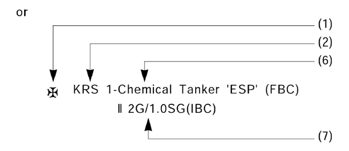
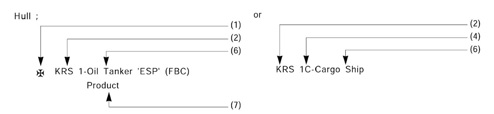

# PART 1 Classification and Surveys

> RULES FOR CLASSIFICATION OF STEEL SHIPS / RA-01-E / 2025 / EN / Guidance

## CHAPTER 3 HULL SURVEYS OF SHIPS SUBJECT TO THE ENHANCED SURVEY PROGRAMME

### Section 2 Bulk Carriers

#### 202. Annual Survey (2021)

- **1.** In application to **202. 6** (2) of the Rules, "the Guidance" means the requirements specified as follows. **【See Rule】**
  - **(1)** General
    - Shell frames including their upper and lower end attachments, adjacent shell plating, and transverse bulkheads.
    - Suspect areas identified at previous surveys.
    - All shell frames including their upper and lower end attachments, adjacent shell plating, and transverse bulkheads.
    - Suspect areas identified at previous surveys.
    Note : For existing bulk carriers, where Owners may elect to coat or recoat cargo holds as noted above, consideration may be given to the extent of the Close-up Surveys and thickness measurement. Prior to the coating of cargo holds of existing ships, scantlings should be ascertained in the presence of a Surveyor.
    - **(A)** In the case of bulk carrier over 5 year of age, the Annual Survey is to include, in addition to the requirements of the Annual Surveys specified in **202.** of the Rules, an examination of the following items:
    - **(B)** Extent of Survey
      - **(a)** For bulk carriers of 5 - 15 years of age:
      - **(i)** An Overall Survey of the foremost cargo hold, including Close-up Survey of sufficient extent, minimum 25% of frames, is to be carried out to establish the condition of:
        - **(ii)** Where considered necessary by the Surveyor as a result of the Overall and Close-up Survey as described in (i) above, the survey is to be extended to include a Close-up Survey of all of the shell frames and adjacent shell plating of the cargo hold.
      - **(b)** For bulk carriers exceeding 15 years of age:
      - **(i)** An Overall Survey of the foremost cargo hold, including Close-up Survey is to be carried out to establish the condition of:
    - **(C)** Extent of thickness measurement *(2018)*
      - **(a)** Thickness measurement is to be carried out to an extent sufficient to determine both general and local corrosion levels at areas subject to Close-up Survey, as described in (B) (a) (i) and (b) (i) above and in case of areas found to be suspect at previous surveys, the thickness measurement for suspect areas are to be carried out additionally. Where substantial corrosion is found, the extent of thickness measurements should be increased with the requirements of **Annex 1-5, Table 14** of the Guidance.
    - **(D)** Special consideration
      - **(a)** Where the hard protective coating in the foremost cargo hold is found to be in GOOD condition, the extent of Close-up Surveys and thickness measurements may be reduced by sufficiently confirming the actual average condition of the structure under the coating. *(2019)*

### Section 3 Oil Tankers

#### 304. Special Survey (2021)

- **1.** In application to **304. 5** of the Rules, the following guidance on pressure testing of boundaries of cargo tanks under direction of the master is to be applied. **【See Rule】**
  - **(1)** Where the ship is in a shipyard or is under attendance of the Surveyor(s) the testing of cargo tanks is to be carried out under the direction, and in the presence, of the Surveyor(s). It should be noted that all ballast tanks adjacent to cargo tanks are to be tested by the Surveyor(s).
  - **(2)** Tests of the cargo tank(s) carried out under this procedure are to be the satisfaction of the master.
  - **(3)** "Failed test" : where the outcome of tank testing reveals structural damage or leakage, the Society should be advised with immediate effect, and attendance on board by the Surveyor arranged.
  - **(4)** Pressure testing using cargo
    
    **Fig 1.3.1 "Stagger test" - checker board pattern**
    - **(A)** In order to test the relevant boundaries, the ship may be loaded in a checker board pattern(**Fig 1.3.1**), so that each cargo tank internal bulkhead is subjected to a fully loaded head of pressure provided that the intended loading and stability condition are checked and confirmed by the master.
    - **(B)** The ship's logbook is to confirm that (A) above and (5) below, have been successfully carried out and that it is to be signed by the master.
  - **(5)** Combined pressure and tightness testing using ballast water
    If practical with respect to the operation of the ship, it is acceptable to carry out combined pressure and tightness testing using ballast water provided the relevant requirements in (4) above are complied with and that the relevant tank boundaries are accessible for inspection. The boundaries and associated welds between the tank under test and adjacent cargo tanks are to be fully inspected to ensure there is no indication of water leakage across the boundaries.
  - **(6)** Water ballast tanks inclusive boundaries facing the cargo tanks, shall be tested in accordance the relevant Rules. These tests are to be witnessed and all boundaries are to be examined by the attending Surveyor.
  - **(7)** Master's inspections, assessment and reporting
    The following requirements describe the operations that are required of the master when carrying out the inspections of the boundaries of the cargo tank which are to be submitted to a hydrostatic test. All safety precautions and facilities (lighting, ventilation, etc.) should be provided according to the ship's safety management system(SMS) documentation and the cargo tank testing procedure as approved by the Society.
    The report is to be retained on board for the attention of the Surveyor(s).
    - **(A)** General
    - **(B)** Places to be inspected
      - **(a)** All boundaries of the cargo tank under testing are to be examined from positions outside of the cargo tank boundaries. Boundaries of commonly shaped tanks are constituted by:
      - **(i)** a transverse aft bulkhead and associated structure;
        - **(ii)** a transverse fore bulkhead and associated structure;
        - **(iii)** two longitudinal bulkheads and relevant associated structure; and
        - **(iv)** an inner bottom plating and associated structure.
      - **(b)** Each of these boundaries is the common division between the cargo tank under testing and another:
      - **(i)** cargo tank, or
        - **(ii)** ballast tank/double bottom, or
        - **(iii)** fuel oil tank, or
        - **(iv)** void space, or pump-room.
      - **(c)** The inspection is to verify that:
      - **(i)** the plating and structures of each boundary are not affected by evident geometrical defects, such as deflection/distortion of the structures supporting the plating of the boundaries, when hydro-statically loaded; and
        - **(ii)** the tightness of each boundary is not impaired, i.e. no leakages are to appear anywhere on surface of each boundary, especially at the welded joints connecting the plates which constitute the boundary itself.
      - **(d)** Each boundary should be closely inspected, noting any defective items from the two categories above.
    - **(C)** Reporting
      - **(a)** Following the inspection of all boundaries surrounding the cargo tank under test, the master is required to report, in a simple manner, the results of the inspection. The report is to be recorded in the ship's logbook and include all data relevant to:
      - **(i)** identification of the cargo tank subjected to testing;
        - **(ii)** identification of the compartments surrounding the cargo tank subject to testing;
        - **(iii)** date, time and place of testing;
        - **(iv)** ship's loading condition during the testing, including ship trim; and
      - **(v)** outcome of the inspections carried out during the testing.
      - **(b)** Where no deficiencies have been found or noted, the testing of the cargo tank can be considered as having a satisfactory outcome. 
