# PART 1 Classification and Surveys

> RULES FOR CLASSIFICATION OF STEEL SHIPS / RA-01-E / 2025 / EN / Guidance

## Annex 1-5 Thickness Measurement Method for Hull Structural Members (2024)

### 1. General

#### (1) Purpose of thickness measurement (2022)

- **(A)** Corrosion seems to be one of the common denominators in many cases of serious hull casualties resulting in losses of vessels, cargoes and human lives.
  The purpose of thickness measurement is to prevent vessels from hull casualties.
  Information provided in the report of hull thickness measurements for a vessel put in service indicates that the vessel is maintaining sufficient local and global strength, if necessary renewal/repair works can be made accordingly.
  Therefore, thickness measurement reports giving information for the assessment of hull strength as well as for the maintenance of the hull is to be carefully considered. *(2024)*

#### (2) Extent of thickness measurement

The standard extent of thickness measurements complying with the "Rules for Classification of Steel Ships" is given in **Table 4** to **Table 13.** However, the extent of thickness measurements may be specially considered by the Society, considering the coating and corrosion condition.

#### (3) Thickness measurement report (2024)

- **(A)** Thickness measurement reports are to be recorded in the following form and submitted.
  - **(a)** General particulars as shown in **Table 19**; and
  - **(b)** In case of non-CSR ships, measuring position, diagram with details of the position to be measured, original thickness, maximum allowable diminution and present thickness (gauged) and diminution, etc. Reporting form shown in **Table 20-1**(or equivalent form).
  - **(c)** In case of ships built in accordance with the IACS Common Structural Rules (**Pt 11, Pt 12** or **Pt 13** of the Rules), measuring position, diagram with details of the position to be measured, as builted thickness, voluntary thickness addition, renewal thickness, present thickness(gauged) and remaining corrosion addition, etc. Reporting form shown in **Table 20-2**(or equivalent form).

### 2. Wear Limit

#### (1) General

- **(A)** This annex provides standard of wear limit for decision of repair of main hull structural members or hull equipment. Wear limit or allowable wear quantity means allowable wear limit.
- **(B)** When worn down thickness of hull structural members exceed the wear limit, inspections are to be carried out in detail and corresponding hull structural members are to be renewed by the date recommended by the Surveyor.
  If the thickness measurement results of structural members or fittings exceed the wear limit, the processing procedure is to comply with **Ch 2, 109**. of the Rules.
- **(C)** Wear limit on hull structural members not provided by this annex follows what is deemed appropriate by the Surveyor.

#### (2) Wear limit on hull structural members

- **(A)** Wear limits on structural members are provided in **Table 1.** However, for vessels built under IACS Common Structural Rules(**Pt 11**, **Pt 12** or **Pt 13**), **Ch 3, 105. 2** of the Rules is to be applied.
- **(B)** Value of wear limit indicates the limit on equally distributed wearing.
- **(C)** When partial corrosion occurs in stress concentrated part, partial replacement or reinforcement shall be carried out without reference to **Table 1.**

  **Table 1 Wear limit on members**

  | Local Wear Limit | Name of member | Wear limit |   |   |
  | --- | --- | --- | --- | --- |
  | Local Wear Limit | Name of member | Class Ⅰ^1) | Class Ⅱ^1) | Class Ⅲ^1) |
  | Local Wear Limit | Strength deck plating, sheer strake and longitudinals to these members, shell plating, bottom shell plating, bulkhead plating of deep tank^3), topside sloping plating, hopper side sloping plating, inner bottom plating *(2025)* | 20 % of original thickness^4) *(2025)* | (20 % of original thickness) + 1 $\mathrm{mm}$ | 1 $\mathrm{mm}$ |
  | Local Wear Limit | Floor & girder of double bottom, web and face of primary supporting member | 20 % of original thickness | 25 % of original thickness | 1 $\mathrm{mm}$ |
  | Local Wear Limit | Effective deck^5) plating, superstructure deck plating, deck plating inside the line of cargo hatch openings, watertight bulkhead plating other than bulkhead plating of deep tank, hatch cover(including stiffeners), hatch coaming(including stiffeners), web, face and brackets of secondary stiffener^6) *(2025)* | 25 % of original thickness | 30 % of original thickness | 1 $\mathrm{mm}$ |
  | Local Wear Limit | Web, face and brackets of frames in cargo hold/tank | 20 % of original thickness or 1.5 $\mathrm{mm}$, whichever greater | 25 % of original thickness or 2.5 $\mathrm{mm}$, whichever greater | 1 $\mathrm{mm}$ |
  | Local Wear Limit | Partial corrosion (e.g pitting) | 30 % of original thickness | 35 % of original thickness | 1 $\mathrm{mm}$ |
  | Local Wear Limit | (NOTES) 1) For ships classed through the Classification Survey during Construction : the Class I, II and III are as follow. (a) Class I : It is applied to ships having one or two of the following characteristics. (i) Ships, with of length of 90 $\mathrm{m}$ and above, which are classed with Classification Survey during Construction in accordance with the Rules after 1st July 1998. (ii) Ships carry for liquid cargo, which are classed with Classification Survey during Construction in accordance with the Rules after 1st July 1998. (b) Class II : Ships, other than in Class I and III. (c) Class III : Ships constructed with steel, which is applied to the **Rules for the Classification** **of High Speed and Light Crafts** and the **Guidance Relating to the Rules for** **the Classification of High Speed and Light Crafts.** 2) For ships classed through the Classification Survey after Construction, the separate requirements specified by the Society are to be applied. 3) Definition of deep tank is specified in **Pt 3, Ch 15, 101.** of the Rules. 4) Definition of original thickness is the thickness on the drawing. However, if the thickness required by the rules is separately specified for each member, that is to be followed. *(2025)* 5) Definition of effective deck is specified in **Pt 3, Ch 5, 103.** of the Rules. 6) Secondary stiffener refers to the member which is supported by the primary supporting member and does not support another reinforcement member. |   |   |   |
  | Wear relating to the Shearing Strength | The shearing strength evaluation is to be carried out in any of the following cases when the thickness measurement for the longitudinal strength evaluation is carried out in accordance with the separate requirements specified by the Society. 1) For oil tankers(including chemical tankers), the average corrosion of any stake in side shell or longitudinal bulkhead exceeds the followings, Class I : 2.0 $\mathrm{mm}$ Class II : 3.0 $\mathrm{mm}$ 2) For liquefied gas carriers, the average corrosion of any stake in side shell exceeds the followings, or Class I : 1.5 $\mathrm{mm}$ Class II : 2.5 $\mathrm{mm}$ 3) For bulk carriers(including ore carriers) intended for alternate loading, the average corrosion of any stake in side shell or longitudinal bulkhead exceeds the followings Class I : 1.5 $\mathrm{mm}$ Class II : 2.5 $\mathrm{mm}$ |   |   |   |

#### (3) Wear limit of hold hatch cover of bulk carriers which are contracted for construction after 1st July 1998 and before 1st January 2004 and designed by the Rules Pt 4, Ch 2 is to be determined in accordance with the following requirements.

- **(A)** Single skin hatch covers and the pontoon hatch covers
  - **(a)** Steel renewal is required where the gauged thickness is worn more than 1.5 $\mathrm{mm}$ (less than $t _{n e t} +0.5 \mathrm{mm}$). The net thickness $t _{n e t}$ is the thickness obtained by subtracting the corrosion addition from the required thickness.
  - **(b)** Where the gauged thickness is worn within the range 1.0 $\mathrm{mm}$ and 1.5 $\mathrm{mm}$ ($t _{n e t} +0.5 \mathrm{mm}$ and $t _{n e t} +1.0 \mathrm{mm}$), coating applied in accordance with coating manufacturer's requirements or annual gauging may be adopted as an alterative to steel renewal.
- **(B)** Internal structural members of pontoon hatch covers
  Thickness gauging is required when plating renewal is to be carried out in accordance with previous (a) or when it is deemed necessary, at the discretion of the Society, on the basis of the plating corrosion or deformation condition. In these cases, steel renewal for the internal structures is required where the gauged thickness is worn more than 1.5 $\mathrm{mm}$ (less than $t _{n e t}$).

#### (4) Wear limit of hold hatch cover and hatch coatings of all bulk carriers, ore carriers and combination carriers which are contracted for construction on or after 1st January 2004 and before 1st July 2024 and designed by the Rules Pt 7, Ch 3, Sec 9 is to be determined in accordance with the following requirements. (2025)

- **(A)** Single skin hatch covers and double skin hatch covers
  - **(a)** Steel renewal is required where the gauged thickness is worn more than 1.5 $\mathrm{mm}$ (less than $t _{n e t} +0.5 \mathrm{mm}$).
  - **(b)** Where the gauged thickness is worn within the range 1.0 $\mathrm{mm}$ and 1.5 $\mathrm{mm}$ ($t _{n e t} +0.5 \mathrm{mm}$ and $t _{n e t} +1.0 \mathrm{mm}$), coating applied in accordance with coating manufacturer's requirements or annual gauging may be adopted as an alterative to steel renewal. Coating is to be maintained in GOOD condition, as defined in **Ch 2, 102.** “Coating Condition“ of the Rules *(2024)*
- **(B)** Internal structural members of double skin hatch covers
  Thickness gauging is required when plating renewal is to be carried out in accordance with previous (a) or when it is deemed necessary, at the discretion of the Society, on the basis of the plating corrosion or deformation condition. In these cases, steel renewal for the internal structures is required where the gauged thickness is worn more than 1.5 $\mathrm{mm}$ (less than $t _{n e t}$).
- **(C)** Hatch coamings
  - **(a)** Steel renewal is required where the gauged thickness is worn more than 1.0 $\mathrm{mm}$ (less than $t _{n e t} +0.5 \mathrm{mm}$).
  - **(b)** Where the gauged thickness is worn within the range 0.5 $\mathrm{mm}$ and 1.0 $\mathrm{mm}$ ($t _{n e t} +0.5 \mathrm{mm}$ and $t _{n e t} +1.0 \mathrm{mm}$), coating applied in accordance with coating manufacturer's requirements or annual gauging may be adopted as an alterative to steel renewal. Coating is to be maintained in GOOD condition, as defined in in **Ch 2, 102.** “Coating Condition“ of the Rules *(2024)*

#### (5) The renewal thickness(_s2) of steel hatch covers and coamings in position I and II on exposed decks, subjected to Pt 4, Ch 2, of ships other than bulk carriers which are keel laid on ore after 1st January 2005 and are contracted for construction before 1st July 2024 are to be in accordance with as followings. (Refer to Pt 4, Ch 2, 107. 2) (2025)

$t _{renewal} = t _{as-built} - t _{c} + 0.5$ ($\mathrm{mm}$)
Where,
$t _{as-built}$ : as built thickness
$t _{c}$ : corrosion addition according to **Pt 4, Ch 2, 107. Table 4.2.1** of the Rules
Where the corrosion addition $t _{c}$ is 1.0 $\mathrm{mm}$, the renewal thickness may be given by the following formula
$t _{renewal} = t _{as-built} - t _{c}$ ($\mathrm{mm}$)

#### (6) The renewal thickness(_s2) of steel hatch covers and coamings in position I and II on exposed decks, subjected to Pt 4, Ch 2, of all ships except bulk carriers to which Pt 13 are contracted for construction on or after 1st July 2024 are to be in accordance with as followings. (Refer to Pt 4, Ch 2, 107. 2 & 3) (2025)

- **(A)** Renewal thickness
  $t _{renewal} =t _{as-built} -t _{c} +0.5$(mm)
  where,
  $t _{c}$ : Corrosion addition according to **Table 2**
  In case that corrosion addition $t _{c}$ is 1.0 mm, renewal thickness may be given by the following formula.
  $t _{renewal} =t _{as-built} -t _{c}$(mm)

  | Application | Structure | $t _{c}$ ($\mathrm{mm}$) |
  | --- | --- | --- |
  | Container ships, car carriers, paper carriers, passenger vessels | Hatch covers | 1.0 |
  | Container ships, car carriers, paper carriers, passenger vessels | Hatch coamings | 1.5 |
  | Type-2 ships | Single skin hatch covers | 2.0 |
  | Type-2 ships | Top plating and bottom plating of double skin hatch covers | 2.0 |
  | Type-2 ships | Internal structure of double skin hatch covers | 1.5 |
  | Type-2 ships | Hatch coamings and coaming stays | 1.5 |
  | All other ship types | Single skin hatch covers | 2.0 |
  | All other ship types | Top plating and bottom plating of double skin hatch covers | 1.5 |
  | All other ship types | Internal structure of double skin hatch covers and closed box girders | 1.0 |
  | All other ship types | Hatch coaming parts including stays and stiffeners | 1.5 |
- **(B)** Steel renewal
  - **(a)** The treatment in relation to gauged thickness are to be obtained from **Table 3.**
  - **(b)** Where applied protection coating, coating applied in accordance with the coating manufacturer's requirements. Coating is to be maintained in GOOD condition, as defined in **Pt 1, Ch 2, 102** of the Rules.
  - **(c)** For the internal structure of double skin hatch covers, thickness gauging is required when hatch cover top or bottom plating renewal is to be carried out or when this is deemed necessary, at the discretion of the Surveyor, on the basis of the plating corrosion or deformation condition. In these cases, steel renewal for the internal structures is required where the gauged thickness is less than *t* _net.

    | Treatment | Where $t _{c} \geq 1.5 mm$ | Where $t _{c} =1.0 mm$ |
    | --- | --- | --- |
    | Steel renewal | $t _{g} \(t _{g} \leq t _{n et}$ |   |
    | Apply protection coating or annual gauging | \(t _{n et it} +0.5 \(t _{n et it} |   |

#### (7) Wear limit of corrugated transverse watertight bulkheads for bulk carriers, which are contracted for construction after 1st July 1998 and designed by the Rules Pt 7, Ch 3, 1201. is to be determined in accordance with the following requirements.

- **(A)** Steel renewal is required where the gauged thickness is worn more than 3.0 $\mathrm{mm}$ (less than $t _{n e t} +0.5 \mathrm{mm}$).
- **(B)** Where the gauged thickness is worn within the range 2.5 $\mathrm{mm}$ and 3.0 $\mathrm{mm}$ ($t _{n e t} +0.5 \mathrm{mm}$ and $t _{n e t} +1.0 \mathrm{mm}$), coating applied in accordance with coating manufacturer's requirements or annual gauging may be adopted as an alterative to steel renewal.

#### (8) Corrosion addition and steel renewal of vertically corrugated transverse watertight bulkheads between cargo holds No. 1 and 2 for bulk carriers, which are applied to Pt 7, Annex 7-5, 1 (1) (A) of the Guidance, are to be determined in accordance with the requirements specified in Pt 7, Annex 7-5, 1 (6).

#### (9) The wastage allowances of supporting hull structures associated with towing and mooring, subject to Pt 4, Ch 10 of the Rules, of ships which are keel laid on or after 1st January 2007 are specified in Pt 4, Ch 10, 204. Corrosion addition and 205. Wear allowance of the Rules. (2024)

### 3. Location of Thickness Measurement

#### (1) Thickness measurements for suspect area

The thickness gaugings may be required as a result of Close-up Survey in suspect areas(i.e., locations showing substantial corrosion and/or considered by the Surveyor to be prone to rapid wastage). Details are given in **Table 2.** *(2024)*

#### (2) Location and number of thickness measuring points

The standard location and number of thickness measuring points and patterns are shown in **Table 3.** These figures show typical arrangements of ships such as bulk carriers and oil tankers, etc. and these may be used as guidance for different type of ships other than those illustrated. The location and number of thickness measuring points for other hull structural members which are not specified in this Annex are to be in accordance with what considered appropriate by the Surveyor taking into account of the ship's age and hull structure, etc.

#### (3) Thickness Measurement at Special Survey

The standard extent of thickness measurements at each Special Survey are given in **Table 4** to **Table 13.**

### 5. Sampling method of thickness measurements for longitudinal strength evaluation and repair methods for oil tankers or double hull oil tankers subject to the enhanced survey programme

#### (1) Extent of longitudinal strength evaluation

Longitudinal strength should be evaluated within 0.4 $L$ amidships for the extent of the hull girder length that contains tanks therein and within 0.5 $L$ amidships for adjacent tanks which may extent beyond 0.4 $L$ amidships, where tanks means ballast tanks and cargo tanks.

#### (2) Sampling method of thickness measurement

- **(A)** Pursuant to the requirements of **Ch 3, 304. 4** or **504. 4** of the Rules as applicable, transverse sections should be chosen such that thickness measurements can be taken for as many different tanks in corrosive environments as possible, e.g. ballast tanks sharing a common plane boundary with cargo tanks fitted with heating coils, other ballast tanks, cargo tanks permitted to be filled with sea water and other cargo tanks. Ballast tanks sharing a common plane boundary with cargo tanks fitted with heating coils and cargo tanks permitted to be filled with sea water should be selected where present.
- **(B)** The minimum number of transverse sections to be sampled should be in accordance with **Ch 3, Table 1.3.5** or **Table 1.3.11** of the Rules as applicable. The transverse sections should be located where the largest thickness reductions are suspected to occur or are revealed from deck and bottom plating measurements prescribed in (C) and should be clear of areas which have been locally renewed or reinforced.
- **(C)** At least two points should be measured on each deck plate and/or bottom shell plate required to be measured within the cargo area in accordance with the requirements of **Ch 3, Table 1.3.5** or **Table 1.3.11** of the Rules as applicable.
- **(D)** Within 0.1 $D$ (where $D$ is the ship's moulded depth) of the deck and bottom at each transverse section to be measured in accordance with the requirements of **Ch 3, Table 1.3.5** or **Table 1.3.11** of the Rules as applicable, every longitudinal and girder should be measured on the web and face plate, and every plate should be measured at one point between longitudinals.
- **(E)** For longitudinal members other than those specified in (D) above to be measured at each transverse section in accordance with the requirements of **Ch 3, Table 1.3.5** or **Table 1.3.11** of the Rules as applicable, every longitudinal and girder should be measured on the web and face plate, and every plate should be measured at least in one point per strake.
- **(F)** The thickness of each compartment should be determined by averaging all of the measurements taken in way of the transverse section on each compartment.

#### (3) Additional measurements where the longitudinal strength is deficient.

- **(A)** Where one or more of the transverse sections are found to be deficient in respect of the longitudinal strength requirements, the number of transverse sections for thickness measurement should be increased such that each tank within the 0.5 $L$ amidships region has been sampled. Tank spaces that are partially within, but extend beyond, 0.5 $L$ region, should be sampled.
- **(B)** Additional thickness measurements should also be performed on one transverse section forward and one aft of each repaired area to the extent necessary to ensure that the areas bordering the repaired section also comply with the requirements of the Rules.

#### (4) Effective repair methods

- **(A)** The extent of renewal or reinforcement carried out to comply with the Rules should be in accordance with (B) below.
- **(B)** The minimum continuous length of a renewed or reinforced structural member should be not less than twice the spacing of the primary members in way. In addition, the thickness diminution in way of the butt joint of each joining member forward and aft of the replaced member(plates, stiffeners, girder webs and flanges, etc.) should not be within the substantial corrosion range(75% of the allowable webs and flanges, etc.) should not be within the substantial corrosion range(75% of the allowable diminution associated with each particular member).
  Where differences in thickness at the butt joint exceed 15% of the lower thickness, a transition taper should be provided.
- **(C)** Alternative repair methods involving the fitting of straps or structural member modification should be subject to special consideration. In considering the fitting of straps, it should be limited to the following conditions:
  - **(a)** to restore and/or increase longitudinal strength;
  - **(b)** the thickness diminution of the deck or bottom plating to be reinforced should not be within the substantial corrosion range(75% of the allowable diminution associated with the deck plating):
  - **(c)** the alignment and arrangement, including the termination of the straps, is in accordance with the separate requirements specified by the Society;
  - **(d)** the straps are continuous over the entire 0.5 $L$ amidships length; and
  - **(e)** continuous fillet welding and full penetration welds are used at butt welding and, depending on the width of the strap, slot welds. The welding procedures applied should be acceptable to the Society.
- **(D)** The existing structure adjacent to replacement areas and in conjunction with the fitted straps, etc. should be capable of withstanding the applied loads, taking into account the buckling resistance and the condition of welds between the longitudinal members and hull envelope plating.

  **Table 2 Suspect areas on which attention is to be paid**

  | Location | Measuring Points |   |
  | --- | --- | --- |
  | Deck and upper structures | Special attention is to be given on fore parts (forward of 0.5 $L$ amidships) of strength deck, areas with standing bilges and members with originally light scantlings in addition to the following: |   |
  | Deck and upper structures | F'cle, poop and deckhouse | Break bulkheads of superstructures, Lower parts of deckhouse walls, Pipe penetration areas, Areas with drain plugs, Deck platings of superstructures, Deck platings in way of bilgeways, deck scuppers, deck machinery (winches, windlasses etc.), fair-leaders and bollards etc. |
  | Deck and upper structures | Deck platings inside line of hatch openings and inside superstructures and deckhouses | Deck platings inside line of openings between cargo hatchways, and of deck platings inside superstructures and deckhouses. |
  | Deck and upper structures | Hatch coamings and coaming stays | Lower parts attached to upper deck, Parts around steam pipes. |
  | Deck and upper structures | Bulwark platings and bulwark stays | Lower parts attached to upper deck, End parts connected to superstructures and deckhouses, Platings around freeing ports. |
  | Deck and upper structures | Winch foundation | Special attention is to be given to steam winch foundations |
  | Deck and upper structures | Steel hatch covers | Steel pontoon covers (including cleats, etc.) |
  | Shells | Wind and water strakes | Special attention is to be given to fore and after part outside of 0.5 $L$ amidships. |
  | Shells | Shell platings connected to end brackets | After removal of limber boards and cement chocks, Close-up Survey is required. |
  | Shells | Shells attached to hold frames | Special attention is to be given to groovings on shells. |
  | Shells | Shells around chain lockers | - |
  | Shells | Hard spotted shells | Special attention is to be given to shells (parts or positions) in ballast tanks |
  | Internal members | Special attention is to be given to areas with high humidity, standing bilges and poorly ventilated spaces in addition to the following : |   |
  | Internal members | Joint parts between hold frames and frame brackets | After removal of limber board, those parts are to be examined (problem areas in aged ships) |
  | Internal members | Intersections between transverse W/T Bulkhead and inner bottom | After removal of bottom ceilings, those parts are to be examined. |
  | Internal members | Tank top platings of double bottom tanks and of deep tanks used as ballast tanks | - |
  | Internal members | Fillet weld parts between hold frames and side shells | Special attention is to be paid to hold frames in intermittent welds. |
  | Internal members | Bilge wells | Special attention si to be given to bilge wells in E/R and bilge wells with piping arrangements. |
  | Internal members | Inner bottom platings under pillars | - |
  | Internal members | Internal members around sea water pumps in E/R | - |
  | Internal members | Sea chest boundaries in E/R | - |
  | Internal members | Joint parts between shaft tunnel and inner bottom | Close-up Survey is required for aged ships |
  | Internal members | Intersections between tweendeck frames or tweendeck bulkheads and lower deck | - |
  | Internal members | Lower parts of collision BHD and bottom of chain lockers | - |
  | Internal members | Intersections between panting/side stringers and frames, and end parts, slot areas in way of panting/side stringers | - |

  **Table 2 Suspect areas on which attention is to be paid** (continued)

  | Location | Measuring Points |   |
  | --- | --- | --- |
  | Inside of tanks | Special attention is to be paid to the combined tanks (ballast and fuel oil), prone to rapid wastage, in addition to the following: |   |
  | Inside of tanks | All of ballast tanks in front of E/R boundaries | Close-up Survey is required for tank top, bottom and boundary platings of the tanks not forming their boundaries by full envelope (both shells and decks). And special attention is to be paid to connections between frames and brackets, and on docking brackets, lightening holes |
  | Inside of tanks | Double bottom ballast tanks, side ballast tanks, and shaft tunnels | Special attention is to be paid to inner bottom platings meeting bulkheads, edge platings reaching to tank side brackets, and on lightening holes/slots in way of girders and on bottom shells around striking pads below sounding pipes. |
  | Inside of tanks | Bulkheads facing a heated zone | Special attention is to be paid to bulkheads facing E/R space, or fuel oil tanks being heated. |
  | Inside of tanks | Bottom platings below sounding pipes | Special attention is to be paid to bilge tanks in E/R |
  | Inside of tanks | Chain lockers in fore peak tanks | Special attention is to be paid to bottom platings and side boundaries of chain lockers. |

  **Table 3-1 Location and number of thickness measuring points - Non-CSR Ships** **Table 3-1** is to be applied to vessels not built under IACS Common Structural Rules (**Pt 11**, **Pt 12** or **Pt 13**) (i.e. Non-CSR Ships)

  | Items | Location and number of thickness measuring points |
  | --- | --- |
  | Transverse Section | 1. For oil tankers, chemical tankers or double hull oil tankers subject to the enhanced survey programme (See **Fig 1** and **Fig 2**) (1) At each transverse section, every plate within 0.1D(where D is the ship's moulded depth) of the deck and bottom is to be measured at one point between longitudinals, and all the other plate is to be measured at least one point per strake. (2) Where the thickness measurements for a transverse section are to include all longitudinal members, every longitudinal is to be measured at one point on the web and face plate. 2. For single skin bulk carriers, double skin bulk carriers or general dry cargo ships (See **Fig 3** and **Fig 4**) (1) At each transverse section, every plate of the deck and inner bottom is to be measured at one point between longitudinals, and all the other plate is to be measured at least one point per strake. (2) Where the thickness measurements for a transverse section are to include all longitudinal members, every longitudinal is to be measured at one point on the web and face plate. 3. For general ships other than **1** and **2** above (See **Fig 5**) (1) At each transverse section, every plate is to be measured at least two points per strake. (2) Where the thickness measurements for a transverse section are to include all longitudinal members, every longitudinal is to be measured at one point on the web and face plate. 4. For transversely framed vessels, a transverse section includes adjacent frames and their end connections in way of transverse sections. (For oil tankers, chemical tankers or double hull oil tankers subject to the enhanced survey programme see **Fig 1** and **Fig 2**, for single skin or double skin bulk carriers see **Fig 6** and **Fig 8**, for other ships see **Fig 7**) |
  | Transverse Section of deck, side shell and bottom plating | At least two points on each plate(either at each 1/4 extremity of plate or at representative areas of average corrosion) are to be measured in the transverse section concerned. |
  | Selected plates: Selected plates on deck(including deck inside line of hatch openings), tank top, bottom, inner bottom plates, etc. and wind-and-water strakes | At least two points are to be measured at representative areas of average corrosion. Where the length of the plate exceeds 6 $\mathrm{m}$, two points per 6 $\mathrm{m}$ are to be gauged additionally. Where plates cross ballast/cargo tank boundaries separate measurements for the area of plating in way of each type of tank are to be taken. In case of side shell plating, one or two wind and water strakes are to be gauged according to No. of Special Survey. The gauging location of each plate may be selected by the attending Surveyor in consideration of the corrosion pattern. |
  | All plates: All deck(including deck inside line of hatch openings), tank top, bottom, inner bottom plates, etc. and wind-and-water strakes | At least two points on each plate(either at each 1/4 extremity of plate or at representative areas of average corrosion) are to be measured. Where the length of the plate exceeds 6 $\mathrm{m}$, two points per 6 $\mathrm{m}$ are to be gauged additionally. Where plates cross ballast/cargo tank boundaries separate measurements for the area of plating in way of each type of tank are to be taken. |
  | Selected internal structures: Selected internal structure such as floors and longitudinals, transverse frames, web frames, deck beams, girders | The internal structural members to be measured in each space internally surveyed are to be 1. at least 10% outside the cargo (length) area, 2. at least 20% within the cargo (length) area. (For oil tankers, chemical tankers or double hull oil tankers subject to the enhanced survey programme see **Fig 1** and **Fig 2**, for single skin or double skin bulk carriers see **Fig 6**, for other ships see **Fig 7**) |

  **Table 3-1 Location and number of thickness measuring points - Non-CSR Ships** (continued)

  | Items | Location and number of thickness measuring points |
  | --- | --- |
  | Selected side shell frames in cargo holds for single skin bulk carriers or general dry cargo ships | 1. Include side shell frame, upper and lower end attachments and adjacent shell plating. 2. 25% of frames: one out of four frames should preferably be chosen throughout the cargo hold length on each side. 3. 50% of frames: one out of two frames should preferably be chosen throughout the cargo hold length on each side. 4. "Selected frames" means at least 3 frames on each side of cargo holds. (For single skin bulk carriers see **Fig 6**, for general dry cargo ships see **Fig 7**) |
  | Transverse webs in ballast tanks for single skin bulk carriers, double skin bulk carriers or general dry cargo ships | One of the representative tanks of each type (i.e. topside or hopper or side tank) is to be chosen in the forward part. (For single skin or double skin bulk carriers see **Fig 6**, for general dry cargo ships see **Fig 7**) |
  | Transverse frames in double skin tanks for double skin bulk carriers | 25% of transverse frames: one out of four transverse frames is to be chosen preferably throughout the double skin tank length. (See **Fig 8**) |
  | Transverse bulkheads | 1. For oil tankers, chemical tankers or double hull oil tankers subject to the enhanced survey programme: See **Fig 1** and **Fig 2** 2. For single skin bulk carriers, double skin bulk carriers or general dry cargo ships (See **Fig 9** to **Fig 11**) (1) Transverse bulkheads in cargo holds - Includes bulkheads plating, stiffeners and girders, including internal structure of upper and lower stools, where fitted. - Two selected bulkheads : one is to be the bulkhead between the two foremost cargo holds and the second may be chosen in other positions (2) One transverse bulkhead in each cargo hold - The Close-up Survey and related thickness measurements are to be carried out on one side of the bulkhead; the side is to be chosen based on the outcome of the Overall Survey of both sides. In the event of doubt, the Surveyor may also require (possibly partial) Close-up Survey and related thickness measurements on the other side. (3) Transverse bulkheads in one ballast tank - The ballast tank is to be chosen based on the history of ballasting among those prone to have the most severe conditions. |
  | Cargo hold hatch covers and coamings | See **Fig 12** |
  | All under deck structure inside line of hatch openings between cargo hold hatches | At each short longitudinal girder: three points for web plating(fwd/middle/aft), single point for face plate, one point for web plating and one point for face plating of transverse beam in way. At each ends of transverse beams, one point for web plating and one point for face plating. (See **Fig 13**) |
  | (NOTES) 1. mark : means the location to be measured. 2. ×, ˅ mark : means the point to be measured. |   |

  | **Table 3-1 Location and number of thickness measuring points - Non-CSR Ships** (continued) |
  | --- |
  |  **Fig 1 Locations of measurements of oil tankers and chemical tankers** **Fig 1 Locations of measurements of oil tankers and chemical tankers** |

  | **Table 3-1 Location and number of thickness measuring points - Non-CSR Ships** (continued) |
  | --- |
  | 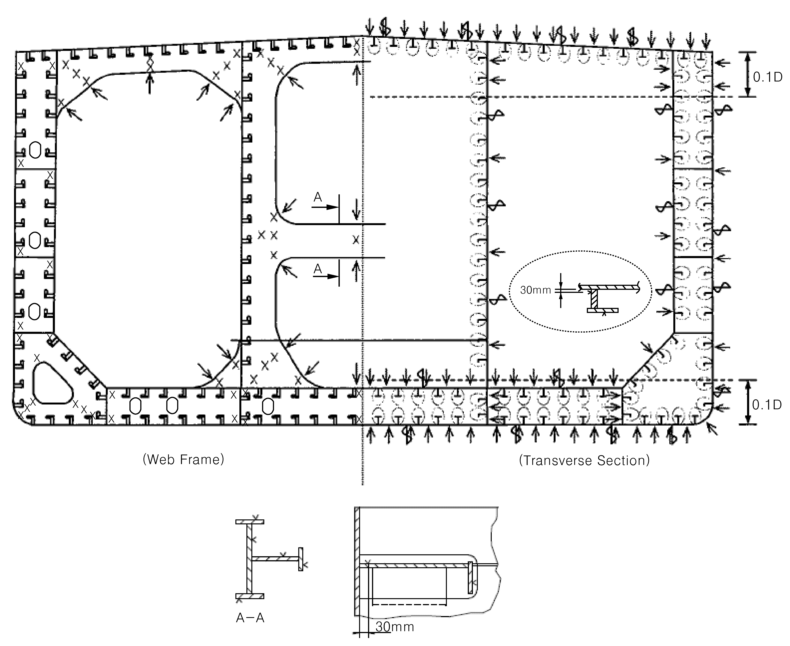 **Fig 2 Locations of measurements of double hull oil tankers**#imgID-19**Fig 3 Locations of measurements on transverse section of single skin or double skin bulk carriers** **Fig 2 Locations of measurements of double hull oil tankers** 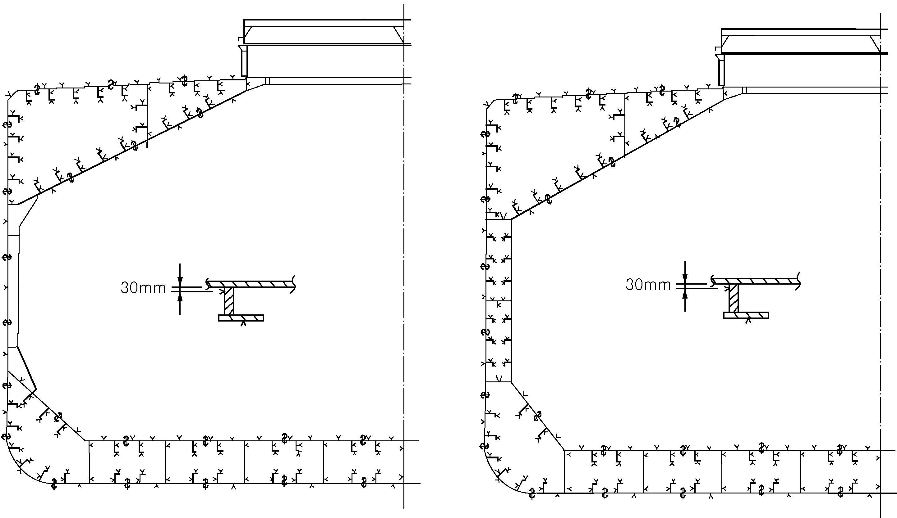 **Fig 3 Locations of measurements on transverse section of single skin or double skin bulk carriers** **Fig 3 Locations of measurements on transverse section of single skin or double skin bulk carriers** |

  | **Table 3-1 Location and number of thickness measuring points - Non-CSR Ships** (continued) |
  | --- |
  | 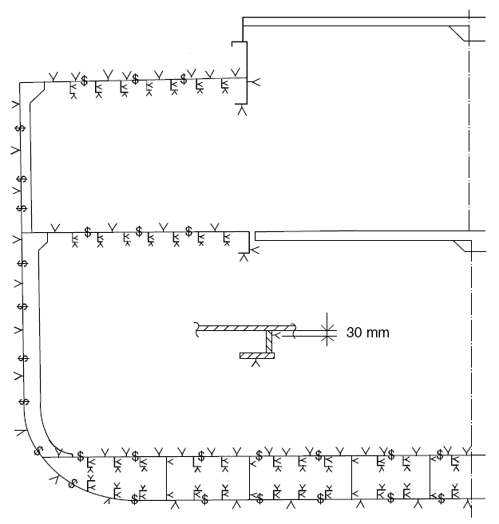 **Fig 4 Locations of measurements on transverse section of general dry cargo ships**  (Notes) It may also apply to other type of transverse section. In addition, where hatch coamings are included in the longitudinal strength member, such as a container ship, the right-hand transverse section is to be applied. **Fig 5 Locations of measurements on transverse section of general ships** ***(2024)*** |

  | **Table 3-1 Location and number of thickness measuring points - Non-CSR Ships** (continued) |
  | --- |
  | 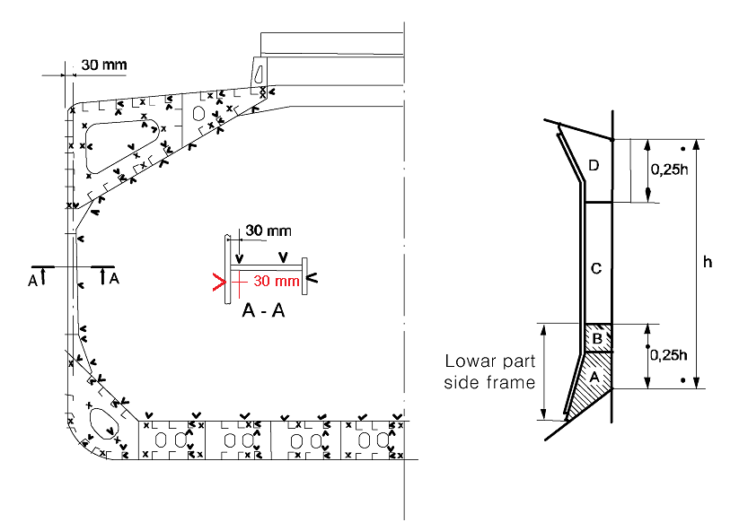 (Bulk Carriers) 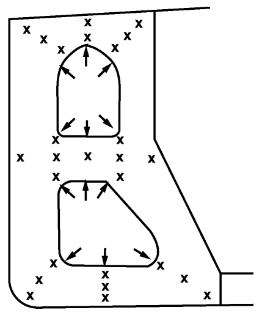 (Ore Carriers) (Notes) The gauging pattern for web plating is to be a three point pattern for zones A, C and D, and a two point pattern for zone B(see figure). The gauging report is to reflect the average reading. The average reading is to be compared with the allowable thickness. If the web plating has general corrosion the this pattern is to be expanded to a five point pattern. **Fig 6 Locations of measurements on structural members in cargo holds and ballast tanks of single skin or double skin bulk carriers** |

  | **Table 3-1 Location and number of thickness measuring points - Non-CSR Ships** (continued) |
  | --- |
  | 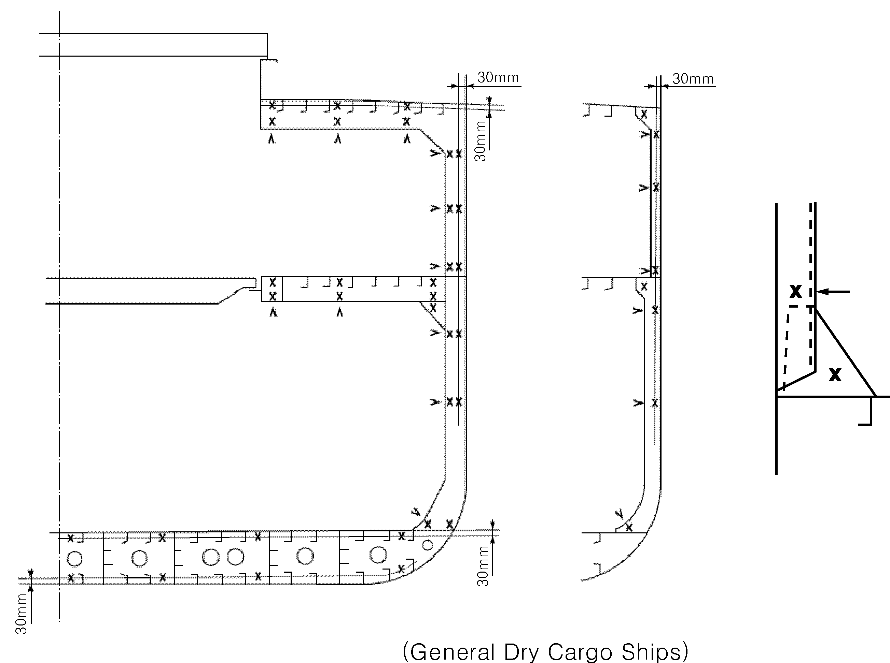 (Notes) It may also apply to other ship types. 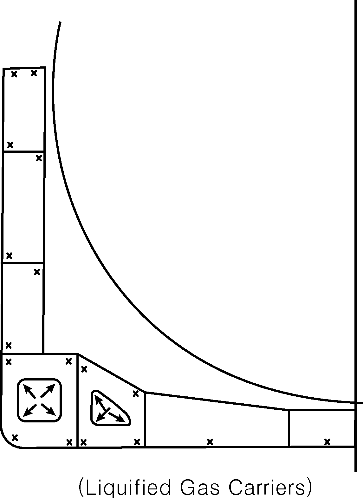 **Fig 7 Locations of measurements on selected internal structural members**  **Fig 8 Locations of measurements on transverse frame in double skin tank of double skin bulk carriers** |

  | **Table 3-1 Location and number of thickness measuring points - Non-CSR Ships** (continued) |
  | --- |
  | 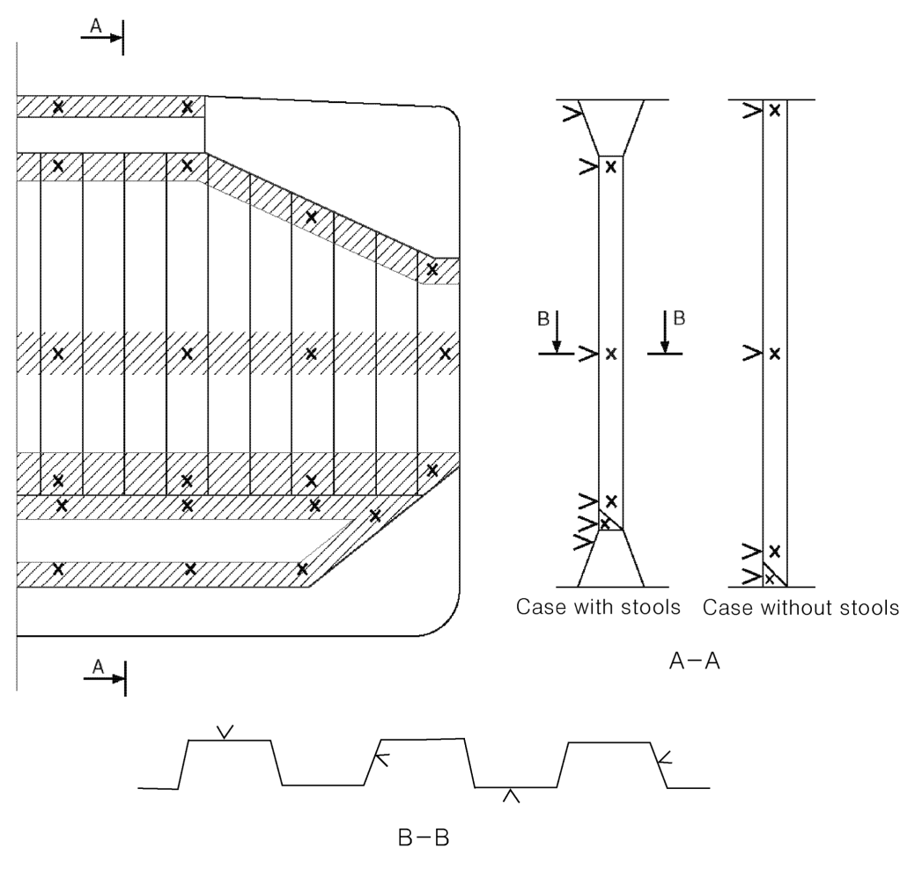 **Single skin bulk carriers** 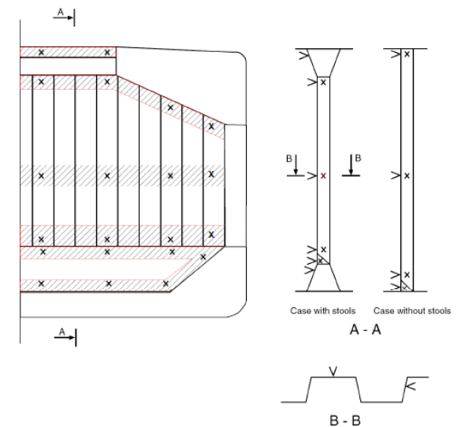 **Double skin bulk carriers** (Notes) Measurements to be taken in each shaded area as per views A-A and B-B. Additional measurements to internal structure of upper and lower stools to be added, e.g. two points in the upper and two points in the lower stools to be indicated in section A-A. **Fig 9 Locations of measurements on cargo hold transverse bulkheads of single skin** **or double skin bulk carriers** |

  | **Table 3-1 Location and number of thickness measuring points - Non-CSR Ships** (continued) |
  | --- |
  | 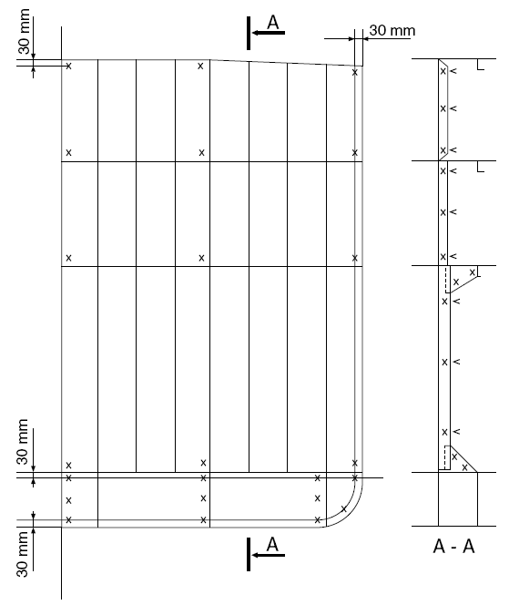 (Notes) 1. Cargo hold bulkhead/watertight floor plating to be measured as per main view. 2. One stiffener out of three to be measured as per view A-A. 3. It may also apply to other ship types. **Fig 10 Locations of measurements on transverse bulkheads of general dry cargo ships** |

  | **Table 3-1 Location and number of thickness measuring points - Non-CSR Ships** (continued) |
  | --- |
  | 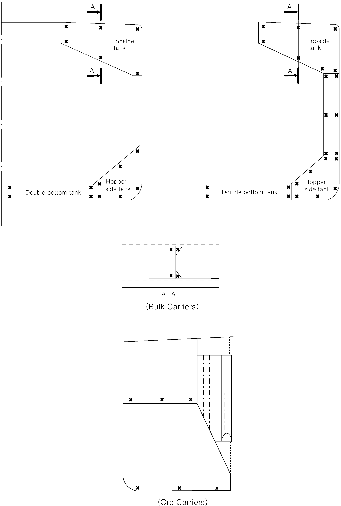 (Notes) Measurements to be taken in each vertical section as per view A-A. **Fig 11 Locations of measurements on transverse bulkheads in topside, hopper, double hull and double bottom ballast tanks of single skin or double skin bulk carriers** |

  | **Table 3-1 Location and number of thickness measuring points - Non-CSR Ships** (continued) |
  | --- |
  | 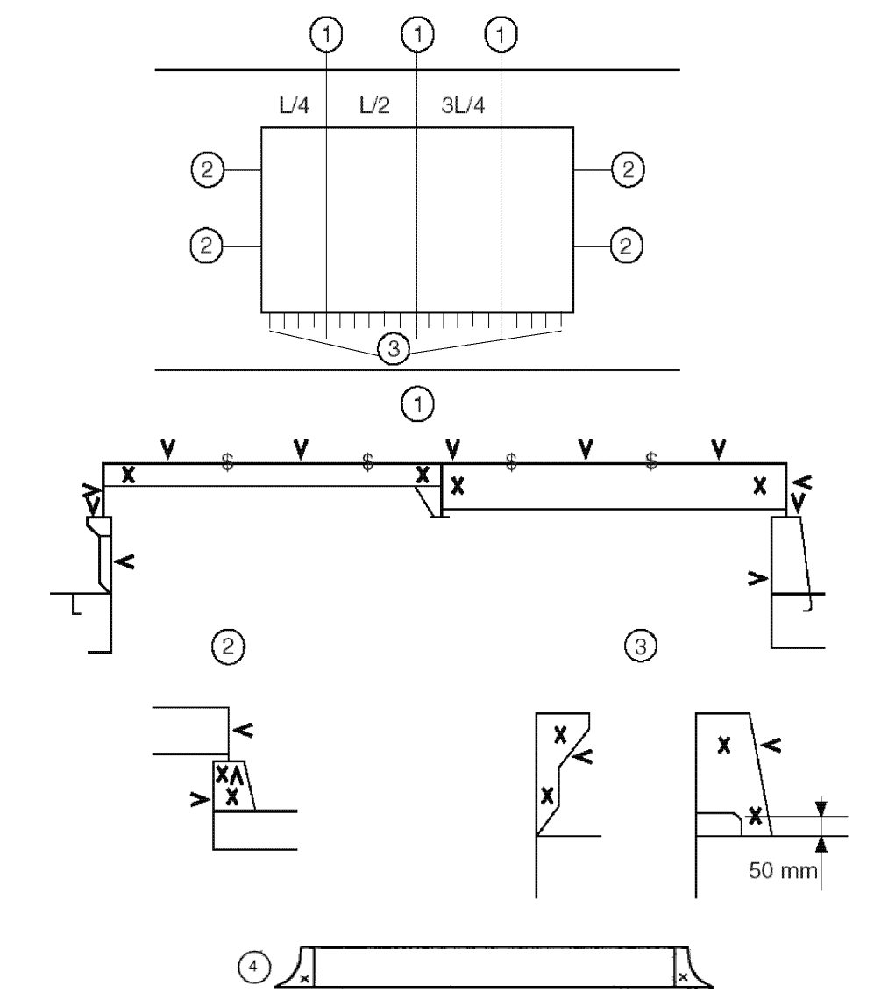 (Notes) ➀ For each hatch covers, three sections at L/4, L/2 and 3L/4 of hatch cover length, including: - one measurement of each hatch cover plate and skirt plate - measurements of adjacent beams or girder(including stiffeners) - one measurement of coaming plates and coaming flange, each side ➁ For each hatch covers, one measurement of hatch cover skirt plate, coaming plate and coaming flange on both ends ➂ One measurement of one out of three hatch coaming brackets and bars, on both sides and both ends ➃ One measurement of each hatch coaming end bracket **Fig 12 Locations of measurements on hatch covers and coamings** |

  | **Table 3-1 Location and number of thickness measuring points - Non-CSR Ships** (continued) |
  | --- |
  |  **Fig 13 Locations of measurements on underdeck structure** |

  **Table 3-2 Location and number of thickness measuring points - CSR Ships** **Table 3-2** is to be applied to vessels built under IACS Common Structural Rules(**Pt 11**, **Pt 12** or **Pt 13**) (i.e. CSR Ships). 1) CSR bulk carriers

  | Items | location and number of thickness measuring points | Figure reference |
  | --- | --- | --- |
  | Selected plates on deck, tank top, bottom, double bottom and wind-and-water area | "Selected" means at least a single point on one out of three plates, to be chosen on representative areas of average corrosion |   |
  | All deck, tank top and bottom plates and wind-and-water strakes | At least two points on each plate to be taken either at each 1/4 extremity of plate or at representative areas of average corrosion |   |
  | Transverse section | - For single skin bulk carriers : A transverse section includes all longitudinal members such as plating, longitudinals and girders at the deck, side, bottom, inner bottom and hopper side plating, longitudinal bulkhead and bottom plating in top wing tanks. - For double skin bulk carriers : A transverse section includes all longitudinal members such as plating, longitudinals and girders at the deck, side, bottom, inner bottom and hopper sides, inner sides and top wing inner sides. | **Fig 1** |
  | All cargo hold hatch covers and coamings | Including plates and stiffeners | Locations of points are given in **Fig 2** |
  | Transverse section of deck plating outside line of cargo hatch openings | Two single points on each deck plate (to be taken either at each 1/4 extremity of plate or at representative areas of average corrosion) between the ship sides and hatch coamings in the transverse section concerned |   |
  | All deck plating and under deck structure inside line of hatch openings between cargo hold hatches | "All deck plating" means at least two points on each plate to be taken either at each 1/4 extremity of plate or at representative areas of average corrosion. "Underdeck structure": at each short longitudinal girder: three points for web plating(fwd/middle/aft), single point for face plate, one point for web plating and one point for face plating of transverse beam in way. At each ends of transverse beams, one point for web plating and one point for face plating. | Extent of areas is shown in **Annex 1-6, 1** (2) or (6) of the Guidance Location of points are given in **Fig 6** |

  **Table 3-2 Location and number of thickness measuring points - CSR Ships** (continued)

  | Items | location and number of thickness measuring points | Figure reference |
  | --- | --- | --- |
  | Single skin bulk carriers: Selected side shell frames in cargo holds | Includes side shell frame, upper and lower end attachments and adjacent shell plating. 25% of frames: one out of four frames should preferably be chosen throughout the cargo hold length on each side. 50% of frames: one out of two frames should preferably be chosen throughout the cargo hold length on each side. "Selected frames" means at least 3 frames on each side of cargo holds | Extent of areas is shown in **Annex 1-6, 1** (2) of the Guidance *(2019)* Locations of points are given in **Fig 3** |
  | Double skin bulk carriers: Transverse frame in double skin tank |   | Extent of areas is shown in **Annex 1-6, 1** (6) of the Guidance *(2019)* Locations of points are given in **Fig 3** |
  | Transverse bulkheads in cargo holds | Includes bulkhead plating, stiffeners and girders, including internal structure of upper and lower stools, where fitted. Two selected bulkheads: one is to be the bulkhead between the two foremost cargo holds and the second may be chosen in other positions | Areas of measurements are shown in **Annex 1-6, 1** (2) or (6) of the Guidance Locations of points are given in **Fig 4** |
  | One transverse bulkhead in each cargo hold | This means that the Close-up Survey and related thickness measurements are to be performed on one side of the bulkhead; the side is to be chosen based on the outcome of the overall survey of both sides. In the event of doubt, the Surveyor may also require (possibly partial) Close-up Survey and related thickness measurements on the other side | Areas of measurements are shown in **Annex 1-6, 1** (2) or (6) of the Guidance Locations of points are given in **Fig 4** |
  | Transverse bulkheads in one topside, hopper and double bottom ballast tank | Includes bulkhead and stiffening systems. The ballast tank is to be chosen based on the history of ballasting among those prone to have the most severe conditions | Locations of points are given in **Fig 5** |
  | Transverse webs in ballast tanks | Includes web plating, face plates, stiffeners and associated plating and longitudinals. One of the representative tanks of each type (i.e. topside or hopper or side tank) is to be chosen in the forward part | Areas of measurements are shown in **Annex 1-6, 1** (2) or (6) of the Guidance Locations of points are given in **Fig 3** |
  | (NOTES) 1. mark : means the location to be measured. 2. ×, ˅ mark : means the point to be measured. |   |   |

  | **Table 3-2 Location and number of thickness measuring points - CSR Ships** (continued) |
  | --- |
  | 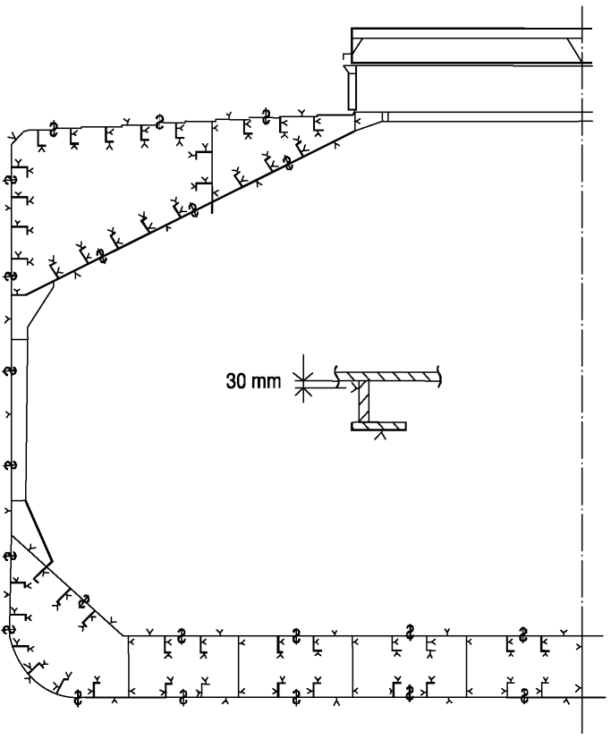 **Single skin bulk carriers** **Single skin bulk carriers** 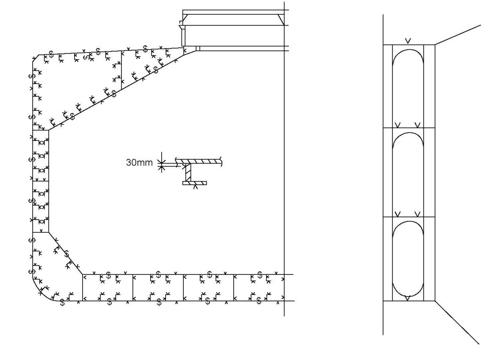 (Notes) Measurements are to be taken on both port and starboard sides of the selected transverse section. **Fig 1 Locations of measurements on transverse section of single skin or double skin bulk carriers** |

  | **Table 3-2 Location and number of thickness measuring points - CSR Ships** (continued) |
  | --- |
  |  (Notes) 1. Three sections at L/4, L/2, 3L/4 of hatch cover length, including: • one measurement of each hatch cover plate and skirt plate • measurements of adjacent beams and stiffeners • one measurement of coaming plates and coaming flange, each side 2. Measurements of both ends of hatch cover skirt plate, coaming plate and coaming flange 3. One measurement(two points for web plate and one point for face plate) of one out of three hatch coaming brackets and bars, on both sides and both ends **Fig 2 Locations of measurements on hatch covers and coamings** |

  | **Table 3-2 Location and number of thickness measuring points - CSR Ships** (continued) |
  | --- |
  | 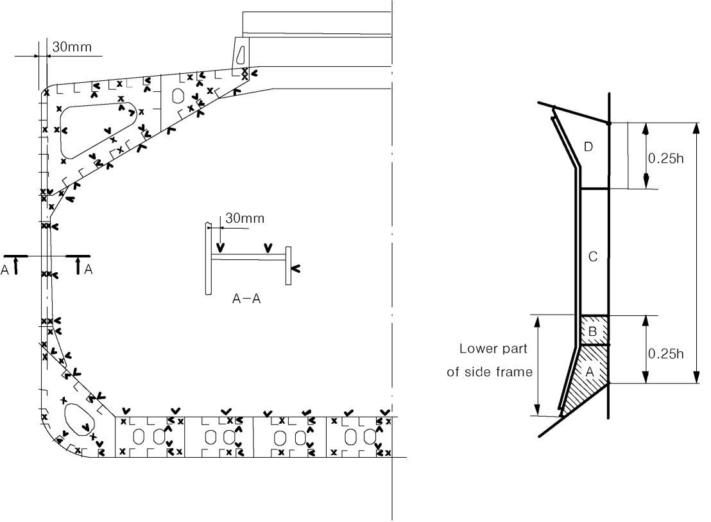 (Notes) The gauging pattern for web plating is to be a three point pattern for zones A, C and D, and a two point pattern for zone B (see figure). The gauging report is to reflect the average reading. The average reading is to be compared with the allowable thickness. If the web plating has general corrosion then this pattern is to be expanded to a five point pattern. **Single skin bulk carriers** 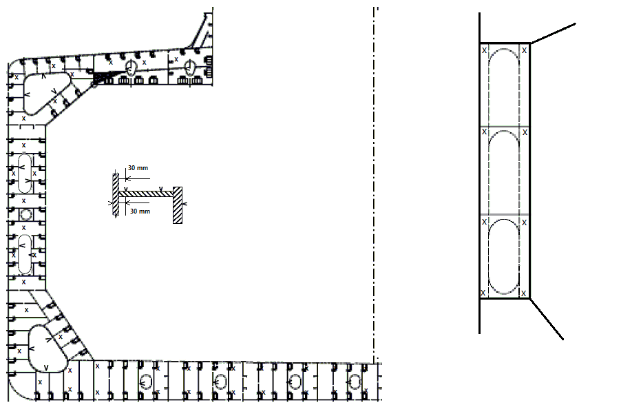 **Double skin bulk carriers** **Double skin bulk carriers** **Fig 3 Locations of measurements on structural members in cargo holds and ballast tanks of single skin bulk carriers and in ballast tanks(topside or hopper or side tank) of double skin bulk carriers** |

  | **Table 3-2 Location and number of thickness measuring points - CSR Ships** (continued) |
  | --- |
  | 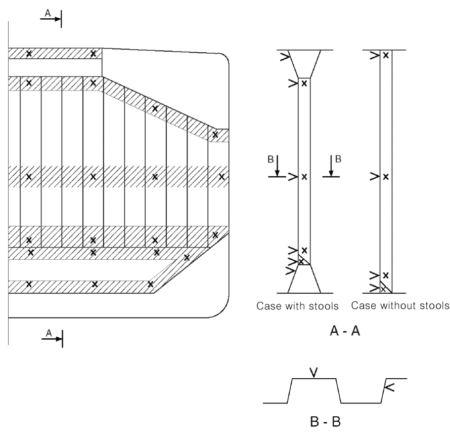 **Single skin bulk carriers**  **Double skin bulk carriers** (Notes) Measurements to be taken in each shaded area as per views A-A and B-B. Additional measurements to internal structure of upper and lower stools to be added, e.g. two points in the upper and two points in the lower stools to be indicated in section A-A. **Fig 4 Location of measurements on cargo hold transverse bulkheads of single skin or double skin bulk carriers** |

  | **Table 3-2 Location and number of thickness measuring points - CSR Ships** (continued) |
  | --- |
  | 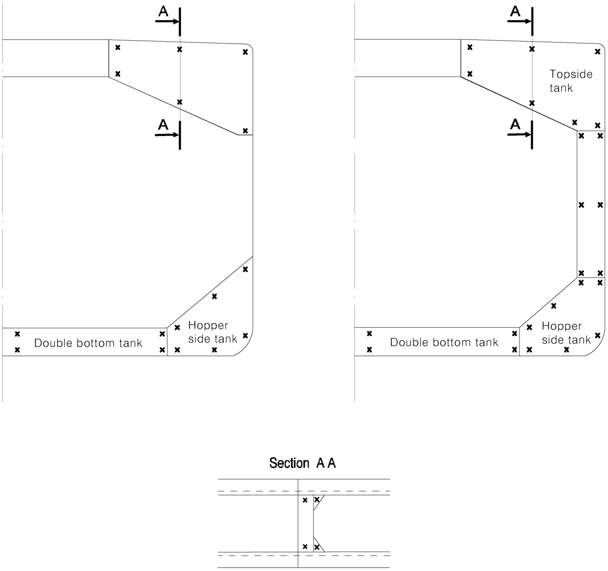 (Notes) Measurements to be taken in each vertical section as per view A-A Two additional measurements to internal structure of double bottom tank to be added at midspan. **Fig 5 Locations of measurements on transverse bulkheads of topside, hopper, double hull and double bottom ballast tanks of single skin or double skin bulk carriers** |

  | **Table 3-2 Location and number of thickness measuring points - CSR Ships** (continued) |
  | --- |
  | 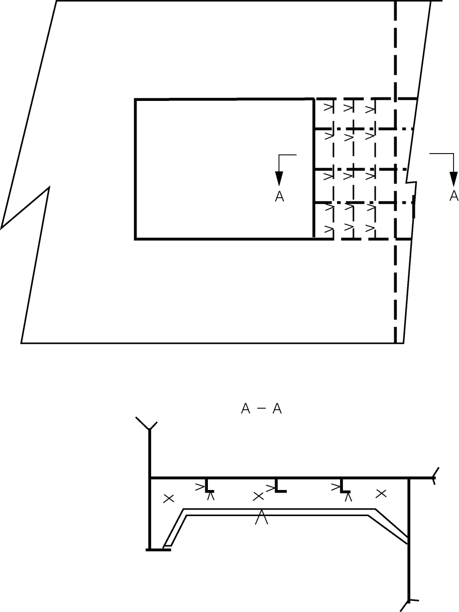 **Fig 6 Locations of measurements on underdeck structure** |

  **Table 3-2 Location and number of thickness measuring points - CSR Ships** (continued) 2) CSR double hull oil tankers

  | Items | location and number of thickness measuring points | Figure reference |
  | --- | --- | --- |
  | Selected plates | "Selected" means at least a single point on one out of three plates, to be chosen on representative areas of average corrosion |   |
  | Deck, bottom plates and wind-and-water strakes | At least two points on each plate to be taken either at each 1/4 extremity of plate or at representative areas of average corrosion |   |
  | Transverse section | Measurements to be taken on all longitudinal members such as plating, longitudinals and girders at the deck, side, bottom, longitudinal bulkheads, inner bottom and hopper. One point to be taken on each plate. Both web and flange to be measured on longitudinals, if applicable. For tankers older than 10 years of age: within 0.1D (where D is the ship’s moulded depth) of the deck and bottom at each transverse section to be measured, every longitudinal and girder is to be measured on the web and face plate, and every plate is to be measured at one point between longitudinals. | **Fig 1** |
  | Transverse rings^3) in cargo and ballast tanks | At least two points on each plate in a staggered pattern and two points on the corresponding flange where applicable. Minimum 4 points on the first plate below deck. Additional points in way of curved parts. At least one point on each of two stiffeners between stringers / longitudinal girders. | **Fig 2** |

  **Table 3-2 Location and number of thickness measuring points - CSR Ships** (continued)

  | Items | location and number of thickness measuring points | Figure reference |
  | --- | --- | --- |
  | Transverse bulkheads in cargo tanks | At least two points on each plate. Minimum 4 points on the first plate below main deck. At least one point on every third stiffener to be taken between each stringer. At least two points on each plate of stringers and girders, and two points on the corresponding flange. Additional points in way of curved part. Two points of each diaphragm plate of stools if fitted. | **Fig 3** |
  | Transverse bulkheads in ballast tanks | At least 4 points on plates between stringers / longitudinal girders, or per plate if stringers / girders not fitted. At least two points on each plate of stringers and girders, and two points on the corresponding flange. Additional points in way of curved part. At least one point on two stiffeners between each stringer / longitudinal girder. | **Fig 4** |
  | Adjacent structural members | On adjacent structural members one point per plate and one point on every third stiffener / longitudinal. |   |
  | (NOTES) 1. mark : means the location to be measured. 2. ×, ˅ mark : means the point to be measured. 3. Transverse rings means all transverse material appearing in a cross-section of the ship's hull, in way of a double bottom floor, vertical web and deck transverse (definition from IACS Common Structural Rules for Double Hull Oil Tankers(**Pt 12** or **Pt 13** of the Rules). |   |   |

  | **Table 3-2 Location and number of thickness measuring points - CSR Ships** (continued) |
  | --- |
  |  **Fig 1 Locations of measurements on transverse section of double hull oil tankers** 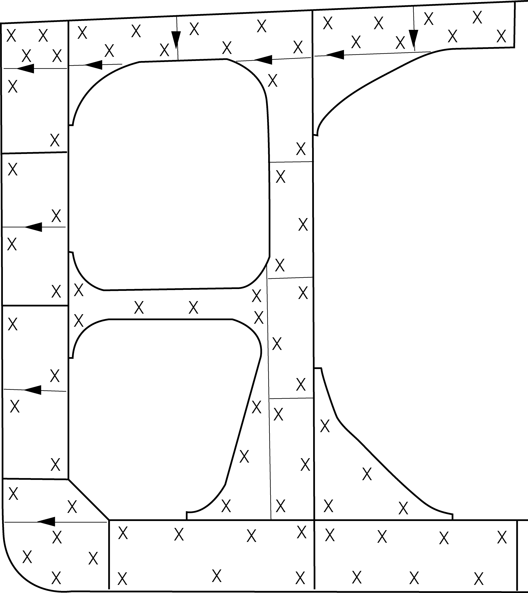 **Fig 2 Locations of measurements on transverse rings in cargo and ballast tanks of double hull oil tankers** |

  | **Table 3-2 Location and number of thickness measuring points - CSR Ships** (continued) |
  | --- |
  | 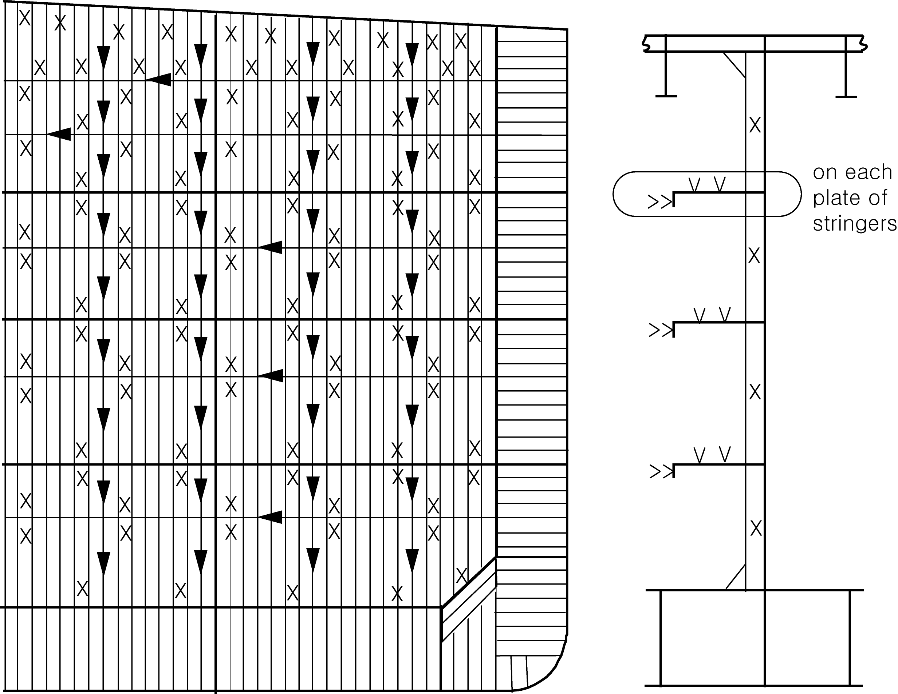 **Fig 3 Locations of measurements on transverse bulkheads in cargo tanks of double hull oil tankers** 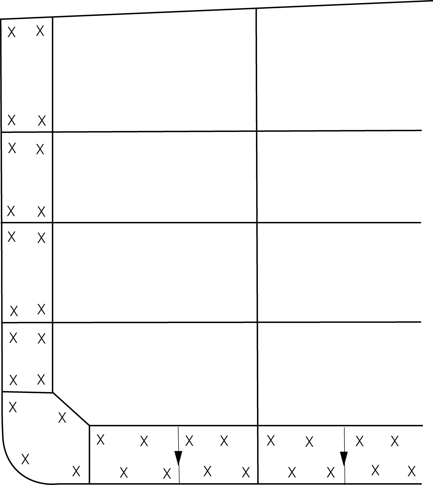 **Fig 4 Locations of measurements on transverse bulkheads in ballast tanks of double hull oil tankers** |

  **Table 4 Extent of thickness measurements at Special Survey - General Ships**

  | No. of Special Survey | Extent and location of measurement |
  | --- | --- |
  | Special Survey No. 1 | (1) Suspect areas throughout the vessel |
  | Special Survey No. 2 *(2023)* | 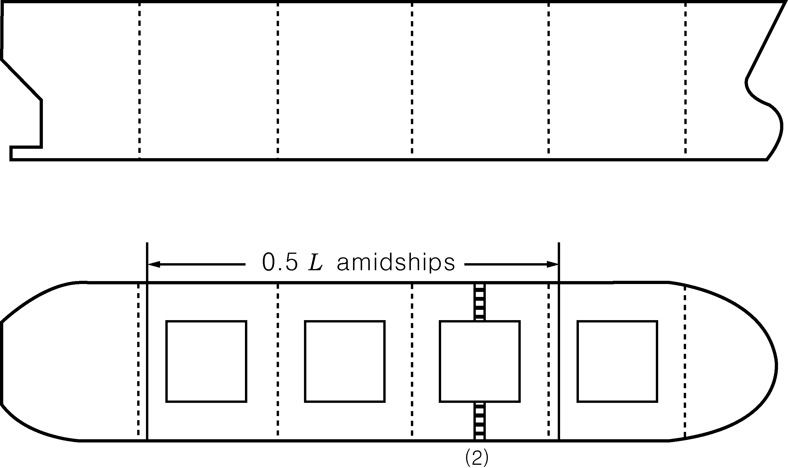 (1) Suspect areas throughout the vessel (2) One transverse section of deck plating within the amidships 0.5 $L$(in way of a cargo space, if applicable) |
  | Special Survey No. 3 *(2023)* | 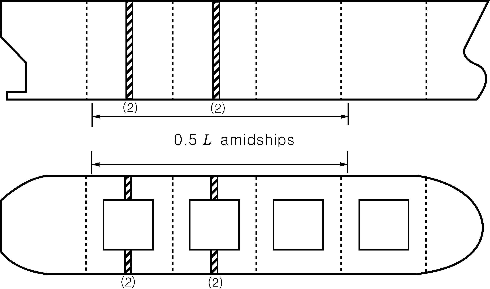 (1) Suspect areas throughout the vessel (2) Two transverse sections within the amidships 0.5 $L$ in way of two cargo spaces, if applicable)4), 5), 6), 7) (3) All cargo hold hatch covers and coamings(plating and stiffeners)^9) (4) Internals in forepeak and afterpeak tanks (5) All transverse bulkheads in all cargo tanks^8) (6) All transverse bulkheads in all ballast tanks^8) |

  **Table 4 Extent of thickness measurements at Special Survey - General Ships** (continued)

  | No. of Special Survey | Extent and location of measurement |
  | --- | --- |
  | Special Survey No. 4 and Subsequent *(2024)* | 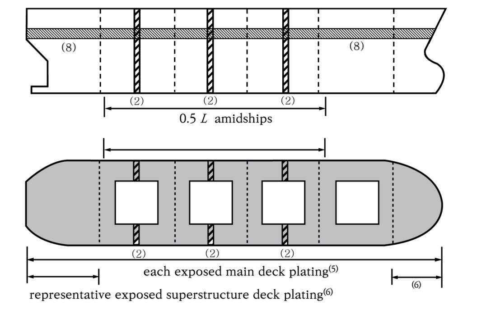 (1) Suspect areas throughout the vessel (2) A minimum of three transverse sections within the amidships 0.5 $L$(in way of cargo spaces, if applicable)5), 6), 7) (3) All cargo hold hatch covers and coamings(plating and stiffeners)^9) (4) Internals in forepeak and afterpeak tanks (5) All exposed main deck plating full length (6) Representative exposed superstructure deck plating(poop, bridge and forecastle deck) (7) Lowest strake and strakes in way of 'tween decks of all transverse bulkheads in cargo spaces together with internals in way (8) All wind and water strakes, port and starboard, full length (9) All keel plates full length. Also, additional bottom plates in way of cofferdams, machinery space and aft end of tanks (10) Plating of seachests. Shell plating in way of overboard discharges as considered necessary by the attending Surveyor (11) All transverse bulkheads and one web frame ring in all cargo tanks^8) (12) All transverse bulkheads and all web frame ring in all ballast tanks^8) |
  | (NOTES) 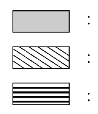 ; Thickness gaugings for deck plates Thickness gaugings for side shell plates Thickness gaugings for the transverse section(applied for plates only) 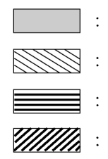 Thickness gaugings for deck plates Thickness gaugings for side shell plates Thickness gaugings for the transverse section(applied for plates only) Thickness gaugings for the transverse section(including longitudinal members, for transversely framed vessels including adjacent frames and their end connections in way of transverse sections) 1) In application to this table, General Ships means ships except Other Ships in **Table 1.2.4, 2.** of the Rules. 2) Thickness measurement locations are to be selected to provide the best representative sampling of areas likely to be most exposed to corrosion, considering cargo and ballast history and arrangement and condition of protective coatings. 3) Thickness measurements of internals may be reduced to extent of measurement points that is sufficient to confirm the actual average condition of the structure under the coating by the Surveyor if the hard protective coating is in GOOD condition. *(2019)* 4) For ships more than 100 meters in length, at Special Survey No. 3, thickness measurements of exposed deck plating within amidship 0.5$L$ may be required. 5) For ships less than 100 meters in length, the number of transverse sections required at Special Survey No. 3 may be reduced to one (1), and the number of transverse sections required at Special Survey No. 4 and subsequent may be reduced to two (2). 6) For the pure car carrier, the extent of thickness measurement for transverse sections may by considered as follow: Exposed deck plates, side shell plates, bottom shell plates, inner bottom plates and longitudinal members in double bottom spaces. 7) Where the evaluation of longitudinal strength is required, all longitudinal structural members at the corresponding sections are to be gauged. 8) This requirement is to be applied only for tankers(including barges) for liquid cargo. 9) Subject to cargo hold hatch covers of approved design which structurally have no access to the internals, thickness measurement shall be done of accessible parts of hatch covers structures. |   |
  |  | Thickness gaugings for deck plates Thickness gaugings for side shell plates Thickness gaugings for the transverse section(applied for plates only) |

  **Table 5 Extent of thickness measurements at Special Survey - Other Ships**

  | No. of Special Survey | Extent and location of measurement |
  | --- | --- |
  | Special Survey No. 1 | (1) Suspect areas throughout the vessel |
  | Special Survey No. 2 | 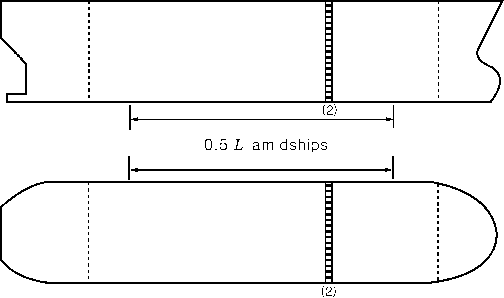 (1) Suspect areas throughout the vessel (2) One transverse section of deck plating^5), side shell plating and bottom plating within the amidships 0.5 $L$ |
  | Special Survey No. 3 | 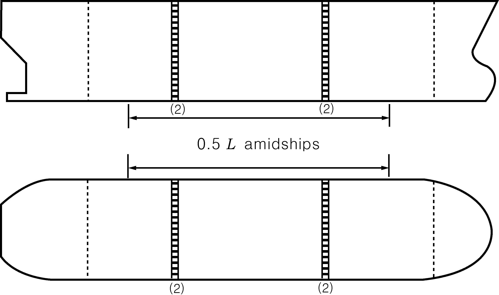 (1) Suspect areas throughout the vessel (2) Two transverse sections of deck plating^5), side shell plating and bottom plating within the amidships 0.5 $L$ (3) Internals in forepeak and afterpeak tanks |

  **Table 5 Extent of thickness measurements at Special Survey - Other Ships** (continued)

  | No. of Special Survey | Extent and location of measurement |
  | --- | --- |
  | Special Survey No. 4 and Subsequent *(2024)* | 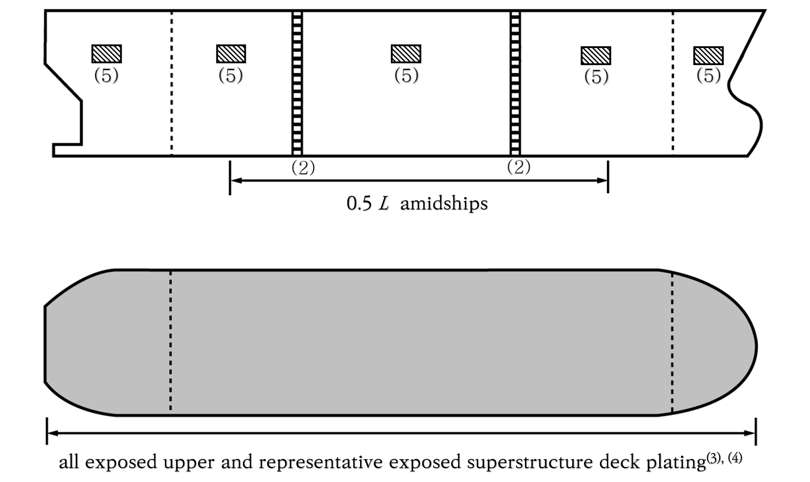 (1) Suspect areas throughout the vessel (2) Two transverse sections of side shell plating within the amidships 0.5 $L$ (3) Full length, all exposed main deck plating^5) (4) Full length, representative exposed superstructure deck plating(poop, bridge and forecastle deck) (5) Full length, selected wind and water strakes (6) Full length, bottom plating and flat keel plating (7) Internals in forepeak and afterpeak tanks |
  | (NOTES) No. of Special Survey ; Extent and location of measurement Special Survey No. 1 ; 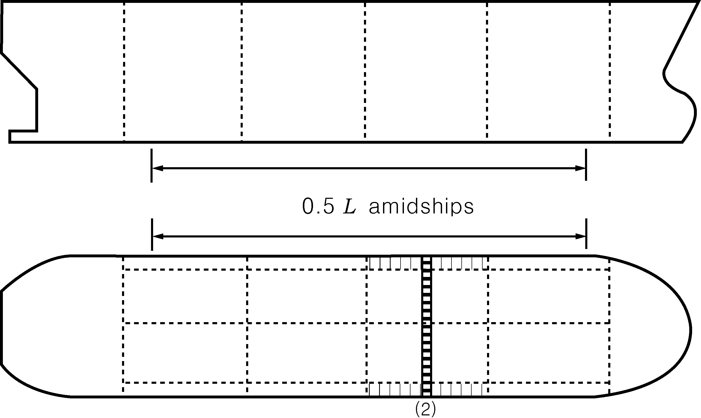 (1) Suspect areas (2) One section of deck plating for the full beam of the ship within 0.5 $\mathrm{m}$ amidships in way of a ballast tank, if any (3) Measurement for general assessment and recording of corrosion pattern of those structural members subject to Close-up Survey Special Survey No. 2 *(2024)* ; 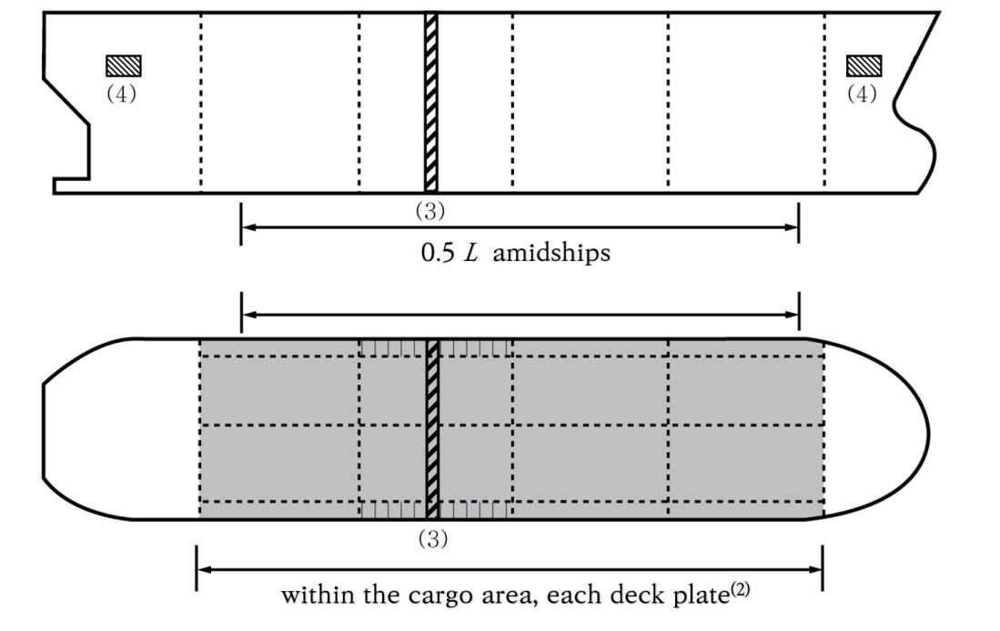 (1) Suspect areas (2) Within the cargo area, each deck plate (3) Within the cargo area, one transverse section within 0.5 $\mathrm{m}$ amidships in way of a ballast tank, if any (4) Selected wind and water strakes outside the cargo area (5) Measurement for general assessment and recording of corrosion pattern of those structural members subject to Close-up Survey  Thickness gaugings for deck plates Thickness gaugings for side shell plates Thickness gaugings for the transverse section(applied for plates only) 1) In application to this table, Other Ships means the ship specified as follows except Special Purpose Ship - Waste in **Annex 1-1, 1.1** of the Guidance. - the ship type **12, 13** - the ship less than 500 GT and not engaged on international voyages among ship type **15, 16, 17, 19, 20** and **26** to **30**. 2) Thickness measurement locations are to be selected to provide the best representative sampling of area likely to be most exposed to corrosion. 3) Thickness measurements of internals may be specially considered by the Surveyor if the hard protective coating is in GOOD condition. 4) When the evaluation of longitudinal strength is required, all longitudinal structural members at the corresponding sections are to be gauged. 5) For fishing vessel, thickness measurement requirements in way of deck(gutter water way part and hatch coaming part) may be modified at the discretion of the Surveyor if the structure remains effectively protected against corrosion by a permanent type special coating. |   |
  | No. of Special Survey | Extent and location of measurement |
  | Special Survey No. 1 |  (1) Suspect areas (2) One section of deck plating for the full beam of the ship within 0.5 $\mathrm{m}$ amidships in way of a ballast tank, if any (3) Measurement for general assessment and recording of corrosion pattern of those structural members subject to Close-up Survey |
  | Special Survey No. 2 *(2024)* |  (1) Suspect areas (2) Within the cargo area, each deck plate (3) Within the cargo area, one transverse section within 0.5 $\mathrm{m}$ amidships in way of a ballast tank, if any (4) Selected wind and water strakes outside the cargo area (5) Measurement for general assessment and recording of corrosion pattern of those structural members subject to Close-up Survey |

  | No. of Special Survey | Extent and location of measurement |
  | --- | --- |
  | Special Survey No. 1 | (1) Suspect areas |
  | Special Survey No. 2 | 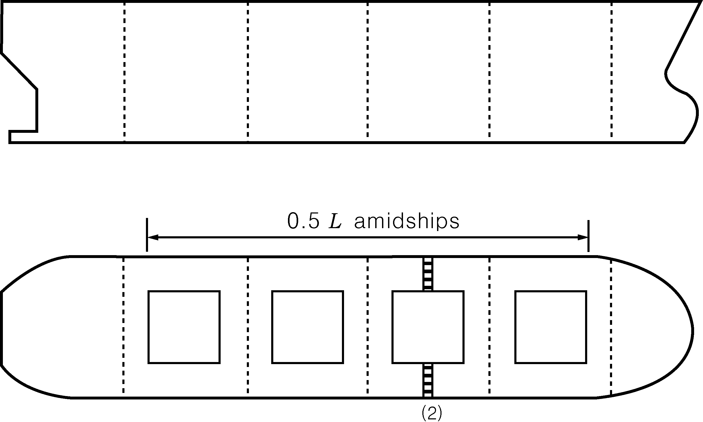 (1) Suspect areas (2) One transverse section of deck plating in way of a cargo length area within the amidships 0.5 $L$ (3) Measurement for general assessment and recording of corrosion pattern of those structural members subject to Close-up Survey |
  | Special Survey No. 3 *(2024)* | 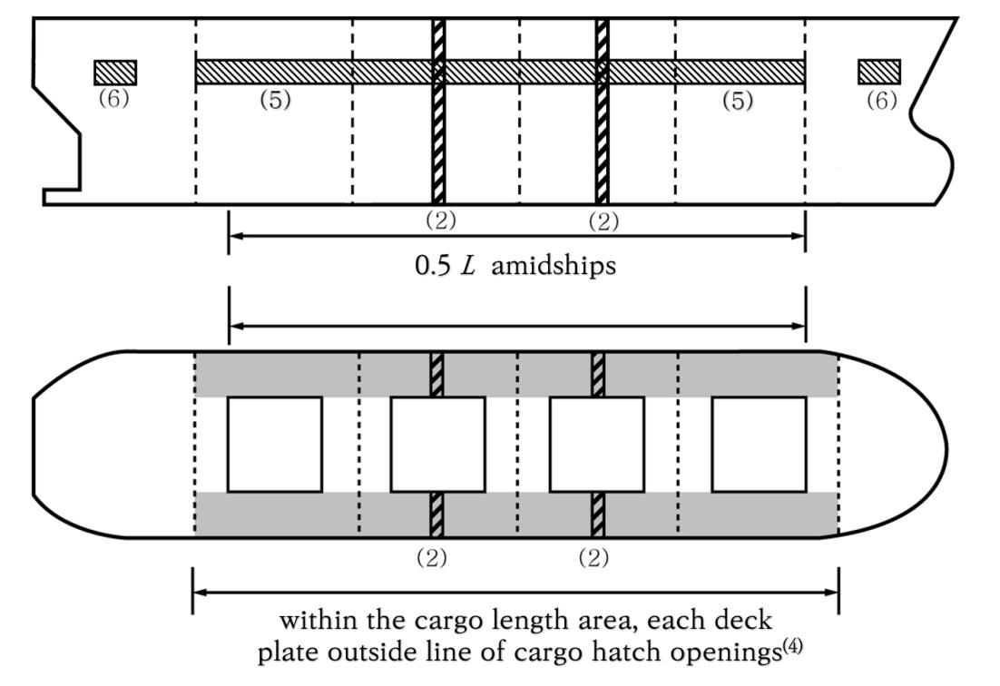 (1) Suspect areas (2) Two transverse sections within the amidships 0.5 $L$ in way of two different cargo space^2) (3) Measurement for general assessment and recording of corrosion pattern of those structural members subject to Close-up Survey (4) Within the cargo length area, each deck plate outside line of cargo hatch openings (5) All wind and water strakes within the cargo length area (6) Selected wind and water strakes outside the cargo length area |

  | No. of Special Survey |   | Extent and location of measurement |
  | --- | --- | --- |
  | Special Survey No. 4 and Subsequent *(2024)* |   | 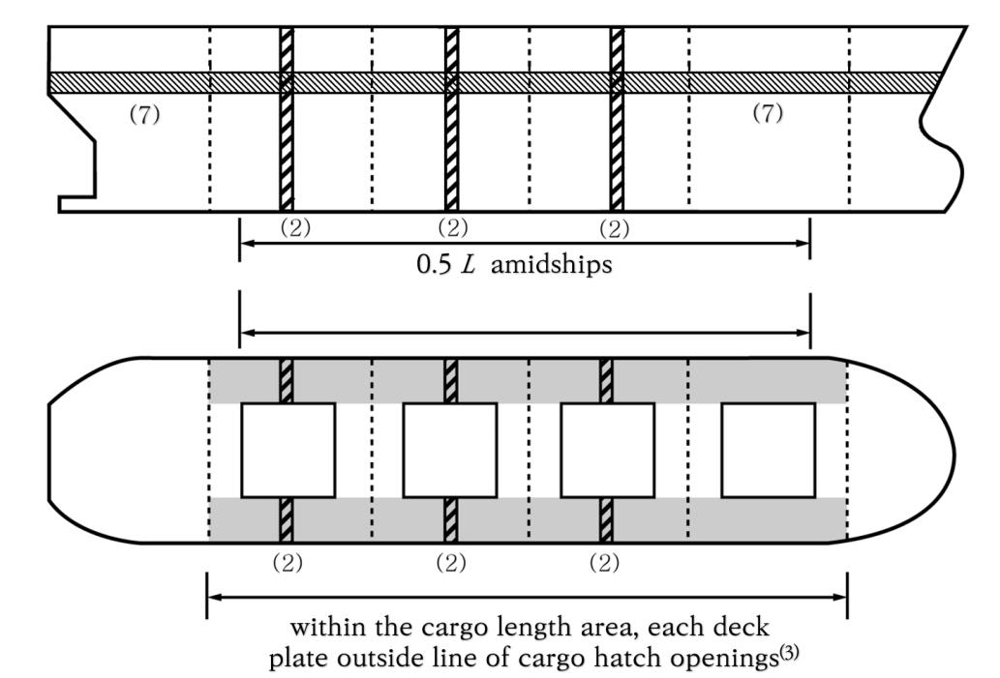 (1) Suspect areas (2) Within the cargo length area, a minimum of three transverse sections within the amidships 0.5$L$^2) (3) Within the cargo length area, each deck plate outside line of cargo hatch openings (4) Within the cargo length area, each bottom plate, including lower turn of bilge (5) Within the cargo length area, duct keel or pipe tunnel plating and internals (6) Measurement for general assessment and recording of corrosion pattern of those structural members subject to Close-up Survey (7) All wind and water strakes full length |
  | (NOTES)  | Thickness gaugings for deck plates Thickness gaugings for side shell plates Thickness gaugings for the transverse section(applied for plates only) Thickness gaugings for the transverse section(including longitudinal members, for transversely framed vessels including adjacent frames and their end connections in way of transverse sections) |   |
  | 1) Thickness measurement locations are to be selected to provide the best representative sampling of area likely to be most exposed to corrosion, considering cargo and ballast history and arrangement and condition of protective coatings. 2) For ships less than 100 meters in length, the number of transverse sections required at Special Survey No. 3 may be reduced to one and the number of transverse sections at Special Survey No. 4 and subsequent surveys may be reduced to two. |   |   |

  | No. of Special Survey | Extent and location of measurement |
  | --- | --- |
  | Special Survey No. 1 |  (1) Suspect areas (2) One section of deck plating for the full beam of the ship within 0.5 $L$ amidships in way of a ballast tank, if any (3) Measurement for general assessment and recording of corrosion pattern of those structural members subject to Close-up Survey |
  | Special Survey No. 2 *(2024)* |  (1) Suspect areas (2) Within the cargo area, each deck plate (3) Within the cargo area, one transverse section within 0.5 $L$ amidships in way of a ballast tank, if any (4) Selected wind and water strakes outside the cargo area (5) Measurement for general assessment and recording of corrosion pattern of those structural members subject to Close-up Survey |

  | No. of Special Survey | Extent and location of measurement |
  | --- | --- |
  | Special Survey No. 3 *(2024)* | 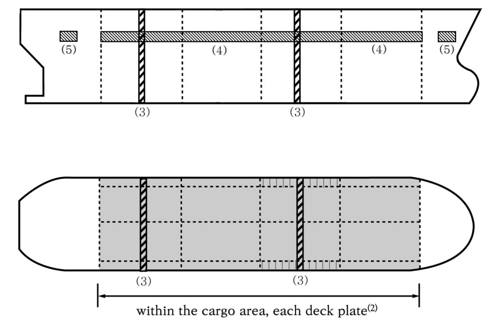 (1) Suspect areas (2) Within the cargo area, each deck plate (3) Within the cargo area, two transverse sections^1) (4) Within the cargo area, all wind and water strakes (5) Selected wind and water strakes outside the cargo area (6) Measurement for general assessment and recording of corrosion pattern of those structural members subject to Close-up Survey |
  | Special Survey No. 4 and Subsequent *(2024)* | 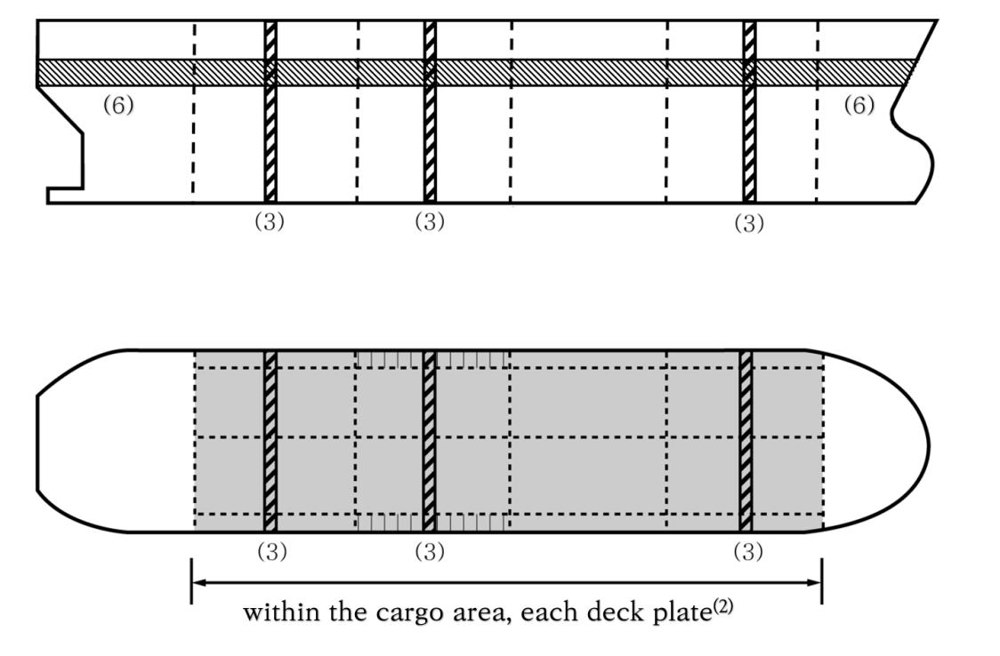 (1) Suspect areas (2) Within the cargo area, each deck plate (3) Within the cargo area, three transverse sections^1) (4) Within the cargo area, each bottom plate (5) Within the cargo area, duct keel plating and internals (6) All wind and water strakes, full length (7) Measurement for general assessment and recording of corrosion pattern of those structural members subject to Close-up Survey |

  | (NOTES)  | Thickness gaugings for deck plates Thickness gaugings for side shell plates Thickness gaugings for the transverse section(applied for plates only) Thickness gaugings for the transverse section(including longitudinal members, for transversely framed vessels including adjacent frames and their end connections in way of transverse sections) |
  | --- | --- |
  | 1) At least one section is to include a ballast tank within 0.5 $L$ amidships, if any. 2) For ships having independent tanks of type C, with a midship section similar to that of a general cargo ship, the extent of thickness measurements may be increased to include the tank top plating at the discretion of the Surveyor. 3) For areas in spaces where hard protective coatings are found to be in GOOD condition, the extent of thickness measurements may be reduced by sufficiently confirming the actual average condition of the structure under the coating. *(2019)* 4) The Surveyor may extend the thickness measurements as deemed necessary. Where substantial corrosion is found, the extent of thickness measurements is to be increased to the satisfaction of the Surveyor. |   |

  **Table 8 Extent of thickness measurements at Special Survey - Bulk Carriers with ESP notation**

  | No. of Special Survey | Extent and location of measurement |
  | --- | --- |
  | Special Survey No. 1 | (1) Suspect areas |
  | Special Survey No. 2 *(2024)* | 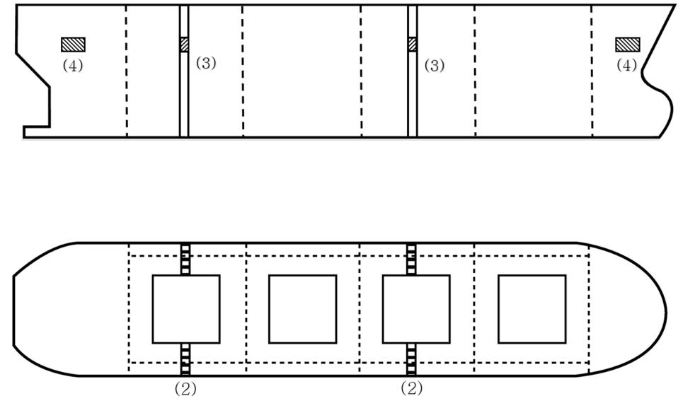 (1) Suspect areas (2) Within the cargo length, two transverse sections of deck plating outside line of cargo hatch openings (3) Wind and water strakes in way of transverse sections considered under (2) above (4) Selected wind and water strakes outside the cargo length area (5) Measurement for, general assessment and recording of corrosion pattern, of those structural members subject to Close-up Survey (6) See **Ch 3, 201. 1** (4) of the Rules, **Pt 7, Ch 3, Sec 17** of the Rules and the separate requirements specified by the Society for additional thickness measurement guidelines applicable to the side shell frames and brackets on ships subject to compliance with IACS UR S31 |
  | Special Survey No. 3 *(2024)* | 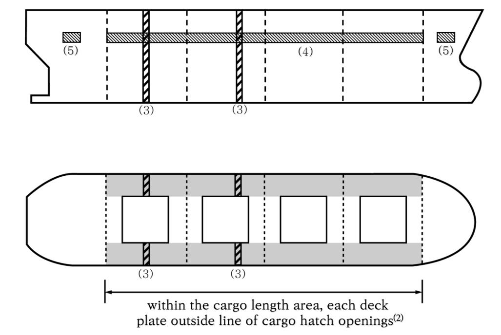 (1) Suspect areas (2) Within the cargo length, each deck plate outside line of cargo hatch openings (3) Within the cargo length, two transverse sections, one in the amidship area, outside line of cargo hatch openings (4) Within the cargo length, all wind and water strakes (5) Selected wind and water strakes outside the cargo length area (6) Measurement for, general assessment and recording of corrosion pattern, of those structural members subject to Close-up Survey (7) See **Ch 3, 201. 1** (3) of the Rules and **Annex 1-5, Table 9** of the Guidance for additional thickness measurement guidelines applicable to the vertically corrugated transverse watertight bulkhead between cargo hold Nos. 1 and 2 on ships subject to compliance with IACS URs S19 and S23 (8) See **Ch 3, 201. 1** (4) of the Rules, **Pt 7, Ch 3, Sec 17** of the Rules and the separate requirements specified by the Society for additional thickness measurement guidelines applicable to the side shell frames and brackets on ships subject to compliance with IACS UR S31 |

  **Table 8 Extent of thickness measurements at Special Survey - Bulk Carriers with ESP notation** (continued)

  | No. of Special Survey |   | Structural members to be measured |
  | --- | --- | --- |
  | Special Survey No. 4 and Subsequent *(2024)* |   | 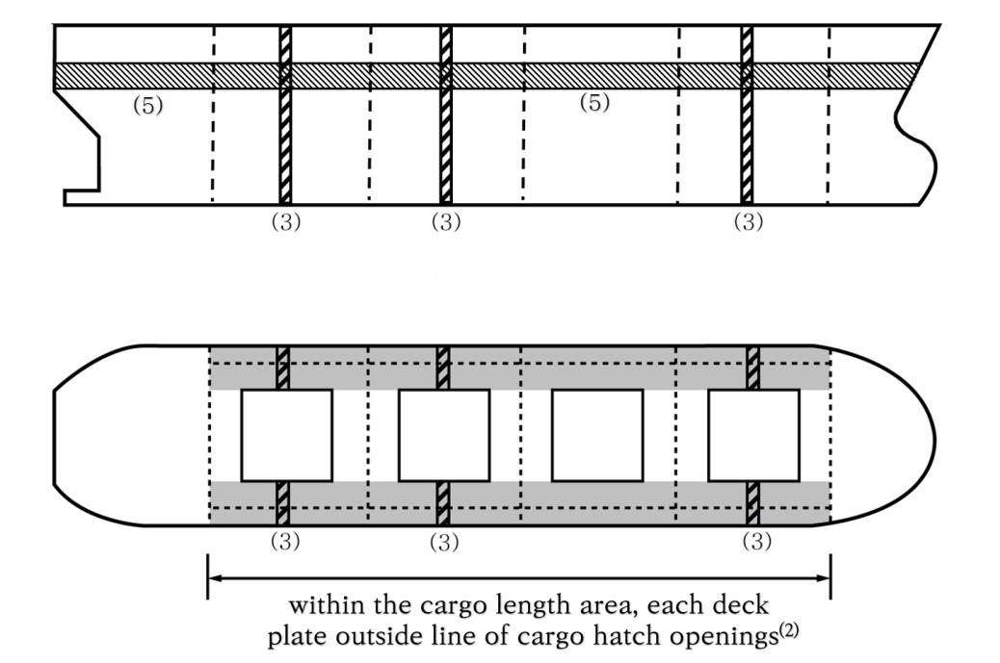 (1) Suspect areas (2) Within the cargo length, each deck plate outside line of cargo hatch openings (3) Within the cargo length, three transverse sections, one in the amid ship area, outside line of cargo hatch openings (4) Within the cargo length, each bottom plates (5) All wind and water strakes, full length (6) Measurement for, general assessment and recording of corrosion pattern, of those structural members subject to Close-up Survey (7) See **Ch 3, 201. 1** (3) of the Rules and **Annex 1-5, Table 9** of the Guidance for additional thickness measurement guidelines applicable to the vertically corrugated transverse watertight bulkhead between cargo hold Nos. 1 and 2 on ships subject to compliance with IACS URs S19 and S23 (8) See **Ch 3, 201. 1** (4) of the Rules, **Pt 7, Ch 3, Sec 17** of the Rules and the separate requirements specified by the Society for additional thickness measurement guidelines applicable to the side shell frames and brackets on ships subject to compliance with IACS UR S31 |
  | (NOTES) |   |   |
  |  | Thickness gaugings for deck plates Thickness gaugings for side shell plates Thickness gaugings for the transverse section(applied for plates only) Thickness gaugings for the transverse section(including longitudinal members, for transversely framed vessels including adjacent frames and their end connections in way of transverse sections) |   |

  **Table 9 Additional thickness measurements of the vertically corrugated transverse watertight bulkhead between holds Nos. 1 and 2(Only for ships subject to IACS UR S19)** ***(2022)***

  | Location | Vertically corrugated transverse watertight bulkhead between holds Nos. 1 and 2 |
  | --- | --- |
  | Gauging point | 1. The gauging is to be carried out at the levels as described below. To adequately assess the scantlings of each individual vertical corrugation, each corrugation flange, webs, shedder plate and gusset plate within each of the levels given below are to be gauged. (1) Level (A) : Ships without lower stool (See **Fig 1**) (a) The mid-breadth of the corrugation flanges at approximately 200 $\mathrm{mm}$ above the line of shedder plates; (b) The middle of gusset plates between corrugation flanges, where fitted; (c) The middle of the shedder plates; (d) The mid-breadth of the corrugation webs at approximately 200 $\mathrm{mm}$ above the line of shedder plates. (2) Level (B) : Ships with lower stool (See **Fig 2**) (a) The mid-breadth of the corrugation flanges at approximately 200 $\mathrm{mm}$ above the line of shedder plates; (b) The middle of gusset plates between corrugation flanges, where fitted; (c) The middle of the shedder plates; (d) The mid-breadth of the corrugation webs at approximately 200 $\mathrm{mm}$ above the line of shedder plates. (3) Level (C) : Ships with or without lower stool (See **Fig 1** or **Fig 2**) (a) The mid-breadth of the corrugation flanges and webs at about the mid-height of the corrugation. 2. Where the thickness changes within the horizontal levels, the thinner plate is to be gauged. |
  | 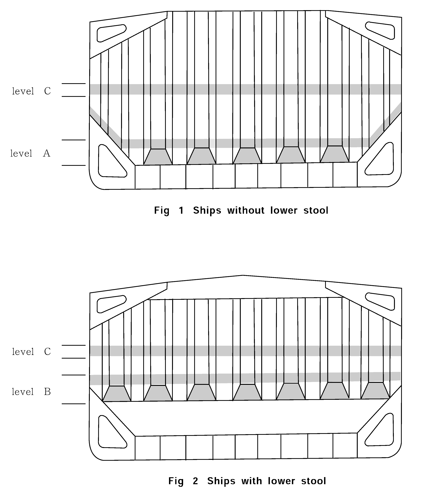 |   |

  **Table 10 Extent of thickness measurements at Special Survey - Oil Tankers with ESP notation**

  | No. of Special Survey | Extent and location of measurement |
  | --- | --- |
  | Special Survey No. 1 | 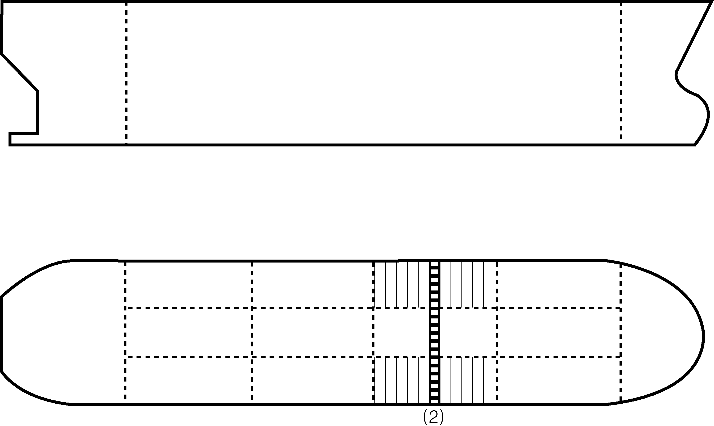 (1) Suspect areas (2) One transverse section of deck plates for the full beam of the ship within the cargo area (in way of a ballast tank, if any, or a cargo tank used primarily for water ballast) (3) Measurements, for general assessment and recording of corrosion pattern, of those structural members subject to Close-up Survey |
  | Special Survey No. 2 *(2024)* | 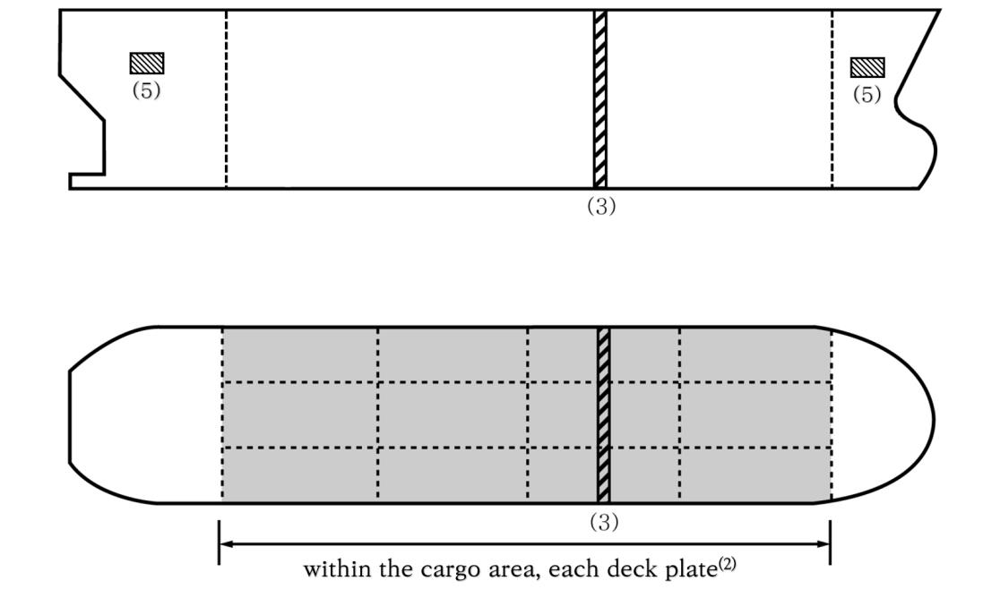 (1) Suspect areas (2) Within the cargo area, each deck plate (3) Within the cargo area, one transverse section (4) Measurements, for general assessment and recording of corrosion pattern, of those structural members subject to Close-up Survey (5) Selected wind and water strakes outside the cargo area |

  **Table 10 Extent of thickness measurements at Special Survey - Oil Tankers with ESP notation** (continued)

  | No. of Special Survey |   | Extent and location of measurement |
  | --- | --- | --- |
  | Special Survey No. 3 *(2024)* |   | 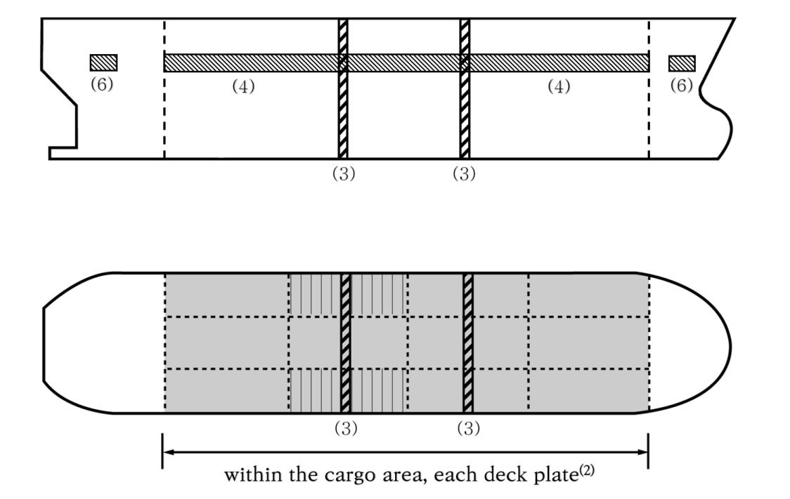 (1) Suspect area (2) Within the cargo area, each deck plate (3) Within the cargo area, two transverse sections^1) (4) Within the cargo area, all wind and water strakes (5) Measurements, for general assessment and recording of corrosion pattern, of those structural members subject to Close-up Survey (6) Selected wind and water strakes outside the cargo area |
  | Special Survey No. 4 and Subsequent *(2024)* |   | 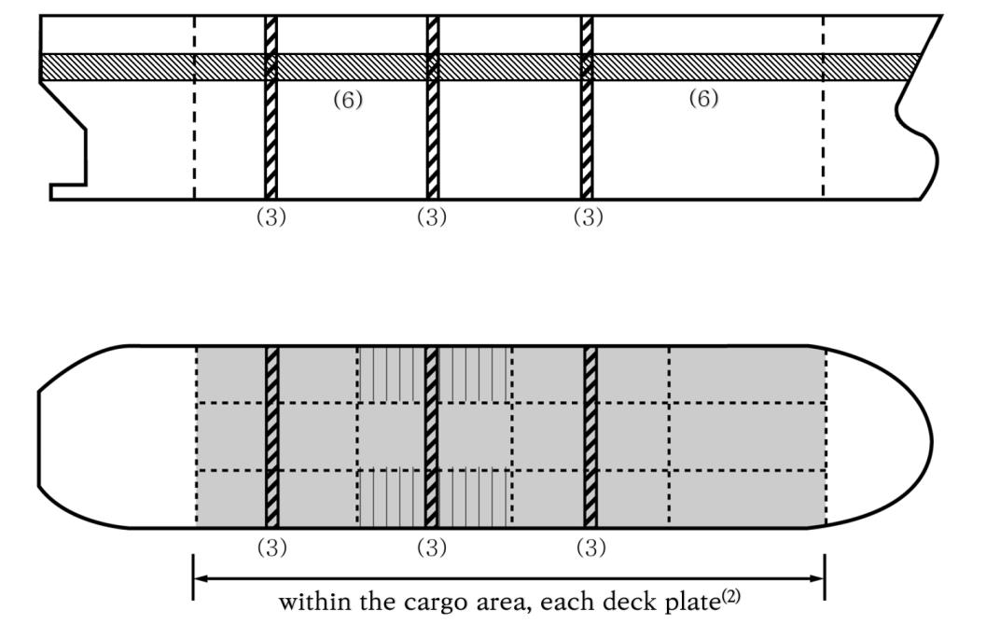 (1) Suspect areas (2) Within the cargo area, each deck plate (3) Within the cargo area, three transverse sections^1) (4) Within the cargo area, each bottom plate (5) Measurements, for general assessment and recording of corrosion pattern, of those structural members subject to Close-up Survey (6) All wind and water strakes, full length |
  | (NOTES) |   |   |
  | 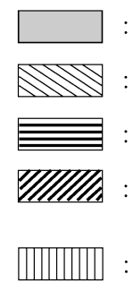 | Thickness gaugings for deck plates Thickness gaugings for side shell plates Thickness gaugings for the transverse section(applied for plates only) Thickness gaugings for the transverse section(including longitudinal members, for transversely framed vessels including adjacent frames and their end connections in way of transverse sections) Thickness gaugings in way of the ballast tank |   |
  | 1) At least one section is to include a ballast tank within 0.5 $L$ amidships. |   |   |

  **Table 11 Extent of thickness measurements at Special Survey - Chemical Tankers with ESP notation**

  | No. of Special Survey | Extent and location of measurement |
  | --- | --- |
  | Special Survey No. 1 *(2023)* | (1) Suspect areas |
  | Special Survey No. 2 *(2024)* | 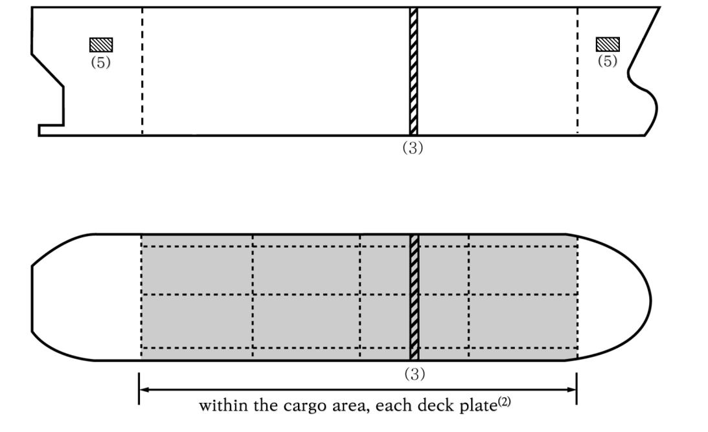 (1) Suspect areas (2) Within the cargo area, each deck plate (3) Within the cargo area, one transverse section (4) Measurements, for general assessment and recording of corrosion pattern, of those structural members subject to Close-up Survey (5) Selected wind and water strakes outside the cargo area |
  | Special Survey No. 3 *(2024)* | 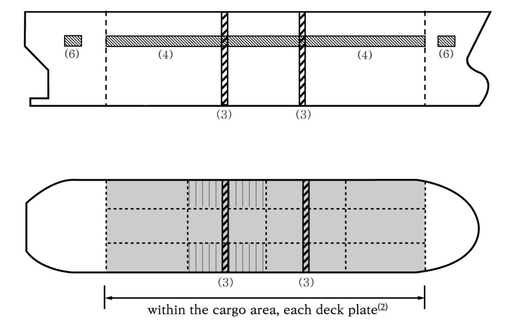 (1) Suspect area (2) Within the cargo area, each deck plate (3) Within the cargo area, two transverse sections^1) (4) Within the cargo area, all wind and water strakes (5) Measurements, for general assessment and recording of corrosion pattern, of those structural members subject to Close-up Survey (6) Selected wind and water strakes outside the cargo area |

  **Table 11 Extent of thickness measurements at Special Survey - Chemical Tankers with ESP notation** (continued)

  | No. of Special Survey |   | Extent and location of measurement |
  | --- | --- | --- |
  | Special Survey No. 4 and Subsequent *(2024)* |   | 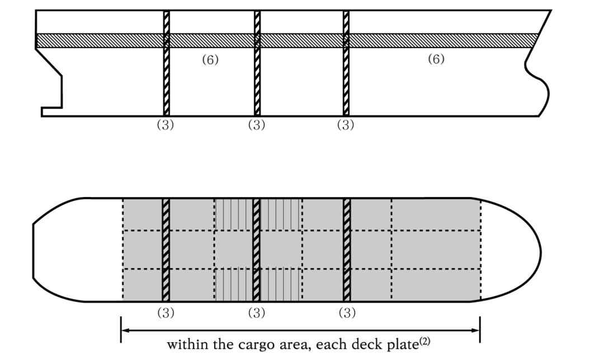 (1) Suspect areas (2) Within the cargo area, each deck plate (3) Within the cargo area, three transverse sections^1) (4) Within the cargo area, each bottom plate (5) Measurements, for general assessment and recording of corrosion pattern, of those structural members subject to Close-up Survey (6) All wind and water strakes, full length |
  | (NOTES) |   |   |
  |  | Thickness gaugings for deck plates Thickness gaugings for side shell plates Thickness gaugings for the transverse section(applied for plates only) Thickness gaugings for the transverse section(including longitudinal members, for transversely framed vessels including adjacent frames and their end connections in way of transverse sections) Thickness gaugings in way of the ballast tank |   |
  | 1) At least one section is to include a ballast tank within 0.5 $L$ amidships. |   |   |

  | No. of Special Survey | Extent and location of measurement |
  | --- | --- |
  | Special Survey No. 1 *(2023)* | (1) Suspect areas |
  | Special Survey No. 2 *(2024)* | 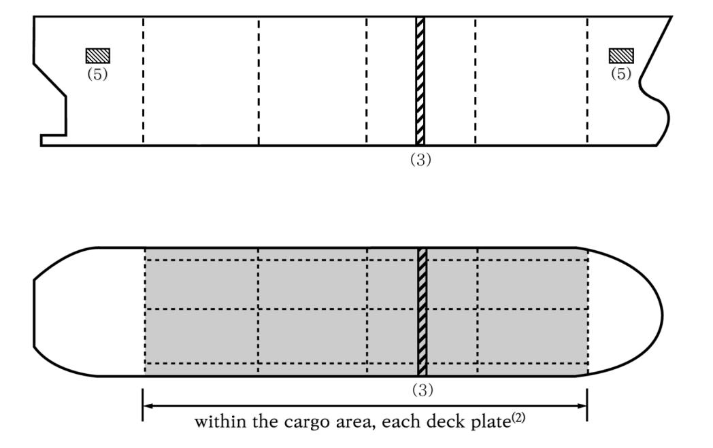 (1) Suspect areas (2) Within the cargo area, each deck plate (3) Within the cargo area, one transverse section (4) Measurements, for general assessment and recording of corrosion pattern, of those structural members subject to Close-up Survey (5) Selected wind and water strakes outside the cargo area |
  | Special Survey No. 3 *(2024)* | 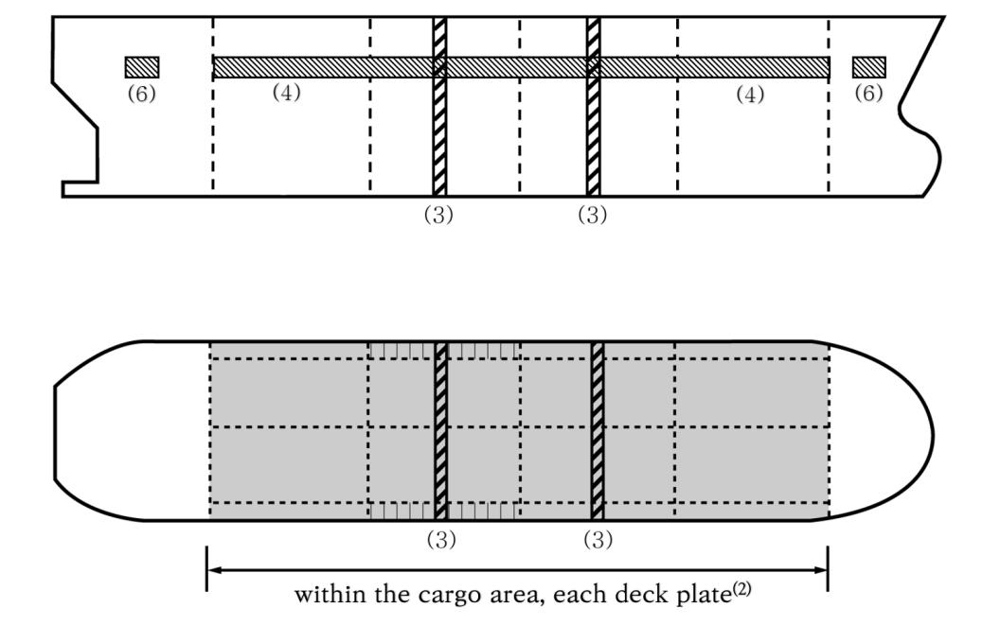 (1) Suspect areas (2) Within the cargo area, each deck plate (3) Within the cargo area, two transverse sections^1) (4) Within the cargo area, all wind and water strakes (5) Measurements, for general assessment and recording of corrosion pattern, of those structural members subject to Close-up Survey (6) Selected wind and water strakes outside the cargo area |

  | No. of Special Survey |   | Extent and location of measurement |
  | --- | --- | --- |
  | Special Survey No. 4 and Subsequent *(2024)* |   | 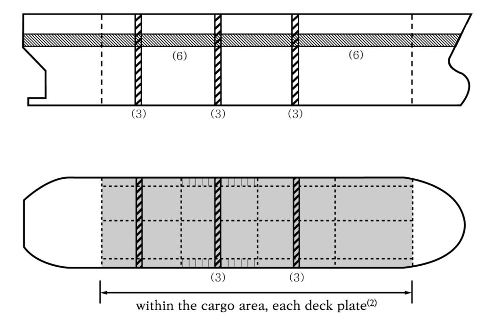 (1) Suspect areas (2) Within the cargo area, each deck plate (3) Within the cargo area, three transverse sections^1) (4) Within the cargo area, each bottom plate (5) Measurements, for general assessment and recording of corrosion pattern, of those structural members subject to Close-up Survey (6) All wind and water strakes, full length |
  | (NOTES) |   |   |
  |  | Thickness gaugings for deck plates Thickness gaugings for side shell plates Thickness gaugings for the transverse section(applied for plates only) Thickness gaugings for the transverse section(including longitudinal members, for transversely framed vessels including adjacent frames and their end connections in way of transverse sections) Thickness gaugings in way of the ballast tank |   |
  | 1) At least one section is to include a ballast tank within 0.5 $L$ amidships. |   |   |

  | No. of Special Survey | Extent and location of measurement |
  | --- | --- |
  | Special Survey No. 1 | (1) Suspect areas |
  | Special Survey No. 2 *(2024)* | 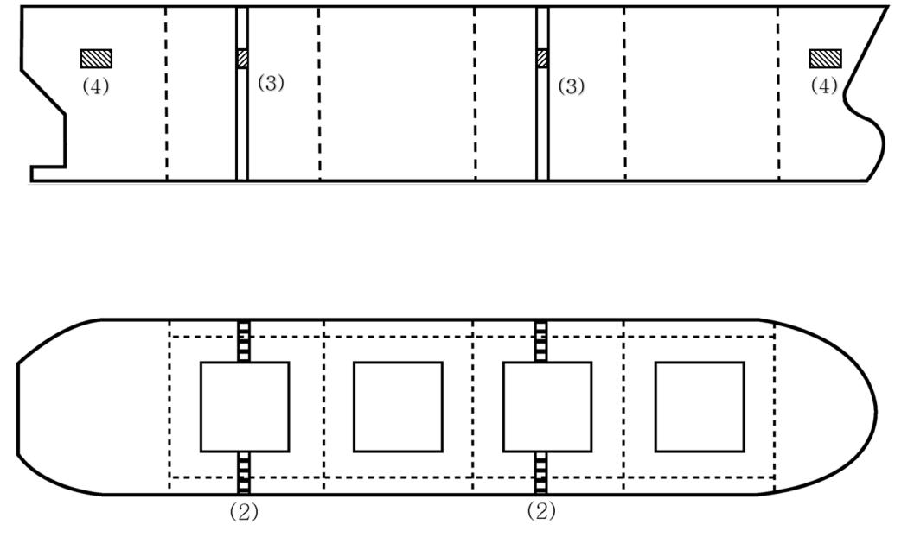 (1) Suspect areas (2) Within the cargo length, two transverse sections of deck plating outside line of cargo hatch openings (3) Wind and water strakes in way of the two transverse sections considered (2) above (4) Selected wind and water strakes outside the cargo length area (5) Measurements, for general assessment and recording of corrosion pattern, of those structural members subject to Close-up Survey |
  | Special Survey No. 3 *(2024)* | 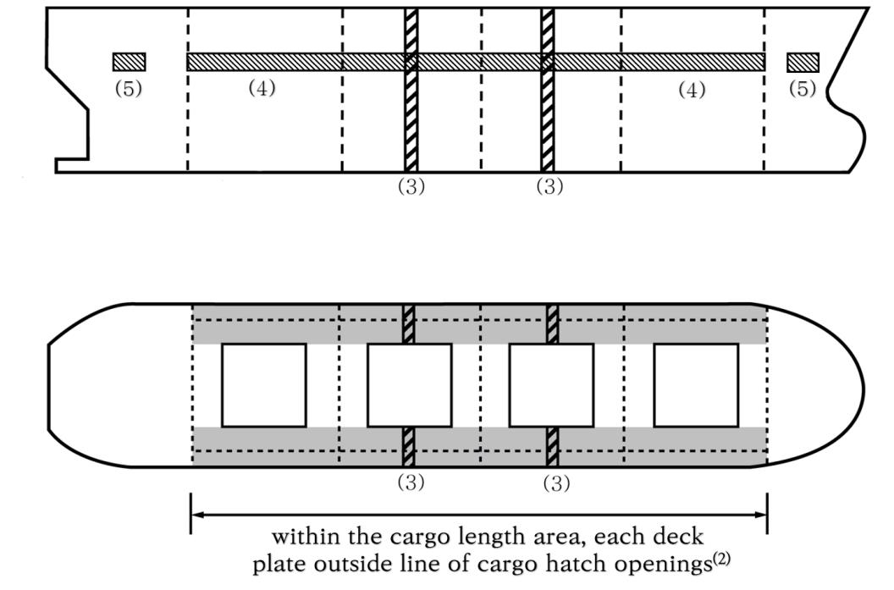 (1) Suspect areas (2) Within the cargo length, each deck plate outside line of cargo hatch openings (3) Within the cargo length, two transverse sections, one in the amidship area, outside line of cargo hatch openings (4) Within the cargo length, all wind and water strakes (5) Selected wind and water strakes outside the cargo length area (6) Measurements, for general assessment and recording of corrosion pattern, of those structural members subject to Close-up Survey |

  | No. of Special Survey |   | Extent and location of measurement |
  | --- | --- | --- |
  | Special Survey No. 4 and Subsequent *(2024)* |   | 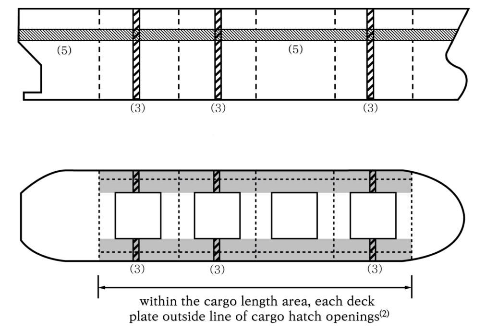 (1) Suspect areas (2) Within the cargo length, each deck plate outside line of cargo hatch openings (3) Within the cargo length, three transverse sections, one in the amidship area, outside line of cargo hatch openings (4) Within the cargo length, each bottom plate (5) All wind and water strakes, full length (6) Measurements, for general assessment and recording of corrosion pattern, of those structural members subject to Close-up Survey |
  | (NOTES) |   |   |
  |  | Thickness gaugings for deck plates Thickness gaugings for side shell plates Thickness gaugings for the transverse section(applied for plates only) Thickness gaugings for the transverse section(including longitudinal members, for transversely framed vessels including adjacent frames and their end connections in way of transverse sections) |   |

  **Table 14 Requirements for extent of thickness measurements at those areas of substantial corrosion - Bulk Carriers with ESP notation**
  1) Shell Structures

  | Structural Member | Extent of Measurement | Pattern of measurement |
  | --- | --- | --- |
  | 1. Bottom and Side Shell Plating | 1) Suspect plate, plus four adjacent plates 2) See other tables for particulars on gauging in way tanks and cargo holds | 1) 5 point pattern for each panel between longitudinals |
  | 2. Bottom/Side Shell Longitudinals | Minimum of three longitudinals in way of suspect areas | 3 measurement in line across web 3 measurement on flange |

  2) Transverse Bulkheads in Cargo Holds

  | Structural member | Extent of Measurement | Pattern of measurement |
  | --- | --- | --- |
  | 1. Lower Stool | 1) Transverse band within 25 $\mathrm{mm}$ of welded connection to inner-bottom 2) Transverse band within 25 $\mathrm{mm}$ of welded connection to shelf plate | 1) 5 point between stiffeners over 1 metre length 2) 5 point between stiffeners over 1 metre length |
  | 2. Transverse Bulkhead | 1) Transverse band at approximately mid height 2) Transverse band at part of bulkhead adjacent to upper deck or below upper stool shelf plate (for those ships fitted with upper stools) | 1) 5 point pattern over 1 sq. metre of plating 2) 5 point pattern over 1 sq. metre of plating |

  3) Deck Structure including Cross Strips, Main Cargo Hatchways, Hatch Covers, Coamings and Topside Tanks

  | Structural Member | Extent of Measurement | Pattern of Measurement |
  | --- | --- | --- |
  | 1. Cross Deck Strip Plating | Suspect cross deck strip plating | 5 point pattern between underdeck stiffeners over 1 metre length |
  | 2. Underdeck Stiffeners | 1) Transverse members 2) Longitudinal member | 1) 5 point pattern at each end and mid span 2) 5 point pattern on both web and flange |
  | 3. Hatch Covers | 1) Side and end skirts, each 3 locations 2) 3 longitudinal bands, outboard strakes (2) and centerline strake (1) | 1) 5 point pattern at each location 2) 5 point measurement each band |
  | 4. Hatch Coamings | Each side and end of coaming, one band lower 1/3, one band upper 2/3 of coaming | 5 point measurement each band i.e. end or side coaming |
  | 5. Topside Ballast Tanks | 1) Watertight transverse bulkheads a) lower 1/3 of bulkhead b) upper 2/3 of bulkhead c) stiffeners 2) 2 representative swash transverse bulkheads a) lower 1/3 of bulkhead b) upper 2/3 of bulkhead c) stiffeners 3) 3 representative bays of slop plating a) lower 1/3 of tank b) upper 2/3 of tank 4) Longitudinals, suspect and adjacent | 1) a) 5 point pattern over 1 sq. metre of plating b) 5 point pattern over 1 sq. metre of plating c) 5 point pattern over 1 metre length 2) a) 5 point pattern over 1 sq. metre of plating b) 5 point pattern over 1 sq. metre of plating c) 5 point pattern over 1 metre length 3) a) 5 point pattern over 1 sq. metre of plating b) 5 point pattern over 1 sq. metre of plating 4) 5 point pattern both web and flange over 1 metre length |
  | 6. Main Deck Plating | Suspect plates and adjacent (4) | 5 point pattern over 1 sq. metre of plating |
  | 7. Main Deck Longitudinals | Minimum of 3 longitudinals where plating measured | 5 point pattern on both web and flange over 1 metre length |
  | 8. Web Frames /Transverses | Suspect plates | 5 point pattern over 1 sq. metre |

  **Table 14 Requirements for extent of thickness measurements at those areas of substantial corrosion - Bulk Carriers with ESP notation** (continued)
  4) Double Bottom and Hopper Structure

  | Structural Member | Extent of Measurement | Pattern of Measurement |
  | --- | --- | --- |
  | 1. Inner/Double Bottom Plating | Suspect plate plus all adjacent plates | 5 point pattern for each panel between longitudinals over 1 metre length |
  | 2. Inner/Double Bottom Longitudinals | Three longitudinals where plates measured | 3 measurements in line across web and 3 measurements on flange |
  | 3. Longitudinal Girders or Transverse Floors | Suspect plates | 5 point pattern over about 1 square metre |
  | 4. Watertight Bulkhead (W.T Floors) | 1) lower 1/3 of tank 2) upper 2/3 of tank | 1) 5 point pattern over 1 sq. metre of plating 2) 5 point pattern alternate plates over 1 sq. metre of plating |
  | 5. Web Frames | Suspect plating | 5 point pattern over 1 sq. metre of plating |
  | 6. Bottom/Side Shell Longitudinals | Minimum of three longitudinals in way of suspect areas | 3 measurements in line across web 3 measurements on flange |

  5) Cargo Holds

  | Structural Member | Extent of Measurement | Pattern of Measurement |
  | --- | --- | --- |
  | 1. Side Shell Frames | Suspect frame and each adjacent frame | a) At each end and mid span : 5 point pattern of both web and flange b) 5 point pattern within 25 $\mathrm{mm}$ of welded attachment of both shell and lower slope plate |

  4) Transverse Watertight and Swash Bulkheads

  | Structure Member | Extent of Measurement | Pattern of Measurement |
  | --- | --- | --- |
  | 1. Upper and Lower Stool, where fitted | ․ Transverse band within 25 $\mathrm{mm}$ of welded connection to inner bottom/deck plating ․ Transverse band within 25 $\mathrm{mm}$ of welded connection to shelf plate | 5-point pattern between stiffeners over one metre length |
  | 2. Deckhead and Bottom Strakes, and Strakes in way of Horizontal Stringers | Plating between pair of stiffeners at three locations: approximately 1/4, 1/2 and 3/4 width of tank | 5-point pattern between stiffeners over one metre length |
  | 3. All Other Strakes | Plating between pair of stiffeners at middle location | Single measurement |
  | 4. Strakes in Corrugated Bulkheads | Plating for each change of scantling at centre of panel and at flange of fabricated connection | 5-point pattern over about one square metre of plating |
  | 5. Stiffeners | Minimum of three typical stiffeners | For web, 5-point pattern over span between bracket connections (two measurements across web at each bracket connection and one at centre of span). For flange, single measurements at each bracket toe and at centre of span |
  | 6. Brackets | Minimum of three at top, middle and bottom of tank | 5-point pattern over area of bracket |
  | 7. Horizontal Stringers | All stringers with measurements at both ends and middle | 5-point pattern over one square metre area, plus single measurements near bracket toes and on flanges |
  | 8. Deep Webs and Girders | Measurements at toe of bracket and at centre of span | For web, 5-point pattern over about one square metre. three measurements across face flat |

  **Table 17 Requirements for extent of thickness measurements at those areas of substantial corrosion - Double Hull Oil Tankers with ESP notation**
  1) Bottom, Inner Bottom and Hopper Structure

  | Structural Member | Extent of Measurement | Pattern of Measurement |
  | --- | --- | --- |
  | 1. Bottom, Inner Bottom and Hopper Structure Plating | Minimum of three bays across double bottom tank, including aft bay. Measurements around and under all suction bell mouths | 5-point pattern for each panel between longitudinals and floors |
  | 2. Bottom, Inner Bottom and Hopper Structure Longitudinals | Minimum of three longitudinals in each bay where bottom plating measured | Three measurements in line across flange and three measurements on vertical web |
  | 3. Bottom Girders, including the watertight ones | At fore and aft watertight floors and in centre of tanks | Vertical line of single measurements on girder plating with one measurement between each panel stiffener, or a minimum of three measurements |
  | 4. Bottom Floors, including the watertight ones | Three floors in bays where bottom plating measured, with measurements at both ends and middle | 5-point pattern over two square metre area |
  | 5. Hopper Structure Web Frame Ring | Three floors in bays where bottom plating measured | 5-point pattern over one square metre of plating. Single measurements on flange |
  | 6. Hopper Structure Transverse Watertight Bulkhead or Swash Bulkhead | ․ Lower 1/3 of bulkhead | ․ 5-point pattern over one square metre of plating |
  | 6. Hopper Structure Transverse Watertight Bulkhead or Swash Bulkhead | ․ Upper 2/3 of bulkhead | ․ 5-point pattern over two square metre of plating |
  | 6. Hopper Structure Transverse Watertight Bulkhead or Swash Bulkhead | ․ Stiffeners (minimum of three) | ․ For web, 5-point pattern over span (two measurements across web at each end and one at centre of span). ․ For flange, single measurements at each end and centre of span |
  | 7. Panel Stiffening | Where applicable | Single measurements |

  2) Deck Structure

  | Structural Member | Extent of Measurement | Pattern of Measurement |
  | --- | --- | --- |
  | 1. Deck Plating | Two transverse bands across tank | Minimum of three measurements per plate per band |
  | 2. Deck Longitudinals | Every third longitudinal in each of two bands with a minimum of one longitudinal | Three measurements in line vertically on webs and two measurements on flange (if fitted) |
  | 3. Deck Girders and Brackets (usually in cargo tanks only) | At fore and aft transverse bulkhead, bracket toes and in centre of tanks | Vertical line of single measurements on web plating with one measurement between each panel stiffener, or a minimum of three measurements. Two measurements across flange. 5-point pattern on girder/bulkhead brackets |
  | 4. Deck Transverse Webs | Minimum of two webs, with measurements at both ends and middle of span | 5-point pattern over one square metre area. Single measurements on flange |
  | 5. Vertical Web and Transverse Bulkhead in Wing Ballast Tank (two metres from deck) | Minimum of two webs, and both transverse bulkheads | 5-point pattern over one square metre area |
  | 6. Panel Stiffening | Where applicable | Single measurements |

  **Table 17 Requirements for extent of thickness measurements at those areas of substantial corrosion - Double Hull Oil Tankers with ESP notation** (continued)
  3) Structure in Wing Ballast Tanks

  | Structural Member | Extent of Measurement | Pattern of Measurement |
  | --- | --- | --- |
  | 1. Side Shell and Longitudinal Bulkhead Plating : ․ Upper Strake and Strakes in way of Horizontal Girders ․ All Other Strakes | ․ Plating between each pair of longitudinals in a minimum of three bays (along the tank) ․ Plating between every third pair of longitudinals in same three bays | ․ Single measurement ․ Single measurement |
  | 2. Side Shell and Longitudinal Bulkhead Longitudinals on : ․ Upper Strake ․ All Other Strakes | ․ Each longitudinal in same three bays ․ Every third longitudinal in same three bays | ․ 3 measurements across web and 1 measurement on flange ․ 3 measurements across web and 1 measurement on flange |
  | 3. Longitudinals - Brackets | Minimum of three at top, middle and bottom of tank in same three bays | 5-point pattern over area of bracket |
  | 4. Vertical Web and Transverse Bulkheads (excluding deckhead area) : ․ Strakes in way of Horizontal Girders ․ Other Strakes | ․ Minimum of two webs and both transverse bulkheads ․ Minimum of two webs and both transverse bulkheads | ․ 5-point pattern over approx. two square metre area ․ two measurement between each pair of vertical stiffeners |
  | 5. Horizontal Girders | Plating on each girder in a minimum of three bays | Two measurements between each pair of longitudinal girder stiffeners |
  | 6. Panel Stiffening | Where applicable | Single measurements |

  4) Longitudinal Bulkheads in Cargo Tanks

  | Structural Member | Extent of Measurement | Pattern of Measurement |
  | --- | --- | --- |
  | 1. Deckhead and Bottom Strakes, and Strakes in way of the Horizontal Stringers of Transverse Bulkheads | Plating between each pair of longitudinal in a minimum of three bays | Single measurement |
  | 2. All Other Strakes | Plating between every third pair of longitudinals in same three bays | Single measurement |
  | 3. Longitudinals on Deckhead and Bottom Strakes | Each longitudinal in same three bays | Three measurements across web and one measurement on flange |
  | 4. All Other Longitudinals | Every third longitudinal in same three bays | Three measurements across web and one measurement on flange |
  | 5. Longitudinals - Brackets | Minimum of three at top, middle and bottom of tank in same three bays | 5-point pattern over area of bracket |
  | 6. Web Frames and Cross Ties | Three webs with minimum of three locations on each web, including in way of cross tie connections | 5-point pattern over approximately two square metre area of webs, plus single measurements on flanges of web frame and cross ties |
  | 7. Lower End Brackets (opposite side of web frame) | Minimum of three brackets | 5-point pattern over approximately two square metre area of brackets, plus single measurements on bracket flanges |

  **Table 17 Requirements for extent of thickness measurements at those areas of substantial corrosion - Double Hull Oil Tankers with ESP notation** (continued)
  5) Transverse Watertight and Swash Bulkheads in Cargo Tanks

  | Structural Member | Extent of Measurement | Pattern of Measurement |
  | --- | --- | --- |
  | 1. Upper and Lower Stool, where fitted | ․ Transverse band within 25 $\mathrm{mm}$ of welded connection to inner bottom/deck plating ․ Transverse band within 25 $\mathrm{mm}$ of welded connection to shelf plate | 5-point pattern between stiffeners over one metre length |
  | 2. Deckhead and Bottom Strakes, and Strakes in way of Horizontal Stringers | Plating between pair of stiffeners at three locations : approximately 1/4, 1/2 and 3/4 width of tank | 5-point pattern between stiffeners over one metre length |
  | 3. All Other Strakes | Plating between pair of stiffeners at middle location | Single measurement |
  | 4. Strakes in Corrugated Bulkheads | Plating for each change of scantling at centre of panel and at flange of fabricated connection | 5-point pattern over about one square metre of plating |
  | 5. Stiffeners | Minimum of three typical stiffeners | For web, 5-point pattern over span between bracket connections (two measurements across web at each bracket connection and one at centre of span). For flange, single measurements at each bracket toe and at centre of span |
  | 6. Brackets | Minimum of three at top, middle and bottom of tank | 5-point pattern over area of bracket |
  | 7. Horizontal Stringers | All stringers with measurements at both ends and middle | 5-point pattern over one square metre area, plus single measurements near bracket toes and on flanges |

  **Table 18 Requirements for extent of thickness measurements at those areas of substantial corrosion - Double Skin Bulk Carriers with ESP notation**
  1) Bottom, Inner Bottom and Hopper Structure

  | Structural Member | Extent of Measurement | Pattern of Measurement |
  | --- | --- | --- |
  | 1. Bottom, Inner Bottom and Hopper Structure Plating | Minimum of three bays across double bottom tank, including aft bay. Measurements around and under all suction bell mouths | 5-point pattern for each panel between longitudinals and floors |
  | 2. Bottom, Inner Bottom and Hopper Structure Longitudinals | Minimum of three longitudinals in each bay where bottom plating measured | Three measurements in line across flange and three measurements on the vertical web |
  | 3. Bottom Girders, including the watertight ones | At fore and aft watertight floors and in centre of tanks | Vertical line of single measurements on girder plating with one measurement between each panel stiffener, or a minimum of three measurements |
  | 4. Bottom Floors, including the watertight ones | Three floors in the bays where bottom plating measured, with measurements at both ends and middle | 5-point pattern over two square metre area |
  | 5. Hopper Structure Web Frame Ring | Three floors in bays where bottom plating measured | 5-point pattern over one square metre of plating. Single measurements on flange |
  | 6. Hopper Structure Transverse Watertight Bulkhead or Swash Bulkhead | ․ Lower 1/3 of bulkhead | ․ 5-point pattern over one square metre of plating |
  | 6. Hopper Structure Transverse Watertight Bulkhead or Swash Bulkhead | ․ Upper 2/3 of bulkhead | ․ 5-point pattern over two square metre of plating |
  | 6. Hopper Structure Transverse Watertight Bulkhead or Swash Bulkhead | ․ Stiffeners(minimum of three) | ․ For web, 5-point pattern over span(two measurements across web at each end and one at centre of span). ․ For flange, single measurements at each end and centre of span |
  | 7. Panel Stiffening | Where applicable | Single measurement |

  **Table 18 Requirements for extent of thickness measurements at those areas of substantial corrosion - Double Skin Bulk Carriers with ESP notation** (continued)
  2) Deck Structure including Cross Strips, Main Cargo Hatchways, Hatch Covers, Coamings and Topside
  Tanks

  | Structural Member | Extent of Measurement | Pattern of Measurement |
  | --- | --- | --- |
  | 1. Cross Deck Strip Plating | Suspect cross deck strip plating | 5-point pattern between underdeck stiffeners over 1 metre length |
  | 2. Underdeck Stiffeners | 1) Transverse members 2) Longitudinal members | 1) 5-point pattern at each end and mid span 2) 5-point pattern on both web and flange |
  | 3. Hatch Covers | 1) Side and end skirts, each three locations 2) Three longitudinal bands, outboard strakes(2) and centerline strake(1) | 1) 5-point pattern at each location 2) 5-point measurement each band |
  | 4. Hatch Coamings | Each side and end of coaming, one band lower 1/3, one band upper 2/3 of coaming | 5-point measurement each band i.e. end or side coaming |
  | 5. Topside Ballast Tanks | 1) Watertight transverse bulkhead a) Lower 1/3 of bulkhead b) Upper 2/3 of bulkhead c) Stiffeners 2) Two representative swash transverse bulkheads a) Lower 1/3 of bulkhead b) Upper 2/3 of bulkhead c) Stiffeners 3) Three representative bays of slope plating a) Lower 1/3 of tank b) Upper 2/3 of tank 4) Longitudinals, suspect and adjacent | 1) a) 5-point pattern over 1 sq. metre of plating b) 5-point pattern over 1 sq. metre of plating c) 5-point pattern over 1 metre length 2) a) 5-point pattern over 1 sq. metre of plating b) 5-point pattern over 1 sq. metre of plating c) 5-point pattern over 1 metre length 3) a) 5-point pattern over 1 sq. metre of plating b) 5-point pattern over 1 sq. metre of plating 4) 5-point pattern on both web and flange over 1 metre length |
  | 6. Main Deck Plating | Suspect plates and adjacent(4) | 5-point pattern over 1 sq. metre of plating |
  | 7. Main Deck Longitudinals | Suspect plates | 5-point pattern on both web and flange over 1 metre length |
  | 8. Web Frames/ Transverse | Suspect plates | 5-point pattern over 1 sq. metre of plating |

  **Table 18 Requirements for extent of thickness measurements at those areas of substantial corrosion - Double Skin Bulk Carriers with ESP notation** (continued)
  3) Structure in Double Side Spaces(including Wing Void Spaces of Ore Carriers)

  | Structural Member | Extent of Measurement | Pattern of Measurement |
  | --- | --- | --- |
  | 1. Side Shell and Inner Plating : ․ Upper strake and strakes in way of horizontal girders ․ All other strakes | ․ Plating between each pair of transverse frames/longitudinals in a minimum of three bays(along the tank) ․ Plating between every third pair of longitudinals in same three bays | ․ Single measurements ․ Single measurements |
  | 2. Side Shell and Inner Side Transverse Frames/ Longitudinals on : ․ Upper strake ․ All other strakes | ․ Each transverse frame/ longitudinal in same three bays ․ Every third transverse frame/longitudinal in same three bays | ․ Three measurements across web and 1 measurement on flange ․ Three measurements across web and 1 measurement on flange |
  | 3. Transverse Frames/Longitudinals Brackets | Minimum of three at top, middle and bottom of tank in same three bays | 5-point pattern over area of bracket |
  | 4. Vertical Web and Transverse Bulkheads : ․ Strakes in way of horizontal girders ․ Other strakes | ․ Minimum of two webs and both transverse bulkheads ․ Minimum of two webs and both transverse bulkheads | ․ 5-point patterns over approx. two square metre area ․ Two measurements between each pair of vertical stiffeners |
  | 5. Horizontal Girders | Plating on each girder in a minimum of three bays | Two measurements between each pair of longitudinal girder stiffeners |
  | 6. Panel Stiffening | Where applicable | Single measurements |

  4) Transverse Bulkheads in Cargo Holds

  | Structural Member | Extent of Measurement | Pattern of Measurement |
  | --- | --- | --- |
  | 1. Lower Stool, where fitted | ․ Transverse band within 25 $\mathrm{mm}$ of welded connection to inner bottom ․ Transverse band within 25 $\mathrm{mm}$ of welded connection to shelf plate | ․ 5-point pattern between stiffeners over one metre length ․ 5-point pattern between stiffeners over one metre length |
  | 2. Transverse Bulkheads | ․ Transverse band at approximately mid height ․ Transverse band at part of bulkhead adjacent to upper deck of below upper stool shelf plate(for those ships fitted with upper stools) | ․ 5-point pattern over one square metre of plating ․ 5-point pattern over one square metre of plating |

  **Table 20-1 Thickness measurements reports - Non-CSR Ships** **Table 20-1** is to be used to vessels not built under IACS Common Structural Rules(**Pt 11**, **Pt 12** or **Pt 13**)(i.e. Non-CSR Ships) **TM1-T/DHT/BC/DSBC/GE*** Report on THICKNESS MEASUREMENT of ALL DECK PLATING / ALL BOTTOM SHELL PLATING / ALL SIDE SHELL PLATING^* Ship's Name : Class Identity No. : Report No. :

  | STRAKE POSITION |   |   |   |   |   |   |   |   |   |   |   |   |   |   |   |   |   |
  | --- | --- | --- | --- | --- | --- | --- | --- | --- | --- | --- | --- | --- | --- | --- | --- | --- | --- |
  | PLATE POSITION | No. or Letter | Org. Thk. mm | Forward Reading |   |   |   |   |   | Aft Reading |   |   |   |   |   | Mean Diminution % |   | M.A.D |
  | PLATE POSITION | No. or Letter | Org. Thk. mm | Gauged |   | Diminution P |   | Diminution S |   | Gauged |   | Diminution P |   | Diminution S |   | Mean Diminution % |   | M.A.D |
  | PLATE POSITION | No. or Letter | Org. Thk. mm | P | S | mm | *%* | mm | *%* | P | S | mm | *%* | mm | *%* | P | S | mm |
  | 15th forward |   |   |   |   |   |   |   |   |   |   |   |   |   |   |   |   |   |
  | 14th |   |   |   |   |   |   |   |   |   |   |   |   |   |   |   |   |   |
  | 13th |   |   |   |   |   |   |   |   |   |   |   |   |   |   |   |   |   |
  | 12th |   |   |   |   |   |   |   |   |   |   |   |   |   |   |   |   |   |
  | 11th |   |   |   |   |   |   |   |   |   |   |   |   |   |   |   |   |   |
  | 10th |   |   |   |   |   |   |   |   |   |   |   |   |   |   |   |   |   |
  | 9th |   |   |   |   |   |   |   |   |   |   |   |   |   |   |   |   |   |
  | 8th |   |   |   |   |   |   |   |   |   |   |   |   |   |   |   |   |   |
  | 7th |   |   |   |   |   |   |   |   |   |   |   |   |   |   |   |   |   |
  | 6th |   |   |   |   |   |   |   |   |   |   |   |   |   |   |   |   |   |
  | 5th |   |   |   |   |   |   |   |   |   |   |   |   |   |   |   |   |   |
  | 4th |   |   |   |   |   |   |   |   |   |   |   |   |   |   |   |   |   |
  | 3rd |   |   |   |   |   |   |   |   |   |   |   |   |   |   |   |   |   |
  | 2nd |   |   |   |   |   |   |   |   |   |   |   |   |   |   |   |   |   |
  | 1st |   |   |   |   |   |   |   |   |   |   |   |   |   |   |   |   |   |
  | Amidships |   |   |   |   |   |   |   |   |   |   |   |   |   |   |   |   |   |
  | 1st aft |   |   |   |   |   |   |   |   |   |   |   |   |   |   |   |   |   |
  | 2nd |   |   |   |   |   |   |   |   |   |   |   |   |   |   |   |   |   |
  | 3rd |   |   |   |   |   |   |   |   |   |   |   |   |   |   |   |   |   |
  | 4th |   |   |   |   |   |   |   |   |   |   |   |   |   |   |   |   |   |
  | 5th |   |   |   |   |   |   |   |   |   |   |   |   |   |   |   |   |   |
  | 6th |   |   |   |   |   |   |   |   |   |   |   |   |   |   |   |   |   |
  | 7th |   |   |   |   |   |   |   |   |   |   |   |   |   |   |   |   |   |
  | 8th |   |   |   |   |   |   |   |   |   |   |   |   |   |   |   |   |   |
  | 9th |   |   |   |   |   |   |   |   |   |   |   |   |   |   |   |   |   |
  | 10th |   |   |   |   |   |   |   |   |   |   |   |   |   |   |   |   |   |
  | 11th |   |   |   |   |   |   |   |   |   |   |   |   |   |   |   |   |   |
  | 12th |   |   |   |   |   |   |   |   |   |   |   |   |   |   |   |   |   |
  | 13th |   |   |   |   |   |   |   |   |   |   |   |   |   |   |   |   |   |
  | 14th |   |   |   |   |   |   |   |   |   |   |   |   |   |   |   |   |   |
  | 15th |   |   |   |   |   |   |   |   |   |   |   |   |   |   |   |   |   |
  | Operators Signature : (NOTES) 1. This report form is to be used for recording the thickness measurement of : All strength deck plating within the cargo (length) area All keel, bottom shell plating and bilge plating within the cargo (length) area Side shell plating including selected wind and water strakes outside cargo (length) area All wind and water strakes within cargo (length) area 2. The strake position is to be clearly indicated as follow : 2.1 For strength deck indicate the number of the strake of plating inboard from the stringer plate. 2.2 For bottom plating indicate the number of the strake of plating outboard from the keel plate. 2.3 For side shell plating give number of the strake of plating below sheerstrake and letter as shown on shell expansion. 3. For the ships which have no wide cargo openings i.e oil tankers all deck plating strakes are to be recorded, for the ships which have wide cargo openings i.e ore/oil ships and bulk carriers only the deck plating strakes outside line of openings are to be recorded. 4. Measurements are to be taken at the forward and aft areas of all plates and where plates cross ballast and cargo tank/hold boundaries separate measurements for the area of plating in way of each type of tank/hold are to be recorded. 5. The single measurements recorded are to represent the average of multiple measurements. 6. The maximum allowable diminution could be stated in an attached document. * : delete as appropriate T : Oil Tankers and Chemical Tankers with ESP notation DHT : Double Hull Oil Tankers with ESP notation BC : Bulk Carriers with ESP notation DSBC : Double Skin Bulk Carriers with ESP notation GE : Others M.A.D : Maximum Allowable Diminution |   |   |   |   |   |   |   |   |   |   |   |   |   |   |   |   |   |

  **Table 20-1 Thickness measurements reports - Non-CSR Ships** (continued) **TM2-T/DHT/BC/DSBC/GE(i)*** Report on THICKNESS MEASUREMENT OF SHEERSTRAKE AND DECK PLATING AT TRANSVERSE SECTIONS (one, two or three transverse sections) Ship's Name : Class Identity No. : Report No. :

  | STRENGTH DECK AND SHEERSTRAKE PLATING |   |   |   |   |   |   |   |   |   |   |   |   |   |   |   |   |   |   |   |   |   |   |   |   |   |   |   |
  | --- | --- | --- | --- | --- | --- | --- | --- | --- | --- | --- | --- | --- | --- | --- | --- | --- | --- | --- | --- | --- | --- | --- | --- | --- | --- | --- | --- |
  |   | FIRST TRANSVERSE SECTION AT FRAME NUMBER : |   |   |   |   |   |   |   |   | SECOND TRANSVERSE SECTION AT FRAME NUMBER : |   |   |   |   |   |   |   |   | THIRD TRANSVERSE SECTION AT FRAME NUMBER : |   |   |   |   |   |   |   |   |
  | STRAKE POSITION | No. or Letter | Org. Thk. | M.A.D | Gauged |   | Diminution P |   | Diminution S |   | No. or Letter | Org. Thk. | M.A.D | Gauged |   | Diminution P |   | Diminution S |   | No. or Letter | Org. Thk. | M.A.D | Gauged |   | Diminution P |   | Diminution S |   |
  | STRAKE POSITION | No. or Letter | mm | mm | P | S | mm | *%* | mm | *%* | No. or Letter | mm | mm | P | S | mm | *%* | mm | *%* | No. or Letter | mm | mm | P | S | mm | *%* | mm | *%* |
  | Stringer Plate |   |   |   |   |   |   |   |   |   |   |   |   |   |   |   |   |   |   |   |   |   |   |   |   |   |   |   |
  | 1st strake inboard |   |   |   |   |   |   |   |   |   |   |   |   |   |   |   |   |   |   |   |   |   |   |   |   |   |   |   |
  | 2nd |   |   |   |   |   |   |   |   |   |   |   |   |   |   |   |   |   |   |   |   |   |   |   |   |   |   |   |
  | 3rd |   |   |   |   |   |   |   |   |   |   |   |   |   |   |   |   |   |   |   |   |   |   |   |   |   |   |   |
  | 4th |   |   |   |   |   |   |   |   |   |   |   |   |   |   |   |   |   |   |   |   |   |   |   |   |   |   |   |
  | 5th |   |   |   |   |   |   |   |   |   |   |   |   |   |   |   |   |   |   |   |   |   |   |   |   |   |   |   |
  | 6th |   |   |   |   |   |   |   |   |   |   |   |   |   |   |   |   |   |   |   |   |   |   |   |   |   |   |   |
  | 7th |   |   |   |   |   |   |   |   |   |   |   |   |   |   |   |   |   |   |   |   |   |   |   |   |   |   |   |
  | 8th |   |   |   |   |   |   |   |   |   |   |   |   |   |   |   |   |   |   |   |   |   |   |   |   |   |   |   |
  | 9th |   |   |   |   |   |   |   |   |   |   |   |   |   |   |   |   |   |   |   |   |   |   |   |   |   |   |   |
  | 10th |   |   |   |   |   |   |   |   |   |   |   |   |   |   |   |   |   |   |   |   |   |   |   |   |   |   |   |
  | 11th |   |   |   |   |   |   |   |   |   |   |   |   |   |   |   |   |   |   |   |   |   |   |   |   |   |   |   |
  | 12th |   |   |   |   |   |   |   |   |   |   |   |   |   |   |   |   |   |   |   |   |   |   |   |   |   |   |   |
  | 13th |   |   |   |   |   |   |   |   |   |   |   |   |   |   |   |   |   |   |   |   |   |   |   |   |   |   |   |
  | 14th |   |   |   |   |   |   |   |   |   |   |   |   |   |   |   |   |   |   |   |   |   |   |   |   |   |   |   |
  | centre strake |   |   |   |   |   |   |   |   |   |   |   |   |   |   |   |   |   |   |   |   |   |   |   |   |   |   |   |
  | sheer strake |   |   |   |   |   |   |   |   |   |   |   |   |   |   |   |   |   |   |   |   |   |   |   |   |   |   |   |
  | TOPSIDE TOTAL |   |   |   |   |   |   |   |   |   |   |   |   |   |   |   |   |   |   |   |   |   |   |   |   |   |   |   |
  | Operators Signature : (NOTES) 1. This report form is to be used for recording the thickness measurements of : - Strength deck plating and sheerstrake plating transverse sections : One, two or three sections within the cargo (length) area comprising of the following structural items : (1) Strength deck plating (2) Stringer plate (3) Sheerstrake 2. For the ships which have no wide cargo openings i.e oil tankers all deck plating strakes are to be recorded, for the ships which have wide cargo openings i.e ore/oil ships and bulk carriers only the deck plating strakes outside line of openings are to be recorded. 3. The topside area comprises deck plating, stringer plate and sheerstrake (including rounded gunwales) 4. The exact frame station of measurement is to be stated. 5. The single measurements recorded are to represent the average of multiple measurements. 6. The maximum allowable diminution could be stated in an attached document. * : delete as appropriate |   |   |   |   |   |   |   |   |   |   |   |   |   |   |   |   |   |   |   |   |   |   |   |   |   |   |   |

  **Table 20-1 Thickness measurements reports - Non-CSR Ships** (continued) **TM2-T/DHT/BC/DSBC/GE(ii)*** Report on THICKNESS MEASUREMENT OF SHELL AND BOTTOM PLATING AT TRANSVERSE SECTIONS (one, two or three transverse sections) Ship's Name : Class Identity No. : Report No. :

  | SHELL AND BOTTOM PLATING |   |   |   |   |   |   |   |   |   |   |   |   |   |   |   |   |   |   |   |   |   |   |   |   |   |   |   |
  | --- | --- | --- | --- | --- | --- | --- | --- | --- | --- | --- | --- | --- | --- | --- | --- | --- | --- | --- | --- | --- | --- | --- | --- | --- | --- | --- | --- |
  |   | FIRST TRANSVERSE SECTION AT FRAME NUMBER : |   |   |   |   |   |   |   |   | SECOND TRANSVERSE SECTION AT FRAME NUMBER : |   |   |   |   |   |   |   |   | THIRD TRANSVERSE SECTION AT FRAME NUMBER : |   |   |   |   |   |   |   |   |
  | STRAKE POSITION | No. or Letter | Org. Thk. | M.A.D | Gauged |   | Diminution P |   | Diminution S |   | No. or Letter | Org. Thk. | M.A.D | Gauged |   | Diminution P |   | Diminution S |   | No. or Letter | Org. Thk. | M.A.D | Gauged |   | Diminution P |   | Diminution S |   |
  | STRAKE POSITION | No. or Letter | mm | mm | P | S | mm | *%* | mm | *%* | No. or Letter | mm | mm | P | S | mm | *%* | mm | *%* | No. or Letter | mm | mm | P | S | mm | *%* | mm | *%* |
  | 1st below sheer strake |   |   |   |   |   |   |   |   |   |   |   |   |   |   |   |   |   |   |   |   |   |   |   |   |   |   |   |
  | 2nd |   |   |   |   |   |   |   |   |   |   |   |   |   |   |   |   |   |   |   |   |   |   |   |   |   |   |   |
  | 3rd |   |   |   |   |   |   |   |   |   |   |   |   |   |   |   |   |   |   |   |   |   |   |   |   |   |   |   |
  | 4th |   |   |   |   |   |   |   |   |   |   |   |   |   |   |   |   |   |   |   |   |   |   |   |   |   |   |   |
  | 5th |   |   |   |   |   |   |   |   |   |   |   |   |   |   |   |   |   |   |   |   |   |   |   |   |   |   |   |
  | 6th |   |   |   |   |   |   |   |   |   |   |   |   |   |   |   |   |   |   |   |   |   |   |   |   |   |   |   |
  | 7th |   |   |   |   |   |   |   |   |   |   |   |   |   |   |   |   |   |   |   |   |   |   |   |   |   |   |   |
  | 8th |   |   |   |   |   |   |   |   |   |   |   |   |   |   |   |   |   |   |   |   |   |   |   |   |   |   |   |
  | 9th |   |   |   |   |   |   |   |   |   |   |   |   |   |   |   |   |   |   |   |   |   |   |   |   |   |   |   |
  | 10th |   |   |   |   |   |   |   |   |   |   |   |   |   |   |   |   |   |   |   |   |   |   |   |   |   |   |   |
  | 11th |   |   |   |   |   |   |   |   |   |   |   |   |   |   |   |   |   |   |   |   |   |   |   |   |   |   |   |
  | 12th |   |   |   |   |   |   |   |   |   |   |   |   |   |   |   |   |   |   |   |   |   |   |   |   |   |   |   |
  | 13th |   |   |   |   |   |   |   |   |   |   |   |   |   |   |   |   |   |   |   |   |   |   |   |   |   |   |   |
  | 14th |   |   |   |   |   |   |   |   |   |   |   |   |   |   |   |   |   |   |   |   |   |   |   |   |   |   |   |
  | 15th |   |   |   |   |   |   |   |   |   |   |   |   |   |   |   |   |   |   |   |   |   |   |   |   |   |   |   |
  | 16th |   |   |   |   |   |   |   |   |   |   |   |   |   |   |   |   |   |   |   |   |   |   |   |   |   |   |   |
  | 17th |   |   |   |   |   |   |   |   |   |   |   |   |   |   |   |   |   |   |   |   |   |   |   |   |   |   |   |
  | 18th |   |   |   |   |   |   |   |   |   |   |   |   |   |   |   |   |   |   |   |   |   |   |   |   |   |   |   |
  | 19th |   |   |   |   |   |   |   |   |   |   |   |   |   |   |   |   |   |   |   |   |   |   |   |   |   |   |   |
  | 20th |   |   |   |   |   |   |   |   |   |   |   |   |   |   |   |   |   |   |   |   |   |   |   |   |   |   |   |
  | keel strake |   |   |   |   |   |   |   |   |   |   |   |   |   |   |   |   |   |   |   |   |   |   |   |   |   |   |   |
  | BOTTOM TOTAL |   |   |   |   |   |   |   |   |   |   |   |   |   |   |   |   |   |   |   |   |   |   |   |   |   |   |   |
  | Operators Signature : (NOTES) 1. This report form is to be used for recording the thickness measurements of : - Shell and bottom plating transverse sections : One, two or three sections within the cargo (length) area comprising of the following structural items : (1) Side shell plating (2) Bilge plating (3) Bottom shell plating (4) Keel plate 2. The bottom area comprises keel, bottom and bilge plating. 3. The exact frame station of measurement is to be stated. 4. The single measurements recorded are to represent the average of multiple measurements. 5. The maximum allowable diminution could be stated in an attached document. * : delete as appropriate |   |   |   |   |   |   |   |   |   |   |   |   |   |   |   |   |   |   |   |   |   |   |   |   |   |   |   |

  **Table 20-1 Thickness measurements reports - Non-CSR Ships** (continued) **TM3-T/DHT/BC/DSBC/GE*** Report on THICKNESS MEASUREMENT OF LONGITUDINAL MEMBERS AT TRANSVERSE SECTIONS (one, two or three transverse sections) Ship's Name : Class Identity No. : Report No. :

  |   | FIRST TRANSVERSE SECTION AT FRAME NUMBER : |   |   |   |   |   |   |   |   | SECOND TRANSVERSE SECTION AT FRAME NUMBER : |   |   |   |   |   |   |   |   | THIRD TRANSVERSE SECTION AT FRAME NUMBER : |   |   |   |   |   |   |   |   |
  | --- | --- | --- | --- | --- | --- | --- | --- | --- | --- | --- | --- | --- | --- | --- | --- | --- | --- | --- | --- | --- | --- | --- | --- | --- | --- | --- | --- |
  | STRUCTURE MEMBER | Item No. | Org. Thk. | M.A.D | Gauged |   | Diminution P |   | Diminution S |   | Item No. | Org. Thk. | M.A.D | Gauged |   | Diminution P |   | Diminution S |   | Item No. | Org. Thk. | M.A.D | Gauged |   | Diminution P |   | Diminution S |   |
  | STRUCTURE MEMBER | Item No. | mm | mm | P | S | mm | % | mm | % | Item No. | mm | mm | P | S | mm | % | mm | % | Item No. | mm | mm | P | S | mm | % | mm | % |
  |   |   |   |   |   |   |   |   |   |   |   |   |   |   |   |   |   |   |   |   |   |   |   |   |   |   |   |   |
  |   |   |   |   |   |   |   |   |   |   |   |   |   |   |   |   |   |   |   |   |   |   |   |   |   |   |   |   |
  |   |   |   |   |   |   |   |   |   |   |   |   |   |   |   |   |   |   |   |   |   |   |   |   |   |   |   |   |
  |   |   |   |   |   |   |   |   |   |   |   |   |   |   |   |   |   |   |   |   |   |   |   |   |   |   |   |   |
  |   |   |   |   |   |   |   |   |   |   |   |   |   |   |   |   |   |   |   |   |   |   |   |   |   |   |   |   |
  |   |   |   |   |   |   |   |   |   |   |   |   |   |   |   |   |   |   |   |   |   |   |   |   |   |   |   |   |
  |   |   |   |   |   |   |   |   |   |   |   |   |   |   |   |   |   |   |   |   |   |   |   |   |   |   |   |   |
  |   |   |   |   |   |   |   |   |   |   |   |   |   |   |   |   |   |   |   |   |   |   |   |   |   |   |   |   |
  |   |   |   |   |   |   |   |   |   |   |   |   |   |   |   |   |   |   |   |   |   |   |   |   |   |   |   |   |
  |   |   |   |   |   |   |   |   |   |   |   |   |   |   |   |   |   |   |   |   |   |   |   |   |   |   |   |   |
  |   |   |   |   |   |   |   |   |   |   |   |   |   |   |   |   |   |   |   |   |   |   |   |   |   |   |   |   |
  |   |   |   |   |   |   |   |   |   |   |   |   |   |   |   |   |   |   |   |   |   |   |   |   |   |   |   |   |
  |   |   |   |   |   |   |   |   |   |   |   |   |   |   |   |   |   |   |   |   |   |   |   |   |   |   |   |   |
  |   |   |   |   |   |   |   |   |   |   |   |   |   |   |   |   |   |   |   |   |   |   |   |   |   |   |   |   |
  |   |   |   |   |   |   |   |   |   |   |   |   |   |   |   |   |   |   |   |   |   |   |   |   |   |   |   |   |
  |   |   |   |   |   |   |   |   |   |   |   |   |   |   |   |   |   |   |   |   |   |   |   |   |   |   |   |   |
  |   |   |   |   |   |   |   |   |   |   |   |   |   |   |   |   |   |   |   |   |   |   |   |   |   |   |   |   |
  |   |   |   |   |   |   |   |   |   |   |   |   |   |   |   |   |   |   |   |   |   |   |   |   |   |   |   |   |
  |   |   |   |   |   |   |   |   |   |   |   |   |   |   |   |   |   |   |   |   |   |   |   |   |   |   |   |   |
  |   |   |   |   |   |   |   |   |   |   |   |   |   |   |   |   |   |   |   |   |   |   |   |   |   |   |   |   |
  |   |   |   |   |   |   |   |   |   |   |   |   |   |   |   |   |   |   |   |   |   |   |   |   |   |   |   |   |
  |   |   |   |   |   |   |   |   |   |   |   |   |   |   |   |   |   |   |   |   |   |   |   |   |   |   |   |   |
  | Operators Signature : (NOTES) 1. This report form is to be used for recording the thickness measurements of : - Longitudinal members at transverse sections : One, two or three sections within the cargo (length) area comprising of the following structural items : (1) Deck longitudinals (2) Deck girders (3) Sheerstrake longitudinals (4) Longitudinal bulkhead top strake (5) Bottom longitudinals (6) Bottom girders (7) Bilge longitudinals (8) Longitudinal bulkhead lower strake (9) Side shell longitudinals (10) Longitudinal bulkhead plating (remainder) (11) Longitudinal bulkhead longitudinals (12) Inner bottom plating (13) Inner bottom longitudinals (14) Topside tank sloping plating (15) Topside tank sloping plating longitudinals (16) Hopper side plating (17) Hopper side longitudinals (18) 2nd deck plating (including all lower decks) (19) 2nd deck plating longitudinals (including all lower decks) (20) 2nd deck girders (including all lower decks) (21) Horizontal girders in wing ballast tanks (22) Inner side plating (23) Inner side longitudinals 2. The exact frame station of measurement is to be stated. 3. The single measurements recorded are to represent the average of multiple measurements. 4. The maximum allowable diminution could be stated in an attached document. * : delete as appropriate |   |   |   |   |   |   |   |   |   |   |   |   |   |   |   |   |   |   |   |   |   |   |   |   |   |   |   |

  **Table 20-1 Thickness measurements reports - Non-CSR Ships** (continued) **TM4-T/DHT/BC/DSBC/GE*** Report on THICKNESS MEASUREMENT OF TRANSVERSE STRUCTURAL MEMBERS in the cargo oil and ballast tanks within the cargo tank length / in the double bottom, hopper side and topside ballast tanks^* Ship's Name : Class Identity No. : Report No. :

  | TANK DESCRIPTION : |   |   |   |   |   |   |   |   |   |
  | --- | --- | --- | --- | --- | --- | --- | --- | --- | --- |
  | LOCATION OF STRUCTURE : |   |   |   |   |   |   |   |   |   |
  | STRUCTURAL MEMBER | ITEM | Org. Thk. (mm) | M.A.D (mm) | Gauged |   | Diminution P |   | Diminution S |   |
  | STRUCTURAL MEMBER | ITEM | Org. Thk. (mm) | M.A.D (mm) | P | S | mm | % | mm | % |
  |   |   |   |   |   |   |   |   |   |   |
  |   |   |   |   |   |   |   |   |   |   |
  |   |   |   |   |   |   |   |   |   |   |
  |   |   |   |   |   |   |   |   |   |   |
  |   |   |   |   |   |   |   |   |   |   |
  |   |   |   |   |   |   |   |   |   |   |
  |   |   |   |   |   |   |   |   |   |   |
  |   |   |   |   |   |   |   |   |   |   |
  |   |   |   |   |   |   |   |   |   |   |
  |   |   |   |   |   |   |   |   |   |   |
  |   |   |   |   |   |   |   |   |   |   |
  |   |   |   |   |   |   |   |   |   |   |
  |   |   |   |   |   |   |   |   |   |   |
  |   |   |   |   |   |   |   |   |   |   |
  |   |   |   |   |   |   |   |   |   |   |
  |   |   |   |   |   |   |   |   |   |   |
  |   |   |   |   |   |   |   |   |   |   |
  | Operators Signature : (NOTES) 1. This report form is to be used for recording the thickness measurements of transverse structural members comprising of the following structural items : (1) Deck transverses centre tank (2) Bottom transverses centre tank (3) Deck transverses wing tank (4) Side shell vertical webs (5) Longitudinal bulkhead vertical webs (6) Bottom transverses wing tank (7) Struts (8) Transverse web face plates (9) Doble bottom tank floors (10) Topside tank transverses (11) Hopper side tank transverses (12) Vertical web in wing ballast tank (13) Longitudinal bulkhead vertical web (14) Cross ties 2. The single measurements recorded are to represent the average of multiple measurements. 3. The maximum allowable diminution could be stated in an attached document. * : delete as appropriate |   |   |   |   |   |   |   |   |   |

  **Table 20-1 Thickness measurements reports - Non-CSR Ships** (continued) **TM5-T/DHT/BC/DSBC/GE*** Report on THICKNESS MEASUREMENT OF W.T/O.T TRANSVERSE BULKHEADS within the cargo tanks/holds and ballast tanks Ship's Name : Class Identity No. : Report No. :

  | TANK/HOLD DESCRIPTION : |   |   |   |   |   |   |   |   |
  | --- | --- | --- | --- | --- | --- | --- | --- | --- |
  | LOCATION OF STRUCTURE : FRAME NO: |   |   |   |   |   |   |   |   |
  | STRUCTURAL COMPONENT (PLATING/STIFFENER) | Org. Thk. (mm) | M.A.D (mm) | Gauged |   | Diminution P |   | Diminution S |   |
  | STRUCTURAL COMPONENT (PLATING/STIFFENER) | Org. Thk. (mm) | M.A.D (mm) | P | S | mm | % | mm | % |
  |   |   |   |   |   |   |   |   |   |
  |   |   |   |   |   |   |   |   |   |
  |   |   |   |   |   |   |   |   |   |
  |   |   |   |   |   |   |   |   |   |
  |   |   |   |   |   |   |   |   |   |
  |   |   |   |   |   |   |   |   |   |
  |   |   |   |   |   |   |   |   |   |
  |   |   |   |   |   |   |   |   |   |
  |   |   |   |   |   |   |   |   |   |
  |   |   |   |   |   |   |   |   |   |
  |   |   |   |   |   |   |   |   |   |
  |   |   |   |   |   |   |   |   |   |
  |   |   |   |   |   |   |   |   |   |
  |   |   |   |   |   |   |   |   |   |
  |   |   |   |   |   |   |   |   |   |
  |   |   |   |   |   |   |   |   |   |
  |   |   |   |   |   |   |   |   |   |
  | Operators Signature : (NOTES) 1. This report form is to be used for recording the thickness measurement of W.T / O.T transverse bulkheads or cargo hold transverse bulkheads including bulkhead stiffeners and internal stiffeners of upper and lower stools. 2. The single measurements recorded are represent the average of multiple measurements. 3. The maximum allowable diminution could be stated in an attached document. * : delete as appropriate |   |   |   |   |   |   |   |   |

  **Table 20-1 Thickness measurements reports - Non-CSR Ships** (continued) **TM6-T/DHT/BC/DSBC/GE*** Report on THICKNESS MEASUREMENT OF MISCELLANEOUS STRUCTURAL MEMBERS Ship's Name : Class Identity No. : Report No. :

  | STRUCTURAL MEMBER : |   |   |   |   |   |   |   |   | SKETCH |
  | --- | --- | --- | --- | --- | --- | --- | --- | --- | --- |
  | LOCATION OF STRUCTURE : |   |   |   |   |   |   |   |   |   |
  | Description | Org. Thk. (mm) | M.A.D (mm) | Gauged |   | Diminution P |   | Diminution S |   |   |
  | Description | Org. Thk. (mm) | M.A.D (mm) | P | S | mm | % | mm | % |   |
  |   |   |   |   |   |   |   |   |   |   |
  |   |   |   |   |   |   |   |   |   |   |
  |   |   |   |   |   |   |   |   |   |   |
  |   |   |   |   |   |   |   |   |   |   |
  |   |   |   |   |   |   |   |   |   |   |
  |   |   |   |   |   |   |   |   |   |   |
  |   |   |   |   |   |   |   |   |   |   |
  |   |   |   |   |   |   |   |   |   |   |
  |   |   |   |   |   |   |   |   |   |   |
  |   |   |   |   |   |   |   |   |   |   |
  |   |   |   |   |   |   |   |   |   |   |
  |   |   |   |   |   |   |   |   |   |   |
  |   |   |   |   |   |   |   |   |   |   |
  |   |   |   |   |   |   |   |   |   |   |
  |   |   |   |   |   |   |   |   |   |   |
  |   |   |   |   |   |   |   |   |   |   |
  |   |   |   |   |   |   |   |   |   |   |
  |   |   |   |   |   |   |   |   |   |   |
  |   |   |   |   |   |   |   |   |   |   |
  |   |   |   |   |   |   |   |   |   |   |
  | Operators Signature : (NOTES) 1. This report form is to be used for recording the thickness measurement of miscellaneous structural members including the following structural items : (1) Hatch coamings (including stiffeners) (2) Deck plating between hatches (3) Hatch covers (including stiffeners) (4) Inner bulkhead plating (5) Superstructure deck plating (6) Forepeak tank internal members (7) Aftpeak tank internal members 2. The single measurements recorded are to represent the average of multiple measurements. 3. The maximum allowable diminution could be stated in an attached document. * : delete as appropriate |   |   |   |   |   |   |   |   |   |

  **Table 20-1 Thickness measurements reports - Non-CSR Ships** (continued) **TM8-BC/S31** Report on THICKNESS MEASUREMENT OF CARGO HOLD SIDE SHELL FRAMES Ship's Name : Class Identity No. : Report No. :

  | CARGO HOLD NO. : |   |   |   |   |   |   |   |   |   |   |   |   |   |   |   |   |   |   |   |   |   |   |   |   |
  | --- | --- | --- | --- | --- | --- | --- | --- | --- | --- | --- | --- | --- | --- | --- | --- | --- | --- | --- | --- | --- | --- | --- | --- | --- |
  |   | ZONE A |   |   |   |   |   | ZONE B |   |   |   |   |   | ZONE C |   |   |   |   |   | ZONE D |   |   |   |   |   |
  | Frame No. | Org. Thk. | t_REN | t_COAT | t_M | Diminution |   | Org. Thk. | t_REN | t_COAT | t_M | Diminution |   | Org. Thk. | t_REN | t_COAT | t_M | Diminution |   | Org. Thk. | t_REN | t_COAT | t_M | Diminution |   |
  | Frame No. | mm | mm | mm | mm | mm | % | mm | mm | mm | mm | mm | % | mm | mm | mm | mm | mm | % | mm | mm | mm | mm | mm | % |
  |   |   |   |   |   |   |   |   |   |   |   |   |   |   |   |   |   |   |   |   |   |   |   |   |   |
  |   |   |   |   |   |   |   |   |   |   |   |   |   |   |   |   |   |   |   |   |   |   |   |   |   |
  |   |   |   |   |   |   |   |   |   |   |   |   |   |   |   |   |   |   |   |   |   |   |   |   |   |
  |   |   |   |   |   |   |   |   |   |   |   |   |   |   |   |   |   |   |   |   |   |   |   |   |   |
  |   |   |   |   |   |   |   |   |   |   |   |   |   |   |   |   |   |   |   |   |   |   |   |   |   |
  |   |   |   |   |   |   |   |   |   |   |   |   |   |   |   |   |   |   |   |   |   |   |   |   |   |
  |   |   |   |   |   |   |   |   |   |   |   |   |   |   |   |   |   |   |   |   |   |   |   |   |   |
  |   |   |   |   |   |   |   |   |   |   |   |   |   |   |   |   |   |   |   |   |   |   |   |   |   |
  |   |   |   |   |   |   |   |   |   |   |   |   |   |   |   |   |   |   |   |   |   |   |   |   |   |
  |   |   |   |   |   |   |   |   |   |   |   |   |   |   |   |   |   |   |   |   |   |   |   |   |   |
  |   |   |   |   |   |   |   |   |   |   |   |   |   |   |   |   |   |   |   |   |   |   |   |   |   |
  |   |   |   |   |   |   |   |   |   |   |   |   |   |   |   |   |   |   |   |   |   |   |   |   |   |
  |   |   |   |   |   |   |   |   |   |   |   |   |   |   |   |   |   |   |   |   |   |   |   |   |   |
  |   |   |   |   |   |   |   |   |   |   |   |   |   |   |   |   |   |   |   |   |   |   |   |   |   |
  |   |   |   |   |   |   |   |   |   |   |   |   |   |   |   |   |   |   |   |   |   |   |   |   |   |
  |   |   |   |   |   |   |   |   |   |   |   |   |   |   |   |   |   |   |   |   |   |   |   |   |   |
  | Operators Signature : (NOTES) 1. This report is to be used for recording the thickness measurement of Cargo Hold Transverse Frames for application of UR S31 2. The gauging pattern for zones A, B & D are to be a five point pattern and for zone C may be measured by taking 3 reading over the length of zone C. If the web plating of zone C has general corrosion then it should be expanded to a five pattern. The gauging pattern is to be over the depth web and the same area vertically. The gauging report is to reflect the average reading. h 0.25h 0.25h X X X X X X X X A Zone B Zone C Zone D Zone X X X X X side shell face plate Typical 5 point pattern Typical Transverse Frame Non - Typical Transverse Frame |   |   |   |   |   |   |   |   |   |   |   |   |   |   |   |   |   |   |   |   |   |   |   |   |

  **Table 20-1 Thickness measurements reports - Non-CSR Ships** (continued) **TM7-BC/GE*** Report on THICKNESS MEASUREMENT OF CARGO HOLD TRANSVERSE FRAMES Ship's Name : Class Identity No. : Report No. :

  | CARGO HOLD NO. : |   |   |   |   |   |   |   |   |   |   |   |   |   |   |   |   |   |   |   |   |   |   |   |   |
  | --- | --- | --- | --- | --- | --- | --- | --- | --- | --- | --- | --- | --- | --- | --- | --- | --- | --- | --- | --- | --- | --- | --- | --- | --- |
  |   | UPPER PART |   |   |   |   |   |   |   | MID PART |   |   |   |   |   |   |   | LOWER PART |   |   |   |   |   |   |   |
  | FRAME NUMBER | Org. Thk. | M.A.D | Gauged |   | Diminution P |   | Diminution S |   | Org. Thk. | M.A.D | Gauged |   | Diminution P |   | Diminution S |   | Org. Thk. | M.A.D | Gauged |   | Diminution P |   | Diminution S |   |
  | FRAME NUMBER | mm | mm | P | S | mm | % | mm | % | mm | mm | P | S | mm | % | mm | % | mm | mm | P | S | mm | % | mm | % |
  |   |   |   |   |   |   |   |   |   |   |   |   |   |   |   |   |   |   |   |   |   |   |   |   |   |
  |   |   |   |   |   |   |   |   |   |   |   |   |   |   |   |   |   |   |   |   |   |   |   |   |   |
  |   |   |   |   |   |   |   |   |   |   |   |   |   |   |   |   |   |   |   |   |   |   |   |   |   |
  |   |   |   |   |   |   |   |   |   |   |   |   |   |   |   |   |   |   |   |   |   |   |   |   |   |
  |   |   |   |   |   |   |   |   |   |   |   |   |   |   |   |   |   |   |   |   |   |   |   |   |   |
  |   |   |   |   |   |   |   |   |   |   |   |   |   |   |   |   |   |   |   |   |   |   |   |   |   |
  |   |   |   |   |   |   |   |   |   |   |   |   |   |   |   |   |   |   |   |   |   |   |   |   |   |
  |   |   |   |   |   |   |   |   |   |   |   |   |   |   |   |   |   |   |   |   |   |   |   |   |   |
  |   |   |   |   |   |   |   |   |   |   |   |   |   |   |   |   |   |   |   |   |   |   |   |   |   |
  |   |   |   |   |   |   |   |   |   |   |   |   |   |   |   |   |   |   |   |   |   |   |   |   |   |
  |   |   |   |   |   |   |   |   |   |   |   |   |   |   |   |   |   |   |   |   |   |   |   |   |   |
  |   |   |   |   |   |   |   |   |   |   |   |   |   |   |   |   |   |   |   |   |   |   |   |   |   |
  |   |   |   |   |   |   |   |   |   |   |   |   |   |   |   |   |   |   |   |   |   |   |   |   |   |
  |   |   |   |   |   |   |   |   |   |   |   |   |   |   |   |   |   |   |   |   |   |   |   |   |   |
  |   |   |   |   |   |   |   |   |   |   |   |   |   |   |   |   |   |   |   |   |   |   |   |   |   |
  |   |   |   |   |   |   |   |   |   |   |   |   |   |   |   |   |   |   |   |   |   |   |   |   |   |
  | Operators Signature : (NOTES) 1. This report form is to be used for recording the thickness measurement of : Cargo hold transverse frames or diaphragms 2. The location and pattern of measurements is to be indicated on the sketches of hold frames shown below. 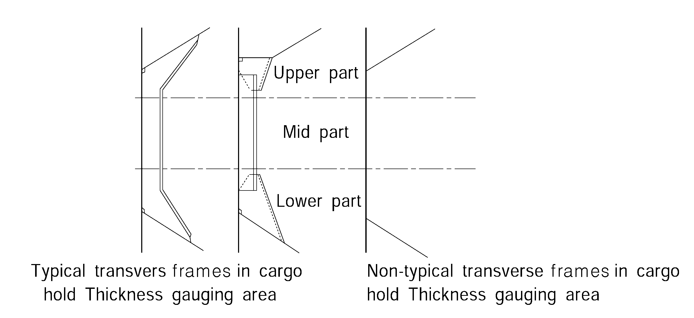 3. The single measurements recorded are to represent the average of multiple measurements. 4. The maximum allowable diminution could be stated in an attached document. * : delete as appropriate |   |   |   |   |   |   |   |   |   |   |   |   |   |   |   |   |   |   |   |   |   |   |   |   |

  **Table 20-2 Thickness measurements reports - CSR Ships** **Table 20-2** is to be used to vessels built under IACS Common Structural Rules(**Pt 11**, **Pt 12** or **Pt 13**)(i.e. CSR Ships) **TM1-DHT/BC/DSBC*(CSR)** Report on THICKNESS MEASUREMENT of ALL DECK PLATING / ALL BOTTOM PLATING / ALL SIDE SHELL PLATING^* Ship's Name : Class Identity No. : Report No. :

  | STRAKE POSITION |   |   |   |   |   |   |   |   |   |   |   |   |   |   |   |   |   |   |
  | --- | --- | --- | --- | --- | --- | --- | --- | --- | --- | --- | --- | --- | --- | --- | --- | --- | --- | --- |
  | PLATE POSITION | No. or Letter | As Built Thk. mm | Voluntary Thickness Addition mm | Renewal Thickness mm (a) | Forward Reading |   |   |   |   |   | Aft Reading |   |   |   |   |   | Mean Remaining Corr. Addition, mm [(c1)+(c2)]/2 |   |
  | PLATE POSITION | No. or Letter | As Built Thk. mm | Voluntary Thickness Addition mm | Renewal Thickness mm (a) | Gauged Thk. mm (b1) |   | Remaining Corr. Addition, mm (c1)=(b1)-(a) |   |   |   | Gauged Thk. mm (b2) |   | Remaining Corr. Addition, mm (c2)=(b2)-(a) |   |   |   | Mean Remaining Corr. Addition, mm [(c1)+(c2)]/2 |   |
  | PLATE POSITION | No. or Letter | As Built Thk. mm | Voluntary Thickness Addition mm | Renewal Thickness mm (a) | P | S | P |   | S |   | P | S | P |   | S |   | P | S |
  | 15th forward |   |   |   |   |   |   |   |   |   |   |   |   |   |   |   |   |   |   |
  | 14th |   |   |   |   |   |   |   |   |   |   |   |   |   |   |   |   |   |   |
  | 13th |   |   |   |   |   |   |   |   |   |   |   |   |   |   |   |   |   |   |
  | 12th |   |   |   |   |   |   |   |   |   |   |   |   |   |   |   |   |   |   |
  | 11th |   |   |   |   |   |   |   |   |   |   |   |   |   |   |   |   |   |   |
  | 10th |   |   |   |   |   |   |   |   |   |   |   |   |   |   |   |   |   |   |
  | 9th |   |   |   |   |   |   |   |   |   |   |   |   |   |   |   |   |   |   |
  | 8th |   |   |   |   |   |   |   |   |   |   |   |   |   |   |   |   |   |   |
  | 7th |   |   |   |   |   |   |   |   |   |   |   |   |   |   |   |   |   |   |
  | 6th |   |   |   |   |   |   |   |   |   |   |   |   |   |   |   |   |   |   |
  | 5th |   |   |   |   |   |   |   |   |   |   |   |   |   |   |   |   |   |   |
  | 4th |   |   |   |   |   |   |   |   |   |   |   |   |   |   |   |   |   |   |
  | 3rd |   |   |   |   |   |   |   |   |   |   |   |   |   |   |   |   |   |   |
  | 2nd |   |   |   |   |   |   |   |   |   |   |   |   |   |   |   |   |   |   |
  | 1st |   |   |   |   |   |   |   |   |   |   |   |   |   |   |   |   |   |   |
  | Amidships |   |   |   |   |   |   |   |   |   |   |   |   |   |   |   |   |   |   |
  | 1st aft |   |   |   |   |   |   |   |   |   |   |   |   |   |   |   |   |   |   |
  | 2nd |   |   |   |   |   |   |   |   |   |   |   |   |   |   |   |   |   |   |
  | 3rd |   |   |   |   |   |   |   |   |   |   |   |   |   |   |   |   |   |   |
  | 4th |   |   |   |   |   |   |   |   |   |   |   |   |   |   |   |   |   |   |
  | 5th |   |   |   |   |   |   |   |   |   |   |   |   |   |   |   |   |   |   |
  | 6th |   |   |   |   |   |   |   |   |   |   |   |   |   |   |   |   |   |   |
  | 7th |   |   |   |   |   |   |   |   |   |   |   |   |   |   |   |   |   |   |
  | 8th |   |   |   |   |   |   |   |   |   |   |   |   |   |   |   |   |   |   |
  | 9th |   |   |   |   |   |   |   |   |   |   |   |   |   |   |   |   |   |   |
  | 10th |   |   |   |   |   |   |   |   |   |   |   |   |   |   |   |   |   |   |
  | 11th |   |   |   |   |   |   |   |   |   |   |   |   |   |   |   |   |   |   |
  | 12th |   |   |   |   |   |   |   |   |   |   |   |   |   |   |   |   |   |   |
  | 13th |   |   |   |   |   |   |   |   |   |   |   |   |   |   |   |   |   |   |
  | 14th |   |   |   |   |   |   |   |   |   |   |   |   |   |   |   |   |   |   |
  | 15th |   |   |   |   |   |   |   |   |   |   |   |   |   |   |   |   |   |   |
  | Operators Signature : (NOTES) 1. This report form is to be used for recording the thickness measurement of : All strength deck plating within the cargo (length) area All keel, bottom shell plating and bilge plating within the cargo (length) area Side shell plating including selected wind and water strakes outside cargo (length) area All wind and water strakes within cargo (length) area 2. The strake position is to be clearly indicated as follow : 2.1 For strength deck indicate the number of the strake of plating inboard from the stringer plate. 2.2 For bottom plating indicate the number of the strake of plating outboard from the keel plate. 2.3 For side shell plating give number of the strake of plating below sheerstrake and letter as shown on shell expansion. 3. For BC/DSBC(CSR), only the deck plating strakes outside line of openings are to be recorded. 4. Measurements are to be taken at the forward and aft areas of all plates and where plates cross ballast and cargo tank/hold boundaries separate measurements for the area of plating in way of each type of tank/hold are to be recorded. 5. The single measurements recorded are to represent the average of multiple measurements. 6. The remaining corrosion addition is to be recorded with result of gauged thickness minus renewal thickness. If the result is negative, the structure in way shall be renewed, and the mark "R" is to be indicated in the right-hand column. If the result is between 0 and 0.5 mm (0 included), the structure in way shall be additional gauged, and the mark "S" is to be indicated in the right-hand column. * : delete as appropriate DHT : Double Hull Oil Tankers with ESP notation BC : Bulk Carriers with ESP notation DSBC : Double Skin Bulk Carriers with ESP notation |   |   |   |   |   |   |   |   |   |   |   |   |   |   |   |   |   |   |

  **Table 20-2 Thickness measurements reports - CSR Ships** (continued) **TM2-DHT/BC/DSBC*(CSR)(i)** Report on THICKNESS MEASUREMENT OF SHEERSTRAKE AND DECK PLATING AT TRANSVERSE SECTIONS (one, two or three transverse sections) Ship's Name : Class Identity No. : Report No. :

  | STRENGTH DECK AND SHEERSTRAKE PLATING |   |   |   |   |   |   |   |   |   |   |   |   |   |   |   |   |   |   |   |   |   |   |   |   |   |   |   |   |   |   |
  | --- | --- | --- | --- | --- | --- | --- | --- | --- | --- | --- | --- | --- | --- | --- | --- | --- | --- | --- | --- | --- | --- | --- | --- | --- | --- | --- | --- | --- | --- | --- |
  |   | FIRST TRANSVERSE SECTION AT FRAME NUMBER : |   |   |   |   |   |   |   |   |   | SECOND TRANSVERSE SECTION AT FRAME NUMBER : |   |   |   |   |   |   |   |   |   | THIRD TRANSVERSE SECTION AT FRAME NUMBER : |   |   |   |   |   |   |   |   |   |
  | STRAKE POSITION | No. or Letter | As Built Thk. mm | Vol. Thk. Add. mm | Ren. Thk. mm (a) | Gauged Thk. mm (b) |   | Remaining Corr. Addition, mm (b)-(a) |   |   |   | No. or Letter | As Built Thk. mm | Vol. Thk. Add. mm | Ren. Thk. mm (a) | Gauged Thk. mm (b) |   | Remaining Corr. Addition, mm (b)-(a) |   |   |   | No. or Letter | As Built Thk. mm | Vol. Thk. Add. mm | Ren. Thk. mm (a) | Gauged Thk. mm (b) |   | Remaining Corr. Addition, mm (b)-(a) |   |   |   |
  | STRAKE POSITION | No. or Letter | As Built Thk. mm | Vol. Thk. Add. mm | Ren. Thk. mm (a) | P | S | P |   | S |   | No. or Letter | As Built Thk. mm | Vol. Thk. Add. mm | Ren. Thk. mm (a) | P | S | P |   | S |   | No. or Letter | As Built Thk. mm | Vol. Thk. Add. mm | Ren. Thk. mm (a) | P | S | P |   | S |   |
  | Stringer Plate |   |   |   |   |   |   |   |   |   |   |   |   |   |   |   |   |   |   |   |   |   |   |   |   |   |   |   |   |   |   |
  | 1st strake inboard |   |   |   |   |   |   |   |   |   |   |   |   |   |   |   |   |   |   |   |   |   |   |   |   |   |   |   |   |   |   |
  | 2nd |   |   |   |   |   |   |   |   |   |   |   |   |   |   |   |   |   |   |   |   |   |   |   |   |   |   |   |   |   |   |
  | 3rd |   |   |   |   |   |   |   |   |   |   |   |   |   |   |   |   |   |   |   |   |   |   |   |   |   |   |   |   |   |   |
  | 4th |   |   |   |   |   |   |   |   |   |   |   |   |   |   |   |   |   |   |   |   |   |   |   |   |   |   |   |   |   |   |
  | 5th |   |   |   |   |   |   |   |   |   |   |   |   |   |   |   |   |   |   |   |   |   |   |   |   |   |   |   |   |   |   |
  | 6th |   |   |   |   |   |   |   |   |   |   |   |   |   |   |   |   |   |   |   |   |   |   |   |   |   |   |   |   |   |   |
  | 7th |   |   |   |   |   |   |   |   |   |   |   |   |   |   |   |   |   |   |   |   |   |   |   |   |   |   |   |   |   |   |
  | 8th |   |   |   |   |   |   |   |   |   |   |   |   |   |   |   |   |   |   |   |   |   |   |   |   |   |   |   |   |   |   |
  | 9th |   |   |   |   |   |   |   |   |   |   |   |   |   |   |   |   |   |   |   |   |   |   |   |   |   |   |   |   |   |   |
  | 10th |   |   |   |   |   |   |   |   |   |   |   |   |   |   |   |   |   |   |   |   |   |   |   |   |   |   |   |   |   |   |
  | 11th |   |   |   |   |   |   |   |   |   |   |   |   |   |   |   |   |   |   |   |   |   |   |   |   |   |   |   |   |   |   |
  | 12th |   |   |   |   |   |   |   |   |   |   |   |   |   |   |   |   |   |   |   |   |   |   |   |   |   |   |   |   |   |   |
  | 13th |   |   |   |   |   |   |   |   |   |   |   |   |   |   |   |   |   |   |   |   |   |   |   |   |   |   |   |   |   |   |
  | 14th |   |   |   |   |   |   |   |   |   |   |   |   |   |   |   |   |   |   |   |   |   |   |   |   |   |   |   |   |   |   |
  | centre strake |   |   |   |   |   |   |   |   |   |   |   |   |   |   |   |   |   |   |   |   |   |   |   |   |   |   |   |   |   |   |
  | sheer strake |   |   |   |   |   |   |   |   |   |   |   |   |   |   |   |   |   |   |   |   |   |   |   |   |   |   |   |   |   |   |
  | TOPSIDE TOTAL |   |   |   |   |   |   |   |   |   |   |   |   |   |   |   |   |   |   |   |   |   |   |   |   |   |   |   |   |   |   |
  | Operators Signature : (NOTES) 1. This report form is to be used for recording the thickness measurements of : - Strength deck plating and sheerstrake plating transverse sections : One, two or three sections within the cargo (length) area comprising of the following structural items : (1) Strength deck plating (2) Stringer plate (3) Sheerstrake 2. For BC/DSBC(CSR), only the deck plating strakes outside line of openings are to be recorded. 3. The topside area comprises deck plating, stringer plate and sheerstrake (including rounded gunwales) 4. The exact frame station of measurement is to be stated. 5. The single measurements recorded are to represent the average of multiple measurements. 6. The remaining corrosion addition is to be recorded with result of gauged thickness minus renewal thickness. If the result is negative, the structure in way shall be renewed, and the mark "R" is to be indicated in the right-hand column. If the result is between 0 and 0.5 mm (0 included), the structure in way shall be additional gauged, and the mark "S" is to be indicated in the right-hand column. * : delete as appropriate |   |   |   |   |   |   |   |   |   |   |   |   |   |   |   |   |   |   |   |   |   |   |   |   |   |   |   |   |   |   |

  **Table 20-2 Thickness measurements reports - CSR Ships** (continued) **TM2-DHT/BC/DSBC*(CSR)(ii)** Report on THICKNESS MEASUREMENT OF SHELL AND BOTTOM PLATING AT TRANSVERSE SECTIONS (one, two or three transverse sections) Ship's Name : Class Identity No. : Report No. :

  | SHELL AND BOTTOM PLATING |   |   |   |   |   |   |   |   |   |   |   |   |   |   |   |   |   |   |   |   |   |   |   |   |   |   |   |   |   |   |
  | --- | --- | --- | --- | --- | --- | --- | --- | --- | --- | --- | --- | --- | --- | --- | --- | --- | --- | --- | --- | --- | --- | --- | --- | --- | --- | --- | --- | --- | --- | --- |
  |   | FIRST TRANSVERSE SECTION AT FRAME NUMBER : |   |   |   |   |   |   |   |   |   | SECOND TRANSVERSE SECTION AT FRAME NUMBER : |   |   |   |   |   |   |   |   |   | THIRD TRANSVERSE SECTION AT FRAME NUMBER : |   |   |   |   |   |   |   |   |   |
  | STRAKE POSITION | No. or Letter | As Built Thk. mm | Vol. Thk. Add. mm | Ren. Thk. mm (a) | Gauged Thk. mm (b) |   | Remaining Corr. Addition, mm (b)-(a) |   |   |   | No. or Letter | As Built Thk. mm | Vol. Thk. Add. mm | Ren. Thk. mm (a) | Gauged Thk. mm (b) |   | Remaining Corr. Addition, mm (b)-(a) |   |   |   | No. or Letter | As Built Thk. mm | Vol. Thk. Add. mm | Ren. Thk. mm (a) | Gauged Thk. mm (b) |   | Remaining Corr. Addition, mm (b)-(a) |   |   |   |
  | STRAKE POSITION | No. or Letter | As Built Thk. mm | Vol. Thk. Add. mm | Ren. Thk. mm (a) | P | S | P |   | S |   | No. or Letter | As Built Thk. mm | Vol. Thk. Add. mm | Ren. Thk. mm (a) | P | S | P |   | S |   | No. or Letter | As Built Thk. mm | Vol. Thk. Add. mm | Ren. Thk. mm (a) | P | S | P |   | S |   |
  | 1st below sheer strake |   |   |   |   |   |   |   |   |   |   |   |   |   |   |   |   |   |   |   |   |   |   |   |   |   |   |   |   |   |   |
  | 2nd |   |   |   |   |   |   |   |   |   |   |   |   |   |   |   |   |   |   |   |   |   |   |   |   |   |   |   |   |   |   |
  | 3rd |   |   |   |   |   |   |   |   |   |   |   |   |   |   |   |   |   |   |   |   |   |   |   |   |   |   |   |   |   |   |
  | 4th |   |   |   |   |   |   |   |   |   |   |   |   |   |   |   |   |   |   |   |   |   |   |   |   |   |   |   |   |   |   |
  | 5th |   |   |   |   |   |   |   |   |   |   |   |   |   |   |   |   |   |   |   |   |   |   |   |   |   |   |   |   |   |   |
  | 6th |   |   |   |   |   |   |   |   |   |   |   |   |   |   |   |   |   |   |   |   |   |   |   |   |   |   |   |   |   |   |
  | 7th |   |   |   |   |   |   |   |   |   |   |   |   |   |   |   |   |   |   |   |   |   |   |   |   |   |   |   |   |   |   |
  | 8th |   |   |   |   |   |   |   |   |   |   |   |   |   |   |   |   |   |   |   |   |   |   |   |   |   |   |   |   |   |   |
  | 9th |   |   |   |   |   |   |   |   |   |   |   |   |   |   |   |   |   |   |   |   |   |   |   |   |   |   |   |   |   |   |
  | 10th |   |   |   |   |   |   |   |   |   |   |   |   |   |   |   |   |   |   |   |   |   |   |   |   |   |   |   |   |   |   |
  | 11th |   |   |   |   |   |   |   |   |   |   |   |   |   |   |   |   |   |   |   |   |   |   |   |   |   |   |   |   |   |   |
  | 12th |   |   |   |   |   |   |   |   |   |   |   |   |   |   |   |   |   |   |   |   |   |   |   |   |   |   |   |   |   |   |
  | 13th |   |   |   |   |   |   |   |   |   |   |   |   |   |   |   |   |   |   |   |   |   |   |   |   |   |   |   |   |   |   |
  | 14th |   |   |   |   |   |   |   |   |   |   |   |   |   |   |   |   |   |   |   |   |   |   |   |   |   |   |   |   |   |   |
  | 15th |   |   |   |   |   |   |   |   |   |   |   |   |   |   |   |   |   |   |   |   |   |   |   |   |   |   |   |   |   |   |
  | 16th |   |   |   |   |   |   |   |   |   |   |   |   |   |   |   |   |   |   |   |   |   |   |   |   |   |   |   |   |   |   |
  | 17th |   |   |   |   |   |   |   |   |   |   |   |   |   |   |   |   |   |   |   |   |   |   |   |   |   |   |   |   |   |   |
  | 18th |   |   |   |   |   |   |   |   |   |   |   |   |   |   |   |   |   |   |   |   |   |   |   |   |   |   |   |   |   |   |
  | 19th |   |   |   |   |   |   |   |   |   |   |   |   |   |   |   |   |   |   |   |   |   |   |   |   |   |   |   |   |   |   |
  | 20th |   |   |   |   |   |   |   |   |   |   |   |   |   |   |   |   |   |   |   |   |   |   |   |   |   |   |   |   |   |   |
  | keel strake |   |   |   |   |   |   |   |   |   |   |   |   |   |   |   |   |   |   |   |   |   |   |   |   |   |   |   |   |   |   |
  | BOTTOM TOTAL |   |   |   |   |   |   |   |   |   |   |   |   |   |   |   |   |   |   |   |   |   |   |   |   |   |   |   |   |   |   |
  | Operators Signature : (NOTES) 1. This report form is to be used for recording the thickness measurements of : - Shell and bottom plating transverse sections : One, two or three sections within the cargo (length) area comprising of the following structural items : (1) Side shell plating (2) Bilge plating (3) Bottom shell plating (4) Keel plate 2. The bottom area comprises keel, bottom and bilge plating. 3. The exact frame station of measurement is to be stated. 4. The single measurements recorded are to represent the average of multiple measurements. 5. The remaining corrosion addition is to be recorded with result of gauged thickness minus renewal thickness. If the result is negative, the structure in way shall be renewed, and the mark "R" is to be indicated in the right-hand column. If the result is between 0 and 0.5 mm (0 included), the structure in way shall be additional gauged, and the mark "S" is to be indicated in the right-hand column. * : delete as appropriate |   |   |   |   |   |   |   |   |   |   |   |   |   |   |   |   |   |   |   |   |   |   |   |   |   |   |   |   |   |   |

  **Table 20-2 Thickness measurements reports - CSR Ships** (continued) **TM3-DHT/BC/DSBC*(CSR)** Report on THICKNESS MEASUREMENT OF LONGITUDINAL MEMBERS AT TRANSVERSE SECTIONS (one, two or three transverse sections) Ship's Name : Class Identity No. : Report No. :

  |   | FIRST TRANSVERSE SECTION AT FRAME NUMBER : |   |   |   |   |   |   |   |   |   | SECOND TRANSVERSE SECTION AT FRAME NUMBER : |   |   |   |   |   |   |   |   |   | THIRD TRANSVERSE SECTION AT FRAME NUMBER : |   |   |   |   |   |   |   |   |   |
  | --- | --- | --- | --- | --- | --- | --- | --- | --- | --- | --- | --- | --- | --- | --- | --- | --- | --- | --- | --- | --- | --- | --- | --- | --- | --- | --- | --- | --- | --- | --- |
  | STRUCTURE MEMBER | No. or Letter | As Built Thk. mm | Vol. Thk. Add. mm | Ren. Thk. mm (a) | Gauged Thk. mm (b) |   | Remaining Corr. Addition, mm (b)-(a) |   |   |   | No. or Letter | As Built Thk. mm | Vol. Thk. Add. mm | Ren. Thk. mm (a) | Gauged Thk. mm (b) |   | Remaining Corr. Addition, mm (b)-(a) |   |   |   | No. or Letter | As Built Thk. mm | Vol. Thk. Add. mm | Ren. Thk. mm (a) | Gauged Thk. mm (b) |   | Remaining Corr. Addition, mm (b)-(a) |   |   |   |
  | STRUCTURE MEMBER | No. or Letter | As Built Thk. mm | Vol. Thk. Add. mm | Ren. Thk. mm (a) | P | S | P |   | S |   | No. or Letter | As Built Thk. mm | Vol. Thk. Add. mm | Ren. Thk. mm (a) | P | S | P |   | S |   | No. or Letter | As Built Thk. mm | Vol. Thk. Add. mm | Ren. Thk. mm (a) | P | S | P |   | S |   |
  |   |   |   |   |   |   |   |   |   |   |   |   |   |   |   |   |   |   |   |   |   |   |   |   |   |   |   |   |   |   |   |
  |   |   |   |   |   |   |   |   |   |   |   |   |   |   |   |   |   |   |   |   |   |   |   |   |   |   |   |   |   |   |   |
  |   |   |   |   |   |   |   |   |   |   |   |   |   |   |   |   |   |   |   |   |   |   |   |   |   |   |   |   |   |   |   |
  |   |   |   |   |   |   |   |   |   |   |   |   |   |   |   |   |   |   |   |   |   |   |   |   |   |   |   |   |   |   |   |
  |   |   |   |   |   |   |   |   |   |   |   |   |   |   |   |   |   |   |   |   |   |   |   |   |   |   |   |   |   |   |   |
  |   |   |   |   |   |   |   |   |   |   |   |   |   |   |   |   |   |   |   |   |   |   |   |   |   |   |   |   |   |   |   |
  |   |   |   |   |   |   |   |   |   |   |   |   |   |   |   |   |   |   |   |   |   |   |   |   |   |   |   |   |   |   |   |
  |   |   |   |   |   |   |   |   |   |   |   |   |   |   |   |   |   |   |   |   |   |   |   |   |   |   |   |   |   |   |   |
  |   |   |   |   |   |   |   |   |   |   |   |   |   |   |   |   |   |   |   |   |   |   |   |   |   |   |   |   |   |   |   |
  |   |   |   |   |   |   |   |   |   |   |   |   |   |   |   |   |   |   |   |   |   |   |   |   |   |   |   |   |   |   |   |
  |   |   |   |   |   |   |   |   |   |   |   |   |   |   |   |   |   |   |   |   |   |   |   |   |   |   |   |   |   |   |   |
  |   |   |   |   |   |   |   |   |   |   |   |   |   |   |   |   |   |   |   |   |   |   |   |   |   |   |   |   |   |   |   |
  |   |   |   |   |   |   |   |   |   |   |   |   |   |   |   |   |   |   |   |   |   |   |   |   |   |   |   |   |   |   |   |
  |   |   |   |   |   |   |   |   |   |   |   |   |   |   |   |   |   |   |   |   |   |   |   |   |   |   |   |   |   |   |   |
  |   |   |   |   |   |   |   |   |   |   |   |   |   |   |   |   |   |   |   |   |   |   |   |   |   |   |   |   |   |   |   |
  |   |   |   |   |   |   |   |   |   |   |   |   |   |   |   |   |   |   |   |   |   |   |   |   |   |   |   |   |   |   |   |
  |   |   |   |   |   |   |   |   |   |   |   |   |   |   |   |   |   |   |   |   |   |   |   |   |   |   |   |   |   |   |   |
  |   |   |   |   |   |   |   |   |   |   |   |   |   |   |   |   |   |   |   |   |   |   |   |   |   |   |   |   |   |   |   |
  |   |   |   |   |   |   |   |   |   |   |   |   |   |   |   |   |   |   |   |   |   |   |   |   |   |   |   |   |   |   |   |
  |   |   |   |   |   |   |   |   |   |   |   |   |   |   |   |   |   |   |   |   |   |   |   |   |   |   |   |   |   |   |   |
  |   |   |   |   |   |   |   |   |   |   |   |   |   |   |   |   |   |   |   |   |   |   |   |   |   |   |   |   |   |   |   |
  | Operators Signature : (NOTES) 1. This report form is to be used for recording the thickness measurements of : - Longitudinal members at transverse sections : One, two or three sections within the cargo (length) area comprising of the following structural items : For DHT(CSR) For BC/DSBC(CSR) (1) Deck longitudinals (1) Deck longitudinals (2) Sheerstrake longitudinals (2) Deck girders (3) Side shell longitudinals (3) Sheerstrake longitudinals (4) Bilge longitudinals (4) Topside tank sloping plate (5) Bottom longitudinals (5) Topside tank sloping plate longitudinals (6) Deck girders (6) Bottom longitudinals (7) Horizontal girders in wing ballast tanks (7) Bottom girders (8) Bottom girders (8) Bilge longitudinals (9) Longitudinal bulkhead top strake (9) Side shell longitudinals, if any (10) Longitudinal bulkhead bottom strake (10) Inner bottom plating (11) Longitudinal bulkhead plating (remainder) (11) Inner bottom longitudinals (12) Longitudinal bulkhead longitudinals (12) Hopper plating (13) Inner side plating (13) Hopper longitudinals (14) Inner side longitudinals (14) Inner side plating (15) Hopper plating Inner side longitudinals, if any (16) Hopper longitudinals Horizontal girders in wing ballast tanks (17) Inner bottom plating (18) Inner bottom longitudinals (19) Topside tank plating (20) Topside tank longitudinals 2. The exact frame station of measurement is to be stated. 3. The single measurements recorded are to represent the average of multiple measurements. 4. The remaining corrosion addition is to be recorded with result of gauged thickness minus renewal thickness. If the result is negative, the structure in way shall be renewed, and the mark "R" is to be indicated in the right-hand column. If the result is between 0 and 0.5 mm (0 included), the structure in way shall be additional gauged, and the mark "S" is to be indicated in the right-hand column. * : delete as appropriate |   |   |   |   |   |   |   |   |   |   |   |   |   |   |   |   |   |   |   |   |   |   |   |   |   |   |   |   |   |   |

  **Table 20-2 Thickness measurements reports - CSR Ships** (continued) **TM4-DHT/BC/DSBC*(CSR)** Report on THICKNESS MEASUREMENT OF TRANSVERSE STRUCTURAL MEMBERS in the cargo oil and ballast tanks within the cargo tank length / in the double bottom, hopper side and topside ballast tanks^* Ship's Name : Class Identity No. : Report No. :

  | TANK DESCRIPTION : |   |   |   |   |   |   |   |   |   |   |
  | --- | --- | --- | --- | --- | --- | --- | --- | --- | --- | --- |
  | LOCATION OF STRUCTURE : |   |   |   |   |   |   |   |   |   |   |
  | STRUCTURAL MEMBER | ITEM | As Built Thickness mm | Voluntary Thickness Addition mm | Renewal Thickness mm (a) | Gauged Thickness mm (b) |   | Remaining Corr. Addition mm (b)-(a) |   |   |   |
  | STRUCTURAL MEMBER | ITEM | As Built Thickness mm | Voluntary Thickness Addition mm | Renewal Thickness mm (a) | P | S | P |   | S |   |
  |   |   |   |   |   |   |   |   |   |   |   |
  |   |   |   |   |   |   |   |   |   |   |   |
  |   |   |   |   |   |   |   |   |   |   |   |
  |   |   |   |   |   |   |   |   |   |   |   |
  |   |   |   |   |   |   |   |   |   |   |   |
  |   |   |   |   |   |   |   |   |   |   |   |
  |   |   |   |   |   |   |   |   |   |   |   |
  |   |   |   |   |   |   |   |   |   |   |   |
  |   |   |   |   |   |   |   |   |   |   |   |
  |   |   |   |   |   |   |   |   |   |   |   |
  |   |   |   |   |   |   |   |   |   |   |   |
  |   |   |   |   |   |   |   |   |   |   |   |
  |   |   |   |   |   |   |   |   |   |   |   |
  |   |   |   |   |   |   |   |   |   |   |   |
  |   |   |   |   |   |   |   |   |   |   |   |
  |   |   |   |   |   |   |   |   |   |   |   |
  |   |   |   |   |   |   |   |   |   |   |   |
  | Operators Signature : (NOTES) 1. This report form is to be used for recording the thickness measurements of transverse structural members comprising of the following structural items : For DHT(CSR) For BC/DSBC(CSR) (1) Deck transverses - centre tank (1) Doble bottom tank floors (2) Deck transverses - wing tank (2) Topside tank transverses (3) Vertical web in wing ballast tank (3) Hopper side tank transverses (4) Doble bottom floors - wing tank (4) Transverse web frame (5) Doble bottom floors - centre tank Ordinary transverse frame in double skin tank (6) Longitudinal bulkhead vertical webs (7) Cross ties 2. The single measurements recorded are to represent the average of multiple measurements. 3. The remaining corrosion addition is to be recorded with result of gauged thickness minus renewal thickness. If the result is negative, the structure in way shall be renewed, and the mark "R" is to be indicated in the right-hand column. If the result is between 0 and 0.5 mm (0 included), the structure in way shall be additional gauged, and the mark "S" is to be indicated in the right-hand column. * : delete as appropriate |   |   |   |   |   |   |   |   |   |   |

  **Table 20-2 Thickness measurements reports - CSR Ships** (continued) **TM5-DHT/BC/DSBC*(CSR)** Report on THICKNESS MEASUREMENT OF W.T/O.T TRANSVERSE BULKHEADS within the cargo tanks/holds and ballast tanks Ship's Name : Class Identity No. : Report No. :

  | TANK/HOLD DESCRIPTION : |   |   |   |   |   |   |   |   |   |
  | --- | --- | --- | --- | --- | --- | --- | --- | --- | --- |
  | LOCATION OF STRUCTURE : FRAME NO: |   |   |   |   |   |   |   |   |   |
  | STRUCTURAL COMPONENT (PLATING/STIFFENER) | As Built Thickness mm | Voluntary Thickness Addition mm | Renewal Thickness mm (a) | Gauged Thickness mm (b) |   | Remaining Corr. Addition mm (b)-(a) |   |   |   |
  | STRUCTURAL COMPONENT (PLATING/STIFFENER) | As Built Thickness mm | Voluntary Thickness Addition mm | Renewal Thickness mm (a) | P | S | P |   | S |   |
  |   |   |   |   |   |   |   |   |   |   |
  |   |   |   |   |   |   |   |   |   |   |
  |   |   |   |   |   |   |   |   |   |   |
  |   |   |   |   |   |   |   |   |   |   |
  |   |   |   |   |   |   |   |   |   |   |
  |   |   |   |   |   |   |   |   |   |   |
  |   |   |   |   |   |   |   |   |   |   |
  |   |   |   |   |   |   |   |   |   |   |
  |   |   |   |   |   |   |   |   |   |   |
  |   |   |   |   |   |   |   |   |   |   |
  |   |   |   |   |   |   |   |   |   |   |
  |   |   |   |   |   |   |   |   |   |   |
  |   |   |   |   |   |   |   |   |   |   |
  |   |   |   |   |   |   |   |   |   |   |
  |   |   |   |   |   |   |   |   |   |   |
  |   |   |   |   |   |   |   |   |   |   |
  |   |   |   |   |   |   |   |   |   |   |
  | Operators Signature : (NOTES) 1. This report form is to be used for recording the thickness measurement of W.T / O.T transverse bulkheads within the cargo tanks/holds and ballast tanks including bulkhead stiffeners and internal stiffeners of upper and lower stools . 2. The single measurements recorded are represent the average of multiple measurements. 3. The remaining corrosion addition is to be recorded with result of gauged thickness minus renewal thickness. If the result is negative, the structure in way shall be renewed, and the mark "R" is to be indicated in the right-hand column. If the result is between 0 and 0.5 mm (0 included), the structure in way shall be additional gauged, and the mark "S" is to be indicated in the right-hand column. * : delete as appropriate |   |   |   |   |   |   |   |   |   |

  **Table 20-2 Thickness measurements reports - CSR Ships** (continued) **TM6-DHT/BC/DSBC*(CSR)** Report on THICKNESS MEASUREMENT OF MISCELLANEOUS STRUCTURAL MEMBERS Ship's Name : Class Identity No. : Report No. :

  | STRUCTURAL MEMBER : |   |   |   |   |   |   |   |   |   | SKETCH |
  | --- | --- | --- | --- | --- | --- | --- | --- | --- | --- | --- |
  | LOCATION OF STRUCTURE : |   |   |   |   |   |   |   |   |   |   |
  | Description | As Built Thk. mm | Voluntary Thickness Addition mm | Renewal Thickness mm (a) | Gauged Thickness mm (b) |   | Remaining Corr. Addition mm (b)-(a) |   |   |   |   |
  | Description | As Built Thk. mm | Voluntary Thickness Addition mm | Renewal Thickness mm (a) | P | S | P |   | S |   |   |
  |   |   |   |   |   |   |   |   |   |   |   |
  |   |   |   |   |   |   |   |   |   |   |   |
  |   |   |   |   |   |   |   |   |   |   |   |
  |   |   |   |   |   |   |   |   |   |   |   |
  |   |   |   |   |   |   |   |   |   |   |   |
  |   |   |   |   |   |   |   |   |   |   |   |
  |   |   |   |   |   |   |   |   |   |   |   |
  |   |   |   |   |   |   |   |   |   |   |   |
  |   |   |   |   |   |   |   |   |   |   |   |
  |   |   |   |   |   |   |   |   |   |   |   |
  |   |   |   |   |   |   |   |   |   |   |   |
  |   |   |   |   |   |   |   |   |   |   |   |
  |   |   |   |   |   |   |   |   |   |   |   |
  |   |   |   |   |   |   |   |   |   |   |   |
  |   |   |   |   |   |   |   |   |   |   |   |
  |   |   |   |   |   |   |   |   |   |   |   |
  |   |   |   |   |   |   |   |   |   |   |   |
  |   |   |   |   |   |   |   |   |   |   |   |
  |   |   |   |   |   |   |   |   |   |   |   |
  |   |   |   |   |   |   |   |   |   |   |   |
  | Operators Signature : (NOTES) 1. This report form is to be used for recording the thickness measurement of miscellaneous structural members including the following structural items : (1) Hatch coamings (including stiffeners) (2) Deck plating between hatches (3) Hatch covers (including stiffeners) (4) Inner bulkhead plating (5) Superstructure deck plating (6) Forepeak tank internal members (7) Aftpeak tank internal members 2. The single measurements recorded are to represent the average of multiple measurements. 3. The remaining corrosion addition is to be recorded with result of gauged thickness minus renewal thickness. If the result is negative, the structure in way shall be renewed, and the mark "R" is to be indicated in the right-hand column. If the result is between 0 and 0.5 mm (0 included), the structure in way shall be additional gauged, and the mark "S" is to be indicated in the right-hand column. * : delete as appropriate |   |   |   |   |   |   |   |   |   |   |

  **Table 20-2 Thickness measurements reports - CSR Ships** (continued) **TM7-BC(CSR)** Report on THICKNESS MEASUREMENT OF CARGO HOLD TRANSVERSE FRAMES Ship's Name : Class Identity No. : Report No. :

  | CARGO HOLD NO. : |   |   |   |   |   |   |   |   |   |   |   |   |   |   |   |   |   |   |   |   |   |   |   |   |   |   |   |
  | --- | --- | --- | --- | --- | --- | --- | --- | --- | --- | --- | --- | --- | --- | --- | --- | --- | --- | --- | --- | --- | --- | --- | --- | --- | --- | --- | --- |
  |   | UPPER PART |   |   |   |   |   |   |   |   | MID PART |   |   |   |   |   |   |   |   | LOWER PART |   |   |   |   |   |   |   |   |
  | FRAME NUMBER | As Built Thk. mm | Vol. Thk. Add. mm | Ren. Thk. mm (a) | Gauged Thk. mm (b) |   | Remaining Corr. Addition, mm (b)-(a) |   |   |   | As Built Thk. mm | Vol. Thk. Add. mm | Ren. Thk. mm (a) | Gauged Thk. mm (b) |   | Remaining Corr. Addition, mm (b)-(a) |   |   |   | As Built Thk. mm | Vol. Thk. Add. mm | Ren. Thk. mm (a) | Gauged Thk. mm (b) |   | Remaining Corr. Addition, mm (b)-(a) |   |   |   |
  | FRAME NUMBER | As Built Thk. mm | Vol. Thk. Add. mm | Ren. Thk. mm (a) | P | S | P |   | S |   | As Built Thk. mm | Vol. Thk. Add. mm | Ren. Thk. mm (a) | P | S | P |   | S |   | As Built Thk. mm | Vol. Thk. Add. mm | Ren. Thk. mm (a) | P | S | P |   | S |   |
  |   |   |   |   |   |   |   |   |   |   |   |   |   |   |   |   |   |   |   |   |   |   |   |   |   |   |   |   |
  |   |   |   |   |   |   |   |   |   |   |   |   |   |   |   |   |   |   |   |   |   |   |   |   |   |   |   |   |
  |   |   |   |   |   |   |   |   |   |   |   |   |   |   |   |   |   |   |   |   |   |   |   |   |   |   |   |   |
  |   |   |   |   |   |   |   |   |   |   |   |   |   |   |   |   |   |   |   |   |   |   |   |   |   |   |   |   |
  |   |   |   |   |   |   |   |   |   |   |   |   |   |   |   |   |   |   |   |   |   |   |   |   |   |   |   |   |
  |   |   |   |   |   |   |   |   |   |   |   |   |   |   |   |   |   |   |   |   |   |   |   |   |   |   |   |   |
  |   |   |   |   |   |   |   |   |   |   |   |   |   |   |   |   |   |   |   |   |   |   |   |   |   |   |   |   |
  |   |   |   |   |   |   |   |   |   |   |   |   |   |   |   |   |   |   |   |   |   |   |   |   |   |   |   |   |
  |   |   |   |   |   |   |   |   |   |   |   |   |   |   |   |   |   |   |   |   |   |   |   |   |   |   |   |   |
  |   |   |   |   |   |   |   |   |   |   |   |   |   |   |   |   |   |   |   |   |   |   |   |   |   |   |   |   |
  |   |   |   |   |   |   |   |   |   |   |   |   |   |   |   |   |   |   |   |   |   |   |   |   |   |   |   |   |
  |   |   |   |   |   |   |   |   |   |   |   |   |   |   |   |   |   |   |   |   |   |   |   |   |   |   |   |   |
  |   |   |   |   |   |   |   |   |   |   |   |   |   |   |   |   |   |   |   |   |   |   |   |   |   |   |   |   |
  |   |   |   |   |   |   |   |   |   |   |   |   |   |   |   |   |   |   |   |   |   |   |   |   |   |   |   |   |
  |   |   |   |   |   |   |   |   |   |   |   |   |   |   |   |   |   |   |   |   |   |   |   |   |   |   |   |   |
  |   |   |   |   |   |   |   |   |   |   |   |   |   |   |   |   |   |   |   |   |   |   |   |   |   |   |   |   |
  | Operators Signature : (NOTES) 1. This report form is to be used for recording the thickness measurement of : Cargo hold transverse frames or diaphragms 2. The location and pattern of measurements is to be indicated on the sketches of hold frames shown below. 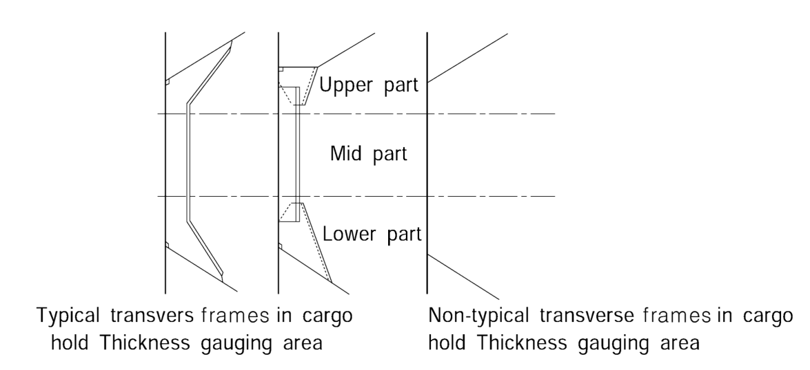 3. The single measurements recorded are to represent the average of multiple measurements. 4. The remaining corrosion addition is to be recorded with result of gauged thickness minus renewal thickness. If the result is negative, the structure in way shall be renewed, and the mark "R" is to be indicated in the right-hand column. If the result is between 0 and 0.5 mm (0 included), the structure in way shall be additional gauged, and the mark "S" is to be indicated in the right-hand column. * : delete as appropriate  |   |   |   |   |   |   |   |   |   |   |   |   |   |   |   |   |   |   |   |   |   |   |   |   |   |   |   |
