# PART 1 Classification and Surveys

> RULES FOR CLASSIFICATION OF STEEL SHIPS / RA-01-E / 2025 / EN / Guidance

## Annex 1-6 Areas of Close-up Survey, etc.

### 1. Guidance for areas of Close-up Survey for General Dry Cargo Ships, Bulk Carriers, Oil Tankers, Chemical Tankers, Double Hul Oil Tankers and Double Skin Bulk Carriers specified in Table 1.2.8, Table 1.3.1, Table 1.3.4, Table 1.3.7, Table 1.3.10 and Table 1.3.13 of the Rules are indicated on the diagrams as follows.

#### (1) Areas of Close-up Survey for General Dry Cargo Ships

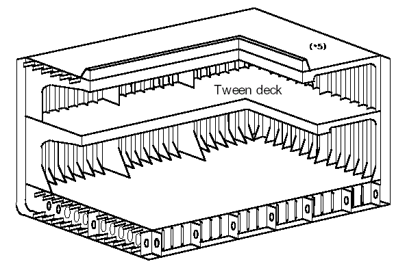
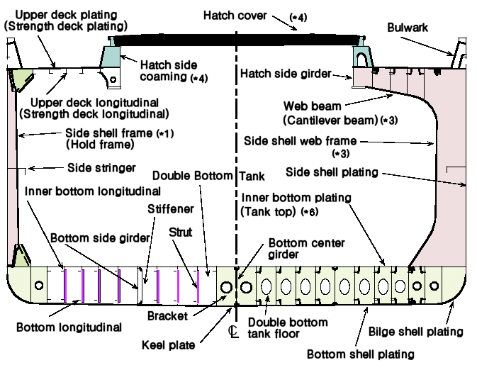
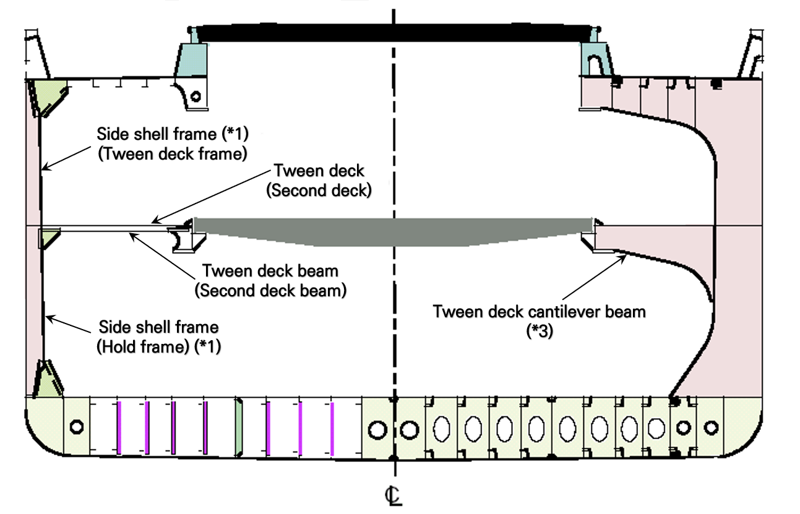
Note : (*1) through (*6) are as given in **Table 1.2.8** of the Rules

#### (2) Areas of Close-up Survey for Bulk Carriers with ESP notation (2019)

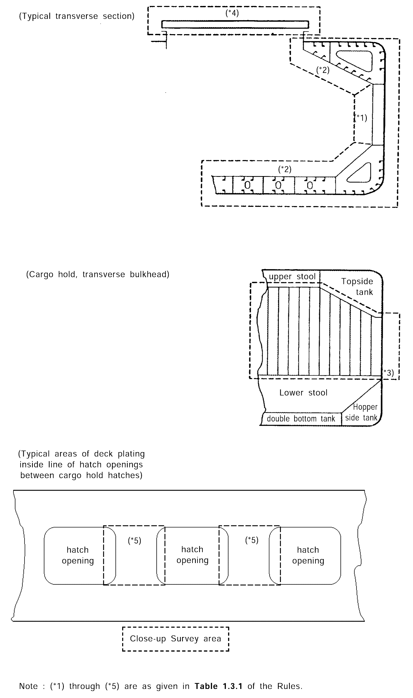

#### (3) Areas of Close-up Survey for Oil Tankers with ESP notation

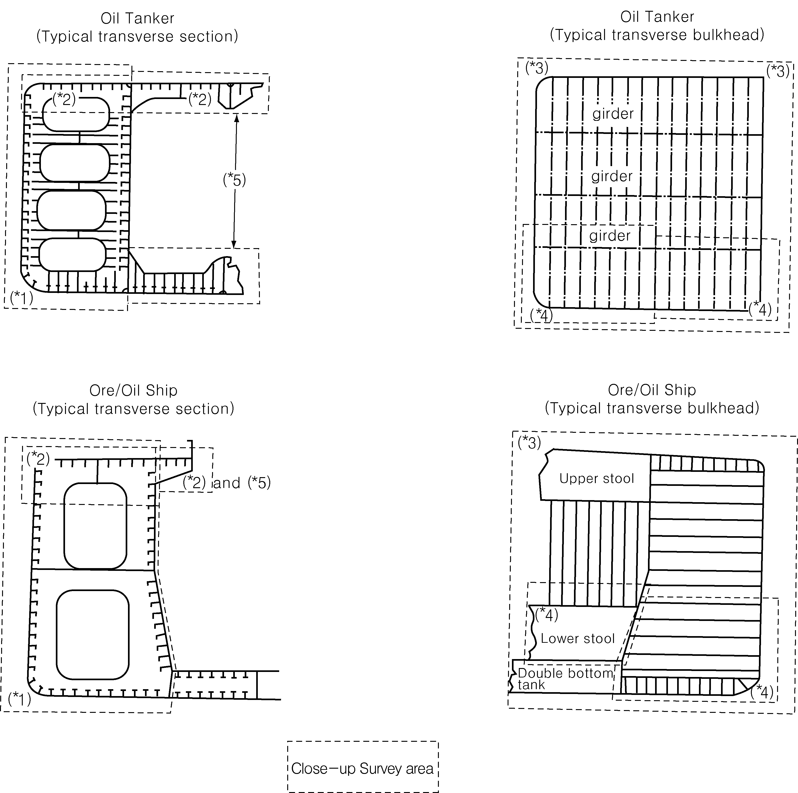
Note : (*1) through (*5) are as given in **Table 1.3.4** of the Rules.

#### (4) Areas of Close-up Survey for Chemical Tankers with ESP notation

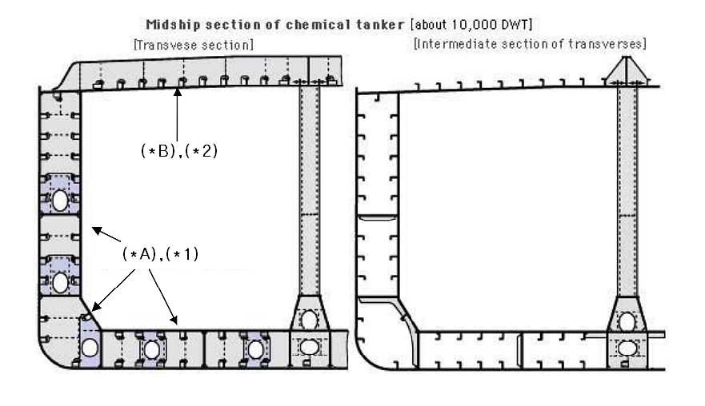
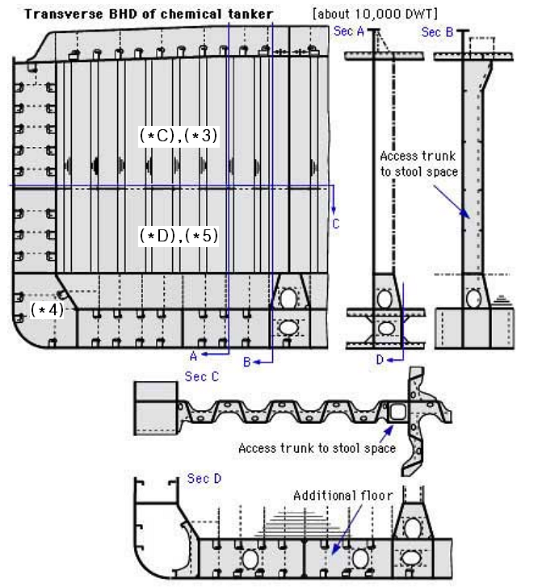
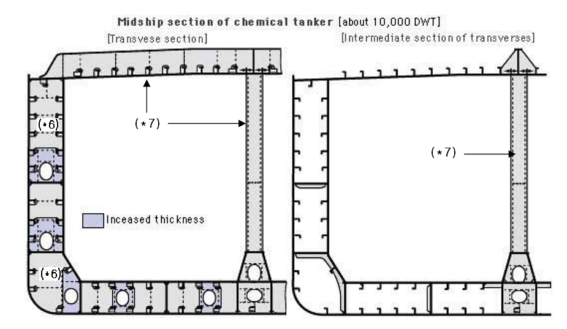
Note : (*1) through (*7) and (*A) through (*D) are as given in **Table 1.3.7** of the Rules.

#### (5) Areas of Close-up Survey for Double Hull Oil Tankers with ESP notation

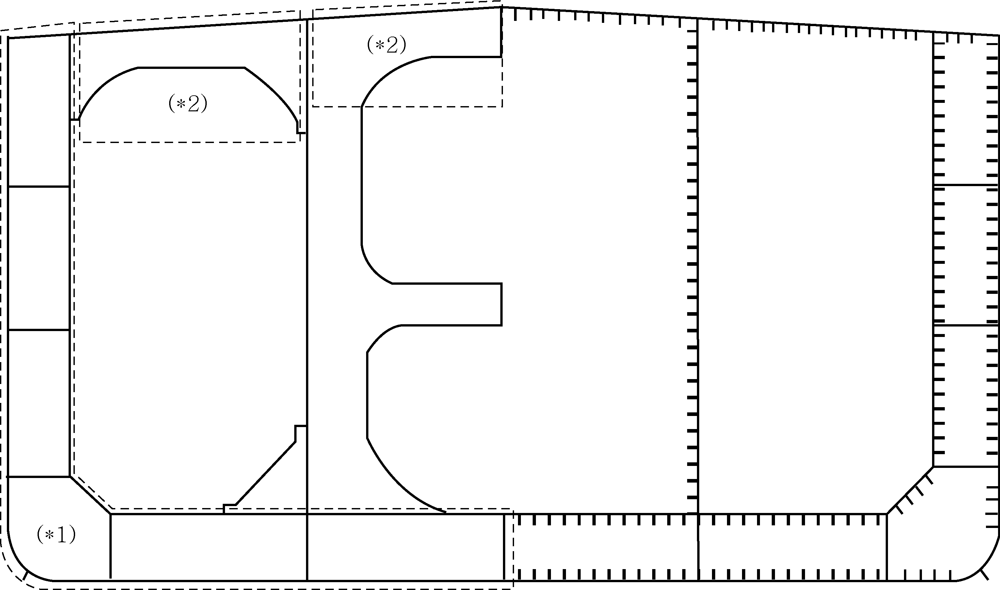
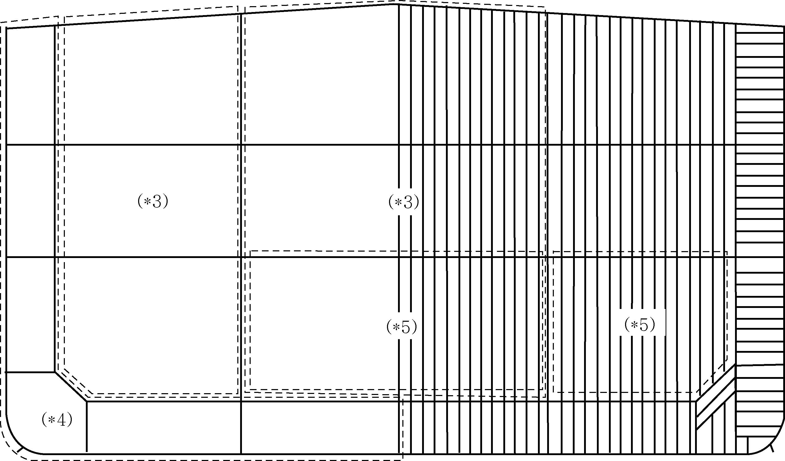
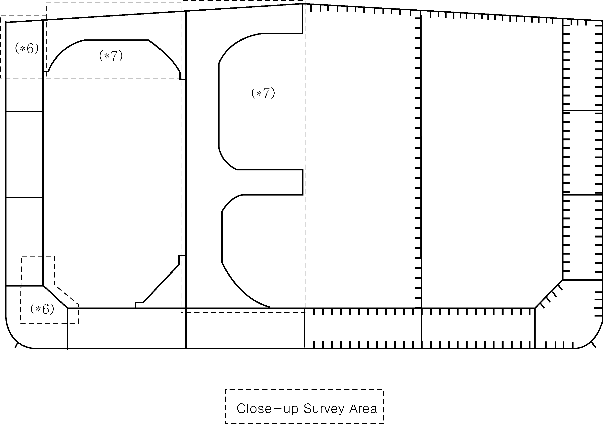
Note : (*1) through (*7) are as given in **Table 1.3.10** of the Rules.

#### (6) Areas of Close-up Survey for Double Skin Bulk Carriers with ESP notation

**Area(＊2)**

| Ordinary transverse frame in double skin tank | Ordinary longitudinal structure in double skin tank |
| --- | --- |
| 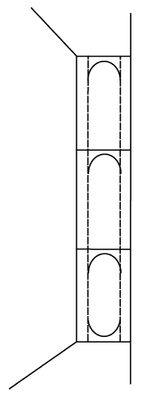 | 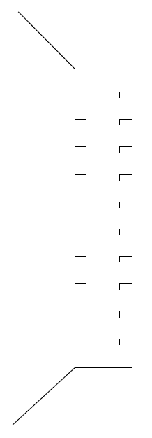 |

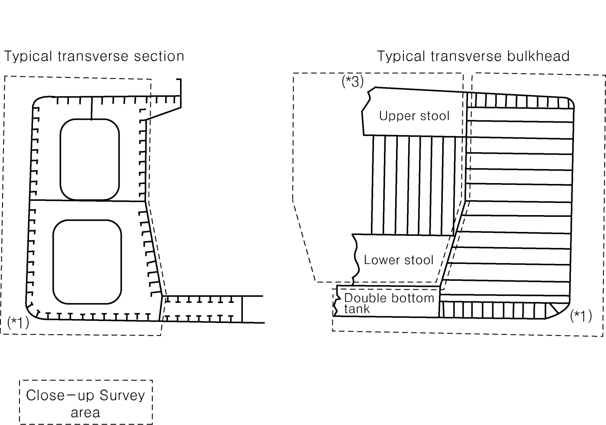
Note : (*1) through (*5) are as given in **Table 1.3.13** of the Rules
