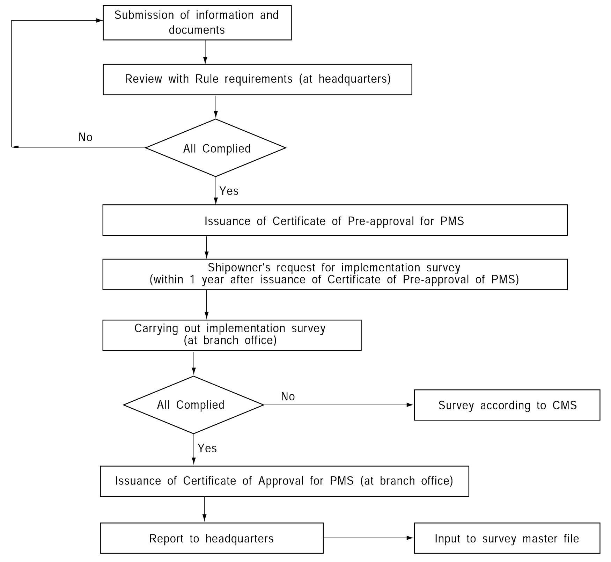

# PART 1 Classification and Surveys

> RULES FOR CLASSIFICATION OF STEEL SHIPS / RA-01-E / 2025 / EN / Guidance

## Annex 1-8 Planned Maintenance System Procedure(PMS)

### 1. General

#### (1) At the request of Owner, PMS is to be approved by the Society in accordance with Fig 1 and Information and Documents given in Table 1 including the following items are to be submitted. (2019)

- **(A)** organization chart identifying areas of responsibility
- **(B)** documentation filling procedures
- **(C)** listing of equipment to be considered by the Society in PMS
- **(D)** machinery identification procedure
- **(E)** preventing maintenance sheets for each machine to be considered
- **(F)** listing and schedule of preventive maintenance procedure.

#### (2) In addition to the above documentation the following information shall be available on board: (2019)

- **(A)** the above (1) in an up-to-date fashion
- **(B)** maintenance inspection(manufacturer's and shipyard's)
- **(C)** reference documentation (trend investigation procedure etc.)
- **(D)** records of maintenance including repairs and renewals carried out.

#### (3) An annual report covering the year's service, including the following information as required under clauses (1) (C) and (E) as well as the information on changes to other clauses in (1), shall be reviewed by the Society. (2019)

#### (4) In general, the intervals for PMS shall not exceed those specified for CMS. However, for components where the maintenance is based on running hours longer intervals may be accepted as long as the intervals are based on the manufacturer's recommendations. (2019)

#### (5) The PMS shall be programmed and maintained by a computerized system. However, this may not be applied to the current already approved schemes. Computerized systems shall include back-up devices, such as disks/tapes, CDs, which are to be updated at regular intervals.

#### (6) If requested by the applicant, the PMS software shall be reviewed and approved in accordance with Annex 3, "PMS Software Approval," and a type approval certificate shall be issued.

#### (7) Notation

- **(A)** PMS: A ships where the Planned Maintenance System specified in **Pt 1, Ch 2, 903.** of the Rules is applied.
- **(B)** PMS-CBM: A ships where the Condition Based Maintenance System specified in **Pt 1, Ch 2, 903. 3** of the Rules is applied.
- **(C)** PMS(S): A ships where the PMS software with type approval in addition to the PMS applied in (a) above.

### 2. Chief Engineer's responsibility of PMS.

#### (1) Shipowner(or ship management company) is responsible for ensuring that Chief Engineer is qualified to maintain the PMS-covered equipment, and First-grade licence issued in the relevant nation for Chief Engineer is to be provided.

#### (2) The chief engineer shall be the responsible person on board in charge of the PMS.

#### (3) Documentation on overhauls of items covered by the PMS shall be reported and signed by the chief engineer.

#### (4) Access to computerized systems for updating of the maintenance documentation and maintenance program shall only be permitted by the chief engineer or other authorized person.

#### (5) PMS items to be maintained by Chief Engineer is to be complied with Table 2 and to be retained on board the overhauled(or opened up) records. However, PMS items not permitted by Chief Engineer's records in Table 2 are to be surveyed under the attending surveyor as far as practicable at Annual Survey.

**Fig 1 Flow chart for approval procedures**

**Table 1 Information and Documents to be submitted**

| Name and content | Remarks |
| --- | --- |
| (1) Machinery inventory content: Listing of machinery subjected to maintenance, and index or code for each machinery. | Unify classification nomenclature for machinery to use the same names as far as possible. machinery index or code and CMS code. Identify and mark items not permitted by the chief engineer. |
| (2) Maintenance schedule: (A) It is to be stated for PMS of each item of machinery as follows: - Identification of overhaul survey, kind of inspection and test and content of measurement record - Intervals of overhaul survey, inspection and measurement (B) It is to be stated for CM as follows: - Layout of CM, maker, model and specification of CM equipment - Measuring points, names of measuring instruments and measuring parameters for each machinery - Intervals of measurement for each machinery - Acceptable limits for monitored condition for each machinery - Examples of input and output data | To be satisfied the Rules requirements for overhaul survey, inspection, measurement, etc. of all machinery. To be overhauled with period not to exceed 5 year To be confirmed that quantity of machinery to be surveyed every year is not less than about 20 % of machinery covered by PMS. To be reviewed CM layout and feasibility of measuring parameters. To be sure that output format is easily recognizable by the chief engineer. To be reviewed the feasibility of acceptable limit. |
| (3) Reporting system: (A) To be stated in the program as follows: - Records of maintenance and repairs - Spare parts (B) A regular reporting system between the ship and the supporting land department of the ship company is to be stated. | Ease in confirming that all reporting and recording procedures are carried out exactly. |
| (4) Documents for qualification requirements of the chief engineer: (A) Copy of chief engineer's licence (B) Chief engineer's resume | To be satisfied with the requirements of chief engineer's qualification. |

**Table 2 Machinery with permission of maintenance by the chief engineer in PMS**

| System | Machinery with permission of maintenance by the chief engineer under a PMS | Not permission of maintenance by the chief engineer but subject to the attending Surveyor. |
| --- | --- | --- |
| Main diesel engines | 1. Cylinder covers 2. Valves and valve gears 3. Cylinder blocks and liners 4. Pistons and piston rods 5. Connecting rods, crossheads, top end bearings, guides, gudgeon pins and bushes 6. Crankshafts and bearings 7. Scavenge pumps, blowers and air coolers 8. Camshafts and camshaft drives | 1. Relief devices(Crankcase, scavenging air chamber, camshaft driving gear room, etc.) 2. Engine trial 3. Holding down bolts and chocks |
| Main Turbines | Casings, rotors, blades, bearing, nozzle, nozzle valve and control valve - with CM equipment whose monitoring of operating parameters and vibration measurement is found in satisfactory under the attending Surveyor only. | 1. Holding down bolts and chocks 2. In case without CM equipment, it is to be surveyed after opening the top casing of turbine. |
| Auxiliary Engines | Auxiliary engines, auxiliary steam turbines and their associated coolers and pumps. - But, where those are used for driving generator, it is limited to the case where power can be supplied to the essential auxiliaries necessary forpropulsion and safety of ship and cooling of refrigerated cargo by the remaining generator(s) that are not under maintenance even during maintenance of one unit. | Auxiliary internal combustion engines or auxiliary steam turbines driving generators - In case of satisfying conditions in the left column, the chief engineer's maintenance may be permitted. |
| Shafting | 1. Intermediate shafts and bearings 2. Thrust shafts and bearing | 1. Reduction/increase gearing 2. Flexible couplings and clutches |
| Remote Control and Automation System | Records for malfunction, abnormal alarms, etc., are to be made and submitted to the Society. | 1. Main engine control system for bridge, centralized or automatic controls 2. Requirements for centralized controls or unattended machinery automations |
| Pressure vessels and auxiliaries | 1. Pumps attached to main engine(bilge, L.O., F.O. and cooling water) 2. Independently driven pumps(bilge, ballast, F.W. cooling, S.W. cooling, L.O. and F.O. transfer) 3. Coolers and condensers (F.W. and L.O. coolers for main engine, main and auxiliary condensers and drain coolers) 4. Heaters(F.O., L.O. and feed water) 5. Other auxiliaries(air compressors including safety devices, windlasses, mooring winches, forced or induced draft fans and Independent F.O. tanks) 6. Air reservoir | 1. First start arrangement trial 2. Piping arrangements: steam pipes, sea connections and valves, maneuvering valves, bulkhead stop valves, bilge check-stop valves (including foot valves) 3. Steering gear 4. Electrical equipment Others |
| Others | IGS(scrubber units, blowers, independent gas generating units) Exhaust gas emission abatement system(SCR, EGR & EGCS) | IGS(all components for inert gas system except for items covered by the chief engineer's maintenance) |

### 3. PMS Software type approval

#### (1) Application

- **(A)** This procedure applies to the testing and inspection required for the type approval of PMS software.
- **(B)** Procedures and regulations for type approval of PMS software shall comply with the **‘Guidelines for Approval of Manufacturing Process and Type Approval’.**
- **(C)** The certificate validity period is five years, and renewal audits shall be carried out every five years to verify the conformity of the software after maintenance and updates.

#### (2) Documents to be Submitted

- **(A)** The applicant for software approval shall submit the following related materials along with the PMS program approval request:
  - **(a)** Software package (demo software and installation files, including any necessary dedicated installation programs)
  - **(b)** Operation manual, which includes:
  - **(i)** System requirements (e.g., CPU, operating system, hard disk capacity, memory capacity)
    - **(ii)** Software install and uninstall procedures
    - **(iii)** Function of the software
    - **(iv)** Operation methods
  - **(v)** Other documents deemed necessary by the Society
  - **(c)** Type test program that demonstrates compliance with the software requirements specified in section (3) Functions.

#### (3) Functions

- **(A)** PMS Functional requirements
  - **(a)** It is to be capable of registering the maintenance plans for those survey items required by the machinery maintenance scheme (PMS).
  - **(b)** It is to be capable of specifying the time schedule of maintenance or running hours for each item of machinery and equipment including their parts.
  - **(c)** It is to be capable of displaying a list of at least the following items. The list is to classify the registered machinery, equipment and their parts and to be displayed in a tree structure format, etc.
  - **(i)** Names of machinery, equipment and their parts
    - **(ii)** PMS items
    - **(iii)** PMS intervals (next maintenance schedule or operating hours)
    - **(iv)** PMS schedule (allow direct entry of maintenance dates or calculate PMS intervals)
  - **(v)** Person in charge of maintenance
  - **(d)** Maintenance intervals are not, in principle, to exceed five years. Maintenance intervals are to be capable of being displayed on the list of maintenance within a term which is arbitrarily designated.
  - **(e)** Maintenance items that expire after the designated maintenance period are easily identifiable.
- **(B)** Maintenance Records Function
  - **(a)** It is to be capable of managing and recording the results of the maintenance conducted by PMS specified in (A) PMS Functional Requirements. The items regarding management and record are to be included the following:
  - **(i)** Names of machinery, equipment, and parts
    - **(ii)** Maintenance items and results (including part replacements)
    - **(iii)** Completion dates of maintenance
    - **(iv)** Total running hour
  - **(v)** Next inspection date
    - **(vi)** Measurement data (if applicable, including design dimensions and allowable tolerances)
    - **(vii)** The condition of damage and the repair method in cases where damage was found.
- **(C)** List of the maintenance items within the designated term is to be displayed. Such lists are to include the name of machinery,equipment and their parts together with the maintenance items and the maintenance completion date.
- **(D)** Past maintenance records are to be displayed in cases where machinery, equipment and their parts are arbitrarily selected.
- **(E)** The ship owner (or ship management) shall periodically access or receive PMS records for management purposes.
- **(F)** The software shall include search and filter functionality.

#### (4) Software Management

- **(A)** Revision Management
  Software manufacturers and administrators shall apply for re-approval if significant changes occur due to system updates. Specific revision details shall be displayed on the home screen or menus.
- **(B)** Backup Management
  Software manufacturers and administrators are to specify proper procedures for backing up administrated maintenance data.

#### (5) Type test

Type tests are to comply with the requirements given in **Sec 3. 104 ‘Guidelines for Approval of Manufacturing Process and Type Approval’.**

### 4. Condition Monitoring(CM) and Condition Based Maintenance(CBM) (2019)

#### (1) General

- **(A)** Application
  - **(a)** These Annex apply to the approved Condition Monitoring and Condition Based Maintenance schemes where the condition monitoring results are used to influence the scope and/or frequency of Class survey.
  - **(b)** This Annex may be applied to components and systems covered by Continuous Machinery Survey (CMS), and other components and systems as requested by the owner. The extent of Condition Based Maintenance and associated monitoring equipment to be included in the maintenance scheme is decided by the Owner.
  - **(c)** These Annex can be applied only to vessels operating on approved PMS survey scheme.
  - **(d)** The Annex may be applied to any individual items and systems. Any items not covered by the scheme are to be surveyed and credited in accordance with the requirements in **Pt 1**.

#### (2) Definitions

- **(A)** The following standard terms are defined in ISO13372.
  - **(a)** Condition monitoring : acquisition and processing of information and data that indicate the state of a machine over time. The machine state deteriorates if faults or failures occur.
  - **(b)** Diagnostic : examination of symptoms and syndromes to determine the nature of faults or failures.
  - **(c)** Condition Based Maintenance : maintenance performed as governed by condition monitoring programmes.

#### (3) Condition Monitoring(CM)

- **(A)** Where an approved condition monitoring system is fitted, credit for survey may be based on acceptable condition monitoring results. The condition monitoring results are to be reviewed during the annual audit.
- **(B)** Limiting parameters are to be based on the Original Equipment Manufacturers guidelines (OEM), or a recognised international standard. The parameters in **Table 3** may considered. *(2022)*
- **(C)** The condition monitoring system is to provide an equivalent or greater degree of confidence in the condition of the machinery to traditional survey techniques.
- **(D)** The condition monitoring system is to be approved in accordance with This Society’s procedures.
- **(E)** A condition monitoring system may be used to provide a greater understanding of equipment condition, and a condition based maintenance scheme may be used to obtain maintenance efficiency. Class approval is required where owners wish to change the survey cycle based on CM/CBM.
- **(F)** Software systems can use complex algorithms, machine learning and knowledge of global equipment populations/defect data in order to identify acceptability for continued service or the requirement for maintenance. These systems may be independent of the OEM recommended maintenance and condition monitoring suggested limits. Approval of this type of software is to be based on OEM recommendations, industry standards and Class Society experience.
- **(G)** The Society retains the right to test or open-up the machinery, irrespective of the CM results, if deemed necessary.

#### (4) Condition Based Maintenance(CBM)

- **(A)** Where an owner wishes to base their equipment maintenance on a CBM approach, this is to meet the requirements of the ISM Code.
- **(B)** Where an agreed planned maintenance and CBM scheme is in operation, the CMS and other survey intervals may be extended based on OEM maintenance recommendations and acceptable condition monitoring results.
- **(C)** Limiting parameters (alarms and warnings) are to be based on the OEM guidelines, or a recognised international standard. The parameters in **Table 3** may considered. *(2022)*
- **(D)** The CBM scheme is to provide an equivalent or greater degree of confidence in the condition of the machinery to traditional maintenance techniques.
- **(E)** The scheme is to be approved in accordance with This Society’s procedures.
- **(F)** Software systems can use complex algorithms, machine learning and knowledge of global equipment populations/defect data in order to identify acceptability for continued service or the requirement for maintenance. These systems may be independent of the OEM recommended maintenance and condition monitoring suggested limits. Approval of this type of software is to be based on OEM recommendations, industry standards and Class Society experience.

#### (5) Procedures and Conditions for approval of CM and CBM

- **(A)** Onboard Responsibility
  - **(a)** The chief engineer is to be the responsible person on board in charge of the CM and CBM.
  - **(b)** Documentation on the overhaul of items covered by CM and CBM schemes are to be reported by the chief engineer.
  - **(c)** Access to computerized systems for updating of the maintenance documentation and maintenance program are to only be permitted by the chief engineer or other authorized person.
  - **(d)** All personnel involved in CM and CBM is to be appropriately qualified.
  - **(e)** CM does not replace routine surveillance or the chief engineer’s responsibility for taking decisions in accordance with his judgement.
- **(B)** Equipment and System Requirements
  - **(a)** CM equipment and systems are to be approved in accordance with a procedure of the Society.
  - **(b)** The CM/CBM scheme and its extent, are to be approved by the Society.
  - **(c)** The CBM scheme is to be capable of producing a condition report, and maintenance recommendations.
  - **(d)** A system is to be provided to identify where limiting parameters (alarms and warnings) are modified during the operation of the scheme.
  - **(e)** Where CM and CBM schemes use remote monitoring and diagnosis (i.e. data is transferred from the vessel and analysed remotely), the system is to meet the applicable standards for Cyber Safety and Security. The system is to be capable of continued onboard operation in the event of loss of the communication function.
  - **(f)** CBM schemes are to identify defects and unexpected failures that were not prevented by the CM system.
  - **(g)** Systems are to be include a method of backing up data at regular intervals.
- **(C)** Documentation and Information
  - **(a)** The following documentation is to be made available to the Society for the approval of the scheme:
  - **(i)** The following documentation is to be made available to the Society for the approval of the scheme:
    - **(ii)** Listing of equipment to be included in the scheme
    - **(iii)** Listing of acceptable condition monitoring parameters
    - **(iv)** Description of CBM scheme
  - **(v)** Listing, specifications and maintenance procedures for condition monitoring equipment
    - **(vi)** Baseline data for equipment with condition monitoring
    - **(vii)** Qualification of personnel and company responsible for analysing CM results
  - **(b)** In addition to the above documentation the following information is to be available on board:
  - **(i)** All clauses in above (a) in an up-to-date fashion
    - **(ii)** Maintenance instructions (manufacturer’s and shipyard’s)
    - **(iii)** Condition monitoring data including all data since last opening of the machine and the original base line data
    - **(iv)** Reference documentation (trend investigation procedures etc.)
  - **(v)** Records of maintenance including repairs and renewals carried out
    - **(vi)** Records of changes to software systems and parameters
    - **(vii)** Sensors calibration records / certification / status
- **(D)** Approval validity
  - **(a)** An Annual Audit is to be carried out to maintain the validity of the CM/CBM scheme.
  - **(b)** The survey arrangement for machinery under CM/CBM can be cancelled by the Society if the scheme is not being satisfactorily carried out either from the maintenance records or the general condition of the machinery.
  - **(c)** The case of sale or change of management of the ship or transfer of class shall cause the approval to be reconsidered.
  - **(d)** The ship owner may, at any time, cancel the survey arrangement for machinery under the scheme by informing the Society in writing and for this case the items which have been inspected under the scheme since the last annual Audit can be credited for class at the discretion of the attending surveyor.

#### (6) Surveys

- **(A)** Installation Survey
  Condition monitoring equipment is to be installed and surveyed in accordance with class society rules, and a set of base line readings is to be taken.
- **(B)** Implementation Survey
  - **(a)** The Implementation Survey is to be carried out by the Society’s surveyor no earlier than 6 months after installation survey and no later than the first Class annual survey.
  - **(b)** During the Implementation survey the following is to be verified by a surveyor:
  - **(i)** the CM/CBM scheme is implemented according to the approval documentation, including a comparison with baseline data;
    - **(ii)** the scheme is producing the documentation required for the Annual Audit and the requirements of surveys and testing for the maintenance of class are complied with;
    - **(iii)** the onboard personnel are familiar with operating the scheme.
    - **(iv)** records of any limiting parameters (alarms and warnings) that have been modified during the operation of the scheme.
  - **(v)** Records of any failures of monitored equipment are to be reviewed to ensure that the condition monitoring scheme is effective / sufficient.
  - **(c)** When this survey is carried out and the implementation is found in order, a report describing the scheme is to be submitted to the Society and the scheme may be put into service.
- **(C)** Annual Audit
  - **(a)** An annual audit of the CM and CBM scheme is to be carried out by a Society’s surveyor concurrently with the Class annual survey.
  - **(b)** The purpose of this audit is to be to verify that the scheme is being correctly operated and that the machinery has been functioning satisfactorily since the previous audit. This is to include any limiting parameters (alarms and warnings) that have been modified since the last audit. A general examination of the items concerned is to be carried out.
  - **(c)** The performance, condition monitoring and maintenance records isto be examined to verify that the machinery has functioned satisfactorily since the previous survey, or action has been taken in response to machinery operating parameters exceeding acceptable tolerances.
  - **(d)** Written details of break-down or malfunction is to be made available.
  - **(e)** At the discretion of the surveyor, function tests, confirmatory surveys and random check readings, where Condition Monitoring / Condition Based Maintenance equipment is in use, is to be carried out as far as practicable and reasonable.
  - **(f)** The familiarity of the chief engineer and other personnel involved with the CM system is to be verified.
  - **(g)** Calibration status of sensors and equipment is to be verified.
  - **(h)** Verification that the suitability of the CM/CBM scheme has been reviewed following defects and failures is to be carried out.
- **(D)** Damage and repairs
  - **(a)** Damage to components or items of machinery is to be reported to the Society. The repairs of such damaged components or items of machinery are to be carried out to the satisfaction of the Surveyor.
  - **(b)** Details of repairs and maintenance carried out are to be examined. Any machinery part, which has been replaced by a spare one, due to damage, is to be retained on board where possible until examined by the Society’s Surveyor.
  - **(c)** Defect and failure data is to be reviewed in order to ensure the system output is appropriate. Where necessary, following review of the failure data, there is to be a method of amending the CM and CBM scheme. 

    | Items | Operating Parameter |
    | --- | --- |
    | Main Diesel Engine | 1. Shaft horse power 2. Engine and Shaft RPM 3. Cylinder pressure-time curves 4. Oil fuel injection pressure-time curves 5. Oil fuel temperature or viscosity 6. Charge air pressure 7. Exhaust gas temperatures 8. Engine cooling systems, temperatures and pressures 9. Engine lubricating oil system, temperatures and pressures 10. Turbo-charger RPM and vibration 11. Lubricating oil analysis data 12. Crankshaft deflections 13. Main bearing temperatures |
    | Main Steam Turbine | 1. Turbine rotor vibration 2. Turbine rotor axial displacement 3. Shaft horsepower 4. Shaft and turbine rotor FPM 5. Performance data; (1) Steam conditions at inlet and outlet of each turbine (2) Boiler performance data (3) Condenser vacuum (4) Sea temperatures (5) Steam conditions of other major steam consuming auxiliaries |
    | Auxiliary Steam Turbine | Same as main steam turbine |
    | Auxiliary Diesel Engine | 1. Exhaust gas temperatures 2. Engine cooling systems temperatures and pressures 3. Engine L.O. system; temperatures and pressures 4. Turbo-charger RPM and vibration 5. Lub. oil analysis data 6. Crankshaft deflections |
    | Auxiliaries | 1. Cooler efficiency, inlet and outlet temperatures 2. Heater temperatures 3. Pumps and fans; vibration and performance 4. Differential pressure across filters |
