# PART 1 Classification and Surveys

> RULES FOR CLASSIFICATION OF STEEL SHIPS / RA-01-E / 2025 / EN / Guidance

## Annex 1-12 Hull Survey for Classification Survey during Construction

### 1. Scope

The scope of this Annex includes the following main activities:

#### (1) Examination of the parts of the ship covered by classification rules and by applicable statutory regulations for hull construction, to obtain appropriate evidence that they have been built in compliance with the rules and regulations, taking account of the relevant approved drawings.

#### (2) Appraisal of the manufacturing, construction, control and qualification procedures, including welding consumables, weld procedures, weld connections and assemblies, with indication of relevant approval tests.

#### (3) Witnessing inspections and tests as required in the classification rules used for ship construction including materials, welding and assembling, specifying the items to be examined and/or tested and how (e.g. by hydrostatic, hose or leak testing, non destructive examination, verification of geometry) and by whom.

#### (4) Appraisal of material and equipment used for ship construction and their inspection at works is not included in this Annex. Details of requirements for hull and machinery steel forgings and castings and for normal and higher strength hull structural steel are given in IACS UR W7(Hull and Machinery Steel Forging), W8(Hull and Machinery Steel Casting) and W11(Normal and High Strength Hull Structural Steels) respectively. Acceptance of these items is verified through the survey process carried out at the manufacturer’s works and the issuing of the appropriate certificates.

#### (5) In addition to above (1) to (4), for tankers and bulk carriers subject to SOLAS Ch II-1 Pt A-1 Reg.3-10(Goal-based ship construction standards for bulk carriers and oil tankers), see also Appendix 1-12-2 to this Annex.

### 2. Definitions

#### (1) The hull structure is defined as follows:

- **(A)** hull envelope including all internal and external structures,
- **(B)** superstructures, deckhouses and casings,
- **(C)** welded foundations, e.g. main engine seatings,
- **(D)** hatch coamings, bulwarks,
- **(E)** all penetrations fitted and welded into bulkheads, decks and shell,
- **(F)** the fittings of all connections to decks, bulkheads and shell, such as air pipes and ship side valves – all ILLC 1966, as amended, items.
- **(G)** welded attachments to shell, decks and primary members, e.g. crane pedestals, bitts and bollards, but only as regards their interaction on the hull structure.

#### (2) Reference to documents also includes electronic transmission or storage.

#### (3) Definition of survey methods which the Surveyor is directly involved in: Patrol, Review, Witness

- **(A)** **Patrol**, the act of checking on an independent and unscheduled basis that the applicable processes, activities and associated documentation of the shipbuilding functions identified in **Table 1** continue to conform to classification and statutory requirements.
- **(B)** **Review**, the act of examining documents in order to determine traceability, identification and to confirm that processes continue to conform to classification and statutory requirements
- **(C)** **Witness** is the attendance at scheduled inspections in accordance with the agreed Inspection and Test Plans to the extent necessary to check compliance with the survey requirements.

### 3. Applications

#### (1) This Annex covers the survey of all new construction of steel ships intended for classification and for international voyages except for:

- **(A)** those defined in SOLAS I/3
- **(B)** High Speed Craft as defined in I/1.3.1 of the 2000 High Speed Craft Code
- **(C)** Mobile Offshore Drilling Units as defined in I/1.2.1 of the MODU Code

#### (2) This Annex covers all statutory items, relevant to the hull structure and coating, i.e. Load Line and SOLAS Safety Construction.

#### (3) This Annex does not cover the manufacture of equipment, fittings and appendages regardless whether they are made inside or outside of the shipyard, examples being as follows. Evidence of acceptance shall be provided by accompanying documentation from class Surveyor at manufacturer and verified at the shipyard:

- **(A)** hatch covers,
- **(B)** doors and ramps integral with the shell and bulkheads,
- **(C)** rudders and rudder stock,
- **(D)** all forgings and castings integral to the hull.

#### (4) This Annex applies to the installation into the ship, welding and testing of:

- **(A)** the items listed in (3) above
- **(B)** equipment forming part of the watertight and weather tight integrity of the ship.

#### (5) This Annex applies to the hull structures and coating constructed at any of the following:

- **(A)** shipbuilder’s facilities,
- **(B)** sub-contractors at the shipbuilder’s facilities,
- **(C)** sub-contractors at their own facilities or at other remote locations

### 4. Qualification and monitoring of personnel

#### (1) Exclusive Surveyors of the Society, as defined in IACS PR5(Definition of Exclusive Surveyor and Non-Exclusive Surveyor and Procedure for Employment and Control of Non-Exclusive Surveyors), are to confirm through patrol, review and witness as defined in Par 2 (3), that the ships are built using approved plans in accordance with the relevant rules and statutory requirements.

The Surveyors are to be qualified to be able to carry out the tasks and procedures are to be in place to ensure that their activities are monitored. Details are specified in PR6(Procedure for Activity Monitoring of Surveyors/ISM Code Auditor) and PR7(Procedure for Qualification and Training of Surveyors).

### 5. Survey of the hull structure

#### (1) Table 1 provides a list of surveyable items for the hull structure and coating covered by this Annex, including:

- **(A)** description of the shipbuilding functions
- **(B)** classification and statutory survey requirements
- **(C)** survey method required for classification
- **(D)** relevant IACS and statutory requirement references
- **(E)** documentation to be available for the Surveyor during construction
  - **(a)** the shipbuilder is to provide the Surveyors access to documentation required by classification, this includes documentation retained by the shipbuilder or other third parties
  - **(b)** the list of documents approved or reviewed by the Society for the specific new construction are as follows:
    (ⅰ) plans and supporting documents
    (ⅱ) examination and testing plans
    (ⅲ) NDT plans
    (ⅳ) welding consumable details
    (ⅴ) welding procedure specifications
    (ⅵ) welding plan or details
    (ⅶ) welder’s qualification records
    (ⅷ) NDT operator's qualification records
- **(F)** Documents to be inserted into the ship construction file. Refer to **Par 10** for details
- **(G)** A list of specific activities which are relevant to the shipbuilding functions. This list is not exhaustive and can be modified to reflect the construction facilities or specific ship type.

#### (2) Evidence is also to be made available, as required, by the shipbuilder, to the Surveyor whilst the construction process proceeds to prove that the material and equipment supplied to the ship has been built or manufactured under survey relevant to the classification rules and statutory requirements.

### 6. Review of the construction facility

#### (1) The Society is to familiarize themselves with the yard's production facilities, management processes and safety for consideration in complying with the requirements of Table 1 using “Shipyard Review Record” of Appendix 1-12-1 or equivalent prior to any steelwork or construction taking place in the following circumstances:

- **(A)** where the Society has none or no recent experience of the construction facilities – typically after a one year lapse - or when significant new infrastructure has been added,
- **(B)** where there has been a significant management or personnel re-structuring having an impact on the ship construction process,
- **(C)** or where the shipbuilder contracts to construct a vessel of a different type or substantially different in design.

### 7. Newbuilding survey planning

#### (1) Prior to commencement of surveys for any newbuilding project, the Society is to discuss with the shipbuilder at a kick off meeting the items listed in Table 1.

The purpose of the meeting is to review and agree how the list of specific activities shown in **Table 1** is to be addressed. The meeting is to take into account the shipbuilder's construction facilities and ship type including the list of proposed subcontractors. A record of the meeting is to be made, based upon the contents of the **Table 1** – the **Table 1** can be used as the record with comments made into the appropriate column. If the Society has nominated a Surveyor for a specific newbuilding project then the Surveyor is to attend the kick off meeting.
The builder should agree to undertake ad hoc investigations during construction as may be requested by the Society where areas of concern arise and the builder to agree to keep the Society advised of the progress of any investigation. Whenever an investigation is undertaken, the builder is to be requested, in principle, to agree to suspend relevant construction activities if warranted by the severity of the problem.

#### (2) The records are to take note of specific published Administration requirements and interpretations of statutory requirements.

#### (3) The shipyard shall be requested to advise of any changes to the activities agreed at the kick off meeting and these are to be documented in the Survey Plan.

E.g. if the shipbuilder chooses to use or change sub-contractors, or to incorporate any modifications necessitated by changes in production or inspection methods, rules and regulations, structural modifications, or in the event where increased inspection requirements are deemed necessary as a result of a substantial non-conformance or otherwise.

#### (4) Shipbuilding quality standards for the hull structure during new construction are to be reviewed and agreed during the kick-off meeting. Structural fabrication is to be carried out in accordance with IACS Recommendation 47, “Shipbuilding and Repair Quality Standard”, or a Recognized Fabrication Standard(RFS) which has been accepted by the Society prior to the commencement of fabrication/ construction. The work is to be carried out in accordance with the Rules and under survey of the Society. (2021)

A Classification Society may accept an RFS as an alternative to IACS Rec. 47 provided that (4.1) or (4.2) is complied with as applicable. *(2021)*
(4.1) Where a RFS is well established and has well documented history (3 or more years prior to the new vessel contract) of successful application to similar designs as the new vessel and that history is for the same Shipyard as the new vessel.
Then the Shipyard is to create a summary document referencing the RFS to be used in construction and highlighting any limitations to usage of the selected RFS.
This summary document is to be included with the “record of kick-off meeting” for the vessel.
The summary document is also to be included in the SCF, (for Tankers and Bulk Carriers subject to SOLAS Chapter II-1 Part A-1 Regulation 3-10 per App 12-2-2, Table A Tier II Item 11), as applicable.
(4.2) Where a RFS is new or revised or otherwise not as per (4.1) the following steps are to be carried out:
The summary document is to be included with the “record of the kick-off meeting” of the vessel. The summary document is also to be included in the SCF, (for Tankers and Bulk Carriers subject to SOLAS Chapter II-1 Part A-1 Regulation 3-10 per App 2, Table A Tier II Item 11), as applicable. (2021)

#### (5) The kick-off meeting may be attended by other parties(owner, administrations, etc.) as defined in IACS PR3(Transparency of Classification and Statutory Information) subject to agreement by the shipbuilder.

#### (6) In the event of series ship production*, the requirement for a kick off meeting in (1) above may be waived for the second and subsequent ships provided that no changes to the specific activities agreed in the kick off meeting for the first ship are introduced. If any changes are introduced, these are to be agreed in a new dedicated meeting and documented in a record of such meeting.

* Series Ship Production:
Vessels in the series subsequent to the first one (prototype), i.e. sister ships built in the same shipyard. *(2022)*

### 8. Examination and test plan for newbuilding activities

#### (1) The shipbuilder is to provide plans of the items which are intended to be examined and tested. These plans need not be submitted for approval and examination at the time of the kick off meeting. They are to include: (2020)

- **(A)** proposals for the examination of completed steelwork - generally referred to as the block plan and are to include details of joining blocks together at the pre-erection and erection stages or at other relevant stages (for reference)
- **(B)** proposals for fit up examinations where necessary (for approval)
- **(C)** proposals for testing of the structure(leak and hydrostatic) as well as for all watertight and weathertight closing appliances (for approval)
- **(D)** proposals for non-destructive testing (for approval)
- **(E)** any other proposals specific to the ship type or to the statutory requirements. (for approval)

#### (2) The plans and any modifications to them are to be submitted to the Surveyors in sufficient time to allow review before the relevant survey activity commences.

#### (3) In addition to above (1) and (2), for tankers and bulk carriers subject to SOLAS Ch II-1 Pt A-1 Reg.3-10, see also Appendix 1-12-2 to this Annex.

### 9. Proof of the consistency of surveys

#### (1) The Society is to be able to provide evidence, e.g. through records, check lists, inspection and test records, etc. that its Surveyors have complied with the requirements of the newbuilding survey planning and duly participated in the relevant activities shown in the shipbuilder’s examination and test plans.

#### (2) In addition, the Society is to maintain records of deficiencies found during the patrolling activities required in Table 1 and described in Par 2 (3) (A). Records shall include the date when deficiency was found, description of the deficiency and the date the deficiency was cleared.

### 10. Ship Construction File

The purpose of this paragraph are applicable to all ships except the tankers and bulk carriers subject to SOLAS Ch II-1 Pt A-1 Reg.3-10 for which **Par 3** of **Appendix 1-12-2** to this Annex is to be applied.

#### (1) The shipbuilder is to deliver documents for the Ship Construction File. In the event that items have been provided by another party such as the shipowner and where separate arrangements have been made for document delivery which excludes the shipbuilder, that party has the responsibility. The Ship Construction File shall be reviewed by the Surveyor for content in accordance with the requirements of (2) below.

#### (2) It is recognised that the purpose of documents held in the Ship Construction File on board the ship, is to facilitate inspection(survey) and repair and maintenance, and, therefore, is to include in addition to documents listed in Table 1, but not be limited to:

- **(A)** as-built structural drawings including scantling details, material details, and, as applicable, wastage allowances, location of butts and seams, cross section details and locations of all partial and full penetration welds, areas identified for close attention(for general dry cargo ships, liquefied gas carriers and ships subject to the enhanced survey programme) and rudders,
- **(B)** manuals required for classification and statutory requirements, e.g. loading and stability, bow doors and inner doors and side shell doors and stern doors – operations and maintenance manuals(IACS UR S8(Bow Doors and Inner Doors) and S9(Side Shell Doors and Stern Doors))
- **(C)** ship structure access manual, as applicable,
- **(D)** copies of certificates of forgings and castings welded into the hull(IACS UR W7(Hull and Machinery Steel Forging) and W8(Hull and Machinery Steel Casting)),
- **(E)** details of equipment forming part of the watertight and weathertight integrity of the ship, *(2021)*
  a) a Cable Transit Seal Systems Register, to be prepared by the shipbuilder for watertight cable transits. The Register can be in either a hard copy or digitized media.
  For an example of a register see Appendix 1-12-5 “Recommendatory Sample - Cable Transit Seal Systems Register”.
  It is to include a marking/identification system, documentation referencing manufacturer manual(s) for each type of cable transit installed, the Type Approval certification for each type of transit system, applicable installation drawings, and a recording of each installed transit documenting the as built condition after final inspection in the shipyard. This is to include sections to record any inspection, modification, repair and maintenance.
- **(F)** tank testing plan including details of the test requirements(IACS UR　S14(Testing Procedures of Watertight Compartments)),
- **(G)** corrosion prevention specifications(IACS UR Z8(Corrosion Protection Coating for Salt Water Ballast Spaces) and Z9(Corrosion Protection Coatings for Cargo Hold Spaces on Bulk Carriers)),
- **(H)** details for the in-water survey, if applicable, information for divers, clearances measurements instructions etc., tank and compartment boundaries,
- **(I)** docking plan and details of all penetrations normally examined at drydocking.
- **(J)** Coating Technical File, for ships subject to compliance with the IMO Performance Standard for Protective Coatings(PSPC) as a class requirement under the IACS Common Structural Rules.
  **Table 1 Hull Surveyable Items Activities Table**
  **Appendix 1-12-1 Shipyard Review Record**
  **Appendix 1-12-2 Requirements for Tankers and Bulk Carriers subject to SOLAS Ch II-1 Pt A-1 Reg.3-10(Goal-based ship construction standards for bulk carriers and oil tankers)**
  **Appendix 1-12-3 Ship Construction File Form Example**
  **Appendix 1-12-4 Representative critical areas by ship type** ***(2018)***
  **Appendix 1-12-5 Recommendatory Sample - Cable Transit Seal Systems Register** ***(2021)***

  **Table 1 Surveyable Items Activities Table**

  | **Reference** | **Shipbuilding function** | **Survey Requirements for Classification** | **Survey Method required for Classification** | **IACS reference^*** | **Statutory requirements and relevant reference** | **Documentation available to classification Surveyor during construction** | **Documentation for ship construction file** | **Specific activities** | **Classification Society proposals for the project** |
  | --- | --- | --- | --- | --- | --- | --- | --- | --- | --- |
  |   | **Shipbuilding quality control function** |   |   |   |   |   |   |   |   |
  | **1** | **Welding** |   |   |   |   |   |   |   |   |
  | **1.1** | **Welding consumables** | Classification approved separately at the manufacturer | Review approval status and patrol, verify storage, handling and treatment in accordance with manufacturer's requirements | UR W17 |   | Consumable specification and approval status | Not required | Identify consumables against approved list |   |
  | **1.1** | **Welding consumables** | Classification approved separately at the manufacturer | Review approval status and patrol, verify storage, handling and treatment in accordance with manufacturer's requirements | UR W17 |   | Consumable specification and approval status | Not required | Verify temporary and permanent storage facilities | E.g. kept dry, covered, where applicable heated |
  | **1.1** | **Welding consumables** | Classification approved separately at the manufacturer | Review approval status and patrol, verify storage, handling and treatment in accordance with manufacturer's requirements | UR W17 |   | Consumable specification and approval status | Not required | Verify traceability | E.g. random batch number checking |
  | **1.2** | **Welder qualification** | Qualified welders | Review of welder certification and patrol | Rec 47 |   | Shipyards records with individual's identification | Not required | Verify welder qualification standard, e.g. class or recognised standard approval |   |
  | **1.2** | **Welder qualification** | Qualified welders | Review of welder certification and patrol | Rec 47 |   | Shipyards records with individual's identification | Not required | Verify welder approved for weld position |   |
  | **1.2** | **Welder qualification** | Qualified welders | Review of welder certification and patrol | Rec 47 |   | Shipyards records with individual's identification | Not required | Verify validity of qualification certificate |   |
  | **1.3** | **Welding - mechanical properties (welding procedures)** | All weld joint configurations, positions and materials to be covered by weld procedures approved by the classification society or by another IACS member available | Review and patrol | UR W28 |   | Approved weld procedure specification and welding plan relevant to the ship project or process | Not required | Verify procedures are available at relevant workstations |   |
  | **1.3** | **Welding - mechanical properties (welding procedures)** | The classification society witnesses all new weld procedure qualification tests carried out in the shipyard whenever the classification society is surveying in the shipyard | Witness |   |   |   |   | Verify weld procedures records have been approved and cover all weld processes and positions in accordance with classification or recognised standards and are available for the Surveyors reference |   |
  | **1.3a** | **Welding equipment** | Correctly calibrated and maintained | Patrol and review |   |   | Shipbuilders maintenance and calibration records | Not required | Verify condition of machinery and equipment |   |
  | **1.3a** | **Welding equipment** | Correctly calibrated and maintained | Patrol and review |   |   | Shipbuilders maintenance and calibration records | Not required | Verify machines are calibrated by appropriate staff |   |
  | **1.3a** | **Welding equipment** | Correctly calibrated and maintained | Patrol and review |   |   | Shipbuilders maintenance and calibration records | Not required | Verify calibration carried out in accordance with manufacturer's recommendations |   |
  | **1.3a** | **Welding equipment** | Correctly calibrated and maintained | Patrol and review |   |   | Shipbuilders maintenance and calibration records | Not required | Verify calibration in accordance with maintenance schedule |   |
  | **1.3b** | **Welding environment** | Satisfactory environment | Patrol | Rec 47 |   |   | Not required | Verify welding areas clean, dry, well lit |   |
  | **1.3b** | **Welding environment** | Satisfactory environment | Patrol | Rec 47 |   |   | Not required | Confirm relevant measures taken for any pre or post heat treatment, drying of surfaces prior to welding |   |
  | **1.3b** | **Welding environment** | Satisfactory environment | Patrol | Rec 47 |   |   | Not required | Confirm shielding gases, fluxes protected |   |
  | **1.3c** ***(2021)*** | **Welding supervision** | Sufficient number of skilled supervisors | Review and patrol | UR W33, Rec 47 |   |   |   | Verify supervision is effective |   |
  | **1.4** ***(2021)*** | **Welding- surface discontinuities** | Substantially free from significant indications, satisfactory profile and size | Visual examination, surface detection techniques, review of documents and patrol of operator | UR W33, Rec 47 |   | Shipbuilders and recognised standards and Rules as applicable, welding and NDE plans, NDE reports, operator qualifications | Not required | Identify workstations where NDE is carried out, e.g. panel line butt welds, castings into hull structure |   |
  | **1.4** ***(2021)*** | **Welding- surface discontinuities** | Substantially free from significant indications, satisfactory profile and size | Visual examination, surface detection techniques, review of documents and patrol of operator | UR W33, Rec 47 |   | Shipbuilders and recognised standards and Rules as applicable, welding and NDE plans, NDE reports, operator qualifications | Not required | Verify NDE carried out in accordance with approved plans where applicable |   |
  | **1.4** ***(2021)*** | **Welding- surface discontinuities** | Substantially free from significant indications, satisfactory profile and size | Visual examination, surface detection techniques, review of documents and patrol of operator | UR W33, Rec 47 |   | Shipbuilders and recognised standards and Rules as applicable, welding and NDE plans, NDE reports, operator qualifications | Not required | Verify suitability of NDE methods |   |
  | **1.4** ***(2021)*** | **Welding- surface discontinuities** | Substantially free from significant indications, satisfactory profile and size | Visual examination, surface detection techniques, review of documents and patrol of operator | UR W33, Rec 47 |   | Shipbuilders and recognised standards and Rules as applicable, welding and NDE plans, NDE reports, operator qualifications | Not required | Verify operators suitably qualified particularly where sub-contractors have been employed |   |
  | **1.4** ***(2021)*** | **Welding- surface discontinuities** | Substantially free from significant indications, satisfactory profile and size | Visual examination, surface detection techniques, review of documents and patrol of operator | UR W33, Rec 47 |   | Shipbuilders and recognised standards and Rules as applicable, welding and NDE plans, NDE reports, operator qualifications | Not required | Verify NDE is carried out according to the acceptable process |   |
  | **1.4** ***(2021)*** | **Welding- surface discontinuities** | Substantially free from significant indications, satisfactory profile and size | Visual examination, surface detection techniques, review of documents and patrol of operator | UR W33, Rec 47 |   | Shipbuilders and recognised standards and Rules as applicable, welding and NDE plans, NDE reports, operator qualifications | Not required | Review NDE records |   |
  | **1.5** ***(2021)*** | **Welding - embedded discontinuities** | NDE is to be carried out by qualified operators capable of ensuring that welds are substantially free from significant indications. | Radiography and ultrasonic testing, review of documents and patrol of operator, examination of films | UR W33, Rec 47 |   | Shipbuilders and recognised standards and Rules as applicable, welding and NDE plans, NDE reports, operator qualifications | Not required | Identify workstations where NDE is carried out, e.g. panel line butt welds, castings into hull structure |   |
  | **1.5** ***(2021)*** | **Welding - embedded discontinuities** | NDE is to be carried out by qualified operators capable of ensuring that welds are substantially free from significant indications. | Radiography and ultrasonic testing, review of documents and patrol of operator, examination of films | UR W33, Rec 47 |   | Shipbuilders and recognised standards and Rules as applicable, welding and NDE plans, NDE reports, operator qualifications | Not required | Verify NDE carried out in accordance with approved plans where applicable |   |
  | **1.5** ***(2021)*** | **Welding - embedded discontinuities** | NDE is to be carried out by qualified operators capable of ensuring that welds are substantially free from significant indications. | Radiography and ultrasonic testing, review of documents and patrol of operator, examination of films | UR W33, Rec 47 |   | Shipbuilders and recognised standards and Rules as applicable, welding and NDE plans, NDE reports, operator qualifications | Not required | Verify suitability of NDE methods |   |
  | **1.5** ***(2021)*** | **Welding - embedded discontinuities** | NDE is to be carried out by qualified operators capable of ensuring that welds are substantially free from significant indications. | Radiography and ultrasonic testing, review of documents and patrol of operator, examination of films | UR W33, Rec 47 |   | Shipbuilders and recognised standards and Rules as applicable, welding and NDE plans, NDE reports, operator qualifications | Not required | Verify operators suitably qualified particularly where sub-contractors have been employed |   |
  | **1.5** ***(2021)*** | **Welding - embedded discontinuities** | NDE is to be carried out by qualified operators capable of ensuring that welds are substantially free from significant indications. | Radiography and ultrasonic testing, review of documents and patrol of operator, examination of films | UR W33, Rec 47 |   | Shipbuilders and recognised standards and Rules as applicable, welding and NDE plans, NDE reports, operator qualifications | Not required | Verify that records have been completed and in accordance with recognised standards, e.g. IQI(Image Qualify Indicator) and sensitivity recorded |   |
  | **1.5** ***(2021)*** | **Welding - embedded discontinuities** | NDE is to be carried out by qualified operators capable of ensuring that welds are substantially free from significant indications. | Radiography and ultrasonic testing, review of documents and patrol of operator, examination of films | UR W33, Rec 47 |   | Shipbuilders and recognised standards and Rules as applicable, welding and NDE plans, NDE reports, operator qualifications | Not required | Verify that reports and radiographs have been evaluated correctly by the shipbuilder. Systematic review of radiographs carried out by the Surveyor |   |
  | **1.5** ***(2021)*** | **Welding - embedded discontinuities** | NDE is to be carried out by qualified operators capable of ensuring that welds are substantially free from significant indications. | Radiography and ultrasonic testing, review of documents and patrol of operator, examination of films | UR W33, Rec 47 |   | Shipbuilders and recognised standards and Rules as applicable, welding and NDE plans, NDE reports, operator qualifications | Not required | Verify equipment calibration satisfactory and in accordance with manufacturers and recognised standards requirements |   |
  | **1.5** ***(2021)*** | **Welding - embedded discontinuities** | NDE is to be carried out by qualified operators capable of ensuring that welds are substantially free from significant indications. | Radiography and ultrasonic testing, review of documents and patrol of operator, examination of films | UR W33, Rec 47 |   | Shipbuilders and recognised standards and Rules as applicable, welding and NDE plans, NDE reports, operator qualifications | Not required | Verify NDE is carried out according to the acceptable process |   |
  | **2** | **Steel preparation and fit up** |   |   |   |   |   |   |   |   |
  | **2.1** | **Surface preparation, marking and cutting** | Traceability and acceptability of material, check of steel plates & profiles materials type, scantling identification, testing marks | Patrol | Rec 47 |   | Material certificates, shipbuilder's marking/cutting production documents at the workstage - documents retained at the facility | Not required | Verify stockyard storage satisfactory |   |
  | **2.1** | **Surface preparation, marking and cutting** | Traceability and acceptability of material, check of steel plates & profiles materials type, scantling identification, testing marks | Patrol | Rec 47 |   | Material certificates, shipbuilder's marking/cutting production documents at the workstage - documents retained at the facility | Not required | Verify material traceability, e.g. stamping identification against material certification, archiving of records |   |
  | **2.1** | **Surface preparation, marking and cutting** | Traceability and acceptability of material, check of steel plates & profiles materials type, scantling identification, testing marks | Patrol | Rec 47 |   | Material certificates, shipbuilder's marking/cutting production documents at the workstage - documents retained at the facility | Not required | Verify transfer marking after treatment line |   |
  | **2.1** | **Surface preparation, marking and cutting** | Traceability and acceptability of material, check of steel plates & profiles materials type, scantling identification, testing marks | Patrol | Rec 47 |   | Material certificates, shipbuilder's marking/cutting production documents at the workstage - documents retained at the facility | Not required | Verify standard of shotblasting and priming |   |
  | **2.1** | **Surface preparation, marking and cutting** | Traceability and acceptability of material, check of steel plates & profiles materials type, scantling identification, testing marks | Patrol | Rec 47 |   | Material certificates, shipbuilder's marking/cutting production documents at the workstage - documents retained at the facility | Not required | Verify suitability of primer |   |
  | **2.1** | **Surface preparation, marking and cutting** | Traceability and acceptability of material, check of steel plates & profiles materials type, scantling identification, testing marks | Patrol | Rec 47 |   | Material certificates, shipbuilder's marking/cutting production documents at the workstage - documents retained at the facility | Not required | Verify that steel grades can be identified |   |
  | **2.1** | **Surface preparation, marking and cutting** | Traceability and acceptability of material, check of steel plates & profiles materials type, scantling identification, testing marks | Patrol | Rec 47 |   | Material certificates, shipbuilder's marking/cutting production documents at the workstage - documents retained at the facility | Not required | Verify machinery adjusted to maintain within IACS or manufacturers recommendations |   |
  | **2.1** | **Surface preparation, marking and cutting** | Traceability and acceptability of material, check of steel plates & profiles materials type, scantling identification, testing marks | Patrol | Rec 47 |   | Material certificates, shipbuilder's marking/cutting production documents at the workstage - documents retained at the facility | Not required | Verify accuracy of marking and cutting |   |
  | **2.1** | **Surface preparation, marking and cutting** | Traceability and acceptability of material, check of steel plates & profiles materials type, scantling identification, testing marks | Patrol | Rec 47 |   | Material certificates, shipbuilder's marking/cutting production documents at the workstage - documents retained at the facility | Not required | Verify storage of piece parts |   |
  | **2.2** | **Straightening** | Approval of straightening methods/ procedures against deformation | Patrol and review | Rec 47 |   | Recognised standards, approved procedures | Not required | Verify that straightening processes are approved for the grade and type of steel, e.g. tmcp, z plate |   |
  | **2.2** | **Straightening** | Approval of straightening methods/ procedures against deformation | Patrol and review | Rec 47 |   | Recognised standards, approved procedures | Not required | Verify that plates and sections are within recognised tolerances |   |
  | **2.3** | **Forming** | Maintain material properties. Acceptance of forming method against unproper deformations | Patrol | Rec 47 |   | Shipbuilders procedure for hot forming | Not required | Verify that temperature control is exercised by the operator |   |
  | **2.3** | **Forming** | Maintain material properties. Acceptance of forming method against unproper deformations | Patrol | Rec 47 |   | Shipbuilders procedure for hot forming | Not required | Verify that suitable methods of temperature control are available when forming special steels and materials |   |
  | **2.3** | **Forming** | Maintain material properties. Acceptance of forming method against unproper deformations | Patrol | Rec 47 |   | Shipbuilders procedure for hot forming | Not required | Verify that forming processes are acceptable |   |
  | **2.4** | **Conformity with alignment/fit up/gap criteria** | Check alignment/fit up/gap against reference standards | Patrol | Rec 47 |   | Shipbuilders and recognised standards and Rules as applicable | Not required | Verify the processes to ensure satisfactory fit up and alignment at all workstations |   |
  | **2.4** | **Conformity with alignment/fit up/gap criteria** | Check alignment/fit up/gap against reference standards | Patrol | Rec 47 |   | Shipbuilders and recognised standards and Rules as applicable | Not required | Verify that edge preparations are re-instated where lost during fitting operations |   |
  | **2.4** | **Conformity with alignment/fit up/gap criteria** | Check alignment/fit up/gap against reference standards | Patrol | Rec 47 |   | Shipbuilders and recognised standards and Rules as applicable | Not required | Verify remedial procedures are in place to compensate for wide gaps and alignment deviations |   |
  | **2.5** ***(2018)*** | **Conformity for critical** **areas ^1) , when defined, with alignment/fit up or weld configuration** | Check alignment/fit up/gap against approved drawings | Witness and review | Rec 47 |   | Shipbuilders and recognised standards and Rules as applicable, approved plan or standard, builder's records | Approved plans of critical areas if applicable | Verify that the information relevant to the latest approved drawings is available at the workstations |   |
  | **2.5** ***(2018)*** | **Conformity for critical** **areas ^1) , when defined, with alignment/fit up or weld configuration** | Check alignment/fit up/gap against approved drawings | Witness and review | Rec 47 |   | Shipbuilders and recognised standards and Rules as applicable, approved plan or standard, builder's records | Approved plans of critical areas if applicable | Verify the processes to ensure satisfactory fit up and alignment at all workstations |   |
  | **2.5** ***(2018)*** | **Conformity for critical** **areas ^1) , when defined, with alignment/fit up or weld configuration** | Check alignment/fit up/gap against approved drawings | Witness and review | Rec 47 |   | Shipbuilders and recognised standards and Rules as applicable, approved plan or standard, builder's records | Approved plans of critical areas if applicable | Verify that edge preparations are re-instated where lost during fitting operations |   |
  | **2.5** ***(2018)*** | **Conformity for critical** **areas ^1) , when defined, with alignment/fit up or weld configuration** | Check alignment/fit up/gap against approved drawings | Witness and review | Rec 47 |   | Shipbuilders and recognised standards and Rules as applicable, approved plan or standard, builder's records | Approved plans of critical areas if applicable | Verify remedial procedures are in place to compensate for wide gaps and alignment deviations |   |
  | (Remarks) *(2018)* **^1)** For the critical areas, the following information are available: a) The approved Hull Construction Monitoring Plan, in case the ship assigned with “Sea Trust(HCM)” notation as Hull Construction Monitoring Procedure or, b) Ship structure access manual, if applicable or, c) other references *(2020)* i) Representative critical areas by ship type(refer to Annex 1-12-4) or, ii) The following publications for critical structural areas, where applicable: - Oil Tankers : Guidance Manual for Tanker Structures by TSCF or Guidelines for Surveys, Assessment and Repair of Hull Structures By IACS(Rec 96) or A.1047(27) (2011 ESP Code), as amended. - Bulk Carriers : Bulk Carriers Guidelines for Surveys, Assessment and Repair of Hull Structure by IACS(Rec 76) or A.1047(27)(2011 ESP Code) as mended. - General Dry Cargo Ships : Guidelines for Surveys, Assessment and Repair of Hull Structure By IACS(Rec. 55) - Container Ship : Guidelines for Surveys, Assessment and Repair of Hull Structure By IACS(Rec. 84) etc. |   |   |   |   |   |   |   |   |   |
  | **3** | **Steelwork process, e.g. sub assembly, block, grand and mega block assembly, pre-erection and erection, closing plates** | Compliance with approved drawings, visual examination of welding and material, check alignment and deformations | Patrol of the process and witness of the completed item | Rec 47 |   | Approved plans, shipbuilders inspection records, Shipbuilders and recognised standards and Rules as applicable, construction plan (steelwork sub-division) |   | Verify that the information relevant to the latest approved drawings is available at the workstations |   |
  | **3** | **Steelwork process, e.g. sub assembly, block, grand and mega block assembly, pre-erection and erection, closing plates** | Compliance with approved drawings, visual examination of welding and material, check alignment and deformations | Patrol of the process and witness of the completed item | Rec 47 |   | Approved plans, shipbuilders inspection records, Shipbuilders and recognised standards and Rules as applicable, construction plan (steelwork sub-division) |   | Verify that correct weld sizes have been adopted |   |
  | **3** | **Steelwork process, e.g. sub assembly, block, grand and mega block assembly, pre-erection and erection, closing plates** | Compliance with approved drawings, visual examination of welding and material, check alignment and deformations | Patrol of the process and witness of the completed item | Rec 47 |   | Approved plans, shipbuilders inspection records, Shipbuilders and recognised standards and Rules as applicable, construction plan (steelwork sub-division) |   | Verify operation of the welding processes at the different work stages is satisfactory |   |
  | **3** | **Steelwork process, e.g. sub assembly, block, grand and mega block assembly, pre-erection and erection, closing plates** | Compliance with approved drawings, visual examination of welding and material, check alignment and deformations | Patrol of the process and witness of the completed item | Rec 47 |   | Approved plans, shipbuilders inspection records, Shipbuilders and recognised standards and Rules as applicable, construction plan (steelwork sub-division) |   | Verify that piece parts are identifiable |   |
  | **3** | **Steelwork process, e.g. sub assembly, block, grand and mega block assembly, pre-erection and erection, closing plates** | Compliance with approved drawings, visual examination of welding and material, check alignment and deformations | Patrol of the process and witness of the completed item | Rec 47 |   | Approved plans, shipbuilders inspection records, Shipbuilders and recognised standards and Rules as applicable, construction plan (steelwork sub-division) |   | Verify that fit ups are within recognised tolerances |   |
  | **3** | **Steelwork process, e.g. sub assembly, block, grand and mega block assembly, pre-erection and erection, closing plates** | Compliance with approved drawings, visual examination of welding and material, check alignment and deformations | Patrol of the process and witness of the completed item | Rec 47 |   | Approved plans, shipbuilders inspection records, Shipbuilders and recognised standards and Rules as applicable, construction plan (steelwork sub-division) |   | Verify that correct welding requirements specified in reference 1 of this table have been adopted |   |
  | **3** | **Steelwork process, e.g. sub assembly, block, grand and mega block assembly, pre-erection and erection, closing plates** | Compliance with approved drawings, visual examination of welding and material, check alignment and deformations | Patrol of the process and witness of the completed item | Rec 47 |   | Approved plans, shipbuilders inspection records, Shipbuilders and recognised standards and Rules as applicable, construction plan (steelwork sub-division) |   | Verify processes for closing plates etc. are acceptable |   |
  | **3** | **Steelwork process, e.g. sub assembly, block, grand and mega block assembly, pre-erection and erection, closing plates** | Compliance with approved drawings, visual examination of welding and material, check alignment and deformations | Patrol of the process and witness of the completed item | Rec 47 |   | Approved plans, shipbuilders inspection records, Shipbuilders and recognised standards and Rules as applicable, construction plan (steelwork sub-division) |   | Confirm that steelwork is in accordance with the approved plan |   |
  | **4** | **Remedial work and alteration** | Welding, check against deformation, alignment | Review records and witness | Rec 47 |   | Permanent record of shipyard surveyable item |   | Verify that records have been maintained of significant deviations from the approved plans, for situations such as mis cut openings, re-routing outfit items |   |
  | **4** | **Remedial work and alteration** | Welding, check against deformation, alignment | Review records and witness | Rec 47 |   | Permanent record of shipyard surveyable item |   | Verify that all deviations brought to the attention of the classification society by the shipbuilder are acceptable |   |
  | **5** | **Tightness testing, including leak and hose testing, hydropneumatic testing** | Absence of leaks | Review and witness of the test | UR S14 | Reg. II-1/11 of SOLAS as amended | Approved tank testing plan, shipbuilders inspection records | Approved tank testing plan | Confirm that tank testing is carried out in accordance with the approved plan |   |
  | **5** | **Tightness testing, including leak and hose testing, hydropneumatic testing** | Absence of leaks | Review and witness of the test | UR S14 | Reg. II-1/11 of SOLAS as amended | Approved tank testing plan, shipbuilders inspection records | Approved tank testing plan | Confirm the methods used to carry out leak testing |   |
  | **5** | **Tightness testing, including leak and hose testing, hydropneumatic testing** | Absence of leaks | Review and witness of the test | UR S14 | Reg. II-1/11 of SOLAS as amended | Approved tank testing plan, shipbuilders inspection records | Approved tank testing plan | Confirm that correct test pressures maintained for leak, hose and hydro and hydropneumatic testing is satisfactory |   |
  | **5** | **Tightness testing, including leak and hose testing, hydropneumatic testing** | Absence of leaks | Review and witness of the test | UR S14 | Reg. II-1/11 of SOLAS as amended | Approved tank testing plan, shipbuilders inspection records | Approved tank testing plan | Verify that adequate records of the tank testing have been maintained |   |
  | **6** | **Structural testing** | Structural adequacy of the design | Review and witness of the test | UR S14 | Reg. II-1/11 of SOLAS as amended | Approved tank testing plan, shipbuilders inspection records | Approved tank testing plan | Confirm that tank testing is carried out in accordance with the approved plan |   |
  | **6** | **Structural testing** | Structural adequacy of the design | Review and witness of the test | UR S14 | Reg. II-1/11 of SOLAS as amended | Approved tank testing plan, shipbuilders inspection records | Approved tank testing plan | Confirm that correct test pressures maintained for testing is satisfactory |   |
  | **6** | **Structural testing** | Structural adequacy of the design | Review and witness of the test | UR S14 | Reg. II-1/11 of SOLAS as amended | Approved tank testing plan, shipbuilders inspection records | Approved tank testing plan | Verify that adequate records of the tank testing have been maintained |   |
  | **7** ***(2019)*** | **Corrosion protection systems,** **e.g. coatings, cathodic protection, impressed current except for coating system subject to PSPC** | Salt water ballast tanks with boundaries formed by the hull envelope, and also bulk carrier hold internal surfaces, coamings and hatch covers shall have an efficient protective coating. Safety aspects of cathodic systems to be dealt with separately. | Review and report on builder's & manufacturer's documentation | UR Z8 and Z9, UI SC122, UR F1 | Reg. II-1/3-2 of SOLAS as amended | Manufacturer's and builder's specification | Corrosion prevention specifications | Verify that applied coatings are approved and review records of application |   |
  | **7** ***(2019)*** | **Corrosion protection systems,** **e.g. coatings, cathodic protection, impressed current except for coating system subject to PSPC** | Salt water ballast tanks with boundaries formed by the hull envelope, and also bulk carrier hold internal surfaces, coamings and hatch covers shall have an efficient protective coating. Safety aspects of cathodic systems to be dealt with separately. | Review and report on builder's & manufacturer's documentation | UR Z8 and Z9, UI SC122, UR F1 | Reg. II-1/3-2 of SOLAS as amended | Manufacturer's and builder's specification | Corrosion prevention specifications | Verify that adequate records have been maintained and copied to the ship construction file |   |
  | **7** ***(2019)*** | **Application Antifouling Systems** |   | Review |   | AFS Convention | Painting Specification | Painting Specification and Mfg Declaration | Verify that adequate records have been maintained and copied to the ship construction file |   |
  | **7.1** | **Application of Protective Coatings for Dedicated Seawater Ballast Tanks in all Types of Ships and Double-Side Skin Spaces of Bulk Carriers subject to PSPC** | Monitor implementation of the coating inspection requirements | Patrol and review | UI SC223 | Reg. II-1/3-2 of SOLAS as amended | Signed and verified Tripartite Agreement | Coating Technical File | Verify that applied coatings are approved and review records of application in accordance with Chapter 7 of Annex to MSC.215(82) |   |
  | **8** | **Installation, welding and testing of the following** |   |   |   |   |   |   |   |   |
  | **8.1** | **Hatch covers** | Tightness and securing | Witness | UR S14 & Rec 14 | Reg. 13-14-15 and 16 of ILLC '66 | Approved tank testing plan, shipbuilders inspection records | Details required, structural drawings | Confirm leak test of hatch covers |   |
  | **8.1** | **Hatch covers** | Tightness and securing | Witness | UR S14 & Rec 14 | Reg. 13-14-15 and 16 of ILLC '66 | Approved tank testing plan, shipbuilders inspection records | Details required, structural drawings | Confirm operation and securing test |   |
  | **8.2** | **Doors and ramps integral with the shell and bulkheads** | Tightness and securing | Witness | UR S14 | Reg. II-1/18 of SOLAS as amended, Reg. 12 and 21 of ILLC '66 | Approved tank testing plan, shipbuilders inspection records | Details required | Confirm leak test |   |
  | **8.2** | **Doors and ramps integral with the shell and bulkheads** | Tightness and securing | Witness | UR S14 | Reg. II-1/18 of SOLAS as amended, Reg. 12 and 21 of ILLC '66 | Approved tank testing plan, shipbuilders inspection records | Details required | Confirm operation and securing test |   |
  | **8.2** | **Doors and ramps integral with the shell and bulkheads** | Tightness and securing | Witness | UR S14 | Reg. II-1/18 of SOLAS as amended, Reg. 12 and 21 of ILLC '66 | Approved tank testing plan, shipbuilders inspection records | Details required | Confirm safety device operation |   |
  | **8.2** | **Doors and ramps integral with the shell and bulkheads** | Tightness and securing | Witness | UR S14 | Reg. II-1/18 of SOLAS as amended, Reg. 12 and 21 of ILLC '66 | Approved tank testing plan, shipbuilders inspection records | Details required | Ensure correct maintenance logs/manuals supplied with the ship construction file |   |
  | **8.3** | **Rudders** | Fitting | Witness | UR S14 |   | Approved plan, shipbuilders inspection records | Details required, structural drawings | Confirm alignment and mounting and fitting up to the connection to the tiller |   |
  | **8.3** | **Rudders** | Fitting | Witness | UR S14 |   | Approved plan, shipbuilders inspection records | Details required, structural drawings | Confirm function test |   |
  | **8.3** | **Rudders** | Fitting | Witness | UR S14 |   | Approved plan, shipbuilders inspection records | Details required, structural drawings | Verify fitting of pintles and all securing bolts |   |
  | **8.3** | **Rudders** | Fitting | Witness | UR S14 |   | Approved plan, shipbuilders inspection records | Details required, structural drawings | Verify all fit up records including all clearances maintained and placed into ship construction file |   |
  | **8.4** | **Forgings and castings** | Compliance with approved drawings, visual examination of welding and material, check alignment and deformations | Patrol of the process and witness of the completed item | UR W7 & W8 |   | Approved plans, shipbuilders inspection records, Shipbuilders and recognised standards and Rules as applicable, construction plan (steelwork sub-division) | Copies of certificates of forgings and castings | Verify casting and forgings against material certificate |   |
  | **8.4** | **Forgings and castings** | Compliance with approved drawings, visual examination of welding and material, check alignment and deformations | Patrol of the process and witness of the completed item | UR W7 & W8 |   | Approved plans, shipbuilders inspection records, Shipbuilders and recognised standards and Rules as applicable, construction plan (steelwork sub-division) | Copies of certificates of forgings and castings | Verify that correct welding and fit up requirements specified in reference 1, 2.4 and 2.5 of this table have been adopted |   |
  | **8.4** | **Forgings and castings** | Compliance with approved drawings, visual examination of welding and material, check alignment and deformations | Patrol of the process and witness of the completed item | UR W7 & W8 |   | Approved plans, shipbuilders inspection records, Shipbuilders and recognised standards and Rules as applicable, construction plan (steelwork sub-division) | Copies of certificates of forgings and castings | Verify that material certificates are included in the ship construction file |   |
  |   | **Appendages** |   |   |   |   |   |   | Verify that correct welding and fit up requirements specified in reference 1, 2.4 and 2.5 of this table have been adopted |   |
  | **8.5** | **Equipment forming the watertight and weathertight integrity of the ship, e.g. overboard discharges, air pipes, ventilators** | Tightness and securing | Witness |   | Reg. II-1/16 and Reg. II-1/16-1 of SOLAS as amended; Reg. 17-18-19-20-22-23 of ILLC '66 | Approved tank testing plan, shipbuilders inspection records | Details required | Verify that correct welding and fit up requirements specified in reference 1, 2.4 and 2.5 of this table have been adopted |   |
  | **8.5** | **Equipment forming the watertight and weathertight integrity of the ship, e.g. overboard discharges, air pipes, ventilators** | Tightness and securing | Witness |   | Reg. II-1/16 and Reg. II-1/16-1 of SOLAS as amended; Reg. 17-18-19-20-22-23 of ILLC '66 | Approved tank testing plan, shipbuilders inspection records | Details required | Verify Compliance with Load line Convention 1966 as amended - i.e. all fittings in accordance with the record of freeboard assignment |   |
  | **8.5** | **Equipment forming the watertight and weathertight integrity of the ship, e.g. overboard discharges, air pipes, ventilators** | Tightness and securing | Witness | UR P3 |   |   |   | Verify air pipes, vents etc closing device are approved type |   |
  | **8.5** | **Equipment forming the watertight and weathertight integrity of the ship, e.g. overboard discharges, air pipes, ventilators** | Tightness and securing | Witness |   |   |   |   | Verify material certificates for overboard discharges where applicable |   |
  | **8.5** | **Equipment forming the watertight and weathertight integrity of the ship, e.g. overboard discharges, air pipes, ventilators** | Tightness and securing | Witness |   |   |   |   | Verify record of freeboard assignment and all material certificates included in the ship construction file |   |
  |   | **Freeboard marks and draft marks** | Within allowable tolerances and in accordance with the freeboard assignment | Witness | UI LL4 | Reg. 4-5-6-7 and 8 of ILLC '66 |   | Details required | Verify freeboard marks in accordance with load line assignment |   |
  |   | **Freeboard marks and draft marks** | Within allowable tolerances and in accordance with the freeboard assignment | Witness | UI LL4 | Reg. 4-5-6-7 and 8 of ILLC '66 |   | Details required | Verify draft marks in accordance with the agreed tolerances specified by the builder unless more onerous flag state requirements |   |
  |   | **Principal dimensions** | Within allowable tolerances | Review and witness | Rec 47 |   |   | Details required | Verify principal dimensions in accordance with recognised standard |   |
  |   | **Principal dimensions** | Within allowable tolerances | Review and witness | Rec 47 |   |   | Details required | Verify dimensions included in ship construction file |   |
  |   | **Safety Construction certification** | No outstanding imperfections or defects | Witness |   | Reg. I/7 or Reg. I/10 of SOLAS as amended, as appropriate |   |   | Verify that Administration requirements have been incorporated into the hull structure |   |
  | **8.6** ***(2021)*** | **watertight cable** **transit seal** **systems** | compliance with (type)approved drawings, visual examination of fitting, check alignment and securing | patrol of the process and witness of the completed item |   | Reg. II-1/13 and 13-1 of SOLAS as amended | shipbuilder's inspection records, manufacturer's specification | Cable Transit Seal Systems Register | Verify that correct welding and fit up requirements, including as specified in reference 1, 2.4 and 2.5 of this table have been adopt5ed |   |
  | **8.6** ***(2021)*** | **watertight cable** **transit seal** **systems** | compliance with (type)approved drawings, visual examination of fitting, check alignment and securing | patrol of the process and witness of the completed item |   | Reg. II-1/13 and 13-1 of SOLAS as amended | shipbuilder's inspection records, manufacturer's specification | Cable Transit Seal Systems Register | Verify watertight cable transit seal systems are type approved |   |
  | **8.6** ***(2021)*** | **watertight cable** **transit seal** **systems** | compliance with (type)approved drawings, visual examination of fitting, check alignment and securing | patrol of the process and witness of the completed item |   | Reg. II-1/13 and 13-1 of SOLAS as amended | shipbuilder's inspection records, manufacturer's specification | Cable Transit Seal Systems Register | Verify the format and content of the Register |   |
  |   |   |   |   |   |   |   |   |   |   |
  | **Shipbuilder's name** |   |   |   |   |   |   |   |   |   |
  | **Project** |   |   |   |   |   |   |   |   |   |
  | **Project duration** |   |   |   |   |   |   |   |   |   |
  | **Kick off meeting date** |   |   |   |   |   |   |   |   |   |
  | **Representing builder** |   |   |   |   |   |   |   |   |   |
  | **Representing Class Society** |   |   |   |   |   |   |   |   |   |
  | *** IACS Recommendations are not mandatory requirements.** |   |   |   |   |   |   |   |   |   |

  **< Supplement of Table 1 >**
  - Prior to commencement of survey for any newbuilding project, the Society is to discuss with the shipbuilder at a kick off meeting the items listed in **Table 1**. The purpose of the meeting is to review and agree how the list of specific activities shown in **Table 1** is to be addressed. The meeting is to take into account the shipbuilder's construction facilities and ship type including the list of proposed subcontractors.
  - A record of the meeting is to be made, based upon the contents of the **Table 1** - the **Table 1** can be used as the record with comments made into the appropriate column.
  - The shipyard shall be requested to advise of any changes to the activities agreed at the kick off meeting and these are to be documented in the Survey Plan.
  (E.g. if the shipbuilder chooses to use or change sub-contractors, or to incorporate any modifications necessitated by changes in production or inspection methods, rules and regulations, structural modifications, or in the event where increased inspection requirements are deemed necessary as a result of a substantial non-conformance or otherwise.)
  - In the event of series ship production^*, the requirement for a kick off meeting may be waived for the second and subsequent ships provided that no changes to the specific activities agreed in the kick off meeting for the first ship are introduced. If any changes are introduced, these are to be agreed in a new dedicated meeting and documented in a record of such meeting.
  * Series Ship: See **Pt 1, Ch 1, 101. 5.** of the Rules.
  - Additional meeting items, etc. :

  | No. | Items | Result |   |
  | --- | --- | --- | --- |
  | 1 | If the Society has nominated a Surveyor for a specific newbuilding project then the Surveyor is to attend the kick off meeting. | A Surveyor has nominated and attended. | (Yes / No) |
  | 2 | The kick-off meeting may be attended by other parties, such as owner, administrations, etc. subject to agreement by the shipbuilder. | Owner, administrations, etc. has attended. | (Yes / No) |
  | 2 | The kick-off meeting may be attended by other parties, such as owner, administrations, etc. subject to agreement by the shipbuilder. | Attended by : | (Yes / No) |
  | 3 | The builder should agree to undertake ad hoc investigations during construction as may be requested by the Society where areas of concern arise and the builder to agree to keep the Society advised of the progress of any investigation. (The builder is to be requested to agree to suspend relevant construction activities if warranted by the severity of the problem) | The builder was requested and agreed. | (Yes / No) |
  | 4 | Shipbuilding quality standards for the hull structure during new construction are to be reviewed and agreed during the kick-off meeting. | Shipbuilding quality standards was reviewed and agreed. | (Yes / No) |
  | 4 | Shipbuilding quality standards for the hull structure during new construction are to be reviewed and agreed during the kick-off meeting. | Shipbuilding quality standards : | (Yes / No) |
  | 5 | The records are to take note of specific published Administration requirements and interpretations of statutory requirements. | The specific published Administration requirements and interpretations of statutory requirements is exist and the relevant documents are attached. | (Yes / No) |

### Appendix 1-12-1 Shipyard Review Record

| Name of Shipyard | Date |
| --- | --- |
|   |   |

#### 1. Details of any management systems

| Obtained Approval | Certified by | Expiry Date | Remarks (scope, etc.) |
| --- | --- | --- | --- |
| ISO-9001 |   |   |   |
| ISO 14001 |   |   |   |
| ISO 45001 |   |   |   |
| Other: |   |   |   |

#### 2. Construction Equipment: (Documents such as a brochure of shipyard can be attached in lieu of completing this section.)

#### 2.1 Building Berth (B) or Dock (D) * In case of berth, Depth is not applicable.

| B / D | Name | Length ($\mathrm{m}$) | Width ($\mathrm{m}$) | Depth* ($\mathrm{m}$) | Building Capacity (Gross Tonnage) | Crane (Ton x No.) |
| --- | --- | --- | --- | --- | --- | --- |
|   |   |   |   |   |   |   |
|   |   |   |   |   |   |   |
|   |   |   |   |   |   |   |
|   |   |   |   |   |   |   |
|   |   |   |   |   |   |   |
|   |   |   |   |   |   |   |

#### 2.2 Outfitting Quays

| Name | Length ($\mathrm{m}$) | Width ($\mathrm{m}$) | Depth ($\mathrm{m}$) | Berthing Capacity (Gross Tonnage) | Crane (Ton x No.) |
| --- | --- | --- | --- | --- | --- |
|   |   |   |   |   |   |
|   |   |   |   |   |   |
|   |   |   |   |   |   |
|   |   |   |   |   |   |
|   |   |   |   |   |   |
|   |   |   |   |   |   |

#### 2.3 Main Fabrication and Erection Facilities

| (1) Marking and cutting of steel plates(including internal members) - Marking method ( Manual, Photo x , EPM x , NC x others ) - NC cutting machine ( Gas x , Plasma x , Laser x ) Control procedure of NC ( On-line, other ) - Cutting equipment ( Edge planer x , Roll-shear x ) |
| --- |
| (2) Marking and cutting of section bar - Marking method ( Manual, NC ) - Marking of reference curved line ( Manual, NC ) - Cutting method ( Manual, NC ) - In case of NC ( Gas x , Plasma x ) |
| (3) One-side automatic welding machine ( Yes, No ) - Type of welding machine ( Flax Backing x , Flux and Copper Backing x other ) - Existence of special surface plate for plate welding ( Yes, No ) |
| (4) Fillet welding machine ( Gravity, Automatic ) Percentage of automatization except gravity: about % - Line welder ( No, Yes: submerged arc x heads, CO_2 x heads ) - Small automatic fillet welding machine ( No, Yes: Name: x ) - Welding robot ( No, Yes: Portal x , Rectangular x , Articulated x ) |
| (5) Painting equipment - Plate shot blasting/primer coating machine ( No, Yes: Max. Width $\mathrm{m}$, Length $\mathrm{m}$ ) - Section bar shot blasting/primer coating machine ( No, Yes: Max. Length $\mathrm{m}$ ) - Special coating factory ( No, Yes: $\mathrm{m}$ x $\mathrm{m}$ x sections ) |
| (6) Vertical automatic welding machine ( No, Yes: EG x , SEG x , ES x ) EG: Electrogas SEG: Simplified Electrogas ES: Electroslag |
| (7) Other main fabrication facilities |

#### 3. Shipyard control of Qualified Welders

- **(1)** Normal steel

  |   |   | certification | traceability | supervision | maintenance of qualification |
  | --- | --- | --- | --- | --- | --- |
  | Shipyard workers | confirm system in place | Yes/No | Yes/No | Yes/No | Yes/No |
  | Subcontracted workers | confirm system in place | Yes/No | Yes/No | Yes/No | Yes/No |

#### 4. Feature of Construction Procedure

| (1) Subcontract of hull blocks(weight) - Sub members ( No, Yes: Ratio of subcontracted works %, No., of subcontractors ) - Blocks ( No, Yes: Ratio of subcontracted works %, No., of subcontractors ) |
| --- |
| (2) Method of plate block assembly - Method fitting and welding longitudinals and transverse webs on jointed panels - Method welding longitudinals on jointed panels prior to fitting and welding transverse webs - Method fitting and welding a frame consists of longitudinals and transverse webs on jointed panels - Method jointing panels with pre-assembled longitudinals by welding prior to fitting and welding transverse webs - Other (please specify in (5) below) |
| (3) - pre-erection outfitting carried out grand block/mega block adopted Method of erection at building berth/dock - Max. weight of loading block: ton - Construction method in building dock/berth/land construction etc. ( 1 ship, 1.5 ships: Semi-tandem, dual entrance ) - Block loading process ( single starting block, multi starting blocks, inserting block : No, Yes ) |
| (4) Final dock ( No, Yes: In-house, Other place of the same company, Use other company ) |
| (5) Other feature of construction procedure |

#### 5. Quality Control System: (Refer to Quality Manual, if available.)

| Item and description | Result | Remarks |
| --- | --- | --- |
| (1) Existence of the organization chart including the departments of design, purchasing, manufacturing and quality assurance - Are the function, responsibility and competence of the organization clear? |   |   |
| (2) Quality control organization - Existence of quality control organization - Number of employees in this organization - Existence of procedures or plans related to tests and inspections | persons including the chief |   |
| (3) Pre-inspection system of shipyard - Is pre-inspection carried out prior to Class inspection? - Are pre-inspectors assigned? (Check the list.) - Number of pre-inspectors (related to hull only) - Are inspection results marked on the object and/or recorded in the checklist? | persons |   |
| (4) Records of inspections and tests - Are records made and kept properly? - Does the responsible person verify the records? - Can the adoption of necessary corrective actions against non-conformity happened be checked? |   |   |
| (5) Condition at the time of the surveys in the presence of class Surveyors - Is the schedule of the surveys changed often? - Are pre-inspection, shipyard inspection and repairs completed beforehand? - Are the sufficient preparations for surveys such as scaffoldings, lighting, cleaning made? |   |   |
| (NOTES) Above-mentioned (3) and (4) include the acceptance inspection of subcontracted items. |   |   |

#### 6. Measures for Safety and Health

| Item and description | Result | Remarks |
| --- | --- | --- |
| (1) Are conditions of scaffolding, nets, safety belt, lighting and ventilation good? |   |   |
| (2) Does sufficient attention paid for radiographic examination and operation of cherry picker? |   |   |
| (NOTES) |   |   |

#### 7. Control System of Non-Destructive Testing(NDT)

| Item and description | Result | Remarks |
| --- | --- | --- |
| (1) Number of NDT supervisors in shipyard (including persons responsible for judging results) | persons |   |
| (2) Dependence on subcontracted NDT work - Number of shipyard employees - Number of sub-contractors | persons persons |   |
| (3) NDT sub-contractor company’s name and official technical qualifications | Name (approved by) Name (approved by) |   |
| (4) Grade and number of NDT employees with official technical qualifications in shipyard Specialized in radiography Specialized in ultrasonic Specialized in surface detection | Grade persons Grade persons Grade persons |   |
| (5) If non-destructive testings are subcontracted, the grade and number of officially qualified persons Specialized in radiography Specialized in ultrasonic Specialized in surface detection | Grade persons Grade persons Grade persons |   |
| (6) Non-destructive testing equipment (in-house) - Number of radiographic equipment - Number of ultrasonic equipment |   |   |
| (NOTES) Even if all works are subcontracted, it is recommendable to attach the qualified person(s) who can verify the works. |   |   |

#### 8. Quality Control on Production Line

| Item and description | Result | Remarks |
| --- | --- | --- |
| **8.1 Preventive measures for misuse of materials** |   |   |
| (1) Job title of supervisor and person in charge of collating ordered steel and received steel, and checking of mill sheet | Title of supervisor: Title of person in charge: |   |
| (2) Are means for checking the material grade in hand prescribed for high-grade steels |   |   |
| (3) Are regulations prescribed for checking the material grade for high-tensile steel and steel for low-temperature applications? Are there regulations for inscribing high tensile steel on the surface of the high tensile steel and special indication for steel for low temperature applications? |   |   |
| (4) Are procedures for re-using of remaining cut-off mild steel? |   |   |
| (5) Are there procedures for re-using of remaining cut-off high-tensile steel? |   |   |
| (6) In the case of (4) and (5) above, can a collation be made with the mill sheet? |   |   |
| (7) Section of controlling the lists of remaining cut-off steel | Name of section: |   |
| (NOTES) - In case of high tensile steel, are means identifying different grades - In the case of (3) and (4) above, are the materials approved by other classes controlled similarly? |   |   |
| **8.2 Shot blasting/Primer coating** |   |   |
| (1) Existence of surface preparation standards |   |   |
| (2) Existence of coating thickness control standards - Existence of thickness measurement records |   |   |
| (NOTES) - The standard is to include the description related traceability after shot blasting and primer coating. |   |   |

**8.3 Marking and cutting (Assembly work)**

| (1) Existence of standards for accuracy and periodical inspection of tape measures, tapes, stencils, etc. |   |   |
| --- | --- | --- |
| (2) Existence of standards for accuracy of cut dimensions and edge preparation |   |   |
| (3) Existence of standards for finish of cutting face |   |   |
| (4) What is the frequency and extent of maintenance and inspection carried out for ensuring accuracy of NC cutter and/or flame planer? |   |   |
| (5) In case of NC, are the disks, tapes etc. maintained in good condition? |   |   |
| (6) What are the measures adopted and guidance given to make the worker fully conversant with cutting work standards for maintaining accuracy? |   |   |
| (NOTES) - In case of (2) and (3) above, check items are to include confirmation of edge preparations free from piercing hole. - NC for section bars is also to be in accordance with the above. |   |   |
| **8.4 Bending and strain free** |   |   |
| (1) Existence of standards for maximum heating temperatures during water cooling and at the time of bending and distortion removal of steel by quick heating and cooling |   |   |
| (2) Existence of regulations for plate thickness and bending radius for flange processing |   |   |
| (3) What are the measures adopted and guidance given to make the worker fully conversant with maintaining quality and accuracy during the bending process? |   |   |
| (NOTES) |   |   |

**8.5 Control of Welding Procedure**

| (1) Are all welding procedures applied to the ships approved by the Society or other IACS members? |   |   |   |   |
| --- | --- | --- | --- | --- |
| (NOTES) |   |   |   |   |
| **8.6 Treatment of serious non-conformities** |   |   |   |   |
| (1) Are repair plans submitted to the Society when serious non-conformities happened? |   |   |   |   |
| (2) Were the NDT(RT/UT) plans submitted at appropriate timing? |   |   |   |   |
| (3) Was the extent of tests extended considering the results of the test? |   |   |   |   |
| (NOTES) |   |   |   |   |
| **8.7 Hydrostatic and Watertight Tests** |   |   |   |   |
| (1) Is the test plan submitted to the Society? |   |   |   |   |
| (2) Are vacuum tests applied to? |   |   |   |   |
| (3) Are local air injection tests during sub-assembly works applied to? |   |   |   |   |
| (4) If (2) or (3) above is applied to, are the test procedures approved by the Society? |   |   |   |   |
| (NOTES) |   |   |   |   |

### Appendix 1-12-2 Requirements for Tankers and Bulk Carriers subject to SOLAS Ch II-1 Pt A-1 Reg.3-10(Goal-based ship construction standards for bulk carriers and oil tankers)

#### 1. Examination and test plan for newbuilding activities

- **1.1** The shipbuilder is to provide plans of the items which are intended to be examined and tested in accordance with the Society's Rules in a document known as the Survey Plan, taking into account the ship type and design. This Survey Plan shall be reviewed at the time of the kick off meeting, and must include:
  - **1.1.1** a set of requirements, including specifying the extent and scope of the construction survey(s) and identifying areas that need special attention during the survey(s), to ensure compliance of construction with mandatory ship construction standards including:
    .1 Type of surveys(visual, non-destructive testing, etc.) depending on location, materials, welding, casting, coating, etc.
    .2 Establishment of a construction survey schedule for all assembly stages from the kick-off meeting, through all major construction phases, up to delivery.
    .3 Inspection/survey plan, including provisions for critical areas identified during design approval.
    .4 Inspection criteria for acceptance.
    .5 Interaction with shipyard, including notification and documentation of survey results.
    .6 Correction procedures to remedy construction defects.
    .7 List of items that would require scheduling or formal surveys.
    .8 Determination and documentation of areas that need special attention throughout ship's life, including criteria used in making the determination.
  - **1.1.2** a description of the requirements for all types of testing during survey, including test criteria.

#### 2. Design Transparency

- **2.1** For ships subject to compliance with IMO Res. MSC.287(87)(Adoption of the international goal-based ship construction standards for bulk carriers and oil tankers), IMO Res. MSC. 290(87) (Adoption of amendments to the international convention for the safety of life at sea, 1974, as amended), IMO Res. MSC.454(100) (Revised guidelines for verification of conformity with goal-based ship construction standards for bulk carriers and oil tankers) and IMO MSC.1/Circ. 1343(Guidelines for the information to be included in a ship construction file), readily available documentation is to include the main goal-based parameters and all relevant design parameters that may limit the operation of the ship.

#### 3. Ship Construction File(SCF)

- **3.1** A Ship Construction File(SCF) with specific information on how the functional requirements of the Goal-based Ship Construction Standards for Bulk Carriers and Oil Tankers have been applied in the ship design and construction is to be provided upon delivery of a new ship, and kept on board the ship and/or ashore and updated as appropriate throughout the ship's service. The contents of the Ship Construction File are to conform to the requirements below.
  - **3.1.1** The following design specific information is to be included in the Ship Construction File(SCF):
    .1 Areas requiring special attention throughout the ship's life(including critical structural areas).
    .2 All design parameters limiting the operation of a ship.
    .3 Any alternatives to the Rules, including structural details and equivalency calculations.
    .4 "As built" drawings and information which are verified to incorporate all alterations approved by the recognized organization or flag state during the construction process including scantling details, material details, location of butts and seams, cross section details and locations of all partial and full penetration welds.
    .5 Net(renewal) scantlings for all the structural constituent parts, as built scantlings and voluntary addition thicknesses.
    .6 Minimum hull girder section modulus along the length of the ship which has to be maintained throughout the ship's life, including cross section details such as the value of the area of the deck zone and bottom zone, the renewal value for the neutral axis zone.
    .7 A listing of materials used for the construction of the hull structure, and provisions for documenting changes to any of the above during the ship's service life.
    .8 Copies of certificates of forgings and castings welded into the hull(IACS UR W7(Hull and Machinery Steel Forging) and UR W8(Hull and Machinery Steel Casting)).
    .9 Details of equipment forming part of the watertight and weather tight integrity of the ship.
    .9.1 A Cable Transit Seal Systems Register, to be prepared by the shipbuilder for watertight cable transits. The Register can be in either a hard copy or digitized media.
    For an example of a register see Appendix 1-12-5 “Recommendatory Sample Cable Transit Seal Systems Register”.
    It is to include a marking/identification system, documentation referencing manufacturer manual(s) for each type of cable transit installed, the Type Approval certification for each type of transit system, applicable installation drawings, and a recording of each installed transit documenting the as built condition after final inspection in the shipyard. This is to include sections to record any inspection, modification, repair and maintenance. *(2021)*
    .10 Tank testing plan including details of the test requirements(IACS UR S14(Testing Procedures of Watertight Compartments)).
    .11 Details for the In-water Survey, when applicable, information for divers, clearances measurements instructions etc., tank and compartment boundaries.
    .12 Docking plan and details of all penetrations normally examined at drydocking.
    .13 Coating Technical File, for ships subject to compliance with the IMO Performance Standard for Protective Coatings(PSPC^2)).
  - **3.1.2** Refer to Table A of this Appendix for details of information to be further included. This information has to be kept on board the ship and/or ashore and updated as appropriate throughout the ship's life in order to facilitate safe operation, maintenance, survey, repair and emergency measures.
  - **3.1.3** It is to be noted that parts of the content of the SCF may be subject to various degrees of restricted access and that such documentation may be appropriately kept ashore.
  - **3.1.4** The SCF has to include the list of documents constituting the SCF and all information listed in Table A of this Appendix, which is required for a ship's safe operation, maintenance, survey, repair and in emergency situations. Details of specific information that is not considered to be critical to safety might be included directly or by reference to other documents.
  - **3.1.5** When developing an SCF, all of the columns in Table A of this Appendix have to be reviewed to ensure that all necessary information has been provided.
  - **3.1.6** It may be possible to provide information listed in the annex under more than one Tier II^1) functional requirement as a single item within the SCF, for example, the Coating Technical File required by the PSPC^2) is relevant for both "Coating life" and "Survey during construction".
  - **3.1.7** The SCF has to remain with the ship and, in addition, be available to the Society and flag state throughout the ship's life. Where information not considered necessary to be on board is stored ashore, procedures to access this information should be specified in the onboard SCF. The intellectual property provisions within the SCF should be duly complied with.
  - **3.1.8** The SCF should be updated throughout the ship's life at any major event, including, but not limited to, substantial repair and conversion, or any modification to the ship structure.
- **3.2** The SCF shall be reviewed^3), at the time of new building, in accordance with the requirements of paragraphs 3.1.1 and 3.1.2 and the normal storage location shall be distinguished. *(2018)*
  - **3.2.1** For the SCF stored on board ship, the surveyor is to verify that the information is placed on board the ship, upon completion of ship construction.
  - **3.2.2** For the SCF stored on shore archive, the surveyor is to verify that the information is stored on shore archive by examining the list of information included on shore archive, upon completion of ship construction.

#### 4. Determination of number of Surveyor(s)

The Society will assign adequate number of suitable qualified Surveyor(s) for new building projects according to the construction progress of each ship to meet appropriate coverage of the examination and testing activities as agreed in the Survey Plan.
(NOTES)
^1) Tier II items means the functional requirements included in the International Goal-based Ship Construction Standards for Bulk Carriers and Oil Tankers(GBS), adopted by IMO Res. MSC. 287(87)
^2) Performance standard for protective coatings for dedicated seawater ballast tanks in all types of ships and double-side skin spaces of bulk carriers, adopted by IMO Res. MSC.215(82), as amended and Performance standard for protective coatings for cargo oil tanks of crude oil tankers, adopted by IMO Res.MSC.288(87), as amended
^3) “Review” means the examination of the SCF that is carried out by the surveyor, at the end of the newbuilding process, in order to confirm that:
- drawings and documents required under the paragraph 3. “Ship Construction File(SCF)” of the appendix 1-12-2 plus
- the possible additional drawings/documents provided by the shipyard, as per the Ship Constructional File(SCF) list of drawings/documents are present in the copies of the SCF stored on board and in the ashore archive.
The “review” is not to be intended as an assessment of the drawings/documents in order to verify their compliances with the applicable Rules/Regulations. *(2018)*
**Table A List of information to be included in the Ship Construction File(SCF)**

| **Tier II items** |   | **Information to be included** | **Further explanation of the content** | **Example documents** | **Normal storage location** |
| --- | --- | --- | --- | --- | --- |
| ***DESIGN*** |   |   |   |   |   |
| 1 | Design life | • assumed design life in years | • statement or note on midship section | • SCF-specific | on board ship |
| 1 | Design life | • assumed design life in years | • statement or note on midship section | • midship section plan | on board ship |
| 2 | Environmental conditions | • assumed environmental conditions | • statement referencing data source or Rule (specific rule and data) or; • in accordance with Rule(date and revision) | • SCF-specific | on board ship |
| 3 | Structural strength |   |   |   |   |
| 3.1 | General design | • applied Rule(date and revision) | • applied design method alternative to Rule and subject structure(s) | • SCF-specific | on board ship |
| 3.1 | General design | • applied alternative to Rule | • applied design method alternative to Rule and subject structure(s) | • capacity plan | on board ship |
| 3.2 | Deformation and failure modes | • calculating conditions and results; | • allowable loading pattern | • loading manual | on board ship |
|   |   | • assumed loading conditions | • maximum allowable hull girder bending moment and shear force | • trim and stability booklet | on board ship |
| 3.3 | Ultimate strength | • operational restrictions due to structural strength | • maximum allowable cargo density or storage factor | • loading instrument instruction manual • operation and maintenance manuals | on board ship on board ship |

| 3.4 | Safety margins | • strength calculation results | • bulky output of strength calculation | • strength calculation | on shore archive |
| --- | --- | --- | --- | --- | --- |
|   |   |   | • plan showing highly stressed areas(e.g. critical structural areas) prone to yielding and/or buckling | • areas prone to yielding and/or buckling | on board ship |
|   |   | • gross hull girder section modulus |   |   |   |
|   |   | • minimum hull girder section modulus along the length of the ship to be maintained throughout the ship's life, including cross section details such as the value of the area of the deck zone and bottom zone, the renewal value for the neutral axis zone |   | • general arrangement plan | on board ship |
|   |   | • gross scantlings of structural constituent parts | • structural drawings | • key construction plans | on board ship |
|   |   | • net scantlings of structural constituent parts, as built scantlings and voluntary addition thicknesses | • rudder and stern frame |   |   |
|   |   |   | • structural details of typical members | • rudder and rudder stock plans | on board ship |
|   |   |   |   | • structural details | on board ship |
|   |   |   |   | • yard plans | on shore archive |
|   |   |   |   | • dangerous area plan | on board ship |
|   |   | • hull form |   |   |   |
|   |   |   | • hull form information indicated in key construction plans | • lines plan | on shore archive |
|   |   |   | • hull form data stored within an onboard computer necessary for trim and stability and longitudinal strength calculations | or |   |
|   |   |   |   | equivalent | on board ship |

| 4 | Fatigue life | • applied Rule(date and revision) | • applied design method alternative to Rule and subject structures | • SCF-specific | on board ship |
| --- | --- | --- | --- | --- | --- |
|   |   | • applied alternative to Rule | • applied design method alternative to Rule and subject structures |   |   |
|   |   | • calculating conditions and results; | • assumed loading conditions and rates | • structural details | on board ship |
|   |   | • assumed loading conditions | • assumed loading conditions and rates |   |   |
|   |   | • fatigue life calculation results | • bulky output of fatigue life calculation | • fatigue life calculation | on shore archive |
|   |   |   | • plan showing areas(e.g. critical structural areas) prone to fatigue | • areas prone to fatigue | on board ship |
| 5 | Residual strength | • applied Rule(date and revision |   | • SCF-specific | on board ship |
| 6 | Protection against corrosion |   |   |   |   |
| 6.1 | Coating life | • coated areas and target coating life and other measures for corrosion protection in holds, cargo and ballast tanks, other structure-integrated deep tanks and void spaces | • plans showing areas(e.g. critical structural areas) prone to excessive corrosion | • SCF-specific | on board ship |
| 6.2 | Corrosion addition | • coated areas and target coating life and other measures for corrosion protection in holds, cargo and ballast tanks, other structure-integrated deep tanks and void spaces | • plans showing areas(e.g. critical structural areas) prone to excessive corrosion | • Coating Technical File required by PSPC(Performance standard for protective coatings for dedicated seawater ballast tanks in all types of ships and double-side skin spaces of bulk carriers, adopted by IMO Res.MSC.215(82), as amended and Performance standard for protective coatings for cargo oil tanks of crude oil tankers, adopted by IMO Res.MSC.288(87), as amended) | on board ship |
|   |   | • specification for coating and other measures for corrosion protection in holds, cargo and ballast tanks, other structure-integrated deep tanks and void spaces |   | • areas prone to excessive corrosion | on board ship |
|   |   | • gross scantlings of structural constituent parts |   | • key construction plans | on board ship |
|   |   | • net scantlings of structural constituent parts, as built scantlings and voluntary addition thicknesses |   |   |   |

| 7 | Structural redundancy | • applied Rule(date and revision) |   | • SCF-specific | on board ship |
| --- | --- | --- | --- | --- | --- |
| 8 | Watertight and weathertight integrity | • applied Rule(date and revision) |   | • SCF-specific | on board ship |
| 8 | Watertight and weathertight integrity | • key factors for watertight and weathertight integrity | • details of equipment forming part of the watertight and weathertight integrity | • structural details of hatch covers, doors and other closings integral with the shell and bulkheads | on board ship |
| 9 | Human element considerations | • list of ergonomic design principles applied to ship structure design to enhance safety during operations, inspections and maintenance of ship |   | • SCF-specific | on board ship |
| 10 | Design transparency | • applied Rule(date and revision) • applicable industry standards for design transparency and IP protection |   | • intellectual property provisions | on board ship |
|   |   | • reference to part of SCF information kept ashore |   | • summary, location and access procedure for part of SCF information on shore | on board ship |
| ***CONSTRUCTION*** |   |   |   |   |   |
| 11 | Construction quality procedures | • applied construction quality standard | • recognized national or international construction quality standard | • SCF-specific | on board ship |
| 12 | Survey during construction | • survey regime applied during construction(to include all owner and class scheduled inspections during construction) | • applied Rules(date and revision) • copies of certificates of forgings and castings welded into the hull | • SCF-specific • tank testing plan | on board ship on board ship |
|   |   | • information on non-destructive testing |   | • non-destructive testing plan | on board ship |
|   |   |   |   | • Coating Technical File required by PSPC | on board ship |

***IN-SERVICE CONSIDERATIONS***

| 13 | Survey and maintenance | • maintenance plans specific to the structure of the ship where higher attention is called for | • plan showing highly stressed areas(e.g. critical structural areas) prone to yielding, buckling, fatigue and/or excessive corrosion | • SCF-specific • operation and maintenance manuals(e.g. hatch covers and doors) | on board ship on board ship |
| --- | --- | --- | --- | --- | --- |
|   |   | • preparations for survey | • arrangement and details of all penetrations normally examined at dry-docking | • docking plan | on board ship |
|   |   | • gross hull girder section modulus | • details for dry-docking | • dangerous area plan | on board ship |
|   |   | • minimum hull girder section modulus along the length of the ship to be maintained throughout the ship's life, including cross section details such as the value of the area of the deck zone and bottom zone, the renewal value for the neutral axis zone | • details for in-water survey | • Ship Structure Access Manual | on board ship |
|   |   |   |   | • Means of access to other structure-integrated deep tanks | on board ship |
|   |   |   |   | • Coating Technical File required by PSPC | on board ship |
|   |   | • gross scantlings of structural constituent parts |   | • key construction plans | on board ship |
|   |   | • net scantlings of structural constituent parts, as built scantlings and voluntary addition thicknesses |   | • rudder and rudder stock | on board ship |
|   |   |   |   | • structural details | on board ship |
|   |   |   |   | • yard plans | on shore archive |
|   |   |   | • hull form information indicated in key construction plans | • lines plan | on shore archive |
|   |   | • hull form |   | or |   |
|   |   |   |   | equivalent | on board ship |
| 14 | Structural accessibility | • means of access to holds, cargo and ballast tanks and other structure-integrated deep tanks | • plans showing arrangement and details of means of access | • Ship Structure Access Manual | on board ship |
|   |   |   |   | • means of access to other structure-integrated deep tanks | on board ship |

***RECYCLING CONSIDERATIONS***

| 15 | Recycling | • identification of all materials that were used in construction and may need special handling due to environmental and safety concerns^9 | • list of materials used for the construction of the hull structure^9 | • SCF-specific | on board ship |
| --- | --- | --- | --- | --- | --- |
| (NOTES) 1. "SCF-specific" means documents to be developed especially to meet the requirements of these GBS guidelines (MSC.1/Circ.1343). 2. "Key construction plans" means plans such as midship section, main O.T. and W.T. transverse bulkheads, construction profiles/plans, shell expansions, forward and aft sections in cargo tank(or hold) region, engine-room construction, forward construction and stern construction drawings. 3. "Yard plans" means a full set of structural drawings, which include scantling information of all structural members. 4. "Hull form" means a graphical or numerical representation of the geometry of the hull. Examples would include the graphical description provided by a lines plan and the numerical description provided by the hull form data stored within an onboard computer. 5. "Lines plan" means a special drawing which is dedicated to show the entire hull form of a ship. 6. "Equivalent(to Lines plan)" means a set of information of hull form to be indicated in key construction plans for SCF purposes. Sufficient information should be included in the drawings to provide the geometric definition to facilitate the repair of any part of the hull structure. 7. "Normal storage location" means a standard location where each SCF information item should be stored. However, those items listed as being on board in the table above should be on board as a minimum to ensure that they are transferred with the ship on a change of Owner. 8. "Shore archive" is to be operated in accordance with applicable international standards. 9. " List of materials used for the construction of the hull structure" is to be in accordance with the following: 1) "Materials may need special handling due to environmental and safety concerns" means the hazardous materials listed in Appendix 1 and 2 of Ship Recycling Convention. 2) The list of materials is to include information on at least name of hull structures, location, name of materials, parts where the materials are used and approximate quantity. |   |   |   |   |   |

### Appendix 1-12-3 Ship Construction File Form Example

Ship Construction File

| M / V | " " |
| --- | --- |
| IMO No.: |   |
| Hull No.: |   |

Shipbuilder :
The shipbuilder is to deliver documents for the Ship Construction File. In the event that items have been provided by another party such as the shipowner and where separate arrangements have been made for document delivery which excludes the shipbuilder, that party has the responsibility.
It is recognized that the purpose of documents held in the Ship Construction File on board the ship, is to facilitate inspection(survey) and repair and maintenance, and therefore, is to include but not to limited to:
* : requirements for tankers and bulk carriers subject to SOLAS Ch II-1 Pt A-1 Reg.3-10(Goal-based ship construction standards for bulk carriers and oil tankers) only

#### 1. Final Drawings:

As-built structural drawings including scantling details, material details, and, as applicable, wastage allowances, location of butts and seams, cross section details and locations of all partial and full penetration welds, areas identified for close attention(for general dry cargo ships, liquefied gas carriers and ships subject to the enhanced survey programme) and rudders
And the followings are to be included.

- **(1)** Approved plans of critical areas if applicable
- **(2)** Hatch cover structural drawings and details if applicable
- **(3)** Rudder structural drawings and details
- **(4)** Freeboard marks and draft marks details
- **(5)** Principal dimensions details
- **(6)** Areas requiring special attention throughout the ship's life(including critical structural areas)*
- **(7)** All design parameters limiting the operation of a ship*
- **(8)** Any alternatives to the Rules, including structural details and equivalency calculations*
- **(9)** Plan showing highly stressed area(e.g. critical structural area) prone to yielding, buckling, fatigue and/or excessive corrosion*
- **(10)** Dangerous area plan*
- **(11)** Non-destructive testing plan*
  List of Final Drawings

  | Serial No. | DWG No. | Title of DWG | DWG Box No. |
  | --- | --- | --- | --- |
  |   |   |   |   |
  |   |   |   |   |
  |   |   |   |   |

#### 2. Manuals required for classification and statutory requirements, e.g. loading and stability, bow doors and inner doors and side shell doors and stern doors – operations and maintenance manuals(IACS UR S8(Bow Doors and Inner Doors) and S9(Side Shell Doors and Stern Doors)), including ship structures access manual, as applicable.

List of Manuals

| Serial No. | Manual No. | Title of Manual | Manual Box No. |
| --- | --- | --- | --- |
|   |   |   |   |
|   |   |   |   |
|   |   |   |   |

#### 3. Copies of certificates of forgings and castings welded into the hull(IACS UR W7(Hull and Machinery Steel Forging) and W8(Hull and Machinery Steel Casting))

List of Copies of Certificates

| Serial No. | Cert. No. | Title of Certificate | Remarks |
| --- | --- | --- | --- |
|   |   |   |   |
|   |   |   |   |
|   |   |   |   |

(Note: Copies of Certificates are attached)

#### 4. Details of equipment forming part of the watertight and weather tight integrity of the ship(e.g. overboard discharges, air pipes, ventilators, cable transit sealing systems) (2021)

1) List of Drawings or Copies of Certificates

| Serial No. | DWG/Cert. No. | Title of DWG/Certificate | Box No. |
| --- | --- | --- | --- |
|   |   |   |   |
|   |   |   |   |
|   |   |   |   |

(Note: Details(drawings, copies of certificates, etc.) of the relevant equipments are attached, or kept at specified box)
2) A cable transit sealing systems register (refer to Appendix 1-12-5) *(2021)*

#### 5. Tank testing plan including details of the test requirements(IACS UR S14(Testing Procedures of Watertight Compartments))

#### 6. Corrosion prevention specifications(IACS UR Z8(Corrosion Protection Coating for Salt Water Ballast Spaces) and Z9(Corrosion Protection Coatings for Cargo Hold Spaces on Bulk Carriers))

#### 7. Details for the in-water survey, if applicable, information for divers, clearances measurements instructions etc., tank and compartment boundaries.

#### 8. Docking plan and details of all penetrations normally examined at drydocking.

#### 9. Coating Technical File, for ships subject to compliance with the IMO Performance Standard for Protective Coatings(PSPC)

#### 10. Lines plan or equivalent(hull form data stored within an onboard computer necessary for trim and stability and longitudinal strength calculations)*

#### 11. Intellectual property provisions*

#### 12. Summary, location and access procedure for part of Ship Construction File(SCF) information on shore*

#### 13. Documents required by Table A in Annex 1-12 of KR Guidance Relating to the Rules for the Classification of Steel Ships, Pt 1 as "SCF-specific"(see, NOTE 1 of the Table A)*

*
A. Strength calculation
B. Yard plans
C. Lines plan if applicable(see para 10. above)
D. Fatigue life calculation

### Appendix 1-12-4 Representative critical areas by ship type (2018)}

#### 1. Examples of representative critical areas for Bulk Carrier, Oil Tanker, Chemical Tanker, Very Large Crude Oil Carrier, Liquefied Gas Carrier, RoRo Ship, Container Ship are as follows

- **(1)** Bulk Carrier
  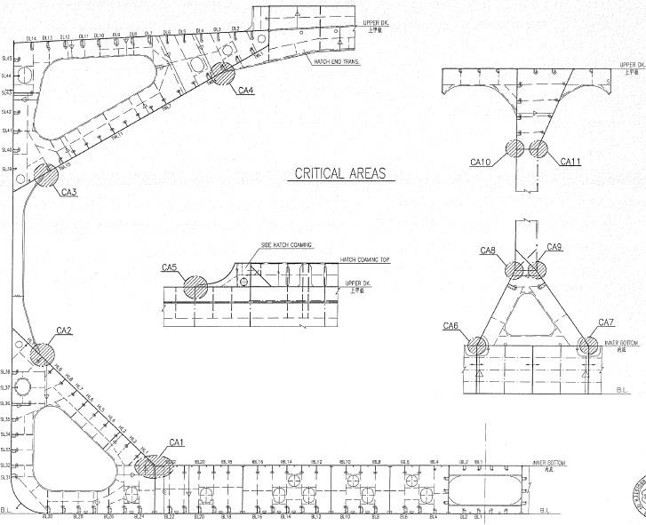
- **(2)** Ore Carrier

  | **1. Critical Web Section** |
  | --- |
  | 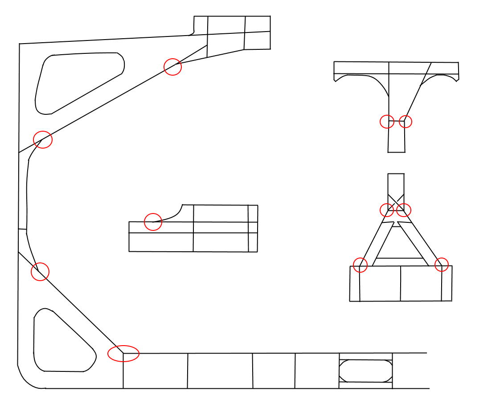 |
  | **2. Stringer** |
  |  |

  | **3. Hatch Coming, Upper Stool and Lower Stool** |
  | --- |
  |  |
  | **4. Typical Girder Elevation** |
  |  |

  | (3-1) Oil Tanker/Chemical Tanker | (3-2) Very Large Crude Oil Carrier(VLCC) |
  | --- | --- |
  | 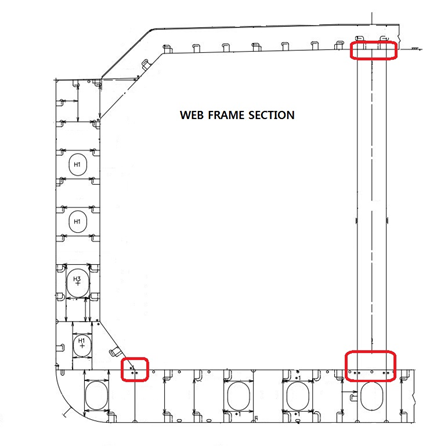 | 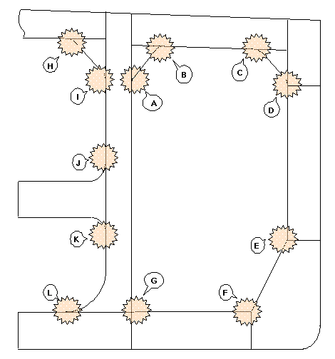 |
  | (4) Liquefied Gas Carrier |   |
  | 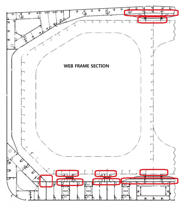 |   |

  **(5) Ro-Ro Ship**

  | **1. Typical Web Section** |   |
  | --- | --- |
  |  |   |
  | **2. Side Girder Elevation** | **3. Web Section in Engine Room Area** |
  |  |  |

  **(6) Container Ship**

  | **1. Hatch Coaming** |   |
  | --- | --- |
  | Continuous both side welding area of extremely thick steel plates | 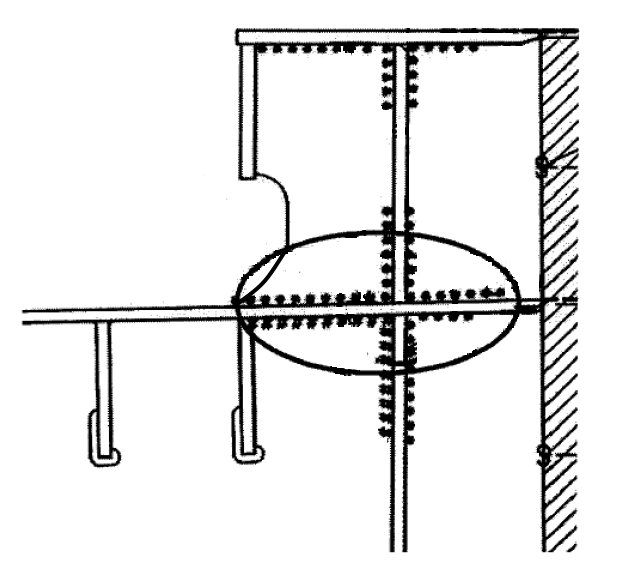 |
  | Hatch Coaming Extension Bracket Area | 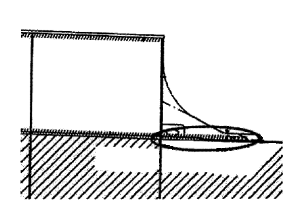 |
  | Hatch Coaming Drain Hole | 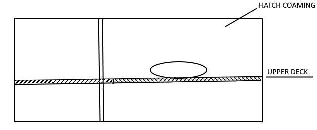 |

  **2. Trans Web Section**

  | Joint between Inner Bottom and Hopper or Joint between Longi. BHD and Bench Deck | 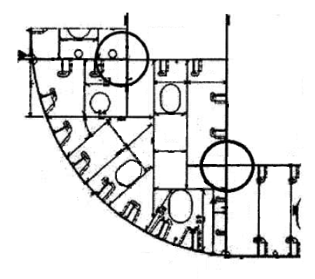 |
  | --- | --- |
  | Web Reinforcement Bracket Behind Bench Structure | 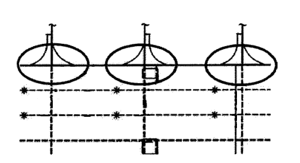 |
  | **3. Bracket + Bulkhead** |   |
  | Bracket provided between Longi. BHD and Transverse BHD | 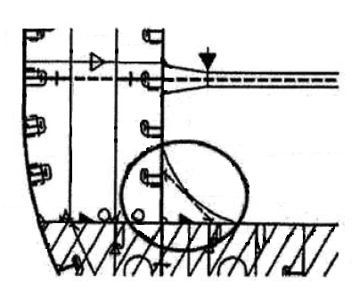 |
  | Bracket provided between Longi. BHD and Transverse BHD | 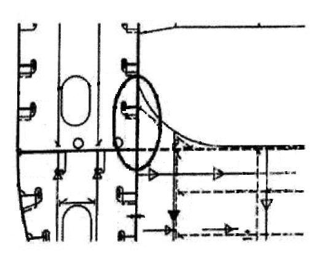 |

  **4. Double Bottom Girder & Vertical Web (W. T. BHD)**

  | Double Bottom Girder + Vertical Web (W. T. BHD) | 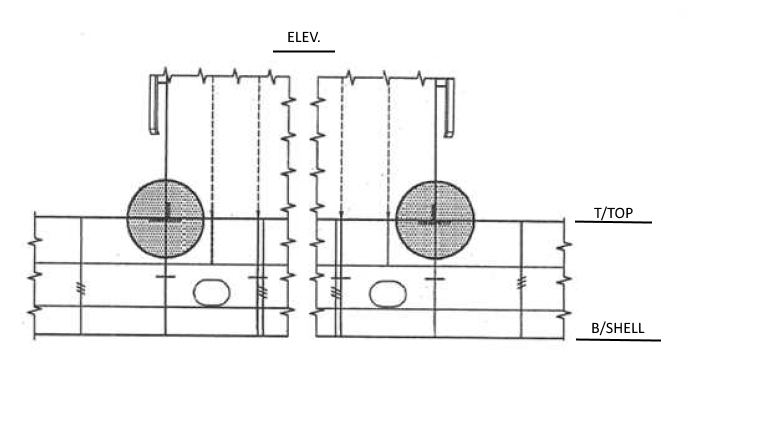 |
  | --- | --- |
  | **5. W. T. BHD + Double Bottom Floor** |   |
  | Support Bulkhead | 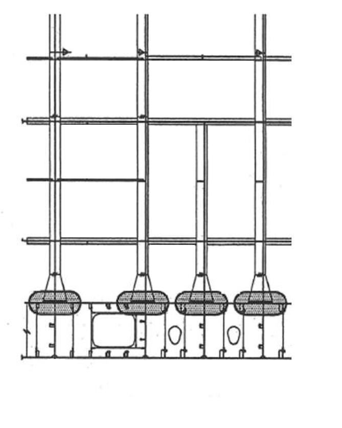 |

  **6. Upper Deck + Hatch End Coaming (Cargo Hatch Corners)**

  | Cargo Hatch Corners |  |
  | --- | --- |
  | **7. Upper Deck + Cross Deck** |   |
  | Upper Deck + Cross Deck |  |
  | **8. Side shell Longitudinal + Transverse Web** |   |
  | Side Shell Longitudinal + Transverse Web |  |

  

  |   | **Appendix 1-12-5 Recommendatory Sample - Cable Transit Seal System Register** ***(2021)*** |   |   |   |   |   |   |   |   |   |   |   |   |   |   |   |
  | --- | --- | --- | --- | --- | --- | --- | --- | --- | --- | --- | --- | --- | --- | --- | --- | --- |
  |   | **Appendix 1-12-5 Recommendatory Sample - Cable Transit Seal System Register** ***(2021)*** |   |   |   |   |   |   |   |   |   |   |   |   |   |   |   |
  |   |   |   |   |   |   |   |   |   |   |   |   |   |   |   |   |   |
  |   |   |   |   |   |   |   |   |   |   |   |   |   |   |   |   |   |
  |   | **Name of Ship:** | Sample |   |   |   |   |   |   |   |   |   |   |   |   |   |   |
  |   | **IMO No:** | 12345 |   |   |   |   |   |   |   |   |   |   |   |   |   |   |
  |   | **Place:** | Hamburg |   |   |   |   |   |   |   |   |   |   |   |   |   |   |
  |   | **Date:** | XX/XX/2017 |   |   |   |   |   |   |   |   |   |   |   |   |   |   |
  |   |   |   |   |   |   |   |   |   |   |   |   |   |   |   |   |   |
  |   | **Inspected by:** | Smith |   |   |   |   |   |   |   |   |   |   |   |   |   |   |
  |   |   |   |   |   |   | Transits | 4 |   |   |   |   |   |   |   |   |   |
  |   |   |   |   | Total Openings |   |   | 4 |   |   |   |   |   |   |   |   |   |
  | TRANSIT |   |   | Inspected side |   | BRAND | FRAME |   | Type Approved | CONDITION(G,F,P) | INSPECTED | REPAIRED | MODIFIED | MAINTAINED | 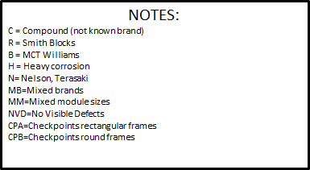 | Checked by | DATE |
  | Drawing number | ID | Location |   |   | BRAND | Type | Opening number | Type Approved | CONDITION(G,F,P) | INSPECTED | REPAIRED | MODIFIED | MAINTAINED |   | Checked by | DATE |
  |   |   |   | F | B |   |   |   |   |   |   |   |   |   |   |   |   |
  | GIA-07-1047-000-883 | TT-MCT-011 |   |   |   | C | d= 50 | x |   |   |   |   |   |   | NVD | PTO | 2015-02-26 |
  | GIA-07-1047-000-883 | TT-MCT-012 |   |   |   | C | 450x200 | x |   |   |   |   |   |   | NVD | PTO | 2015-02-26 |
  | GIA-07-1047-000-883 | TT-MCT-013 |   |   |   | C | 550x200 | x |   |   |   |   |   |   | NVD | PTO | 2015-02-26 |
  | GIA-07-1047-000-883 | TT-MCT-014 |   |   |   | C | 750x200 | x |   |   |   |   |   |   | Open, drilled hole not closed | PTO | 2015-02-26 |
  |   |   |   |   |   |   |   |   |   |   |   |   |   |   |   |   |   |
  |   |   |   |   |   |   |   |   |   |   |   |   |   |   |   |   |   |
