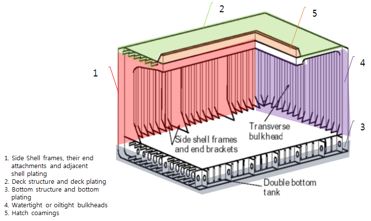
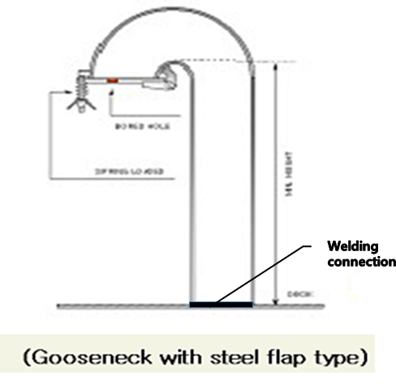
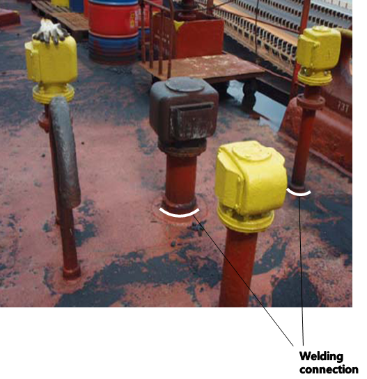
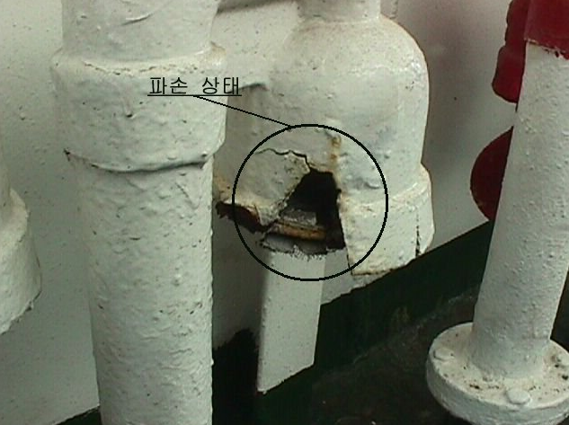
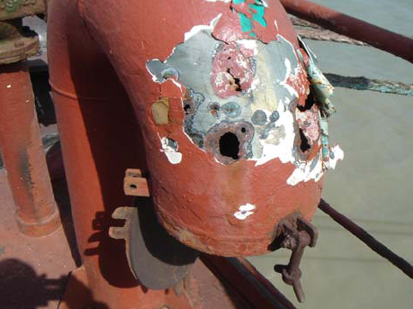
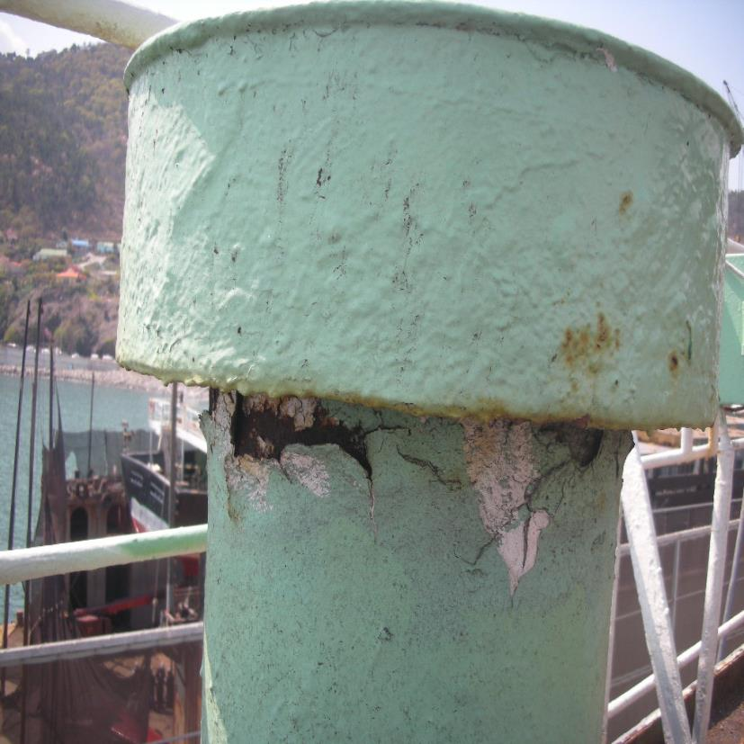
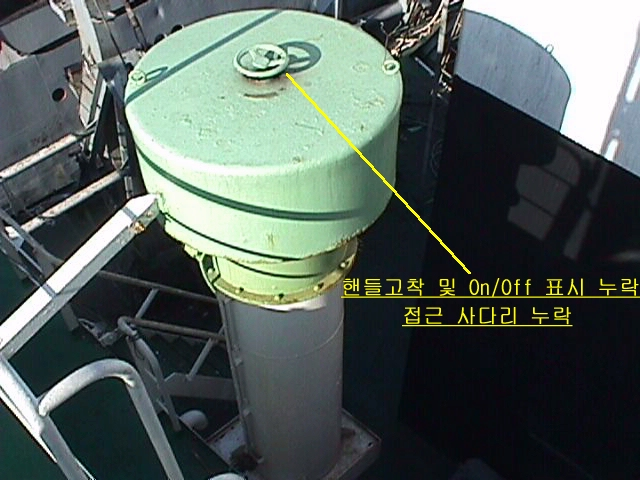
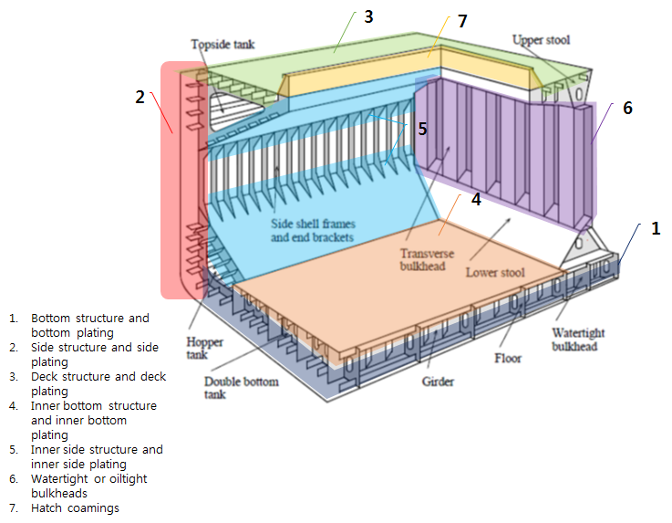
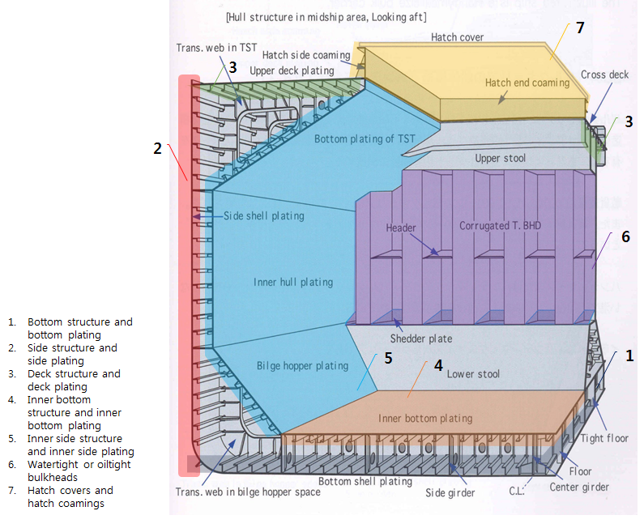
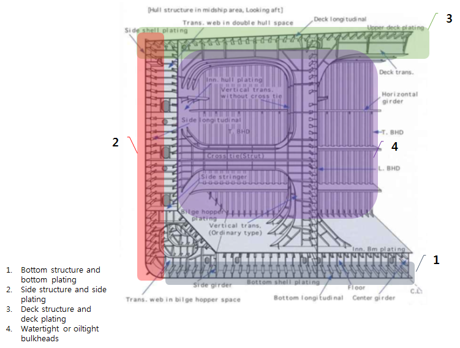

# PART 1 Classification and Surveys

> RULES FOR CLASSIFICATION OF STEEL SHIPS / RA-01-E / 2025 / EN / Guidance

## Annex 1-18 In case of promptly and thoroughly repaired, Areas to be considered (2019)

### 1. In case of promptly and thoroughly repaired specified in Ch 2, 107. 2 of the Rules, examples of areas to be considered for General Ship, Bulk Carrier, Double Skin Bulk Carrier and Double Hull Oil Tanker are as follows

#### (1) General Ship

|  |  |
| --- | --- |
| 6. Examination of the weld connection between air pipes and deck plating (**Ch 2, 202. 1** (1) (f) of the Rules) |   |

|  |  |
| --- | --- |
| 7. External examination of all air pipe heads installed on the exposed decks (**Ch 2, 202. 1** (1) (g) of the Rules) |   |

|  |  |
| --- | --- |
| 8. Examining the ventilators and air pipes, including their coamings and closing appliances (**Ch 2, 202. 1** (6) of the Rules) |   |

#### (2) Bulk Carrier

#### (3) Double Skin Bulk Carrier

#### (4) Double Hull Oil Tanker

| **Rules for the Classification of Steel Ships** **Guidance Relating to the Rules for the Classification of Steel Ships** |
| --- |
| **PART 1 CLASSIFICATION AND SURVEYS** Published by **KR** 36, Myeongji ocean city 9-ro, Gangseo-gu, BUSAN, KOREA TEL : +82 70 8799 7114 FAX : +82 70 8799 8999 Website : http://www.krs.co.kr |
|   |

| CopyrightⒸ 2025, **KR** Reproduction of this Rules and Guidance in whole or in parts is prohibited without permission of the publisher. |
| --- |
