# PART 2 Materials and Welding

> RULES FOR CLASSIFICATION OF STEEL SHIPS / RA-02-E / 2025 / EN / Rules

## CHAPTER 1 MATERIALS

### Section 1 General

#### 101. Application 【See Guidance】

- **1.** The requirements in this Chapter apply to the materials intended to be used for the components specified in each Part of hull construction, equipment and machinery.
- **2.** The materials other than those prescribed in this Chapter may be used where specially approved in connection with the design. In such cases, the detailed data relating to the chemical compositions and mechanical properties, etc. of the materials are to be submitted for approval.
- **3.** Reinforced plastic materials used for construction or repair of FRP ships or composite vessel should be in accordance with the Guidance relating to the Rules specified by the Society. *(2017)*

#### 102. Approval of manufacturing process and manufacturing control

- **1.** **Approval of manufacturing process**
  - **(1)** The materials prescribed in this Chapter, unless otherwise specially provided, are to be manufactured by open-hearth, electric furnace, basic oxygen processes, or other processes at works approved by the Society. In this case, the manufacturer is to obtain the approval in accordance with the Guidance specially specified by the Society in advance concerning the process of manufacture (melting process, ingot casting, rolling, casting, forging and heat treating).
  - **(2)** The manufacturing process of semi-finished products such as ingots, slabs, blooms and billets for the normal and higher strength hull structural steels or forgings are to be approved in accordance with the Guidance specially specified by the Society in advance
  - **(3)** The rolled steel manufacturer supplied semi-finished products from other steel works or hot coil processor is required to obtain the approval of the manufacturing process according to the requirement of proceeding (1) as appropriate.
  - **(4)** The requirements specified in Pars (1) and (2) may be applied to the non-ferrous material prescribed in this Chapter.
- **2.** **Manufacturing control**
  - **(1)** It is the manufacturer's responsibility to assure that effective process and production controls in operation are adhered to within the manufacturing specifications.
  - **(2)** Where control imperfection inducing possible inferior quality of product occurs, the manufacturer is to identify the cause and establish a countermeasure to prevent its recurrence. Also, the complete investigation report is to be submitted to the Surveyor. **【See Guidance】**
  - **(3)** For further use, each product affected by previous (2) is to be tested to the Surveyor's satisfaction. The frequency of testing for subsequent products offered may be increased to gain confidence in the quality at the discretion of the Society. **【See Guidance】**
  - **(4)** When steel is not produced at the works at which it is rolled, a certificate is to be supplied to the Surveyor at the rolling mill stating the process by which it was manufactured, the name of the manufacturer who supplied it, the number of the cast from which it was made and the ladle analysis. The Surveyor is to have access to the works at which the steel was produced.

#### 103. Chemical composition

- **1.** The chemical composition of samples taken from each ladle of each cast is to be determined by the manufacturer in an adequately equipped and competently staffed laboratory and is to comply with the appropriate requirements for chemical composition provided in this Chapter. **【See Guidance】**
- **2.** The Manufacturer’s declared analysis will be accepted subject to occasional checks if required by the Surveyor. **【See Guidance】**
- **3.** Product analysis may be required where the final product chemistry is not well represented by the analysis from the cast. **【See Guidance】**

#### 104. Testing and inspection

- **1.** The materials are to be tested and inspected in the presence of the Society‘s Surveyor except otherwise specially provided, and are to comply with the requirements in this Chapter.
- **2.** The materials other than those prescribed in this Chapter are to be tested and inspected according to the specification for the testing approved in accordance with the requirements in **101. 2.**
- **3.** The Society may accept to omit the tests for materials having the appropriate certificates.
- **4.** Where the materials are manufactured by the approval of quality assurance scheme specially specified by the Society, a part or all of test and inspection in the presence of the Society's Surveyor may be omitted. **【See Guidance】**

#### 105. Execution of testing and inspection

- **1.** The manufacturers shall afford the Surveyor all necessary facilities and access to all relevant parts of the works to enable him to verify that the approved process is adhered to, for the selection of test materials, and the witnessing of tests, as required by the Rules, and for verifying the accuracy of the testing equipment.
- **2.** All tests and inspections are to be carried out at the place of manufacture before dispatch. The test specimens and procedures are to be in accordance with **Sec 2** of this chapter. All the test specimens are to be selected and stamped by the Surveyor and tested in his presence, unless otherwise agreed.
- **3.** In the case of special order, the manufacturer is to show the order specifications, special requirements, etc. of the materials to the Surveyor prior to the material test.
- **4.** Surface inspection and verification of dimensions are the responsibility of the steel maker. The acceptance by the Surveyor shall not absolve the steel maker from this responsibility.

#### 106. Identification of materials

- **1.** The manufacturer is to take a suitable measure for the identification of ingots, slabs, castings, forgings, and finished pieces, etc. which will enable the material to be traced to its original heat, roll, etc.
- **2.** The steelmaker is to adopt a system for the identification of ingots, slabs and finished pieces which will enable the material to be traced to its original cast. The Surveyor is to be given full facilities for so tracing the material when required.
- **3.** Where small products such as castings are manufactured in large numbers, modified arrangements for identification may be specially agreed with the Society.

#### 107. Test certificates (2017) 【See Guidance】

- **1.** The Certificate for Materials Inspection is to be issued to the materials by the Society that have been satisfactorily tested and inspected in accordance with the requirements in this Chapter.
- **2.** Notwithstanding the previous provisions, the accepted material with large quantity production such as rolled steels, etc. may be omitted the issue of the Certificate for Materials Inspection where the manufacturer supplies the Mill Sheets for each accepted steel grade to the Surveyor for his signature. In this case, the manufacturer is to enter the following statement on the certificate to show that the steel material has been made by an approval process and that it has withstand satisfactory the required tests. The following form of declaration will be accepted if stamped or printed on each test certificate with the name of the steel works in English or Korean, and is to be signed by the personnel of the manufacturing shop in charge of product quality assurance or inspector.
  "We hereby certify that the material has been made by an approval process and has been satisfactorily tested in accordance with the Rules of Korean Register.”
- **3.** The Certificate for Materials Inspection issued by manufacturer is to contain at least the following particulars;
  - **(1)** Sheet(Certificate) number
  - **(2)** Purchaser‘s name
  - **(3)** purchaser's order number
  - **(4)** If known the hull number for which the material is intended.
  - **(5)** Identification of the steelworks.
  - **(6)** Material grade mark
  - **(7)** Dimension of products and drawing number
  - **(8)** Identification number for tracing piece to heat(cast)
  - **(9)** Chemical composition (All required elements with residual and intentionally added elements))
  - **(10)** Mechanical properties test results, including traceable test identification
  - **(11)** Condition of heat treatment, if applicable
  - **(12)** Other specific requirements
- **4.** The manufacturer is to keep the test certificates more than 10 years from the supply date of products for identification and handling. *(2019)*

#### 108. Quality and repair of defects

- **1.** All materials are to be free from surface or internal defects which would be prejudicial to their proper application in service. The surface finish is to be in accordance with good practice and any specific requirements of the approved plan.
- **2.** In the event of any material proving unsatisfactory during subsequent working or fabrication, such material may be rejected, notwithstanding any previous satisfactory testing and/or certification where the Surveyor considers necessary.
- **3.** Welding or other means for the purpose of repairing defects is not permitted, unless the extent and method of repair (including welding procedure and heat treatment) are approved by the Surveyor. The repair of defects is to be carried out in the presence of the Surveyor, unless otherwise agreed.
- **4.** Where repair by grinding is carried out then the remaining plate thickness below the ground area must be within the allowable under thickness tolerance.

#### 109. Retest procedures

- **1.** Where a part of the results of any test except impact test does not comply with the requirements, but the remainders are satisfactory, additional test specimens twice in number may be taken from the same material and retests for the failed test may be carried out. In such a case, all of the test specimens are to comply with the requirements.
- **2.** **Impact test**
  - **(1)** Where the result of the impact test is unsatisfactory, additional tests may be carried out, with the exception of the cases specified in (i) and (ii) below, by taking a set of test specimens out of the same piece from which the above-mentioned test specimens have been taken.
  - **(2)** In case of the previous (1), all pieces of the same lot from which the test specimens have been taken, may be accepted, provided that the average absorbed energy of the six test specimens, including those which have been rejected as unsatisfactory, is not less than the required average absorbed energy, and that not more than two individual results are lower than the required average absorbed energy and of these, not more than one result is below 70 % of the required average absorbed energy.
- **3.** If a heat treated material fails to meet the requirements in any test, retest and heat treatment may be allowed two times(three times including the first test) with the same number of specimens as the initial test. In this case, however, the material is not to be considered as having complied with the requirements, unless all tests fully comply with the test requirements. *(2018)*
- **4.** If the percentage of elongation of any tension test specimen is less than that specified and any part of fracture is outside the one-fourth of the gauge length from the centre of gauge length, the test is to be considered as invalid, and a retest for the material from which the first test specimen has been taken may be allowed. **【See Guidance】**

#### 110. Marking

- **1.** Every material complying with the requirements is to be clearly stamped with the Society's brand 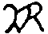 and material grade mark, and marked with the following particulars at least in one position by the maker:
  - **(1)** Name or mark to identify the steel works.
  - **(2)** Number or mark to identify the material.
  - **(3)** Name or mark to identify the purchaser. (if required by the purchaser)
- **2.** Materials which have been specially approved by the Society in accordance with the requirements in **101. 2** are to have the letter "S" after the material grade mark.
- **3.** Materials which are unsuitable for stamping may be marked with brands, seals or by other suitable means.
- **4.** The marking particulars, but excluding the manufacturer's name or trade mark where this is embossed on finished products are to be encircled with paint or otherwise marked so as to be easily recognizable.
- **5.** Materials which can not be stamped and marked in accordance with the requirements in **Pars 1** and **2** due to small size may be properly marked in the lump.
- **6.** Where a number of light materials are securely fastened together in bundles the manufacturer may, subject to the agreement of the Society, brand only the top piece of each bundle, or alternatively, a firmly fastened durable label containing the brand may be attached to each bundle.
- **7.** In the event of any material bearing the Society's brand failing to comply with the test requirements, the brand is to be unmistakably defaced by the manufacturer.

### Section 2 Test Specimens and Testing Procedures

#### 201. General

- **1.** **Application**
  - **(1)** Test specimens and mechanical testing procedures for materials are to comply with the requirements of this Section, unless otherwise specially provided in each Section.
  - **(2)** Where test specimens and testing procedures differing from those prescribed in this Section are used, they are to be approved by the Society. **【See Guidance】**
- **2.** **Testing machine**
  - **(1)** The testing machines used for the tests relative to this Chapter are to be managed by competent personnel on machines.
  - **(2)** Tension/compression testing machines are to be calibrated in accordance with *ISO 7500-1:2018* or other recognised standard. *(2023)* **【See Guidance】**
  - **(3)** Impact testing machines are to be calibrated in accordance with *ISO 148-2:2016* or other recognised standard. *(2023)* **【See Guidance】**
  - **(4)** The accuracy of tensile test machines is to be within ±1%
- **3.** **Selection of test specimens**
  - **(1)** The test specimens are to be selected according to each requirement in this Chapter.
  - **(2)** Except where otherwise specified or agreed with the Surveyor, test samples are not to be detached from the material until being stamped by the Surveyor. **【See Guidance】**
  - **(3)** If test samples are cut from material by flame cutting or shearing, a reasonable margin is required to enable sufficient material to be removed from the cut edges during final machining.
  - **(4)** The preparation of test specimens is to be done in such a manner that test specimens are not subjected to any significant cold working or heating.
  - **(5)** If any test specimen shows defective machining or defects having no relation to the substantial nature, it may be discarded and substituted by another test specimen.

#### 202. Form and dimension of test specimen

- **1.** **Tensile test specimen**
  - **(1)** Tensile test specimens are classified as standard test specimen and proportional test specimen as shown in **Table 2.1.1** depend on the shape and dimension of test specimen.

    **Table 2.1.1 Kinds of tensile test specimen**

    | Kind | Flat | Round | Pipe |
    | --- | --- | --- | --- |
    | Proportional | *R*14*B* | *R*14*A* | *R*14*B*, *R*14*C* |
    | Standard | *R*1*A*, *R*1*B*, *R*5, *R*13*B* | *R*4, *R*8*C*, *R*10 | - |
  - **(2)** Tensile test specimens are to be of the forms and sizes given in **Fig 2.1.1**. **【See Guidance】**
  - **(3)** The gauge length may be rounded off the nearest 5 mm, provided that the difference between this length and $L$ is less than 10 % of $L$.

    | Shapes | Kind | Type | Forms of specimen(1) | Size of specimen(2) | Materials to be applied |
    | --- | --- | --- | --- | --- | --- |
    | Flat(3) | Proportional | *R* 14*B* | 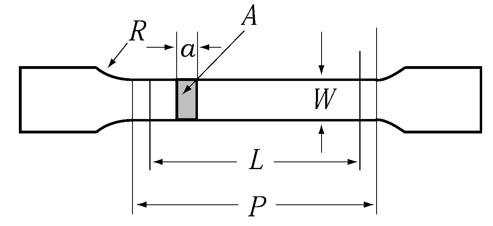 | $a$ = $t$ $W$ = 25 mm $L$ = $5.65 \sqrt {A}$(4) $P$ ≅ $L+2 \sqrt {A}$ $R$ = 25 mm | Rolled steels 3 mm thick or more |
    | Flat(3) | Standard | *R* 1*A* |   | $a$ = $t$ $W$ = 40 mm $L$ = 200 mm $P$ ≅ 220 mm $R$ = 25 mm | Rolled steel plates for boiler, Rolled steel plates for pressure vessel |
    | Flat(3) | Standard | *R* 1*B* |   | $a$ = $t$ $W$ = 25 mm $L$ = 200 mm $P$ ≅ 212.5 mm $R$ = 25 mm | Rolled steels 3 mm thick or more, |
    | Flat(3) | Standard | *R* 5 |   | $a$ = $t$ $W$ = 25 mm $L$ = 50 mm $P$ ≅ 60 mm $R$ = 15 mm | Rolled steel plates for pressure vessel, Aluminium alloy 12.5mm thick or less |
    | Flat(3) | Standard | *R* 13*B* |   | $a$ = $t$ $W$ = 12.5 mm $L$ = 50 mm $P$ ≅ 60 mm $R$ = 25 mm | Rolled steels less than 3 mm thick, Aluminium alloy 12.5mm thick or less |
    | Round | Proportional | *R* 14*A* | 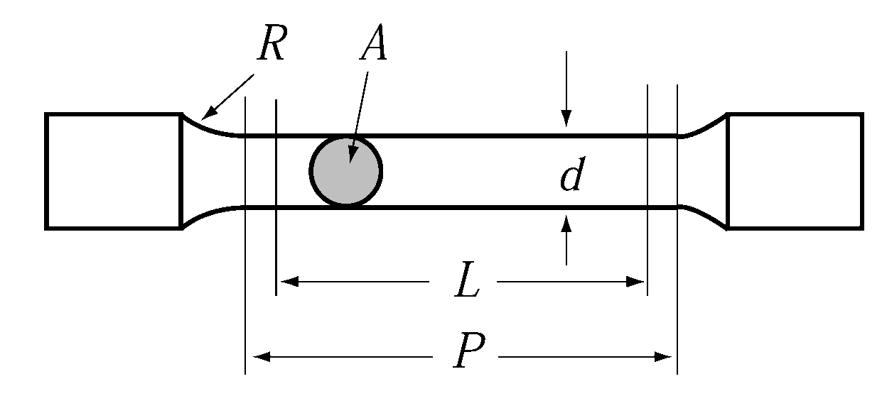 | $L$ = 5 $d$(5) $P$ ≅ $L+0.5d$ $R$ = 10 mm(6) | Rolled steels, Castings, Forgings, Spheroidal or nodular graphite iron castings, Copper alloy Aluminium alloy 12.5mm thick or more |
    | Round | Standard | *R* 4 |  | $d$ = 14 mm $L$ = 50 mm $P$ ≅ 60 mm $R$ = 15 mm | Rolled steel plates for pressure vessel, Aluminium alloy 12.5mm thick or less |
    | Round | Standard | *R* 10 |   | $d$ = 12.5 mm $L$ = 50 mm $P$ ≅ 60 mm $R$ = 15 mm | Rolled steel plates for boiler, Aluminium alloy 12.5mm thick or less |
    | Round | Standard | *R* 8*C* | 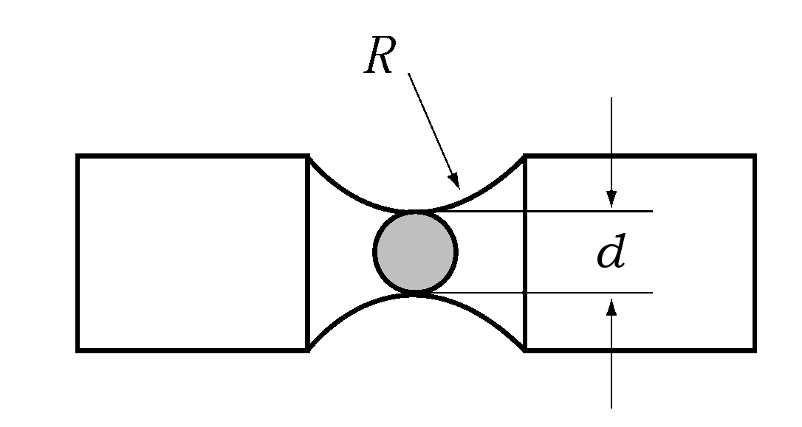 | $d$ = 20 mm $R$ = 25 mm | Grey iron castings |

    | Shapes | Kind | Type | Forms of specimen | Size of specimen | Materials to be applied |
    | --- | --- | --- | --- | --- | --- |
    | Pipe | Proportional | *R* 14*B* | 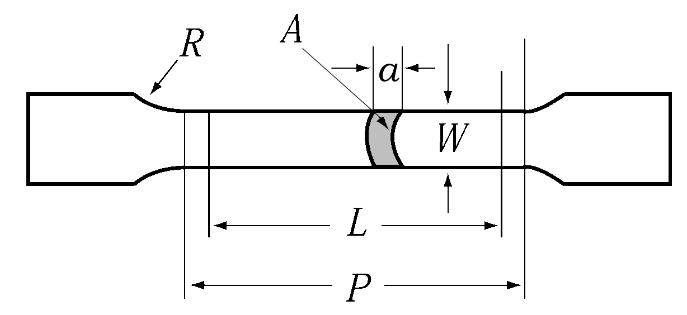 | $a$ = t $W$ ≥ 12 mm $L$ = $5.65 \sqrt {A}$ $P$ ≅ $L$ + 2$W$ $R$ = 25 mm | Steel tubes, copper and copper alloy pipes and tubes |
    | Pipe | Proportional | *R* 14*C* | 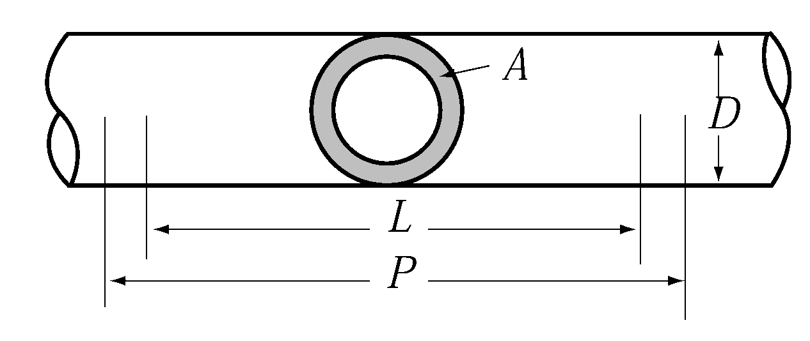 | $L$ = $5.65 \sqrt {A}$ $P$ ≅ $L$ + $0.5D$ $P$ is the distance between the grips | Steel tubes, copper and copper alloy pipes and tubes |
    | NOTES: (1) The notations used are defined as follows. $d$ : Diameter, $A$ : Cross section, $a$ : Thickness, $R$ : Transition radius, $W$ : Width $D$ : External tube diameter, $L$ : Gauge length, $t$ : Plate thickness, $P$ : Parallel test length (2) The both ends of the test specimens may be machined to such shapes as to fit the holder of the testing machine. (3) When the capacity of the available testing machine is insufficient to allow the use of test specimen of full thickness, this may be reduced by machining one of the rolled surfaces. (4) Gauge length $L$ should preferably be greater than 20 mm. (5) d ≥ 10 mm to 20 mm, preferably 14 mm (6) For nodular cast iron and materials with a specified elongation less than 10%, R ≥ 1,5 |   |   |   |   |   |
  - **(4)** The manufacturers may use the test specimens approved by the Society, besides those specified in (2). In this case, the elongation measured at the tensile tests is to be corrected by the following formula **【See Guidance】**:
    $n=a ․E ․ \left( \frac{\sqrt {A}}{L} \right) ^{b}$
    where:
    $E$ = equivalent elongation for the proportional test specimens specified in (1) (%).
    $n$ = actual measured elongation of test specimen (%).
    $A$ = actual cross-sectional area of test specimen ($\mathrm{mm} ^{2}$).
    $L$ = actual gauge length of test specimen (mm).
    $a$, $b$ = constants given in bellow in accordance with the kind of materials.

    | Constant Material | $a$ | $b$ |
    | --- | --- | --- |
    | Material 1 | 2.0 | 0.40 |
    | Material 2 | 2.6 | 0.55 |
    | NOTES: 1. Material 1 : For carbon and low alloy steels with a tensile strength not exceeding 590 $\mathrm{N}/mm ^{2}$ in the hot rolled, annealed, normalized or normalized and tempered conditions. 2. Material 2 : For carbon and low alloy steels in the quenched and tempered condition. 3. The values of a and b for other kinds of materials than Material 1 and Material 2 are to be as deemed appropriate by the Society. |   |   |
  - **(5)** The machine-finished parallel part of test specimens is to be uniform throughout the entire length and the permissible variation (difference between the maximum and minimum values) is to be as specified in **Table 2.1.2**.

    **Table 2.1.2 Permissible Variation (unit : mm)**

    | Round specimen |   | Flat specimen with thickness equal to or greater than 6 mm |   |   |   | Flat specimen with thickness less than 6 mm |   |   |   |
    | --- | --- | --- | --- | --- | --- | --- | --- | --- | --- |
    | Nominal diameter (d) | Permissible variation | Nominal Thickness (t) | permissible variation | Nominal width (w) | permissible variation | Nominal Thickness (t) | permissible variation | Nominal width (w) | permissible variation |
    | 10≤d<12 | 0.025 | 6≤t<12 | 0.02 | 25≤w<40 | 0.05 | 0.6≤t<1.2 | 0.002 | 12.5≤w<25 | 0.02 |
    | 12≤d<16 | 0.03 | 12≤t<20 | 0.04 | 40≤w | 0.10 | 1.2≤t<2.5 | 0.004 | 25≤w | 0.04 |
    | 16≤d | 0.04 | 20≤t | 0.05 |   |   | 2.5≤t<6 | 0.01 |   |   |
- **2.** **Bend test specimen**
  Bend test specimens are to be of size and dimensions given in **Fig 2.1.2** according to the kind of materials.
  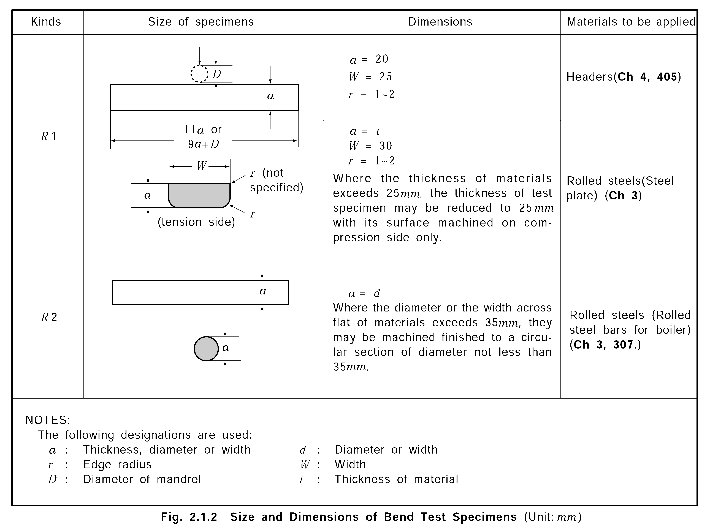
  **Fig 2.1.2 Size and Dimensions of Bend Test Specimens** (Unit : mm)
- **3.** **Impact test specimen**
  - **(1)** Impact test specimens are to be provided in a set of three specimens, and the test specimens are to be machine finished to the forms and dimensions given in **Fig 2.1.3** and **Table 2.1.3** unless the section thickness of the product is less than 12 mm
  - **(2)** The notch is to be cut in a face of the test specimen which was originally perpendicular to the rolled surface, casting surface and forging surface according to the kind of materials. The position of the notch is not to be nearer than 25 mm to a flame cut or sheared edge.
    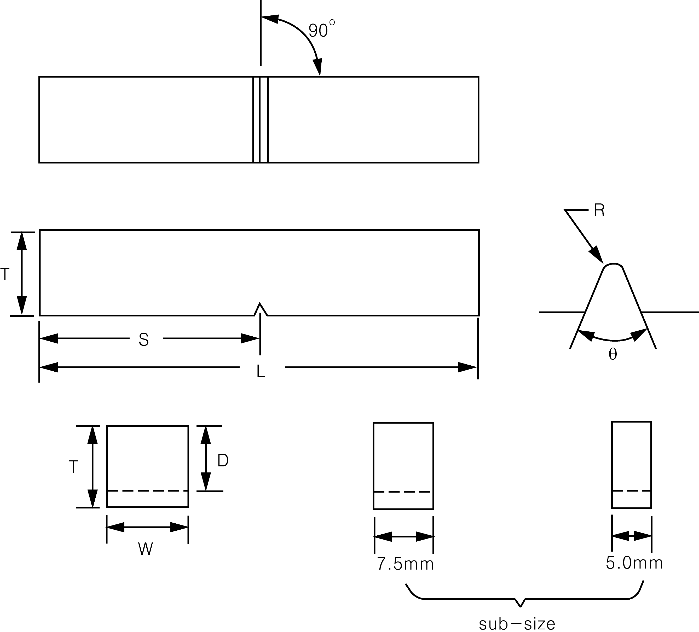
    **Fig 2.1.3 Impact test specimen**

    **Table 2.1.3 Dimensions of impact Test Specimens**

    | Kinds Dimensions |   | Charpy V-notch test specimen |
    | --- | --- | --- |
    | Length (mm) | $L$ | 55 ± 0.6 |
    | Width (mm) | $W$ | 10 ± 0.11 |
    | Thickness (mm) | $T$ | 10 ± 0.06 |
    | Angle of notch (mm) | $\theta$ | 45 ± 2 |
    | Depth below notch (mm) | $D$ | 8 ± 0.06 |
    | Root radius of notch (mm) | $R$ | 0.25 ± 0.025 |
    | Distance of notch from end of test specimen (mm) | $S$ | 27.5 ± 0.42 |
    | Angle between plane of symmetry of notch and longitudinal axis of test specimen ($deg$) | - | 90 ± 2 |
  - **(3)** Where the impact test specimens, having the size specified in (1) above for rolled steels, tubes and pipes cannot be taken, the width W may be the sub-size values given in **Table 2.1.4.** In this case, the average absorbed energy of rolled steels, tubes and pipes is not to be less than the value(by counting fractions of 0.05 and over as 0.1 and disregarding the rest) multiplying the absorbed energy by values given in **Table 2.1.4** in accordance with the width of the test specimens. **【See Guidance】**

    **Table 2.1.4 Multiplier to Absorbed Energy**

    | Thickness and width of sub-size specimen t×W (mm) | Multiplier for absorbed energy |
    | --- | --- |
    | Thickness and width of sub-size specimen t×W (mm) | Average absorbed energy of 3 test specimens |
    | 10 × 5 ± 0.06 | 2/3 |
    | 10 × 7.5 ± 0.11 | 5/6 |
  - **(4)** Where the thickness of a test specimen is less than 6 mm, and where impact test specimen having the sub-size specified in **Table 2.1.4** cannot be taken in welded parts of tubes and pipes, the impact test may be omitted.
  - **(5)** In all cases, the largest size charpy specimens possible for the material thickness shall be machined. **【See Guidance】**
- **4.** **Confirmation for test specimen**
  The size and dimensions of test specimens are to be carefully inspected and verified by suitable means before testing.

#### 203. Testing procedure 【See Guidance】

- **1.** **Tensile test**
  - **(1)** When well-defined yield phenomena exists, the value of yield strength(yield stress) is to be measured at the first peak obtained during yielding. When no well defined yield phenomenon exists, the 0.2 % proof stress (*Rp*0.2) is to be determined. For austenitic and duplex stainless steel products, the 1 % proof stress (*Rp*1) may be determined in addition to *Rp*0.2 as approved by the Society.
  - **(2)** Where the value of yield point or yield stress is measured at tensile test, the rate of loading shall be as following.

    | Modulus of Elasticity of the material (*E*) ($\mathrm{N}/mm ^{2}$) | Rate of stressing ($\mathrm{N}/mm ^{2} /\sec$) |   |
    | --- | --- | --- |
    | Modulus of Elasticity of the material (*E*) ($\mathrm{N}/mm ^{2}$) | Min. | Max. |
    | ＜150,000 | 2 | 20 |
    | ≥150,000 | 6 | 60 |
  - **(3)** After reaching the yield or proof load, for ductile material the machine speed during the tensile test is not to exceed that corresponding to a strain rate of 0.008s^-1. For brittle materials, such as cast iron, the elastic stress rate is not to exceed 10N/mm^2 per second.
  - **(4)** The test shall be carried out at room temperature between 10 °C and 35 °C, unless otherwise specified. For laboratory environments outside the stated requirement, it is the responsibility of the testing laboratory to assess the impact on testing and/or calibration data produced with and for testing machines operated in such environments. When testing and calibration activities are performed outside the temperature limits of 10 °C and 35 °C, the temperature shall be recorded and reported. *(2025)*
- **2.** **Impact test**
  The impact test is to be conducted on a Charpy impact testing machine having a capacity not less than 150 *J* and a striking velocity between 4.5 and 6 m/sec, with the test specimens at temperature controlled within $±2$℃ of the specified temperature.

### Section 3 Rolled Steels

#### 301. Rolled steels for hull structural

- **1.** **Application**
  - **(1)** The requirements are to apply to hull structural rolled steels (hereinafter referred to as "steels") not exceeding 100 mm in thickness.
  - **(2)** These requirements also apply to normal and higher strength Corrosion Resistant Steels with all grades up to 50 mm in thickness for steel plates, wide flats, sections and bars when such steel is used as the alternative means of corrosion protection for cargo oil tanks as specified in the performance standard MSC.289 (87) of Regulation 3-11, Part A-1, Chapter II-1 of the SOLAS Convention (Corrosion protection of cargo oil tanks of crude oil tankers). Normal and higher strength Corrosion Resistant steels as defined within this requirements, are steels whose corrosion resistance performance in the bottom or top of the internal cargo oil tank is tested and approved to satisfy the requirements in MSC.289 (87) in addition to other relevant requirements for hull structural steel, structural strength and construction.
  - **(3)** It is not intended that such steels be used for corrosion resistant applications in other areas of a vessel that are outside of those specified in the performance standard MSC.289 (87) of Regulation 3-11, Part A-1, Chapter II-1 of the SOLAS Convention.
  - **(4)** Any requirement regarding steels over the thickness specified in **Table 2.1.5** is to be left to the discretion of the Society. **【See Guidance】**
  - **(5)** Where improved through thickness properties are specified for plates and wide flats with thickness of 15 mm and over, the tensile test of through thickness property specified in **310.** is to be carried out in addition to the requirements of **301.**
  - **(6)** Brittle crack arrest steels are to be met the additional brittle crack arrest requirements and properties defined in **312.**. *(2021)*
  - **(7)** Steels other than those specified in **301.** are to be in accordance with the requirements of **101. 2.**
- **2.** **Kinds**
  Steels are classified as specified in **Table 2.1.5.**

  **Table 2.1.5 Grades of Rolled Steels for hull**

  | Kinds |   | Grade | Thickness $t$ (mm) |
  | --- | --- | --- | --- |
  | Normal strength steel^(^1) | Plates(3) | *A*, *B*, *D*, *E* | $t$ ≤ 100 |
  | Normal strength steel^(^1) | Sections and bars | *A*, *B*, *D*, *E* | $t$ ≤ 50 |
  | Higher strength steels^(^2) | Plates^(^3) | *AH* 32, *DH* 32, *EH* 32, *FH* 32 *AH* 36, *DH* 36, *EH* 36, *FH* 36 *AH* 40, *DH* 40, *EH* 40, *FH* 40 | $t$ ≤ 100 |
  | Higher strength steels^(^2) | Sections and bars | *AH* 32, *DH* 32, *EH* 32, *FH* 32 *AH* 36, *DH* 36, *EH* 36, *FH* 36 *AH* 40, *DH* 40, *EH* 40, *FH* 40 | $t$ ≤ 50 |
  | NOTE: (1) Provision is made for four grades of normal strength steels based on the impact test requirements. (2) For higher strength steels, provision is made for three strength levels(315, 355 and 390 $\mathrm{N}/mm ^{2}$) each subdivided into four grades(ex. : *AH* 32, *DH* 32, *EH* 32 and *FH* 32) based on the impact test temperature. (3) Steel plates include flat bars not less than 600 mm in width. |   |   |   |
- **3.** **Manufacturing process**
  - **(1)** Unless otherwise approved, the reduction ratio is to be at least 3 to 1. *(2024)*
  - **(2)** The deoxidation practice and chemical composition of each grade are to comply with the requirements given in **Table 2.1.6.** For steel plates and wide flats over 50mm thick and When thermo-mechanical controlled processing (hereinafter referred to as "TMCP") is used as heat treatment, slight deviations in the chemical composition may be allowed as approved by the Society. **【See Guidance】**
- **4.** **Heat treatment**
  The heat treatment of each grade is to comply with the requirements given in **Table 2.1.8** and **Table 2.1.9**. **【See Guidance】**

  **Table 2.1.6 Deoxidation Practice and Chemical Composition** ***(2021)***

  | Kinds | Grade | Thickness, $t$(mm) | Deoxidation Practice | Chemical Composition ($\%$) (5) |   |   |   |   |   |   |   |   |   |   |   |   |   |
  | --- | --- | --- | --- | --- | --- | --- | --- | --- | --- | --- | --- | --- | --- | --- | --- | --- | --- |
  | Kinds | Grade | Thickness, $t$(mm) | Deoxidation Practice | *C* | *Si* | *Mn* | *P* | *S* | *Cu* | *Cr* | *Ni* | *Mo* | *Al(8)* | *Nb* | *V* | *Ti* | *N* |
  | Normal strength steels | *A* | $t$≤50 | Killed and Semi-killed(1) | 0.21 max. (3)(4) | 0.50 max. | 2.5×C min. (4) | 0.035 max. | 0.035 max. | - | - | - | - | - | - | - | - | - |
  | Normal strength steels | *A* | $t$>50 | Killed | 0.21 max. (3)(4) | 0.50 max. | 2.5×C min. (4) | 0.035 max. | 0.035 max. | - | - | - | - | - | - | - | - | - |
  | Normal strength steels | *B* | $t$≤50 | Killed and Semi-killed | 0.21 max. (4) | 0.35 max. | 0.8 min. (4)(6) | 0.035 max. | 0.035 max. | - | - | - | - | - | - | - | - | - |
  | Normal strength steels | *B* | $t$>50 | Killed | 0.21 max. (4) | 0.35 max. | 0.8 min. (4)(6) | 0.035 max. | 0.035 max. | - | - | - | - | - | - | - | - | - |
  | Normal strength steels | *D* | $t$≤25 | Killed | 0.21 max. (4) | 0.35 max. | 0.6 min. (4) | 0.035 max. | 0.035 max. | - | - | - | - | 0.015 min. (2)(9) | - | - | - | - |
  | Normal strength steels | *D* | $t$>25 | Fine grain treated(2) | 0.21 max. (4) | 0.35 max. | 0.6 min. (4) | 0.035 max. | 0.035 max. | - | - | - | - | 0.015 min. (2)(9) | - | - | - | - |
  | Normal strength steels | *E* | $t$≤100 | Killed and Fine grain treated | 0.18 max. (4) | 0.35 max. | 0.7 min. (4) | 0.035 max. | 0.035 max. | - | - | - | - | 0.015 min. (9) | - | - | - | - |
  | Higher strength steels (13) | *AH* 32 | $t$≤100 | Killed and Fine grain treated | 0.18 max. | 0.50 max. | 0.90~1.60 (7) | 0.035 max. | 0.035 max. | 0.35 max. | 0.20 max. | 0.40 max. | 0.08 max. | 0.015 min. (10) | 0.02~0.05 (10)(11) | 0.05~0.10 (10)(11) | 0.02 max. (11) | - |
  | Higher strength steels (13) | *DH* 32 | $t$≤100 | Killed and Fine grain treated | 0.18 max. | 0.50 max. | 0.90~1.60 (7) | 0.035 max. | 0.035 max. | 0.35 max. | 0.20 max. | 0.40 max. | 0.08 max. | 0.015 min. (10) | 0.02~0.05 (10)(11) | 0.05~0.10 (10)(11) | 0.02 max. (11) | - |
  | Higher strength steels (13) | *EH* 32 | $t$≤100 | Killed and Fine grain treated | 0.18 max. | 0.50 max. | 0.90~1.60 (7) | 0.035 max. | 0.035 max. | 0.35 max. | 0.20 max. | 0.40 max. | 0.08 max. | 0.015 min. (10) | 0.02~0.05 (10)(11) | 0.05~0.10 (10)(11) | 0.02 max. (11) | - |
  | Higher strength steels (13) | *AH* 36 | $t$≤100 | Killed and Fine grain treated | 0.18 max. | 0.50 max. | 0.90~1.60 (7) | 0.035 max. | 0.035 max. | 0.35 max. | 0.20 max. | 0.40 max. | 0.08 max. | 0.015 min. (10) | 0.02~0.05 (10)(11) | 0.05~0.10 (10)(11) | 0.02 max. (11) | - |
  | Higher strength steels (13) | *DH* 36 | $t$≤100 | Killed and Fine grain treated | 0.18 max. | 0.50 max. | 0.90~1.60 (7) | 0.035 max. | 0.035 max. | 0.35 max. | 0.20 max. | 0.40 max. | 0.08 max. | 0.015 min. (10) | 0.02~0.05 (10)(11) | 0.05~0.10 (10)(11) | 0.02 max. (11) | - |
  | Higher strength steels (13) | *EH* 36 | $t$≤100 | Killed and Fine grain treated | 0.18 max. | 0.50 max. | 0.90~1.60 (7) | 0.035 max. | 0.035 max. | 0.35 max. | 0.20 max. | 0.40 max. | 0.08 max. | 0.015 min. (10) | 0.02~0.05 (10)(11) | 0.05~0.10 (10)(11) | 0.02 max. (11) | - |
  | Higher strength steels (13) | *AH* 40 | $t$≤100 | Killed and Fine grain treated | 0.18 max. | 0.50 max. | 0.90~1.60 (7) | 0.035 max. | 0.035 max. | 0.35 max. | 0.20 max. | 0.40 max. | 0.08 max. | 0.015 min. (10) | 0.02~0.05 (10)(11) | 0.05~0.10 (10)(11) | 0.02 max. (11) | - |
  | Higher strength steels (13) | *DH* 40 | $t$≤100 | Killed and Fine grain treated | 0.18 max. | 0.50 max. | 0.90~1.60 (7) | 0.035 max. | 0.035 max. | 0.35 max. | 0.20 max. | 0.40 max. | 0.08 max. | 0.015 min. (10) | 0.02~0.05 (10)(11) | 0.05~0.10 (10)(11) | 0.02 max. (11) | - |
  | Higher strength steels (13) | *EH* 40 | $t$≤100 | Killed and Fine grain treated | 0.18 max. | 0.50 max. | 0.90~1.60 (7) | 0.035 max. | 0.035 max. | 0.35 max. | 0.20 max. | 0.40 max. | 0.08 max. | 0.015 min. (10) | 0.02~0.05 (10)(11) | 0.05~0.10 (10)(11) | 0.02 max. (11) | - |
  | Higher strength steels (13) | *FH* 32 | $t$≤100 | Killed and Fine grain treated | 0.16 max. | 0.50 max. | 0.90~1.60 | 0.025 max. | 0.025 max. | 0.35 max. | 0.20 max. | 0.80 max. | 0.08 max. | 0.015 min. (10) | 0.02~0.05 (10)(11) | 0.05~0.10 (10)(11) | 0.02 max. (11) | 0.009 max. (12) |
  | Higher strength steels (13) | *FH* 36 | $t$≤100 | Killed and Fine grain treated | 0.16 max. | 0.50 max. | 0.90~1.60 | 0.025 max. | 0.025 max. | 0.35 max. | 0.20 max. | 0.80 max. | 0.08 max. | 0.015 min. (10) | 0.02~0.05 (10)(11) | 0.05~0.10 (10)(11) | 0.02 max. (11) | 0.009 max. (12) |
  | Higher strength steels (13) | *FH* 40 | $t$≤100 | Killed and Fine grain treated | 0.16 max. | 0.50 max. | 0.90~1.60 | 0.025 max. | 0.025 max. | 0.35 max. | 0.20 max. | 0.80 max. | 0.08 max. | 0.015 min. (10) | 0.02~0.05 (10)(11) | 0.05~0.10 (10)(11) | 0.02 max. (11) | 0.009 max. (12) |
  | NOTES: (1) For sections up to 12.5 mm in thickness inclusive, subject to a special approval by the Society, rimmed steel may be accepted. (2) For steels above 25 mm in thickness, aluminium treatment is to be used as a fully killed, fine grain practice. However, killed steel up to 50 mm in thickness may be accepted at the discretion of the Society. (3) For steel sections, maximum carbon content may be increased to 0.23 %. (4) The value of C + Mn/6 is not to exceed 0.40 %. (5) Where additions of any other element have been made as part of the steelmaking practice, the content is to be indicated on the test certificate. (6) When an impact test as killed steels is conducted, the minimum manganese content may be reduced to 0.60 %. (7) For steels up to 12.5 mm in thickness inclusive, the minimum manganese content may be reduced to 0.70 %. (8) Aluminium content is to be represented by the acid soluble aluminium content, but may be determined by the total aluminium content. In such a case, the total aluminium content is not to be less than 0.020 %. (9) Upon the approval by the Society, grain refining elements other than aluminium may be used. (10) The steel is to contain aluminium, niobium, vanadium or other suitable grain refining elements, either singly or in any combination. When used singly, the steel is to contain the specified minimum content of the grain refining element. When used in combination, the specified minimum content of each element is not applicable. (11) The total niobium, vanadium and titanium content is to be less than 0.12 %. (12) If Aluminium is present, the maximum content of nitrogen may be increased to 0.012 %. (13) For TMCP steels, carbon equivalent values(Ceq) and/or cold cracking susceptibility(*Pcm*) of each steel is to be left to the discretion of the Society. **【See Guidance】** |   |   |   |   |   |   |   |   |   |   |   |   |   |   |   |   |   |

  **Table 2.1.7 Mechanical Properties** ***(2021)***

  | Grade | Tensile test |   |   | Impact test |   |   |   |   |   |   |
  | --- | --- | --- | --- | --- | --- | --- | --- | --- | --- | --- |
  | Grade | Yield strength ($\mathrm{N}/mm ^{2}$) | Tensile strength ($\mathrm{N}/mm ^{2}$) | Elongation^(^6) ($L=5.65 \sqrt {A}$) (%) | test temp (℃) | Average absorbed energy (1)(J) |   |   |   |   |   |
  | Grade | Yield strength ($\mathrm{N}/mm ^{2}$) | Tensile strength ($\mathrm{N}/mm ^{2}$) | Elongation^(^6) ($L=5.65 \sqrt {A}$) (%) | test temp (℃) | Thickness, $t$ (mm) |   |   |   |   |   |
  | Grade | Yield strength ($\mathrm{N}/mm ^{2}$) | Tensile strength ($\mathrm{N}/mm ^{2}$) | Elongation^(^6) ($L=5.65 \sqrt {A}$) (%) | test temp (℃) | $t$ ≤ 50 |   | 50 < $t$ ≤ 70 |   | 70 < $t$ ≤ 100 |   |
  | Grade | Yield strength ($\mathrm{N}/mm ^{2}$) | Tensile strength ($\mathrm{N}/mm ^{2}$) | Elongation^(^6) ($L=5.65 \sqrt {A}$) (%) | test temp (℃) | *L*^(^2) | *T*^(^2) | *L*^(^2) | *T*^(^2) | *L*^(^2) | *T*^(^2) |
  | *A* | 235 min. | 400~520(3) | 22 min. | +20 | - | - | (4) | (4) | (4) | (4) |
  | *B* | 235 min. | 400~520(3) | 22 min. | 0^(^5) | 27 min. | 20 min. | 34 min. | 24 min. | 41 min. | 27 min. |
  | *D* | 235 min. | 400~520(3) | 22 min. | -20 | 27 min. | 20 min. | 34 min. | 24 min. | 41 min. | 27 min. |
  | *E* | 235 min. | 400~520(3) | 22 min. | -40 | 27 min. | 20 min. | 34 min. | 24 min. | 41 min. | 27 min. |
  | *AH* 32 | 315 min. | 440~570 | 22 min. | 0 | 31 min. | 22 min. | 38 min. | 26 min. | 46 min. | 31 min. |
  | *DH* 32 | 315 min. | 440~570 | 22 min. | -20 | 31 min. | 22 min. | 38 min. | 26 min. | 46 min. | 31 min. |
  | *EH* 32 | 315 min. | 440~570 | 22 min. | -40 | 31 min. | 22 min. | 38 min. | 26 min. | 46 min. | 31 min. |
  | *FH* 32 | 315 min. | 440~570 | 22 min. | -60 | 31 min. | 22 min. | 38 min. | 26 min. | 46 min. | 31 min. |
  | *AH* 36 | 355 min. | 490~630 | 21 min. | 0 | 34 min. | 24 min. | 41 min. | 27 min. | 50 min. | 34 min. |
  | *DH* 36 | 355 min. | 490~630 | 21 min. | -20 | 34 min. | 24 min. | 41 min. | 27 min. | 50 min. | 34 min. |
  | *EH* 36 | 355 min. | 490~630 | 21 min. | -40 | 34 min. | 24 min. | 41 min. | 27 min. | 50 min. | 34 min. |
  | *FH* 36 | 355 min. | 490~630 | 21 min. | -60 | 34 min. | 24 min. | 41 min. | 27 min. | 50 min. | 34 min. |
  | *AH* 40 | 390 min. | 510~660 | 20 min. | 0 | 39 min. | 26 min. | 46 min. | 31 min. | 55 min. | 37 min. |
  | *DH* 40 | 390 min. | 510~660 | 20 min. | -20 | 39 min. | 26 min. | 46 min. | 31 min. | 55 min. | 37 min. |
  | *EH* 40 | 390 min. | 510~660 | 20 min. | -40 | 39 min. | 26 min. | 46 min. | 31 min. | 55 min. | 37 min. |
  | *FH* 40 | 390 min. | 510~660 | 20 min. | -60 | 39 min. | 26 min. | 46 min. | 31 min. | 55 min. | 37 min. |
  | NOTE: (1) When the absorbed energy of two or more test specimens among a set of test specimens is less in value than the specified average absorbed energy or when the absorbed energy of a single test specimen is less in value than 70 % of the specified average absorbed energy, the test is considered to be failed. (2) L (or T) denotes that the longitudinal axis of the test specimen is arranged parallel (or transverse) to the final direction of rolling. (3) For all thickness of Grade A section, the upper limit of the specified tensile strength, may be exceeded. (4) For Grade A steel over 50 mm in thickness with *ARS* or *CRS* heat treatment, impact tests are required. In this case, the average absorbed energy is to comply with the requirements of Grade B steel. (5) For Grade B steels up to 25 mm in thickness, generally no impact testing is required. (6) The minimum elongation for R 1*B* test specimen (*L*=200mm) is to be in compliance with the requirement given in the Table below. Thickness $t$ (mm) Grade ; 3≤$t$≤5 ; 5<$t$≤10 ; 10<$t$≤15 ; 15<$t$≤20 ; 20<$t$≤25 ; 25<$t$≤30 ; 30<$t$≤40 ; 40<$t$≤50 *A, B, D, E,* *AH* 32, *D**H* 32, *E**H* 32, *FH* 32 ; 14 ; 16 ; 17 ; 18 ; 19 ; 20 ; 21 ; 22 *AH* 36, *D**H* 36, *E**H* 36, *FH* 36 ; 13 ; 15 ; 16 ; 17 ; 18 ; 19 ; 20 ; 21 *AH* 40, *D**H* 40, *E**H*40, *FH* 40 ; 12 ; 14 ; 15 ; 16 ; 17 ; 18 ; 19 ; 20 Thickness $t$ (mm) Grade 3≤$t$≤5 5<$t$≤10 10<$t$≤15 15<$t$≤20 20<$t$≤25 25<$t$≤30 30<$t$≤40 40<$t$≤50 *A, B, D, E,* *AH* 32, *DH* 32, *EH* 32, *FH* 32 14 16 17 18 19 20 21 22 *AH* 36, *DH* 36, *EH* 36, *FH* 36 13 15 16 17 18 19 20 21 *AH* 40, *DH* 40, *EH*40, *FH* 40 12 14 15 16 17 18 19 20 |   |   |   |   |   |   |   |   |   |   |
  | Thickness $t$ (mm) Grade | 3≤$t$≤5 | 5<$t$≤10 | 10<$t$≤15 | 15<$t$≤20 | 20<$t$≤25 | 25<$t$≤30 | 30<$t$≤40 | 40<$t$≤50 |   |   |
  | *A, B, D, E,* *AH* 32, *D**H* 32, *E**H* 32, *FH* 32 | 14 | 16 | 17 | 18 | 19 | 20 | 21 | 22 |   |   |
  | *AH* 36, *D**H* 36, *E**H* 36, *FH* 36 | 13 | 15 | 16 | 17 | 18 | 19 | 20 | 21 |   |   |
  | *AH* 40, *D**H* 40, *E**H*40, *FH* 40 | 12 | 14 | 15 | 16 | 17 | 18 | 19 | 20 |   |   |

  **Table 2.1.8 Heat Treatment and Size of lot for Impact Test specimen for Normal Strength Steels**

  | Grade | Deoxidation practice | Products(5) | Heat treatment and Size of Lot for Impact Test Specimen(1)(2)(3)(4) |   |   |   |   |
  | --- | --- | --- | --- | --- | --- | --- | --- |
  | Grade | Deoxidation practice | Products(5) | Thickness(mm) 0 12.5 25 35 50 100 |   |   |   |   |
  | Grade | Deoxidation practice | Products(5) |   |   |   |   |   |
  | *A* | Rimmed(6) | Sections | *AR*<-> |   |   |   |   |
  | *A* | Semi-killed | All | *AR*<-> |   |   |   |   |
  | *A* | Killed | Plates | *AR*<-> |   |   |   | *N*<-> *TMCP*<-> *CRS*<50>(6) *ARS*<50>(6) |
  | *A* | Killed | Sections and bars | *AR*<-> |   |   |   |   |
  | *B* | Semi-killed | All | *AR*<-> |   | *AR*<50> |   |   |
  | *B* | Killed | Plates | *AR*<-> |   | *AR*<50> |   | *N*<50> *TMCP*<50> *CRS*<25> *ARS*<25> |
  | *B* | Killed | Sections and bars | *AR*<-> |   | *AR*<50> |   |   |
  | *D* | Killed | All | *AR*<50> |   | *TMCP*<50> *N*<50> *CR*<50> |   |   |
  | *D* | Fine grain treated | Plates | *AR*<50> |   |   | *TMCP*<50> *N*<50> *CR*<50> | *TMCP*<50> *N*<50> *CRS*<25> |
  | *D* | Fine grain treated | Sections and bars | *AR*<50> |   |   | *TMCP*<50> *N*<50> *CR*<50> *ARS*<50> |   |
  | *E* | Killed and Fine grain treated | Plates | *TMCP N* |   |   |   |   |
  | *E* | Killed and Fine grain treated | Sections and bars | *TMCP*<50> *N*<50> *CRS*<50> *ARS*<50> |   |   |   |   |
  | NOTES: (1) Indication symbols used in heat treatment are as follows(the same holds henceforth in this Section): *AR* : As Rolled *CR* : Controlled Rolling Condition *N* : Normalized Condition *TMCP* : Thermo-Mechanical Controlled Processing *ARS* : As Rolled Condition subject to special approval of the Society *CRS* : Controlled Rolled Condition subject to special approval of the Society. (2) In the Table, "marks" put at the end of each symbol for heat treatment stand for the volume of each lot. For examples, <50>, <25> and <15> each indicate that steels not greater than 50, 25 and 15 tonnes in weight (belonging to the same charge in the same manufacturing process) are to be taken as one lot; , Piece, indicates that steel material rolled directly from one slab, billet or steel ingot is to be taken as one lot; and <-> indicates that no impact test is required. The term "piece" is understood to mean the rolled product from a single slab, billet or ingot if this is rolled directly into plates, sections or bars. (3) *TMCP*, *N* or *CR* may be applied to instead of being left in a state of *AR*. In this case, steels are to be treated equivalent to those left in a state of *AR* with regard to the fundamental unit of lot. (4) Steel plates include flat bars not less than 600 mm in width. (5) For sections up to 12.5 mm in thickness, subject to a special approval by the Society, rimmed steel may be accepted. (6) See Note (4) of **Table 2.1.7** |   |   |   |   |   |   |   |

  **Table 2.1.9 Heat Treatment and Size of Lot for Impact Test Specimen for Higher Strength Steels**

  | Grade | Deoxidation practice |   | Products^(^5) | Heat treatment and Size of Lot for Impact Test Specimen^(^1)(2)(3)(4) |   |   |   |   |   |
  | --- | --- | --- | --- | --- | --- | --- | --- | --- | --- |
  | Grade | Deoxidation practice |   | Products^(^5) | Thickness (mm) 0 12.5 20 25 35 50 100 |   |   |   |   |   |
  | Grade | Deoxidation practice |   | Products^(^5) |   |   |   |   |   |   |
  | *AH* 32 *AH* 36 | Killed and Fine grain treated | Nb and/or V^(^5) | Plates | *AR*<50> | *TMCP*<50> *N*<50> *CR*<50> |   |   |   | *TMCP*<50> *N*<50> *CR*<25> |
  | *AH* 32 *AH* 36 | Killed and Fine grain treated | Nb and/or V^(^5) | Sections and bars | *AR*<50> | T*MCP*<50> *N*<50> *CR*<50> *ARS*<25> |   |   |   |   |
  | *AH* 32 *AH* 36 | Killed and Fine grain treated | Al alone or with Ti | Plates | *AR*<50> |   | *ARS*<50> |   |   |   |
  | *AH* 32 *AH* 36 | Killed and Fine grain treated | Al alone or with Ti | Plates | *AR*<50> |   | *TMCP*<50> *N*<50> *CR*<50> |   |   | *TMCP*<50> *N*<50> *CR*<25> |
  | *AH* 32 *AH* 36 | Killed and Fine grain treated | Al alone or with Ti | Sections and bars | *AR*<50> |   | *TMCP*<50> *N*<50> *CR*<50> *ARS*<25> |   |   |   |
  | *DH*32 *DH*36 | Killed and Fine grain treated | Nb and/or V^(^5) | Plates | *AR*<50> | *TMCP*<50> *N*<50> *CR*<50> |   |   |   | *TMCP*<50> *N*<50> *CR*<25> |
  | *DH*32 *DH*36 | Killed and Fine grain treated | Nb and/or V^(^5) | Sections and bars | *AR*<50> | *TMCP*<50> *N*<50> *CR*<50> *ARS*<25> |   |   |   |   |
  | *DH*32 *DH*36 | Killed and Fine grain treated | Al alone or with Ti | Plates | *AR*<50> |   | *ARS* <25> |   |   |   |
  | *DH*32 *DH*36 | Killed and Fine grain treated | Al alone or with Ti | Plates | *AR*<50> |   | *TMCP*<50> *N*<50> *CR*<50> |   |   | *TMCP*<50> *N*<50> *CRS*<25> |
  | *DH*32 *DH*36 | Killed and Fine grain treated | Al alone or with Ti | Sections and bars | *AR*<50> |   | *TMCP*<50> *N*<50> *CR*<50> *ARS*<25> |   |   |   |
  | *EH* 32 *EH* 36 | Killed and Fine grain treated | Any grain refining treated elements | Plates | *TMCP* *N* |   |   |   |   |   |
  | *EH* 32 *EH* 36 | Killed and Fine grain treated | Any grain refining treated elements | Sections and bars | *TMCP*<25> *N*<25> *CR*<15> *ARS*<15> |   |   |   |   |   |
  | *FH* 32 *FH* 36 | Killed and Fine grain treated | Any grain refining treated elements | Plates | *TMCP* *N* *QT* |   |   |   |   |   |
  | *FH* 32 *FH* 36 | Killed and Fine grain treated | Any grain refining treated elements | Sections and bars | *TMCP*<25> *N*<25> *QT*<25> *ARS*<15> |   |   |   |   |   |
  | *AH* 40 | Killed and Fine grain treated | Any grain refining treated elements | Plates | *AR*<50> | *TMCP*<50> *N*<50> *CR*<50> |   |   |   | *TMCP*<50> *N*<50> *QT* |
  | *AH* 40 | Killed and Fine grain treated | Any grain refining treated elements | Sections and bars | *AR*<50> | *TMCP*<50> *N*<50> *CR*<50> |   |   |   |   |
  | *DH* 40 | Killed and Fine grain treated | Any grain refining treated elements | Plates | *TMCP*<50> *N*<50> *CR*<50> |   |   |   |   | *TMCP*<50> *N*<50> *QT* |
  | *DH* 40 | Killed and Fine grain treated | Any grain refining treated elements | Sections and bars | *TMCP*<50> *N*<50> *CR*<50> |   |   |   |   |   |
  | *EH* 40 | Killed and Fine grain treated | Any grain refining treated elements | Plates | *TMCP* *N* *QT* |   |   |   |   |   |
  | *EH* 40 | Killed and Fine grain treated | Any grain refining treated elements | Sections and bars | *TMCP*<25> *N*<25> *QT*<25> |   |   |   |   |   |
  | *FH* 40 | Killed and Fine grain treated | Any grain refining treated elements | Plates | *TMCP* *N* *QT* |   |   |   |   |   |
  | *FH* 40 | Killed and Fine grain treated | Any grain refining treated elements | Sections and bars | *TMCP*<25> *N*<25> *QT*<25> |   |   |   |   |   |
  | NOTES: (1) Indication symbols used in heat treatment are as follows (the same holds henceforth in this Section); **【See Guidance】** *AR* : As rolled *CR* : Controlled Rolling Condition *N* : Normalized Condition *TMCP* : Thermo-Mechanical Controlled Processing QT : Quenched and Tempered Condition *ARS* : As Rolled Condition subject to special approval of the Society *CRS* : Controlled Rolled Condition subject to special approval of the Society. (2) In the Table, "marks" put at the end of each symbol for heat treatment stand for the volume of each lot. For examples, <50>, <25> and <15> each indicate that steels not greater than 50, 25 and 15 tonnes in weight (belonging to the same charge in the same manufacturing process) are to be taken as one lot; , Piece, indicates that steel material rolled directly from one slab, billet or steel ingot is to be taken as one lot; and <-> indicates that no impact test is required. The term "piece" is understood to mean the rolled product from a single slab, billet or ingot if this is rolled directly into plates, sections or bars. (3) *TMCP*, *N* or *CR* may be applied to instead of being left in a state of AR. In this case, steels are to be treated equivalent to those left in a state of AR with regard to the fundamental unit of lot. (4) Steel plates include flat bars not less than 600 mm in width. (5) It refers to adding Nb and/or V singly or in combination for grain refining. *(2025)* |   |   |   |   |   |   |   |   |   |
- **5.** **Mechanical properties**
  The mechanical properties of steels are to comply with the requirements given in **Table 2.1.7**.
- **6.** **Selection of test samples**
  - **(1)** All material in a batch presented for acceptance tests is to be of the same product form e.g. plates, flats, sections, etc. from the same cast and in the same condition of supply. The test samples are to be fully representative of the material and, where appropriate, are not to be cut from the material until heat treatment has been completed.
  - **(2)** For the samples of steel from which tensile test specimens are cut, except where specially approved by the Society, steels not greater than 50 tonnes in mass (where the amount of scatter is to be less than 10 mm in thickness or diameter even when they belong to the same cast in the same manufacturing process) are to be treated as one lot, and the largest one in thickness or diameter is to be selected from each lot.
  - **(3)** For the samples of steel from which impact test specimens are cut, unless otherwise specially provided or except where specially approved by the Society, the thickest test sample is to be selected from each lot specified in **Table 2.1.8** and **Table 2.1.9,** according to the substance of deoxidation practices, type of products and kind of heat treatments. **【See Guidance】**
  - **(4)** The test samples are to be taken from the following portions according to the requirements (a) to (c) below and Fig **2.1.4,** unless otherwise specified:
    One end at a portion approximately 1/4 of the width from the flange end of the plates or flat bars.
    One end at a portion approximately 1/3 of the width from the flange end. In case of channels, bulb plates and H-section, the test samples may be taken from the portion approximately 1/4 of the depth from the centre line of the web.
    The test samples are to be taken so that the axis of each test specimen may lie as near as possible to the portion specified in (i) and (ii) below. This rule, however, does not apply when, because dimensions of cross section are insufficient for standard test specimens, a piece cut in a proper length from the product having the largest diameter of a certain lot is used as it is for a tensile test.
    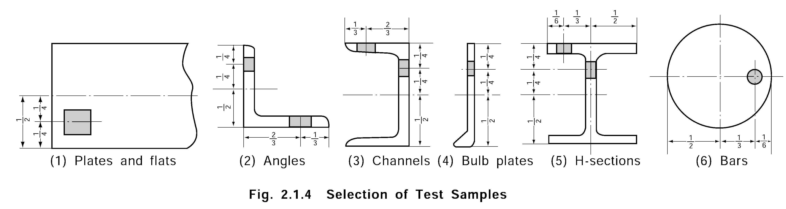
    **Fig 2.1.4 Selection of Test Samples**
- **7.** **Selection of test specimens**
  - **(1)** Test specimens are not to be heat treated separately from the product.
  - **(2)** Tensile test specimens are to be taken according to (a) to (c) below.
  - **(3)** Impact test specimens are to be taken according to (a) to (c) below.
- **8.** **Verification of dimensions and thickness 【 See Guidance】**
  - **(1)** **Scope**
  - **(2)** **Responsibility**
  - **(3)** **Thickness tolerances**
  - **(4)** **Average thickness**
  - **(5)** **Thickness measurements**
    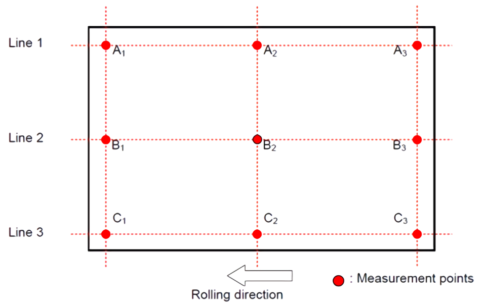
    **Fig 2.1.4-1 Locations of Thickness Measuring Points**

    | 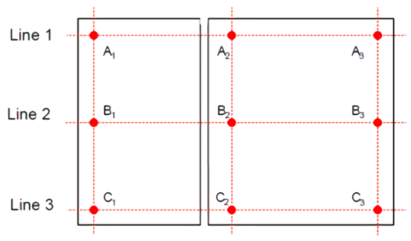 | 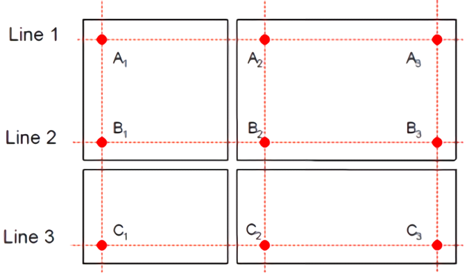 |
    | --- | --- |
    | 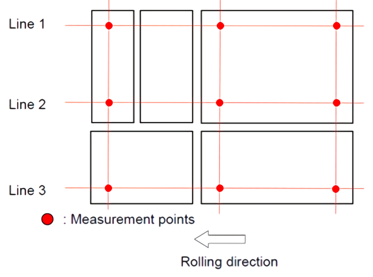 |   |

    **Fig 2.1.4-2 Locations of Thickness Measuring Points for Cut Steel Plates**
- **9.** **Quality and repair of defects** ***(2018)***
  - **(1)** The quality of finished steel is to be in accordance with the requirements specified in **108. 1**, **2** and as follows.
    Imperfections of a harmless nature, for example pitting, rolled-in scale, indentations, roll marks, scratches and grooves, regarded as being inherent of the manufacturing process, are permissible irrespective of their number, provided the maximum permissible limits of Class A of *EN 10163-2* or limits specified in a recognized equivalent standard accepted by the Society, are not exceeded and the remaining plate or wide flat thickness remains within the average allowable minus thickness tolerance specified in **8**. Total affected area with imperfection not exceeding the specified limits are not to exceed 15 % of the total surface in question.
    Affected areas with imperfections with a depth exceeding the limits of Class A of *EN 10163-2* or the maximum permissible limits specified in a recognized equivalent standard accepted by the Society, are to be repaired irrespective of their number. Cracks, injurious surface flaws, shells (over lapping material with non-metallic inclusion), sand patches, laminations and sharp edged seams (elongated defects) visually evident on surface and/or edge of plate are considered defects, which would impair the end use of the product and which require rejection or repair, irrespective of their size and number.
    - **(A)** The steel is to be free from surface defects prejudicial to the use of the material for the intended application. The finished material is to have a surface quality in accordance with a recognized standard such as *EN 10163* parts 1, 2 and 3, or an equivalent standard accepted by the Society, unless otherwise specified in **9**.
    - **(B)** The responsibility for meeting the surface finish requirements rests with the manufacturer of the material, who is to take the necessary manufacturing precautions and is to inspect the products prior to delivery. At that stage, however, rolling or heat treatment scale may conceal surface discontinuities and defects. If, during the subsequent descaling or working operations, the material is found to be defective, the Society may require materials to be repaired or rejected.
    - **(C)** The surface quality inspection method is to be in accordance with recognized national or international standards agreed between purchaser and manufacturer, accepted by the Society.
    - **(D)** If agreed by the manufacturer and purchaser, steel may be ordered with improved surface finish over and above these requirements.
    - **(E)** Acceptance criteria for surface quality
      - **(a)** Imperfections
      - **(b)** Defects
  - **(2)** Repair for surface defects
    The surface defects may be removed by local grinding, and be as follows:
    Local defects which cannot be repaired by grinding as stated above (a) may be repaired with the Surveyor's consent by chipping and/or grinding followed by welding subject to the following conditions. Repair of defects such as unacceptable imperfections, cracks, shells or seams is to be followed by magnetic particle or liquid penetrant testing.
    - **(A)** Grinding repair
      - **(a)** The nominal product thickness will not be reduced by more than 7 % or 3 mm, whichever is the less.
      - **(b)** Each single ground area does not exceed 0.25 $\mathrm{m} ^{2}$ and all ground areas do not exceed 2 % of the total surface in question.
      - **(c)** Ground areas lying in a distance less than their average breadth to each other are to be regarded as one single area.
      - **(d)** Ground areas lying opposite each other on both surfaces must not decrease the product thickness by values exceeding the limits as stated above (i).
      - **(e)** Complete elimination of the defects may be performed by a magnetic particle or dye penetrant test procedure at the Manufacturer's discretion. *(2020)*
      - **(f)** Defects or unacceptable imperfections are to be completely removed by grinding and the remaining plate or wide flat thickness are to be remained within the average allowable minus thickness tolerance specified in **8**. The ground areas are to be a smooth transition to the surrounding surface of the product.
    - **(B)** Welding repair
      - **(a)** Any single welded area is not to be exceeded 0.125 $\mathrm{m} ^{2}$ and the sum of all areas is not to be exceeded 2 % of the surface side in question. The distance between two welded areas shall not be less than their average width.
      - **(b)** The weld preparation must not reduce the thickness of the product below 80 % of the nominal thickness. For occasional defects with depths exceeding the 80% limit, special consideration at the Surveyor’s discretion will be necessary.
      - **(c)** If weld repair depth exceeds 3 mm, UT may be requested by the Society. If required, UT is to be carried out in accordance with an approved procedure.
      - **(d)** The repair is to be carried out by qualified welders using an approved procedure for the appropriate steel grade. The electrodes are to be of low hydrogen type and are to be dried in accordance with the manufacturer’s requirements and protected against rehumidification before and during welding.
    - **(C)** Shapes may be conditioned by the manufacturer for the removal of surface defects in accordance with the following limitations.
      - **(a)** For material less than 9.5 mm thickness, in which the defects are not more than 0.8 mm in depth, the defects may be removed by grinding or chipping.
      - **(b)** For material 9.5 mm and over in thickness, in which the defects are not more than 1.6 mm in depth, the defects may be removed by grinding or chipping.
      - **(c)** Surface defects which are greater in depth than the limits shown above (a) and (b) may be removed by chipping or grinding and then depositing weld metal, in the presence of the Surveyor, subject to the following conditions.
      - **(i)** The total area of the chipped or ground surface of any piece is not to exceed 2 % of the total surface area of that piece.
        - **(ii)** After removal of any defect preparatory to welding, the thickness of the shape is not to be reduced by more than 30 % of the nominal thickness, nor is the depth of depression prior to welding to exceed 12.5 mm in any case.
    - **(D)** Before repair works prescribed in above (B) or (C) (c), the following documents are to be submitted to the Society for approval.
      - **(a)** Specifications of repairing procedure which state about kind of surface defects, the way of chipping, grinding and welding, etc.
      - **(b)** Reports on results of tensile test, bend test, impact test, macro-structure inspection and hardness test on test samples repaired according to the procedure specified in above (a).
  - **(3)** Internal soundness
    - **(A)** If plates and wide flats are ordered with ultrasonic inspection or required by the Society, the test procedure and acceptance criteria are to be made in accordance with an accepted standard at the discretion of the Society. However, the probe frequency is to be of 4MHz in general. **【See Guidance】**
    - **(B)** Verification of internal soundness is the responsibility of the manufacturer. The acceptance of internal soundness by the Society’s surveyor is to be not absolved the manufacturer from this responsibility. *(2018)*
- **10.** **Retest Procedures**
  - **(1)** Where the tensile test fails to meet the requirements, two further tensile tests may be made from the same piece. If both of these additional tests meet all of the requirements, the piece and the remaining pieces from the same lot may be accepted.
  - **(2)** If one or both of the additional tests referred to above are unsatisfactory, the piece from which the above-mentioned test pieces have been taken is to be rejected. However, the remaining material from the same lot may be accepted, provided that two of the remaining pieces in the lot, selected in the same way, are tested with satisfactory results.
  - **(3)** (a) Where the result of the impact test is unsatisfactory, additional tests may be carried out, with the exception of the cases specified in (i) and (ii) below, by taking a set of test specimens out of the same piece from which the above-mentioned test specimens have been taken.
  - **(4)** When the initial piece, representing a lot, gives unsatisfactory results from the additional Charpy V-notch impact tests referred to the preceding (3), this piece is to be rejected but the remaining material in the lot may be accepted provided that two of the remaining pieces in the lot are tested with satisfactory results. If unsatisfactory results are obtained from either of these two pieces, then the lot of material is to be rejected. The pieces selected for these additional tests are to be the thickest remaining in the batch.
  - **(5)** If any test specimen fails because of faulty preparation, visible defects or (in the case of tensile test) because of fracturing outside the range permitted for the appropriate gauge length, the defective test piece may, at the Surveyors discretion, be disregarded and replayed by an additional test piece of the same type.
  - **(6)** Where the test pieces fail in the retests specified above, the piece from which the test pieces have been taken is to be rejected, However, at the consultation of the manufacturer and the orderer, the remaining pieces in the lot may be resubmitted individually for test and those pieces which give satisfactory results may be accepted.
  - **(7)** At the consultation of the manufacturer and the order, the rejected piece may be resubmittedafter heat treatment of re-heat treatment, or may be resubmitted as any other grade of steel and then, may be accepted, provided that the required tests are satisfactory.
- **11.** **Marking**
  - **(1)** Steels which have satisfactorily complied with the required tests are to be marked with the identification mark in accordance with the requirements in **110.**.
  - **(2)** Materials supplied in the thermo-mechanical controlled processing condition is to have the letters *TM* added after the material grade mark. (e.g. *EH* 40*TM)*
  - **(3)** Steel plates that have complied with the requirements for corrosion resistant steel will be marked with a designation by adding a corrosion designation to the unified identification mark for the grade of steel. And the corrosion resistant steel is to be designated according to its area of application as follows:
    (e.g. AH32 TM RCU Z35)
- **12.** **Forming**
  The cold deformation limit of hull structural rolled steels is to be in accordance with the Guidance specially specified by the Society. **【See Guidance】**
- **13.** **Test certificates** ***(2017)***
  The Surveyor is to be supplied with the number of copies as required by the Society, of the test certificates for all accepted materials. The Society may require separate documents of each grade of steel. These documents are to contain, in addition to the description, dimensions, etc., of the material, at least the following particulars:
  - **(1)** Purchaser‘s name or purchaser's order number and if known the hull number for which the material is intended.
  - **(2)** Identification of the cast and rolled piece.
  - **(3)** Identification of the steelworks.
  - **(4)** Material grade mark
  - **(5)** Chemical composition (ladle analysis values of elements controlled by the requirements)
  - **(6)** For steel with a corrosion resistant steel designation the weight percentage of each element added or intentionally controlled for improving corrosion resistance.
  - **(7)** Mechanical properties
  - **(8)** Condition of heat treatment (e.g. normalized or controlled roll except for as rolled)
  - **(9)** Deoxidization procedure is to be stated. (rimmed steel only)
  - **(10)** Through thickness properties of **310.**, where applicable

#### 302. Rolled steel plates for boiler

- **1.** **Application**
  - **(1)** These requirements are to apply to the steel plates (hereinafter referred to as "steel plates") for boilers and pressure vessels to be used at high temperatures.
  - **(2)** Steel plates other than those specified in **302.** are to comply with the requirements in **101. 2**.
- **2.** **Kinds** The steel plates are classified as specified in **Table 2.1.10**.

  **Table 2.1.10 Grades of Steel Plates** ***(2019)***

  | Grade | Thickness (mm) |
  | --- | --- |
  | *RSP* 24, *RSP* 30 | 6∼200 |
  | *RSP* 32 | 6∼200 |
  | *RSP* 30*A, RSP* 32*A* | 6∼150 |
- **3.** **Heat treatment**
  - **(1)** For steel plates of the "*RSP* 24, *RSP* 30 and *RSP* 32" grade with 50 mm or less and of the *"RSP* 30*A* and *RSP* 32*A*" grade with 38 mm or less in thickness, they are to be as rolled. They, however, may be heat treated(normalized or annealed for stress relieving) as deemed necessary by the manufacturer. *(2019)*
  - **(2)** For steel plates of the *"RSP* 24, *RSP* 30 and *RSP* 32" grade more than 50 mm and of the *"RSP* 30*A* and *RSP* 32*A*" grade more than 38 mm in thickness, they are to be either normalized to obtain the normal grain size or heated uniformly to such a temperature at the time of hot forming that an effect equivalent to normalizing can be achieved. In case of normalizing, it is, in principle, to be performed by the manufacturer. *(2019)*
- **4.** **Chemical composition**
  The chemical composition of steel plates is to comply with the requirements given in **Table 2.1.11**.

  **Table 2.1.11 Chemical Composition** ***(2019)***

  | Grade | Chemical composition (%) |   |   |   |   |   |   |
  | --- | --- | --- | --- | --- | --- | --- | --- |
  | Grade | Thickness t (mm) | C | Si | Mn | P | S | Mo |
  | *RSP* 24 | *t* ≤ 25 25 < *t* ≤ 50 50 < *t* ≤ 200 | 0.24 max. 0.27 max. 0.30 max. | 0.15∼0.40 | 0.90 max. | 0.030 max. | 0.030 max. | - |
  | *RSP* 30 | *t* ≤ 25 25 < *t* ≤ 50 50 < *t* ≤ 200 | 0.28 max. 0.31 max. 0.33 max. | 0.15∼0.40 | 0.90 max. | 0.030 max. | 0.030 max. | - |
  | *RSP* 32 | *t* ≤ 25 25 < *t* ≤ 50 50 < *t* ≤ 200 | 0.31 max. 0.33 max. 0.35 max. | 0.15∼0.40 | 1.20 max. | 0.025 max. | 0.025 max. | - |
  | *RSP* 30*A* | *t* ≤ 25 25 < *t* ≤ 50 50 < *t* ≤ 100 100 < *t* ≤ 150 | 0.18 max. 0.21 max. 0.23 max. 0.25 max. | 0.15∼0.40 | 0.90 max. | 0.020 max. | 0.020 max. | 0.45~0.60 |
  | *RSP* 32*A* | *t* ≤ 25 25 < *t* ≤ 50 50 < *t* ≤ 100 100 < *t* ≤ 150 | 0.20 max. 0.23 max. 0.25 max. 0.27 max. | 0.15∼0.40 | 0.90 max. | 0.020 max. | 0.020 max. | 0.45~0.60 |
  | NOTES: 1. For *RSP* 30 with 25 mm and over in thickness, carbon and manganese content may be 0.30 % or less and 1.00 % or less, respectively. |   |   |   |   |   |   |   |
- **5.** **Mechanical properties**
  The mechanical properties of steel plates are to comply with the requirements given in **Table 2.1.12.**

  **Table 2.1.12 Mechanical Properties** ***(2019)***

  | Grade | Yield strength ($\mathrm{N}/mm ^{2}$) | Tensile strength ($\mathrm{N}/mm ^{2}$) | Elongation (%) |   |
  | --- | --- | --- | --- | --- |
  | Grade | Yield strength ($\mathrm{N}/mm ^{2}$) | Tensile strength ($\mathrm{N}/mm ^{2}$) | *R*1*A* | *R*10 |
  | *RSP* 24 *RSP* 30 *RSP* 32 | 235 min. 295 min. 315 min. | 410 ~ 550 450 ~ 590 480 ~ 620 | 21 min. 19 min. 17 min. | 25 min. 23 min. 21 min. |
  | *RSP* 30*A* *RSP* 32*A* | 295 min. 315 min. | 450 ~ 590 480 ~ 620 | 19 min. 17 min. | 23 min. 21 min. |
  | NOTE: (1) *R*1*A* tensile test specimen is to be used for steel plate up to 50mm in thickness and *R*10 test specimen for steel plate more than 50 mm in thickness. However *R*10 test specimen can be used for steel plate more than 40 mm in thickness. (2) For material under 8 mm in thickness, a deduction from the specified percentage of elongation of 1 % is to be made for each decrease of 1 mm of the specified thickness. (3) For the plates over 90 mm in thickness, the elongation may be reduced from that mentioned in the above Table by 0.5 % for each increment of 12.5 mm or fraction thereof exceeding 90 mm in thickness. Such reduction, however, is limited to 3 %. (4) In case where the elongation of *RSP*30*A* and *RSP*32*A* steel plate with thickness over 6mm and less than 20 mm is insufficient within 3 % of the specified value, It will be able to regard as satisfactory if the elongation of the gauge length 50 mm which includes a rupture part is of 25 % or more. |   |   |   |   |
- **6.** **Selection and heat treatment of test samples 【 See Guidance】**
  - **(1)** For the steel plates which are not to be heat treated, one test sample is to be taken from each plate as rolled directly from one slab or ingot
  - **(2)** For the steel plates which are to be heat treated, one test sample is to be taken from every similarly heat treated plate as rolled directly from one slab or ingot.
  - **(3)** For steel plates to which stress relieving is required after welding or stress relieving is applied by the purchaser one or several times repeatedly during their working process, instruction of that effect is to be given at the time when they are placed for an order. In case where the procedure of stress relieving is not specified by the purchaser, a heat treatment is to be applied for the test samples by heating them slowly and uniformly to the temperature of 600℃ to 650℃, holding at that temperature for a period of over one hour per 25 mm of thickness, and then, to be cooled to 300℃ in the furnace before exposure in a still atmosphere.
  - **(4)** The test samples are to be taken from the portion approximately 1/4 of the width from the side end of the plates.
- **7.** **Selection of test specimens**
  Tensile test specimens are to be taken according to (1) to (3) below.
  - **(1)** One test specimen is to be taken from one test sample.
  - **(2)** The test specimens are to be taken with their longitudinal axis normal to the final direction of rolling.
  - **(3)** The test specimens of bar type are to be taken from the portion approximately 1/4 of the thickness from the surface.
- **8.** **Tolerance for thickness**
  Surface inspection and verification of dimensions are to be in accordance with the requirements in **301. 8.** The minus tolerance for the nominal thickness of plates is to be 0.25 mm.
- **9.** **Retest procedure**
  Where the tensile tests from the first test specimens selected fail to meet the requirements, additional tests may be conducted according to the requirements given in **109.**
- **10.** **Marking**
  - **(1)** Steel plates which have satisfactorily complied with the required tests are to be marked with the identification mark relating to heat treatment in addition to the requirements in **110.**
  - **(2)** The marks relating to heat treatment are to be as specified in the following:

#### 303. Rolled steel plates for pressure vessel

- **1.** **Application**
  - **(1)** These requirements are mainly to apply to the steel plates for pressure vessels to be used at atmospheric temperature (hereinafter referred to as "steel plates")
  - **(2)** The steel plates having characteristics differing from those specified in **303.** are to comply with the requirements in **101. 2**.
- **2.** **Kinds**
  The steel plates are classified as specified in **Table 2.1.13**.

  **Table 2.1.13 Grades of Steel Plates**

  | Grade | Thickness (mm) |
  | --- | --- |
  | *RPV* 24 | 6∼200 |
  | *RPV* 32, *RPV* 36, *RPV* 42, *RPV* 46, *RPV* 50 | 6∼150 |
- **3.** **Heat treatment**
  - **(1)** *RPV* 24 plate is to be as rolled. The plates, however, may be normalized as deemed necessary by the Society.
  - **(2)** *RPV* 32 and *RPV* 36 plates are to be as rolled. The plates, however, may be normalized as deemed necessary by the Society. But, they may be *TMCP* or quenched and tempered under the approval by the Society.
  - **(3)** *RPV* 42 plate is to be *TMCP*. The plate, however, may be normalized or quenched and tempered under the approval by the Society.
  - **(4)** *RPV* 46 and *RPV* 50 plates are to be quenched and tempered. But, they may be *TMCP* under the approval by the Society.
- **4.** **Chemical composition**
  - **(1)** The chemical composition of steel plates is to comply with the requirements given in **Table 2.1.14.**

    **Table 2.1.14 Chemical Composition**

    | Grade | Chemical composition ($\%$) |   |   |   |   |   | Carbon equivalent ($\%$) |   |
    | --- | --- | --- | --- | --- | --- | --- | --- | --- |
    | Grade | C |   | Si | Mn | P | S | $t$ ≤ 50(mm) | 50 < $t$ ≤ 75(mm) |
    | *RPV* 24 | $t$ ≤100 mm | 0.18 max. | 0.35 max. | 1.40 max. | 0.030 max. | 0.030 max. | - | - |
    | *RPV* 24 | $t$ > 100 mm | 0.20 max. | 0.35 max. | 1.40 max. | 0.030 max. | 0.030 max. | - | - |
    | *RPV* 32 | 0.18 max. |   | 0.55 max. | 1.60 max. | 0.030 max. | 0.030 max. | - | - |
    | *RPV* 36 | 0.20 max. |   | 0.55 max. | 1.60 max. | 0.030 max. | 0.030 max. | - | - |
    | *RPV* 42 | 0.18 max. |   | 0.75 max. | 1.60 max. | 0.030 max. | 0.030 max. | 0.44 max. | 0.46 max. |
    | *RPV* 46 | 0.18 max. |   | 0.75 max. | 1.60 max. | 0.030 max. | 0.030 max. | 0.44 max. | 0.46 max. |
    | *RPV* 50 | 0.18 max. |   | 0.75 max. | 1.60 max. | 0.030 max. | 0.030 max. | 0.45 max. | 0.47 max. |
    | NOTE: (1) Where deemed necessary, other elements than specified in **Table 2.1.14** may be added. In that case, such elements are to be stated in the test sheets. (2) For *RPV*46 and *RPV*50 steel plates which not to be quenched and tempered, slight deviations in the chemical composition may be allowed as approved by the Society. |   |   |   |   |   |   |   |   |
  - **(2)** Carbon equivalent(Ceq) and weld cold cracking susceptibility(Pcm) value of steel plates are to comply with the requirements given in **Table 2.1.14-1.**

    **Table 2.1.14-1 Carbon equivalent(Ceq) and Pcm value**

    | Grade | Heat treatment | Carbon equivalent (%) |   |   |   |   | Pcm value (%) |   |   |   |
    | --- | --- | --- | --- | --- | --- | --- | --- | --- | --- | --- |
    | Grade | Heat treatment | $t$≤ 50 (mm) | 50 < $t$ ≤ 75 (mm) | 75 < $t$ ≤ 100 (mm) | 100 < $t$ ≤125 (mm) | 125 < $t$ ≤ 150 (mm) | $t$≤ 50 (mm) | 50 < $t$ ≤ 75 (mm) | 75 < $t$ ≤ 100 (mm) | 100 < $t$ ≤ 150 (mm) |
    | *RPV* 32 | TMCP(1) | 0.39 max. | 0.41 max. |   | 0.43 max. |   | 0.24 max. | 0.26 max. |   | 0.28 max. |
    | *RPV* 36 | TMCP(1) | 0.40 max. | 0.42 max. |   | 0.44 max. |   | 0.26 max. | 0.27 max. |   | 0.29 max. |
    | *RPV* 42 | TMCP(1) | 0.43 max. | 0.45 max. |   | - |   | 0.27 max. | 0.28 max. | 0.29 max. | - |
    | *RPV* 46 | Quenching and Tempering^(^2) | 0.44 max. | 0.46 max. | 0.49 max. | 0.52 max. | 0.54 max. | 0.28 max. | 0.30 max. |   |   |
    | *RPV* 50 | Quenching and Tempering^(^2) | 0.45 max. | 0.47 max. | 0.50 max. | 0.53 max. | 0.55 max. | 0.28 max. | 0.30 max. |   |   |
    | (Note) (1) Carbon equivalent and Pcm value of *RPV* 32, *RPV* 36 and *RPV* 42 plates quenched and tempered are to be as deemed appropriate by the Society. **【See Guidance】** (2) Carbon equivalent and Pcm value of *RPV* 46 and *RPV* 50 plates, which not to be quenched and tempered, are to be as deemed appropriate by the Society. **【See Guidance】** |   |   |   |   |   |   |   |   |   |   |
- **5.** **Mechanical properties**
  The mechanical properties of steel plates are to comply with the requirements given in **Table 2.1.15**.

  **Table 2.1.15 Mechanical Properties**

  | Grade | Tensile test |   |   |   |   |   |   | Impact test |   |   |
  | --- | --- | --- | --- | --- | --- | --- | --- | --- | --- | --- |
  | Grade | Yield strength ($\mathrm{N}/mm ^{2}$) |   |   | Tensile strength ($\mathrm{N}/mm ^{2}$) | Elongation($\%$) |   |   | Test temp. (℃)(5) | Average absorbed energy(*J*) | Absorbed energy of individual test specimen(*J*) |
  | Grade | Thickness of plate *t* (mm) |   |   | Tensile strength ($\mathrm{N}/mm ^{2}$) | Thickness of plate *t* (mm) |   |   | Test temp. (℃)(5) | Average absorbed energy(*J*) | Absorbed energy of individual test specimen(*J*) |
  | Grade | $t$ ≤ 50 | 50<$t$≤100 | 100<$t$≤200 | Tensile strength ($\mathrm{N}/mm ^{2}$) | $t$≤16(2) | 16<$t$≤40(2) | 40<$t$(3) | Test temp. (℃)(5) | Average absorbed energy(*J*) | Absorbed energy of individual test specimen(*J*) |
  | *RPV* 24 | 235 min. | 215 min. | 195 min. | 400∼510 | 17 min. | 21 min. | 24 min. | 0 | 47 min. | 27 min. |
  | *RPV* 32 | 315 min. | 290 min. | 275 min.(1) | 490∼610 | 16 min. | 20 min. | 23 min. | 0 | 47 min. | 27 min. |
  | *RPV* 36 | 355 min. | 335 min. | 315 min.(1) | 520∼640 | 14 min. | 18 min. | 21 min. | 0 | 47 min. | 27 min. |
  | *RPV* 42 | 410 min. | 390 min. | 370 min.(1) | 550∼670 | 12 min. | 16 min. | 18 min. | -10 | 47 min. | 27 min. |
  | *RPV* 46 | 450 min. | 430 min. | 410 min.(1) | 570∼700 | 19 min.(4) | 26 min.(4) | 20 min. | -10 | 47 min. | 27 min. |
  | *RPV* 50 | 490 min. | 470 min. | 450 min.(1) | 610∼740 | 18 min.(4) | 25 min.(4) | 19 min. | -10 | 47 min. | 27 min. |
  | NOTE: (1) To be applied for the plates 150 mm or less in thickness (2) To be tested with *R*1*A* test specimen. (3) To be tested with *R*1*A* test specimen. When the capacity of the available testing machine does not permit testing the full thickness specimen, *R*4 test specimen may be used. (4) To be tested with *R*5 test specimen. (5) Test temperature of *RPV* 32, *RPV* 36 and *RPV* 42 plates manufactured by *TMCP* is to be -20℃. |   |   |   |   |   |   |   |   |   |   |
- **6.** **Selection of test samples 【 See Guidance】**
  - **(1)** For the steel plates which are not to be heat treated, one test sample is to be taken from each plate as rolled directly from one slab or ingot.
  - **(2)** For the steel plates which are to be heat treated, one test sample is to be taken from every similarly heat treated plate as rolled directly from one slab or ingot.
  - **(3)** For steel plates to which stress relieving is required after welding or stress relieving is applied by the purchaser, test samples are to be heat treated in accordance with the requirements in **302. 6** (3).
  - **(4)** The test samples are to be taken from the portion approximately 1/4 of the width from the side end of the plate.
- **7.** **Selection of test specimen**
  - **(1)** Tensile test specimens are to be taken according to (a) to (c) below.
  - **(2)** Impact test specimens is to be taken according to (a) to (c) below. **【See Guidance】**
- **8.** **Tolerance for thickness**
  Surface inspection and verification of dimensions are to be in accordance with the requirements in **301. 8.** The minus tolerance for the nominal thickness of plates is to be 0.25 mm.
- **9.** **Retest procedures**
  Where the tensile test and impact tests from the first test specimen selected fails to meet the requirements, additional tests may be conducted according to the requirements given in **109.**
- **10.** **Marking**
  - **(1)** Steel plates which have satisfactorily complied with the required tests are to be marked with the identification mark relating to heat treatment in addition to the requirements in **110.**
  - **(2)** The marks relating to heat treatment in (1) are to be as specified in the following:
- **11.** **Steel plates equivalent to standard**
  - **(1)** The mild steel plates of grade *RD* and *RE,* the high tensile steels of rolled steels for hull specified in **301.** are taken as equivalent to the plates specified in **303.** in case where the test specimens are taken as required in **Pars 6** and **7** and test results comply with the requirements in **301.** In this case, *"PV*" is to be suffixed to the markings to indicate the kind of plates specified in **301.**
  - **(2)** Any requirements regarding heat treatment of steel plates specified in (1) is left to the discretion of the Society.

#### 304. Rolled steels for low temperature service

- **1.** **Application**
  - **(1)** The requirements are to apply to the rolled steels not exceeding 50 mm in thickness intended for tanks and ship's hull structures adjacent to tanks of liquefied gas carriers, and other parts such a hull structures of refrigerated cargo carrier which are exposed to low temperature (hereinafter referred to as "steels"). *(2023)*
  - **(2)** Any requirement regarding the steels over 50 mm in thickness is left to the discretion of the Society. *(2023)* **【See Guidance】**
  - **(3)** The requirements other than those specified in **304.** are applicable to the requirements in **301.**
  - **(4)** The steels other than those specified in **304.** are to comply with the requirements in **101. 2.**
- **2.** **Kinds**
  Steels are classified as specified in **Table 2.1.16**.

  **Table 2.1.16 Grades and Chemical Composition** ***(2017) (2023)***

  | Kinds | Grade | Deoxidation | Chemical composition (%) |   |   |   |   |   |   |   |   |   |   |   |   |
  | --- | --- | --- | --- | --- | --- | --- | --- | --- | --- | --- | --- | --- | --- | --- | --- |
  | Kinds | Grade | Deoxidation | $C$ | $Si$ | $Mn$ | $P$ | $S$ | $N i$ | $Cr$ | $Cu$ | $Mo$ | $A1$(3) | $Nb$ | $V$ | $Ti$ |
  | Carbon steels | *RL* 235*A* | Fully killed Aluminium treated fine grain | 0.15 max. | 0.10~0.30 | 0.70~1.50 | 0.030 max. | 0.030 max. | 0.8 max. | (1) |   |   | 0.02 min. | - |   |   |
  | Carbon steels | *RL* 235*B* | Fully killed Aluminium treated fine grain | 0.15 max. | 0.10~0.30 | 0.70~1.50 | 0.030 max. | 0.030 max. | 0.8 max. | (1) |   |   | 0.02 min. | - |   |   |
  | Carbon steels | *RL* 325*A* | Fully killed Aluminium treated fine grain | 0.16 max. | 0.10~0.55 | 0.80~1.60 | 0.025 max. | 0.025 max. | 0.8 max. | (1) |   |   | 0.02 min. | - |   |   |
  | Carbon steels | *RL* 325*B* | Fully killed Aluminium treated fine grain | 0.16 max. | 0.10~0.55 | 0.80~1.60 | 0.025 max. | 0.025 max. | 0.8 max. | (1) |   |   | 0.02 min. | - |   |   |
  | Carbon steels | *RL* 355 | Fully killed Aluminium treated fine grain | 0.16 max. | 0.10~0.55 | 0.80~1.60 | 0.025 max. | 0.025 max. | 0.8 max. | (1) |   |   | 0.02 min. | - |   |   |
  | Nickel alloy steels | *RL* 1*N*355 | Killed and fine grain treated | 0.18 max. | 0.35 max. | 0.80~1.50 | 0.025 max. | 0.010 max. | 1.30~ 1.70 | (2) |   |   | - | - | 0.05 max. | - |
  | Nickel alloy steels | *RL* 2*N*255 | Killed and fine grain treated | 0.17 max. | 0.30 max. | 0.70 max. | 0.025 max. | 0.020 max. | 2.10~ 2.50 | 0.30 max. | 0.40 max. | 0.12 max. | - | 0.02 max. | 0.05 max. | 0.03 max. |
  | Nickel alloy steels | *RL* 3*N*355 | Killed and fine grain treated | 0.15 max. | 0.35 max. | 0.30~0.80 | 0.020max. | 0.005 max. | 3.25~ 3.75 | (2) |   |   | - | - | 0.05 max. | - |
  | Nickel alloy steels | *RL* 5*N*390 | Killed and fine grain treated | 0.15 max. | 0.35 max. | 0.30~0.80 | 0.020max. | 0.005 max. | 4.75~ 5.25 | (2) |   |   | - | - | 0.05 max. | - |
  | Nickel alloy steels | *RL* 9*N*490 | Killed and fine grain treated | 0.10 max. | 0.35 max. | 0.30~0.80 | 0.020max. | 0.005 max. | 8.50~ 10.00 | (2) |   |   | - | - | 0.05 max. | - |
  | NOTE: (1) These elements may be added, the certificates is to contain these elements. (2) The content of Cr + Cu + Mo is not to exceed 0.50 %. The content of Mo for *RL* 9*N*490 is not to exceed 0.10 % (3) Aluminium content is to be represented by the total aluminium content, but may be determined by the acid soluble aluminium content. In such a case, the acid soluble aluminium content is not to be less than 0.015 %. |   |   |   |   |   |   |   |   |   |   |   |   |   |   |   |
- **3.** **Heat treatment**
  The heat treatment of steels is to comply with the requirements given in **Table 2.1.17**.

  **Table 2.1.17 Heat Treatment** ***(2017) (2023)***

  | Kinds | grade | Heat treatment |
  | --- | --- | --- |
  | Carbon steels | *RL* 235*A* | Normalized or *TMCP* |
  | Carbon steels | *RL* 235*B* | Normalized or *TMCP* |
  | Carbon steels | *RL* 325*A* | Normalized or *TMCP* |
  | Carbon steels | *RL* 325*B* | Quenched and Tempered or *TMCP* (1) |
  | Carbon steels | *RL* 355 | Quenched and Tempered or *TMCP* (1) |
  | Nickel alloy steels | *RL* 1*N*355 | Normalized or Normalized and Tempered or Quenched and Tempered(2) |
  | Nickel alloy steels | *RL* 2*N*255 | Normalized or Normalized and Tempered(2) |
  | Nickel alloy steels | *RL* 3*N*355 | Normalized or Normalized and Tempered or Quenched and Tempered(2) |
  | Nickel alloy steels | *RL* 5*N*390 | Normalized or Normalized and Tempered or Quenched and Tempered(2) |
  | Nickel alloy steels | *RL* 9*N*490 | Double normalized and tempered or Quenched and Tempered(2) |
  | NOTE: (1) Heat treatment may be conducted according to Nomalising, subject to the special approval by the Society. *(2018)* (2) Heat treatment may be conducted according to *TMCP*, subject to the special approval by the Society. |   |   |
- **4.** **Deoxidation practice and chemical composition**
  - **(1)** The deoxidation practice and chemical composition of each grade are to comply with the requirements given in **Table 2.1.16**. When deemed necessary, chemical elements other than those given in the table may be added.
  - **(2)** When heat treatment has been conducted according to *TMCP,* the chemical composition of steels specified in **Table 2.1.16** may be modified subject to the approval by the Society.
- **5.** **Mechanical properties**
  - **(1)** The mechanical properties of steels are to comply with the requirements given in **Table 2.1.18**.
  - **(2)** Where deemed necessary by the Society, other tests on notch toughness may be required additionally.
  - **(3)** In the case of steels in accordance with **Pt 7, Ch 5, Sec 17, 1712**.(Special requirements for ammonia) of the Rules, the specified value of the maximum yield stress or proof stress may be limited after approval by the Society. *(2023)*

    **Table 2.1.18 Mechanical properties** ***(2017) (2023)***

    | Kinds | grade | Tensile test |   |   |   |   |   | Impact(5)(6) |   |   |
    | --- | --- | --- | --- | --- | --- | --- | --- | --- | --- | --- |
    | Kinds | grade | Yield strength ($\mathrm{N}/mm ^{2}$) |   | Tensile strength ($\mathrm{N}/mm ^{2}$) | Elongation($\%$)(4) ($L=5.65 \sqrt {A}$) |   |   | Test temp.(7) (℃) | Average absorbed energy(J) |   |
    | Kinds | grade | Thickness of plate $t$ (mm) |   | Tensile strength ($\mathrm{N}/mm ^{2}$) | Thickness of plate $t$ (mm) |   |   | Test temp.(7) (℃) | Average absorbed energy(J) |   |
    | Kinds | grade | 6<$t$≤30 | 30<$t$ | Tensile strength ($\mathrm{N}/mm ^{2}$) | 6<$t$≤16(2) | 16<$t$≤40(2) | 40<$t$(3) | Test temp.(7) (℃) | Average absorbed energy(J) |   |
    | Kinds | grade | 6<$t$≤30 | 30<$t$ | Tensile strength ($\mathrm{N}/mm ^{2}$) | 6<$t$≤16(2) | 16<$t$≤40(2) | 40<$t$(3) | Test temp.(7) (℃) | $L$ | $T$ |
    | Carbon steels | *RL* 235*A* | 235 min.(1) |   | 400∼510 | $L$ | $T$ | 24 min. | -40 | 41 min. | 27 min. |
    | Carbon steels | *RL* 235*B* | 235 min.(1) |   | 400∼510 | $L$ | $T$ | 24 min. | -50 | 41 min. | 27 min. |
    | Carbon steels | *RL* 325*A* | 325 min. |   | 440∼560 | 22 min. | 30 min. | 22 min. | -50 | 41 min. | 27 min. |
    | Carbon steels | *RL* 325*B* | 325 min. |   | 440∼560 | 22 min. | 30 min. | 22 min. | -60 | 41 min. | 27 min. |
    | Carbon steels | *RL* 355 | 355 min. |   | 490∼610 | 20 min. | 28 min. | 20 min. | -60 | 41 min. | 27 min. |
    | Nickel alloy steels | *RL* 1*N*355 | 355 min. | 345 min. | 490∼640 | 22 min. |   |   | -80 | 41 min. | 27 min. |
    | Nickel alloy steels | *RL* 2*N*255 | 255 min. |   | 450∼590 | 21 min. |   |   | -70 | 41 min. | 27 min. |
    | Nickel alloy steels | *RL* 3*N*355 | 355 min. | 345 min. | 490∼640 | 22 min. |   |   | -100 | 41 min. | 27 min. |
    | Nickel alloy steels | *RL* 5*N*390 | 390 min. | 380 min. | 530∼710 | 20 min. |   |   | -120 | 41 min. | 27 min. |
    | Nickel alloy steels | *RL* 9*N*490 | 490 min. | 480 min. | 640∼840 | 18 min. |   |   | -196 | 41 min. | 27 min. |
    | NOTES: (1) Same or above 215 $\mathrm{N}/mm ^{2}$ when the thickness of plate is above 40 mm. (2) Carbon steels are to be tested with *R*5 test specimen. To be tested with *R*1*A* test specimen For *RL* 235*A* and *RL* 235*B*. (3) Carbon steels are to be tested with *R*4 test specimen. (4) In the case of carbon steel, the calibrated elongation value according to **ISO 2566-1:2021** may be required by the different specimen type from requirements in this Table. (5) *L* (or *T*) indicates that the longitudinal axis of the test specimen is arranged parallel (or transverse) to the final direction of rolling. (6) When the absorbed energy of two or more test specimens among a set of test specimens is less in value than the specified average absorbed energy or when the absorbed energy of a single test specimen is less in value than 70 % of the specified average absorbed energy, the test is considered to have failed. (7) Impact test temperature for steels specified in **Pt 7, Ch 5** is to comply with the requirements given in **Table 2.1.18-1.** |   |   |   |   |   |   |   |   |   |   |
- **6.** **Selection of test sample**
  - **(1)** For steel plates, one test sample is to be taken from each plate as rolled directly from one slab or ingot.
  - **(2)** For test samples used in other steels than steel plates, steels not greater than 10 tonnes in mass (having the same cross-sectional dimensions and being from the same cast manufactured by the same process) are to be treated as one lot, and one test sample is to be taken from each lot.
  - **(3)** The requirements specified in **301. 6** (4) are to be applied to the selection of the test samples.

    **Table 2.1.18-1 Impact Test Temperature of Steels Specified in Pt 7, Ch 5.** ***(2017) (2023)***

    | Grade | Thickness $t$ (mm) | Test temp (℃)^(^1) |
    | --- | --- | --- |
    | *RL* 235*A* *RL* 235*B* *RL* 325*A* *RL* 325*B* *RL* 355 | $t$ ≤ 25 | ­20 or (Td­5) (2) |
    | *RL* 235*A* *RL* 235*B* *RL* 325*A* *RL* 325*B* *RL* 355 | 25 ＜ $t$ ≤ 30 | ­20 or (Td­10) (2) |
    | *RL* 235*A* *RL* 235*B* *RL* 325*A* *RL* 325*B* *RL* 355 | 30 ＜ $t$ ≤ 35 | ­20 or (Td­15) (2) |
    | *RL* 235*A* *RL* 235*B* *RL* 325*A* *RL* 325*B* *RL* 355 | 35 ＜ $t$ ≤ 40 | (Td­20) |
    | *RL* 235*A* *RL* 235*B* *RL* 325*A* *RL* 325*B* *RL* 355 | 40 ＜ $t$ ≤ 50 | ­20 or (Td­5) (2)(3) |
    | *RL* 235*A* *RL* 235*B* *RL* 325*A* *RL* 325*B* *RL* 355 | 40 ＜ $t$ ≤ 45 | (Td­25)(4) |
    | *RL* 235*A* *RL* 235*B* *RL* 325*A* *RL* 325*B* *RL* 355 | 45 ＜ $t$ ≤ 50 | (Td­30)(4) |
    | *RL* 235*A* *RL* 235*B* *RL* 325*A* *RL* 325*B* *RL* 355 | 50 ＜ $t$ | (5) |
    | *RL* 1*N*255 | $t$≤ 25 | ­65 |
    | *RL* 1*N*255 | 25 ＜ $t$ ≤ 30 | ­65 or (Td­10) (2) |
    | *RL* 1*N*255 | 30 ＜ $t$ ≤ 35 | ­65 or (Td­15) (2) |
    | *RL* 1*N*255 | 35 ＜ $t$ ≤ 40 | ­65 or (Td­20) (2) |
    | *RL* 1*N*255 | 40 ＜ $t$ ≤ 45 | (Td­25)(6) |
    | *RL* 1*N*255 | 45 ＜ $t$ ≤ 50 | (Td­30)(6) |
    | *RL* 2*N*255 | $t$≤ 25 | ­70 |
    | *RL* 2*N*255 | 25 ＜ $t$ ≤ 30 | ­70 or (Td­10) (2) |
    | *RL* 2*N*255 | 30 ＜ $t$ ≤ 35 | ­70 or (Td­15) (2) |
    | *RL* 2*N*255 | 35 ＜ $t$ ≤ 40 | ­70 or (Td­20) (2) |
    | *RL* 2*N*255 | 40 ＜ $t$ ≤ 45 | (Td­25)(6) |
    | *RL* 2*N*255 | 45 ＜ $t$ ≤ 50 | (Td­30)(6) |
    | *RL* 3*N*355 | $t$ ≤ 25 | ­95 |
    | *RL* 3*N*355 | 25 ＜ $t$ ≤ 30 | ­95 or (Td­10) (2) |
    | *RL* 3*N*355 | 30 ＜ $t$ ≤ 35 | ­95 or (Td­15) (2) |
    | *RL* 3*N*355 | 35 ＜ $t$≤ 40 | ­95 or (Td­20) (2) |
    | *RL* 3*N*355 | 40 ＜ $t$ ≤ 45 | (Td­25)(6) |
    | *RL* 3*N*355 | 45 ＜ $t$ ≤ 50 | (Td­30)(6) |
    | *RL* 5*N*390 | $t$≤ 25 | ­110 |
    | *RL* 5*N*390 | 25 ＜ $t$ ≤ 30 | ­110 or (Td­10) (2) |
    | *RL* 5*N*390 | 30 ＜ $t$ ≤ 35 | ­110 or (Td­15) (2) |
    | *RL* 5*N*390 | 35 ＜ $t$ ≤ 40 | ­110 or (Td­20) (2) |
    | *RL* 5*N*390 | 40 ＜ $t$ ≤ 45 | (Td­25)(6) |
    | *RL* 5*N*390 | 45 ＜ $t$ ≤ 50 | (Td­30)(6) |
    | *RL* 9*N*490 | $t$≤ 50 | ­196(6) |

    | **Table 2.1.18-1 Impact Test Temperature of Steels Specified in Pt 7, Ch 5.(cont’d)** ***(2017) (2023)*** |
    | --- |
    | NOTES: (1) *Td* is the design temperature (℃). (2) The test temperature is to be the lower of those specified above. (3) In addition, post-weld stress relief heat treatment shall be performed. Exemption to post-weld stress relief heat treatment based on alternative approach(e.g. Engineering Critical Assessment) shall be approved by the Society or shall be to recognized standards. (4) Applies to cargo tank other than type C. (5) This may be accepted by approval of the Society. And the test temperature is to be as deemed appropriate by the Society. (6) A further set of impact test at mid thickness for products with 40 ＜ $t$ ≤ 50 is required |
- **7.** **Selection of test specimens**
  - **(1)** Tensile test specimens are to be taken according to the requirements specified in **301. 7** (2).
  - **(2)** Impact test specimens are to be taken according to the following (a) and (b):
- **8.** **Surface inspection and verification of dimensions**
  Surface inspection and verification of dimensions are to be in accordance with the requirements in **301. 8.** The minus tolerance for the nominal thickness of plates is to be 0.25 mm.
- **9.** **Retest procedures**
  Where the tensile test and impact tests from the first test specimen selected fails to meet the requirements, additional tests may be conducted according to the requirements given in **109.**
- **10.** **Marking**
  - **(1)** Steels which have satisfactorily complied with the required tests are to be marked with the identification mark in accordance with the requirements in **110**.
  - **(2)** For steels to which the requirements given in Notes (2) of **Table 2.1.17** and Notes (7) of **Table 2.1.18** have been applied, "*TM* " and impact test temperature "*T* " are to be suffixed to the markings. (e.g. *RL* 325*TM*-50*T* )
  - **(3)** For steel to which the requirements given in **5**. (3), the specified value of the maximum yield stress or proof stress and “A” are to be suffixed to the markings. (e.g. *RL* 325*A*-440*A*) *(2023)*

#### 305. Rolled stainless steels

- **1.** **Application**
  - **(1)** These requirements are to apply to the rolled stainless steels (hereinafter referred to as "steels") for tanks in low temperature service or corrosion-resisting service.
  - **(2)** Austenitic-ferritic stainless steel (hereinafter referred to as "duplex stainless steels") not exceeding 75 mm in thickness are to be as in accordance with the Guidance relating to the Rules specified by the Society. **【See Guidance】**
  - **(3)** The requirements other than those specified in **305.** are applicable to the requirements in **301.**
  - **(4)** Steels other than those specified in **305.** are to comply with the requirements in **101. 2.**
- **2.** **Kinds**
  Steels are classified as specified in **Table 2.1.19.**

  **Table 2.1.19 Grades and Chemical Composition of Stainless Steels** ***(2020) (2021)***

  | Grade | Chemical composition ($\%$) |   |   |   |   |   |   |   |   |   |
  | --- | --- | --- | --- | --- | --- | --- | --- | --- | --- | --- |
  | Grade | *C* | *Si* | *Mn* | *P* | *S* | *Ni* | *Cr* | *Mo* | *N* | *Others* |
  | *RSTS* 304 | 0.08 max. | 1.00 max. | 2.00 max. | 0.040 max. | 0.030 max. | 8.00~ 10.50 | 18.00~20.00 | - | - | - |
  | *RSTS* 304*L* | 0.030 max. | 1.00 max. | 2.00 max. | 0.040 max. | 0.030 max. | 8.00~ 13.00 | 18.00~20.00 | - | - | - |
  | *RSTS* 304*N*1 | 0.08 max. | 1.00 max. | 2.50 max. | 0.040 max. | 0.030 max. | 7.00~ 10.50 | 18.00~20.00 | - | 0.10~0.25 | - |
  | *RSTS* 304*N*2 | 0.08 max. | 1.00 max. | 2.50 max. | 0.040 max. | 0.030 max. | 7.50~ 10.50 | 18.00~20.00 | - | 0.15~0.30 | Nb≤0.15 |
  | *RSTS* 304*LN* | 0.030 max. | 1.00 max. | 2.00 max. | 0.040 max. | 0.030 max. | 8.50~ 11.50 | 17.00~19.00 | - | 0.12~0.22 | - |
  | *RSTS* 309*S* | 0.08 max. | 1.00 max. | 2.00 max. | 0.040 max. | 0.030 max. | 12.00~ 15.00 | 22.00~24.00 | - | - | - |
  | *RSTS* 310*S* | 0.08 max. | 1.50 max. | 2.00 max. | 0.040 max. | 0.030 max. | 19.00~ 22.00 | 24.00~26.00 | - | - | - |
  | *RSTS* 316 | 0.08 max. | 1.00 max. | 2.00 max. | 0.040 max. | 0.030 max. | 10.00~ 14.00 | 16.00~18.00 | 2.00~3.00 | - | - |
  | *RSTS* 316*L* | 0.030 max. | 1.00 max. | 2.00 max. | 0.040 max. | 0.030 max. | 10.00~ 15.00 | 16.00~18.00 | 2.00~3.00 | - | - |
  | *RSTS* 316*N* | 0.08 max. | 1.00 max. | 2.00 max. | 0.040 max. | 0.030 max. | 10.00~ 14.00 | 16.00~18.00 | 2.00~3.00 | 0.10~0.22 | - |
  | *RSTS* 316*LN* | 0.030 max. | 1.00 max. | 2.00 max. | 0.040 max. | 0.030 max. | 10.50~ 14.50 | 16.50~18.50 | 2.00~3.00 | 0.12~0.22 | - |
  | *RSTS* 317 | 0.08 max. | 1.00 max. | 2.00 max. | 0.040 max. | 0.030 max. | 11.00~15.00 | 18.00~20.00 | 3.00~4.00 | - | - |
  | *RSTS* 317*L* | 0.030 max. | 1.00 max. | 2.00 max. | 0.040 max. | 0.030 max. | 11.00~15.00 | 18.00~20.00 | 3.00~4.00 | - | - |
  | *RSTS* 317*LN* | 0.030 max. | 1.00 max. | 2.00 max. | 0.040 max. | 0.030 max. | 11.00~15.00 | 18.00~20.00 | 3.00~4.00 | 0.10~0.20 | - |
  | *RSTS* 321 | 0.08 max. | 1.00 max. | 2.00 max. | 0.040 max. | 0.030 max. | 9.00~ 13.00 | 17.00~19.00 | - | - | Ti≥5×C |
  | *RSTS* 347 | 0.08 max. | 1.00 max. | 2.00 max. | 0.040 max. | 0.030 max. | 9.00~ 13.00 | 17.00~19.00 | - | - | Nb≥10×C |
- **3.** **Heat treatment**
  The steels are generally to receive a solid solution treatment.
- **4.** **Chemical composition**
  The chemical composition of steels is to comply with the requirements given in **Table 2.1.19.**
- **5.** **Mechanical properties**
  - **(1)** The mechanical properties of steels are to comply with the requirements given in **Table 2.1.20. 【 See Guidance】**

    **Table 2.1.20 Mechanical Properties of Stainless Steels**

    | Grade | Tensile |   |   | Hardness test |   |   |
    | --- | --- | --- | --- | --- | --- | --- |
    | Grade | Yield strength ($\mathrm{N}/mm ^{2}$) | Tensile strength ($\mathrm{N}/mm ^{2}$) | Elongation($\%$) ($L=5.65 \sqrt {A}$) | Brinell *H_BW* | Rock well *H_RB* | Vickers *H_V* |
    | *RSTS* 304 | 205 min. | 520 min. | 40 min. | 187 max. | 90 max. | 200 max. |
    | *RSTS* 304*L* | 175 min. | 480 min. | 40 min. | 187 max. | 90 max. | 200 max. |
    | *RSTS* 304*N*1 | 275 min. | 550 min. | 35 min. | 217 max. | 95 max. | 220 max. |
    | *RSTS* 304*N*2 | 345 min. | 690 min. | 35 min. | 248 max. | 100 max. | 260 max. |
    | *RSTS* 304*LN* | 245 min. | 550 min. | 40 min. | 217 max. | 95 max. | 220 max. |
    | *RSTS* 309*S* | 205 min. | 520 min. | 40 min. | 187 max. | 90 max. | 200 max. |
    | *RSTS* 310*S* | 205 min. | 520 min. | 40 min. | 187 max. | 90 max. | 200 max. |
    | *RSTS* 316 | 205 min. | 520 min. | 40 min. | 187 max. | 90 max. | 200 max. |
    | *RSTS* 316*L* | 175 min. | 480 min. | 40 min. | 187 max. | 90 max. | 200 max. |
    | *RSTS* 316*N* | 275 min. | 550 min. | 35 min. | 217 max. | 95 max. | 220 max. |
    | *RSTS* 316*LN* | 245 min. | 550 min. | 40 min. | 217 max. | 95 max. | 220 max. |
    | *RSTS* 317 | 205 min. | 520 min. | 40 min. | 187 max. | 90 max. | 200 max. |
    | *RSTS* 317*L* | 175 min. | 480 min. | 40 min. | 187 max. | 90 max. | 200 max. |
    | *RSTS* 317*LN* | 245 min. | 550 min. | 40 min. | 217 max. | 95 max. | 220 max. |
    | *RSTS* 321 | 205 min. | 520 min. | 40 min. | 187 max. | 90 max. | 200 max. |
    | *RSTS* 347 | 205 min. | 520 min. | 40 min. | 187 max. | 90 max. | 200 max. |
  - **(2)** The minimum yield strength specified in **Table 2.1.20** may be altered to other values subject to the approval of the Society. In this case, minimum yield strength and indication symbol of heat treatment specified in **301. 4** will be added after the steel grade mark.(eg. : *RSTS 316 LN* – 400*TM*) *(2019)*
  - **(3)** The results of hardness test, according to the test method, are to comply with the requirements given in **Table 2.1.20**.
  - **(4)** Other tests on notch toughness or corrosion resistance may be required, where deemed necessary by the Society. **【See Guidance】**
- **6.** **Selection of test samples**
  - **(1)** One test sample is to be taken from every similarly heat treated plate as rolled directly from one slab or ingot.
  - **(2)** The requirements provided in **301. 6** (4) are to be applied to the selection of the test samples.
- **7.** **Selection of test specimens**
  - **(1)** Tensile test specimens are to be taken according to the requirements specified in **301. 7** (2).
  - **(2)** The hardness test specimen may be a portion of tensile test specimen.
- **8.** **Tolerance for thickness**
  Surface inspection and verification of dimensions are to be in accordance with the requirements in **301. 8** The minus tolerance for the nominal thickness of plates is to be 0.25 mm.
- **9.** **Marking**
  Steels which have satisfactorily complied with the required tests are to be marked with identification mark in accordance with the requirements in **110.**.
- **10.** **Forming**
  The cold deformation limit of the rolled stainless steels is to be in accordance with the Guidance specially specified by the Society. **【See Guidance】**

#### 306. Round bars for chain

- **1.** **Application**
  - **(1)** These requirements are to apply to the rolled round bars (hereinafter referred to as "Chain bars") for chain specified in **Pt 4, Ch 8, Sec 4**.
  - **(2)** Chain bars for manufacture of offshore mooring chain are to be in accordance with the Guidance relating to the Rules specified by the Society. **【See Guidance】**
  - **(3)** The requirements other than those specified in **306.** are applicable to the requirements in **301.**.
  - **(4)** Chain bars having characteristics differing from those specified in **306.** are to comply with the requirements in **101. 2**.
- **2.** **Kinds**
  The chain bars are classified as specified in **Table 2.1.21**.

  **Table 2.1.21 Grades of Chain Bars**

  | Grade |   | Application | used for |
  | --- | --- | --- | --- |
  | Grade 1 chain bar | *RSBC* 31 | Un-studded chain Grade 1 chain | Ship's stud link anchor chain cables and accessories |
  | Grade 2 chain bar | *RSBC* 50 | Grade 2 chain | Ship's stud link anchor chain cables and accessories |
  | Grade 3 chain bar | *RSBC* 70 | Grade 3 chain | Ship's stud link anchor chain cables and accessories |
- **3.** **Deoxidation practice and chemical composition**
  The deoxidation practice and chemical composition of each grade are to comply with the requirements given in **Table 2.1.22**. Elements other than specified in **Table 2.1.22** may be added subject to a special approval by the Society.

  **Table 2.1.22 Deoxidation Practice and Chemical Composition (**$\%$**)**

  | Grade | Deoxidation | *C* | *Si* | *Mn* | *P* | *S* | *Al*^(^1) |
  | --- | --- | --- | --- | --- | --- | --- | --- |
  | *RSBC* 31 | Killed | 0.20 max. | 0.15~0.35 | 0.40 min. | 0.040 max. | 0.040 max. | ­ |
  | *RSBC* 50^(^2) | Fine-grained killed | 0.24 max. | 0.15~0.55 | 1.60 max. | 0.035 max. | 0.035 max. | 0.020 min. |
  | *RSBC* 70^(^2) | Fine-grained killed | 0.36 max. | 0.15~0.55 | 1.00~1.90 | 0.035 max. | 0.035 max. | 0.020 min. |
  | NOTE: (1) *Al* content is to be represented by the total *Al* content and may be replaced partly by other fine graining elements. (2) If the Society agrees, additional alloying elements may be added. |   |   |   |   |   |   |   |
- **4.** **Heat treatment**
  Chain bars are to be as rolled condition.
- **5.** **Mechanical properties**
  The mechanical properties of chain bars are to comply with the requirements given in **Table 2.1.23**.
- **6.** **Selection of test sample**
  - **(1)** Chain bars not greater than 50 tonnes in weight (from the same cast manufactured by the same process) are to be treated as one lot, and one test sample largest in diameter is to be taken from each lot.
  - **(2)** Test sample mentioned in above (1), prior to sampling, must be subjected to the heat treatment provided for the finished chain cable. Details of the heat treatment must be indicated by the chain cable manufacturer. In case of no indication, heat treatment of the test sample is to comply with the requirements given in **Pt.4, Sec.8 406.** for each grade.

    **Table 2.1.23 Mechanical Properties**

    | Grade | Tensile test |   |   |   | Impact test(1)(2) |   |
    | --- | --- | --- | --- | --- | --- | --- |
    | Grade | Yield strength ($\mathrm{N}/mm ^{2}$)(3) | Tensile strength ($\mathrm{N}/mm ^{2}$)(3) | Elongation(%) ($L=5d$) | Reduction of area (%) | Test temp (℃) | Average absorbed energy (J) |
    | *RSBC* 31 | ­ | 370~490(4) | 25 min. | ­ | ­ | ­ |
    | *RSBC* 50 | 295 min. | 490~690 | 22 min. | ­ | 0 | 27 min.(2) |
    | *RSBC* 70 | 410 min. | 690 min. | 17 min. | 40 min. | 0^(^4) | 60 min.^(^4) |
    | NOTES: (1) When the absorbed energy of two or more test specimens among a set of test specimens is less in value than the specified average absorbed energy or when the absorbed energy of a single test specimen is less in value than 70 % of the specified average absorbed energy, the test is considered to have failed. (2) For *RSBC* 50 which will be heat treated according to **Pt 4, Ch 8, 405**. no impact testing is required. (3) Impact test of *RSBC* 70 may be carried out at the temperature of -20℃ where approved by the Society. In this case, minimum mean absorbed energy is to be not less than 35 *J*. (4) Lower limit of tensile strength of *RSBC* 31 may be 300 $\mathrm{N}/mm ^{2}$ with the approval of the Society. |   |   |   |   |   |   |
- **7.** **Selection of test specimens**
  - **(1)** Test specimens are to be taken in accordance with the **Table 2.1.24**.

    **Table 2.1.24 Number of test specimens**

    | Grade | Number of tensile test specimens | Number of impact test specimens |
    | --- | --- | --- |
    | RSBC 31 | 1 piece | - |
    | RSBC 50 | 1 piece | 1 set (3 piece)(1) |
    | RSBC 70 | 1 piece | 1 set (3 piece) |
    | NOTES: (1) In case where note (2) of **Table 2.1.23** is applied, no impact test specimen need to be taken. |   |   |
  - **(2)** The test specimens are to be taken with their longitudinal axis parallel to the final direction of rolling.
  - **(3)** The tensile and impact test specimens are to be taken from the test sample in the longitudinal direction at a depth of 1/6 diameter from the surface or as close as possible to this position. (See **Fig 2.1.5**)
    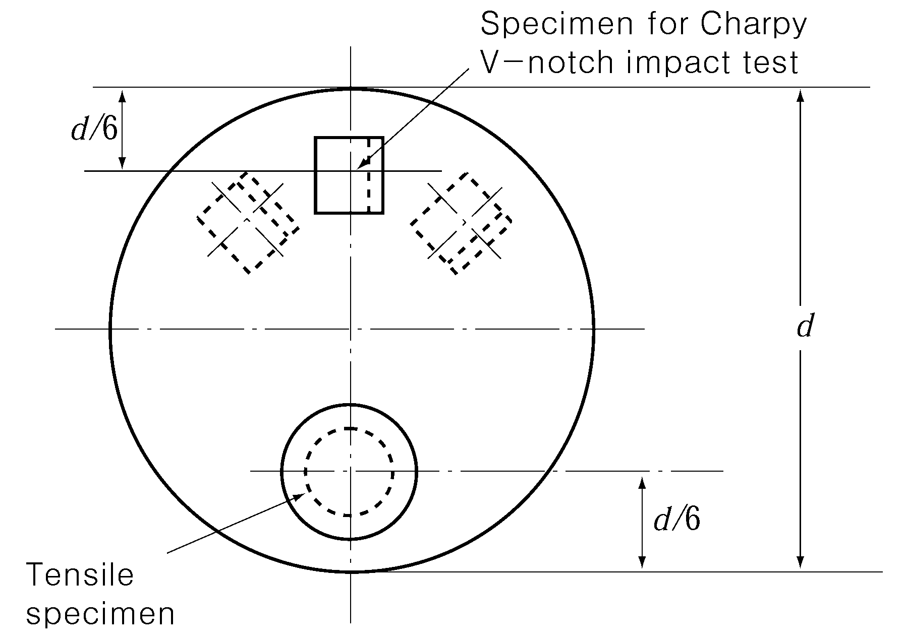
    **Fig 2.1.5 Selection of test specimens**
  - **(4)** The longitudinal axis of the notch is to correspond approximately to the radial direction of each test specimen.
- **8.** **Surface inspection and verification of dimensions**
  - **(1)** Surface inspection for all grades is to be carried out and it is to be confirmed that there are no harmful defects.
  - **(2)** The diameter and roundness of all grades of chain bars are to be within the tolerances specified in **Table 2.1.25.**

    **Table 2.1.25 Dimensional tolerance**

    | Nominal Diameter (mm) ^(^1) | Tolerance on diameter (mm) | Tolerance on roundness (*d - d*) (mm) ^(^2) |
    | --- | --- | --- |
    | less than 25 | -0, +1.0 | 0.6 max. |
    | 25 ~ 35 | -0, +1.2 | 0.8 max. |
    | 36 ~ 50 | -0, +1.6 | 1.1 max. |
    | 51 ~ 80 | -0, +2.0 | 1.50 max. |
    | 81 ~ 100 | -0, +2.6 | 1.95 max. |
    | 101 ~ 120 | -0, +3.0 | 2.25 max. |
    | 121 ~ 160 | -0, +4.0 | 3.00 max. |
    | NOTES: (1) For nominal diameter of bar materials which have more than 161 mm, dimensional tolerances are to be as deemed appropriate by the Society. (2) d and d mean the maximum and minimum diameter of a round bar. |   |   |
- **9.** **Retest procedures**
  - **(1)** Where the tensile test and impact tests from the first test specimen selected fails to meet the requirements, additional tests may be conducted according to the requirements given in **109.**
  - **(2)** If failure to pass the tensile test or impact test is definitely attributable to improper heat treatment of the test sample, a new test sample may be taken from the same piece and reheat treated. The complete test (both tensile and impact test) is to be repeated; and the original results obtained may be disregarded.
- **10.** **Marking**
  Chain bars which have satisfactorily complied with the required tests are to be marked with identification marks in accordance with the requirements in **110.**

#### 307. Rolled steel bars for boiler

- **1.** **Application**
  - **(1)** These requirements are to apply to hot rolled steel bars intended to be used for the stay bolts for boilers (hereinafter referred to as "steel bars").
  - **(2)** The steel bars having characteristics differing from those specified in **307.** are to comply with the requirements of **101. 2.**
- **2.** **Kinds**
  The steel bars are classified as specified in **Table 2.1.26.**

  **Table 2.1.26 Grades and Chemical Composition**

  | Grade | Chemical composition ($\%$) |   |   |
  | --- | --- | --- | --- |
  | Grade | C | S | P |
  | *RSB* 42 | 0.30 max. | 0.04 max. | 0.05 max. |
  | *RSB* 46 | 0.33 max. | 0.04 max. | 0.05 max. |
- **3.** **Heat treatment**
  The heat treatment of steel bars is to be as deemed appropriate by the Society. **【See Guidance】**
- **4.** **Chemical composition**
  The chemical composition of steel bars is to comply with the requirements given in **Table 2.1.26.**
- **5.** **Mechanical properties**
  The mechanical properties of steel bars are to comply with the following requirements.
  - **(1)** The tensile test of steel bars is to comply with the requirements given in **Table 2.1.27.**

    **Table 2.1.27 Mechanical Properties**

    | Grade | Yield strength ($\mathrm{N}/mm ^{2}$) | Tensile strength ($\mathrm{N}/mm ^{2}$) | Elongation($\%$) ($L=5.65 \sqrt {A}$) |
    | --- | --- | --- | --- |
    | *RSB* 42 | 225 min. | 410~490 | 24 min. |
    | *RSB* 46 | 245 min. | 450~540 | 22 min. |
    | NOTE: The required value of yield strength for the steel bars exceeding 100 mm in diameter may be taken as 205 $\mathrm{N}/mm ^{2}$ for *RSB* 42 and 225 $\mathrm{N}/mm ^{2}$ for *RSB* 46, regardless of the above requirements. |   |   |   |
  - **(2)** The bend test specimen is to stand being bent cold through 180 degrees without cracking on the outside of the bent portion to an inside radius given in **Table 2.1.28.**

    **Table 2.1.28 Bend Test**

    | Dia. of bar (mm) | Ratio of inside radius of bend to diameter of test specimen |   |
    | --- | --- | --- |
    | Dia. of bar (mm) | *RSB* 42 | *RSB* 46 |
    | $d$≤25 | $\frac{3}{4}$ | 1 |
    | 25＜$d$≤50 | 1 | $1 \frac{1}{4}$ |
    | 50＜$d$≤75 | $1 \frac{1}{4}$ | $1 \frac{1}{4}$ |
    | 75＜$d$ | $1 \frac{1}{4}$ | $1 \frac{1}{2}$ |
- **6.** **Selection of test samples**
  For the test samples of steel bars, steel bars which belong to the same cast manufactured by the same process and where the amount of scatter is to be less than 10 mm in diameter, are to be treated as one lot, and test samples are to be taken from each lot accord ing to the mass of the lot and to the requirements provided in **Table 2.1.29.**

  **Table 2.1.29 Number of Test Samples**

  | Weight of group (ton) | Number of test samples |
  | --- | --- |
  | 25 and under | 1 each |
  | Over 25 up to 30 | 2 each |
  | Over 30 | 2 each plus 1 each for each 10 tons of excess or fraction thereof |
- **7.** **Selection of test specimens**
  - **(1)** Each one piece of tensile and bend test specimen is to be taken from one test sample.
  - **(2)** Test specimens are to be taken with their longitudinal axis parallel to the final direction of rolling.
  - **(3)** Tensile test specimens are to be taken from the sample in the longitudinal direction at a depth of 1/6 diameter from the surface or as close as possible to this position. (See **Fig 2.1.5**)
- **8.** **Tolerance for diameter**
  The tolerance for diameter of the steel bars is to comply with the requirements in **Table 2.1.30.**

  **Table 2.1.30 Tolerance for Diameter**

  | Diameter of bar (mm) | Tolerance |
  | --- | --- |
  | $d$ ＜ 16 | ± 0.4 mm |
  | 16 ≤ $d$ ＜ 28 | ± 0.5 mm |
  | 28 ≤ $d$ | ± 1.8 $\%$ |
- **9.** **Marking**
  Steel bars which have satisfactorily complied with the required tests are to be marked with the identification mark in accordance with the requirements in **110..**

#### 308. High strength steels for welded structures (2017)

- **1.** **Application**
  - **(1)** The requirements given in **308.** are to apply to hot-rolled, fine-grain, weldable high strength structural steels intended for use in marine and offshore structural applications, tanks of liquefied gas carriers and process pressure vessels (hereinafter referred to as "steels")
  - **(2)** Any requirements regarding the steels over specified maximum thickness of **Table 2.1.32** are left to the discretion of the Society. **【See Guidance】**
  - **(3)** Product forms other than rolled steels, such as seamless tubulars, may be provided to the requirements given in **308.**.
  - **(4)** The requirements other than those specified in **308.** are applicable to the requirements in **301.**.
  - **(5)** Steels having characteristics differing from those specified in **308.** are to comply with the requirements in **101. 2**.
- **2.** **Kinds**
  Steels are classified as specified in **Table 2.1.31**.

  **Table 2.1.31 Grade of Steels**

  | Kind |   | Grade |
  | --- | --- | --- |
  | Weldable high strength steel | Plates, wide flats, sections, bars and seamless tubulars | *AH* 43, *DH* 43, *EH* 43, *FH* 43 |
  | Weldable high strength steel | Plates, wide flats, sections, bars and seamless tubulars | *AH* 47, *DH* 47, *EH* 47, *FH* 47 |
  | Weldable high strength steel | Plates, wide flats, sections, bars and seamless tubulars | *AH* 51, *DH* 51, *EH* 51, *FH* 51 |
  | Weldable high strength steel | Plates, wide flats, sections, bars and seamless tubulars | *AH* 56, *DH* 56, *EH* 56, *FH* 56 |
  | Weldable high strength steel | Plates, wide flats, sections, bars and seamless tubulars | *AH* 63, *DH* 63, *EH* 63, *FH* 63 |
  | Weldable high strength steel | Plates, wide flats, sections, bars and seamless tubulars | *AH* 70, *DH* 70, *EH* 70, *FH* 70 |
  | Weldable high strength steel | Plates, wide flats, sections, bars and seamless tubulars | *AH* 90, *DH* 90, *EH* 90 |
  | Weldable high strength steel | Plates, wide flats, sections, bars and seamless tubulars | *AH* 97, *DH* 97, *EH* 97 |
- **3.** **Manufacturing process**
  - **(1)** The maximum thickness of slab, billet or bloom from the continuous casting process is to be at the manufacturer’s discretion. The rolling reduction ratio of slab, billet, bloom or ingot is not to be less than 3:1 unless agreed at the time of approval.
  - **(2)** The maximum thickness by heat treatment and grade is to comply with the requirements given in **Table 2.1.32**.
  - **(3)** Vacuum degassing is to be used for all steels with enhanced through-thickness properties and with specified yield point of 690 N/mm^2, 890 N/mm^2, 960 N/mm^2.
  - **(4)** The steel is to be fine grain treated, and is to have a fine grain structure. The fine grain practice is to be as detailed in the manufacturing specification. **【See Guidance】**
  - **(5)** The steels is to contain nitrogen binding elements as detailed in the manufacturing specification. Also see note (4) in **Table 2.1.33**.
  - **(6)** Steels approved by the procedures given in Manufacturing Process Approval with respect to Heat Treatment are suitable for stress relieving heat treatment such as post-weld heat treatment and stress relieving heat treatment after cold forming for the purpose of reducing the risk of brittle fracture, increasing the fatigue lifetime and dimensional stability for machining.

    **Table 2.1.32 Max. thickness by heat treatment and grade**

    | Heat treatment(1) | Max. thickness (mm) |   |   |   |
    | --- | --- | --- | --- | --- |
    | Heat treatment(1) | Plates | Sections | Bars | Tubulars |
    | *N* | 250(3) | 50 | 250 | 65 |
    | *CR* | 150 | (2) |   |   |
    | *TMCP* | 150 | 50 | - | - |
    | *QT* | 150(3) | 50 | - | 50 |
    | NOTE: (1) The definition of heat treatment is in accordance with note (1) of **Table 2.1.9** in **301.**. (2) The maximum thickness limits of sections, bars and tubulars produced by CR process route are less than those manufactured by N route, and are to be at the discretion of the Society. (3) Approval for N steels with thickness larger than 250 mm and QT steels with thickness larger than 150 mm is subject to the special consideration of the Society. |   |   |   |   |
- **4.** **Deoxidation practice and chemical composition**
  - **(1)** The deoxidation practice and chemical composition of steels are to comply with the requirements given in **Table 2.1.33**. Where deemed necessary, other elements than specified in **Table 2.1.33** may be added. Elements used for alloying, nitrogen binding, and fine grain treatment, and as well as the residual elements are to be as detailed in the manufacturing specification.
  - **(2)** The maximum values for carbon equivalent(Ceq or CET) and cold cracking susceptibility(Pcm) are to comply with the requirement in **Table 2.1.34**.
- **5.** **Heat treatment**
  The steels are to be in heat treatment approved by the Society in accordance with the follows and **Table 2.1.33**.
  - **(1)** Normalized(N)
  - **(2)** Controlled rolling(CR)
  - **(3)** Thermo-mechanical controlled rolling(TMCP)
  - **(4)** Quenched and Tempered(QT)
- **6.** **Mechanical properties**
  - **(1)** The mechanical properties of steels are to comply with the requirements given in Table 2.1.35.
  - **(2)** Where deemed necessary by the Society, other test on notch-toughness and weldability may be required in addition to the tests specified in **Table 2.1.35**. **【See Guidance】**
- **7.** **Selection of test samples**
  - **(1)** Tensile test sample is to be randomly selected from each batch that is to be less than or equal to 25 tonnes, and to be from the same cast, in the same heat treatment and of the same thickness. **【See Guidance】**
  - **(2)** Impact test sample is to be selected as follows;
  - **(3)** The requirements specified in **301. 6** (4) are to be applied to the selection of the test samples.

    **Table 2.1.33 Heat treatment, Deoxidation Practice and Chemical Composition (%)**

    | Heat treatment (1) | Grade | Deoxidation practice | Chemical composition^(^2)(8) |   |   |   |   |   |   |   |   |   |   |   |   |   |   |
    | --- | --- | --- | --- | --- | --- | --- | --- | --- | --- | --- | --- | --- | --- | --- | --- | --- | --- |
    | Heat treatment (1) | Grade | Deoxidation practice | $C$ ($\%$) | $Si$ ($\%$) | $Mn$ ($\%$) | $P$^(^3) ($\%$) | $S$^(^3) ($\%$) | $Cu$ ($\%$) | $Cr$ ^(^5) ($\%$) | $N i$^(^6) ($\%$) | $Mo$ (5) ($\%$) | $A1$ (4) total ($\%$) | $Nb$ (5) ($\%$) | $V$^(^5) ($\%$) | $Ti$^(^5) ($\%$) | $N$ ($\%$) | $O$^(^7) (ppm) |
    | N, CR | AH 43, AH 47, DH 43, DH 47 | Fully killed fine grain | 0.2 max. | 0.6 max. | 1.0~ 1.7 | 0.03 max. | 0.025 max. | 0.55max. | 0.3 max. | 0.8 max. | 0.1 max. | 0.02min. | 0.05max. | 0.2 max. | 0.05max. | 0.025 max. | - |
    | N, CR | EH 43, EH 47 | Fully killed fine grain | 0.18 max. | 0.6 max. | 1.0~ 1.7 | 0.025 max. | 0.02 max. | 0.55max. | 0.3 max. | 0.8 max. | 0.1 max. | 0.02min. | 0.05max. | 0.2 max. | 0.05max. | 0.025 max. | - |
    | TM CP | AH 43 , AH 47, AH 51, AH 56, AH 63, AH 70, AH 90, DH 43, DH 47, DH 51, DH 56, DH 63, DH 70 | Fully killed fine grain | 0.16 max. | 0.6 max. | 1.0~1.7 | 0.025 max. | 0.015max. | 0.55max. | 0.5 max. | 2.0 max. | 0.5 max. | 0.02min. | 0.05max. | 0.12max. | 0.05max. | 0.025 max. | - |
    | TM CP | DH 90, EH 43, EH 47, EH 51, EH 56, EH 63, EH 70, EH 90, FH 43, FH 47, FH 51, FH 56, FH 63, FH 70 | Fully killed fine grain | 0.14 max. | 0.6 max. | 1.0~1.7 | 0.02 max. | 0.01 max. | 0.55max. | 0.5 max. | 2.0 max. | 0.5 max. | 0.02min. | 0.05max. | 0.12max. | 0.05max. | 0.025 max. | 50 max. |
    | QT | AH 43 , AH 47, AH 51, AH 56, AH 63, AH 70, AH 90, AH 97, DH 43, DH 47, DH 51, DH 56, DH 63, DH 70 | Fully killed fine grain | 0.18 max. | 0.8 max. | 1.7 max. | 0.025 max. | 0.015max. | 0.5 max. | 1.5 max. | 2.0 max. | 0.7 max. | 0.018 min. | 0.06 max. | 0.12max. | 0.05max. | 0.015 max. | - |
    | QT | DH 90, DH 97, EH 43, EH 47, EH 51, EH 56, EH 63, EH 70, EH 90, EH 97, FH 43, FH 47, FH 51, FH 56, FH 63, FH 70 | Fully killed fine grain | 0.18 max. | 0.8 max. | 1.7 max. | 0.02 max. | 0.01 max. | 0.5 max. | 1.5 max. | 2.0 max. | 0.7 max. | 0.018 min. | 0.06 max. | 0.12max. | 0.05max. | 0.015 max. | 30 max. |
    | NOTE: (1) The definition of heat treatment is in accordance with note (1) of **Table 2.1.9** in **301.**. (2) The chemical composition is to be determined by ladle analysis and is to meet the approved manufacturing specification at the time of approval. (3) For sections the *P* and *S* content can be 0.005 % higher than the value specified in the table. (4) The total aluminium to nitrogen ratio is to be a minimum of 2:1. When other nitrogen binding elements are used, the minimum *Al* value and *Al*/*N* ratio do not apply. (5) Total *Nb*+*V*+*Ti* ≤ 0.26 % and *Mo*+*Cr* ≤0.65%, not applicable for *QT* steels. (6) Higher *Ni* content may be approved at the discretion of the Society. (7) The requirement on maximum Oxygen content is only applicable to *DH90*, *EH90*, *DH97* and *EH97*. (8) when boron is deliberately added for enhancement of hardenability of the steels, the maximum content of the boron content is not to be higher than 0.005%; and the analysis result is to be reported. |   |   |   |   |   |   |   |   |   |   |   |   |   |   |   |   |   |

    **Table 2.1.34 Carbon equivalent(***Ceq* **or** *CET***) and Cold cracking susceptibility(***Pcm***)**

    | Grade | Heat treatment | Carbon equivalent (%) |   |   |   |   |   |   | Cold cracking susceptibility (%) |
    | --- | --- | --- | --- | --- | --- | --- | --- | --- | --- |
    | Grade | Heat treatment | Ceq^(^1) |   |   |   |   |   | CET^(^1)(2) | Pcm^(^1)(3) |
    | Grade | Heat treatment | Plates |   |   | Sections | Bars | Tubulars | All | All |
    | Grade | Heat treatment | $t$≤ 50 (mm) | 50 < $t$ ≤ 100 (mm) | 100 < $t$ ≤ 250 (mm) | $t$ ≤50 (mm) | $t$ ≤ 250 (mm) | $t$≤ 65 (mm) | All | All |
    | AH 43, DH 43, EH 43, FH 43 | N, CR | 0.46 max. | 0.48 max. | 0.52 max. | 0.47 max. | 0.53 max. | 0.47 max. | - | - |
    | AH 43, DH 43, EH 43, FH 43 | TMCP | 0.43 max. | 0.45 max. | 0.47 max. | 0.44 max. | - | - | - | - |
    | AH 43, DH 43, EH 43, FH 43 | QT | 0.45 max. | 0.47 max. | 0.49 max. | - | - | 0.46 max. | - | - |
    | AH 47, DH 47, EH 47, FH 47 | N, CR | 0.50 max. | 0.52 max. | 0.54 max. | 0.51 max. | 0.55 max. | 0.51 max. | 0.25 max. | - |
    | AH 47, DH 47, EH 47, FH 47 | TMCP | 0.45 max. | 0.47 max. | 0.48 max. | 0.46 max. | - | - | 0.30 max. | 0.23 max. |
    | AH 47, DH 47, EH 47, FH 47 | QT | 0.47 max. | 0.48 max. | 0.50 max. | - | - | 0.48 max. | 0.32 max. | 0.24 max. |
    | AH 51, DH 51, EH 51, FH 51 | TMCP | 0.46 max. | 0.48 max. | 0.50 max. | - | - | - | 0.32 max. | 0.24 max. |
    | AH 51, DH 51, EH 51, FH 51 | QT | 0.48 max. | 0.50 max. | 0.54 max. | - | - | 0.50 max. | 0.34 max. | 0.25 max. |
    | AH 56, DH 56, EH 56, FH 56 | TMCP | 0.48 max. | 0.50 max. | 0.54 max. | - | - | - | 0.34 max. | 0.25 max. |
    | AH 56, DH 56, EH 56, FH 56 | QT | 0.56 max. | 0.60 max. | 0.64 max. | - | - | 0.56 max. | 0.36 max. | 0.28 max. |
    | AH 63, DH 63, EH 63, FH 63 | TMCP | 0.50 max. | 0.52 max. | - | - | - | - | 0.34 max. | 0.26 max. |
    | AH 63, DH 63, EH 63, FH 63 | QT | 0.56 max. | 0.60 max. | 0.64 max. | - | - | 0.58 max. | 0.38 max. | 0.30 max. |
    | AH 70, DH 70, EH 70, FH 70 | TMCP | 0.56 max. | - | - | - | - | - | 0.36 max. | 0.30 max. |
    | AH 70, DH 70, EH 70, FH 70 | QT | 0.64 max. | 0.66 max. | 0.70 max. | - | - | 0.68 max. | 0.40 max. | 0.33 max. |
    | AH 90, DH 90, EH 90 | TMCP | 0.60 max. | - | - | - | - | - | 0.38 max. | 0.28 max. |
    | AH 90, DH 90, EH 90 | QT | 0.68 max. | 0.75 max. | - | - | - | - | 0.40 max. | - |
    | AH 97, DH 97, EH 97 | QT | 0.75 max. | - | - | - | - | - | 0.40 max. | - |
    | NOTE: (1) *Ceq*, *CET* and *Pcm* are to be obtained from the following formula: $Ceq=C+ \frac{Mn}{6} + \frac{Cr+Mo+V}{5} + \frac{N i +Cu}{15} \left( \% \right)$, $CET=C+ \frac{(Mn+Mo)}{10} + \frac{(Cr+Cu)}{20} + \frac{N i}{40} \left( \% \right)$, $Pcm = C + \frac{Si}{30} + \frac{Mn}{20} + \frac{Cu}{20} + \frac{N i}{60} + \frac{Cr}{20} + \frac{Mo}{15} + \frac{V}{10} +5B$ (2) For steel of minimum yield strength 460 N/mm2 and higher, CET may be used instead of Ceq at the discretion of the manufacturer. (3) For *TMCP* and *QT* steels with carbon content not more than 0.12%, the cold cracking susceptibility *Pcm* for evaluating weldability may be used instead of carbon equivalent of *Ceq* or *CET* at manufacturer’s discretion. |   |   |   |   |   |   |   |   |   |

    **Table 2.1.35 Mechanical Properties**

    | Grade | Heat treatment | Tensile test^(^1) |   |   |   |   |   |   | Impact test^(^1)(2) |   |   |
    | --- | --- | --- | --- | --- | --- | --- | --- | --- | --- | --- | --- |
    | Grade | Heat treatment | Yield strength ($\mathrm{N}/mm ^{2}$) |   |   | Tensile strength ($\mathrm{N}/mm ^{2}$) |   | Elongation ($\%$)^(^3) ($L=5.65 \sqrt {A}$) |   | Test temp.^(^4) (℃) | Average absorbed energy (J) |   |
    | Grade | Heat treatment | Nominal thickness t (mm)(5) |   |   | Nominal thickness t (mm)(5) |   | Elongation ($\%$)^(^3) ($L=5.65 \sqrt {A}$) |   | Test temp.^(^4) (℃) | Average absorbed energy (J) |   |
    | Grade | Heat treatment | 3≤t≤50 | 50 100 3≤t≤100 100 $L$ $T$^(^6) $L$ $T$ |   |   |   |   |   |   |   |   |
    | AH 43 | N, CR, TMCP, QT | 420 min. | 390 min. | 365 min. | 520∼680 | 470~650 | 21 min. | 19 min. | 0 | 42 min. | 28 min. |
    | DH 43 | N, CR, TMCP, QT | 420 min. | 390 min. | 365 min. | 520∼680 | 470~650 | 21 min. | 19 min. | ­20 | 42 min. | 28 min. |
    | EH 43 | N, CR, TMCP, QT | 420 min. | 390 min. | 365 min. | 520∼680 | 470~650 | 21 min. | 19 min. | ­40 | 42 min. | 28 min. |
    | FH 43 | N, CR, TMCP, QT | 420 min. | 390 min. | 365 min. | 520∼680 | 470~650 | 21 min. | 19 min. | ­60 | 42 min. | 28 min. |
    | AH 47 | N, CR, TMCP, QT | 460 min. | 430 min. | 390 min. | 540∼720 | 500~710 | 19 min. | 17 min. | 0 | 46 min. | 31 min. |
    | DH 47 | N, CR, TMCP, QT | 460 min. | 430 min. | 390 min. | 540∼720 | 500~710 | 19 min. | 17 min. | ­20 | 46 min. | 31 min. |
    | EH 47 | N, CR, TMCP, QT | 460 min. | 430 min. | 390 min. | 540∼720 | 500~710 | 19 min. | 17 min. | ­40 | 46 min. | 31 min. |
    | FH 47 | N, CR, TMCP, QT | 460 min. | 430 min. | 390 min. | 540∼720 | 500~710 | 19 min. | 17 min. | ­60 | 46 min. | 31 min. |
    | AH 51 | TMCP, QT | 500 min. | 480 min. | 440 min. | 590∼770 | 540~720 | 19 min. | 17 min. | 0 | 50 min. | 33 min. |
    | DH 51 | TMCP, QT | 500 min. | 480 min. | 440 min. | 590∼770 | 540~720 | 19 min. | 17 min. | ­20 | 50 min. | 33 min. |
    | EH 51 | TMCP, QT | 500 min. | 480 min. | 440 min. | 590∼770 | 540~720 | 19 min. | 17 min. | ­40 | 50 min. | 33 min. |
    | FH 51 | TMCP, QT | 500 min. | 480 min. | 440 min. | 590∼770 | 540~720 | 19 min. | 17 min. | ­60 | 50 min. | 33 min. |
    | AH 56 | TMCP, QT | 550 min. | 530 min. | 490 min. | 640∼820 | 590~770 | 18 min. | 16 min. | 0 | 55 min. | 37 min. |
    | DH 56 | TMCP, QT | 550 min. | 530 min. | 490 min. | 640∼820 | 590~770 | 18 min. | 16 min. | ­20 | 55 min. | 37 min. |
    | EH 56 | TMCP, QT | 550 min. | 530 min. | 490 min. | 640∼820 | 590~770 | 18 min. | 16 min. | ­40 | 55 min. | 37 min. |
    | FH 56 | TMCP, QT | 550 min. | 530 min. | 490 min. | 640∼820 | 590~770 | 18 min. | 16 min. | ­60 | 55 min. | 37 min. |
    | AH 63 | TMCP, QT | 620 min. | 580 min. | 560 min. | 700∼890 | 650~830 | 17 min. | 15 min. | 0 | 62 min. | 41 min. |
    | DH 63 | TMCP, QT | 620 min. | 580 min. | 560 min. | 700∼890 | 650~830 | 17 min. | 15 min. | ­20 | 62 min. | 41 min. |
    | EH 63 | TMCP, QT | 620 min. | 580 min. | 560 min. | 700∼890 | 650~830 | 17 min. | 15 min. | ­40 | 62 min. | 41 min. |
    | FH 63 | TMCP, QT | 620 min. | 580 min. | 560 min. | 700∼890 | 650~830 | 17 min. | 15 min. | ­60 | 62 min. | 41 min. |
    | AH 70 | TMCP, QT | 690 min. | 650 min. | 630 min. | 770∼940 | 710~900 | 16 min. | 14 min. | 0 | 69 min. | 46 min. |
    | DH 70 | TMCP, QT | 690 min. | 650 min. | 630 min. | 770∼940 | 710~900 | 16 min. | 14 min. | ­20 | 69 min. | 46 min. |
    | EH 70 | TMCP, QT | 690 min. | 650 min. | 630 min. | 770∼940 | 710~900 | 16 min. | 14 min. | ­40 | 69 min. | 46 min. |
    | FH 70 | TMCP, QT | 690 min. | 650 min. | 630 min. | 770∼940 | 710~900 | 16 min. | 14 min. | ­60 | 69 min. | 46 min. |
    | AH 90 | TMCP, QT | 890 min. | 830 min. | - | 940~1100 | - | 13 min. | 11 min. | 0 | 69 min. | 46 min. |
    | DH 90 | TMCP, QT | 890 min. | 830 min. | - | 940~1100 | - | 13 min. | 11 min. | ­20 | 69 min. | 46 min. |
    | EH 90 | TMCP, QT | 890 min. | 830 min. | - | 940~1100 | - | 13 min. | 11 min. | ­40 | 69 min. | 46 min. |
    | AH 97 | QT | 960 min. | - | - | 980~1150 | - | 12 min. | 10 min. | 0 | 69 min. | 46 min. |
    | DH 97 | QT | 960 min. | - | - | 980~1150 | - | 12 min. | 10 min. | ­20 | 69 min. | 46 min. |
    | EH 97 | QT | 960 min. | - | - | 980~1150 | - | 12 min. | 10 min. | ­40 | 69 min. | 46 min. |
    | NOTE: (1) *L* (or *T*) denotes that the longitudinal axis of the test specimen is arranged parallel (or transverse) to the final direction of rolling (2) When the absorbed energy of two or more test specimens among a set of test specimens is less in value than the specified average absorbed energy or when the absorbed energy of a single test specimen is less in value than 70 % of the specified average absorbed energy, the test is considered to have failed. (3) The minimum elongation for *R1B* test specimen (*L*=200mm) is to be in compliance with the requirements given in **Table 2.1.36**. (4) The requirements for Impact test of steels specified in **Pt 7**, **Ch 5** and **Rules/Guidance for the Classification of Ships Using Low-flashpoint Fuels** are to be accordance with the applicable Rules, respectively. *(2025)* (5) For plates and sections for applications, such as racks in offshore platforms etc, where the design requires that tensile properties are maintained through the thickness, a decrease in the minimum specified tensile properties is not permitted with an increase in the thickness. (6) In the case of product forms other than plates and wide flats where longitudinal tests are agreed, the elongation values are to be 2 percentage units above those transverse requirements as listed in this Table. |   |   |   |   |   |   |   |   |   |   |   |

    **Table 2.1.36 The minimum elongation for** *R1B* **test specimen (***L***=200mm)(1)**

    | Grade | Thickness t (mm) |   |   |   |   |   |   |
    | --- | --- | --- | --- | --- | --- | --- | --- |
    | Grade | $t$≤10 | 10<$t$≤15 | 15<$t$≤20 | 20<$t$≤25 | 25<$t$≤40 | 40<$t$≤50 | 50<$t$≤70 |
    | AH43, DH 43, EH 43, FH 43 | 11 | 13 | 14 | 15 | 16 | 17 | 18 |
    | AH47, DH 47, EH 47, FH 47 | 11 | 12 | 13 | 14 | 15 | 16 | 17 |
    | AH51, DH 51, EH 51, FH 51 | 10 | 11 | 12 | 13 | 14 | 15 | 16 |
    | AH56, DH 56, EH 56, FH 56 | 10 | 11 | 12 | 13 | 14 | 15 | 16 |
    | AH63, DH 63, EH 63, FH 63 | 9 | 11 | 12 | 12 | 13 | 14 | 15 |
    | AH70, DH 70, EH 70, FH 70 | 9^(^2) | 10^(^2) | 11^(^2) | 11 | 12 | 13 | 14 |
    | NOTE: (1) This tabulated elongation minimum values are the requirements for testing specimen in transverse direction. Specimens of specified minimum yield strength 890 N/mm2 and 960 N/mm2 which are not included in this table are to be proportional specimens with a gauge length of $L=5.65 \sqrt {A}$. (2) For specified minimum yield strength 690 N/mm2 plates with thickness ≤ 20 mm, round specimen R14A may be used instead of the flat tensile specimen. The minimum elongation for testing specimen in transverse direction is 14%. |   |   |   |   |   |   |   |
- **8.** **Selection of test specimens**
  - **(1)** Tensile test specimens are to comply with the requirements shown in (a) to (c) below:
  - **(2)** Impact test specimens are to be taken as follows;
- **9.** **Surface inspection and verification of dimensions**
  - **(1)** Surface inspection and verification of dimensions are to be in accordance with requirements specified in **301. 8**.
  - **(2)** If required by the Society, ultrasonic examination is to be carried out in accordance with 301. 9 (2) for the requirement of internal soundness, and is to be performed in accordance with an approved standard.
  - **(3)** For steels designated with improved through thickness properties, through thickness tensile tests are to be performed in accordance with **310.**. Subject to the discretion of the Society, through thickness tensile strength may be required to be not less than 80 % of the specified minimum tensile strength.
- **10.** **Retest procedures**
  - **(1)** Where the tensile test from the first test specimen selected fails to meet the requirements, additional tests may be conducted according to the requirements given in **109. 1**.
  - **(2)** Regarding the impact tests, additional tests are to be carried out according to the requirements given in **109. 2**.
- **11.** **Marking**
  Steels which have satisfactorily complied with the required tests are to be marked with the identification mark in accordance with the requirements in **110.** For steels to which the requirements given in Note (4) of **Table 2.1.35** have been applied, the "impact test temperature T" are to be suffixed to the marking. (e.g. *DH* 63-25T)
- **12.** **Test certificates**
  The Surveyor is to be supplied with two copies, of the test certificates for all accepted materials. In addition to the description, dimensions, etc., of the material, the following particulars are to be included:
  - **(1)** Purchaser's order number
  - **(2)** Identification of the cast and piece
  - **(3)** Manufacturer’s identification
  - **(4)** Identification of the grade of steel
  - **(5)** Chemical analysis
  - **(6)** Ceq, CET or Pcm value
  - **(7)** Heat treatment condition and temperatures
  - **(8)** Mechanical properties test results, including traceable test identification
  - **(9)** Surface quality and inspection results
  - **(10)** UT result, where applicable
  - **(11)** Through thickness properties of **310.**, where applicable

#### 309. Stainless clad steel plates

- **1.** **Application**
  - **(1)** The requirements in **309.** are to apply to the stainless clad steels not exceeding 50 mm in thickness intended for tanks of ships carrying dangerous chemicals in bulk, tank circumference hull construction units and corrosion-resisting tanks (hereinafter referred to as "steel plates").
  - **(2)** The requirements other than those specified in **309.** are to be in accordance with the requirements in **301.**.
  - **(3)** Steel plates over 50 mm in thickness and having characteristics differing from those specified in **309.** are to comply with the requirements in **101. 2**.
- **2.** **Process of manufacture**
  - **(1)** Manufacture of steel plates is to comply with the processes shown in (a) to (e) below:
  - **(2)** Application of any other process of manufacture than those specified in (1) is left to the discretion of the Society. **【See Guidance】**
- **3.** **Structural metals**
  - **(1)** Base and clad materials for steel plates are to be mild & higher strength steel plates of rolled steels for hull specified in **301.** and steel plates of rolled stainless steels specified in **305.,** respectively. In case of overlay rolling or cast rolling, clad materials are to comply with the specified chemical composition of welding materials or stainless steel casting applied as a clad. *(2023)*
  - **(2)** The material grade marks are to be signified by a combination of base metal and clad material. (ex. *A* + *RSTS*316)
- **4.** **Heat treatment**
  The steel plates are to comply with the requirements for heat treatment of the base metal.
- **5.** **Mechanical properties 【 See Guidance】**
  - **(1)** The mechanical properties of steel plates are to comply with the requirements given in **Table 2.1.37**.

    **Table 2.1.37 Mechanical Properties** ***(2023)***

    | Grade | Tensile test(1) |   |   | Shearing strength test(3) | Impact test |
    | --- | --- | --- | --- | --- | --- |
    | Grade | Yield strength ($\mathrm{N}/mm ^{2}$) | Tensile strength ($\mathrm{N}/mm ^{2}$) | Elongation ($\%$) | Shearing strength ($\mathrm{N}/mm ^{2}$) | Impact test |
    | *A* *B* *D* *E* | 235 min. | $\sigma _{B}$ min.(2) | To be complied with requirement for base metal | 200 min. | To be complied with requirement for base metal |
    | *AH32, AH36,* *DH32, DH36,* *EH32, EH36, FH32, FH36* | $\sigma _{\gamma}$ min.(2) | $\sigma _{B}$ min.(2) | To be complied with requirement for base metal | 200 min. | To be complied with requirement for base metal |
    | NOTES: (1) The tensile test specimen is to be R1B test specimen (*L*=200mm) (2) $\sigma _{\gamma}$ and $\sigma _{B}$ is to be obtained from the following formulas: $\sigma _{ \gamma } = \frac{t _{1} \sigma _{ \gamma 1} +t _{2} \sigma _{ \gamma 2}}{t _{1} +t _{2}}$, $\sigma _{B} = \frac{t _{1} \sigma _{1} +t _{2} \sigma _{2}}{t _{1} +t _{2}}$ where: $\sigma _{ \gamma }$ = Yield strength of steel plates ($\mathrm{N}/mm ^{2}$) $\sigma _{ \gamma 1}$ = Specified minimum yield strength of base metal ($\mathrm{N}/mm ^{2}$) $\sigma _{ \gamma 2}$ = Specified minimum yield strength of clad material ($\mathrm{N}/mm ^{2}$) $\sigma _{B}$ = Tensile strength of steel plates ($\mathrm{N}/mm ^{2}$) $\sigma _{1}$ = Specified minimum tensile strength of base metal ($\mathrm{N}/mm ^{2}$) $\sigma _{2}$ = Specified minimum tensile strength of clad material ($\mathrm{N}/mm ^{2}$) $t _{1}$ = Thickness of base metal (mm) $t _{2}$ = Thickness of clad material (mm) (3) Any requirement for the procedure of shear strength test is left to **Fig 2.1.6** or the discretion of the Society. In case of overlay rolling, shear strength test may be omitted. |   |   |   |   |   |

    | 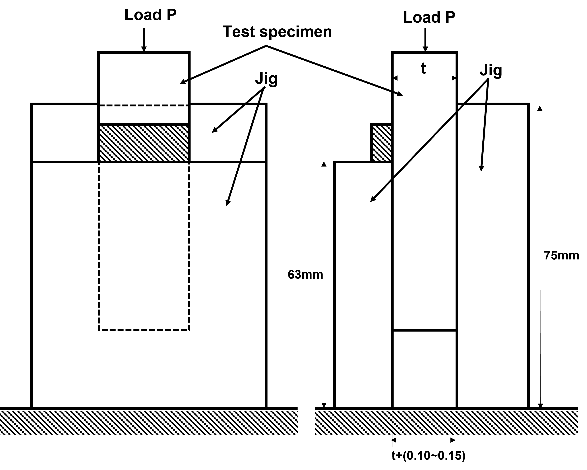 |
    | --- |
    | (Notes) 1. The dimensions of jig can be adjusted. 2. The clad material is peeled from the base metal parallel to the bonding surface. 3. Shear strength is to be obtained from the following formula: $\sigma _{ S } = \frac{P}{S}$ $\sigma _{ S }$ : Shear strength for clad steel plates P : Load S : apparent bonding area(S=W x 25, see **Fig 2.1.7**) |
    | **Fig 2.1.6 Test method for shear strength** ***(2023)*** |
  - **(2)** Where deemed necessary by the Society according to the use of steel plates, tests on corrosion resistance may be required. **【See Guidance】**
- **6.** **Selection of test samples**
  - **(1)** One test sample is to be taken from each steel plate, being from the same manufacturing process, which belong to the plate as rolled from a slab or ingot of a certain base metal. In case of overlay rolling, a separate test sample which is applied the same condition of manufacturing process can be made.
  - **(2)** The requirements specified in **301. 6** (4) are to be applied to the selection of the test samples.
- **7.** **Selection of test specimens**
  - **(1)** Tensile test specimens are to be taken according to the requirements specified in **301. 7** (2).
  - **(2)** Impact test specimens are to be taken according to the requirements specified in **301. 7** (3). In this case, the thickness of the test specimens is to agree with that of the base metal from which the clad material has been removed.
  - **(3)** Shearing strength test specimens are to be taken according to the requirements specified in the following (a) to (b):
    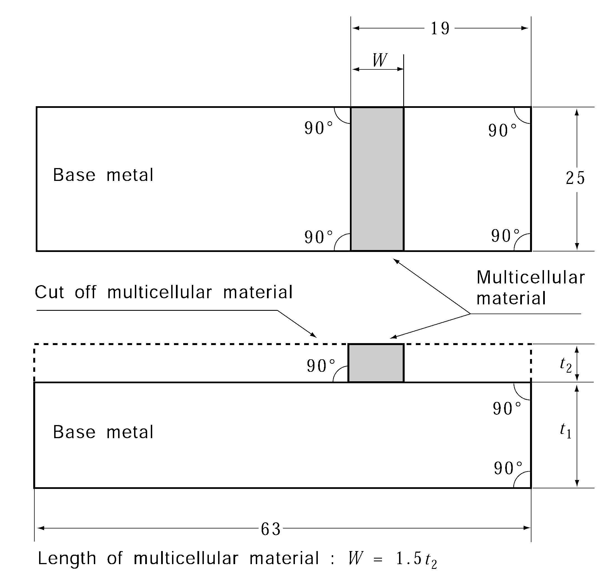
    **Fig 2.1.7 Size and Dimensions of Shearing Test Specimens (unit: mm)**
- **8.** **Surface inspection and verification of dimensions**
  The minus tolerance for the nominal thickness of plates is left to the discretion of the Society. **【See Guidance】**
- **9.** **Quality and repair of defects 【 See Guidance】**
  - **(1)** Each steel plate is to be subjected to ultrasonic testing. Any requirement for the test procedure is left to the discretion of the Society.
  - **(2)** Each cladding defects does not exceed 50 mm in length and 20 ㎠ in area. All defect areas do not exceed 1.5 % of the total surface in question.
  - **(3)** Any cladding defects over the length and area of (2) may be repaired by welding in accordance with the requirements given in **301. 9** (3)
- **10.** **Marking**
  - **(1)** The test certificates are to comply with the requirements given in **107.** and are to contain the particulars as to the process of manufacture of steel plates and the thickness of the clad material.
  - **(2)** Steel plates which have satisfactorily complied with the required tests are to be suffixed with the following marks relating to the process of manufacture of the steel plates, in addition to the marks showing the kinds of the base and clad materials. (e.g. *A* + *RSTS* 316 - *R*)
    Rolling : [-*R*]
    Cast rolling : [-*ER*]
    Explosive pressing : [-*B*]
    Explosive rolling : [-*BR*]
    Overlay rolling : [-*WR*]

#### 310. Additional requirements for through thickness properties

- **1.** **Application**
  - **(1)** The requirements in **310.** are to apply to hull structural rolled steels and weldable high strength steel plates and wide flats with thickness of 15 mm and over which is required improved through thickness properties to minimise the possibility of lamellar tearing during fabrication.
  - **(2)** The requirements are applicable to the other steels than the material specified in (1) above, where deemed appropriate by the Society. **【See Guidance】**
- **2.** **Through thickness properties**
  The through thickness properties of steels are to comply with the requirements given in **Table 2.1.38** as the result of tensile tests whose specimens are taken in the through thickness direction of the product.

  **Table 2.1.38 Through thickness properties**

  | Grade | Application | Reduction of area acceptance values(1) |   |
  | --- | --- | --- | --- |
  | Grade | Application | Minimum average(%) | Minimum individual(%) |
  | Z25 | normal use | 25 | 15 |
  | Z35 | severe service condition | 35 | 25 |
  | Note (1) The minimum average value for the reduction of area of at least 3 tensile test specimens taken in the through thickness direction must be that shown for the appropriate grade given in Table. Only one individual value may be below the minimum average but not less than minimum individual value shown for the appropriate grade. |   |   |   |
- **3.** **Deoxidation practice and chemical composition**
  In addition to the requirements of the appropriate steel specification given in **301.** or **308.**, the maximum sulphur content is to be 0.008% determined by the ladle analysis.
- **4.** **Selection of test specimens**
  - **(1)** For steel, of same thickness, belonging to the same charge and same heat treatment condition, one test sample is to be taken from each lot specified in **Table 2.1.39**.

    **Table 2.1.39 Batch size dependent on product and sulphur content**

    | Product | S＞0.005% | S≤0.005% |
    | --- | --- | --- |
    | Plates |   | <50> |
    | Wide flats of normal thickness ≤25mm | <10> | <50> |
    | Wide flats of normal thickness >25mm | <20> | <50> |
    | Note (1) In the Table, <50>, <20> and <10> each indicate that steels not greater than 50, 20 and 10 tones are to be taken as one lot;  indicates that steel rolled directly from one slab or steel ingot is to be taken as one lot. The term "piece" is understood to mean the rolled product from a single slab or ingot if this is rolled directly into plates, sections or bars. |   |   |
  - **(2)** The test samples are to be taken from one end (top of ingot when applicable) of the portion corresponding to the middle of the plates or flat bars as shown in **Fig 2.1.8**.
    
    **Fig 2.1.8 Selection of Test Samples**
- **5.** **Selection of test specimens**
  - **(1)** Three round tensile test specimens are to be taken from one test sample in the through thickness direction.
  - **(2)** The test specimens are to be taken according to the requirements for dimensions provided in **Table 2.1.40**.

    **Table 2.1.40 Dimensions of Specimen**

    | Product thickness $t$ (mm) | Diameter of test specimen $d$ (mm) | Parallel length $P$ (mm) |
    | --- | --- | --- |
    | 15 ≤ $t$ ≤ 25 | $d$ = 6 | $P$ ≥ 2$d$ |
    | $t$ ＞ 25 | $d$ = 10 | $P$ ≥ 2$d$ |
  - **(3)** Where the product thickness does not allow to prepare specimens of sufficient length suitable for the gripping jaws of the testing machine, the ends of the specimens may be built up by suitable welding methods. The welding is not to impair the portion of the specimen within the parallel length.
- **6.** **Retest procedure**
  - **(1)** Acceptance, rejection and retest criteria for the through thickness properties of steels are to comply with the requirements given in **Fig 2.1.9**.
    
    **Fig 2.1.9 Acceptance, rejection and retest criteria for the**
    **through thickness properties of steels**
  - **(2)** **Fig 2.1.9** shows the three cases where a retest situation is permitted. In these instances three more tensile tests are to be taken from the remaining test sample or remaining steel plates of same piece. The average of all 6 tensile tests is to be greater than the required minimum average with no greater than two results below the minimum average.
  - **(3)** In the case of failure after retest, either the lot represented by the piece is rejected or each piece within the lot is required to be tested.
  - **(4)** The test is considered invalid and further replacement test is required if the fracture occurs in the weld or heat affected zone.
- **7.** **Ultrasonic tests 【 See Guidance】**
  - **(1)** Ultrasonic testing should be carried out on each piece in the final supply condition.
  - **(2)** Any requirement for the test procedure and acceptance criteria are left to the discretion of the Society. However, the probe frequency is to be of 4MHz in general.
- **8.** **Marking**
  Steels which have satisfactorily complied with the requirements specified in **310.** are to have the notation Z25 or Z35 after the material grade mark. (e.g. *EH*36 *Z25, EH*36 *Z35*)

#### 311. YP47 Steels

- **1.** **Application**
  - **(1)** This requirements applies to the application of steel plates with thickness of over 50mm and not greater than 100mm and specified yield point of 460 $N/mm ^{2}$ to longitudinal structural members in the upper deck region of container carriers (such as hatch side coaming, hatch coaming top and the attached longitudinals).
  - **(2)** For YP47 steels outside scope of the said thickness range, special consideration is to be given by the Society. And special consideration is to be given to the application of YP47 steels for other hull structures. *(2021)*
  - **(3)** The requirements other than those specified in **311.** are applicable to the requirements in **301.**
  - **(4)** Brittle crack arrest steels are to be met the additional brittle crack arrest requirements and properties defined in **312.**. *(2021)*
- **2.** **Kinds**
  The steels are classified as specified in **Table 2.1.41**.
- **3.** **Heat treatment**
  The Heat treatment of steels is classified as specified in **Table 2.1.41**.
- **4.** **Chemical composition**
  The Chemical composition of steels is classified as specified in **Table 2.1.41**.

  **Table 2.1.41 Grade and Chemical compositions** ***(2021)***

  | Grade | Deoxidation practice | Chemical composition($\%$)(1)(2) |   |   |   |   |   |   |   |   |   |   |   |   |   |   |
  | --- | --- | --- | --- | --- | --- | --- | --- | --- | --- | --- | --- | --- | --- | --- | --- | --- |
  | Grade | Deoxidation practice | $C$ | $Si$ | $Mn$ | $P$ | $S$ | $N i$ | $Cr$ | $Cu$ | $Mo$ | $A1^{3}(4)$ | $Nb^{4}(5)$ | $V^{4}(5)$ | $Ti^{5}$ | ${C _{eq }}^{(6)}$ | $P _{cm}^{7}$ |
  | EH47-H | Killed and Fine grain treated | 0.18 max. | 0.55 max. | 0.90 ~ 2.00 | 0.020 max. | 0.020 max. | 1.0 max. | 0.25 max. | 0.35 max. | 0.08 max. | 0.015 min. | 0.02 ~ 0.05 | 0.05 ~ 0.10 | 0.02 max. | 0.49 max. | 0.22 max. |
  | Note (1) Where additions of any other element have been made as part of the steelmaking practice subject to approval by the Society, the content is to be indicated on product inspection certificate. (2) Variations in the specified chemical composition may be allowed subject to approval of Society. (3) The total aluminium content may be determined instead of the acid soluble content. In such cases the total aluminium content is to be not less than 0.020%. (4) The steel is to contain aluminium, niobium, vanadium or other suitable grain refining elements, either singly or in any combination. When used singly the steel is to contain the specified minimum content of the grain refining element. When used in combination, the specified minimum content of a fine graining element is not applicable. (5) The total niobium, vanadium and titanium content is not to exceed 0.12%. (6) The carbon equivalent Ceq value is to be calculated from the ladle analysis using the following formula: $C _{eq } = C+ \frac{Mn}{6} + \frac{Cr+Mo+V}{5} + \frac{N i+Cu}{15} (\%)$ (7) Cold cracking susceptibility Pcm value is to be calculated using the following formula: $P _{cm} = C+ \frac{S i}{30} + \frac{Mn}{20} + \frac{Cu}{20} + \frac{N i}{60} + \frac{Cr}{20} + \frac{Mo}{15} + \frac{V}{10} +5B (\%)$ |   |   |   |   |   |   |   |   |   |   |   |   |   |   |   |   |
- **5.** **Mechanical properties**
  The Mechanical properties of steels are classified as specified in **Table 2.1.42**.

  **Table 2.1.42 Conditions of supply and mechanical properties**

  | Grade | Mechanical Properties |   |   | Impact test |   |   |   | Supply condition |
  | --- | --- | --- | --- | --- | --- | --- | --- | --- |
  | Grade | Yield Strength ($N/mm ^{2}$) | Tensile Strength ($N/mm ^{2}$) | Elongation (%) | Test Temp. (℃) | Average Impact Energy(J) |   |   | Supply condition |
  | Grade | Yield Strength ($N/mm ^{2}$) | Tensile Strength ($N/mm ^{2}$) | Elongation (%) | Test Temp. (℃) | L |   |   | Supply condition |
  | Grade | Yield Strength ($N/mm ^{2}$) | Tensile Strength ($N/mm ^{2}$) | Elongation (%) | Test Temp. (℃) | 50<$t^{1}$≤70 | 70<$t^{1}$≤85 | 85<$t^{1}$≤100 | Supply condition |
  | EH47-H | 460 min. | 570~720 | 17 min. | -40 | 53 min. | 64 min. | 75 min. | TMCP(2) |
  | Note (1) $t$ : thickness (mm) (2) Other conditions of supply are to be agreed by the Society. |   |   |   |   |   |   |   |   |

#### 312. Brittle crack arrest steels (2021)

- **1.** **Application**
  - **(1)** This requirements applies to the application of brittle crack arrest steels(*EH36-BCA*, *EH40-BCA* and *EH47-H-BCA*) with brittle crack arrest properties.
  - **(2)** This requirements applies to the application of steels with thickness of over 50mm and not greater than 100 mm to longitudinal structural members in the upper deck region of container carriers (such as hatch side coaming, upper deck, etc.) specified in **Pt 7**, **Annex 7-8** of the Guidance.
- **2.** **Definition**
  Brittle crack arrest steels are defined as steel plate with the specified brittle crack arrest properties measured by either the brittle crack arrest toughness $K_ca$ or Crack Arrest Temperature (CAT).
- **3.** **Chemical composition**
  The Chemical composition of steels is classified as specified in **Table 2.1.43**.

  **Table 2.1.43 Grade and Chemical compositions**

  | Grade | Deoxidation practice | Chemical composition($\%$)(1)(2) |   |   |   |   |   |   |   |   |   |   |   |   |   |   |
  | --- | --- | --- | --- | --- | --- | --- | --- | --- | --- | --- | --- | --- | --- | --- | --- | --- |
  | Grade | Deoxidation practice | $C$ | $Si$ | $Mn$ | $P$ | $S$ | $N i$ | $Cr$ | $Cu$ | $Mo$ | $A1^{4}(5)$ | $Nb^{5}(6)$ | $V^{5}(6)$ | $Ti^{6}$ | $C _{eq }^{7}$ | $P _{cm}^{8}$ |
  | *EH36-BCA* | Killed and Fine grain treated | 0.18max. | 0.50 max. | 0.90 ~ 2.00 | 0.020 max. | 0.020 max. | 2.0 max. | 0.25 max. | 0.50 max. | 0.08 max. | 0.015 min. | 0.02 ~ 0.05 | 0.05 ~ 0.10 | 0.02max. | 0.47max. | - |
  | *EH40-BCA* | Killed and Fine grain treated | 0.18max. | 0.50 max. | 0.90 ~ 2.00 | 0.020 max. | 0.020 max. | 2.0 max. | 0.25 max. | 0.50 max. | 0.08 max. | 0.015 min. | 0.02 ~ 0.05 | 0.05 ~ 0.10 | 0.02max. | 0.49max. | - |
  | *EH47-H-BCA* | Killed and Fine grain treated | 0.18max. | 0.55 max. | 0.90 ~ 2.00 | 0.020 max. | 0.020 max. | 2.0 max. | 0.50 max. | 0.50 max. | 0.08 max. | 0.015 min. | 0.02 ~ 0.05 | 0.05 ~ 0.10 | 0.02max. | 0.55max. | 0.24max. |
  | Note (1) Chemical composition of brittle crack arrest steels shall comply with this Table, regardless of chemical composition specified in **301.** and **311.**. (2) Where additions of any other element have been made as part of the steelmaking practice subject to approval by the Society, the content is to be indicated on product inspection certificate. (3) Variations in the specified chemical composition may be allowed subject to approval of the Society. (4) The total aluminium content may be determined instead of the acid soluble content. In such cases the total aluminium content is to be not less than 0.020%. (5) The steel is to contain aluminium, niobium, vanadium or other suitable grain refining elements, either singly or in any combination. When used singly the steel is to contain the specified minimum content of the grain refining element. When used in combination, the specified minimum content of a fine graining element is not applicable. (6) The total niobium, vanadium and titanium content is not to exceed 0.12%. (7) The carbon equivalent Ceq value is to be calculated from the ladle analysis using the following formula: $C _{eq } = C+ \frac{Mn}{6} + \frac{Cr+Mo+V}{5} + \frac{N i+Cu}{15} (\%)$ (8) Cold cracking susceptibility Pcm value is to be calculated using the following formula: $P _{cm} = C+ \frac{S i}{30} + \frac{Mn}{20} + \frac{Cu}{20} + \frac{N i}{60} + \frac{Cr}{20} + \frac{Mo}{15} + \frac{V}{10} +5B (\%)$ |   |   |   |   |   |   |   |   |   |   |   |   |   |   |   |   |
- **4.** **Brittle crack arrest properties**
  - **(1)** In addition to the required mechanical properties of **301.** and **311.**, brittle crack arrest steels are to comply with the requirements specified in **Table 2.1.44**.
  - **(2)** The brittle crack arrest properties specified in **Table 2.1.44** are to be evaluated for the products in accordance with the procedure approved by the Society. Test specimens are to be taken from each piece (means “the rolled product from a single slab or ingot if this is rolled directly into plates”), unless otherwise agreed by the Society.

    **Table 2.1.44 Requirement of brittle crack arrest properties for brittle crack arrest steels**

    | Suffix to the steel grade(1) | Thickness range (mm) | Brittle crack arrest properties(2)(6) |   |
    | --- | --- | --- | --- |
    | Suffix to the steel grade(1) | Thickness range (mm) | Brittle crack arrest toughness $K_ca$ at -10℃($N/mm ^{3/2 }$)(3) | Crack Arrest Temperature CAT (℃)(4) |
    | *BCA1* | 50 < $t$ ≤ 100 | 6,000 min. | -10 or below |
    | *BCA2* | 80 < $t$ ≤ 100 | 8,000 min. | (5) |
    | Note (1) Suffix “BCA1” or “BCA2” is to be affixed to the steel grade designation (e.g. *EH40-BCA1*, *EH47-H-BCA1*, *EH47-H-BCA2*, etc.). (2) Brittle crack arrest properties for brittle crack arrest steels are to be verified by either the brittle crack arrest toughness $K_ca$ or Crack Arrest Temperature (CAT). (3) $K_ca$ value is to be in accordance with the Guidance relating to the Rules specified by the Society. **【See Guidance】** (4) CAT is to be obtained in accordance with the Guidance relating to the Rules specified by the Society. **【See Guidance】** (5) Criterion of CAT for brittle crack arrest steels corresponding to $K_ca$=8,000 $N/mm ^{3/2 }$ is to be approved by the Society (6) Where small-scale tests are used for product testing (batch release testing), these test methods are to be approved by the Society in accordance with the Guidance relating to the Rules specified. *(2024)* **【See Guidance】** |   |   |   |
- **5.** **Marking**
  For steels having brittle crack arrest properties to which the requirements given in **4.** have been applied, the "brittle crack arrest *BCA*" is to be suffixed to the marking. (e.g. *EH*47-*H-BCA1*)

### Section 4 Steel Tubes and Pipes

#### 401. Steel tubes for boilers and heat exchangers

- **1.** **Application**
  - **(1)** The requirements are mainly to apply to steel tubes intended for heat transfer at inside or outside of the tubes; for example, smoke tubes, water tubes, stay tubes, superheater tubes of boilers, other tubes for high temperature heat exchangers, etc. (hereinafter referred to as "steel tubes").
  - **(2)** Steel tubes other than those specified in (1) are to comply with the requirements in **101. 2.**
- **2.** **Kinds**
  The steel tubes are classified as specified in **Table 2.1.45**.

  **Table 2.1.45 Kinds**

  | Description | Grade |
  | --- | --- |
  | Carbon steel tubes for boilers and heat exchangers | *RSTH* 35 *RSTH* 42 *RSTH* 52 |
  | Alloy steel tubes for boilers and heat exchangers | *RSTH* 12 *RSTH* 22 *RSTH* 23 *RSTH* 24 |
- **3.** **Heat treatment**
  The heat treatment of steel tubes is to comply with the requirements given in **Table 2.1.46**.

  **Table 2.1.46 Heat treatment 【 See Guidance】**

  | Grade | Seamless steel tube |   | Electric-resistance welded steel tube |   |   |
  | --- | --- | --- | --- | --- | --- |
  | Grade | Hot working | Cold working | As weld | Hot working | Cold working |
  | *RSTH* 35 | As drawn | Low temperature annealed, Normalized or full annealed | Normalized | As drawn | Normalized(1) |
  | *RSTH* 42 | As drawn | Low temperature annealed, Normalized or full annealed | Normalized | Low temperature annealed | Normalized(1) |
  | *RSTH* 52 | Normalized |   |   |   | Normalized(1) |
  | *RSTH* 12 | Low temperature annealed, Isothermal annealed, Full annealed, Normalized or Normalized and tempered(2) |   |   |   |   |
  | *RSTH* 22 | Low temperature annealed , Isothermal annealed, Full annealed or Normalized and tempered(2) |   |   |   |   |
  | *RSTH* 23 *RSTH* 24 | Isothermal annealed, Full annealed or Normalized and tempered at 650℃ and over |   | - |   |   |
  | NOTES (1) Steel tubes which are normalized prior to cold working may be finished by annealing (2) Low temperature annealing is not to be applied to electric resistance welded steel tube |   |   |   |   |   |
- **4.** **Chemical composition**
  The chemical composition of steel tubes is to comply with the requirements given in **Table 2.1.47**. **【See Guidance】**

  **Table 2.1.47 Chemical Composition**

  | Grade | Chemical composition (%) |   |   |   |   |   |   |
  | --- | --- | --- | --- | --- | --- | --- | --- |
  | Grade | C | Si | Mn | P | S | Cr | Mo |
  | *RSTH* 35 | 0.18 max. | 0.10~0.35 | 0.30~0.60 | 0.035 max. | 0.035 max. | - | - |
  | *RSTH* 42 | 0.32 max. | 0.10~0.35 | 0.30~0.80 | 0.035 max. | 0.035 max. | - | - |
  | *RSTH* 52 | 0.25 max. | 0.10~0.35 | 1.00~1.50 | 0.035 max. | 0.035 max. | - | - |
  | *RSTH* 12 | 0.10~0.20 | 0.10~0.50 | 0.30~0.80 | 0.035 max. | 0.035 max. | - | 0.45~0.65 |
  | *RSTH* 22 | 0.15 max. | 0.50 max. | 0.30~0.60 | 0.035 max. | 0.035 max. | 0.80~1.25 | 0.45~0.65 |
  | *RSTH* 23 | 0.15 max. | 0.50~1.00 | 0.30~0.60 | 0.030 max. | 0.030 max. | 1.00~1.50 | 0.45~0.65 |
  | *RSTH* 24 | 0.15 max. | 0.50 max. | 0.30~0.60 | 0.030 max. | 0.030 max. | 1.90~2.60 | 0.87~1.13 |
  | NOTE: In case where approved by the Society, *RSTH* 35 and *RSTH* 42 may be the killed steel of below 0.10 % Si. |   |   |   |   |   |   |   |
- **5.** **Mechanical properties 【 See Guidance】**
  The mechanical properties of steel tubes are to comply with the following requirements.
  - **(1)** Tensile test : The tensile test of steel tubes is to comply with the requirements given in **Table 2.1.48**.

    **Table 2.1.48 Mechanical Properties**

    | Grade | Yield strength ($\mathrm{N}/mm ^{2}$) | Tensile strength ($\mathrm{N}/mm ^{2}$) | Elongation ($\%$) ($L=5.65 \sqrt {A}$) |
    | --- | --- | --- | --- |
    | *RSTH* 35 | 175 min. | 340 min. | 26 (22) min. |
    | *RSTH* 42 | 255 min. | 410 min. | 21 (17) min. |
    | *RSTH* 52 | 295 min. | 510 min. | 21 (17) min. |
    | *RSTH* 12 | 205 min. | 380 min. | 21 (17) min. |
    | *RSTH* 22 *RSTH* 23 *RSTH* 24 | 205 min. | 410 min. | 21 (17) min. |
    | NOTES: 1. The values of elongation in parenthesis are applicable to the test specimens taken transversely. In this case, the sampling material is to be heated 600℃ to 650℃ after flattened and annealed in order to make it free from strain. 2. In case where test specimen of non-tubular section is taken from an electric-resistance welded steel tube, the test specimen is to be taken from the parts that do not include the welded line. |   |   |   |
  - **(2)** *Flattening test* : A tubular section which is taken from the end of the steel tube is to stand being flattened cold between parallel plates, without cracking or showing flaw, until the distance between the plates becomes less than the value of H calculated by the following formula. In this case, the length *L* of steel tube is to be not less than 50 mm, however, not more than 100 mm. For electric-resistance welded steel tubes, however, the welded line is to be placed at right angle to the direction of the applied force as shown in **Fig 2.1.10** (a) For tubes, however, of 15 % of outside diameter and over in thickness, C-type test specimen may be used, having a part of its circumference discarded as shown in **Fig 2.1.10** (b)
    $H= \frac{(1+e)t}{e+ \frac{t}{D}}$
    where:
    $H$ = Distance between flattening plates (mm).
    $t$ = Thickness of steel tube (mm).
    $D$ = Outside diameter of steel tube (mm).
    $e$ = Constant given in **Table 2.1.49** which varies according to the grade of steel tubes.
    
    **Fig 2.1.10 Flattening test**

    **Table 2.1.49 Value of** $e$

    | Grade | Value of $e$ |
    | --- | --- |
    | *RSTH* 35 | 0.09 |
    | *RSTH* 42, *RSTH* 12, *RSTH* 22, *RSTH* 23, *RSTH* 24 | 0.08 |
    | *RSTH* 52 | 0.07 |
  - **(3)** *Flaring test* : A section of steel tube which is taken from its end is to stand being flared cold with a tool having an included angle of 60 degrees, until the steel tube at the mouth of the flare is expanded without cracking or showing flaw to the diameter shown in **Table 2.1.50**. The rate of penetration of the mandrel shall not exceed 50 mm/min. In this case, the length of test specimen is to be 1.5 *D*, however, not less than 50 mm.

    **Table 2.1.50 Outside Diameter of Steel Tube End after Flaring**

    | Grade | Outside diameter of steel tube end |
    | --- | --- |
    | *RSTH* 35, *RSTH* 42, *RSTH* 52 | 1.2 times the outside diameter of steel tube |
    | *RSTH* 12, *RSTH* 22, *RSTH* 23, *RSTH* 24 | 1.14 times the outside diameter of steel tube |
  - **(4)** *Reverse flattening test* : A section of steel tube of 100 mm in length which is taken from the steel tube is to be slotted longitudinally on the opposite side of the welded line, opened and flattened without cracking or showing flaw on the inside of the welded line. There is also to be no misalignment, lack of penetration and overlap. But, this test is applied for electric-resistance welded steel tubes only.
- **6.** **Hydraulic test**
  - **(1)** Steel tubes are to be hydraulically tested to a satisfactory result by 2 times and over the maximum working pressure at the mill. But the minimum test pressure is to be 7 *MPa*.
  - **(2)** The test pressure prescribed in (1) need not exceed the pressure calculated by the following formula:
    $P= \frac{2.0St}{D} \left( Mpa \right)$
    where:
    $t$ = Thickness of steel tube (mm)
    $D$ = Outside diameter of steel tube (mm)
    $S$ = 60 $\%$ of the prescribed minimum yield strength ($\mathrm{N}/mm ^{2}$)
  - **(3)** Where each steel tube is hydraulically tested as a regular procedure during the process of manufacturing at the mill, which makes a number of steel tubes continually, and the results are forwarded to the Surveyor, the test in the presence of the Surveyor may be dispensed with.
  - **(4)** A non-destructive inspection deemed appropriate by the Society may be substituted for the hydraulic test specified in (1). **【See Guidance】**
- **7.** **Selection of test specimen 【 See Guidance】**
  The test specimens are to be taken in accordance with the following requirements, from each grade and each size which has been heat treated at the same time in the same heating furnace for heat-treated tubes and from each grade and each size for non-heat-treated steel tubes respectively.
  - **(1)** *Seamless steel tubes*
    One sampling steel tube is to be selected from each lot of 50 tubes or fraction thereof and each one specimen for tensile test, flattening test and flaring test is to be taken from each sampling steel tube.
  - **(2)** *Electric-resistance welded steel tubes*
    For electric-resistance welded steel tubes, in addition to the requirements in (1), one sampling steel tube is to be selected from each lot of 100 tubes or fraction thereof, and one reverse flattening test specimen is to be taken from each of the sampling steel tubes.
- **8.** **Tolerance for dimensions**
  The tolerances for the outside diameter and thickness are to comply with the requirements in **Table 2.1.51** and **Table 2.1.52** respectively.

  **Table 2.1.51 Tolerance for Outside Diameter of steel Tubes**

  | Outside diameter of steel tube $D$ (mm) | Tolerance for Outside Diameter (mm) |   |   |   |
  | --- | --- | --- | --- | --- |
  | Outside diameter of steel tube $D$ (mm) | Seamless steel tube |   | Electric-resistance welded steel tube |   |
  | Outside diameter of steel tube $D$ (mm) | Hot finished | Cold working | Other than cold working | Cold working |
  | $D$ <25 | + 0.4 - 0.8 | ± 0.10 | ± 0.15 | ± 0.10 |
  | 25≤$D$ <40 | + 0.4 - 0.8 | ± 0.15 | ± 0.20 | ± 0.15 |
  | 40≤$D$ <50 | + 0.4 - 0.8 | ± 0.20 | ± 0.25 | ± 0.20 |
  | 50≤$D$ <60 | + 0.4 - 0.8 | ± 0.25 | ± 0.30 | ± 0.25 |
  | 60≤$D$ <80 | + 0.4 - 0.8 | ± 0.30 | ± 0.40 | ± 0.30 |
  | 80≤$D$ <100 | + 0.4 - 0.8 | ± 0.40 | + 0.40 - 0.60 | ± 0.40 |
  | 100≤$D$ <120 | + 0.4 - 1.2 | + 0.40 - 0.60 | + 0.40 - 0.80 | + 0.40 - 0.60 |
  | 120≤$D$ <160 | + 0.4 - 1.2 | + 0.40 - 0.80 | + 0.40 - 1.00 | + 0.40 - 0.80 |
  | 160≤$D$ <200 | + 0.4 - 1.6 | + 0.40 - 1.20 | + 0.40 - 1.20 | + 0.40 - 1.20 |
  | 200≤$D$ | + 0.4 - 1.8 | + 0.40 - 1.60 | + 0.40 - 1.60 | + 0.40 - 1.60 |

  **Table 2.1.52 Tolerance for thickness**

  | Kind | Thickness $t$ (mm) Outside diameter $D$ (mm) | $t$<2 | 2≤$t$<2.4 | 2.4≤$t$<3.8 | 3.8≤$t$<4.6 | 4.6≤$t$ |
  | --- | --- | --- | --- | --- | --- | --- |
  | Hot finished seamless steel tube | $D$ < 100 | - | +40 % 0 % | +35 % 0 % | +33 % 0 % | +28 % 0 % |
  | Hot finished seamless steel tube | $D$ ≥ 100 | - | - | +35 % 0 % | +33 % 0 % | +28 % 0 % |
  | Cold drawn seamless steel tube and Electric-resistance welded steel tube of cold working | $D$ < 40 | +0.4mm 0 mm | +22 % 0 % |   |   |   |
  | Cold drawn seamless steel tube and Electric-resistance welded steel tube of cold working | $D$ ≥ 40 | +22 %, 0 % |   |   |   |   |
  | Electric-resistance welded steel tube of other than cold working | $D$ < 40 | +0.3mm 0 mm | +18 % 0 % |   |   |   |
  | Electric-resistance welded steel tube of other than cold working | $D$ ≥ 40 | +18 %, 0 % |   |   |   |   |
  | NOTE: For hot finished seamless steel tubes. the tolerance for deviation in wall thickness is to be 22.8$\%$ and under of the thickness of the steel tube. But, for steel tubes of less than 5.6 mm in thickness, this note is not applied. |   |   |   |   |   |   |
- **9.** **Quality**
  - **(1)** Each steel tubes are hydraulically or non-destructively tested as a regular procedure during the process of manufacturing at the mill and are free from leakages or harmful defects.
  - **(2)** The steel tubes are to be of uniform quality. For electric-resistance welded steel tubes, deposit metal projected on outside of tubes is to be removed and finished smooth and that projected on inside of tubes is to be removed to have a height not more than 0.25 mm.
- **10.** **Retest procedures**
  Where the tensile test, *flattening test, flaring test* or *reverse flattening test* fails to meet the requirements, additional tests may be conducted according to the requirements given in **109.**
- **11.** **Marking**
  - **(1)** The name or brand of the manufacturer, grade of tubes, size and symbol of the method of the manufacture relating to (2) below are to be legibly stamped or stenciled before shipment on each length steel tube in case of 30 mm and above in outside diameter and on each bundle or container of steel tubes in case of less than 30 mm in outside diameter. The Society"s brand indicating compliance with the requirements is to be stamped in the vicinity of the foregoing marks.
  - **(2)** The symbols indicating the method of manufacture are to be as specified in the following:
    Hot finished seamless steel tube *-S-H*
    Cold drawn seamless steel tube *-S-C*
    Electric-resistance welded steel tube of other than hot and cold working *-E-G*
    Electric-resistance welded steel tube of hot working *-E-H*
    Electric-resistance welded steel tube of cold working *-E-C*

#### 402. Steel pipes for pressure piping

- **1.** **Application**
  - **(1)** These requirements are mainly to apply to seamless steel pipes and electric-resistance welded steel pipes intended for use in piping which is prescribed in **Pt 5, Ch 6** (hereinafter referred to as "steel pipes").
  - **(2)** Steel pipes for general purpose specified in **102. 2** (4) of **Pt 5, Ch 6** are to comply with the requirements of *KS D* 3507(SPP) or equivalent thereto. However, tests in the presence of the Surveyor are not required.
  - **(3)** The steel pipes having characteristics differing from those specified in **402.** are to comply with the requirements in **101. 2.**
- **2.** **Kinds**
  The steel pipes are classified as specified in **Table 2.1.53**.

  **Table 2.1.53 Grades of Steel Pipes**

  | Kind | Grade | Schedule applied |
  | --- | --- | --- |
  | Grade 1 Carbon steel pipe for pressure service | *RST* 138 *RST* 142 | Sch.10~Sch.80 |
  | Grade 2 Carbon steel pipe for high pressure service | *RST* 238 *RST* 242 *RST* 249 | Sch.40~Sch.160 |
  | Grade 3 Carbon steel pipe for high temperature service | *RST* 338 *RST* 342 *RST* 349 | Sch.10~Sch.160 |
  | Grade 4 Alloy steel pipe | *RST* 412 *RST* 422 *RST* 423 *RST* 424 | Sch.10~Sch.160 |
- **3.** **Heat treatment**
  The heat treatment of steel pipes is to comply with the requirements given in **Table 2.1.54**.

  **Table 2.1.54 Heat treatment**

  | Grade |   | Seamless steel pipe |   | Electric-resistance welded steel pipe |   |   |
  | --- | --- | --- | --- | --- | --- | --- |
  | Grade |   | Hot finished | Cold drawn | As drawn | Hot finished | Cold finished |
  | Grade1 | *RST* 138 *RST* 142 | As drawn(1) | Annealed | As drawn | As drawn | Annealed |
  | Grade2 | *RST* 238 | As drawn(1) | Low temperature annealed or | - |   |   |
  | Grade2 | *RST* 242 | As drawn(1) | Low temperature annealed or | - |   |   |
  | Grade2 | *RST* 249 |   | Normalized | - |   |   |
  | Grade3 | *RST* 338 *RST* 342 | As drawn(1) | Low temperature annealed or Normalized | Low temperature annealed or Normalized | As drawn | Low temperature annealed or Normalized |
  | Grade3 | *RST* 349 | As drawn(1) | Low temperature annealed or Normalized | - |   |   |
  | Grade4 | *RST* 412 | Low temperature annealed Isothermal annealed, Full annealed, Normalized or Normalized and tempered |   | - |   |   |
  | Grade4 | *RST* 422 | Low temperature annealed , Isothermal annealed, Full annealed or Normalized and tempered |   | - |   |   |
  | Grade4 | *RST* 423 *RST* 424 | Isothermal annealed, Full annealed or Normalized and tempered at 650℃ and over |   | - |   |   |
  | NOTE: (1) In the case of Grade 2 & Grade 3, low temperature annealed or normalized may be applied if necessary. *(2021)* |   |   |   |   |   |   |
- **4.** **Chemical composition**
  The chemical composition of steel pipes is to comply with the requirements given in **Table 2.1.55**.

  **Table 2.1.55 Chemical Composition**

  | Grade |   | Chemical composition ($\%$) |   |   |   |   |   |   |
  | --- | --- | --- | --- | --- | --- | --- | --- | --- |
  | Grade |   | *C* | *Si* | *Mn* | *P* | *S* | *Cr* | *Mo* |
  | Grade 1 | *RST* 138 | 0.25 max. | 0.35 max. | 0.30~0.90 | 0.040 max. | 0.040 max. | - | - |
  | Grade 1 | *RST* 142 | 0.30 max. | 0.35 max. | 0.30~1.00 | 0.040 max. | 0.040 max. | - | - |
  | Grade 2 | *RST* 238 | 0.25 max. | 0.10~0.35 | 0.30~1.10 | 0.035 max. | 0.035 max. | - | - |
  | Grade 2 | *RST* 242 | 0.30 max. | 0.10~0.35 | 0.30~1.40 | 0.035 max. | 0.035 max. | - | - |
  | Grade 2 | *RST* 249 | 0.33 max. | 0.10~0.35 | 0.30~1.50 | 0.035 max. | 0.035 max. | - | - |
  | Grade 3 | *RST* 338 | 0.25 max. | 0.10~0.35 | 0.30~0.90 | 0.035 max. | 0.035 max. | - | - |
  | Grade 3 | *RST* 342 | 0.30 max. | 0.10~0.35 | 0.30~1.00 | 0.035 max. | 0.035 max. | - | - |
  | Grade 3 | *RST* 349 | 0.33 max. | 0.10~0.35 | 0.30~1.00 | 0.035 max. | 0.035 max. | - | - |
  | Grade 4 | *RST* 412 | 0.10~0.20 | 0.10~0.50 | 0.30~0.80 | 0.035 max. | 0.035 max. | - | 0.45~0.65 |
  | Grade 4 | *RST* 422 | 0.15 max. | 0.50 max. | 0.30~0.60 | 0.035 max. | 0.035 max. | 0.80~1.25 | 0.45~0.65 |
  | Grade 4 | *RST* 423 | 0.15 max. | 0.50~1.00 | 0.30~0.60 | 0.030 max. | 0.030 max. | 1.00~1.50 | 0.45~0.65 |
  | Grade 4 | *RST* 424 | 0.15 max. | 0.50 max. | 0.30~0.60 | 0.030 max. | 0.030 max. | 1.90~2.60 | 0.87~1.13 |
- **5.** **Mechanical properties**
  The mechanical properties of steel pipes are to comply with the following requirements.
  - **(1)** *Tensile test* : The tensile test of steel pipes are to comply with the requirements given in **Table 2.1.56**.

    **Table 2.1.56 Mechanical Properties**

    | Grade |   | Yield strength ($\mathrm{N}/mm ^{2}$) | Tensile strength ($\mathrm{N}/mm ^{2}$) | Elongation ($\%$)($L=5.65 \sqrt {A}$) |
    | --- | --- | --- | --- | --- |
    | Grade 1 Grade 2 Grade 3 | *RST* 138 *RST* 238 *RST* 338 | 215 min. | 370 min. | 24 (20) min. |
    | Grade 1 Grade 2 Grade 3 | *RST* 142 *RST* 242 *RST* 342 | 245 min. | 410 min. | 21 (17) min. |
    | Grade 2 Grade 3 | *RST* 249 *RST* 349 | 275 min. | 480 min. | 19 (15) min. |
    | Grade 4 | *RST* 412 | 205 min. | 380 min. | 21(17) min. |
    | Grade 4 | *RST* 422 *RST* 423 *RST* 424 | 205 min. | 410 min. | 21(17) min. |
    | NOTES: 1. The requirements for elongation given in parentheses in the Table are applied for the case where test specimens are taken transversely. In this case, the test sample is to be stress relieved at the temperature of 600℃ to 650℃ after flattened. 2. In case where test specimen of non-tubular section is taken from electric-resistance welded steel pipes, the test specimen is to be taken from the part that does not include a welded line. |   |   |   |   |
  - **(2)** *Flattening test*
    $H= \frac{(1+e)t}{e+ \frac{t}{D}}$
    where:
    $H$ = Distance between flattening plates (mm).
    $t$ = Thickness of steel pipe (mm).
    $D$ = Outside diameter of steel pipe (mm).
    $e$ = Constant given in **Table 2.1.57** which varies according to the grade of steel tubes.

    **Table 2.1.57 value of** $e$

    | Grade | RST 142, RST 242, RST 249, RST 342 RST 349 | RST 138, RST 238, RST 338, RST 412 RST 422, RST 423, RST 424 |
    | --- | --- | --- |
    | $e$ | 0.07 | 0.08 |

    $H= \frac{2}{3} D$ for welded line,
    $H= \frac{1}{3} D$ for elsewhere.
    In case of electric-resistance welded steel pipes, the welded line is to be placed at right angle to the direction of the applied force, as in Fig **2.1.11**.
    
    **Fig 2.1.11 Flattening test of electric-resistance welded steel pipes Grade 1**
  - **(3)** *Bend test* : For steel pipes of 50 mm and under in outside diameter, the specimen for flattening test may be substituted for that for bend test. In this case, a test specimen of tubular section which is taken from the end of the steel pipe and has sufficient length is to stand being bent cold, up to the specified value in **Table 2.1.58**, without cracking or showing flaw on the wall. But, for Grade 4, this test need not be carried out.
  - **(4)** In the case of steel pipes in accordance with **Pt 7, Ch 5, Sec 17, 1712**.(Special requirements for ammonia) of the Rules, the specified value of the maximum yield stress or proof stress may be limited after approval by the Society. *(2023)*

    **Table 2.1.58 Bend Test**

    | Grade | Angle of bending | Inside bend radius |
    | --- | --- | --- |
    | 1, 2 and 3 | 90° | 6 times the outside diameter of steel pipe |
    | NOTE: Electric-resistance welded steel pipes are to be so bent as the welded line is placed widest. |   |   |
- **6.** **Hydraulic test**
  - **(1)** Grade 1 steel pipes are to be hydraulically tested with the pressure specified in **Table 2.1.59**.
  - **(2)** In case where the test pressure higher than prescribed in (1) is specified by the purchaser for Grade 2 through 4 steel pipes, the test is to be carried out with the specified pressure. In this case, test pressure need not exceed the pressure calculated by the following formula:
    $P= \frac{2.0St}{D} ( \mathrm{Mpa})$
    where :
    $P$ = Hydraulic test pressure ($\mathrm{MPa}$).
    $D$ = Outside diameter of steel pipe (mm).
    $t$ = Thickness of steel pipe (mm).
    $S$ = 60 $\%$ of the prescribed minimum yield strength ($\mathrm{N}/mm ^{2}$).
  - **(3)** When each steel pipe is hydraulically tested as a regular procedure during the process of manufacturing at the mill which makes a number of steel tubes continually, and the results are forwarded to the Surveyor, the test in the presence of the Surveyor may be dispensed with.
  - **(4)** A non-destructive inspection deemed appropriate by the Society may be substituted for the hydraulic inspection specified in (1). **【See Guidance】**
- **7.** **Selection of test specimen**
  - **(1)** *Grade 1* : Sampling steel pipes are to be selected as following requirements in connection with the nominal diameter of steel pipes specified in **Table 2.1.59** and each one specimen for tensile test, flattening test or bend test is to be taken from each sampling steel pipe.
  - **(2)** *Grade 2* : One sampling steel pipe is to be selected from each lot of 50 pipes or fraction thereof, and each one specimen for tensile test and flattening test or bend test is to be taken from each sampling steel pipe.
  - **(3)** *Grade 3*
    Selection of test specimen is to comply with the requirements in (2).
  - **(4)** *Grade 4* : One sampling steel pipe is to be selected from each lot of 50 pipes or fraction thereof, and each one specimen for tensile test and flattening test or bend test is to be taken from each sampling steel pipe.

    **Table 2.1.59 Schedule and Hydraulic Test Pressure**

    | Nominal diameter (A) | Outside diameter(mm) | Nominal thickness (mm) |   |   |   |   |   |   |   |   |   |
    | --- | --- | --- | --- | --- | --- | --- | --- | --- | --- | --- | --- |
    | Nominal diameter (A) | Outside diameter(mm) | Sch.10 (10S) | Sch.20 (20S) | Sch.30 | Sch.40 | Sch.60 | Sch.80 | Sch.100 | Sch.120 | Sch.140 | Sch.160 |
    | 6 | 10.5 | (1.2) | (1.5) | ­ | 1.7 | 2.2 | 2.4 | ­ | ­ | ­ | ­ |
    | 8 | 13.8 | (1.65) | (2.0) | ­ | 2.2 | 2.4 | 3.0 | ­ | ­ | ­ | ­ |
    | 10 | 17.3 | (1.65) | (2.0) | ­ | 2.3 | 2.8 | 3.2 | ­ | ­ | ­ | ­ |
    | 15 | 21.7 | (2.1) | (2.5) | ­ | 2.8 | 3.2 | 3.7 | ­ | ­ | ­ | 4.7 |
    | 20 | 27.2 | (2.1) | (2.5) | ­ | 2.9 | 3.4 | 3.9 | ­ | ­ | ­ | 5.5 |
    | 25 | 34.0 | (2.8) | (3.0) | ­ | 3.4 | 3.9 | 4.5 | ­ | ­ | ­ | 6.4 |
    | 32 | 42.7 | (2.8) | (3.0) | ­ | 3.6 | 4.5 | 4.9 | ­ | ­ | ­ | 6.4 |
    | 40 | 48.6 | (2.8) | (3.0) | ­ | 3.7 | 4.5 | 5.1 | ­ | ­ | ­ | 7.1 |
    | 50 | 60.5 | (2.8) | 3.2(3.5) | ­ | 3.9 | 4.9 | 5.5 | ­ | ­ | ­ | 8.7 |
    | 65 | 76.3 | (3.0) | 4.5(3.5) | ­ | 5.2 | 6.0 | 7.0 | ­ | ­ | ­ | 9.5 |
    | 80 | 89.1 | (3.0) | 4.5(4.0) | ­ | 5.5 | 6.6 | 7.6 | ­ | ­ | ­ | 11.1 |
    | 90 | 101.6 | (3.0) | 4.5(4.0) | ­ | 5.7 | 7.0 | 8.1 | ­ | ­ | ­ | 12.7 |
    | 100 | 114.3 | (3.0) | 4.9(4.0) | ­ | 6.0 | 7.1 | 8.6 | ­ | 11.1 | ­ | 13.5 |
    | 125 | 139.8 | (3.4) | 5.1(5.0) | ­ | 6.6 | 8.1 | 9.5 | ­ | 12.7 | ­ | 15.9 |
    | 150 | 165.2 | (3.4) | 5.5(5.0) | ­ | 7.1 | 9.3 | 11.0 | ­ | 14.3 | ­ | 18.2 |
    | 200 | 216.3 | (4.0) | 6.4(6.5) | 7.0 | 8.2 | 10.3 | 12.7 | 15.1 | 18.2 | 20.6 | 23.0 |
    | 250 | 267.5 | (4.0) | 6.4(6.5) | 7.8 | 9.3 | 12.7 | 15.1 | 18.1 | 21.4 | 25.4 | 28.6 |
    | 300 | 318.5 | (4.5) | 6.4(6.5) | 8.4 | 10.3 | 14.3 | 17.4 | 21.4 | 25.4 | 28.6 | 33.3 |
    | 350 | 355.6 | 6.4 | 7.9 | 9.5 | 11.1 | 15.1 | 19.0 | 23.8 | 27.8 | 31.8 | 35.7 |
    | 400 | 406.4 | 6.4 | 7.9 | 9.5 | 12.7 | 16.7 | 21.4 | 26.2 | 30.9 | 36.5 | 40.5 |
    | 450 | 457.2 | 6.4 | 7.9 | 11.1 | 14.3 | 19.0 | 23.8 | 29.4 | 34.9 | 39.7 | 45.2 |
    | 500 | 508.0 | 6.4 | 9.5 | 12.7 | 15.1 | 20.6 | 26.2 | 32.5 | 38.1 | 44.4 | 50.0 |
    | 550 | 558.8 | 6.4 | 9.5 | 12.7 | 15.9 | 22.2 | 28.6 | 34.9 | 41.3 | 47.6 | 54.0 |
    | 600 | 609.4 | 6.4 | 9.5 | 14.3 | 17.5 | 24.6 | 31.0 | 38.9 | 46.0 | 52.4 | 59.5 |
    | 650 | 660.4 | 7.9 | 12.7 | ­ | 18.9 | 26.4 | 34.0 | 41.6 | 49.1 | 56.6 | 64.2 |
    | Hydraulic test pressure (*MPa*) | Grade 1 | 2.0 | 3.5 | 5.0 | 6.0 | 9.0 | 12.0 | ­ | ­ | ­ | ­ |
    | Hydraulic test pressure (*MPa*) | Grade 2 | ­ | ­ | ­ | 6.0 | 9.0 | 12.0 | 15.0 | 18.0 | 20.0 | 20.0 |
    | Hydraulic test pressure (*MPa*) | Grade 3 and Grade 4 | 2.0 | 3.5 | 5.0 | 6.0 | 9.0 | 12.0 | 15.0 | 18.0 | 20.0 | 20.0 |
    | NOTE: The values of nominal thickness in parentheses are applicable to stainless steel pipes. |   |   |   |   |   |   |   |   |   |   |   |
- **8.** **Tolerance for dimensions**
  Tolerances for the outside diameter and the thickness are to comply with the requirements in **Table 2.1.60**.

  **Table 2.1.60 Tolerance for Dimensions**

  | Kind | Outside diameter of steel pipe D (mm) | Tolerance for outside diameter | Tolerance for wall thickness |   |   |   |
  | --- | --- | --- | --- | --- | --- | --- |
  | Kind | Outside diameter of steel pipe D (mm) | Tolerance for outside diameter | Grade 1 |   | Grade 2, 3 and 4 |   |
  | Hot finished seamless steel pipe | D < 50 | ± 0.5 mm | Thickness of steel pipe: Less than 4 mm | + 0.6 mm - 0.5 mm | Thickness of steel pipe: Less than 4 *mm* | ± 0.5 mm |
  | Hot finished seamless steel pipe | D ≥ 50 | ± 1 % | Thickness of steel pipe: 4 mm and over | + 15 % - 12.5 % | Thickness of steel pipe: 4 *mm* and over | ± 12.5 % |
  | Cold drawn seamless steel pipe and electric-resistance welded steel pipe | D < 40 | ± 0.3 mm | Thickness of steel pipe: Less than 3 mm | ± 0.3 mm | Thickness of steel pipe: Less than 2 *mm* | ± 0.2 mm |
  | Cold drawn seamless steel pipe and electric-resistance welded steel pipe | D ≥ 40 | ± 0.80 mm | Thickness of steel pipe: 3 mm and over | ± 10 % | Thickness of steel pipe: 2 mm and over | ± 10 % |
  | NOTE: For hot finished seamless steel pipes Grades 2, 3 and 4, the tolerance for deviation in wall thickness is to be 20 % and under of the thickness of the pipes. But, for steel pipes less than 5.6 *mm* in thickness, this note is not applied. |   |   |   |   |   |   |
- **9.** **Quality**
  - **(1)** Each steel pipes are hydraulically or non-destructively tested and are free from leakages or harmful defects.
  - **(2)** The steel pipes are to be of uniform quality and free from harmful defects.
- **10.** **Retest procedures**
  Where the tensile test, *flattening test* or bend *test* fails to meet the requirements, additional tests may be conducted according to the requirements given in **109.**
- **11.** **Marking**
  - **(1)** The name or brand of the manufacturer, grade of steel tubes, size and symbol of the method of the manufacture relating to (2) below are to be legibly stamped or stenciled before shipment on each length steel tube in case of 60 mm and above in outside diameter and on each bundle or container of steel tubes in case of less than 60 mm in outside diameter. The Society's brand indicating compliance with the requirements is to be in the vicinity of the foregoing marks.
  - **(2)** The symbols indicating the method of manufacture are to comply with the requirement in **401. 11** (2).
  - **(3)** For steel pipes to which the requirements given in **5**. (4), the specified value of the maximum yield stress or proof stress and “A” are to be suffixed to the markings. (e.g. *RST138*-440*A*) *(2023)*

#### 403. Stainless steel pipes

- **1.** **Application**
  - **(1)** The requirements are to apply to the stainless steel pipes for low temperature service or corrosion-resistance service (hereinafter referred to as "stainless steel pipes").
  - **(2)** Duplex stainless steel pipes are to be as in accordance with the Guidance relating to the Rules specified by the Society. *(2018)* **【See Guidance】**
  - **(3)** Stainless steel pipes having characteristics differing from those specified in **403.** are to comply with the requirements in **101. 2.**
- **2.** **Kinds**
  The stainless steel pipes are classified as specified in **Table 2.1.61**.

  **Table 2.1.61 Grades and Chemical Composition** ***(2020) (2022)***

  | Grade | solid solution treatment(℃) | Chemical Composition ($\%$) |   |   |   |   |   |   |   |   |
  | --- | --- | --- | --- | --- | --- | --- | --- | --- | --- | --- |
  | Grade | solid solution treatment(℃) | *C* | *Si* | *Mn* | *P* | *S* | *Ni* | *Cr* | *Mo* | *Others* |
  | *RSTS* 304*TP* | 1010 and over, quenching | 0.080 max. | 1.00 max. | 2.00 max. | 0.040 max. | 0.030 max. | 8.00~11.00 | 18.00~20.00 | - | - |
  | *RSTS* 304*LTP* | 1010 and over, quenching | 0.030 max. | 1.00 max. | 2.00 max. | 0.040 max. | 0.030 max. | 8.00~13.00 | 18.00~20.00 | - | - |
  | *RSTS* 309S*TP* | 1030 and over, quenching | 0.080 max. | 1.00 max. | 2.00 max. | 0.040 max. | 0.030 max. | 12.00~15.00 | 22.00~24.00 | - | - |
  | *RSTS* 310*STP* | 1030 and over, quenching | 0.080 max. | 1.50 max. | 2.00 max. | 0.040 max. | 0.030 max. | 19.00~22.00 | 24.00~26.00 | - | - |
  | *RSTS* 316*TP* | 1010 and over, quenching | 0.080 max. | 1.00 max. | 2.00 max. | 0.040 max. | 0.030 max. | 10.00~14.00 | 16.00~18.00 | 2.00~3.00 | - |
  | *RSTS* 316*LTP* | 1010 and over, quenching | 0.030 max. | 1.00 max. | 2.00 max. | 0.040 max. | 0.030 max. | 10.00~16.00 | 16.00~18.00 | 2.00~3.00 | - |
  | *RSTS* 317*TP* | 1010 and over, quenching | 0.080 max. | 1.00 max. | 2.00 max. | 0.040 max. | 0.030 max. | 11.00~15.00 | 18.00~20.00 | 3.00~4.00 | - |
  | *RSTS* 317*LTP* | 1010 and over, quenching | 0.030 max. | 1.00 max. | 2.00 max. | 0.040 max. | 0.030 max. | 11.00~15.00 | 18.00~20.00 | 3.00~4.00 | - |
  | *RSTS* 321*TP* | 920 and over, quenching | 0.080 max. | 1.00 max. | 2.00 max. | 0.040 max. | 0.030 max. | 9.00~13.00 | 17.00~19.00 | - | Ti≥5×C |
  | *RSTS* 347*TP* | 980 and over, quenching | 0.080 max. | 1.00 max. | 2.00 max. | 0.040 max. | 0.030 max. | 9.00~13.00 | 17.00~19.00 | - | Nb≥10×C |
- **3.** **Heat treatment**
  The stainless steel pipes are generally to receive a solid solution treatment. For RSTS 321TP and RSTS 347TP, stabilizing treatment may be required. In this case, heat treatment temperature is to be of 850~930℃.
- **4.** **Chemical composition**
  The chemical composition of stainless steel pipes is to comply with the requirements given in **Table 2.1.61**.
- **5.** **Mechanical properties**
  - **(1)** The mechanical properties of stainless steel pipes are to comply with the following requirements.
    The tensile test of stainless steel pipes is to comply with the requirements given in **Table 2.1.62**.
    Flattening tests are to be carried out in accordance with the requirements in **402. 5** (2). However, where the requirements are applied, the value of e is to be taken as 0.09.
    For welded steel pipes of 200A and over, the flattening test may be substituted for that for guided bend test. *(2019)*
  - **(2)** The Society may require the impact test or corrosion resistance test according to purposes of stainless steel pipes.

    **Table 2.1.62 Tensile Test**

    | Grade | Yield strength ($\mathrm{N}/mm ^{2}$) | Tensile strength ($\mathrm{N}/mm ^{2}$) | Elongation ($\%$)($L=5.65 \sqrt {A}$) |   |
    | --- | --- | --- | --- | --- |
    | Grade | Yield strength ($\mathrm{N}/mm ^{2}$) | Tensile strength ($\mathrm{N}/mm ^{2}$) | L | T |
    | *RSTS* 304*TP* | 205 min. | 520 min. | 26 min. | 22 min. |
    | *RSTS* 304*LTP* | 175 min. | 480 min. | 26 min. | 22 min. |
    | *RSTS* 309*STP* | 205 min. | 520 min. | 26 min. | 22 min. |
    | *RSTS* 310*STP* | 205 min. | 520 min. | 26 min. | 22 min. |
    | *RSTS* 316*TP* | 205 min. | 520 min. | 26 min. | 22 min. |
    | *RSTS* 316*LTP* | 175 min. | 480 min. | 26 min. | 22 min. |
    | *RSTS* 317*TP* | 205 min. | 520 min. | 26 min. | 22 min. |
    | *RSTS* 317*LTP* | 175 min. | 480 min. | 26 min. | 22 min. |
    | *RSTS* 321*TP* | 205 min. | 520 min. | 26 min. | 22 min. |
    | *RSTS* 347*TP* | 205 min. | 520 min. | 26 min. | 22 min. |
    | NOTES: 1. *L* (or *T*) denotes that the longitudinal axis of the test specimen is arranged parallel (or normal) to the final direction of rolling. 2. Where the nominal diameter of stainless steel pipes is 200 mm and over, tensile test specimens may be taken transversely. 3. Where test specimens of non-tubular section are taken from welded pipes, the test specimens are to be taken from the part that does not include the welded line. |   |   |   |   |
- **6.** **Hydraulic test**
  - **(1)** Stainless steel pipes are to be hydraulically tested with the pressure specified in **Table 2.1.63**.

    **Table 2.1.63 Hydraulic Test Pressure**

    | Schedule No. | Sch.10S | Sch.20S | Sch.40 | Sch.80 | Sch.120 | Sch.160 |
    | --- | --- | --- | --- | --- | --- | --- |
    | Test pressure (*MPa*) | 2.0 | 3.5 | 6.0 | 12.0 | 18.0 | 20.0 |
  - **(2)** In case where the test pressure higher than prescribed in (1) is specified by the purchaser, the test is to be carried out with the specified pressure. In this case, the test pressure need not exceed the pressure calculated by the following formula:
    $P= \frac{2.0St}{D} ( \mathrm{Mpa})$
    where:
    $P$ = Hydraulic test pressure ($\mathrm{MPa}$).
    $t$ = Thickness of stainless steel pipe (mm).
    $D$ = Outside diameter of stainless steel pipe (mm).
    $S$ = 60 % of the prescribed minimum yield strength ($\mathrm{N}/mm ^{2}$).
  - **(3)** When each pipe is hydraulically tested as a regular during the process of manufacturing at the mill which makes a number of tubes continually, and the results are forwarded to the Surveyor, the test in the presence of the Surveyor may be dispensed with.
  - **(4)** A non-destructive inspection deemed appropriate by the Society may be substituted for the hydraulic test specified in (1).
- **7.** **Selection of test specimens**
  One sampling pipe is to be selected from each lot of 50 pipes or fraction thereof which are of the same charge, size and kind and are simultaneously heat treated, and each one specimen for tensile test and flattening test is to be taken from each sample pipe.
- **8.** **Tolerance for dimensions**
  Tolerances for the outside diameter and the thickness are to comply with the requirements in **Table 2.1.64**.

  **Table 2.1.64 Tolerance for Dimensions**

  | Kind | Outside diameter of stainless steel pipe |   | Tolerance for wall thickness |   |
  | --- | --- | --- | --- | --- |
  | Hot-finished seamless stainless steel pipe | Less than 50 | ± 0.5 mm | Thickness of pipe: Less than 4 *mm* | ± 0.5 mm |
  | Hot-finished seamless stainless steel pipe | 50 and over | ± 1 % | Thickness of pipe: 4 mm and over | ± 12.5 $\%$ |
  | Cold drawn seamless stainless pipe, automatic arc welded stainless steel pipe and electric-resistance welded stainless steel pipe | Less than 30 | ± 0.3 mm | Thickness of pipe: Less than 2 mm | ± 0.2 mm |
  | Cold drawn seamless stainless pipe, automatic arc welded stainless steel pipe and electric-resistance welded stainless steel pipe | 30mm and over | ± 1 $\%$ | Thickness of pipe: 2 mm and over | ± 10 $\%$ |
  | NOTE: For hot finished seamless stainless steel pipes, the tolerance for deviation in wall thickness is to be 20 $\%$ and under of the thickness of the pipes. But, for stainless steel pipes less than 5.6 mm in thickness, this note is not applied. |   |   |   |   |
- **9.** **Quality**
  - **(1)** Each steel pipes are hydraulically or non-destructively tested and are free from leakages or harmful defects.
  - **(2)** The stainless steel pipes are to be of uniform quality and free from harmful defects.
- **10.** **Retest procedures**
  Where the tensile test or *flattening test* fails to meet the requirements, additional tests may be conducted according to the requirements given in **109.**
- **11.** **Marking**
  Stainless steel pipes which have satisfactorily complied with the required tests are to be marked with identification mark in accordance with the requirements in **402. 10.** However, the symbols indicating the manufacturing method of automatic arc welded steel pipes are to be as specified in the following:
  Automatic arc welded steel pipe : *-A*
  Automatic arc welded and cold finished steel pipe : *-A-C*
  Automatic arc welded and machined steel pipe : *-A-B*

#### 404. Steel pipes for low temperature service

- **1.** **Application**
  - **(1)** These requirements are to apply to the seamless steel pipes and electric resistance welded steel pipes not exceeding 25 mm in thickness, intended to be used at the design temperature lower than 0℃ in liquefied gas carriers (hereinafter referred to as "steel pipes").
  - **(2)** Any requirement regarding the steel pipes over 25 mm in thickness is left to the discretion of the Society. **【See Guidance】**
  - **(3)** Steel pipes having characteristics differing from those specified in **404.** are to comply with the requirements in **101. 2**.
- **2.** **Kinds**
  The steel pipes are classified as given in **Table 2.1.65**.
- **3.** **Deoxidation practice and chemical composition**
  The deoxidation practice and chemical composition of each grade are to comply with the requirements given in **Table 2.1.65**.

  **Table 2.1.65 Grades and Chemical Composition** ($\%$)

  | Grade | Deoxidation | *C* | *Si* | *Mn* | *P* | *S* | *Ni* |
  | --- | --- | --- | --- | --- | --- | --- | --- |
  | *RLPA* | Fully killed fine grain | 0.23 max. | 0.35 max. | 1.60 max. | 0.035 max. | 0.035 max. | ­ |
  | *RLPB* | Fully killed fine grain | 0.18 max. | 0.35 max. | 1.60 max. | 0.035 max. | 0.035 max. | ­ |
  | *RLPC* | Fully killed fine grain | 0.18 max. | 0.35 max. | 1.60 max. | 0.035 max. | 0.035 max. | ­ |
  | *RLP* 2 | Fully killed fine grain | 0.19 max. | 0.10~0.35 | 0.90 max. | 0.035 max. | 0.035 max. | 2.00~2.60 |
  | *RLP* 3 | Fully killed fine grain | 0.16 max. | 0.10~0.35 | 0.90 max. | 0.030 max. | 0.030 max. | 3.20~3.80 |
  | *RLP* 9 | Fully killed fine grain | 0.10 max. | 0.10~0.35 | 0.90 max. | 0.030 max. | 0.030 max. | 8.40~9.50 |
- **4.** **Heat treatment**
  The heat treatment of steel pipes is to comply with the requirements given in **Table 2.1.66**.
- **5.** **Mechanical properties**
  - **(1)** The mechanical properties of steel pipes are to comply with the following (a) to (d).
    The tensile test of steel pipes is to comply with the requirements given in **Table 2.1.66**.
    The impact test of steel pipes is to comply with the requirements given in **Table 2.1.66**.
    Flattening test is to be carried out in accordance with the requirements given in **402. 5** (2). Where this requirement is applied, the value of e is to be taken as 0.08. For steel pipes of 50 mm and under in outside diameter, the specimen for flattening test may be substituted for that for bend test. In this case, a test specimen of tubular section which is taken from the end of the steel pipe and has sufficient length is to stand being bent cold, up to the specified value in **Table 2.1.66**, without flaw and cracking on the outside of bent portion. Electric resistance welded steel pipes are to be bent at the place where the welded line is on the outside of bent portion.
  - **(2)** Where deemed necessary by the Society, other tests may be required in addition to the tests specified in (1)
  - **(3)** In the case of steel pipes in accordance with **Pt 7, Ch 5, Sec 17, 1712**.(Special requirements for ammonia) of the Rules, the specified value of the maximum yield stress or proof stress may be limited after approval by the Society. *(2023)*
- **6.** **Hydraulic test**
  All steel pipes are to be subjected to hydraulic test in accordance with the requirements given in **402. 6**.
- **7.** **Selection of test specimens**
  - **(1)** One sampling pipe is to be selected from each lot of 50 pipes or fraction thereof which are of the same charge, size and kind and are simultaneously heat treated. Each one specimen for tensile test and flattening test is to be taken from each sample pipe.
  - **(2)** One set of three specimens for impact test is to be taken from each sample pipe in accordance with **Fig 2.1.12**. Moreover, for electric resistance welded steel pipes, another set of three specimens is to be taken from the welded zone in accordance with **Fig 2.1.13**.

    **Table 2.1.66 Heat Treatment and Mechanical Properties**

    | Grade | Heat treatment | Tensile test ^(^1)(2)(3) |   |   |   | Bend test |   | Impact test |   |
    | --- | --- | --- | --- | --- | --- | --- | --- | --- | --- |
    | Grade | Heat treatment | Yield strength ($\mathrm{N}/mm ^{2}$) | Tensile strength ($\mathrm{N}/mm ^{2}$) | Elongation (%) ($L=5.65 \sqrt {A}$) |   | Inside radius of bend | Angle of bend (°) | Test temp. (℃) | Average absorbed energy (*J*)^(^4) |
    | Grade | Heat treatment | Yield strength ($\mathrm{N}/mm ^{2}$) | Tensile strength ($\mathrm{N}/mm ^{2}$) | L | T | Inside radius of bend | Angle of bend (°) | Test temp. (℃) | Average absorbed energy (*J*)^(^4) |
    | *RLPA* | Normalized, Normalized and tempered or Quenched and tempered | 205 min. | 380 min. | 26 min. | 19 min. | 6 times the outside diameter of steel pipe | 90 | -40^(^5) | 27 min. |
    | *RLPB* | Normalized, Normalized and tempered or Quenched and tempered | 205 min. | 380 min. | 26 min. | 19 min. | 6 times the outside diameter of steel pipe | 90 | -50^(^5) | 27 min. |
    | *RLPC* | Normalized, Normalized and tempered or Quenched and tempered | 205 min. | 380 min. | 26 min. | 19 min. | 6 times the outside diameter of steel pipe | 90 | -60^(^5) | 27 min. |
    | *RLP* 2 | Normalized, Normalized and tempered or Quenched and tempered | 245 min. | 450 min. | 20 min. | 14 min. | 6 times the outside diameter of steel pipe | 90 | -70 | 34 min. |
    | *RLP* 3 | Normalized, Normalized and tempered or Quenched and tempered | 245 min. | 450 min. | 20 min. | 14 min. | 6 times the outside diameter of steel pipe | 90 | -95 | 34 min. |
    | *RLP* 9 | Double normalized and tempered or Quenched and tempered | 520 min. | 690 min. | 15 min. | 11 min. | 6 times the outside diameter of steel pipe | 90 | -196 | 41 min. |
    | NOTES: (1) *L* (or *T*) denotes that the longitudinal axis of the test specimen is arranged parallel (or normal) to the final direction of rolling. (2) Where the nominal diameter of steel pipes is 200 mm and over, the tensile test specimen may be taken transversely. (3) Where test specimen of non-tubular section is taken from electric resistance welded pipes, the test specimen is to be taken from the portion that does not include the welded line. (4) When the absorbed energy of two or more test specimens among a set of test specimens is less in value than the specified average absorbed energy or when the absorbed energy of a single test specimen is less in value than 70% of the specified average absorbed energy, the test is considered to have failed. (5) Impact test temperature for steel pipes specified in **Pt 7, Ch 5** is to be 5℃ below the design temperature or -20℃, whichever is the lower. |   |   |   |   |   |   |   |   |   |

    |  |
    | --- |
    | **Fig 2.1.12 The position of selection for impact test specimen taken from the seamless steel pipes and other portions than weld zone of electric-resistance welded steel pipes** |

    |  |
    | --- |
    | **Fig 2.1.13 The position of selection for impact test specimen taken from the weld zone of electric resistance welded steel pipes** |
- **8.** **Tolerance for dimensions**
  The tolerances for outside diameter and wall thickness of steel pipes are to be in accordance with the requirements given in **Table 2.1.67**.

  **Table 2.1.67 Tolerance for Outside Diameter and Wall Thickness**

  | Kind | Tolerance for outside diameter | Tolerance for wall thickness |
  | --- | --- | --- |
  | Hot-finished seamless steel pipe | D＜50 : ± 0.5 mm 50≤D＜250 : ± 1 % (maximum value 2.0 mm) 250≤D : ± 0.8 % | t＜4 : ± 0.5 mm t≥4 : ± 12.5 % |
  | Cold-drawn seamless steel pipe and Electric-resistance welded steel pipe | ± 0.8 % (max. value 0.3 mm) | t＜2 : ± 0.2 mm t≥2 : ± 10 % |
  | NOTE: For hot-finished seamless steel pipes, the tolerance for deviation in wall thickness is to be 20 % or less of wall thickness, but it shall not be applied to the pipes less than 5.6 mm in wall thickness. |   |   |
- **9.** **Quality**
  The steel pipes are to be of uniform quality and free from harmful defects.
- **10.** **Retest procedures**
  - **(1)** Where other mechanical tests than impact tests fail to meet the requirements, additional tests may be carried out according to the requirements given in **109.**
  - **(2)** Regarding the impact tests, additional tests are to be carried out according to the requirements given in **301. 10** (3).
- **11.** **Marking**
  - **(1)** Marking for steel pipes is generally to comply with the requirements given in **402. 10.**.
  - **(2)** In case the requirement in Note (5) of **Table 2.1.66** has been applied, "impact test temperature T" is to be suffixed to the marking. (e.g. *RLPA*-25*T*)
  - **(3)** For steel pipes to which the requirements given in **5**. (3), the specified value of the maximum yield stress or proof stress and “A” are to be suffixed to the markings. (e.g. *RLPB*-440*A*) *(2023)*

#### 405. Header

- **1.** **Application**
  - **(1)** These requirements are to apply to the headers to be used for boilers.
  - **(2)** The headers having characteristics differing from those specified in **405.** are to comply with the requirements in **101. 2.**
- **2.** **Kinds**
  The headers are classified as specified in **Table 2.1.68**.

  **Table 2.1.68 Grades of Headers**

  | Grade | Grade 1 | Grade 2 | Grade 3 | Grade 4 | Grade 5 | Grade 6 |
  | --- | --- | --- | --- | --- | --- | --- |
  | Grade | *RBH* 1 | *RBH* 2 | *RBH* 3 | *RBH* 4 | *RBH* 5 | *RBH* 6 |
- **3.** **Heat treatment**
  Headers are to be heat treated by annealing or normalizing.
- **4.** **Chemical composition**
  The chemical composition of headers is to comply with the requirements given in **Table 2.1.69**.

  **Table 2.1.69 Chemical Composition**

  | Grade | Chemical composition (%) |   |   |   |   |   |   |
  | --- | --- | --- | --- | --- | --- | --- | --- |
  | Grade | *C* | *Si* | *Mn* | *P* | *S* | *Cr* | *Mo* |
  | *RBH* 1 | 0.25 max. | 0.10~0.35 | 0.30~0.80 | 0.040 max. | 0.040 max. | - | - |
  | *RBH* 2 | 0.30 max. | 0.10~0.35 | 0.30~0.80 | 0.040 max. | 0.040 max. | - | - |
  | *RBH* 3 | 0.10~0.20 | 0.10~0.50 | 0.30~0.80 | 0.030 max. | 0.040 max. | - | 0.45~0.65 |
  | *RBH* 4 | 0.10~0.20 | 0.10~0.50 | 0.30~0.60 | 0.030 max. | 0.030 max. | 0.80~1.20 | 0.20~0.45 |
  | *RBH* 5 | 0.15 max. | 0.10~0.50 | 0.30~0.60 | 0.030 max. | 0.030 max. | 0.80~1.20 | 0.45~0.65 |
  | *RBH* 6 | 0.15 max. | 0.10~0.50 | 0.30~0.60 | 0.030 max. | 0.030 max. | 2.00~2.50 | 0.90~1.10 |
- **5.** **Mechanical properties**
  - **(1)** **Tensile test**: The tensile test of headers is to comply with the requirements given in **Table 2.1.70**.

    **Table 2.1.70 Mechanical Properties**

    | Grade | Yield strength ($\mathrm{N}/mm ^{2}$) | Tensile strength ($\mathrm{N}/mm ^{2}$) | Elongation(%) ($L=5.65 \sqrt {A}$) | Reduction of area (%) |
    | --- | --- | --- | --- | --- |
    | *RBH* 1 | 205 min. | 410 min. | 24 min. | 38 min. |
    | *RBH* 2 | 225 min. | 450 min. | 23 min. | 40 min. |
    | *RBH* 3 | 205 min. | 380 min. | 22 min. | 40 min. |
    | *RBH* 4 | 205 min. | 410 min. | 21 min. | 40 min. |
    | *RBH* 5 | 205 min. | 410 min. | 21 min. | 40 min. |
    | *RBH* 6 | 205 min. | 410 min. | 21 min. | 40 min. |
    | NOTE: When test specimens are taken crosswise to the rolled direction, the values of yield strength and tensile strength are to be as given in this Table and the elongation is to take the value reduced by 5 % from the percentage given in this Table. The value of reduction of area may be only remained on records for reference. |   |   |   |   |
  - **(2)** **Bend test**: The test specimen is to stand being bent cold through 180˚ without flaw and cracking on the outside of bent portion to an inside radius of 20 mm. Where the test specimen of 20 mm in thickness can not be taken, the test specimen may be as original in thickness, in which case, however, the width of test specimen is not to be less than 1.5 times the thickness and the inside radius of bend is to be equal to the thickness.
- **6.** **Selection of test specimens**
  - **(1)** Tensile test specimens are to be taken lengthwise or crosswise to the rolled direction and bend test specimens to be taken crosswise to the rolled direction each from the open ends of headers.
  - **(2)** For the headers of the same size made from the same melt and subjected to the heat treatment simultaneously in the same furnace, tensile and bend test specimens are to be selected in accordance with the requirements given in **Table 2.1.71**.

    **Table 2.1.71 Number of Test Specimens**

    | Grade | Length of test specimens *l* (mm) | Number of test specimens |
    | --- | --- | --- |
    | *RBH* 1 *RBH* 2 | 3000 ≤ *l* | 1 set for each one length |
    | *RBH* 1 *RBH* 2 | 2000 ≤ *l* ＜ 3000 | 1 set for each three lengths |
    | *RBH* 1 *RBH* 2 | 2000 ＞ *l* | 1 set for each five lengths |
    | *RBH* 3 *RBH* 4 *RBH* 5 *RBH* 6 | 3000 ≤ *l* | 1 set from each end for each one lengths |
    | *RBH* 3 *RBH* 4 *RBH* 5 *RBH* 6 | 3000 ＞ *l* | 1 set for each one length |
  - **(3)** Where the both ends of header are closed by reforging, the test samples of proper size may be cut from the open ends before reforging.
  - **(4)** Where test samples cut from circular headers, etc. are necessary to be flattened, the test samples are to be taken from the body before being subjected to the heat treatment and after flattening the test samples are to be heat treated simultaneously with the body in the same furnace, or the test samples are to be cut from the structures after being subjected to the heat treatment and after flattened cold, they are to be heated to the temperature of 600℃ to 650℃ for the purpose of removing the distortion due to the flattening, and the required test specimens are to be cut from the test samples.
- **7.** **Tolerance for thickness**
  The tolerance for thickness is to be #eqnID-48912_s1.5 %. The tolerance, however, may not apply to the closed portions of circular or square headers, the side corners of square headers and the corrugated headers.
- **8.** **Quality**
  Headers are to be of uniform quality and free from harmful defects.
- **9.** **Marking**
  Headers which have satisfactorily complied with the required tests are to be marked with the identification mark in accordance with the requirements in **401. 10**.

### Section 5 Castings

#### 501. Steel castings

- **1.** **Application**
  - **(1)** The requirements in **501.** are to apply to the steel castings intended to be used for ships and offshore units for worldwide services as the components specified in the relevant Parts of hull construction equipments and machinery, except that defined in **502., 503.** and **504.**. *(2023)*
  - **(2)** Additional requirements may be necessary, especially when the castings are intended for service at low or elevated temperatures, e.g. for ships with ice-class or for boilers. *(2023)*
  - **(3)** Additional requirements will typically be required for castings for offshore units depending on applicable service temperature and environment. *(2023)*
  - **(4)** Steel castings having characteristics differing from those specified in **501.** are to comply with the requirements in **101. 2**.
- **2.** **Kinds**
  The steel castings are classified as specified in **Table 2.1.72**.

  **Table 2.1.72 Grades and Mechanical Properties** ***(2019) (2023)***

  | Kind |   | Grade | Yield strength ($\mathrm{N}/mm ^{2}$) | Tensile strength ($\mathrm{N}/mm ^{2}$) | Elongation (%) ($L=5.65 \sqrt {A}$) | Reduction of area (%) | Charpy V-notch impact test(3) |   |
  | --- | --- | --- | --- | --- | --- | --- | --- | --- |
  | Kind |   | Grade | Yield strength ($\mathrm{N}/mm ^{2}$) | Tensile strength ($\mathrm{N}/mm ^{2}$) | Elongation (%) ($L=5.65 \sqrt {A}$) | Reduction of area (%) | Test temperature(℃) | Minimum average energy(J) |
  | Hull and general steel castings intended for welding | Carbon steel castings | *RSC* 400*H* | 200 min. | 400 min. | 25 min. | 40 min. | 0 | 27 |
  | Hull and general steel castings intended for welding | Carbon steel castings | *RSC* 440*H* | 220 min. | 440 min. | 22 min. | 30 min. | 0 | 27 |
  | Hull and general steel castings intended for welding | Carbon steel castings | *RSC* 480*H* | 240 min. | 480 min. | 20 min. | 27 min. | 0 | 27 |
  | Hull and general steel castings intended for welding | Carbon steel castings | *RSC* 520*H* | 260 min. | 520 min. | 18 min. | 25 min. | 0 | 27 |
  | Hull and general steel castings intended for welding | Carbon steel castings | *RSC* 560*H* | 300 min. | 560 min. | 15 min. | 20 min. | 0 | 27 |
  | Hull and general steel castings intended for welding | Carbon steel castings | *RSC* 600*H* | 320 min. | 600 min. | 13 min. | 20 min. | 0 | 27 |
  | Hull and general steel castings intended for welding | Alloy steel castings | *RSC* 550*HA* | 355 min. | 550 min. | 18 min. | 30 min. | 0 | 27 |
  | Hull and general steel castings intended for welding | Alloy steel castings | *RSC* 600*HA* | 400 min. | 600 min. | 16 min. | 30 min. | 0 | 27 |
  | Hull and general steel castings intended for welding | Alloy steel castings | *RSC* 650*HA* | 450 min. | 650 min. | 14 min. | 30 min. | 0 | 27 |
  | Hull and general steel castings intended for welding | Alloy steel castings | *RSC* 700*HA* | 540 min. | 700 min. | 12 min. | 28 min. | 0 | 27 |
  | Machinery steel castings not intended for welding | Carbon steel castings | *RSC* 400*M* | 200 min. | 400 min. | 25 min. | 40 min. | AT(4) | 27 |
  | Machinery steel castings not intended for welding | Carbon steel castings | *RSC* 440*M* | 220 min. | 440 min. | 22 min. | 30 min. | AT(4) | 27 |
  | Machinery steel castings not intended for welding | Carbon steel castings | *RSC* 480*M* | 240 min. | 480 min. | 20 min. | 27 min. | AT(4) | 27 |
  | Machinery steel castings not intended for welding | Carbon steel castings | *RSC* 520*M* | 260 min. | 520 min. | 18 min. | 25 min. | AT(4) | 27 |
  | Machinery steel castings not intended for welding | Carbon steel castings | *RSC* 560*M* | 300 min. | 560 min. | 15 min. | 20 min. | AT(4) | 27 |
  | Machinery steel castings not intended for welding | Carbon steel castings | *RSC* 600*M* | 320 min. | 600 min. | 13 min. | 20 min. | AT(4) | 27 |
  | Machinery steel castings not intended for welding | Alloy steel castings | *RSC* 550*MA* | 340 min. | 550 min. | 16 min. | 35 min. | AT(4) | 27 |
  | Machinery steel castings not intended for welding | Alloy steel castings | *RSC* 600*MA* | 400 min. | 600 min. | 16 min. | 35 min. | AT(4) | 27 |
  | Machinery steel castings not intended for welding | Alloy steel castings | *RSC* 650*MA* | 450 min. | 650 min. | 14 min. | 32 min. | AT(4) | 27 |
  | Machinery steel castings not intended for welding | Alloy steel castings | *RSC* 700*MA* | 540 min. | 700 min. | 12 min. | 28 min. | AT(4) | 27 |
  | NOTES: (1) For intermediate values of the tensile strength, the minimum values for yield strength, elongation and reduction of area may be obtained by interpolation and the value at the first decimal place is to be subjected to the method of counting fractions over 1/2 as one and disregarding the rest. (2) A tensile strength range of 150 $\mathrm{N}/mm ^{2}$ may additionally be specified. (3) Special consideration may be given to alternative requirements for Charpy V-notch impact test, depending on design and application, and subject to agreement by the Society. (4) AT refers to Ambient Temperature(i.e. 23℃±5℃), which is specified in **ISO 148-1:2016**. |   |   |   |   |   |   |   |   |
- **3.** **Manufacture**
  - **(1)** All flame cutting, scarfing or arc-air gouging to remove the risers and surplus metal is to be undertaken in accordance with recognized good practice and is to be carried out before the final heat treatment. Preheating is to be employed when necessitated by the chemical composition or thickness of the castings. If necessary, the affected areas are to be either machined or ground smooth.
  - **(2)** Where the surface of steel castings is hardened by induction hardening, nitriding, cold rolling or other methods, the proposed methods of manufacture are to be approved by the Society.
  - **(3)** When two or more castings are joined by welding to form a composite component, the proposed welding procedure is to be submitted for approval to the Society. The welding procedure qualification tests are to be required. *(2023)*
  - **(4)** The welding procedure qualification test and welder qualification test are in accordance with **Pt 2**, **Ch 2** of the Rules. *(2023)*
  - **(5)** Temporary welds made for operations such as lifting, handling, staging, etc., are to be in accordance with approved welding procedures and qualified welders, and are to be removed, ground and inspected using suitable NDT methods. *(2023)*
- **4.** **Chemical composition 【 See Guidance】**
  - **(1)** All castings are to be made from killed steel and the chemical composition is to comply with the overall limits given in **Table 2.1.73**.
  - **(2)** The chemical composition of each heat is to be determined by the manufacturer on a sample taken preferably during the pouring of the heat. When multiple heats are tapped into a common ladle, the ladle analysis shall apply.

    | Steel Type | Application | Chemical composition (%) |   |   |   |   |   |   |   |   |   |   |
    | --- | --- | --- | --- | --- | --- | --- | --- | --- | --- | --- | --- | --- |
    | Steel Type | Application | C | Si | Mn | S | P | Cu | Cr | Ni | Mo | W | Total residuals |
    | Carbon steel casting | Casting for non-welded construction | 0.40 max. | 0.60 max. | 0.50- 1.60 | 0.035 max. | 0.035 max. | 0.30 max.(2) | 0.30 max.(2) | 0.40 max.(2) | 0.15 max.(2) | - | 0.80 max. |
    | Carbon steel casting | Casting for welded construction | 0.23 max.(1) | 0.60 max. | 0.50- 1.60 | 0.035 max. | 0.035 max. | 0.30 max.(2) | 0.30 max.(2) | 0.40 max.(2) | 0.15 max.(2) | - | 0.80 max. |
    | Alloy steel casting | Casting for non-welded construction | 0.45 max. | 0.60 max. | 0.50 - 1.60 | 0.030 max. | 0.035 max. | 0.30 min.(2)(3) | 0.40 min.(2)(3) | 0.40 min.(2)(3) | 0.15 min.(2)(3) | - | - |
    | Alloy steel casting | Casting for welded construction | 0.25 max. | 0.60 max. | 0.50 - 0.80 | 0.030 max. | 0.030 max. | 0.50 max.(2) | 1.50 max.(3) | 0.50 max.(2) | 1.20 max.(3) | 0.10 max.(2) | 1.00 max. |
    | NOTES : (1) The carbon content may be, subject to approval by the Society, increased above this level provided that the carbon equivalent (*Ceq*) is not more than 0.41 %. **【See Guidance】** (2) Elements are considered as residual elements. (3) One or more of the elements is to comply with the minimum content. |   |   |   |   |   |   |   |   |   |   |   |   |
  - **(3)** Suitable grain refining elements such as aluminium may be used at the discretion of the manufacturer or as agreed with the Society.
- **5.** **Heat treatment**
  - **(1)** Steel castings are to be supplied in one of the conditions given in **Table 2.1.74**. No fully annealed casting is to be removed from the furnace until the temperature of the entire furnace charge has fallen to or below a temperature of 455°C. The tempering temperature is to be not less than 550℃. *(2022) (2023)*

    **Table 2.1.74 Heat treatment** ***(2023)***

    | Steel Type | Heat treatment |
    | --- | --- |
    | Carbon steel casting | Fully Annealed Normalized Normalized and tempered Quenched and tempered |
    | Alloy steel casting | Normalized Normalized and tempered Quenched and tempered |
  - **(2)** The delivery condition shall meet the design and application requirements. It is the manufacturers responsibility to select the appropriate heat treatment method to obtain the required mechanical properties. *(2023)*
  - **(3)** If a casting is locally reheated or any straightening operation is performed after the final heat treatment, a subsequent stress relieving heat treatment may be required in order to avoid the possibility of harmful residual stresses. The manufacturer shall have strict control of this temperature in order to avoid any detrimental effects to the final heat treatment and resultant microstructure and mechanical properties of the casting. *(2022) (2023)*
  - **(4)** Castings for components such as crankshafts and engine bedplates, where dimensional stability and freedom from internal stresses are important, are to be given a stress relief heat treatment. This is to be carried out at a temperature of not less than 550℃ followed by furnace cooling to 300℃ or lower.
  - **(5)** Heat treatment is to be carried out in properly constructed furnaces which are efficiently maintained and have adequate means for control and recording of temperature. The furnace dimensions are to be such as to allow the whole casting to be uniformly heated to the necessary temperature In the case of very large castings alternative methods for heat treatment will be specially considered by the Society.
    Sufficient thermocouples are to be connected to the furnace charge to measure and record that its temperature is adequately uniform unless the temperature uniformity of the furnace is verified at regular intervals.
  - **(6)** The foundry is to maintain records of heat treatment identifying the furnace used, furnace charge, date, temperature and time at temperature. The records are to be presented to the Surveyor on request.
- **6.** **Mechanical properties**
  The mechanical properties of the steel castings are to comply with the requirements given in **Table 2.1.72**.
- **7.** **Selection of test specimens**
  - **(1)** Test material, sufficient for the required tests and for possible retest purposes is to be provided for each casting or batch of castings. *(2023) (2024) (2025)*
  - **(2)** At least one test block is to be provided for each casting or batch of castings. Unless otherwise agreed these test blocks are to be either attached to the castings, cast integrally on the castings or cast separately. *(2025)*
    Alternatively, determination of test block size and type may be supported by historical and statistical test data, production of a representative test block or a component, simulation software, or a combination of all these items.
    - **(A)** The preferred test block arrangement, where practical, is for the manufacturer to provide at least one 30 mm test block by either attached to the castings or cast integrally on the castings.
      - **(a)** The test results represent the material from which the castings have been poured and the subsequent heat treatment process and may not necessarily represent the properties of the castings. These properties can be affected by solidification conditions and the rate of cooling during heat treatment, which are in turn influenced by casting thickness, size, complexity and shape. The purpose of the test block is to provide a qualitative check to demonstrate the effective control of existing heat treatment processes and procedures.
    - **(B)** For castings where it is required that the mechanical properties need to be demonstrated for specific section thicknesses and when agreed upon between the manufacturer and the purchaser, then proposals for alternative test block arrangements (in terms of size and type) are to be submitted for approval by the Society.
      - **(a)** The size of the test blocks for mechanical testing may be determined by the ruling section of the casting that they are representative of the casting’s heat treatment and microstructure. Also see **ISO 4885:2018**, **ISO 683-1:2016** and **ISO 683-2:2016**.
  - **(3)** The test blocks are to be heat treated together with the castings which they represent and are not to be detached from the casting until the specified heat treatment has been completed and they have been properly identified. *(2023)*
  - **(4)** For castings where the method of manufacture has been specially approved by the Society in accordance with 3 (2), the number and position of test samples is to be agreed with the Society having regard to the method of manufacture employed.
  - **(5)** Number of test blocks is to comply with the requirements of **Table 2.1.75**. *(2023)*
  - **(6)** One tensile test specimen and one set of impact tests are to be taken from each test block. *(2025)*

    **Table 2.1.75 Number of test blocks** ***(2023) (2025)***

    | Condition of casting | Number of test blocks |
    | --- | --- |
    | Where the weight of one steel casting is between 1 ton and 10 tons inclusive | 1 for each casting |
    | Where the casting is of complex design or where the finished weight exceeds 10 tons | 2 for each casting(1) |
    | Where large castings are made from two or more casts which are not mixed in a ladle prior to pouring. | Two or more corresponding to the number of casts involved(1) |
    | Where a number of small castings with a weight of 1 ton or less which are to be of similar type and dimensions, made from one cast and heat-treated in the same furnace charge. | 1 for each batch of castings(2) |
    | NOTES: (1) These test blocks are to be attached to the casting or cast integrally on the castings at locations as widely separated as possible. (2) A batch testing procedure may be adopted using separately cast test blocks of suitable dimensions. |   |
- **8.** **Surface and dimension inspections 【 See Guidance】**
  - **(1)** When heat treatment and machining are finished and, if necessary, at a proper time during machining, surface inspection is to be carried out. Where applicable, this is to include the examination of internal surfaces. Testing methods and acceptance criteria are to be in accordance with the Guidance relating to the Rules specified by the Society.
  - **(2)** All castings are to be cleaned and adequately prepared for examination; suitable methods include pickling, caustic cleaning, wire brushing, local grinding, shot or sand blasting. The surfaces are not to be hammered, peened or treated in any way which may obscure defects.
  - **(3)** The dimension inspection of the steel castings is to be conducted under the responsibility of the manufacturer, unless otherwise specified.
- **9.** **Quality**
  - **(1)** All castings are to be free from surface or internal defects, which would be prejudicial to their proper application in service.
  - **(2)** In the event of any casting proving to be defective during subsequent machining or testing it is to be rejected notwithstanding any previous certification.
- **10.** **Non-destructive inspection**
  - **(1)** The steel castings intended for stern frame, rudder post and other important structural members or the steel castings specified in **Pt 5, Ch 2, 201. 1** are to be subjected to ultrasonic tests at an appropriate stage of the manufacturing process and the test reports are to be showed or submitted to the Surveyor. Testing methods and acceptance criteria are to be in accordance with the Guidance relating to the Rules specified by the Society. **【See Guidance】**
  - **(2)** The important parts of the following steel castings are to be subjected to magnetic particle tests at an appropriate stage of the manufacturing process. But, machining surfaces may be subjected to liquid penetrant tests. Testing methods and acceptance criteria are to be in accordance with the Guidance relating to the Rules specified by the Society. **【See Guidance】**
  - **(3)** When required by the relevant construction Rules, castings are to be pressure tested before final acceptance. These tests are to be carried out in the presence of the Surveyor and are to be to their satisfaction.
  - **(4)** In place of the test methods specified in (1) and (2), the Society may accept the application of other non-destructive inspections considered adequate by the Society.
  - **(5)** The Society may require non-destructive inspections by radiographic test, ultrasonic test, magnetic particle test or penetrant test not only for the steel casting specified in (1) and (2) but also for the steel casting deemed necessary by the Society.
  - **(6)** The welding parts of steel castings used to welded construction are to be subjected to non-destructive inspections considered adequate by the Society.
- **11.** **Repair of defects**
  - **(1)** *General*
    - **(A)** Where castings are to be repaired, the manufacturer shall exercise robust controls of all repair operations regarding the repair of castings, with respect to dimensions, heat treatment, inspection and quality control. *(2023)*
    - **(B)** The approval of the Society is to be obtained where steel castings from which defects were removed are to be used with or without weld repair.
    - **(C)** Defects and unacceptable indications must be repaired as indicated below. *(2023)*
      - **(a)** Defective parts of material may be removed by grinding, or by chipping and grinding, or by arc air-gouging and grinding.
      - **(b)** Thermal methods of metal removal shall only be allowed before the final heat treatment.
      - **(c)** All grooves shall have a bottom radius of approximately three times the groove depth and should be smoothly blended to the surface area with a finish equal to that of the adjacent surface.
    - **(D)** For crank throws and steel alloy castings, procedure of removal of defect and weld repair is to be in accordance with the Guidance relating to the Rules specified by the Society. *(2023)* **【See Guidance】**
    - **(E)** Where the defective area is to be repaired by welding, the excavations are to be suitably shaped to allow good access for welding. The resulting grooves are to be subsequently ground smooth and complete elimination of the defective material is to be verified by magnetic particle test or liquid penetrant test.
    - **(F)** Shallow grooves or depressions resulting from the removal of defects may be accepted provided that they will cause no appreciable reduction in the strength of the casting or affect the intended use, and the depth of defect removal is not over 15 mm or 10 % of wall thickness, whichever is less. The resulting grooves or depressions are to be subsequently ground smooth and complete elimination of the defective material is to be verified by magnetic particle test or liquid penetrant test. *(2023)*
  - **(2)** *Weld repairs*
    In addition to (1), when a casting can be repaired by welding, the following requirements apply:
    *(2023)*
    Weld repairs not classified as major are considered as minor and need to be carried out in accordance with a qualified welding procedure.
    Welding procedure tests are to be carried out by the manufacturer to demonstrate that satisfactory mechanical properties can be obtained after heat treatment as detailed in 5.
    - **(A)** For C and C-Mn steel castings weld repairs shall be suitably classified as major or minor. For alloy steel castings, repair requires approval from the Society. *(2023)*
      - **(a)** Major repairs are those where:
      - **(i)** The depth is greater than 25 % of the wall thickness or 25 mm whichever is less, or
        - **(ii)** The total weld area on a casting exceeds 0.125 m^2 of the casting surface noting that where a distance between two welds is less than their average width, they are to be considered as one weld.
      - **(b)** Minor weld repairs:
    - **(B)** The following is required for major repairs: *(2023)*
      - **(a)** Shall be carried out before the final delivery heat treatment condition
      - **(b)** Shall comply with the requirements in (D) below
      - **(c)** Before welding is started, full details of the extent and location of the repair, the proposed welding procedure, heat treatment and subsequent inspection procedures are to be submitted for approval.
    - **(C)** The following is required for minor repairs: *(2023)*
      - **(a)** Shall be carried out before the final delivery heat treatment condition
      - **(b)** Shall comply with the requirements in (D) below
      - **(c)** With the exception of alloy steels, do not require prior approval by the Classification Society, except as given in (d)
      - **(d)** The Society may request minor repairs in critical areas to be treated as major repairs.
    - **(D)** The following requirements apply for all weld repairs (major and minor):
      - **(a)** All castings in alloy steels and all castings for crankshafts are to be suitably pre-heated prior to welding. Castings in carbon steel may also require to be pre-heated depending on their chemical composition, the dimensions and position of the weld repairs.
      - **(b)** Welding procedures are to be qualified and shall match the delivery condition of the casting. Qualification of welding procedures shall follow **Pt 2**, **Ch 2**, **Sec 4** of the Rules or a recognised standard. *(2023)*
      - **(c)** Welding is to be done under cover in positions free from draughts and adverse weather conditions by qualified welders with adequate supervision. As far as possible, all welding is to be carried out in the downhand (flat) position.
      - **(d)** The welding consumables used are to be of an appropriate composition, giving a weld deposit with mechanical properties similar and in no way inferior to those of the parent castings.
      - **(e)** After welding has been completed the castings are to be given either a suitable heat treatment in accordance with the requirements of previous 5 (1) or a stress relieving heat treatment at a temperature of not less than 550℃ for C and C-Mn steel castings. For alloy steel castings, the heat treatment has to be agreed with the Society. The type of heat treatment employed will be dependent on the chemical composition of the casting and the dimensions, positions and nature of the repairs, and should not affect the properties of the casting. *(2023)*
      - **(f)** Subject to the prior agreement of the Society, special consideration may be given to the omission of postweld heat treatment or to the acceptance of local stress-relieving heat treatment where the repaired area is small and machining of the casting has reached an advanced stage.
      - **(g)** On completion of heat treatment the weld repairs and adjacent material are to be ground smooth and examined by magnetic particle or liquid penetrant testing. Supplementary examination by ultrasonics or radiography ultrasonic or radiographic testing may also be required depending on the dimensions and nature of the original defect. Satisfactory results are to be obtained from all forms of non-destructive testing used. *(2023)*
      - **(h)** The manufacturer is to maintain full records detailing the extent and location of repairs made to each casting and details of weld procedures and heat treatments applied for repairs. These records are to be available to the Surveyor and copies provided on request. *(2023)*
  - **(3)** Recommendation for welding
    For steels with C ≥ 0.23 or Ceq ≥ 0.45, the WPQT on which the WPS is based, should be qualified on a base material having a Ceq as follows: the Ceq of the base material should not fall below more than 0.02 of the material to be welded. (Example: WPQT for a material with actual Ceq = 0.50 may be qualified on a material with Ceq ≥ 0.48.) *(2023)*
- **12.** **Retest procedure**
  - **(1)** Where the tensile test fails to meet the requirements, additional test may be carried out in accordance with the requirements of **109.**
  - **(2)** The additional tests are to be taken, preferably from the same, but alternatively from another, test sample representative of the casting or batch of castings.
  - **(3)** At the option of the manufacturer, when a casting or batch of castings has failed to meet the test requirements, it may be reheat treated and re-submitted for acceptance tests.
- **13.** **Marking**
  - **(1)** The grade of material and the manufacturer"s name or trade mark are to be cast or stamped on all steel castings. In addition, the cast number is to be stamped on all steel castings not less than 250 kg in mass. The Society's brand indicating satisfactory compliance with the requirements is to be stamped in the vicinity of the foregoing marks.
  - **(2)** For steel castings to which the requirements given in note 1 of the **Table 2.1.72**, the material symbols are specified as *RSC* - (or *RSC* - *A* ) and the required tensile strength is to be filled in symbol " - ". (e.g. For carbon steel castings which the required tensile strength is 420 *N/mm*^2, *RSC* 420)
- **14.** **Test certificates** ***(2017)***
  The manufacturer is to provide the required type of inspection certificate giving the following particulars for each casting or batch of castings which has been accepted:
  - **(1)** Purchaser's name and order number
  - **(2)** Description of castings and steel quality
  - **(3)** Identification number
  - **(4)** Steel making process, cast number and chemical analysis of ladle samples
  - **(5)** Results of mechanical tests
  - **(6)** Results of non-destructive tests, where applicable
  - **(7)** Details of heat treatment, including temperatures and holding times
  - **(8)** Where applicable, test pressure
- **15.** **Additional requirements for crank throw**
  - **(1)** In case where semi-built-up crank throw for diesel engines is made of steel casting, the manufacturing procedure is to be approved by the Society.
  - **(2)** Where special manufacturing methods are adopted to reduce the size of crank throw according to the requirements in **Pt 5, Ch 2, 208**, the preliminary test instructed by the Society are to be carried out.

#### 502. Steel castings for chains

- **1.** **Application**
  - **(1)** These requirements are to apply to the steel castings used for anchor chain cables and accessories specified in **Pt 4, Ch 8** (hereinafter referred to as "steel castings").
  - **(2)** Steel castings for manufacture of offshore mooring chain accessories are to be in accordance with the Guidance relating to the Rules specified by the Society. **【See Guidance】**
  - **(3)** Steel castings having characteristics differing from those specified in **502.** are to comply with the requirements in **101. 2**.
- **2.** **Kinds**
  The steel castings are classified as specified in **Table 2.1.76**.

  **Table 2.1.76 Grade of Steel Casting**

  | Grade | Application |
  | --- | --- |
  | *RSCC* 50 | Grade 2 chain |
  | *RSCC* 70 | Grade 3 chain |
- **3.** **Heat treatment**
  - **(1)** Steel castings are to be normalized, normalized and tempered, quenched and tempered or heat treated by the process approved by the Society.
  - **(2)** Steel castings which are locally heated or subjected to any cold work after heat treatment, are to be stress-relieved by the approved methods.
  - **(3)** Flame cutting or scarfing to remove risers and surplus metals is to be completed before final heat treatment of the steel castings.
- **4.** **Chemical composition**
  Chemical composition of steel castings is to be subjected to the special approval by the Society.
- **5.** **Mechanical properties**
  The mechanical properties of steel castings are to comply with the requirements given in **Table 2.1.77**.

  **Table 2.1.77 Mechanical Properties**

  | Grade | Tensile test |   |   |   | Impact test^(^1) |   |
  | --- | --- | --- | --- | --- | --- | --- |
  | Grade | Yield strength ($\mathrm{N}/mm ^{2}$) ^(^2) | Tensile strength ($\mathrm{N}/mm ^{2}$) ^(^2) | Elongation (%) ($L=5d$) | Reduction of area (%) | Testing temp. (℃) | Average absorbed energy (*J*) |
  | *RSCC* 50 | 295 min. | 490~690 | 22 min. | ­ | ­ | ­ |
  | *RSCC* 70 | 410 min. | 690 min. | 17 min. | 40 min. | 0 | 60 min. |
  | NOTE: (1) When the absorbed energy of two or more test specimens among a set of test specimens is less in value than the specified average absorbed energy or when the absorbed energy of a single test specimen is less in value than 70 % of the specified average absorbed energy, the test is considered to have failed. |   |   |   |   |   |   |
- **6.** **Selection of test specimens**
  - **(1)** One test sample is to be taken from castings of similar dimensions originating from the same heat treatment charge and the same cast of steel. In this case, the test sample may be the test assembly cast with the body of casting and similar area. The tensile and impact test specimens are to be taken from the test sample in the longitudinal direction at a depth of 1/6 diameter from the surface specified in **Fig 2.1.5**.
  - **(2)** For *RSCC* 50, one tensile test specimen, and for other grades of chain castings, one tensile test specimen and one set (3 pieces) of impact test specimens are to be taken from the test sample.
- **7.** **Surface inspection**
  Steel castings are to be subjected to the surface inspection after completion of the final heat treatment.
- **8.** **Quality**
  Steel castings are to be of uniform quality and free from harmful defects.
- **9.** **Non-destructive inspection**
  A suitable non-destructive inspection, such as an ultrasonic test, may be required where deemed necessary by the Society.
- **10.** **Repair of defects**
  The repair of defects for steel castings is generally to be carried out in accordance with the requirements in **501. 11**.
- **11.** **Retest procedure**
  Where the tensile test or impact test on the selected first test specimens fails to meet the requirements, additional tests may be conducted according to the requirements given in **306. 7**.
- **12.** **Marking**
  Steel castings which have satisfactorily complied with the required tests are to be marked with the identification mark in accordance with the requirements in **501. 13** (1).

#### 503. Stainless steel castings

- **1.** **Application**
  - **(1)** The requirements are to apply to the stainless steel castings for valves and pipe fittings in piping systems used at low temperature (-165℃ and over in design temperature) service or corrosion-resisting service (hereinafter referred to as "steel castings").
  - **(2)** Steel castings having characteristics differing from those specified in **503.** are to comply with the requirements in **101. 2**.
- **2.** **Kinds**
  The steel castings are classified as specified in **Table 2.1.78**.
- **3.** **Heat treatment**
  Steel castings are generally to receive a solid solution treatment.
- **4.** **Chemical composition**
  The chemical composition of steel castings is to comply with the requirements given in **Table 2.1.78**.

  **Table 2.1.78 Grades and Chemical Composition**

  | Grade | Chemical composition (%) |   |   |   |   |   |   |   |   |
  | --- | --- | --- | --- | --- | --- | --- | --- | --- | --- |
  | Grade | C | Si | Mn | P | S | Ni | Cr | Mo | Other |
  | *RSSC* 13 | 0.08 max. | 2.00 max. | 2.00 max. | 0.040 max. | 0.030 max. | 8.00~11.00 | 18.00~21.00 | ─ | ─ |
  | *RSSC* 14 | 0.08 max. | 1.50 max. | 2.00 max. | 0.040 max. | 0.030 max. | 10.00~14.00 | 17.00~22.00 | 2.00~3.00 | ─ |
  | *RSSC* 16 | 0.030 max. | 1.50 max. | 2.00 max. | 0.040 max. | 0.030 max. | 12.00~16.00 | 17.00~22.00 | 2.00~3.00 | ─ |
  | *RSSC* 17 | 0.08 max. | 2.00 max. | 2.00 max. | 0.040 max. | 0.030 max. | 12.00~15.00 | 22.00~26.0 | ─ | ─ |
  | *RSSC* 18 | 0.08 max. | 2.00 max. | 2.00 max. | 0.040 max. | 0.030 max. | 19.00~22.00 | 23.00~27.0 | ─ | ─ |
  | *RSSC* 19 | 0.030 max. | 2.00 max. | 2.00 max. | 0.040 max. | 0.030 max. | 8.00~12.00 | 17.00~21.0 | ─ | ─ |
  | *RSSC* 21 | 0.08 max. | 2.00 max. | 2.00 max. | 0.040 max. | 0.030 max. | 9.00~12.00 | 18.00~21.0 | 1.35≥Nb+Ta≥10×C |   |
- **5.** **Mechanical properties**
  - **(1)** The mechanical properties of steel castings are to comply with the requirements give in **Table 2.1.79**.
  - **(2)** Where deemed necessary by the Society, impact test or corrosion-resistance test may be required in addition to the specified tests.
- **6.** **Selection of test specimens**
  - **(1)** Where a stainless steel casting is 500 kg and over in weight, one tensile test specimen and one hardness test specimen are to be taken from each casting.
  - **(2)** Where a number of stainless steel castings of similar form and size, each of which weight less than 500 kg, are cast from the same charge, two tensile test specimens and two hardness test specimens are to be taken from each group of castings simultaneously heat treated in the same furnace.
  - **(3)** Hardness test specimen may be a portion of tensile test specimen.
- **7.** **Marking**
  Steel castings which have satisfactorily complied with the required tests are to be marked with the identification mark in accordance with the requirements in **110.**

  **Table 2.1.79 Mechanical Properties**

  | Grade | Tensile test |   |   | Hardness test |
  | --- | --- | --- | --- | --- |
  | Grade | Yield strength ($\mathrm{N}/mm ^{2}$) | Tensile strength ($\mathrm{N}/mm ^{2}$) | Elongation($\%$) ($L=5.65 \sqrt {A}$) | Brinell *H_BW* |
  | *RSSC* 13 | 185 min. | 440 min. | 26 min. | 183 max. |
  | *RSSC* 14 | 185 min. | 440 min. | 26 min. | 183 max. |
  | *RSSC* 16 | 175 min. | 390 min. | 31 min. | 183 max. |
  | *RSSC* 17 | 205 min. | 440 min. | 26 min. | 183 max. |
  | *RSSC* 18 | 185 min. | 440 min. | 26 min. | 183 max. |
  | *RSSC* 19 | 185 min. | 390 min. | 31 min. | 183 max. |
  | *RSSC* 21 | 205 min. | 440 min. | 26 min. | 183 max. |

#### 504. Steel castings for low temperature service

- **1.** **Application**
  - **(1)** The requirements are to apply to the steel castings for valves and pipe fittings in piping systems intended to be used at the design temperature lower than 0℃ in liquefied gas carriers (hereinafter referred to as "steel castings").
  - **(2)** Steel castings other than specified in **504.** or those used in other parts than specified in (1) are to comply with the requirements given in **101. 2.**
- **2.** **Kinds**
  The steel castings are classified as given in **Table 2.1.80**.

  **Table 2.1.80 Grades and Chemical Composition**

  | Grade | Deoxidation | Chemical composition (%) |   |   |   |   |   |   |
  | --- | --- | --- | --- | --- | --- | --- | --- | --- |
  | Grade | Deoxidation | *C* | *Si* | *Mn* | *P* | *S* | *Ni* | *Mo* |
  | *RLCA* | Fully killed fine grain | 0.30 max. | 0.60 max. | 1.00 max. | 0.035 max. | 0.035 max. | - | - |
  | *RLCB* | Fully killed fine grain | 0.25 max. | 0.60 max. | 0.50~0.80 | 0.035 max. | 0.035 max. | - | 0.45~0.65 |
  | *RLC* 2 | Fully killed fine grain | 0.25 max. | 0.60 max. | 0.50~0.80 | 0.030 max. | 0.030 max. | 2.00~3.00 | - |
  | *RLC* 3 | Fully killed fine grain | 0.15 max. | 0.60 max. | 0.50~0.80 | 0.030 max. | 0.030 max. | 3.00~4.00 | - |
- **3.** **Heat treatment**
  Steel castings are to be normalized or normalized and tempered.
- **4.** **Deoxidation practice and chemical composition**
  The deoxidation practice and chemical composition of steel castings are to comply with the requirements given in **Table 2.1.80**.
- **5.** **Mechanical properties**
  - **(1)** The mechanical properties of steel castings are to comply with the requirements given in **Table 2.1.81**.
  - **(2)** Where deemed necessary by the Society, other tests may be required in addition to the tests specified in (1).

    **Table 2.1.81 Mechanical Properties**

    | Grade | Tensile test |   |   |   | Impact test ^(^2) |   |
    | --- | --- | --- | --- | --- | --- | --- |
    | Grade | Yield strength ($\mathrm{N}/mm ^{2}$) | Tensile strength ($\mathrm{N}/mm ^{2}$) | Elongation (%) ($L=5d$) | Reduction of area (%) | Test temp. (℃) | Average absorbed energy (*J*) |
    | *RLCA* | 245 min. | 450 min. | 21 min. | 35 min. | -40^(^1) | 27 min. |
    | *RLCB* | 245 min. | 450 min. | 21 min. | 35 min. | -50^(^1) | 27 min. |
    | *RLC* 2 | 275 min. | 450 min. | 21 min. | 35 min. | -70 | 34 min. |
    | *RLC* 3 | 275 min. | 450 min. | 21 min. | 35 min. | -95 | 34 min. |
    | NOTES: (1) Impact test temperature for castings specified in **Pt 7, Ch 5** is to be 5℃ below the design temperature or -20℃, whichever is the lower. (2) When the absorbed energy of two or more test specimens among a set of test specimens is less in value than the specified average absorbed energy or when the absorbed energy of a single test specimen is less in value than 70 % of the specified average absorbed energy, the test is considered to have failed. |   |   |   |   |   |   |
- **6.** **Selection of test specimens**
  - **(1)** Where a steel casting is 500 kg and over in weight, one tensile test specimen and one set of three impact test specimens are to be taken from each casting.
  - **(2)** Where a number of steel castings of similar form and size, each of which less than 500 kg in weight, are cast from the same charge, two tensile test specimens and two sets of six impact test specimens are to be taken from each group of castings simultaneously heat treated in the same furnace.
- **7.** **Retest procedures**
  - **(1)** Where the tensile tests fail to meet the requirements, additional tests may be carried out according to the requirements given in **109.**
  - **(2)** Regarding the impact tests, additional tests are to be carried out according to the requirements given in **304. 9** (2).
- **8.** **Marking**
  Steel castings which have satisfactorily complied with the required tests are to be marked with the identification mark in accordance with the requirements in **501. 13** (1) and in case the requirement in Note (1) of **Table 2.1.81** has been applied, "impact test temperature T" is to be suffixed to the marking. (e.g. *RLCA* - 25*T*)

#### 505. Stainless steel casting for propeller

- **1.** **Application**
  - **(1)** These requirements are applicable to the manufacture, inspection and repair procedures of stainless steel casting(hereinafter referred to as **"steel propeller casting"**) for propellers, blades and bosses. These requirements may also be used for the repair of propellers damaged in service, subject to prior agreement with the Society. *(2021)* **【See Guidance】**
  - **(2)** Steel propeller castings having characteristics differing from those specified in **505.** are to comply with the requirements in **101. 2**.
- **2.** **Kinds**
  Steel propeller castings are classified as specified in **Table 2.1.82**.
- **3.** **Chemical composition** ***(2021)***
  - **(1)** Chemical composition is classified as specified in **Table 2.1.82**. Cast steel whose chemical composition deviate from the typical values of **Table 2.1.82** must be specially approved by the Society.
  - **(2)** The manufacturer is to maintain records of the chemical analyses of the production casts, which are to be made available to the Surveyor so that he can satisfy himself that the chemical composition of each casting is within the specified limits.

    | Alloy type |   | Chemical composition (%) |   |   |   |   |
    | --- | --- | --- | --- | --- | --- | --- |
    | Alloy type |   | *C* | *Mn* | *Cr* | *Mo ^( ^1)* | *Ni* |
    | 12*Cr* 1*Ni* | Martensitic | 0.15 Max. | 2.0 Max. | 11.5 - 17.0 | 0.5 Max. | 2.0 Max. |
    | 13*Cr* 4*Ni* | Martensitic | 0.06 Max. | 2.0 Max. | 11.5 - 17.0 | 1.0 Max. | 3.5 - 5.0 |
    | 16*Cr* 5*Ni* | Martensitic | 0.06 Max. | 2.0 Max. | 15.0 - 17.5 | 1.5 Max. | 3.5 - 6.0 |
    | 19*Cr* 11*Ni* | Austenitic | 0.12 Max. | 1.6 Max. | 16.0 - 21.0 | 4.0 Max. | 8.0 - 13.0 |
    | NOTE : (1) Minimum values may be in accordance with recognised national or international standards, subject to prior agreement with the Society. |   |   |   |   |   |   |
- **4.** **Heat treatment**
  Martensitic castings are to be austenitized(quenching) and tempered. Austenitic castings should be solution treated.
- **5.** **Mechanical properties**
  The mechanical properties are to meet the requirements in **Table 2.1.83** These values refer to the test specimens machined from integrally cast test bars attached to the hub or on the blade. The thickness of test coupon is to be in accordance with a recognized standard. *(2021)*

  | Types | Tensile test |   |   |   | Impact test |
  | --- | --- | --- | --- | --- | --- |
  | Types | Yield strength ^(^1^) ($\mathrm{N}/mm ^{2}$) | Tensile strength ($\mathrm{N}/mm ^{2}$) | Elongation (%) | Reduction area (%) | Average absorbed energy (*J*) ^(^3^) |
  | 12*Cr* 1*Ni* | 440 Min. | 590 Min. | 15 Min. | 30 Min. | 20 Min. |
  | 13*Cr* 4*Ni* | 550 Min. | 750 Min. | 15 Min. | 35 Min. | 30 Min. |
  | 16*Cr* 5*Ni* | 540 Min. | 760 Min. | 15 Min. | 35 Min. | 30 Min. |
  | 19*Cr* 11Ni | 180 Min.^(^2^) | 440 Min. | 30 Min. | 40 Min. | - |
  | NOTES (1) 0.2 % yield strength (2) 1.0 % yield strength is min. 205 $\mathrm{N}/mm ^{2}$. (3) Not required for general service and the lowest Ice class notation(Grade ID). For other Ice class notations, tests are to be made -10℃. |   |   |   |   |   |
- **6.** **Selection of test samples and specimens**
  - **(1)** Where possible, the test samples attached on blades are to be located in an area between 0.5 to 0.6 *R*, where *R* is the radius of the propeller.
  - **(2)** The test samples are not to be detached from the casting until the final heat treatment has been carried out. Removal is to be by non-thermal procedures.
  - **(3)** Separately cast test samples may be used subject to prior approval of the Society. The test samples are to be cast from the same heat as the castings represented and heat treated with the castings represented.
  - **(4)** At least one set of mechanical tests is to be made on material representing each casting. However, where a number of small propellers of about the same size, and less than 1 m in diameter, are made from one cast and heat treated in the same furnace charge, a batch testing procedure may be adopted using separately cast test samples of suitable dimensions. At least one set of mechanical tests is to be provided for each multiple of five castings in the batch.
- **7.** **Quality of castings** ***(2021)***
  - **(1)** All castings are to have a workmanlike finish and are to be free from imperfections defects which would be prejudicial to their proper application in service.
  - **(2)** Minor casting defects which may still be visible after machining such as small sand and slag inclusions, small cold shuts and scabs shall be trimmed off by the manufacturer in accordance with **10.**.
  - **(3)** Casting defects which may impair the serviceability of the castings, e.g. major non-metallic inclusions, shrinkage cavities, blow holes and cracks, are not permitted. They may be removed by one of the methods described in **10.** and repaired within the limits and restrictions for the severity zones. Full description and documentation must be available for the surveyor.
- **8.** **Surface and dimension inspection**
  - **(1)** All finished castings are to be 100% visually inspected by the manufacturer. A general visual examination is to be carried out by the Surveyor. *(2021)*
  - **(2)** Steel propeller castings are to be free from cracks, hot tears or other imperfections which, due to their nature, degree or extent, will interfere with the use of the castings.
  - **(3)** The verification of dimensions, the dimensional and geometrical tolerances is the responsibility of the manufacturer. The report on the relevant examinations is to be submitted to the Surveyor, who may require checks to be made in his presence. *(2021)*
- **9.** **Non-destructive inspection**
  - **(1)** The important parts of steel propeller casting are to be subjected to the liquid penetrant test in accordance with the Guidance relating to Rules specified by the Society. **【See Guidance】**
  - **(2)** Qualification of personnel involved in NDT is in accordance with **Guidance for Approval of Service Suppliers**. *(2021) (2025)*
  - **(3)** The division of severity zones of steel propeller casting is to be in accordance with the Guidance relating to Rules specified by the Society. **【See Guidance】**
  - **(4)** Where serious doubt exists that the castings are not free from internal defects, further non-destructive inspections are to be carried out upon request of the Surveyor, e.g. radiographic and/or ultrasonic tests. The acceptance criteria are then to be agreed between the manufacturer and the Society.
  - **(5)** The foundry is to maintain records of inspections traceable to each propeller casting. These records are to be reviewed by the Surveyor. The foundry is also to provide the Surveyor with a statement confirming that non-destructive tests have been carried out with satisfactory results.
- **10.** **Repair of defects**
  - **(1)** In general the repairs are to be carried out by mechanical means, e.g. by grinding, chipping or milling. Where the steel propeller castings from which defects where removed are used in that condition, the steel propeller castings are to be approved by the Surveyor. *(2021)*
  - **(2)** The resulting grooves are to be blended into the surrounding surface so as to avoid any sharp contours. Complete elimination of the defective material is to be verified by liquid penetrant testing, or magnetic particle testing if applicable. *(2021)*
  - **(3)** Weld repairs are to be undertaken only when they are considered to be necessary and have prior approval of the Surveyor. Welds having an area less than 5 cm^2 are to be avoided.
  - **(4)** The repair welding procedures are to have prior approval of the Surveyor in accordance with the Guidance relating to the Rules specified by the Society. **【See Guidance】**
  - **(5)** The foundry is to maintain records of inspections, welding, and any subsequent heat treatment, traceable to each casting. Before welding is started, full details of the extent and location of the repair, the proposed welding procedure, heat treatment and subsequent inspection procedures are to be submitted to the Society for approval. *(2021)*
- **11.** **Retest procedure**
  Where the results of tensile tests fail to meet the requirements, additional test may be carried out in accordance with the requirements of **109**.
- **12.** **Marking** ***(2021)***
  - **(1)** The manufacturer is to adopt a system for the identification of all castings, which enable the material to be traced to its original cast. The Surveyor is to be given full facilities for so tracing the castings when required.
  - **(2)** Steel propeller castings which have satisfactorily complied with the required tests are to be marked with the identification mark in accordance with the requirements in **110.** and as follows.
- **13.** **Test certificates** ***(2017)***
  The manufacturer is to provide the Surveyor with an inspection certificate giving the following particulars for each casting which has been accepted:
  - **(1)** Purchaser's name and order number
  - **(2)** Vessel identification, where known
  - **(3)** Description of the casting with drawing number
  - **(4)** Diameter, number of blades, pitch, direction of turning
  - **(5)** Skew angle for high skew propellers
  - **(6)** Final weight
  - **(7)** Alloy type, heat number and chemical composition
  - **(8)** Casting identification number
  - **(9)** Details of time and temperature of heat treatment
  - **(10)** Results of the mechanical tests
  - **(11)** Results of non-destructive tests and details of test procedure where applicable *(2021)*

#### 506. Grey iron castings

- **1.** **Application**
  - **(1)** These requirements are to apply to the grey iron castings (hereinafter referred to as "iron castings") intended to be used for propeller or important parts of machinery.
  - **(2)** Where deemed necessary by the Society, KS or equivalent thereto may be applied. **【See Guidance】**
  - **(3)** Where small castings are produced in large quantities, the manufacturer may adopt alternative procedures for testing and inspection subject to the approval of the Society.
- **2.** **Manufacture**
  - **(1)** The manufacturer has the necessary manufacturing and testing facilities and the manufacturing processes are to be approved by the Society.
  - **(2)** Suitable mechanical methods are to be employed for the removal of surplus material from castings. Thermal cutting processes are not acceptable, except as a preliminary operation to mechanical methods.
  - **(3)** Where castings of the same type are regularly produced in quantity, the manufacturer, subject to the approval of the Society, is to make any tests necessary to prove the quality of the prototype castings and is also to make periodical examinations to verify the continued efficiency of the manufacturing technique. The Surveyor is to be given the opportunity to witness these tests.
- **3.** **Grade and mechanical properties**
  Grey iron castings are to comply with the **ISO 185**. However, the minimum tensile strength is to be not less than 200 $\mathrm{N}/mm ^{2}$
- **4.** **Chemical composition**
  - **(1)** The chemical composition of the iron used is left to the discretion of the manufacturer, who is to ensure that it is suitable to obtain the mechanical properties specified for the castings.
  - **(2)** When required by the Societies the chemical composition of ladle samples is to be reported.
- **5.** **Heat treatment**
  - **(1)** Except as required by (2) castings may be supplied in either the as cast or heat treated condition.
  - **(2)** For some applications, such as high temperature service or where dimensional stability is important, castings may require to be given a suitable tempering or stress relieving heat treatment
- **6.** **Selection of test samples and specimens**
  - **(1)** Test material sufficient for the required tests and for possible re-tests is to be provided for each casting or batch of castings.
  - **(2)** Separately cast test samples are to be used in principle and are to be cast from the same ladle as the castings in moulds of the same type of material as the moulds for the castings
  - **(3)** Test samples are to be in the form of bars 30 mm in diameter and of a suitable length.
  - **(4)** When two or more test samples are cast simultaneously in a single mould, the bars are to be at least 50 mm apart as given in **Fig 2.1.14**.
    
    **Fig 2.1.14 Sample distance**
  - **(5)** Cast test samples are not to be stripped from the moulds until the metal temperature is below 500°C.
  - **(6)** Integrally cast samples may be used when a casting is more than 20 mm thick and its mass exceeds 200 Kg, subject to agreement between the manufacturer and the purchaser. The type and location of the sample are to be selected to provide approximately the same cooling conditions as for the casting it represents and also subject to agreement.
  - **(7)** The numbers of test specimen are as below :
  - **(8)** All test samples are to be suitably marked to identify them with the castings which they represent.
  - **(9)** Where castings are supplied in the heat treated condition, the test samples are to be heat treated together with the castings which they represent. For cast-on-test samples the sample shall not be cut off from the casting until after the heat treatment.
  - **(10)** One tensile test specimen is to be prepared from each test sample. Where test samples of other dimensions are specially required the tensile test specimens are to be machined to agreed dimensions.
  - **(11)** All tensile tests are to be carried out using test procedures in accordance with the requirements specified in **203. 1**.
- **7.** **Test and inspection**
  - **(1)** All castings are to be cleaned and adequately prepared for examination. The surfaces are not to be hammered, peened or treated in any way which may obscure defects.
  - **(2)** For grey iron castings, testing and inspection may not require the presence of the Society's surveyors, except where specially specified in connection with the design.
  - **(3)** For the steel propeller castings and spheroidal iron castings, testing and inspection may require the presence of the Society"s surveyor.
  - **(4)** When required by the relevant construction Rules, castings are to be pressure tested before final acceptance.
  - **(5)** Unless otherwise agreed, the verification of dimensions is the responsibility of the manufacturer.
  - **(6)** Supplementary examination of castings by suitable nondestructive testing procedures is generally not required except in circumstances where there is reason to suspect the soundness of the casting.
- **8.** **Rectification of defective casting**
  - **(1)** At the discretion of the Surveyor, small surface blemishes may be removed by local grinding.
  - **(2)** Subject to the prior approval of the Surveyor, castings containing local porosity may be rectified by impregnation with a suitable plastic filler, provided that the extent of the porosity is such that it does not adversely affect the strength of the casting.
  - **(3)** Repairs by welding are generally not permitted.
- **9.** **Retest procedure** Where the tensile test fails to meet the requirements, additional test may be carried out in accordance with the requirements of **109.**
- **10.** **Marking** Grey iron castings which have satisfactorily complied with the required tests are to be marked with the identification mark in accordance with the requirements in **110.**
- **11.** **Test certificates** ***(2017)***
  The manufacturer is to provide the Surveyor with a test certificate giving the following particulars for each casting or batch of castings which has been accepted:
  - **(1)** Purchaser's name and order number
  - **(2)** Description of castings and quality of cast iron
  - **(3)** Identification number
  - **(4)** Results of mechanical tests
  - **(5)** Where applicable, general details of heat treatment
  - **(6)** When specially required, the chemical analysis of ladle samples
  - **(7)** Where applicable, test pressure

#### 507. Spheroidal or nodular graphite iron castings

- **1.** **Application**
  - **(1)** These requirements are to apply to the Spheroidal or nodular graphite iron castings (hereinafter referred to as "iron castings") intended to be used for propeller or important parts of machinery.
  - **(2)** These requirements are applicable only to castings where the design and acceptance tests are related to mechanical properties at ambient temperature. For other applications additional requirements may be necessary, especially when the castings are intended for service at low or elevated temperatures. **【See Guidance】**
  - **(3)** Where deemed necessary by the Society, KS or equivalent thereto may be applied. **【See Guidance】**
  - **(4)** Where small castings are produced in large quantities, the manufacturer may adopt alternative procedures for testing and inspection subject to the approval of the Society.
- **2.** **Manufacture**
  - **(1)** The manufacturer has the necessary manufacturing and testing facilities and the manufacturing processes are to be approved by the Society.
  - **(2)** Suitable mechanical methods are to be employed for the removal of surplus material from castings. Thermal cutting processes are not acceptable, except as a preliminary operation to mechanical methods.
  - **(3)** Where castings of the same type are regularly produced in quantity, the manufacturer, subject to the approval of the Society, is to make any tests necessary to prove the quality of the prototype castings and is also to make periodical examinations to verify the continued efficiency of the manufacturing technique. The Surveyor is to be given the opportunity to witness these tests.
- **3.** **Grade and mechanical properties** Grade and mechanical properties of castings are to be as specified in **Table 2.1.84**. However, Brinell hardness values are intended for information purposes only.

  **Table 2.1.84 Grade and mechanical properties**

  | Specified min. tensile strength ($\mathrm{N}/mm ^{2}$) |   | 0.2% proof stress ($\mathrm{N}/mm ^{2}$) | Elongation (%) $(5.65 \sqrt {A} )$ | Brinell hardness values | Impact energy |   | Typical structure of matrix |
  | --- | --- | --- | --- | --- | --- | --- | --- |
  | Specified min. tensile strength ($\mathrm{N}/mm ^{2}$) |   | 0.2% proof stress ($\mathrm{N}/mm ^{2}$) | Elongation (%) $(5.65 \sqrt {A} )$ | Brinell hardness values | Test temp.(℃) | kV(2) (J) min | Typical structure of matrix |
  | Ordinary qualities | 370 min. 400 min. 500 min. 600 min. 700 min. 800 min. | 230 min. 250 min. 320 min. 370 min. 420 min. 480 min. | 17 min. 12 min. 7 min. 3 min. 2 min. 2 min. | 120-180 140-200 170-240 190-270 230-300 250-350 | - - - - - - | - - - - - - | Ferrite Ferrite Ferrite/Perlite Ferrite/Perlite Perlite Perlite or Tempered |
  | Special qualities | 350 min. 400 min. | 220 min. 250 min. | 22 min.(3) 18 min.(3) | 110-170 140-200 | +20 +20 | 17(14) 14(11) | Ferrite Ferrite |
  | NOTE (1) For intermediate values of specified minimum tensile strength, the minimum values for 0,2 % proof and elongation may be obtained by interpolation. (2) The average value measured on 3 Charpy V-notch specimens. One result may be below the average value but not less than the minimum shown in brackets. (3) In the case of integrally cast samples, the elongation may be 2 percentage points less. |   |   |   |   |   |   |   |
- **4.** **Chemical composition**
  - **(1)** The chemical composition of the iron used is left to the discretion of the manufacturer, who is to ensure that it is suitable to obtain the mechanical properties specified for the castings.
  - **(2)** When required by the Societies the chemical composition of ladle samples is to be reported.
- **5.** **Heat treatment**
  - **(1)** Except as required by (2) castings may be supplied in either the as cast or heat treated condition.
  - **(2)** For some applications, such as high temperature service or where dimensional stability is important, castings may require to be given a suitable tempering or stress relieving heat treatment
  - **(3)** Heat treatment is to be carried out after any refining heat treatment and before machining. The special qualities with 350 $\mathrm{N}/mm ^{2}$ and 400 $\mathrm{N}/mm ^{2}$ nominal tensile strength and impact test shall undergo a ferritizing heat treatment.
  - **(4)** Where it is proposed to locally harden the surfaces of a spheroidal iron castings full details of the proposed procedure and specification are to be submitted for approval by the Society.
- **6.** **Selection of test samples and specimens**
  - **(1)** Test material sufficient for the required tests and for possible re-tests is to be provided for each casting or batch of castings.
  - **(2)** The test samples are generally to be one of the standard types detailed in **Figs 2.1.15, 2.1.16** and **2.1.17** with a thickness of 25 mm. Test samples of other dimensions, as detailed in Figs **2.1.15** or **2.1.17** may, however, be specially required for some components.
  - **(3)** At least one test sample is to be provided for each casting and unless otherwise required may be either gated to the casting or separately cast. Alternatively test material of other suitable dimensions may be provided integral with the casting.
  - **(4)** Where separately cast test samples are used, they are to be cast in moulds made from the same type of material as used for the castings and are to be taken towards the end of pouring of the castings.
  - **(5)** The samples are not to be stripped from the moulds until the temperature is below 500°C.
  - **(6)** For large castings where more than one ladle of treated metal is used, additional test samples are to be provided so as to be representative of each ladle used.
  - **(7)** As an alternative to (3) above, a batch testing procedure may be adopted for castings with a fettled mass of 1 tonne or less. All castings in a batch are to be of similar type and dimensions, cast from the same ladle of treated metal. One separately cast test sample is to be provided for each multiple of 2,0 tonnes of fettled castings in the batch.
  - **(8)** All test samples are to be suitably marked to identify them with the castings which they represent.
  - **(9)** Where castings are supplied in the heat treated condition, the test samples are to be heat treated together with the castings which they represent.
  - **(10)** One tensile test specimen is to be prepared from each test sample.
  - **(11)** All tensile tests are to be carried out using test procedures in accordance with the requirements specified in **203. 1**. Unless otherwise agreed all tests are to be carried out in the presence of the Surveyors.
  - **(12)** Impact tests may additionally be required and in such cases a set of three test specimens of agreed type is to be prepared from each sample. Where Charpy V-notch test specimens are used, the dimensions and testing procedures are to be in accordance with the requirements specified in **202. 3** and **203. 2**.
    

    |   | Standard sample | Alternative sample when specially required |   |   |
    | --- | --- | --- | --- | --- |
    |   | Standard sample | Case 1 | Case 2 | Case 3 |
    | u(mm) | 25 | 12 | 50 | 75 |
    | v(mm) | 55 | 41 | 90 | 125 |
    | x(mm) | 40 | 30 | 60 | 65 |
    | y(mm) | 100 | 80 | 150 | 165 |
    | z | To suit testing machine |   |   |   |

    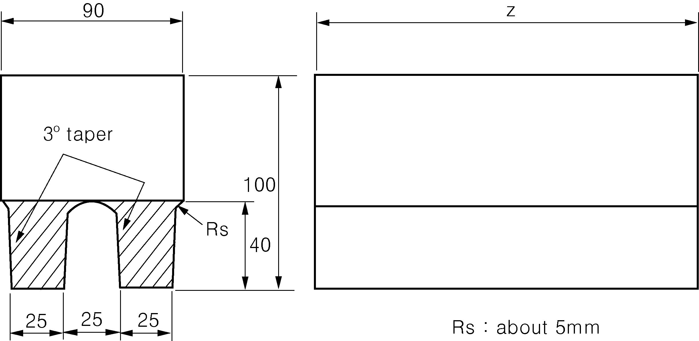
    **Fig 2.1.16 Double U-type test sample**
    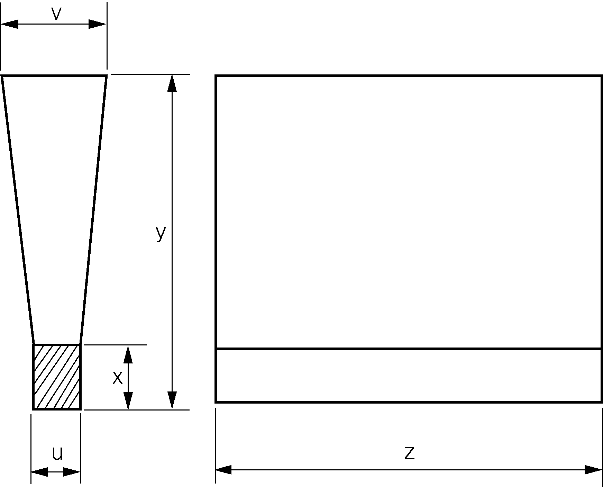

    |   | Standard sample | Alternative sample when specially required |   |   |
    | --- | --- | --- | --- | --- |
    |   | Standard sample | Case 1 | Case 2 | Case 3 |
    | u(mm) | 25 | 12 | 50 | 75 |
    | v(mm) | 55 | 40 | 100 | 125 |
    | x(mm) | 40 | 25 | 50 | 65 |
    | y(mm) | 140 | 135 | 150 | 175 |
    | z | To suit testing machine |   |   |   |
- **7.** **Test and inspection**
  - **(1)** All castings are to be cleaned and adequately prepared for examination. The surfaces are not to be hammered, peened or treated in any way which may obscure defects.
  - **(2)** Before acceptance, all castings are to be visually examined including, where applicable, the examination of internal surfaces. Unless otherwise agreed the verification of dimensions is the responsibility of the manufacturer.
  - **(3)** When required by the relevant construction Rules, castings are to be pressure tested before final acceptance.
  - **(4)** Supplementary examination of castings by suitable nondestructive testing procedures is generally not required except in circumstances where there is reason to suspect the soundness of the casting. However, cast crankshaft are to be subjected to a magnetic particle inspection. Crack like indications are not allowed.
  - **(5)** For crankshafts the metallographic examination is to be carried out as followings;
- **8.** **Rectification of defective casting**
  - **(1)** At the discretion of the Surveyor, small surface blemishes may be removed by local grinding.
  - **(2)** Subject to the prior approval of the Surveyor, castings containing local porosity may be rectified by impregnation with a suitable plastic filler, provided that the extent of the porosity is such that it does not adversely affect the strength of the casting.
  - **(3)** Repairs by welding are generally not permitted.
- **9.** **Retest procedure** Where the tensile test fails to meet the requirements, additional test may be carried out in accordance with the requirements of **109.**
- **10.** **Marking** Spheroidal iron castings which have satisfactorily complied with the required tests are to be marked with the identification mark in accordance with the requirements in **110.**
- **11.** **Test certificates** ***(2017)***
  The manufacturer is to provide the Surveyor with a test certificate giving the following particulars for each casting or batch of castings which has been accepted:
  - **(1)** Purchaser's name and order number
  - **(2)** Description of castings and quality of cast iron
  - **(3)** Identification number
  - **(4)** Results of mechanical tests
  - **(5)** Where applicable, general details of heat treatment
  - **(6)** Where specifically required, the chemical analysis of ladle samples
  - **(7)** Where applicable, test pressure

### Section 6 Steel Forgings

#### 601. Steel forgings

- **1.** **Application**
  - **(1)** The requirements in **601.** are to apply to the steel forgings(except those specified in **602., 603.** and **604.**) intended to be used for the components of hull construction, equipments, and machinery specified in each Part, and where relevant, these requirements are also applicable to material for forging stock and to rolled bars intended to be machined into components of simple shape (hereinafter referred to as the **"steel forgings"**).
  - **(2)** Steel forgings having characteristics differing from those specified in **601.** are to comply with the requirements in **101. 2**.
- **2.** **Kinds** The steel forgings are classified as specified in **Table 2.1.88 and 2.1.89**.
- **3.** **Manufacturing process**
  - **(1)** Steel forgings are to be manufactured from the killed steel.
  - **(2)** Adequate discards are to be made from the top and bottom of each ingot to ensure freedom from piping and harmful segregation in the finished forgings.
  - **(3)** Steel forgings are to be hot worked by press or hammer from ingots, blooms forged or rolled from ingots or blooms made from ingots by a combination of rolling and forging.
  - **(4)** Steel forgings are to be gradually and uniformly hot worked and are to be brought as nearly as possible to the finished shape and size. Where practicable, they are to be worked so as to cause metal flow in the most favourable direction having regard to the mode of stressing in service.
  - **(5)** The reduction ratio is to comply with the following;

    **Table 2.1.85 Reduction Ratio**

    | Method of manufacture | Description^(^1) | Total reduction^(^2)(3) |
    | --- | --- | --- |
    | Made directly from ingots or from forged blooms or billets | L＞D L≤D | 3 : 1 1.5 : 1 |
    | Made from rolled products | L＞D L≤D | 4 : 1 2 : 1 |
    | NOTES: (1) L and D are the length and diameter respectively of the part of the forging under consideration. (2) The reduction ratio is to be calculated with reference to the average cross-sectional area of the ingot. Where an ingot is initially upset, this reference area may be taken as the average cross-sectional area after this operation. (3) For rolled bars used as a substitute for forgings the reduction ratio is to be not less than 6:1. |   |   |
  - **(6)** The shaping of forgings or rolled slabs and billets by flame cutting, scarfing or arc-air gouging is to be undertaken in accordance with recognized good practice and, unless otherwise approved, is to be carried out before the final heat treatment. Preheating is to be employed when necessitated by the composition and thickness of the steel. For certain components, subsequent machining of all flame cut surfaces may be required. **【See Guidance】**
  - **(7)** When two or more forgings are joined by welding to form a composite component, the proposed welding procedure specification is to be submitted for approval to the Society. Welding procedure qualification tests and welder qualification test are to be required. *(2023)*
  - **(8)** The welding procedure qualification test and welder qualification test are in accordance with **Pt 2, Ch 2** of the Rules. *(2023)*
- **4.** **Heat treatment**
  - **(1)** Except as provided in (5) and (6), after completion of all hot working operations, forgings are to be supplied in one of the conditions given in **Table 2.1.86**. to refine the grain structure and to obtain the required mechanical properties. No fully annealed forging is to be removed from the furnace until the temperature of the entire furnace charge has fallen to or below a temperature of 455°C. The tempering temperature is to be not less than 550℃. Where forgings for gearing are not intended for surface hardening, lower tempering temperature may be allowed. *(2023)* **【See Guidance】**

    **Table 2.1.86 Heat Treatment** ***(2023)***

    | Kind | Heat treatment |
    | --- | --- |
    | Carbon steels | Fully Annealed Normalized Normalized and tempered Quenched and tempered |
    | Alloy steels | Normalized Normalized and tempered Quenched and tempered |
  - **(2)** The delivery condition shall meet the design and application requirements, it is the manufacturers responsibility to select the appropriate heat treatment method to obtain the required mechanical properties. *(2023)*
  - **(3)** Steel forgings which are subjected to any hot work after heat treatment, are to be heat treated again.
  - **(4)** If a forging is locally reheated or any straightening operation is performed after the final heat treatment, consideration is to be given to a subsequent stress relieving heat treatment. The manufacturer shall have strict control of this temperature in order to avoid any detrimental effects to the final heat treatment and resultant microstructure and mechanical properties of the forging. *(2023)*
  - **(5)** Where induction hardening or nitriding is to be carried out, forgings are to be heat treated at an appropriate stage to a condition suitable for this subsequent surface hardening.
  - **(6)** Where carburizing is to be carried out, forgings are to be heat treated at an appropriate stage (generally either by full annealing or by normalizing and tempering) to a condition suitable for subsequent machining and carburizing.
  - **(7)** Where it is intended to surface harden forgings, full details of the proposed procedure and specification are to be submitted for the approval of the Society. For the purposes of this approval, the manufacture may be required to demonstrate by test that the proposed procedure gives a uniform surface layer of the required hardness and depth and that it does not impair the soundness and properties of the steel. **【See Guidance】**
  - **(8)** Heat treatment is to be carried out in properly constructed furnaces which are efficiently maintained and have adequate means for control and recording of temperature. The furnace dimensions are to be such as to allow the whole furnace charge to be uniformly heated to the necessary temperature. In the case of very large forgings alternative methods of heat treatment will be specially considered by the Society.
    Sufficient thermocouples are to be connected to the furnace charge to measure and record that its temperature is adequately uniform unless the temperature uniformity of the furnace is verified at regular intervals.
  - **(9)** The forge is to maintain records of heat treatment identifying the furnace used, furnace charge, date, temperature and time at temperature. The records are to be presented to the surveyor on request.
- **5.** **Chemical composition**
  - **(1)** The chemical composition of steel forgings is to comply with the requirements given in **Table 2.1.87**.
  - **(2)** The chemical composition of each heat is to be determined by the manufacturer on a sample taken preferably during the pouring of the heat. When multi heats are tapped into a common ladle, the ladle analysis shall apply.
  - **(3)** At the option of the manufacturer, suitable grain refining elements such as aluminium, niobium or vanadium may be added. The content of such elements is to be reported in the ladle analysis.

    | Steel type |   | Chemical composition (%) |   |   |   |   |   |   |   |   |   |
    | --- | --- | --- | --- | --- | --- | --- | --- | --- | --- | --- | --- |
    | Steel type |   | C | Si | Mn | P | S | Cr | Mo | Ni | Cu(3) | Total residual |
    | Hull and General purpose steel forging(4) | Carbon steel | 0.23(1)(2) max. | 0.45 max. | 0.30- 1.50 | 0.035 max. | 0.035 max. | 0.30(3) max. | 0.15(3) max. | 0.40(3) max. | 0.30 max. | 0.85 max. |
    | Hull and General purpose steel forging(4) | Alloy steel | 0.23 max. | 0.45 max. | 0.30- 1.00 | 0.035 max. | 0.035 max. | 0.40(6) min. | 0.15(6) min. | 0.40(6) min. | 0.30 max. | - |
    | Machinery steel forging | Carbon steel | 0.23(1)(2) max. | 0.45 max. | 0.30- 1.50 | 0.035 max. | 0.035 max. | 0.30(3) max. | 0.15(3) max. | 0.40(3) max. | 0.30 max. | 0.85 max. |
    | Machinery steel forging | Alloy steel(5) | 0.45 max. | 0.45 max. | 0.30- 1.00 | 0.035 max. | 0.035 max. | 0.40(6) min. | 0.15(6) min. | 0.40(6) min. | 0.30 max. | - |
    | NOTES : (1) The carbon content may be increased above this level provided that the carbon equivalent (Ceq) is not more than 0.41 %. (2) The carbon content of carbon steel forgings not intended for welded construction may be 0.65 % maximum. (3) Elements are considered as residual elements. (4) Rudder stocks and pintles should be of weldable quality. (5) Where alloy steel forgings are intended for welded constructions, the proposed chemical composition is subject to approval by the Society. (6) One or more of the elements is to comply with the minimum content. |   |   |   |   |   |   |   |   |   |   |   |
- **6.** **Mechanical properties**
  - **(1)** The mechanical properties of steel forgings are to comply with the requirements given in **Table 2.1.88** and **2.1.89**.
  - **(2)** At the discretion of this Societies hardness tests may be required on the following: The results of hardness tests are to be reported and, for information purposes, typical Brinell hardness values are given in **Table 2.1.89**.
    In such cases at least one hardness test is to be carried out on each forging.
  - **(3)** Hardness tests may also be required on forgings which have been induction hardened, nitrided or carburized. For gear forgings these tests are to be carried out on the teeth after, where applicable, they have been ground to the finished profile. The results of such tests are to comply with the approved specifications.
- **7.** **Selection of test specimens**
  - **(1)** Except as provided in (10) and (11), the test specimens for steel forgings are, after final heat treatment, to be taken lengthwise from prolongations or through bolt holes having a sectional area not less than that of the body of forging. Where batch testing is permitted according to (10), the test material may alternatively be a production part or separately forged. Separately forged test material is to have a reduction ratio similar to that used for the forgings represented.
  - **(2)** "One set of test specimens" is to consist of one tensile test specimen and when required, three charpy-V notch impact test specimen.

    | Steel type | grades | Tensile test |   |   |   |   |   | Charpy V-notch impact test(6) |   |   |
    | --- | --- | --- | --- | --- | --- | --- | --- | --- | --- | --- |
    | Steel type | grades | Tensile strength ($\mathrm{N}/mm ^{2}$) | Yield strength ($\mathrm{N}/mm ^{2}$) | Elongation(%) ($L=5.65 \sqrt {A}$) (minimum) |   | Reduction of area(%) (minimum) |   | Test temperature(℃) | Minimum average energy(J) |   |
    | Steel type | grades | Tensile strength ($\mathrm{N}/mm ^{2}$) | Yield strength ($\mathrm{N}/mm ^{2}$) | Elongation(%) ($L=5.65 \sqrt {A}$) (minimum) |   | Reduction of area(%) (minimum) |   | Test temperature(℃) | L(4) | T(4) |
    | Steel type | grades | Tensile strength ($\mathrm{N}/mm ^{2}$) | Yield strength ($\mathrm{N}/mm ^{2}$) | *L* | *T* | *L* | *T* | 0 | 27 | 18 |
    | Carbon steel forgings | *RSF* 400*H* | 400 min. | 200 min. | 26 | 19 | 50 | 35 | 0 | 27 | 18 |
    | Carbon steel forgings | *RSF* 440*H* | 440 min. | 220 min. | 24 | 18 | 50 | 35 | 0 | 27 | 18 |
    | Carbon steel forgings | *RSF* 480*H* | 480 min. | 240 min. | 22 | 16 | 45 | 30 | 0 | 27 | 18 |
    | Carbon steel forgings | *RSF* 520*H* | 520 min. | 260 min. | 21 | 15 | 45 | 30 | 0 | 27 | 18 |
    | Carbon steel forgings | *RSF* 560*H* | 560 min. | 280 min. | 20 | 14 | 40 | 27 | 0 | 27 | 18 |
    | Carbon steel forgings | *RSF* 600*H* | 600 min. | 300 min. | 18 | 13 | 40 | 27 | 0 | 27 | 18 |
    | Alloy steel forgings | *RSF* 550*AH* | 550 min. | 350 min. | 20 | 14 | 50 | 35 | 0 | 27 | 18 |
    | Alloy steel forgings | *RSF* 600*AH* | 600 min. | 400 min. | 18 | 13 | 50 | 35 | 0 | 27 | 18 |
    | Alloy steel forgings | *RSF* 650*AH* | 650 min. | 450 min. | 17 | 12 | 50 | 35 | 0 | 27 | 18 |
    | Notes ; (1) Where it is proposed to use a steel with a specified minimum tensile strength intermediate to those given, corresponding minimum values for the other properties may be obtained by interpolation and the value at the first decimal place is to be subjected to the method of counting fractions over 1/2 as one and disregarding the rest. (2) For the upper limit of tensile strength, the following ranges for tensile strength may be additionally specified: Steel type ; grades ; Tensile test ; Charpy V-notch impact test(6) Tensile strength ($\mathrm{N}/mm ^{2}$) ; Yield strength ($\mathrm{N}/mm ^{2}$) ; Elongation(%) ($\mathrm{N}/mm ^{2}$) (minimum) ; Reduction of area(%) (minimum) ; Test temperature(℃) ; Minimum average energy(J) L(4) ; T(4) *L* ; *T* ; *L* ; *T* ; 0 ; 27 ; 18 Carbon steel forgings ; *RSF* 400*H* ; 400 min. ; 200 min. ; 26 ; 19 ; 50 ; 35 *RSF* 440*H* ; 440 min. ; 220 min. ; 24 ; 18 ; 50 ; 35 *RSF* 480*H* ; 480 min. ; 240 min. ; 22 ; 16 ; 45 ; 30 *RSF* 520*H* ; 520 min. ; 260 min. ; 21 ; 15 ; 45 ; 30 *RSF* 560*H* ; 560 min. ; 280 min. ; 20 ; 14 ; 40 ; 27 *RSF* 600*H* ; 600 min. ; 300 min. ; 18 ; 13 ; 40 ; 27 Alloy steel forgings ; *RSF* 550*AH* ; 550 min. ; 350 min. ; 20 ; 14 ; 50 ; 35 *RSF* 600*AH* ; 600 min. ; 400 min. ; 18 ; 13 ; 50 ; 35 *RSF* 650*AH* ; 650 min. ; 450 min. ; 17 ; 12 ; 50 ; 35 Notes ; (1) Where it is proposed to use a steel with a specified minimum tensile strength intermediate to those given, corresponding minimum values for the other properties may be obtained by interpolation and the value at the first decimal place is to be subjected to the method of counting fractions over 1/2 as one and disregarding the rest. (2) For the upper limit of tensile strength, the following ranges for tensile strength may be additionally specified: Specified minimum tensile strength ($\mathrm{N}/mm ^{2}$) ; Range of upper limit($\%$) < 600 ; 120 ≥ 600 ; 150 Specified minimum tensile strength ($L=5.65 \sqrt {A}$) Range of upper limit($\%$) < 600 120 ≥ 600 150 (3) In the case of large forgings requiring two tension tests, the range of tensile strength is not to exceed 70 $\mathrm{N}/mm ^{2}$ (4) *L* (or *T*) denotes that the longitudinal axis of the test specimen is arranged parallel (or tangential) to the direction of forging. (5) For rudder stocks intended for ships with ice class notation(Grade IA Super, IA, IB and IC), Charpy V-notch impact testing is to be carried out for all steel types at -10℃ and the average energy value is to be minimum 27 *J* (longitudinal test). (6) Special consideration may be given to alternative requirements for Charpy V-notch test, depending on design and application and subject to agreement by the Society. Specified minimum tensile strength ($\mathrm{N}/mm ^{2}$) ; Range of upper limit($\%$) < 600 ; 120 ≥ 600 ; 150 Specified minimum tensile strength ($\mathrm{N}/mm ^{2}$) Range of upper limit($\mathrm{N}/mm ^{2}$) < 600 120 ≥ 600 150 (3) In the case of large forgings requiring two tension tests, the range of tensile strength is not to exceed 70 $\mathrm{N}/mm ^{2}$ (4) *L* (or *T*) denotes that the longitudinal axis of the test specimen is arranged parallel (or tangential) to the direction of forging. (5) For rudder stocks intended for ships with ice class notation(Grade IA Super, IA, IB and IC), Charpy V-notch impact testing is to be carried out for all steel types at -10℃ and the average energy value is to be minimum 27 *J* (longitudinal test). (6) Special consideration may be given to alternative requirements for Charpy V-notch test, depending on design and application and subject to agreement by the Society. |   |   |   |   |   |   |   |   |   |   |
    | Steel type | grades | Tensile test |   |   |   |   |   | Charpy V-notch impact test(6) |   |   |
    | Steel type | grades | Tensile strength ($\mathrm{N}/mm ^{2}$) | Yield strength ($\mathrm{N}/mm ^{2}$) | Elongation(%) ($\mathrm{N}/mm ^{2}$) (minimum) |   | Reduction of area(%) (minimum) |   | Test temperature(℃) | Minimum average energy(J) |   |
    | Steel type | grades | Tensile strength ($\mathrm{N}/mm ^{2}$) | Yield strength ($\mathrm{N}/mm ^{2}$) | Elongation(%) ($\mathrm{N}/mm ^{2}$) (minimum) |   | Reduction of area(%) (minimum) |   | Test temperature(℃) | L(4) | T(4) |
    | Steel type | grades | Tensile strength ($\mathrm{N}/mm ^{2}$) | Yield strength ($\mathrm{N}/mm ^{2}$) | *L* | *T* | *L* | *T* | 0 | 27 | 18 |
    | Carbon steel forgings | *RSF* 400*H* | 400 min. | 200 min. | 26 | 19 | 50 | 35 | 0 | 27 | 18 |
    | Carbon steel forgings | *RSF* 440*H* | 440 min. | 220 min. | 24 | 18 | 50 | 35 | 0 | 27 | 18 |
    | Carbon steel forgings | *RSF* 480*H* | 480 min. | 240 min. | 22 | 16 | 45 | 30 | 0 | 27 | 18 |
    | Carbon steel forgings | *RSF* 520*H* | 520 min. | 260 min. | 21 | 15 | 45 | 30 | 0 | 27 | 18 |
    | Carbon steel forgings | *RSF* 560*H* | 560 min. | 280 min. | 20 | 14 | 40 | 27 | 0 | 27 | 18 |
    | Carbon steel forgings | *RSF* 600*H* | 600 min. | 300 min. | 18 | 13 | 40 | 27 | 0 | 27 | 18 |
    | Alloy steel forgings | *RSF* 550*AH* | 550 min. | 350 min. | 20 | 14 | 50 | 35 | 0 | 27 | 18 |
    | Alloy steel forgings | *RSF* 600*AH* | 600 min. | 400 min. | 18 | 13 | 50 | 35 | 0 | 27 | 18 |
    | Alloy steel forgings | *RSF* 650*AH* | 650 min. | 450 min. | 17 | 12 | 50 | 35 | 0 | 27 | 18 |
    | Notes ; (1) Where it is proposed to use a steel with a specified minimum tensile strength intermediate to those given, corresponding minimum values for the other properties may be obtained by interpolation and the value at the first decimal place is to be subjected to the method of counting fractions over 1/2 as one and disregarding the rest. (2) For the upper limit of tensile strength, the following ranges for tensile strength may be additionally specified: Specified minimum tensile strength ($\mathrm{N}/mm ^{2}$) ; Range of upper limit($\%$) < 600 ; 120 ≥ 600 ; 150 Specified minimum tensile strength ($L=5.65 \sqrt {A}$) Range of upper limit($\%$) < 600 120 ≥ 600 150 (3) In the case of large forgings requiring two tension tests, the range of tensile strength is not to exceed 70 $\mathrm{N}/mm ^{2}$ (4) *L* (or *T*) denotes that the longitudinal axis of the test specimen is arranged parallel (or tangential) to the direction of forging. (5) For rudder stocks intended for ships with ice class notation(Grade IA Super, IA, IB and IC), Charpy V-notch impact testing is to be carried out for all steel types at -10℃ and the average energy value is to be minimum 27 *J* (longitudinal test). (6) Special consideration may be given to alternative requirements for Charpy V-notch test, depending on design and application and subject to agreement by the Society. |   |   |   |   |   |   |   |   |   |   |
    | Specified minimum tensile strength ($\mathrm{N}/mm ^{2}$) | Range of upper limit($\%$) |   |   |   |   |   |   |   |   |   |
    | < 600 | 120 |   |   |   |   |   |   |   |   |   |
    | ≥ 600 | 150 |   |   |   |   |   |   |   |   |   |

    | Steel type |   | Grades | Tensile test |   |   |   |   |   | Hardness test(5) | Charpy V-notch impact test(4)(6) |   |   |
    | --- | --- | --- | --- | --- | --- | --- | --- | --- | --- | --- | --- | --- |
    | Steel type |   | Grades | Tensile strength(2) ($\mathrm{N}/mm ^{2}$) | Yield strength ($\mathrm{N}/mm ^{2}$) | Elongation($\%$) ($L=5.65 \sqrt {A}$) (minimum) |   | Reduction of area($\%$) (minimum) |   | Hardness (H_BW) | Test temperature(℃) | Minimum average energy(J) |   |
    | Steel type |   | Grades | Tensile strength(2) ($\mathrm{N}/mm ^{2}$) | Yield strength ($\mathrm{N}/mm ^{2}$) | L(3) | T(3) | L(3) | T(3) | Hardness (H_BW) | Test temperature(℃) | L(3) | T(3) |
    | Carbon steel forgings |   | *RSF* 400*M* | 400 min. | 200 min. | 26 | 19 | 50 | 35 | 110 - 150 | AT(7) | 27 | 18 |
    | Carbon steel forgings |   | *RSF* 440*M* | 440 min. | 220 min. | 24 | 18 | 50 | 35 | 125 - 160 | AT(7) | 27 | 18 |
    | Carbon steel forgings |   | *RSF* 480*M* | 480 min. | 240 min. | 22 | 16 | 45 | 30 | 135 - 175 | AT(7) | 27 | 18 |
    | Carbon steel forgings |   | *RSF* 520*M* | 520 min. | 260 min. | 21 | 15 | 45 | 30 | 150 - 185 | AT(7) | 27 | 18 |
    | Carbon steel forgings |   | *RSF* 560*M* | 560 min. | 280 min. | 20 | 14 | 40 | 27 | 160 - 200 | AT(7) | 27 | 18 |
    | Carbon steel forgings |   | *RSF* 600*M* | 600 min. | 300 min. | 18 | 13 | 40 | 27 | 175 - 215 | AT(7) | 27 | 18 |
    | Carbon steel forgings |   | *RSF* 640*M* | 640 min. | 320 min. | 17 | 12 | 35 | 27 | 185 - 230 | AT(7) | 27 | 18 |
    | Carbon steel forgings |   | *RSF* 680*M* | 680 min. | 340 min. | 16 | 12 | 35 | 24 | 200 - 240 | AT(7) | 27 | 18 |
    | Carbon steel forgings |   | *RSF* 720*M* | 720 min. | 360 min. | 15 | 11 | 35 | 24 | 210 - 250 | AT(7) | 27 | 18 |
    | Carbon steel forgings |   | *RSF* 760*M* | 760 min. | 380 min. | 14 | 10 | 35 | 24 | 225 - 265 | AT(7) | 27 | 18 |
    | Alloy steel forgings |   | *RSF* 600*AM* | 600 min. | 360 min. | 18 | 14 | 50 | 35 | 175 - 215 | AT(7) | 27 | 18 |
    | Alloy steel forgings |   | *RSF* 700*AM* | 700 min. | 420 min. | 16 | 12 | 45 | 30 | 205 - 245 | AT(7) | 27 | 18 |
    | Alloy steel forgings |   | *RSF* 800*AM* | 800 min. | 480 min. | 14 | 10 | 40 | 27 | 235 - 275 | AT(7) | 27 | 18 |
    | Alloy steel forgings |   | *RSF* 900*AM* | 900 min. | 630 min. | 13 | 9 | 40 | 27 | 260 - 320 | AT(7) | 27 | 18 |
    | Alloy steel forgings |   | *RSF* 1000*AM* | 1000 min. | 700 min. | 12 | 8 | 35 | 24 | 290 - 365 | AT(7) | 27 | 18 |
    | Alloy steel forgings |   | *RSF* 1100*AM* | 1100 min. | 770 min. | 11 | 7 | 35 | 24 | 320 - 385 | AT(7) | 27 | 18 |

    **NOTES : (1) Where it is proposed to use a steel with a specified minimum tensile strength intermediate to those given, corresponding minimum values for the other properties may be obtained by interpolation and the value at the first decimal place is to be subjected to the method of counting fractions over 1/2 as one and disregarding the rest. (2) For the upper limit of tensile strength, the following ranges for tensile strength may be additionally specified:**

    |   | Specified minimum tensile strength ($\mathrm{N}/mm ^{2}$) | Range of upper limit ($\mathrm{N}/mm ^{2}$) |   |
    | --- | --- | --- | --- |
    |   | < 900 | 150 |   |
    |   | ≥ 900 | 200 |   |
    | (3) *L* (or *T*) denotes that the longitudinal axis of the test specimen is arranged parallel (or tangential) to the direction of forging. (4) For materials used for machinery exposed to sea water temperature, such as propeller shafts and shaft bolts, intended for ships with ice class notation(Grade IA Super, IA, IB and IC), Charpy V-notch impact testing is to be carried out for all steel types at –10 ℃ and the average energy value is to be minimum 20 J (longitudinal test). One individual value may be less than the required average value provided that it is not less than 70% of this average value. Impact test for important components as crankshaft and gears for machinery is to be in accordance with the Guidance relating to the Rules specified by the Society. **【See Guidance】** (5) The hardness values are typical and are given for information purposes only. (6) Special consideration may be given to alternative requirements for Charpy V-notch test, depending on design and application and subject to agreement by the Society. (7) AT refers to Ambient Temperature (i.e. 23°C ± 5°C), which is specified in **ISO 148-1:2016**. |   |   |   |
  - **(3)** Test specimens are normally to be cut with their axes either mainly parallel (longitudinal test) or mainly tangential (tangential test) to the principal axial direction of each product.
  - **(4)** The test specimen is to be positioned as follows. *(2023)*

    | 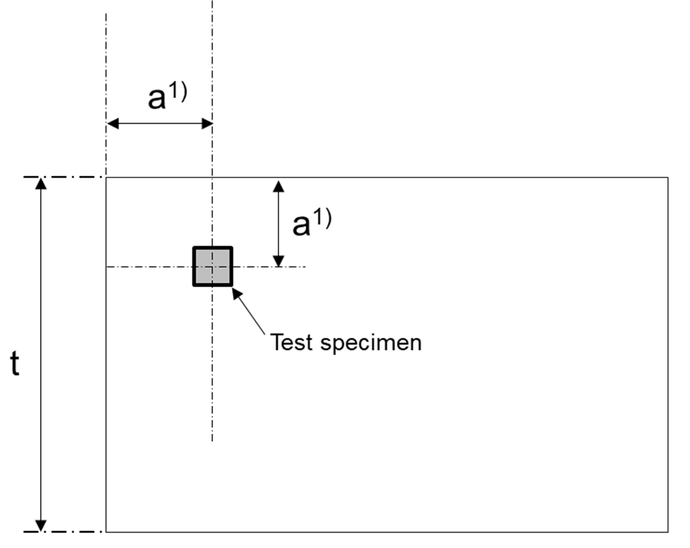 |
    | --- |
    | (Notes) (1) “a” is the distance from the test specimen to heat treated surface based on the above (B) or (C). |
    | **Fig 2.1.18 Position of the test specimen** ***(2023)*** |
    - **(A)** For forgings having a thickness, t, or diameter D up to maximum 50 mm, the longitudinal axis of the test specimen is to be located at a distance of t/2 or D/2 below the heat treated surfaces.
    - **(B)** For forgings having a thickness, t, or diameter D greater than 50 mm, the longitudinal axis of the test specimen is to be located at a distance of t/4 or D/4 (mid-radius) or 80mm, whichever is less, below any heat treated surface. Test specimen is to be located with its longitudinal axis at a distance from any heat treated surface as shown in **Fig 2.1.18**.
    - **(C)** For ring and disc forgings (noting that the test specimen locations for these shaped forgings may be different to elongated or free form forgings), tangential sample shall be taken at t/2 for thickness ≤ 25mm and 12.5 mm below the surface for thickness >25 mm, in both the vertical and horizontal direction. Where achievable, for thickness > 25 mm, no part of the test material shall be closer than 12.5 mm to any heat treated surface, as shown in **Fig 2.1.18**.
  - **(5)** Where the manufacturer can demonstrate that a proposed testing location or orientation is more representative of the required mechanical properties of a component, this may be agreed with the Society. In such cases, the heat treatment process, a proposed testing location or orientation, and technical justification shall be submitted to the Society for approval.
  - **(6)** Except as provided in (11), the number and direction of tests is to be as given in (A) through (I) of the following requirements:
    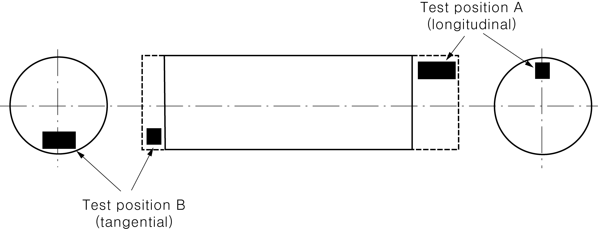
    **Fig 2.1.19 Plain shaft**
    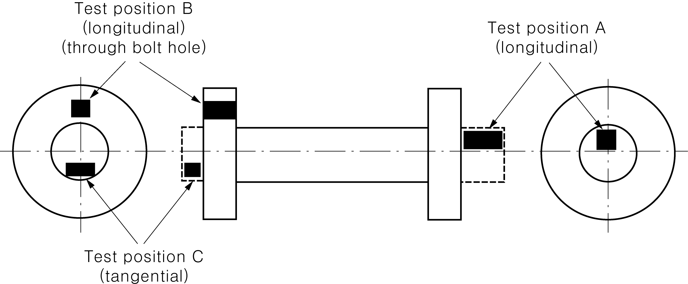
    **Fig 2.1.20 Flanged shaft**
    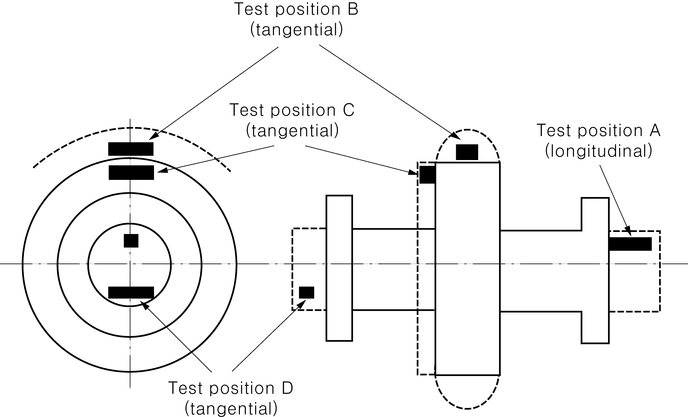
    **Fig 2.1.21 Flanged shaft with collar**
    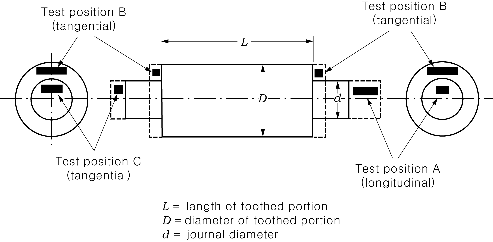
    **Fig 2.1.22 Pinion**
    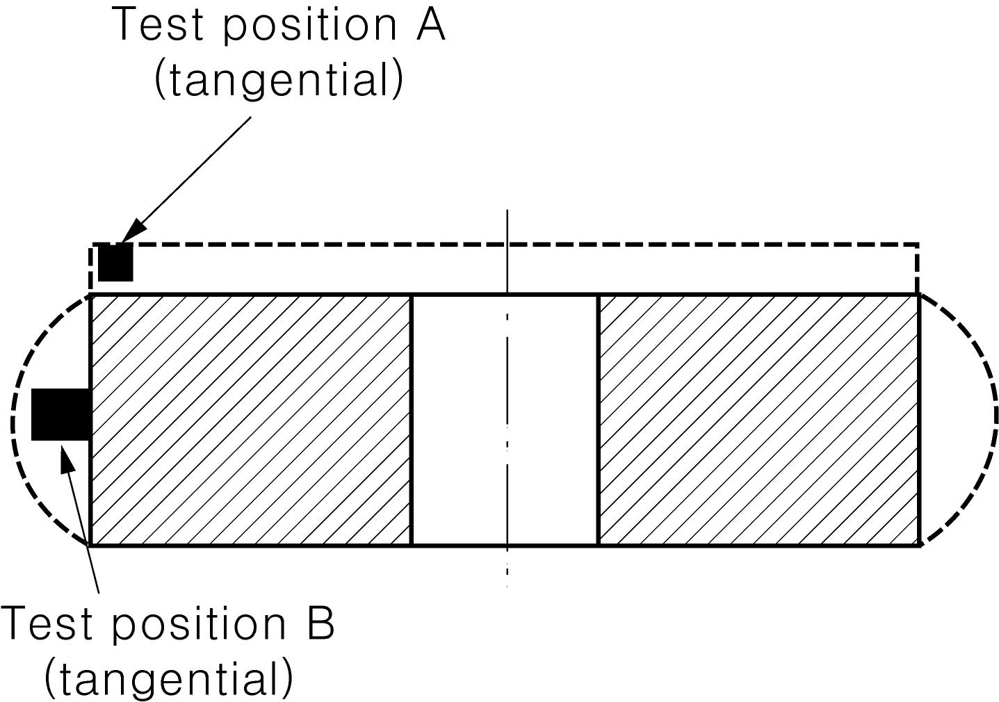
    **Fig 2.1.23 Gear wheel**
    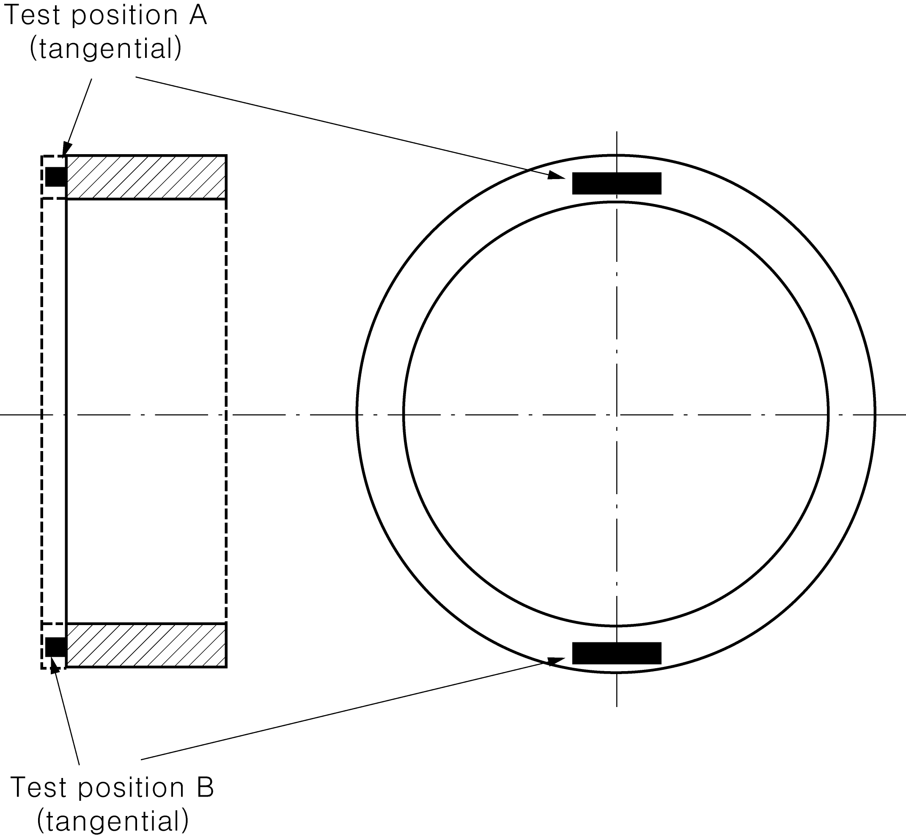
    **Fig 2.1.24 Gear rim (made by expanding)**
    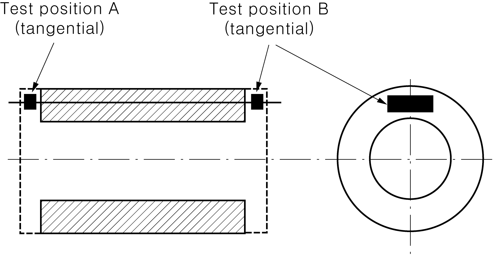
    **Fig 2.1.25 Pinion sleeve**
    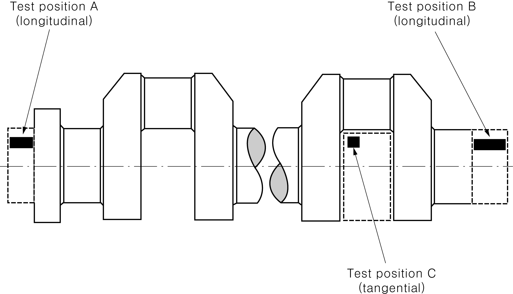
    **Fig 2.1.26 Solid forged crankshaft**

    | 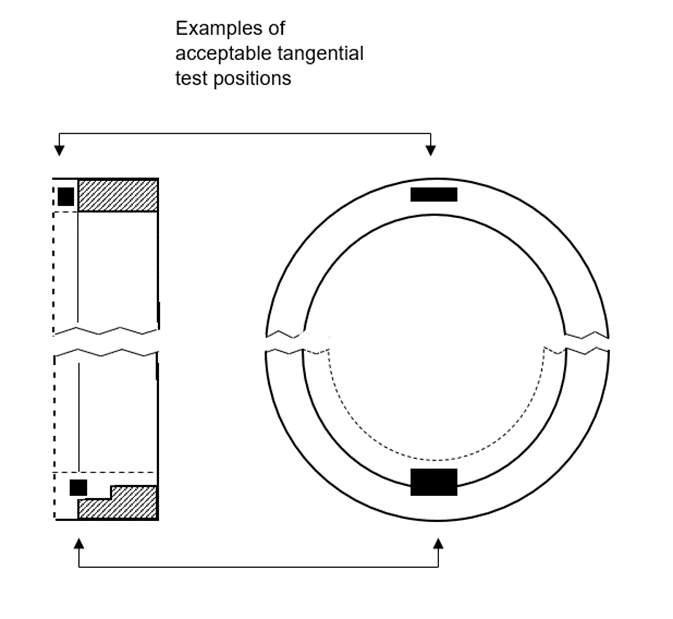 |
    | --- |
    | **Fig 2.1.27 Forged rings** ***(2023)*** |
    - **(A)** *Hull components such as rudder stocks, pintles etc. General machinery components such as shafting, connecting rods, etc. :* One set of tests is to be taken from the end of each forging in a longitudinal direction except that, at the discretion of the manufacture, the alternative directions or positions as shown in **Fig 2.1.19**, **Fig 2.1.20** and **Fig 2.1.21** may be used. Where a forging exceeds both 4 tonnes in mass and 3 m in length, one set of tests is to be taken from each end.
    - **(B)** *Pinions* : Where the finished machined diameter of the toothed portion exceeds 200 mm one set of tests is to be taken from each forging in a tangential direction adjacent to the toothed portion (test position B in **Fig 2.1.22**) Where the dimensions preclude the preparation of tests from this position, tests in a tangential direction are to be taken from the end of the journal (test position C in **Fig 2.1.22**). If however, the journal diameter is 200 mm or less the tests are to be taken in a longitudinal direction (test position A in **Fig 2.1.22**). Where the finished length of the toothed portion exceed 1.25 m, one set of tests is to be taken from each end.
    - **(C)** *Small pinions* : Where the finished diameter of the toothed portion is 200 mm or less one set of tests is to be taken in a longitudinal direction (test position A in **Fig 2.1.22**).
    - **(D)** *Gear wheels* : One set of tests is to be taken from each forging in a tangential direction (test position A or B in **Fig 2.1.23**).
    - **(E)** Rims intended for reduction gears and for cam shaft driving gears of diesel engine (see **Pt 5, Ch 2 201.1**) are to comply with the following requirements.
      - **(i)** Where the finished diameter exceeds 2.5 m or the mass (as heat treated including test material) exceeds 3 tonnes, two sets of tests are to be taken from diametrically opposite positions (test positions A and B in **Fig 2.1.24**). The mechanical properties for longitudinal test are to be applied. *(2023)*
        - **(ii)** Where the weight and finished diameter are different from those given in (a), one set of test specimens may be taken from one end of the rim.
    - **(F)** *Pinion sleeves* : One set of tests is to be taken from each forging in a tangential direction (test position A or B in **Fig 2.1.25**). Where the finished length exceeds 1.25 m one set of tests is to be taken from each end.
    - **(G)** *Crankwebs* : One set of tests is to be taken from each forging in a tangential direction.
    - **(H)** *Solid open die forged crankshafts* : One set of tests is to be taken in a longitudinal direction from the driving shaft end of each forging (test position A in **Fig 2.1.26**). Where the mass (as heat treated but excluding test material) exceeds 3 tonnes tests in a longitudinal direction are to be taken from each end (test positions A and B in **Fig 2.1.26**). Where, however, the crankthrows are formed by machining or flame cutting, the second set of tests is to be taken in a tangential direction from material removed from the crankthrow at the end opposite the driving shaft end (test position C in **Fig 2.1.26**).
    - **(I)** Forged Rings (such as slewing rings) : One set of tests is to be taken from each forging in a tangential direction (test positions are shown in **Fig 2.1.27**). Where the finished diameter exceeds 2.5 m or the mass (as heat treated, including test material) exceeds 3 tonnes then two sets of tests are to be taken diametrically opposite positions. *(2023)*
  - **(7)** For closed die crankshaft forgings and crankshaft forgings where the method of manufacture has been approved by the Society, the number and position of test specimens is to be agreed with the Society having regard to the method of manufacture employed.
  - **(8)** When a forging is subsequently divided into a number of components, all of which are heat treated together in the same furnace charge, for test purposes this may be regarded as one forging and the number of tests required is to be related to the total length and mass of the original multiple forging.
  - **(9)** The test specimens are not to be separated from the body before the final heat treatment has been completed. In the case of stamp forging or other case of forging requiring the surface hardening process, the test specimens may be prepared at a proper stage before the final heat treatment providing that such is approved by the Surveyor.
  - **(10)** When forgings are to be carburized, sufficient test material is to be provided for both preliminary tests at the forge and for final tests after completion of carburizing. For this purpose duplicate sets of test material are to be taken from positions as detailed in (5) except that irrespective of the dimensions or mass of the forging, tests are required from one position only and, in the case of forgings with integral journals, are to be cut in a longitudinal direction. This test material is to be machined to a diameter of D/4 or 60 mm, whichever is less, where D is the finished diameter of the toothed portion. For preliminary tests at the forge one set of test material is to be given a blank carburizing and heat treatment cycle simulating that which subsequently will be applied to the forging. For final acceptance tests, the second set of test material is to be blank carburized and heat treated along with the forgings which they represent. At the discretion of the forgemaster or gear manufacture test samples of larger cross section may be either carburized or blank carburized, but these are to be machined to the required diameter prior to the final quenching and tempering heat treatment. Alternative procedures for testing of forgings which are to be carburized may be specially agreed with the Society. **【See Guidance】**
  - **(11)** Normalized forgings with mass up to 1000 kg each and quenched and tempered forgings with mass up to 500 kg each may be batch tested. A batch is to consist of forgings of similar shape and dimensions, made from the same heat of steel, heat treated in the same furnace charge and with a total mass not exceeding 6 tonnes for normalized forgings and 3 tonnes for quenched and tempered forgings, respectively.
  - **(12)** A batch testing procedure may also be used for hot rolled bars. A batch is to consist of either:
- **8.** **Surface inspection 【 See Guidance】**
  - **(1)** All forgings should be subjected to a 100% visual examination of all accessible surfaces by the manufacturer and made available to the Surveyor. Where applicable, this visual examination is to include the examination of internal surfaces and bores. Testing methods and acceptance criteria are to be in accordance with the Guidance relating to the Rules specified by the Society. *(2023)*
  - **(2)** Dimension inspection of the steel forgings is to be conducted under the responsibility of the manufacturer, unless otherwise specified.
- **9.** **Quality**
  - **(1)** Steel forgings are to be free from surface or internal defects which would be prejudicial to their proper application in service.
  - **(2)** When required by the conditions of approval for surface hardened forgings referred in **4** (7), additional test samples are to be processed at the same time as the forgings which they represent. These test samples are subsequently to be sectioned in order to determine the hardness, shape and depth of the locally hardened zone and which are to comply with the requirements of the approved specification.
  - **(3)** In the event of any forging proving defective during subsequent machining or testing, it is to be rejected notwithstanding any previous certification.
- **10.** **Non-destructive inspection**
  - **(1)** The following steel forgings are to be subjected to ultrasonic test at an appropriate stage of the manufacturing process and the test reports are to be showed or submitted to the Surveyor. Testing methods and acceptance criteria are to be in accordance with the Guidance relating to the Rules specified by the Society. **【See Guidance】**
  - **(2)** The important parts of the following steel forgings are to be subjected to magnetic particle or liquid penetrant test at an appropriate stage of the manufacturing process. Testing methods and acceptance criteria are to be in accordance with the Guidance relating to the Rules specified by the Society. **【See Guidance】**
  - **(3)** The Society may require sulphur print test for the portion of gear teeth.
  - **(4)** In place of the test methods given above, the Society may accept the application of other non-destructive inspections considered adequate by the Society. **【See Guidance】**
  - **(5)** The Society may require non-destructive inspection or the steel other than those specified in (1) and (2) when such is deemed necessary by the Society. **【See Guidance】**
  - **(6)** The welded parts of steel forgings used for welded construction are to be subjected to the non-destructive inspections considered adequate by the Society. **【See Guidance】**
- **11.** **Repair of defects**
  - **(1)** Defects may be removed by grinding or chipping and grinding provided the component dimensions are acceptable.
  - **(2)** After removing the defects, adequate non-destructive inspections are to be carried out to ensure that all defects have been completely removed.
  - **(3)** The resulting grooves are to have a bottom radius of approximately three times the groove depth and are to be blended into the surrounding surface so as to avoid any sharp contours. Where the forgings from which defects where removed are used in that condition, the forgings are to be approved by the Surveyor.
  - **(4)** Repair welding of forgings except those subjected to torsional fatigue, such as crankshaft forgings and propeller shaft forgings, may be permitted subject to prior approval of the Society. In such cases, full details of the extent and location of the repair, the proposed welding procedure, heat treatment and subsequent inspection procedures are to be submitted for the approval. *(2023)* **【See Guidance】**
  - **(5)** The manufacturer is to maintain full records detailing the extent and location of repairs made to each forging and details of weld procedures and heat treatments applied for repairs. These records are to be available to the Surveyor and copies provided on request.
- **12.** **Retest procedures**
  - **(1)** Where the tensile test or hardness test fails to meet the requirements, additional test may be carried out in accordance with the requirements of **109.**
  - **(2)** Regarding the impact tests, additional tests are to be carried out according to the requirements given in **301. 10** (3).
  - **(3)** The additional tests are to be taken, preferably from material adjacent to the original tests, but alternatively from another test position or sample representative of the forging or batch of forgings.
  - **(4)** At the option of the manufacturer, when a forging or a batch of forgings has failed to meet the test requirements, it may be reheat treated and re-submitted for acceptance tests.
- **13.** **Marking**
  - **(1)** Steel forgings which have satisfactorily complied with the required tests are to be marked with the identification mark in accordance with the requirements in **110.**. And it should also include follows. *(2023)*
    - **(A)** Test pressure where applicable
    - **(B)** Date of final inspection
  - **(2)** For steel forgings to which the requirements given in note 1. of the **Table 2.1.88** and **Table 2.1.89** applied, the material symbols are specified as *RSF* - (or *RSF* - *A*) and the specified tensile strength is to be filled in symbol " - ". (e.g. For Hull and General purpose steel forging which the specified tensile strength is 420 $\mathrm{N}/mm ^{2}$ : *RSF* 420H)
  - **(3)** Where carbon steel forgings are intended for welded construction, "W" is to be suffixed to the marking. (e.g. *RSF* 440H-W, *RSF* 440M-W)
  - **(4)** The grade of Steel bars is to be indicated by suffixing a letter "B" to the symbol "*RSF*". (e.g. For Machinery steel forging which the specified tensile strength is 440 $\mathrm{N}/mm ^{2}$ : *RSFB* 440M)
  - **(5)** Where alloy steel forgings are intended for intermediate shaft material specified in **18.**, "*I*" is to be suffixed to the marking. (e.g. *RSF* 900*AM*-*I*) *(2017)*
- **14.** **Test certificates** ***(2017)***
  The manufacturer is to provide the required type of inspection certificate giving the following particulars for each forging or batch of forgings which has been accepted:
  - **(1)** Purchaser's name and order number
  - **(2)** Description of forgings and steel quality
  - **(3)** Identification number
  - **(4)** Steelmaking process, cast number and chemical analysis of ladle sample
  - **(5)** Results of mechanical tests
  - **(6)** Results of non-destructive tests, where applicable
  - **(7)** Details of heat treatment, including temperature and holding times
- **15.** **Additional requirements for crank shafts**
  - **(1)** Where solid crank shafts of 250 mm and over in finished diameter are manufactured by free forging, the heat treatment is normally to be carried out after crank parts are machined as nearly as possible to the finished shape. **【See Guidance】**
  - **(2)** Where solid crank shafts, semibuilt-up crank throws and full built up crank arms are manufactured by special manufacturing processes, the preliminary tests instructed by the Society are to be carried out, in connection with the manufacturing processes and the selection of test specimens. **【See Guidance】**
  - **(3)** Where special manufacturing processes are adopted to reduce the size of crank shaft (refer to the requirements in **Pt 5, Ch, 208.** the preliminary tests instructed by the Society are to be carried out.
- **16.** **Additional requirements for turbine rotors**
  - **(1)** The test specimens for turbine rotors are to be taken in accordance with the following requirements:
  - **(2)** For each turbine disc, one set of transverse test specimens is to be taken from the boss portion. (See **Fig 2.1.29**)
    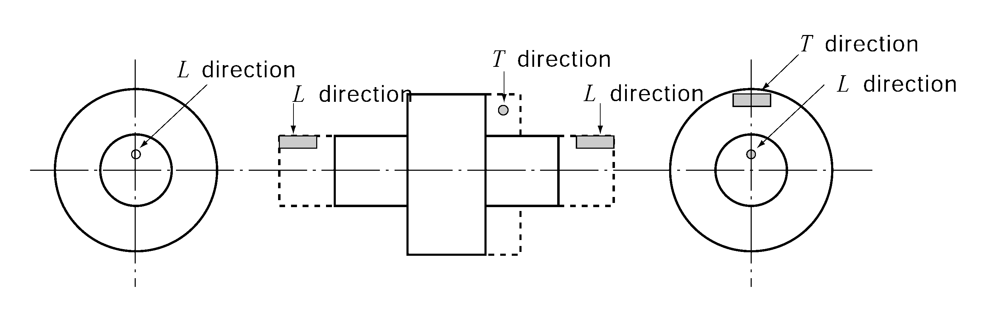
    **Fig 2.1.28 Selection of test specimen for turbine rotor**
    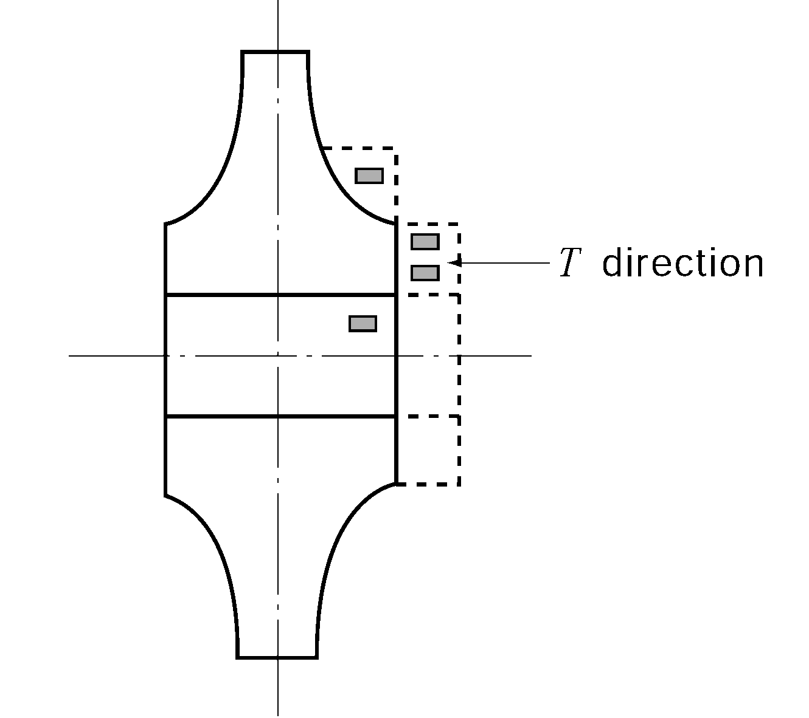
    **Fig 2.1.29 Selection of test specimen for turbine disc**
  - **(3)** Solid forged turbine rotors intended for main propulsion service where the inlet steam temperature exceeds 400℃ are to be subjected to stability tests at least once at a suitable time after rough machining or heat treatment. This requirement is also applicable to rotors fabricated by welding. The method of stability test is to be approved by the Society prior to the test.
- **17.** **Additional requirements for turbine blades** Turbine blades are to be tested in accordance with the approved test specification.
- **18.** **Additional requirements for intermediated shaft material** ***(2017)***
  - **(1)** For alloy steel which has a minimum specified tensile strength greater than 800 N/mm^2 but less than 950 N/mm^2 for use as intermediate shaft material, where special manufacturing processes are adopted to reduce shaft dimensions or higher permissible vibration stresses(refer to the requirements in **Pt 5, Ch 3, 203.** and **Ch 4, 202.**) is to be as follows.

    **Table 2.1.90 Cleanliness requirements(ISO 4967:2013 method A)** ***(2022)***

    | Inclusion group | Series | Limiting chart diagram index *I* |
    | --- | --- | --- |
    | Type A | Fine | 1 max. |
    | Type A | Thick | 1 max. |
    | Type B | Fine | 1.5 max. |
    | Type B | Thick | 1 max. |
    | Type C | Fine | 1 max. |
    | Type C | Thick | 1 max. |
    | Type D | Fine | 1 max. |
    | Type D | Thick | 1 max. |
    | Type DS | - | 1 max. |

#### 602. Stainless steel forgings

- **1.** **Application**
  - **(1)** The requirements are to apply to the stainless steel forgings for valves and pipe fittings in piping systems used at low temperature (-165℃ and over in design temperature) service or corrosion-resisting service (hereinafter referred to as "steel forgings").
  - **(2)** Steel forgings having characteristics differing from those specified in **602.** are to comply with the requirements in **101. 2**.
- **2.** **Kinds** Steel forgings are classified as specified in **Table 2.1.91**.
- **3.** **Heat treatment**
  Steel forgings are generally to receive a solid solution treatment.
- **4.** **Chemical composition**
  The chemical composition of steel forgings is to comply with the requirements given in **Table 2.1.91**.

  **Table 2.1.91 Grade and Chemical Composition**

  | Grade | Chemical composition (%) |   |   |   |   |   |   |   |
  | --- | --- | --- | --- | --- | --- | --- | --- | --- |
  | Grade | *C* | *Si* | *Mn* | *P* | *S* | *Cr* | *Ni* | *Others* |
  | *RSSF* 304 | 0.08 max. | 1.00 max. | 2.00 max. | 0.040 max. | 0.030 max. | 18.00~20.00 | 8.00~12.00 | - |
  | *RSSF* 304L | 0.030 max. | 1.00 max. | 2.00 max. | 0.040 max. | 0.030 max. | 18.00~20.00 | 8.00~12.00 | - |
  | *RSSF* 309S | 0.08 max. | 1.00 max. | 2.00 max. | 0.040 max. | 0.030 max. | 22.00~24.00 | 12.00~15.00 | - |
  | *RSSF* 310S | 0.08 max. | 1.00 max. | 2.00 max. | 0.040 max. | 0.030 max. | 24.00~26.00 | 19.00~22.00 | - |
  | *RSSF* 316 | 0.08 max. | 1.00 max. | 2.00 max. | 0.040 max. | 0.030 max. | 16.00~18.00 | 10.00~14.00 | Mo 2.00~3.00 |
  | *RSSF* 316L | 0.030 max. | 1.00 max. | 2.00 max. | 0.040 max. | 0.030 max. | 16.00~18.00 | 10.00~14.00 | Mo 2.00~3.00 |
  | *RSSF* 317 | 0.08 max. | 1.00 max. | 2.00 max. | 0.040 max. | 0.030 max. | 18.00~20.00 | 10.00~15.00 | Mo 3.00~4.00 |
  | *RSSF* 321 | 0.08 max. | 1.00 max. | 2.00 max. | 0.040 max. | 0.030 max. | 17.00~19.00 | 9.00~12.00 | Ti≥5×C |
  | *RSSF* 347 | 0.08 max. | 1.00 max. | 2.00 max. | 0.040 max. | 0.030 max. | 17.00~19.00 | 9.00~13.00 | Nb+Ta≥10×C |
- **5.** **Mechanical properties**
  - **(1)** The mechanical properties of steel forgings are to comply with the requirements given in **Table 2.1.92**.
  - **(2)** Where deemed necessary by the Society, impact test or corrosion resistance test may be required in addition to the specified tests.

    **Table 2.1.92 Mechanical Properties**

    | Grade | Tensile test |   |   |   |
    | --- | --- | --- | --- | --- |
    | Grade | Yield strength ($\mathrm{N}/mm ^{2}$) | Tensile strength ($\mathrm{N}/mm ^{2}$) | Elongation($\%$) ($L=5.65 \sqrt {A}$) | Reduction of area ($\%$) |
    | *RSSF* 304*L, RSSF* 316*L* | 175 min. | 450 min. | 37 min. | 50 min. |
    | Other forgings | 205 min. | 520 min. | 37 min. | 50 min. |
- **6.** **Selection of the specimens**
  - **(1)** The number of tensile test specimens is to be in accordance with the requirements in **601. 7.**
  - **(2)** Tensile test specimens are to be taken with their longitudinal axes parallel to the direction of forging, unless otherwise specially provided by the Society.
  - **(3)** Where tests are made in accordance with the requirements in **601. 7** (5), (c) and (d), the Surveyor may require hardness test for each forging.
- **7.** **Marking**
  Steel forgings which have satisfactorily complied with the required test are to be marked with the identification mark in accordance with the requirements in **110.**.

#### 603. Steel forgings for chains

- **1.** **Application**
  - **(1)** These requirements are to apply to the steel forgings used for anchor chain cables and accessories specified in **Pt 4, Ch 8** (hereinafter referred to as "steel forgings").
  - **(2)** Steel forgings for manufacture of offshore mooring chain accessories are to be in accordance with the Guidance relating to the Rules specified by the Society. **【See Guidance】**
  - **(3)** Steel forgings having characteristics differing from those specified in (1) are to comply with the requirements in **101. 2**.
  - **(4)** In addition to the requirements given in **603.**, general requirements may be considered by the Society. **【See Guidance】**
- **2.** **Kinds**
  The steel forgings are classified as specified in **Table 2.1.93**.

  **Table 2.1.93 Grades of Steel Forgings**

  | Grade |   | Application |
  | --- | --- | --- |
  | Steel forging for Grade 2 chain | *RSFC* 50 | Grade 2 chain |
  | Steel forging for Grade 3 chain | *RSFC* 70 | Grade 3 chain |
- **3.** **Heat treatment**
  The steel forgings are to be normalized, normalized and tempered, quenched and tempered or heat treated by the process approved by the Society.
- **4.** **Deoxidation practice and chemical composition**
  The deoxidation practice and chemical composition of each grade are to comply with the requirements given in **Table 2.1.94**. Elements other than specified in **Table 2.1.94** may be added subject to a special approval by the Society.

  **Table 2.1.94 Deoxidation Practice and Chemical Composition** (%)

  | Grade | Deoxidation | *C* | *Si* | *Mn* | *P* | *S* | *Al^(*^1) |
  | --- | --- | --- | --- | --- | --- | --- | --- |
  | *RSFC* 50 | Fine-grained killed | 0.24 max. | 0.15~0.55 | 1.60 max. | 0.035 max. | 0.035 max. | 0.020 min. |
  | *RSFC* 70 | Fine-grained killed | 0.36 max. | 0.15~0.55 | 1.00~1.90 | 0.035 max. | 0.035 max. | 0.020 min. |
  | NOTE: (1) *Al* content is to be represented by the total *Al* content and may be replaced partly by other fine graining elements. |   |   |   |   |   |   |   |
- **5.** **Mechanical properties**
  The mechanical properties of each grade are to comply with the requirements given in **Table 2.1.95**.

  **Table 2.1.95 Mechanical Properties**

  | Grade | Tensile test |   |   |   | Impact test ^(^1) |   |
  | --- | --- | --- | --- | --- | --- | --- |
  | Grade | Yield strength ($\mathrm{N}/mm ^{2}$) ^(^2) | Tensile strength ($\mathrm{N}/mm ^{2}$) ^(^2) | Elongation (%) ($L=5d$) | Reduction of area (%) | Test temp. (℃) | Average abs-orbed energy(*J*) |
  | *RSFC* 50 | 295 min. | 490~690 | 22 min. | ­ | ­ | ­ |
  | *RSFC* 70 | 410 min. | 690 min. | 17 min. | 40 min. | 0 | 60 min. |
  | NOTE: (1) When the absorbed energy of two or more test specimens among a set of test specimens is less in value than the specified average absorbed energy or when the absorbed energy of a single test specimen is less in value than 70 % of the specified average absorbed energy, the test is considered to have failed. |   |   |   |   |   |   |
- **6.** **Selection of test specimens**
  - **(1)** One test sample is to be selected from each lot of every 25 steel forgings or fraction thereof, which belong to the same heat. In case of steel forgings having small diameter, the number of test samples may be reduced subject to approval of the Society. Where specially approved by the Society, the test sample may be taken from the representative part of the steel forging at a proper time during manufacturing, or a separate sample forged to the forge ratio equivalent to that of the steel forgings. In this case, the test sample is to be heat treated simultaneously with the steel forgings.
  - **(2)** For Grade 1 and Grade 2 chain bars, one tensile test specimen is to be taken from the test sample; for Grade 3 chain bars, one tensile test specimen and one set (3 pieces) of impact test specimens are to be taken from the test sample.
  - **(3)** The tensile and impact test specimens are to be taken from the test sample in the direction of forging at a depth of 1/6 diameter from the surface or as close as possible to this position. (see **Fig 2.1.5**)
- **7.** **Surface inspection**
  Surface inspection for all grades is to be carried out and it is to be confirmed that there are no harmful defects.
- **8.** **Retest procedure**
  Where the tensile test or impact test on the selected first test specimens fails to meet the requirements, additional tests may be carried out according to the requirements given in **306. 9**.
- **9.** **Marking**
  Steel forgings which have satisfactorily complied with the required tests are to be marked with the identification mark in accordance with the requirement in **110.**

#### 604. Steel forgings for low temperature service

- **1.** **Application**
  - **(1)** The requirements are to apply to the steel forgings for valves and pipe fittings in piping systems intended to be used at the design temperature lower than 0℃ in liquefied gas carriers (hereinafter referred to as "steel forgings").
  - **(2)** Steel forgings other than those specified in **604.** are to comply with the requirements given in **101. 2**.
- **2.** **Kinds** The steel forgings are classified as given in **Table 2.1.96.**
- **3.** **Heat treatment**
  The steel forgings are to be normalized, normalized and tempered, quenched and tempered or double normalized and tempered.
- **4.** **Deoxidation practice and chemical composition**
  The deoxidation practice and chemical composition of each grade are to comply with the requirements given in **Table 2.1.96**.

  **Table 2.1.96 Grades and Chemical Composition**

  | Grade | Deoxidation | Chemical composition (%) |   |   |   |   |   |   |   |   |
  | --- | --- | --- | --- | --- | --- | --- | --- | --- | --- | --- |
  | Grade | Deoxidation | C | Si | Mn | P | S | Ni | Cr | Cu | Al |
  | *RLFA* | Fully killed fine grain | 0.23 max. | 0.15~0.35 | 1.10 max. | 0.030 max. | 0.030 max. | - | - | - | - |
  | *RLFB* | Fully killed fine grain | 0.20 max. | 0.15~0.35 | 1.60 max. | 0.030 max. | 0.030 max. | - | - | - | - |
  | *RLFC* | Fully killed fine grain | 0.12 max. | 0.10~0.35 | 0.55~1.00 | 0.030 max. | 0.030 max. | 0.50~0.95 | 0.50~0.95 | 0.40~0.75 | 0.04~0.30 |
  | *RLF* 3 | Fully killed fine grain | 0.20 max. | 0.15~0.35 | 0.90 max. | 0.030 max. | 0.030 max. | 3.25~3.75 | - | - | - |
  | *RLF* 9 | Fully killed fine grain | 0.10 max. | 0.10~0.35 | 0.90 max. | 0.030 max. | 0.030 max. | 8.50~9.60 | - | - | - |
- **5.** **Mechanical properties**
  - **(1)** The mechanical properties of steel forgings are to comply with the requirements given in **Table 2.1.97**.
  - **(2)** Where deemed necessary by the Society, other tests may be required in addition to the tests specified in (1).

    **Table 2.1.97 Mechanical Properties**

    | Grade | Tensile test |   |   |   | Impact test ^(^2) |   |
    | --- | --- | --- | --- | --- | --- | --- |
    | Grade | Yield strength ($\mathrm{N}/mm ^{2}$) | Tensile strength ($\mathrm{N}/mm ^{2}$) | Elongation (%) ($L=5.65 \sqrt {A}$) | Reduction of area (%) | Test temp. (℃) | Average absorbed energy (J) |
    | *RLFA* | 205 min. | 410 min. | 23 min. | 40 min. | －40^(^1) | 27 min. |
    | *RLFB* | 275 min. | 490 min. | 20 min. | 40 min. | －50^(^1) | 27 min. |
    | *RLFC* | 205 min. | 410 min. | 23 min. | 40 min. | －60^(^1) | 27 min. |
    | *RLF* 3 | 275 min. | 490 min. | 23 min. | 50 min. | －95 | 34 min. |
    | *RLF* 9 | 520 min. | 680 min. | 19 min. | 45 min. | －196 | 41 min. |
    | NOTES: (1) Impact test temperature for steel forgings specified in **Pt 7, Ch 5** is to be 5℃ below the design temperature or -20℃, Whichever is the lower. (2) When the absorbed energy of two or more test specimens among a set of test specimens is less in value than the specified average absorbed energy or when the absorbed energy of a single test specimen is less in value than 70 % of the specified average absorbed energy, the test is considered to have failed. |   |   |   |   |   |   |
- **6.** **Selection of tests specimens**
  - **(1)** The number of test specimens is to be in accordance with the requirements specified in **601. 7.**
  - **(2)** The test specimens for tensile and impact tests are to be cut with their longitudinal axes parallel to the direction of forging except where otherwise specially specified.
  - **(3)** Where tests are made in accordance with the requirements in **601. 7** (5), (c) and (d), the Surveyor may require a hardness test for each forging.
- **7.** **Retest procedures**
  - **(1)** Where the tensile tests fail to meet the requirements, additional tests may be carried out according to the requirements given in **109.**
  - **(2)** Regarding the impact tests, additional tests are to be carried out according to the requirements given in **304. 9**.
- **8.** **Marking**
  Marking for steel castings is to comply with the requirements given in **601. 13** (1) and in case the requirement in Note (1) of **Table 2.1.97** has been applied, "impact test temperature T" is to be suffixed to the marking (e.g. *RLFA* - 25*T*)

### Section 7 Copper and Copper Alloy

#### 701. Copper and copper alloy pipes and tubes

- **1.** **Application**
  - **(1)** The requirements are to apply to the copper and copper alloy pipes and tubes.
  - **(2)** Copper and copper alloy pipes and tubes are to comply with the requirements in **KS D 5301** or equivalent thereto.
  - **(3)** Copper and copper alloy pipes and tubes having characteristics differing from those specified in **701.** are to comply with the requirements in **101. 2**.
- **2.** **Kinds**
  Copper and copper alloy pipes and tubes are classified as specified in **Table 2.1.98**.

  **Table 2.1.98 Kinds and Grades**

  | Kinds |   | Grades |
  | --- | --- | --- |
  | Copper pipes and tubes. | Phosphorus deoxidized copper seamless pipes and tubes | *C* 1201, *C* 1220 |
  | Copper alloy pipes and tubes | Brass seamless pipes and tubes | *C* 2600, *C* 2700, *C* 2800 |
  | Copper alloy pipes and tubes | Brass seamless pipes and tubes for condenser | *C* 4430, *C* 6870, *C* 6871, *C* 6872 |
  | Copper alloy pipes and tubes | Cupro-nickel seamless pipes and tubes for condenser | *C* 7060, *C* 7100, *C* 7150 |
- **3.** **Mechanical properties**
  The mechanical properties of copper and copper alloy pipes and tubes are to comply with the requirements given in **Table 2.1.99**.

  **Table 2.1.99 Mechanical Properties**

  | Kinds | Grade | Tensile test^(^1) |   |
  | --- | --- | --- | --- |
  | Kinds | Grade | Tensile strength ($\mathrm{N}/mm ^{2}$) | Elongation ($\%$) |
  | Phosphorus deoxidized copper seamless pipes and tubes. | *C* 1201, *C* 1220 | 206 min. | 40 min. |
  | Brass seamless pipes and tubes | *C* 2600 | 275 min. | 45 min. |
  | Brass seamless pipes and tubes | *C* 2700 | 294 min. | 40 min. |
  | Brass seamless pipes and tubes | *C* 2800 | 314 min. | 35 min. |
  | Brass seamless pipes and tubes for condenser | *C* 4430 | 314 min. | 30 min. |
  | Brass seamless pipes and tubes for condenser | *C* 6870, *C* 6871, *C* 6872 | 373 min.^(^2) | 40 min. |
  | Brass seamless pipes and tubes for condenser | *C* 6870, *C* 6871, *C* 6872 | 353 min.^(^3) | 40 min. |
  | Cupro-nickel seamless pipes and tubes for condenser | *C* 7060 | 275 min. | 30 min. |
  | Cupro-nickel seamless pipes and tubes for condenser | *C* 7100 | 314 min. | 30 min. |
  | Cupro-nickel seamless pipes and tubes for condenser | *C* 7150 | 363 min. | 30 min. |
  | NOTES : (1) These properties are a measure of the mechanical quality of the metal in annealed condition. (2) It is applicable to those having 5 mm and up to 50 mm in outside diameter. (3) It is applicable to those having over 50 mm up to 200 mm in outside diameter. |   |   |   |
- **4.** **Testing and inspection**
  Testing and inspection of pipes and tubes are to com ply with the requirements specified in *KS D* 5301. Those subjected to the maximum working pressure not exceeding 1 MPa may not require the presence of the Society’s Surveyor.
- **5.** **Marking**
  Copper and copper alloy pipes and tubes which have satisfactorily complied with the required tests are to be marked with the identification mark in accordance with the requirements in **110.**

#### 702. Copper alloy castings

- **1.** **Application**
  - **(1)** These requirements are to apply to the manufacture, inspection and repair procedures of copper alloy castings to be used for propellers and propeller blades (hereinafter referred to as "propeller castings"). Also, upon special consideration of the Society, these requirements may also be applied for the repair and inspection of propellers becoming damaged during service. *(2021)* **【See Guidance】**
  - **(2)** Copper alloy castings to be used for important parts differing from those specified in **702.** are to comply with the requirements of KS or equivalent thereto. The tests and inspections need in general to be made in the presence of the Surveyor where special requirements are given in connection with the design.
  - **(3)** Copper alloy castings characteristics differing from those specified in **702.** are to comply with the requirements in **101. 2**.
- **2.** **Kinds** Propeller castings are classified as specified in **Table 2.1.100.**

  **Table 2.1.100 Kinds and Grades**

  | Kinds | Grade |
  | --- | --- |
  | High strength brass casting, Grade 1 | *CU* 1 |
  | High strength brass casting, Grade 2 | *CU* 2 |
  | Aluminium bronze casting, Grade 3 | *CU* 3 |
  | Aluminium bronze casting, Grade 4 | *CU* 4 |
- **3.** **Moulding and casting**
  - **(1)** The pouring must be carried out into dried moulds using degassed liquid metal.
  - **(2)** The pouring is to be controlled as to avoid turbulences of flow. Special devices and/or procedures must prevent slag flowing into the mould.
  - **(3)** Subsequent stress relieving heat treatment may be performed to reduce the residual stresses. For this purpose, the manufacturer shall submit a specification containing the details of the heat treatment to the Society for approval. The stress relieving temperatures and holding times should be in accordance with the Guidance relating to the Rules specified by the Society.
    **【See Guidance】**
- **4.** **Chemical composition**
  - **(1)** The chemical composition of propeller castings is to comply with the requirements given in **Table 2.1.101**.

    **Table 2.1.101 Chemical Composition**

    | Grade | Cu(%) | Al(%) | Mn(%) | Zn(%) | Fe(%) | Sn(%) | Ni(%) | Pb(%) |
    | --- | --- | --- | --- | --- | --- | --- | --- | --- |
    | *CU* 1 | 52~62 | 0.5~3.0 | 0.5~4.0 | 35~40 | 0.5~2.5 | 1.5 max | 1.0 max. | 0.5 max. |
    | *CU* 2 | 50~57 | 0.5~2.0 | 1.0~4.0 | 33~38 | 0.5~2.5 | 1.5 max | 3.0~8.0 | 0.5 max. |
    | *CU* 3 | 77~82 | 7.0~11.0 | 0.5~4.0 | 1.0 max. | 2.0~6.0 | 0.1 max. | 3.0~6.0 | 0.03 max. |
    | *CU* 4 | 70~80 | 6.5~9.0 | 8.0~20.0 | 6.0 max. | 2.0~5.0 | 1.0 max. | 1.5~3.0 | 0.05 max. |
  - **(2)** The manufacturer is to maintain records of the chemical analyses of the production casts, which are to be made available to the Surveyor. *(2021)*
  - **(3)** For *CU* 1 and *CU* 2, it is also to comply with the followings:
    Zinc equivalent = $100- \frac{100 \times Cu(\%)}{100+A}$
    Where *A* : *Sn* + 5*Al* - 0.5*Mn* - 0.1*Fe* - 2.3*Ni* (%)
- **5.** **Mechanical properties**
  - **(1)** The mechanical properties of copper propeller casting are to comply with the requirements given in **Table 2.1.102 .**
    However, the requirements specified in this Table apply to specimens cut from separately cast samples, where specimens cut from propeller casting itself, the requirements are to be deemed appropriate by the Society. **【See Guidance】**

    **Table 2.1.102 Mechanical Properties**

    | Grade | Yield strength^(^1) ($\mathrm{N}/mm ^{2}$) | Tensile strength ($\mathrm{N}/mm ^{2}$) | Elongation (%) ($L=5d$) |
    | --- | --- | --- | --- |
    | *CU* 1 | 175 min. | 440 min. | 20 min. |
    | *CU* 2 | 175 min. | 440 min. | 20 min. |
    | *CU* 3 | 245 min. | 590 min. | 16 min. |
    | *CU* 4 | 275 min. | 630 min. | 18 min. |
    | NOTE: (1) Yield strength is measured as 0.2 % proof stress and is applicable to the case which is specially required considering the design by the Society. **【See Guidance】** (2) As for the materials of the propellers which used for the ship strengthened for navigation in ice, the elongation of the materials used is not to be less than 19 % for R14A test specimen specified in **Pt 2, Ch 1** and absorbed energy for the Charpy V notch impact test is not to be less than 21 J at -10°C |   |   |   |
- **6.** **Selection of Test Samples and Specimens**
  - **(1)** Generally, the specimens shall be taken from separately cast sample pieces. The test samples shall be cast in moulds made of the same material as the mould for the propeller and they must be cooled down under the same conditions as the propeller. If propellers are subjected to a heat treatment, the test samples are to be heat treated together with them.
  - **(2)** The shapes and dimensions of the test samples are to comply with those given in **Fig 2.1.30** The shape given by the dotted lines shown in the figure, however, may be acceptable.

    |  | H ≥ 100 mm B ≥ 50 mm L > 150 mm T ≥ 15 mm D ≥ 25 mm |
    | --- | --- |
    | **Fig 2.1.30 shapes and dimensions of the Test Samples** ***(2025)*** |   |
  - **(3)** One tensile test specimen is to be taken from each casting when integral test samples are provided and one tensile test specimen is to be taken from each ladle when separately-cast test samples are provided.
  - **(4)** For determining the proportion of alpha phase of alloy types *CU* 1 and *CU* 2. at least one specimen shall be taken from each heat. However tensile test specimen can be substitute for.
  - **(5)** When integral test samples are provided, the test samples shall be located on the blades in an area lying between 0,5 to 0,6 *R* (where *R* is the radius of the propeller). The test sample material must be removed from the casting by non thermal procedures.
- **7.** **Surface and dimension Inspection**
  - **(1)** All finished castings are to be 100% visually inspected by the manufacturer. A general visual examination is to be carried out by the Surveyor. *(2021)*
  - **(2)** Castings are to be free from cracks, hot tears or other imperfections which, due to their nature, degree or extent, will interfere with the use of the castings. *(2021)*
  - **(3)** The dimensions are to be checked by the manufacturer and the report on the dimensional inspection is to be handed over to the Surveyor, who may require checks to be made in his presence. Where straightening of a bent blade is carried out, the procedure for the straightening is to be in accordance with the Guidance relating to Rules specified by the Society.
    **【See Guidance】**
  - **(4)** The Surveyor may be require areas to be etched (e.g. by iron chloride) for the purpose of investigating weld repairs.
- **8.** **Quality**
  All castings must have a workman like finish and must be free from defects liable to impair their use. Minor casting defects which may still be visible after machining such as small sand and slag inclusions, small cold shuts and scabs shall be trimmed off by the manufacturer in accordance with **10.** (5).
- **9.** **Non-destructive inspection**
  - **(1)** The important parts of propeller castings are to be subjected to the liquid penetrant test in accordance with the Guidance relating to Rules specified by the Society. **【See Guidance】**
  - **(2)** Qualification of personnel involved in NDT is in accordance with **Guidance for Approval of Service Suppliers**. *(2021) (2025)*
  - **(3)** The division of severity zones of propeller casting is to be in accordance with the Guidance relating to Rules specified by the Society. **【See Guidance】**
  - **(4)** When required by the Society or when deemed necessary by the manufacturer, further nondestructive testing(e.g. radiographic and/or ultrasonic testing) are to be carried out. The acceptance criteria or applied quality levels are to be agreed between the manufacturer and the Society in accordance with a recognized standard. *(2021)*
  - **(5)** All defects requiring welding repair on the propeller castings are to be documented preferably on drawings or special sketches showing their dimensions and locations. Furthermore, the inspection procedure is to be reported. The documentation is to be presented to the Surveyor prior to any repair weldings will be carried out.
- **10.** **Repair of defects**
  - **(1)** In the event of finding defects in the propeller castings, the defects may be removed by grinding, etc. After removing the defects, liquid penetrant tests are to be carried out to ensure that all defects have been completely removed.
  - **(2)** Where the propeller castings from which defects where removed are used in that condition or after repaired by welding, the propeller castings are to be approved by the Surveyor.
  - **(3)** After weld repairs, the portions repaired by welding are to be subjected to the stress-relieving treatments.
  - **(4)** It is to be confirmed that the portions repaired by welding are free from harmful defects by the non-destructive inspections such as liquid penetrant test, etc.
  - **(5)** The repair welding procedures are to have prior approval of the Surveyor in accordance with the Guidance relating to the Rules specified by the Society. **【See Guidance】**
  - **(6)** The foundry is to maintain records of inspections, welding, and any subsequent heat treatment, traceable to each casting. Before welding is started, full details of the extent and location of the repair, the proposed welding procedure, heat treatment and subsequent inspection procedures are to be submitted to the Society for approval. *(2021)*
- **11.** **Retest procedure**
  Where the results of tensile tests fail to meet the requirements, additional test may be carried out in accordance with the requirements of **109.**
- **12.** **Identification and Marking** ***(2021)***
  - **(1)** The manufacturer is to adopt a system for the identification of all castings, which enable the material to be traced to its original cast. The Surveyor is to be given full facilities for so tracing the castings when required.
  - **(2)** Each finished casting propeller shall be marked by the manufacturer at least with the following particulars:
- **13.** **Test certificates**
  For each propeller the manufacturer is to supply to the Surveyor a certificate containing the following details:
  - **(1)** Purchaser and order number
  - **(2)** Shipbuilding project number, if known
  - **(3)** Description of the casting with drawing number
  - **(4)** Diameter, number of blades, pitch, direction of turning
  - **(5)** Grade of alloy and chemical composition of each heat
  - **(6)** Heat or casting number
  - **(7)** Final weight
  - **(8)** Results of non-destructive tests and details of test procedure where applicable
  - **(9)** Portion of alpha-structure for CU 1 and CU 2 alloys
  - **(10)** Results of the mechanical tests
  - **(11)** Casting identification No.
  - **(12)** Skew angle for high skew propellers

### Section 8 Aluminium Alloys

#### 801. Aluminium alloys

- **1.** **Application**
  - **(1)** These requirements are to apply to the aluminium alloy plates and extruded shapes(hereinafter referred to as "aluminium alloys") intended to be used in the construction of hulls, superstructures, other marine structures and tanks of liquefied gas carriers.
  - **(2)** Where aluminium alloys exceeding the maximum value of plate thickness or size specified in **Table 2.1.105** and **Table 2.1.106** are manufactured, a new approval test is required by the Society. **【See Guidance】**
  - **(3)** Aluminium alloys having characteristics differing from those specified in **801.** are to comply with the requirements in **101. 2**.
- **2.** **Kinds**
  The aluminium alloys are classified as specified in **Table 2.1.103**.

  **Table 2.1.103 Kinds**

  | Product |   | Grades | Temper condition |
  | --- | --- | --- | --- |
  | Rolled | 5000 series | 5083*P*, 5086*P*, 5383*P,* 5059*P*, 5754*P,* 5456*P* | *O, H*111, *H*112, *H*116, *H*321 |
  | Extruded Shapes | 5000 series | 5083*S*, 5383*S,* 5059*S*, 5086*S* | *O, H*111, *H*112 |
  | Extruded Shapes | 6000 series | 6005*AS*(1), 6061*S*(1), 6082*S* | *T*5, *T*6 |
  | NOTE : (1) These alloy should not be used in direct contact with sea water unless protected by anodes and/or paint system. |   |   |   |
- **3.** **Chemical composition**
  - **(1)** The chemical composition of aluminium alloys is to comply with the requirements given in **Table 2.1.104**.

    **Table 2.1.104 Chemical Composition**

    | Grades | Chemical composition ($\%$) |   |   |   |   |   |   |   |   |   |   |
    | --- | --- | --- | --- | --- | --- | --- | --- | --- | --- | --- | --- |
    | Grades | *Si* | *Fe* | *Cu* | *Mn* | *Mg* | *Cr* | *Zn* | *Ti* | *Others*^(^1) |   | *Al* |
    | Grades | *Si* | *Fe* | *Cu* | *Mn* | *Mg* | *Cr* | *Zn* | *Ti* | *Each* | *Total* | *Al* |
    | 5083*P* 5083*S* | 0.40max. | 0.40max. | 0.10max. | 0.40~1.0 | 4.0~4.9 | 0.05~0.25 | 0.25max. | 0.15max. | 0.05max. | 0.15max. | Remainder |
    | 5383*P* 5383*S* | 0.25max. | 0.25max. | 0.20max. | 0.70~1.0 | 4.0~5.2 | 0.25max. | 0.40max. | 0.15max. | 0.05 max.^(^4) | 0.15 max.^(^4) | Remainder |
    | 5059*P* 5059*S* | 0.45max. | 0.50max. | 0.25max. | 0.60~1.2 | 5.0~6.0 | 0.25max. | 0.4~0.90 | 0.20max. | 0.05 max.^(^5) | 0.15 max.^(^5) | Remainder |
    | 5086*P* 5086*S* | 0.40max. | 0.50max. | 0.10max. | 0.20~0.7 | 3.5~4.5 | 0.05~0.25 | 0.25max. | 0.15max. | 0.05 max. | 0.15max. | Remainder |
    | 5754*P*^(^2) | 0.40max. | 0.40max. | 0.10max. | 0.50max. | 2.6~3.6 | 0.30max. | 0.20max. | 0.15max. | 0.05max. | 0.15max. | Remainder |
    | 5456P | 0.25max. | 0.40max. | 0.10max. | 0.50~1.0 | 4.7~5.5 | 0.05~0.2 | 0.25max. | 0.20max. | 0.05max. | 0.15max. | Remainder |
    | 6005*AS*^(^3) | 0.5~0.9 | 0.35max. | 0.30max. | 0.50max. | 0.40~0.7 | 0.30max. | 0.20max. | 0.10max. | 0.05max. | 0.15max. | Remainder |
    | 6061*S* | 0.4~0.8 | 0.7max. | 0.15~0.40 | 0.15max. | 0.8~1.2 | 0.04~0.35 | 0.25max. | 0.15max. | 0.05max. | 0.15max. | Remainder |
    | 6082*S* | 0.7~1.3 | 0.50max. | 0.10max. | 0.40~1.0 | 0.6~1.2 | 0.25max. | 0.20max. | 0.10max. | 0.05max. | 0.15max. | Remainder |
    | NOTES : (1) Includes Ni, Ga, V and listed elements for which no specific limit is shown. When the existence of the other elements is presumed in the course of routine analysis, further analysis thereof is to be conducted. (2) 0.10 ≤ *Mn* + *Cr* ≤ 0.60 (3) 0.12 ≤ *Mn* + *Cr* ≤ 0.50 (4) *Zr*: maximum 0.20. The total for other elements does not include Zirconium. (5) *Zr*: 0.05-0.25. The total for other elements does not include Zirconium. |   |   |   |   |   |   |   |   |   |   |   |
  - **(2)** When the aluminium alloys are not cast in the same works in which they are manufactured into semi finished products, the Society Surveyor shall be given a certificate issued by the works in question which indicates the reference numbers and chemical composition of the heats.
- **4.** **Heat treatment**
  The heat treatment(hereinafter referred to as "temper condition") of the aluminium alloys is to comply with the requirements given in **Table 2.1.105** and **Table 2.1.106**.
- **5.** **Mechanical properties**
  - **(1)** The mechanical properties in tension tests are to comply with the requirements given in **Tables 2.1.105** and **2.1.106**.

    **Table 2.1.105 Mechanical Properties for Rolled Products(1)** ***(2021) (2022)***

    | Grades | Temper condition(2) | Thickness, $t$ (mm) | Tensile test |   |   |   |
    | --- | --- | --- | --- | --- | --- | --- |
    | Grades | Temper condition(2) | Thickness, $t$ (mm) | Yield strength ($\mathrm{N}/mm ^{2}$) | Tensile strength ($\mathrm{N}/mm ^{2}$) | Elongation(%)(4) |   |
    | Grades | Temper condition(2) | Thickness, $t$ (mm) | Yield strength ($\mathrm{N}/mm ^{2}$) | Tensile strength ($\mathrm{N}/mm ^{2}$) | ($L=50$) | ($L=5d$) |
    | 5083P | *O* | 3≤$t$≤50 | 125 min. | 275∼350 | 16 min. | 14 min. |
    | 5083P | *H*111 | 3≤$t$≤50 | 125 min. | 275∼350 | 16 min. | 14 min. |
    | 5083P | *H*112 | 3≤$t$≤50 | 125 min. | 275 min. | 12 min. | 10 min. |
    | 5083P | *H*116 | 3≤$t$≤50 | 215 min. | 305 min. | 10 min. | 10 min. |
    | 5083P | *H*321 | 3≤$t$≤50 | 215∼295 | 305∼385 | 12 min. | 10 min. |
    | 5383P | *O* | 3≤$t$≤50 | 145 min. | 290 min. | - | 17 min. |
    | 5383P | *H*111 | 3≤$t$≤50 | 145 min. | 290 min. | - | 17 min. |
    | 5383P | *H*116 or *H*321 | 3≤$t$≤50 | 220 min. | 305 min. | 10 min. | 10 min. |
    | 5059P | *O* | 3≤$t$≤50 | 160 min. | 330 min. | - | 24 min. |
    | 5059P | *H*111 | 3≤$t$≤50 | 160 min. | 330 min. | - | 24 min. |
    | 5059P | *H*116 or *H*321 | 3≤$t$≤20 | 270 min. | 370 min. | 10 min. | 10 min. |
    | 5059P | *H*116 or *H*321 | 20＜$t$≤50 | 260 min. | 360 min. | 10 min. | 10 min. |
    | 5086P | *O* | 3≤$t$≤50 | 95 min. | 240∼305 | 16 min. | 14 min. |
    | 5086P | *H*111 | 3≤$t$≤50 | 95 min. | 240∼305 | 16 min. | 14 min. |
    | 5086P | *H*112 | 3≤$t$≤12.5 | 125 min. | 250 min. | 8 min. | - |
    | 5086P | *H*112 | 12.5<$t$≤50 | 105 min. | 240 min. | - | 9 min. |
    | 5086P | *H*116 | 3≤$t$≤50 | 195 min. | 275 min. | 10 min.(3) | 9 min. |
    | 5754P | *O* | 3≤$t$≤50 | 80 min. | 190∼240 | 18 min. | 17 min. |
    | 5754P | *H*111 | 3≤$t$≤50 | 80 min. | 190∼240 | 18 min. | 17 min. |
    | 5456P | *O* | 3≤$t$≤6.3 | 130∼205 | 290∼365 | 16 min. | - |
    | 5456P | *O* | 6.3＜$t$≤50 | 125∼205 | 285∼360 | 16 min. | 14 min. |
    | 5456P | *H*116 | 3≤$t$≤30 | 230 min. | 315 min. | 10 min. | 10 min. |
    | 5456P | *H*116 | 30＜$t$≤40 | 215 min. | 305 min. | - | 10 min. |
    | 5456P | *H*116 | 40＜$t$≤50 | 200 min. | 285 min. | - | 10 min. |
    | 5456P | *H*321 | 3≤$t$≤12.5 | 230∼315 | 315∼405 | 12 min. | - |
    | 5456P | *H*321 | 12.5＜$t$≤40 | 215∼305 | 305∼385 | - | 10 min. |
    | 5456P | *H*321 | 40＜$t$≤50 | 200∼295 | 285∼370 | - | 10 min. |
    | NOTES : (1) Aluminium alloy may be subject to any other standards in lieu of the requirements given in this Table where they are approved by the Society. (2) Symbols used in temper condition are as follows **【See Guidance】**: O : Annealing *H*111, *H*112, *H*116 : Work hardened H321 : Stabilizing treatment after work hardened (3) 8 % for thicknesses up to and including 6.3 mm. (4) Elongation in $L=50$ apply for thicknesses up to and including 12.5 mm and in $L=5d$ for thicknesses over 12.5 mm |   |   |   |   |   |   |

    **Table 2.1.106 Mechanical Properties for Extruded Shapes(1)** ***(2022)***

    | Grades | Temper condition(2) | Thickness, $t$ (mm) | Tensile test |   |   |   |
    | --- | --- | --- | --- | --- | --- | --- |
    | Grades | Temper condition(2) | Thickness, $t$ (mm) | Yield strength ($\mathrm{N}/mm ^{2}$) | Tensile strength ($\mathrm{N}/mm ^{2}$) | Elongation(%)(3)(4) |   |
    | Grades | Temper condition(2) | Thickness, $t$ (mm) | Yield strength ($\mathrm{N}/mm ^{2}$) | Tensile strength ($\mathrm{N}/mm ^{2}$) | ($L=50$) | ($L=5d$) |
    | 5083S | O | 3≤$t$≤50 | 110 min. | 270∼350 | 14 min. | 12 min. |
    | 5083S | H111 | 3≤$t$≤50 | 165 min. | 275 min. | 12 min. | 10 min. |
    | 5083S | H112 | 3≤$t$≤50 | 110 min. | 270 min. | 12 min. | 10 min. |
    | 5383S | O/H111 | 3≤$t$≤50 | 145 min. | 290 min. | 17 min. | 17 min. |
    | 5383S | H112 | 3≤$t$≤50 | 190 min. | 310 min. | - | 13 min. |
    | 5059S | H112 | 3≤$t$≤50 | 200 min. | 330 min. | - | 10 min. |
    | 5086S | O | 3≤$t$≤50 | 95 min. | 240∼315 | 14 min. | 12 min. |
    | 5086S | H111 | 3≤$t$≤50 | 145 min. | 250 min. | 12 min. | 10 min. |
    | 5086S | H112 | 3≤$t$≤50 | 95 min. | 240 min. | 12 min. | 10 min. |
    | 6005AS | T5 | 3≤$t$≤50 | 215 min. | 260 min. | 9 min. | 8 min. |
    | 6005AS | T6 | 3≤$t$≤10 | 215 min. | 260 min. | 8 min. | 6 min. |
    | 6005AS | T6 | 10<$t$≤50 | 200 min. | 250 min. | 8 min. | 6 min. |
    | 6061S | T6 | 3≤$t$≤50 | 240 min. | 260 min. | 10 min. | 8 min. |
    | 6082S | T5 | 3≤$t$≤50 | 230 min. | 270 min. | 8 min. | 6 min. |
    | 6082S | T6 | 3≤$t$≤5 | 250 min. | 290 min. | 6 min. | - |
    | 6082S | T6 | 5<$t$≤50 | 260 min. | 310 min. | 10 min. | 8 min. |
    | NOTES : (1) Aluminium alloy may be subject to any other standards in lieu of the requirements given in this Table where they are approved by the Society. (2) Symbols used in temper condition are as follows **【See Guidance】**: *O* : Annealing *H*111 : Work hardened *H*112 : Work hardened *T*5 : Artificial age hardening treatment after elevated temperature working and succeeding cooling *T*6 : Artificial age hardening treatment after solution treatment (3) The values are applicable for longitudinal and transverse tensile test specimens as well. (4) Elongation in $L=50$ apply for thicknesses up to and including 12.5 mm and in $L=5d$ for thicknesses over 12.5 mm |   |   |   |   |   |   |
  - **(2)** Where deemed necessary by the Society, other tests may be required in addition to the specified tests. **【See Guidance】**
- **6.** **Selection of test samples**
  - **(1)** For test samples for rolled products, if the weight of one lot exceeds 2 tonnes, one extra test specimen is to be taken from every 2 tonnes of the product or fraction thereof, in each lot except where specially approved by the Society.
    One lot is made up of rolled products of the same alloy and from the same cast, of the same thickness, manufactured by the same process and having been submitted simultaneously to the same temper condition. For single plate or coil weighting more than 2 tonnes each, one lot is made up of a single plate or coil.
  - **(2)** For test samples for extruded shapes with a nominal weight of less than 1 kg/m, except where specially approved by the Society, one test specimen is to be taken from each 1 tonne, or fraction thereof, in each lot. For nominal weights between 1 and 5 kg/m, one test specimen is to be taken from each 2 tonnes or fraction hereof, in each lot. If the nominal weight exceeds 5 kg/m, one test specimen is to be taken for each 3 tonnes of the product or fraction thereof, in each lot.
    One lot is made up of rolled products of the same alloy and from the same cast, of the same dimension, manufactured by the same process and having been submitted simultaneously to the same temper condition.
  - **(3)** Test samples are to be taken out of the place at one third of the width from a longitudinal edge of rolled products, or in the range 1/3 to 1/2 of the distance from the edge to the centre of the thickest part of extruded products.
  - **(4)** After removal of test samples, each test specimen is to be marked in order that its original identity, location and orientation is maintained.
- **7.** **Selection of test specimens**
  Tensile test specimens are to be taken according to (1) to (4) below.
  - **(1)** One test specimen is to be taken out of each test sample.
  - **(2)** For rolled products, the longitudinal axis of the test specimen is to be taken transversely to the rolling direction. If the width is insufficient to obtain transverse test specimen or in the case of strain hardening alloys, however, the longitudinal direction may be taken parallel to the rolling direction.
  - **(3)** For extruded shapes, the longitudinal axis of the test specimen is to be taken parallel to the extruding direction.
  - **(4)** For thickness of test sample up to and including 40 mm, the longitudinal axis of the test specimen is to be located at a distance from the surface equal to half of the thickness. For thickness of test sample over 40 mm, the longitudinal axis of the test specimen is to be located at a distance from one of the surfaces equal to one quarter of the thickness.
- **8.** **Drift expansion tests**
  The manufacturer has to demonstrate by macrosection tests or drift expansion tests of closed profiles performed on each batch of closed profiles that there is no lack of fusion at the press welds.
  - **(1)** Every fifth profile shall be sampled after final heat treatment. Batches of five profiles or less shall be sampled one profile. Profiles with lengths exceeding 6 m shall be sampled every profile in the start of the production. The number of tests may be reduced to every fifth profile if the results from the first 3-5 profiles are found acceptable.
  - **(2)** Each profile sampled will have two samples cut from the front and back end of the production profile.
  - **(3)** The test specimens are to be cut with the ends perpendicular to the axis of the profile. The edges of the end may be rounded by filing.
  - **(4)** The lengths of the drift expanding test specimens are to be equal to 1.5 times the external diameter(D) of the test specimen in accordance with *(KS B) ISO 8493:1998*. The test piece may be shorter provided that after testing the remaining cylindrical portion is not less than 0.5D. *(2023)*
  - **(5)** Testing is to be carried out at ambient temperature and is to consist of expanding the end of the profile by means of a hardened conical steel mandrel having an included angle of at least 60°.
  - **(6)** The sample is considered to be unacceptable if the sample fails with a clean split along the weld line which confirms lack of fusion.
- **9.** **Corrosion testing**
  - **(1)** **Testing procedures**
  - **(2)** **Acceptance criteria**
    If the results from testing satisfy the acceptance criteria, the batch is accepted, else it is to be rejected.
- **10.** **Surface inspection and dimensional tolerance**
  - **(1)** Surface inspection and verification of dimensions are left to the responsibility of the manufacturer.
  - **(2)** The under-thickness tolerances of rolled products are to comply with the requirements given in **Table 2.1.107**. The under-thickness tolerances of extruded shapes and other dimensional tolerances are to be as deemed appropriate by the Society. **【See Guidance】**

    **Table 2.1.107 Under-thickness Tolerance for Rolled Products**

    | Nominal thickness, $t$ (mm) | Nominal width $W$ (mm) |   |   |
    | --- | --- | --- | --- |
    | Nominal thickness, $t$ (mm) | $W$ ≤ 1500 | 1500 < $W$ ≤ 2000 | 2000 < $W$ ≤ 3500 |
    | Nominal thickness, $t$ (mm) | Under-thickness tolerance (mm) |   |   |
    | 3 ≤ $t$ < 4 | 0.10 | 0.15 | 0.15 |
    | 4 ≤ $t$ < 8 | 0.20 | 0.20 | 0.25 |
    | 8 ≤ $t$ < 12 | 0.25 | 0.25 | 0.25 |
    | 12 ≤ $t$ < 20 | 0.35 | 0.40 | 0.50 |
    | 20 ≤ $t$ < 50 | 0.45 | 0.50 | 0.65 |
  - **(3)** Dimensional tolerance except those specified in (2) above is left to the discretion of the Society. **【See Guidance】**
- **11.** **Quality**
  - **(1)** Aluminium alloys are to be of uniform quality and free from internal and surface harmful defects prejudicial to the use of the concerned material for the intended application.
  - **(2)** Slight surface imperfections may be removed by smooth grinding or machining as long as the thickness of the materials remains within the tolerances given in **Table 2.1.107**.
- **12.** **Retest procedures**
  - **(1)** When the tensile test from the first piece selected fails to meet the requirements given in **Table 2.1.105** and **2.1.106**, two further tensile tests may be made from the same piece. If both of these additional tests meet all of the requirements, the piece and the remaining pieces from the same lot may be accepted.
  - **(2)** If one or both of the additional tests referred to above (1) are unsatisfactory, the piece is to be rejected. However, the remaining materials from the same lot may be accepted provided that two of the remaining pieces in the lot selected in the same way, are tested with satisfactory results.
- **13.** **Marking**
  - **(1)** Aluminium alloys which have satisfied with the required tests are to be marked with the identification mark in accordance with the requirements in **110. 1** In this case, the mark of temper conditions is to be put subsequent to the mark of material grade. (ex : 5083 *P H*321)
  - **(2)** For aluminium alloy, which have satisfied with the corrosion resistance tests specified in **801. 9**, the mark of [M] is to be put subsequent to the mark of the temper condition (ex : 5083 *P H*321 *M*)
- **14.** **Test certificates** ***(2017)***
  For each tested batch, the manufacturer is to supply to Surveyor a test certificate, containing the following details:
  - **(1)** Purchaser and order number
  - **(2)** Construction project number, when known
  - **(3)** Number, dimensions and weight of the product
  - **(4)** Designation of the aluminium alloy (grade) and of its temper condition (heat treatment)
  - **(5)** Chemical composition
  - **(6)** Manufacturing batch number or identifying mark
  - **(7)** Mechanical Test results
  - **(8)** Corrosion Test results (if any)

#### 802. Aluminium/steel transition joints (2023)

- **1.** **Application**
  - **(1)** The requirements in **802.** are to apply to bonded composite aluminium/steel transition joints used for connecting aluminium structures to steel structures in the ships.
  - **(2)** Aluminium/steel transition joints having characteristics differing from those specified in **802.** are to comply with the requirements in **101. 2**.
- **2.** **Process of manufacture**
  - **(1)** The main method of manufacturing transition joints is an explosion bonding.
  - **(2)** Transition joints are to be manufactured by an approved manufacturer in accordance with an approved procedure that includes the maximum allowable welding temperature.
  - **(3)** Transition joints can use two bonding materials by using an intermediate bonding material that connects the base metal and bonding material.
  - **(4)** Application of any other process of manufacture than those specified in (1) is left to the discretion of the Society. **【See Guidance】**
- **3.** **Structural metals**
  - **(1)** Base and bonding materials for steel plates are to be rolled steels for hull specified in **301.** and aluminium alloys specified in **801.,** respectively.
  - **(2)** Materials other than those specified in **Pt 2** of the Rules are permitted for the intermediate bonding material connecting the base metal and the bonding material, and it is in accordance with the approved manufacturing process.
  - **(3)** The material grade marks are to be signified by a combination of base metal and bonding material. (ex. *A* + 5083*P*)
- **4.** **Heat treatment**
  The transition joints are to comply with the requirements for heat treatment of the base metal.
- **5.** **Mechanical properties**
  - **(1)** Tensile test
    - **(A)** Two test specimens are taken from one test sample and tensile test is to comply with the requirements given in **Table 2.1.108**.
    - **(B)** The test specimens are to be determined according to **Fig 2.1.31**. The size and dimensions of test specimens are in accordance with national/international standards recognized by the Society.
  - **(2)** Shear test
    - **(A)** Two test specimens are taken from one test sample and tensile test is to comply with the requirements given in **Table 2.1.108**.
    - **(B)** The size and dimensions of the test specimens, are to be determined according to **309. 7**.
  - **(3)** Bend test
    Two test specimens are taken from one test sample and tensile test is to comply with the requirements given in **Table 2.1.108**.

    |  |
    | --- |
    | **Fig 2.1.31 Ram tensile test** ***(2023)*** |

    **Table 2.1.108 Mechanical properties**

    | Condition of specimens | Tensile test |   | Shear test |   | Bend test(1) |   |
    | --- | --- | --- | --- | --- | --- | --- |
    | Condition of specimens | Test method | Tensile strength ($\mathrm{N}/mm ^{2}$) | Test method | Shear strength ($\mathrm{N}/mm ^{2}$) | Test method | Acceptance criteria |
    | As manufactured condition | Ram tensile test at room temperature according to **Figure 2.1.31**(2) | min. 75 | In accordance with **Pt 2, Ch 1, 309. 5** of the Rules. | min. 60 | Two side bend test specimens (Minimum bend degree with 90 〫 and diameter of former with 6T) | No separation of the bonding material or no cracks. |
    | For considering welding heat (After maintaining 15 minutues with 300 ℃) | Ram tensile test at room temperature according to **Figure 2.1.31**(2) | min. 75 | In accordance with **Pt 2, Ch 1, 309. 5** of the Rules. | min. 60 | - | - |
    | (Notes) (1) In case of special request at order, it is carried out. (2) The test procedure is in accordance with national/international standards recognized by the Society. |   |   |   |   |   |   |
- **6.** **Selection of test samples**
  - **(1)** One test sample is to be taken from each steel plate, being from the same manufacturing process, which belong to the plate as rolled from a slab or ingot of a certain base metal.
  - **(2)** The requirements specified in **301. 6** (4) are to be applied to the selection of the test samples.
- **7.** **Surface inspection and verification of dimensions**
  The minus tolerance for the nominal thickness of plates is left to the discretion of the Society. **【See Guidance】**
- **8.** **Quality and repair of defects 【See Guidance】**
  - **(1)** Each steel plate is to be subjected to ultrasonic testing 100%. Any requirement for the test procedure is left to the discretion of the Society.
  - **(2)** Unbonded areas are not acceptable and any unbonded area plus 25 mm of surrounding sound material is to be discarded.
- **9.** **Marking**
  - **(1)** The test certificates are to comply with the requirements given in **107.** and are to contain the particulars as to the process of manufacture of steel plates and the thickness of the bondig material.
  - **(2)** Steel plates which have satisfactorily complied with the required tests are to be suffixed with the following marks relating to the process of manufacture of the steel plates, in addition to the marks showing the kinds of the base and bonding materials. (e.g. *A* + 5083*P* - *B*)
    Rolling : [-*R*]
    Cast rolling : [-*ER*]
    Explosive bonding : [-*B*]
    Explosive rolling : [-*BR*]
    Overlay rolling : [-*WR*] 
