# PART 2 Materials and Welding

> RULES FOR CLASSIFICATION OF STEEL SHIPS / RA-02-E / 2025 / EN / Rules

## CHAPTER 2 WELDING

### Section 1 General

#### 101. Application

- **1.** Welding to be used in hull construction and important equipment is to be in accordance with the requirements in this Chapter unless otherwise specified.
- **2.** The welding in boiler, pressure vessel, main engine, auxiliary engine and pipe arrangement is to be in accordance with the requirements in **Pt 5, Chs 2, 5** and **6** except where prescribed in this Chapter.

#### 102. Matters to be approved

- **1.** The welding is to be carried out in accordance with the procedures previously approved, with the electrodes, the wire and flux (hereinafter referred to as **"welding consumables"**) or equivalent materials and by the welders qualified by the Society.
- **2.** Where deemed appropriate by the Society, National Standards, internationally recognized Codes or Standards considered as equivalent for those may be applied instead of requirements of this Chapter. **【See Guidance】**

#### 103. Special weldings

Where special welding and material not complied with the requirements in this Chapter is used, the welding procedures and the welding consumables are to be specially approved by the Society.

#### 104. Terms and definitions

- **1.** The term manual welding is used to describe processes in which the weld is made manually by a welder using a manually fed electrode such as shield metal arc welding, etc.
- **2.** The term semi-automatic is used to describe processes in which the weld is made manually by a welder holding a gun through which the electrode wire is continuously fed such as metal arc welding or flux-cored arc welding, etc.
- **3.** The term automatic welding is used to describe processes in which the weld is made automatically by a welder using a continuously fed electrode wire such as submerged arc welding or electro-slag welding, etc.

### Section 2 Test Specimens and Testing Procedures

#### 201. General

- **1.** Test specimens and mechanical testing procedures specified in this Chapter for welding procedure qualification tests, welders and qualification tests, approval test and periodical inspection of welding consumables are to comply with the requirements in this Section.
- **2.** Where specimens and mechanical testing procedures differing from those prescribed in this Section are used, they are to be approved by the Society.

#### 202. Selection of test specimens

- **1.** Test specimens are to be selected according to respective requirements in each Section.
- **2.** Except where otherwise specified or agreed with the Surveyor, test specimens are not to be detached from the test assembly until having been stamped by the Surveyor.
- **3.** If test specimens are cut from test assemblies by flame cutting or shearing, a reasonable margine is required to enable sufficient material to be removed from the cut edges during final machining.
- **4.** The preparation of test specimens is to be done in such a manner that test specimens are not subjected to any significant cold straining or heating.
- **5.** If any test specimen shows defective machining or defects having no relation to the substantial nature, it may be discarded and substituted by another test specimen.

#### 203. Size and dimensions of test specimens

- **1.** **Tensile test specimens**
  - **(1)** Tensile test specimens are to be of size and dimensions given in **Table 2.2.1,** and the both ends of the test specimen may be machined to such a shape as to fit the holder of the testing machine.
  - **(2)** The upper and lower surfaces of weld are to be filed, ground or machined flush with the surface of plate.
  - **(3)** When the capacity of the available testing machine does not permit testing the full thickness specimen, two or more thinner than full thickness specimens may be prepared by cutting the full thickness specimens into section, each of which is to meet the requirements.
- **2.** **Bend test specimens**
  - **(1)** Bend test specimens are to be of size and dimensions given in **Table 2.2.2** according to the kind of test assemblies.
  - **(2)** Where the thickness of test assemblies is greater than the thickness of the bend test specimen prescribed in **Table 2.2.2,** the face bend or root bend specimen may be machined on its compression side.
  - **(3)** Reinforcements and back straps are to be machined flush with base metal.
- **3.** **Impact test specimens**
  Impact test specimens are to be charpy V-notch impact test specimens specified in **Ch 1, 202. 3** and to be of size and dimensions given in **Fig 2.1.3, Tables 2.1.3** and **2.1.4**.
- **4.** **Confirmation for test specimens**
  The size and dimensions of test specimens are to be carefully inspected and verified by suitable means before testing.

  **Table 2.2.1 Size and Dimensions of Tensile Test Specimens** (Unit : mm)

  | Type | Size of specimen | Dimensions | Intended for |
  | --- | --- | --- | --- |
  | *R* 14*A* | 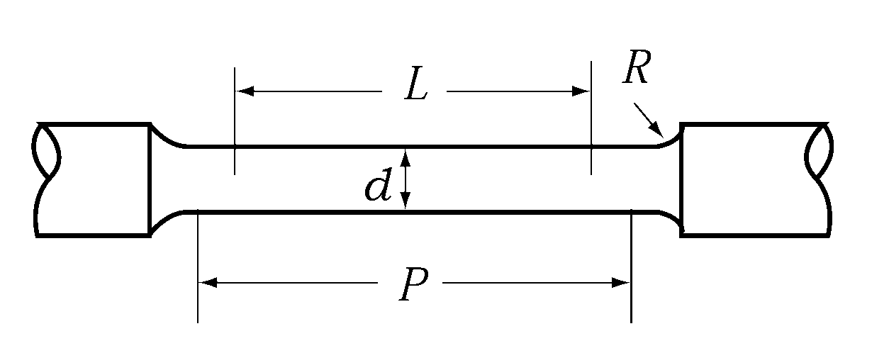 | $d$ = 10 $L$ = 50 $P$ = 55 $R$ ≥ 10 Alternatively. $L$ = 5 $d$ $P$ ≅ $L+0.5d$ $R$ = 12 | Deposited metal tensile test Longitudinal tensile test |
  | *R* 10 |   | $t$ = 12 $d$ = 6.0 $L$ = 24 $P$ = 32 $R$ ≅ 6 | Deposited metal tensile test(Welding consumables for stainless steel) |
  | *R* 10 |   | $t$ = 19~25 $d$ = 12.5 $L$ = 50 $P$ = 60 $R$ ≅ 15 | Deposited metal tensile test(Welding consumables for stainless steel) |
  | *R* 2*A* |  | $a$ = $t$ $b$ = 12 ($t$ ≤ 2) $b$ = 25 ($t$ ＞ 2) $P$ = *B* + 60 $R$ ＞ 25 | Butt weld tensile test for plate |
  | *R* 2*B* | 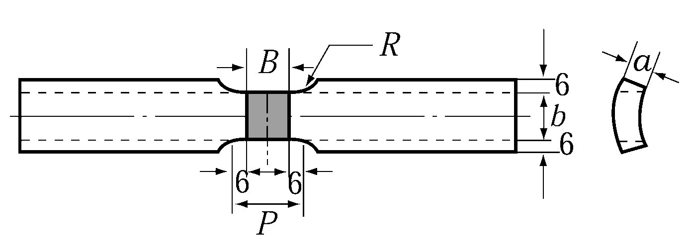 | $a$ = $t$ $b$ = 38 ($t$ ≤ 25) $b$ = 25 ($t$ ＞ 25) $P$ = $B$ + 12 $R$ ≥ 50 | Butt weld tensile test for pipe |
  | NOTE: $L$ : Gauge length The notations used are defined as follows: $P$ : Parallel test length $d$ : Diameter $B$ : Width of weld $a$ : Thickness $R$ : Transition radius $b$ : Width $t$ : Thickness of material |   |   |   |

  **Table 2.2.2 Size and Dimensions of Bend Test Specimens** (Unit : mm) ***(2023)***

  | Used for |   | Type | Size of specimen | Dimensions(1) | Intended for |
  | --- | --- | --- | --- | --- | --- |
  | Welding procedure qualification tests | Face and root bend specimen | *RB* 1 | 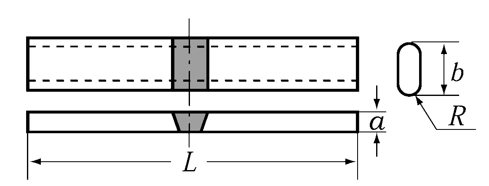 | $t$<12 $a$ = $t$ $b$ = 30 $L$ ≥ 200 $R$ = 1 ~ 2 | Butt weld bend test for plate Longitudinal bend test for plate^(^2) |
  | Welding procedure qualification tests | Side bend specimen | *RB* 2 | 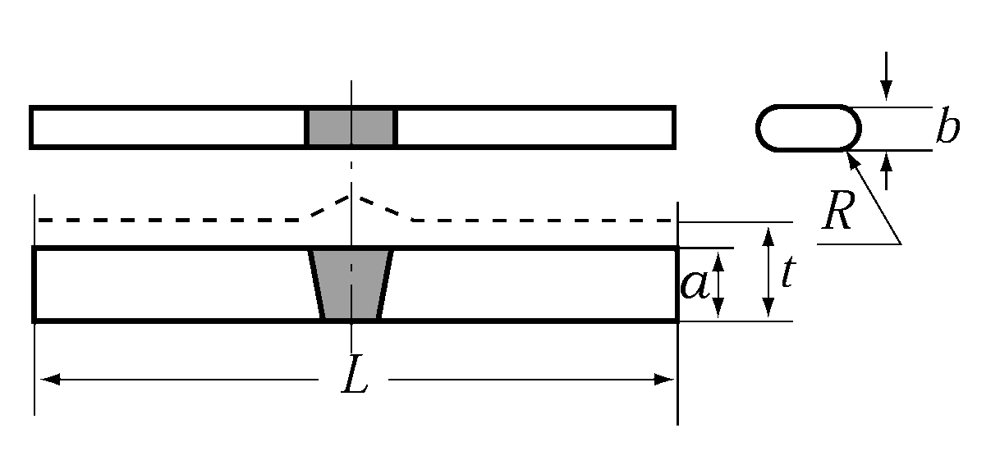 | 12≤$t$ $a$ = $t$ ^(^3) $b$ = 10 $L$ ≥ 200 $R$ = 1 ~ 2 | Butt weld bend test for plate or pipe |
  | Welding procedure qualification tests | Face and root bend specimen | *RB* 3 | 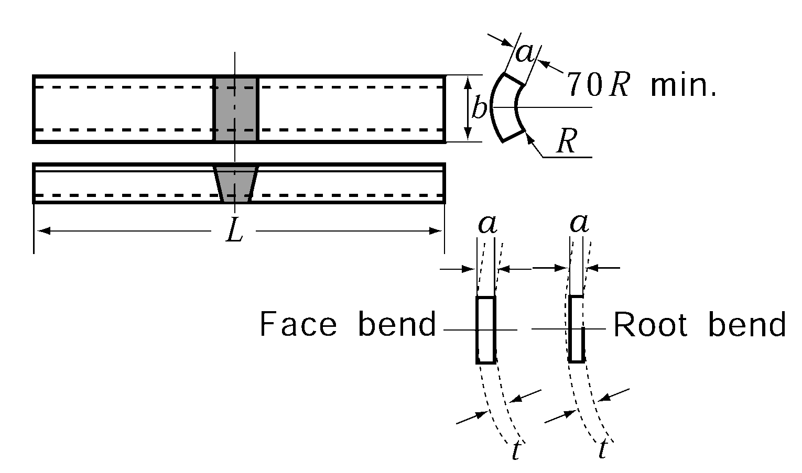 | ① 0＜$t$＜9 $a$ = $t$ $b$ = $t$ + *D*/10 $L$ ≒ 250 $R$ ≤ a/6 ② 9≤$t$≤12 $a$ = 9 $b$ = 40 $L$ ≒ 250 $R$ ≤ 1.5 | Butt weld bend test for pipe |
  | Approval test and periodical inspection for welding consumables | Face and root bend specimen | *RB* 4 | 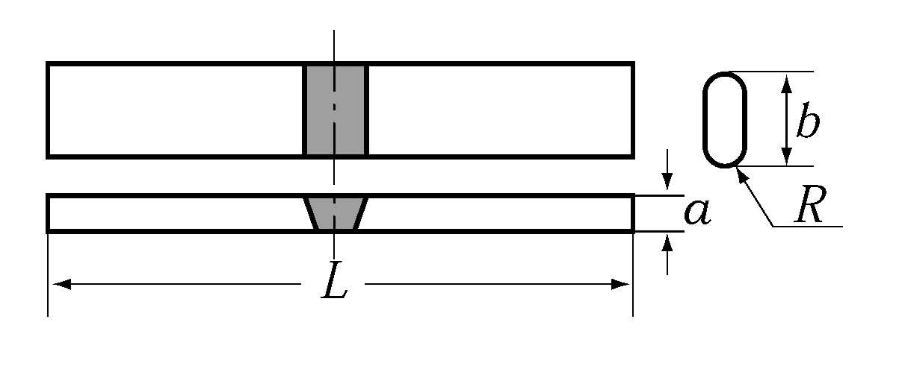 | $a$ = $t$ $b$ = 30 $L$ ≥ 200 $R$ ≤ 1.5 Where the thickness of test assemblies exceeds 25 mm, the thickness of test specimen may be reduced to 25 mm with its surface machined on one side only(compression side) | Butt weld bend test |
  | Approval test and periodical inspection for welding consumables | Side bend specimen | *RB* 5 | 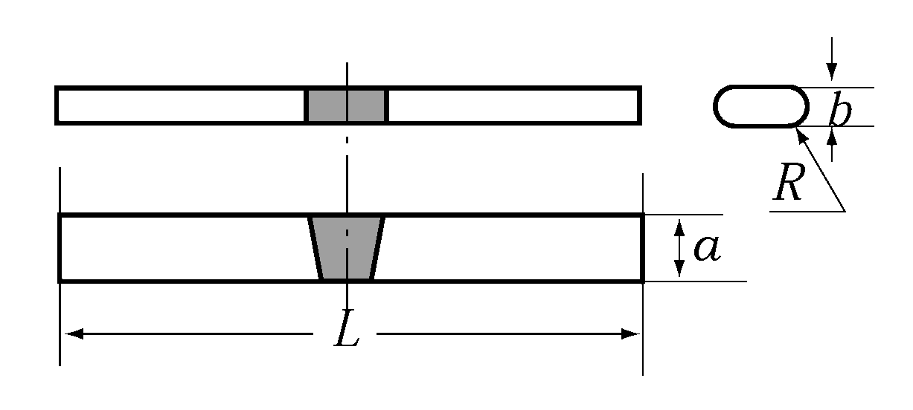 | $a$ = $t$ $b$ = 10 $L$ ≥ 200 $R$ ≤ 1.5 | Butt weld bend test (welding materials for electro-slag and electro-gas) |
  | Approval test and periodical inspection for welding consumables | Side bend specimen | *RB* 6 |   | $a$ = $t$ $b$ = 9 $L$ ≥ 200 $R$ ≤ 1.5 | Butt weld bend test (MIG double side, one layer each, butt welding for aluminium alloy) |
  | Welder's qualification test | Face and root bend specimen | *RB* 7 | 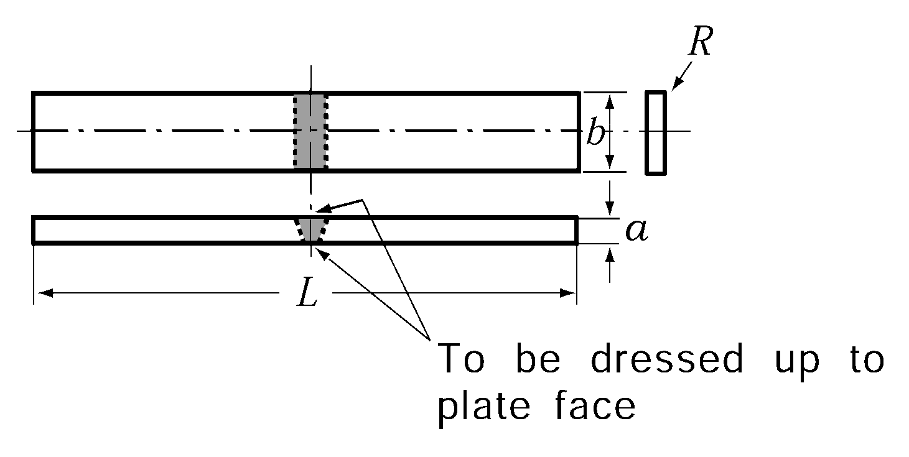 | $t$ < 12 $a$ = $t$ $b$ = 30 $L$ ≒ 150 $R$ ≤ 1.5 | Butt weld bend test for pipe |

  **Table 2.2.2 Size and Dimensions of Bend Test Specimens (Continued)** (Unit : mm) ***(2023)***

  | Used for |   | Type | Size of specimen | Dimensions(1) | Intended for |
  | --- | --- | --- | --- | --- | --- |
  | Welder's qualification test | Side bend specimen | *RB*8 | 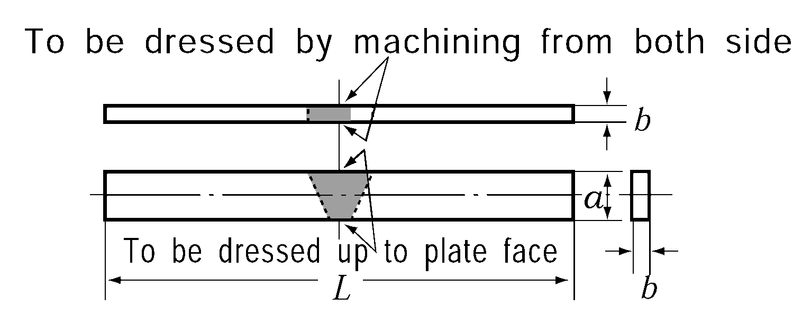 | 12≤$t$ $a$ = $t$(3) $b$ = 9 $L$ ≒ 150 $R$ ≤ 1.5 | Butt weld bend test for plate |
  | Welder's qualification test | Face and root bend specimen | *RB*9 | 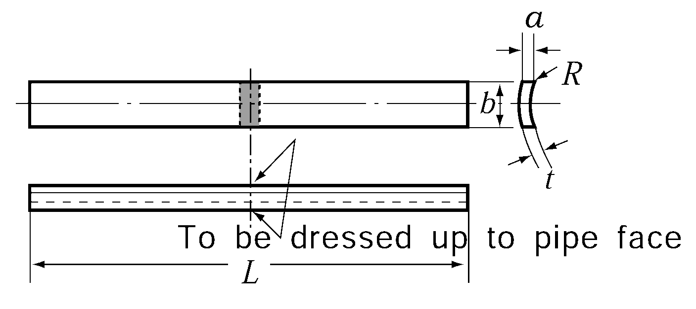 | $t$ ≤ 9.5 $a$ = $t$ $L$ ≒ 150 $R$ ≤ 1.5 $b$ = 40 ($D$>100) or 25($D$≤100) | Butt weld bend test for pipe |
  | Welder's qualification test | Face and root bend specimen | *RB*10 | 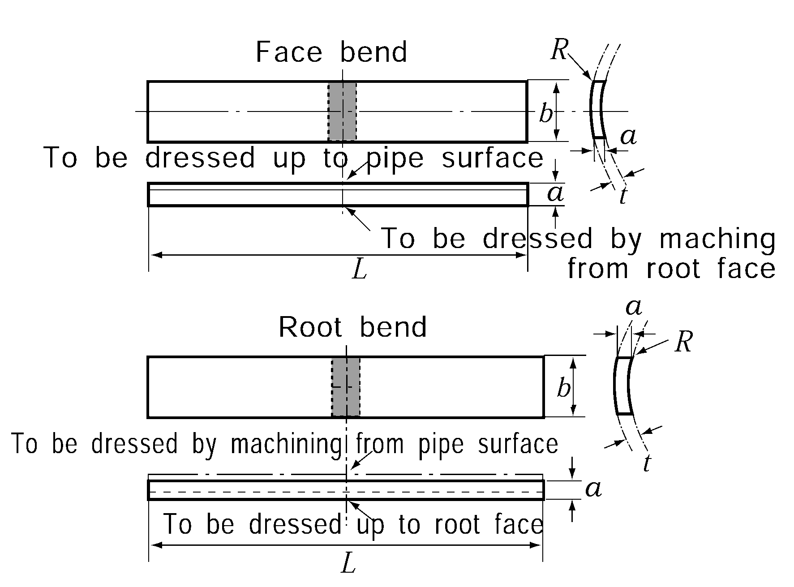 | $t$ > 9.5 $a$ = 10 $L$ ≒ 150 $R$ ≤ 1.5 $b$ = 40 ($D$>100) or 25($D$≤100) | Butt weld bend test for pipe |
  | Welder's qualification test | Side bend specimen | *RB*11 | 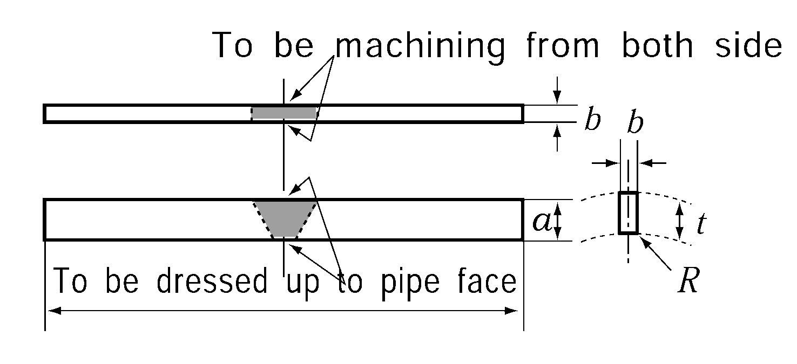 | 12≤$t$ $a$ = $t$(3) $b$ = 9 $L$ ≒ 150 $R$ ≤ 1.5 | Butt weld bend test for pipe |
  | NOTES: (1) The following designations are used. $a$ : Thickness $b$ : Width $R$ : Edge radius $D$ : External pipe diameter $t$ : Thickness of test assembly $L$ : Length (2) The specimen also applies to longitudinal bend test for welding consumables for 9 % Ni steel. The width of Specimen, b, is to be *B*+12 where breath of weld, *B*, is 26 mm and over. (3) For plates over 40 mm thick, the side bend specimen may be subdivided, each part being at least 20 mm wide and each part may be tested. |   |   |   |   |   |

#### 204. Mechanical testing procedures

- **1.** **Tensile test and impact test**
  Tensile tests and impact tests are to be carried out in accordance with the procedures prescribed in **Ch 1, 203.**.
- **2.** **Bend test**
  - **(1)** Except where guided bend tests are required, bend test is roller bend test carried out by the jig of which the plunger has a bending radius specified in each Section with supporting rollers adjustable for their spans.
  - **(2)** Guided bend test jigs are to be as shown in **Figs 2.2.1** and **2.2.2**.
  - **(3)** Roller bend test jigs are to be as shown in **Fig 2.2.3**.
    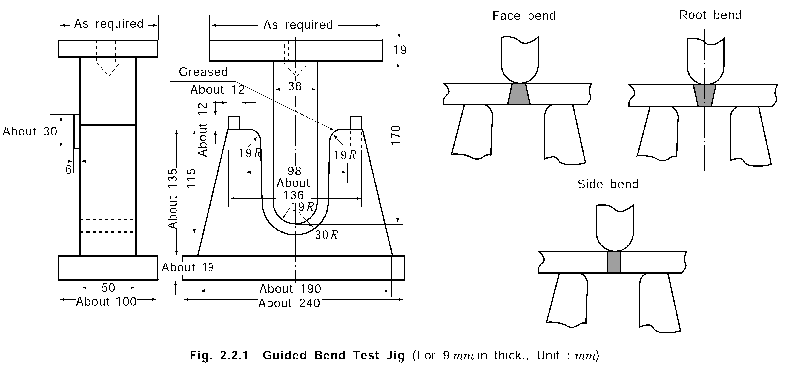
    **Fig 2.2.1 Guided Bend Test Jig** (For 9mm in thick., Unit : mm)

    | 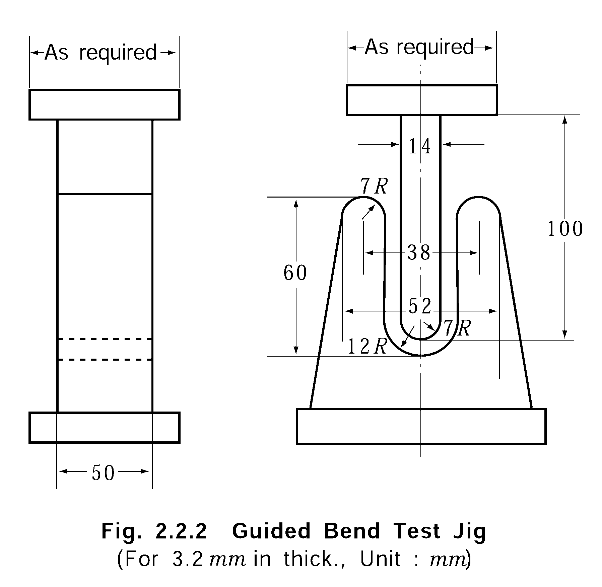 | 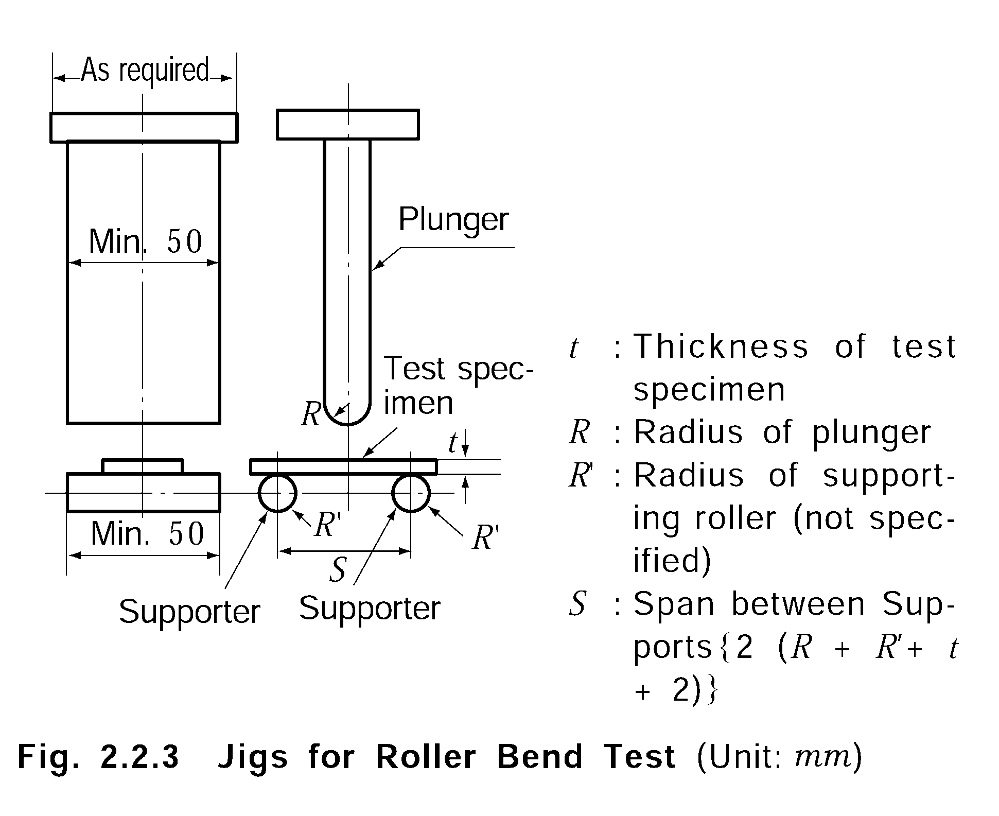 |
    | --- | --- |
    | **Fig 2.2.2 Guided Bend Test Jig** (For 3.2mm in thick., Unit : mm) | **Fig 2.2.3 Jigs for Roller Bend Test** (Unit : mm) |

### Section 3 Welding Work and Inspection

#### 301. Details of joints

- **1.** **Application**
  The details of joints for manual welding are to be in accordance with the following Paragraphs. For other welding procedures such as automatic welding and in case where the specified details of joint are deemed unpracticable, full details of joint are to be submitted for approval.
- **2.** **Butt joints**
  - **(1)** In general, edge preparations of butt welds are to be as shown in **Fig 2.2.4 .**
  - **(2)** Butt welded joints of plates having difference over 4 mm in thickness are to be properly tapered at the end of thicker plate.
- **3.** **Butt joints of thick materials**
  The groove of thick materials, such as cast steel, is in general to be prepared as shown in **Fig 2.2.5**.
  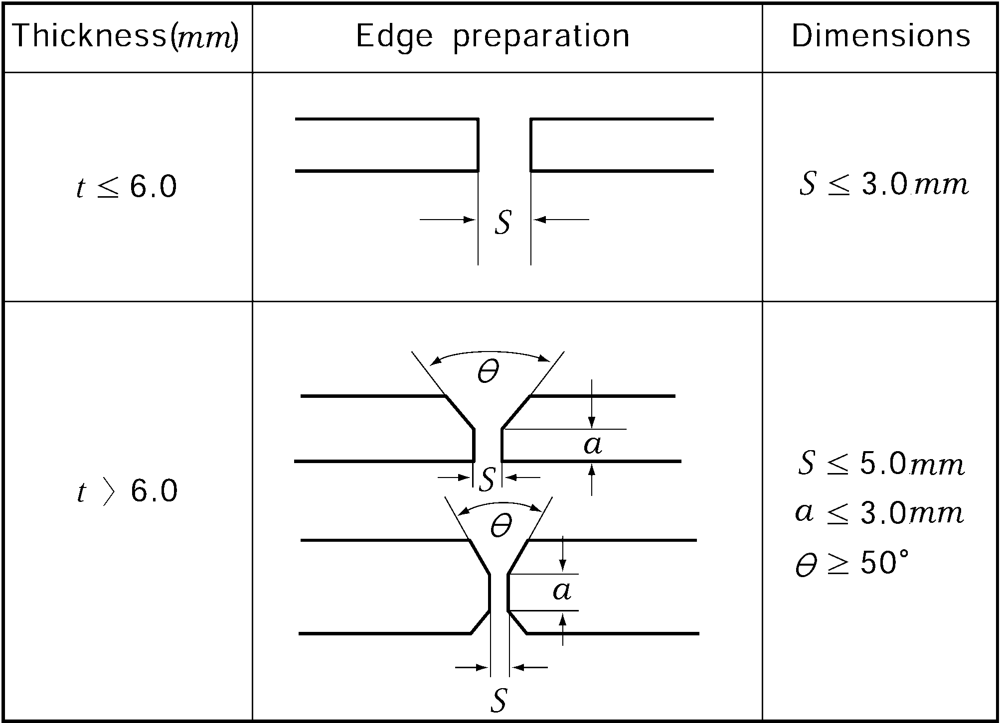
  **Fig 2.2.4 Edge preparation** 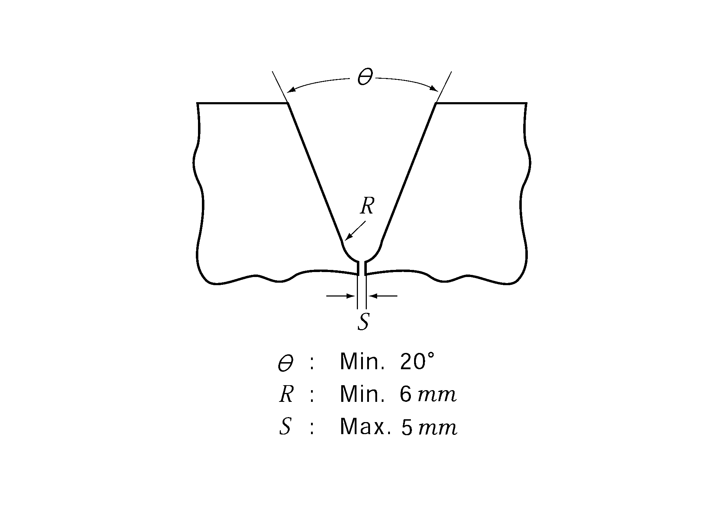
  **Fig 2.2.5 Butt Joint of Thick Material**
- **4.** **Lap joints**
  - **(1)** The breadth of overlap for lap joints which may be subjected to bending is not to be less than obtained from the following formula, but need not exceed 50 mm.
    $b$ = 2 $t$ + 25 (mm)
    where:
    $t$ = Thickness of the thinner plate (mm)
  - **(2)** Where plates are joggled, the breadth of overlap for joints which may be subjected to bending is not to be less than obtained from the following formula, but need not exceed 40 $mm$.
    $b$ = $t$ + 25 (mm)
    where:
    $t$ = Thickness of the thinner plate (mm).

#### 302. Welding Practice

- **1.** Welding Practice, which is the detailed statement of the general welding works for hull structure, is to contain welding process, standard of welding and its quality control, application of welding consumables, welding procedures specification(WPS) and welding sequence of main hull structure and be submitted to the Society.
- **2.** The welding procedure specification(WPS) specified above is to be those satisfactorily complying with the welding procedure qualification tests specified in **Sec 4.**

#### 303. Application of welding consumables

Welding consumables used for welded joints of hull structure are to be of the grades as specified in the relevant Articles of **Sec 6** according to the following requirements:

#### 304. Preparation for Welding

- **1.** **Edge preparation**
  - **(1)** The edge preparations are to be in accordance with the plans, and are to be free from moisture, grease, rust and paint which may cause injurious defects in welded joints.
  - **(2)** The edges to be welded shall be smooth, uniform and free from notches, laminations, cracks and other discontinuities which would adversely affect the quality or strength of the weld.
  - **(3)** Any injurious defects on the edges are to be removed. When weld repairs are required, controlled low hydrogen type welding consumables are to be used as far as practicable and grinding the complete weld smooth and flush with the adjacent surface.
- **2.** **Tack welding**
  - **(1)** Tack welding is to be carried out by the welders qualified by the Society.
  - **(2)** Tack welding is to be removed before the main welding for joints of strength deck plating, sheer strakes, shell plating, and other important structural members or is to be carried out by the same procedure as the main welding without injurious defect in welded joints and made with the same or higher grade of welding consumables as intended to use for main welding.
  - **(3)** The minimum length and pitch of tack welds should be in accordance with the Guidance in relating to Rules. **【See Guidance】**
  - **(4)** Injurious defects or any deviations from groove design due to tack welding to obstruct proceedings of main welding are to be completely removed.
  - **(5)** In case of tack welding higher strength steels, high strength steels for welded structures or joining under high restraint, preheating is to be taken as necessary prior to tack welding.
- **3.** **Fixtures**
  - **(1)** Setting appliances to be used for welding fabrications are to be so arranged as to give restraint without cracks and other defects in welded joints.
  - **(2)** Tack welding for temporary fittings is not to leave any defect on base metal after the tack welds have been removed.

    **Table 2.2.3 Selection of welding consumables(rolled steel plates)** ***(2017)*** ***(2019)*** ***(2021) (2022)***

    | Kind and grade of steel to be welded |   |   | Grade of applicable welding consumables (1) |
    | --- | --- | --- | --- |
    | Rolled steels for hull | Mild steel | *A* | 1, 2, 3, 1*Y*, 2*Y*, 3*Y*, 4*Y*, 5*Y*, 2*Y*40, 3*Y*40, 4*Y*40, 5*Y*40, *L*1, *L*2, *L*3 |
    | Rolled steels for hull | Mild steel | *B, D* | 2, 3, 2*Y*, 3*Y*, 4*Y*, 5*Y*, 2*Y*40, 3*Y*40, 4*Y*40, 5*Y*40, *L*1, *L*2, *L*3 |
    | Rolled steels for hull | Mild steel | *E* | 3, 3*Y*, 4*Y*, 5*Y*, 3*Y*40, 4*Y*40, 5*Y*40, *L*1, *L*2, *L*3 |
    | Rolled steels for hull | Higher strength low alloy steel | *AH*32, *AH*36 | 1*Y*(2), 2*Y*, 3*Y*, 4*Y*, 5*Y*, 2*Y*40, 3*Y*40, 4*Y*40, 5*Y*40, *L*2(3), *L*3, 2*Y*42, 3*Y*42, 4*Y*42, 5*Y*42 |
    | Rolled steels for hull | Higher strength low alloy steel | *DH*32, *DH*36 | 2*Y*, 3*Y*, 4*Y*, 5*Y*, 2*Y*40, 3*Y*40, 4*Y*40, 5*Y*40, *L*2(3), *L*3, 3*Y*42, 4*Y*42, 5*Y*42 |
    | Rolled steels for hull | Higher strength low alloy steel | *EH*32, *EH*36 | 3*Y*, 4*Y*, 5*Y*, 3*Y*40, 4*Y*40, 5*Y*40, *L*2(3), *L*3, 4*Y*42, 5*Y*42 |
    | Rolled steels for hull | Higher strength low alloy steel | *FH*32, *FH*36 | 4*Y*, 5*Y*, 4*Y*40, 5*Y*40, *L*2(3), *L*3, 4*Y*42, 5*Y*42 |
    | Rolled steels for hull | Higher strength low alloy steel | *AH*40, *DH*40 | 2*Y*40, 3*Y*40, 4*Y*40, 5*Y*40, 3*Y*42, 4*Y*42, 5*Y*42, 2*Y*46, 3*Y*46, 4*Y*46, 5*Y*46 |
    | Rolled steels for hull | Higher strength low alloy steel | *EH*40 | 3*Y*40, 4*Y*40, 5*Y*40, 3*Y*42, 4*Y*42, 5*Y*42, 3*Y*46, 4*Y*46, 5*Y*46 |
    | Rolled steels for hull | Higher strength low alloy steel | *FH*40 | 4*Y*40, 5*Y*40, 4*Y*42, 5*Y*42, 4*Y*46, 5*Y*46 |
    | Rolled steels for hull | Higher strength low alloy steel | *EH*47-*H* | 3*Y*47, 4*Y*46(6), 5*Y*46(6) |
    | Rolled steels for low temperature services |   | *RL*235*A* | 4*Y*, 4*Y*40, *L*1, *L*2, *L*3 |
    | Rolled steels for low temperature services |   | *RL*235*B, RL*325*A, RL*325*B* | 5*Y*42(4), *L*2, *L*3 |
    | Rolled steels for low temperature services |   | *RL*355 | 5*Y*42, *L*3 |
    | Rolled steels for low temperature services |   | *RL*5*N*390 | *L*51, *L*91 |
    | Rolled steels for low temperature services |   | *RL*9*N*490 | *L*91 |
    | High strength steels for welded structures(5) |   | *AH*43 | 2*Y*42, 3*Y*42, 4*Y*42, 5*Y*42, 2*Y*46, 3*Y*46, 4*Y*46, 5*Y*46, 2*Y*50, 3*Y*50, 4*Y*50, 5*Y*50 |
    | High strength steels for welded structures(5) |   | *DH*43 | 3*Y*42, 4*Y*42, 5*Y*42, 3*Y*46, 4*Y*46, 5*Y*46, 3*Y*50, 4*Y*50, 5*Y*50 |
    | High strength steels for welded structures(5) |   | *EH*43 | 4*Y*42, 5*Y*42, 4*Y*46, 5*Y*46, 4*Y*50, 5*Y*50 |
    | High strength steels for welded structures(5) |   | *FH*43 | 5*Y*42, 5*Y*46, 5*Y*50 |
    | High strength steels for welded structures(5) |   | *AH*47 | 2*Y*46, 3*Y*46, 4*Y*46, 5*Y*46, 2*Y*50, 3*Y*50, 4*Y*50, 5*Y*50 |
    | High strength steels for welded structures(5) |   | *DH*47 | 3*Y*46, 4*Y*46, 5*Y*46, 3*Y*50, 4*Y*50, 5*Y*50 |
    | High strength steels for welded structures(5) |   | *EH*47 | 4*Y*46, 5*Y*46, 4*Y*50, 5*Y*50 |
    | High strength steels for welded structures(5) |   | *FH*47 | 5*Y*46, 5*Y*50 |
    | High strength steels for welded structures(5) |   | *AH*51 | 2*Y*50, 3*Y*50, 4*Y*50, 5*Y*50, 2*Y*55, 3*Y*55, 4*Y*55, 5*Y*55 |
    | High strength steels for welded structures(5) |   | *DH*51 | 3*Y*50, 4*Y*50, 5*Y*50, 3*Y*55, 4*Y*55, 5*Y*55 |
    | High strength steels for welded structures(5) |   | *EH*51 | 4*Y*50, 5*Y*50, 4*Y*55, 5*Y*55 |
    | High strength steels for welded structures(5) |   | *FH*51 | 5*Y*50, 5*Y*55 |
    | High strength steels for welded structures(5) |   | *AH*56 | 2*Y*55, 3*Y*55, 4*Y*55, 5*Y*55, 2*Y*62, 3*Y*62, 4*Y*62, 5*Y*62 |
    | High strength steels for welded structures(5) |   | *DH*56 | 3*Y*55, 4*Y*55, 5*Y*55, 3*Y*62, 4*Y*62, 5*Y*62 |
    | High strength steels for welded structures(5) |   | *EH*56 | 4*Y*55, 5*Y*55, 4*Y*62, 5*Y*62 |
    | High strength steels for welded structures(5) |   | *FH*56 | 5*Y*55, 5*Y*62 |
    | High strength steels for welded structures(5) |   | *AH*63 | 2*Y*62, 3*Y*62, 4*Y*62, 5*Y*62, 2*Y*69, 3*Y*69, 4*Y*69, 5*Y*69 |
    | High strength steels for welded structures(5) |   | *DH*63 | 3*Y*62, 4*Y*62, 5*Y*62, 3*Y*69, 4*Y*69, 5*Y*69 |
    | High strength steels for welded structures(5) |   | *EH*63 | 4*Y*62, 5*Y*62, 4*Y*69, 5*Y*69 |
    | High strength steels for welded structures(5) |   | *FH*63 | 5*Y*62, 5*Y*69 |
    | High strength steels for welded structures(5) |   | *AH*70 | 2*Y*69, 3*Y*69, 4*Y*69, 5*Y*69 |
    | High strength steels for welded structures(5) |   | *DH*70 | 3*Y*69, 4*Y*69, 5*Y*69 |
    | High strength steels for welded structures(5) |   | *EH*70 | 4*Y*69, 5*Y*69 |
    | High strength steels for welded structures(5) |   | *FH*70 | 5*Y*69 |

    **Table 2.2.3 Selection of welding consumables(rolled steel plates)** ***(2017)*** ***(2019) (2021)*** ***(2022)*** **(Continued)**

    | Kind and grade of steel to be welded |   | Grade of applicable welding consumables (1) |
    | --- | --- | --- |
    | High strength steels for welded structures(5) | *AH*90 | 2*Y*89, 3*Y*89, 4*Y*89, 2*Y*96, 3*Y*96, 4*Y*96 |
    | High strength steels for welded structures(5) | *DH*90 | 3*Y*89, 4*Y*89, 3*Y*96, 4*Y*96 |
    | High strength steels for welded structures(5) | *EH*90 | 4*Y*89, 4*Y*96 |
    | High strength steels for welded structures(5) | *AH*97 | 2*Y*96, 3*Y*96, 4*Y*96 |
    | High strength steels for welded structures(5) | *DH*97 | 3*Y*96, 4*Y*96 |
    | High strength steels for welded structures(5) | *EH*97 | 4*Y*96 |
    | NOTES : (1) The symbol of welding consumables listed above show the materials which are specified in **Table 2.2.25, Table 2.2.35, Table 2.2.43, Table 2.2.49,** and **Table 2.2.77**. (2) When joining higher strength steels using Grade 1*Y* welding consumables, the material thicknesses should not exceed 25 mm. (3) Welding consumables of "*L*2" is applicable to steel grade of *AH*32, *DH*32, *EH*32 or *FH*32. (4) Welding consumables of "5*Y*42" is applicable to steel grade of *RL*325*B*. (5) Where the design requirements permit undermatching weld joint, then welding consumables within scope of 609. can be considered subject to Society discretion and Manufacturer’s recommendations. (6) It can be used in accordance with the Guidance relating to the Rules specified by the Society. **【See Guidance】** |   |   |

#### 305. Welding sequence and direction of welding

- **1.** Welding sequence and direction of welding are to be so determined as to prevent defects in welded joints and to minimize deformations caused by welding.
- **2.** The joints which may cause excessive contraction by welding are to be welded as far as practicable prior to the joints which cause smaller contraction by welding.
- **3.** Welding is to be proceeded to free ends of the joints as far as practicable and welding with direction of vertical-downward is not to be carried out, except the special approval of the Society. **【See Guidance】**

#### 306. Main welding

- **1.** Welding is to be carried out so that no injurious defects may exist in the joints.
- **2.** Welding is to be carried out under conditions of protection against the deleterious effect of moisture, rain, wind and snow, and is to be preheated in cold weather if found necessary.**【See Guidance】**
- **3.** The ends of important welded joints are to be fitted with run-off tabs or are to have proper extensions, which are to be cut off after finished welding.
- **4.** Butt welded joints are to be back chipped to remove the defects in root of welds before applying the closing bead, except in case of one side welding or other approved procedures.
- **5.** In case of welding under excessive restraint or welding for thick steel plate, cast steel or forged steel, special precaution is to be taken as necessary, such as preheating of the material, use of low hydrogen electrodes, etc. so as to prevent cracks.
- **6.** In the parts subject to excessive stress concentration, the fillet welding is to be carried around the ends of member, but in other parts, the fillet welding may not be carried out around the ends, provided that the craters at the ends of welds are filled up.
- **7.** Excessive gaps in butt joint are to be either deposited with welding on grooves, fitted with backing strips to the joints or partly replaced, and are not to be spanned with welding nor filled by slugging.
- **8.** Where the gap between the members in fillet joints is not greater than 2 mm, the welding may be done with the given size of fillet. Where the gap is not less than 2 mm nor more than 5 mm, the welding is to be done with an increased size of fillet corresponding to the amount of gap. Where the gap exceeds 5 mm, the welding is to be done inserting a liner of suitable size or with a chill strip, or plates to be welded are to be partly renewed. **【See Guidance】**
- **9.** Preheating, intermediate temperature and post heat treatment are to be carried out in accordance with the welding procedure approved beforehand or the special approval of the Society.
  **【See Guidance】**

#### 307. Automatic welding

- **1.** The grooves for automatic welding are to be finished in specially accurate dimensions.
- **2.** Automatic welding is to be carried out within the inclination approved in the welding procedure qualification test.
- **3.** In the cross but joints of 16 mm or over in thickness, one joint is to be welded after the automatic welding of the other joint has been completed on both sides.
- **4.** Special precaution is to be taken as necessary for the automatic welding of rimmed steel to prevent cracks.

#### 308. Welding for higher strength steel

- **1.** Arc strikes are to be avoided as far as practicable.
- **2.** Short bead, min. length of repair welds and line heating temperature, etc. are to be in accordance with the Shipbuilding Quality Standard recognized by the Society.

#### 309. Quality of welds

- **1.** The weld is to have a regular and uniform surface and it to be reasonably free from excessive reinforcements, injurious defects, such as undercuts, overlaps, etc.
- **2.** Welded structures are to be reasonably free from welding deformation.
- **3.** Non-destructive inspection is to be carried out for welded joints as the Guidance relating to the Rules specified elsewhere. **【See Guidance】**
- **4.** The welding defects found in an appropriate non-destructive inspection including the visual inspection or watertight test are to be removed and corrected by rewelding.

#### 310. Repairs

- **1.** The removal of weld defects shall be done by gouging, grinding, chipping, etc. with such a manner that the remaining weld metal or base metal is not damaged, however oxygen gouging is not to be used in high strength steels for welded structures.
- **2.** The removed weld defects parts are to be so machined as not to affect repair welding and repair welding shall be carried out with low hydrogen type welding consumables and an electrode preferably smaller than that used for making the original weld.
- **3.** Members distorted by welding may be straightened by mechanical means or localized heat treatment, however in case of localized heat treatment, the temperature of heated areas is to be so limited as not to affect the mechanical properties of base metal.

#### 311. Welding works for YP47 Steels (2021)

- **1.** **Short bead**
  Short bead length for tack and repairs of welds by welding are not to be less than 50mm. In the case where $P _{cm}$ is less than or equal to 0.19, 25mm of short bead length may be adopted with approval of the Society.
- **2.** **Preheating**
  Preheating is to be 50°C or over when air temperature is 5°C or below. In the case where $P _{cm}$ is less than or equal to 0.19 and the air temperature is below 5°C but above 0°C, alternative preheating requirements may be adopted with approval of the Society.
- **3.** **Others**
  - **(1)** Special care is to be paid to the final welding so that harmful defects do not remain.
  - **(2)** Jig mountings are to be completely removed with no defects in general, otherwise the treatment of the mounting is to be accepted by the Society.

#### 312. Welding works for Brittle crack arrest steels (2021)

Welding work (such as relevant welder’s qualification, short bead, preheating, selection of welding consumable, etc.) for brittle crack arrest steels is to be in accordance with the relevant requirements for each steel grade excluding suffix “BCA1” or “BCA2”.

### Section 4 Welding Procedure Qualification Tests

#### 401. General

- **1.** **Application**
  - **(1)** The welding procedures to be applied to hull construction, machinery and piping specified in this Chapter are to be those satisfactorily complying with the welding procedure qualification tests specified in this Section. *(2019)*
  - **(2)** The welding procedures qualification test for cargo tank, secondary barriers and piping arrangements in ships carrying liquefied gases in bulk, and for the low-flashpoint fuels tank are to be in accordance with **Pt 7, Ch 5, Sec 6** of Rules and **Rules/Guidances for the Classification of Ships Using Low-flashpoint Fuels**. *(2019)*
- **2.** **Definitions**
  - **(1)** Welding procedure specification(WPS)
    A specification of materials, detailed methods, welding parameters etc. to be applied in the welding of a particular joint.
  - **(2)** Welding procedure qualification tests(WPQT)
    A test carried out in order to demonstrate that a weld made according to a specific welding procedure specification meets the given requirements.
  - **(3)** Welding procedure qualification record(PQR)
    The record of the actual parameters employed during welding of the qualification test piece according to the requirement of (2), and results from the non-destructive inspection and mechanical testing.
- **3.** **General requirements of WPQT**
  - **(1)** The manufacturers are to obtain the approval of the welding procedure qualifications before the welding works in the following case specified in (a) through (b)
  - **(2)** For the approval of welding procedure qualification, the preliminary welding procedure specification specified in **402.** is to be reviewed by the Society and the welding procedure qualification test is to be carried out with satisfactory results. Welding procedure specifications are to refer to the test conditions and test results achieved during welding procedure qualification testing.

#### 402. Welding procedure specification

- **1.** A welding procedure specification (WPS) is to be prepared by the shipyard or manufacturer which intends to perform the welding procedure qualification test. This document is also referred to as a preliminary welding procedure specification (pWPS). The shipyard or manufacturer is to submit to the Society a pWPS for review prior to the tests.
- **2.** The pWPS can be modified and amended during procedure tests as deemed necessary however it is to define, at least, the following welding variables.
  - **(1)** Kind of base metal
  - **(2)** Nominal thickness or diameter range(dimensions)
  - **(3)** Welding process
  - **(4)** Joint or groove designs with tolerances
  - **(5)** Welding position(s) and direction of progression
  - **(6)** Welding consumables(grade, shielded gas, backing, flux, etc.)
  - **(7)** Electrical characteristics(amperage, voltage and pole nature etc.)
  - **(8)** Travel speed and heat input ranges
  - **(9)** Preheat and maximum interpass temperature
  - **(10)** Post weld heat temperature (if any)
  - **(11)** Other conditions necessary for the welding procedure (ex. : welding speed, heat input etc.)
- **3.** Welding consumables used in welding procedure qualification tests should be approved in accordance with the requirements specified in **Sec 6** of the Rules.
- **4.** In case that the test pieces welded according to the pWPS show unacceptable results the pWPS is to be adjusted by the shipyard or manufacturer. The new pWPS is to be prepared and the test pieces welded in accordance with the new pWPS.
- **5.** The WPS is to be used as a basis for the production welds, and upon satisfactory completion of the tests based on the pWPS, the Society may approve it as a WPS. In case that a WPS is approved by the Society the approval range is to be in compliance with the requirements in **407.**

#### 403. Welding procedure qualification tests(WPQT)

- **1.** Where procedure qualification test is required, the test assembly is to be welded in the same or similar environment and the qualification tests are to be carried out under the welding conditions given in the pWPS.
- **2.** Welding of the test assemblies and testing of test specimens are to be witnessed by the Surveyor.
- **3.** The laboratory or testing establishment used to perform the tests is to have the necessary equipment, maintained in good order and suitably calibrated. And **Pt 2, Ch 1, 201.** of Rules is applied on those. *(2019)*
- **4.** If tack welds and/or start and stop points are a condition of the weld process they are to be fused into the joint and are to be included in the test assemblies.
- **5.** For qualification tests for stainless clad steels, the requirements specified in **404.** and **405.** are to be complied with. However the impact test may be dispensed with where other welding procedure qualification on the stainless clad steel base metal under the same welding condition has been approved. Where materials other than those specified in this Section are used, the qualification tests are to ve carried out in accordance with the testing standard approved by the Society. Duplex stainless steel is to be in accordance with the Guidance in relating to Rules.
- **6.** Where materials other than those specified in this Section are used, the qualification tests are to ve carried out in accordance with the testing standard approved by the Society. Duplex stainless steel is to be in accordance with the Guidance in relating to Rules. **【See Guidance】**
- **7.** Tests or test conditions other than those specified in this Section for the welding procedure qualification may be required, where deemed necessary by the Society.
- **8.** Where Welding Procedure Specification (WPS) for the non-BCA steels has been approved by the Society, the said WPS is applicable to the same welding procedure applied to the same grade with suffix “BCA1” or “BCA2” except high heat input processes over 50kJ/cm. The requirements for welding procedure qualification test for brittle crack arrest steels is to be in accordance with the relevant requirements for each steel grade excluding suffix “BCA1” or “BCA2”, except for hardness specified in **404. 9** and **405. 6**. *(2021)*

#### 404. Tests for butt welded joints

- **1.** **Application**
  The requirements stated hereunder apply to the butt joints welded by manual welding, semi-automatic welding or automatic welding.
- **2.** **Kinds of test**
  According to the materials to be tested, kinds of test and number of test specimens are to be given in **Table 2.2.4** and **Table 2.2.5**. Additional test may be required where found necessary by the Society. **【See Guidance】**
- **3.** **Test assemblies**
  - **(1)** Test assemblies are to be prepared with the same or equivalent material used in the actual work.
  - **(2)** The dimensions and types of test assembly are to be as indicated in **Fig 2.2.6**.

    | 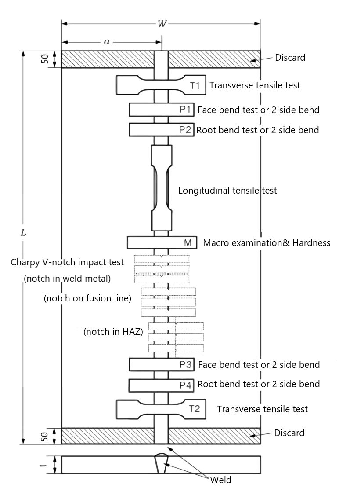 | (Note) The test assembly is to be of a size with the minimum dimensions: (1) manual or semi-automatic welding: Width(W) : min. 300mm Length(L) : min. 350mm (2) automatic welding Width(W) : min. 400mm Length(L) : min. 1,000mm |
    | --- | --- |
    | (A) Test assembly for Hull Structural Steels, High Strength Quenching and Tempered Steels, Stainless Steels, Rolled steels for boiler/pressure vessel/low temp’ service or Aluminium Alloys *(2019)* |   |

    **Fig 2.2.6 Welding procedure test assembly** (Unit : mm)

    | 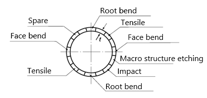 (B) Test assembly for pipes less than 12mm in thickness | 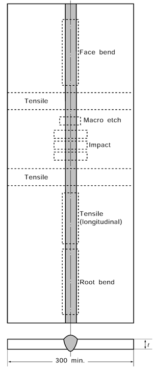 (Note) If base material and weld metal have not markedly different strength levels, two transverse bend specimens may alternatively be tested for two longitudinal bend specimens. *(2019)* (D) Test assembly for *RL*9*N*490 |
    | --- | --- |
    | 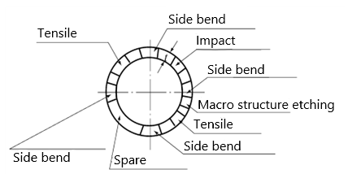 (C) Test assembly for pipes 12mm and over in thickness |   |
  - **(3)** Test assemblies are to be welded in the same welding positions as the actual work.
  - **(4)** When the test for plate is approved, the welding for the pipes over 500 mm in outer diameter is permitted. And when the test for pipes over 25 mm is approved, the welding for the plates is permitted. *(2019)*
  - **(5)** For butt welded joints of rolled steel plates, the direction of welding according to rolling direction is to be as follows.
- **4.** **Tensile tests**
  - **(1)** The number of tensile test specimens taken from each test assembly is to be as shown in **Table 2.2.4** and **Table 2.2.5**. *(2019)*

    **Table 2.2.4 Kinds of Test for Plates with Butt Welded Joints** ***(2019)***

    | Grades and material symbols of test specimens |   |   | Kinds and number of specimens for test(1) |   |   |   |   |   |   |   |
    | --- | --- | --- | --- | --- | --- | --- | --- | --- | --- | --- |
    | Grades and material symbols of test specimens |   |   | Visual insp. | Tensile test | Bend test | Impact test | Macro- structure insp. | Hard. test | Non- destructive insp.^(^4) | Brittle fracture initiation test |
    | Rolled steels for hull structural | Normal strength steel | *A*, *B*, *D*, *E* | Welding positions of whole length | 2 | 4(2) | (3) | 1 | - | Welding positions of whole length | - |
    | Rolled steels for hull structural | Higher strength steel | *AH* 32, *DH* 32, *EH* 32, *FH* 32, *AH* 36, *DH* 36, *EH* 36, *FH* 36, *AH* 40, *DH* 40, *EH* 40, *FH* 40 | Welding positions of whole length | 2 | 4(2) | (3) | 1 | 1(10) | Welding positions of whole length | - |
    | Rolled steels for hull structural | Higher strength steel | *EH* 47-*H* | Welding positions of whole length | 2 | 4(2) | (3) | 1 | 1(10) | Welding positions of whole length | 1(13) |
    | Rolled steels for low temperature service |   | *RL*235*A*, *RL*235*B, RL*325*A, RL*325*B*, *RL*355, *RL* 1*N*355, *RL* 2*N*255, *RL* 3*N*355, *RL* 5*N*390 | Welding positions of whole length | 2 | 2 | (3) | 1 | 1 | Welding positions of whole length | - |
    | Rolled steels for low temperature service |   | *RL* 9*N*490 | Welding positions of whole length | 3(5) | 2 | (3) | 1 | 1 | Welding positions of whole length | - |
    | Weldable high strength steel |   | *AH* 43, *DH* 43, *EH* 43, *FH* 43, *AH* 47, *DH* 47, *EH* 47, *FH* 47, *AH* 51, *DH* 51, *EH* 51, *FH* 51, *AH* 56, *DH* 56, *EH* 56, *FH* 56, *AH* 63, *DH* 63, *EH* 63, *FH* 63, *AH* 70, *DH* 70, *EH* 70, *FH* 70, *AH* 90, *DH* 90, *EH* 90, *AH* 97, *DH* 97, *EH* 97 | Welding positions of whole length | 2 | 4(2) | (3) | 1 | 1 | Welding positions of whole length | - |
    | Casting for welded construction and Hull steel forging |   | *RSC* 410, *RSC* 450, *RSC* 480, *RSC* 520, *RSC* 560, *RSC* 600, *RSC* 440*A, RSC* 480*A, RSC* 550*A, RSF* 410*H, RSF* 450*H*, *RSF* 480*H*, *RSF* 520*H*, *RSF* 560*H*, *RSF* 600*H*, *RSF* 550*AH, RSF* 600*AH, RSF* 650*AH* | Welding positions of whole length | 2 | 4(2) | (3)(9) | 1 | 1 | Welding positions of whole length | - |
    | Casting for welded construction and Hull steel forging |   | *RSC* 410, *RSC* 450, *RSC* 480, *RSC* 520, *RSC* 560, *RSC* 600, *RSC* 440*A, RSC* 480*A, RSC* 550*A, RSF* 410*H, RSF* 450*H*, *RSF* 480*H*, *RSF* 520*H*, *RSF* 560*H*, *RSF* 600*H*, *RSF* 550*AH, RSF* 600*AH, RSF* 650*AH* | Welding positions of whole length | 2 | 4(2) | (3)(9) | 1 | - | Welding positions of whole length | - |
    | Rolled stainless steels |   | *RSTS* 304, *RSTS* 304*L*, *RSTS* 304*N*1, *RSTS* 304*N*2, *RSTS* 304*LN*, *RSTS* 309*S*, *RSTS* 310*S*, *RSTS* 316, *RSTS* 316*L*, *RSTS* 316*N*, *RSTS* 316*LN*, *RSTS* 317, *RSTS* 317*L*, *RSTS* 317*LN*, *RSTS* 321, *RSTS* 347 | Welding positions of whole length | 2 | 2 | ^- | 1 | - | Welding positions of whole length | - |
    | Aluminium alloys(6) | 5000 series | 5083*P,* 5383*P,* 5059*P,* 5086*P,* 5754*P,* 5083*S,* 5383*S,* 5059*S,* 5086*S*(7) | Welding positions of whole length | 2 | 4(2) | - | 1 | - | Welding positions of whole length | - |
    | Aluminium alloys(6) | 6000 series | 6005*AS,* 6061*S,* 6082*S*(8) | Welding positions of whole length | 2 | 4(2) | - | 1 | - | Welding positions of whole length | - |
    | Rolled steel plates for boiler &pressure vessel | Boiler and class 1 pressure vessel(11) | *RSP* 24, *RSP* 30, *RSP* 32, *RSP* 30*A*, *RSP* 32*A,* *RPV* 24, *RPV* 32, *RPV* 36, *RPV* 42, *RPV* 46, *RPV* 50, etc. | Welding positions of whole length | 2 | 4(2) | 3 set(12) | 1 | 1 | Welding positions of whole length | - |
    | Rolled steel plates for boiler &pressure vessel | Class 2 pressure vessel(11) | *RSP* 24, *RSP* 30, *RSP* 32, *RSP* 30*A*, *RSP* 32*A,* *RPV* 24, *RPV* 32, *RPV* 36, *RPV* 42, *RPV* 46, *RPV* 50, etc. | Welding positions of whole length | 2 | 4(2) | - | 1 | 1 | Welding positions of whole length | - |
    | Rolled steel plates for boiler &pressure vessel | Class 3 pressure vessel(11) | *RSP* 24, *RSP* 30, *RSP* 32, *RSP* 30*A*, *RSP* 32*A,* *RPV* 24, *RPV* 32, *RPV* 36, *RPV* 42, *RPV* 46, *RPV* 50, etc. | The tests may be omitted according to the discretion of the Society |   |   |   |   |   |   |   |

    | NOTES: (1) Where found necessary by the Society, microscopic test, hardness test and tests other than these may be required. **【See Guidance】** (2) Two root and two face bend specimens are to be tested. For thickness 12 mm and over, four side bend specimens may alternatively be tested. Where rolled steel plates for boiler &pressure vssel were tested, four side bend specimens may alternatively be tested for two root and two face bend specimens. (3) No. of test sets and position of notch are as shown in **Fig 2.2.7**. (4) Internal inspections by radiographic examination or ultrasonic examination and surface inspections by magnetic particle examination or liquid penetrant examination are to be carried out. Where rolled steel plates for boiler &pressure vssel were tested, radiographic examination is to be carried out for internal inspections. (5) Two specimens are to be taken transversely and one specimen is to be taken longitudinally(See. **Fig 2.2.6**) (6) Material symbols of aluminium alloys include the symbols of which is the temper condition. (7) Rolled products which have the same grade and temp condition may be used. (8) Other rolled aluminium alloys of 6000 series with minimum tensile strength 260 $\mathrm{N}/mm ^{2}$ may be used. (9) Where impact test is required. (10) Hardness test(#eqnID-74910) is required for hull structural steel with specified minimum yield strength of $R _{eH}$ ≥ 355 $\mathrm{N}/mm ^{2}$ (11) The classification for pressure vessel is in accordance with **Pt 5**, **Ch 5**. (12) The positions of notches are a,b,c in **Fig 2.2.7**. (13) Deep notch test or CTOD test may be required. However brittle fracture test may be waived for the welding procedure of heat input less than 200 kJ/cm. |
    | --- |

    **Table 2.2.5 Kinds of Test for Pipes with Butt Welded Joints** ***(2019)***

    | Grades and material symbols of test specimens |   | Kinds and number of specimens for test(1)(2)(3) |   |   |   |   |   |   |
    | --- | --- | --- | --- | --- | --- | --- | --- | --- |
    | Grades and material symbols of test specimens |   | Visual insp. | Tensile test | Bend test(5) | Impact test(6) | Macro- structure insp. | Hard. test | Non- destructive insp. |
    | The pipes for ordinary piping | *RSTH* 35, *RSTH* 42, *RSTH* 52, *RSTH* 12, *RSTH* 22, *RSTH* 23, *RSTH* 24, *RST* 138, *RST* 142, *RST* 238, *RST* 242, *RST* 249, *RST* 338, *RST* 342, *RST* 349, *RST* 412, *RST* 422, *RST* 423, *RST* 424, *RBH* 1, *RBH* 2, *RBH* 3, *RBH* 4, *RBH* 5, *RBH* 6, etc. | Welding positions of whole length | 2 | 4 | - | 1 | 1 | Welding positions of whole length(9) |
    | The pipes used for high temperature and high pressure(4) | *RSTH* 35, *RSTH* 42, *RSTH* 52, *RSTH* 12, *RSTH* 22, *RSTH* 23, *RSTH* 24, *RST* 138, *RST* 142, *RST* 238, *RST* 242, *RST* 249, *RST* 338, *RST* 342, *RST* 349, *RST* 412, *RST* 422, *RST* 423, *RST* 424, *RBH* 1, *RBH* 2, *RBH* 3, *RBH* 4, *RBH* 5, *RBH* 6, etc. | Welding positions of whole length | 2 | 4 | (7) | 1 | 1 | Welding positions of whole length(9) |
    | Steel pipes for low temperature service | *RLPA*, *RLPB*, *RLPC*, *RLP* 2, *RLP* 3, *RLP* 9 | Welding positions of whole length | 2 | 4 | (8) | 1 | 1 | Welding positions of whole length(10) |
    | Stainless steel pipes | *RSTS* 304*TP*, *RSTS* 304*LTP*, *RSTS* 309*STP*, *RSTS* 310*STP*, *RSTS* 316*TP*, *RSTS* 316*LTP*, *RSTS* 317*TP*, *RSTS* 317*LTP*, *RSTS* 321*TP*, *RSTS* 347*TP* | Welding positions of whole length | 2 | 4 | - | 1 | - | Welding positions of whole length(10) |
    | Notes : (1) Where found necessary by the Society, microscopic test, hardness test and tests other than these may be required. **【See Guidance】** (2) Regardless of the above, as for those of less than 50 mm in outer diameter, test assemblies are to be prepared by two sets, one for tensile test, the other for macro, micro structure and hardness distribution examinations to be carried out respectively. (3) For the welding procedure qualification tests on materials used at high temperature, the Society may require a creep test or high temperature tensile test. (4) For steam pipes and flanges to be used in the place where the design pressure is not less than 30 $\mathrm{kgf}/cm ^{2}$ and the design temperature exceeds 400℃. (5) Two root and two face bend specimens are to be tested. For thickness 12 mm and over, four side bend specimens may alternatively be tested. Where preparation of the above test specimens is not possible depending on pipe's diameter, test specimens for face bend test and root bend test may be reduced to one specimen each for those of 12 mm thickness or less, and for side bend test may be reduced to two specimens for those of over 12 mm. *(2022) (2023)* (6) In a case where preparation of impact test specimens is not possible depending on pipe's dimensions or in case where welding is made with a base metal having no impact value required, impact test may be omitted subject to the approval of the Society. (7) The position of notch is “a“ in **Fig 2.2.7**. (8) Position of notch is as shown in **Fig 2.2.7**. (9) For those with an outer diameter of 130 mm or above, and with a design working pressure 30 $\mathrm{kgf}/cm ^{2}$or above, and further with maximum design temperature over 400℃. However, even for the pipes having an outer diameter of less than 130 mm, radiographic examination depending on material and working condition may be required. (10) Internal inspections by radiographic examination or ultrasonic examination and surface inspections by magnetic particle examination or liquid penetrant examination are to be carried out. |   |   |   |   |   |   |   |   |

    **Table 2.2.6 Tensile Test Requirements for Butt Welded Joint**

    | Kind of testing materials | Grade of testing materials | Tensile strength ($\mathrm{N}/mm ^{2}$) | Yield strength ($\mathrm{N}/mm ^{2}$) |
    | --- | --- | --- | --- |
    | Rolled steels for lower temperature service | *RL* 9*N*490 | 590 min.(1) | 315 min. |
    | Rolled steels for lower temperature service | *RL* 9*N*490 | 630 min.(2) | - |
    | Steel pipes for low temperature service | *RLP* 9 | 630 min. | - |
    | Aluminium alloys | 5754 | 190 min. | - |
    | Aluminium alloys | 5086 | 240 min. | - |
    | Aluminium alloys | 5083 | 275 min. | - |
    | Aluminium alloys | 5383 | 290 min. | - |
    | Aluminium alloys | 5059 | 330 min. | - |
    | Aluminium alloys | 6005A, 6061, 6082(3) | 170 min. | - |
    | (Notes) (1) For test specimen in longitudinal direction (2) For test specimen in transverse direction (3) See notes (8) of **Table 2.2.4.** |   |   |   |
  - **(2)** Tensile tests are to be carried out with the test specimen shown in **Table 2.2.1**. The tensile strength is not to be less than the minimum tensile strength specified for the base metal except for those specified in **Table 2.2.6**. When butt welds are made between plates of different grades, the tensile strength to be obtained on the welded assembly is to be in accordance with the requirements relating to the steel grade having lower strength. In this case, "lower strength grade of steel" means grade *E* of **Fig 2.2.7**, (2). *(2019)*
    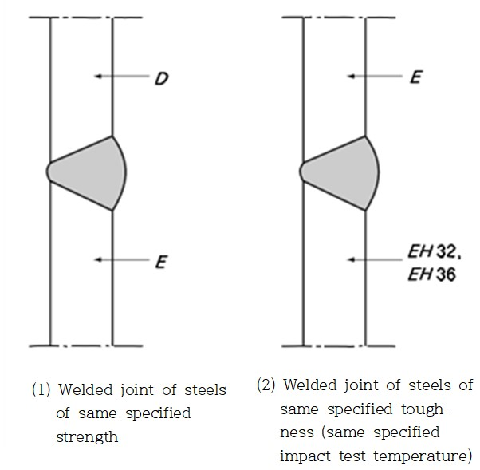
    **Fig 2.2.7 Butt Welds between Different Steel Grades** ***(2019)***
  - **(3)** In following cases where the consumables are not unavoidably approved by the Society, it is to be required additionally to prepare a *R* 14A deposited metal tensile test specimen as shown in **Table 2.2.1** in entirely weld metal and the tensile properties recorded for each specimen are not to be less than the minimum required for the approval of the appropriate grade of consumable.
    Unless the welding consumables are approved by the Society, the Welding Procedure Specification is to be deemed valid only for same Lot with welding consumables used. And the Lot no. is to be stated in the Welding Procedure Specification. *(2019)*
  - **(4)** Where more than one welding process or type of consumable has been used to make the test weld, test specimens are to be taken from the area of the weld where each was used with the exception of those processes or consumables used to make the first weld run or root deposit.
- **5.** **Bend tests**
  - **(1)** The number of bend test specimens taken from each test assembly is to be as shown in **Table 2.2.4** and **Table 2.2.5,** and the position of specimen is to be as shown in **Fig 2.2.6**.
  - **(2)** The shape and dimension of face bend specimen, root bend specimen or side bend specimen are to be as indicated in *RB*1, *RB*2 or *RB*3 of **Table 2.2.2**. Bend test procedure and inside bend diameter are to be as indicated in **Table 2.2.7**. There is to be no crack nor any other defect greater than 3 mm in length in any direction on the surface of bend specimen. *(2018)*
  - **(3)** For butt joints in heterogeneous base metals, face and root longitudinal bend test specimens may be used instead of the transverse bend test specimens. *(2019)*

    **Table 2.2.7 Bend Test Requirements** ***(2018)***

    | Kind of testing materials | Grade of testing materials | Inside bend diameter (mm)(1) | Bending angle |
    | --- | --- | --- | --- |
    | Steel pipes for low temperature service | *RLP* 9 | $\frac{20}{3} t$ | 180° |
    | Weldable high strength steel | *AH* 43, *DH* 43, *EH* 43, *FH* 43, *AH* 47, *DH* 47, *EH* 47, *FH* 47, *AH* 51, *DH* 51, *EH* 51, *FH* 51 | $5 t$ | 180° |
    | Weldable high strength steel | *AH* 56, *DH* 56, *EH* 56, *FH* 56, *AH* 63, *DH* 63, *EH* 63, *FH* 63, *AH* 70, *DH* 70, *EH* 70, *FH* 70 | $6 t$ | 180° |
    | Aluminium alloys | 5754, 5086, 5083, 5383, 5059, 6005*A*, 6061, 6082(2) | (3) | 180° |
    | Other materials |   | $4t$ | 180° |
    | NOTES : (1) $t$ is the thickness of the test specimen. (2) See Notes (9) of the **Table 2.2.4.** (3) The bend test specimens should be bent on a mandrel with maximum diameter as given in the formula below. $d= \frac{100 \times t _{s}}{A} -t _{s}$ where $d$ is the maximum former diameter $t _{s}$ is the thickness of the bend test specimen (this includes side bends) $A$ is the minimum tensile elongation required by the alloy grade, temper condition and thickness (for combination between different alloys, the lowest individual value should be used). |   |   |   |
- **6.** **Impact tests**
  - **(1)** *Normal and higher strength hull structural steels*

    **Table 2.2.8 Impact test requirements for butt joints** (t ≤ 50 mm) **(1),(2)** ***(2019)***

    | Grade of steel | Test temp. (℃) | Value of minimum average absorbed energy (J) (4) |   |   |
    | --- | --- | --- | --- | --- |
    | Grade of steel | Test temp. (℃) | For manually or semi-automatically welded joints |   | For automatically welded joints |
    | Grade of steel | Test temp. (℃) | Downhand, Horizontal, Overhead | Vertical upward, Vertical downward | For automatically welded joints |
    | *A*(3) | 20 | 47 min. | 34 min. | 34 min. |
    | *B*(3), *D* | 0 | 47 min. | 34 min. | 34 min. |
    | *E* | -20 | 47 min. | 34 min. | 34 min. |
    | *AH* 32, *AH* 36 | 20 | 47 min. | 34 min. | 34 min. |
    | *DH* 32, *DH*36 | 0 | 47 min. | 34 min. | 34 min. |
    | *EH* 32, *EH* 36 | -20 | 47 min. | 34 min. | 34 min. |
    | *FH* 32, *FH* 36 | -40 | 47 min. | 34 min. | 34 min. |
    | *AH* 40 | 20 | 47 min. | 39 min. | 39 min. |
    | *DH* 40 | 0 | 47 min. | 39 min. | 39 min. |
    | *EH* 40 | -20 | 47 min. | 39 min. | 39 min. |
    | *FH* 40 | -40 | 47 min. | 39 min. | 39 min. |
    | *EH* 47-*H* (t > 50 mm) | -20 | 64 min. |   |   |
    | Note: (1) For thickness above 50 mm other than EH47-H, impact test requirements are to be agreed by the Society. **【See Guidance】** (2) These requirements are to apply to test piece of which butt weld is perpendicular to the rolling direction of the plates. (3) For Grade A and B steels average absorbed energy on fusion line and in heat affected zone is to be minimum 27 J. (4) When the absorbed energy of two or more test specimens among a set of test specimens is less in value than the specified average absorbed energy or when the absorbed energy of a single test specimen is less in value than 70 % of the specified average absorbed energy, the test is considered to have failed. |   |   |   |   |
  - **(2)** *High strength steels for welded structures*
  - **(3)** *Weldable C and C-Mn hull steel castings and forgings*
    For base metal with specified impact values test temperature and absorbed energy are to be in accordance with the requirements of the base metal to be welded.

    | heat input | thickness | Locations of V-notch(3) |
    | --- | --- | --- |
    | normal heat input ≤ 50 $kJ/cm$ | t ≤ 50 mm(1) | 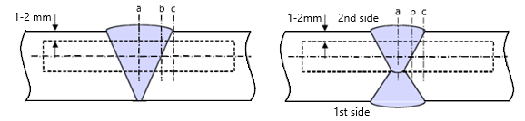 |
    | normal heat input ≤ 50 $kJ/cm$ | t > 50 mm | 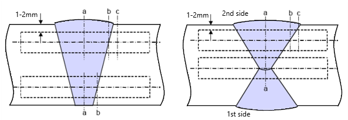 |
    | high heat input > 50 $kJ/cm$ | t ≤ 50 mm(2) | 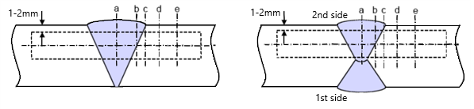 |
    | high heat input > 50 $kJ/cm$ | t > 50 mm | 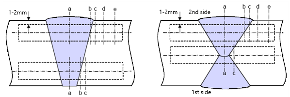 |
    | Note: (1) For one side single run welding over 20 mm notch location "a" is to be added on root side. (2) For one side welding with thickness over 20 mm notch locations "a", "b" and "c" are to be added on root side. (3) Notch locations: a : center of weld "WM" b : on fusion line "FL" c : in HAZ, 2 mm from fusion line d : in HAZ, 5 mm from fusion line e : in HAZ, 10 mm from fusion line in case of heat input > 200 kJ/cm |   |   |
  - **(4)** *Steels & Pipes for low temperature Service (2019)*
  - **(5)** *Rolled steel plates for boiler and class 1 pressure vessel (2019)*
  - **(6)** *Pipes for high temperature and high pressure (2019)*
- **7.** **Macro-structure inspection**
  - **(1)** The test specimens are to be prepared and etched on one side to clearly reveal the weld metal, the fusion line and the heat affected zone. Macro examination is to include about 10 mm unaffected base metal.
  - **(2)** The examination is to reveal a regular weld profile, through fusion between adjacent layers of weld and base metal and the absence of defects such as cracks, lack of fusion etc.
- **8.** **Visual & Non-destructive inspection**
  - **(1)** Test assemblies are to be examined for the whole length(excepting discard area of test assembly of **Fig 2.2.6**) by visual and by non-destructive testing prior to the cutting of test specimen. Visual and non-destructive examinations should be carried out after any required post weld heat treatment, natural or artificial ageing, and prior to the cutting of the test specimens. *(2019)*
  - **(2)** For weldable high strength steels with specified minimum yield strength of 420 $\mathrm{N}/mm ^{2}$ and above the visual and non-destructive testing are to be delayed for a minimum of 48 hrs, unless heat treatment has been carried out. *(2019)*

    **Table 2.2.9 Impact Test Requirements for Butt Welded Joint** (Steels for low temperature Service) ***(2019)***

    | Grade of steel | Test temp. (℃) | *A*^(^1) | *B, C, D, E*^(^1) |   |
    | --- | --- | --- | --- | --- |
    | Grade of steel | Test temp. (℃) | Value of average absorbed energy(*J*)^(^3) | Value of average absorbed energy(*J*)^(^3) |   |
    | Grade of steel | Test temp. (℃) | Value of average absorbed energy(*J*)^(^3) | *L*^(^2) | *T*^(^2) |
    | *RL* 235*A* | －40 | 27 min. | 41 min. | 27 min. |
    | *RL* 235*B* | －50 | 27 min. | 41 min. | 27 min. |
    | *RL* 325*A* | －50 | 27 min. | 41 min. | 27 min. |
    | *RL* 325*B* | －60 | 27 min. | 41 min. | 27 min. |
    | *RL* 355 | －60 | 27 min. | 41 min. | 27 min. |
    | *RL* 1*N*355 | －80 | 27 min. | 41 min. | 27 min. |
    | *RL* 2*N*255 | －70 | 27 min. | 41 min. | 27 min. |
    | *RL* 3*N*355 | －100 | 27 min. | 41 min. | 27 min. |
    | *RL* 5*N*390 | －120 | 27 min. | 41 min. | 27 min. |
    | *RL* 9*N*490 | －196 | 27 min. | 41 min. | 27 min. |
    | *RLPA* | －40 | 27 min. | 41 min. | 27 min. |
    | *RLPA* | －40 | 27 min. | 27 min. | - |
    | *RLPB* | －50 | 27 min. | 27 min. | - |
    | *RLPC* | －60 | 27 min. | 27 min. | - |
    | *RLP* 2 | －70 | 27 min. | 27 min. | - |
    | *RLP* 2 | －70 | 27 min. | 34 min. | - |
    | *RLP* 3 | －95 | 27 min. | 34 min. | - |
    | *RLP* 9 | －196 | 27 min. | 34 min. | - |
    | *RLP* 9 | －196 | 27 min. | 41 min. | - |
    | NOTES: (1) Position of notch as shown in **Fig 2.2.7.** (2) L(or T) indicates that the direction of welding is transverse (or parallel) to the rolling direction of test materials. (3) When the absorbed energy of two or more test specimens among a set of test specimens is less in value than the specified average absorbed energy or when the absorbed energy of a single test specimen is less in value than 70% of the specified average absorbed energy, the test is considered to have failed. |   |   |   |   |
  - **(3)** NDT procedures are to be agreed with the Society. The results of non-destructive testing are to show that there are no cracks or other injurious defects.
  - **(4)** Acceptance criteria is to be in accordance with the relevant requirements of the relevant Rules as follows. However, if agreed by the Society, imperfections detected by visual or non-destructive testing may be assessed in accordance with *ISO* 5817, class B, except for imperfection type such as excess weld metal and excess penetration for which level C applies *(2019)*
  - **(5)** For aluminium alloys, imperfections detected by visual or non-destructive testing should be assessed in accordance with **ISO 10042:2018**, level B, except for excess weld metal or convexity, excess throat thickness and excess of penetration for which the level C applies. *(2022) (2023)*
- **9.** **Hardness test** ***(2019)***
  - **(1)** Hardness distribution at positions shown in **Fig 2.2.9** is to be measured.
    
    Note1. Measuring load is to be 10 kg vickers and measuring intervals are to be 1 mm.2. For *EH*47-*H* and brittle crack arrest(BCA) steels, measurement points are to include mid-thickness position in addition. *(2021)***Fig 2.2.9 Hardness Test for butt welded joint (Units : mm)**
  - **(2)** The results from the hardness test are to be in accordance with **Table 2.2.10**. *(2019)*

    **Table 2.2.10 Hardness Test Requirements for Butt Welded Joint** ***(2019) (2021)***

    | Grades and material symbols of test specimens |   | Hardness (Hv10) |
    | --- | --- | --- |
    | Rolled steels for hull structural | *AH 36, DH 36, EH 36, FH 36, AH 40, DH 40, EH 40, FH 40, EH47-H* | 350 max. |
    | Rolled steels for hull structural | *EH47-H-BCA1/2* | 380 max. |
    | Weldable high strength steel | *AH 43 ~ FH 70* | 420 max. |
    | Weldable high strength steel | *AH 90, DH 90, EH 90, AH 97, DH 97, EH 97* | 450 max. |
    | Rolled steels & Steel pipes for low temperature service | *RL 235A, RL 235B, RL 325A, RL 325B,* *RLPA, RLPB, RLPC* | 380 max. |
    | Rolled steels & Steel pipes for low temperature service | *RL 355* | 450 max. |
    | Rolled steels & Steel pipes for low temperature service | *RL 1N355, RL 2N255, RLP 2* | 350 max. |
    | Rolled steels & Steel pipes for low temperature service | *RL 3N355, RL 5N390, RLP 3* | 450 max. |
    | Rolled steels & Steel pipes for low temperature service | *RL 9N490, RLP 9* | 450 max. |
    | Rolled steel plates for boiler & pressure vessel The pipes for ordinary piping The pipes used for high temperature and high pressure |   | 380 max. |
- **10.** **Brittle fracture initiation test** ***(2019)***
  - **(1)** Test assemblies are to be welded for highest heat input and lowest heat input position and all applicable tests are to be made on those assemblies.
  - **(2)** Test method and acceptance criteria

#### 405. Tests for fillet welded joints

- **1.** **Application**
  The requirements stated hereunder apply to the fillet joints welded by manual, semi-automatic or automatic welding in any welding position.
- **2.** **Kinds of test**
  The kinds of test and number of test specimens are to be given in **Table 2.2.11** and **Table 2.2.12**. The kinds of test for machinery installations are to be in accordance with **Table 2.2.11**. Additional tests may be required if found necessary by the Society. *(2019) (2023)* **【See Guidance】**

  **Table 2.2.11 Kinds of Test for fillet welded joints(1)** ***(2023)***

  | Kinds and number of specimens for test |   |   |   |   |
  | --- | --- | --- | --- | --- |
  | Visual insp. | Surface crack detection | Macro- structure insp. | Hard. test(2) | fracture test |
  | Welding positions of whole length | Welding positions of whole length :NDT for surface (MT or PT) | 2(3) | 1 | 2 |
  | (Notes) (1) Kinds of test for machinery installation’s fillet welded joints are in accordance with **Table 2.2.12**. (2) The materials required hardness test in **Table 2.2.4** are to be tested. (3) In case of other than rolled steels for hull structural, weldable high strength steel, and aluminium alloy, one specimen is to be taken. |   |   |   |   |

  **Table 2.2.12 Kinds of Test for machinery installations’s fillet welded joints** ***(2019) (2023)***

  | Divisions |   | Kinds of test and number of specimens taken from test assembles (1)(2) |   |   |   |   |
  | --- | --- | --- | --- | --- | --- | --- |
  | Divisions |   | Macro- structure inspection | Visual insp. | Surface crack detection | Hard. test | Fracture test |
  | Welding of boiler and pressure vessel | Boiler and class 1 pressure vessel | 1 | Welding positions of whole length | Welding positions of whole length :NDT for surface (MT or PT) | - | 2 |
  | Welding of boiler and pressure vessel | Class 2 pressure vessel | 1 | Welding positions of whole length | Welding positions of whole length :NDT for surface (MT or PT) | - | 2 |
  | Welding of boiler and pressure vessel | Class 3 pressure vessel | The tests may be omitted according to the discretion of the Surveyor. |   |   |   |   |
  | Welding of piping | The steel pipes for low temperature service | 2 | Welding positions of whole length | Welding positions of whole length :NDT for surface (MT or PT) | 1 | 2 |
  | Welding of piping | Stainless steel pipes | 2 | Welding positions of whole length | Welding positions of whole length :NDT for surface (MT or PT) | - | 2 |
  | Welding of piping | The pipes for ordinary piping | 2 | Welding positions of whole length | Welding positions of whole length :NDT for surface (MT or PT) | - | 2 |
  | Welding of piping | The pipes used for high temperature and high pressure(3) | 2 | Welding positions of whole length | Welding positions of whole length :NDT for surface (MT or PT) | - | 2 |
  | Notes : (1) In a case where special materials are used, special welding procedure is employed or where deemed necessary by the Society, the other tests or test conditions than those specified in this Section for the welding procedure qualification may be required (2) For the welding procedure qualification tests on materials used at high temperature, the Society may require a creep test or high temperature tensile test. (3) For steam pipes and flanges to be used in the place where the design pressure is not less than 30 $\mathrm{kgf}/cm ^{2}$ and the design temperature exceeds 400℃. |   |   |   |   |   |   |
- **3.** **Test assemblies and welding**
  - **(1)** Test assembly is to be prepared with the same or equivalent material used in the actual work.
  - **(2)** Dimensions and type of test assembly are to be as indicated **Fig 2.2.10** and **Fig 2.2.11**.
    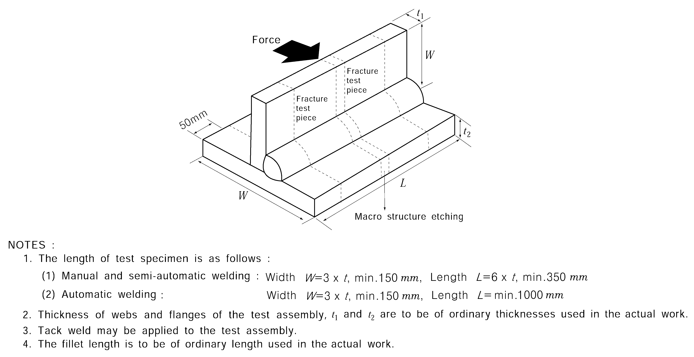
    **Fig 2.2.10 Test assembly for plates with fillet weld joint** (unit : mm) ***(2023)***

    | 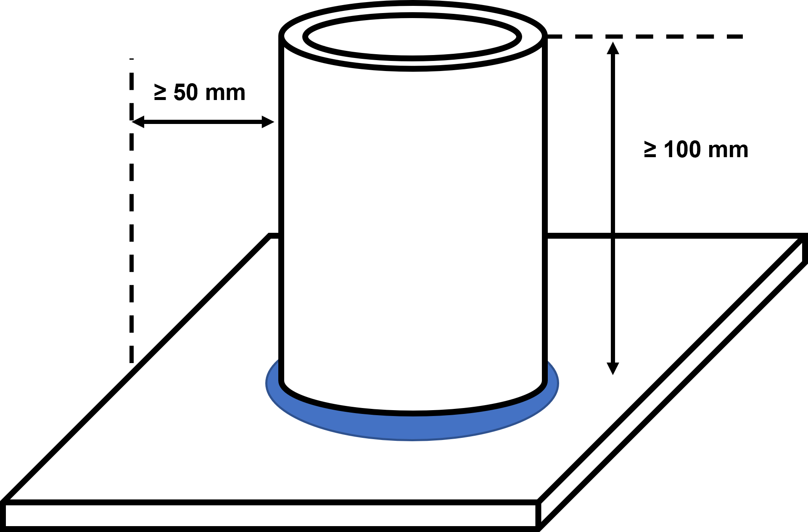 | 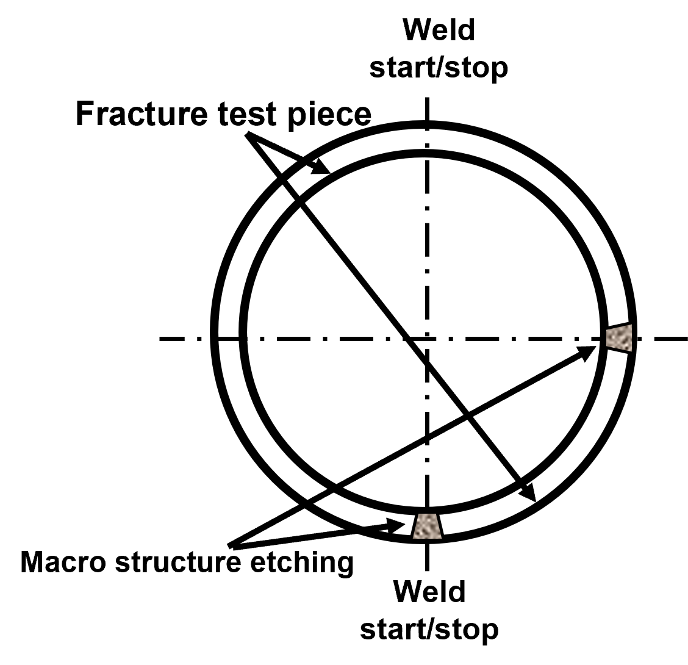 |  |
    | --- | --- | --- |
    | **Fig 2.2.11 Test assembly for pipes with fillet weld joint** ***(2023)*** |   |   |
  - **(3)** Test assembly is to be welded in the same welding positions as the actual work.
  - **(4)** The assembly is to be welded on one side only, except in case deemed necessary by the surveyor.
  - **(5)** For single run manual and semi-automatic welding, a stop/restart is to be included in the test length and its position is to be clearly marked for subsequent examination.
- **4.** **Visual & non-destructive inspection**
  - **(1)** Test assemblies are to be examined by visual and by non-destructive testing(PT or MT) prior to the cutting of test specimen. In case that any post-weld heat treatment is required or specified non-destructive testing and visual inspection are to be performed after heat treatment. *(2019)*
  - **(2)** For weldable high strength steel with specified minimum yield strength of 420 $\mathrm{N}/mm ^{2}$ and above the non-destructive testing and visual inspection are to be delayed for a minimum of 48 hrs, unless heat treatment has been carried out. *(2019)*
  - **(3)** NDT procedures are to be agreed with the Society. The results of visual & non-destructive testing are to show that there are no cracks or other injurious defects. *(2019)*
  - **(4)** The imperfections detected by visual or non-destructive testing are to be assessed in accordance with **ISO 5817**, class B(**ISO 10042:2018**, class B for aluminium alloys), except for imperfection type such as excessive convexity and excessive throat thickness for which level C applies *(2019) (2022) (2023)*
- **5.** **Macro-structure inspection**
  - **(1)** The test specimen is to be taken from the position in **Fig 2.2.10** and **Fig 2.2.11**. However, in case of rolled steels for hull structural, weldable high strength steel, and aluminium alloy, two specimens are to be taken. For manual welding and semi-automatic welding, one of the macro etched specimens is to be from the stop/restart position, if present.
  - **(2)** The test specimens are to be prepared and etched on one side to clearly reveal the weld metal, fusion line, root penetration and the heat affected zone. Macro examination is to include about 10 mm unaffected base metal.
  - **(3)** The examination is to reveal a regular weld profile, through fusion between adjacent layers of weld and base metal, sufficient root penetration and the absence of defects such as cracks, lack of fusion etc.
- **6.** **Hardness test** ***(2019)***
  - **(1)** Hardness distribution at positions shown in **Fig 2.2.12** is to be measured.
    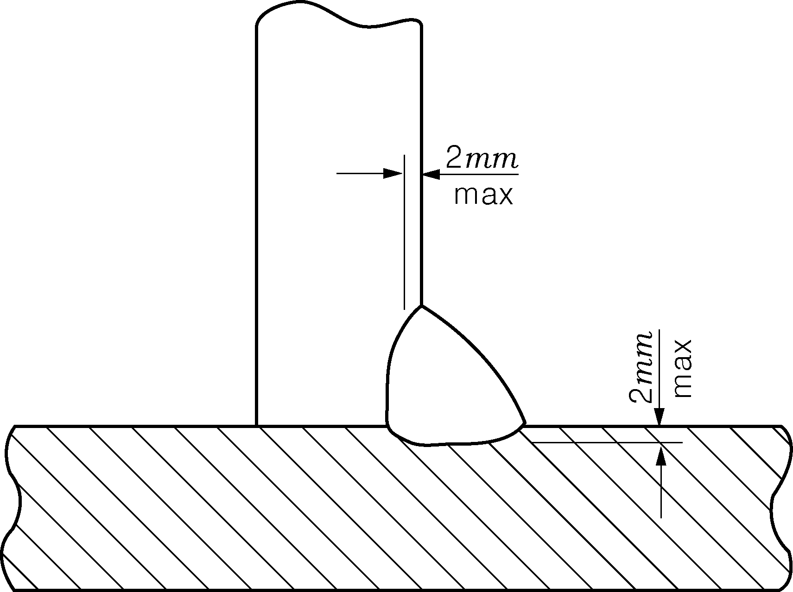 
    Note
- **1.** Measuring load is to be 10 kg vickers and measuring intervals are to be 1 mm.
  **Fig 2.2.12 Hardness test for fillet welded joint (unit : mm)** ***(2019)***
  - **(2)** The results from the hardness test are to be in accordance with **Table 2.2.10**. *(2019)*
- **7.** **Fracture tests**
  The remaining test assemblies after the macro-structure test specimen has been removed are to be broken by pressing as shown in **Fig 2.2.8** and it shall be evaluated cracks, blow holes, poor penetrations and any other injurious defects in the fractured surface. And imperfections that are detected should be assessed in accordance with **(KS B) ISO 5817**, class B(**ISO 10042:2018**, class B for aluminium alloys). *(2022) (2023)*

#### 406. Retests and Procedure qualification records(PQR)

- **1.** **Retests**
  - **(1)** Where visual inspection or non-destructive inspection fails to meet the requirements, the new test specimens welded under the same welding condition, are to be subject to retest and all of these test specimens are to pass the test. If this additional test piece does not comply with the relevant requirements, the pWPS is to be regarded as not capable of complying with the requirements without modification.
  - **(2)** Where the result of a tensile or bend test does not comply with the requirements, twice as many test specimens as the number of specimens of failed test are to be selected from either the first test material or test materials welded under the same welding conditions, and all of these test specimens are to be satisfactorily tested.
  - **(3)** If there is a single hardness value above the maximum values allowed, additional hardness tests are to be carried out (on the reverse of the specimen or after sufficient grinding of the tested surface). None of the additional hardness values is to exceed the maximum hardness values required.
  - **(4)** (a) Where the result of the impact test is unsatisfactory, additional tests may be carried out, with the exception of the cases specified in (i) and (ii) below, by taking a set of test specimens out of the same test material from which the above-mentioned test specimens have been taken.
  - **(5)** Where there is insufficient welded assembly remaining to provide additional test specimens, a further assembly is to be welded using the same procedure to provide the additional specimens.
  - **(6)** Where the retest fails to meet the requirements, the test may be made over again. In this case, where the whole tests specified on the test assembly are carried out and are complied with requirements, the tests are accepted as successful.
- **2.** **Procedure qualification records(PQR)**
  - **(1)** Three copies of the procedure qualification records showing the welding conditions for test assemblies and test results are to be submitted to the Society for approval. Forms of welding procedure test records are to be at the discretion of the Society. **【See Guidance】**
  - **(2)** A statement of the results of assessing each test piece, including repeat tests, is to be made for each welding procedure test. The relevant items listed for the WPS of these requirements are to be included.
  - **(3)** A statement that the test piece was made according to the particular welding procedure is to be signed by the Surveyor witnessing the test and is to include the Society´s identification.

#### 407. Validity of qualified welding procedure specification

- **1.** **General**
  - **(1)** Welding procedures qualified at a manufacturer are valid for welding in workshops under the same technical and quality management.
  - **(2)** Qualification of a welding procedure remains valid provided the welding variables are kept within the qualified range during production welding. When one or more variables outside the qualified range given in **2.** occur, the welding procedure is to be respecified and requalified by welding procedure qualification tests.
  - **(3)** Shop primers may have an influence on the quality of fillet welds and is to be considered. Welding procedure qualification with shop primer will qualify those without but not vice versa.
- **2.** Validity of variables for qualified WPS is as follows. However, it may be considered as equivalent for the requirements of the standard internationally recognized(*AWS , ASME* etc.) are applied.
  - **(1)** **Base metal** Kind of base metal and their validity are as follows. Other materials not specified herein is to be in accordance with the requirements of the standard internationally recognized as deemed appropriate by the Society. **【See Guidance】**
    ① Normal strength steel(*A*, *B*, *D* and *E*) or equivalent structural steels with tensile strength 400 ~ 520 $\mathrm{N}/mm ^{2}$.
    ② Higher strength steels, YP47 steels and brittle crack arrest steels(*AH* 32, *DH* 32, *EH* 32, *FH* 32, *AH* 36, *DH* 36, *EH* 36, *FH* 36, *AH* 40, *DH* 40, *EH* 40, *FH* 40, *EH*47-*H*, *EH* 36-*BCA*1, *EH* 40-*BCA*1/2 and *EH* 47-*H*-*BCA*1/2) or equivalent structural steels with minimum specified yield strength 315 ~ 460 $\mathrm{N}/mm ^{2}$. *(2018) (2021)*
    (ⅴ) Where Welding Procedure Specification (WPS) for the non-BCA steels has been approved by the Society, the said WPS is applicable to the same welding procedure applied to the same grade with suffix “BCA1” or “BCA2” except high heat input processes over 50 kJ/cm. *(2021)*
    Welding procedures are considered applicable to the equivalent and lower strength level as that tested, and the equivalent and lower level of alloying elements as that tested.
    ① Group A: aluminium-magnesium alloys with *Mg* content = 3.5 % (alloy 5754)
    ② Group B: aluminium-magnesium alloys with 4% = *Mg* = 5.6 % (alloys 5059, 5083, 5086, 5383 and 5456)
    ③ Group C: aluminium-magnesium-silicon alloys (alloys 6005A, 6061 and 6082)
    Welding procedures are considered applicable to the same and lower strength level as that tested.
  - **(2)** **Thickness and outer diameter of base metal**

    **Table 2.2.13 Qualified thickness range for butt, T-joint and fillet welds** ***(2019)***

    | Thickness of test piece, $t$ (mm) (1) | Range of approval $t$(mm)(2) |   |
    | --- | --- | --- |
    | Thickness of test piece, $t$ (mm) (1) | Butt and T-joint welds with single run or single run from both sides | Butt and T-joint welds with multi-run and fillet welds |
    | $t$ ≤ 3 | 0.7$t$ ∼ 1.1$t$ | 0.7$t$ ∼ 2$t$ |
    | 3 < $t$ ≤ 12 | 0.7$t$ ∼ 1.1$t$ | 3 ∼ 2$t$ |
    | 12 < $t$ ≤ 100 | 0.7$t$ ∼ 1.1$t$ (3) | 0.5$t$ ∼ 2$t$ (max.150) |
    | 100 < $t$ | 0.7$t$ ∼ 1.1$t$ (3) | 0.5$t$ ∼ 2$t$ |
    | Notes : (1) For multi process procedures, the recorded thickness contribution of each process is to be used as a basis for the range of approval for the individual welding process. (2) For the vertical-down welding, the test piece thickness "t" is always taken as the upper limit of the range of application. (3) For high heat input processes over 50 kJ/cm, the upper limit of range of approval is to be 1.0 x $t$. |   |   |

    **Table 2.2.14 Range of Aluminium alloys qualification for parent material thickness** ***(2019)***

    | Thickness of the test piece t (mm) | Range of approval |
    | --- | --- |
    | t ≤ 3 | 0.5t ~ 2t |
    | 3 < t ≤ 20 | 3 ~ 2t |
    | t > 20 | ≥ 0.8t |

    The thickness t is based on the thinner material.
    The thickness t is based on the material with bevelling.
    The thickness t is based on the both base materials.

    **Table 2.2.15 Range of qualifications for the throat thickness of fillet welds** ***(2019)***

    | Kind($a$=throat thickness) |   | Range of approval(mm) |
    | --- | --- | --- |
    | Base material other than Aluminium alloys | Single-run | 0.75$a$ ∼ 1.5$a$ |
    | Base material other than Aluminium alloys | Multi-run | as for butt welds with multi-run (i.e. a=t) |
    | Aluminium alloys(1) | $a$ < 10 | 0.75$a$ ∼ 1.5$a$ |
    | Aluminium alloys(1) | $a$ ≥ 10 | ≥ 7.5 |
    | Note (1) Where a fillet weld is qualified by means of a butt weld test, the throat thickness range qualified should be based on the thickness of the deposited weld metal. |   |   |

    **Table 2.2.16 Qualified outer diameter range for pipe welds** ***(2019)***

    | Outer diameter *D* (mm) | Qualified range (mm)(1) |
    | --- | --- |
    | *D* ≤ 25 | 0.5 D ∼ 2 D |
    | *D* 〉25 | ≥ 0.5 *D* (min. 25) |
    | Note (1) When the test for plate is approved, the welding for the pipes over 500 mm in outer diameter is permitted. |   |
  - **(3)** **Welding positions**

    **Table 2.2.17 Range of qualifications for aluminium alloys’s welding position** ***(2019)***

    | Test Position | Welding positions in actual welding position |
    | --- | --- |
    | PA(flat) | PA |
    | PC(horizontal) | PA, PC |
    | PE(overhead) | PA, PC, PE |
    | PF(vertical-up) | PA, PC, PF |
    | NOTES: (1) A qualification position performed on a butt weld will also qualify for fillet welding within the thickness ranges specified for fillet welds specified in (2) (a) above but not vice versa. |   |

    **Table 2.2.18 Correlation with Fillet joints, T-joints(with full penetration and partial penetration) welding and butt welding** ***(2019)***

    | Approved position for butt welding | Actual welding position for fillet joints, T-joints with full penetration & partial penetration |
    | --- | --- |
    | PA(flat) | PA(flat), PB(horizontal vertical) |
    | PC(horizontal) | PB(horizontal vertical), PC(horizontal) |
    | PE(overhead) | PD(horizontal overhead), PE(overhead) |
    | PF(vertical-up) | PF(vertical-up) |
    | PG(vertical-down) | PG(vertical-down) |
  - **(4)** **Welding process**
  - **(5)** **Welding consumables**
  - **(6)** **Welding condition**
  - **(7)** **Heat input**
  - **(8)** **Type of joint**

    **Table 2.2.19 Range of approval for type of welded joint** ***(2019)***

    | Type of welded joint for test assembly |   |   |   | Range of approval |
    | --- | --- | --- | --- | --- |
    | Butt welding | One side | With backing | A | A, C |
    | Butt welding | One side | Without backing | B | A, B, C, D |
    | Butt welding | Both side | With gouging | C | C |
    | Butt welding | Both side | Without gouging | D | C, D(1) |
    | NOTES: (1) For aluminium alloys, range of approval includes “A” |   |   |   |   |
  - **(9)** **Others** The Validity relating to the welding variables other than previous (1) to (8) may comply with the requirements of the internationally recognized Code (*AWS, ASME, ISO, EN* etc.)
- **3.** For changes other than previous **2**, the welding procedure qualification test may be dispensed with. In this case, the welding procedure specification to which the related procedure qualification record(PQR) is attached is to be requalified.

### Section 5 Welders and Welder Performance Qualification Scheme (2018)

#### 501. General

- **1.** Each welder intended to engage in the welding work for shipbuilding and repair is to pass the performance qualification tests required according to the applicable welding process, welding position and kinds of materials to be welded and to have the performance qualification by the Society.
- **2.** Welders engaged in tack welding are to pass the performance qualification tests and should be qualified for tack welds in accordance with the requirements in this Section. A welder qualified for butt or fillet welding can be engaged in tack welding for the welding process and position corresponding to those permitted in his certificate.
- **3.** Welding operators responsible for setting up and/or adjustment of fully mechanized and automatic equipment, such as submerged arc welding, gravity welding, electro-gas welding and MAG welding with auto-carriage, etc., must be qualified whether they operate the equipment or not. However a welding operator, who solely operates the equipment without responsibility for setting up and/or adjustment, does not need qualification provided that he has experience of the specific welding work concerned and the production welds made by the operators are of the required quality.
- **4.** The performance qualification test of welder intended to engage in the special material and welding work not prescribed in this Section are to be at the discretion of the Society.
- **5.** The training of welders, control of their qualification and maintenance of their skills are the responsibility of shipyards and manufacturers. The Surveyor is to verify and be satisfied that the welders are appropriately qualified.
- **6.** Welders or welding operators qualified in accordance with national or international welder qualification standards may also be engaged in welding of hull structures at the discretion of the Society provided that standard is considered equivalent to this Section from technical perspective covering examination, testing and range approval. Even if the requirements stipulated in the standards are applied, the requirement for revalidation of welders’ qualification shall be in accordance with **504. 2.** And alternative welding standards or codes are to be applied in full, cross-mixing requirements of standards and codes is not permitted. *(2022)*

#### 502. Grades, and range of qualification

- **1.** A welder should be qualified in relation to the variables such as base material, welding process, welding consumables type, type of welded joint, plate thickness and welding position.
- **2.** **Welding processes**
  - **(1)** The welding processes for welder's qualification are to be classified in **Table 2.2.20**.

    **Table 2.2.20 Welding processes for welder’'s qualification** ***(2019) (2022)***

    | Symbol | Welding process in actual welding works(1)(2) |   | ISO 4063:2009 |
    | --- | --- | --- | --- |
    | M | Manual welding | Shield Metal Arc Welding(SMAW) | 111 |
    | G | Gas welding | Gas Welding(GW) | 31 |
    | S | Semi-automatic welding | (1) Metal Inert Gas welding(MIG) (2) Metal Active Gas welding(MAG) (3) Flux Cored Arc Welding(FCAW) | 131 135(solid wire), 138(metal cored wire) 136 |
    | T | TIG welding | Gas Tungsten Arc Welding(GTAW) | 141 |
    | A | Automatic welding | (1) Submerged Arc Welding(SAW) (2) Gravity Welding(GRW) (3) Electro-gas Welding(EGW) (4) Electro-slag Welding(ESW) | 12 112 73 72 |
    | NOTES: (1) Each testing normally qualifies only for one welding process. A change of welding process requires a new qualification test. Welders who have passed qualification tests for semi-automatic welding or TIG welding may be similarly regard as the welder responsible for setting up and/or adjusting of the welding process using an auto-carriage in the range of qualification for the qualification they qualified. (2) It is permitted for a welder to be qualified for two or more welding processes by welding a single test piece with multi-process joint and sequence or by two or more separate qualification tests. The sequence of welding processes can not be changed. |   |   |   |
- **3.** **Welding consumables**
  - **(1)** The welding consumable covers qualification of the welder or welding operator for the welding of all other consumables within base material group classified as specified in 5.
  - **(2)** For manual welding, qualification tests are required using basic, acid or rutile covered electrodes.
  - **(3)** Welding with filler material qualifies for welding without filler material, but not vice versa.
- **4.** **Types of welded joint**
  - **(1)** The types of welded joint for welder's qualification are to be classified as shown in **Table 2.2.21** in accordance with the qualification test.
  - **(2)** Welders engaged in full/partial penetration T welds are to be qualified for butt welds for the welding process and the position corresponding to the joints to be welded.
  - **(3)** Tack welders engaged in butt welds are to be qualified for fillet welds for the welding process and the position corresponding to the joints to be welded but not vice versa. *(2019)*

    **Table 2.2.21 Types of welded joint for welder's qualification**

    | Type of welded joint used in the test assembly for the qualification test |   |   |   | Type of welded joint qualified |
    | --- | --- | --- | --- | --- |
    | Butt weld | Single Sided weld | with Material Backing | SS MB | SS MB, DS MB, SL, ML |
    | Butt weld | Single Sided weld | with Gas Backing | SS GB | SS MB, SS GB, DS MB, SL, ML |
    | Butt weld | Single Sided weld | with No Backing | SS NB | SS MB, SS NB, SS GB, DS MB, DS NB, SL, ML |
    | Butt weld | Double Sided weld | with gouging | DS MB | SS MB, DS MB, SL, ML |
    | Butt weld | Double Sided weld | without gouging | DS NB | SS MB, DS MB, DS NB, SL, ML |
    | Fillet weld | Single Layer weld | - | SL | SL |
    | Fillet weld | Multi-Layer weld | - | ML | SL, ML |
- **5.** **Base materials**
  - **(1)** Base materials for qualification tests are grouped in **Table 2.2.22**.

    **Table 2.2.22 Base material group for welder’s qualification**

    | Base material group used in the test assembly for the qualification test(1) |   |   |   | Qualified group(1)(2) |
    | --- | --- | --- | --- | --- |
    | Carbon steels(1) | Rolled steels for hull structural Rolled steel plates for boiler Rolled steel plates for pressure vessel Rolled steels for low temperature service (except nickel alloy) Round bars for chain Rolled steel bars for boiler High strength steels for welded structures YP47 steel plates Steel tubes for boilers and heat exchangers Steel pipes for pressure piping Steel pipes for low temperature service (except nickel alloy) Carbon steel castings Low alloy steel castings Steel castings for chains Steel castings for low temperature service (except *RLC*2 and *RLC*3) Carbon steel forgings Alloy steel forgings Steel forgings for chains Steel forgings for low temperature service (except *RLF*3 and *RLF*9) | *A* ~ *FH* 40 *RSP* 42 ~ *RSP* 49*A* *RPV* 24 ~ *RPV* 50 *RL* 235A ~ *RL* 355 *RSBC* 31 ~ *RSBC* 70 *RSB* 42 ~ *RSB* 46 *AH* 43 ~ *FH* 70 *EH*47-*H* *RSTH* 12 ~ *RSTH* 52 *RST* 138 ~ *RST* 424 *RLPA* ~ *RLPC* *RSC* 410 ~ *RSC* 600 *RSC* 440*A* ~ *RSC* 550*A* *RSCC* 50, *RSCC* 70 *RLCA*, *RLCB* *RSF* 400 ~ *RSF* 760(*H*/*M*) *RSF* 550*AM* ~ *RSF* 1100*AM* *RSFC* 50, *RSFC* 70 *RLFA* ~ *RLFC* | CS | CS |
    | Stainless steels | Rolled stainless steels Stainless steel pipes Stainless steel castings Stainless steel casting for propeller Stainless steel forgings Duplex stainless steel | *RSTS* 304 ~ *RSTS* 347 *RSTS* 304*TP* ~ *RSTS* 347*TP* *RSSC* 13 ~ *RSSC* 21 12*Cr*1*Ni*, 19*Cr*11*Ni* *RSSF* 304 ~ *RSSF* 347 *S*31803, *S*32750 | STS | STS |
    | Nickel alloy | Rolled steels for low temperature service (except carbon steels) Steel pipes for low temperature service (except carbon steels) Steel castings for low temperature service (except *RLCA* and *RLCB*) Steel forgings for low temperature service (except *RLFA* ~ *RLFC*) | *RL* 1*N*355 ~ *RL* 9*N*490 *RLP* 2 ~ *RLP* 9 *RLC* 2, *RLC* 3 *RLF* 3, *RLF* 9 | NI | NI |
    | Copper and copper alloy | Copper and copper alloy pipes and tubes Copper alloy castings | *C* 1201 ~ *C* 7150 *CU* 1 ~ *CU* 4 | CU | CU |
    | Aluminium alloys | Aluminium alloys | 5083 ~ 6082 (*P*/*S*) | AL | AL |
    | NOTES : (1) Base materials for qualification of welders or welding operators are combined into one group with a specified minimum yield strength R_eH ≤ 460 N/mm^2 for hull structures. (2) For welding with materials in different material groups, qualification approval may be carried out with separate qualification test for each material. |   |   |   |   |
- **6.** **Thickness and outer diameter of base metal**
  - **(1)** The welder qualification carried out on a plate or pipe test assembly of thickness T is valid for the thickness range given in **Table 2.2.22-1**. The qualified thickness range for tack welders is 3 mm and over. *(2019)*

    **Table 2.2.22-1 Qualified thickness range for welder qualification** ***(2020)***

    | Grades | Thickness of test assembly, T(mm) | Qualified thickness range, t(mm) |
    | --- | --- | --- |
    | Butt/fillet weld of plate, Butt weld of pipe | T < 3 | T ≤ t ≤ 2T |
    | Butt/fillet weld of plate, Butt weld of pipe | 3 ≤ T < 12 | 3 ≤ t ≤ 2T |
    | Butt/fillet weld of plate, Butt weld of pipe | 12 ≤T | 3 ≤ t |
    | Fillet weld of pipe | T < 3 | T ≤ t ≤ Larger(2T or 3mm) |
    | Fillet weld of pipe | 3≤T | 3 ≤ t |
  - **(2)** The welder qualification carried out on a pipe test assembly is valid for the outer diameter range given in **Table 2.2.22-2**.

    **Table 2.2.22-2 Qualified outer diameter range for pipe welds**

    | Outer diameter *D* (mm) of the test piece(1)(2) | Qualified range d (mm) |
    | --- | --- |
    | D ≤ 25 | D ≤ d ≤ 2D |
    | 25 < D | 0.5D ≤ d (Min. 25 mm) |
    | NOTES : (1) Test assemblies for the pipes with 500 mm and over in diameter may be those for the plates. However, test assemblies for tack welding of the pipes may be those for the plates regardless of the outer diameter of the pipe. *(2022)* (2) For non-circular hollow sections, D is the dimension of the smaller side. |   |
- **7.** **Positions**
  The positions for qualification test and positions qualified for actual welding work are to comply with the **Table 2.2.23-1**.

  **Table 2.2.23-1 Welding Positions for Welder Qualification**

  | Test Positions(1)(2) |   |   |   | Welding positions in actual welding work(1)(2) |   |   |   |   |   |   |   |   |   |   |   |   |   |   |   |   |   |   |   |   |   |   |   |   |
  | --- | --- | --- | --- | --- | --- | --- | --- | --- | --- | --- | --- | --- | --- | --- | --- | --- | --- | --- | --- | --- | --- | --- | --- | --- | --- | --- | --- | --- |
  | Test Positions(1)(2) |   |   |   | Plates(3) |   |   |   |   |   |   |   |   |   |   |   | Pipes(4) |   |   |   |   |   |   |   |   |   |   |   |   |
  | Test Positions(1)(2) |   |   |   | Butt joint |   |   |   |   | Fillet joint |   |   |   |   |   |   | Butt joint |   |   |   |   |   | Fillet joint |   |   |   |   |   |   |
  | Test Positions(1)(2) |   |   |   | PA | PC | PE | PF | PG | PA | PB | PC | PD | PE | PF | PG | PA | PC | PH | PJ | PH -45 | PJ -45 | PA | PB | PD | PH | PJ | PH -45 | PJ -45 |
  | Plates | Butt joint | Flat | PA | ◉ |   |   |   |   | ◉ | ◉ |   |   |   |   |   | ◉ |   |   |   |   |   | ◉ | ◉ |   |   |   |   |   |
  | Plates | Butt joint | Horizontal | PC | ◉ | ◉ |   |   |   | ◉ | ◉ | ◉ |   |   |   |   | ◉ | ◉ |   |   |   |   | ◉ | ◉ |   |   |   |   |   |
  | Plates | Butt joint | Overhead | PE | ◉ | ◉ | ◉ |   |   | ◉ | ◉ | ◉ | ◉ | ◉ |   |   | ◉ | ◉ |   |   |   |   | ◉ | ◉ | ◉ |   |   |   |   |
  | Plates | Butt joint | Vertical-up | PF | ◉ |   |   | ◉ |   | ◉ | ◉ |   |   |   | ◉ |   | ◉ |   |   |   |   |   | ◉ | ◉ |   |   |   |   |   |
  | Plates | Butt joint | Vertical-down | PG |   |   |   |   | ◉ |   |   |   |   |   |   | ◉ |   |   |   |   |   |   |   |   |   |   |   |   |   |
  | Plates | Fillet joint | Flat | PA |   |   |   |   |   | ◉ |   |   |   |   |   |   |   |   |   |   |   |   | ◉ |   |   |   |   |   |   |
  | Plates | Fillet joint | Horizontal vertical | PB |   |   |   |   |   | ◉ | ◉ |   |   |   |   |   |   |   |   |   |   |   | ◉ | ◉ |   |   |   |   |   |
  | Plates | Fillet joint | Horizontal | PC |   |   |   |   |   | ◉ | ◉ | ◉ |   |   |   |   |   |   |   |   |   |   | ◉ | ◉ |   |   |   |   |   |
  | Plates | Fillet joint | Horizontal overhead | PD |   |   |   |   |   | ◉ | ◉ | ◉ | ◉ | ◉ |   |   |   |   |   |   |   |   | ◉ | ◉ | ◉ |   |   |   |   |
  | Plates | Fillet joint | Overhead | PE |   |   |   |   |   | ◉ | ◉ | ◉ | ◉ | ◉ |   |   |   |   |   |   |   |   | ◉ | ◉ | ◉ |   |   |   |   |
  | Plates | Fillet joint | Vertical-up | PF |   |   |   |   |   | ◉ | ◉ |   |   |   | ◉ |   |   |   |   |   |   |   | ◉ | ◉ |   |   |   |   |   |
  | Plates | Fillet joint | Vertical-down | PG |   |   |   |   |   |   |   |   |   |   |   | ◉ |   |   |   |   |   |   |   |   |   |   |   |   |   |
  | pipes | Butt joint | Flat | PA | ◉ |   |   |   |   | ◉ | ◉ |   |   |   |   |   | ◉ |   |   |   |   |   | ◉ | ◉ |   |   |   |   |   |
  | pipes | Butt joint | Horizontal | PC | ◉ | ◉ |   |   |   | ◉ | ◉ | ◉ |   |   |   |   | ◉ | ◉ |   |   |   |   | ◉ | ◉ |   |   |   |   |   |
  | pipes | Butt joint | Upwards | PH | ◉ |   | ◉ | ◉ |   | ◉ | ◉ |   | ◉ | ◉ | ◉ |   | ◉ |   | ◉ |   |   |   | ◉ | ◉ | ◉ | ◉ |   |   |   |
  | pipes | Butt joint | Downwards | PJ | ◉ |   | ◉ |   | ◉ | ◉ | ◉ |   | ◉ | ◉ |   | ◉ | ◉ |   |   | ◉ |   |   | ◉ | ◉ | ◉ |   | ◉ |   |   |
  | pipes | Butt joint | Inclined upwards | PH -45 | ◉ | ◉ | ◉ | ◉ |   | ◉ | ◉ | ◉ | ◉ | ◉ | ◉ |   | ◉ | ◉ | ◉ |   | ◉ |   | ◉ | ◉ | ◉ | ◉ |   | ◉ |   |
  | pipes | Butt joint | Inclined downwards | PJ -45 | ◉ | ◉ | ◉ |   | ◉ | ◉ | ◉ | ◉ | ◉ | ◉ |   | ◉ | ◉ | ◉ |   | ◉ |   | ◉ | ◉ | ◉ | ◉ |   | ◉ |   | ◉ |
  | pipes | Fillet joint | Flat | PA |   |   |   |   |   | ◉ |   |   |   |   |   |   |   |   |   |   |   |   | ◉ |   |   |   |   |   |   |
  | pipes | Fillet joint | Horizontal vertical | PB |   |   |   |   |   | ◉ | ◉ |   |   |   |   |   |   |   |   |   |   |   | ◉ | ◉ |   |   |   |   |   |
  | pipes | Fillet joint | horizontal overhead | PD |   |   |   |   |   | ◉ | ◉ | ◉ | ◉ | ◉ |   |   |   |   |   |   |   |   | ◉ | ◉ | ◉ |   |   |   |   |
  | pipes | Fillet joint | Upwards | PH |   |   |   |   |   | ◉ | ◉ |   | ◉ | ◉ | ◉ |   |   |   |   |   |   |   | ◉ | ◉ | ◉ | ◉ |   |   |   |
  | pipes | Fillet joint | Downwards | PJ |   |   |   |   |   | ◉ | ◉ |   | ◉ | ◉ |   | ◉ |   |   |   |   |   |   | ◉ | ◉ | ◉ |   | ◉ |   |   |
  | pipes | Fillet joint | Inclined upwards | PH -45 |   |   |   |   |   | ◉ | ◉ | ◉ | ◉ | ◉ | ◉ |   |   |   |   |   |   |   | ◉ | ◉ | ◉ | ◉ |   | ◉ |   |
  | pipes | Fillet joint | Inclined downwards | PJ -45 |   |   |   |   |   | ◉ | ◉ | ◉ | ◉ | ◉ |   | ◉ |   |   |   |   |   |   | ◉ | ◉ | ◉ |   | ◉ |   | ◉ |

  | NOTES: (1) ◉ indicates those welding positions for which the welder is qualified. (2) Test positions are to comply with **Table 2.2.23-2** and **Table 2.2.23-3**. (3) The welders or welder operators only qualified for pipe over 25 mm in outer diameter are permitted the welding for plates. (4) The welders or welder operators qualified for plates are only permitted the welding for pipe over 500 mm in outer diameter. However, the tack welders qualified for plates are permitted the tack welding for pipes regardless of the outer diameter of the pipe. *(2022)* |
  | --- |

  **Table 2.2.23-2 Welding position of plates**

  | Welding position |   | Description of welding position |   |
  | --- | --- | --- | --- |
  | Welding position |   | Butt welds | Fillet welds |
  | Flat | PA | 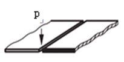 | 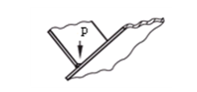 |
  | Horizontal vertical | PB | - | 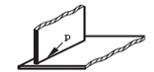 |
  | Horizontal | PC | 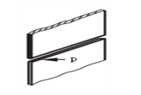 | 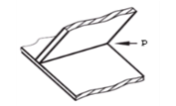 |
  | Horizontal overhead | PD | - | 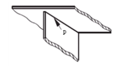 |
  | Overhead | PE | 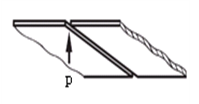 | 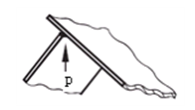 |
  | Vertical up | PF | 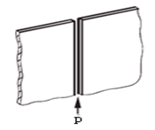 | 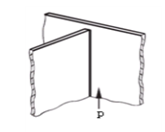 |
  | Vertical down | PG | 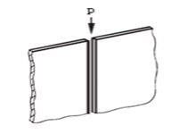 | 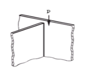 |
  | Upwards | PH | - | - |
  | Downwards | PJ | - | - |
  | Inclined upwards | PH-45 | - | - |
  | Inclined downwards | PJ-45 | - | - |

  **Table 2.2.23-3 Welding position of pipes**

  | Welding position |   | Description of welding position |   |   |
  | --- | --- | --- | --- | --- |
  | Welding position |   | Butt welds | Fillet welds |   |
  | Flat | PA | 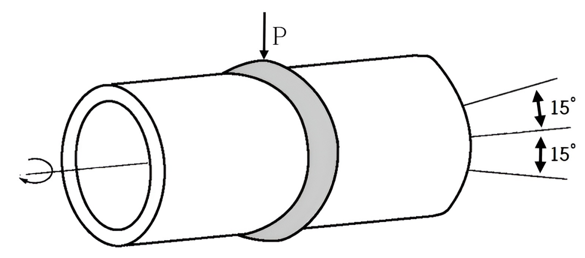 pipe rotating | 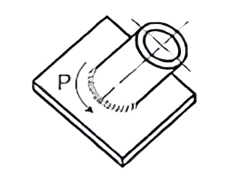 pipe rotating |   |
  | Horizontal vertical | PB | - | 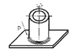 pipe fixed or rotating | 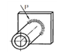 pipe rotating |
  | Horizontal | PC | 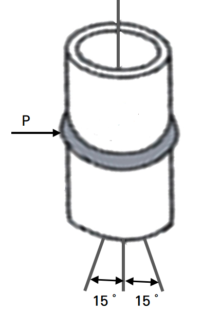 pipe fixed or rotating | - |   |
  | Horizontal overhead | PD | - | 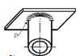 pipe fixed or rotating |   |
  | Overhead | PE | - | - |   |
  | Vertical up | PF | - | - |   |
  | Vertical down | PG | - | - |   |
  | Upwards | PH | 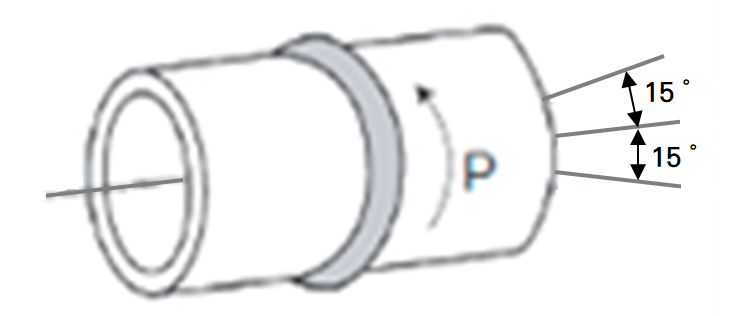 pipe fixed | 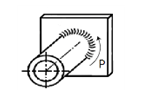 pipe fixed |   |
  | Downwards | PJ |  pipe fixed | 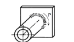 pipe fixed |   |
  | Inclined upwards | PH-45 | 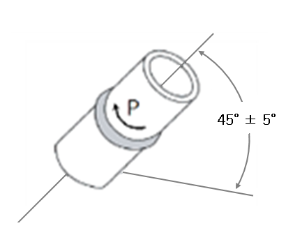 pipe fixed | 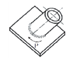 pipe fixed |   |
  | Inclined downwards | PJ-45 |  pipe fixed | 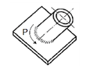 pipe fixed |   |

#### 503. Testing procedure

- **1.** **General**
  - **(1)** The test assemblies are not to be changed their up-and-down or right-and-left position throughout the welding operation.
  - **(2)** The test assemblies are not to be subjected to peening or heat treatment throughout the period before, during and after the welding.
  - **(3)** The backing strips of the test assemblies may be used steel plates, copper plate, ceramic, similar materials to obtain the enough penetration or backing gas used for WPS or pWPS.
  - **(4)** Welding of the test assemblies and testing of test specimens should be witnessed by the Surveyor.
- **2.** **Test assemblies**
  - **(1)** Test assemblies for butt welds and for fillet welds are to be prepared as shown in **Fig 2.2.13** to **Fig 2.2.20** in each qualification test.
  - **(2)** Materials used for tests are to be those specified in **502. 5** or those which are considered equivalent by the Society.

    | 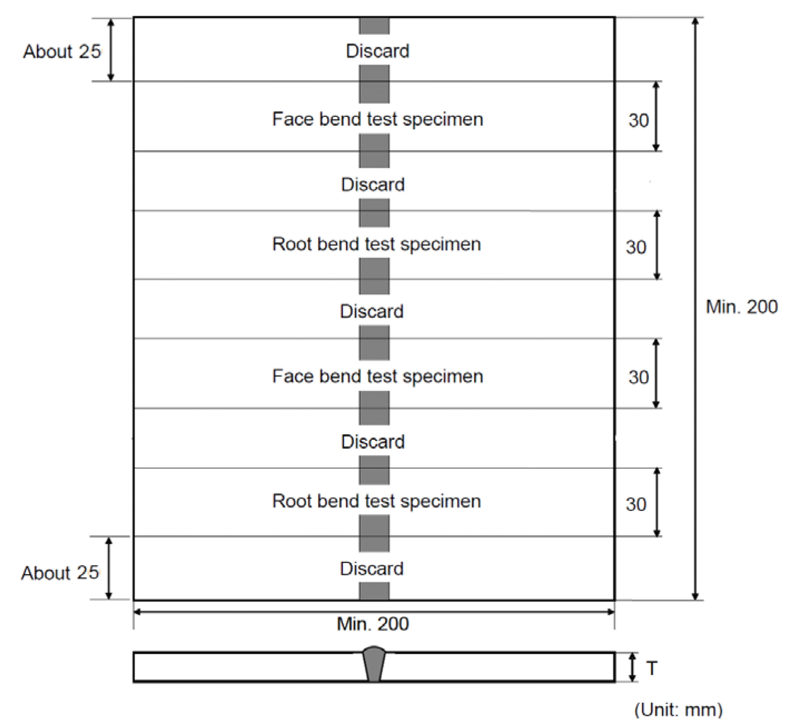 |   | 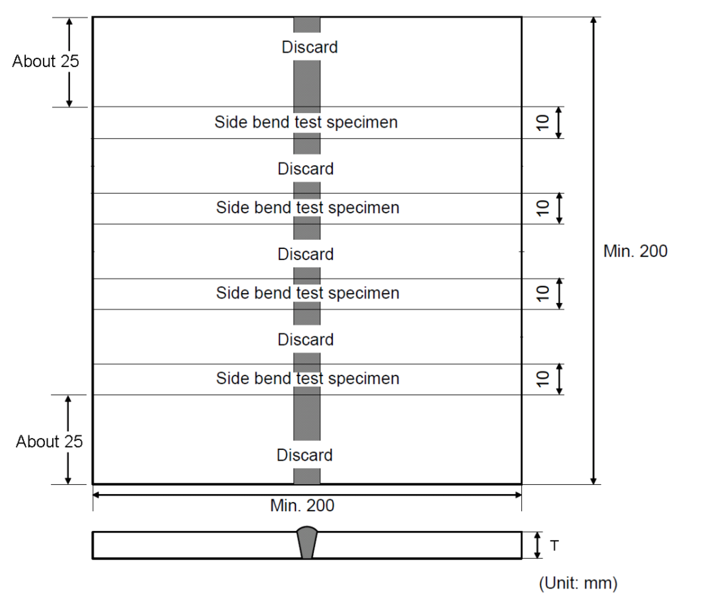 |
    | --- | --- | --- |
    | **Fig 2.2.13 Dimensions and types of test** **assembly for butt welds** ***(2023)*** |   | **Fig 2.2.14 Dimensions and types of test assembly for butt welds(T≧12mm)** |
    | 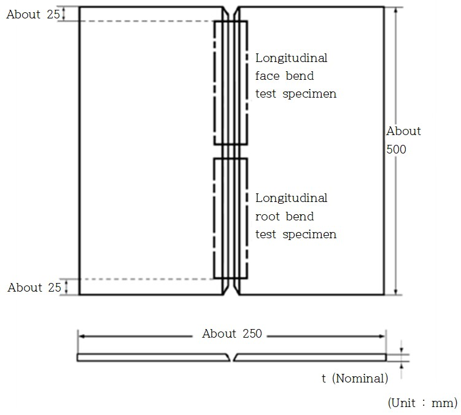 | 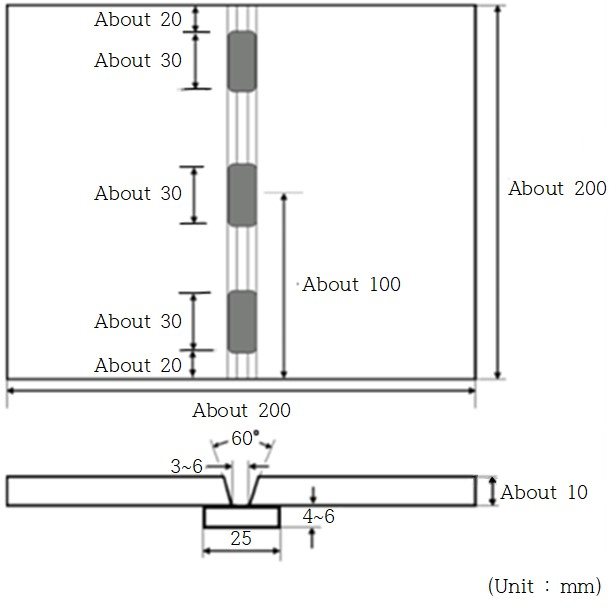 |   |
    | **Fig 2.2.15 Dimensions and types of test assembly for butt welds(For 9%nickel alloys)** | **Fig 2.2.16 Dimensions and types of test assembly for tack butt welds** |   |
    | 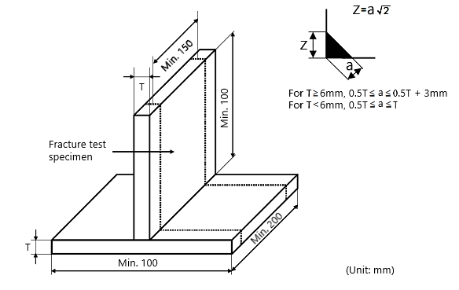 | 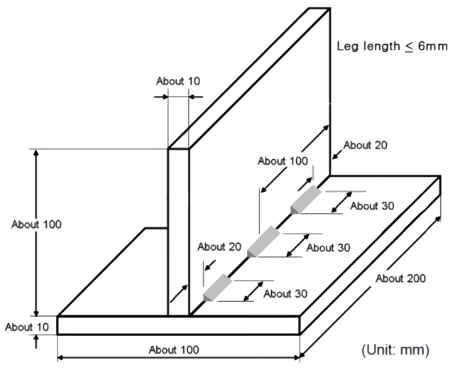 |   |
    | **Fig 2.2.17 Dimensions and types of test assembly for fillet welds** | **Fig 2.2.18 Dimensions and types of test assembly for tack fillet welds** |   |
    | 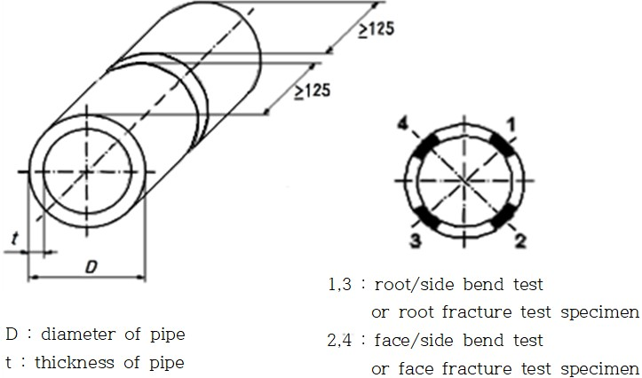 | 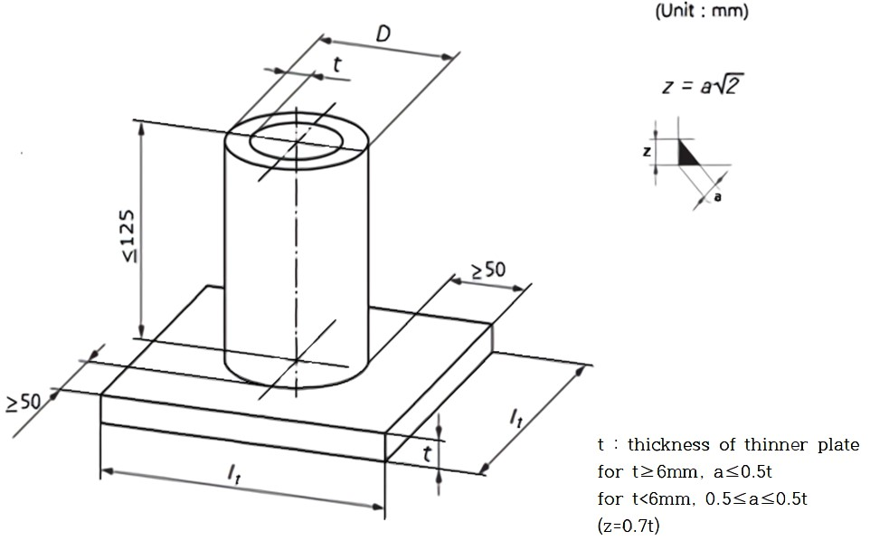 |   |
    | **Fig 2.2.19 Dimensions and types of test assembly for pipe butt welds** | **Fig 2.2.20 Dimensions and types of test assembly for pipe fillet welds** |   |
  - **(3)** The dimensions and types of welded joint are to be in accordance with WPS or pWPS.
  - **(4)** Welding consumables used in qualification tests should be type approved one or those which are considered equivalent by the Society.
  - **(5)** For other than fully mechanized and automatic welding, root run and capping run need each to have a minimum of one stop and restart. The welders are allowed to remove minor imperfections only in the stop by grinding before restart welding. *(2019)*
  - **(6)** Test assembly for automatic welding is to comply with **404. 3** and **405. 3**. For butt welded joints, the width of test assembly is not to be less than 300 mm and the length not to be less than 400 mm. For fillet welded joints, the width of test assembly is not to be less than 150 mm and the length not to be less than 400 mm.
  - **(7)** Test assemblies used in the qualification test of gas welding are to be of without backing, and gas welding rods are to be those for mild steel complying with a *KS D*7005 (Gas welding rods for mild steel) or *EN 12536* or those considered appropriate by the Society.
- **3.** **Examination and test**
  - **(1)** Examination and test are as specified in **Table 2.2.24**.

    **Table 2.2.24 Examination and test for Welder Qualification** ***(2022)***

    | Kinds | Examination and test(6) |
    | --- | --- |
    | Butt welds | Visual inspection, Bend test(1)(2)(3)(4) |
    | Fillet welds | Visual inspection, Fracture test(5) |
    | Tack welds | Visual inspection, Fracture test |
    | NOTES (1) Radiographic test or fracture test may be carried out in lieu of bend test except the welding processes in the **Table** below. Material ; Welding process(see **Table 2.2.20**) Carbon steels, Stainless steels ; 131, 135, 138, 311(Oxyacetylene welding) Nickel alloys ; 131, 135 Aluminium alloys ; 131 Copper and copper alloy ; All welding processes Material Welding process(see **Table 2.2.20**) Carbon steels, Stainless steels 131, 135, 138, 311(Oxyacetylene welding) Nickel alloys 131, 135 Aluminium alloys 131 Copper and copper alloy All welding processes And the radiographic test may be replaced by ultrasonic test for thickness 8 mm or above on ferritic steels(e.g. carbon steel, etc.) only. (2) For 9%nickel alloy in plates, longitudinal bend test specimens may be used as shown in **Fig 2.2.11**. (3) For nickel alloy in tubes, radiographic tests or fracture test mayh be carried out in lieu of bend test notwithstanding (1) above. (4) For pipe with outer diameters D ≤ 25 mm, the bend or fracture tests may be replaced by a notched tensile test of the complete test assemblies as shown in **Fig 2.2.21**. (5) Two macro sections may be taken in lieu of the fracture test. (6) Additional tests may be required, at the discretion of the Society. **【See Guidance】** |   |
    | Material | Welding process(see **Table 2.2.20**) |
    | Carbon steels, Stainless steels | 131, 135, 138, 311(Oxyacetylene welding) |
    | Nickel alloys | 131, 135 |
    | Aluminium alloys | 131 |
    | Copper and copper alloy | All welding processes |

    | 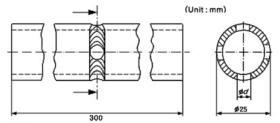 |
    | --- |
    | (Note) 1. The size of is as follows: (1) t ≥ 1.8mm : *d* = 4.5mm (2) t < 1.8mm : *d* = 3.5mm *d*: diameter of the hole in weld (Holes are not allowed in start and stop areas) 2. Notch profiles *s* and *q* are also permitted in circumferential direction according to *ISO 9017* |
    | **Fig 2.2.21 Notch tensile test for pipe assemblies outer diameter D ≤25 mm** |
  - **(2)** **Visual examination**
  - **(3)** **Bend test**
    **【See Guidance】**
  - **(4)** **Non-destructive testing**
  - **(5)** **Fracture test**
  - **(6)** **Macro examination**
    When macro examination is used for fillet welds, examination procedures and acceptance criteria are to be as follows;
- **4.** **Retest**
  - **(1)** When a welder fails a qualification test, the following should apply.
  - **(2)** Where any test specimen does not comply with dimensional specifications due to poor machining, a replacement test assembly should be welded and tested.
- **5.** **Certification**
  - **(1)** Qualification certificates are normally issued to shipbuilder or manufacturer when the welder has passed the qualification test in accordance with the Society’s Rules. Each Shipyard and Manufacturer is to be responsible for the control of the validity of the certificate and the range of the approval. *(2022)*
  - **(2)** The following items should be specified in the certificate:
  - **(3)** When a certificate is issued, the relative documents such as test reports and/or re-validation records are to be archived as annexes to the copy of certificate.

#### 504. General requirements for qualification validity

- **1.** **Initial approval**
  - **(1)** Normally the validity of the welder’s approval begins from the issue date of qualification certificate when all the required tests are satisfactorily completed.
  - **(2)** Where welder has not engaged in a particular process and equipment for a period exceeding six months, his qualification is automatically withdrawn. All the following conditions are fulfilled for maintaining welder's qualification. If any of these conditions are not fulfilled, the Society is to be informed and the certificate is to be cancelled.
  - **(3)** Where welder has failed to meet the requirements of the Society in welding work as follows, his qualification is to be suspended.
  - **(4)** The effectiveness of qualification of welder who has switched his job specified in (3) (a) above may be considered as remaining, provided that the all followings are satisfied. For remaining, the certificate may be issued to last shipyards/manufacturers.
- **2.** **Maintenance of the approval**
  - **(1)** Revalidation is to be carried out by the Society. The skill of the welder is to be periodically verified by one of the following (A) ~ (C) options. The chosen maintenance option scheme of qualification is in accordance with (A) or (B) or (C) shall be stated on the certificate at the time of issue: *(2022)*
    - **(A)** The welder is to be re-tested every 3 years. The welder is to be performed the test for revalidation within 6 months before the expiration date of qualification. These tests revalidate the welder's qualifications for an additional 3 years. *(2022)*
    - **(B)** Every 2 years, two welds made during the last 6 months of the 2 years validity period are to be tested by radiographic or ultrasonic testing or destructive testing and shall be recorded. The weld tested shall reproduce the initial test conditions except for the thickness and the outer diameter. These tests revalidate the welder's qualifications for an additional 2 years.
    - **(C)** A welder’s qualification for any certificate shall be valid as long as it is signed according to **1.** (2) above subject that all the following conditions are fulfilled. In this option, the fulfilment of all the conditions is to be verified by the Society. The frequency of verification by the Society is to be no longer than 3 years and is to be agreed between the Society and the shipyards/manufacturers. This can be replaced by a method recognized by the Society. *(2020) (2022)* **[See Guidance]**
      - **(a)** The welder is working for the same shipyard/manufacturer which is responsible for production weld quality as indicated on his or her qualification certificate.
      - **(b)** The Society shall verify that the welder quality management system of the shipyard/manufacturer includes as minimum:
      - **(i)** A designated person responsible for the coordination of the welder quality management system.
        - **(ii)** List of welders and welding supervisors in shipyard/manufacturer
        - **(iii)** If applicable, list of subcontracted welders
        - **(iv)** Qualification certificate of welders and description of the associated management system
      - **(v)** Training requirements for welder qualification programme
        - **(vi)** Identification system for welders and WPS used on welds
        - **(vii)** Procedure describing the system in place to monitor each welder performance based on results of welds examination records(e.g. repair rate, etc.) including the criteria permitting the maintenance of the welder qualification without retesting.
      - **(c)** The shipyards/manufacturers have to document at least once a year that the welder has produced acceptable welds in accordance with construction quality standards and Society’s requirements in the welding positions, type of welds and backing conditions covered by its certificate. Which documents are required and how to document the evidences should be in agreement between the Society and the shipyards/manufacturers.
    - **(D)** If, despite the preceding (A) ~ (C), you have completed the revalidation of the qualification within one month after the expiration date of qualification, you may be deemed to have maintained the approval for the period from the expiration date to the completion of the revalidation. When the revalidation is completed, the validity of the qualifications is to be as given in (A) ~ (C).
  - **(2)** The welder has to be verified compliance with the conditions of (1) above and the maintenance of the welder’s qualification certificate is to be signed by the Surveyor.
  - **(3)** Welders who are not engaged in plates(including steel castings and forgings) welding for hull structural may omit the revalidation of qualifications. At this time, the manufacturer(shipbuilder) is to distinguish between the welders engaged in hull structural plate(including steel castings and forgings) welding and the other welders. *(2019) (2023)*

### Section 6 Welding Consumables

#### 601. General

- **1.** **Application**
  - **(1)** The covered electrodes for manual welding and gravity welding, wire/flux combinations for two run or multirun submerged arc welding, solid wire/gas combinations for arc welding, flux cored wires with or without gas for arc welding and consumables for use in electroslag and electrogas vertical welding specified in the Rules are to be approved by the Society in accordance with the requirements in this Section.
  - **(2)** The welding consumables which are used in welding processes differing from those specified in (1) or where it is considered impracticable to apply the requirements in this Section are to be of the type approved by the Society.
  - **(3)** The approval test for welding consumables which are not covered by this Section is to be left to the discretion of the Society. **【See Guidance】**
- **2.** **Process of manufacture**
  The approved welding consumables are to be manufactured of uniform quality, under the manufacturer's responsibility, by the process approved by the Society, at works approved by the Society.
- **3.** **Test assemblies**
  - **(1)** The test assemblies are to be prepared under the supervision of the Surveyor, and all tests are to be carried out in his presence.
  - **(2)** When a welded joint is performed, the edges of the plates are to be bevelled either by mechanical machining or by oxygen cutting; in the later case, a descaling of the bevelled edges is necessary.
  - **(3)** The welding conditions used such as amperage, voltage, travel speed, etc are to be within the range recommended by the manufacturer for normal good welding practice. Where a filler material is stated to be suitable for both alternating current (AC) and direct current (DC), AC is to be used for the preparation of the test assemblies.
- **4.** **Approval test**
  - **(1)** The approved welding consumables are subject to the approval tests and inspections specified in **602.** to **609.** in this Section.
  - **(2)** Welding consumables are to be approved at each manufacturing plant and for each brand. However, where are specified in (a) and/or (b) below, a reduced test programme at least equivalent to annual tests is permitted if the manufacturer can certify that the materials used and the fabrication process are identical with those used in the main works. However, should there be any doubt, complete test-series may be required.
  - **(3)** Wire flux combination for submerged arc welding. If a unique powder flux is combined with different wires coming from several factories belonging to the same firm, it may be admitted to perform only one test-series if the different wires are conformable to the same technical specification, after approval of the Society.
  - **(4)** Where deemed necessary by the Society, tests other than those specified in this Section may be required.
- **5.** **Periodical inspection**
  The manufacturer of welding materials is annually to be subjected to the periodical inspection in the presence of Surveyor for each brands of the welding materials at each manufacturing plant. *(2024)*
- **6.** **Alterations to approved consumables**
  - **(1)** In case when the particulars of the welding materials which being mentioned in the certificate of approval, such as grade, welding position, maximum diameter of welding materials or shield gas, are changed, the manufacturer is to submit a copy of application form for change to the Society, and necessary additional approval tests are to be carried out accordingly.
  - **(2)** When the significant changes in compositions or manufacturing process of the wire and flux or removal of manufacturing plant is made, the manufacturer is to submit a single copy of notification of alternation in any preferred form to the Society**,** and necessary confirmation survey and test may be carried out accordingly.
  - **(3)** Upgrading and uprating of welding consumables will be considered only at manufacturer's request, preferably at the time of annual testing. Generally, for upgrading of the strength or toughness, tests from butt weld assemblies will be required in addition to the normal annual approval tests. Generally, for uprating of hydrogen, hydrogen test will be required in addition to the normal annual approval tests. *(2017)*
- **7.** **Retests**
  - **(1)** *Tensile test and bend test*
  - **(2)** *Impact test*
  - **(3)** Where the retest fails to meet the requirements, the test may be made over again with changed welding conditions. In this case, if the whole tests specified for the test assembly are carried out and are in compliance with the requirements, the test is accepted as successful.
- **8.** **Revocation of approval**
  In the following cases, the approval of welding consumables by the Society shall be revoked, after notice is given to the manufacturer:
  - **(1)** When the Society has recognized that the quality is remarkably worse than that approved or is not uniform.
  - **(2)** When the welding consumables have failed the requirements in the annual inspections.
  - **(3)** When the welding consumables are not inspected annually as required by the Rules.
- **9.** **Data**
  The Society may require the submission of the data with respect to the properties of welding consumables if necessary.
- **10.** **Packings and markings**
  - **(1)** The approved welding consumables are to be packed throughly to keep the quality during their transportation and storage.
  - **(2)** All packages of approved welding consumables are to clearly marked with the following descriptions. *(2019)*

#### 602. Electrodes for manual arc welding for normal strength steels, higher strength steels and steels for low temperature service

- **1.** **Application**
  - **(1)** Electrodes for manual arc welding for normal strength steels, higther strength steels and steels for low temperature service given in the following (a) and (b) (hereinafter referred to as "electrodes") are to be subjected to the approval test and annual inspections in accordance with the requirements in **602.**.
  - **(2)** **(2) Any requirements regarding one side welding without backing are left to the discretion of the Society. 【 See Guidance】**
- **2.** **Grades and marks of electrode**
  - **(1)** Electrodes are classified as specified in **Table 2.2.25**.

    **Table 2.2.25 Grades and Marks** ***(2017)*** ***(2021)***

    | For normal strength steel | For higher strength steel | For steel for low temperature service |
    | --- | --- | --- |
    | 1, 2, 3 | 2*Y*, 3*Y*, 4*Y*, 5*Y*, 2*Y*40, 3*Y*40, 4*Y*40, 5*Y*40, 3*Y*47 | *L* 1, *L* 2, *L* 3, *L* 51, *L* 91 |
  - **(2)** For low hydrogen electrodes which have passed the hydrogen test specified in **Par 6,** the suffixes given in **Table 2.2.32** are to be added to the grade marks of the said electrodes. (e.g. 2*Y H5*)
- **3.** **General provisions for tests**
  - **(1)** Kinds of test, number, thickness and dimension of test assemblies, diameter of electrodes used for welding, welding positions, grades and number of test specimens to be taken from each test assembly for electrodes given in **Par 1** (1) (a) (i) and (iii) are to be as given in **Table 2.2.26**. However, where deemed necessary by the Society, hot cracking tests may be required by the Society in addition to tests specified in this Table. **【See Guidance】**
  - **(2)** Kinds of test, number, thickness and dimension of test assemblies, diameter of electrodes used for welding and welding positions, together with grades and number of test specimens to be taken from each test assembly for electrodes given in **Par 1** (1) (a) (ii), are to be as given in **Table 2.2.27**.
  - **(3)** Tests for electrodes given in **Par 1** (1) (b) are to be in accordance with the requirements in the following (a) and (b):

    **Table 2.2.26 Kinds of Test for Electrode**

    | Kind of test | Test assembly |   |   |   |   | Kind and No. of test specimens taken from test assembly |
    | --- | --- | --- | --- | --- | --- | --- |
    | Kind of test | Welding position | Diameter of electrode (mm) | No. of test assemblies | Dimensions of test assembly | Thickness (mm) | Kind and No. of test specimens taken from test assembly |
    | Deposited metal test | Flat | 4 | 1^(^1) | **Fig 2.2.22** | 20 | Tensile test specimen : 1 Impact test specimen : 3 |
    | Deposited metal test | Flat | max. diameter | 1^(^1) | **Fig 2.2.22** | 20 | Tensile test specimen : 1 Impact test specimen : 3 |
    | Butt weld test | Flat | First run. 4; Subsequent runs:5 or over; Last two runs. max. dia. | 1 | **Fig 2.2.24** | 15~20 | Tensile test specimen : 1 Face bend specimen : 1 Root bend specimen : 1 Impact test specimen : 3^(^5) |
    | Butt weld test | Flat | First run. 4; Second run,5 or 6; Subsequent runs. max. dia. | 1^(^2) | **Fig 2.2.24** | 15~20 | Tensile test specimen : 1 Face bend specimen : 1 Root bend specimen : 1 Impact test specimen : 3^(^5) |
    | Butt weld test | Horizontal (4) | First run. 4 or 5 Subsequent runs, 5 | 1 | **Fig 2.2.24** | 15~20 | Tensile test specimen : 1 Face bend specimen : 1 Root bend specimen : 1 Impact test specimen : 3^(^5) |
    | Butt weld test | Vertical upward | First run. 3.2; Subsequent runs. 4 or 5 | 1 | **Fig 2.2.24** | 15~20 | Tensile test specimen : 1 Face bend specimen : 1 Root bend specimen : 1 Impact test specimen : 3^(^5) |
    | Butt weld test | Vertical downward | (3) | 1 | **Fig 2.2.24** | 15~20 | Tensile test specimen : 1 Face bend specimen : 1 Root bend specimen : 1 Impact test specimen : 3^(^5) |
    | Butt weld test | Overhead | First run. 3.2; Subsequent runs. 4 or 5 | 1 | **Fig 2.2.24** | 15~20 | Tensile test specimen : 1 Face bend specimen : 1 Root bend specimen : 1 Impact test specimen : 3^(^5) |
    | Fillet weld test^(^6) | Horizontal | One side; max. dia. The other side; min. dia. | 1 | **Fig 2.2.25** | 20 | Macro structure test specimen : 3^(^8) Hardness test specimen : 3^(^8) Fracture test specimen : 2 |
    | Hydrogen test^(^7) | Flat | 4 | 4 | (9) | 12 | Hydrogen test specimen : 1 |
    | NOTES: (1) Where the diameter of the manufactured electrodes is of one type, there is to be one test assembly. If 4 mm is the largest size, two test assemblies including 4 mm and other largest size are required. *(2019)* (2) Where the tests are conducted solely in the downhand position, this test assembly has been added. (3) Electrodes with diameters specified by the manufacturers are to be used. (4) For electrodes which have passed butt weld tests in the downhand and vertical upward positions, test in the horizontal position may be omitted subject to approval by the Society. (5) Impact tests are not to conduct for overhead welds. (6) This test is added solely for electrodes used in both butt welds and fillet welds. (7) This test is to conduct solely for low hydrogen electrodes. (8) Test specimens used in macro structure test and hardness tests are considered to be the same. (9) Dimensions of test assembly are to be as specified in **602. 6**. |   |   |   |   |   |   |
  - **(4)** Where electrodes are intended to be used for both items specified in **Par 1** (1) (a) and (b), approval tests required for each electrode are to be conducted. However, deposited metal tests may be omitted for electrodes given in **Par 1** (1) (b).
  - **(5)** Steel plates to be used in preparation of test assemblies are to be as given in **Table 2.2.28** according to the grades of electrode.
  - **(6)** The welding conditions used such as amperage, voltage, travel speed, etc. are to be within the range recommended by the manufacturer for normal good welding practice. Where a filler metal is stated to be suitable for both alternating current (AC) and direct current (DC), AC is to be used for the preparation of the test assemblies.
  - **(7)** For the approval of electrodes, the tests specified in the preceding (1) to (4) are to be conducted for each brand of electrodes.
  - **(8)** After welding, the test assemblies are not to be subjected to any heat treatment.

    **Table 2.2.27 Kinds of Test for Electrode**

    | Kind of test | Test assembly |   |   |   |   | Kind and No. of test specimens taken from test assembly |
    | --- | --- | --- | --- | --- | --- | --- |
    | Kind of test | Welding position | Diameter of electrode (mm) | No. of test assemblies | Dimensions of test assembly | Thickness (mm) | Kind and No. of test specimens taken from test assembly |
    | Deposited metal test | Flat | 4 | 1 | **Fig 2.2.22** | 20 | Tensile test specimen : 1 Impact test specimen : 3 |
    | Deposited metal test | Flat | max. diameter | 1 | **Fig 2.2.22** | 20 | Tensile test specimen : 1 Impact test specimen : 3 |
    | Fillet weld test | Flat | One side; max. dia. The other side; min. dia. | 1 | **Fig 2.2.25** | 20 | Macro structure test specimen : 3^(^1) Hardness test specimen : 3^(^1) Fracture test specimen : 2 |
    | Fillet weld test | Horizontal- vertical | One side; max. dia. The other side; min. dia. | 1 | **Fig 2.2.25** | 20 | Macro structure test specimen : 3^(^1) Hardness test specimen : 3^(^1) Fracture test specimen : 2 |
    | Fillet weld test | Vertical upward | One side; max. dia. The other side; min. dia. | 1 | **Fig 2.2.25** | 20 | Macro structure test specimen : 3^(^1) Hardness test specimen : 3^(^1) Fracture test specimen : 2 |
    | Fillet weld test | Vertical downward | One side; max. dia. The other side; min. dia. | 1 | **Fig 2.2.25** | 20 | Macro structure test specimen : 3^(^1) Hardness test specimen : 3^(^1) Fracture test specimen : 2 |
    | Fillet weld test | Overhead | One side; max. dia. The other side; min. dia. | 1 | **Fig 2.2.25** | 20 | Macro structure test specimen : 3^(^1) Hardness test specimen : 3^(^1) Fracture test specimen : 2 |
    | Hydrogen test^(^2) | Flat | 4 | 4 | (3) | 12 | Hydrogen test specimen : 1 |
    | NOTES: (1) Test specimens used in macro tests and hardness tests are considered to be the same. (2) This test is to conduct solely for low hydrogen electrodes. (3) Dimensions of test assembly are to be as specified in **602. 2. 6.** |   |   |   |   |   |   |

    **Table 2.2.28 Grade of Steels used for Test Assembly** ***(2017) (2021)***

    | Grade of electrode | Grade of steels used for test assembly(1)(2) |
    | --- | --- |
    | 1 | *A* |
    | 2 | *A*, *B* or *D* |
    | 3 | *A*, *B*, *D* or *E* |
    | 2*Y* | *AH* 32, *AH* 36, *DH* 32 or *DH* 36 |
    | 3*Y* | *AH* 32, *AH* 36, *DH* 32, *DH* 36, *EH* 32 or *EH* 36 |
    | 4*Y* | *AH* 32, *AH* 36, *DH* 32, *DH* 36, *EH* 32, *EH* 36, *FH* 32 or *FH* 36 |
    | 5*Y* | *AH* 32, *AH* 36, *DH* 32, *DH* 36, *EH* 32, *EH* 36, *FH* 32 or *FH* 36 |
    | 2*Y*40 | *AH* 40 or *DH* 40 |
    | 3*Y*40 | *AH* 40, *DH* 40 or *EH* 40 |
    | 4*Y*40 | *AH* 40, *DH* 40, *EH* 40 or *FH* 40 |
    | 5*Y*40 | *AH* 40, *DH* 40, *EH* 40 or *FH* 40 |
    | 3*Y*47 | *EH* 47-*H* |
    | *L* 1 | *E or RL* 24*A* |
    | *L* 2 | *E*, *RL* 235*A*, *RL* 235*B*, *RL* 325*A* or *RL* 325*B* |
    | *L* 3 | *RL* 325*A*, *RL* 325*B* or *RL* 355 |
    | *L* 51 | *RL* 5*N*390 |
    | *L* 91 | *RL* 9*N*490 |
    | NOTES: (1) Notwithstanding the requirements in this Table normal strength or higher strength steel may be used for the deposited metal test assembly. In this case, test assemblies of grade *L* 91 are to be appropriately buttered. (2) The tensile strength of higher strength steels *AH* 32, *DH* 32 *EH* 32, and *FH* 32 used in butt weld test assemblies is to be greater than 490 $\mathrm{N}/mm ^{2}$. |   |
  - **(9)** It is recommended that the welded assemblies be subjected to a radiographic examination to ascertain that there are any defects in the weld prior to the preparation of test specimens.
- **4.** **Deposited metal test**
  - **(1)** *Welding of deposited metal test assemblies*
    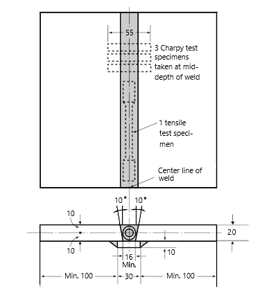
    **Fig 2.2.22 Deposited Metal Test Assembly for Electrode for Manual Arc Welding (unit : mm)**
  - **(2)** *Chemical analysis*
    The chemical analysis of the deposited weld metal in each test assembly is to be supplied by the manufacturer and is to include the content of all significant alloying element.
  - **(3)** *Deposited metal tensile test*
  - **(4)** *Deposited metal impact tests*
    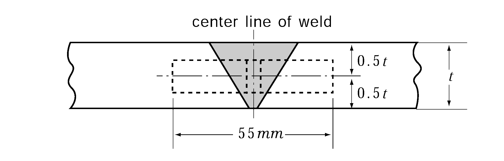
    **Fig 2.2.23 Position of Butt Weld Impact Test Specimen**(Unit : mm, t : plate thickness)

    **Table 2.2.29 Tensile and impact Test Requirements for Deposited Metal** ***(2017) (2021)***

    | Grade of electrode | Tensile strength ($\mathrm{N}/mm ^{2}$) | Yield strength ($\mathrm{N}/mm ^{2}$) | Elongation ($\%$) | Impact test |   |
    | --- | --- | --- | --- | --- | --- |
    | Grade of electrode | Tensile strength ($\mathrm{N}/mm ^{2}$) | Yield strength ($\mathrm{N}/mm ^{2}$) | Elongation ($\%$) | Test temp. (℃) | Average absorbed energy(J) |
    | 1 | 400 ∼ 560 | 305 min. | 22 min. | 20 | 47 min. |
    | 2 | 400 ∼ 560 | 305 min. | 22 min. | 0 | 47 min. |
    | 3 | 400 ∼ 560 | 305 min. | 22 min. | -20 | 47 min. |
    | 2*Y* | 490 ∼ 660 | 375 min. | 22 min. | 0 | 47 min. |
    | 3*Y* | 490 ∼ 660 | 375 min. | 22 min. | -20 | 47 min. |
    | 4*Y* | 490 ∼ 660 | 375 min. | 22 min. | -40 | 47 min. |
    | 5*Y* | 490 ∼ 660 | 375 min. | 22 min. | -60 | 47 min. |
    | 2*Y*40 | 510 ∼ 690 | 400 min. | 22 min. | 0 | 47 min. |
    | 3*Y*40 | 510 ∼ 690 | 400 min. | 22 min. | -20 | 47 min. |
    | 4*Y*40 | 510 ∼ 690 | 400 min. | 22 min. | -40 | 47 min. |
    | 5*Y*40 | 510 ∼ 690 | 400 min. | 22 min. | -60 | 47 min. |
    | 3*Y*47 | 570 ∼ 720 | 460 min. | 19 min. | -20 | 64 min. |
    | *L* 1 | 400 ∼ 560 | 305 min. | 22 min. | -40 | 34 min. |
    | *L* 2 | 440 ∼ 610 | 345 min. | 22 min. | -60 | 34 min. |
    | *L* 3 | 490 ∼ 660 | 375 min. | 21 min. | -60 | 34 min. |
    | *L* 51 | 530 min. | 375 min.(1) | 25 min. | -120 | 27 min. |
    | *L* 91 | 590 min. | 375 min.(1) | 25 min. | -196 | 27 min. |
    | NOTE: (1) 0.2 % Yield strength |   |   |   |   |   |
- **5.** **Butt weld test**
  - **(1)** *Welding of butt weld test assemblies*
    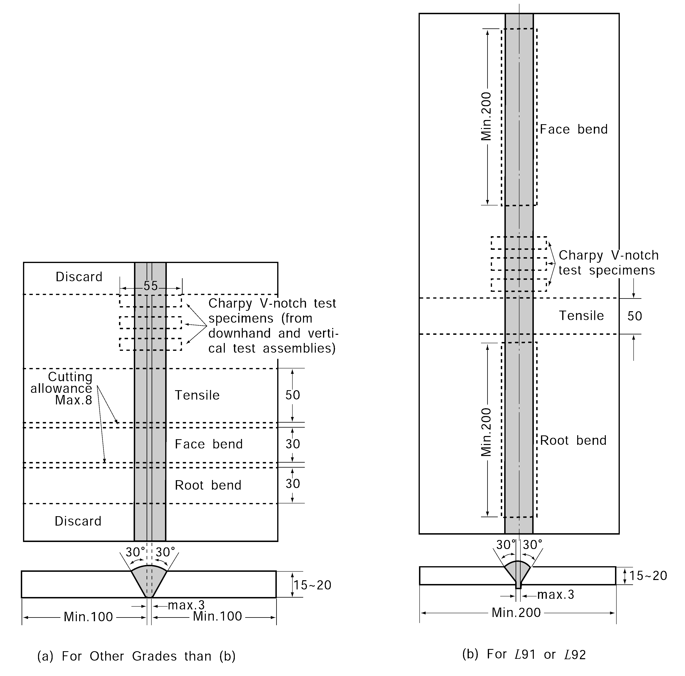
    **Fig 2.2.24 Butt weld Test Assembly for Electrode for Manual Arc Welding** (Unit: mm)
  - **(2)** *Butt weld tensile tests*
  - **(3)** *Butt weld bend test*

    **Table 2.2.30 Tensile and impact Test Requirements for butt weld** ***(2017) (2021)***

    | Grade of electrode | Tensile strength ($\mathrm{N}/mm ^{2}$) | Impact test |   |   |
    | --- | --- | --- | --- | --- |
    | Grade of electrode | Tensile strength ($\mathrm{N}/mm ^{2}$) | Test temp. (℃) | Average absorbed energy (J) |   |
    | Grade of electrode | Tensile strength ($\mathrm{N}/mm ^{2}$) | Test temp. (℃) | Flat, Horizontal, Overhead | Vertical upward Vertical downward |
    | 1 | 400 min. | 20 | 47 min. | 34 min. |
    | 2 | 400 min. | 0 | 47 min. | 34 min. |
    | 3 | 400 min. | -20 | 47 min. | 34 min. |
    | 2*Y* | 490 min. | 0 | 47 min. | 34 min. |
    | 3*Y* | 490 min. | -20 | 47 min. | 34 min. |
    | 4*Y* | 490 min. | -40 | 47 min. | 34 min. |
    | 5*Y* | 490 min. | -60 | 47 min. | 34 min. |
    | 2*Y*40 | 510 min. | 0 | 47 min. | 39 min. |
    | 3*Y*40 | 510 min. | -20 | 47 min. | 39 min. |
    | 4*Y*40 | 510 min. | -40 | 47 min. | 39 min. |
    | 5*Y*40 | 510 min. | -60 | 47 min. | 39 min. |
    | 3*Y*47 | 570 min. | -20 | 64 min. | 64 min. |
    | *L* 1 | 400 min. | -40 | 27 min. | 27 min. |
    | *L* 2 | 440 min. | -60 | 27 min. | 27 min. |
    | *L* 3 | 490 min. | -60 | 27 min. | 27 min. |
    | *L* 51 | 530 min. | -120 | 27 min. | 27 min. |
    | *L* 91 | 630 min. | -196 | 27 min. | 27 min. |
  - **(4)** *Butt weld impact tests*
- **6.** **Hydrogen test**
  The hydrogen test to be carried out by the mercury method or thermal conductivity detector method. The use of the glycerine method may be admitted at the Society discretion. *(2017)*
  - **(1)** The mercury method to be as specified in the Standard *ISO 3690:2018*. *(2017) (2023)*
  - **(2)** The thermal conductivity detector method is to be as specified in *ISO 3690:2018*. Four weld assemblies are to be prepared. The temperature of the specimens and minimum holding time are to be complied with **Table 2.2.31**, according to the measuring method respectively. *(2017) (2023)*
  - **(3)** Glycerin method
    The glycerin is to be kept at a temperature of approximately 45℃ during the test. The test time required for all the four test specimens from welding to the enclosure in the hydrogen collector is to be within 30 min. After immersing into glycerin for 48 hours, the test specimens are to be cleaned with water and alcohol and weighed with an accuracy of 0.1 *g* after being dried to measure the weight of the deposited metal. The volume of hydrogen gas collected is to be measured with an accuracy of 0.05 $\mathrm{cm} ^{3}$ and converted into that under the conditions 20 ℃ and 1 atmospheric pressure (760 mm $Hg$).

    **Table 2.2.31 Test temperature and minimum holding time** ***(2017)***

    | Measuring method |   | Test temperature | Minimum holding time |
    | --- | --- | --- | --- |
    | Thermal conductivity detector method(1) | Gas chromatography | 45 ℃ | 72 hour |
    | Thermal conductivity detector method(1) | Gas chromatography | 150 ℃ | 6 hour |
    | NOTES: (1) The use of hot carrier gas extraction method may be considered subject to verification of the testing procedure to confirm that collection and measurement of the hydrogen occurs continuously until all of the diffusible hydrogen is quantified. |   |   |   |
  - **(4)** Average diffusible hydrogen contents of the four specimens is to comply with the requirements given in **Table 2.2.32** according to the test procedures specified in preceding articles or the type of suffixes to be added to the grade marks.

    **Table 2.2.32 Requirements for Hydrogen Contents** ($ml/100g$) ***(2017)***

    | Mark | Mercury method | Thermal conductivity detector method | Glycerine method |
    | --- | --- | --- | --- |
    | *H15* | 15 max. | 15 max. | 10 max. |
    | *H10* | 10 max. | 10 max. | 5 max. |
    | *H5* | 5 max. | 5 max. | - |
- **7.** **Fillet weld test**
  - **(1)** *Welding of fillet weld test assemblies*
    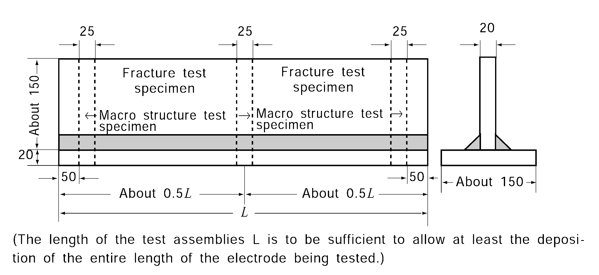
    **Fig 2.2.25 Fillet Weld Test Assembly** (Unit : mm)
  - **(2)** *Fillet weld macro-structure test*
  - **(3)** *Fillet weld hardness test* The hardness of weld metal, heat affected zone and base metal are to be measured at places given in **Fig 2.2.26** for each test specimen which underwent the macro-etching test specified in preceding (1) and the respective hardnesses are to be in accordance with those deemed appropriate by the Society. **【See Guidance】**
    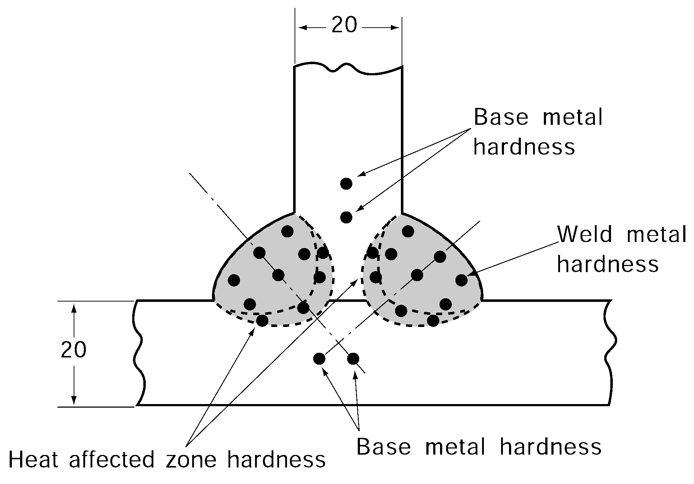
    **Fig 2.2.26 Hardness Test** (Unit : mm)
  - **(4)** Fillet weld fracture test
    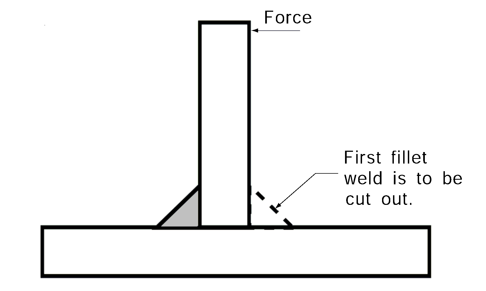
    **Fig 2.2.27 Fracture Test**
- **8.** **Annual inspections**
  - **(1)** In the annual inspections, tests specified in the following (2) and (3) are to be conducted for each brand of the approved electrodes and they are to be passed satisfactorily.
  - **(2)** The kinds of test, etc. in the annual inspections for manual arc welding electrodes are to be as given in **Table 2.2.33**.

    **Table 2.2.33 Kind of Test for Annual Inspection** ***(2019)***

    | Kind of test^(^2) | Test assembly |   |   |   |   | Kind and no. of test specimens taken from test assembly |
    | --- | --- | --- | --- | --- | --- | --- |
    | Kind of test^(^2) | Welding position | Diameter of electrode (mm) | Number | Dimensions | Thickness (mm) | Kind and no. of test specimens taken from test assembly |
    | Deposited metal test | Flat | 4^(^1) | 1 | **Fig 2.2.21** | 20 | Tensile test specimen : 1 Impact test specimen : 3 |
    | Deposited metal test | Flat | max. diameter^(^1) | 1 | **Fig 2.2.21** | 20 | Tensile test specimen : 1 Impact test specimen : 3 |
    | NOTES: (1) Where the diameter of the manufactured electrodes is of one type, there is to be one test assembly. If 4 mm is the largest size, two test assemblies including 4 mm and other largest size are required. (2) For low hydrogen electrodes, an hydrogen test can also be required at the discretion of the Society. |   |   |   |   |   |   |
  - **(3)** The kinds of test, etc. in the annual inspections of electrodes used in gravity welding or other welding using similar welding devices are to be as given in **Table 2.2.34**.
  - **(4)** The welding procedures and requirements for test assemblies of tests specified in the preceding (2) and (3) are to be as specified in **Par 4**.

    **Table 2.2.34 Kind of Test for Annual Inspection**

    | Kind of test | Test assembly |   |   |   |   | Kind and no. of test specimens taken from test assembly |
    | --- | --- | --- | --- | --- | --- | --- |
    | Kind of test | Welding position | Diameter of electrode (mm) | Number | Dimensions | Thickness (mm) | Kind and no. of test specimens taken from test assembly |
    | Deposited metal test | Flat | 4 min. | 1 | **Fig 2.2.21** | 20 | Tensile test specimen : 1 Impact test specimen : 3 |
- **9.** **Changes in grades**
  - **(1)** Where changes in the grades relating to the strength or toughness or hydrogen of electrodes approved are to be made, tests specified in the following (2), (3) and (4) are to be carried out and satisfactorily passed in accordance with the requirements in **601. 6** (3). *(2017)*
  - **(2)** For changes in the grades relating to strength, the butt weld tests, specified in the annual inspection of **Par 8** and in the requirements of **Par 3** (1), are to be conducted.
  - **(3)** For changes in the grades relating to toughness, the butt weld impact tests, specified in the annual inspection of **Par 8** and in the requirements of **Par 3** (1), are to be conducted.
  - **(4)** For uprating of hydrogen, the hydrogen test, specified in the annual inspection of **Par 8** and in the requirements of **Par 3** (1), are to be conducted. *(2017)*

#### 603. Automatic welding consumables for normal strength steels, higher strength steels and steels for low temperature service

- **1.** **Application**
  - **(1)** Welding consumables for normal strength steels, higher strength steels and steels for low temperature service given in the following (a) through (c) (hereinafter referred to as "automatic welding consumables") are to be subjected to the approval tests and annual inspections in accordance with the requirements in **603.**
  - **(2)** Wire-flux combinations for multiple electrode submerged arc welding will be subject to separate approval tests. They are to be carried out generally in accordance with the requirements in **603**.
  - **(3)** At the discretion of the Society, wires or wire-gas combinations approved for semi-automatic multirun welding may also be approved, without additional tests, for automatic multirun welding approval. This is generally the case when automatic multirun welding is performed in the same conditions of welding current and energy as semi automatic welding with the concerned wire-gas combination.
- **2.** **Grades and marks**
  - **(1)** The automatic welding consumables are classified as specified in **Table 2.2.35**.

    **Table 2.2.35 Grade and Marks** ***(2017)*** ***(2021)***

    | For normal strength steel | For higher strength steel | For steel for low temperature service |
    | --- | --- | --- |
    | 1, 2, 3 | 1*Y,* 2*Y*, 3*Y,* 4*Y,* 5*Y* 2*Y*40, 3*Y*40, 4*Y*40, 5*Y*40, 3*Y*47 | *L* 1, *L* 2, *L* 3, *L* 51, *L* 91 |
  - **(2)** Automatic welding materials which have passed the tests for each welding process given in **Table 2.2.38** are to be appended with the suffixes shown in **Table 2.2.36** at the end of their marks.
  - **(3)** In the preceding (2), a suffix G will be added to the grade mark for gas shielded arc automatic welding consumables, and a suffix N will be added for self-shielded wire automatic welding consumables Further, the type of gas used is to be as specified in **Table 2.2.37,** and the suffix given in **Table 2.2.37** will be added after the suffix G. (e.g. 3*YTM G*(*M*1))

    **Table 2.2.36 Marks**

    | Welding technique | Mark |
    | --- | --- |
    | Multi-run technique^(^1) | *M* |
    | Two-run technique^(^2) | *T* |
    | Multi-run and two-run technique | *TM* |
    | NOTES: (1) Multi-run technique refers to a welding process involving multiple passes. (2) Two-run technique refers to a welding process involving a single pass on both sides. |   |

    **Table 2.2.37 Kinds of Gas**

    | Group | Type | Gas composition (*Vol*.%) |   |   |   |
    | --- | --- | --- | --- | --- | --- |
    | Group | Type | $CO _{2}$ | $O _{2}$ | $H _{2}$ | $Ar$(1)(2) |
    | *M* 1 | *M* 11 | 1∼5 | － | 1∼5 | Rest |
    | *M* 1 | *M* 12 | 1∼5 | － | － | Rest |
    | *M* 1 | *M* 13 | － | 1∼3 | － | Rest |
    | *M* 1 | *M* 14 | 1∼5 | 1∼3 | － | Rest |
    | *M* 2 | *M* 21 | 6∼25 | － | － | Rest |
    | *M* 2 | *M* 22 | － | 4∼10 | － | Rest |
    | *M* 2 | *M* 23 | 6∼25 | 1∼8 | － | Rest |
    | *M* 3 | *M* 31 | 26∼50 | － | － | Rest |
    | *M* 3 | *M* 32 | － | 11∼15 | － | Rest |
    | *M* 3 | *M* 33 | 6∼50 | 9∼15 | － | Rest |
    | *C* | *C* 1 | 100 | － | － | － |
    | *C* | *C* 2 | Rest | 1∼30 | － | － |
    | *I* | *I* 1 | － | － | － | 100 |
    | *E* | *E* 1 | Except above |   |   |   |
    | NOTE: (1) Argon may be substituted by Helium up to 95 % of the Argon content. (2) Approval covers gas mixtures with equal or higher Helium contents only. |   |   |   |   |   |
- **3.** **General provisions for tests**
  - **(1)** Steel plates to be used for test assemblies are to be as given in **Table 2.2.38,** appropriate to the kind of automatic welding consumables.
  - **(2)** Kinds of test, number, thickness and dimensions of test assemblies, grades and number of test specimens to be taken from each test assembly for automatic welding consumables are to be as given in **Table 2.2.39**.
  - **(3)** For the approval of automatic welding consumables, the tests specified in the preceding (2) are to be conducted for each brand of automatic welding consumables.
  - **(4)** For gas shielded arc automatic welding consumables, the test in the preceding (3) is to be performed for each type of gas given in **Table 2.2.37**. When the manufacturer of the material recommends gas types of the group of *M*1, *M*2, *M*3 or C in **Table 2.2.37** and the test is satisfactorily conducted in accordance with the preceding (3) on one of the gas type, the test on the other gas types belonging to the same group is allowed to be dispensed with at the discretion of the Society.
  - **(5)** Unless otherwise agreed by the Society, additional approval tests are required when a shielding gas is used other than that used for the original approval tests.
  - **(6)** The welding conditions used such as amperage, voltage, travel speed, etc. are to be within the range recommended by the manufacturer for normal good welding practice. Where a filler metal is stated to be suitable for both alternating current (AC) and direct current (DC), AC is to be used for the preparation of the test assemblies.

    **Table 2.2.38 Grades of Steel used for Test Assembly** ***(2017) (2021)***

    | Grade of welding consumable | Grade of steel used for test assembly^(^1)(2) |
    | --- | --- |
    | 1 | *A* |
    | 2 | *A*, *B* or *D* |
    | 3 | *A*, *B*, *D* or *E* |
    | 1*Y* | *AH* 32 or *AH* 36 |
    | 2*Y* | *AH* 32, *AH* 36, *DH* 32 or *DH* 36 |
    | 3*Y* | *AH* 32, *AH* 36, *DH* 32, *DH* 36, *EH* 32 or *EH* 36 |
    | 4*Y* | *AH* 32, *AH* 36, *DH* 32, *DH* 36, *EH* 32, *EH* 36, *FH* 32 or *FH* 36 |
    | 5*Y* | *AH* 32, *AH* 36, *DH* 32, *DH* 36, *EH* 32, *EH* 36, *FH* 32 or *FH* 36 |
    | 2*Y*40 | *AH* 40 or *DH* 40 |
    | 3*Y*40 | *AH* 40, *DH* 40 or *EH* 40 |
    | 4*Y*40 | *AH* 40, *DH* 40, *EH* 40 or *FH* 40 |
    | 5*Y*40 | *AH* 40, *DH* 40, *EH* 40 or *FH* 40 |
    | 3*Y*47 | *EH* 47-*H* |
    | *L* 1 | *E or RL* 235*A* |
    | *L* 2 | *E*, *RL* 235*A*, *RL* 235*B*, *RL* 325*A* or *RL* 325*B* |
    | *L* 3 | *RL* 325*A*, *RL* 325*B* or *RL* 355 |
    | *L* 51 | *RL* 5*N*390 |
    | *L* 91 | *RL* 9*N*490 |
    | NOTES: (1) Notwithstanding the requirements in this Table, normal strength steel or higher strength steels may be used for deposited metal test assembly In this case, test assemblies of grade *L* 91 are to be appropriately buttered. (2) The tensile strength of higher strength steels *AH* 32, *DH* 32, *EH* 32 and *FH* 32 used in butt weld test assemblies is to be greater than 490 $\mathrm{N}/mm ^{2}$ |   |

    **Table 2.2.39 Kinds of Test of Automatic Welding Consumables** ***(2017)***

    | Welding technique(7) | Kind of test(8) |   | Grade of welding consumables | Test assembly |   |   | Kinds and no. of test specimens taken from test assembly |
    | --- | --- | --- | --- | --- | --- | --- | --- |
    | Welding technique(7) | Kind of test(8) |   | Grade of welding consumables | Number | Dimen-sions | Thickness (mm)^(^3) | Kinds and no. of test specimens taken from test assembly |
    | Multi-run technique | Deposited metal test |   | 1, 2, 3 1*Y*, 2*Y*, 3*Y*, 4*Y*, 5*Y* 2*Y*40, 3*Y*40, 4*Y*40, 5*Y*40 *L*1, *L*2, *L*3, *L*51, *L*91 | 1 | **Fig 2.2.28** | 20 | Tensile test specimen: 2 Impact test specimen: 3 |
    | Multi-run technique | Butt weld test |   | 1, 2, 3 1*Y*, 2*Y*, 3*Y*, 4*Y*, 5*Y* 2*Y*40, 3*Y*40, 4*Y*40, 5*Y*40 *L*1, *L*2, *L*3, *L*51, *L*91 | 1(4) | **Fig 2.2.29** | 20~25 | Tensile test specimen: 2^(^4) Face bend test specimen: 2^(^4)(6) Root bend test specimen: 2^(^4)(6) Impact test specimen: 3 |
    | Two-run technique | Butt weld test | Submerged arc welding | 1, 1*Y* | 1 | **Fig 2.2.30** | 12~15 | Tensile test specimen: 2 Longitudinal tensile test specimen: 1^(^5) Face bend test specimen: 1 Root bend test specimen: 1 Impact test specimen: 3 |
    | Two-run technique | Butt weld test | Submerged arc welding | 1, 1*Y* | 1 | **Fig 2.2.30** | 20~25 | Tensile test specimen: 2 Longitudinal tensile test specimen: 1^(^5) Face bend test specimen: 1 Root bend test specimen: 1 Impact test specimen: 3 |
    | Two-run technique | Butt weld test | Submerged arc welding | 2, 3 2*Y*, 3*Y,* 4*Y*, 5*Y* 2*Y*40, 3*Y*40, 4*Y*40, 5*Y*40 | 1 | **Fig 2.2.30** | 20~25 | Tensile test specimen: 2 Longitudinal tensile test specimen: 1^(^5) Face bend test specimen: 1 Root bend test specimen: 1 Impact test specimen: 3 |
    | Two-run technique | Butt weld test | Submerged arc welding | 2, 3 2*Y*, 3*Y,* 4*Y*, 5*Y* 2*Y*40, 3*Y*40, 4*Y*40, 5*Y*40 | 1 | **Fig 2.2.30** | 30~35 | Tensile test specimen: 2 Longitudinal tensile test specimen: 1^(^5) Face bend test specimen: 1 Root bend test specimen: 1 Impact test specimen: 3 |
    | Two-run technique | Butt weld test | Gas shielded and self-shielded arc welding | 1, 2, 3 1*Y,* 2*Y*, 3*Y,* 4*Y*, 5*Y* 2*Y*40, 3*Y*40, 4*Y*40, 5*Y*40 | 1 | **Fig 2.2.30** | 12~15(1) | Tensile test specimen: 2 Longitudinal tensile test specimen: 1^(^5) Face bend test specimen: 1 Root bend test specimen: 1 Impact test specimen: 3 |
    | Two-run technique | Butt weld test | Gas shielded and self-shielded arc welding | 1, 2, 3 1*Y,* 2*Y*, 3*Y,* 4*Y*, 5*Y* 2*Y*40, 3*Y*40, 4*Y*40, 5*Y*40 | 1 | **Fig 2.2.30** | 20(2) | Tensile test specimen: 2 Longitudinal tensile test specimen: 1^(^5) Face bend test specimen: 1 Root bend test specimen: 1 Impact test specimen: 3 |
    | Two-run technique | Butt weld test | Gas shielded and self-shielded arc welding | 1, 2, 3 1*Y,* 2*Y*, 3*Y,* 4*Y*, 5*Y* 2*Y*40, 3*Y*40, 4*Y*40, 5*Y*40 | 1 | **Fig 2.2.30** | 20~25(1) | Tensile test specimen: 2 Longitudinal tensile test specimen: 1^(^5) Face bend test specimen: 1 Root bend test specimen: 1 Impact test specimen: 3 |
    | Two-run technique | Butt weld test | Gas shielded and self-shielded arc welding | 1, 2, 3 1*Y,* 2*Y*, 3*Y,* 4*Y*, 5*Y* 2*Y*40, 3*Y*40, 4*Y*40, 5*Y*40 | 1 | **Fig 2.2.30** | acceptable maximum thickness(2) | Tensile test specimen: 2 Longitudinal tensile test specimen: 1^(^5) Face bend test specimen: 1 Root bend test specimen: 1 Impact test specimen: 3 |
    | Two-run technique | Butt weld test |   | *L*1, *L*2, *L*3, *L*51, *L*91 | 1 | **Fig 2.2.30** | 12~15 | Tensile test specimen: 2 Longitudinal tensile test specimen: 1^(^5) Face bend test specimen: 1 Root bend test specimen: 1 Impact test specimen: 3 |
    | Two-run technique | Butt weld test |   | *L*1, *L*2, *L*3, *L*51, *L*91 | 1 | **Fig 2.2.30** | 20 or acceptable maximum thickness | Tensile test specimen: 2 Longitudinal tensile test specimen: 1^(^5) Face bend test specimen: 1 Root bend test specimen: 1 Impact test specimen: 3 |

    | NOTES: (1) Thickness of test assemblies where applied maximum plate thickness is not more than 25 mm. (2) Thickness of test assemblies where applied maximum plate thickness is more than 25 mm. (3) Where thickness is restricted by welding process, thickness of test assemblies may be changed upon approval of the Society. Test assemblies shall then be welded using plates of 12 to 15 mm and 20 to 25 mm irrespective of the grade for which the approval is requested. (4) The number of butt weld test assemblies for multi-run gas shielded and self-shielded arc welding techniques is to be one for each welding position. However, where there is more than one welding position, the number of tensile test specimens and bend test specimens selected from the test assemblies for each welding position may be half of the specified number. (5) Test specimens are to be selected from only the thicker of two test assemblies. (6) The number of face bend and root bend test specimens selected from the butt weld test assemblies for *L* 91 is to be one each. (7) Tests on both multi-run and two-run technique are to be conducted for multi-run and two-run welding respectively, and the number, dimensions and thickness of test assemblies, along with the grades and number of test specimens selected from each test assembly are to be according to each of the welding processes. However, the number of tensile test specimens in the deposited metal test for the multi-pass welding technique is to be one. (8) The hydrogen test may be applied by request of the manufacturer. (9) Where approval is requested for welding of both normal strength and higher strength steel two assemblies are to be prepared using higher strength steel. Two assemblies prepared using normal strength steel may also be required at the discretion of the Society. |
    | --- |
  - **(7)** After welding, the test assemblies are not to be subjected to any heat treatment.
  - **(8)** It is recommended that the welded assemblies be subjected to a radiographic examination to ascertain that there are any defects in the weld prior to the preparation of test specimens.
- **4.** **Deposited metal test with multi-run technique**
  - **(1)** *Welding of deposited metal test assemblies*
  - **(2)** *Chemical analysis*
    The chemical analysis of the deposited weld metal in each test assembly is to be supplied by the manufacturer and is to include the content of all significant alloying element.
    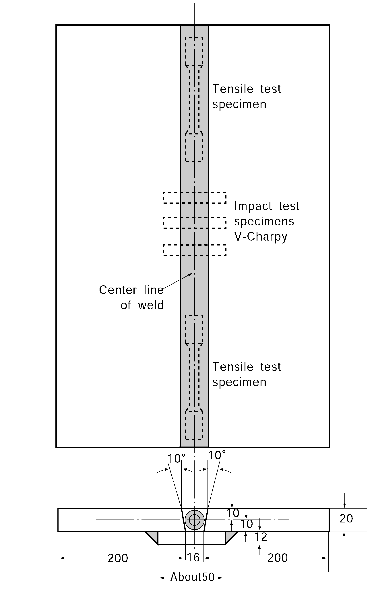
    **Fig 2.2.28 Deposited Metal Test Assembly with Multi-run Technique (Automatic Welding, Unit : mm)**
  - **(3)** *Deposited metal tensile test with multi-run technique*
  - **(4)** *Deposited metal impact test with multi-run technique*

    **Table 2.2.40 Tensile and Impact Test Requirements for Deposited Metal test** ***(2017) (2021)***

    | Grade of welding material | Tensile strength ($\mathrm{N}/mm ^{2}$) | Yield strength ($\mathrm{N}/mm ^{2}$) | Elongation (%) | Impact test |   |
    | --- | --- | --- | --- | --- | --- |
    | Grade of welding material | Tensile strength ($\mathrm{N}/mm ^{2}$) | Yield strength ($\mathrm{N}/mm ^{2}$) | Elongation (%) | Test temp. (℃) | Average absorbed energy (*J*) |
    | 1 | 400 ∼ 560 | 305 min. | 22 min. | 20 | 34 min. |
    | 2 | 400 ∼ 560 | 305 min. | 22 min. | 0 | 34 min. |
    | 3 | 400 ∼ 560 | 305 min. | 22 min. | -20 | 34 min. |
    | 1*Y* | 490 ∼ 660 | 375 min. | 22 min. | 20 | 34 min. |
    | 2*Y* | 490 ∼ 660 | 375 min. | 22 min. | 0 | 34 min. |
    | 3*Y* | 490 ∼ 660 | 375 min. | 22 min. | -20 | 34 min. |
    | 4*Y* | 490 ∼ 660 | 375 min. | 22 min. | -40 | 34 min. |
    | 5*Y* | 490 ∼ 660 | 375 min. | 22 min. | -60 | 34 min. |
    | 2*Y*40 | 510 ∼ 690 | 400 min. | 22 min. | 0 | 39 min. |
    | 3*Y*40 | 510 ∼ 690 | 400 min. | 22 min. | -20 | 39 min. |
    | 4*Y*40 | 510 ∼ 690 | 400 min. | 22 min. | -40 | 39 min. |
    | 5*Y*40 | 510 ∼ 690 | 400 min. | 22 min. | -60 | 39 min. |
    | 3*Y*47 | 570 ∼ 720 | 460 min. | 19 min. | -20 | 64 min. |
    | *L* 1 | 400 ∼ 560 | 305 min. | 22 min. | -40 | 27 min. |
    | *L* 2 | 440 ∼ 610 | 345 min. | 22 min. | -60 | 27 min. |
    | *L* 3 | 490 ∼ 660 | 375 min. | 21 min. | -60 | 27 min. |
    | *L* 51 | 530 min. | 375 min.(1) | 25 min. | -120 | 27 min. |
    | *L* 91 | 590 min. | 375 min.(1) | 25 min. | -196 | 27 min. |
    | NOTE: (1) 0.2 % yield stress |   |   |   |   |   |
- **5.** **Butt weld test with multi-run technique**
  - **(1)** *Welding of butt weld test assemblies with multi-run technique*
  - **(2)** *Butt weld tensile test with multi-run technique*
  - **(3)** *Butt weld bend test with multi-run technique*
    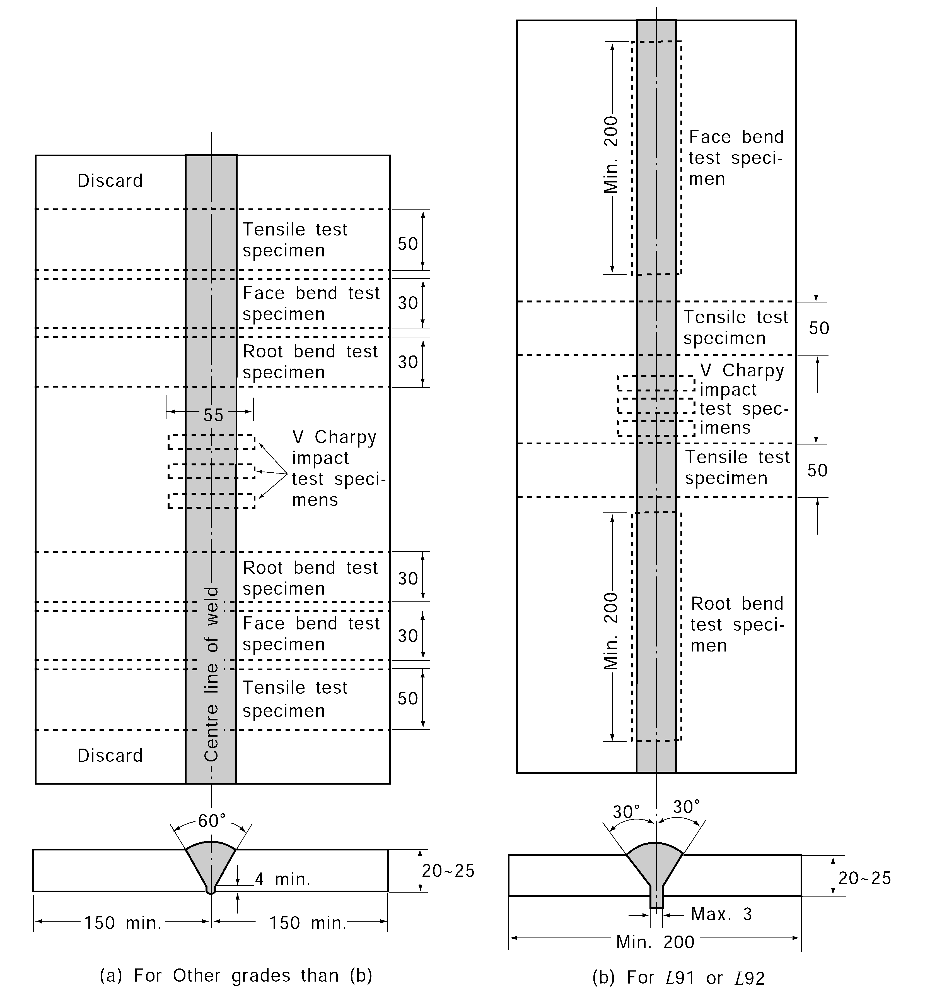
    **Fig 2.2.29 Butt Weld Test Assembly with Multi-run Technique (Automatic welding, Unit : mm)**

    **Table 2.2.41 Tensile and Impact Test Requirements for butt weld test with multi-run technique** ***(2017) (2021)***

    | Grade of welding material | Tensile strength($\mathrm{N}/mm ^{2}$) | Impact test |   |
    | --- | --- | --- | --- |
    | Grade of welding material | Tensile strength($\mathrm{N}/mm ^{2}$) | Test temp. (℃) | Average absorbed energy (J) |
    | 1 | 400 min. | 20 | 34 min. |
    | 2 | 400 min. | 0 | 34 min. |
    | 3 | 400 min. | －20 | 34 min. |
    | 1*Y* | 490 min. | 20 | 34 min. |
    | 2*Y* | 490 min. | 0 | 34 min. |
    | 3*Y* | 490 min. | －20 | 34 min. |
    | 4*Y* | 490 min. | －40 | 34 min. |
    | 5*Y* | 490 min. | －60 | 34 min. |
    | 2*Y*40 | 510 min. | 0 | 39 min. |
    | 3*Y*40 | 510 min. | －20 | 39 min. |
    | 4*Y*40 | 510 min. | －40 | 39 min. |
    | 5*Y*40 | 510 min. | －60 | 39 min. |
    | 3*Y*47 | 570 min. | －20 | 64 min. |
    | *L* 1 | 400 min. | －40 | 27 min. |
    | *L* 2 | 440 min. | －60 | 27 min. |
    | *L* 3 | 490 min. | －60 | 27 min. |
    | *L 5*1 | 530 min. | －120 | 27 min. |
    | *L* 91 | 630 min. | －196 | 27 min. |
  - **(4)** *Butt weld impact test with multi-run technique*
- **6.** **Butt weld test with two-run technique**
  - **(1)** *Welding of Butt weld test assemblies with two-run technique*
  - **(2)** *Chemical analysis*
    The chemical analysis of the weld metal is to be supplied by the manufacturer, and is to include the content of all significant alloying elements.
    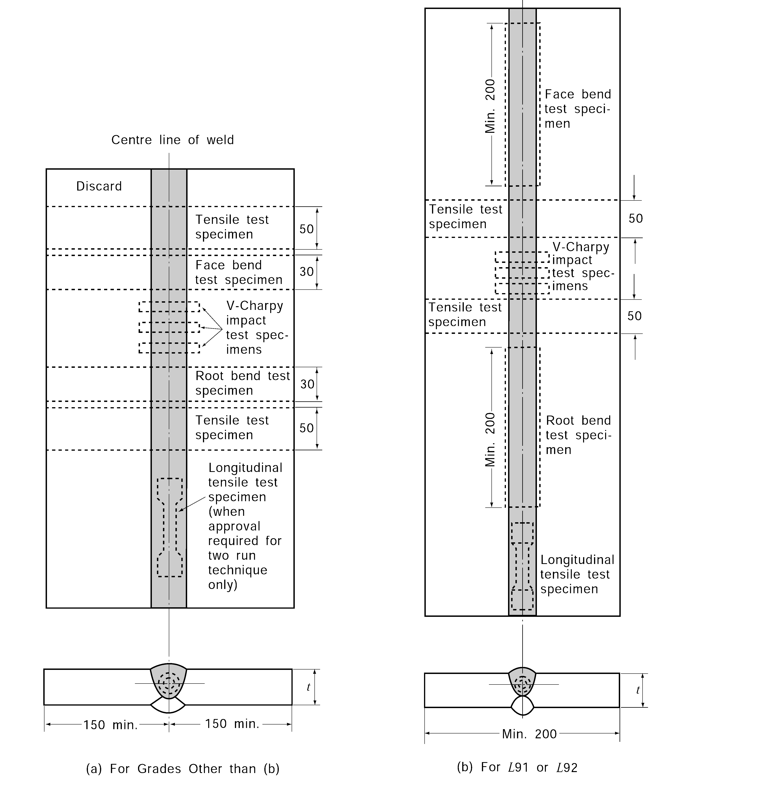
    **Fig 2.2.30 Butt Weld Test Assembly with Two-run Technique (Automatic welding, Unit : mm, t : plate thickness)**
    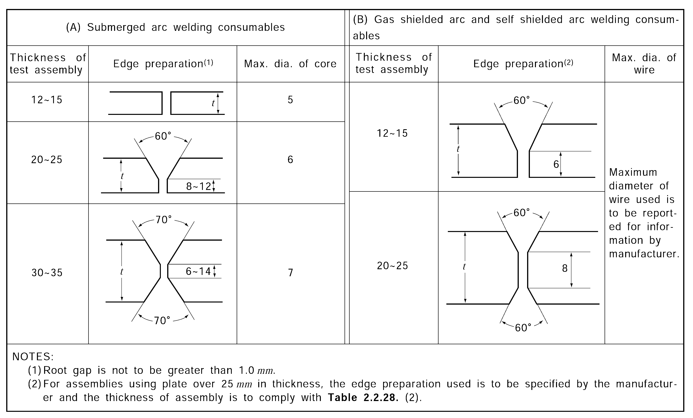
    **Fig 2.2.31 Edge Preparation of Butt Weld Test Assembly with Two-run Technique (t : plate thickness, Unit : mm)**
  - **(3)** *Butt weld tensile tests with two-run technique*
  - **(4)** *Butt weld bend test with two-run technique*
  - **(5)** *Butt weld impact test with two-run technique*
    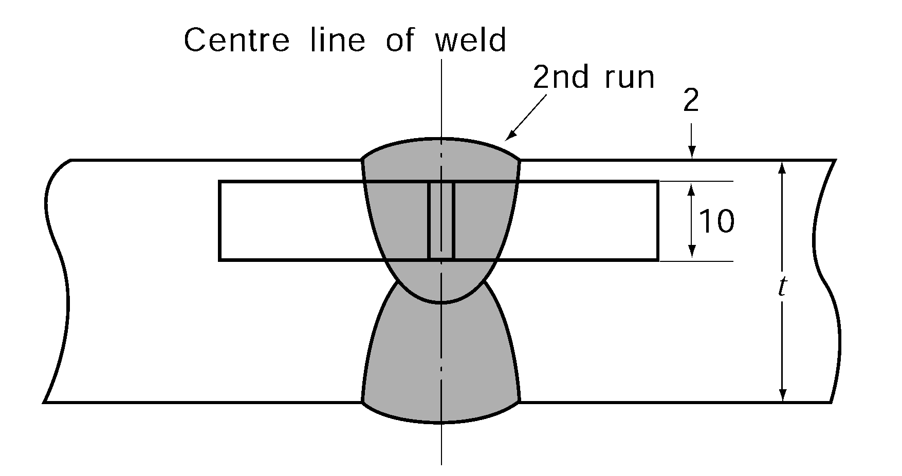
    **Fig 2.2.32 Position of impact Test Specimen for Butt Weld Test Assembly with Two-Run Technique** (Unit : mm, t : plate thickness)
- **7.** **Hydrogen test**
  The hydrogen test is to be in accordance with **602. 6** of the Rules
- **8.** **Annual inspections**
  - **(1)** In the annual inspection, tests specified in the following (2) are to be conducted for each brand of the approved consumables, and they are to be passed satisfactorily.
  - **(2)** The kinds of test, etc. involved in the annual inspections are to be as given in **Table 2.2.42**.
  - **(3)** The welding procedures and requirements for test assemblies of tests specified in the preceding (2) are to be as specified in **Pars 4** through **6**.

    **Table 2.2.42 Kinds of Test for Annual Inspection** ***(2017)*** ***(2021)***

    | Grade of welding consumables | Welding technique^(^1) | Kind of test |   | Test assembly |   |   | Kinds and no. of test specimens taken from test assembly |
    | --- | --- | --- | --- | --- | --- | --- | --- |
    | Grade of welding consumables | Welding technique^(^1) | Kind of test |   | Number | Dimensions | Thickness (mm) | Kinds and no. of test specimens taken from test assembly |
    | 1, 2, 3 1*Y*, 2*Y*, 3*Y*, 4*Y*, 5*Y* 2*Y*40, 3*Y*40, 4*Y*40, 5*Y*40, 3*Y*47 *L*1, *L*2, *L*3, *L*51, *L*91 | Multi-run technique | Deposited metal test |   | 1 | **Fig 2.2.28** | 20 | Tensile test specimen: 1 Impact test specimen: 3 |
    | 1, 2, 3 1*Y*, 2*Y*, 3*Y*, 4*Y*, 5*Y* 2*Y*40, 3*Y*40, 4*Y*40, 5*Y*40, 3*Y*47 *L*1, *L*2, *L*3, *L*51, *L*91 | Two-run technique | Butt weld test | Submerged arc welding | 1 | **Fig 2.2.30** | 20 | Tensile test specimen: 1 Longitudinal tensile test specimen: 1 Face bend test specimen: 1 Root bend test specimen: 1 Impact test specimen: 3 |
    | 1, 2, 3 1*Y*, 2*Y*, 3*Y*, 4*Y*, 5*Y* 2*Y*40, 3*Y*40, 4*Y*40, 5*Y*40, 3*Y*47 *L*1, *L*2, *L*3, *L*51, *L*91 | Two-run technique | Butt weld test | Gas shielded and self shielded arc welding | 1 | **Fig 2.2.30** | 20~25 | Tensile test specimen: 1 Longitudinal tensile test specimen: 1 Face bend test specimen: 1 Root bend test specimen: 1 Impact test specimen: 3 |
    | NOTE: (1) Tests on both multi-run and two run technique are to be conducted for multi-run and two run welding respectively. However, longitudinal tensile test of two run technique are not required. |   |   |   |   |   |   |   |
- **9.** **Changes in grades**
  - **(1)** Where changes in the grades relating to the strength or toughness of automatic welding consumables approved are to be made, tests specified in the following (2), (3) and (4) are to be carried out and satisfactorily passed in accordance with the requirements in **601. 6** (3).
  - **(2)** Changes in grades relating to the strength or toughness of multi-run automatic welding consumables are to be in accordance with the requirements in the following (a) and (b).
  - **(3)** Changes in grades relating to the strength or toughness of two-run automatic welding consumables are to be in accordance with the requirements in the following (a) and (b).
  - **(4)** Changes in the grades relating to the strength or toughness of automatic welding consumables for multi-run and two-run use are to be as specified in the preceding (2) and (3).

#### 604. Semi-automatic welding consumables for normal strength steels, higher strength steels and steels for low temperature service

- **1.** **Application**
  Welding consumables for semi-automatic welding for normal strength steels, higher strength steels and steels for low temperature service given in the following (a) and (b) (hereinafter referred to as "semi-automatic welding consumables") are to be subjected to the approval test and annual inspections in accordance with the requirements in **604.**
- **2.** **Grades and marks**
  - **(1)** The semi-automatic welding consumables are classified as specified in **Table 2.2.43**.

    **Table 2.2.43 Grades and Marks** ***(2017)*** ***(2021)***

    | For normal strength steel | For higher strength steel | For steel for low temperature service |
    | --- | --- | --- |
    | 1, 2, 3 | 1*Y*, 2*Y*, 3*Y*, 4*Y* 5*Y* 2*Y*40, 3*Y*40, 4*Y*40, 5*Y*40, 3*Y*47 | *L*1, *L*2, *L*3, *L*51, *L*91 |
  - **(2)** A suffix "S" will be added after the grade mark to indicate approval for semi-automatic multi-run welding. For wires intended for both semi-automatic and automatic welding, the suffixes will be added in combination.(eg. 3*YSM*)
  - **(3)** A suffix G will be added to the grade marks for semi-automatic welding consumables which use shield gas, and a suffix N will be added for semi-automatic welding consumables which do not use shield gas. Further, the type of shield gas used is to be as specified in **Table 2.2.37,** and the suffix given in **Table 2.2.37** will be added after the suffix G. (e.g. 3*YS G*(*M*1))
  - **(4)** For low hydrogen electrodes, which have passed the hydrogen test specified in **602. 6**, the suffixes given in **Table 2.2.32** are to be added to the end of the grade marks of the said electrode. (e.g. 3*YS H5*)
- **3.** **General provisions for tests**
  - **(1)** Kinds of test, number, thickness and dimensions of test assemblies, diameter of wire used for welding, welding position, grades and number of test specimens to be taken from each test assembly, position for semi-automatic welding consumables used in butt welds or in both butt and fillet welds are to be as given in **Table 2.2.44**.
  - **(2)** Kinds of test, number, thickness and dimensions of test assemblies, diameter of wire used for welding, welding position, grades and number of test specimens to be taken from each test assembly for semi-automatic welding materials used in fillet welds only are to be as given in **Table 2.2.27**.
  - **(3)** Steel plates to be used for test assemblies are to be as given in **Table 2.2.45**, appropriate to the kind of semi-automatic welding consumables.
  - **(4)** For the approval of semi-automatic welding consumables, the test specified in the preceding (1) and (2) are to be conducted for each brand of semi-automatic welding consumables.
  - **(5)** For semi-automatic welding consumables, the test in the preceding (4) is to be performed for each type of gas given in **Table 2.2.37**. When the manufacturer of the material recommends gas types of the group of *M* 1, *M* 2, *M* 3 or C in **Table 2.2.37** and the test is satisfactorily conducted in accordance with the preceding (3) on one of the gas type, the test on the other gas types belonging to the same group is allowed to be dispensed with at the discretion of the Society.
  - **(6)** The welding conditions used such as amperage, voltage, travel speed, etc. are to be within the range recommended by the manufacturer for normal good welding practice. Where a filler metal is stated to be suitable for both alternating current (AC) and direct current (DC), AC is to be used for the preparation of the test assemblies.
  - **(7)** After welding, the test assemblies are not to be subjected to any heat treatment.
  - **(8)** It is recommended that the welded assemblies be subjected to a radiographic examination to ascertain that there are any defects in the weld prior to the preparation of test specimens.

    **Table 2.2.44 Kinds of Test for Semi-automatic Welding Consumables**

    | Kind of test^(^8) | Test assembly |   |   |   |   | Kinds and no. of test specimens taken from test assembly |
    | --- | --- | --- | --- | --- | --- | --- |
    | Kind of test^(^8) | Welding position | Wire diameter (mm) | Number | Dimen- sions | Thickness (mm) | Kinds and no. of test specimens taken from test assembly |
    | Deposited metal test | Flat | maximum diameter | 1^(^1) | **Fig 2.2.22** | 20 | Tensile test specimen: 1 Impact test specimen: 3 |
    | Deposited metal test | Flat | minimum diameter | 1^(^1) | **Fig 2.2.22** | 20 | Tensile test specimen: 1 Impact test specimen: 3 |
    | Butt weld test | Flat | First-run: minimum diameter Remaining-run: maximum diameter^(^4) | 1^(^2) | **Fig 2.2.24** | 15~20 | Tensile test specimen: 1 Face bend test specimen :1 Root bend test specimen: 1 Impact test specimen: 3^(^3) |
    | Butt weld test | Horizontal^(^5) | First-run: minimum diameter Remaining-run: maximum diameter^(^4) | 1 | **Fig 2.2.24** | 15~20 | Tensile test specimen: 1 Face bend test specimen :1 Root bend test specimen: 1 Impact test specimen: 3^(^3) |
    | Butt weld test | Vertical upward | First-run: minimum diameter Remaining-run: maximum diameter^(^4) | 1 | **Fig 2.2.24** | 15~20 | Tensile test specimen: 1 Face bend test specimen :1 Root bend test specimen: 1 Impact test specimen: 3^(^3) |
    | Butt weld test | Vertical downward | First-run: minimum diameter Remaining-run: maximum diameter^(^4) | 1 | **Fig 2.2.24** | 15~20 | Tensile test specimen: 1 Face bend test specimen :1 Root bend test specimen: 1 Impact test specimen: 3^(^3) |
    | Butt weld test | Overhead | First-run: minimum diameter Remaining-run: maximum diameter^(^4) | 1 | **Fig 2.2.24** | 15~20 | Tensile test specimen: 1 Face bend test specimen :1 Root bend test specimen: 1 Impact test specimen: 3^(^3) |
    | Fillet weld test^(^6) | Horizontal | One side: maximum diameter The other side: minimum diameter | 1 | **Fig 2.2.25** | 20 | Macro test specimen: 3^(^7) Hardness test specimen: 3^(^7) Fracture test specimen: 2 |
    | NOTES: (1) Where the core diameter to be manufactured is of single variety, the number of test assembly is to be one. (2) Where tests are conducted solely in the Flat position. one test assembly welded with wire of different diameters is to be added. Where only one diameter is manufactured, only one deposited metal assembly is to be prepared. (3) Impact tests are not required for welding in overhead position. (4) The butt weld assemblies in positions other than downhand, are to be welded using, for the first run, wire of the smallest diameter to be approved, and, for the remaining runs, the largest diameter of wire recommended by the manufacturer for the position concerned. (5) For semi-automatic welding consumables which have passed butt weld tests in the downhand and vertical upward positions, the horizontal butt weld test may be omitted. at the discretion of the Society. (6) This test is to be added solely against welding consumables for use in both butt and fillet weld. (7) The test specimens used in the macro-etching test and hardness test are to be the same. (8) For low hydrogen welding consumables, an hydrogen test may be conducted by the application of the manufacturer, and test assembly is to be as specified in **602. 6** (1). |   |   |   |   |   |   |

    **Table 2.2.45 Grades of Steel for Test Assembly** ***(2017) (2021)***

    | Grade of welding consumables | Grade of steel for test assembly(1)(2) |
    | --- | --- |
    | 1S | *A* |
    | 2S | *A*, *B* or *D* |
    | 3S | *A*, *B*, *D* or *E* |
    | 1*Y*S | *AH* 32 or *AH* 36 |
    | 2*Y*S | *AH* 32, *AH* 36, *DH* 32 or *DH* 36 |
    | 3*Y*S | *AH* 32, *AH* 36, *DH* 32, *DH* 36, *EH* 32 or *EH* 36 |
    | 4*Y*S | *AH* 32, *AH* 36, *DH* 32, *DH* 36, *EH* 32, *EH* 36, *FH* 32 or *FH* 36 |
    | 5*Y*S | *AH* 32, *AH* 36, *DH* 32, *DH* 36, *EH* 32, *EH* 36, *FH* 32 or *FH* 36 |
    | 2*Y*40S | *AH* 40 or *DH* 40 |
    | 3*Y*40S | *AH* 40, *DH* 40 or *EH* 40 |
    | 4*Y*40S | *AH* 40, *DH* 40, *EH* 40 or *FH* 40 |
    | 5*Y*40S | *AH* 40, *DH* 40, *EH* 40 or *FH* 40 |
    | 3*Y*47S | *EH* 47-*H* |
    | *L* 1S | *E or RL* 235*A* |
    | *L* 2S | *E*, *RL* 235*A*, *RL* 235*B*, *RL* 325*A* or *RL* 325*B* |
    | *L* 3S | *RL* 325*A*, *RL* 325*B* or *RL* 355 |
    | *L* 51S | *RL* 5*N*390 |
    | *L* 91S | *RL* 9*N*490 |
    | NOTES; (1) Notwithstanding the requirements in this Table, normal or higher strength steels may be used for deposited metal test assembly. In this case, test assemblies of grade *L* 91 are to be appropriately buttered. (2) The tensile strength of higher strength steels *AH* 32, *DH* 32, *EH* 32 and *FH* 32 used in butt weld test assemblies is to be greater than 490 $\mathrm{N}/mm ^{2}$. |   |
- **4.** **Deposited metal test**
  - **(1)** *Welding of Deposited metal test assemblies*
  - **(2)** *Chemical analysis*
    The chemical analysis of the deposited weld metal in each test assembly is to be supplied by the manufacturer and is to include the content of all significant alloying element.
  - **(3)** *Deposited metal tensile test*

    **Table 2.2.46 Tensile and Impact Test Requirements for Deposited Metal test** ***(2017)*** ***(2021)***

    | Grade of welding consumables | Tensile strength ($\mathrm{N}/mm ^{2}$) | Yield strength ($\mathrm{N}/mm ^{2}$) | Elongation ($\%$) | Impact test |   |
    | --- | --- | --- | --- | --- | --- |
    | Grade of welding consumables | Tensile strength ($\mathrm{N}/mm ^{2}$) | Yield strength ($\mathrm{N}/mm ^{2}$) | Elongation ($\%$) | Test temp. (℃) | Average absorbed energy (J) |
    | 1*S* | 400 ∼ 560 | 305 min. | 22 min. | 20 | 47 min. |
    | 2*S* | 400 ∼ 560 | 305 min. | 22 min. | 0 | 47 min. |
    | 3*S* | 400 ∼ 560 | 305 min. | 22 min. | －20 | 47 min. |
    | 1*YS* | 490 ∼ 660 | 375 min. | 22 min. | 20 | 47 min. |
    | 2*YS* | 490 ∼ 660 | 375 min. | 22 min. | 0 | 47 min. |
    | 3*YS* | 490 ∼ 660 | 375 min. | 22 min. | －20 | 47 min. |
    | 4*YS* | 490 ∼ 660 | 375 min. | 22 min. | －40 | 47 min. |
    | 5*YS* | 490 ∼ 660 | 375 min. | 22 min. | －60 | 47 min. |
    | 2*Y*40*S* | 510 ∼ 690 | 400 min. | 22 min. | 0 | 47 min. |
    | 3*Y*40*S* | 510 ∼ 690 | 400 min. | 22 min. | －20 | 47 min. |
    | 4*Y*40*S* | 510 ∼ 690 | 400 min. | 22 min. | －40 | 47 min. |
    | 5*Y*40*S* | 510 ∼ 690 | 400 min. | 22 min. | －60 | 47 min. |
    | 3*Y*47*S* | 570 ∼ 720 | 460 min. | 19 min. | －20 | 64 min. |
    | *L* 1*S* | 400 ∼ 560 | 305 min. | 22 min. | －40 | 34 min. |
    | *L* 2*S* | 440 ∼ 610 | 345 min. | 22 min. | －60 | 34 min. |
    | *L* 3*S* | 490 ∼ 660 | 375 min. | 21 min. | －60 | 34 min. |
    | *L* 51*S* | 530 min | 375 min.(1) | 25 min. | －120 | 27 min. |
    | *L* 91*S* | 590 min | 375 min.(1) | 25 min. | －196 | 27 min. |
    | NOTE: (1) 0.2 % yield stress |   |   |   |   |   |
  - **(4)** *Deposited metal impact tests*
- **5.** **Butt weld test**
  - **(1)** *Welding of butt weld test assemblies*
  - **(2)** *Butt weld tensile tests*

    **Table 2.2.47 Tensile and Impact Test Requirements for Butt weld test** ***(2017) (2021)***

    | Grade of welding consumables | Tensile strength ($\mathrm{N}/mm ^{2}$) | Impact test |   |   |
    | --- | --- | --- | --- | --- |
    | Grade of welding consumables | Tensile strength ($\mathrm{N}/mm ^{2}$) | Test temp. (℃) | Average absorbed energy (J) |   |
    | Grade of welding consumables | Tensile strength ($\mathrm{N}/mm ^{2}$) | Test temp. (℃) | Flat, Horizontal Overhead | Vertical upward, Vertical downward |
    | 1*S* | 400 min. | 20 | 47 min. | 34 min. |
    | 2*S* | 400 min. | 0 | 47 min. | 34 min. |
    | 3*S* | 400 min. | －20 | 47 min. | 34 min. |
    | 1*YS* | 490 min. | 20 | 47 min. | 34 min. |
    | 2*YS* | 490 min. | 0 | 47 min. | 34 min. |
    | 3*YS* | 490 min. | －20 | 47 min. | 34 min. |
    | 4*YS* | 490 min. | －40 | 47 min. | 34 min. |
    | 5*YS* | 490 min. | －60 | 47 min. | 34 min. |
    | 2*Y*40*S* | 510 min. | 0 | 47 min. | 39 min. |
    | 3*Y*40*S* | 510 min. | －20 | 47 min. | 39 min. |
    | 4*Y*40*S* | 510 min. | －40 | 47 min. | 39 min. |
    | 5*Y*40*S* | 510 min. | －60 | 47 min. | 39 min. |
    | 3*Y*47*S* | 570 min. | －20 | 64 min. | 64 min. |
    | *L* 1*S* | 400 min. | －40 | 27 min. | 27 min. |
    | *L* 2*S* | 440 min. | －60 | 27 min. | 27 min. |
    | *L* 3*S* | 490 min. | －60 | 27 min. | 27 min. |
    | *L* 51*S* | 530 min. | －120 | 27 min. | 27 min. |
    | *L* 91*S* | 630 min. | －196 | 27 min. | 27 min. |
  - **(3)** *Butt weld bend test*
  - **(4)** *Butt weld Impact test*
- **6.** **Fillet weld test assemblies**
  - **(1)** *Welding of fillet weld test assemblies* The test assemblies are to be in accordance with the requirements in **602. 7** (1).
  - **(2)** *Fillet weld macro-structure test* The macro-structure test is to be correspondingly in accordance with the requirements in **602. 7** (2).
  - **(3)** *Fillet weld hardness test* The hardness test is to be correspondingly in accordance with the requirements in **602. 7** (3).
  - **(4)** *Fillet weld fracture test* The fracture test is to be correspondingly in accordance with the requirements in **602. 7** (4).
- **7.** **Hydrogen test**
  Flux-cored or flux-coated wires which have satisfied the requirements for Grades 2*S*, 2*YS*, 2*Y*40*S*, 3*S*, 3*YS*, 3*Y*40*S*, 4*YS* or 4*Y*40*S* may, at manufacturer's option, be submitted to the hydrogen test as detailed in **602. 6** using the manufacturer's recommended welding conditions and adjusting the deposition rate to give a weight of weld deposit per sample similar to that deposited when using manual electrodes.
- **8.** **Annual inspections**
  - **(1)** In the annual inspections, tests specified in the following (2) are to be conducted for each brand of the approved consumables, and they are to be passed satisfactorily.
  - **(2)** The kinds of test, etc. in the annual inspection are to be as given in **Table 2.2.48**.

    **Table 2.2.48 Kind of Test for Annual Inspection**

    | Kind of test | Test assembly |   |   |   |   | Kind and no. of test specimens taken from test assembly |
    | --- | --- | --- | --- | --- | --- | --- |
    | Kind of test | Welding position | Diameter of wire (mm) | Number | Dimension | Thickness (mm) | Kind and no. of test specimens taken from test assembly |
    | Deposited metal test | Flat | (1) | 1 | **Fig 2.2.22** | 20 | Tensile test specimen : 1 Impact test specimen : 3 |
    | NOTE: (1) The diameters of the wire are to be within the range specified by the manufacturers. |   |   |   |   |   |   |
  - **(3)** The welding procedures and requirements for test assemblies of tests specified in the preceding (2) are to be as specified in **Par 4.**
- **9.** **Changes in grades**
  - **(1)** Where changes in the grades relating to the strength or toughness or hydrogen of welding consumables approved are to be made, tests specified in the following (2), (3) and (4) are to be carried out and satisfactorily passed in accordance with the requirements in **601. 6** (3). *(2017)*
  - **(2)** For changes in the grades relating to strength, the butt weld tests, specified in the annual inspection of **Par 8** and in the requirements of **Par 3** (1), are to be conducted.
  - **(3)** For changes in the grades relating to toughness, the butt weld impact tests, specified in the annual inspection of **Par 8** and in the requirements of **Par 3** (1), are to be conducted.
  - **(4)** For uprating of hydrogen, the hydrogen test, specified in the annual inspection of **Par 8** and in the requirements of **Par 3** (1), are to be conducted. *(2017)*

#### 605. Electro-slag and electro-gas welding consumables

- **1.** **Application**
  Electro-slag and electro-gas welding consumables for normal strength and higher strength steels (hereinafter referred to as "welding consumables") are to be in accordance with the requirements in 605.
- **2.** **Grades and marks**
  Welding consumables are classified as specified in **Table 2.2.49**.

  **Table 2.2.49 Grades and Marks** ***(2021)***

  | For normal strength steel | For higher strength steel |
  | --- | --- |
  | 1*V*, 2*V*, 3*V* | 1*YV*, 2*YV*, 3*YV*, 4*YV*, 5*YV* 2*Y*40*V*, 3*Y*40*V*, 4*Y*40*V*, 5*Y*40*V, 3Y*47*V* |
- **3.** **General provisions for tests**
  - **(1)** Kinds of test, number, thickness and dimensions of test assemblies, grades and number of test specimens to be taken from each test assembly for welding consumables are to be as given in **Table 2.2.50**.

    **Table 2.2.50 Kinds of Test for Electro-Slag and Electro-Gas Welding Consumables**

    | Kind of test | Test assembly^(^1) |   |   | Kinds and no. of test specimens taken from test assembly |
    | --- | --- | --- | --- | --- |
    | Kind of test | Number | Dimensions | Thickness (mm)^(^2) | Kinds and no. of test specimens taken from test assembly |
    | Butt weld test | 1 | **Fig 2.2.33** | 20 ~ 25 | Tensile test specimen: 2 Longitudinal tensile test specimen: 2 Side bend test specimen: 2 Impact test specimen: 6 Macro structure test specimen: 2 |
    | Butt weld test | 1 | **Fig 2.2.33** | 35 ~ 40 | Tensile test specimen: 2 Longitudinal tensile test specimen: 2 Side bend test specimen: 2 Impact test specimen: 6 Macro structure test specimen: 2 |
    | NOTE: (1) Where approval is requested for welding of both normal strength and higher strength steel two assemblies are to be prepared using higher strength steel. Two assemblies prepared using normal strength steel may also be required at the discretion of the Society. (2) Where thickness is restricted by welding process, thickness of test assemblies may be changed upon approval of the Society. In this case, the maximum test thickness is to be taken as the maximum applicable thickness. |   |   |   |   |
  - **(2)** Steel plates to be used for test assemblies are to be as given in **Table 2.2.51**, appropriate to the kind of welding consumables.
  - **(3)** For the approval of welding consumables, the tests specified in the preceding (1) are to be conducted for each brand of welding consumables.
  - **(4)** The welding conditions used such as amperage, voltage, travel speed, etc. are to be within the range recommended by the manufacturer for normal good welding practice. Where a filler metal is stated to be suitable for both alternating current (AC) and direct current (DC), AC is to be used for the preparation of the test assemblies.
  - **(5)** After welding, the test assemblies are not to be subjected to any heat treatment.
  - **(6)** It is recommended that the welded assemblies be subjected to a radiographic examination to ascertain that there are any defects in the weld prior to the preparation of test specimens.

    **Table 2.2.51 Grades of Steel used for Test Assembly** ***(2021)***

    | Grade of welding material | Grade of steel used for test assembly(1)(2) |
    | --- | --- |
    | 1*V* | *A* |
    | 2*V* | *A*, *B* or *D* |
    | 3*V* | *A*, *B*, *D* or *E* |
    | 1*YV* | *AH* 32 or *AH* 36 |
    | 2*YV* | *AH* 32, *AH* 36, *DH* 32 or *DH* 36 |
    | 3*YV* | *AH* 32, *AH* 36, *DH* 32, *DH* 36, *EH* 32 or *EH* 36 |
    | 4*YV* | *AH* 32, *AH* 36, *DH* 32, *DH* 36, *EH* 32, *EH* 36, *FH* 32 or *FH* 36 |
    | 5*YV* | *AH* 32, *AH* 36, *DH* 32, *DH* 36, *EH* 32, *EH* 36, *FH* 32 or *FH* 36 |
    | 2*Y*40*V* | *AH* 40 or *DH* 40 |
    | 3*Y*40*V* | *AH* 40, *DH* 40 or *EH* 40 |
    | 4*Y*40*V* | *AH* 40, *DH* 40, *EH* 40 or *FH* 40 |
    | 5*Y*40*V* | *AH* 40, *DH* 40, *EH* 40 or *FH* 40 |
    | 3*Y*47*V* | *EH* 47-*H* |
    | NOTE: (1) The tensile strength of higher strength steels of *AH* 32, *DH* 32, *EH* 32 and *FH* 32 used in the test assemblies is to be greater than 490 $\mathrm{N}/mm ^{2}$. (2) This is in respect of the content of grain refining elements, and if general approval is required, a niobium treated steel is to be used for the approval tests. |   |
- **4.** **Butt weld test**
  - **(1)** *Welding of butt weld test assemblies*
    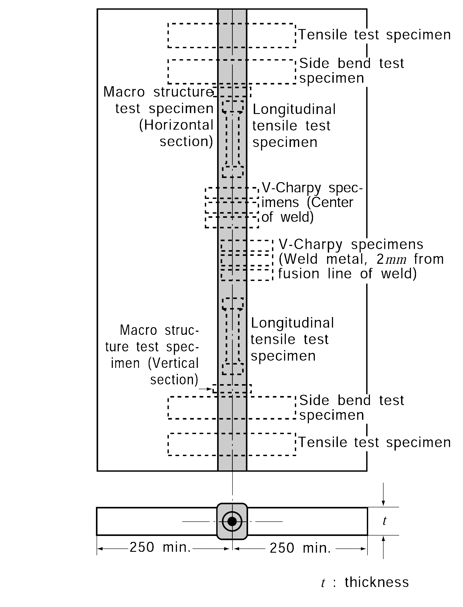
    **Fig 2.2.33 Butt Weld Assembly (Electro-slag and electrode-gas welding, Unit : mm)**
  - **(2)** *Tensile test*

    **Table 2.2.52 Tensile and Impact Test Requirements for Butt weld test** ***(2021)***

    | Grade of welding consumables | Tensile strength ($\mathrm{N}/mm ^{2}$) | Longitudinal Tensile Test |   |   | Impact test |   |
    | --- | --- | --- | --- | --- | --- | --- |
    | Grade of welding consumables | Tensile strength ($\mathrm{N}/mm ^{2}$) | Tensile strength ($\mathrm{N}/mm ^{2}$) | Yield strength ($\mathrm{N}/mm ^{2}$) | Elongation ($\%$) | Test temp. (℃) | Average absorbed energy (J) |
    | 1*V* | 400 min. | 400 ∼ 560 | 305 min. | 22 min. | 20 | 34 min. |
    | 2*V* | 400 min. | 400 ∼ 560 | 305 min. | 22 min. | 0 | 34 min. |
    | 3*V* | 400 min. | 400 ∼ 560 | 305 min. | 22 min. | -20 | 34 min. |
    | 1*YV* | 490 min. | 490 ∼ 660 | 375 min. | 22 min. | 20 | 34 min. |
    | 2*YV* | 490 min. | 490 ∼ 660 | 375 min. | 22 min. | 0 | 34 min. |
    | 3*YV* | 490 min. | 490 ∼ 660 | 375 min. | 22 min. | -20 | 34 min. |
    | 4*YV* | 490 min. | 490 ∼ 660 | 375 min. | 22 min. | -40 | 34 min. |
    | 5*YV* | 490 min. | 490 ∼ 660 | 375 min. | 22 min. | -60 | 34 min. |
    | 2*Y*40*V* | 510 min. | 510 ∼ 690 | 400 min. | 22 min. | 0 | 39 min. |
    | 3*Y*40*V* | 510 min. | 510 ∼ 690 | 400 min. | 22 min. | -20 | 39 min. |
    | 4*Y*40*V* | 510 min. | 510 ∼ 690 | 400 min. | 22 min. | -40 | 39 min. |
    | 5*Y*40*V* | 510 min. | 510 ∼ 690 | 400 min. | 22 min. | -60 | 39 min. |
    | 3*Y*47*V* | 570 min. | 570 ∼ 720 | 460 min. | 19 min. | -20 | 64 min. |
  - **(3)** *Bend test*
  - **(4)** *Impact test*
    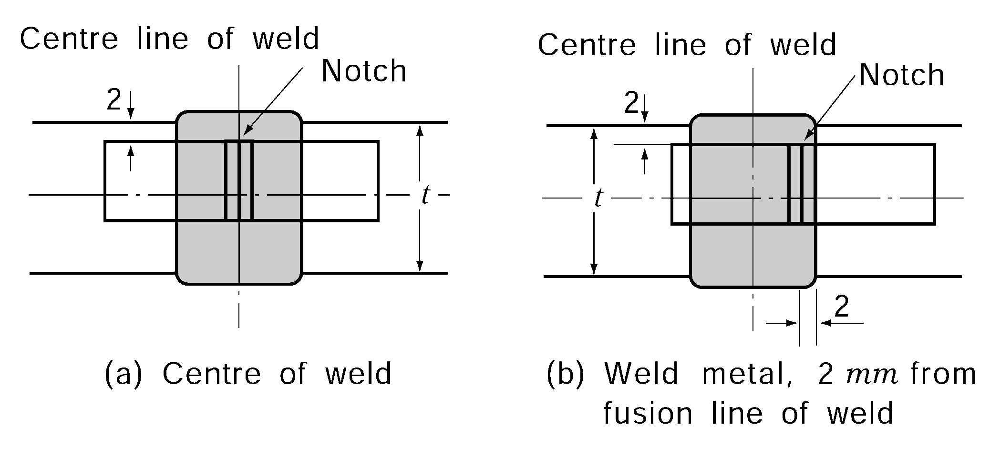
    **Fig 2.2.34 Position of Impact Specimen** (Unit : mm, t = Plate thickness)
  - **(5)** *Macro-structure test*
- **5.** **Annual inspections**
  - **(1)** In the annual inspection, tests specified in the following (2) are to be conducted for each brand of the approved materials, and they are to be passed satisfactorily.
  - **(2)** The kinds of test, etc. in the annual inspections are to be as given in **Table 2.2.53**.
  - **(3)** The welding procedures and requirements for test assemblies of tests specified in the preceding (2) are to be as specified in **Par 4.**

    **Table 2.2.53 Kind of Test for Annual Inspection**

    | Kind of test | Test assembly |   |   | Kinds and no. of test specimens taken from test assembly |
    | --- | --- | --- | --- | --- |
    | Kind of test | Number | Dimensions | Thickness (mm)^(^1) | Kinds and no. of test specimens taken from test assembly |
    | Butt weld test | 1 | **Fig 2.2.33** | 20 ~ 25 | Tensile test specimen: 1 Longitudinal Tensile test specimen: 1 Side bend test specimen: 2 Impact test specimen: 6^(^1) |
    | NOTE: (1) One set of three impact test specimens may be taken from the centre of welded part. where approved by the Society. |   |   |   |   |
- **6.** **Changes in grades**
  Where changes in the grades relating to the strength or toughness of welding consumables approved are to be made, tests specified in **Par 3** (1) are to be conducted and satisfactorily passed in accordance with the requirements in **601. 6** (3).

#### 606. One side welding consumables for normal strength steels, higher strength steels and steels for low temperature service.

- **1.** **Application**
  - **(1)** Welding consumables for normal strength steels, higher strength steels and steels for low temperature service given in the following (a) through (c) (hereinafter referred to as "one side automatic welding consumables") are to be subjected to the approval tests and annual inspections in accordance with the requirements in **606**.
  - **(2)** Approval tests and annual inspections of one side covered electrodes for normal strength steels, higher strength steels and steels for low temperature service, and one side semi-automatic welding consumables are to be as deemed appropriate by the Society. **【See Guidance】**
  - **(3)** Approval tests and annual inspections for one side automatic welding consumables of muitiple electrodes are to be as deemed appropriate by the Society. **【See Guidance】**
- **2.** **Grades and marks**
  - **(1)** One side automatic welding consumables are classified as specified in **603. 2.** Further, one side automatic welding consumables which have passed the tests for each welding procedure given in **Table 2.2.55** are to be appended with the suffixes given in **Table 2.2.54** at the end of their marks.
  - **(2)** In the preceding (1), a suffix G will be added to the grade mark for gas shielded arc one side automatic welding consumables, and a suffix N will be added for self-shielded wire one side automatic welding consumables. Further, the type of gas used is to be as specified in **Table 2.2.37** and the suffix given in **Table 2.2.37** will be added after the suffix G. (e.g. 3*Y SMR G*(*M*1))

    **Table 2.2.54 Marks**

    | Welding technique^(^1) | Marks |
    | --- | --- |
    | One-run technique | *SR* |
    | Multi-run technique | *MR* |
    | One-run and multi-run technique | *SMR* |
    | NOTE: (1) One-run or multi-run technique refers to a welding process which performed in one pass or multiple passes respectively regardless of the number of electrodes. |   |
- **3.** **General provisions for tests**
  - **(1)** Kinds of test, number, thickness and dimensions of test assemblies, grades and number of test specimens to be taken from each test assembly for one side automatic welding consumables are to be as given in **Table 2.2.55**.
  - **(2)** Steel plates to be used for test assemblies are to be as given in **Table 2.2.56**.
  - **(3)** For the approval of one side automatic welding consumables, the tests specified in the preceding (1) are to be conducted for each brand of one side automatic welding consumables.
  - **(4)** For gas shield arc one side automatic welding consumables, the test in the preceding (3) is to be performed for each type of gas given in **Table 2.2.37**. When the manufacturer of the material recommends gas types of the group of *M*1, *M*2, *M*3 or *C* in **Table 2.2.37** and the test is satisfactorily conducted in accordance with the preceding (3) on one of the gas type, the test on the other gas types belonging to the same group is allowed to be dispensed with at the discretion of the Society.

    **Table 2.2.55 Kinds of Test for One-side Automatic Welding Consumables** ***(2017) (2021)***

    | Grade of welding consumables | Welding technique | Kind of test^(^4) | Test assembly |   |   | Kind and number of test specimens taken from test assembly |
    | --- | --- | --- | --- | --- | --- | --- |
    | Grade of welding consumables | Welding technique | Kind of test^(^4) | Number | Thickness (mm)^(^1) | Dimension | Kind and number of test specimens taken from test assembly |
    | 1, 2, 3, 1*Y*, 2*Y*, 3*Y*, 4*Y*, 5*Y*, 2*Y*40, 3*Y*40, 4*Y*40, 5*Y*40, 3*Y*47 *L*1, *L*2, *L*3, *L*51, *L*91 | One-run technique | Butt weld test | 1 | 12 ~ 15 | **Fig 2.2.35** | Tensile test specimen: 2 Longitudinal tensile test specimen: 1 Face bend specimen: 1 Root bend specimen: 1 Impact test specimen: 6 Macro-structure test specimen: 1 |
    | 1, 2, 3, 1*Y*, 2*Y*, 3*Y*, 4*Y*, 5*Y*, 2*Y*40, 3*Y*40, 4*Y*40, 5*Y*40, 3*Y*47 *L*1, *L*2, *L*3, *L*51, *L*91 | One-run technique | Butt weld test | 1 | Maximum thickness | **Fig 2.2.35** | Tensile test specimen: 2 Longitudinal tensile test specimen: 1 Face bend specimen: 1 Root bend specimen: 1 Impact test specimen: 6 Macro-structure test specimen: 1 |
    | 1, 2, 3, 1*Y*, 2*Y*, 3*Y*, 4*Y*, 5*Y*, 2*Y*40, 3*Y*40, 4*Y*40, 5*Y*40, 3*Y*47 *L*1, *L*2, *L*3, *L*51, *L*91 | Multi-run technique | Butt weld test | 1 | 15 ~ 25 | **Fig 2.2.35** | Tensile test specimen: 2 Longitudinal tensile test specimen: 1 Face bend specimen :1 Root bend Specimen: 1 Impact test specimen: 6 Macro-structure test specimen: 1 |
    | 1, 2, 3, 1*Y*, 2*Y*, 3*Y*, 4*Y*, 5*Y*, 2*Y*40, 3*Y*40, 4*Y*40, 5*Y*40, 3*Y*47 *L*1, *L*2, *L*3, *L*51, *L*91 | Multi-run technique | Butt weld test | 1 | 35 | **Fig 2.2.35** | Tensile test specimen: 2 Longitudinal tensile test specimen: 1 Face bend specimen :1 Root bend Specimen: 1 Impact test specimen: 6 Macro-structure test specimen: 1 |
    | 1, 2, 3, 1*Y*, 2*Y*, 3*Y*, 4*Y*, 5*Y*, 2*Y*40, 3*Y*40, 4*Y*40, 5*Y*40, 3*Y*47 *L*1, *L*2, *L*3, *L*51, *L*91 | One-run and Multi-run technique | Butt weld test | 1 | Maximum thickness^(^2) | **Fig 2.2.35** | Tensile test specimen: 2 Longitudinal tensile test specimen: 1 Face bend specimen: 1 Root bend specimen: 1 Impact test specimen: 6 Macro-structure test specimen: 1 |
    | 1, 2, 3, 1*Y*, 2*Y*, 3*Y*, 4*Y*, 5*Y*, 2*Y*40, 3*Y*40, 4*Y*40, 5*Y*40, 3*Y*47 *L*1, *L*2, *L*3, *L*51, *L*91 | One-run and Multi-run technique | Butt weld test | 1 | 35^(^3) | **Fig 2.2.35** | Tensile test specimen: 2 Longitudinal tensile test specimen: 1 Face bend specimen: 1 Root bend specimen: 1 Impact test specimen: 6 Macro-structure test specimen: 1 |
    | NOTES: (1) Where thickness is restricted by welding process, thickness of test assemblies may be changed upon approval of the Society. In this case, the maximum test thickness is to be taken as the maximum applicable thickness. (2) Thickness of test assembly for one run technique. (3) Thickness of test assembly for multi-run technique. (4) The hydrogen test may be carried out according to the manufacturer's request. |   |   |   |   |   |   |

    **Table 2.2.56 Grades of Steel used for Test Assembly** ***(2017) (2021)***

    | Grade of welding consumables | Grade of steel used for test assembly(1) |
    | --- | --- |
    | 1 | *A* |
    | 2 | *A*, *B* or *D* |
    | 3 | *A*, *B*, *D* or *E* |
    | 1*Y* | *AH* 32 or *AH* 36 |
    | 2*Y* | *AH* 32, *AH* 36, *DH* 32 or *DH* 36 |
    | 3*Y* | *AH* 32, *AH* 36, *DH* 32, *DH* 36, *EH* 32 or *EH* 36 |
    | 4*Y* | *AH* 32, *AH* 36, *DH* 32, *DH* 36, *EH* 32, *EH* 36, *FH* 32 or *FH* 36 |
    | 5*Y* | *AH* 32, *AH* 36, *DH* 32, *DH* 36, *EH* 32, *EH* 36, *FH* 32 or *FH* 36 |
    | 2*Y*40 | *AH* 40 or *DH* 40 |
    | 3*Y*40 | *AH* 40, *DH* 40 or *EH* 40 |
    | 4*Y*40 | *AH* 40, *DH* 40, *EH* 40 or *FH* 40 |
    | 5*Y*40 | *AH* 40, *DH* 40, *EH* 40 or *FH* 40 |
    | 3*Y*47 | *EH* 47-*H* |
    | *L* 1 | *E or RL* 235*A* |
    | *L* 2 | *E*, *RL* 235*A*, *RL* 235*B*, *RL* 325*A* or *RL* 325*B* |
    | *L* 3 | *RL* 325*A*, *RL* 325*B* or *RL* 355 |
    | *L* 51 | *RL* 5*N*390 |
    | *L* 91 | *RL* 9*N*490 |
    | NOTE: (1) The tensile strength of higher strength steels *AH* 32, *DH* 32, *EH* 32 and *FH* 32 used in the test assemblies is to be greater than 490 $\mathrm{N}/mm ^{2}$ |   |
  - **(5)** The combination of one side automatic welding materials are classified as given in **Table 2.2.57**, appropriate to the welding procedure.

    **Table 2.2.57 Combinations of One Side Automatic Welding Consumables**

    | Welding technique | Combinations of welding consumables |
    | --- | --- |
    | Submerged one side automatic welding | Wire + Flux + Iron powder + Backing |
    | Gas shielded arc one side automatic welding | Wire + Gas + Iron powder + Backing |
    | Self-shielded arc one side automatic welding | Wire + Iron powder + Backing |
    | NOTE: Where iron powder is not used, iron powder is excluded in this Table. |   |
  - **(6)** The welding conditions used such as amperage, voltage, travel speed, etc. are to be within the range recommended by the manufacturer for normal good welding practice. Where a filler metal is stated to be suitable for both alternating current (AC) and direct current (DC), AC is to be used for the preparation of the test assemblies.
  - **(7)** After welding, the test assemblies are not to be subjected to any heat treatment.
  - **(8)** It is recommended that the welded assemblies be subjected to a radiographic examination to ascertain that there are any defects in the weld prior to the preparation of test specimens.
- **4.** **Butt weld test assemblies with one-run and multi-run technique**
  - **(1)** *Welding of butt weld test assemblies with one-run and multi-run technique*
    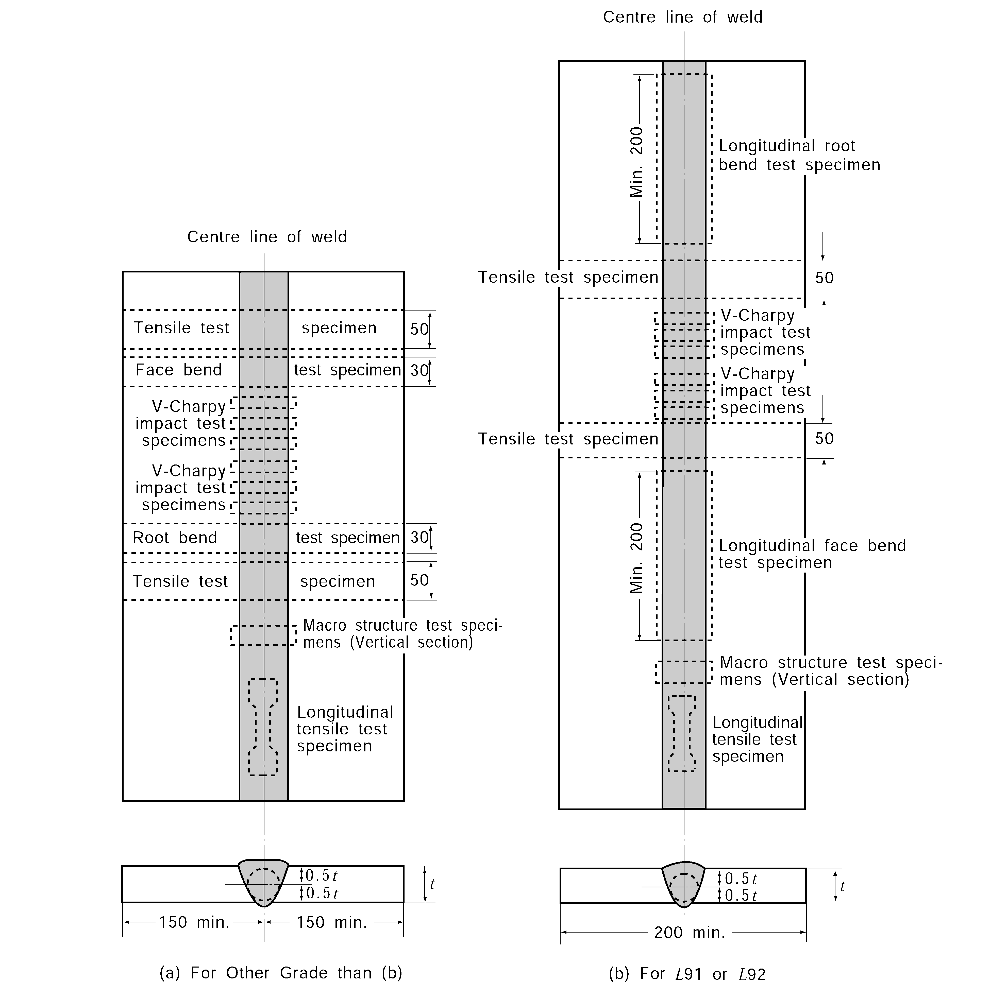
    **Fig 2.2.35 Butt Weld Test Assembly with One-run and Multi-run Technique (Unit : mm, t= Plate thickness)**
  - **(2)** *Butt weld tensile test with one-run and multi-run technique*
    The longitudinal axis of test specimen coincides with the centre of weld and the mid-thickness of plate.
  - **(3)** *Butt weld bend test with one-run and multi-run technique* The bend tests are to comply with the requirements in **603. 6. (4).**
  - **(4)** *Butt weld impact test with one-run and multi-run technique*
    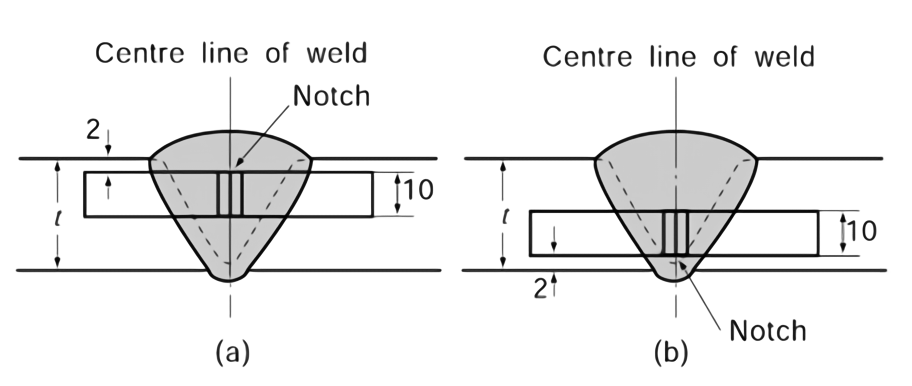
    **Fig 2.2.36 Position of Impact Test Specimen for Butt Weld with One-run and Multi-run Technique (Unit : mm, t = Plate thickness)**
  - **(5)** *Butt weld macro-structure test with one-run and multirun technique*
- **5.** **Hydrogen test**
  The hydrogen test is to be in accordance with **602. 6** of the Rules
- **6.** **Annual inspections**
  - **(1)** In the annual inspection, tests specified in the following (2) are to be conducted for each brand of the approved consumables, and they are to be passed satisfactorily.
  - **(2)** The kinds of test, etc. in the annual inspection are to be as given in **Table 2.2.58**.

    **Table 2.2.58 Kinds of Test for Annual Inspection** ***(2017) (2021)***

    | Grade of welding consumables | Welding technique | Kind of test | Test assembly |   |   | Kind and number of test specimens taken from test assembly |
    | --- | --- | --- | --- | --- | --- | --- |
    | Grade of welding consumables | Welding technique | Kind of test | Number | Dimension | Thickness (mm)^(^1) | Kind and number of test specimens taken from test assembly |
    | 1, 2, 3, 1*Y*, 2*Y*, 3*Y*, 4*Y*, 5*Y*, 2*Y*40, 3*Y*40, 4*Y*40, 5*Y*40, 3*Y*47, *L*1, *L*2, *L*3, *L*51, *L*91 | One-run technique | Butt weld test^(^2) | 1 | **Fig 2.2.35** | 20 | Tensile test specimen: 1 Longitudinal tensile test specimen: 1 Face bend specimen: 1 Root bend specimen: 1 Impact test specimen: 3^(^3) |
    | 1, 2, 3, 1*Y*, 2*Y*, 3*Y*, 4*Y*, 5*Y*, 2*Y*40, 3*Y*40, 4*Y*40, 5*Y*40, 3*Y*47, *L*1, *L*2, *L*3, *L*51, *L*91 | Multi-run technique | Butt weld test^(^2) | 1 | **Fig 2.2.35** | 20~25 | Tensile test specimen: 1 Longitudinal tensile test specimen: 1 Face bend specimen: 1 Root bend specimen: 1 Impact test specimen: 3^(^3) |
    | 1, 2, 3, 1*Y*, 2*Y*, 3*Y*, 4*Y*, 5*Y*, 2*Y*40, 3*Y*40, 4*Y*40, 5*Y*40, 3*Y*47, *L*1, *L*2, *L*3, *L*51, *L*91 | One-run and Multi-run technique | Butt weld test^(^2) | 1 | **Fig 2.2.35** | 20~25 | Tensile test specimen: 1 Longitudinal tensile test specimen: 1 Face bend specimen: 1 Root bend specimen: 1 Impact test Specimen: 3^(^3) |
    | NOTES: (1) Where the thickness of test assemblies is changed according to Note (1) of **Table 2.2.55**, the maximum test thickness for approval test is to be applied. (2) The butt weld tests for one-run and multi-run technique are to be carried out by one-run technique. (3) The positions of notch and selection of impact test specimens are to be as given in **F ig 2 .2.36** (b). |   |   |   |   |   |   |
  - **(3)** The welding procedures and requirements of test assemblies for tests in the preceding (2) are to be as specified in **Par 4.**
- **7.** **Changes in grades**
  Where changes in the grades relating to the strength or toughness of one side automatic welding consumables approved are to be made, all the tests specified in **Par 3** (1) are to be carried out and satisfactorily passed in accordance with the requirements in **601. 6** (3).

#### 607. Welding consumables for stainless steel

- **1.** **Application**
  - **(1)** Welding consumables for stainless steels specified in **Ch 1, Sec 3** (hereinafter referred to as "welding consumables") are to be subjected to the approval tests and annual inspections in accordance with the requirements in **607.**
  - **(2)** Welding consumables for duplex stainless steel is to be in accordance with the Guidance in relating to Rules. **【See Guidance】**
- **2.** **Grades and marks**
  - **(1)** Welding consumables are classified as specified in **Table 2.2.59**.
  - **(2)** Submerged arc welding consumables which have passed the tests for each welding process given in **Table 2.2.61** are to be appended with the suffixes shown in **Table 2.2.60** at the end of their marks.
  - **(3)** For flux cored wire semi-automatic welding consumables in the preceding (1), a suffix G will be added to the grade mark for welding consumables which use shield gas, and a suffix N will be added to the grade marks for welding consumables which do not used shield gas. Further, the type of shield gas used is to be as specified in **Table 2.2.37** and the suffix given in **Table 2.2.37** will be added after the suffix G. (e.g. *RW* 308*G* (C))

    **Table 2.2.59 Grades and Marks of Welding Consumables**

    | Electrode for manual arc welding | Material for TIG and MIG welding | Flux cored wire semi-automatic welding | Consumables for submerged welding |
    | --- | --- | --- | --- |
    | *RD* 308 | *RY* 308 | *RW* 308 | *RU* 308 |
    | *RD* 308*L* | *RY* 308*L* | *RW* 308*L* | *RU* 308*L* |
    | *RD* 309 | *RY* 309 | *RW* 309 | *RU* 309 |
    | *RD* 309*L* | *RY* 309*L* | *RW* 309*L* | - |
    | *RD* 309*Mo* | *RY* 309*Mo* | *RW* 309*Mo* | *RU* 309*Mo* |
    | *RD* 309*MoL* | - | *RW* 309*MoL* | - |
    | *RD* 310 | *RY* 310 | *RW* 310 | *RU* 310 |
    | - | *RY* 310*S* | - | - |
    | *RD* 310*Mo* | - | - | - |
    | *RD* 316 | *RY* 316 | *RW* 316 | *RU* 316 |
    | *RD* 316*L* | *RY* 316*L* | *RW* 316*L* | *RU* 316*L* |
    | *RD* 317 | *RY* 317 | *RW* 317 | *RU* 317 |
    | *RD* 317*L* | *RY* 317*L* | *RW* 317*L* | *RU* 317*L* |
    | - | *RY* 321 | - | - |
    | *RD* 347 | *RY* 347 | *RW* 347 | *RU* 347 |

    **Table 2.2.60 Marks**

    | Welding technique | Marks |
    | --- | --- |
    | Multi-run technique | *M* |
    | Two-run technique | *T* |
    | Multi-run and Two-run technique | *TM* |
- **3.** **General provisions for tests**
  - **(1)** Kinds of test, number, thickness and dimensions of test assemblies, diameter of wire used for welding, grades and number of test specimens to be taken from each test assembly in each welding position for welding consumables are to be as given in **Table 2.2.61**. However, additional tests appropriate to steels, such as test on corrosion-resistance test, impact test, macro etching test, etc., except the test given in **Table 2.2.61** may be required where deemed necessary by the Society. **【See Guidance】**
  - **(2)** Steel plates to be used for test assemblies are to be as given in **Table 2.2.62** according to the grades of welding consumables, or other materials recognized by the Society may be used. *(2020)*
  - **(3)** For the approval of welding consumables, the tests specified in the preceding (1) are to be conducted for each brand of welding consumables.
  - **(4)** For flux cored wire semi-automatic welding materials, which use shield gas, the test in the preceding (3) is to be performed for each type of gas given in **Table 2.2.37**. When the manufacturer of the consumables recommends gas types of the group of *M* 1, *M* 2, *M* 3 or C in **Table 2.2.37** and the test is satisfactorily conducted in accordance with the preceding (3) on one of the gas type, the test on the other gas types belonging to the same group is allowed to be dispensed with at the discretion of the Society.
  - **(5)** The welding conditions used such as amperage, voltage, travel speed, etc. are to be within the range recommended by the manufacturer for normal good welding practice. Where a filler metal is stated to be suitable for both alternating current (AC) and direct current (DC), AC is to be used for the preparation of the test assemblies.

    **Table 2.2.61 Kinds of Test of Welding Consumables for Stainless Steel**

    | Kind of welding consumables |   | Kind of test | Test assembly |   |   |   |   | Kind and number of test specimens taken from test assembly |
    | --- | --- | --- | --- | --- | --- | --- | --- | --- |
    | Kind of welding consumables |   | Kind of test | Thick- ness (mm) | No. | Welding position | Dia. of electrode or wire ^(^1) (mm) | Dimen-sion | Kind and number of test specimens taken from test assembly |
    | Electrode for manual arc welding |   | Deposited metal test | 12 | 1 | Flat | 3.2 | **Fig 2.2.37** | Tensile test specimen: 1 |
    | Electrode for manual arc welding |   | Deposited metal test | 20 | 1 | Flat | 4.0 | **Fig 2.2.37** | Tensile test specimen: 1 |
    | Electrode for manual arc welding |   | Butt weld test | 15~20 | 1 | Flat | 3.2 or 4.0 | **Fig 2.2.38** | Tensile test specimen: 1 Face bend Specimen: 1 Root bend specimen: 1 |
    | Electrode for manual arc welding |   | Butt weld test | 15~20 | 1 | Horizontal | 3.2 or 4.0 | **Fig 2.2.38** | Tensile test specimen: 1 Face bend Specimen: 1 Root bend specimen: 1 |
    | Electrode for manual arc welding |   | Butt weld test | 15~20 | 1 | Vertical upward | 3.2 or 4.0 | **Fig 2.2.38** | Tensile test specimen: 1 Face bend Specimen: 1 Root bend specimen: 1 |
    | Electrode for manual arc welding |   | Butt weld test | 15~20 | 1 | Vertical downward | 3.2 or 4.0 | **Fig 2.2.38** | Tensile test specimen: 1 Face bend Specimen: 1 Root bend specimen: 1 |
    | Electrode for manual arc welding |   | Butt weld test | 15~20 | 1 | Overhead | 3.2 or 4.0 | **Fig 2.2.38** | Tensile test specimen: 1 Face bend Specimen: 1 Root bend specimen: 1 |
    | Consumables for TIG welding |   | Deposited metal test | 12 | 1 | Flat | 2.4 | **Fig 2.2.37** | Tensile test specimen: 1 |
    | Consumables for TIG welding |   | Deposited metal test | 20 | 1 | Flat | 3.2 | **Fig 2.2.37** | Tensile test specimen: 1 |
    | Consumables for TIG welding |   | Butt weld test | 15~20 | 1 | Flat | 2.0~3.2 | **Fig 2.2.38** | Tensile test specimen: 1 Face bend specimen: 1 Root bend specimen: 1 |
    | Consumables for TIG welding |   | Butt weld test | 15~20 | 1 | Horizontal | 2.0~3.2 | **Fig 2.2.38** | Tensile test specimen: 1 Face bend specimen: 1 Root bend specimen: 1 |
    | Consumables for TIG welding |   | Butt weld test | 15~20 | 1 | Vertical upward | 2.0~3.2 | **Fig 2.2.38** | Tensile test specimen: 1 Face bend specimen: 1 Root bend specimen: 1 |
    | Consumables for TIG welding |   | Butt weld test | 15~20 | 1 | Vertical downward | 2.0~3.2 | **Fig 2.2.38** | Tensile test specimen: 1 Face bend specimen: 1 Root bend specimen: 1 |
    | Consumables for TIG welding |   | Butt weld test | 15~20 | 1 | Overhead | 2.0~3.2 | **Fig 2.2.38** | Tensile test specimen: 1 Face bend specimen: 1 Root bend specimen: 1 |
    | Consumables for MIG welding |   | Deposited metal test | 12 | 1 | Flat | 1.2 | **Fig 2.2.37** | Tensile test specimen: 1 |
    | Consumables for MIG welding |   | Deposited metal test | 20 | 1 | Flat | 1.6 | **Fig 2.2.37** | Tensile test specimen: 1 |
    | Consumables for MIG welding |   | Butt weld test | 15~20 | 1 | Flat | 1.2~2.0 | **Fig 2.2.38** | Tensile test specimen: 1 Face bend specimen: 1 Root bend specimen: 1 |
    | Consumables for MIG welding |   | Butt weld test | 15~20 | 1 | Horizontal | 1.2~2.0 | **Fig 2.2.38** | Tensile test specimen: 1 Face bend specimen: 1 Root bend specimen: 1 |
    | Consumables for MIG welding |   | Butt weld test | 15~20 | 1 | Vertical upward | 1.2~2.0 | **Fig 2.2.38** | Tensile test specimen: 1 Face bend specimen: 1 Root bend specimen: 1 |
    | Consumables for MIG welding |   | Butt weld test | 15~20 | 1 | Vertical downward | 1.2~2.0 | **Fig 2.2.38** | Tensile test specimen: 1 Face bend specimen: 1 Root bend specimen: 1 |
    | Consumables for MIG welding |   | Butt weld test | 15~20 | 1 | Overhead | 1.2~2.0 | **Fig 2.2.38** | Tensile test specimen: 1 Face bend specimen: 1 Root bend specimen: 1 |
    | Flux cored wire for semi-automatic welding |   | Deposited metal test | 12 | 1 | Flat | 1.2~2.4 | **Fig 2.2.37** | Tensile test specimen: 1 |
    | Flux cored wire for semi-automatic welding |   | Deposited metal test | 20 | 1 | Flat | 3.2 or max. dia | **Fig 2.2.37** | Tensile test specimen: 1 |
    | Flux cored wire for semi-automatic welding |   | Butt weld test | 15~20 | 1 | Flat | 1.2~3.2 | **Fig 2.2.38** | Tensile test specimen: 1 Face bend specimen: 1 Root bend specimen: 1 |
    | Flux cored wire for semi-automatic welding |   | Butt weld test | 15~20 | 1 | Horizontal | 1.2~3.2 | **Fig 2.2.38** | Tensile test specimen: 1 Face bend specimen: 1 Root bend specimen: 1 |
    | Flux cored wire for semi-automatic welding |   | Butt weld test | 15~20 | 1 | Vertical upward | 1.2~3.2 | **Fig 2.2.38** | Tensile test specimen: 1 Face bend specimen: 1 Root bend specimen: 1 |
    | Flux cored wire for semi-automatic welding |   | Butt weld test | 15~20 | 1 | Vertical downward | 1.2~3.2 | **Fig 2.2.38** | Tensile test specimen: 1 Face bend specimen: 1 Root bend specimen: 1 |
    | Flux cored wire for semi-automatic welding |   | Butt weld test | 15~20 | 1 | Overhead | 1.2~3.2 | **Fig 2.2.38** | Tensile test specimen: 1 Face bend specimen: 1 Root bend specimen: 1 |
    | Consum-ables for sub- merged arc welding (2) | Multi-run technique | Deposited metal test | 19~25 | 1 | Flat | 1.2~4.0 | **Fig 2.2.37** | Tensile test specimen: 1 |
    | Consum-ables for sub- merged arc welding (2) | Multi-run technique | Butt weld test | 19 | 1 | Flat | 1.2~4.0 | **Fig 2.2.39** **(a)** | Tensile test specimen: 1 Face bend specimen: 1 Root bend specimen: 1 |
    | Consum-ables for sub- merged arc welding (2) | Two-run technique | Butt weld test | 12 | 1 | Flat | 1.2~2.4 | **Fig 2.2.39** **(b)** | Tensile test specimen: 1 Face bend specimen: 1 Root bend specimen: 1 |
    | Consum-ables for sub- merged arc welding (2) | Two-run technique | Butt weld test | 19 | 1 | Flat | 4.0 | **Fig 2.2.39** **(b)** | Tensile test specimen: 1 Longitudinal tensile test specimen: 1 Face bend specimen: 1 Root bend specimen: 1 |
    | NOTES: (1) Where approved by the Society, the diameter of electrodes or wires may be changed. (2) Tests on both multi-run and two run technique are to be conducted for multi-run and two run welding respectively and the number, dimensions and thickness of test assemblies, along with the grades and number of test specimens selected from each test assembly are to be according to each of the welding processes. However, longitudinal tensile test of two run technique are not required. |   |   |   |   |   |   |   |   |

    **Table 2.2.62 Grades of Steel for Test Assembly**

    | Grade of welding consumables | Grade of steel for test assembly^(^1) |
    | --- | --- |
    | *RD* 308, *RY* 308, *RW* 308, *RU* 308 | *RSTS* 304 |
    | *RD* 308*L*, *RY* 308*L*, *RW* 308*L*, *RU* 308*L* | *RSTS* 304*L* |
    | *RD* 309, *RY* 309, *RW* 309, *RU* 309 | *RSTS* 309*S* |
    | *RD* 309*L*, *RY* 309*L*, *RW* 309*L* | *RSTS* 309*S* |
    | *RD* 309*Mo*, *RY* 309*Mo*, *RW* 309*Mo*, *RU* 309*Mo* | *RSTS* 309*S* |
    | *RD* 309*MoL*, *RW* 309*MoL* | *RSTS* 309*S* |
    | *RD* 310, *RY* 310, *RW* 310, *RU* 310 | *RSTS* 310*S* |
    | *RY* 310*S* | *RSTS* 310*S* |
    | *RD* 310*Mo* | *RSTS* 310*S* |
    | *RD* 316, *RY* 316, *RW* 316, *RU* 316 | *RSTS* 316 |
    | *RD* 316*L*, *RY* 316*L*, *RW* 316*L*, *RU* 316*L* | *RSTS* 316L |
    | *RD* 317, *RY* 317, *RW* 317, *RU* 317 | *RSTS* 317 |
    | *RD* 317*L*, *RY* 317*L*, *RW* 317*L*, *RU* 317*L* | *RSTS* 317, *RSTS* 317*L* |
    | *RY* 321 | *RSTS* 321 |
    | *RD* 347, *RY* 347, *RW* 347, *RU* 347 | *RSTS* 321, *RSTS* 347 |
    | NOTE: (1) Notwithstanding the requirements in this table, mild steel or higher strength steel may be used for deposited metal test assembly. In this case, test assemblies are to be appropriately buttered. |   |
  - **(6)** After welding, the test assemblies are not to be subjected to any heat treatment.
  - **(7)** It is recommended that the welded assemblies be subjected to a radiographic examination to ascertain that there are any defects in the weld prior to the preparation of test specimens.
- **4.** **Deposited metal test**
  - **(1)** *Welding of deposited metal test assemblies*
  - **(2)** *Chemical composition*
  - **(3)** *Deposited metal tensile test*
    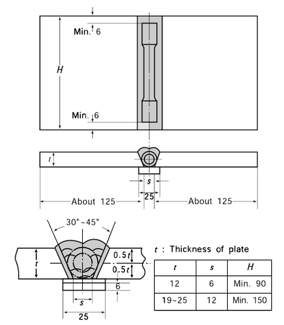
    **Fig 2.2.37 Deposited Metal Test Assembly for Stainless Steel (Unit : mm)**

    **Table 2.2.63 Chemical Composition of Deposited Metal for Electrodes**

    | Grade | Chemical composition (%) |   |   |   |   |   |   |   |   |
    | --- | --- | --- | --- | --- | --- | --- | --- | --- | --- |
    | Grade | C(max.) | Si(max.) | Mn(max.) | P(max.) | S(max.) | Ni | Cr | Mo | Others |
    | *RD* 308 | 0.08 | 0.90 | 2.50 | 0.04 | 0.03 | 9.0 ~ 11.0 | 18.0 ~ 21.0 | － | － |
    | *RD* 308L | 0.04 | 0.90 | 2.50 | 0.04 | 0.03 | 9.0 ~ 12.0 | 18.0 ~ 21.0 | － | － |
    | *RD* 309 | 0.15 | 0.90 | 2.50 | 0.04 | 0.03 | 12.0 ~ 14.0 | 22.0 ~ 25.0 | － | － |
    | *RD* 309*L* | 0.04 | 0.90 | 2.50 | 0.04 | 0.03 | 12.0 ~ 16.0 | 22.0 ~ 25.0 | － | － |
    | *RD* 309*Mo* | 0.12 | 0.90 | 2.50 | 0.04 | 0.03 | 12.0 ~ 14.0 | 22.0 ~ 25.0 | 2.0 ~ 3.0 | － |
    | *RD* 309*MoL* | 0.04 | 0.90 | 2.50 | 0.04 | 0.03 | 12.0 ~ 14.0 | 22.0 ~ 25.0 | 2.0 ~ 3.0 | － |
    | *RD* 310 | 0.20 | 0.75 | 2.50 | 0.03 | 0.03 | 20.0 ~ 22.0 | 25.0 ~ 28.0 | － | － |
    | *RD* 310*Mo* | 0.12 | 0.75 | 2.50 | 0.03 | 0.03 | 20.0 ~ 22.0 | 25.0 ~ 28.0 | 2.0 ~ 3.0 | － |
    | *RD* 316 | 0.08 | 0.90 | 2.50 | 0.04 | 0.03 | 11.0 ~ 14.0 | 17.0 ~ 20.0 | 2.0 ~ 2.75 | － |
    | *RD* 316*L* | 0.04 | 0.90 | 2.50 | 0.04 | 0.03 | 11.0 ~ 16.0 | 17.0 ~ 20.0 | 2.0 ~ 2.75 | － |
    | *RD* 317 | 0.08 | 0.90 | 2.50 | 0.04 | 0.03 | 12.0 ~ 14.0 | 18.0 ~ 21.0 | 3.0 ~ 4.0 | － |
    | *RD* 317*L* | 0.04 | 0.90 | 2.50 | 0.04 | 0.03 | 12.0 ~ 16.0 | 18.0 ~ 21.0 | 3.0 ~ 4.0 | － |
    | *RD* 347 | 0.08 | 0.90 | 2.50 | 0.04 | 0.03 | 9.0 ~ 11.0 | 18.0 ~ 21.0 | － | Nb8×C (%)~1.0 |

    **Table 2.2.64 Chemical Composition of Deposited Metal for TIG Electrodes or MIG Wires**

    | Grade | Chemical composition (%) |   |   |   |   |   |   |   |   |
    | --- | --- | --- | --- | --- | --- | --- | --- | --- | --- |
    | Grade | C(max.) | Si(max.) | Mn | P(max.) | S(max.) | Ni | Cr | Mo | Others |
    | *RY* 308 | 0.08 | 0.65 | 1.0 ~ 2.5 | 0.03 | 0.03 | 9.0 ~ 11.0 | 19.0 ~ 22.0 | － | － |
    | *RY* 308*L* | 0.03 | 0.65 | 1.0 ~ 2.5 | 0.03 | 0.03 | 9.0 ~ 11.0 | 19.0 ~ 22.0 | － | － |
    | *RY* 309 | 0.12 | 0.65 | 1.0 ~ 2.5 | 0.03 | 0.03 | 12.0 ~ 14.0 | 23.0 ~ 25.0 | － | － |
    | *RY* 309*L* | 0.03 | 0.65 | 1.0 ~ 2.5 | 0.03 | 0.03 | 12.0 ~ 14.0 | 23.0 ~ 25.0 | － | － |
    | *RY* 309*Mo* | 0.12 | 0.65 | 1.0 ~ 2.5 | 0.03 | 0.03 | 12.0 ~ 14.0 | 23.0 ~ 25.0 | 2.0 ~ 3.0 | － |
    | *RY* 310 | 0.15 | 0.65 | 1.0 ~ 2.5 | 0.03 | 0.03 | 20.0 ~ 22.5 | 25.0 ~ 28.0 | － | － |
    | *RY* 310*S* | 0.08 | 0.65 | 1.0 ~ 2.5 | 0.03 | 0.03 | 20.0 ~ 22.5 | 25.0 ~ 28.0 | － | － |
    | *RY* 316 | 0.08 | 0.65 | 1.0 ~ 2.5 | 0.03 | 0.03 | 11.0 ~ 14.0 | 18.0 ~ 20.0 | 2.0 ~ 3.0 | － |
    | *RY* 316*L* | 0.03 | 0.65 | 1.0 ~ 2.5 | 0.03 | 0.03 | 11.0 ~ 14.0 | 18.0 ~ 20.0 | 2.0 ~ 3.0 | － |
    | *RY* 317 | 0.08 | 0.65 | 1.0 ~ 2.5 | 0.03 | 0.03 | 13.0 ~ 15.0 | 18.5 ~ 20.5 | 3.0 ~ 4.0 | － |
    | *RY* 317*L* | 0.03 | 0.65 | 1.0 ~ 2.5 | 0.03 | 0.03 | 13.0 ~ 15.0 | 18.5 ~ 20.5 | 3.0 ~ 4.0 | － |
    | *RY* 321 | 0.08 | 0.65 | 1.0 ~ 2.5 | 0.03 | 0.03 | 9.0 ~ 10.5 | 18.5 ~ 20.5 | － | Ti9×C (%) ~ 1.0 |
    | *RY* 347 | 0.08 | 0.65 | 1.0 ~ 2.5 | 0.03 | 0.03 | 9.0 ~ 11.0 | 19.0 ~ 21.5 | － | Nb10×C (%) ~ 1.0 |

    **Table 2.2.65 Chemical Composition of Deposited Metal for Flux Cored Wire Semi-automatic Welding** (a) With Gas

    | Grade | Chemical composition (%) |   |   |   |   |   |   |   |   |
    | --- | --- | --- | --- | --- | --- | --- | --- | --- | --- |
    | Grade | C(max.) | Si(max.) | Mn | P(max.) | S(max.) | Ni | Cr | Mo | Others |
    | *RW* 308 | 0.08 | 1.0 | 0.5 ~ 2.5 | 0.04 | 0.03 | 9.0 ~ 11.0 | 18.0 ~ 21.0 | － | － |
    | *RW* 308*L* | 0.04 | 1.0 | 0.5 ~ 2.5 | 0.04 | 0.03 | 9.0 ~ 12.0 | 18.0 ~ 21.0 | － | － |
    | *RW* 309 | 0.10 | 1.0 | 0.5 ~ 2.5 | 0.04 | 0.03 | 12.0 ~ 14.0 | 22.0 ~ 25.0 | － | － |
    | *RW* 309*L* | 0.04 | 1.0 | 0.5 ~ 2.5 | 0.04 | 0.03 | 12.0 ~ 14.0 | 22.0 ~ 25.0 | － | － |
    | *RW* 309*Mo* | 0.12 | 1.0 | 0.5 ~ 2.5 | 0.04 | 0.03 | 12.0 ~ 14.0 | 22.0 ~ 25.0 | 2.0 ~ 3.0 | － |
    | *RW* 309*MoL* | 0.04 | 1.0 | 0.5 ~ 2.5 | 0.04 | 0.03 | 12.0 ~ 14.0 | 22.0 ~ 25.0 | 2.0 ~ 3.0 | － |
    | *RW* 310 | 0.20 | 1.0 | 0.5 ~ 2.5 | 0.04 | 0.03 | 20.0 ~ 22.0 | 25.0 ~ 28.0 | － | － |
    | *RW* 316 | 0.08 | 1.0 | 0.5 ~ 2.5 | 0.04 | 0.03 | 11.0 ~ 14.0 | 17.0 ~ 20.0 | 2.0 ~ 3.0 | － |
    | *RW* 316*L* | 0.04 | 1.0 | 0.5 ~ 2.5 | 0.04 | 0.03 | 11.0 ~ 14.0 | 17.0 ~ 20.0 | 2.0 ~ 3.0 | － |
    | *RW* 317 | 0.08 | 1.0 | 0.5 ~ 2.5 | 0.04 | 0.03 | 12.0 ~ 14.0 | 18.0 ~ 21.0 | 3.0 ~ 4.0 | － |
    | *RW* 317*L* | 0.04 | 1.0 | 0.5 ~ 2.5 | 0.04 | 0.03 | 12.0 ~ 16.0 | 18.0 ~ 21.0 | 3.0 ~ 4.0 | － |
    | *RW* 347 | 0.08 | 1.0 | 0.5 ~ 2.5 | 0.04 | 0.03 | 9.0 ~ 11.0 | 18.0 ~ 21.0 | － | Nb8×C (%) ~ 1.0 |

    **Table 2.2.65 Chemical Composition of Deposited Metal for Flux Cored Wire Semi-automatic Welding** (b) Without Gas

    | Grade | Chemical composition (%) |   |   |   |   |   |   |   |   |
    | --- | --- | --- | --- | --- | --- | --- | --- | --- | --- |
    | Grade | C(max.) | Si(max.) | Mn | P(max.) | S(max.) | Ni | Cr | Mo | Others |
    | *RW* 308 | 0.08 | 1.0 | 0.5 ~ 2.5 | 0.04 | 0.03 | 9.0 ~ 11.0 | 19.5 ~ 22.0 | － | － |
    | *RW* 308*L* | 0.04 | 1.0 | 0.5 ~ 2.5 | 0.04 | 0.03 | 9.0 ~ 12.0 | 19.5 ~ 22.0 | － | － |
    | *RW* 309 | 0.10 | 1.0 | 0.5 ~ 2.5 | 0.04 | 0.03 | 12.0 ~ 14.0 | 23.0 ~ 25.5 | － | － |
    | *RW* 309*L* | 0.04 | 1.0 | 0.5 ~ 2.5 | 0.04 | 0.03 | 12.0 ~ 14.0 | 23.0 ~ 25.5 | － | － |
    | *RW* 309*Mo* | 0.12 | 1.0 | 0.5 ~ 2.5 | 0.04 | 0.03 | 12.0 ~ 14.0 | 22.0 ~ 25.0 | 2.0 ~ 3.0 | － |
    | *RW* 309*MoL* | 0.04 | 1.0 | 0.5 ~ 2.5 | 0.04 | 0.03 | 12.0 ~ 14.0 | 22.0 ~ 25.0 | 2.0 ~ 3.0 | － |
    | *RW* 310 | 0.20 | 1.0 | 0.5 ~ 2.5 | 0.04 | 0.03 | 20.0 ~ 22.0 | 25.0 ~ 28.0 | － | － |
    | *RW* 316 | 0.08 | 1.0 | 0.5 ~ 2.5 | 0.04 | 0.03 | 11.0 ~ 14.0 | 18.0 ~ 20.5 | 2.0 ~ 3.0 | － |
    | *RW* 316*L* | 0.04 | 1.0 | 0.5 ~ 2.5 | 0.04 | 0.03 | 11.0 ~ 14.0 | 18.0 ~ 20.5 | 2.0 ~ 3.0 | － |
    | *RW* 317 | 0.08 | 1.0 | 0.5 ~ 2.5 | 0.04 | 0.03 | 13.0 ~ 15.0 | 18.5 ~ 21.0 | 3.0 ~ 4.0 | － |
    | *RW* 317*L* | 0.04 | 1.0 | 0.5 ~ 2.5 | 0.04 | 0.03 | 13.0 ~ 15.0 | 18.5 ~ 21.0 | 3.0 ~ 4.0 | － |
    | *RW* 347 | 0.08 | 1.0 | 0.5 ~ 2.5 | 0.04 | 0.03 | 9.0 ~ 11.0 | 19.0 ~ 21.5 | － | Nb8×C (%) ~ 1.0 |

    **Table 2.2.66 Chemical Composition of Deposited Metal for Submerged Arc Welding**

    | Grade | Chemical composition (%) |   |   |   |   |   |   |   |   |
    | --- | --- | --- | --- | --- | --- | --- | --- | --- | --- |
    | Grade | C(max.) | Si(max.) | Mn(max.) | P(max.) | S(max.) | Ni | Cr | Mo | Others |
    | *RU* 308 | 0.08 | 1.0 | 2.5 | 0.04 | 0.03 | 9.0 ~ 11.0 | 18.0 ~ 21.0 | － | － |
    | *RU* 308*L* | 0.04 | 1.0 | 2.5 | 0.04 | 0.03 | 9.0 ~ 12.0 | 18.0 ~ 21.0 | － | － |
    | *RU* 309 | 0.15 | 1.0 | 2.5 | 0.04 | 0.03 | 12.0 ~ 14.0 | 22.0 ~ 25.0 | － | － |
    | *RU* 309*Mo* | 0.12 | 1.0 | 2.5 | 0.04 | 0.03 | 12.0 ~ 14.0 | 22.0 ~ 25.0 | 2.0 ~ 3.0 | － |
    | *RU* 310 | 0.20 | 1.0 | 2.5 | 0.04 | 0.03 | 20.0 ~ 22.0 | 25.0 ~ 28.0 | － | － |
    | *RU* 316 | 0.08 | 1.0 | 2.5 | 0.04 | 0.03 | 11.0 ~ 14.0 | 17.0 ~ 20.0 | 2.0 ~ 2.75 | － |
    | *RU* 316*L* | 0.04 | 1.0 | 2.5 | 0.04 | 0.03 | 11.0 ~ 16.0 | 17.0 ~ 20.0 | 2.0 ~ 2.75 | － |
    | *RU* 317 | 0.08 | 1.0 | 2.5 | 0.04 | 0.03 | 12.0 ~ 14.0 | 18.0 ~ 21.0 | 3.0 ~ 4.0 | － |
    | *RU* 317*L* | 0.04 | 1.0 | 2.5 | 0.04 | 0.03 | 12.0 ~ 16.0 | 18.0 ~ 21.0 | 3.0 ~ 4.0 | － |
    | *RU* 347 | 0.08 | 1.0 | 2.5 | 0.04 | 0.03 | 9.0 ~ 11.0 | 18.0 ~ 21.0 | － | Nb8×C (%) ~ 1.0 |

    **Table 2.2.67 Tensile Test Requirements for Deposited Metal**

    | Electrode for manual arc welding | Consumables for TIG and MIG welding | Flux cored wire for semi-automatic welding | Consumables for submerged arc welding | Tensile strength ($\mathrm{N}/mm ^{2}$) | Yield strength ($\mathrm{N}/mm ^{2}$) | Elongation (%) |
    | --- | --- | --- | --- | --- | --- | --- |
    | *RD* 308 | *RY* 308 | *RW* 308 | *RU* 308 | 550 min. | 225 min. | 35 min. |
    | *RD* 308L | *RY* 308*L* | *RW* 308*L* | *RU* 308*L* | 510 min. | 205 min. | 35 min. |
    | *RD* 309 | *RY* 309 | *RW* 309 | *RU* 309 | 550 min. | 225 min. | 30 min. |
    | *RD* 309*L* | *RY* 309*L* | *RW* 309*L* | － | 510 min. | 205 min. | 30 min. |
    | *RD* 309*Mo* | *RY* 309*Mo* | *RW* 309*Mo* | *RU* 309*Mo* | 550 min. | 225 min. | 30 min. |
    | *RD* 309*MoL* | － | *RW* 309*MoL* | － | 510 min. | 205 min. | 30 min.^(^1) |
    | *RD* 310 | *RY* 310 | *RW* 310 | *RU* 310 | 550 min. | 225 min. | 30 min. |
    | － | *RY* 310*S* | － | － | 550 min. | 225 min. | 30 min. |
    | *RD* 310*Mo* | － | － | － | 550 min. | 225 min. | 30 min. |
    | *RD* 316 | *RY* 316 | *RW* 316 | *RU* 316 | 550 min. | 225 min. | 30 min. |
    | *RD* 316*L* | *RY* 316*L* | *RW* 316*L* | *RU* 316*L* | 510 min. | 205 min. | 35 min. |
    | *RD* 317 | *RY* 317 | *RW* 317 | *RU* 317 | 550 min. | 225 min. | 30 min. |
    | *RD* 317*L* | *RY* 317*L* | *RW* 317*L* | *RU* 317*L* | 510 min. | 205 min. | 30 min. |
    | － | *RY* 321 | － | － | 550 min. | 225 min. | 30 min. |
    | *RD* 347 | *RY* 347 | *RW* 347 | *RU* 347 | 550 min. | 225 min. | 30 min. |
    | NOTE: (1) Elongation of *RW* 309*MoL* is to be not less than 20 (%). |   |   |   |   |   |   |
- **5.** **Butt weld test**
  - **(1)** *Welding of butt weld test assemblies*
  - **(2)** *Butt weld tensile test*
  - **(3)** *Butt weld bend test*
    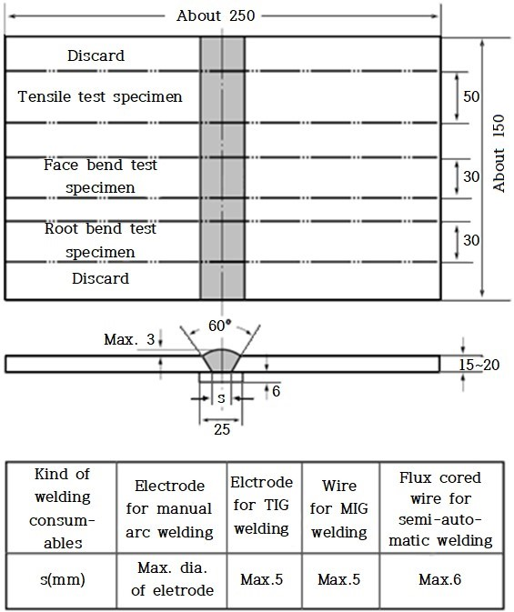
    **Fig 2.2.38 Butt Weld Test Assembly for Stainless Steel(Except for Submerged arc welding, Unit : mm)**
    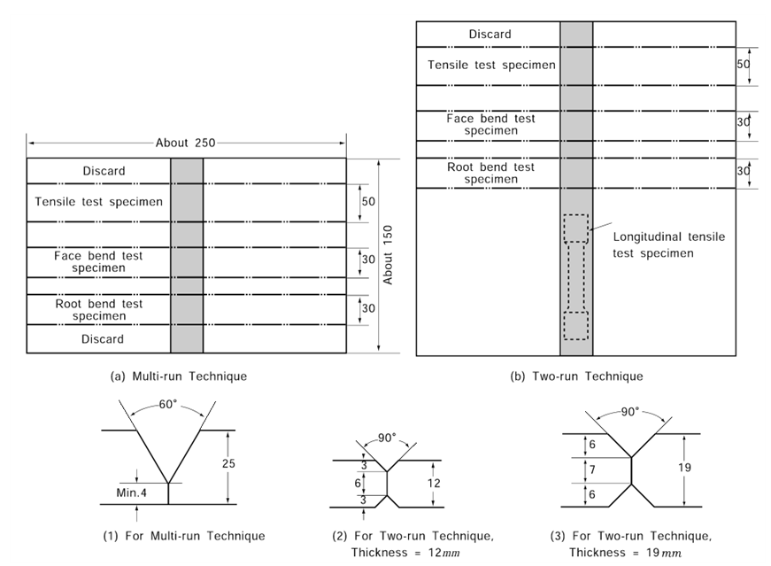
    **Fig 2.2.39 Butt Weld Test Assembly for Stainless Steel(Submerged arc welding, Unit : mm)**

    **Table 2.2.68 Tensile Test Requirements for Butt Weld**

    | Electrode for manual arc welding | Consumables for TIG and MIG welding | Flux cored wire for semi-automatic welding | Consumables for submerged arc welding | Tensile strength ($\mathrm{N}/mm ^{2}$) |
    | --- | --- | --- | --- | --- |
    | *RD* 308 | *RY* 308 | *RW* 308 | *RU* 308 | 520 min. |
    | *RD* 308*L* | *RY* 308*L* | *RW* 308*L* | *RU* 308*L* | 480 min. |
    | *RD* 309 | *RY* 309 | *RW* 309 | *RU* 309 | 520 min. |
    | *RD* 309*L* | *RY* 309*L* | *RW* 309*L* | － | 520 min. |
    | *RD* 309*Mo* | *RY* 309*Mo* | *RW* 309*Mo* | *RU* 309*Mo* | 520 min. |
    | *RD* 309*MoL* | － | *RW* 309*MoL* | － | 520 min. |
    | *RD* 310 | *RY* 310 | *RW* 310 | *RU* 310 | 520 min. |
    | － | *RY* 310*S* | － | － | 520 min. |
    | *RD* 310*Mo* | － | － | － | 520 min. |
    | *RD* 316 | *RY* 316 | *RW* 316 | *RU* 316 | 520 min. |
    | *RD* 316*L* | *RY* 316*L* | *RW* 316*L* | *RU* 316*L* | 480 min. |
    | *RD* 317 | *RY* 317 | *RW* 317 | *RU* 317 | 520 min.^(^1) |
    | *RD* 317*L* | *RY* 317*L* | *RW* 317*L* | *RU* 317*L* | 520 min.^(^1) |
    | － | *RY* 321 | － | － | 520 min. |
    | *RD* 347 | *RY* 347 | *RW* 347 | *RU* 347 | 520 min. |
    | NOTE: (1) Where the test assembly is made of *RSTS* 317*L*, the tensile strength is not to be less than 480 $\mathrm{N}/mm ^{2}$. |   |   |   |   |
- **6.** **Annual inspections**
  - **(1)** In the annual inspections, tests specified in the following (2) are to be conducted for each brand of approved consumables, and they are to be passed satisfactorily.
  - **(2)** The kinds of test, etc. in the annual inspections are to be as given in **Table 2.2.69**.
  - **(3)** The welding procedures and requirements of test assemblies for tests in the preceding (2) are to be as specified in **Pars 4** through **5.**

    **Table 2.2.69 Kinds of Test at Annual Inspection**

    | Kind of welding consumables |   | Kind of test | Welding procedure for test assembly |   |   |   |   | Kind and number of test specimens taken from test assembly |
    | --- | --- | --- | --- | --- | --- | --- | --- | --- |
    | Kind of welding consumables |   | Kind of test | Welding position | Dia. of electrode or wire (mm) | Number | Dimension | Thickness (mm) | Kind and number of test specimens taken from test assembly |
    | Electrode for manual arc welding |   | Deposited metal test | Flat | 3.2 ~ 4.0 | 1 | **Fig 2.2.37** | 12 ~ 19 | Tensile test specimen: 1 |
    | Consumables for TIG welding |   | Deposited metal test | Flat | 2.4 ~ 3.2 | 1 | **Fig 2.2.37** | 12 ~ 19 | Tensile test specimen: 1 |
    | Consumables for MIG welding |   | Deposited metal test | Flat | 1.2 ~ 1.6 | 1 | **Fig 2.2.37** | 12 ~ 19 | Tensile test specimen: 1 |
    | Flux cored wire for semi-automatic welding |   | Deposited metal test | Flat | 1.2 ~ 3.2 | 1 | **Fig 2.2.37** | 12 ~ 19 | Tensile test specimen: 1 |
    | Consumables for submerged arc welding (1) | Multi-run technique | Deposited metal test | Flat | 1.2 ~ 4.0 | 1 | **Fig 2.2.37** | 19 ~ 25 | Tensile test specimen: 1 |
    | Consumables for submerged arc welding (1) | Two-run technique | Butt weld test | Flat | 2.4 ~ 4.0 | 1 | **Fig 2.2.39**(b) | 12 ~ 19 | Tensile test specimen: 1 Longitudinal tensile test specimen: 1 Face bend specimen: 1 Root bend specimen: 1 |
    | NOTE: (1) Tests on both multi-run and two run technique are to be conducted for multi-run and two run welding respectively and the number, dimensions and thickness of test assemblies, along with the grades and number of test specimens selected from each test assembly are to be according to each of the welding processes. However, longitudinal tensile test of two run technique are not required. |   |   |   |   |   |   |   |   |

#### 608. Welding consumables for aluminium alloys

- **1.** **Application**
  - **(1)** Welding consumables used for aluminium alloys mentioned in the following (a) and (b)(hereinafter referred to as "welding consumables") are to be subjected to the approval tests and annual inspections in accordance with these requirements.
  - **(2)** Where no special requirements are given herein, e.g. for the approval procedure or for the welding of test assemblies and testing, those as specified in **601.** through **605.** apply in analogous manner.
- **2.** **Grades and marks of welding consumables**
  - **(1)** Grades and marks of welding consumables are classified as given in **Table 2.2.70**.

    **Table 2.2.70 Grades and Marks**

    | Kind of welding consumables | Grade and Mark |
    | --- | --- |
    | Electrode | *RA, RB, RC, RD* |
    | Wire | *WA, WB, WC, WD* |
  - **(2)** Approval of a wire or a rod will be granted in conjunction with a specific shielding gas according to **Table 2.2.67** with suffixed mark “G”(e.g. *RBG*(I-3)). or defined in terms of composition and purity of “special” gas to be designated with group sign “S”(eg. *RBS*($CO _{2}$ 100%). The composition of the shielding gas is to be reported. The approval of a wire or rod with any particular gas can be applied or transferred to any combination of the same wire or rod and any gas in the same numbered group as defined in **Table 2.2.71**, subject to the agreement of the Society.

    **Table 2.2.71 Kind of Gas**

    | Group | Kinds | Gas composition(%) |   |
    | --- | --- | --- | --- |
    | Group | Kinds | He | Ar |
    | I | I-1 I-2 I-3 I-4 I-5 | - 100 > 0 - 33 > 33 - 66 > 66 - 95 | 100 - Rest Rest Rest |
    | S |   | Others |   |
- **3.** **General provisions of tests**
  - **(1)** Kinds of test, number, thickness and dimensions of test assemblies, kind and number of test specimen taken from each test assembly for welding consumables are to be as given in **Table 2.2.72**.
  - **(2)** The aluminium alloys used in preparation for test assembly corresponding to welding consumables are to be as given in **Table 2.2.73**.
  - **(3)** For the approval of welding consumables, the tests specified in (1) are to be successfully conducted for each brand of welding consumables.
  - **(4)** For welding consumables using a shielding gas, the tests specified in (1) are to be conducted for each kind of gas designated among **Table 2.2.71** by the manufacturer. However, where the manufacturer designates several kinds of gas which are classified into the group l in **Table 2.2.71** and the tests specified in (1) are to be conducted for any one kind of gas, the tests for the other kind of gas may be dispensed with subject to the approval of the Society.

    **Table 2.2.72 Kinds of Test for Welding Consumables**

    | Kinds of test | Test assembly |   |   |   | Kinds and number of test specimens taken from test assembly |
    | --- | --- | --- | --- | --- | --- |
    | Kinds of test | Welding position | Number | Dimension | Thickness (mm) | Kinds and number of test specimens taken from test assembly |
    | Deposited metal test (Chemical composition test) | Flat | 1 | **Fig 2.2.40** | - | - |
    | Butt weld test | Flat | 1 | **Fig 2.2.41** | 10 ∼12 | Tensile test specimen : 2 Face bend test specimen : 2 Root bend test specimen : 2 Macro structure test specimen : 1 |
    | Butt weld test | Horizontal | 1^(^1) | **Fig 2.2.41** | 10 ∼12 | Tensile test specimen : 2 Face bend test specimen : 2 Root bend test specimen : 2 Macro structure test specimen : 1 |
    | Butt weld test | Vertical upward | 1 | **Fig 2.2.41** | 10 ∼12 | Tensile test specimen : 2 Face bend test specimen : 2 Root bend test specimen : 2 Macro structure test specimen : 1 |
    | Butt weld test | Overhead | 1 | **Fig 2.2.41** | 10 ∼12 | Tensile test specimen : 2 Face bend test specimen : 2 Root bend test specimen : 2 Macro structure test specimen : 1 |
    | Butt weld test | Flat | 1 | **Fig 2.2.42** | 20 ~ 25 | Tensile test specimen : 2 Face bend test specimen : 2 Root bend test specimen : 2 Macro structure test specimen : 1 |
    | Note (1) Welding consumables satisfying the requirements for flat and vertical upward positions may be dispensed with the tests for horizontal position subject to the approval of the Society. |   |   |   |   |   |

    **Table 2.2.73 Grade of Aluminium Alloys used for Test Assembly**

    | Grade of welding consumables | Grade of aluminium alloys used for test assembly |   |
    | --- | --- | --- |
    | *RA*, *WA* | 5000 series | 5754 |
    | *RB*, *WB* | 5000 series | 5086 |
    | *RC*, *WC* | 5000 series | 5083, 5383, 5456, 5059 |
    | *RD*, *WD* | 6000 series | 6005*A,* 6061, 6082 |
    | Note: Approval on higher strength *AlMg* base materials(5000 series) covers also the lower strength *AlMg* grades and their combination with *AlSi* grades |   |   |
  - **(5)** When the manufacturer designated the gas classified into the group "*S*" in the tests specified in (4), the composition of the shielding gas is to be reported to the Society.
  - **(6)** After welding, the test assemblies are not to be subjected to any heat treatment or peening.
  - **(7)** It is recommended that the welded assemblies be subjected to a radiographic examination to ascertain that there are any defects in the weld prior to the preparation of test specimens.
- **4.** **Deposited metal test**
  - **(1)** *Welding of deposited metal test assembly*
    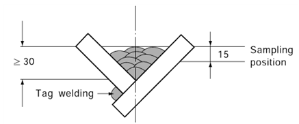
    **Fig 2.2.40 Deposited Weld Metal Test Assembly (Unit : mm)**
  - **(2)** *Chemical composition* The chemical composition of the welding consumables is to be determined by the analysis of the deposited weld metal specified in **Fig 2.2.40** and the results of the analysis are to comply with the limit value specified by the manufacturer.
- **5.** **Butt weld test**
  - **(1)** *Welding of butt weld test assemblies*
  - **(2)** *Butt weld tensile test*

    **Table 2.2.74 Requirements for the transverse tensile and bend tests**

    | Grade of welding consumables | Base material used for the test | Tensile strength ($\mathrm{N}/mm ^{2}$) | Bend test |   |
    | --- | --- | --- | --- | --- |
    | Grade of welding consumables | Base material used for the test | Tensile strength ($\mathrm{N}/mm ^{2}$) | Former diameter (mm) | Bending angle |
    | *RA/WA* | 5754 | 190 min. | 3 *t*(1) | 180° |
    | *RB/WB* | 5086 | 240 min. | 6 *t*(1) | 180° |
    | *RC/WC* | 5083 | 275 min. | 6 *t*(1) | 180° |
    | *RC/WC* | 5383, 5456 | 290 min. | 6 *t*(1) | 180° |
    | *RC/WC* | 5059 | 330 min. | 6 *t*(1) | 180° |
    | *RD/WD* | 6061, 6005A, 6082 | 170 min. | 6 *t*(1) | 180° |
    | Note (1) *t* : Thickness of the test specimen |   |   |   |   |
  - **(3)** *Butt Weld Bend Test*
  - **(4)** *Butt weld macro structure test*
- **6.** **Annual inspections**
  - **(1)** In the annual inspections, every approved welding consumables are to be subjected to the tests provided in (2) and are to be successfully examined.
  - **(2)** Kinds of tests in the annual inspections are to be as given in **Table 2.2.75**.
  - **(3)** The welding procedure and requirements for test assemblies specified in (2) are to be in accordance with the requirements in **4.** to **5.**
    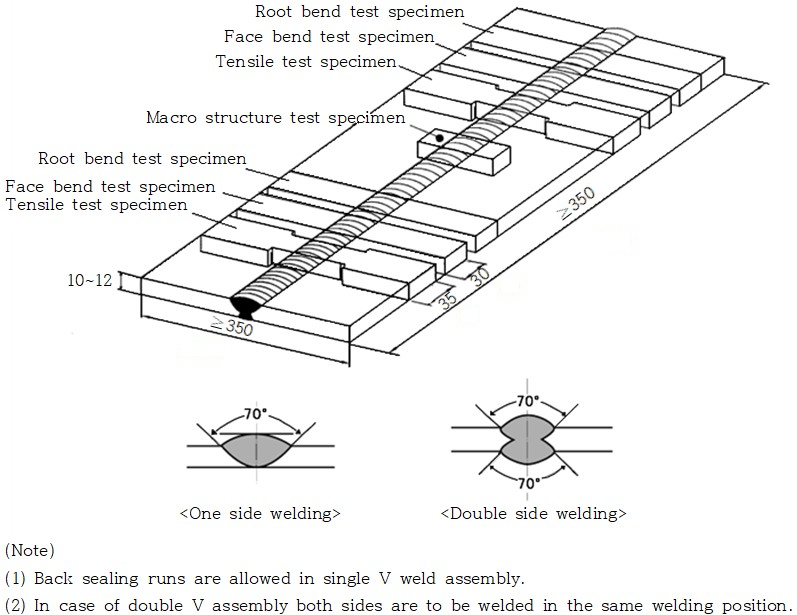
    **Fig 2.2.41 Butt Weld Test Assembly for Aluminium Alloys (A thickness of 10 to 12, unit : mm)**
    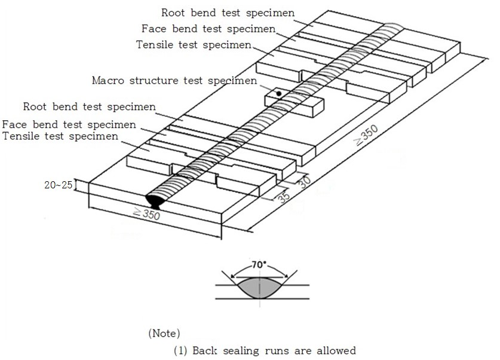
    **Fig 2.2.42 Butt Weld Test Assembly for Aluminium Alloys (A thickness of 20 to 25, unit : mm)**

    **Table 2.2.75 Kinds of Tests in Annual Inspections**

    | Kinds of test | Test assembly |   |   |   | Kind and number of test specimens taken from test assembly |
    | --- | --- | --- | --- | --- | --- |
    | Kinds of test | Welding position | Number | Dimensions | Thickness (mm) | Kind and number of test specimens taken from test assembly |
    | Deposited weld metal test(Chemical composition Analysis) | Flat | 1 | **Fig 2.2.40** | - | - |
    | Butt weld test | Flat | 1 | **Fig 2.2.41** | 10 - 12 | Tensile test specimen : 2 Face bend test specimen : 2 Root bend test specimen : 2 Macro structure test specimen : 1 |

#### 609. Welding consumables for weldable high strength steels

- **1.** **Application**
  Welding consumables for weldable high strength steels, which are given in following (1) through (3) (hereinafter referred to as "welding consumables" in **609.**) the approval test and annual inspections are to be in accordance with the requirements specified in **609.**
  - **(1)** Electrodes for manual arc welding(specified in **602. 1** (1) and (2))
  - **(2)** Automatic welding consumables(specified in **603. 1** (1) and (2). However, in this case, used only for multi-run technique in principle.)
  - **(3)** Semi-automatic welding consumables
- **2.** **Grade and marks of welding consumables**
  - **(1)** Grades and marks of welding consumables are classified as given in **Table 2.2.77**.
  - **(2)** Where the welding consumables have passed the test specified in **3** (1) below, the suffixes are to be added to the grade marks with the same methods as specified in **603. 2** (2) and (3) or **604. 2** (2) and (3) according to the grade of welding consumables.
  - **(3)** For low hydrogen electrodes which have passed the hydrogen test specified in **6**. the suffixes given in **Table 2.2.80** are to be added to the grade marks (eg. 3*Y*46*S H*5).
- **3.** **General provisions for tests**
  - **(1)** Kinds of test, number, thickness, and dimensions of test assembles, diameters of electrodes or wires used for welding and welding positions, together with kinds and number of test specimens taken from each test assembly for welding consumables are to be in accordance with the requirements specified in **602. 3., 603. 3.** or **604. 3**. However, note (4) of **Table 2.2.26** and note (5) of **Table 2.2.44** are not to be required. Provisions for automatic welding consumables are to be the requirements specified in multi run technique.
  - **(2)** The grades of steels used for tests are to be those given in **Table 2.2.76** corresponding to the grades of welding consumables, or those which are considered equivalent by the Society.

    **Table 2.2.76 Grade of Steels for Test Assembly** ***(2019)***

    | Grade of welding consumables | Grade of steel for assembly |
    | --- | --- |
    | 2*Y*42, 2*Y*46, 2*Y*50*,* 2*Y*55*,* 2*Y*62, 2*Y*69, 2*Y*89, 2*Y*96 | *AH* 43∼*AH* 97 |
    | 3*Y*42, 3*Y*46, 3*Y*50*,* 3*Y*55*,* 3*Y*62, 3*Y*69, 3*Y*89, 3*Y*96 | *AH* 43∼*AH* 97, *DH* 43∼*DH* 97 |
    | 4*Y*42, 4*Y*46, 4*Y*50*,* 4*Y*55*,* 4*Y*62, 4*Y*69, 4*Y*89, 4*Y*96 | *AH*43∼*AH*97, *DH* 43∼*DH* 97, *EH* 43∼*EH* 97 |
    | 5*Y*42, 5*Y*46, 5*Y*50*,* 5*Y*55*,* 5*Y*62, 5*Y*69 | *AH* 43∼*AH* 70, *DH* 43∼*DH* 70, *EH* 43∼*EH* 70, *FH* 43∼*FH* 70 |
    | NOTES: Notwithstanding the requirements in this table, normal and higher strength steels may be used for deposited metal test assembly. In this case, appropriate buttering is to be carried out. |   |
  - **(3)** For the approval of welding consumables, the tests specified in **602.**, **603.** or **604.** are to be conducted for each brand of welding consumables. For the tests specified in **603.**, wire-flux combination for single or two-run technique are subject to special consideration of the Society. *(2019)*
  - **(4)** After welding, the test assemblies are not to be subjected to any heat treatment or peening.
  - **(5)** It is recommended that the welded assemblies be subjected to a radiographic examination to ascertain that there are any defects in the weld prior to the preparation of test specimens.
- **4.** **Deposited metal test**
  - **(1)** *Welding of deposited metal test assembly*
    Welding sequence of test assemblies are to be in accordance with the requirements specified in **602. 4** (1), **603. 4** (1) or **604. 4** (1) appropriate to the grade of the welding consumables.
  - **(2)** *Chemical composition*
  - **(3)** *Deposited metal tensile test*
  - **(4)** *Deposited metal impact test*

    **Table 2.2.77 Test Requirements for Deposited Metal** ***(2019)***

    | Grade of welding consumables | Tensile test |   |   | Impact test |   |
    | --- | --- | --- | --- | --- | --- |
    | Grade of welding consumables | Tensile strength ($\mathrm{N}/mm ^{2}$)(1) | Yield strength ($\mathrm{N}/mm ^{2}$) | Elongation (%) | Test temp (℃) | Minimum mean absorbed energy(J) |
    | 2*Y*42 | 520 ∼ 680 | 420 min. | 21 min. | 0 | 47 min. |
    | 3*Y*42 | 520 ∼ 680 | 420 min. | 21 min. | -20 | 47 min. |
    | 4*Y*42 | 520 ∼ 680 | 420 min. | 21 min. | -40 | 47 min. |
    | 5*Y*42 | 520 ∼ 680 | 420 min. | 21 min. | -60 | 47 min. |
    | 2*Y*46 | 540 ∼ 720 | 460 min. | 20 min. | 0 | 47 min. |
    | 3*Y*46 | 540 ∼ 720 | 460 min. | 20 min. | -20 | 47 min. |
    | 4*Y*46 | 540 ∼ 720 | 460 min. | 20 min. | -40 | 47 min. |
    | 5*Y*46 | 540 ∼ 720 | 460 min. | 20 min. | -60 | 47 min. |
    | 2*Y*50 | 590 ∼ 770 | 500 min. | 19 min. | 0 | 50 min. |
    | 3*Y*50 | 590 ∼ 770 | 500 min. | 19 min. | -20 | 50 min. |
    | 4*Y*50 | 590 ∼ 770 | 500 min. | 19 min. | -40 | 50 min. |
    | 5*Y*50 | 590 ∼ 770 | 500 min. | 19 min. | -60 | 50 min. |
    | 2*Y*55 | 640 ∼ 820 | 550 min. | 18 min. | 0 | 55 min. |
    | 3*Y*55 | 640 ∼ 820 | 550 min. | 18 min. | -20 | 55 min. |
    | 4*Y*55 | 640 ∼ 820 | 550 min. | 18 min. | -40 | 55 min. |
    | 5*Y*55 | 640 ∼ 820 | 550 min. | 18 min. | -60 | 55 min. |
    | 2*Y*62 | 700 ∼ 890 | 620 min. | 18 min. | 0 | 62 min. |
    | 3*Y*62 | 700 ∼ 890 | 620 min. | 18 min. | -20 | 62 min. |
    | 4*Y*62 | 700 ∼ 890 | 620 min. | 18 min. | -40 | 62 min. |
    | 5*Y*62 | 700 ∼ 890 | 620 min. | 18 min. | -60 | 62 min. |
    | 2*Y*69 | 770 ∼ 940 | 690 min. | 17 min. | 0 | 69 min. |
    | 3*Y*69 | 770 ∼ 940 | 690 min. | 17 min. | -20 | 69 min. |
    | 4*Y*69 | 770 ∼ 940 | 690 min. | 17 min. | -40 | 69 min. |
    | 5*Y*69 | 770 ∼ 940 | 690 min. | 17 min. | -60 | 69 min. |
    | 2*Y*89 | 940 ∼ 1100 | 890 min. | 14 min. | 0 | 69 min. |
    | 2*Y*89 | 940 ∼ 1100 | 890 min. | 14 min. | -20 | 69 min. |
    | 3*Y*89 | 940 ∼ 1100 | 890 min. | 14 min. | -20 | 69 min. |
    | 3*Y*89 | 940 ∼ 1100 | 890 min. | 14 min. | -40 | 69 min. |
    | 4*Y*89 | 940 ∼ 1100 | 890 min. | 14 min. | -40 | 69 min. |
    | 2*Y*96 | 980 ∼ 1150 | 960 min. | 13 min. | 0 | 69 min. |
    | 2*Y*96 | 980 ∼ 1150 | 960 min. | 13 min. | -20 | 69 min. |
    | 3*Y*96 | 980 ∼ 1150 | 960 min. | 13 min. | -20 | 69 min. |
    | 3*Y*96 | 980 ∼ 1150 | 960 min. | 13 min. | -40 | 69 min. |
    | 4*Y*96 | 980 ∼ 1150 | 960 min. | 13 min. | -40 | 69 min. |
    | Note Tensile strength specified in the table may be alerted where deemed appropriate by the Society. |   |   |   |   |   |
- **5.** **Butt weld test**
  - **(1)** *Welding of butt weld test assembly*
    Welding sequence of test assemblies are to be in accordance with the requirements specified in **602. 5** (1)**, 603. 5** (1) or **604. 5** (1) appropriate to the grade of the welding consumables.
  - **(2)** *Butt weld tensile test*

    **Table 2.2.78 Tensile Test Requirements for butt weld test** ***(2017)*** ***(2019)***

    | Grade of welding consumables | Tensile strength ($\mathrm{N}/mm ^{2}$) |
    | --- | --- |
    | 2*Y*42, 3*Y*42, 4*Y*42, 5*Y*42 | 520 min. |
    | 2*Y*46, 3*Y*46, 4*Y*46, 5*Y*46 | 540 min. |
    | 2*Y*50, 3*Y*50, 4*Y*50, 5*Y*50 | 590 min. |
    | 2*Y*55, 3*Y*55, 4*Y*55, 5*Y*55 | 640 min. |
    | 2*Y*62, 3*Y*62, 4*Y*62, 5*Y*62 | 700 min. |
    | 2*Y*69, 3*Y*69, 4*Y*69, 5*Y*69 | 770 min. |
    | 2*Y*89, 3*Y*89, 4*Y*89 | 940 min. |
    | 2*Y*96, 3*Y*96, 4*Y*96 | 980 min. |
  - **(3)** *Butt weld bend test*

    **Table 2.2.79 Bend Radius for Butt Weld Bend Test** ***(2019)***

    | Grade of welding consumable | Radius of plunger |
    | --- | --- |
    | 2*Y*42∼50, 3*Y*42∼50, 4*Y*42∼50, 5*Y*42∼50 | 2.0 $t$ |
    | 2*Y*55∼69, 3*Y*55∼69, 4*Y*55∼69, 5*Y*55∼69 | 2.5 $t$ |
    | 2*Y*89, 3*Y*89, 4*Y*89 | 3 $t$ |
    | 2*Y*96, 3*Y*96, 4*Y*96 | 3.5 $t$ |

    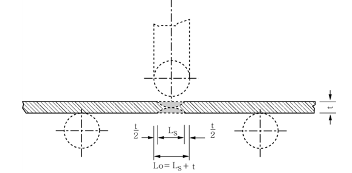
    **Fig 2.2.43 gauge length** ***Lo***
  - **(4)** *Butt weld impact test*
- **6.** **Hydrogen test**
  - **(1)** Hydrogen Test is to be carried out for welding consumables except gas shielded arc solid wire by the glycerine method, mercury method, thermal conductivity detector method or other methods deemed appropriate by the Society. *(2017)*
  - **(2)** The average volume of hydrogen is to comply with the requirements specified in **Table 2.2.80** according to the test procedures specified in preceding (1) or the type of suffixes to be added to the grade marks.

    **Table 2.2.80 Requirements for hydrogen Contents** ***(2017)*** ***(2019)***

    | Grade of welding consumable | Suffixes | Requirements for Hydrogen Contents ($\mathrm{cm} ^{3} /g$) |   |   |
    | --- | --- | --- | --- | --- |
    | Grade of welding consumable | Suffixes | Glycerine method | Mercury method | Thermal conductivity detector method |
    | 2*Y*42∼50, 3*Y*42∼50, 4*Y*42∼50, 5*Y*42∼50 | *H* 10 | 0.05 max. | 0.10 max. | 0.10 max. |
    | 2*Y*55∼96, 3*Y*55∼96, 4*Y*55∼96, 5*Y*55∼96 | *H* 5 | - | 0.05 max. | 0.05 max. |
- **7.** **Fillet weld test assemblies**
  - **(1)** *Welding of fillet weld test assemblies*
    The test assemblies are to be in accordance with the requirements in **602. 7** (1).
  - **(2)** *Fillet weld macro-structure test*
    The macro-structure test is to be correspondingly in accordance with the requirements in **602. 7** (2).
  - **(3)** *Fillet weld hardness test*
    The hardness test is to be correspondingly in accordance with the requirements in **602. 7** (3).
  - **(4)** *Fillet weld fracture test*
    The fracture test is to be correspondingly in accordance with the requirements in **602. 7** (4).
- **8.** **Annual inspections**
  Annual inspections are to comply with the requirements specified in **602. 8, 603. 8** or **604. 8** according to the grade of the welding consumables. However, in general, annual inspections for automatic welding consumables are to comply with the requirements specified for multi run technique. For grades Y69 to Y96 annaul hydrogen test is required. *(2019)*
- **9.** **Change in grades**
  The changes in grades relating to the strength or toughness or hydrogen of approved welding consumables are to comply with the requirements specified in **602. 9, 603. 9** or **604. 9** according to the grade of the welding consumables. *(2017)* 
