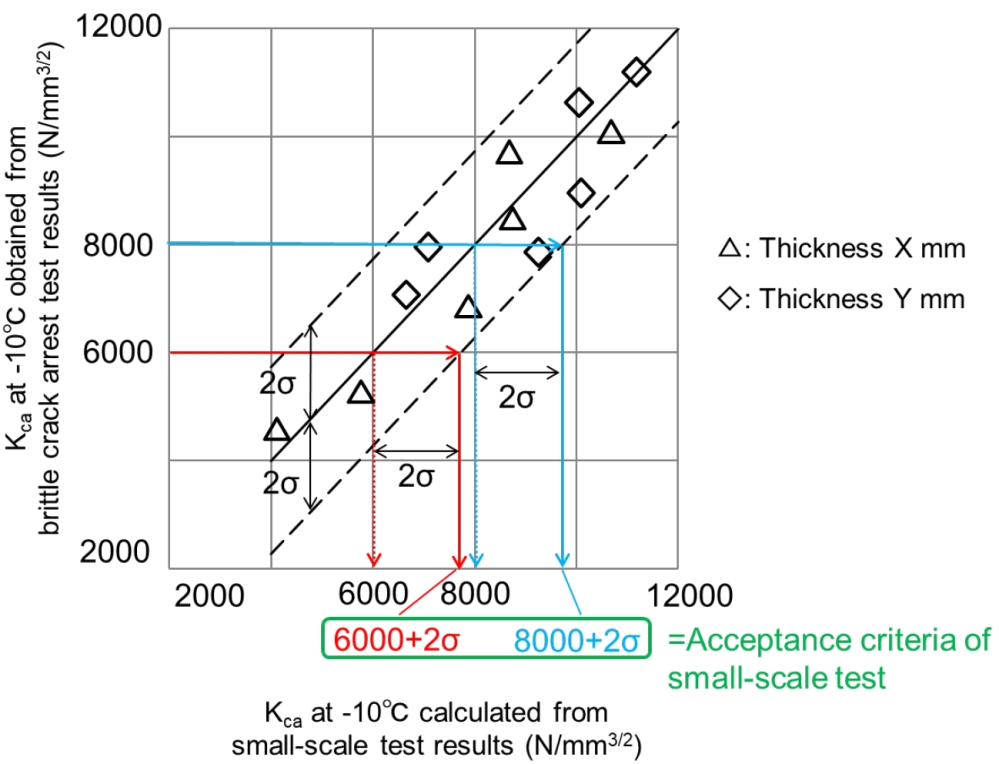
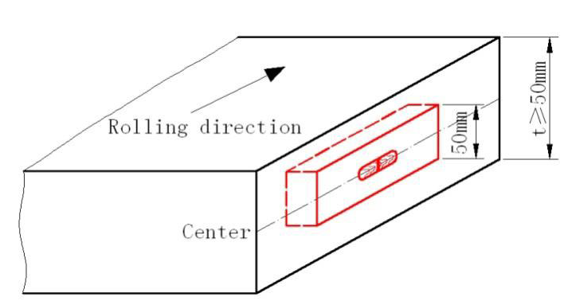
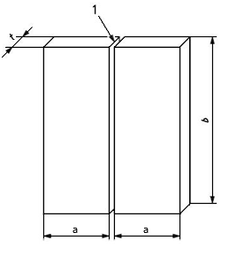
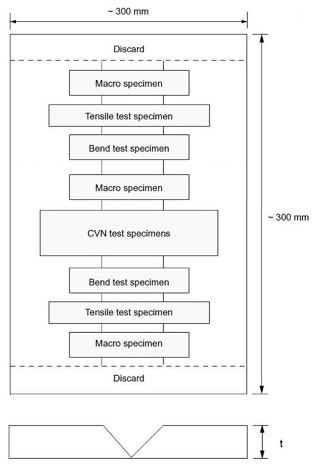

# PART 2 Materials and Welding

> RULES FOR CLASSIFICATION OF STEEL SHIPS / RA-02-E / 2025 / EN / Guidance

## CHAPTER 1 MATERIALS

### Section 1 General

#### 101. Application 【See Rule】

- **1.** Seamless shells of boilers made of steel forgings are to comply with **Annex 2-1.**
- **2.** Reinforced plastic materials used for construction or repair of FRP ships or composite vessel are to comply with **Annex 2-8.** *(2017)*
- **3.** Hull structural steels with improved fatigue properties are to comply with **Annex 2-10.**
- **4.** The application to **101. 2** of the Rules is to be in accordance with the followings: *(2019)*
  - **(1)** For the material equivalent to those specified **Pt 2**, **Ch 1** of Rules(the material specified **ISO**, **ASTM**, etc.), except as otherwise specified, chemical composition, mechanical properties and heat treatment may be in accordance with the relevant standards.
  - **(2)** The requirements for **Pt 2**, **Ch 1** of Rules are to be applied for approval of manufacturing process, testing and inspection of material in (1) above. This is not absolve the approval and inspection of the Society.
  - **(3)** “otherwise specified“ in (1) above generally means requirements according to the application.
- **5.** The high manganese austenitic steel for cargo tank in ships carrying liquefied natural gases in bulk or for fuel tank in ships using liquefied natural gases as fuels is to comply with **Annex 2-11**. *(2020)*

#### 102. Approval of manufacturing process and manufacturing control

- **1.** "control imperfection" referred in **102. 2** (2) of the Rules includes the deviation from the programmed rolling schedules or normalizing or quenching and tempering procedures. **【See Rule】**
- **2.** "at the discretion of the Society" referred in **102. 2** (3) of the Rules includes the confirmation for compliance monitoring of a countermeasure to prevent its recurrence in the complete investigation report. **【See Rule】**

#### 103. Chemical composition

- **1.** The application to **103. 1** of the Rules is to be in accordance with the followings: **【See Rule】**
  - **(1)** The chemical composition analyses from each ladle are to be applied to steel.
  - **(2)** The chemical composition analyses from each cast are to be applied to non-ferrous metals.
- **2.** "if required by the Surveyor" referred in **103. 2** of the Rules means where a low reliability of the manufacturer's declared analysis is verified by the Society. **【See Rule】**
- **3.** The application to **103. 3** of the Rules is to be in accordance with the followings : **【See Rule】**
  - **(1)** Selection of samples for the check analyses
    Samples for the check analyses are to be taken from specimens for mechanical tests or from the portion of the body adjacent to the part where mechanical specimens had been taken.
  - **(2)** Production analysis and its tolerance for steel
    Production analysis and its tolerance for steel is to comply with *KS D*0228 (Production Analysis and its Tolerance for Wrought Steel) or the standard internationally recognized subject to the approval by the Society.

#### 104. Testing and inspection 【See Rule】

"The approval of quality assurance scheme specially specified by the Society" referred in **104. 4** of the Rules means where the quality assurance scheme of material manufacturer has been already approved according to the requirements of **Ch 5** of "*Guidance for Approval of Manufacturing Process and Type approval etc*." by the Society.

#### 107. Test certificates (2019) 【See Rule】

Chemical composition and mechanical test results for materials are to be measured until the next digit of the least significant digit of required significant figures. Then, such measurements are to be rounded off in accordance with *ISO 80000-1 Annex B*, and to be indicated in the same number of significant figures as the specified value. The applicant is to be consulted with the Society when other methods are used.

#### 109. Retest procedure 【See Rule】

"Any part of fracture is outside the one-fourth of the gauge length from the centre of gauge length" specified in **109. 4** of the Rules means the parts of "B" and "C" as shown in **Fig 2.1.1** of the Guidance.

### Section 2 Test Specimens and Testing Procedures

#### 201. General

- **1.** **Application**
  In case where test specimens or test procedures specified in the requirements of *ISO* or *KS* are adopted, the approvals by the Society may be dispensed with, notwithstanding the requirement in **201. 1** (2) of the Rules. **【See Rule】**
- **2.** **Testing machine**
  In application to **201. 2** (2) and (3) of the Rules, the term "other recognised standard" means the acceptance in accordance with **Pt 1, Ch 1, 105.** of the Rules. **【See Rule】**
- **3.** **Selection of test specimens**
  "Where otherwise specified or agreed with the Surveyor" referred in **201. 3** (2) of the Rules means only where manufacturing process of the material has been already approved according to the requirements of **Ch 2** of **"***Guidance for Approval of Manufacturing Process and Type Approval, etc***"** by the Society **【See Rule】**

#### 202. Form and dimension of test specimen

- **1.** **Tensile test specimen**
  - **(1)** The gauge length of the *R* 14*B* tensile test specimens specified in **Fig 2.1.1** of the Rules may be used as given in **Table 2.1.1** of Guidance in accordance with **201. 1** (2) of the Rules.
    **【See Rule】**

    **Table 2.1.1 Rounding of Gauge Length**

    | Thickness of test specimen t (mm) | Width of test specimen W (mm) | Gauge length L (mm) |
    | --- | --- | --- |
    | 3 ≤ $t$ ≤ 4 | 25 | 50 |
    | 4 ＜ $t$ ≤ 5 | 25 | 60 |
    | 5 ＜ $t$ ≤ 7 | 25 | 70 |
    | 7 ＜ $t$ ≤ 10 | 25 | 80 |
    | 10 ＜ $t$ ≤ 15 | 25 | 100 |
    | 15 ＜ $t$ ≤ 20 | 25 | 120 |
    | 20 ＜ $t$ ≤ 30 | 25 | 140 |
    | 30 ＜ $t$ ≤ 40 | 25 | 160 |
  - **(2)** In application to **202. 1** (4) of the Rules, corrections for elongation are to be in accordance with the followings : **【See Rule】**
    $E=n \cdot F$
    where
    $E$ = Elongation equivalent to where the proportional specimens ($L=5.65 \sqrt {A}$) specified in **Fig 2.1.1** of the Rules are used.
    $n$ = Elongation where optional test specimens are used.
    $F$ = Coefficient of correction for elongation are shown in **Table 2.1.2** of the Guidance according to the gauge length.

    **Table 2.1.2 Values of** *F*

    | Gauge length ($L$) | Material 1 | Material 2 |
    | --- | --- | --- |
    | 8 $D$ | 1.21 | 1.29 |
    | $8 \sqrt {A}$ | 1.15 | 1.21 |
    | 4 $D$ | 0.91 | 0.88 |
    | $4 \sqrt {A}$ | 0.87 | 0.82 |
    | $D$ : Diameter of the test specimen $A$ : Sectional area of the test specimen |   |   |
    - **(A)** Stainless steel and aluminium alloys are to be considered as Material 1 in **Table 2.1.1** of the Rules. However, corrections for elongation specified in **202. 1** (4) of the Rules may not be required in the case of copper alloy.
    - **(B)** In case where the corrections by the requirements of **202. 1** (4) of the Rules are deemed troublesome because of a great number of test specimens, the value of specified elongation may be corrected by using the following formula. In such case, the corrected specified elongation is to be recorded in the certificates of the material test.
- **2.** **Impact test specimen**
  - **(1)** In application to **202. 3** (3) of the Rules, the sub-size specimens permitted according to thickness of the steels are to be as follows; **【See Rule】**

    | Steel thickness | Width of the sub-size specimen |
    | --- | --- |
    | $6 \mathrm{mm} \leq it t \prec 9 \mathrm{mm}$ | 5 mm |
    | $9 \mathrm{mm} \leq it t \prec 12 \mathrm{mm}$ | 7.5 mm |
  - **(2)** In application to **202. 3** (5) of the Rules, in case where the capacity of impact tester limits the use of normal impact test specimens, sub-size specimens can be used provided that the test results using sub-size specimens are to comply with the requirements specified for the normal impact test specimens. **【See Rule】**

#### 203. Testing procedure (2017) (2021)

- **1.** **Test method for Brittle crack arrest toughness,** $K_ca$ **【See Rule】**
  - **(1)** Scope
    - **(A)** In application to **203.** of the Rules, this test procedure for brittle crack arrest toughness(i.e. $K_ca$) of steel using fracture mechanics parameter is applicable to hull structural steels with the thickness over 50 mm and not greater than 100 mm. *(2024)*
    - **(B)** **ISO20064: 2019** provides a test method for the determination of brittle crack arrest toughness of steel by using wide plates with a temperature gradient. *(2024)*
    - **(C)** These requirements specify the test procedures for brittle crack arrest toughness (i.e. $K_ca$) of steel using fracture mechanics parameter and determination method of $K_ca$ at a specific temperature which are specified in **ISO 20064:2019**. Additionally, this requirements specify the evaluation method of $K_ca$ of test plate. *(2024)*
  - **(2)** Test procedures *(2024)*
    The test procedures including testing equipment, test specimens, test methods, determination of arrest toughness, reporting of test results, etc. are to be in accordance with **ISO 20064: 2019**. As a method for initiating a brittle crack, a secondary loading mechanism can be used in accordance with Annex D of **ISO 20064: 2019**, except that the first sentence in Annex B.2.4 of **ISO 20064: 2019** is revised to “Obtain the value $"{"K _{ca}/[K_{0}*\exp(-c/T_{Kca})]"}"$ for each data point”.
  - **(3)** Determination of $K_ca$ at a specific temperature and the evaluation *(2024)*
    The method for conducting multiple tests to obtain $K_ca$ value at a specific temperature is to be in accordance with Annex B of **ISO 20064: 2019**.
    The straight-line approximation of Arrhenius plot for valid $K_ca$ data by interpolation method are to comply with either the following (a) or (b).
    
    **Fig 2.1.2 Example for evaluation of** $K _{ca}$ **at –10 degree C**
    
    **Fig 2.1.3 Example for evaluation of temperature corresponding to the required** $K _{ca}$
    - **(A)** Method
    - **(B)** Evaluation
      - **(a)** The evaluation temperature of $K_ca$(i.e. -10 degree C) is located between the upper and lower limits of the arrest temperature, with the $K_ca$ corresponding to the evaluation temperature not lower than the required $K_ca$(e.g. 6,000 $N/mm^3/2$ or 8,000 $N/mm^3/2$), as shown in **Fig 2.1.2** of the Guidance.
      - **(b)** The temperature corresponding to the required $K _{ca}$ (e.g. 6,000 $N/mm^3/2$ or 8,000 $N/mm^3/2$) is located between the upper and lower limits of the arrest temperature, with the temperature corresponding to the required $K _{ca}$ not higher than the evaluation temperature (i.e. -10 degree C), as shown in **Fig 2.1.3** of the Guidance.
      - **(c)** If both of (b) and (c) above are not satisfied, conduct additional tests to satisfy this condition.
- **2.** **Outline of requirements for undertaking isothermal Crack Arrest Temperature**
  - **(1)** Application
    - **(A)** These requirements are to be applied according to the scope defined in **Pt 2**, **Ch 1**, **312.** of the Rules.
    - **(B)** These are requirements for test procedures and test conditions when using the isothermal crack arrest test to determine a valid test result under isothermal conditions and in order to establish the crack arrest temperature(CAT). These requirements are applicable to steels with thickness over 50 mm and not greater than 100 mm.
    - **(C)** This method uses an isothermal temperature in the test specimen being evaluated. Unless otherwise specified in these requirements, the other test parameters are to be in accordance with **ISO 20064:2019**. *(2024)*
    - **(D)** **Table 2.1.35** of **Pt 2**, **Ch 1**, **312.** of the Rules gives the relevant requirements for the brittle crack arrest property described by the crack arrest temperature(CAT).
    - **(E)** The manufacturer is to submit the test procedure to the Society for review prior to testing.
    - **(F)** Where required, the method can also be used for determining the lowest temperature at which a steel can arrest a running brittle crack (the determined CAT) as the material property characteristic in accordance with (8) (C).
  - **(2)** Symbols and their significance
    **Table 2.1.3** of the Guidance supplements **Table 1** in **ISO 20064:2019** with specific symbols for the isothermal test. *(2024)*

    | Symbol | Unit | Significance |
    | --- | --- | --- |
    | t | mm | Test specimen thickness |
    | L | mm | Test specimen length |
    | W | mm | Test specimen width |
    | $a_MN$ | mm | Machined notch length on specimen edge |
    | $L_SG$ | mm | Side groove length on side surface from the specimen edge. $L_SG$ is defined as a groove length with constant depth except a curved section in depth at side groove end. |
    | $d_SG$ | mm | Side groove depth in section with constant depth |
    | $L_{EB-\min}$ | mm | Minimum length between specimen edge and electron beam re-melting zone front |
    | $L_{EB-s1, -s2}$ | mm | Length between specimen edge and electron beam re-melting zone front appeared on both specimen side surfaces |
    | $L_{LTG}$ | mm | Local temperature gradient zone length for brittle crack runway |
    | $a_{arrest}$ | mm | Arrested crack length |
    | $T_{target}$ | ℃ | Target test temperature |
    | $T_{test}$ | ℃ | Defined test temperature |
    | $T_{arrest}$ | ℃ | Target test temperature at which valid brittle crack arrest behaviour is observed |
    | σ | $N/mm^2$ | Applied test stress at cross section of W x t |
    | SMYS | $N/mm^2$ | Specified minimum yield strength of the tested steel grade to be approved |
    | CAT | ℃ | Crack arrest temperature, the lowest temperature, $T_{arrest}$, at which running brittle crack is arrested |
  - **(3)** Testing equipment
    - **(A)** The test equipment to be used is to be of the hydraulic type of sufficient capacity to provide a tensile load equivalent to ⅔ of SMYS of the steel grade to be approved.
    - **(B)** The temperature control system is to be equipped to maintain the temperature in the specified region of the specimen within ±2 ℃ from $T_{target}$.
    - **(C)** Methods for initiating the brittle crack may be of drop weight type, air gun type or double tension tab plate type.
    - **(D)** The detailed requirements for testing equipment are specified in **ISO 20064:2019**. *(2024)*
  - **(4)** Test specimens
    
    **Fig 2.1.4 Test specimen dimensions for an impact type specimen**
    
    **Fig 2.1.5 Side groove configuration and dimensions**
    
    **Fig 2.1.6 Side groove configuration and dimension**
    The configuration and size of tab plates and pin chucks shall be referred to **ISO 20064:2019**. The welding distortion in the integrated specimen, which is welded with specimen, tab plates and pin chucks, shall be also within the requirement in **ISO 20064:2019**. *(2024)*
    - **(A)** Impact type crack initiation
      - **(a)** Test specimens are to be in accordance with **ISO 20064:2019,** unless otherwise specified in these requirements. *(2024)*
      - **(b)** Specimen dimensions are shown in **Fig 2.1.4** of the Guidance. The test specimen width, W shall be 500mm. The test specimen length, L shall be equal to or greater than 500mm.
      - **(c)** V-shape notch for brittle crack initiation is machined on the specimen edge of the impact side. The whole machined notch length shall be equal to 29 mm with a tolerance range of ±1 mm.
      - **(d)** Requirements for side grooves are described in (D).
    - **(B)** Double tension type crack initiation
      - **(a)** Reference shall be made to Annex D in **ISO 20064:2019** for the shape and sizes in secondary loading tab and secondary loading method for brittle crack initiation. *(2024)*
      - **(b)** In a double tension type test, the secondary loading tab plate may be subject to further cooling to enhance an easy brittle crack initiation.
    - **(C)** Embrittled zone setting
      - **(a)** An embrittled zone shall be applied to ensure the initiation of a running brittle crack. Either Electron Beam Welding (EBW) or Local Temperature Gradient (LTG) may be adopted to facilitate the embrittled zone.
      - **(b)** In EBW embrittlement, electron beam welding is applied along the expected initial crack propagation path, which is the centre line of the specimen in front of the machined V- notch.
      - **(c)** The complete penetration through the specimen thickness is required along the embrittled zone. One side EBW penetration is preferable, but dual sides EB penetration may be also adopted when the EBW power is not enough to achieve the complete penetration by one side EBW.
      - **(d)** The EBW embrittlement is recommended to be prepared before specimen contour machining.
      - **(e)** In EBW embrittlement, zone shall be of an appropriate quality.
      - **(f)** EBW occasionally behaves in an un-stable manner at start and end points. EBW line is recommended to start from the embrittled zone tip side to the specimen edge with an increasing power control or go/return manner at start point to keep the stable EBW.
      - **(g)** In LTG system, the specified local temperature gradient between machined notch tip and isothermal test region is regulated after isothermal temperature control. LTG temperature control is to be achieved just before brittle crack initiation, nevertheless the steady temperature gradient through the thickness shall be ensured.
    - **(D)** Side grooves
      - **(a)** Side grooves on side surface can be machined along the embrittled zone to keep brittle crack propagation straight. Side grooves shall be machined in the specified cases as specified in this section.
      - **(b)** In EBW embrittlement, side grooves are not necessarily mandatory. Use of EBW avoids the shear lips. However, when shear lips are evident on the fractured specimen, e.g. shear lips over 1 mm in thickness in either side then side grooves should be machined to suppress the shear lips.
      - **(c)** In LTG embrittlement, side grooves are mandatory. Side grooves with the same shape and size shall be machined on both side surfaces.
      - **(d)** The length of side groove, $L_SG$ shall be no shorter than the sum of the required embrittled zone length. *(2024)*
      - **(e)** When side grooves would be introduced, the side groove depth, the tip radius and the open angle are not regulated, but are adequately selected in order to avoid any shear lips over 1 mm thickness in either side. An example of side groove dimensions are shown in **Fig 2.1.5** of the Guidance.
      - **(f)** Side groove end shall be machined to make a groove depth gradually shallow with a curvature larger than or equal to groove depth, $d_SG$. Side groove length, $L_SG$ is defined as a groove length with constant depth except a curved section in depth at side groove end.
    - **(E)** Nominal length of embrittled zone
      - **(a)** The length of embrittled zone shall be at least 150 mm. *(2024)*
      - **(a)** **(a) No side groove (b) With side groove**
      - **(b)** EBW zone length is regulated by three measurements on the fracture surface after test as shown in **Fig 2.1.6** of the Guidance, $L_{EB-\min}$ between specimen edge and EBW front line, and $L_{EB-s1}$ and $L_{EB-s2}$.
      - **(c)** The minimum length between specimen edge and EBW front line, $L_{EB-\min}$ should be no smaller than 150 mm. However, it can be acceptable even if $L_{EB-\min}$ is no smaller than 150mm-0.2t, where t is specimen thickness. When $L_{EB-\min}$ is smaller than 150 mm, a temperature safety margin shall be considered into $T_{test}$ (See (8) (A) (b)).
      - **(d)** Another two are the lengths between specimen edge and EBW front appeared on both side surfaces, as denoted with $L_{EB-s1}$ and $L_{EB-s2}$. Both of $L_{EB-s1}$ and $L_{EB-s2}$ shall be no smaller than 150 mm.
      - **(e)** In LTG system, $L_{LTG}$ is set as 150 mm.
    - **(F)** Tab plate / pin chuck details and welding of test specimen to tab plates
  - **(5)** Test method
    Preloading at room temperature can be applied to avoid unexpected brittle crack initiation at test. The applied load value shall be no greater than the test stress. Preloading can be applied at higher temperature than ambient temperature when brittle crack initiation is expected at preloading process. However, the specimen shall not be subjected to temperature higher than 100 ℃.
    
    **Fig 2.1.7 Locations of temperature measurement**
    (ⅰ) The temperatures of the thermocouples across the range of 0.3W~0.7W in both width and longitudinal directions are to be controlled within ± 2 °C of the target test temperature, $T_target$.
    (ⅱ) When all measured temperatures across the range of 0.3W~0.7W have reached $T_target$, steady temperature control shall be kept at least for 10 + 0.1 x t[mm] minutes to ensure a uniform temperature distribution into mid-thickness prior to applying test load.
    (ⅲ) The machined notch tip can be locally cooled to easily initiate brittle crack. Nevertheless, the local cooling shall not disturb the steady temperature control across the range of 0.3W~0.7W.
    (ⅰ) In LTG system, in addition to the temperature measurements shown in **Fig 2.1.7** of the Guidance, the additional temperature measurement at the machine notch tip, $A_0$ and $B_0$ is required. Thermocouples positions within LTG zone are shown in **Fig 2.1.8** of the Guidance.
    
    **Fig 2.1.8 Detail of LTG zone and additional thermocouple** $A_0$
    (ⅱ) The temperatures of the thermocouples across the range of 0.3W~0.7W in both width and longitudinal directions are to be controlled within ± 2 °C of the target test temperature, $T_target$. However, the temperature measurement at 0.3W (location of $A_3$ and $B_3$)shall be in accordance with (f) below.
    (ⅲ) Once the all measured temperatures across the range of 0.3W~0.7W have reached $T_target$, steady temperature control shall be kept at least for 10 + 0.1 x t[mm] minutes to ensure a uniform temperature distribution into mid-thickness, then the test load is applied.
    (ⅳ) LTG is controlled by local cooling around the machined notch tip. LTG profile shall be recorded by the temperature measurements from $A_0$ to $A_3$ shown in **Fig 2.1.9** of the Guidance.
    (ⅴ) LTG zone is established by temperature gradients in three zones, Zone I, Zone II and Zone III. The acceptable range for each temperature gradient is listed **Table 2.1.4**.
    (ⅵ) Temperature measurements at $A_2$, $B_2$ and $A_3$, $B_3$ shall be satisfied the following requirements. *(2024)*
    T at $A_3$, T at $B_3$ < $T_target$ – 2 ℃
    T at $A_2$ < T at $A_3$ – 5 ℃
    T at $B_2$ < T at $B_3$ – 5 ℃
    (ⅶ) No requirements for T at $A_0$ and T at $A_1$ temperatures when T at $A_3$ and T at $A_2$ satisfy the requirements above. Face B is the same.
    (ⅷ) The temperatures from $A_0$, $B_0$ to $A_3$, $B_3$ should be decided at test planning stage refer to **Table 2.1.4** which gives the recommended temperature gradients in three zones, Zone I, Zone II and Zone III in LTG zone.
    
    **Fig 2.1.9 Schematic temperature gradient profile in LTG zone**

    | Zone | Location from edge | Acceptable range of temperature gradient |
    | --- | --- | --- |
    | Zone I | 29 mm~50 mm | 2.00 ℃/mm ~ 2.30 ℃/mm |
    | Zone Ⅱ | 50 mm~100 mm | 0.25 ℃/mm ~ 0.60 ℃/mm |
    | Zone Ⅲ(1) | 100 mm~150 mm | 0.10 ℃/mm ~ 0.20 ℃/mm |
    | NOTES: (1) The Zone Ⅲ arrangement is mandatory |   |   |

    (ⅸ) The temperature profile in LTG zone mentioned above shall be ensured after holding time at least for 10 + 0.1 x t[mm] minutes to ensure a uniform temperature distribution into mid-thickness before brittle crack initiation.
    (ⅹ) The acceptance of LTG in the test shall be decided from **Table 2.1.4** based on the measured temperatures from $A_0$ to $A_3$.
    Temperature control and holding time at steady state shall be the same as the case of EBW embrittlement specified in (c) or the case of LTG embrittlement specified in Section (d).
    - **(A)** Preloading
    - **(B)** Temperature measurement and control
      - **(a)** Temperature control plan showing the number and position of thermocouples is to be in accordance with this section.
      - **(b)** Thermocouples are to be attached to both sides of the test specimen at a maximum interval of 50 mm in the whole width and in the longitudinal direction at the test specimen centre position (0.5 W) within the range of ±100 mm from the centreline in the longitudinal direction, refer to **Fig 2.1.7** of the Guidance.
      - **(c)** For EBW embrittlement
      - **(d)** For LTG embrittlement
      - **(e)** For double tension type crack initiation specimen
    - **(C)** Loading and brittle crack initiation
      - **(a)** Prior to testing, a target test temperature($T_target$) shall be selected.
      - **(b)** Test procedures are to be in accordance with **ISO 20064:2019** except that the applied stress is to be ⅔ of SMYS of the steel grade tested. *(2024)*
      - **(c)** The test load shall be held at the test target load or higher for a minimum of 30 seconds prior to crack initiation.
      - **(d)** Brittle crack can be initiated by impact or secondary tab plate tension after all of the temperature measurements and the applied force are recorded.
  - **(6)** Measurements after test and test validation judgement
    
    **Fig 2.1.10 Allowable range of main crack propagation path**
    
    **Fig 2.1.11 Counting procedure of defect line fraction**
    - **(A)** Brittle crack initiation and validation
      - **(a)** If brittle crack spontaneously initiates before the test force is achieved or the specified hold time at the test force is not achieved, the test shall be invalid.
      - **(b)** If brittle crack spontaneously initiates without impact or secondary tab tension but after the specified time at the test force is achieved, the test is considered as a valid initiation. The following validation judgments of crack path and fracture appearance shall be examined.
    - **(B)** Crack path examination and validation
      - **(a)** When brittle crack path in embrittled zone deviates from EBW line or side groove in LTG system due to crack deflection and/or crack branching, the test shall be considered as invalid.
      - **(b)** All of the crack path from embrittled zone end shall be within the range shown in **Fig 2.1.10** of the Guidance. If not, the test shall be considered as invalid.
    - **(C)** Fracture surface examination, crack length measurement and their validation
      - **(a)** Fracture surface shall be observed and examined. The crack “initiation” and “propagation” are to be checked for validity and judgements recorded. The crack “arrest” positions are to be measured and recorded.
      - **(b)** When crack initiation trigger point is clearly detected at side groove root, other than the V-notch tip, the test shall be invalid.
      - **(c)** In EBW embrittlement setting, EBW zone length is quantified by three measurements of $L_EB-s1$, $L_EB-s2$ and $L_{EB-\min}$, which are defined in 4.5. When either or both of $L_EB-s1$ and $L_EB-s2$ are smaller than 150mm, the test shall be invalid. When $L_{EB-\min}$ is smaller than 150mm-0.2t, the test shall be invalid.
      - **(d)** When the shear lip with thickness over 1 mm in either side near side surfaces of embrittled zone are visibly observed independent of the specimens with or without side grooves, the test shall be invalid.
      - **(e)** In EBW embrittlement setting, the penetration of brittle crack beyond the EBW front line shall be visually examined. When any brittle fracture appearance area continued from the EB front line is not detected, the test shall be invalid.
      - **(f)** The weld defects in EBW embrittled zone shall be visually examined. If detected, it shall be quantified. A projecting length of defect on the thickness line through EB weld region along brittle crack path shall be measured, and the total occupation ratio of the projected defect part to the total thickness is defined as defect line fraction (See **Fig 2.1.11** of the Guidance). When the defects line fraction is larger than 10 %, the test shall be invalid.
      - **(g)** In EBW embrittlement by dual sides’ penetration, a gap on embrittled zone fracture surface which is induced by miss meeting of dual fusion lines is visibly detected at an overlapped line of dual side penetration, the test shall be invalid.
  - **(7)** Judgement of “arrest” or “propagate”
    The final test judgment of “arrest”, “propagate” or “invalid” is decided by the following requirements of (A) through (E).
    - **(A)** If initiated brittle crack is arrested and the tested specimen is not broken into two pieces, the fracture surfaces should be exposed with the procedures specified in **ISO 20064:2019**. *(2024)*
    - **(B)** When the specimen was not broken into two pieces during testing, the arrested crack length, $a_arrest$ shall be measured on the fractured surfaces. The length from the specimen edge of impact side to the arrested crack tip (the longest position) is defined as $a_arrest$.
    - **(C)** For LTG and EBW, $a_arrest$ shall be greater than $L_LTG$ and $L_{EB-s1}$, $L_{EB-s2}$ or $L_{EB-\min}$. If not, the test shall be considered as invalid.
    - **(D)** Even when the specimen was broken into two pieces during testing, it can be considered as “arrest” when brittle crack re-initiation is clearly evident. Even in the fracture surface all occupied by brittle fracture, when a part of brittle crack surface from embrittled zone is continuously surrounded by thin ductile tear line, the test can be judged as re-initiation behaviour. If so, the maximum crack length of the part surrounded tear line can be measured as $a_arrest$. If re-initiation is not visibly evident, the test is judged as “propagate”.
    - **(E)** The test is judged as “arrest” when the value of aarrest is no greater than 0.7W. If not, the test is judged as “propagate”.
  - **(8)** $T_test$, $T _{arrest}$ and CAT determination
    When at least repeated two “arrest” tests appear at the same $T_target$, brittle crack arrest behaviour at $T_target$ will be decided ($T _{arrest}$ = $T_target$).When a “propagate” test result is included in the multiple test results at the same $T_target$, the $T_target$ cannot to be decided as $T _{arrest}$.
    - **(A)** $T_test$ determination
      - **(a)** It shall be ensured on the thermocouple measured record that all temperature measurements across the range of 0.3W ~ 0.7W in both width and longitudinal direction are in the range of $T_target$ ± 2 °C at brittle crack initiation. If not, the test shall be invalid. However, the temperature measurement at 0.3W (location of $A_3$ and $B_3$) in LTG system shall be exempted from this requirement.
      - **(b)** If $L_{EB-\min}$ in EBW embrittlement is no smaller than 150mm, $T_test$ can be defined to equal with $T_target$. If not, $T_test$ shall be equaled with $T_target$ + 5˚C.
      - **(c)** In LTG embrittlement, $T_test$ can be equaled with $T_target$.
      - **(d)** The final arrest judgment at $T_test$ is concluded by at least two tests at the same test condition which are judged as “arrest”.
    - **(B)** $T _{arrest}$ determination
    - **(C)** CAT determination
      - **(a)** When CAT is determined, one “propagate” test is needed in addition to two “arrest” tests. The target test temperature, $T_target$ for “propagate” test is recommended to select 5 ˚C lower than $T _{arrest}$. The minimum temperature of $T _{arrest}$ is determined as CAT.
      - **(b)** With only the “arrest” tests, without “propagation” test, it is decided only that CAT is lower than $T_test$ in the two “arrest” tests, i.e. not deterministic CAT.
  - **(9)** Reporting
    The following items are to be reported.
    - Judgements for preload stress limit, hold time requirement under steady test stress.
    - Judgements for temperature scatter limit in isothermal region.
    - Judgement for local temperature gradient requirements and holding time requirement after steady local temperature gradient before brittle crack trigger, if LTG system is used.
    - Judgment for crack path requirement.
    - Judgment for cleavage trigger location (whether side groove edge or V-notch edge).
    - Judgement for shear lip thickness requirement
    - Judgment whether brittle fracture appearance area continues from the EBW front line
    - Judgement for EBW defects requirement
    - Judgement for EBW lengths, $L_{EB-s1}$, $L_{EB-s2}$ and $L_{EB-\min}$ requirements
    - Judgment for shear lip thickness requirement
    (ⅰ) When the specimen did not break into two pieces after brittle crack trigger, arrested crack length $a_{arrest}$
    (ⅱ) When the specimen broke into two pieces after brittle crack trigger,
    - judgement whether brittle crack re-initiation or not.
    (ⅲ) If so, arrested crack length $a_{arrest}$:
    - Judgement for $a_{arrest}$ in the valid range (0.3W < $a_{arrest}$ ≤ 0.7W)
    - Final judgement either “arrest”, “propagate” or “invalid”
    - **(A)** Test material: grade and thickness
    - **(B)** Test machine capacity
    - **(C)** Test specimen dimensions: thickness t; width W and length L; notch details and length $a_MN$, side groove details if machined
    - **(D)** Embrittled zone type: EBW or LTG embrittlement
    - **(E)** Integrated specimen dimensions: Tab plate thickness, tab plate width, integrated specimen unit length including the tab plates, and distance between the loading pins, angular distortion and linear misalignment
    - **(F)** Brittle crack trigger information: impact type or double tension. If impact type, drop weight type or air gun type, and applied impact energy.
    - **(G)** Test conditions; Applied load; preload stress, test stress
    - **(H)** Test temperature: complete temperature records with thermocouple positions for measured temperatures (figure and/or table) and target test temperature.
    - **(I)** Crack path and fracture surface: tested specimen photos showing fracture surfaces on both sides and crack path side view; Mark at “embrittled zone tip” and“arrest” positions.
    - **(J)** Embrittled zone information:
      - **(a)** When EBW is used: $L_{EB-s1}$, $L_{EB-s2}$ and $L_{EB-\min}$
      - **(b)** When LTG is used: $L_{LTG}$
      - **(c)** Test results:
    - **(K)** Dynamic measurement results: History of crack propagation velocity, and strain change at pin chucks, if needed

### Section 3 Rolled Steels

#### 301. Rolled steels for hull structural

- **1.** **Application**
  In application to **301. 1** (4) of the Rules, the term "the discretion of the Society" means the acceptance in accordance with **Pt 1, Ch 1, 105.** of the Rules. **【See Rule】**
- **2.** **Manufacturing process**
  - **(1)** The term of "thermo-mechanical controlled processing(*TMCP*)" in **301. 3** (2) of the Rules is defined in the following **3** of this Guidance. **【See Rule】**
  - **(2)** The carbon equivalent value for higher strength steels supplied in *TMCP* condition in Remarks (13) to **Table 2.1.6** of **301. 3** of the Rules is to comply with the requirements of **Table 2.1.5** of the Guidance. **【See Rule】**

    **Table 2.1.5 Carbon Equivalent of Higher Strength Steels supplied in TMCP Condition**

    | Grade | Carbon Equivalent(*Ceq*)^(^1) |   |
    | --- | --- | --- |
    | Grade | $t$ ≤ 50 mm | 50 ＜ $t$ ≤ 100 mm |
    | *AH* 32, *DH* 32, *EH* 32, *FH* 32 | 0.36 max. | 0.38 max. |
    | *AH* 36, *DH* 36, *EH* 36, *FH* 36 | 0.38 max. | 0.40 max. |
    | *AH* 40, *DH* 40, *EH* 40, *FH* 40 | 0.40 max. | 0.42 max |
    | Note: (1) $Ceq=C+ \frac{Mn}{6} + \frac{Cr+Mo+V}{5} + \frac{N i+Cu}{15} \left( \% \right)$ *(2017)* |   |   |
  - **(3)** The cold cracking susceptibility ($P _{cm}$) calculated by following a formula instead of carbon equivalent of previous (2) may be required to be submitted when deemed necessary by the Society.
    $P _{cm} =C+ \frac{Si}{30} + \frac{Mn}{20} + \frac{Cu}{20} + \frac{N i}{60} + \frac{Cr}{20} + \frac{Mo}{15} + \frac{V}{10} +5B$
- **3.** **Heat treatment**
  The definition of heat treatment mentioned in Remarks (1) to **Table 2.1.8** and **Table 2.1.9** of **301. 4** of the Rules are as follows : (Refer to **Fig 2.1.12** of the Guidance) **【See Rule】**
  - **(1)** **As rolled, AR** ***(2018)***
    This procedure involves steel being cooled as it is rolled with no further heat treatment. The rolling and finishing temperatures are typically in the austenite recrystallization region and above the normalising temperature. The strength and toughness properties of steel produced by this process are generally less than steel heat treated after rolling or than steel produced by advanced processes.
  - **(2)** **Normalising, N** ***(2018)***
    Normalising involves heating rolled steel above the critical temperature, *A_C3*, and in the lower end of the austenite recrystallization region for a specific period of time, followed by air cooling. The process improves the mechanical properties of as rolled steel by refining the grain size and homogenising the microstructure.
  - **(3)** **Controlled Rolling(Normalising Rolling), CR(NR)** ***(2018)***
    A rolling procedure in which the final deformation is carried out in the normalising temperature range, allowed to cool in air, resulting in a material condition generally equivalent to that obtained by normalising.
  - **(4)** **Quenching and Tempering, QT** ***(2018)***
    Quenching involves a heat treatment process in which steel is heated to an appropriate temperature above the *A_C3*, held for a specific period of time, and then cooled with an appropriate coolant for the purpose of hardening the microstructure. Tempering subsequent to quenching is a process in which the steel is reheated to an appropriate temperature not higher than the *A_C1*, maintained at that temperature for a specific period of time to restore toughness properties by improving the microstructure and reduce the residual stress caused by the quenching process.
  - **(5)** **Thermo-mechanical Rolling(Thermo-mechanical Controlled Processing), TM(TMCP)**
    This is a procedure which involves the strict control of both the steel temperature and the rolling reduction. Generally a high proportion of the rolling reduction is carried out close to the A_r3 temperature and may involve the rolling in the dual phase temperature region. Unlike controlled rolled (normalised rolling) the properties conferred by *TM*(*TMCP*) cannot be reproduced by subsequent normalising or other heat treatment. The use of accelerated cooling on completion of TM-rolling may also be accepted subject to the special approval of the Society.
  - **(6)** **Accelerated Cooling Processing, AcC**
    Accelerated cooling is a process, which aims to improve mechanical properties by controlled cooling with rates higher than air cooling in the range of Ar_3 temperature or below. However, direct quenching is excluded from accelerated cooling.

    | Structure | Temperature | Type of Processing |   |   |   |   |   |   |   |
    | --- | --- | --- | --- | --- | --- | --- | --- | --- | --- |
    | Structure | Temperature | Conventional Processes |   |   |   | Thermo-Mechanical Processes |   |   |   |
    | Structure | Temperature | AR | N | CR (NR) | QT | TM |   |   |   |
    | Recrystallized Austenite | Normal Slab Heating Temp Normalizing or Quenching Temp. Ar_3 or Ac_3 Ar_1 or Ac_1 Tempering Temp. |  |   |   |   |   |   |   |   |
    | Non-recrystallized Austenite | Normal Slab Heating Temp Normalizing or Quenching Temp. Ar_3 or Ac_3 Ar_1 or Ac_1 Tempering Temp. |   |   |   |   |   |   |   |   |
    | Austenite + Ferrite | Normal Slab Heating Temp Normalizing or Quenching Temp. Ar_3 or Ac_3 Ar_1 or Ac_1 Tempering Temp. |   |   |   |   |   |   |   |   |
    | Ferrite + Pearlite or Ferrite + Bainite | Normal Slab Heating Temp Normalizing or Quenching Temp. Ar_3 or Ac_3 Ar_1 or Ac_1 Tempering Temp. |   |   |   |   |   |   |   |   |
    | (Note)  : Start rolling temperature **Table 2.1.6** **Grades and chemical composition** ***(2018)*** Grade ; Chemical composition(%) $C$ ; $Si$ ; $Mn$ ; $P$ ; $S$ ; $N i$ ; $Cr$ ; $Mo$ ; $N$ *RSTS*31803 ; 0.030max. ; 1.00 max. ; 2.00 max. ; 0.035 max. ; 0.015 max. ; 4.5∼6.5 ; 21.0∼23.0 ; 2.5∼3.5 ; 0.10∼0.22 *RSTS*32750 ; 6.0∼8.0 ; 24.0∼26.0 ; 3.0∼4.5 ; 0.24∼0.35 : Delays to allow cooling before finishing rolling process R : Reduction AR : As rolled N : Normalising CR(NR) : Controlled Rolling(Normalising Rolling) AcC : Accelerated cooling TM(TMCP) : Thermal-mechanical rolling (Thermal-Mechanical Controlled Process) (*) : Where final rolling is carried out in austenite-ferrite duplex. |   |   |   |   |   |   |   |   |   |
    | **Table 2.1.6** **Grades and chemical composition** ***(2018)*** |   |   |   |   |   |   |   |   |   |
    | Grade | Chemical composition(%) |   |   |   |   |   |   |   |   |
    | Grade | $C$ | $Si$ | $Mn$ | $P$ | $S$ | $N i$ | $Cr$ | $Mo$ | $N$ |
    | *RSTS*31803 | 0.030max. | 1.00 max. | 2.00 max. | 0.035 max. | 0.015 max. | 4.5∼6.5 | 21.0∼23.0 | 2.5∼3.5 | 0.10∼0.22 |
    | *RSTS*32750 | 0.030max. | 1.00 max. | 2.00 max. | 0.035 max. | 0.015 max. | 6.0∼8.0 | 24.0∼26.0 | 3.0∼4.5 | 0.24∼0.35 |
- **4.** **Selection of test samples**
  "Where specially approved by the Society" specified in **301. 6** (3) of the Rules may be dealt with as follows : **【See Rule】**
- **5.** **Surface inspection and verification of dimensions**
  The application to **301. 8** of the Rules is to be in accordance with the follows : **【See Rule】**
  - **(1)** The Society may require the surface inspection of rolled steels to confirm in compliance with the quality same as that of those days of approval of the manufacturing process.
  - **(2)** Criteria of surface inspection for flaw, pin hole and blow hole of steel plate is to comply with *KS D*0208 (Method of macro-streak-flaw test for steel).
  - **(3)** Tolerance for rolled steel other than under thickness tolerance for plate is to comply with *KS D* 3051(Dimensions weight and permissible variations of hot rolled steel bar in coil), *KS D* 3052(Shape, dimensions, weight and tolerance of hot rolled steel flats), *KS D*3500 (Dimensions weight and permissible variations of hot rolled steel plates, sheets and strips) and *KS D*3502 (Dimensions, weight and tolerances of hot rolled steel sections).
- **6.** **Quality and repair of defects**
  - **(1)** Ultrasonic test procedures and acceptance criteria, specified in **301. 9** (3) of the Rules, are to be in accordance with either *EN* 10160 *Level S1/E1*, *ASTM A* 578 *Level C* or accepted standard at the discretion of the Society. **【See Rule】**
- **7.** **Forming**
  The cold deformation limit specified in **301. 12** of the Rules are to be dealt with as follows :
  **【See Rule】**
  - **(1)** For steels in structural members, the cold deformation rate shall be less than 10 %.(the inside bending radius shall not be less than 4.5 times the plate thickness)
  - **(2)** Where steels are subjected to the permanent deformation exceeding 10 %, an additional test may be required by the Society.
  - **(3)** The use of hammering is not to be employed.

#### 302. Rolled steel plates for boilers

- **1.** **Selection of test samples**
  In application to **302. 6** of the Rules, selections of test samples in case that where the purchasers carry out normalizing specified in **302. 3** (2) of the Rules at their factories are to comply with the following requirements : **【See Rule】**
  - **(1)** The manufacturer is to carry out normalizing of the test sample conforming to the requirements by the purchaser. Where no requirements have been given by the purchaser, the manufacturer may carry out normalizing as considered preferable. In this case, the manufacturer is to inform the purchaser the conditions of normalizing which had been carried out.
  - **(2)** The test samples is taken from the steel plates normalized at purchasers factory or normalized together with the steel plates simultaneously.
  - **(3)** The mechanical properties obtained by the test specimens specified in (1) and (2) above are to comply with the provisions in **Table 2.1.12** of the Rules.
- **2.** **Marking**
  The markings related to the heat treatment of the steel plates provided in **302. 1** of the Rules are to be "*TN*" showing the case where normalizing is carried out for test samples only.

#### 303. Rolled steel plates for pressure vessels

- **1.** **Selection of test samples**
  In application to **303. 6** of the Rules, selections of test samples in case that where the purchasers carry out normalizing specified in **303. 3** (2) of the Rules at their factories are to comply with the following requirements : **【See Rule】**
  - **(1)** The manufacturer is to carry out normalizing of the test sample conforming to the requirements by the purchaser. Where no requirements have been given by the purchaser, the manufacturer may carry out normalizing as considered preferable. In this case, the manufacturer is to inform the purchaser the conditions of normalizing which had been carried out.
  - **(2)** The test samples is taken from the steel plates normalized at purchasers factory or normalized together with the steel plates simultaneously.
  - **(3)** The mechanical properties obtained by the test specimens specified in (1) and (2) above are to comply with the provisions in **Table 2.1.15** of the Rules.
- **2.** In **303. 7** (2) of the Rules, the application to "deemed necessary by the Society" is to be in accordance with the follows : **【See Rule】**
  - **(1)** Where the steel plates are used for spherical tanks or end plates, etc. of cylindrical tanks to contain cold liquefied gas at normal temperature, the impact test specimens are to be taken with their longitudinal axis normal (T direction) to the final direction of rolling.
  - **(2)** In previous (1), the specified values of the impact tests are to be in accordance with **Table 2.1.15** of the Rules.
- **3.** **Marking**
  The markings related to heat treatments of the steel plates provided in **303. 1** of the Guidance are to be "*TN*" showing case where normalising is carried out for test samples only.
- **4.** **Chemical composition**
  In application to note (1) and (2), **Table 2.1.14-1** of **303. 4** of the Rules, the term "deemed appropriate by the Society" means the acceptance in accordance with **Pt 1, Ch 1, 105.** of the Rules. **【See Rule】**

#### 304. Rolled steels for low temperature service

In application to **304. 1** (2) of the Rules, the term "the discretion of the Society" means the acceptance in accordance with **Pt 1, Ch 1, 105.** of the Rules. **【See Rule】**

#### 305. Rolled stainless steels

- **1.** **Application**
  In application to **305. 1** (2) of the Rules, the grade, chemical composition and mechanical properties of austenitic-ferritic stainless steel (hereinafter referred to as "duplex stainless steels") not exceeding 75 mm in thickness are to be as specified on the followings. **【See Rule】**
  - **(1)** **Grades and chemical composition**
    The grade and chemical composition of duplex stainless steels are to comply with the provisions in **Table 2.1.6** of the Guidance.

    **Table 2.1.6 Grades and chemical composition** ***(2018)***

    | Grade | Chemical composition(%) |   |   |   |   |   |   |   |   |
    | --- | --- | --- | --- | --- | --- | --- | --- | --- | --- |
    | Grade | $C$ | $Si$ | $Mn$ | $P$ | $S$ | $N i$ | $Cr$ | $Mo$ | $N$ |
    | *RSTS*31803 | 0.030max. | 1.00 max. | 2.00 max. | 0.035 max. | 0.015 max. | 4.5∼6.5 | 21.0∼23.0 | 2.5∼3.5 | 0.10∼0.22 |
    | *RSTS*32750 | 0.030max. | 1.00 max. | 2.00 max. | 0.035 max. | 0.015 max. | 6.0∼8.0 | 24.0∼26.0 | 3.0∼4.5 | 0.24∼0.35 |
  - **(2)** **Mechanical properties**
    The mechanical properties of duplex stainless steels are to comply with the provisions in **Table 2.1.7** of the Guidance.

    **Table 2.1.7 Mechanical properties** ***(2017)(2018)***

    | Grade | Tensile test |   |   | Impact test |   |   |
    | --- | --- | --- | --- | --- | --- | --- |
    | Grade | Yield strength ($\mathrm{N}/mm ^{2}$) | Tensile strength ($\mathrm{N}/mm ^{2}$) | Elongation(%) ($L=5.65 \sqrt {A}$) | Test temp. (℃) | Average absorbed energy(J) |   |
    | Grade | Yield strength ($\mathrm{N}/mm ^{2}$) | Tensile strength ($\mathrm{N}/mm ^{2}$) | Elongation(%) ($L=5.65 \sqrt {A}$) | Test temp. (℃) | L | T |
    | *RSTS*31803 | 460 min. | 640 min. | 25 min. | - 20 | 41 min. | 27 min. |
    | *RSTS*32750 | 530 min. | 730 min. | 25 min. | - 20 | 41 min. | 27 min. |
- **2.** **Forming**
  The deformation limit specified in **305. 10** of the Rules are to be dealt with as follows : **【See Rule】**
  - **(1)** For rolled stainless steels in structural members, the deformation rate shall be less than 20 %. (the inside bending radius shall not be less than 2 times the plate thickness)
- **3.** "deemed necessary by the Society" referred in **305. 5** (4) of the Rules means where steels have properties with corrosion resistance or additional toughness. **【See Rule】**

#### 306. Round bars for chain

Round bars for offshore mooring chain are to comply with **Annex 2-9, 2** of this guidance. **【See Rule】**

#### 307. Rolled steel bars for boiler

In application to **307. 3** of the Rules, the term "deemed necessary by the Society" means the acceptance in accordance with **Pt 1, Ch 1, 105.** of the Rules. **【See Rule】**

#### 308. High Strength Steels for Welded Structures

- **1.** In application to **308. 1** (2) of the Rules, the term "the discretion of the Society" means the acceptance in accordance with **Pt 1, Ch 1, 105.** of the Rules. **【See Rule】**
- **2.** **Manufacturing process** ***(2017)***
  - **(1)** In application to **308. 3** (4) of the Rules, a fine grain structure has an equivalent index ≥ 6 determined by micrographic examination in accordance with **ISO 643** or alternative test method. **【See Rule】**
  - **(2)** In application to **308. 3** (6) of the Rules, products can be susceptible to deterioration in mechanical strength and toughness if they are subjected to incorrect post-weld heat treatment procedures or other processes involving heating such as flame straightening, rerolling, etc. where the heating temperature and the holding time exceed the limits given by the manufacturer.
- **3.** In application to **308. 6** (2) of the Rules, the term "deemed appropriate by the Society" means the acceptance in accordance with **Pt 1, Ch 1, 105.** of the Rules. **【See Rule】**
- **4.** **Selection of test samples** ***(2017)*** **【See Rule】**
  - **(1)** In application to **308. 7** (1) and (2) (c) of the Rules, if the mass of the finished material is greater than 25 tonnes, one set of tests from each 25 tonnes and/or fraction thereof is required. (e.g. for consignment of 60 tonnes would require 3 plates to be tested).
  - **(2)** For continuous heat treated product special consideration may be given to the number and location of test specimens required by the manufacturer to be agreed by the Society.

#### 309. Stainless clad steel plates

- **1.** **Mechanical properties**
  Shearing strength test method complies with *KS D*0234.(Testing methods for clad steel) **【See Rule】**
- **2.** **Quality and repair of defects**
  Ultrasonic test generally complies with *KS D*3693 (Stainless-clad steel) and *KS D*0234.(Testing methods for clad steel) **【See Rule】**
- **3.** In application to **309. 2** (2) and **8** of the Rules, the term "the discretion of the Society" means the acceptance in accordance with **Pt 1, Ch 1, 105.** of the Rules. **【See Rule】**
- **4.** "deemed necessary by the Society" referred in **309. 5** (2) of the Rules means where plates have properties with corrosion resistance, etc. **【See Rule】**

#### 310. Additional requirements for through thickness properties

- **1.** **Application**
  "deemed appropriate by the Society" referred in **310. 1** (2) of the Rules means where the other steels than the material specified in **310. 1** (1) of the Rules are required improved through thickness properties. **【See Rule】**
- **2.** **Selection of test specimens**
  In application to **310. 5** (1) of the Rules, the term "round tensile test specimens" means where specimens are to be accepted in accordance with **Pt 1, Ch 1, 105.** of the Rules.
- **3.** **Ultrasonic tests**
  - **(1)** Ultrasonic test procedures and acceptance criteria, specified in **310. 7** (2) of the Rules, are to be in accordance with either *EN* 10160:1999 *Level S1/E1*, *ASTM A* 578:*2017 Level C* or accepted standard at the discretion of the Society *(2023)* **【See Rule】**

#### 312. Brittle crack arrest steels (2021)

- **1.** **Brittle crack arrest properties**
  - **(1)** The $K_ca$ value ​​in **Table 2.1.45** Note (3) of **312.** of the Rules are obtained by performing a brittle crack arrest test in accordance with **Pt 2**, **Ch 1**, **203. 1.** of the Guidance. **【See Rule】**
  - **(2)** The CAT ​​in **Table 2.1.45** Note (4) of **312.** of the Rules are obtained by performing a test in accordance with **Pt 2**, **Ch 1**, **203. 4.** of the Guidance. **【See Rule】**
- **2.** **Approval Scheme of Small-scale Test Methods for Brittle Crack Arrest Steels** ***(2024)***
  - **(1)** Scope
    - **(A)** These requirements specify the approval scheme of small-scale test methods which are used for product testing (batch release testing) of brittle crack arrest steels specified as **Table 2.1.45** Note (6) of **312.** of the Rules.
    - **(B)** Unless otherwise specified in these requirements, **Pt 2**, **Ch 1**, **203. 1.** and **2.** of the Guidance are to be followed.
  - **(2)** Approval Application
    - **(A)** The manufacturer is to submit to the Society the following documents.
      - **(a)** Application for approval of small-scale test procedure specification
      - **(b)** Small-scale test procedure specification including the following items at least
      - **(i)** Applicable material grades, thickness range, deoxidation practice, heat treatment, etc.
        - **(ii)** Types and methods of small-scale tests
        - **(iii)** Sampling positions in plate thickness direction and final rolling direction of test specimens
        - **(iv)** Size and dimension of test specimens
      - **(v)** Number of test specimens
        - **(vi)** Test conditions, such as test temperature
        - **(vii)** Acceptance criterion

#### (viii)

Example of format of test report

        - **(ix)** Example of product inspection certificate including small-scale test results
      - **(x)** Handling of the products when small-scale test results do not satisfy the criterion
      - **(c)** Mechanism of achieving the brittle crack arrest properties of brittle crack arrest steels
      - **(d)** Technical background for enabling the evaluation of brittle crack arrest properties by small-scale test methods considering the mechanism specified in above (c).
      - **(e)** Procedure of the evaluation for the brittle crack arrest properties of brittle crack arrest steels by small-scale test results.
      - **(f)** Data records which validate the correlation between small-scale test results and the large brittle crack arrest test results of brittle crack arrest steels whose number can satisfy the requirement for minimum data number given in (3) (C).
      - **(g)** Proposed test plan for approval
    - **(B)** Small-scale test procedure specification is to be prepared in accordance with (3).
    - **(C)** Where the manufacturer proposes to change any part of the approved small-scale test procedure specification, then the manufacturer is to submit to the Society the documents which can cover all items specified in **2.** (2) (A).
    - **(D)** The documents confirming the reason for the change shall be submitted to identify the impact of those changes on the existing procedure, and the proposed actions to address any such impacts.
  - **(3)** Establishment of Procedure Specification for Small-scale Testing
    - The intended maximum and minimum plate thickness;
    - Different heats are to be chosen for each thickness
    Furthermore, the above test plates are to include a fixed number of steel plate(s) whose brittle crack arrest properties (i.e. brittle crack arrest test results) do not comply with the requirements specified in **Table 2.1.45** of **Pt 2**, **Ch 1**, **312.** of the Rules. Such a number should be at least one, but not exceeding one quarter of all test plates. Manufacturing process of these test plates can be different (or intentionally altered from the approved manufacturing process) from that of the brittle crack arrest steels to which the small-scale test method is applied. It is recommended that the strength grade of these test plates (non-compliant with the relevant requirements of brittle crack arrest properties) are similar to that of the brittle crack arrest steels.
    Where the manufacturer has requested approval for only a single thickness, the thickness of test plates can be only a single thickness. In this case, at least four steel plates for each combination of thickness (single thickness) and heats (three different heats) should be used, and the applicable thickness of the small scale test is only that single thickness condition.
    ⓐ When the manufacturer applies a small-scale test procedure specification to multiple material grades, and the manufacturing process and mechanism to ensure the brittle crack arrest properties of these different material grades are the same.
    ⓑ When a small-scale test procedure specification is already approved by the Society for one or some material grades, and the manufacturer applies similar small-scale test procedure specification to the other material grade(s), and the manufacturing process and mechanism to ensure the brittle crack arrest properties of these different material grades are same.
    Calculation procedure of the standard deviation (σ) is given as follows:
    $\sigma= \sqrt { 1over(n-1) \sum _{ i=1} ^{n }(y_{i}-x_{i}) ^{ 2} }$
    n: number of test plates
    $y_i$: brittle crack arrest property obtained from brittle crack arrest test for one test plate
    $x_i$: brittle crack arrest property estimated from small scale tests for one test plate
    ⓐ The required temperature (see **Fig 2.1.13**) is obtained by subtracting 2σ(℃) from the brittle crack arrest steel specification in **Table 2.1.45** of **Pt 2**, **Ch 1**, **312.** of the Rules, that is -10-2σ(℃), where 2σ is given in (D) (b).
    $T_Kca6000$ and $T_Kca8000$ in **Fig 2.1.13** are the temperatures at which the $K _{ca}$ value of steel plates equals $6000N/mm ^{ 3/2}$ and $8000N/mm ^{3/2}$, respectively.
    ⓑ The temperature predicted from the small-scale test results through the regression equation shall be no higher than the value of –10-2σ(℃).

    |  |
    | --- |
    | **Fig 2.1.13 Example for determination of acceptance criterion of small-scale test for correlation by means of temperature** **(Note: This is only a schematic and may not represent the actual data obtained)** |

    ⓐ The required $K _{ca}$ (see **Fig 2.1.14**) is obtained by adding 2σ ($N/mm ^{ 3/2}$) to the brittle crack arrest steel specification in **Table 2.1.45** of **Pt 2**, **Ch 1**, **312.** of the Rules, that is either 6,000+2σ($N/mm ^{ 3/2}$) in BCA1 or 8,000+2σ($N/mm ^{ 3/2}$) in BCA2, where 2σ is given in (D) (b).
    ⓑ The $K _{ca}$ value predicted from the small-scale test results through the regression equation shall be no smaller than the value of 6000+2σ($N/mm ^{ 3/2}$) for BCA1, or 8000+2σ($N/mm ^{ 3/2}$) for BCA2.

    |  |
    | --- |
    | **Fig 2.1.14 Example for determination of acceptance criteria of small-scale test for correlation by means of brittle crack arrest toughness (**$K _{ca}$**)** **(Note: This is only a schematic and may not represent the actual data obtained)** |
    - **(A)** General
      - **(a)** Small-scale test methods are to be determined based on the manufacturer’s own technical philosophy with regard to achieving the brittle crack arrest properties of brittle crack arrest steels. Furthermore, description of an appropriate correlation between large scale brittle crack arrest properties and small-scale test results is to be required, and the acceptance criterion of the small-scale test are to be determined, based on the followings.
      - **(i)** Mechanism of achieving the suitable brittle crack arrest properties
        - **(ii)** Sampling position and direction
        - **(iii)** Frequency of sampling
        - **(iv)** Small-scale test methodology
      - **(v)** Demonstrated correlation between brittle crack arrest test results and small-scale test results
        - **(vi)** Derivation of small scale testing acceptance criterion based on the statistical analysis
      - **(b)** The manufacturer shall prepare the small-scale test procedure specification in accordance with the following (B) through (E).
    - **(B)** Types and Methods of Testing
      - **(a)** Types, methods, dimension and positions as well as direction of test specimens, etc. of small-scale tests are to be specified by the manufacturer, and approved in accordance with these requirements.
      - **(b)** In general, the test method should reproduce the crack initiation, propagation and arrest feature by such as the following test method.
      - **(i)** Combination of test methods, e.g. NRL drop weight test and V-notch Charpy impact test
        - **(ii)** One test method, e.g. press-notch Charpy impact test or side-section drop weight test
      - **(c)** In general, brittle crack arrest properties of brittle crack arrest steels are to be predicted using a regression equation on the relationship between small scale test result (e.g. transition temperature obtained by small scale tests) and large scale brittle crack arrest test result (e.g. $K _{ca}$ or temperature corresponding to the specific brittle crack arrest properties). Other approaches can be used subject to the approval of the Society.(NOTE: **Table 2.1.8**, **Table 2.1.9** and **Table 2.1.10** give the examples of small scale test methods.
      - **(d)** For determination of test methods, the manufacturer should confirm the applicability of these test methods to their brittle crack arrest steels theoretically taking into account the methodology of test methods, their own mechanism of achieving the brittle crack arrest properties, and sampling positions of test specimens (See (A) (a)). Then, the manufacturer should also submit the technical background for determination of small-scale test methods to the Society as given in (2) (A).
    - **(C)** Testing Data
      - **(a)** Selection of test plates
      - **(i)** Brittle crack arrest tests and small-scale tests are to be conducted for each material grade (including all suffixes) of brittle crack arrest steels in accordance with (C).
        - **(ii)** Brittle crack arrest tests and small-scale tests are to be carried out on at least 12 test plates, in accordance with (iii), by which these test results can reliably estimate brittle crack arrest properties of brittle crack arrest steels.(NOTE: “One test plate” means “the rolled product from a single slab or ingot if this is rolled directly into plates”)
        - **(iii)** In order to ensure appropriate correlation between small-scale test results and brittle crack arrest properties with various manufacturing conditions of steel plates, the steel plates should be representative for each combination of thickness range and heat sample to include:
        - **(iv)** Brittle crack arrest steels used for the approval test of manufacturing process of these steels (and its approval test results) can also be used as the test plates specified in (iii).
      - **(v)** Brittle crack arrest test specimens and small-scale test specimens are to be taken from the same test plate.
        - **(vi)** A decrease of the total of the indicated number of test plates may be accepted by the Society in the following ⓐ or ⓑ cases:
      - **(b)** Brittle crack arrest tests
      - **(i)** Brittle crack arrest tests are to be carried out for each test plate in accordance with **Ch. 2**, **Sec. 2-8** of the **Guidance for Approval of Manufacturing Process and Type Approval, Etc.**.
        - **(ii)** Where brittle crack arrest tests are carried out for evaluation of $K _{ca}$, $K _{ca}$ at a specific temperature is to be obtained in accordance with **203. 1.** (3) of the Guidance.
        - **(iii)** Where brittle crack arrest tests are carried out for evaluation of CAT, deterministic (actual) CAT is to be obtained in accordance with **203. 2.** (8) (C) of the Guidance.
      - **(c)** Small-scale tests
      - **(i)** Small-scale tests are to be carried out in accordance with small-scale test procedure specification to be approved for each test plate.
        - **(ii)** In general, the test specimens of small-scale tests are to be taken with their longitudinal axis parallel to the final rolling direction of the test plates.
        - **(iii)** The test specimens of small-scale tests are to be taken from the specified positions in plate thickness direction of the test plates, as given in (B) (c).
    - **(D)** Validation of Correlation
      - **(a)** A regression equation on the relationship between brittle crack arrest property obtained from brittle crack arrest test and single or multiple small-scale test results is to be established. For brittle crack arrest properties, a specific temperature (e.g. $T_Kca6000$ in BCA1, $T_Kca8000$ in BCA2 or CAT) or the $K _{ca}$ value at -10℃ may be used.
      - **(b)** The validity of the regression equation shall be examined to predict brittle crack arrest properties with enough accuracy. The correlation in brittle crack arrest properties between the calculated values from small scale tests and the brittle crack arrest test results shall be assured by using the value of twice the standard deviation (2σ). When using temperature for brittle crack arrest property, 2σ shall not be greater than 20℃. In other cases (e.g. $K _{ca}$ value at -10℃), an upper limit of 2σ shall be established with the agreement of the Society.
    - **(E)** Acceptance Criterion
      - **(a)** Acceptance criterion of brittle crack arrest steels by the small-scale tests is to be proposed by the manufacturer based on the regression equation which is assured in the correlation with brittle crack arrest properties in (D) above. The criterion is to be determined so that regression equation can predict brittle crack arrest properties on safety side, considering the scatter of brittle crack arrest properties from the predicted value by the regression equation.
      - **(b)** Unless otherwise agreed by the Society, an acceptance criterion of small-scale tests is to be determined by following procedures.
      - **(i)** For correlation by means of temperature
        - **(ii)** For correlation by means of brittle crack arrest toughness ($K _{ca}$):
  - **(4)** Approval Tests
    Extent of the approval tests is to be in accordance with extent of the approval tests for approval of manufacturing process.
    Small-scale tests are to be carried out in accordance with (3) (C) (c).
    - **(A)** General
      - **(a)** In order to confirm the validity of the submitted technical documents specified in (2) (A), approval tests are to be carried out.
      - **(b)** Approval test plan is to be approved by the Society prior to testing.
      - **(c)** Considering the contents of the submitted technical documents specified in (2) (A), the Society may require additional tests in the following cases:
      - **(i)** When the Society determines that the number of brittle crack arrest tests or small-scale tests is too few to adequately confirm the validity of the acceptance criterion of small-scale tests (See (3) (C) (a));
        - **(ii)** When the Society determines that the testing data obtained for setting the acceptance criterion of small-scale tests varies too widely (See (3) (D) (b)), or that the data is clustered producing a biased correlation curve;
        - **(iii)** When the Society determines that the validity of brittle crack arrest test results or small-scale test results for setting the acceptance criterion of small-scale tests is insufficient, or has some flaws during tests and/or for test results (See (3) (C) (b) and (3) (C) (c)); and
        - **(iv)** Others as deemed necessary by the Society.
    - **(B)** Extent of the approval tests
    - **(C)** Type of tests
      - **(a)** Brittle crack arrest tests
      - **(i)** Brittle crack arrest tests are to be carried out in accordance with **Ch. 2, Sec. 2-8, 3.** (1) of the Guidance for Approval of Manufacturing Process and Type Approval, Etc..
        - **(ii)** Where brittle crack arrest tests are carried out for evaluation of $K _{ca}$, $K _{ca}$ at a specific temperature ($T_Kca6000$ or $T_Kca8000$) is to be obtained in accordance with **Pt 2**, **Ch 1**, **203. 1.** (3) of the Guidance.
        - **(iii)** Where brittle crack arrest tests are carried out for evaluation of CAT, deterministic CAT is to be obtained in accordance with **Pt 2, Ch 1, 203. 2.** (8) (C) of the Guidance.
      - **(b)** Small-scale tests
  - **(5)** Results
    - **(A)** Results of test items and the procedures shall comply with the test program approved by the Society.
    - **(B)** For the brittle crack arrest test results, the manufacturer is to submit to the Society the brittle crack arrest test reports in accordance with Pt 2, Ch 1, 203. 1. of the Guidance for $K _{ca}$ and Pt 2, Ch 1, 203. 2. of the Guidance for CAT.
    - **(C)** For small-scale test results, the manufacturer is to submit to the Society the small-scale test reports in accordance with the example of format of test reports submitted as specified in (2) (A) (b).
  - **(6)** Approval
    Upon satisfactory completion of the survey and tests, and satisfactory confirmation of the submitted technical documents, the approval for small scale test procedure specification is granted by the Society.

    **Table 2.1.8 Example of small-scale test method using NRL drop weight test and V-notch Charpy impact test (Informative)**

    | Test type | NRL drop weight test and V-notch Charpy impact test |
    | --- | --- |
    | Standard | **ASTM E208:2020** and **ISO 148-1:2016** |
    | Sampling positions of test specimens | NRL drop weight test: at surface V-notch charpy impact test: 1/4 of thickness |
    | Length direction of test specimen： | Parallel to the final rolling direction of test plate |
    | Regression equation | $T_{ Kca} = \alpha \cdot (NDTT+10)+ \beta \cdot upsilonTrs+153(t-5) ^{1/13}-170.5$ $T_{ Kca}$ : Temperature at $K_ca$ of $6000N/mm ^{ 3/2}$ or $K_ca$ of $8000N/mm ^{3/2}$(℃) NDTT : Nil-ductility transition temperature (℃) $upsilonTrs$ : Transition temperature of the absorbed energy (℃) t: thickness $\alpha, \beta ^{ (1)}$ : constant |
    | Note : (1) α and β are determined by comparing small-scale test results with brittle crack arrest test results. |   |

    **Table 2.1.9 Example of small-scale test method using pressed-notch Charpy impact test (Informative)**

    | Test type | Pressed-notch Charpy impact test |
    | --- | --- |
    | Standard | Dimension, shape, introducing method of notch: Manufacturer’s proposal Others: **ISO148-1:2016** |
    | Sampling position of test specimen | 1/2 of thickness |
    | Length direction of test specimen | Parallel to the final rolling direction of test plate |
    | Regression equation | $T_{ Kca} = \alpha _{ p}T _{E gammaJ }+ \beta$ $T_{ Kca}$ : Temperature at $K_ca$ of $6000N/mm ^{ 3/2}$ or $K_ca$ of $8000N/mm ^{3/2}$, (℃) ${ p}T _{E gammaJ }$ : Test temperature at absorbed energy of $\gamma$(J), (℃) $\alpha, \beta$ : Constant $\gamma$ : Absorbed energy at brittle fracture surface ratio of $\delta$(%), (J) |
    | Note : (1) α, β, $\gamma$ and δ are determined by comparing small-scale test results with brittle crack arrest test results. |   |

    **Table 2.1.10 Example of small-scale test method using Side-section drop weight test (Informative)**

    | Test type | Side-section drop weight test |
    | --- | --- |
    | Standard | Dimension: P-2 type of **ASTM E 208 2020** |
    | Sampling positions of test specimens | 1/2 of thickness and side-section  |
    | Length direction of test specimen | Parallel to the final rolling direction of test plate |
    | Regression equation | $T_{ Kca} = \alpha+\beta \cdot T ^{ side} _{NDT}+ \gamma \cdot t ^{ 1.5}$ $T_{ Kca}$ : Temperature at $K_ca$ of $6000N/mm ^{ 3/2}$ or $K_ca$ of $8000N/mm ^{3/2}$, (℃) $T ^{ side} _{NDT}$: Nil-ductility transition temperature obtained by side-section drop weight test, (℃) t: thickness $\alpha, \beta , \gamma ^{ (1)}$ : constant |
    | Note : (1) α, β and $\gamma$ are to be determined by comparing small-scale test results with brittle crack arrest test results. |   |

### Section 4 Steel Tubes and Pipes

#### 401. Steel tubes for boilers and heat exchangers

- **1.** The definition of heat treatment mentioned in **Table 2.1.47** of **401. 3** of the Rules are as follows **【See Rule】**
  - **(1)** **Low temperature annealing** : An annealing treatment which is performed to eliminate internal stress or reduce quenching strain.
  - **(2)** **Normalizing** : Heating a ferrous alloy to a suitable temperature above $A _{3}$ or $A _{cm}$ and then cooling in still air to a temperature substantially below $A _{1}$. Is performed to refine the crystal structure and eliminate internal stress.
  - **(3)** **Full Annealing** : An annealing treatment in which a steel is austenitized by heating to a temperature above the upper critical temperature ($A _{3}$ or $A _{cm}$) and then cooled slowly to room temperature.
  - **(4)** **Isothermal Annealing** : A process in which a ferrous alloy is heated to produce a structure partly or wholly austenitic, and is then cooled to and held at a temperature that causes transformation of the austenite to a relatively soft ferrite-carbide aggregate.
- **2.** **Chemical composition**
  The chemical composition of *RSTH*33 is to comply with the requirements given in **Table 2.1.11** of the Guidance. **【See Rule】**

  **Table 2.1.11 Chemical composition**

  | Grade | chemical composition (%) |   |   |   |   |
  | --- | --- | --- | --- | --- | --- |
  | Grade | $C$ | $Si$ | $Mn$ | $P$ | $S$ |
  | *RSTH* 33 | 0.18max. | 0.35max | 0.25∼0.60 | 0.035max | 0.035max |
- **3.** **Heat treatment and mechanical properties**
  - **(1)** The heat treatment of *RSTH*33 is to be same as the requirement for *RSTH*35
  - **(2)** The mechanical properties of *RSTH*33 are to comply with the following requirements. **【See Rule】**

    **Table 2.1.12 Mechanical properties**

    | Grade | Yield strength ($\mathrm{N}/mm ^{2}$) | Tensile strength ($\mathrm{N}/mm ^{2}$) | Elongation (%) ($L=5.65 \sqrt {A}$) |
    | --- | --- | --- | --- |
    | *RSTH* 33 | 175 min | 325 min | 26(22) min |
    | NOTES: 1. The values of elongation in parenthesis are applicable to the test specimens taken transversely. In this case, the sampling material is to be heated 600℃ to 650℃ after flattened and annealed in order to make it free from strain. 2. In case where test specimen of non-tubular section is taken from an electric-resistance welded steel tube, the test specimen is to be taken from the parts that do not include the welded line. |   |   |   |

    **Table 2.1.13 Outside Diameter of Flange after Flanging**

    | Outside diameter of steel tube | Outside diameter of flange |
    | --- | --- |
    | Less than 63 mm | 1.3 times the outside diameter of steel tube |
    | 63 mm and over | Outside diameter of steel tube + 20 mm |

    **Table 2.1.14 Height of Section after Crushing**

    | Thickness of steel tube $t$ (mm) | Height of section after crushing |
    | --- | --- |
    | $t$ ≤ 3.4 | 19 mm or until outside folds are in contact |
    | $t$ ＞ 3.4 | 32 mm |
  - **(3)** The non-destructive inspection, substituted for the hydraulic tests, specified in **401. 6** (4) of the Rules are to be either ultrasonic tests or eddy current tests. **【See Rule】**
- **4.** **Selection of test specimen**
  The test specimens of *RSTH*33 are to be taken in accordance with the following requirements, from each grade and each size which has been heat treated at the same time in the same heating furnace for heat-treated tubes and from each grade and each size for non-heat-treated steel tubes respectively. **【See Rule】**
  - **(1)** *Seamless steel tubes* : One sampling steel tube is to be selected from each lot of 100 tubes or fraction thereof, and one tension, one flattening and one flanging or flaring test specimens are to be taken from each of the sampling steel tubes.
  - **(2)** *Electric-resistance welded steel tubes* : In addition to the requirements in (1), one sampling steel tube is to be selected from each lot of 50 tubes or fraction thereof for 100 and less steel tubes, and each lot of 100 tubes or fraction thereof for 100 over steel tubes, and one reverse flattening test specimen is to be taken from each of the sampling steel tubes.

#### 402. Steel pipes for pressure piping

- **1.** **Mechanical properties**
  “The non-destructive inspection deemed appropriate by the Society" specified in **402. 6** (4) of the Rules are dealt with according to the provisions in **401. 3** (3) of the Guidance. **【See Rule】**

#### 403. Stainless steel pipes (2018)

- **1.** **Application**
  In application to **403. 1** (2) of the Rules, the grade, chemical composition and mechanical properties of duplex stainless steel pipes are to be as specified on the followings. **【See Rule】**
  - **(1)** **Grades and chemical composition**
    The grade and chemical composition of duplex stainless steels pipes are to comply with the provisions in **Table 2.1.15** of the Guidance.

    **Table 2.1.15 Grades and chemical composition**

    | Grade | Chemical composition(%) |   |   |   |   |   |   |   |   |   |
    | --- | --- | --- | --- | --- | --- | --- | --- | --- | --- | --- |
    | Grade | $C$ | $Si$ | $Mn$ | $P$ | $S$ | $N i$ | $Cr$ | $Mo$ | $N$ | $Cu$ |
    | *RSTS 31803TP* | 0.030max. | 1.00 max. | 2.00 max. | 0.030 max. | 0.020 max. | 4.5∼6.5 | 21.0∼23.0 | 2.5∼3.5 | 0.08∼0.20 | - |
    | *RSTS 32750TP* | 0.030max. | 0.80 max. | 1.20 max. | 0.035 max. | 0.020 max. | 6.0∼8.0 | 24.0∼26.0 | 3.0∼5.0 | 0.24∼0.32 | 0.50max. |
  - **(2)** **Mechanical properties**
    The mechanical properties of duplex stainless steels are to comply with the provisions in **Table 2.1.16** of the Guidance.

    **Table 2.1.16 Mechanical properties**

    | Grade | Tensile test |   |   | Hardness test |
    | --- | --- | --- | --- | --- |
    | Grade | Yield strength ($\mathrm{N}/mm ^{2}$) | Tensile strength ($\mathrm{N}/mm ^{2}$) | Elongation(%) ($L=5.65 \sqrt {A}$) | Brinell $H _{BW}$ |
    | *RSTS 31803TP* | 450 min. | 620 min. | 25 min. | 290 max. |
    | *RSTS 32750TP* | 550 min. | 800 min. | 15 min. | 300 max. |

#### 404. Steel pipes for low temperature service

- **1.** **Application**
  In application to **404. 1** (2) of the Rules, the term "the discretion of the Society" means the acceptance in accordance with **Pt 1, Ch 1, 105.** of the Rules. **【See Rule】**

### Section 5 Castings

#### 501. Steel castings

- **1.** **Chemical composition 【 See Rule】**
  - **(1)** In application to **501. 4** of the Rules, the chemical composition of special carbon steel casting with higher toughness requirements such as high holding power anchors etc. is to comply with the requirements of **Table 2.1.17** of the Guidance. The suitable grain refining elements such as aluminium etc. are to be used at the discretion of the manufacturer. The content of such elements is to be reported in the ladle analysis.

    **Table 2.1.17 Chemical Composition**

    | Materials | Chemical composition (%) |   |   |   |   |   |   |
    | --- | --- | --- | --- | --- | --- | --- | --- |
    | Materials | *C* | *Si* | *Mn* | *P* | *S* | *Al* | others |
    | Special carbon steel casting | 0.23 max. | 0.60 max. | 1.60 max. | 0.035 max. | 0.035 max. | 0.015∼ 0.08 | to comply with **Table 2.1.69** of the Rules |
  - **(2)** "Subject to approval by the Society," referred in note (1), **Table 2.1.74** of **501. 4** of the Rules means only where welding procedure qualification test of the casting for welded construction with same chemical composition has been satisfied by the Society **【See Rule】**
- **2.** **Surface and dimension inspection**
  The surface inspection of stern frames, rudder frames and crank shaft specified in **501. 8** of the Rules are to be dealt with as follows : **【See Rule】**
  - **(1)** The surface inspection of stern frame and rudder frame are to comply with the **Annex 2-2**.
  - **(2)** The surface inspection of crank shafts made of steel castings are to comply with the **Annex 2-3**.
- **3.** **Non-destructive inspection**
  The non-destructive inspection for steel castings specified in **501. 10** (1) and (2) of the Rules are to be dealt with as follows : **【See Rule】**
  - **(1)** The non-destructive inspection of stern frame and rudder frame are to comply with the **Annex 2-2**.
  - **(2)** The non-destructive inspection of crank shafts made of steel castings are to comply with the **Annex 2-3**.
- **4.** **Repair of defects**
  Repairs by welding for steel casting specified in **501. 11** (1) (ii) of the Rules are to be dealt with as follows : **【See Rule】**
  - **(1)** Repairs by welding of crank throws made of steel castings are to comply with the **Annex 2-4**.
  - **(2)** Repairs by welding of steel alloy castings are to comply with **7** (the preparatory tests) of the **Annex 2-4**.

#### 502. Steel castings for chains

Steel castings for offshore mooring chain are to comply with **Annex 2-9, 4** of this guidance. **【See Rule】**

#### 505. Stainless steel casting for propeller

- **1.** **Application**
  "agreement with the Society" referred in **505. 1** (1) of the Rules includes the possible normal operation throughout the repair of propellers damaged in service. **【See Rule】**
- **2.** **Non-destructive inspection**
  - **(1)** The liquid penetrant test of steel propeller casting specified in **505. 8** (1) of the Rules is to comply with **Annex 2-6**. Magnetic particle testing may be used in lieu of liquid penetrant testing for examination of martensitic stainless steels castings. Magnetic particle testing procedure is to be submitted to the Society and is to be in accordance with **ISO 9934-1:2016** or a recognized standard. The acceptance criteria is accordance with **Annex 2-6**. *(2021)* **【See Rule】**
  - **(2)** The division of severity zones of steel propeller casting specified in **505. 8** (2) is to comply with the **Figs. 1** and **2** of **Annex 2-6. 【 See Rule】**
- **3.** **Repair of defects**
  In application to **505. 9** (4) of the Rules, the repair welding procedure is to comply with the followings **【See Rule】**
  - **(1)** The limits of repair welding are to comply with **Annex 2-6, 3** (2) to (4).
  - **(2)** **Repair welding procedure**
    When steel propeller casting is repaired by welding in accordance with the previous (1), the following requirements apply.
    - **(A)** Before welding is started, manufacturer shall submit to the Society a detailed welding procedure specification covering the weld preparation, welding positions, welding parameters, welding consumables, preheating, post weld heat treatment and inspection procedures to the Society. The welding procedure qualification tests are to carried out in accordance with following (3). *(2021)*
    - **(B)** All weld repairs are to be carried out in accordance with qualified procedures, and, by welders who are qualified to a recognized standard. Welding Procedure Qualification Tests are to be carried out in accordance with following (3) and witnessed by the Surveyor. *(2021)*
    - **(C)** Defects to be repaired by welding are to be ground to sound material according to **505. 10.** of the Rules. *(2021)*
    - **(D)** The welding grooves are to be prepared in such a manner which will allow a good fusion of the groove bottom. *(2021)*
    - **(E)** The resulting ground areas are to be examined in the presence of the Surveyor by liquid penetrant testing in order to verify the complete elimination of defective material. *(2021)*
    - **(F)** Welding is to be done under controlled conditions free from draughts and adverse weather.
    - **(G)** The welding consumables used in the welding procedure qualification tests are to be used. The welding consumables are to be stored and handled in accordance with the manufacturer’s recommendations.
    - **(H)** The martensitic steels are to be furnace re-tempered after weld repair. Subject to prior approval of the Society, however, local stress relieving may be considered for minor repairs.
    - **(I)** On completion of heat treatment of martensitic steels the weld repairs and adjacent material are to be ground smooth. All weld repairs are to be liquid penetrant tested. *(2025)*
    - **(J)** The foundry is to maintain records of welding, subsequent heat treatment and inspections traceable to each casting repaired. These records are to be reviewed by the Surveyor.
  - **(3)** **Welding procedure qualification tests for repair of cast steel propeller** *(2021)*
    
    Note) 1 : Joint preparation and fit-up as detailed in the preliminary Welding Procedure Specification
    a : minimum value 150mm
    b : minimum value 300mm
    t : material thickness
    **Fig 2.1.15 Test piece for welding repair procedure** ***(2025)***

    **Table 2.1.18 Type of tests and extent of testing**

    | **Type of test** | **Extent of testing** |
    | --- | --- |
    | Visual testing | 100% as per article (b) |
    | Liquid penetrant testing(1) | 100% as per article (b) |
    | Transverse tensile test | Two specimens as per article (c) |
    | Bend test(2) | Two root and two face specimens as per article (d) |
    | Macro examination | Three specimens as per article (e) |
    | Impact test | Two sets of three specimens as per article (f) |
    | Hardness test | As per article (g) |
    | Notes: 1. Magnetic particle testing may be used in lieu of liquid penetrant testing for martensitic stainless steels. 2. For t≥12mm, the face and root bend may be substituted by 4 side bend test specimens. |   |

    
    **Fig 2.1.16 Weld test assembly**
    (ⅰ) Test assembly is to be examined by visual and liquid penetrant testing, or magnetic particle testing if applicable, prior to the cutting of test specimen. In case, that any post-weld heat treatment is required or specified, non-destructive testing is to be performed after heat treatment.
    (ⅱ) No cracks are permitted. Imperfections detected by liquid penetrant testing, or magnetic particle testing if applicable, are to be assessed in accordance with **Annex 2-6**.
    (ⅰ) Two flat transverse tensile test specimens shall be prepared. Testing procedures shall be in accordance with **Pt2**, **Ch1**, **203.** of the Rules. Alternatively tensile test specimens according to recognized standards acceptable to the Society may be used.
    (ⅱ) The tensile strength shall meet the specified minimum value of the base material. The location of fracture is to be reported, i.e. weld metal, HAZ or base material.
    (ⅰ) Transverse bend tests for butt joints are to be in accordance with **Pt2**, **Ch2**, **204.** of the Rules, or, according to a recognized standard. The mandrel diameter shall be 4 x thickness except for austenitic steels, in which case the mandrel diameter shall be 3 x thickness.
    (ⅱ) The bending angle is to be 180°. After testing, the test specimens are not to reveal any open defects in any direction greater than 3 mm. Defects appearing at the corners of a test specimen during testing are to be investigated case by case.
    (ⅲ) Two root and two face bend specimens are to be tested. For thickness 12 mm and over, four side bend specimens may alternatively be tested.
    Two macro-sections shall be prepared and etched on one side to clearly reveal the weld metal, the fusion line, and the heat affected zone. Cracks and lack of fusion are not permitted. Imperfections such as slag inclusions, and pores greater than 3 mm are not permitted.
    (ⅰ) Impact test is required, where the base material is impact tested. Charpy V-notch test specimens shall be in accordance with **Pt2**, **Ch1**, **202. 3.** of the Rules. Two sets shall be taken, one set with the notch positioned in the center of the weld and one set with the notch positioned in the HAZ (i.e. the mid-point of the notch shall be at 1 mm to 2 mm from the fusion line), respectively.
    (ⅱ) The test temperature, and impact energy shall comply with the requirement specified for the base material.
    The macro-section representing the start of welding shall be used for HV 10 hardness testing. Indentations shall traverse 2 mm below the surface. At least three individual indentations are to be made in the weld metal, the HAZ(both sides) and in the base metal(both sides). The values are to be reported for information.
    If the test piece fails to comply with any of the requirements of this Appendix, reference is made to re-test procedures given in **Pt2**, **Ch2**, **406. 1.** of the Rules.
    (ⅰ) All the conditions of validity stated below are to be met independently of each other. Changes outside of the ranges specified are to require a new welding procedure test.
    (ⅱ) A qualification of a WPS obtained by a manufacturer is valid for welding in workshops or sites under the same technical and quality control of that manufacturer.
    Range of approval for steel cast propeller is limited to steel grade tested.
    The qualification of a WPS carried out on a weld assembly of thickness t is valid for the thickness range given in **Table 2.1.19** of the Guidance.

    **Table 2.1.19 Range of qualification for thickness**

    | **Thickness of the test piece, t (mm)** | **Range of approval(mm)** |
    | --- | --- |
    | 15 < t ≤ 30 | 3 ≤ T≤ 2t |
    | 30 < t | 0.5t ≤ T≤ 2t or 200 mm(whichever is the greater) |

    Approval for a test made in any position is restricted to that position.
    The approval is only valid for the welding process used in the welding procedure test. Single run is not qualified by multi-run butt weld test.
    The approval is only valid for the filler metal used in the welding procedure test.
    The upper limit of heat input approved is 15 % greater than that used in welding the test piece. The lower limit of heat input approved is 15 % lower than that used in welding the test piece.
    The minimum preheating temperature is not to be less than that used in the qualification test. The maximum interpass temperature is not to be higher than that used in the qualification test.
    The heat treatment used in the qualification test is to be specified in pWPS. Holding time may be adjusted as a function of thickness.
    - **(A)** *General*
      - **(a)** For the welding procedure approval the welding procedure qualification tests are to be carried out with satisfactory results. The qualification tests are to be carried out with the same welding process, filler metal, preheating and stress-relieving treatment as those intended applied by the actual repair work. Welding procedure specification is to refer to the test results achieved during welding procedure qualification testing.
      - **(b)** Welding procedures qualified at a manufacturer are valid for welding in workshops under the same technical and quality management.
    - **(B)** *Test piece and welding of sample*
      - **(a)** The test assembly, consisting of cast samples, is to be of a size sufficient to ensure a reasonable heat distribution and according to **Fig 2.1.15** of the Guidance with the minimum dimensions.
      - **(b)** Preparation and welding of test pieces are to be carried out in accordance with the general condition of repair welding work which it represents.
      - **(c)** Welding of the test assemblies and testing of test specimens are to be witnessed by the Surveyor.
    - **(C)** *Examinations and tests*
      - **(a)** Test assembly is are to be examined non-destructively and destructively in accordance with **Table 2.1.18** and **Fig 2.1.16** of the Guidance.
      - **(b)** Non-destructive testing
      - **(c)** Tensile test
      - **(d)** Bend test
      - **(e)** Macro-examination
      - **(f)** Impact test
      - **(e)** Hardness test
      - **(f)** Re-testing
    - **(D)** *Test record*
      - **(a)** Welding conditions for test assemblies and test results are to be recorded in welding procedure qualification. Forms of welding procedure qualification records can be accordance with an accepted form at the discretion of the Society.
      - **(b)** A statement of the results of assessing each test piece, including repeat tests, is to be made for each welding procedure qualification records. The relevant items listed for the WPS are to be included.
      - **(c)** The welding procedure qualification record is to be signed by the Surveyor witnessing the test and is to include the Society´s identification.
    - **(E)** *Range of approval*
      - **(a)** General
      - **(b)** Base metal
      - **(c)** Thickness
      - **(d)** Welding position
      - **(e)** Welding process
      - **(f)** Filler metal
      - **(g)** Heat input
      - **(h)** Preheating and interpass temperature
      - **(i)** Post-weld heat treatment

#### 506. Grey iron casting

- **1.** **Application**
  "deemed necessary by the Society" referred in **506. 1** (2) of the Rules means where it is applicable for the other materials than the specified ones in **Pt 2** of the Rules. **【See Rule】**
- **2.** **Test samples**
  The chill test specified in **506. 6** (7), (d) of the Rules is to comply with *ASTM A*367-60(Standard test methods of chill tests of cast iron. **【See Rule】**

#### 507. Spheroidal or nodular graphite iron castings

- **1.** **Application**
  - **(1)** In application to **507. 1** (2) of the Rules, the term "additional requirements" means the acceptance in accordance with **Pt 1, Ch 1, 105.** of the Rules. **【See Rule】**
  - **(2)** "deemed necessary by the Society" referred in **507. 1** (3) of the Rules means where it is applicable for the other materials than the specified ones in **Pt 2** of the Rules. **【See Rule】**

### Section 6 Steel Forgings

#### 601. Steel Forgings

- **1.** **Manufacturing process**
  - **(1)** The application to the requirements of **601. 3** (5), (a) of the Rules is to be in accordance with the following : **【See Rule】**
    For crankshafts, where grain flow is required in the most favourable direction having regard to the mode of stressing in service, the proposed method of manufacture may require special approval by the Society. In such cases, tests may be required to demonstrate that a satisfactory structure and grain flow are obtained.
  - **(2)** The application to the requirements of **601. 3** (6) of the Rules is to be in accordance with the following : **【See Rule】**
    These requirements apply to where gas workings are being carried out on the parts subjected to high stress such as mass removal of crankshaft. The data related to the processes (including preheating) and change of material due to working are to be submitted approval of the Society.
- **2.** **Heat treatment**
  The application to **601. 4** (1) of the Rules is to be in accordance with the following :
  - **(1)** The application to **601. 4** (1) of the Rules is to be in accordance with the following :
    Overall length of the product is not afforded to be heat treated simultaneously, it is requested that an approval of the surveyor be obtained beforehand. In this case, one set of test specimens is to be taken from each end of the product. Degree of heterogeneity in micro structure at the boundary zone caused by such a heat treatment is to be examined by the method deemed appropriate by the Society and ultrasonic test. **【See Rule】**
  - **(2)** "For the purposes of this approval" referred in **601. 4** (7) of the Rules includes where surface harden forgings method is not normal or manufacturers don't have sufficient knowledge and experience, etc. **【See Rule】**
- **3.** **Mechanical properties**
  In application to **601. 6** Note (4) of **Table 2.1.89** of the Rules, the kinds and average absorbed energy for alloys steel forgings intended to be used for important parts of machinery which the impact test may be required are to comply with the requirements of **Table 2.1.20** of the Guidance. **【See Rule】**

  **Table 2.1.20 Kinds and Average Absorbed Energy for Alloys Steel Forgings**

  | Grades | Alloys Steel forging applied | Charpy V notch Impact test |   |
  | --- | --- | --- | --- |
  | Grades | Alloys Steel forging applied | Average absorbed energy(*J*) |   |
  | Grades | Alloys Steel forging applied | $L$ | $T$ |
  | *RSF* 600*AM* | - Crankshaft - Forgings for gears | 41 min. | 24 min. |
  | *RSF* 700*AM* | - Crankshaft - Forgings for gears | 32 min. | 22 min. |
  | *RSF* 800*AM* | - Crankshaft - Forgings for gears | 32 min. | 20 min. |
  | *RSF*1000*AM* | - Crankshaft - Forgings for gears | 25 min. | 16 min. |
  | *RSF*1100*AM* | - Crankshaft - Forgings for gears | 21 min. | 13 min. |
  | (Note) Impact tests are to be carried out at ambient temperature (23±5${}^{\circ} c$). *(2023)* |   |   |   |
- **4.** **Selection of test specimen**
  Selection of the test specimens for forgings subjected to surface hardening, except for carburizing, specified in **601. 7** (9) of the Rules and hardness test are to comply with the following requirements. **【See Rule】**
  - **(1)** **Induction hardened or nitrized gears**
    The test specimens are to be taken from the product after the final heat treatment and before the surface hardening in accordance with the requirements specified in **601. 7** (3), (b) through (e) of the Rules
    The depth of the hardened layer of the product is to be measured when the gear is produced for the first time, and tests thereafter may be dispensed with.
    Test samples are to be made of the same material as the product having been processed under the same conditions.
    The size of the test samples may be optional.
    The test samples are to be heat treated and nitrized simultaneously together with the product.
    The depth of hardened layer is to be measured every lot of same nitrization.
    - **(A)** *Tensile and impact test specimens*
    - **(B)** *Depth of the hardened layer*
      - **(a)** In case of induction hardening
      - **(b)** In case of nitrization
      - **(i)** Selection of test samples
        - **(ii)** Size of test samples
        - **(iii)** Heat treatments of test samples
        - **(iv)** Measurements of depth of hardened layer
  - **(2)** The hardness tests of the surface hardened gears are to be dealt with as follows :
    - **(A)** The requirements for the measurement of hardness after surface hardening processes have been required related to the Shafting and Power Transmission Systems　in **Pt 5, Ch 3** of the Rules, and the measured hardness value is to be approved by the Society in relation of the approval of the manufacturing processes.
    - **(B)** In case where the measurements of hardness for every forged products are difficult owing to their sizes and shapes, the hardness may be measured at appropriate locations considered to be representative in respect to the value of hardness resulted from the approval tests for the manufacturing processes referred to in (A) above.
- **5.** **Surface inspection**
  The requirements specified in **601. 8** of the Rules are to be dealt with as follows : **【See Rule】**
  - **(1)** The surface inspection of steel forgings is to comply with the **Annex 2-5, 2.**
- **6.** **Non-destructive inspection**
  - **(1)** Non-destructive inspection of steel forgings specified in **601. 10** (1) and (2) of the Rules are to be dealt with as follows: **【See Rule】**
    - **(A)** The non-destructive inspection of steel forgings are to comply with the **Annex 2-5, 2** and **3.**
    - **(B)** Ultrasonic examination is to be carried out after the forgings have been machined to a condition suitable for this type of examination and after the final heat treatment. Both radial and axial scanning are to be carried out where appropriate for the shape and the dimensions of the forgings being examined. *(2023)*
    - **(C)** Unless otherwise agreed, examinations are to be carried out by the manufacturer, although Surveyors may request to be present in order to verify that the examination is being carried out in accordance with the agreed procedure. *(2023)*
    - **(D)** If the forging is supplied in the ‘as forged’ condition for machining at a separate works, the manufacturer is to ensure that a suitable ultrasonic examination is carried out to verify the internal quality of the forging. *(2023)*
    - **(E)** Where advanced ultrasonic testing methods are applied, e.g. PAUT or TOFD, reference is made to **Annex 2-12**, for general approach in adopting and application of these advanced methods. In such cases, acceptance levels regarding accept/reject criteria may be as per the applicable section in **Annex 2-5**. *(2023)*
  - **(2)** "other non-destructive inspections considered adequate by the Society" referred in **601. 10** (4) of the Rules means the non-destructive considering materials, shapes and stress conditions, etc. **【See Rule】**
  - **(3)** "deemed necessary by the Society" referred in **601. 10** (5) of the Rules means the steel forging is difficult to detect a defect by visual inspection. **【See Rule】**
  - **(4)** "the non-destructive inspections considered adequate by the Society" referred in **601. 10** (6) of the Rules means the non-destructive considering the welded part's materials, shapes and stress conditions, etc. **【See Rule】**
- **7.** **Repair of defects**
  The application to **601. 11** (4) of the Rules is to be accordance with the following: **【See Rule】**
  - **(1)** Repair by welding in order of correct shapes for the portions not subjected to high stress may be accepted.
- **8.** **Additional requirements for crank shafts**
  - **(1)** In **601. 15** (1) of the Rules, where the heat treatments of the crank throws of solid crank shafts are carried out without mass removal, one set of test specimens are to be taken from the removed mass of the central crank throw at the part neighboring the pin, as shown in **Fig 2.1.17** of the Guidance after the heat treatment. **【See Rule】**
    
    **Fig 2.1.17 Location of Test Specimens**
  - **(2)** In relation to the tests for semibuilt-up crank throws specified in **601. 15** (2) of the Rules, following requirements are with. to be complied **【See Rule】**
    - **(A)** Test specimens are to be taken, in general, one set from each arm in the longitudinal direction.
    - **(B)** In case where either the process of manufacturing those approved are intended to be changed or cranks larger than ever approved are intended to be manufactured, the tests instructed by the Society are to be newly carried out.

#### 603. Steel forgings for chains

- **1.** **Application**
  - **(1)** In application to **603. 1** (2) of the Rules, Steel forgings for offshore mooring chain are to comply with **Annex 2-9, 3** of this guidance. **【See Rule】**
  - **(2)** In application to **603. 1** (4) of the Rules, the term "considered by the Society" means the acceptance in accordance with **Pt 1, Ch 1, 105.** of the Rules. **【See Rule】**

### Section 7 Copper and Copper Alloys

#### 702. Copper alloy castings

- **1.** **Application**
  "special consideration of the Society" referred in **702. 1** (1) of the Rules includes the possible normal operation throughout the repair of propellers damaged in service. **【See Rule】**
- **2.** **Manufacturing process**
  In application to **702. 3** (3) of the Rules, the stress relieving temperatures and holding times are to comply with the **Annex 2-6. 【 See Rule】**
- **3.** **Mechanical properties**
  - **(1)** In application to **702. 5** of the Rules, the term "deemed appropriate by the Society" means the acceptance in accordance with **Pt 1, Ch 1, 105.** of the Rules. **【See Rule】**
  - **(2)** The wording " specially required considering the design by the Society" in **Table 2.1.102,** Note 1 of **702. 5** of the Rules means in case where the requirements specified in **Pt 5, Ch 3, 305. 2** (1) (g) of the Guidance are applied. **【See Rule】**
- **4.** **Surface and dimension inspection**
  In application to **702. 7** (2) of the Rules, procedure for straightening of propeller casting is to comply with **Annex 2-6. 【 See Rule】**
- **5.** **Non-destructive inspection**
  - **(1)** The liquid penetrant test of steel propeller casting specified in **702. 9** (1) of the Rules is to comply with **Annex 2-6. 【 See Rule】**
  - **(2)** The division of severity zones of steel propeller casting specified in **702. 9** (2) is to comply with the **Fig 1** and **2** of **Annex 2-6. 【 See Rule】**
- **6.** **Repair of Defects**
  In application to **702. 10** (5) of the Rules, repair welding of propeller castings is to comply with **Annex 2-6. 【 See Rule】**

### Section 8 Aluminium Alloys

#### 801. Aluminium alloys

- **1.** **Mechanical properties**
  - **(1)** In connection with the **801. 1** (2) of the Rule, aluminium alloys exceeding the maximum value of plate thickness or size specified in **Table 2.1.106** and **Table 2.1.107** are comply with the requirements given in **Tables 2.1.21** of the Guidance**. 【 See Rule】**

    **Table 2.1.21 Mechanical Properties for Alluminium Alloys(1)**

    | Product | Grades | Temper condition(2) | Thickness, $t$ (mm) | Tensile test |   |   |
    | --- | --- | --- | --- | --- | --- | --- |
    | Product | Grades | Temper condition(2) | Thickness, $t$ (mm) | Yield strength ($\mathrm{N}/mm ^{2}$) | Tensile strength ($\mathrm{N}/mm ^{2}$) | Elongation(%) |
    | Product | Grades | Temper condition(2) | Thickness, $t$ (mm) | Yield strength ($\mathrm{N}/mm ^{2}$) | Tensile strength ($\mathrm{N}/mm ^{2}$) | ($L=5.65 \sqrt {A}$) |
    | Rolled | 5083P | O | 50<$t$≤80 | 115∼200 | 270∼345 | 14 min. |
    | Rolled | 5083P | O | 80<$t$≤100 | 110 min. | 260 min. | 12 min. |
    | Rolled | 5083P | H321 | 50<$t$≤80 | 200∼295 | 285∼385 | 11 min. |
    | Extruded Shapes | 5083S | O | 50<$t$≤130 | 110 min. | 275∼355 | 10 min.(3) |
    | NOTES : (1) Aluminium alloy may be subject to any other standards in lieu of the requirements given in this Table where they are approved by the Society. (2) Symbols used in temper condition are as follows : O : Annealing H321 : Stabilizing treatment after work hardened And definitions of the symbols used in temper condition are to comply with the requirements in **Table 2.1.24** of the Guidance. (3) The values are applicable for longitudinal and transverse tensile test specimens as well. |   |   |   |   |   |   |
  - **(2)** In connection with the **801. 5** (2) of the Rule, for verification of proper fusion of press welds for closed profiles, the Manufacturer has to demonstrate by drift expansion tests of closed as follows; **【See Rule】**
- **2.** **Heat treatment**
  In application to **801. 4,** Note (2) of **Table 2.1.105** and **Table 2.1.106** of the Rules, definitions of the symbols used in temper condition are to comply with the requirements in **Table 2.1.22** of the Guidance. **【See Rule】**

  **Table 2.1.22 Definition of the symbols used in temper condition**

  | Symbols | Definition (1) | Application(1) |
  | --- | --- | --- |
  | *O* | Annealing | Applies to wrought alloys which are annealed to obtain the softest temper |
  | *H*111, *H*112 and *H*116 | Work hardened only. | Applies to products which are strain-hardened to achieve the strength desired without additional thermal treatment |
  | *H*321 | Stabilizing treatment after work hardened(2) | Applies to alloys that are strain-hardened and whose mechanical properties are stabilized by a low temperature thermal treatment that results in slightly lowered tensile strength and improved ductility. |
  | *T*5 | Artificial age hardening only(3) | Applies to alloys which are not cold worked after cooling from an elevated temperature shaping process |
  | *T*6 | Artificial age hardening treatment(3) after solution treatment(4) | Applies to alloys which are not cold worked after solution heat-treatment |
  | Note (1) Refer to *KS D*0049(Ferrous products－Heat treatments－Vocabulary) and *KS D*0004(Temper Designation for Aluminium and Aluminium Alloys) (2) Stabilising is the relief of residual internal stresses by heating to a predetermined temperature, usually in the region of 250ºC, then cooling slowly. (3) Age hardening is the increasing the hardness of an alloy by a relatively low-temperature heat treatment that causes precipitation of components or phases of the alloy from the supersaturated solid solution. (4) Solution treatment is the heating and holding an alloy at a temperature at which one (or more) constituent enters into solid solution, then cooling the alloy rapidly to prevent the constituent from precipitating |   |   |
- **3.** **Corrosion testing**
  In application to **801. 9** (2) (a), (c) of the Rules, the term "equivalent standards agreed by the Society" means the acceptance in accordance with **Pt 1, Ch 1, 105.** of the Rules. **【See Rule】**
- **4.** **Surface inspection and dimensional tolerance**
  - **(1)** In application to **801. 10** (2) of the Rules, the term "deemed appropriate by the Society" means the acceptance in accordance with **Pt 1, Ch 1, 105.** of the Rules. **【See Rule】**
  - **(2)** "Dimension tolerance except those specified in previous (2)" given in requirements of **801. 10** (3) of the Rules may comply with a recognized national or international standard accepted by the Society. **【See Rule】**

#### 802. Aluminium/steel transition joints (2023)

- **1.** **Quality and repair of defects**
  Ultrasonic test generally complies with *KS D* 0234.(Testing methods for clad steel) or national/international Standards recognised by the Society. **【See Rule】**
- **2.** In application to **802. 2** (4) and **7** of the Rules, the term "the discretion of the Society" means the acceptance in accordance with **Pt 1, Ch 1, 105.** of the Rules. **【See Rule】** 
