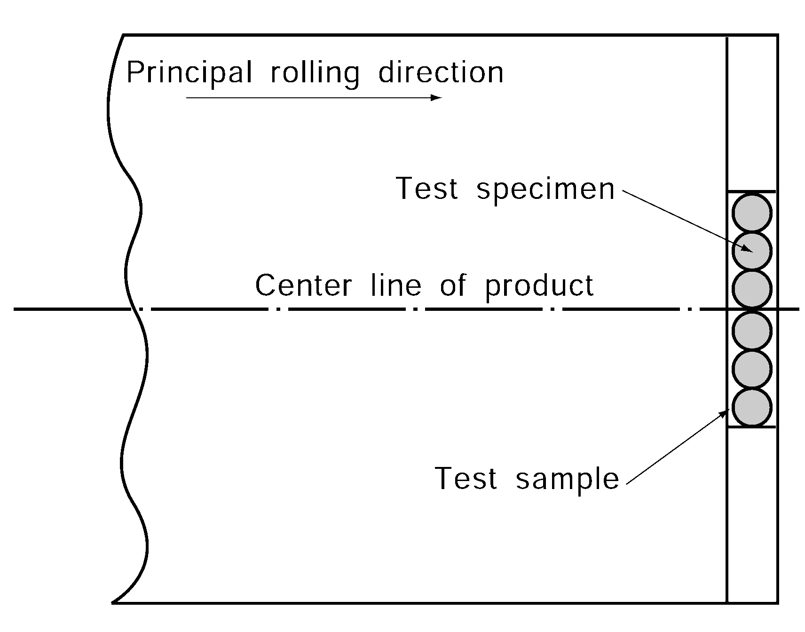
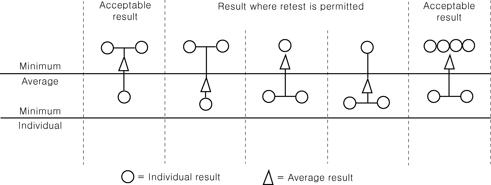
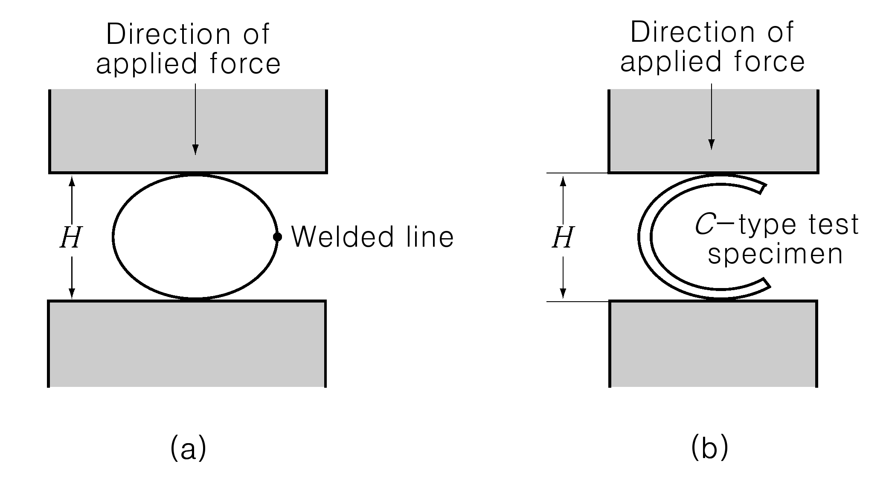
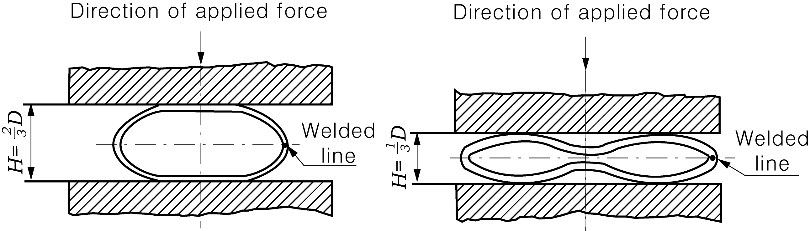
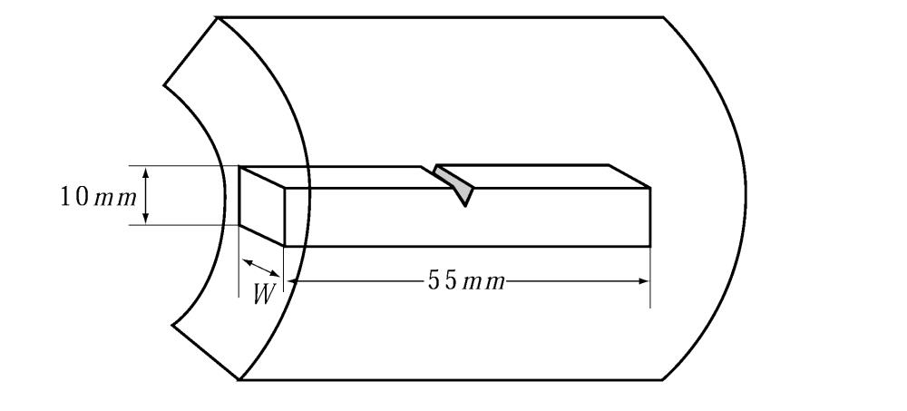
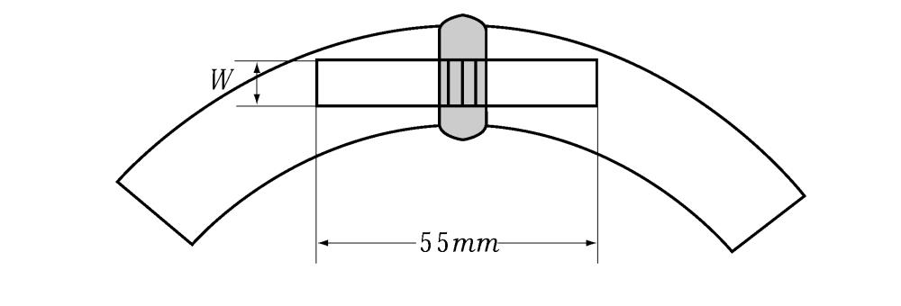
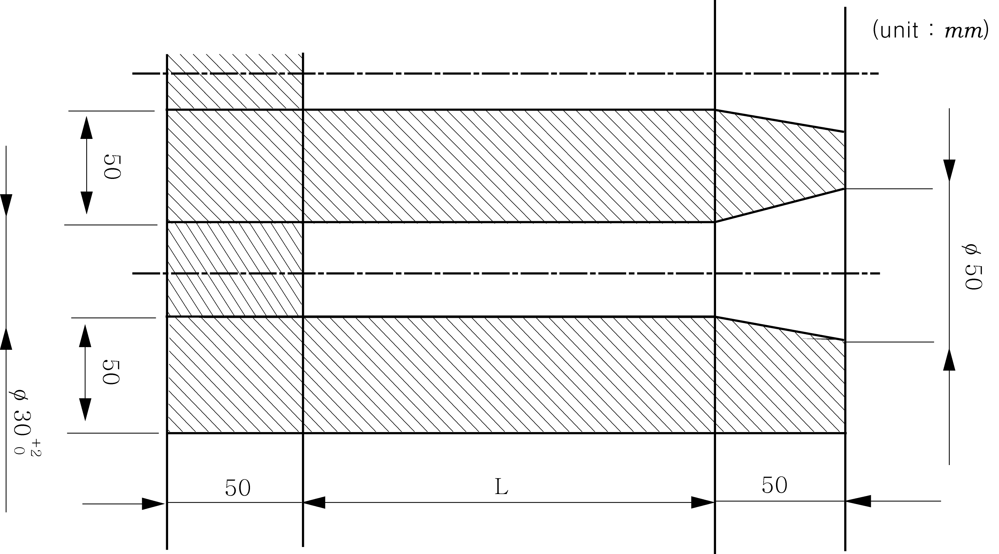
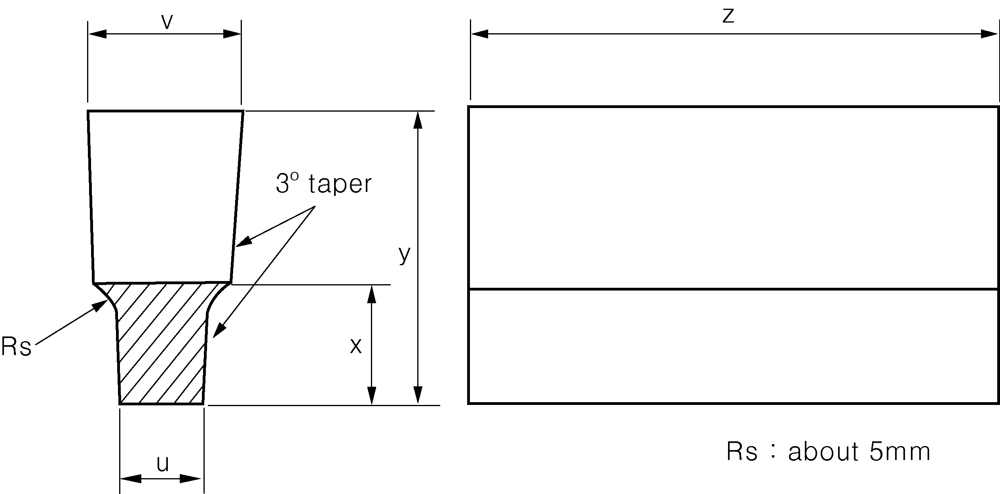

# PART 2 Materials and Welding

> RULES FOR CLASSIFICATION OF STEEL SHIPS / RA-02-E / 2025 / EN / Guidance

## CHAPTER 2 WELDING

### Section 1 General

#### 102. Matters to be approved

"deemed appropriate by the Society" referred in **102. 2** of the Rules means where it is applicable for the other materials and welding than the specified ones in **Pt 2** of the Rules. **【See Rule】**

#### 103. Special weldings

Production weld test for tanks of ships carrying liquefied gases in bulk, and tank circumference hull construction units.

- **1.** **Application**
  When welding is made for independent tanks of ships carrying liquefied gases in bulk, the production weld tests are to be carried out for each position of welding in accordance with the following requirements, in addition to the welding procedure qualification tests specified in **Ch 2, Sec. 4** of the Rules.
  - **(1)** For Type A independent tanks, the production weld test is to be carried out on at least one test sample for every 50 m of welding length of butt joints of principal structural members. However, consideration may be given for reduction of the number of test sample or omission of the production weld test by taking into account the past records and the actual state of quality control system of the manufacturer.
  - **(2)** For Type B independent type tanks, the production weld tests are to be carried out on at least one test sample for every 50 m of welding length of butt joints of principal structural members. However, the number of test sample may be reduced to one test sample for every 100 m of welding length by taking into account the past records and the actual state of quality control system of the manufacturer. In this case, however, at least one or more test specimens are to be selected for one tank.
  - **(3)** For Type C independent type tanks, the production weld tests are to be carried out on at least one test sample for every 30 m of welding length of butt joints of principal structural members. However, the number of test sample may be reduced to one test sample for every 50 m of welding length by taking into account the past records and the actual state of quality control system of the manufacturer.
    Remark : The definitions of type A, B and C independent tank comply with the requirements in the **Pt 7, Ch 5, 401.** of the Rules.
- **2.** **Test procedure**
  - **(1)** The production weld tests are to be carried out for every welding length specified in the above **1.** for welded joints made under the same welding procedure, position of welding and welding conditions.
  - **(2)** Test samples are, in principle, to be located on the same line as the welded joints of the body and to be welded at the same time of welding of the body.
- **3.** **Kind of test**
  Kinds of the test are to be as given in **Table 2.2.1** of the Guidance.

  **Table 2.2.1 Kind of Test**

  | Material | Kind of Test |
  | --- | --- |
  | 9 % Ni steel | Tensile test, bend test and impact test |
  | Stainless steel | Tensile test and bend test |
  | Aluminium alloys | Tensile test and bend test |
  | Steel for low temperature service (excluding 9 % Ni steel) | Tensile test, bend test and impact test |
- **4.** **Test assemblies**
  The shape and size of test assemblies are to be as shown in **Fig 2.2.1** of the Guidance. In cases of Type A and Type B independent tanks, tensile test may not be required.
  
- **5.** **Test specimens**
  - **(1)** The shape and size of tensile test specimens are to be of the *R* 2*A* test specimen specified in **Table 2.2.1** of the Rules.
  - **(2)** The shape and size of bend test specimens are to be of the *RB* 1 or *RB* 2 test specimens specified in **Table 2.2.2** of the Rules. For test specimens with a thickness exceeding 19 mm, side bend test specimens are to be substituted for face bend and root bend test specimens.
  - **(3)** Impact test specimens are to be the charpy V-notch test specimen specified in **Table 2.1.3** of the Rules. In the impact test, one set of test specimens comprising three pieces are to be taken from every test assembly. The test specimens are to be taken alternately from the position "a" and from a position among "b" through "e" where the lowest value is recorded in the welding procedure qualification test, shows in **Fig 2.2.8** of the Rules. This means that one set of three test specimens are taken from a test assembly at the position "a", hence other set of three test specimens are taken in the subsequent test assembly from the position among "b" through "e" where the lowest value is recorded, and this procedure is repeated. No impact test specimens is required in cases of stainless steel and aluminium alloy.
- **6.** **Tensile test**
  - **(1)** The tensile strength of 9 % Ni steels is to be 630 $\mathrm{N}/mm ^{2}$ or more.
  - **(2)** The tensile strength of stainless steels, aluminium alloys and steels for low temperature service (excluding 9 % Ni steels) is to be more than the specified value of the base metal.
- **7.** **Bend test**
  - **(1)** The bend test specimen is to be bent up to an angle of 180${}^{\circ}$ by a test jig with an inner radius of double (three and a third times for aluminium alloys) the thickness of the test specimen.
  - **(2)** The results of the bend test are to be as free from cracks exceeding 3 mm in length in any direction on the outer bent surface and from other significant defects.
- **8.** **Impact test**
  The specified values for the impact test are as given in **Table 2.2.8** of the Rules.

### Section 3 Welding Works and Inspection

#### 303. Application of welding consumables

- **1.** Hydrogen cracking test specified in **303.** (4) of the Rules is to comply with *KS B ISO 17642-2* or equivalent. **【See Rule】**
- **2.** In order to use 4Y46 and 5Y46 specified in **Table 2.2.3** Notes (6) of **303.** of the Rules, the manufacturer of the welding consumables is to be guaranteed that it can be used for EH47-H, and the welding procedure qualification test of the shipyard/manufacturer is to be carried out with satisfactory results in accordance with **Pt 2**, **Ch 2**, **Sec 4** of the Rules. *(2021)* **【See Rule】**

#### 304. Preparation for Welding

- **1.** **Tack welding**
  - **(1)** The application to **304. 2.** (3) of the Rules is to be in accordance with the followings: **【See Rule】**
    **Table 2.2.2 Bead length of tack welds**

    | Steel grade | Kinds | Required Bead length | Remark |
    | --- | --- | --- | --- |
    | Higher strength- low alloy steel Steel casting | Ceq>0.36% | ≥ 50 mm | including TMCP |
    | Higher strength- low alloy steel Steel casting | Ceq≤0.36% | ≥ 30 mm | including TMCP |
    | grade E mild steel |   | ≥ 30 mm |   |
    - **(A)** The bead length of tack welds is to comply with **Table 2.2.2** of the Guidance.
    - **(B)** The pitch of tack welds should generally be approximately 400 mm or shorter.

#### 305. Welding sequence and direction of welding

- **1.** "The special approval of the Society" specified in **305. 3** of the Rules means the fillet weld to satisfy the following. **【See Rule】**
  - **(1)** The welding procedure qualification tests specified in **Sec. 4** of the Rules are accepted as successful.
  - **(2)** The welding consumables are to be those for welding with direction of vertical-downward approved by the Society.
  - **(3)** The joints of steels which welding with direction of vertical- downward is restricted, in general, is to comply with **Table 2.2.3-1** of the Guidance.

    **Table 2.2.3-1 Joints of Steels which Welding with Direction of Vertical Downward is restricted**

    | Grade of steels | Welded joints |
    | --- | --- |
    | Rolled steels for hull | Joints of any E grade to any E grade(E, EH32 and EH36) |
    | Rolled steels for low temperature services | Joints of any steels for low temperature service to any steels for low temperature service, Joints of any steels for low temperature service to any grade of steels |
    | High Strength Steels for Welded Structures | Joints of any high strength steels to any high strength steels, Joints of any high strength steels to any grade of steels |
    | Stainless clad steel plates | Joints of any stainless clad steel plates to any stainless clad steel plates, Joints of any stainless clad steel plates to any grade of steels |
    | Rolled stainless steels | Joints of any rolled stainless steels to any rolled stainless steels, Joints of any rolled stainless steels to any grade of steels |
  - **(4)** The zones where welding with direction of vertical- downward is restricted to hull structure, in general, is to comply with **Table 2.2.3-2** of the Guidance.
- **2.** Notwithstanding the provisions of **1** (3) and (4), the other plans presented by shipbuilder or manufacturer may be accepted provided that the quality control system of shipbuilder and the importance of the welds are considered and deemed appropriate by the Society.

  **Table 2.2.3-2 Zones where Welding with Direction of Vertical Downward is restricted**

  | Divisions | Locations and members |
  | --- | --- |
  | Fillet welded joints of primary strength member | - The welds of BHD(See Fig **2.2.2,** (a) of the Guidance) - Cross hatching areas of Fig **2.2.2,** (c) of the Guidance within connection areas of solid floor and girder - Connection areas of primary strength member and bottom shell, side shell, upper deck and double bottom tank top |
  | Areas where water, oil and air tightness are required | - Boundary line where water, oil and air tightness are required - The area whose distance from the end of tight collar plate shall be at least 50$mm$ (See Fig **2.2.2,** (d) of the Guidance) |
  | Areas where structural continuity is required or where high concentrated stress is expected | - The end of heavy bracket (See Fig **2.2.2,** (b) of the Guidance) - Longitudinal strength members (See Fig **2.2.2**, (e) of the Guidance) |
  | Areas where high concentrated loads is expected | - The lower part of crane post - The lower part of crane pedestal |
  | Specified areas | - The lower part of main engine : Connection areas of main engine girder and floor - Hatch cover : Connection area of side plate and end plate - Hatch coaming : Connection areas of main plate and top plate, Connection areas of main plate main plate - Shaft bed - Rudder horn : Connection areas of casting steels and normal strength steels - Rudder : Connection areas of rudder main pieces and rudder stocks, Connection areas of casting forging steels and normal strength steels - Bracket toe |
  | (Note) Harmful defects such as cracks may, if necessary, be inspected by magnetic particle inspection or liquid penetrant inspection and, where the condition of the quality is serious, the welding work is to discontinue until measures for importance are planned. |   |

  

#### 306. Main welding

- **1.** In application of **306. 2** of the Rules, minimum preheating temperature for welding hull steels at low temperature is to comply with **Table 2.2.4** of the Guidance. **【See Rule】**

  **Table 2.2.4 Preheating for Welding Hull Steels at Low Temperature** ***(2024)***

  | Grades | Standard |   |
  | --- | --- | --- |
  | Grades | Base metal temperature needed preheating | Minimum preheating temperature |
  | Normal strength steels (*A, B, D, E*) | below -5℃ | 20℃ or over (1) |
  | Higher strength steels (*AH* 32, *DH* 32, *EH* 32, *AH* 36, *DH* 36, *EH* 36) | below 0℃ | 20℃ or over (1) |
  | Note : (1) This level of preheat is to be applied unless the approved welding procedure specifies a higher level |   |   |
- **2.** "The welding inserting a liner of suitable size" in **306. 8** of the Rules complies with the **Fig 2.2.3** of the Guidance. **【See Rule】**
  
- **3.** In application to **306. 9** of the Rules, the term "special approval of the Society" means the acceptance in accordance with **Pt 1, Ch 1, 105.** of the Rules. **【See Rule】**

#### 309. Quality of welds

In **309. 3** of the Rules, the application to the non-destructive inspection specified elsewhere is to comply with **Annex 2-7**. **【See Rule】**

### Section 4 Welding Procedure Qualification Tests

#### 403. Welding procedure qualification tests(WPQT)

- **1.** **Welding procedure qualification tests for duplex stainless steels**
  In application to **403. 6** of the Rules, the welding procedure qualification tests for duplex stainless steels are to comply with the followings: **【See Rule】**
  - **(1)** **General**
  - **(2)** **Impact test**
    Requirements in **Pt 2, Ch 2, Sec 4.** of the Rule are to be followed for impact test. 27 J at – 20 °C is to be satisfied. The number of test specimens and the position of notch for the test specimen are as specified in **Fig 2.2.7** of the Rules. The value of average absorbed energy(J) at ­20 °C is to be satisfied with 27 J for center of weld and is to be more than the specified value of the base metal for fusion line and HAZ. *(2017)*
  - **(3)** **Corrosion resistance test**
  - **(4)** **Micro structure test**
  - **(5)** **Tee joints with full penetration** ***(2017)***

    **Table 2.2.5 Kinds of Test for Tee joints with full penetration**

    | Grades and material symbols of test specimens |   | Kinds and number of specimens for test |   |   |   |
    | --- | --- | --- | --- | --- | --- |
    | Grades and material symbols of test specimens |   | Visual insp. | Micro- structure insp. | Macro- structure insp. | Non- destructive insp.^(^1) |
    | Duplex stainless steels | *RSTS* 31803, *RSTS* 32750 | Welding positions of whole length | 1 (6 points)(2) | 2 | Welding positions of whole length |
    | NOTES: (1) Internal inspections by radiographic examination or ultrasonic examination and surface inspections by magnetic particle examination or liquid penetrant examination are to be carried out. (2) The points are to be evenly selected in first and second weld side. |   |   |   |   |   |

    |  |
    | --- |
    | NOTES : 1. The length of test specimen is as follows : (1) Manual and semi-automatic welding : Width W=3 × t, min. 150 mm, Length L=6 × t, min. 350 mm (2) Automatic welding : Width W=3 × t, min. 150 mm, Length L=min. 1000 mm 2. Thickness of webs and flanges of the test assembly, t1 and t2 are to be of ordinary thicknesses used in the actual work. 3. Tack weld may be applied to the test assembly. 4. For manual and semi-automatic welding, a stop/restart is to be included in the test length and its position is to be clearly marked for subsequent examination. For multi-run welding, two(2) macro-structure specimens are to be prepared since a stop/restart area has a long field. |

#### 404. Butt welded joints

- **1.** **Kinds of test**
  "where found necessary by the Society" referred in **404. 2** of the Rules means where the properties are difficult to be investigated by test of **Table 2.2.4** of the Rules. **【See Rule】**
- **2.** **Tensile test**
  - **(1)** "where found necessary by the Society" referred in Note (1), **Table 2.2.4** of **404. 5** of the Rules means where the properties are difficult to be investigated by test of **Table 2.2.4** of the Rules. **【See Rule】**
- **3.** **Impact tests**
  In application to Note (1), **Table 2.2.8** of **404. 6** of the Rules, impact test requirements for thickness above 50mm are in accordance with **Table 2.2.6** of the Guidance.

  **Table 2.2.6 Impact test requirements for butt joints** (50 mm < t ≤ 70 mm)

  | Grade of steel | Test temp. (℃) | Value of minimum average absorbed energy (J) |   |   |
  | --- | --- | --- | --- | --- |
  | Grade of steel | Test temp. (℃) | For manually or semi-automatically welded joints |   | For automatically welded joints |
  | Grade of steel | Test temp. (℃) | Downhand, Horizontal, Overhead | Vertical upward, Vertical downward | For automatically welded joints |
  | *A*(1) | 20 | 47 min. | 41 min. | 41 min. |
  | *B*(1), *D* | 0 | 47 min. | 41 min. | 41 min. |
  | *E* | -20 | 47 min. | 41 min. | 41 min. |
  | *AH* 32, *AH* 36 | 20 | 47 min. | 41 min. | 41 min. |
  | *DH* 32, *DH*36 | 0 | 47 min. | 41 min. | 41 min. |
  | *EH* 32, *EH* 36 | -20 | 47 min. | 41 min. | 41 min. |
  | *FH* 32, *FH* 36 | -40 | 47 min. | 41 min. | 41 min. |
  | *AH* 40 | 20 | 47 min. | 46 min. | 46 min. |
  | *DH* 40 | 0 | 47 min. | 46 min. | 46 min. |
  | *EH* 40 | -20 | 47 min. | 46 min. | 46 min. |
  | *FH* 40 | -40 | 47 min. | 46 min. | 46 min. |
  | Note: (1) For Grade A and B steels average absorbed energy on fusion line and in heat affected zone is to be minimum 27 J. |   |   |   |   |

#### 405. Test for fillet welded joints

- **1.** **Kinds of test**
  "if found necessary by the Society" referred in **405. 2** of the Rules means where the properties and defects are difficult to be investigated by test of the Rules. **【See Rule】**

#### 406. Retests and Procedure qualification records(PQR)

- **1.** **Procedure qualification records(PQR)**
  In application to **406. 2** (1) of the Rules, the term "the discretion of the Society" means the acceptance in accordance with **Pt 1, Ch 1, 105.** of the Rules. **【See Rule】**

#### 407. Validity of qualified welding procedure specification

- **1.** 1**.** In application to **407. 2** (1), (8) (c) of the Rules, the terms "deemed appropriate by the Society" and "the discretion of the Society" mean the acceptance in accordance with **Pt 1, Ch 1, 105.** of the Rules.*(2019)* **【See Rule】**

### Section 5 Welders and Welder Performance Qualification Scheme (2018)

#### 503. Testing procedure

- **1.** **Examination and test**
  - **(1)** "at the discretion of the Society" referred in Note (6), **Table 2.2.17** of **503. 3** of the Rules means where the soundness for test specimens and welder qualification are difficult to be verified by test of **Table 2.2.17** of the Rules. **【See Rule】**
  - **(2)** In application to **503. 3** (3) (f) of the Rules, defects appearing at the corners of a test specimen during test can be investigated in accordance with **Pt 1, Ch 1, 105.** of the Rules. **【See Rule】**

#### 504. General requirements for qualification validity

- **1.** **Maintenance of the approval** ***(2019) (2022)*** **【See Rule】**
  - **(1)** When **504. 2** (1) (C) of the Rules is selected as the method of revalidation for welder qualification, it may be replaced by the followings.
    - **(A)** Quality system of shipyards/manufacturer is to comply with **ISO 3834-2** or equivalent requirements and is to be approved and maintained by third party.
    - **(B)** It is to be confirmed by the Society that **504. 2** (1) (C) (a) and (c) of the Rules are satisfied.
    - **(C)** Through the confirmation of (A) and (B) above, this revalidates the welder’s qualifications for an additional 3 years.

### Section 6 Welding Consumables

#### 601. General

- **1.** **Application**
  In application to **601. 1** (3) of the Rules, the term "the discretion of the Society" means the acceptance in accordance with **Pt 1, Ch 1, 105.** of the Rules. **【See Rule】**

#### 602. Electrodes for manual arc welding for normal strength steels, higher strength steels and steels for low temperature service

- **1.** **Application**
  In application to **602. 1** (2) of the Rules, the term "the discretion of the Society" means the acceptance in accordance with **Pt 1, Ch 1, 105.** of the Rules. **【See Rule】**
- **2.** **General provisions for tests**
  Hot cracking test specified in **602. 3** (1) of the Rules is to be done as follows : **【See Rule】**
  - **(1)** Test assemblies are to be T-joint shape as shown in **Fig 2.2.5** of the Guidance. The bottom of the vertical plate is to grind straight, and adhere closely on the surface of horizontal plate. All surface rough() on the plate is to be removed before welding. The tack welds in preparation for the fillet welds is to make at the both ends of the plate. Three transverse stiffeners are to reinforce the horizontal plate to prevent welding deformation.
    
    **Fig 2.2.5 Hot Cracking Test Assemblies (Units : mm)**
  - **(2)** The number of test assembly is to be prepared for every each diameter (4 mm, 5 mm or 6 mm) of electrodes.
  - **(3)** The fillet welding is to be carried out in the downhand position in one pass on each side and the welding current used is to be the maximum of the range recommended by the manufacturer for the size of electrode used.
  - **(4)** The second fillet weld is to be started immediately after the completion of the first fillet weld from the end of the test specimen at which the first fillet weld was finished. Both fillet welds are to be executed at a constant speed and without weaving.
  - **(5)** Length of fused electrode in hot cracking test are to be as shown **Table 2.2.7** of the Guidance according to the diameter of electrodes.
  - **(6)** After welding, the slag is to be removed from the fillet welds and after complete cooling, they are to be examined for cracks by a magnifying glass or by using penetrant fluids.
  - **(7)** The first fillet weld is then to be removed by machining or gouging and the second weld broken by closing the two plates together, subjecting the root of the weld to tension (See **Fig 2.2.6** of the Guidance). The weld is then to be examined for evidence of hot cracking.

    **Table 2.2.7 Length of Fused Electrode in Hot Cracking Test** (Units : mm)

    | Diameter of electrode | Length of fused electrode |   |
    | --- | --- | --- |
    | Diameter of electrode | 1st fillet | 2nd fillet |
    | 4 | Approx. 200 | Approx. 150 |
    | 5 | Approx. 150 | Approx. 100 |
    | 6 | Approx. 100 | Approx. 75 |

     
    **Fig 2.2.6 Hot Cracking Test**
  - **(8)** There is to be no cracking in the fillet welds either superficial or internal except crater crack.
- **3.** **Fillet weld test**
  In application to **602. 7** (3) of the Rules, the term "those deemed appropriate by the Society" means the acceptance in accordance with **Pt 1, Ch 1, 105.** of the Rules. **【See Rule】**

#### 606. One side welding consumables for normal strength steels, higher strength steels and steels for low temperature service

- **1.** **Application**
  In application to **606. 1** (2), (3) of the Rules, the term "deemed appropriate by the Society" means the acceptance in accordance with **Pt 1, Ch 1, 105.** of the Rules. **【See Rule】**

#### 607. Welding consumables for stainless steels

- **1.** **Welding consumables for duplex stainless steels**
  In application to **607. 1** (2) of the Rules, the approval tests and annual inspections for welding consumables used for duplex stainless steels(hereinafter referred to as "welding consumables") are to comply with the followings: **【See Rule】**
  - **(1)** **General**
    Approval test items, test methods and acceptance criteria not specified in this Instruction are to be in accordance with **Ch 2, Sec 2 607.** of the Rules.
  - **(2)** **Grades and marks**

    **Table 2.2.8 Grades and Marks of Welding Consumables**

    | Electrode for manual arc welding | Material for TIG and MIG welding | Flux cored wire semi-automatic welding | Consumables for submerged welding |
    | --- | --- | --- | --- |
    | *RD* 31803 | *RY* 31803 | *RW* 31803 | *RU* 31803 |
    | *RD* 32750 | *RY* 32750 | *RW* 32750 | *RU* 32750 |
  - **(3)** **General provisions for tests**

    **Table 2.2.9 Grades of Steel for Test Assembly**

    | Grade of welding consumables | Grade of steel for test assembly^(^1) |
    | --- | --- |
    | *RD* 31803, *RY* 31803, *RW* 31803, *RU* 31803 | *RSTS* 31803 |
    | *RD* 32750, *RY* 32750, *RW* 32750, *RU* 32750 | *RSTS* 32750 |
    | NOTE: (1) Notwithstanding the requirements in this table, mild steel or higher strength steel may be used for deposited metal test assembly. In this case, test assemblies are to be appropriately buttered. |   |
  - **(4)** **Deposited metal test**
  - **(5)** **Butt weld test**
  - **(6)** **Corrosion resistance test**
  - **(7)** **Micro structure test**
    The ferrite content in the weld metal shall be determined in accordance with ASTM E 562 and shall be in the range of 25% to 70%.
  - **(8)** **Annual inspections**
    Annual inspections are to be in accordance with **Pt 2, Ch 2, 607. 6** of the Rules.
- **2.** **General provisions for tests**
  In application to **607. 3** (1) of the Rules, the term "deemed necessary by the Society" means the acceptance in accordance with **Pt 1, Ch 1, 105.** of the Rules. **【See Rule】** 
