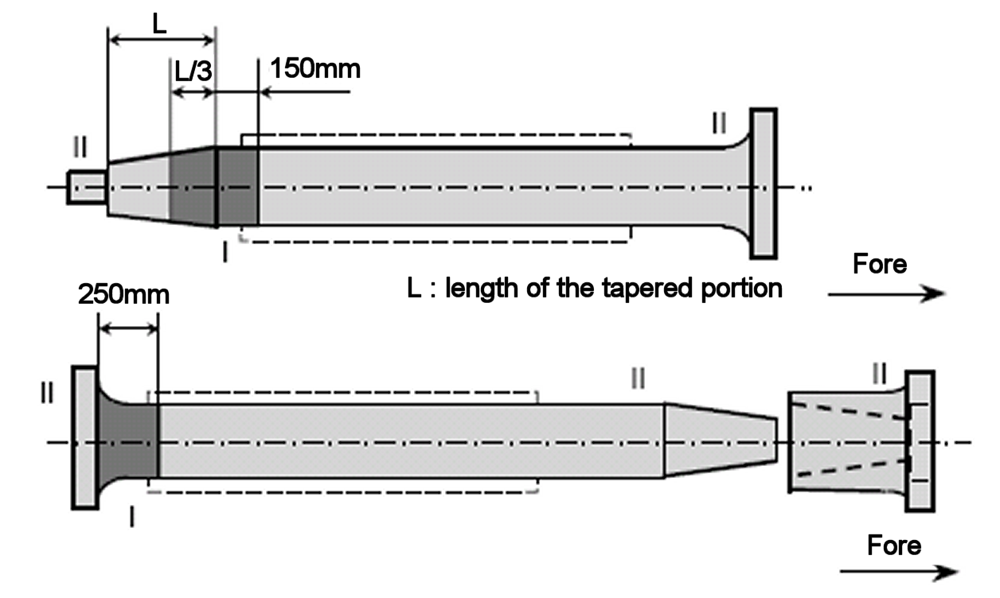

# PART 2 Materials and Welding

> RULES FOR CLASSIFICATION OF STEEL SHIPS / RA-02-E / 2025 / EN / Guidance

## Annex 2-5 Guidance for non-destructive examination of hull and machinery steel forgings

### 1. Application

#### (1) The requirements in this Guidance is intended to give general guidance on the extent, methods and recommended quality levels applicable to the non-destructive examinations (NDE) of steel forgings(hereinafter referred to as "forgings") specified in Ch 1, 601. 8 and 10 of the Rules.

#### (2) For steel forgings(e.g. components for couplings, gears, boilers and pressure vessels) other than those specified in this Guidance, the requirements in this Guidance may apply correspondingly considering their materials, kinds, shapes and stress conditions being subjected.

#### (3) The requirements in this Guidance may be also applied to the testing of austenitic stainless steel and ferritic-austenitic (duplex) stainless steel forgings. (2022)

#### (4) Forgings should be examined in the final delivery condition. Where intermediate inspections have been performed the manufacturer should provide reports of the results upon the request of the Surveyor. (2022)

#### (5) Where a forging is supplied in semi finished condition, the manufacturer shall take into consideration the quality level of final finished machined components.

#### (6) NDE personnel requirements and inspection plans are to comply with the requirements specified in Annex 2-2, 2 and 4 (2), (a) of this Guidance.

#### (7) Where advanced ultrasonic testing methods are applied, e.g. PAUT or TOFD, reference is made to Annex 2-12 for general approach in adopting and application of these advanced methods. Acceptance levels regarding accept/reject criteria should be as per the applicable requirements in this Guidance. (2022)

### 2. Surface Inspections

#### (1) General

- **(A)** Surface inspections in this Guidance should be carried out by visual examination and magnetic particle testing or penetrant testing, for the purpose of detecting relevant indications and assessing them against accept/reject criteria stated herein. Personnel engaged in visual examination should have sufficient knowledge and experience, however, may be exempted from formal qualification requirements in this Guidance. *(2022)*
- **(B)** The testing procedures, apparatus and conditions of magnetic particle testing and liquid penetrant testing should comply with the recognized national or international standards.
- **(C)** Other surface inspection methods, e.g. eddy current testing, may be required by the Society as a supplementary method, e.g. for confirming the presence of indications, or for detecting the presence of undocumented weld repairs. This Guidance does not include accept/reject criteria for this purpose and is mentioned here for information only. *(2022)*

#### (2) Products

- **(A)** The steel forgings specified in **Pt 2, Ch 1, 601.** should be subjected to a 100 % visual examination of all accessible surfaces by the manufacturer and made available to the Surveyor. For mass produced forgings the extent of examination is to be as deemed appropriate by the Society. *(2022)*
- **(B)** It is noted that **Pt 2, Ch 1, 601.** does not include every forged component type that may be subject to Classification(for example, forged slewing rings). In such cases where the particular component or type is not included, either in **Pt 2, Ch 1, 601.** or this Guidance, appropriate national/international standards, or relevant Rules may be applied, to determine the appropriate testing regime and defect acceptance criteria. *(2022)*
- **(C)** Austenitic stainless steel and ferritic-austenitic(duplex) stainless steel forgings acceptance criteria details are included in this Guidance for surface and volumetric inspections, however, other acceptance criteria and national or Austenitic international standards may be applied, upon agreement with the Society. *(2022)*
- **(D)** Where such standards are used or referenced as a basis for accept and reject criteria, the quality level should provide reasonable equivalence to the allowable criteria stated in the appropriate tables within this Guidance. The quality levels would normally be the highest or most stringent, to provide reasonable equivalence with this Guidance. *(2022)*
- **(E)** Surface inspections by magnetic particle and/or penetrant methods generally apply to the following steel forgings:
  - **(a)** All crankshafts;
  - **(b)** Propeller shafts, intermediate shafts, thrust shafts and rudder stocks with minimum diameter not less than 100 mm;
  - **(c)** Cylinder heads, connecting rods, piston rods and crosshead, as per the engine type and size requirements in **Pt 5** of the Rules. *(2022)*
  - **(d)** Bolts with minimum diameter not less than 50 mm, which are subjected to dynamic stresses such as cylinder cover bolts, coupling bolts for crankshafts, tie rods, crankpin bolts, main bearing bolts and other items as per the engine type and size requirements in **Pt 5** of the Rules. *(2022)*
  - **(e)** Propeller blade fastening bolts which are subjected to dynamic stresses. *(2022)*

#### (3) Zones for Surface Inspections

Magnetic particle, or where permitted penetrant testing, should be carried out in zones I, II and III(as applicable) as indicated in **Figs 1** to **4**. *(2022)*

#### (4) Surface Condition

The surfaces of forgings to be examined should be free from scale, dirt, grease or paint.

** (a) Solid crankshaft**

|  (b) Semi built-up crankshaft |   |   |
| --- | --- | --- |
| Notes) 1. Where the crankpin or journal has oil holes, the circumferential surfaces of the oil holes are to be treated as Zone I. (See the figure in the right.) 2. In the above figures, "θ", "a" and "b" mean: θ= 60° a = 1.5 r b = 0.05 d (circumferential surfaces of shrinkage fit) where, r : fillet radius d : journal diameter 3. Identification of the Zones (Similar in Figs. 1 thru 4): |   |  db : oil hole bore diameter |
|  | : Zone I : Zone II |   |
| **Fig 1 Zones for magnetic particle / liquid penetrant testing on crankshafts** |   |   |

|  (a) Propeller shaft |  (b) Intermediate shaft |
| --- | --- |
|   |  (c) Thrust shaft |
| Note) For propeller shaft, intermediate shafts and thrust shafts, all areas with stress raisers such as radial holes, slots and key ways are to be treated as Zone I. |   |
| **Fig 2 Zones for magnetic particle / liquid penetrant testing on shafts** |   |

|  (a) Connecting rod |  (b) Piston rod |  (c) Cross head |
| --- | --- | --- |
|   |   |  (d) Bolt |
| **Fig 3 Zones for magnetic particle / liquid penetrant testing on machinery components** |   |   |

|  (a) Type A |
| --- |
|  (b) Type B |
|  (c) Type C |
| **Fig 4 Zones for magnetic particle / liquid penetrant testing on rudder stocks** |

#### (5) Surface Inspection (2022)

- **(A)** Where indicated by **Figs 1** to **4**, magnetic particle inspection should be carried out with the following exceptions, when penetrant testing would be permitted :
  - austenitic and ferritic-austenitic(duplex) stainless steels;
  - interpretation of open visual or magnetic particle indications,
  - at the instruction of the Surveyor.
- **(B)** Unless otherwise detailed in the specification, the magnetic particle test should be performed on a forging in the final machined surface condition and final thermally treated condition.
- **(C)** Unless otherwise agreed, the surface inspection should be carried out in the presence of the Surveyor. The surface inspection should be carried out before the shrink fitting, where applicable.
- **(D)** For magnetic particle testing, attention should be paid to the contact between the forging and the clamping devices of stationary magnetization benches in order to avoid local overheating or burning damage in its surface. Prods should not be permitted on finished machined items.
- **(E)** When indications are detected as a result of the surface inspection, acceptance or rejection is to be decided in accordance with clause (6)

#### (6) Acceptance Criteria and Rectification of Defects (2022)

- **(A)** *Acceptance Criteria Visual Inspection*
  - **(a)** All forgings should be free of cracks, crack-like indications, laps, seams, folds, or other detrimental indications. At the request of the Surveyor, additional magnetic particle, penetrant and ultrasonic testing may be required for a more detailed evaluation of surface irregularities.
  - **(b)** The bores of hollow propeller shafts should be visually examined for imperfections uncovered by the machining operation.
- **(B)** *Acceptance Criteria Magnetic Particle Testing and Liquid Penetrant Testing*
  - **(a)** The following definitions relevant to indications apply:
  - **(i)** Linear indication : an indication with a largest dimension three or more times its smallest dimension (i.e. l ≥ 3w).
    - Non-linear indications form an alignment when the distance between indications is less than 2mm and at least three indications are aligned. An alignment of indications is considered to be a unique indication and its length is equal to the overall length of the alignment.
    - Linear indications form an alignment when the distance between two indications is smaller than the length of the longest indication.
    - **(ii)** Nonlinear indication : an indication with a largest dimension less than three times its smallest dimension (i.e. l < 3w).
    - **(iii)** Aligned indication :
    - **(iv)** Open indication : an indication visible after removal of the magnetic particles or that can be detected by the use of penetrant testing;
  - **(v)** Non-open indication : an indication that is not visually detectable after removal of the magnetic particles or that cannot be detected by the use of penetrant testing,
    - **(vi)** Relevant indication : an indication that is caused by a condition or type of discontinuity that requires evaluation. Only indications which have any dimension greater than 1.5 mm shall be considered relevant for the categorization of indications.
  - **(b)** For the purpose of evaluating indications, the surface should be divided into reference areas of 225 cm^2. The area shall be taken in the most unfavourable location relative to the indication being evaluated.
  - **(c)** The allowable number and size of indications in the reference area is given in **Table 1** for crankshaft forgings and in **Table 2** for other forgings(including austenitic stainless steel and ferritic-austenitic(duplex) stainless steel forgings), respectively. Cracks are not acceptable. Irrespective of the results of non-destructive examination, the Surveyor may reject the forging if the total number of indications is excessive.
- **(C)** *Rectification of Defects*
  - **(a)** Defects and unacceptable indications must be rectified as indicated below and detailed in (i) thru (v). Generally it may be permissible to remove shallow indications by light grinding to a maximum depth of 1.5 mm.
  - **(i)** Defective parts of material may be removed by grinding, or by chipping and grinding. All grooves shall have a bottom radius of approximately three times the groove depth and should be smoothly blended to the surface area with a finish equal to the adjacent surface.
    - **(ii)** To depress is to flatten or relieve the edges of a non-open indication with a fine pointed abrasive stone with the restriction that the depth beneath the original surface shall be 0.08 mm minimum to 0.25 mm maximum and that the depressions be blended into the bearing surface. A depressed area is not considered a groove and is made only to prevent galling of bearings.
    - **(iii)** Non-open indications evaluated as segregation need not be rectified.
    - **(iv)** Complete removal of the defect should be proved by magnetic particle testing or penetrant testing, as appropriate.
  - **(v)** Repair welding should not be permitted for crankshafts or rotating items subjected to torsional fatigue(such as propeller shafts). Repair welding of other forgings should be subject to prior approval of the Society.
    - **(vi)** Grinding is not permitted in way of finished machined threads.
  - **(b)** *Zone I in crankshaft forgings*
    Neither indications nor repair are permitted in this zone.
  - **(c)** *Zone II in crankshaft forgings*
  - **(i)** Indications must be removed by grinding to a depth no greater than 1.5 mm.

    | Inspection Zone | Max. number of indications | Type of indication | Max. number for each type | Max. dimension (mm) |
    | --- | --- | --- | --- | --- |
    | I (critical fillet area) | 0 | Linear Nonlinear Aligned | 0 0 0 | - - - |
    | II (important fillet area) | 3 | Linear Nonlinear Aligned | 0 3 0 | - 3.0 - |
    | III (journal surfaces) | 3 | Linear Nonlinear Aligned | 0 3 0 | - 5.0 - |

    | Inspection Zone | Max. number of indications | Type of indication | Max. number for each type | Max. dimension (mm) |
    | --- | --- | --- | --- | --- |
    | I | 3 | Linear Nonlinear Aligned | 0(1) 3 0(1) | - 3.0 - |
    | II | 10 | Linear Nonlinear Aligned | 3(1) 7 3(1) | 3.0 5.0 3.0 |
    | Note: (1) Linear or aligned indications are not permitted on bolts, which receive a direct fluctuating load, e.g. main bearing bolts, connecting rod bolts, crosshead bearing bolts, cylinder cover bolts. |   |   |   |   |
    - **(ii)** Indications detected in the journal bearing surfaces must be removed by grinding to a depth no greater than 3.0 mm. The total ground area shall be less than 1 % of the total bearing surface area concerned.
    - **(iii)** Non-open indications, except those evaluated as segregation, shall be depressed but need not be removed.
  - **(d)** *Zone I in other forgings*
    Indications must be removed by grinding to a depth no greater than 1.5 mm.
  - **(e)** *Zone II in other forgings*
    Indications must be removed by grinding to a depth no greater than 2 % of the diameter or 4.0 mm, whichever is smaller.
  - **(f)** *Zones other than I and II in all forgings*
    Defects detected by visual inspection must be removed by grinding to a depth no greater than 5 % of the diameter or 10mm, whichever is smaller. The total ground area shall be less than 2 % of the forging surface area.

#### (7) Record (2022)

Test results of surface inspections should be recorded at least with the following items:
- for liquid penetrant testing : the penetrant system used and viewing conditions(as appropriate to the penetrant technique and media used)
- for magnetic particle testing : method of magnetizing, test media, magnetic field strength, magnetic flux indicators(where appropriate), and viewing conditions (as appropriate to the magnetizing technique and media used)

### 3. Ultrasonic testing

#### (1) General (2022)

- **(A)** Volumetric inspection in this Guidance should be carried out by ultrasonic testing using the contact method with straight beam and/or angle beam technique. Advanced UT methods (such as PAUT or TOFD) should meet the general requirements of **Annex 2-12**.
- **(B)** The testing procedures, apparatus and conditions of ultrasonic testing should comply with recognized national or international standards. Generally, the methods of setting test sensitivity and testing evaluation utilise the DAC(distance amplitude correction) or DGS(distance-gain size) methods. The applied methodology should use 2 to 4 MHz straight beam(or normal) probes and/or angle beam probes. For near surface testing(up to a depth of 25 mm) twin crystal 0° probe should be used, plus a 0° probe (usually single crystal beyond a depth of 25 mm) for the remaining volume. The appropriate acceptance criteria tables should be used, depending on the sensitivity method selected.
- **(C)** Fillet radii should be examined using 45°, 60° or 70° probes, primarily to determine the presence of any cracks within the radiused areas, and as an additional scan to confirm any indications that may have been detected with 0° probe(s) within this area.
- **(D)** For fabricated forgings and weld repairs, weld testing should be carried out to the appropriate standard, and the acceptance tables contained herein should not be used as a basis for acceptance criteria of welds.
- **(E)** Construction of DAC curves for normal probes should be performed using reference blocks containing suitably sized Flat Bottom Holes (FBH) spaced over the inspection thickness. Reference blocks should be manufactured from similar material, with similar surface condition to that being inspected. Where necessary, allowances should be made for attenuation losses by performing a transfer correction and adjusting the DAC curve as required. The applied transfer correction(measured in decibels(dB)) should become the new reference sensitivity, to which indications are evaluated against, according to the appropriate table contained herein.

#### (2) Products (2022)

- **(A)** Volumetric inspections by ultrasonic testing generally apply to the following steel forgings :
  - **(a)** All crankshafts
  - **(b)** Propeller shafts, intermediate shafts, thrust shafts and rudder stocks with minimum diameter not less than 200 mm,
  - **(c)** Cylinder heads, connecting rods, piston rods, crosshead, coupling bolts and studs as per the engine type and size requirements in **Pt 5** of the Rules.
- **(B)** It is noted that **Pt 2, Ch 1, 601.** of the Rules does not include every forged component type that may be subject to Classification(for example, forged slewing rings). In such cases where the particular component or type is not included, either in **Pt 2, Ch 1, 601.** of the Rules or this Recommendation, appropriate national/international standards, or Rules may be applied, to determine the appropriate testing regime and defect acceptance criteria.
- **(C)** Where such standards are used or referenced as a basis for accept and reject criteria, the quality level should provide reasonable equivalence to the allowable criteria stated in the appropriate tables within this Guidance. The quality levels would normally be the highest or most stringent, to provide reasonable equivalence with this Guidance.
- **(D)** Ultrasonic acceptance criteria detailed in **Tables 3** to **6** are intended for C, C-Mn, and alloy steel forgings, and do not apply to austenitic stainless steel or ferritic-austenitic(duplex) stainless steel forgings. Examples of standards for acceptance criteria for stainless steel or duplex stainless steel forgings are detailed below, and quality levels should be agreed with the Society. Other national or international standards may be used, as agreed with the Society.
  - **(a)** **ASTM A745/A745M-20**
  - **(b)** **EN 10228-4:2016**

#### (3) Zones for ultrasonic testing

- **(A)** Ultrasonic testing should be carried out in the zones I to III as indicated in Figs 5 to 8. Areas may be upgraded to a higher zone at the discretion of the Surveyors.

  ** Scanning direction**

  |  (a) Solid crankshaft |   |
  | --- | --- |
  |  (b) Semi built-up crankshaft |   |
  | Note) 1. In the above figures, "a" and "b" mean: a = 0.1d or 25mm, whichever greater b = 0.05d or 25mm, whichever greater (circumstances of shrinkage fit) where, d : pin or journal diameter 2. Core areas of crank pins and/or journals within a radius of 0.25d between the webs may generally be coordinated to Zone II. 3. Identification of the Zones (Similar in Figs. 5 thru 8.): |   |
  |  | : Zone I : Zone II : Zone III |
  | **Fig 5 Zones for ultrasonic testing on crankshafts** |   |

  |  Scanning direction |  (b) Intermediate shaft |
  | --- | --- |
  |  (a) Propeller shaft |  (c) Thrust shaft |
  | Notes) 1. For hollow shafts, 360° radial scanning applies to Zone III. 2. Circumferences of the bolt holes in the flanges are to be treated as Zone II. |   |
  | **Fig 6 Zones for ultrasonic testing on shafts** |   |

  |  Scanning direction |  (b) Piston rod |
  | --- | --- |
  |  (a) Connecting rod |   |
  |   |  (c) Cross head |
  | **Fig 7 Zones for ultrasonic testing on machinery components** |   |

  |  Scanning direction for Type A and Type B |
  | --- |
  |  (a) Type A |
  |  (b) Type B |
  |  (c) Type C Scanning direction Type C |
  | **Fig 8 Zones for ultrasonic testing on rudder stocks** |

#### (4) Surface Condition

- **(A)** The surfaces of forgings to be examined should be such that adequate coupling can be established between the probe and the forging and that excessive wear of the probe should be avoided. The surfaces are to be free from scale, dirt, grease or paint.
- **(B)** The ultrasonic testing should be carried out after the steel forgings have been machined to a condition suitable for this type of testing and after the final heat treatment , but prior to the drilling of the oil bores, prior to surface hardening and the machining of bolt threads. Black(or ‘as forged’) forgings should be inspected after removal of the oxide scale by either flame descaling or shot blasting methods. *(2022)*

#### (5) Acceptance Criteria

Acceptance criteria of volumetric inspection by ultrasonic testing are shown in **Table 3** and **6**.

| Type of Forging | Zone | Allowable disc shape according to *DGS*^(^1) | Allowable length of indication(2) | Allowable distance between two indications(3) |
| --- | --- | --- | --- | --- |
| Crank shaft | I II III | d ≤ 1.0 mm(4) d ≤ 2.0 mm d ≤ 4.0 mm | Not applicable(5) ≤ 10 mm ≤ 15 mm | Not applicable ≥ 20 mm ≥ 20 mm |
| Notes : (1) *DGS* : Distance Gain Size evaluation system (2) The transference distance of the probe in the range where the echo height exceeds 50% of DGS line is taken as the length of indication. (3) In case of accumulations of two or more isolated indications which are subjected to registration the minimum distance between two neighbouring indications should be at least the length of the larger indication. This also applies to the distance in axial direction as well as to the distance in depth. Isolated indications with less distances should be determined as one single indication. (4) For zone 1 testing, probe selection should take into account the limits of probe beam-path length and depth of beam penetration and should normally be carried out with a minimum probe frequency of 4 MHz. (5) For zone 1, indications with an echo height greater than a 1.0 mm disc shaped reflector are not acceptable. Indications with an echo height of less than or equal to 1.0 mm are acceptable if they are deemed as point reflectors and have no measurable length. |   |   |   |   |

| Type of Forging | Zone | DAC reference level, based on 3.0 mm FBH(1)(2)(3) | Allowable length of indication | Allowable distance between two indications(5) |
| --- | --- | --- | --- | --- |
| Crank shaft | I II III | 3.0 mm DAC – 19 dB 3.0 mm DAC – 7 dB 3.0 mm DAC + 5 dB | Not applicable(4) ≤ 10.0 mm ≤ 15.0 mm | Not applicable ≥ 20 mm ≥ 20 mm |
| Notes : (1) The requirement of a 3mm FBH is to standardise the DAC reference blocks for clarity and consistency. The dB value for the FBH/DAC setting is equivalent to the disc shaped reflector stated in **Table 3**, corresponding to the applicable zone. (2) Other size FBH’s may be used for the DAC method (and the dB value adjusted accordingly to provide equivalence with the stated FBH/disc shaped reflector). Where other size FBH’s are used, the ultrasonic procedure should state the equivalence using an appropriate calculation formula. (3) For zone 1 testing, probe selection should take into account the limits of probe beam-path length and depth of beam penetration and should normally be carried out with a minimum probe frequency of 4 MHz. (4) For zone 1, indications with an echo height greater than the DAC reference level are not acceptable. Indications with an echo height of less than the DAC reference level are acceptable if they are deemed as point reflectors and have no measurable length. (5) In case of accumulations of two or more isolated indications which are subject to registration the minimum distance between two neighbouring indications be at least the length of the larger indication. This also applies to the distance in axial directions as well as to the distance in depth. Isolated indications with less distances should be determined as one single indication. |   |   |   |   |

| Type of Forging | Zone | Allowable disc shape according to *DGS*^(^1)(2) | Allowable length of indication(3) | Allowable distance between two indications(4) |
| --- | --- | --- | --- | --- |
| Propeller shaft, intermediate shaft Thrust shaft, Rudder stock | II | outer: d≤2 mm inner: d≤4 mm | ≤ 10 mm ≤ 15 mm | ≥ 20 mm ≥ 20 mm |
| Propeller shaft, intermediate shaft Thrust shaft, Rudder stock | III | outer: d≤3 mm inner: d≤6 mm | ≤ 10 mm ≤ 15 mm | ≥ 20 mm ≥ 20 mm |
| Connecting rod, Piston rod, Crosshead | II | d≤2.0 mm | ≤ 10 mm | ≥ 20 mm |
| Connecting rod, Piston rod, Crosshead | III | d≤4.0 mm | ≤ 10 mm | ≥ 20 mm |
| Notes : (1) *DGS* : Distance Gain Size evaluation system (2)Outer part means the part beyond one third of the shaft radius from the centre, the inner part means the remaining core area. (3) The transference distance of the probe in the range where the echo height exceeds 50% of DGS line is taken as the length of indication. (4) In case of accumulations of two or more isolated indications which are subjected to registration the minimum distance between two neighbouring indications must be at least the length of the larger indication. Isolated indications with less distances should be determined as one single indication. |   |   |   |   |

| Type of Forging | Zone | DAC reference level, based on 3.0 mm FBH(1)(2) | Allowable length of indication | Allowable distance between two indications(3) |
| --- | --- | --- | --- | --- |
| Propeller shaft, intermediate shaft, Thrust shaft, Rudder stock | II | Outer : DAC – 7 dB Inner : DAC + 5 dB | ≤ 10.0 mm ≤ 15.0 mm | ≥20 mm ≥20 mm |
| Propeller shaft, intermediate shaft, Thrust shaft, Rudder stock | III | Outer : +0 DAC Inner : DAC + 12 dB | ≤ 10.0 mm ≤ 15.0 mm | ≥20 mm ≥20 mm |
| Connecting rod, Piston rod, Crosshead | II | DAC – 7 dB | ≤ 10.0 mm | ≥20 mm |
| Connecting rod, Piston rod, Crosshead | III | DAC + 5 dB | ≤ 10.0 mm | ≥20 mm |
| Notes : (1) The requirement of a 3 mm FBH is to standardise the DAC reference blocks for clarity and consistency. The dB value for the FBH/DAC setting is equivalent to the disc shaped reflector stated in **Table 3**, corresponding to the applicable zone. (2) Other size FBH’s may be used for the DAC method (and the dB value adjusted accordingly to provide equivalence with the stated FBH/disc shaped reflector). Where other size FBH’s are used, the ultrasonic procedure should state the equivalence using an appropriate calculation formula. (3) In case of accumulations of two or more isolated indications which are subject to registration the minimum distance between two neighbouring indications must be at least the length of the larger indication. This also applies to the distance in axial directions as well as to the distance in depth. Isolated indications with less distances should be determined as one single indication. |   |   |   |   |

#### (6) Reporting (2022)

Test results of volumetric inspection should be recorded at least with the following items:
- Equipment used(instrument, probes [and any adaptions to probes for curved surfaces], calibration and refence blocks)
- Technique(s) used to set test sensitivity(including sensitivity method, specific reference blocks, reflector size, transfer correction)
- Maximum scanning rate(mm/s)
- Details of any testing restrictions
