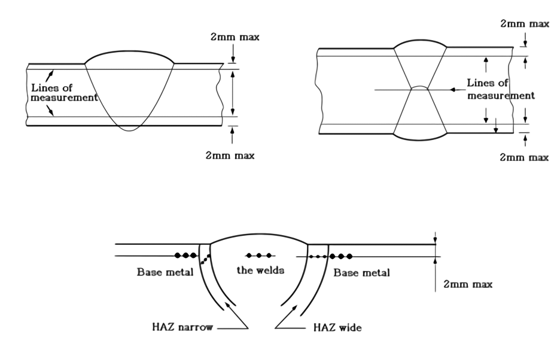

# PART 2 Materials and Welding

> RULES FOR CLASSIFICATION OF STEEL SHIPS / RA-02-E / 2025 / EN / Guidance

## Annex 2-6 Guidance for liquid penetrant inspection and repair of defects of copper alloy propeller castings

### 2. The liquid penetrant inspection

#### (1) Area of test (Severity zones)

|  |  |
| --- | --- |
| * The definition of skew angle comply with the requirements in the Pt 5, Ch 3, 303. of the Guidances (Notes) 1. R : The radius of the propeller 2. The boss area of an integrally cast propeller is regarded as Zone C. 3. Where stress distribution on propeller blade surface is estimated in detail, the non-destructive inspection zones different from those shown in this figure may be applied subject to this Society's approval. |   |

**Fig 2 Zones for Non-destructive Inspection on the Root Area of the Controllable Pitch or Build up Propeller Blades and Controllable Pitch Propeller Boss**

#### (2) Methods of testing

#### (3) Definitions of liquid penetrant indications(refer to Fig 3) (2021)

- **(A)** Indication : In the liquid penetrant testing an indication is the presence of detectable bleed-out of the penetrant liquid from the material discontinuities appearing at least 10 minutes after the developer has been applied.
- **(B)** Relevant indication: Only indications which have any dimension greater than 1.5mm shall be considered relevant for the categorization of indications.
- **(C)** Non-linear indication: indication having a length less than or equal to three times its width (i.e. l ≤ 3w). *(2025)*
- **(D)** Linear indication: : indication having a length greater than three times its width (i.e. l > 3w). *(2025)*
- **(E)** Aligned indications
  - **(a)** Non-linear indications form an alignment when the distance between indications is less than 2 mm and at least three indications are aligned. An alignment of indications is considered to be a unique indication and its length is equal to the overall length of the alignment.
  - **(b)** Linear indications form an alignment when the distance between two indications is smaller than the length of the longest indication.
    
    **Shape of indications** ***(2021) (2025)***

#### (4) Acceptance criteria

- **(A)** Where cracks or other defects which do not meet the acceptance criteria given in **Table 1** are detected by the penetrant test, the defects are to be repaired in accordance with the requirements in **3.**.
- **(B)** Areas which are prepared for welding are independent of their location always to be assessed according to zone A. The same applies to the welded areas after being finished machined and/or grinded.
- **(C)** Indications exceeding the acceptance standard of **Table 1**, cracks, shrinkage cavities, sand, slag and other non-metallic inclusions, blow holes and other discontinuities which may impair the safe service of the propeller are defined as defects and must be repaired in accordance with the requirements specified in **3** below.

  **Table 1 Acceptance Criteria** ***(2021)***

  | Are of test | Type of Indication (excluding crack) | Acceptance Criteria |   |   |
  | --- | --- | --- | --- | --- |
  | Are of test | Type of Indication (excluding crack) | Max. total number of indications(I) | Indications of same type |   |
  | Are of test | Type of Indication (excluding crack) | Max. total number of indications(I) | Max. number of each type(II) | Max. size for each indication(III) (mm) |
  | Zone A | Non-linear | 7 | 5 | 4 |
  | Zone A | Linear | 7 | 2 | 3 |
  | Zone A | Aligned | 7 | 2 | 3 |
  | Zone B | Non-linear | 14 | 10 | 6 |
  | Zone B | Linear | 14 | 4 | 6 |
  | Zone B | Aligned | 14 | 4 | 6 |
  | Zone C | Non-linear | 20 | 14 | 8 |
  | Zone C | Linear | 20 | 6 | 6 |
  | Zone C | Aligned | 20 | 6 | 6 |
  | (Notes) (1) The indications are to be repaired when they do not meet one or more criteria of (I) through (III) in this table. (2) The counting of the number of indications is to be conducted at the most unfavourable location relative to the indication being evaluated. The area of a reference zone is to be 100$\mathrm{cm} ^{2}$. Each reference area may be square or rectangular with the major dimension not exceeding 250 mm. (3) Singular non-linear indications less than 2 mm for zone A and less than 3 mm for other zones are not considered relevant. (4) Where only non-linear indications were detected, all indications(I) are to be repaired for the judgement. |   |   |   |   |

### 3. Repair of defects

#### (1) Repair procedures

- **(A)** In general, the repairs are to be carried out by mechanical means, e. g. by grinding, chipping or milling. After milling or chipping, grinding is to be applied for such defects.
- **(B)** The contour of the ground depression is as smooth as possible in order to avoid stress concentrations or to minimize cavitation corrosion.
- **(C)** Complete elimination of the defective material is to be verified by liquid penetrant testing. *(2021)*

#### (2) Repair of defects in zone A

#### (3) Repair of defects in zone B

**Table 2 Limits of Repair Welding (2)(3)**

|   | Pressure side | Suction side |
| --- | --- | --- |
| Each area of repair welding(1) | 75 $\mathrm{cm} ^{2}$ or 0.006 S whichever is larger | 150 $\mathrm{cm} ^{2}$ or 0.01 S whichever is larger |
| Total area of repair welding | 200 $\mathrm{cm} ^{2}$ or 0.02 S whichever is larger |   |
| Depth of welding($cm$) | 0.1 $t$ basically | 0.15$t$ basically |
| Notes: (1) Welding of areas less than 5 cm^2 is to be avoided. (2) $S= \frac{\pi D ^{2} \cdot B}{4n} ( \mathrm{cm} ^{2} )$ $D$ = Diameter of the propeller (cm) $n$ = Number of propeller blade $B$ = Developed area ratio (3) $t$ is the thickness of the blade at the portion of repair welding.(cm) |   |   |

#### (4) Repair of defects in zone C

In zone C of **Fig 1** and **Fig 2**, repair welds are generally permitted.

### 4. Repair Welding

Repair welding which permitted in accordance with the requirements in **3** (3) and (4) above is to comply with the following;

#### (1) General

#### (2) Welder

The welders are to have qualifications deemed appropriate by the Society.

#### (3) Preparation of welding repair (2025)

**Fig 3 Edge Preparation after Removing Defects**

**Fig 4 Edge Preparation for Repair Welding of Blade Edge**

#### (4) Welding repair procedure

**Table 3 Recommended filler metals and heat treatments** ***(2025)***

| Alloy type | Filler metal | Preheat temperature (℃) | Interpass temperature (℃) | Stress relief temperature (℃) |
| --- | --- | --- | --- | --- |
| *CU* 1 | *Al*-bronze(1) *Mn*-bronze | 150 min | 300 max | 350∼500 |
| *CU* 2 | *Al*-bronze *Ni-Mn*-bronze | 150 min | 300 max | 350∼550 |
| *CU* 3 | *Al*-bronze *Ni-Al*-bronze(2) *Mn-Al*-bronze | 50 min | 250 max | 450∼500 |
| *CU* 4 | *Mn-Al*-bronze | 100 min | 300 max | 450∼600 |
| Notes: (1) *Ni-Al-*bronze and *Mn-Al*-bronze are acceptable. (2) Stress relieving not required, if filler metal *Ni-Al*-bronze is used. |   |   |   |   |

**Table 4 Soaking times for stress relief heat treatment of copper alloy propellers** ***(2025)***

| Stress relief Temp. | Alloy grade *CU*1 and *CU*2 |   | Alloy grade *CU*3 and *CU*4 |   |
| --- | --- | --- | --- | --- |
| Stress relief Temp. | Hours per 25 mm thickness | Max. recommended total time hours | Hours per 25 mm thickness | Max. recommended total time hours |
| 350 | 5 | 15 | - | - |
| 400 | 1 | 5 | - | - |
| 450 | 1/2 | 2 | 5 | 15 |
| 500 | 1/4 | 1 | 1 | 5 |
| 550 | 1/4(1) | 1/2(1) | 1/2(2) | 2(2) |
| 600 | - | - | 1/4(2) | 1(2) |
| (Notes) (1) 550 ℃ only applicable for *CU*2 alloys. (2) 550 ℃ and 600 ℃ only applicable for *CU*4 alloys. |   |   |   |   |

#### (5) Welding procedure qualification test

The manufacturer of propellers intending to carry out repair welding in zone B and zone C is to pass the welding procedure qualification test as shown below. The qualification test is also to be in accordance with the requirements specified in **Pt 2, Ch 2, Sec 4** of the Rules, in addition to the following requirements:

- **(A)** *General (2021)*
  - **(a)** For the welding procedure approval the welding procedure qualification tests are to be carried out with satisfactory results. The qualification tests are to be carried out with the same welding process, filler metal, preheating and stress-relieving treatment as those intended applied by the actual repair work. Welding procedure specification (WPS) is to refer to the test results achieved during welding procedure qualification testing.
  - **(b)** Welding procedures qualified at a manufacturer are valid for welding in workshops under the same technical and quality management.
- **(B)** *Tests for butt welding (2021)*
  - **(a)** Test assembly
  - **(i)** The test assembly, consisting of cast samples, is to be of a size sufficient to ensure a reasonable heat distribution and according to **Fig 5** with the minimum dimensions.
    
    (Notes)
    1 : Joint preparation and fit-up as detailed in the preliminary welding procedure specification
    a : minimum value 150 mm
    b : minimum value 300 mm
    t : material thickness
    **Fig 5 Test piece for welding repair procedure**
    - **(ii)** A test sample of minimum 30 mm thickness is to be used.
    - **(iii)** Preparation and welding of test pieces are to be carried out in accordance with the general condition of repair welding work which it represents.
    - **(iv)** Welding of the test assemblies and testing of test specimens are to be witnessed by the Surveyor.
  - **(b)** Welding procedure
    The welding procedures are to comply with the requirements in (4) above.
  - **(c)** Examinations and tests
    Test assembly is to be examined non-destructively and destructively in accordance with the **Table 5** and **Fig 6**.

    **Table 5 Type of tests and extent of testing**

    | Type of test(1) | Extent of testing |
    | --- | --- |
    | Visual inspection | 100% as per (d) |
    | Liquid penetrant testing | 100% as per (f) |
    | Transverse tensile test | Two specimens as per (e) |
    | Macro examination | Three specimens as per (g) |
    | (Notes) (1) Bend or fracture test are at the discretion of the Society. |   |

    
    **Fig 6 Test Specimen**
  - **(d)** Visual inspection
    The welded surface is to be regular and uniform and free from harmful defects such as cracks and undercuts. Test assembly is to be examined by visual inspection prior to the cutting of test specimen. In case, that any post-weld heat treatment is required or specified, visual inspection is to be performed after heat treatment.
  - **(e)** Tensile test
    Tensile tests are to be carried out using the two test specimens taken in accordance with **Fig 6**, and the values obtained are to be less than those given in **Table 6**. The form of the test specimens are to comply with **Fig 7**. Alternatively tensile test specimens according to recognized standards acceptable to the Society may be used.
    
    **Fig 7 Size of Tensile Test Specimen (Unit : mm)**

    **Table 6 Tensile Test Requirements for Approval Test**

    | Material | Tensile Strength ($\mathrm{N}/mm ^{2}$) |
    | --- | --- |
    | *CU* 1 *CU* 2 *CU* 3 *CU* 4 | 370 min. 410 min. 500 min. 550 min. |
  - **(f)** Non-destructive inspection
    Test assembly is to be examined by liquid penetrant testing prior to the cutting of test specimen. In case, that any post-weld heat treatment is required or specified, nondestructive testing is to be performed after heat treatment. Imperfections detected by liquid penetrant testing are to be assessed in accordance with **2.** (4). No cracks are permitted.
  - **(g)** Macro-structure examination *(2017)*
    Three test specimens are to be prepared and etched on one side to clearly reveal the weld metal, the fusion line and the heat affected zone (see **Fig 6**).
    - 5 g iron(Ⅲ) chloride
    - 30 ml hydrochloric acid (cone)
    - 100 ml water
    The test specimens are to be examined for imperfections present in the weld metal and the heat affected zone. Cracks and lack of fusion are not permitted. Imperfections such as pores, or slag inclusions, greater than 3 mm are not permitted.
- **(C)** *Test of mold cavity welding*
  - **(i)** Test piece and dimension of test piece
    Test piece is to be of the material of same quality as the actual propeller. The dimensions of test piece are shown in **Fig 8.** The cavities are made as shown in the figure and then welding same as condition in the actual welding is carried out.
    Proper sizes permitting free operation of electrode.
    Distribution of cavities and distance of each cavity from the edge of test piece is to be such that these simulate the actual condition in the propeller to be welded.
    To be same as in the actual welding.
    - **(ii)** Sizes of cavities
    - **(iii)** Distribution of cavities
    - **(iv)** Welding process
  - **(v)** Macro structure test
    Macro structure test is to confirm that no defects such as crack exist in the cross sections of weld parts.
    
    **Fig 8 Test of mold cavity welding (Unit : mm)**
    Hardness test is to confirm that there is no unacceptable fluctuation in hardness between the deposit metal, base metal and heat-affected zones.
    Welded joint is to be tested by liquid penetrant inspection and is to free from any crack and other harmful defects.
    - **(vi)** Hardness test
    - **(vii)** Non-destructive inspection *(2017) (2020)*
- **(D)** *Additional tests*
  Where deemed necessary, additional tests may be requested by the Society.
- **(E)** *Range of approval (2021)*
  - **(a)** General
  - **(i)** All the conditions of validity stated below are to be met independently of each other. Changes outside of the ranges specified are to require a new welding procedure test.
    - **(ii)** A qualification of a WPS obtained by a manufacturer is valid for welding in workshops or sites under the same technical and quality control of that manufacturer.
  - **(b)** Base metal
    The range of qualification related to base metal is given in **Table 7**.

    **Table 7 Range of qualification for base metal**

    | Copper alloy material grade used for qualification | Range of approval |
    | --- | --- |
    | *CU* 1 | *CU* 1 |
    | *CU* 2 | *CU* 1, *CU* 2 |
    | *CU* 3 | *CU* 3 |
    | *CU* 4 | *CU* 4 |
  - **(c)** Thickness
    The qualification of a WPS carried out on a weld assembly of thickness t is valid for the thickness range given in **Table 8**.

    **Table 8 Range of qualification for thickness**

    | Thickness of the test piece, t(mm) | Range of approval, T(mm) |
    | --- | --- |
    | 30≤ t | 3 ≤ T |
  - **(d)** Welding position
    Approval for a test made in any position is restricted to that position.
  - **(e)** Welding process
    The approval is only valid for the welding process used in the welding procedure test. Single run is not qualified by multi-run butt weld test used.
  - **(f)** Filler metal
    The approval is only valid for the filler metal used in the welding procedure test.
  - **(g)** Heat input
    The upper limit of heat input approved is 25% greater than that used in welding the test piece. The lower limit of heat input approved is 25% lower than that used in welding the test piece.
  - **(h)** Preheating and interpass temperature
    The minimum preheating temperature is not to be less than that used in the qualification test. The maximum interpass temperature is not to be higher than that used in the qualification test.
  - **(i)** Post-weld heat treatment
    The heat treatment used in the qualification test is to be specified in pWPS. Soaking time may be adjusted as a function of thickness.

### 5. Straightening

#### (1) Hot straightening

**Table 9 Temperature Range for hot Straightening**

| Material | *CU* 1 | *CU* 2 | *CU* 3 | *CU* 4 |
| --- | --- | --- | --- | --- |
| Temperature of hot straightening (℃) | 500∼800 | 500∼800 | 700∼900 | 700∼850 |

#### (2) Cold straightening

Cold straightening is to be used for minor repairs of tips and edge only. Cold straightening on *CU* 1, *CU* 2 and *CU* 4 are to be followed by a stress relieving heat treatment(See **Table 3** and **Table 4**)

#### (3) Application of load

For hot straightening, static loading and dynamic loading are to be used, but for cold straightening, static loading is to be used only. 
