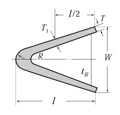
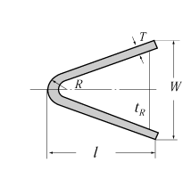
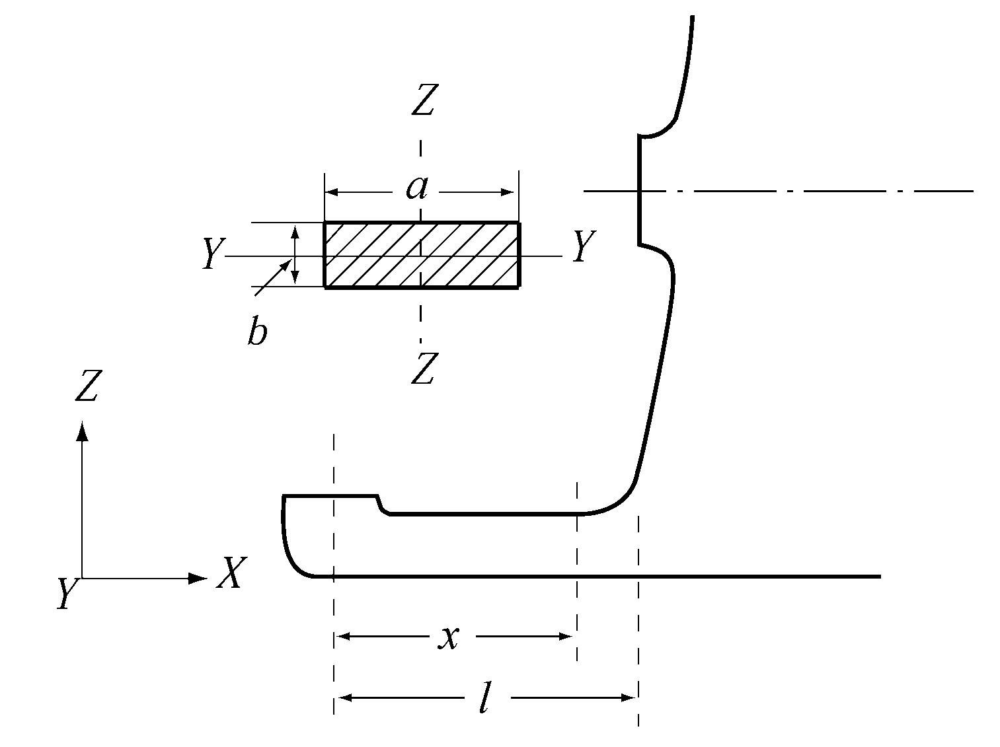
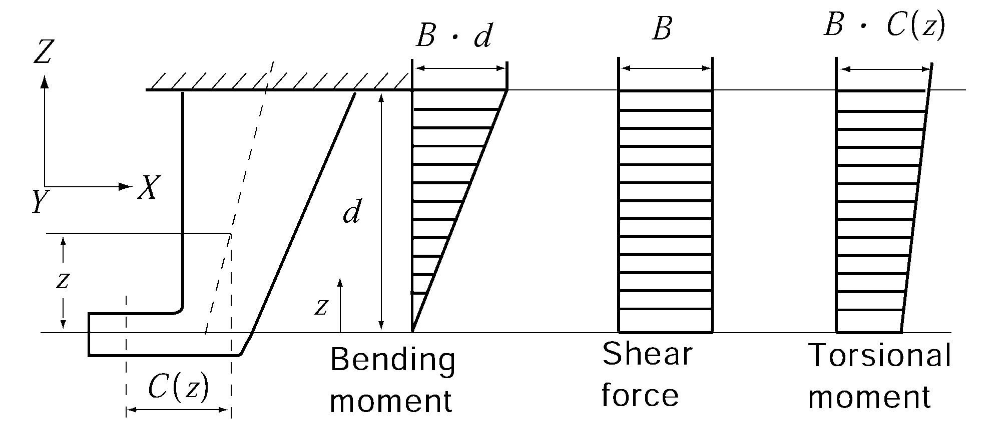

# PART 3 Hull Structures

> RULES FOR CLASSIFICATION OF STEEL SHIPS / RA-03-E / 2025 / EN / Rules

## CHAPTER 2 STEMS AND STERN FRAMES

### Section 1 Stems

#### 101. Plate stems 【See Guidance】

- **1.** The thickness of steel plate stems at the load waterline is not to be less than that obtained from the following formula. Above and below the load waterline, the thickness may be gradually tapered toward the stem head and the keel. And at the upper end of stem it may be equal to the thickness of the side shell plating (at the fore end part) of the ship, and at the lower end of stem, it is to be equal to the thickness of plate keel.
  $t = 1.5 \sqrt { L' - 50} + 2.0$(mm)
  where:
  $L'$ = length of ship (m). where, however, $L$ exceeds 230 m, $L'$ is to be taken as 230 m
- **2.** Horizontal ribs are to be provided on the stem plates at an interval preferably not exceeding 1 m and where the radius of curvature at the fore end of stem is large, proper reinforcement is to be made by providing with a centre line stiffener or by other means.

### Section 2 Stern Frames

#### 201. Application

The requirements in this Section apply only to stern frames without rudder post.

#### 202. General 【See Guidance】

- **1.** Stern frames may be cast, forged, or fabricated of plates and are to be of the shape suitable for the stream line of the stern part of the hull.
- **2.** Cast or plate stern frames are to be fitted with transverse ribs of suitable spacing. Where the curvature is large, a centre line stiffener is to be fitted.
- **3.** Care is to be taken to avoid any sudden change in thickness or sectional area along the frame.

#### 203. Propeller post 【See Guidance】

- **1.** The scantlings of propeller post are not to be less than those obtained from the formulae given in **Table 3.2.1.**
- **2.** The propeller post may be built up of plates welded to a suitable bar steel of circular or rectangular cross section at the after end.
- **3.** The scantlings of propeller post below the propeller boss are to be gradually increased to suit the strength of the shoe piece.
- **4.** In ships with relatively high speed for their length, and in ships exclusively engaged in towing purposes, the scantlings of various parts of propeller posts are to be suitably increased.

  | Cast steel | Steel plate |
  | --- | --- |
  | $W = 30 \sqrt { L}$(mm) $l = 40 \sqrt { L}$ (mm) $T = \frac{3 \sqrt {L}}{\sqrt { K ^{ (1)} }} }$(mm) $T _{1} = \frac{3.7 \sqrt {L}}{\sqrt {K ^{(1)}}}$(mm) $t_R = 0.6T$(mm) $R_\min = 40$(mm) | $W = 37 \sqrt { L}$(mm) $l = 53 \sqrt { L}$(mm) $T = \frac{2.4 \sqrt { L}}{\sqrt { K ^{ (2)} }}$(mm) $t_R = 0.55 T$(mm) $R_\min = 40$(mm) |
  |  |  |
  | Note : (1) Material factor $K$ for the Propeller post of cast steel is to be as **Pt 4, Ch 1, Table 4.1.1.** (2) Material factor $K$ for the Propeller post of steel plate is to be as **Pt 4, Ch 1, Table 4.1.2.** |   |

#### 204. Propeller boss

The thickness of propeller boss is not to be less than that obtained from the following formula:
$t = 0.23 d_p + 30$(mm)
.
where:
$d_p$ : diameter (mm) of propeller shaft specified in **Pt 5, Ch 3, 204.**

#### 205. Shoe piece 【See Guidance】

- **1.** The scantlings of each cross section of the shoe piece are to be determined by the following formula (1) to (4) considering the bending moment and shear force acting on shoe piece when the rudder force specified in **Pt 4, Ch 1, 201.** is applied to the rudder.
  - **(1)** The section modulus $Z_z$ around Z-axis(axis of depthwise) is not to be less than that obtained from the following formula:
    $Z_z = \frac{MK_sp}{80}$(cm^3)
    where:
    *M* = bending moment at the section considered, which is obtained from the following formula.(N-m):
    $M=Bx$(N-m)
    $M _{\max} =B l$(N-m)
    $B$ = supporting force in the pintle bearing as given in **Pt 4, Ch 1, 401**.(N).
    $x$ = distance from mid-point of the length of pintle bearing to section considered (m).(See **Fig 3.2.1**).
    $l$ = distance from mid-point of the length of pintle bearing to fixed point of the shoe piece (m).(See **Fig 3.2.1**).
    $K_sp$ = material factor for the shoe piece as given in **Pt 4, Ch 1, 103.**
    
    **Fig 3.2.1 Shoe piece**
  - **(2)** The section modulus $Z_y$ around Y-axis(axis of breadthwise) is not to be less than that obtained from the following formula:
    $Z_y = 0.5 Z_z$(cm^3)
    where:
    $Z_z$ = as specified in (1)
  - **(3)** The total section area $A_s$ in Y-axis is not to be less than that obtained from the following formula:
    $A_s = \frac{BK_sp}{48}$(mm^2)
    where:
    $B$ and $K _{sp}$ = as specified in (1).
  - **(4)** At no section within the length of shoe piece, the equivalent stress $\sigma _{e}$ is to be exceed 115/K_sp(N/mm^2). The equivalent stress $\sigma _{e}$ is to be determined by the following formula:
    $\sigma _{e} = \sqrt {\sigma_b ^{ 2}+3 \tau ^{ 2} }$ (N/mm^2)
    where:
    $\sigma _{b}$ = bending stress acting on shoe piece is to be determined by the following formula (N/mm^2):
    $\sigma _{b} = \frac{M}{Z_z (x)}$ (N/mm^2)
    $\tau$ = shear stress acting on shoe piece is to be determined by the following formula (N/mm^2):
    $\tau = \frac{B}{A_s (x)}$ (N/mm^2)
    $Z_z (x)$ = actual section modulus of shoe piece around Z-axis at the section considered.(cm^3)
    $A_s (x)$ = actual section area of shoe piece in Y-axis at the section considered.(mm^2)
    $M$ and $B$ = as specified in (1).
- **2.** The thickness of steel plates forming the main part of shoe piece of steel plate stern frame is not to be less than that of steel plates forming the main part of propeller post. Ribs are to be arranged in the shoe piece below the propeller post, under brackets and at other suitable positions.

#### 206. Heel piece 【See Guidance】

Heel piece of stern frame is to be of length at least 3 times the frame space at that part and is to be strongly connected to the keel.
The length of the heel piece of stern frame is to exceed at least 3 times the frame space at the part

#### 207. Rudder horn 【See Guidance】

- **1.** The scantlings of each cross section of the rudder horn are to be determined by the formulae in (1) to (3) considering the bending moment, shear force and torsional moment acting on rudder horn when the rudder force as given in **Pt 4, Ch 1, 201**. is applied to the rudder.
  - **(1)** Section modulus $Z_x$ around X-axis(axis of lengthwise) is not to be less than that obtained from the following formula:
    $Z_x = \frac{MK_rh}{67}$(cm^3)
    where:
    $M$ = bending moment (N-m) at the section considered, which is obtained from the following formula (See **Fig 3.2.2**):
    $M=B z$(N-m)
    $M _{\max} =B d$(N-m)
    $B$ = supporting force (N) in the pintle bearing as given in **Pt 4, Ch 1, 401.**
    $z$ = distance (m) from mid-point of length of the pintle bearing to the section considered (see **Fig 3.2.2**).
    $d$ = distance (m) from mid-point of length of pintle bearing to the supporting point of rudder horn (See **Fig 3.2.2**).
    $K_rh$ = material factor for rudder horn as given in **Pt 4, Ch 1, 103.**
  - **(2)** The total section area $A_h$ in Y-axis is not to be less than that obtained from following formula:
    $A_h = \frac{BK_rh}{48}$(mm^2)
    where:
    $B$ and $K_rh$ = as specified in (1).
    
    **Fig 3.2.2 Rudder horn**
  - **(3)** At no section within the total height of rudder horn $d$, the equivalent stress $\sigma _{e}$ is to exceed 120/K_rh(N/mm^2). The equivalent stress $\sigma _{e}$ is determined by following formula:
    $\sigma _{e} = \sqrt {\sigma _{b}^{2} +3( \tau ^{2} + \tau _{t}^{2} )}$(N/mm^2)
    where:
    $\sigma_b$ = bending stress acting on rudder horn is determined by the following formula:
    $\sigma_b = \frac{M}{Z_xa}$(N/mm^2)
    $\tau$ = shear stress acting on rudder horn is determined by the following formula:
    $\tau = \frac{B}{A_h (z)}$(N/mm^2)
    $\tau_t$ = torsional stress acting on rudder horn is determined by the following formula:
    $\tau _{r} = \frac{1000T _{h}}{2A _{t} t _{h}}$(N/mm^2)
    $T_h$ = torsional moment at the section considered is determined by the following formula:
    $T _{h} =BC(z)$(N-m)
    $A_t$ = area in horizontal section enclosed by the rudder horn (mm^2)
    $t_h$ = thickness of rudder horn plate (mm)
    $M$, $B$ and $K_rh$ = as specified in (1).
    $A_h (z)$ = actual section area (mm^2) in Y-axis at the section considered.
    $Z_xa$ = actual section modulus (cm^3) around X-axis at the section considered.
    $C(z)$ = distance (m) from section considered to the centre of rudder stock.
- **2.** At the connection between the rudder horn and the hull structure, special consideration is to be given to structural continuity.

#### 208. Attachment to floor plates

The stern frame is to be extended upward at the part of the propeller post and to be connected strongly to the transom floor of thickness not less than that obtained from the following formula:
$t = 0.035 L + 7.5$(mm)

#### 209. Gudgeon (2019)

- **1.** The depth of gudgeon is not to be less than the length of pintle bearing
- **2.** The thickness of the gudgeon is not to be less than 0.25 $d _{po}$. For ships specified in **Pt 4, Ch 1, 104.,** the thickness of the gudgeon is to be appropriately increased.
  where:
  $d _{po}$ = Actual diameter of the pintle measured at the outer surface of the sleeve(mm). 
