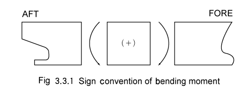
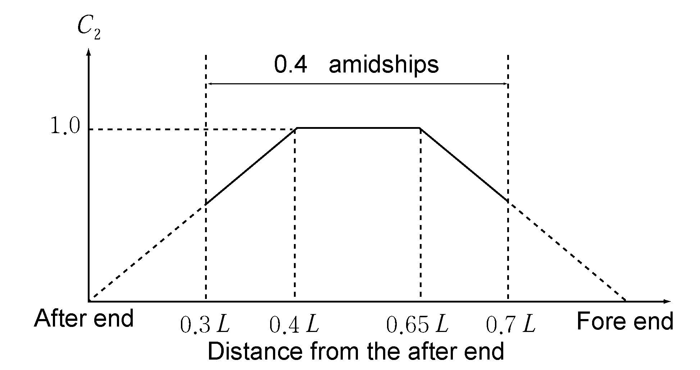
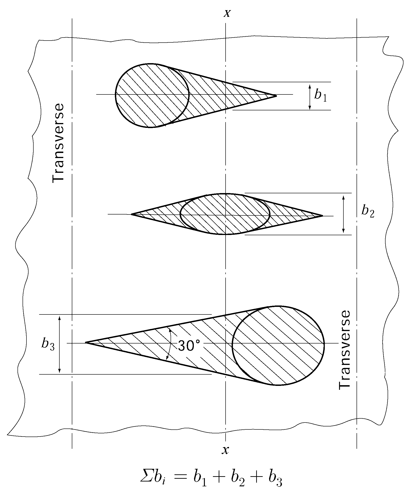
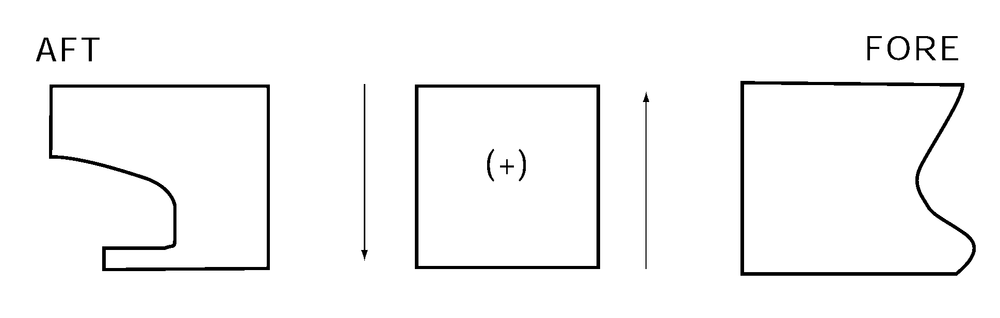
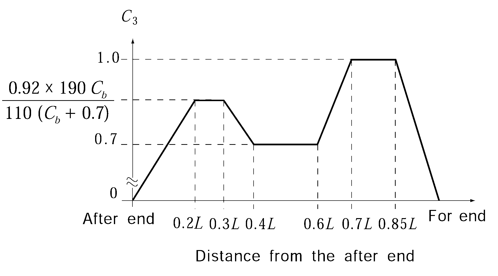
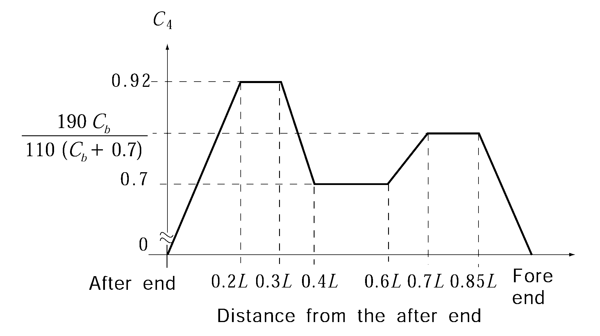
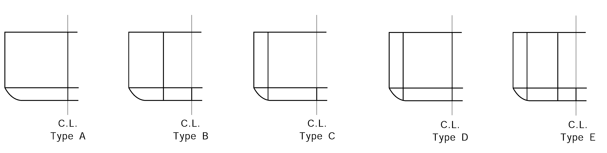

# PART 3 Hull Structures

> RULES FOR CLASSIFICATION OF STEEL SHIPS / RA-03-E / 2025 / EN / Rules

## CHAPTER 3 LONGITUDINAL STRENGTH

### Section 1 General

#### 101. Application 【See Guidance】

- **1.** The requirements in this Chapter apply to ships of 90 m in length and above in unrestricted service. For ships having one or more of the following characteristics, special additional considerations will be given by the Society.
  - **(1)** Proportion $L/B \leq 5$, $B/D_s \geq 2.5$
  - **(2)** Length #eqnID-199_s1m
  - **(3)** Block coefficient $C _{b} < 0.6$
  - **(4)** Large deck opening
  - **(5)** Ships with large flare or high speed ships
  - **(6)** Carriage of heated cargoes
  - **(7)** Unusual type or design
- **2.** Notwithstanding the requirements in **Par 1,** the requirements specified in **103.** and **104.** are applied to the ships of 65 m and above in $L_f$.
- **3.** Longitudinal strength of container ships is to be in accordance with the requirements in **Pt 7, Ch 4, Sec 2.**

#### 102. Continuity of strength

Longitudinal members are to be so arranged as to maintain as good continuity of strength as practicable.

#### 103. Loading manual 【See Guidance】

- **1.** For ships of 65 m in length and above in $L_f$, in order to enable the ship master to adjust the loading of cargo and ballast to avoid the occurrence of unacceptable stress in the ship's structure, the ship is to be provided with a loading manual approved by the Society. However, a ship may not be provided with a loading manual where deemed unnecessary by the Society.
- **2.** In the loading manual, as required in the preceding paragraph, at least the following items are to be included.
  - **(1)** Loading conditions on the basis of which the ship is designed, and the allowable limits of longitudinal still water bending moment and still water shear force.
  - **(2)** Results of calculation longitudinal still water bending moment and still water shear force corresponding to the standard loading conditions.
  - **(3)** Data and calculation examples to calculate the still water bending moment and the still water shear force for the loading conditions other than standard loading conditions. This requirement, however, may be dispensed with to the ships with which the loading instruments specified in **104.** is provided.
  - **(4)** Allowable limits of local loads applied to hatch covers, deck, double bottom construction, etc., where deemed necessary by the Society.

#### 104. Longitudinal strength loading instrument 【See Guidance】

- **1.** In addition to loading manual as specified in **103.** the following ships of 100 m in length and above in $L_f$ are to be provided with loading instrument(Longitudinal strength loading instrument), together with its operating manual, by means of which the still water bending moments, still water shear forces and still water torsional moments, etc. where applicable, in any loading or ballast condition can be easily and quickly ascertained. However, a ship may not be provided with a loading instrument where deemed unnecessary by the Society.
  - **(1)** Ships with large deck openings where combined stresses due to hull girder load (vertical bending moment, horizontal bending moment and torsional moment) and lateral loads have to be considered.
  - **(2)** Ships liable to carry non-homogeneous loadings, where the cargo and/or ballast may be unevenly distributed. Ships less than 120 m in length, when their design takes into account uneven distribution of cargo or ballast, are deemed unnecessary.
  - **(3)** Chemical tankers and gas carriers.
- **2.** The loading instrument specified in **Par 1** is to be approved by the Society and tested at the presence of the surveyor in accordance with the approved test reports after installation on board.

### Section 2 Bending Strength

#### 201. Bending strength at amidships 【See Guidance】

- **1.** The section moduli of the transverse sections of the hull calculated in accordance with the requirements in **203,** at the midship part are not to be less than the values of $Z _{1}$ obtained from the formulae given in **Table 3.3.1** at the transverse sections under consideration along the length of hull for all design cargo and ballast loading condition.
- **2.** Notwithstanding the requirements of **Par 1,** the section modulus of the transverse section of hull at 0.4$L$ part is not to be less than the value of $Z _{\min}$ obtained from formula given in **Table 3.3.1.**
- **3.** Moment of inertia of the transverse section of hull at the middle point of $L$ is not to be less than the value of $I _{\min}$ obtained from the formula given in **Table 3.3.1.** and the calculation method for moment of inertia of the actual transverse section is to be correspondingly in accordance with the requirements in **203.**
- **4.** Scantlings of all continuous longitudinal members of hull girder based on the section modulus requirement in **Par 2** and **3** are to be maintained within 0.4$L$ amidships. However, in special cases, based on consideration of type of ship, hull form and loading conditions, the scantlings may be gradually reduced towards the end of the 0.4$L$ part, where deemed necessary by the Society.

#### 202. Bending strength at sections other than amidships 【See Guidance】

- **1.** The bending strength of hull at sections other than 0.4$L$ amidships is to be determined according to the requirements of **Ch 5, Sec 2.**
- **2.** As a minimum, hull girder bending strength checks are to be carried out at the following locations:
  - In way of the forward end of the engine room.
  - In way of the forward end of the foremost cargo hold.
  - At any locations where there are significant changes in hull cross-section.
  - At any locations where there are changes in the framing system.
  Buckling strength of members contributing to the longitudinal strength and subjected to compressive and shear stresses is to be checked, in particular in regions where changes in the framing system or significant changes in the hull cross-section occur. The buckling evaluation criteria used for this check is determined by **Sec 4.**
- **3.** Continuity of structure is to be maintained throughout the length of the ship. Where significant changes in structural arrangement occur adequate transitional structure is to be provided.
- **4.** For ships with large deck openings, the bending strength of sections at or near to 0.25 L and 0.75 L are to be checked. For such ships with cargo holds aft of the superstructure, deckhouse or engine room, strength checks of sections in way of aft end of the aft-most holds, and aft end of the deckhouse or engine room are to be performed. *(2020)*

#### 203. Calculation of hull section modulus 【See Guidance】

As for calculation of the hull section modulus, the following (1) through (6) are to be applied:

**Table 3.3.1 Section modulus of transverse section of hull, etc.**

| Item | Requirement |
| --- | --- |
| Section modulus | $Z_1 = \frac{\| M_s + M_w (+) \|}{\sigma} \times 10^3$(cm^3), $Z_1 = \frac{\| M_s + M_w (-)\|}{\sigma} \times 10^3$(cm^3) |
| Minimum section modulus | $Z_\min = C_1 L^2 B(C_b + 0.7) K$(cm^3) |
| Minimum moment of inertia | $I _{\min} =3C _{1} L ^{3} B (C _{b} +0.7)$(cm^4) |
| $M_s$ = longitudinal bending moment (kN-m) in still water at the transverse section under consideration along the length of hull, which is calculated by the method deemed appropriate by the Society. The value of $M_s$ is defined as positive which is obtained assuming that downward loads are taken as positive and are integrated in the forward direction from the aft end of the ship. Sign of positive $M_s$ is shown in **Fig 3.3.1.**  $M _{w} (+)$ and $M _{w} (-)$ = wave induced longitudinal bending moments (kN-m) at the transverse section under consideration along the length of hull, which are obtained from the following formulae, $M _{w} (+) = +0.19C _{1} C _{2} L ^{2 } BC _{b}$(kN-m) $M_w (-)=-0.11C_1 C_2 L^2 B( C_b +0.7 )$(kN-m) $\sigma$ = allowable bending stress obtained from the following formula. $\sigma = 175/K$ $C_1$ = coefficient given by the following table. $L$(m) ; $C_1$ $90 \leq L \leq 300$ ; $10.75 - \left(\frac{300-L}{100} \right) ^1.5$ $300 \prec L \leq 350$ ; 10.75 $350 \prec L \leq 500$ ; $10.75 - \left( { \frac{L-350}{150}} \right)^1.5$ $L$(m) $C_1$ $90 \leq L \leq 300$ $10.75 - \left(\frac{300-L}{100} \right) ^1.5$ $300 \prec L \leq 350$ 10.75 $350 \prec L \leq 500$ $10.75 - \left( { \frac{L-350}{150}} \right)^1.5$ |   |
| $L$(m) | $C_1$ |
| $90 \leq L \leq 300$ | $10.75 - \left(\frac{300-L}{100} \right) ^1.5$ |
| $300 \prec L \leq 350$ | 10.75 |
| $350 \prec L \leq 500$ | $10.75 - \left( { \frac{L-350}{150}} \right)^1.5$ |
| $C _{2}$ = distribution factor specified along the length of $L$ at positions where the transverse section of the hull is under consideration, as given in **Fig 3.3.2.**  **Fig 3.3.2 Distribution factor of bending moment** #eqnID-242 **Fig 3.3.2 Distribution factor of bending moment** $boldC _{2}$ $C _{b}$ = block coefficient, however, to be taken as 0.6, where it is less than 0.6. |   |

**Fig 3.3.3 Deck openings on the strength deck**
$Y \left( 0.9+0.2 \frac{X}{B} \right)$
where:
$X$ = horizontal distance (m) from the top of continuous strength member to the centre line of the ship.
$Y$ = vertical distance (m) from the neutral axis to the top of continuous strength member*.*
$X$ and $Y$ are to be measured to the point giving the largest value of the above formula.

### Section 3 Shear Strength

#### 301. Thickness of side shell of ships without the effective longitudinal bulkhead 【See Guidance】

- **1.** Thickness of side shell plating of ships without the effective longitudinal bulkhead is not to be less than the values obtained from the following formulae the transverse section under consideration along the length of hull for all conceivable loading and ballasting conditions.
  $t= \frac{0.5|F _{s} +F _{w} (+)|}{\tau} \times \frac{Q}{I} \times 10 ^{2}$(mm), $t= \frac{0.5|F _{s} +F _{w} (-)|}{\tau} \times \frac{Q}{I} \times 10 ^{2}$(mm)
  $I$ = moment of inertia (cm^4) of the transverse section under consideration about its horizontal neutral axis, where the requirements in **203.** are to be applied to the calculation method.
  $Q$ = at the transverse section under consideration, moment of area about the horizontal neutral axis (cm^3) for the longitudinal members above the horizontal line passing through the considered position of side shell plating in case the considered position is above the horizontal axis, or for the longitudinal members under the horizontal line in case the considered position is under the horizontal neutral axis, where the requirements in **203.** are to be applied to the calculation method.
  $\tau$ = allowable shear stress obtained from the following formula.
  $\tau = 110/K$(N/mm^2)
  $F _{s}$ = shear force in still water (kN) at the transverse section under consideration which is calculated by the method deemed appropriate by the Society. The value of $F_s$_, is defined as positive which is obtained assuming that downward loads are taken as positive and are integrated in the forward direction from the aft end of the ship. Sign of $F_s$ shown in **Fig 3.3.4** is taken as positive.
  
  **Fig 3.3.4 Sign covention of shear force**
  $F _{w} (+)$ and $F_w (-)$ = wave induced shear forces (kN) at the transverse section under consideration along the length of hull, which are obtained from the following formulae.
  $F _{w} (+)= +0.30C _{1} C _{3} LB (C _{b} +0.7)$(kN), $F _{w} (-)= -0.30C _{1} C _{4} LB (C _{b} +0.7)$(kN)
  $C _{1}$, $C _{b}$ = as specified in **Table 3.3.1.**
  $C _{3}$ and $C _{4}$ = distribution factor to be determined at the position of the transverse section under consideration along the length of the ship, where the value is to be as specified in **Fig 3.3.5** and **3.3.6.**
- **2.** In case of ships which have bilge hopper tanks or top side tanks, or ships of which other longitudinal members below the strength deck are considered to share a part of the shear force effectively, the thickness of side shell plate required by **Par 1** may be reduced at the discretion of the Society.
  
  **Fig 3.3.5 Value of distribution factor** #eqnID-269
  **Fig 3.3.5 Value of distribution factor** #eqnID-270

#### 302. Thickness of side shell and longitudinal bulkhead plating of ships having one to four rows of longitudinal bulkheads 【See Guidance】

Thickness of side shell and longitudinal bulkhead plating of ships specified **Fig 3.3.7** is not to be less than the value obtained from the following formula at the transverse section under consideration along the length of hull for all conceivable loading and ballasting conditions. Where, however, ships with double side hull construction provided with bilge hoppers in double side hull structure are to be as deemed appropriate by the Society.
$t = \frac{FQ}{\tau I} \times 10 ^{2 }$(mm)
where:
$\tau$, $I$ and $Q$ = as specified in **301.**
$F$ = shear force acting on the side shell plating or longitudinal bulkhead plating, the value of which is to be the following $F(+)$ or $F(-)$, whichever is the greater (kN):
$F(+) =  \alpha (F _{s} +F _{w} (+))+ \Delta F |$ , $F(-) =  \alpha (F _{s} +F _{w} (-))+ \Delta F |$
$F_s$, $F_w (+)$ and $F_w (-)$ = as specified in **301.**
$\alpha$ = sharing factor of shear force shared by the side shell and longitudinal bulkhead, the value of which is to be deemed appropriate by the Society. However, unless otherwise specially specified, $\alpha$ may be obtained from the formulae in **Table 3.3.2.**
$\Delta F$= shear force acting (kN) on side shell and longitudinal bulkhead due to local load. The value is to be as deemed appropriate by the Society. However, unless otherwise specially specified, $\Delta F$ may be obtained from the formulae in **Table 3.3.2.**

**Table 3.3.2 Values of** $\alpha$ **and** $\Delta F$

| Ship Type | Application | $\alpha(=\alpha_1 \times \alpha_2 )$ |   |   | $\Delta F (= n_i (R-alphaf))$ |   |
| --- | --- | --- | --- | --- | --- | --- |
| Ship Type | Application | $\alpha _{1}$ | $\alpha _{2}$ |   | $R$ | $f$ |
| A | Side shell | $0.5 - \frac{0.575 k_1 A_L}{2A_s + A_L}$ | 1 |   | $4.9W _{b} bS$ | $19.6W _{b} bS$ |
| A | Longitudinal bulkhead | $\frac{0.575k _{1} A _{L}}{2A _{s} +A _{L}}$ | 2 |   | $9.8W _{b} bS$ | $19.6W _{b} bS$ |
| B | Side shell | $0.5 - \frac{0.55 k_1 A_L}{A_s + A_L}$ | 1 |   | $4.9W _{b} bS$ | $19.6( W _{a} a+W_b b )S$ |
| B | Longitudinal bulkhead | $\frac{0.55 k_1 A_L}{A_s + A_L}$ | 1 |   | $9.8( \beta W _{a} a+0.5 W_b b )S$ | $19.6( W _{a} a+W_b b )S$ |
| C | Side shell | 0.5 | $1 - \frac{1.06 k_2 A_DL}{A_s + A_DL}$ |   | $4.9( betaW _{a} a+W_c c )S$ | $19.6 (W _{a} a+W_c c )S$ |
| C | Longitudinal bulkhead | 0.5 | $\frac{1.06 k_2 A_DL}{A_s + A_DL}$ |   | $4.9( betaW _{a} a+W_c c )S$ | $19.6 (W _{a} a+W_c c )S$ |
| D | Side shell | $0.5- {0.675 k_1 A_L} over {2(A_s +A_DL )+A_L$ | $1 - \frac{1.05 k_2 A_DL}{A_s + A_DL}$ |   | $4.9( 0.5W _b b+W_c c )S$ | $19.6 (W _{b} b+W_c c )S$ |
| D | Outer longitudinal bulkhead | $0.5- {0.675 k_1 A_L} over {2(A_s +A_DL )+A_L$ | $\frac{1.05 k_2 A_DL}{A_s + A_DL}$ |   | $4.9( 0.5W _b b+W_c c )S$ | $19.6 (W _{b} b+W_c c )S$ |
| D | Centre longitudinal bulkhead | ${0.675 k_1 A_L} over {2(A_s +A_DL )+A_L$ | 2 |   | $9.8W _{b} bS$ | $19.6 (W _{b} b+W_c c )S$ |
| E | Side shell | $0.5- {0.615 k_1 A_L} over {A_s +A_DL +A_L$ | $1 - \frac{1.04 k_2 A_DL}{A_s + A_DL}$ |   | $4.9( 0.5W _b b+W_c c )S$ | $19.6(W _a a+W_b b +W_c c )S$ |
| E | Outer longitudinal bulkhead | $0.5- {0.615 k_1 A_L} over {A_s +A_DL +A_L$ | $\frac{1.04 k_2 A_DL}{A_s + A_DL}$ |   | $4.9( 0.5W _b b+W_c c )S$ | $19.6(W _a a+W_b b +W_c c )S$ |
| E | Inner longitudinal bulkhead | ${0.615 k_1 A_L} over {A_s +A_DL +A_L$ | 1 |   | $9.8( \beta W _{a} a+0.5W _{b} b)S$ | $19.6(W _a a+W_b b +W_c c )S$ |
| NOTE: $k _{1}$ = value is to be as specified in (a) to (c) below for longitudinal bulkheads other than those provided in double side hull. $k _{2}$ = value is to be as specified in (a) to (c) below for longitudinal bulkheads provided in double side hull. Where, however, values of $k _{1}$, and $k _{2}$ may be suitably modified for cases where members considered to share part of shear force are provided: (a) 0, for the part not provided with longitudinal bulkhead (b) 1.0, for the part provided with longitudinal bulkhead excluding the length of 0.5$D _{s}$ respectively from both ends. (c) Value obtained by linear interpolation for the intermediate parts between those specified in (a) and (b). $A _{s}$, $A_L$, and $A _{DL}$ = sectional area of side shell plating amidships, longitudinal bulkhead plating provided other than in double side hull, and longitudinal bulkhead plating in double side hull, respectively at midship part(mm^2). |   |   |   | $W_a$*,* $W_b$*,* and $W_c$ = value obtained from the following formula, respectively: $W_a = h_a + h_d - d'$ $W_b = h_b + h_d - d'$ $W _{c} =h _{c} +h _{d} -d '$ $d'$ = draught at the part concerned in the loading condition under consideration(m). $h _{a}$, $h _{b}$, $h _{c}$, and $h _{d}$ = water head converted from the pressure of cargo or ballast in the centre tanks, wing tanks, double side hull tanks(excluding double bottom parts) and double bottom tank in the loading conditions under consideration, respectively(m). In this connection, even in case where the double hull forms one single tank, the requirements apply separately to a portion of the double side hull tank and portion of double bottom tank. In case where the double bottom tank is divided within either $a$, $b$ or $c$, $h _{d}$ is to be determined for respective ranges of the tank divided. |   |   |

**Table 3.3.2 Values of and** $\Delta F$ **(continued)**

| NOTE: $a$ , $b$ and c = half breadth of the centre tank, breadth of wing tanks, and breadth of double side hull tanks (m). $S$ = spacing of floors in double bottom(m). $n_i$ = number of floors in double bottom from the mid-point of transverse bulkheads to the section under consideration in double bottom. The sign of $n_i$ is negative when counted afterward and positive when counted forward. Where, however, a swash bulkhead with an opening ratio of not less than 20 % is not to be considered as a transverse bulkhead. When a floor is provided at mid-point between transverse bulkheads, $n_i$ in this case, is to be obtained counting the floor as 0.5. When a partial bulkhead(dividing wing tank or double side hull tank) is provided between transverse bulkheads, the number of $n_i$ under consideration may consider individually. Example: a partial bulkhead is provided in wing tank of type B ship 1) Side shell: $\Delta F =(4.9 W _{b} b S n _{i _{-} wing} )-( \alpha 19.6(W _{a} a n _{i _{-} centre} +W _{b} b n _{i _{-} wing} )S)$ 2) Longitudinal bulkhead: $\Delta F =(9.8( \beta W _{a} a n _{i _{-} centre} +0.5 W _{b} b n _{i _{-} wing} )S)-( \alpha 19.6(W _{a} a n _{i _{-} centre} +W _{b} b n _{i _{-} wing} )S)$ $n _{i _{-} wing}$ *:* number of floors in double bottom from the mid-point of transverse bulkheads of wing tank to the section under consideration in double bottom. $n _{i _{-} centre}$ *:* number of floors in double bottom from the mid-point of transverse bulkheads of center tank to the section under consideration in double bottom. $\beta$ = as specified by the following table. Description ; $\beta$ where effective centre girder is provided ; 0.7 where no effective centre girder is provided ; 1.0 Description $\beta$ where effective centre girder is provided 0.7 where no effective centre girder is provided 1.0 |   |
| --- | --- |
| Description | $\beta$ |
| where effective centre girder is provided | 0.7 |
| where no effective centre girder is provided | 1.0 |

**Fig 3.3.7 Types of a ship with longitudinal bulkheads**

#### 303. Compensation for opening

Where openings are provided in the shell plating, sufficient consideration is to be paid to the shear strength and suitable compensation is to be made as necessary.

### Section 4 Buckling Strength

#### 401. Apllication 【See Guidance】

The requirements in this section apply to the buckling strength of panels and longitudinal frames subject to hull girder bending stress and shear stress.

#### 402. Working stress

- **1.** **Compression stresses**
  The compression stress $\sigma_act$(N/mm^2) acting on the members under consideration are given in the following formula, however, minimum value is not to be less than $30/K$:
  $\sigma _{act} = \frac{(M _{s} +M _{w})}{I} y \times 10 ^{5}$(N/mm^2)
  where:
  $M_s$ = as specified in **Table 3.3.1.**
  $M_w$ = wave bending moment as given in **Table 3.3.1.** For the members above the neutral axis of transverse section of hull, value of $M_w$ is taken $M_w (-)$ and for the members under, value of $M_w$ is taken $M_w (+)$.
  $y$ = distance (m) from the neutral axis of transverse section of hull to the considered point.
  $I$ = as specified in **301. 1**.
- **2.** **Shear stresses**
  The shear stress $\tau_act$(N/mm^2) acting on the members under consideration are given in the following formula:
  - **(1)** For ships not provided the effective longitudinal bulkheads
    $\tau_act = \frac{0.5 |F_s + F_w |}{t} \times \frac{Q}{I} \times 10^2$(N/mm^2)
    where:
    $F_s$, $Q$ and $I$ = as specified in **301. 1.**
    $F_w$ = absolute value of $F_w (+)$ or $F_w (-)$ as given in **301. 1.,** whichever is the greater.
    $t$ = actual thickness of the considered plate (mm).
  - **(2)** For ships having one to four row longitudinal bulkheads.
    $\tau _{act} = \frac{FQ}{tI} \times 10 ^{2}$(N/mm^2)
    where:
    $Q$ = as specified in **301. 1.**
    $F$ = as specified in **302.**
    $t$ and $I$ = as specified in (1).

#### 403. Elastic buckling stresses 【See Guidance】

- **1.** **Elastic buckling of plates**
  - **(1)** Compression
    The ideal elastic buckling stress $\sigma_E$(N/mm^2) is determined by the following formula:
    $\sigma_E = 0.9kE \left( { \frac{t_b}{1000b}} \right)^2$(N/mm^2)
    where:
    $k$ = value is determined by the following formulae depending on direction of working stress:
    $k = \frac{8.4}{\varphi + 1.1}$
    $k = C \left\{ { 1+ \left( { \frac{b}{a}} \right)^2 } \right\}^2 {2.1} over { \varphi+1.1$
    $E$ = modulus of elasticity of material. For steels, $E = 2.06 \times 10^5$(N/mm^2)
    $t _{b}$ = net thickness of plate (mm), considering standard deductions equal to the values given in **Table 3.3.3.**
    $b$ = length of shorter side of panel (m)
    $a$ = length of longer side of panel (m)
    $C$ = factor depending on kind of stiffeners on longer side of panel is as following:
    When plating stiffened by floors or deep girders : $C$ = 1.3
    When stiffeners are angles or T-section : $C$ = 1.21
    When stiffeners are bulb plates : $C$ = 1.10
    When stiffeners are flat bar : $C$ = 1.05
    $\varphi$ = ratio between smallest and largest compression stress $\sigma_act$ when linear variation across panel. $0 \leq \varphi \leq 1$
  - **(2)** Shear
    The ideal elastic buckling stress $\tau_E$(N/mm^2) is determined by the following formula:
    $\tau _{E} =0.9k _{t} E \left( \frac{t _{b}}{1000b} \right) ^{2}$(N/mm^2)
    where:
    $k_t$ = factor depending on aspect ratio of panel is determined by the following formula:
    $k_t = 5.34 + 4 \left( { \frac{b}{a}} \right)^2$
    $E$, $t_b$, $b$ and $a$ = as specified in (1)

    **Table 3.3.3 Standard deduction**

    | Structure | Standard deduction (mm) | Limit values min-max (mm) |
    | --- | --- | --- |
    | - Compartments carrying dry bulk cargoes - One side exposure to ballast and/or liquid cargo Vertical surfaces and surfaces sloped at an angle greater than 25° to the horizontal line | 0.05$t$ | $0.5 \sim 1$mm |
    | - One side exposure to ballast and/or liquid cargo Horizontal surfaces and surfaces sloped at an angle less than 25° to the horizontal line - Two side exposure to ballast and/or liquid cargo Vertical surfaces and surfaces sloped at an angle greater than 25° to the horizontal line | 0.10$t$ | $2 \sim 3$mm |
    | - Two side exposure to ballast and/or liquid cargo Horizontal surfaces and surfaces sloped at an angle less than 25° to the horizontal line | 0.15$t$ | $2 \sim 4$mm |
- **2.** **Ideal elastic buckling of longitudinals**
  The ideal elastic buckling of longitudinals is calculated by the method deemed appropriate by the Society.

#### 404. Critical buckling stresses

- **1.** **Compression**
  The critical buckling stresses $\sigma_c$ in compression is determined as following:
  $\sigma_c = \sigma_E$ for : $\sigma_E \leq 0.5 \sigma_y$
  $\sigma_c = \sigma_y \left( { 1-\frac{\sigma_y}{4 \sigma_E} \right)$ for : $\sigma_E \succ 0.5 \sigma_y$
  where:
  $\sigma_y$ = yield stress of material of the member considered, which are given as follows (N/mm^2) :
  235 = for mild steels as specified in **Pt 2, Ch 1**
  315 = for high tensile steels AH 32, DH 32, EH 32 or FH 32 as specified in **Pt 2, Ch 1**
  355 = for high tensile steels AH 36, DH 36, EH 36 or FH 36 as specified in **Pt 2, Ch 1**
  390 = for high tensile steels AH 40, DH 40, EH 40 or FH 40 as specified in **Pt 2, Ch 1**
  $\sigma_E$ = ideal elastic buckling stress calculated according to **403., 1** (1) (N/mm^2).
- **2.** **Shear**
  The critical buckling stress $\tau _c$ in shear is determined as following:
  $\tau _c = \tau_E for \tau_E \leq 0.5 \tau_y$ ,
  $\tau_c = \tau_y \left( { 1- \frac{\tau_y}{4\tau_E} \right) for \tau_E > 0.5\tau_y$
  where:
  $\tau_y$ = shear stress of material, in N/mm^2, $\tau_y$ is to be determined as $\sigma_y /\sqrt { 3}$
  $\tau_E$ = ideal elastic buckling stress calculated to **401. 1** (2) (N/mm^2).
  $\sigma_y$ = as specified in **Par 1.**

#### 405. Scantling criteria

- **1.** The critical buckling stress $\sigma_c$ of panel and longitudinal frames in compression calculated according to **404. 1** is to comply with the following formula:
  $\sigma_c \geq \beta \sigma_act$
  where:
  $\beta$ = safety factor is as following:
  For plate panel and web plating of stiffeners: $\beta = 1.0$
  For stiffeners: $\beta =1.1$
  $\sigma_act$ = working stress as given in **402.**
- **2.** The critical buckling stress $\tau_c$ of panel and longitudinal frames in shear calculated according to **404. 2** is to comply with the following formula:
  $\tau_c \geq \tau_act$
  where:
  $\tau_act$ = working stress as given in **402.** 
