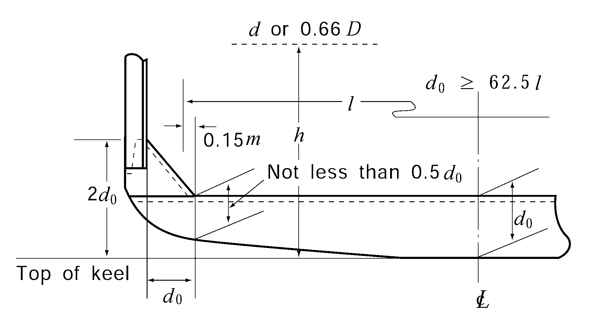

# PART 3 Hull Structures

> RULES FOR CLASSIFICATION OF STEEL SHIPS / RA-03-E / 2025 / EN / Rules

## CHAPTER 6 SINGLE BOTTOMS

### Section 1 General

#### 101. Application

- **1.** The requirements in this Chapter apply to the single bottoms of ships whose double bottom is omitted partially or wholly in accordance with the requirements in **Ch 7, 101. 3** or **4.**
- **2.** The bottom constructions in way of fore and after peaks are to be in accordance with the requirements in **Ch 13, 201.** and **301.**

### Section 2 Centre Keelsons

#### 201. Arrangement and construction

All single bottom ships are to have centre keelsons composed of girder plates and rider plates, and the centre keelsons are to extend as far forward and afterward as practicable.

#### 202. Centre girder plates

- **1.** The thickness of continuous plates or intercostal plates of centre keelsons is not to be less than that obtained from the following formula. Beyond the midship part, the thickness may be gradually reduced and it may be 85 % of the midship value at the ends of the ship.
  $t = 0.065L + 4.2$(mm)
- **2.** The girder plates are to extended to the top of floors.

#### 203. Rider plates

The rider plates are to extend from the collision bulkhead to the aft peak bulkhead and the thickness is not to be less than that required for the continuous centreline plates amidships. The breadth of rider plates is not to be less than that obtained from the following formula or 400 mm whichever is the greater, and where it is more than 400 mm the breadth may be gradually reduced beyond the midship part to the ends where it may be 80 % of the required breadth or 400 mm, whichever is the greater.
$b = 16.6L - 200$(mm)

#### 204. Centre keelsons in boiler rooms

The thickness of the members forming the centre keelson is to be increased by 1.5 mm in boiler rooms.

### Section 3 Side Keelsons

#### 301. Arrangements

- **1.** Side keelsons are to be so arranged that their spacing is not more than 2.15 m between the centre keelson and the lower turn of bilge.
- **2.** At least one row of shell stiffener of proper size is to be provided within 0.4$L$ amidships between the centre keelson and the side keelson, between the side keelsons, and between the side keelson and the lower turn of bilge.
- **3.** In the space between the collision bulkhead and the position 0.05$L$ after the strengthened bottom forward, the spacing of side keelsons is not to exceed 0.9 m.

#### 302. Construction

Side keelsons are to be composed of intercostal plates and rider plates and are to be extended as far forward and aftward as practicable.
**303 Intercostal plates**

- **1.** The thickness of intercostal plates of side keelson is not to be less than that given by the following formula for the midship part. Beyond the midship part, the thickness may be gradually reduced to 85 % at the ends of the ship.
  $t = 0.042L + 4.8$(mm)
- **2.** In the machinery room the thickness of intercostal plates is not to be less than that required for the continuous centreline plates in **202.**

#### 304. Rider plates

The thickness of rider plates for side keelson is not to be less than that of the midship intercostal plates and the sectional area of rider plates in the midship part is not to be less than that obtained from the following formula. The sectional area may be gradually reduced to 90 % of the midship value at the ends of the ship.
$A = 0.454L + 8.8$(cm^2)

#### 305. Side keelsons in boiler rooms

In the boiler rooms, the thickness of intercostal and rider plates is to be 1.5 mm greater than those required in **303.** and **304.** respectively.

### Section 4 Floor Plates

#### 401. Arrangements and scantlings

- **1.** Floor plates are to be provided on every frame and the scantlings are not to be less than that obtained from the following formulae, but the thickness needs not exceed 12 mm.
  Depth at the centre line: $d_0 = 62.5l$(mm)
  Thickness: $t = 0.01 d_0 + 3$(mm)
  where:
  $l$ = span between the toes of frame brackets measured amidships plus 0.3 m. Where curved floors are provided, the length $l$ may be suitably modified. (See **Fig 3.6.1**)
  
  **Fig 3.6.1 Shape of floors**
- **2.** Beyond 0.5$L$ amidships, the thickness of floor plates may be gradually reduced and at the end parts of the ship it may be 0.90 times the value specified in **Par 1.** In the flat part of bottom forward, this reduction is not to be made.
- **3.** Floors under engines and thrust seats are to be of ample depth and to be specially strengthened. Their thickness is not to be less than that of the continuous centre girder plates.
- **4.** The thickness of floors under boilers is to be increased by at least 2 mm above the thickness of midship floors. Where boilers are less than 457 mm clear of the floors, the thickness is to be further increased. This requirement may, however, be modified if the boiler is remote from floor plates or if the boiler is of such a type as well prevent excessive heat to the structures in the vicinity.

#### 402. Depth of floors

- **1.** Upper edges of floor plates at any part are not to be below the level of upper edge at the centre line.
- **2.** In the midship part, the depth of floors measured at a distance $d_0$ specified in **401. 1** from the inner edge of frames along the upper edge of floors, is not to be less than 0.5$d _{0}$. Where frame brackets are provided, the depth of floors at the inner edge of brackets may be 0.5$d _{0}$. (See **Fig 3.6.1**)
- **3.** In ships having unusually large rise of floor, the depth of floor plates at the centre line is to be suitably increased.

#### 403. Scantlings

- **1.** Where face plates are fitted, the thickness of the face plate is not to be less than that required for the floor plate of that place. The sectional area of the face plates is not to be less than that given by the following formula:
  $A = 42.7 \frac{Shl^2}{d_0} - \frac{d_0 t}{600}$(cm^2)
  where:
  $l$ = as defined in **401.1.**
  $S$ = frame spacing (m).
  $h$ = $d$ or 0.66$D$, whichever is the greater (m).
  $d_0$ = depth of floor plates at centre line (mm).
  $t$ = thickness of floor plates (mm).
- **2.** Where the upper edge of floor plates is flanged, the breadth of flange is not to be less than that obtained from the following formula:
  $b = \frac{100A}{t} + 1.5t$(mm)
  where:
  $A$ = sectional area of face plates defined in **Par 1.** (cm^2).
  $t$ = thickness of floor plates (mm).
- **3.** The sectional areas of face plates are to be doubled for engine and boiler bearer floors. Flanging of floors at these parts is to be avoided.

#### 404. Strengthened bottom forward

In the strengthening of bottom forward the floors are to be increased in their depth or the sectional areas of the face plates are to be doubled.

#### 405. Frame brackets

The scantlings of frame brackets are to be determined in accordance with the requirements of the following. The free edge of the bracket is to be flanged.

#### 406. Drainage holes

Drainage holes are to be provided on the floor plates on both sides of the centreline and for ships with flat bottom also at the low parts of the turn of bilge.

#### 407. Lightening holes

Lightening holes may be provided in floor plate. Where the holes are provided, appropriate strength compensation is to be made by increasing the floor depth or by some other suitable means.

#### 408. Floor plates forming part of bulkheads

Floor plates forming part of bulkheads are to be in accordance with the requirements in **Chs 14** and **15.** 
