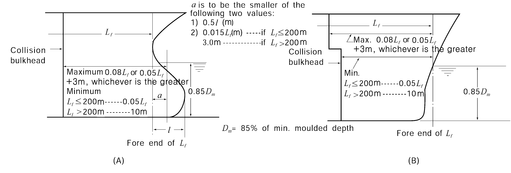
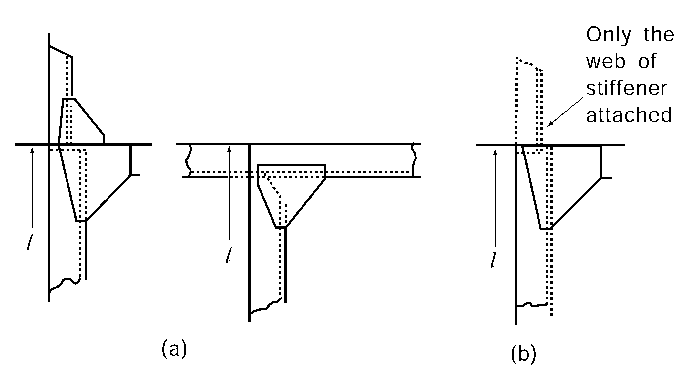
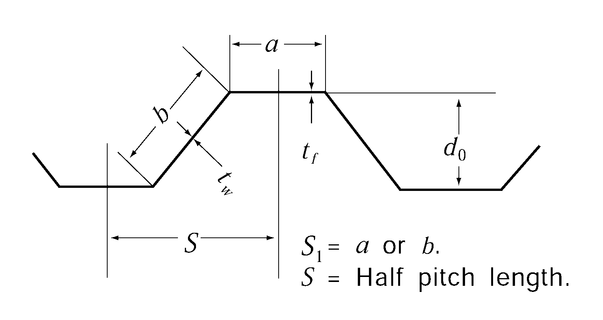
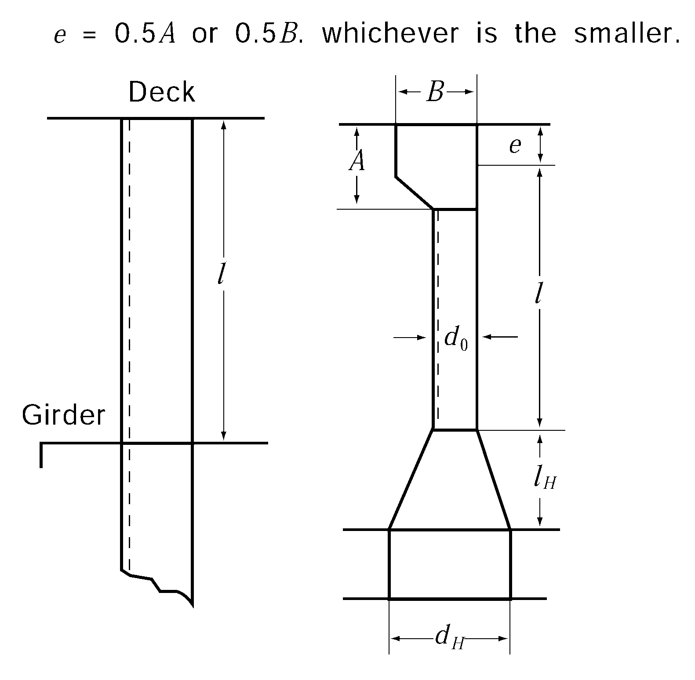
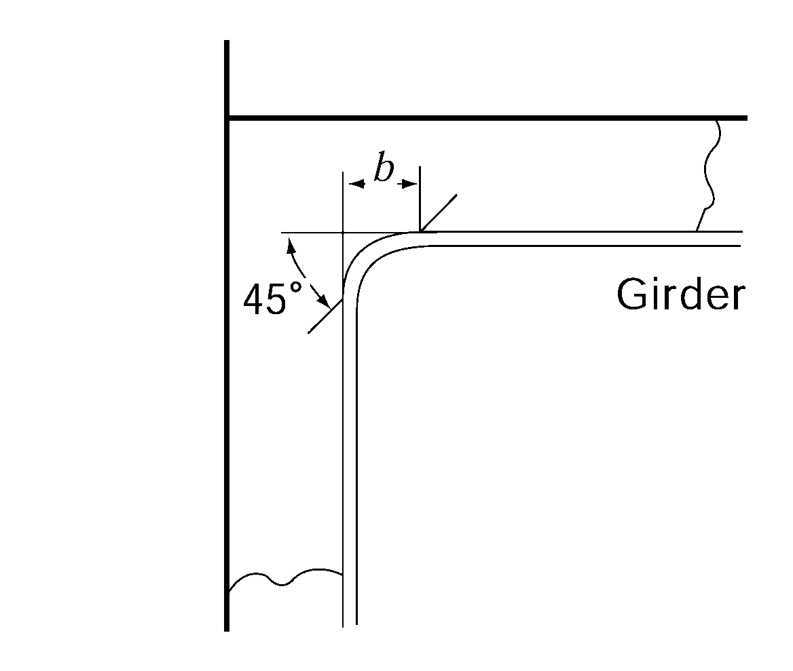

# PART 3 Hull Structures

> RULES FOR CLASSIFICATION OF STEEL SHIPS / RA-03-E / 2025 / EN / Rules

## CHAPTER 14 WATERTIGHT BULKHEADS

### Section 1 General

#### 101. Application

In general all ships are to be provided with strength and watertight bulkheads in accordance with the requirements in this Chapter. In ships of special types, arrangements where it is impracticable to be in accordance with the requirements of this Chapter, are to be specially approved by this Society.

#### 102. Symbols

Watertight bulkheads constructed in accordance with the requirements in this Chapter will be recorded in the Register Book as $WT$ the symbols being prefixed in each case by the number of such bulkheads.

### Section 2 Arrangement of Watertight Bulkheads

#### 201. Collision bulkheads 【See Guidance】

- **1.** All ships except where the larger distance is accepted by the Society due to special structural reasons, are to have a collision bulkhead, at position not less than 0.05 $L_f$ or 10m, whichever is the lesser, but not more than 0.08 $L_f$ or 0.05 $L_f$ + 3 m, whichever is the greater, but at position between 0.05 $L_f$ and 0.13 $L_f$ for the ships are engaged in great coastal services and whose tonnages are less than 500 ton, the ships are engaged in under coastal services and fishing vessels, measured from the forward end of the length for freeboard.
  However, where any part of the ship below the waterline at 85 % of the least moulded depth extends forward beyond the forward end of the length for freeboard, the above-mentioned distance is to be measured from following points whichever gives the smallest measurement. (See **Fig 3.14.1**)
  - **(1)** at the mid-length of such extension; or
  - **(2)** at a distance(a) of 0.015$L_f$ for ships whose length is less than 200 m, 3 m for ships whose length is 200 m or greater, measured from the forward end of the length for freeboard
- **2.** For ships having a collision bulkhead with steps or recesses, the measurement of the distance may be observed in accordance with **Fig 3.14.1** (B).
  
  **Fig 3.14.1 Measuring positions of collision bulkhead location**
- **3.** Arrangement of collision bulkhead in a ship provided with bow door is to be at the discretion of the Society. However, where a sloping ramp forms a part of the collision bulkhead above the freeboard deck, the part of the ramp which is more than 2.3 m above the freeboard deck may extend forward of the limit specified in the above **Par 1.** In this case, the ramp is to be weathertight over its complete length.

#### 202. Aft peak bulkheads

- **1.** All ships are to have an after peak bulkhead situated at a suitable positions.
- **2.** The stern tube is to be enclosed in a watertight compartment by the after peak bulkhead or other suitable arrangements.

#### 203. Machinery bulkheads

- **1.** Watertight bulkhead is to be provided at each end of the machinery space.
- **2.** In ships having the machinery room at aft body, aft end bulkhead of machinery room specified in **Par 1** may be regarded as aft peak bulkhead specified in **202.**

#### 204. Hold bulkheads 【See Guidance】

- **1.** Cargo ships of ordinary type, are to have hold bulkheads in addition to the bulkheads specified in **201.** to **203.** at a reasonable interval so that the total number of the watertight bulkheads including the bulkheads specified in **201.** to **203.** may not be less than that given by **Table 3.14.1.**

  **Table 3.14.1 Number of watertight bulkheads**

  | Length of ship (m) | Total number of bulkhead |   |
  | --- | --- | --- |
  | Length of ship (m) | Ships with machinery room at aft body | Elsewhere |
  | $90 \leq L < 102$ | 4 | 5 |
  | $102 \leq L < 123$ | 5 | 6 |
  | $123 \leq L < 143$ | 6 | 7 |
  | $143 \leq L < 165$ | 7 | 8 |
  | $165 \leq L < 186$ | 8 | 9 |
  | $186 \leq L$ | to be considered individually |   |
- **2.** The requirements in **Par 1** may be not applied to the arrangements of bulkhead subject to the approval of the Society.

#### 205. Height of watertight bulkheads

The watertight bulkheads required in **201.** to **204.** are the extend to the freeboard deck with the following exceptions:

#### 206. Construction

- **1.** Where the watertight bulkheads required in **201.** to **204.** are not extended up to the strength deck, deep webs or partial bulkheads situated immediately or nearly above the main watertight bulkheads are to be provided so as to maintain the transverse strength and stiffness of the hull.
- **2.** Where the length of a hold exceeds 30 m*,* suitable means are to be provided so as to maintain the transverse strength and stiffness of the hull.

#### 207. Chain lockers 【See Guidance】

- **1.** Spurling pipes and cable lockers are to be watertight up to the weather deck. Bulkheads between separate cable lockers, or which form a common boundary of cable lockers need not however be watertight.
- **2.** Where means of access is provided, it is to be closed by a substantial cover and secured by closely spaced bolts.
- **3.** Where a means of access to spurling pipes or cable lockers is located below the weather deck, the access cover and its securing arrangements are to be in accordance with recognized standards(e.g. ISO 5894 etc.) or equivalent for watertight manhole covers. Butterfly nuts and/or hinged bolts are prohibited as the securing mechanism for the access cover.
- **4.** Spurling pipes through which anchor cables are led are to be provided with permanently attached closing appliances to minimize water ingress.

### Section 3 Construction of Watertight Bulkheads

#### 301. Thickness

- **1.** The thickness of bulkhead plating is not to be less than that obtained from the following formula:
  $t = 3.2S \sqrt { hK} + 1.5$(mm)
  where:
  $S$ = spacing of stiffeners (m).
  $h$ = vertical distance (m) from the lower edge of plate to the freeboard deck or to the deepest equilibrium water line at centre in damage stability calculation, whichever is the greater. But in no case is it to be less than 3.4 m.
- **2.** Notwithstanding the requirements in **Par 1**. In no case is the thickness of watertight bulkhead platings to be less than that obtained from following formula:
  $t_\min = 5.9S + 1.5$(mm)
  where:
  $S$ = as specified in **Par 1.**

#### 302. Increase of thickness

- **1.** The thickness of lowest strake of plating is not to be less than that obtained from the above formula given in **301.** plus 1 mm.
- **2.** The lowest strake of bulkhead plating is to extend at least 610 mm above the top of inner bottom plating in way of double bottom or 915 mm above the top of keel in way of single bottom. Where the double bottom is provided only on one side of the bulkhead, the extension of the lowest strake is to be of the greater value among the two cases above.
- **3.** The bulkhead platings in way of bilge wells are to be at least 2.5 mm thicker than given by **301.**
- **4.** The bulkhead plating is to be doubled or increased in thickness in way of stern tube opening, notwithstanding the requirements in the preceding Article.

#### 303. Stiffeners 【See Guidance】

The section modulus of bulkhead stiffeners is not to be less than that obtained from the following formula:
$Z = CKS h l^2$(cm^3)
where:
$l$ = span measured between the adjacent supports of stiffeners including the length of connection (m). Where girders are provided, it is the distance from the heel of end connection to the first girder or the distance between the girders.
$S$ = spacing of stiffeners (m).
$h$ = vertical distance (m) measured from the midpoint of $l$ for vertical stiffeners, and from the midpoint of distance between the adjacent stiffeners for horizontal stiffeners, to the top of freeboard deck or to the deepest equilibrium water line at centre in damage stability calculation, whichever is the greater. Where the vertical distance is less than 6.0 m, $h$ is to be taken as 0.8 times the vertical distance plus 1.2 m.
$C$ = coefficient given in **Table 3.14.2** according to the type of end connection.

**Table 3.14.2 Valua of** $C$

| Vertical Stiffener | Upper end Lower end | Lug-connection or supported by horizontal girders | Connection |   | End of stiffener unattached |
| --- | --- | --- | --- | --- | --- |
| Vertical Stiffener | Upper end Lower end | Lug-connection or supported by horizontal girders | Type A | Type B | End of stiffener unattached |
| Vertical Stiffener | Lug-connection or supported by horizontal girders | 2.80 | 2.80 | 3.22 | 3.78 |
| Vertical Stiffener | Bracketed | 2.24 | 2.24 | 2.52 | 2.80 |
| Vertical Stiffener | Only the web of stiffener attached at end | 3.22 | 3.22 | 3.78 | 4.48 |
| Vertical Stiffener | End of stiffener unattached | 3.78 | 3.78 | 4.48 | 5.60 |
| Horizontal Stiffener | One end The other end | Lug-connection, bracketed or supported by vertical girders |   | End of stiffener unattached |   |
| Horizontal Stiffener | Lug-connection, bracketed or supported by vertical girders | 2.80 |   | 3.78 |   |
| Horizontal Stiffener | End of stiffener unattached | 3.78 |   | 5.60 |   |
| NOTES: 1. "Lug-connection" is such a connection as both web and face bar of stiffener are effectively attached to the bulkhead plating, decks or inner bottoms which are strengthened by effective supporting members on the opposite side of plating. 2. "Connection-Type A" of vertical stiffeners is a connection by bracket to the longitudinal members or to the adjacent members, in line with the stiffeners, of the same or larger sections, (See **F ig 3.14.2** (a)) 3. "Connection-Type B" of vertical stiffeners is a connection by bracket to the transverse members such as beams, or other connections equivalent to the connections mentioned above. (See **Fig, 3.14.2** (b)) |   |   |   |   |   |

**Fig 3.14.2 Types of end connection** 
**Fig 3.14.3 Measurement of** #eqnID-1590

#### 304. Corrugated bulkheads 【See Guidance】

- **1.** The plate thickness of corrugated bulkheads is not to be less than that obtained from the following formula, whichever is the greater:
  $t_1 = 0.0034CS_1 \sqrt { hK} + 1.5$(mm)
  $t_2 = 0.0059CS_1 + 1.5$(mm)
  where:
  $h$ = as specified in **301.**
  $S_1$ = breadth of face part and web part, respectively (mm), indicated as $a$ and $b$ in **Fig 3.14.3.**
  $C$ = coefficient given below:
  Face part: $C = \frac{1.5}{\sqrt { 1+ \left( { \frac{t_w}{t_f}} \right)^2 }}$
  Web part: $C = 1.0$
  $t_f$ , $t_w$ = thickness of plates of face part and web part, respectively (mm).
- **2.** The section modulus per half pitch of corrugated bulkheads is not to be less than that obtained from the following formula:
  $Z = 3.6CKS h l^2$(cm^3)
  where:
  $S$ = half pitch length of the corrugation (m). (See **Fig 3.14.3**)
  $h$ = as specified in **303.**
  $l$ = length between the supports (m), as indicated in **Fig 3.14.4.**
  $C$ = coefficient given in **Table 3.14.3,** according to the type of end connection.
- **3.** Where the end connection of corrugated bulkheads is remarkably effective, the value of $C$ specified in **Par 2** may be adequately reduced.
- **4.** The thickness of plates at end parts for 0.2 $l$ in line with $l$ is not to be less than that obtained from the following formulae respectively:
  Web part : $t _{1} =41.7 \frac{CKS h l}{d _{0}} +1.5$(mm)
  In no case is the web thickness to be less than that obtained from the following formula:
  $t _{1} =0.174 root {3} of {\frac{C S h l b ^{2}}{d _{0}}} +1.5$(mm)
  Face part, except the upper end part of vertically corrugated bulkheads:
  $t_1 = \frac{0.012 a}{\sqrt { K}} +1.5$(mm)
  where:
  $S$, $h$, $l$, $d_0$ = as specified in **Par 2.**
  $a$, $b$ = breadth of face part and web part, respectively (mm).
  $C$ = coefficient given in **Table 3.14.4.** Where the vertically corrugated bulkheads are constructed with single span, the value of $C$ may be taken as the value for the uppermost span in the Table.
  **Tale 3.14.3 Values of** $C$

  | Line | One end of bulkhead The other end of bulkhead | Supported by rule horizontal or vertical girders | Upper end welded directly to deck | Upper end welded to stool efficiently supported by ship structure |
  | --- | --- | --- | --- | --- |
  | (1) | Supported by rule horizontal or vertical girders or lower end of bulkhead welded directly to decks or inner bottoms | ${4} over {2 + \frac{Z_1}{Z_0} + \frac{Z_2}{Z_0}$ | ${4} over {2.2 + \frac{Z_2}{Z_0}$ | ${4} over {2.6 + \frac{Z_2}{Z_0}$ |
  | (2) | Lower end of bulkhead welded to stool efficiently supported by ship structure | ${4.8 \left( 1+ \frac{l_H}{l} \right)^2} over {2+ \frac{Z_1}{Z_0} + \frac{d_H}{d_0}$ | ${4.8 \left( 1+ \frac{l_H}{l} \right)^2} over {2.2 + \frac{d_H}{d_0}$ | ${4.8 \left( 1+ \frac{l_H}{l} \right)^2} over {2.6 + \frac{d_H}{d_0}$ |
  | (2) | Lower end of bulkhead welded to stool efficiently supported by ship structure | In no case is the value of $C$ less than that obtained from (1). |   |   |
  | $Z_0$ = minimum section modulus per half pitch of mid part for $0.6 l$ of the corrugated bulkhead (cm^3). $Z_1$, $Z_2$ = section modulus per half pitch of end part (cm^3). In case of vertical corrugation, $Z_1$ is the section modulus of the upper end part and $Z_2$ is that of lower end part. Where the plate thickness is increased in accordance with **Par 5** the section modulus is to be that for the plate thickness reduced by the increment. $l_H$ = height of stool measured from the inner bottom (m). $d_H$ = breadth of stool measured on the inner bottom plating (mm). $d_0$ = depth of corrugation (mm). |   |   |   |   |

  **Tale 3.14.4 Values of** $C$

  | Position |   | Upper end | Lower end |
  | --- | --- | --- | --- |
  | Vertically corrugated bulkhead | Uppermost span | 0.4 | 1.6 |
  | Vertically corrugated bulkhead | Other spans | 0.9 | 1.1 |
  | Both ends of horizontally corrugated bulkhead |   | 1.0 |   |

   
  **Fig 3.14.4 Measurement of** #eqnID-1639
- **5.** The thickness of the plates specified in the preceding Paragraphs are to be in accordance with **302.**
- **6.** The actual section modulus per half pitch of corrugated bulkheads is to be calculated by the following formula:
  $Z_a= \frac{at_f d_0}{2} + \frac{bt_w d_0}{6}$(cm^3)
  where:
  $a$, $b$ = breadth of face part and web part respectively (m).
  $t_f$, $t_w$ = thickness of plates of face part and web part respectively (mm).
  $d_0$ = depth of corrugation (mm).

#### 305. Collision bulkheads

For collision bulkheads, the plate thickness and section modulus of stiffeners are not to be less than those specified in **301., 303**. and **304.** taking $h$ as 1.25 times the specified height.

#### 306. Girders

- **1.** The section modulus of girders supporting bulkhead stiffeners (hereinafter referred to as girder) is not to be less than that obtained from the following formula:
  $Z = 4.75KS h l^2$(cm^3)
  where
  $S$ = breadth of the area supported by the girder (mm).
  $h$ = vertical distance (m) measured from the midpoint of $l$ for vertical girders, and from the mid-point of $S$ for horizontal girders, to the top of freeboard deck or to the deepest equilibrium water line at centre in damage stability calculation, whichever is the greater. Where the vertical distance is less than 6.0 m, $h$ is to be taken as 0.8 times the vertical distance plus 1.2 m.
  $l$ = span measured between the adjacent supports of girders (m). $l$ may be modified in accordance with **Ch 1, 605.** Where brackets with curved free edge are attached the effective arm length of the brackets is to be taken as $b$ indicated in **Fig 3.14.5.**
  
  **Fig 3.14.5 Measurement of** #eqnID-1656
- **2.** The moment of inertia of girders is not to be less than that obtained from the following formula. In no case is the depth of girders to be less than 2.5 times the depth of slots for stiffeners.
  $I = 10 h l^4$($\mathrm{cm} ^{ 4}$)
  where:
  $h$, $l$ = as specified in **Par 1.**
- **3.** The thickness of web plates is not to be less than that obtained from the following formula:
  $t = 0.01S_1 + 1.5$ (mm)
  where:
  $S_1$ = spacing of web stiffeners or depth of girders, whichever is the smaller (mm).
- **4.** The thickness of web plates at both end parts for 0.2 $l$ is not to be less than that obtained from the following formulae, whichever is the greater:
  $t_1 = 41.7 \frac{CKS h l}{d_0} + 1.5$(mm) , $t _{2} =0.174 \sqrt {\frac{C S h l S_1 ^{2}}{d _{0}}} +1.5$(mm)
  where:
  $S$, $h$, $l$ = as specified in **Par 1.**
  $d_0$ = depth of girders (mm).
  $S_1$ = as specified in **Par 3.**
  $C$ = as specified in **304. 4.**
- **5.** Tripping brackets are to be provided at an interval of about 3 m and where the breadth of face plates exceeds 180 mm on either side of the girder, these brackets are to be so arranged as to support the face plates.
- **6.** The actual section modulus and moment of inertia of girders are to be calculated in association with the steel plates specified in **Ch 1, 602.** Where stiffeners are provided within the effective breadth, they may be included in the calculation.

#### 307. Brackets

The scantlings of the effective brackets at the ends of bulkhead stiffener are to be in accordance with the requirement in **Ch 1, 604. 2.**

#### 308. Strengthening of bulkhead plating, deck plating, etc.

Platings of bulkheads, decks, inner bottoms, etc. are to be, if necessary, strengthened at the location of the end brackets of stiffeners and the end of girders.

#### 309. Bulkhead recesses

- **1.** In way of bulkhead recesses, beams are to be provided at every frame and under the upper bulkhead in accordance with the requirements in **Ch 10, 403.** and **Ch 14, 303.** taking the beam spacing as the stiffener spacing. Where the lower end of upper bulkhead is specially strengthened, the beam under the upper bulkhead may be dispensed with.
- **2.** The thickness of deck plating in way of bulkhead recesses is to be at least 1 mm greater than that given by **301.,** regarding the deck plating as bulkhead plating and the beams as stiffeners respectively. In no case is the thickness to be less than that required for deck plating in that location.
- **3.** The thickness of pillars supporting bulkhead recesses are to be determined taking account of the water pressure which might be applied on the upper surface of recesses, and their end connections are to be sufficient to withstand the water pressure which might be applied on the under surface.

#### 310. Construction of bulkheads in way of watertight doors

Where stiffeners are cut or the spacing of stiffeners is increased in order to provide the watertight door in the bulkhead, the opening is to be suitably framed and strengthened as to maintain the full strength of the bulkhead. In this case the door frames are not to be considered as stiffeners.

### Section 4 Watertight Doors

#### 401. General (2020)

- **1.** Any access openings, doors, manholes or ducts for ventilation, etc. are not to be cut in the collision bulkhead below freeboard deck. The number of openings in collision bulkheads above the freeboard deck is to be kept to a minimum as possible and all such openings are to be provided with weathertight means of closing.
- **2.** The design and testing requirements for watertight doors vary according to their location relative to the 1) equilibrium waterplane or intermediate waterplane at any stage of assumed flooding and or 2) bulkhead deck or freeboard deck.
- **3.** Definitions
  - **(1)** Watertight: Capable of preventing the passage of water in any direction under a design head. The design head for any part of a structure shall be determined by reference to its location relative to the bulkhead deck or freeboard deck, as applicable, or to the most unfavourable equilibrium/intermediate waterplane, in accordance with the applicable subdivision and damage stability regulations, whichever is the greater. A watertight door is thus one that will maintain the watertight integrity of the subdivision bulkhead in which it is located.
  - **(2)** Equilibrium Waterplane: The waterplane in still water when, taking account of flooding due to an assumed damage, the weight and buoyancy forces acting on a vessel are in balance. This relates to the final condition when no further flooding takes place or after cross flooding is completed.
  - **(3)** Intermediate Waterplane: The waterplane in still water, which represents the instantaneous floating position of a vessel at some intermediate stage between commencement and completion of flooding when, taking account of the assumed instantaneous state of flooding, the weight and buoyancy forces acting on a vessel are in balance.
  - **(4)** Sliding Door or Rolling Door: A door having a horizontal or vertical motion generally parallel to the plane of the door.
  - **(5)** Hinged Door: A door having a pivoting motion about one vertical or horizontal edge.

#### 402. Type of watertight doors 【See Guidance】

- **1.** Watertight doors are to be of sliding type. *(2019)*
- **2.** Notwithstanding the provisions in **1** above, where watertight door is as small as crew can pass, the watertight door may be of hinged type or rolling type, except where the doors are required to be capable of being closed remotely in accordance with **404. 3.**
- **3.** Notwithstanding the provisions in **1** above, watertight doors in large cargo hold division may be of a type other than sliding type provided that such doors are permanently closed at sea.
- **4.** Doors which are closed by dropping or by the action of a dropping weight are not permitted.
- **5.** Doors should be fitted in accordance with all requirements regarding their operation mode, location and outfitting, i.e. provision of controls, means of indication, etc., as shown in **Table 3.14.5** below. *(2020)*

#### 403. Strength and watertightness

- **1.** Watertight doors are to be of ample strength and watertightness for water pressure to a head up to the bulkhead deck, and door frames are to be effectively secured to the bulkheads. Where deemed necessary by the Society, watertight doors are to be tested by water pressure before they are fitted. **【See Guidance】**
- **2.** Where watertight doors are provided in cargo spaces, such doors are to be protected against damages due to cargoes, etc. by suitable means.

#### 404. Control and Frequency of use whilst at sea (2025) 【See Guidance】

- **1.** Watertight doors are categorized as the following (1) to (3) corresponding to its purpose and frequency of use.
  - **(1)** Normally Closed : Kept closed at sea but may be used if authorized by the Master. To be closed again after use.
  - **(2)** Permanently Closed : Such doors shall remain closed at sea. The time of opening such doors in port and of closing them before the ship leaves port shall be authorized by the Master and entered in the log-book. Should such doors be accessible during the voyage, they shall be fitted with a device to prevent unauthorized opening.
  - **(3)** Used : Kept closed at sea, but may be opened during navigation to permit the passage of passengers or crew, or when work in the immediate vicinity of the door necessitates it being opened as per **SOLAS II-1/22.3.** The door shall be immediately closed after use.
- **2.** All watertight doors, except those which are to be permanently closed at sea, are to be capable of being opened and closed by hand (and by power, where applicable) locally, from both sides of the doors, with the ship listed of 30 degrees to either side.
- **3.** Where indicated in **Table 3.14.5**, the doors are to be capable of being remotely closed by power from the bridge for all ships.
- **4.** It is not to be possible to remotely open any watertight door. In addition, watertight doors which are applying to the provisions of **402. 3** are not to be remotely controlled.

#### 405. Indication (2020) 【See Guidance】

- **1.** Where shown in **Table 3.14.5,** position indicators are to be provided at all remote operating positions (5), for all ships and provided locally on both sides of the internal doors (6) for cargo ships, to show whether the doors are open or closed and, if applicable, with all dogs/cleats fully and properly engaged.
- **2.** In addition to the requirements of **1** above for watertight doors which are to be capable of being remotely closed, an indication is to be placed locally showing that the door is in remote control mode.
- **3.** The door position indicating system is to be of self-monitoring type and the means for testing of the indicating system are to be provided at the position where the indicators are fitted.
- **4.** Signboard/instructions should be placed in way of the door advising how to act when the door is in "doors closed" mode.

#### 406. Alarms 【See Guidance】

Watertight doors which are capable of being remotely closed are to be provided with an audible alarm which will sound at the door position whenever such a door is remotely closed.

#### 407. Source of power

- **1.** The remote controls, indications and alarms required in **404.** to **406.** are to be operable in the event of main power failure. For passenger ships, failure of the normal power supply of the required alarms shall be indicated by an audible and visual alarm at the central operating console at the navigation bridge. For cargo ships, failure of the normal power supply of the required alarms shall be indicated by an audible and visual alarm at the navigation bridge. *(2021)*
- **2.** Where Electrical installations specified in **1** are situated below the freeboard deck, they are to be provided with a degree of protection appropriate for flooding. **【See Guidance】**
- **3.** Cables for devices specified in 1. are to comply with the requirements of **Pt 6, Ch 1, Sec 5** of the Rules.

#### 408. Notices (2020)

- **1.** Watertight doors which are to be normally closed at sea but not provided with means of remote closure, are to have notices fixed to both sides of the doors stating **"To be kept closed at sea"**.
- **2.** Watertight doors which are to be permanently closed at sea are to have notices fixed to both sides stating **"Not to be opened at sea"**. Such doors which are accessible during the voyage are to be fitted with a device which prevents opening. *(2021)*

#### 409. Sliding doors 【See Guidance】 (2019)

- **1.** Where a sliding watertight door is operated by rods, the lead of operating rods is to be as direct as possible and the screw is to work in a nut of gun-metal or other approved material.
- **2.** The frames of vertically sliding watertight doors are to have no groove at the bottom in which dirt might lodge and prevent the door from closing.

#### 410. Hinged and rolling doors

- **1.** For hinged and rolling watertight doors, the hinge pins and the wheel axle of these doors are to be of gun-metal or other approved materials.
- **2.** Hinged and rolling watertight doors except those are to be permanently closed at sea, are to be of quick acting or single acting type which is capable of being closed and secured from both sides of the doors.

#### 411. Others

For fitting of valves or cocks to a watertight bulkhead, see **Pt 5, Ch 6, 107. 8.** For pipes passing through bulkheads, see **Pt 5, Ch 6, 107. 7.** For electric cables passing through bulkhead, see **Pt 6, Ch 1, 508. 1** to **3.**

#### 412. Test 【See Guidance】 (2020)

- **1.** Doors which become immersed by an equilibrium or intermediate waterplane, are to be subjected to a hydrostatic pressure test.
- **2.** For large doors intended for use in the watertight subdivision boundaries of cargo spaces, structural analysis may be accepted in lieu of pressure testing. Where such doors utilise gasket seals, a prototype pressure test to confirm that the compression of the gasket material is capable of accommodating any deflection, revealed by the structural analysis, is to be carried out. 
  **Table 3.14.5 Doors in Internal Watertight Bulkheads and External Watertight Boundaries in Cargo Ships** ***(2025)***

  | Position relative to freeboard deck | 1. | 2. | 3. | 4. | 5. | 6. | 7. | 8. |
  | --- | --- | --- | --- | --- | --- | --- | --- | --- |
  | Position relative to freeboard deck | Regulation | Frequency of Use while at sea | Type | Remote Closure | Remote Indication | Audible / Visual Closing Alarm | Notice | Comments |
  | (1) Below | SOLAS II-1/10, 13-1.2, 16.2, 22.1 and 22.3, MARPOL I/28.3, ICLL66+A.320 1988 Protocol to ICLL66, IBC and IGC | Used | POS | Yes | Yes | Yes (local) | No |   |
  | (1) Below | SOLAS II-1/10, 13-1.3, 16.2 and 24.4, MARPOL I/28.3, ICLL66+A.320 1988 Protocol to ICLL66, IBC and IGC | Norm. Closed | S, H | No | Yes | No | Yes | If hinged, this door shall be of single action type. Under ICLL66, hinged doors separating a main machinery space from a steering gear compartment must have the lower sill above the Summer Load Line. |
  | (1) Below | SOLAS II-1/10, 13-1.4, 13-1.5, 16.2, 22.2, 22.13, 24.3, and 24.4, MARPOL I/28.3, ICLL66+A.320 1988 Protocol to ICLL66, IBC and IGC | Perm. Closed | S, H | No | No | No | Yes |   |

  | Position relative to freeboard deck | 1. | 2. | 3. | 4. | 5. | 6. | 7. | 8. |
  | --- | --- | --- | --- | --- | --- | --- | --- | --- |
  | Position relative to freeboard deck | Regulation | Frequency of Use while at sea | Type | Remote Closure | Remote Indication | Audible / Visual Closing Alarm | Notice | Comments |
  | (2) At or above | SOLAS II-1/10, 13-1.2, 16.2, 22.1 and 22.3, MARPOL I/28.3, ICLL66+A.320 1988 Protocol to ICLL66, IBC and IGC | Used | POS | Yes | Yes | Yes (local) | No |   |
  | (2) At or above | SOLAS II-1/10, 13-1.3, 16.2 and 24.4, MARPOL I/28.3, ICLL66+A.320 1988 Protocol to ICLL66, IBC and IGC | Norm. Closed | S, H | No | Yes | No | Yes | If hinged, this door shall be of single action type. Under ICLL66, hinged doors separating a main machinery space from a steering gear compartment must have the lower sill above the Summer Load Line. Under MARPOL I/28.4.3, hinged watertight doors may be acceptable in watertight bulkhead in the superstructure. |
  | (2) At or above | SOLAS II-1/10, 13-1.4, 13-1.5, 16.2, 22.8, 24.3 and 24.4, MARPOL I/28.3, ICLL66+A.320 1988 Protocol to ICLL66, IBC and IGC | Perm. Closed | S, H | No | No | No | Yes |   |

  | Position relative to freeboard deck | 1. | 2. | 3. | 4. | 5. | 6. | 7. | 8. |
  | --- | --- | --- | --- | --- | --- | --- | --- | --- |
  | Position relative to freeboard deck | Regulation | Frequency of Use while at sea | Type | Remote Closure | Remote Indication | Audible / Visual Closing Alarm | Notice | Comments |
  | (1) Below | SOLAS II-1/15.10, 15-1.2 to 15-1.4, 16.2, 22.7, 22.12, 22.13 and 24.1 | Perm. Closed | S, H | No | Yes | No | Yes |   |
  | (2) At or above | SOLAS II-1/15-1.2 and 16.2 | Norm. Closed | S, H | No | Yes | No | Yes | If hinged, normally closed door shall be of single action type. |
  | (2) At or above | SOLAS II-1/15-1.2 to 15-1.4, 16.2, 22.8 and 24.1 | Perm. Closed | S, H | No | Yes | No | Yes |   |

  Type
  - Power operated, sliding or rolling POS
  - Power operated, hinged POH
  - Sliding or Rolling S
  - Hinged H
