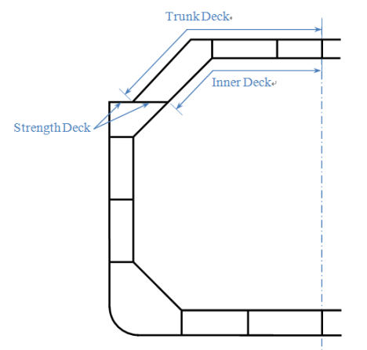
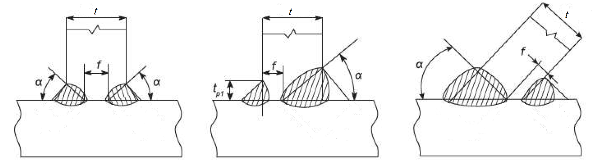
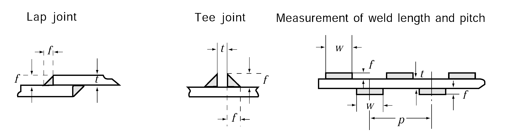
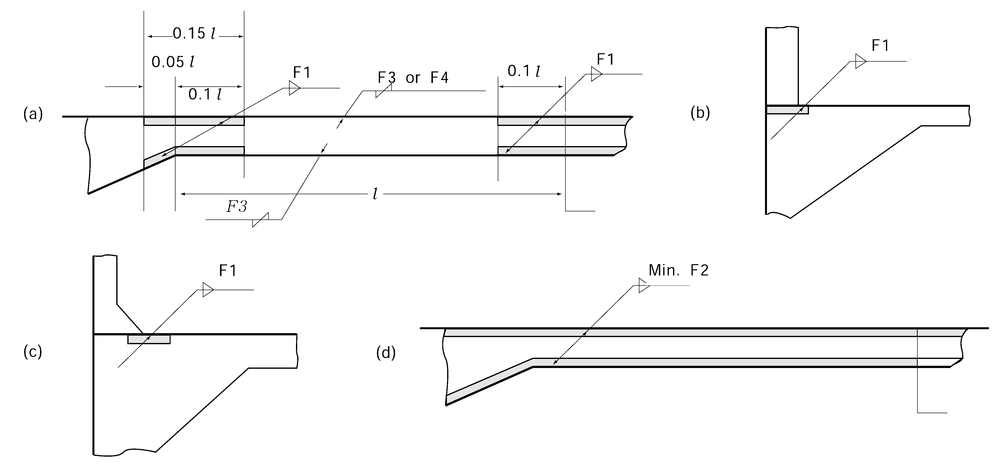
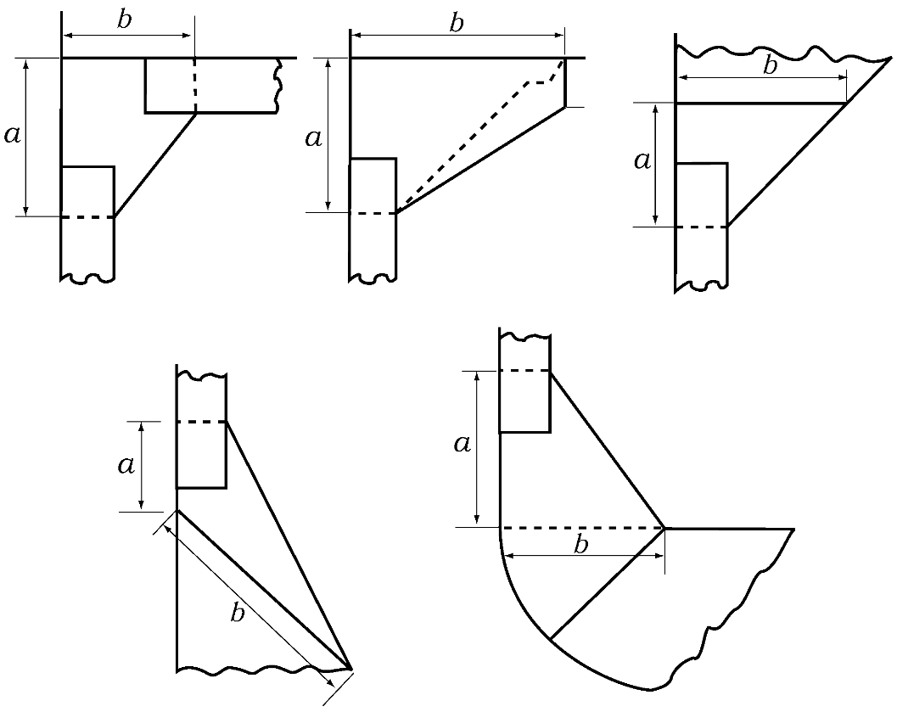
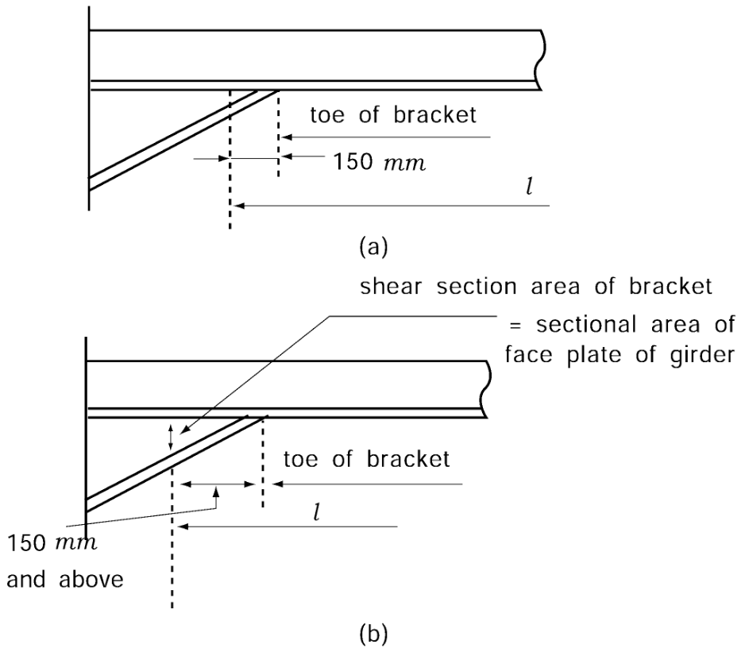

# PART 3 Hull Structures

> RULES FOR CLASSIFICATION OF STEEL SHIPS / RA-03-E / 2025 / EN / Guidance

## CHAPTER 1 GENERAL

### Section 1 Definitions

#### 101. Application 【See Rule】

$L$, $B$, $D$, $D _{s}$, $d$ and other significant scantlings have two significant figures and third figure is raised to a unit. However, scantling depth $D$ and scantling draft $d$ for freeboard have three significant figures and fourth figure is raised to a unit.

#### 102. Length 【See Rule】

- **1.** When the length of ship is measured, the end of stern is from the midpart of the rudder stock regarded as which has not a rudder post when it is not elongated from the upper part of stern post to heel part. In case of simplex rudder, end of stern is from the midpart of rudder stock.
- **2.** In cases where $L$ is determined by 96% of the extreme length on waterline at scantling draught, the aft end of $L$ is to be the point situated at a distance $L$ from the fore side of the stem parallel to the base line. *(2022)*
- **3.** For ships having neither rudder post nor rudder stock (e.g. a ship equipped with a Voith-Schneider Propeller), $L$ is to be 96% of the extreme length on waterline at scantling draught. End of stern is as follows above mentioned **Par 2.** *(2022)*
- **4.** When the difference is not much than 300 mm between designed load line and draft of assigned freeboard, the length of ship and overall length of load line are regarded as a designed load line. And when the difference is not less than 300 mm, those are regarded as assigned draft.
- **5.** When the difference is not much than 300 mm between the scantling draft ($d _{s}$) and designed load line, the length of ship and overall length of load line are regarded as a designed load line. And when the difference is not less than 300 mm, those are regarded as $d _{s}$.

#### 103. Length for freeboard 【See Rule】

- **1.** In ships designed with a rake of keel the waterline on which this length is measured shall be parallel to the designed waterline. (See **Fig 3.1.2-1**) *(2022)*

#### 104. Breadth 【See Rule】

For ships having inclined shipline, breadth($B$) used of the Rules is as following;

- **1.** **Double bottom**
  $b$ in **Fig 3.1.1** is to be used instead of breadth $B$
- **2.** **Longitudinal strength**
  $B _{w}$ on the same line to load line is to be used instead of breadth $B$
- **3.** **Equipment number**
  The breadth of ship $B$ is to be used.

#### 106. Depth(the least moulded depth) 【See Rule】

- **1.** For the depth of ships having a rounded gunwale, depth is the distance to the conjunction point of the elongated line to end point of $R$ and elongated line to inside face of side plate.(See **Fig 3.1.2**)
- **2.** For the ships having multiple deck, "freeboard deck", specified in **114. 3** of the Rules, only used for calculating depth in accordance with the Rules. Freeboard deck used for assigning load line may use the upper deck than the above mentioned deck.
- **3.** For a ship with a rake of keel, least moulded depth ($D_\min$) is found by drawing a line parallel to the keel line of the vessel (including skeg) tangent to the moulded sheer line of the freeboard deck, as illustrated in the **Fig 3.1.2-1**. The least moulded depth is the vertical distance measured from the top of the keel to the top of the freeboard deck beam at side at the point of tangency. *(2022)*

#### 107. Depth for strength computation 【See Rule】

If the lowest point of sheer is not located in the center of $L$, depth for strength calculation ($D _{s}$) is the minimum depth to strength deck between 0.4$L$ of the midship.

#### 121. Light weight (2017) 【See Rule】

The weight of mediums on board for the fixed firefighting systems (e.g. freshwater, CO2, dry chemical powder, foam concentrate, etc.) should be included in the lightweight and lightship condition.

### Section 2 General

#### 201. Application 【See Rule】

For the ships classed for restricted service area, special consideration for hull construction and equipment of the ship is to be as followings.

- **1.** Decreasing for scantlings of structural members is in accordance with **Table 3.1.1** in this Guidance and for the other members may be properly decreased in accordance with **Table 3.1.1.** However, for scantlings of the beams be loaded the cargo on, the weather deck beams be loaded timber cargoes on, the inner bottom and longitudinals attached to inner bottom and deep tanks are not to be decreased.
- **2.** The height of sills of access opening is to be in accordance with the following **Table 3.1.2.** However, ships engaged in international voyage are not applied to.
  
  **Fig 3.1.1** 
  **Fig 3.1.2**
  
  **Fig 3.1.2-1**

  **Table 3.1.1 Minimum dimension and lightening of the members**

  | Items |   | Coastal services | Smooth water services | Minimum dimension |
  | --- | --- | --- | --- | --- |
  | Longitudinal strength | Wave load ($M _{w}$ *&* $F _{w}$) | 20 % | 30 % | ─ |
  | Longitudinal strength | $Z _{\min}$ | 10 % | 15 % | ─ |
  | Shell plating (including plate keels) |   | 5 % | 10 % | 6 mm (excluding superstructure) |
  | Min. thickness of deck |   | 1 mm | 1 mm | 5 mm |
  | Section modulus of frame (including bottom longitudinal) |   | 10 % | 20 % | 30 cm^3 |
  | Section modulus of deck beam |   | 15 % | 15 % | ─ |
  | Section modulus of girder under deck |   | 15 % | 15 % | ─ |
  | Plate thickness of double bottom |   | 1 mm | 1 mm | 5.5 mm |
  | Plate thickness. of single bottom |   | 0.5 mm | 10% or 1 mm whichever is smaller | ─ |
  | Plate thickness of B.H.D of superstructure end and section modulus of B.H.D stiffeners |   | 10 % | 1 0 % | ─ |
  | Note: 1. For the ships engaging in international services may not be lightened the thickness of B.H.D of superstructure end and section modulus of B.H.D stiffeners. 2. $Z _{\min}$ & $M _{w}$ : refer to **Table 3.3.1** of the Rules $F _{w}$ : refer to **Ch 3, 301** of the Rules. |   |   |   |   |

  **Table 3.1.2 Height of door sills of hatch coaming and access doors.**

  | Type Service area Position |   | General hatch opening | Small hatch opening(area) |   | Elevator door E/R entrance | Access door of superstructure end | Ventilation tunnel |
  | --- | --- | --- | --- | --- | --- | --- | --- |
  | Type Service area Position |   | General hatch opening | 0.45~1.5 m^2 | Not exceeding 0.45 m^2 | Elevator door E/R entrance | Access door of superstructure end | Ventilation tunnel |
  | Smooth sea water area | I | 600 | 450 | 380 | 450 | 380 | 900 |
  | Smooth sea water area | II | 450 | 380 | 230 | 300 | 300 | 760 |
  | Fresh water area | I | 450 | 380 | 230 | 300 | 300 | 760 |
  | Fresh water area | II | 300 | 230 | 180 | 100 | 100 | 450 |
- **3.** Equipment and equipment number is to be in accordance with **Pt 4, Ch 8** of the Rules.

#### 202. Exception in application 【See Rule】

In application to **202.** of the Rules, the term "the discretion of the Society" means to comply with the direct strength calculation specified in **206.** of the Rules, or to accept in accordance with **Pt 1, Ch 1, 105.** of the Rules.

#### 203. Ships of unusual form or proportion, or intended for carriage of special cargoes 【See Rule】

- **1.** **Timber carrier**
  - **(1)** Ships marked timber load line, when the difference between timber load line and $d$ in **110.** of the Rules is not much than 300 mm, may be use $L$, $\Delta$ and $C _{b}$ corresponding to the value of $d$. However, if the difference is not less than 300 mm, ships is to be used $L$, $\Delta$ and $C _{b}$ corresponding to the timber load line.
  - **(2)** Ships intended for carrying timber cargoes without timber load line mark, are to be complied with the following (3).
  - **(3)** For the hull structure of timber carrier is to be protected with complying to the followings. However, for timber carrier only carrying the packaged timber, the followings may be properly considered excepting (H).
    For the welding of the member impacted by the cargoes, it is to be double continuous welding(at least F2). However, when the bottom ceilings are provided, welding for structural member of double bottom tank top is not to be continuous welding.
    For deck girders and hatch end girders of side hatch, tripping bracket having 1.5 m spacing is to be provided and free edges are to be flanged.
    Hold bulkhead of ships of 130 m or less in length is preferably not to be of corrugated type but of plane type. One side of plane type bulkhead not fitted with stiffeners and on both sides of corrugated type bulkhead, special protection is to be made by providing square section wooden bars(250 mm × 250 mm) or steel angle bars, etc. at proper intervals. Protection of bulkhead stiffeners is to be in accordance with the following (F).
    It is recommended that area of freeing ports provided on bulwarks is to be as small as possible in way of hatchway and the area is to be increased in other parts so as to maintain the total required freeing port area.
    Protection method of hold frames is to be in accordance with the following. However, this protection may be dispensed with for ships exceeding 130 m in length.
    $b=128 \sqrt {d _{0} l}$(mm)
    $d _{0}$ = depth of throat of bracket as specified in **Fig 3.1.3.** (m)
    $l$ = length of flange of bracket as specified in **Fig 3.1.3.** (m)
    For the inside of hold, all hull structural members below the point of 150 mm above the top of tank side brackets (including shell plate and piping) are to be coated with tarepoxy paint or other similar paint of good quality not easily peeling off.
    Hatch covers are to be protected from timber by dunnage, etc. and to be fitted with the devices to prevent from moving due to the ship's motion such as rolling, pitching, etc. In case of hatch covers with gasket, the devices for preventing gasket from excessive compression by timber loads are to be provided.
    - **(A)** Welding structure (**Ch 1, Sec 5** of the Rules)
    - **(B)** Deck girders and hatch end girders (**Ch 11** of the Rules)
    - **(C)** Protection of watertight bulkhead (**Ch 14** of the Rules)
    - **(D)** The structure of hatch opening, machinery opening(**Pt 4, Ch 2** of the Rules) and hatch coamings of other deck opening is to be strongly constructed.
    - **(E)** Bulwarks (**Pt 4, Ch 4** of the Rules)
    - **(F)** Protection of hold frames
      - **(a)** Hold frames are to be stiffened by one of the followings.
      - **(i)** Longitudinal stiffeners or tripping brackets are to be fitted at intervals of about 2 m.
        - **(ii)** Angle bars are to be fitted longitudinally at intervals of about 1.5 m on flange surface of hold frames.
        - **(iii)** Flat bars of about 150 mm wide × 10 mm thick are to be fitted longitudinally at intervals of about 0.5 m on flange surface of hold frames.
      - **(b)** Angle bars or flat bars (in case of flat bars, at least 2 tiers) are to be fitted longitudinally on flange surface of tank side brackets or of the lower bracket of hold frames of bulk carrier type ships. However, the above requirements may be dispensed with where thickness and breadth of flange of hold frames of bulk carrier type ships are not less than that determined by the followings.
      - **(i)** Thickness of bracket $t$ is in accordance with **604.** of the Rules. However, the length of bracket arms is to be in accordance with **Fig 3.1.3.**
        - **(ii)** Breadth of free edges of bracket is to be obtained from the following formula.
        - **(iii)** For abaft and aft peaks and other parts, where the frames is provided beneath of hatch, it is to be properly compensated.
        - **(iv)** Where the projected part is large as like as deep frames in the hold, special consideration is to be given for the dimension and provision of tripping bracket.
    - **(G)** Painting
    - **(H)** Air pipes, ladders, weathertight doors and equipment fitted on hull structural members which are liable to cause damage due to impact of cargoes are to be properly protected.
    - **(I)** Protection of hatch covers
- **2.** **Ships having an unusual large freeboard and an unusual large height from the load line to strength deck.**
  - **(1)** "Ships having an unusual large freeboard" is the ships having a actual summer freeboard $f _{s}$ (corresponding to the assigned load line) which is not less than the sum of minimum summer freeboard $f$ (See **Fig 3.1.4**) and standard height of superstructure $h _{s}$ (See **Reg 33.** of **"1966 International Convention on Load Line"**).

    |  **Fig 3.1.3 Measurements of bracket arm** **Fig 3.1.3 Measurements of bracket arm** |  **Fig 3.1.4 Ships having specially large freeboard** **Fig 3.1.4 Ships having specially large freeboard** |
    | --- | --- |
  - **(2)** The dimension of member is to be comply with the followings in addition to the Rules. However, for the Type B ship in the **1966 International Convention on Load Line,** under mentioned treatments are not apply to ships whose assigned freeboards are B-60 or B-100 type.
    For the sectional area of floor, the value of $D$ may be replaced with $D '$ for the formula specified in **Ch 6, 403** of the Rules.
    Where the deck supporting frames above an imaginary freeboard deck, those frames may be regarded as superstructure frames
    In the provision of "$h$" specified in **Ch 10, Table 3.10.3** in the Rules, a weather deck may be regarded as follows in accordance with the vertical distance, $H_D$ from an imaginary freeboard deck to the weatherdeck at side. In other Chapters of the Rules, this deck load "$h$" may be treated in the same manner.
    $h _{s}$ ≤ $H _{D}$ ＜ $2h _{s}$ = Superstructure deck of first tier above an imaginary freeboard deck
    $2h _{s}$ ≤ $H _{D}$ ＜ $3h_s$= Superstructure deck of second tier above an imaginary freeboard deck
    $3h_s$ ≤ $H _{D}$ = Superstructure deck of third tier above an imaginary freeboard deck
    The thickness of side shell platings above than freeboard deck (imaginary freeboard deck for which is regarded as a freeboard deck) is in accordance with **Ch 4, 103** of the Guidance.
    For the following items, provision to providing on freeboard deck may be released to provision to providing on superstructure deck and provision to providing on superstructure deck may be released to upper deck.
    - **(A)** Single bottom
    - **(B)** Frames (**Ch 8** of the Rules)
    - **(C)** Deck Load (**Ch 10** of the Rules)
    - **(D)** Plate keels and shell platings (**Ch 4** of the Rules)
    - **(E)** Hatch openings and bulwarks (**Pt 4, Ch 2** and **Ch 4** of the Rules)
      - **(a)** Height of hatch coamings, scantlings and height of hatch covers
      - **(b)** Sill height of openings in the exposed machinery space casings
      - **(c)** Sill height of openings in deckhouses enclosing deck openings or sills of companionways.
      - **(d)** Height of ventilation duct coamings
      - **(e)** Height of air pipe
      - **(f)** Type of side scuttles

#### 206. Direct strength calculation 【See Rule】

- **1.** When the scantlings of hull structural members is decided by the direct strength calculation specified in **206.** of the Rules, it is to be in accordance with **Annex 3-2 "Guidance for the Direct Strength Assessment".** However, if it is not applicable to comply with this Guidance, the analysis method, loading and allowable stress are to be in accordance with the discretion of the Society.
- **2.** Buckling stress of each structural member is to be reviewed based on the results of direct strength calculation. Analysis method and allowable stress are to be in accordance with **Annex 3-2 "Guidance for the Direct Strength Assessment".**
- **3.** If it is deemed to be necessary by the Society that fatigue analysis of the connection parts of ship structure, discontinuous parts of the structure and stress concentrated parts are to be reviewed, data for the analysis method and loading is to be submitted.

### Section 4 Materials

#### 401. Standards of material 【See Rule】

- **1.** When the stainless steels are used for plate, use of the materials and their scantling are to be subject to the followings.
  - **(1)** Stainless steel being used in the structural members is to be complied with **Pt 2, Ch 1, 305.** and **309.** of the Rules.
  - **(2)** This section is to be applied to structural members using stainless steels irrelevant to corrosion prevention is provided or not.
  - **(3)** When the stainless steel is used in the structural members, it is to be complied with buckling strength criteria in **Ch 3, Sec 4** in the Guidance and Rules.
  - **(4)** Material factor ($K$*)* is obtained from the following formula. However, $K$ is to be rounded to three decimal places and not less than 0.63. *(2018)*
    - $K=f _{T} \left\{ 8.81( \sigma _{Y} /1000) ^{2} -7.56( \sigma _{Y} /1000)+2.29 \right\}$ for $\sigma _{Y} \leq 355$ (N/mm^2)
    - $K=f _{T} f _{C} (235/ \sigma _{Y} )$ for $\sigma _{Y} >355$ (N/mm^2)
    where
    $\sigma _{Y}$ : The minimum value of yield strength or proof stress of stainless steel or stainless clad steel specified in **Pt 2, Ch 1, 305.** and **309.** of the Rules. (N/mm^2)
    $f _{C}$ : To be given by the following formula.
    $f _{C} =3.04( \sigma _{Y} /1000) ^{2} -1.09( \sigma _{Y} /1000)+1.09$
    $f _{T}$ : To be given by the following formula. Where T is more than 100°C, the value is at the discretion of the Society.
    $f _{T} = 0.0025 (T-60) + 1.00$
    $T$ : The maximum cargo temperature (°C) to be contacted by the materials. Where the temperature is less than 60°C, $T$ is to be taken as 60°C.
  - **(5)** Notwithstanding the requirements in (4) above, 0.78 is to be used as the lower limit of the coefficient ($K$ ) when determining the construction and scantlings for areas of anticipated stress concentration excepted that fatigue strength assessments based upon hot spot stresses obtained using finite element method specified in Annex 3-3, 5. of Guidance are carried out. *(2018)*
  - **(6)** Areas of anticipated stress concentration in (5) above, for example, is as following *(2018)*
    - the connections of the lower corner parts of corrugated bulkheads and inner bottom plates
    - the connections of the lower corner parts of corrugated bulkheads and the top plate of the lower stools
    - the connections of inner bottom plates and bilge hopper plates
    - the connections of inner bottom plates and lower stools, etc.
  - **(7)** Members which do not come in contact with sea water may be reduced from the scantlings required by the relevant requirements as following *(2018)*
    - Where the scantling is determined by the thickness of the plate : 1.0 mm
    - Where the scantling is determined by the section modulus : 5%
    - Where the scantling is determined by the thickness of plate : 0.5mm
- **2.** Where no other information is available, the minimum specified yield stress $\sigma _{y} '$ and the material factor $K$ of steels used at design temperatures between 90 °C and 300 °C may be taken equal to:
  - **(1)** Yield stress at higher temperatures
    $\sigma _{y } ' = \sigma _{y} (1.04 - \frac{0.75}{1000} \theta )$
    $\sigma _{y}$ : the minimum specified yield stress at ambient temperature specified in **Pt 2, Ch 1, Sec 3. Table 2.1.7**
    $\theta$ : design temperature(°C)
  - **(2)** Material factor
    $K = \frac{235}{\sigma _{y}}$

#### 403. High tensile steels 【See Rule】

- **1.** Where high tensile steels are used for the longitudinal strength members, it is to be in accordance with the followings.
  - **(1)** Application
    For the mid part of ships having strength deck and bottom with longitudinal structure, where the section modulus of vertical section is reduced by the using high tensile steels in accordance with **403.** of the Rules, longitudinal strength members are to in accordance with the followings
  - **(2)** Extents of use of high tensile steels
    High tensile steels are to be used in the following parts.
    $b _{D} =y _{D} \left( 1- \frac{1}{f _{D}} \right)$(m)
    $y _{D}$ = distance from the neutral axis of the cross section of hull to the strength deck (m)
    $b _{B} = y _{B} \left( 1- \frac{1}{f _{B}} \right)$(m)
    $y _{B}$ = distance from the neutral axis of the cross-section of hull to the top of keel (m)

    |  **Fig 3.1.5 For the case that high tensile steels are used for deck and bottom** **Fig 3.1.5 For the case that high tensile steels are used for deck and bottom** |  **Fig 3.1.6 For the case that high tensile steels are used for deck** **Fig 3.1.6 For the case that high tensile steels are used for deck** |
    | --- | --- |

    |  **Fig 3.1.7 Deck** **Fig 3.1.7 Deck** |  **Fig 3.1.8 Hatch coaming** **Fig 3.1.8 Hatch coaming** |
    | --- | --- |
    - **(A)** Longitudinal strength members within the ranges from the strength deck or the bottom down or up to the points specified below respectively. (See **Fig 3.1.5** and **3.1.6**)
      - **(a)** Strength deck
      - **(b)** Bottom
    - **(B)** Longitudinal strength members on strength deck
    - **(C)** Portions as shown in **Fig 3.1.7** of deck inside the line of openings
    - **(D)** Hatch coamings and their horizontal stiffeners within the extents shown in **Fig 3.1.8.**
    - **(E)** Gutter bars and bilge keels welded to high tensile steel materials. Where bilge keels are welded to shell plating need not be of high tensile steel.
    - **(F)** Doubling plates fitted to the longitudinal strength members of high tensile steel for reinforcing openings, etc.
    - **(G)** It is recommended that the range of 0.5$L$ amidship be constructed of high tensile steel. If the range of 0.5$L$ amidship is not covered by high tensile steel, special consideration should be given to the continuity of section modulus of hull girder between the range of 0.4$L$ and 0.5$L$ amidship.
  - **(3)** Tapering of longitudinal strength members
    
    **Fig 3.1.9**

    **Table 3.1.3**

    | Ship Material | Oil tanker | Others |
    | --- | --- | --- |
    | HT32 | 1.27 | 1.34 |
    | HT36 | 1.38 | 1.45 |
    - **(A)** The manner of tapering of longitudinal strength members of high tensile steel is to comply with the provisions of the Rules, assuming that the entire hull be constructed of high tensile steel.
    - **(B)** Where the midship part is constructed of high tensile steel, the scantlings of mild steel members forward of and abaft the midship part are to be in accordance with **Fig 3.1.9.**
    - **(C)** At the connection of high tensile and mild steel materials, due consideration should be so given to the continuity of strength that appreciable difference of plate thickness may be avoided.
- **2.** **The followings are to be considered when high tensile steels used.**
  - **(1)** When the steels having different stiffness are used for ship structure, stress of low stiffness steel nearby high stiffness steel is specially considered.
  - **(2)** When the girder is constructed with high tensile steel, stiffness of girder or scantlings of tripping brackets are to be specially considered for preventing to occur excessive stress to tripping brackets.
  - **(3)** For the members constructed with high tensile steels, special consideration is to be given to the members for preventing of excessive stress concentration.
  - **(4)** When the high tensile steels used in a wide scope, detailed strength review is to be given and submitted the results to the Society.

#### 404. Ships of restricted service area 【See Rule】

In application to **404.** of the Rules, the term "the discretion of the Society" means to accept in accordance with **Pt 1, Ch 1, 105.** of the Rules.

#### 405. Application of steels 【See Rule】

- **1.** The steels used for the rounded gunwale are to be treated as sheer strake. In such a case, width of a strake plate is not to be less than 1,300 mm for ship length $L$ up to 100 m and 2,600 mm for $L$ being not less than 250 m. When the ship length is between 100 m and 250 m, breadth is not to be less than the value which is obtained by interpolation.
- **2.** Where the steels with the thickness above 50 mm up to 100 mm used for hull structures, the steels are to be provided in **Pt 2, Ch 1** Rules in accordance with **Table 3.1.4** of the Rules and **3.1.4** of the Guidance.

  | Class Thickness(mm) | I |   | II |   | III |   |
  | --- | --- | --- | --- | --- | --- | --- |
  | Class Thickness(mm) | *MS* | *HT* | *MS* | *HT* | *MS* | *HT* |
  | \(50 *D* *DH* *E* *EH* *E* *EH* |   |   |   |   |   |   |
  | \(60 *E* *EH* *E* *EH* *E* *EH* |   |   |   |   |   |   |
  | Note: The symbols in the table mean the grades of steel as follows: *DH* : *DH* 32, *DH* 36 and *DH* 40, *MS* : Mild steels *EH* : *EH* 32, *EH* 36 and *EH* 40, *HT* : High tensile steels |   |   |   |   |   |   |

#### 406. Special requirements for application of steels (2019) 【See Rule】

- **1.** The application of steels for ships designed to operate in area with low air temperatures is to comply with the following requirements: *(2017)*
  - **(1)** For ships intended to operate in areas with low air temperatures (below -10°C), e.g. regular service during winter seasons to Arctic or Antarctic waters, the materials in exposed structures are to be selected based on the design temperature $t _{D}$, to be taken as defined in **2**. Materials in the various strength members above the lowest ballast water line (BWL) exposed to air(including the structural members covered by the Note [5] of **Table 3.1.6**) and materials of cargo tank boundary plating for which **3.** is applicable are not to be of lower grades than those corresponding to classes Ⅰ, Ⅱ and Ⅲ, as given in **Table 3.1.6,** depending on the categories of structural members(SECONDARY, PRIMARY and SPECIAL). For non-exposed structures(except as indicated in Note [5] of **Table 3.1.6**) and structures below the lowest ballast water line, see **405.** of the Rules.
  - **(2)** The material grade requirements for hull members of each class depending on thickness and design temperature are defined in **Table 3.1.7.** For design temperatures $t_D <$ -55°C, materials are to be in accordance with the discretion of the Society.
  - **(3)** Single strakes required to be of class Ⅲ or of grade *E, EH* 32/*EH* 36/*EH* 40 and *FH* 32/*FH* 36/*FH* 40 are to have breadths not less than the values given by the following formula, maximum 1800 mm.
    $b=5L+800$(mm)
  - **(4)** Plating materials for stern frames, rudder horns, rudders and shaft brackets are not to be of lower grades than those corresponding to the material classes given in **405. 3** of the Rules.

    **Table 3.1.6 Application of material classes and grades - Structures exposed at low temperatures**

    | Structural member category | Material class |   |
    | --- | --- | --- |
    | Structural member category | Within 0.4$L$ amidships | Outside 0.4$L$ amidships |
    | ○ SECONDARY: - Deck plating exposed to weather, in general - Side plating above BWL - Transverse bulkheads above BWL [5] - Cargo tank boundary plating exposed to cold cargo [6] | I | I |
    | ○ PRIMARY: - Strength deck plating [1] - Continuous longitudinal members above strength deck, excluding longitudinal hatch coamings - Longitudinal bulkhead above BWL [5] - Top wing tank bulkhead above BWL [5] | II | I |
    | ○ SPECIAL: - Sheer strake at strength deck [2] - Stringer plate in strength deck [2] - Deck strake at longitudinal bulkhead [3] - Continuous longitudinal hatch coamings [4] | III | II |
    | Notes : [1] Plating at corners of large hatch openings to be specially considered. Class Ⅲ or grade *E*, *EH* 32, *EH* 36 and *EH* 40 to be applied in positions where high local stresses may occur. [2] Not to be less than grade *E*, *EH* 32, *EH* 36 and *EH* 40 within 0.4$L$ amidships in ships with length exceeding 250 m [3] In ships with a breadth exceeding 70 m at least three deck strakes to be class Ⅲ. [4] Not to be less than grade *D*, *DH* 32, *DH* 36 and *DH* 40. [5] Applicable to plating attached to hull envelope plating exposed to low air temperature. At least one strake is to be considered in the same way as exposed plating and the strake width is to be at least 600mm. [5] For cargo tank boundary plating exposed to cold cargo for ships other than liquefied as carriers, see 3. |   |   |
- **2.** The design temperature is to be taken as the lowest mean daily average air temperature in the area of operation. For seasonally restricted service the lowest value within the period of operation applies.(see **Fig 3.1.10**)
  ∙ Mean: Statistical mean over observation period (at least 20 years)
  ∙ Average: Average during one day and night
  ∙ Lowest: Lowest during year
  ∙ MDHT = Mean Daily High (or maximum) Temperature
  ∙ MDAT = Mean Daily Average Temperature
  ∙ MDLT = Mean Daily Low (or minimum) Temperature
  For the purpose of issuing a Polar Ship Certificate in accordance with the Polar Code, the design temperature $t _{D}$ shall be no more than 13°C higher than the Polar Service Temperature (PST) of the ship. In the Polar Regions, the statistical mean over observation period is to be determined for a period of at least 10 years.
  **Table 3.1.7 Material grade requirements for classes I, II and III at low temperatures**

  **classⅠ**

  | Plate thickness in (mm) | -11/-15 °C |   | -16/-25 °C |   | -26/-35 °C |   | -36/-45 °C |   | -46/-55 °C |   |
  | --- | --- | --- | --- | --- | --- | --- | --- | --- | --- | --- |
  | Plate thickness in (mm) | *MS* | *HT* | *MS* | *HT* | *MS* | *HT* | *MS* | *HT* | *MS* | *HT* |
  | $t \leq 10$ | *A* | *AH* | *A* | *AH* | *B* | *AH* | *D* | *DH* | *D* | *DH* |
  | $10 *A* *AH* *B* *AH* *D* *DH* *D* *DH* *D* *DH* |   |   |   |   |   |   |   |   |   |   |
  | \(15 *A* *AH* *B* *AH* *D* *DH* *D* *DH* *E* *EH* |   |   |   |   |   |   |   |   |   |   |
  | \(20 *B* *AH* *D* *DH* *D* *DH* *D* *DH* *E* *EH* |   |   |   |   |   |   |   |   |   |   |
  | \(25 *B* *AH* *D* *DH* *D* *DH* *E* *EH* *E* *EH* |   |   |   |   |   |   |   |   |   |   |
  | \(30 *D* *DH* *D* *DH* *D* *DH* *E* *EH* *E* *EH* |   |   |   |   |   |   |   |   |   |   |
  | \(35 *D* *DH* *D* *DH* *E* *EH* *E* *EH* *-* *FH* |   |   |   |   |   |   |   |   |   |   |
  | \(45 *D* *DH* *E* *EH* *E* *EH* *-* *FH* *-* *FH* |   |   |   |   |   |   |   |   |   |   |
  | class Ⅱ |   |   |   |   |   |   |   |   |   |   |
  | Plate thickness in (mm) | -11/-15 °C |   | -16/-25 °C |   | -26/-35 °C |   | -36/-45 °C |   | -46/-55 °C |   |
  | Plate thickness in (mm) | *MS* | *HT* | *MS* | *HT* | *MS* | *HT* | *MS* | *HT* | *MS* | *HT* |
  | \(t \leq 10$ | *A* | *AH* | *B* | *AH* | *D* | *DH* | *D* | *DH* | *E* | *EH* |
  | $10 *B* *AH* *D* *DH* *D* *DH* *E* *EH* *E* *EH* |   |   |   |   |   |   |   |   |   |   |
  | \(20 *D* *DH* *D* *DH* *E* *EH* *E* *EH* *-* *FH* |   |   |   |   |   |   |   |   |   |   |
  | \(30 *D* *DH* *E* *EH* *E* *EH* *-* *FH* *-* *FH* |   |   |   |   |   |   |   |   |   |   |
  | \(40 *E* *EH* *E* *EH* *-* *FH* *-* *FH* *-* *-* |   |   |   |   |   |   |   |   |   |   |
  | \(45 *E* *EH* *E* *FH* *-* *FH* *-* *FH* *-* *-* |   |   |   |   |   |   |   |   |   |   |

  **class Ⅲ**

  | Plate thickness in (mm) | -11/-15 °C |   | -16/-25 °C |   | -26/-35 °C |   | -36/-45 °C |   | -46/-55 °C |   |
  | --- | --- | --- | --- | --- | --- | --- | --- | --- | --- | --- |
  | Plate thickness in (mm) | *MS* | *HT* | *MS* | *HT* | *MS* | *HT* | *MS* | *HT* | *MS* | *HT* |
  | \(t \leq 10$ | *B* | *AH* | *D* | *DH* | *D* | *DH* | *E* | *EH* | *E* | *EH* |
  | \(10 *D* *DH* *D* *DH* *E* *EH* *E* *EH* *-* *FH* |   |   |   |   |   |   |   |   |   |   |
  | \(20 *D* *DH* *E* *EH* *E* *EH* *E* *FH* *-* *FH* |   |   |   |   |   |   |   |   |   |   |
  | \(25 *D* *DH* *E* *EH* *E* *EH* *-* *FH* *-* *FH* |   |   |   |   |   |   |   |   |   |   |
  | \(30 *E* *EH* *E* *EH* *-* *FH* *-* *FH* *-* *-* |   |   |   |   |   |   |   |   |   |   |
  | \(35 *E* *EH* *E* *FH* *-* *FH* *-* *FH* *-* *-* |   |   |   |   |   |   |   |   |   |   |
  | \(40 *E* *EH* *-* *FH* *-* *FH* *-* *-* *-* *-* |   |   |   |   |   |   |   |   |   |   |
  | Notes : The symbols in the table mean the grades of steel as follows : *AH* : *AH* 32, *AH* 36 and *AH* 40 *DH* : *DH* 32, *DH* 36 and *DH* 40 *EH* : *EH* 32, *EH* 36 and *EH* 40 *FH* : *FH* 32, *FH* 36 and *FH* 40 *MS* : Mild steels *HT* : High tensile steels |   |   |   |   |   |   |   |   |   |   |

  
  **Fig 3.1.10 Commonly used definitions of temperatures**
- **3.** **Cold cargo for ships other than liquefied gas carriers**
  For ships other than liquefied gas carriers, intended to be loaded with liquid cargo having a temperature below -10°C, e.g. loading from cold onshore storage tanks during winter conditions, the material grade of cargo tank boundary plating is defined in **Table 3.1.7** base on the following:
  - $t _{c}$ design minimum cargo temperature in °C
  - steel grade corresponding to Class I as given in **Table 3.1.6**
  The design minimum cargo temperature, $t _{c}$ is to be specified in the loading manual.

### Section 5 Welding

#### 501. General

- **1.** **Structural details 【See Rule】**
  When the ship having hatchs are fall under the following (1) to (4), detailed review of the fatigue strength for strength deck at hatch corner and end parts of hatch is to be completed and the cross section is not to be changed radically or scantlings of hatch side coaming are to be increased.
  - **(1)** Ships with hatch in the mid part, where the breadth of the hatch exceeds 0.7$B$.
  - **(2)** Ships having strength deck which is constructed with high tensile steels in accordance with **403.** of the Rules.
  - **(3)** Ships with unusual high hatch coamings
  - **(4)** Ships with strength deck constructed with special shape or hatch opening constructed with special structure.
- **2.** **Slot weld 【See Rule】**
  For the applying **501. 4** (2) of the Rules, the length and spacing of slots is to be in accordance with **Pt 13, Sub Pt 1, Ch 12, Sec 3, 4.2** of the Rules**.**

### Section 6 Scantlings

#### 602. Section Modulus 【See Rule】

- **1.** Scantlings of stiffeners based on requirements in this part may be decided based on the concept of grouping designated sequentially placed stiffeners of equal scantlings. The scantling of the group is to be taken as the greater of the following (1) and (2). However, this concept of grouping is not applicable to fatigue requirements as given in **206. 3.**
  - **(1)** the average of the required scantling of all stiffeners within a group
  - **(2)** 90 % of the maximum scantling required for any one stiffener within the group.

### Section 8 Corrosion Protection Coating (2018)

#### 801. Corrosion protection coating 【See Rule】

- **1.** **Corrosion protection coating for sea water ballast tanks and double-side skin spaces arranged in bulk carriers** ***(2017)***
  - **(1)** Where ships engaging in international voyage and not less than 500 gross tonnage are relevant to (A) or (B), all dedicated seawater ballast tanks and double-side skin spaces arranged in bulk carriers of 150 m in length and upward are to be in accordance with **IMO Res. MSC. 215(82)** (including revisions) **PSPC**(Performance Standard for Protective Coatings). However, tankers or bulk carrier whose keels are laid after 1 July 2008 and before the date specified in (A) are to be in accordance with **IMO Res. 798(19).**
    - **(A)** for which the building contract is placed on or after 1 July 2008 (in the absence of a building contract, the keels of which are laid or which are at a similar stage of construction on or after 1 January 2009); or
    - **(B)** the delivery of which is on or after 1 July 2012.
  - **(2)** Maintenance of the protective coating system shall be included in the overall ship’s maintenance scheme. The effectiveness of the protective coating system shall be verified during the life of a ship by the Administration or an organization recognized by the Administration, based on the guidelines developed by the IMO.(refer to MSC.1/Circ.1330)
- **2.** **Corrosion protection coating for COT of Crude Oil Tankers**
  - **(1)** Application target : Where Crude Oil Tanker not less than 5000 gross tonnage are relevant to (A) or (B), all COTs are to be in accordance with **IMO Res. MSC. 288(87)** (including revisions) PSPC(Performance Standard for Protective Coatings).
    - **(A)** for which the building contract is placed on or after 1 January 2013 (in the absence of a building contract, the keels of which are laid or which are at a similar stage of construction on or after 1 July 2013); or
    - **(B)** the delivery of which is on or after 1 January 2016.
  - **(2)** This requirement is not applied to following (A) and (B).
    - **(A)** Combination carriers specified in **MARPOL Res. 73/78 Annex** I, Reg.1. (excluding the combination carriers cerified to carry crude oil only in cargo tanks)
    - **(B)** Chemical tankers specified in **MARPOL Res. 73/78 Annex** II, Reg.1. (including the tankers certified to carry cargo oil)
    - **(C)** Product carrier not carried crude oil.
- **3.** Nomal and higher strength corrosion resistant steel may be used as the alternative means of corrosion protection for cargo oil tanks as specified in **Par 2**. The performance standards are to be in accordance with **IMO Res. MSC. 289(87)** (Performance standards for alternative means of corrosion protection for cargo oil tanks of crude oil tankers).
- **4.** The Administration may exempt a crude oil tanker from the requirements of **Par 2** if the ship is built to be engaged solely in the carriage of cargoes and cargo handling operations not causing corrosion.(Refer to MSC.1/Circ.1421 "Guidelines on exemptions for crude oil tanker solely engaged in the carriage of cargoes and cargo handling operations not causing corrosion") 
