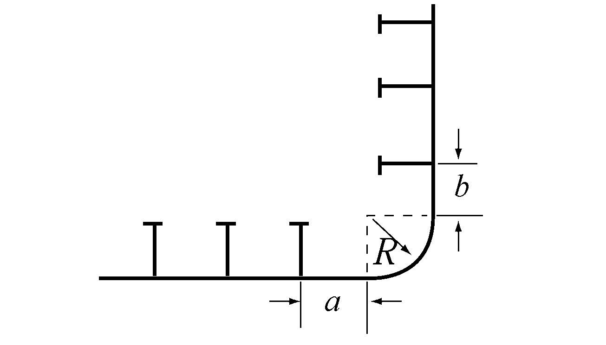

# PART 3 Hull Structures

> RULES FOR CLASSIFICATION OF STEEL SHIPS / RA-03-E / 2025 / EN / Guidance

## CHAPTER 2 STEMS AND STERN FRAMES

### Section 1 Stems

#### 101. Plate stems 【See Rule】

- **1.** The thickness of plate stems may be same as that of side shell plating at the level of freeboard deck and same as that of forecastle-side shell in the range of forecastle.
- **2.** Where the plate stem with a large radius of curvature at its fore end is not fitted with a centreline stiffener or is not reinforced by using thicker plate than that in accordance with **101. 1** of the Rules, horizontal breast-hooks are to be provided at a space not exceeding 600 mm apart for reinforcement.

### Section 2 Stern Frames

#### 202. General 【See Rule】

- **1.** **Welding of cast steel stern frames**
  - **(1)** When cast steel stern frames are constructed with dividing 2 or 3 pieces, the shape of weld is based on **Fig 3.2.1.**
  - **(2)** Connection of cast steel stern frame and shell plating is in accordance with **Fig 3.2.2.** However, if the welding procedure is approved, it may be in accordance with that procedure.

    |  **Fig 3.2.1 Welding of cast steel stern frames** **Fig 3.2.1 Welding of cast steel stern frames** |  **Fig 3.2.2 Connection with shell plating and cast****steel stern frames** **Fig 3.2.2 Connection with shell plating and cast** **steel stern frames** |
    | --- | --- |

#### 203. Propeller post 【See Rule】

- **1.** **Connection of cast steel boss and plate parts of built-up stern frame**
  The connection of cast steel boss and built-up stern frame is to be well grooved and welded with full penetrations at the root as shown in **Fig 3.2.3.**
- **2.** **Length of shaft hole of propeller boss**
  The length of shaft hole of the propeller boss is to be greater than 1.25 times the inside diameter of the boss hole.
- **3.** **Round bars used for built-up stern frame**
  In case that a round bar is used as the aft edge of a built-up stern frame, its radius is, as a standard, to be more than 70 % of $R$ prescribed in **Table 3.2.1** of the Rules. At the connection of round bar to cast steel part or at the connection of round bars, the depth of bevel for welding is to be at least 1/3 of the diameter of round bar. The thickness of ribs fitted to the stern frame is, as a standard, to be 75 % of the stern frame plate. (See **Fig 3.2.4**)

  |  **Fig 3.2.3 Connection with steel and propeller boss** **Fig 3.2.3 Connection with steel and propeller boss** |  **Fig 3.2.4** **Fig 3.2.4** |
  | --- | --- |

#### 205. Shoe Piece 【See Rule】

- **1.** **Connection of shoe pieces and propeller posts**
  The top plate of shoe piece is to be extended forward beyond the aft end of propeller post. A bracket of the same thickness as the stem frame is to be fitted at the connection of the shoe piece and the aft end of propeller post to keep a sufficient continuity of strength. (See **Fig 3.2.4**)
- **2.** Steel bolts for fixing zinc slabs to the shoe piece must not be directly screwed into the shoe piece but they are to be directly welded to the shoe piece or screwed into steel plates welded to the shoe piece.
- **3.** Shoe pieces of built-up construction are to be made watertight and the inside coated with effective coating material. Where no coating is applied to the inside of built-up shoe piece, the thickness of the shoe piece is to be increased by 1.5 mm.

#### 206. Heel Piece 【See Rule】

- **1.** **Determination of length of heel pieces**
  - **(1)** In built-up stern frames, the length of heel pieces may be equal to twice the frame spacing at the position of heel pieces providing that the thickness of flat keels connected to the heel pieces is increased by about 5 mm.
  - **(2)** The length of heel piece is to be measured as shown in **Fig 3.2.5.**
    
    **Fig 3.2.5 Measurements of** #eqnID-123
  - **(3)** The thickness of ribs fitted to the heel piece is, as a standard, to be 75% of the ribs.

#### 207. Rudder horn 【See Rule】

- **1.** When the connection between the rudder horn and the hull structure is designed as a curved transition into the hull plating, special consideration should be given to the effectiveness of the rudder horn plate in bending and to the stresses in the transverse web plates.
- **2.** The bending moments and shear forces are to be determined by a direct calculation or in line with the guidelines given in **Pt 4, Ch 1, 401. 6** and **7** of the Guidance.
- **3.** The thickness of the rudder horn side plating is not to be less than:
  $2.4 \sqrt {LK}$ (mm)
  where :
  $L$ = Rule length as defined in **Pt 3, Ch 1, 102.** of the Rules.(m)
  $K$ = material factor as given in **Pt 3, Ch 1, 403. 2** or **Pt 4, Ch 1, 103.** of the Rules respectively.
- **4.** **Welding and connection to hull structure**
  - **(1)** The rudder horn plating is to be effectively connected to the aft ship structure, e.g. by connecting the plating to side shell and transverse/ longitudinal girders, in order to achieve a proper transmission of forces.
    Brackets or stringer are to be fitted internally in horn, in line with outside shell plate. (See **Fig 3.2.6**)
    
    **Fig 3.2.6 Connection of rudder horn to aft ship structure**
  - **(2)** Transverse webs of the rudder horn are to be led into the hull up to the next deck in a sufficient number.
  - **(3)** Strengthened plate floors are to be fitted in line with the transverse webs in order to achieve a sufficient connection with the hull.
  - **(4)** The centre line bulkhead (wash-bulkhead) in the after peak is to be connected to the rudder horn.
  - **(5)** Scallops are to be avoided in way of the connection between transverse webs and shell plating.
  - **(6)** The weld at the connection between the rudder horn plating and the side shell is to be full penetration. The welding radius is to be as large as practicable and may be obtained by grinding.

#### 210. Rudder trunk

The requirements in this section apply to trunk configurations which are extended below stern frame and arranged in such a way that the trunk is stressed by forces due to rudder action. *(2021)*

- **1.** **Materials, welding and connection to hull**
  - **(1)** The steel used for the rudder trunk is to be of weldable quality, with a carbon content not exceeding 0.23% on ladle analysis or a carbon equivalent C_EQ not exceeding 0.41%. *(2019)*
  - **(2)** Plating materials for rudder trunks are in general not to be of lower grades than corresponding to class II as defined in **Pt 3, Ch 1, Sec 4** of the Rules.
  - **(3)** The weld at the connection between the rudder trunk and the shell or the bottom of the skeg is to be full penetration. For rudder trunks extending below shell or skeg, the fillet shoulder radius $r$, in mm (see **Fig 3.2.7**) is to be as large as practicable and to comply with the following formulae: *(2024)*
    $r = 0.1 d _{ l} /K$
    without being less than:
    $r = 60$ (mm) when $\sigma \geq \frac{40}{K}$ ($\mathrm{N}/mm ^{2}$)
    $r = 30$ (mm) when $\sigma \prec \frac{40}{K}$ ($\mathrm{N}/mm ^{2}$)
    Where:
    $d _{ l}$ = rudder stock diameter axis defined in **Pt 4, Ch 1, 502.** of the Rules
    $\sigma$ = bending stress in the rudder trunk in ($\mathrm{N}/mm ^{2}$)
    $K$ = material factor for the rudder trunk as given in **207. 3**
    The radius may be obtained by grinding. If disk grinding is carried out, score marks are to be avoided in the direction of the weld. The radius is to be checked with a template for accuracy. Four profiles at least are to be checked. A report is to be submitted to the Surveyor.
  - **(4)** Rudder trunks comprising of materials other than steel are to be specially considered by the Society.
    
    **Fig 3.2.7 Fillet shoulder radius**
- **2.** **Scantlings**
  - **(1)** The scantlings of the trunk are to be such that: *(2021)*
    - the equivalent stress due to bending and shear does not exceed 0.35 $R_eH$,
    - the bending stress on welded rudder trunk is to be in compliance with the following formula:
    $\sigma \leq \frac{80}{K}$ ($\mathrm{N}/mm ^{2}$)
    With:
    $\sigma$ = bending stress in the rudder trunk, as defined in **1 (4)**
    $K$ = material factor for the rudder trunk as given in **207. 3**, not to be taken less than 0.7
    $R_eH$ = specified minimum yield stress of the material used ($\mathrm{N}/mm ^{2}$)
  - **(2)** For calculation of bending stress, the span to be considered is the distance between the mid-height of the lower rudder stock bearing and the point where the trunk is clamped into the shell or the bottom of the skeg.

#### 211. Propeller shaft brackets (2011)

- **1.** **General**
  - **(1)** The following requirements are applicable to propeller shaft brackets having two struts to support the propeller tail shaft boss. The struts may be of solid or welded type.
  - **(2)** The angle between the struts shall not be less than 50 degrees.
- **2.** **Arrangement**
  - **(1)** Solid struts shall be carried continuously through the shell plating and shall be given satisfactory support by the internal ship structure.
  - **(2)** Welded struts may be welded to the shell plating. The shell plating shall be reinforced, and internal brackets in line with strut plating shall be fitted. If the struts are built with a longitudinal centre plate, this plate shall be carried continuously through the shell plating. The struts shall be well rounded at fore and aft end at the transition to the hull.
  - **(3)** The propeller shaft boss shall have well rounded fore and aft brackets at the connection to the struts.
- **3.** **Struts**
  - **(1)** Solid or welded struts of propeller shaft brackets shall comply with the following requirements:
    $h \geq 0.4 d$
    $A \geq 0.4 d ^{2}$
    $W \geq 0.12 d ^{3}$
    where:
    $A$ = gross area of strut section in mm^2
    $W$ = gross section modulus of section in mm^3. $W$ shall be calculated with reference to the neutral axis as indicated on **Fig 3.2.8**
    $h$ = the greatest thickness of the section in mm
    $d$ = propeller shaft diameter in mm.
    $d = \max \left( d _{act} , d _{req} root {3} of {\frac{T+160}{590}} \right)$
    $d _{act}$ = actual propeller shaft diameter in mm
    $d _{req}$ = diameter (mm) of propeller shaft specified in **Pt 5, Ch 3, 204.**
    $T$ = Specified minimum tensile strength (N/mm^2). For the tensile strength exceeding 600N/mm^2, $T$ is to be taken as 600 N/mm^2.
    
    **Fig. 3.2.8 Detail of Propeller shaft brackets** 
