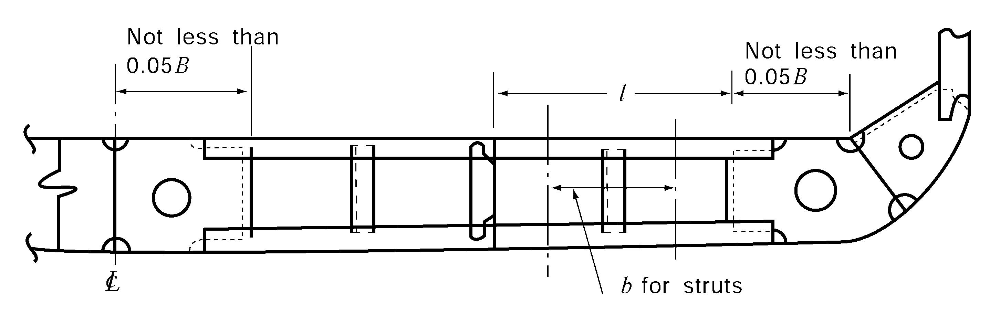
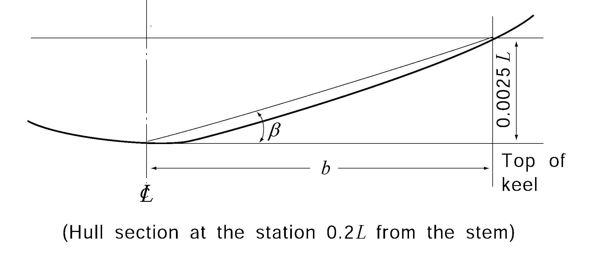
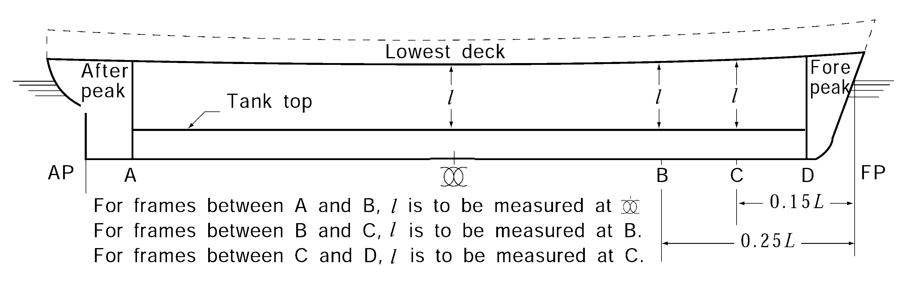

# PART 3 Hull Structures

> RULES FOR CLASSIFICATION OF STEEL SHIPS / RA-03-E / 2025 / EN / Guidance

## CHAPTER 3 LONGITUDINAL STRENGTH

### Section 1 General

#### 101. Application 【See Rule】

- **1.** **Transverse section modulus of ships with unusual proportion**
  For the ships with $M_Full$ or $i$.5, all strength excepting longitudinal strength is to be adequately considered.
- **2.** **Ships with especially large hatches**
  For ships breadth of whose hatches exceeds 0.7$B$ in midship part, according to the requirements in **Pt 7, Ch 4, Sec 2,** bending and torsional strength are to be specially considered.
- **3.** **Ships with large flare and high speed ships**
  According to the value of $K_v$ and $K_f$ obtained from the following (1) and (2), wave induced longitudinal bending moment $M_w$ is to be increased.
  $K _{v} = \frac{0.2V}{\sqrt {L}}$, $K_f = \frac{A_d -A_w}{Lh_B}$
  where
  $A_d$ = projected area onto a horizontal plane of exposed deck from the fore end extending to 0.2*L* aft of fore end including the part forward of fore end (m^2), Where a forecastle is provided, the horizontal project area of the forecastle is overlapped to the fore mentioned area.
  $A_w$ = water plane area corresponding to designed maximum load line within the forward 0.2$L$ (m^2)
  $h_B$ = vertical distance from designed maximum load line to exposed deck at the side of fore end (m)
  - **(1)** In case that $K_v$ exceeds 0.28
    $C_2$ specified in **Fig 3.3.2** of the Rules is to be replaced with the value given in **Table 3.3.1** in accordance with $K_v$ and $x$(m) which is the distance from aft end of $L$ to the position of considered hull transverse section. Where the $K_v$ and/or $x$ become intermediate, the value is to be determined by interpolation.
  - **(2)** In case that ($K_v + K_f$) exceeds 0.4
    $C_2$ specified in **Fig 3.3.2** of the Rules is to be replaced with the value given in **Table 3.3.2.** for the under $M_w$ (-) condition. However, where the ($K_v + K_f$) and/or $x$ become intermediate, the value is to be determined by interpolation.

    **Table 3.3.1 Coefficient of** $C_2$

    | $x$ $K_v$ | 0.65$L$ | 0.75$L$ | 1.0$L$ |
    | --- | --- | --- | --- |
    | 0.28 | 1.0 | 5/7 | 0.0 |
    | 0.32 over | 1.0 | 0.80 | 0.0 |

    **Table 3.3.2 Coefficient of** $C_2$

    | $x$ $K_v + K_f$ | 0.65$L$ | 0.75$L$ | 1.0$L$ |
    | --- | --- | --- | --- |
    | 0.4 | 1.0 | 5/7 | 0.0 |
    | 0.5 over | 1.0 | 0.80 | 0.0 |

#### 103. Loading manual 【See Rule】

- **1.** "a ships may not be provided with a loading manual where deemed unnecessary by the Society" in **103. 1** of the Rules means fishing vessels or the ships with length less than 90 m ($L_f$) in which the deadweight does not exceed 30 % of the displacement at the summer loadline draft and with arrangement giving small possibilities for variation in the distribution of cargo and ballast, and ships on regular and fixed trading pattern. However, ships such as fishery training, fishery patrol, fishery research, etc. are to comply with the requirements of flag state. *(2017)*
- **2.** The loading manual to be approved by the Society according to **103.** of the Rules, are to be prepared in accordance with **Annex 3-1 "Guidance for Preparation and Survey of Loading Manual".** They are to be written with a language easily understood by the shipmaster and if it is not in English, English version is to be attached.
- **3.** In addition, Bulk carriers of 150 m in length and above in $L_f$, where one or more cargo holds are bounded by the side shell only, which were contracted for construction before 1st July 1998 are to be provided with an approved loading manual with Guidance for typical loading/unloading sequences where the vessel is loaded from commencement of cargo loading to reaching full deadweight capacity, for homogeneous conditions, alternate conditions and relevant part load conditions where applicable. (see **Table 4** of **Annex 3-1**) The followings are to be included in the guidance.
  - **(1)** The minimum acceptable number of typical sequences is ;
    - **(A)** One homogeneous full load condition
    - **(B)** One full load alternate hold condition, if the ship is approved for alternate hold loading.
    - **(C)** One part load condition where relevant, such as block loading or two port unloading.
  - **(2)** The shipowner/operator should select actual loading/unloading sequences, where possible, which may be port specific or typical.
  - **(3)** The results of the calculations of bending moments, shear force for each step from initial loading to full loading
  - **(4)** For each load condition in above mentioned in (1), the summary for all steps is to include the followings.
    - **(A)** How much cargo is filled in each hold during the different steps.
    - **(B)** How much ballast is discharged from each ballast tank during the different steps.
    - **(C)** The maximum still water bending moment and shear at the end of each step
    - **(D)** The ship's trim and draught at the end of each step
  - **(5)** Approved guidance for loading /unloading is to be attached to loading manual or to be placed on board ship in annex of the manual.
  - **(6)** The form of guidance for loading/unloading is referred to **Table 4** in **Annex 3-1.**
- **4.** Application for providing of loading manual is to be in accordance with **Table 3.3.3.**

#### 104. Longitudinal strength loading instruments 【See Rule】

- **1.** "a ships may not be provided with a loading manual where deemed unnecessary by the Society" in **104. 1** of the Rules means fishing vessels or the ships with arrangement giving small possibilities for variation in the distribution of cargo and ballast, and ships on regular and fixed trading pattern and with suitable Guidance are included in loading manual. However, ships such as fishery training, fishery patrol, fishery research and so on are to comply with the requirements of flag state. *(2017)*
- **2.** Bulk carriers, ore carriers and combination carriers of 150 m in length and above, which are contracted for construction before 1st July 1998 are to be provided with an approved loading instruments for longitudinal strength with satisfaction of the requirements of this Society.
- **3.** Application for providing of loading instruments for longitudinal strength is to be in accordance with **Table 3.3.3.**
- **4.** The followings are to be included in loading instruments for longitudinal strength for bulk carriers, ore carriers and combination carriers of 150 m in length and above, which are contracted for construction on or after 1st July 1998.
  - **(1)** The mass of cargo and double bottom contents in way of each hold as a function of the draught at mid-hold position.
  - **(2)** The mass of cargo and double bottom contents of any two adjacent holds as a function of the draught at mid-part of these holds.
  - **(3)** The still water bending moment and shear forces in the hold flooded conditions in accordance with **Pt 7, Ch 3, Sec 10** of the Rules.
- **5.** “Approval by the Society" in **104. 2** of the Rules means each of the followings.
  - **(1)** It is recommended that software for longitudinal strength loading instrument is taken design approval. Regardless of the design approval to be of the software for longitudinal strength loading instrument, test result of typical service condition is to be submitted to the Society for approval and the software installed on board ship is to be approved by Society in accordance with test result.
  - **(2)** Where type approved hardware is installed, one instrument may install, and otherwise two instruments are to be installed.

    **Table 3.3.3 For the case of ships, loading manual and longitudinal loading instruments are to be installed** ***(2018)***

    | Kind of ship Application |   | Category 1-1 |   | Category 1-2 |   | Category 1-3 |   | Category 2 |   |
    | --- | --- | --- | --- | --- | --- | --- | --- | --- | --- |
    | Kind of ship Application |   | Loading Manual | Longitudinal loading instruments | Loading Manual | Longitudinal loading instruments | Loading Manual | Longitudinal loading instruments | Loading Manual | Longitudinal loading instruments |
    | ① | Ships under survey during (after) construction before 1992/11/1 | $L_f$≥100 m | NA | $L_f$≥100 m | NA(C) | *L*_f≥100 m | NA | NA | NA |
    | ② | Ships under survey during (after) construction after 1992/11/1 | $L_f$≥100 m | NA | $L_f$≥100 m | NA(C) | $L_f$≥65 m ^(D) | NA | NA | NA |
    | ③ | Ships under survey during (after) construction after 1993/5/1 | $L_f$≥100 m | $L_f$≥100 m | $L_f$≥100 m | *L*_f≥120 m | $L_f$≥65 m ^(D) | $L_f$≥65 m ^(D) | NA | NA |
    | ④ | Ships contracted for construction after 1998/7/1 | $L_f$≥65 m | $L_f$≥100 m | $L_f$≥65 m | $L_f$≥100 m ^(A) | $L_f$≥65 m | $L_f$≥100 m | $L_f$≥65 m ^(B) | NA |
    | 1. All ships engaged in under the coastal services may not be installed the loading manual and longitudinal loading instruments. 2. Kind of ships (1) Category 1-1 = For ships having large opening on the deck and are to be considered for combined stress of bending moment and torsional moment (2) Category 1-2 = For ships having non-homogeneous cargo and ballast loading (3) Category 1-3 = Chemical tankers and Ships carrying liquified gases in bulk. (4) Category 2 = For ships having homogeneous cargo and ballast loading in usual as followings (A) ships having no loadline mark (B) ships not carrying out cargoes (C) cargo vehicle carrier (D) ships having homogeneous cargo loading 3. For the application ① to ④, they means application date for the ships under the survey of during construction and construction date for the ships under the survey after construction. 4. (A) : For the ships having not exceeding 120 m in length and reflected in design for non-homogeneous cargo loading, it is specified in category 2 and longitudinal loading instrument may be not installed. 5. (B) : For the ships in category 2 with not exceeding 90 m in length and dead weight is not exceed 30 % of fully loaded displacement, longitudinal loading instrument may be not installed. 6. (C) : For all bulk carriers, ore carriers and combination carriers, longitudinal loading instrument is to be installed until 1 Jan 1999. 7. (D) : The ships less than 100 $\mathrm{m}$ in length may not be provided with a loading manual where deemed unnecessary by the Society. 8. For the ships exempted the installation of longitudinal loading instrument may be not installed, when the instruments is installed, they are to be complied with related regulations. |   |   |   |   |   |   |   |   |   |

### Section 2 Bending Strength

#### 201. Bending strength at amidships 【See Rule】

- **1.** The calculation of Longitudinal bending moment in still water is to be as follows.
  - **(1)** When performing the calculation of longitudinal bending moment in still water ($M_s$) specified in **Table 3.3.1** of the Rules, the method of calculation used is, upon submission of necessary documents, to be approved before hand by the Society.
  - **(2)** For ships desired to be built under the survey of the Society's Surveyors, calculation sheets for longitudinal strength in still water corresponding to the actual loading plans and the set of data necessary for the calculation are to be submitted to the Society.
  - **(3)** In the Classification Survey longitudinal strength calculations in still water are to be performed at the time of completion of the ship on each type of operating condition, and the necessary sets of data and the results of these calculations are to be included in the loading manual specified in **301.** of the Rules.

#### 202. Bending strength at sections other than amidship 【See Rule 】

For those ships categorized in the following (1) or (2), the coefficient $C_2$ in the formula for $M_w$, specified in **Table 3.3.1** of the Rules is obtained from the value in accordance with the dotted line in **Fig 3.3.2** of the Rules and the same provision is to be applied.

#### 203. Calculation of hull section modulus 【See Rule】

- **1.** **Unit of hull section modulus**
  The section modulus $Z$(cm^3)is to have five significant figures.
- **2.** **Members included in longitudinal strength**
  The ratio of inclusion of members effective for longitudinal strength is to be as follows.
  - **(1)** Intercostal plates may be included in 100% if the fillet welding complies with **Ch 1,** Notes 1 in **Table 3.1.7** of the Rules.
  - **(2)** For new building ship, the Area of doubling plate may be included **1007.** in the rate of inclusion of member and for the ship fitted during conversion or addition, it may be included 90 %.
  - **(3)** For side stringers, slots for frames are to be deducted.
  - **(4)** Scallops complying with the following conditions need not be deducted from the sectional area. (See **Fig 3.3.1**)
    
    **Fig 3.3.1** #eqnID-226 **and** #eqnID-227 **of scallops**
    - **(A)** $d_s$ is not exceeding $M_S-H$ nor 7$t$, but maximum 75 mm
    - **(B)** $S$ is more than 5$b$ and more than 10$d_s$
  - **(5)** Lightening holes and draining holes in longitudinals or longitudinal girders need not be deducted from the sectional area provided that the height of the holes does not exceed 25 % of the web depth.
  - **(6)** As for the longitudinal continuous decks between hatch ways of ships having 2 or 3 rows of cargo hatches, the ratio of sectional area to be included in the calculation of section modulus of hull girder is to be obtained from **Table 3.3.4.**
  - **(7)** Where sectional area of longitudinals, which are unable to be continued due to the arrangement of small hatch openings, etc., are compensated by adjacent ones, they may be included in the calculation of section modulus of hull girders.

    **Table 3.3.4 Ratio of inclusion of sectional area**

    | No of holds $l/L$ $\xi$ | 2 |   |   | 3 and over |   |   |
    | --- | --- | --- | --- | --- | --- | --- |
    | No of holds $l/L$ $\xi$ | 0.10 | 0.20 | 0.30 | 0.10 | 0.15 | 0.20 |
    | 0.0 | 0.96 | 0.85 | 0.70 | 0.96 | 0.91 | 0.85 |
    | 0.5 | 0.65 | 0.57 | 0.48 | 0.89 | 0.80 | 0.69 |
    | 1.0 | 0.48 | 0.43 | 0.36 | 0.83 | 0.73 | 0.62 |
    | 2.0 | 0.32 | 0.29 | 0.25 | 0.73 | 0.63 | 0.53 |
    | 3.0 | 0.24 | 0.22 | 0.18 | 0.65 | 0.57 | 0.47 |
    | 4.0 | 0.19 | 0.17 | 0.14 | 0.59 | 0.51 | 0.43 |
    | 5.0 | 0.16 | 0.14 | 0.12 | 0.53 | 0.47 | 0.39 |
    | NOTE: 1. $\xi$ is to be in accordance with followings $\xi = \frac{ab ^{3}}{lI _{c}} \left\{ \frac{1+2 \mu}{6(2+ \mu )} \times 10 ^{4} +2.6 \frac{I _{c}}{a _{c} b ^{2}} \right\}$ $I_c$ = moment of inertia of deck between hatches, including hatch coaming(cm^4) $a_c$ = effective shear area of deck between hatches (cm^2) $a$ = sectional area of continuous deck between hatches(one side) (cm^2) $l$ = length of hatch (m) $\mu$ and $b$ = as specified in **Fig 3.3.2** (m) 2. $\xi$ or $l/L$ may obtained from the interpolation. 3. When the value of $\xi$ is over 5.0, it may be obtained extrapolation. |   |   |   |   |   |   |
  - **(8)** The car deck platings of Pure Car Carriers, in case they are intermittently welded in lap joint, are not to be included in the calculation.
- **3.** **Openings in strength deck**
  Openings in strength decks outside the line of hatch openings are to be treated as mentioned below.
  - **(1)** Where the shape and dimensions do not meet the conditions in **Table 3.3.5** reinforcement by means of rings, thicker plates, etc. is required (See **Fig 3.3.3** and **3.3.4**)
  - **(2)** Where the intervals between centres of holes do not meet the conditions in **Fig 3.3.5** reinforcement as per (1) above is needed.

    **Table 3.3.5 Opening**

    |   | Elliptic hole | Circular hole |
    | --- | --- | --- |
    | Oil tanker | $\frac{a}{b} \leq \frac{1}{2} , a \leq 0.06 B$ (max. 900 mm) | $a \leq 0.03B$ (max. 450 mm) |
    | Cargo ships | $\frac{a}{b} \leq \frac{1}{2} , a \leq 0.03 B(B-b_H )$ (max. 450 mm) | $a \leq 0.015(B-b _{H} )$ (max. 200 mm) |

    
    **Fig 3.3.2** #eqnID-245 **and** #eqnID-246
    
    **Fig 3.3.3 Where elliptical hole and circular hole are in****same cross-section** 
    **Fig 3.3.4 Reinforcements by ring**
    
    **Fig 3.3.5 Spacing of opening**

### Section 3 Shear Strength

#### 301. Thickness of side shell of ships without the effective longitudinal bulkhead 【See Rule】

- **1.** **Ships with bilge hopper tanks or top side tanks**
  Where the sloping plates of the bilge hopper tank and topside tank are joined to the side shell plating and are considered to be effective to carry a part of the shearing force, the shear current at the transverse section of the hull under consideration may be calculated directly and the thickness of the side shell plating forming a part of the bilge hopper tank and topside tank may be determined. However, when performing this direct strength calculation and determining the thickness of plating, shearing force given in (1) is made to act on the transverse section of the hull, and shearing stresses which develop in the side shell plating forming a part of the bilge hopper tank and topside tank and in the sloping plates are obtained, and these values are to be less than the allowable stress given in (2).
  - **(1)** The value of shearing force acting on the transverse section of hull is obtained from the following formula, whichever is greater.
    $F= \left| F _{s} +F _{w} (+)- \Delta F _{c} \right|$ (kN), $F= \left| F _{s} +F _{w} (-)- \Delta F _{c} \right|$(kN)
    where
    $F _{s}$, $F _{w}(+)$ and $F _{w}(-)$ = still water shear force and wave induced shear force specified in **301.1**
    $\Delta F _{c}$ = as specified in the following **2.**
  - **(2)** Allowable stress of sloping plate and side shell plate inside of bilge hopper tanks or topside tanks
    90$/K$ (N/mm^2)
- **2.** **Modification of shearing force in still water in case where cargo is loaded in every other hold**
  Where a loaded hold (or a ballast hold) adjoins an empty hold by a transverse bulkhead, the shearing force in still water at the transverse section of hull under consideration may be determined as following $F _{c}$.
  $F _{c} =F _{s} - \Delta F _{c}$(kN)
  $F _{c}$ = still water shear force specified in **Table 3.3.2** (kN)
  $\Delta F _{c}$ = the value obtained from the following formula by the distance form the transverse section and fore/aft end of hold
  - **(1)** At the bulkhead aft of hold
    $-C(F _{SF} -F _{SA} -F _{T} )$
  - **(2)** At the bulkhead fore of hold
    $C(F _{SF} -F _{SA} -F _{T} )$
  - **(3)** At a section in the hold
    The value obtained by applying the linear interpolation of the values of (1) and (2) depending on the distance between the transverse section under consideration and the bulkhead aft or fore of the hold which contains the transverse section.
    $F_SF$, $F_SA$ = shearing force in still water($F_S$) at the bulkhead aft and fore of the hold, respectively, in the loading condition concerned, applying the calculation method as specified in **301.** of the Rules(kN).
    $F_T$ = mass of ballast in the topside tank which is contained in the hold concerned (kN)
    $C$ = Coefficient which depends on the values of $k$ as specified in **Pt 7, Ch 3, Sec 201, 4** of the Rules and $B/l_h$ as given in the **Table 3.3.6.** For intermediate value of $k$ linear interpolation is to be applied.

    **Table 3.3.6 Coefficient** $C$

    | $B/l_h$ $k$ |   | 0.4 | 0.6 | 0.8 | 1.0 | 1.2 | 1.4 | 1.6 | 1.8 | 2.0 | 2.2 | 2.4 over |
    | --- | --- | --- | --- | --- | --- | --- | --- | --- | --- | --- | --- | --- |
    | $B/l_h$ $k$ | 0.4 under | 0.6 | 0.8 | 1.0 | 1.2 | 1.4 | 1.6 | 1.8 | 2.0 | 2.2 | 2.4 |   |
    | 10.0 | 0.092 | 0.115 | 0.159 | 0.197 | 0.230 | 0.255 | 0.275 | 0.289 | 0.300 | 0.308 | 0.314 | 0.317 |
    | 5.0 | 0.088 | 0.110 | 0.152 | 0.190 | 0.223 | 0.250 | 0.270 | 0.286 | 0.298 | 0.307 | 0.313 | 0.315 |
    | 2.0 | 0.081 | 0.101 | 0.140 | 0.177 | 0.210 | 0.238 | 0.261 | 0.279 | 0.293 | 0.302 | 0.310 | 0.312 |
    | 1.0 | 0.075 | 0.094 | 0.131 | 0.166 | 0.200 | 0.230 | 0.254 | 0.273 | 0.288 | 0.300 | 0.307 | 0.310 |
    | 0.0 | 0.063 | 0.079 | 0.112 | 0.145 | 0.179 | 0.211 | 0.238 | 0.261 | 0.279 | 0.291 | 0.302 | 0.306 |
- **3.** **Simplified formula for** $Q /I$
  The ratio of $Q$ and $I$ specified in **301.** of the Rules may be simplified to $1/(90D_s )$.

#### 302. Thickness of side shell and longitudinal bulkhead plating of ships having one to four rows of longitudinal bulkheads 【See Rule】

For double hull ships with bilge hopper tanks, $\alpha_2$ and $R$ specified in **Table 3.3.2** of the Rules are in accordance with **Table 3.3.7** of the Guidance. However, the thickness of the side shell plating and slant plates forming bilge hoppers is not to be less than 1.2 times the values determined by the requirements of the Rules.

**Fig 3.3.6 Measurements** #eqnID-277 **of and** #eqnID-278

**Table 3.3.7** $\alpha_2$ **and** $R$ **of the ships having bilge hopper tanks**

| Type | Application |   | $\alpha_2$ | $R$ |
| --- | --- | --- | --- | --- |
| *C* | Side shell |   | $1- \frac{1.08k_2 A_DL}{A_s + A_DL}$ | $4.9(W_a (a_1 + betaa_2 ) + W_c c ) S$ |
| *C* | Longitudinal bulkhead | Bilge hopper slant plate | $\frac{1.19k_2 A_DL}{A_s + A_DL}$ | $4.9(W_a (a_1 + betaa_2 ) + W_c c ) S$ |
| *C* | Longitudinal bulkhead | Others | $\frac{1.08k_2 A_DL}{A_s + A_DL}$ | $4.9(W_a (a_1 + betaa_2 ) + W_c c ) S$ |
| *D* | Side Shell |   | $1-\frac{1.07k_2 A_DL}{A_s + A_DL}$ | $4.9(W_b (a_1 + betaa_2 ) + W_c c ) S$ |
| *D* | Outer longitudinal bulkhead | Bilge hopper slant plate | $\frac{1.15k_2 A_DL}{A_s + A_DL}$ | $4.9(W_b (a_1 + betaa_2 ) + W_c c ) S$ |
| *D* | Outer longitudinal bulkhead | Others | $\frac{1.07k_2 A_DL}{A_s + A_DL}$ | $4.9(W_b (a_1 + betaa_2 ) + W_c c ) S$ |
| *D* | Centre longitudinal bulk |   | 2 | $9.8W_b b_2 S$ |
| *E* | Side Shell |   | $1-\frac{1.06k_2 A_DL}{A_s + A_DL}$ | $4.9(W_b (b_1 + 0.5b_2 ) + W_c c ) S$ |
| *E* | Outer longitudinal bulkhead | Bilge hopper slant plate | $\frac{1.11k_2 A_DL}{A_s + A_DL}$ | $4.9(W_b (b_1 + 0.5b_2 ) + W_c c ) S$ |
| *E* | Outer longitudinal bulkhead | Others | $\frac{1.06k_2 A_DL}{A_s + A_DL}$ | $4.9(W_b (b_1 + 0.5b_2 ) + W_c c ) S$ |
| *E* | Inner longitudinal bulkhead |   | 1 | $9.8(betaW_a a + 0.5W_b b_2 )S$ |
| $a_1$, $a_2$, $b_1$ and $b_2$ : as specified in **Fig 3.3.6** $A_s$, $A_DL$, $W_a$, $W_b$, $W_c$, $S$, $a$, $c$, $\beta$ and $k_2$ : as specified in **Table 3.3.2** of the Rules |   |   |   |   |

### Section 4 Buckling Strength

#### 401. Apllication 【See Rule】

Carlings (100#eqnID-31110_s2 FB as standard type) are to be fitted in the longitudinal direction at the carling spaces which satisfy the following formula, on the part of midships, of strength deck plating of transverse framing system, and/or of side shell plating of transverse framing system connecting with strength deck and bottom both having same system as side shell plating. Where, however, an approval by the Society is obtained, the following requirements may not be applied.
$16.6 ( \frac{t}{10S} ) ^{2} (1+ \frac{S ^{2}}{C ^{2}} ) ^{2} >= \alpha \gamma$
$t$ = thickness of deck or shell plating (mm)
$C$ = spacing of carling (m)
$S$ = spacing of transverse beams (m)
$\alpha$ = as given by the followings:
$rm \frac{-(M _{S.\min} + \mathrm{M} _{W} (-))}{Z _{D}} \times 10 ^{3}$(N/mm^2) for strength deck
$\frac{(M _{S.\max} +M _{W} (+))}{Z _{B}} \times 10 ^{3}$(N/mm^2) for bottom shell
$M _{S.\min}$ and $M _{S.\max}$ = min. and max. values respectively, of longitudinal bending moment in still water as required in **201.** of the Rules
$M _{W} (-)$ and $M _{W} (+)$ = as specified in **201.** of the Rules
$Z _{D}$ and $Z _{B}$ = actual section moduli of transverse section of hull whose values are determined against the strength deck and ship bottom according to the requirements in **203.** of the Rules
$\gamma$ : 1.0 for strength deck plating and bottom shell plating, and the value given by the following for side shell plating:
$\frac{y _{1}}{y _{D}}$ = for members located above the neutral axis of athwartship considered
$\frac{y _{2}}{y _{B}}$ = for members located below the neutral axis of athwartship considered
$y _{D}$ = vertical distance from neutral axis to deck (m)
$y _{B}$ = vertical distance from base line to neutral axis (m)
$y _{1}$ = vertical distance from neutral axis to upper edge of each strake (m), but need not be greater than $y _{D}$
$y _{2}$ = vertical distance from neutral axis to lower edge of each strake (m), but need not be greater than $y _{B}$

**Fig 3.3.7**

#### 403. Elastic buckling stress 【See Rule】

- **1.** When examining the buckling strength of plate with an opening, the elastic buckling stress $\sigma _{E} '$ or $\tau _{E} '$ obtained from following formulae is to be used in place of $\sigma _{E}$ or $\tau _{E}$ for determination of critical buckling stress in **404.** of the Rules:
  $\sigma _{E} ' = \gamma \sigma _{E}$ (N/mm^2)
  $\tau _{E} ' = \gamma \tau _{E}$ (N/mm^2)
  $\gamma$ = reduction factor due to the opening, given by the following. When the opening is reinforced properly, it may be taken as 1.0:
  $\gamma = \frac{1}{"{"1 + \phi / (2S)"} " ^{2}}$
  $\phi$ = span of the major axis of the opening
  $S$ = span of the side of the panel along the major axis of the opening
- **2.** Elastic buckling stress for longitudinal frames is to be obtained from the following formulae
  - **(1)** Buckling of pillars without torsion
    Elastic buckling stress of pillar $\sigma _{E}$ (N/mm^2) for pillar buckling mode is to be obtained from the following formula.
    $\sigma_E = 0.001E \frac{I_a}{Al^2}$(N/mm^2)
    $I_a$ and $A$ = second moment of inertia (cm^4) and sectional area (cm^2) of longitudinal frame including plate flange. The breadth of flange is in accordance with **Ch 1, Sec 602** of the Rules.
    $l$ = length of longitudinal frame (m)
  - **(2)** Buckling of pillars with torsion
    Elastic buckling stress of pillar $\sigma _{E}$ (N/mm^2) for torsional buckling mode is to be obtained from the following formula.
    $\sigma _{E} = \frac{\pi ^{2} EI _{w}}{10 ^{4} I _{p} l ^{2}} \left( m ^{2} + \frac{K}{m ^{2}} \right) +0.385E \frac{I _{t}}{I _{p}}$(N/mm^2)
    $k$ = coefficient, it is to be obtained from the following formula.
    $k= \frac{C l^4}{\pi^4 E I_W} \times 10^6$
    $m$ = the number of half-waves of buckling mode is to be in accordance with the value of $k$ in **Table 3.3.8.**
    $I_t$ = St. Venant moment of inertia for the section (cm^4), as specified in **Table 3.3.9.** However, flange of plate is not considered.
    $I_p$ = polar moment of inertia of connection point with plate, as specified in **Table 3.3.9.** However, flange of plate is not considered.
    $I_w$ = sectorial moment of inertia for the section of connection point with plate (cm^6), as specified in **Table 3.3.9.**
    $l$ = the length of tripping brackets (m)
    $S$ = spacing between tripping brackets (m)
    $C$ = coefficient of spring stiffness of tripping brackets supporting plate panels, as obtained from the following formula
    $C= \frac{k _{p} E t _{p} ^{3}}{3S \left( 1+ \frac{1.33k _{p} h _{w} t _{p} ^{3}}{1000S t _{w} ^{3}} \right)} \times 10 ^{-3}$
    $k_p$ = coefficient obtained from the following formula. However, it is not less than 0 and may not be less than 0.1 for the inverted angles with flange compensated
    $k_p = 1 - \frac{\sigma_act}{\sigma_E}$
    $\sigma_act$= compression stress acting on longitudinal frames, as specified in **402. 1** of the Rules.
    $\sigma_E$ = elastic buckling stress of supporting plate, as specified in (1) of item **1.**
    $t_p$ = thickness of plate excepting standard deduction specified in **Table 3.3.3** of the Rules.

    **Table 3.3.8 The number of half-waves of buckling mode**

    |   | 0 ＜ $k$ ≤ 4 | 4 ＜ $k$ ≤ 36 | 36 ＜ $k$ ≤ 144 | $(m-1)^2 m^2 < k \leq m^2 (m+1)^2$ |
    | --- | --- | --- | --- | --- |
    | $m$ | 1 | 2 | 3 | $m$ |

    **Table 3.3.9** $I_t$**,** $I_p$ **and** $I_w$

    | Sectional shape | $I_t$ (cm^4) | $I_p$ (cm^4) | $I_w$ (cm^6) |
    | --- | --- | --- | --- |
    | Flat steel | $\frac{h_w t_w ^3}{3} \times 10^-4$ | $\frac{h_w^3 t_w}{3} \times 10^-4$ | $\frac{h _{w} ^{3} t _{w} ^{3}}{36} \times 10 ^{-6}$ |
    | *T* section steel | $\frac{1}{3} \left({h_w t_w^3 + b_f t_f^3 \left(1 - 0.63\frac{t_f}{b_f}\right)}\right)$ $\times 10 ^{-4}$ | $\left({\frac{h_w^3 t_w}{3} + h_w^2 b_f t_f}\right) \times 10^-4$ | $\frac{t _{f} b _{f} ^{3} h _{w} ^{2}}{12} \times 10 ^{-6}$ |
    | *L* section steel or bulb section steel | $\frac{1}{3} \left({h_w t_w^3 + b_f t_f^3 \left(1 - 0.63\frac{t_f}{b_f}\right)}\right)$ $\times 10 ^{-4}$ | $\left({\frac{h_w^3 t_w}{3} + h_w^2 b_f t_f}\right) \times 10^-4$ | $\frac{b _{f} ^{3} h _{w} ^{2}}{12(b _{f} +h _{w} ) ^{2}} \left[ t _{f} (b _{f} ^{2} +2b _{f} h _{w} +4h _{w} ^{2} ) \right.$ $\left. +3t _{w} b _{f} h _{w} \right] \times 10 ^{-6}$ |
    | Notes: $h_w$ : web height (mm) $t _{w}$ : web thickness excluding standard deduction specified in **Table 3.3.3** of the Rules (mm) $b _{f}$ : flange breadth (mm) $t _{f}$ : thickness of flange excluding standard deduction specified in the Rules. For bulb section steel, it is a average thickness. |   |   |   |
  - **(3)** Buckling of web and flange
    $\sigma_E = 3.8E \left({\frac{t_w}{h_w}\right)^2$(N/mm^2)
    - **(A)** Ideal elastic buckling stress for the web of longitudinal frames is to be obtained from the following formula
    - **(B)** The ratio of breadth of flange to longitudinal frames $b_f$ and as built thickness of flange $t_f$ is not more than 15. However, $t_f$ is the half-breadth for *T* type section and breadth of *L* type section flange. *(2018)* 
