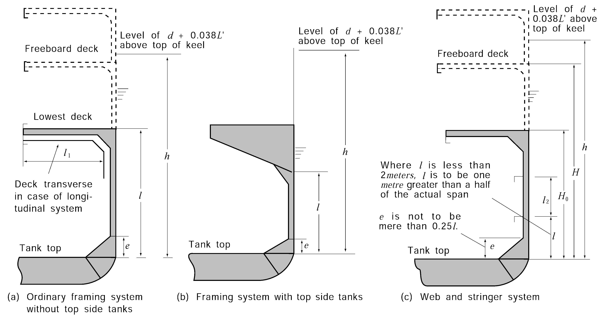
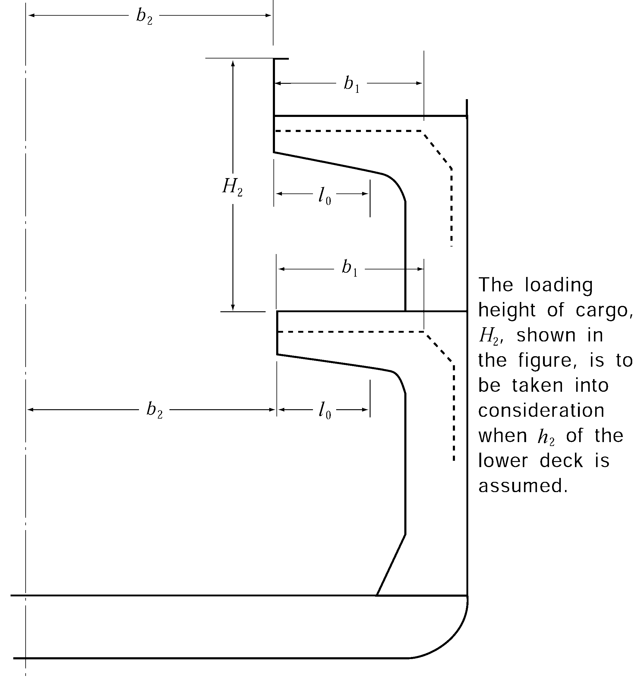
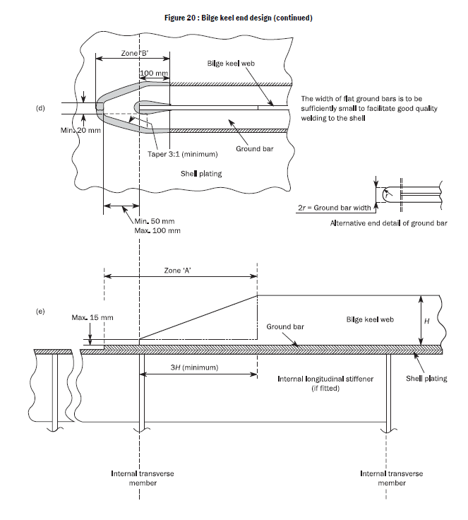
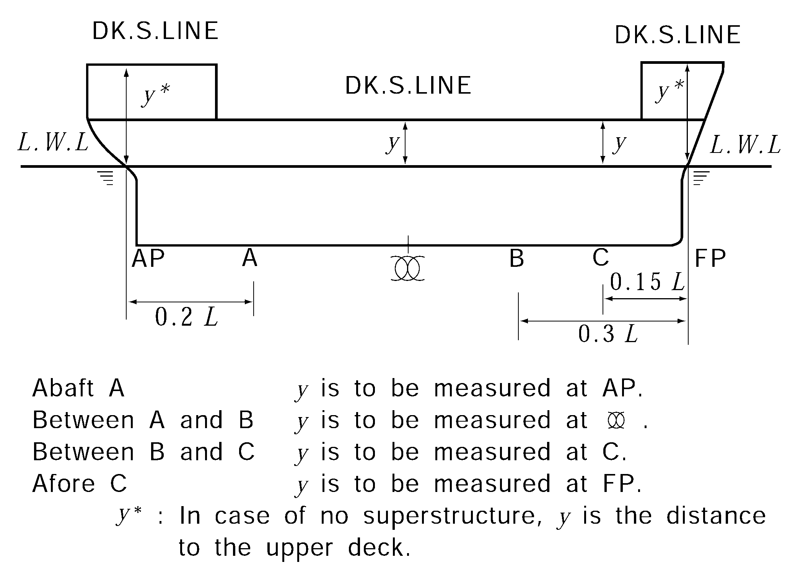
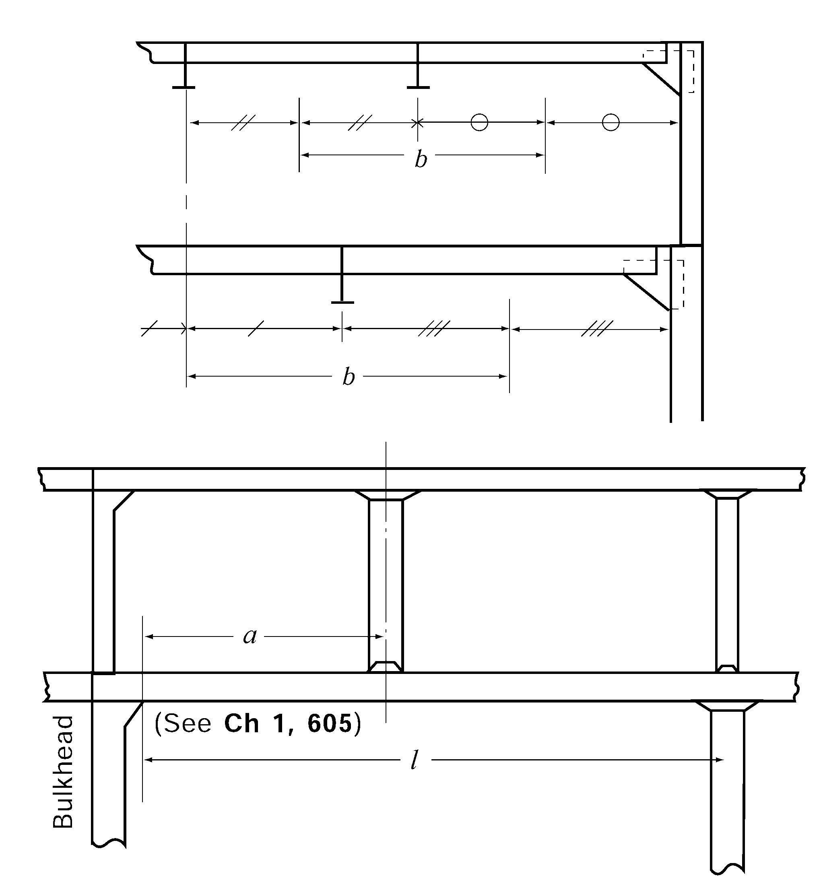

# PART 3 Hull Structures

> RULES FOR CLASSIFICATION OF STEEL SHIPS / RA-03-E / 2025 / EN / Guidance

## CHAPTER 4 PLATE KEELS AND SHELL PLATINGS

### Section 1 General

#### 102. Special consideration for contact with the fishing gear, etc . 【See Rule】

In cases where the service condition of the ship is considered to be such that there is possibility of indent of shell plating due to contact with the fishing gear etc., special consideration is to be given to the thickness of shell plating. However, the Rules and Guidance **102.** may not apply where the shell is protected by suitable accessories such as fenders.

#### 103. Consideration for ship with unusually large freeboard 【See Rule】

Where the distance from the designed maximum load line to strength deck is usually large, the thickness of side shell plating of superstructures and in the range between the imaginary freeboard deck specified in **Ch 1, Sec 203, 2** (1) of the Guidance and the strength deck (hereinafter referred to as "super structure side plating") is obtained from the followings. However, where this requirement is applied, the requirements in Sec 301. of the Rules do not need to be applied to shell plate above the freeboard deck.
$L$ = 90 m ----------- 1.95
$L$≥125 m ----------- 2.30
$t = 0.7 \sqrt {L+50}$(mm)

### Section 3 Shell Plating below Strength Deck

#### 301. Minimum thickness 【See Rule】

The thickness of shell plating of membrane tank LNG ships is not to be less than that obtained from the following formula:
$t = 0.85 \sqrt {L} + 1.5$ (mm)

#### 303. Sheer strakes for midship part 【See Rule】

Attentions to be paid as to sheer strakes

**Fig 3.4.1 Welding construction of joints between sheer****strakes and stringer plates of strenth deck**

#### 305. Bilge plate 【See Rule】

- **1.** Where, in the midship part, longitudinal frames are omitted in the bilge part, the distance from the end of bilge curvature to the nearest longitudinal frame outside the curved part is not to exceed 1/2 of the spacing of longitudinal frames.
- **2.** In determining the thickness of bilge strake in the midship part according to the formula in **305. 1** of the Rules, the following condition is to be met.
  $\frac{1000R}{t} \geq 2 \left( \frac{l}{R} \right) ^{2}$
  where $R$ = radius of bilge circle (m)
  $l$ = spacing of solid floor, bottom transverse or bilge brackets (m)
  $t$ = thickness of bilge strake (mm)
- **3.** The bilge strake in the midship part is to be carefully worked so that deformations of the bilge circle may not exceed 1/3 of thickness of bilge strake amidships.
- **4.** Where bilge keel plates are fitted in the midship part, special consideration is to be given to both the material and the arrangement. *(2019)*
  - **(1)** Material
    The material of the bilge keel and ground bar is to be of the same yield stress as the material to which they are attached. In addition, when the bilge keel extends over a length more than 0.15L, the material of the bilge keel and ground bar is to be of the same grade as the material to which they are attached.
  - **(2)** Design
    The design of single web bilge keels is to be such that failure to the web occurs before failure of the ground bar. This may be achieved by ensuring the web thickness of the bilge keel does not exceed that of the ground bar. Bilge keels of a different design, from that shown in **Fig 3.4.2**, are to be specially considered by the Society.
  - **(3)** Ground bars
    Bilge keels are not to be welded directly to the shell plating. A ground bar, or doubler, is to be fitted on the shell plating as shown in **Fig 3.4.2** and **Fig 3.4.3**. In general, the ground bar is to be continuous.
    The gross thickness of the ground bar is not to be less than the gross thickness of the bilge strake or 14mm, whichever is the lesser.
    
    **Fig 3.4.2 Bilge keel construction**
  - **(4)** End details
    The ground bar and bilge keel ends are to be tapered or rounded. Tapering is to be gradual with a minimum ratio of 3:1, see items (a), (b), (d) and (e) in **Fig 3.4.3**. Rounded ends are to be as shown in item (c) of **Fig 3.4.3**. Cut-outs on the bilge keel web, within zone 'A' (see items (b) and (e) of **Fig 3.4.3**) are not permitted.
    The end of the bilge keel web is to be not less than 50 mm and not greater than 100 mm from the end of the ground bar, see items (a) and (d) of **Fig 3.4.3**.
    Ends of the bilge keel and ground bar are to be supported by either transverse or longitudinal members inside the hull, as indicated as follows:
    • Transverse support member is to be fitted at mid length between the end of the bilge keel web and the end of the ground bar, see items (a), (b) and (c) of **Fig 3.4.3**.
    • Longitudinal stiffener is to be fitted in line with the bilge keel web, it is to extend to at least the nearest transverse member forward and aft of zone 'A' (see items (b) and (e) of **Fig 3.4.3**)
    Alternative end arrangements may be accepted, provided that they are considered equivalent.
    
    **Fig 3.4.3 Bilge keel end design**
    
    **Fig 3.4.3 Bilge keel end design (continued)**

### Section 4 Special Requirements for Shell Plating

#### 401. Shell plating at a location where flare is specially large (2019) 【See Rule】

- **1.** For ships with large flare($K_v + K_f$ exceeds 0.4), the thickness of shell plate above the load line for 0.2L forward is not to be less than that obtained from the following formula: *(2020)*
  $S \sqrt {\frac{\psi P}{\sigma _{y}} \times 10 ^{3} }$ (mm)
  $S$ = spacing of frames, or spacing of girders or longitudinal shell stiffeners measured along the shell plating, whichever is the smaller. (m)
  $\sigma _{y}$ = specified yield stress of materials (N/mm^2)
  $\psi$ = as obtained from following formula
  $\psi = \frac{3 \eta ^{2} - 2 \sqrt {1 + 3 \eta ^{2}} + 2}{12 \eta ^{2}}$
  $\eta$ = spacing of frames, or spacing of girders or longitudinal shell stiffeners measured along the shell plating, whichever is the greater(m), divided by $S$.
  $P$ = slamming impact pressure as specified in **Ch 8, 108.**(kPa)
- **2.** For ships whose $L$ and $C _{b}$ are not less than 250 m and 0.8 respectively, the provisions of **Sub-part 1 Ch 10, Sec 1, 3.3** of **Rule Pt 13** are to be applied.

#### 402. Shell plating stiffened in a spacing remarkably different from the frame spacing 【See Rule】

Where the spacing of stiffening members on shell plating is remarkably different from the spacing, actual spacing is to be used in calculating the thickness of shell plating.(See **Fig 3.4.4**) *(2019)*

**Fig 3.4.4 Measurements and shell plating stiffened in a spacing S**

#### 404. Strengthened bottom forward 【See Rule】

In ships of which $L$ and $C _b$ are not more than 150 m and 0.7 respectively and $V/ \sqrt {L }$ is 1.4 and over, the thickness of shell plating at the strengthened bottom forward is not to be less than the value determined in accordance with **404.** of the Rules using slamming pressure in **Ch 7, Sec 801, 2** (2) (A).

#### 405. Spectacle bossings and stern frame 【See Rule】

In case where the spacing of transverse frames in the aft-peak exceeds 610 mm or the length of ship exceeds 200 mm, the thickness of shell plating adjacent to stem frame or in way of spectacle bossing is to be equivalent to the standards given by **Table 3.4.1.**

**Table 3.4.1 Standard thickness of shell plating adjacent to stern frame or in way of spectacle bossing**

| Spacing of trans frame (mm) | Length of Ship $L$ (m) |   |   |   |   |
| --- | --- | --- | --- | --- | --- |
| Spacing of trans frame (mm) | 90 | 150 | 200 | 250 | 300 |
| 610 | 12.5 | 18.0 | 22.5 | 26.0 | 29.0 |
| 700 | 14.5 | 20.0 | 24.5 | 27.0 | 30.0 |
| 800 | 17.0 | 22.5 | 27.0 | 29.5 | 32.0 |
| 900 | 20.0 | 25.0 | 30.0 | 32.5 | 35.0 |
| Notes : When the value is between the above values, it may be obtained by the interpolation. |   |   |   |   |   |

### Section 6 Compensation at end of Superstructure

#### 601. Strengthening method 【See Rule】

**Fig 3.4.5 Construction of end part of superstructure(without expansion joints)**
**Fig 3.4.6 Construction of end part of superstructure(with expansion joints)**

### Section 7 Local Compensation of Shell Plating

#### 701. Opening in shell 【See Rule】

- **1.** Opening of shell plate of 300 mm or more in size are to be compensated by doubling plate or increasing thickness.
- **2.** In the end parts of hull, proper modification may be accepted for the manners of compensation for opening.
- **3.** The radius at the corners of openings is to be at least 100 mm.

#### 702. Thickness of sea chest 【See Rule】

As for compensation for openings which is acting for sea water suction, **701.** of the Guidance is to be referred to.

#### 703. Locations of openings 【See Rule】

As for compensation for openings, **701** of the Guidance is to be referred to. 
