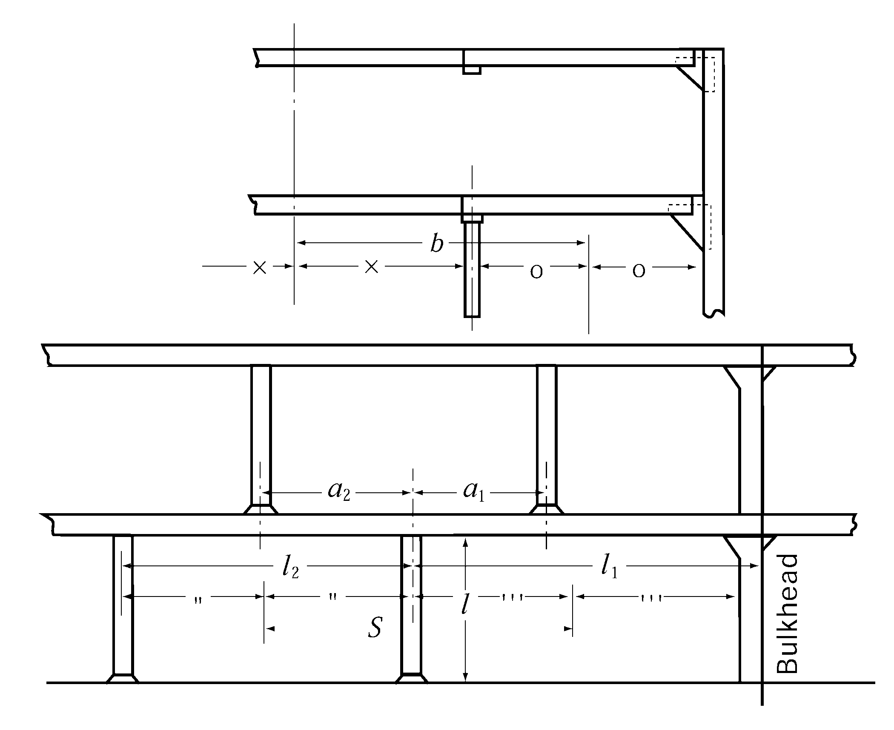

# PART 3 Hull Structures

> RULES FOR CLASSIFICATION OF STEEL SHIPS / RA-03-E / 2025 / EN / Guidance

## CHAPTER 5 DECKS

### Section 1 General

#### 101. Steel deck plating 【See Rule】

Steel decks are not plated

- **1.** **Stringer plate**
  Decks not fully plated are to have stringer plates of an appropriate breadth and of a thickness not less than that determined for deck plating in accordance with the requirements in **Sec 3** of the Rules for the positions concerned. The stringer plates of effective decks are to be effectively connected to the shell plating.
- **2.** **Tie plates**
  Tie plates are to be provided along the hatch sides, in way of pillars, on the under-deck girders and under deckhouse coamings. These tie plates are to have an appropriate breadth and a thickness not less than that determined for deck plating in accordance with the requirements in **Sec 3** of the Rules for the positions concerned.
- **3.** **ln way of transverse bulkheads and at the ends of deck openings**
  In way of transverse bulkheads and at the ends of deck openings, the deck is to be suitably plated with steel plates.

#### 102. Watertightness of decks 【See Rule】

Where the rudder stock penetrates the deck lower than the point located 1.5 m above the load line, special attention is to be given to the watertightness at the penetration.

#### 104. Compensation for openings 【See Rule】

All corners of openings in decks, such as hatchways, are to be well rounded and reinforced, as necessary, by increasing of thickness the deck plating or by means of doubling plates.
Strength deck = within 0.75$L$
Effective 2nd deck = within 0.6$L$
3rd deck and lower decks = In substance, no doubling needed
Superstructures and long deckhouse = Doubling needs within 0.6$L$ for decks immediately above the strength deck

**Fig 3.5.1**
Within 0.5$L$ midpart of strength deck = 250 mm
Elsewhere = 200 mm
The value of $R$ at the 4 corners may be suitably reduced for small openings and small steel ship. For companionways and similar small openings, the radius at the corners may be 150 mm in the strength deck outside the line of openings and 75 mm or so elsewhere.

**Fig 3.5.2** 
**Fig 3.5.3**

#### 105. Rounded gunwales 【See Rule】

Where round gunwales are made of steel plate of Grade *D* or Grade *E*, the inner radius of curvature is not to be less than 20 times the thickness of gunwale plate, except that the radius may be reduced down to 15 times the plate thickness where the width of sheer strake to be bent to form round gunwale is not less than the plate width of a strake prescribed in **Ch.1, Sec 405** of the Guidance plus 500 mm, or the method of bending work is specially approved by the Society.

### Section 2 Effective Sectional Area of Strength Deck

#### 202. Effective sectional area of strength deck 【See Rule】

- **1.** Tapers of stem/stern part to strength deck may tapered with average value of sectional area as **Fig 3.5.4.** However, thickness of plate is not to be reduced rapidly.
- **2.** Where rounded gunwales are provided, the sectional area is to be calculated assuming that the plate of round gunwales be horizontally extended to the ship's side.

#### 204. Long poop 【See Rule】

The effective sectional area of strength deck within long poop which is not deal with strength deck is to be in accordance with **Fig 3.5.5.**

#### 205. Superstructure deck designed as strength deck 【See Rule】

When the poop deck is deal with strength deck, the sectional area of deck within poop is to be in accordance with **Fig 3.5.6.**

### Section 3 Deck Plating

#### 301. Thickness 【See Rule】

When strength deck is framed longitudinally, deck inside the line of openings is desirable to be transversely framed as **Fig 3.5.7.**

**Fig 3.5.4**
**Fig 3.5.5**

**Fig 3.5.6**
**Fig 3.5.7**

#### 307. Deck plating for helicopter landing 【See Rule】

- **1.** For
  $t = 4.6 \sqrt {K} \sqrt {\frac{2S -b}{2S + a} \times \frac{P}{9.81}} + 1.5$ (mm)
  where,
  S : spacing between deck beam (m)
  a, b : length of wheel print measured in parallel and perpendicular to beam (m)(See the **Fig 7.7.2** of **Guidance Pt 7, Ch 7**) Unless otherwise specified elsewhere, a × b is to be 0.3 m × 0.3 m.
  P : As for the deck loads in the range where a helicopter takes off or lands, a load of 75 % of the helicopter maximum take-off weight(MTOW) is to be taken on each of two square areas. But where the emergency condition is considered, a load of 100 % of the MTOW is to be used. (kN)
  K : material factor
- **2.** When the scantling of stiffeners are calculated, simple support beam is to be assumed and allowable stress, 235/K ($\mathrm{N}/mm ^{ 2}$) and P obtained fram **1.** are to be used. But where the arrangement of stiffeners or etc. are considered, continuous beam may be assumed. 
