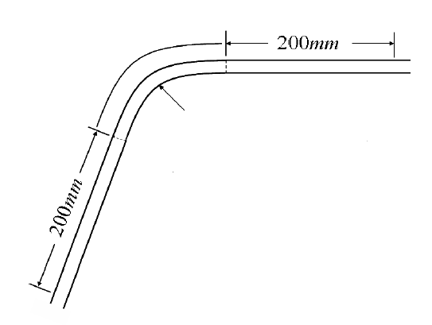
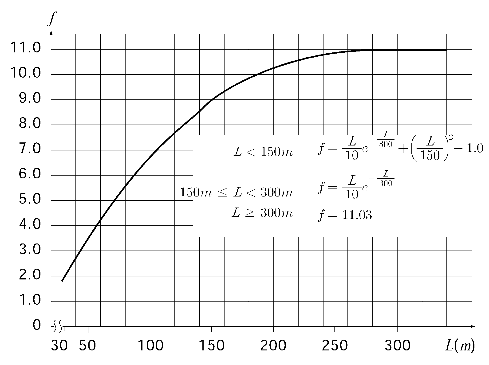

# PART 3 Hull Structures

> RULES FOR CLASSIFICATION OF STEEL SHIPS / RA-03-E / 2025 / EN / Guidance

## CHAPTER 7 DOUBLE BOTTOMS

### Section 1 General

#### 101. Application (2018) 【See Rule】

- **1.** Where it is desired to omit double bottom partially or wholly in accordance with the requirements in **101. 3. or 4.** of the Rules, the concerned parts are to be in accordance with following requirements.
  - **(1)** $s _{i}$ calculated in accordance with requirements of **SOLAS II-1/7.2** is not less than 1 when subject to a bottom damage assumed at any position along the ship's bottom and with an extend specified in (3) below for the affected part of the ship.
  - **(2)** Flooding of such spaces is not to render emergency power and lighting, internal communication, signals or other emergency devices inoperable in other parts of the ship.
  - **(3)** Assumed extent of damage is as followings

    |   | For 0.3 L from the forward perpendicular of the ship | Any other part of the ship |
    | --- | --- | --- |
    | Longitudinal extent | 1/3 $L ^{2/3}$ or 14.5$\mathrm{m}$, whichever is less | 1/3 $L ^{2/3}$ or 14.5$\mathrm{m}$, whichever is less |
    | Transverse extent | $B/6$ or 10$\mathrm{m}$, whichever is less | $B/6$ or 5$\mathrm{m}$, whichever is less |
    | Vertical extent, measured from the keel line | $B/20$ or 2$\mathrm{m}$, whichever is less | $B/20$ or 2$\mathrm{m}$, whichever is less |
  - **(4)** If any damage of a lesser extent than the maximum damage specified in (3) above would result in a more severe condition, such damage is to be considered.
- **2.** For the ships subject to **Korean Ship Safety Act**., relevant requirements of Standard for Steel Ship's Hull Structure is to be applied.
- **3.** For ships with special structure, the scantlings of structural members are to be in accordance with the followings.
  - **(1)** Double hull ship (See **Fig 3.7.1**)
    $B$ may replaced with the 0.5$(B+b)$.
  - **(2)** For ships with inclined sides
    $B$ may be replaced with the length between intersection of extension of inner bottom plate and conjunction point with side shell plate (See **Fig 3.1.1**)
  - **(3)** For ships, the breadth of which becomes particularly narrow in fore and/or aft part in comparison with the breadth in midship part.
    The distance $b$ between the intersection of inner bottom and shell plating at centre of hold length may be used in place of $B$ (See **Fig 3.7.2**)
  - **(4)** In spite of the (1) through (3), the scantlings may be determined by direct calculation method.
    
    **Fig 3.7.1** 
    **Fig 3.7.2 For ships, the breadth of which becomes particularly narrow in fore and/or aft part**
- **4.** In holds with pillars, the thickness of centre girder, side girders, solid floor, inner bottom plating and bottom shell plating may be reduced in accordance with the results of direct strength calculation.
- **5.** With respect to the provisions of **101. 7** of the Rules, where the ratio of cargo weight per unit area ($\mathrm{kN}/m^2$) of the inner bottom plating to d is less than 5.40, double bottom structures are to be in accordance with **203. 1**, **302. 1**, **501. 2** and **505. 1**. Where cargo loads can not be treated as evenly distributed loads, scantlings of double bottom structures are to be determined by taking account of load distribution for particular cargoes. Where concentrated loads act on specific points of double bottoms, scantlings of center girders, side girders, floors, inner bottom plates and bottom plates and their stiffeners are to be determined by an appropriate strength assessment such as direct calculations.

#### 107. Strengthening under boilers 【See Rule】

Considering the corrosive environment due to high temperature, thickness of all members under boiler is to be increased according to the following standards. However, where the effective means for preventing corrosion or overheating are provided, increasing of thickness is not to be needed. Above mentioned effective preventing for overheating means the case which temperature of the upper surface of inner bottom plate is 40°C or less in usual condition.

| Structural member | Increasement |
| --- | --- |
| Centre girder | 3.0 mm |
| Side girder | 3.0 mm |
| Solid floors | 3.0 mm |
| Inner bottoms | 3.5 mm |
| Vertical stiffener | 1.5 mm |
| Section modulus of reverse frames of open floors and inner bottom longitudinals | 15 % |
| Section modulus of frames of open floors and bottom longitudinal | 7 % |
| Sectional area of vertical strut | 10 % |

### Section 2 Centre Girders and Side Girders

#### 201. Arrangement and construction 【See Rule】

- **1.** Where side girders are unable to extend forward and/or aftward because of the breadth of double bottom becoming narrow in fore and/or aft part, the side girders are to be sufficiently lapped over the adjacent girders in order to keep continuity of strength.
- **2.** Girders or half height girders are to be provided under longitudinal bulkheads for proper strengthening of double bottom.

#### 203. Thickness 【See Rule】

- **1.** Where the ratio of load per square meter of double bottom (kN/m^2) to $d$ is less than 5.40, $C_1$ in the formula in **203.** (1) of the Rules is to be obtained from the following formula.
  $C _1 ' = n a b$
  $n$ = coefficient, as obtained from the following
  - **(1)** For holds adjacent to each other and being loaded or empty simultaneously; Where $B/l_H$ is 1.4 and over, it is to be taken as 1.4, and where $B/l_H$ is less than 0.4, it is to be taken as 0.4
    $n=\frac{1}{1.4} \left({3-\frac{B}{l_H}}\right)$
  - **(2)** Other cargo holds : $n$ = 1.0
    $l_H$ = as specified in **203.** of the Rules
    $a$ = as obtained from the following formula
    $a = 1.35 - \frac{h \gamma}{d}$
    $h$ = as specified in **403. 2** of the Rules
    $\gamma$ = as specified in **101. 7** of the Rules
    $b$ = coefficient,
    for the longitudinaly framed construction = 17
    for the transversely framed construction = 20
- **2.** For the double hull construction, $C_1$ specified in **203.** (1) is to be obtained from the following formulae.
  $C_1 '' = na (b - betab')$
  $n$ = coefficient, As specified in **Pt 7, Ch 3 Table 7.3.2** of the Rules
  $a$ = as specified in **1.** above. But not to be less than 0.8
  $b$ = as specified in **1.** above.
  $b'$ = for the longitudinaly framed construction = 4
  for the transversely framed construction = 5
  $\beta$ = coefficient to be obtained from the following formula. However, where the hold is unusually long or where the sides are constructed on the transverse framing system and the spacing of side transverses is unusually large, special consideration is to be given.
  $\beta = {1} over {1+\frac{2t_0 d_0 ^2 H _s}{3t_s d_s^2 B_0}$
  $t_0$ = mean thickness of inner bottom plating and bottom shell plating (mm)
  $t_s$ = mean thickness of longitudinal bulkhead and side shell plating
  $d_0$, $d_s$, $B_0$ and $H_s$ = distance (m), shown in **Fig 3.7.5**
  
  **Fig 3.7.5 Double side structure**

#### 204. Brackets 【See Rule】

The thickness, size, form, etc. of brackets specified in **204.** of the Rules are to be determined by taking into consideration of the height of centre girders and their buckling strength. As the examples, **Fig 3.7.6** is shown.

**Fig 3.7.6 Forms of docking brackets**

### Section 3 Solid Floors

#### 302. Thickness 【See Rule】

- **1.** Where the ratio of load per square metre of double bottom to $d$ is less than 5.40, the coefficient $C_2$ in the formula in **302.** (1) of the Rules is to be obtained from the following formula.
  $C _2 ' = ab$
  $a$ = as specified in **203. 1** of the Rules
  $b$ = value is specified in **Table 3.7.3** of the Guidance according to the value of $B/l_H$
  $l_H$ = as specified in **203.** of the Rules

  **Table 3.7.3 Coefficient** $b$

  | $B/l_H$ |   | 0.4 and under | 0.4 0.6 | 0.6 0.8 | 0.8 1.0 | 1.0 1.2 | 1.2 |
  | --- | --- | --- | --- | --- | --- | --- | --- |
  | Longitudinal structure |   | 36 | 34 | 31 | 28 | 23 | 21 |
  | Trans. Structure | When solid floors are provided in each frame | 36 | 34 | 31 | 28 | 23 | 21 |
  | Trans. Structure | When solid floors are provided between 2 frames or over | 25 | 24 | 21 | 20 | 16 | 15 |
- **2.** The thickness of solid floors of ships of double hull construction is to be obtained according to the following prescriptions.
  - **(1)** $B '$ and $B ''$ in the formula in **302.** (1) of the Rules are to be as follows.
    $B '$ = distance between longitudinal bulkheads at the top of inner bottom plating at amidship (m) (See **Fig 3.7.5**)
    $B ''$ = distance between longitudinal bulkheads at the top of inner bottom plating at the position of solid floor (m)
  - **(2)** The coefficient $C_2$ in the formula in **302.** (1) of the Rules is to be obtained from the following formula.
    $C_2 = a (b + betab')$
    $a$ = as specified in **203. 1** of the Guidance. However, it is not to be less than 0.8
    $b$ = value is specified in **Table 3.7.3** of the Guidance according to the value of $B/l_H$
    $b '$ = value is specified in **Table 3.7.4** of the Guidance according to the value of $B/l_H$
    $\beta$ = as specified in **203. 2** of the Guidance
    $l_H$ = as specified in **203.** of the Rules

    **Table 3.7.4 Coefficient** $b '$

    | $B/l_H$ |   | 0.4 and under | 0.4 0.6 | 0.6 0.8 | 0.8 1.0 | 1.0 1.2 | 1.2 |
    | --- | --- | --- | --- | --- | --- | --- | --- |
    | Longitudinal structure |   | 1 | 3 | 6 | 9 | 14 | 15 |
    | Trans. Structure | When solid floors are provided in each frame | 1 | 3 | 6 | 9 | 14 | 15 |
    | Trans. Structure | When solid floors are provided between 2 frames or over | 1 | 2 | 4 | 6 | 9 | 11 |

### Section 4 Bottom Longitudinals

#### 403. Section modulus 【See Rule】

- **1.** Where the apparent specific gravity $\gamma$ of cargoes in loaded holds exceeds 0.9, the coefficient $C$ in the formula in **403. 1.** of the Rules is to be as followings
  - **(1)** where no strut as per **404.** of the Rules is provided midway between the floors-------100
  - **(2)** where a strut as per **404.** of the Rules is provided midway between the floors
    Under deep tanks-------------- 62.5
    Elsewhere------------------------ 30$\gamma$ + 20
    In no case is $C$ to be less than 50.
    $\gamma$ = As specified in **101. 7.** of the Rules.
- **2.** In case where the width of vertical stiffeners fitted on solid floors and vertical struts is unusually large, the coefficient $C$ in **403. 1.** and **2.** of the Rules may be multiplied by the value obtained from the following formula.
  $\left({1-\frac{a}{l}}\right)^2 \left({1-\frac{b}{l}} \right)$
  $l$ = distance between floors (m)
  $a$ = width of vertical stiffeners on floors (m). $a$ is to be zero, if the vertical stiffeners are not well fixed to longitudinals by means of lug connection.
  $b$ = width of vertical strut (m) (See **Fig 3.7.7**)
  
  **Fig 3.7.7** 
  **Fig 3.7.8 Details of lap of strut and longitudinal frame**

#### 404. Struts 【See Rule】

Depth of lapped parts of vertical struts over web of longitudinals is to be of 1.5 times as large as the breadth of face plates of struts as a standard. Where the sufficient depth of lapped parts is unable to be taken due to weld ability, throat of fillet weld is to be properly increased. (See **Fig 3.7.8**)

### Section 5 Inner Bottom Plating, Margin Plates and Bottom Shell Plating

#### 501. Thickness of inner bottom plating 【See Rule】

- **1.** Where the height of centre girder is less than $B/16$, the thickness of inner bottom plating and bottom shell plating are to be increased so that the moment of inertia of the double bottom obtained from the following formula may be equivalent to that corresponding to the case where the centre girder has the required height.
  $I=1.23 \frac{t_1 t_2}{t_1 + t_2} d_0^2$
  $d_0$ = height of centre girder (m)
  $t_1$ = thickness of bottom shell plating (mm)
  $t_2$ = thickness of inner bottom plating (mm)
- **2.** Where the ratio of load per square metre of double bottom to $d$ is less than 5.40, the coefficient $C$ in the formula of **501. 1.** of the Rule is to be obtained from the following formula.
  $C ' = ab$
  $a$ = as specified in **203. 1.** of the Guidance
  $b$ = coefficient $b_0$ or $alphab_1$ as specified in the followings according to the value of $B/l_H$
  $B/l_H$ < 0.8 ; $b_0$
- **0.** 8≤$B/l_H$ < 1.2 ; $alphab_1$ or $b_0$, whichever is greater.
- **1.** 2≤$B/l_H$ ; $alphab_1$
  $l_H$ = as specified in **203.** of the Rules.
  $b_0$ and $b_1$ = as specified in **Table 3.7.5** according to the value of $B/l_H$. However, for the transversely framed construction, the value $b_1$ specified in the Table, is to be multiplied by 1.1.
  $\alpha$ = as obtained from the following formula
  $\alpha = \frac{13.8}{24 - 11.4 f_B K}$

  **Table 3.7.5 Coefficient** $b_0$ **and** $b_1$

  | $B/l_H$ | Not less than | 0.4 | 0.6 | 0.8 | 1.0 | 1.2 | 1.4 | 1.6 |
  | --- | --- | --- | --- | --- | --- | --- | --- | --- |
  | $B/l_H$ | Not much than 0.4 | 0.6 | 0.8 | 1.0 | 1.2 | 1.4 | 1.6 |   |
  | $b_0$ | 5.5 | 4.9 | 4.1 | 2.8 | 2.0 | ─ | ─ | ─ |
  | $b_1$ | ─ | ─ | ─ | 2.8 | 2.6 | 2.4 | 2.2 | 1.8 |
- **3.** For the ships with double hull construction, $C$ in the formula $t_1$ in **501. 1.** of the Rules, is to be obtained from the following formula, whichever is greater.
  $C_1 = a(b_0 - betab'_0 )$
  $C_2 =a \alpha(b_1 - \beta b'_1 )$
  $a$ = coefficient, is to be in accordance with **203. 1.** of the Guidance. However, it is not to be less than 0.8
  $b_0$, $b_1$ and $\alpha$ = as obtained from the above mentioned **2.**
  $b'_0$ and $b'_1$ = as specified in **Table 3.7.6** according to the value of $B/l_H$. However, for the transversely framed construction, the value $b'_1$ specified in the Table, is to be multiplied by 1.1.
  $l_H$ = as specified in **203.** of the Rules
  $\beta$ = It is to be in accordance with **203. 2** of the Guidance.

  **Table 3.7.6 Coefficient** $b'_0$ **and** $b'_1$

  | $B/l_H$ | Not less than | 0.4 | 0.6 | 0.8 | 1.0 | 1.2 | 1.4 | 1.6 |
  | --- | --- | --- | --- | --- | --- | --- | --- | --- |
  | $B/l_H$ | Not much than 0.4 | 0.6 | 0.8 | 1.0 | 1.2 | 1.4 | 1.6 |   |
  | $b'_0$ | 3.1 | 2.5 | 1.8 | 1.0 | 0.5 | ─ | ─ | ─ |
  | $b'_1$ | ─ | ─ | ─ | 1.1 | 1.1 | 0.8 | 0.7 | 0.4 |
- **4.** In case forklift is used for unloading operation, thickness of inner bottom plate is to be also in accordance with **Ch 5, 305.** of the Rules.
- **5.** Butt joints of inner bottom plating in the midship part are generally not to be arranged at the knuckle line of the inner bottom.

#### 505. Bottom shell plating 【See Rule】

- **1.** Where the ratio of load per square metre of double bottom to $d$ is less than 5.40, the thickness of bottom shell plating is to be determined as follows.
  In the region of double bottoms under cargo holds, the thickness of bottom shell plating is not to be less than obtained from the formula in **Ch 4, 304.** of the Rules or from the first formula in **Ch 7, 501. 3** of the Rules whichever is greater. In applying the latter formula, coefficient $C '$ is described in **501. 3** of the Guidance. However, In applying the first formula in **501. 1** of the Rules, $\alpha$ is to be obtained from the following formula.
  $\alpha = \frac{13.8}{24-15.0f_B K}$
- **2.** In the region of double hull construction, the thickness of bottom shell plating is not to be less than obtained from the formula in **Ch 4, 304.** of the Rules or from the first formula in **501, 3.** of the Rules whichever is greater. In applying the latter formula, coefficient $C$ described in **501. 2** of the Guidance. However, in applying the first formula in **501. 1** of the Rules, $\alpha$ is to be obtained from the following formula.
  $\alpha = \frac{13.8}{24 - 15.0 f_B K}$

### Section 8 Construction of Strengthened Bottom Forward

#### 801. Application 【See Rule】

- **1.** Here, the ballast condition means the ordinary ballast condition where only the ballast tanks such as clean ballast tanks, segregated ballast tanks and ballast holds are ballasted. This ballast condition excludes an exceptional case where cargo tanks are ballasted only in the heavy weather condition to assure the safety of the ship.
- **2.** In ships of which $L$ and $C _{b}$ are not more than 150 m and 0.7 respectively and $V/\sqrt { L}$ is 1.4 and over, the construction of bottom forward is to be as required in the followings. However, ships that carry a certain amount of cargo regularly such as Container Ships may comply with the requirements in **802.** to **804.** of the Rules instead.
  - **(1)** Construction
    Construction of strengthened bottom forward is to be in accordance with **803.** of the Rules. However, the vertical stiffeners for the solid floors specified in **803. 3** of the Rules are to be provided on all shell stiffeners. Where the bottom longitudinals or longitudinal shell stiffeners are extended through the solid floors, slots are to be reinforced with collar plates.
  - **(2)** Scantlings of longitudinal shell stiffeners or bottom longitudinals
    $Z = 0.53 P a l^2$(cm^3)
    $l$ = spacing of solid floor (m)
    $a$ = 0.774 *l* (m) However, where the spacing of longitudinal shell stiffeners or bottom longitudinals is not more than 0.774$l$, is to be taken as the spacing (m).
    $P$ = slamming pressure obtained from the following formula
    $P=\frac{2.48LC_1 C_2 C_3 C_4}{\beta}$(kPa)
    $C_1$ = as specified in **Table 3.3.7** of the Guidance. For the intermediate value $V/ \sqrt { L}$ is to be obtained by linear interpolation.

    **Table 3.7.7 Coefficient** $C_1$

    | $V/ \sqrt { L}$ | 1.4 | 1.5 | 1.6 | 1.7 | 1.8 |
    | --- | --- | --- | --- | --- | --- |
    | $C_1$ | 0.31 | 0.33 | 0.36 | 0.38 | 0.40 |

    $C_2$ = coefficient obtained from the following formula
    $V/ \sqrt { L} \leq 1.0 ; 0.4$
    $1.0 < V / sqrtL \leq 1.3 ; 0.667V/ \sqrt { L} - 0.267$
    $1.3 \leq V/ sqrtL ; 1.5V/ \sqrt { L} - 1.35$
    $\beta$ = slope of ship's bottom obtained from the following formula, but $C_2 /\beta$ is greater than 11.43, it is to be taken as 11.43.
    $\beta=\frac{0.0025L}{b}$
    $b$ = horizontal distance measured at the station 0.2$L$ from the stem, from the centre line of ship to the intersection of the horizontal line 0.0025$L$ above the top of keel with the shell plating (m) (See **Fig 3.7.2**)
    $C_3$ = as obtained from the following formula
    $C_3 = 1.9-0.9 \left(\frac{d_f}{0.025L}\right)$
    $d_f$ = minimum bow draught at the ballast conditions.
    $C_4$ = coefficient obtained from the followings.
    $x_1 \leq x ; 1.0$
    $x\(x$ = length to longitudinal direction from end of stem to transverse section (m)
    $x_1$ = as obtained from the followings
    $C_b < 0.7 ; 0.1 L$
    $0.7 \leq C_b < 0.8 ; (0.1-0.5(C_b -0.7)) L$(m)
    $0.8 \leq C_b ; 0.05 L$
    - **(A)** In ships having bow draught not more than 0.025$L$ at the ballast condition, the section modulus ($Z$) of longitudinal shell stiffeners or bottom longitudinals in way of the strengthened bottom forward is not to be less than that obtained from the following formula
    - **(B)** In ships having bow draught more than 0.025$L$ but less than 0.037$L$ at the ballast condition, the section modulus of longitudinal shell stiffeners or bottom longitudinals in way of the strengthened bottom forward is to be obtained by the linear interpolation from the values given by the requirements in (A) and the values in **403. 1** of the Rules.
  - **(3)** Thickness of solid floors
    Thickness of solid floors is obtained from the following (A) and (B), whichever is greater.
    $t = \frac{PS bK}{196(b-d_1 )} + 1.5$(mm)
    $P$ = slamming pressure given by (2)(A). In ships having bow draught more than 0.025$L$ but less than 0.037$L$ at the ballast condition, this requirement is to be applied using actual bow draught at the ballast condition.
    $S$ = spacing of solid floors (m)
    $b$ = breadth of panel (m)
    $d_1$ = sum of breadth of panel opening (m), where the opening compensated with double plates, sectional area may be properly considered.
    $t=1.1 root {3} of {PS b ^{2}} +1.5$(mm)
    $P$ and $S$ = as specified in (A)
    $b$ = spacing of bottom longitudinal (m)
    
    **Fig 3.7.9 Solid floor of strengthened bottom forward**
    - **(A)** The thickness of solid floors in 1/2 spacing of both sides of bottom longitudinals is to be obtained from the following formula. (See **Fig 3.7.9**)
    - **(B)** Thickness of solid floors is to be obtained from the following formula.
- **3.** With respect to the requirements of **801.** of the Rules, ships of which $L$ and $C _{b}$ are 150 m or more and 0.7 or more respectively may apply to the followings.
  - **(1)** Slamming impact pressure $P$ specified in **804. 1** of the Rules**,** may be given by the following formula. In this case, the slamming impact pressure is to be calculated at the mid-span point for each longitudinal shell stiffeners or bottom longitudinals.
    $P = 1.14 \frac{\nu ^{2}}{\beta}$ (kPa)
    $\beta$ = as given by the following formula. In no case, the value of #eqnID-632_s2is greater than 11.43.
    $\beta = \frac{0.0025 L}{b}$
    $b$ = in considering transverse section, horizontal distance (m) from the ship’s center line to the intersection of the horizontal line of 0.0025L above the ship’s base line and the ship’s moulded line of shell.
    $\nu$ = relative speed (m/s)between the ship’s bottom of considered position and sea surface as given by the following formula.
    $\nu = C _{0} ( \frac{2 \pi}{T _{P}} ( \sqrt {C _{4}} + 0.45H _{w} \cos \phi + 0.18 \lambda \sin \phi ) + 0.51C _{7} V \sin \phi )$
    $C _{0}$ = as given by the following formula.
    $C _{0} = 1-0.015 ( \frac{L - 150}{150} )$
    $C _{4}$ = as given by the following formula. In no case, the value is less than zero.
    $C _{4} = (l+0.05L) ^{2} \phi _{0} ^{2} - (0.025L ' ) ^{2}$
    $l$ = longitudinal distance (m) from the midship to the considered position.
    $L'$ = length of ship (m). Where, however, $L$ exceeds 230 m, $L'$ is to be taken as 230 m.
    $\phi _{0}$ = pitch angle (rad) as given by the following formula.
    $\phi = \frac{3.3 (C _{7} V +5) ^{0.2}}{L ^{1.2} \sqrt {C _{b}}} H _{W}$
    $H _{W}$ = significant wave height (m) as given by the following formula. However, this value may not be greater than the maximum value of 0.055L and 11.5.
    $H _{W} = C _{5} C _{6}$
    $C _{5}$= as given by the following formula.
    $L \leq 300$ : $C _{5} = 10.75 - ( \frac{300 - L}{100} ) ^{1.5}$
    $300< L \leq 350$ : $C _{5}$ = 10.75
    $350 < L$ : $C _{5} = 10.75 - ( \frac{L - 350}{150} ) ^{1.5}$
    $C _{6}$= As given by the following formula.
    $C _{6} = \sqrt {\frac{L + \lambda -25}{L}}$
    $C _{7}$= as given by the following formula. In any case, this value is not to be less than 0 and not to be greater than 1.
    $C _{7} = \frac{V / \sqrt {L} - 1.1}{0.4}$
    $\lambda$ = wave length as given by the following formula.
    $\lambda = 0.6 (1.5 + \frac{(0.0075 L + 0.025 L ' )}{2 d} )L$ (m)
    $T _{P}$ = natural period of pitch motion as given by the following formula.
    $T _{P} = \sqrt {\frac{2 \pi \lambda}{g}}$ (sec)
    $\phi$ = as given by the following formula. However, this value may not be greater than $0.015 + \phi$
    $\phi = 0.015 + \tan ^{-1} ( \frac{0.025 L '}{l + 0.05 L} )$ (rad)
  - **(2)** For the examination of the position within ballast tanks which are to be filled up by sea water in the ballast conditions, the slamming impact pressure P specified in (1) above may be reduced by $\Delta P$ as given by the following formula. In this case, it is to be stated in the ship’s loading manual that such ballast tanks are to be filled up in the heavy weather condition.
    $\Delta P = 5 h$ (kPa)
    $h$ = depth of the ballast tank (m)
- **4.** In way of strengthened bottom forward, structural arrangements other than those specified in **803.** of the Rules may be adapted subject to the following (1) to (3).
  - **(1)** The thickness of solid floors in the longitudinal stiffened system and girders in the transverse stiffened system is to apply to the provisions of **801. 2** (3). For the thickness of solid floors in the longitudinal stiffened system, the slamming impact pressure $P$ may be corrected by multiplying the coefficient $C _{9}$ specified in (3) the below.
  - **(2)** The thickness of solid floors and girders is not to be less than the value obtained by the following (A) and (B), whichever is the greater.
    $P$ = the considered slamming impact pressure as specified in **804. 1** of the Rules, **801. 2**. or **801. 3**. In ships having bow draught more than 0.025 $L '$ but less than 0.037 $L '$ at the ballast condition, the slamming impact pressure is to be obtained by linear interpolation from the above value and the value obtained by the following formula as the pressure when the bow draught is 0.037 $L '$. The slamming impact pressure is not to be less than the value obtained by the following formula.
    $P = 1.015 L$ (kPa)
    $C _{8}$ = as given by the following formula. In any case, this value is not to be less than 0.1 and not to be greater than 1.
    $C _{8} = \frac{3}{A}$
    $A$ = area (m^2) considered in the strength examination, in this case, as given by the following formula
    $A = S \times l$
    $S$ = spacing (m) at solid floors or girders for themselves under the consideration
    $l$ = spacing (m) at solid floors or girders for members crossing those under the consideration
    $d _{0}$ = depth (m) of the floors or the girders at the considered position
    $d _{1}$ = depth (m) of the opening in the floors or the girders at the considered position.
    - **(A)** $t _{1} = K \frac{C _{8} P S l}{226 (d _{0} - d _{1} )} +2.5$ (mm)
    - **(B)** The value given by the requirements of **302.** (2) of the Rules, using the value of $t _{1}$ as given by the above (a), in the mentioned requirements. For the application to girders, the wording 'solid floors' specified in **302.** (2) of the Rules is to be read as 'girders'.
  - **(3)** For scantlings of longitudinal shell stiffeners and bottom longitudinals, the slamming impact pressure $P$ may be corrected by multiplying the coefficient $C _{9}$ as given by the following formula. In any case, the coefficient $C _{9}$ is not to be less than 0.1 and not to be greater than 1.
    $C _{9} = \frac{3}{l}$
    $l$ = as given in **804. 1** of the Rules

#### 802. Definition 【See Rule】

In ships of which $L$ and $C_b$ are less than 150 m and 0.7 respectively and bow draught is less than 0.025$L$ at the ballast condition, the area of strengthened bottom forward of the ship is to be expended as follows.
$a = 0$*,* where $C_b = 0.7$
$a = 0.05 L$*,* where $C_b < 0.6$
For intermediate values of $C_b$, $a$ is to be obtained by linear interpolation.

**Fig 3.7.10 Range of transverse direction of strengthened bottom forward**
