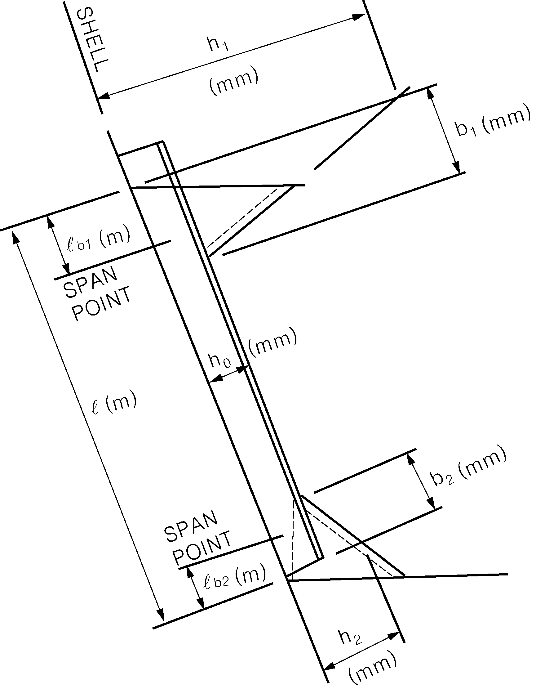
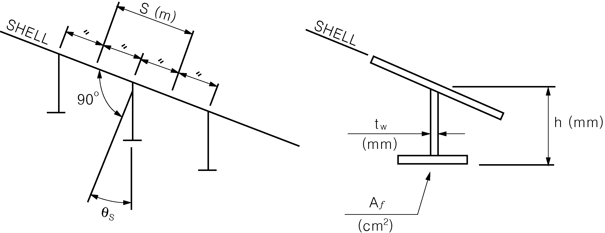
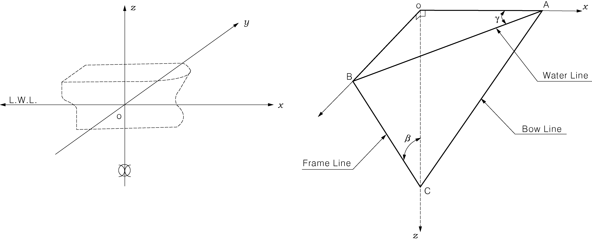
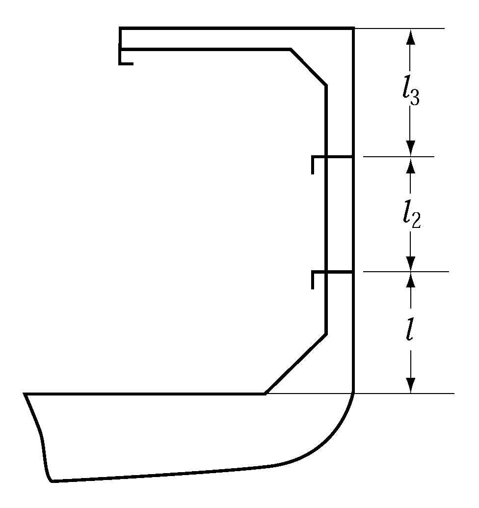
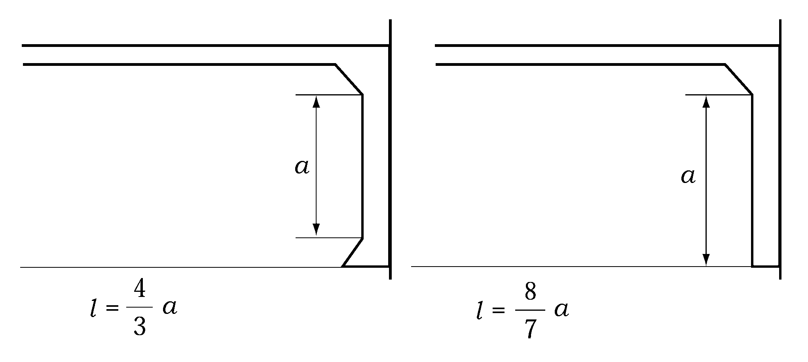

# PART 3 Hull Structures

> RULES FOR CLASSIFICATION OF STEEL SHIPS / RA-03-E / 2025 / EN / Guidance

## CHAPTER 8 FRAMES

### Section 1 General

#### 105. Frames in boiler spaces and in way of bossing 【See Rule】

In application to **105. 2** of the Rules, the term "the satisfaction of the Society" means to accept in accordance with **Pt 1, Ch 1, 105.** of the Rules.

#### 106. Frames and stringers fitted up at extremely small angles 【See Rule】

For the applying **106.** of the Rules, where the angle between the web of frames and shell plating is extremely small, the requirements of **Pt 13, Sub Pt 1, Ch 3, Sec 6, 3.1.2** and **Sec 7, 1.4.4** of the Rules may be applied.

#### 108. Frames at a location where flare is specially large (2019) 【See Rule】

- **1.** For ships with large flare($K_v + K_f$ exceeds 0.4), the thickness $t _{w}$ of web plates and the plastic section modulus $Z _{p}$ of transverse frames and side longitudinals, which are fitted where the bow flare located above the load line and forward of 0.2 $L$ is considered to endure large wave impact pressure, are not to be less than that obtained from the following formula. *(2020)*
  Required thickness of web plate : $t _{w} = \frac{648PS l _{s} ^{}}{h _{0} \sigma _{y} \cos \theta _{s}}$ (mm)
  Required plastic section modulus : $Z _{p} = \frac{PS l _{s} ^{2}}{16 \sigma _{y} \cos \theta _{s}} \times 10 ^{3}$ (cm^3)
  Where,
  $S$ = frame spacing measured along the shell plating (m)
  $l _{s}$ = unsupported length of frame as obtained from the following formula (m)
  $l _{s} = l - l _{b1} - l _{b2}$
  $l$ = refer to **Fig 3.8.1**
  #eqnID-712_s2and $l _{b2}$ = bracket length for span correction as obtained from the following formulae
  $l _{b1} = b _{1} (1 - \frac{h _{0}}{h _{1}} ) \times 10 ^{-3}$
  $l _{b2} = b _{2} (1 - \frac{h _{0}}{h _{2}} ) \times 10 ^{-3}$
  $b _{1}$, $b _{2}$, $h _{0}$, $h _{1}$ and $h _{2}$ = refer to **Fig 3.8.1**
  $\sigma _{y}$ = specified yield stress of the material (N/mm^2)
  $\theta _{s}$ = frame list angle to side shell (deg), refer to **Fig 3.8.2**
  $P$ = slamming impact pressure as obtained from the following formula (kPa)
  $P = \frac{1}{2} \rho C _{e} K _{P} ( \frac{\nu _{n}}{\cos \beta _{0}} ) ^{2}$
  $\rho$ = sea water density, 1.025 (t/m^3)
  $\beta_0$ = relative impact angle between wave surface and a point under consideration on ship’s surface as obtained from the following formula (deg)
  $\beta _{0} = \phi - \phi _{b} ^{}$
  $\phi$ = as obtained from the following formula (deg)
  $\phi = \tan ^{-1} ( \frac{1}{\tan \beta _{k} \cos \gamma} )$
  $\beta _{k}$ = as obtained from the following formula (deg)
  $\beta _{k} = \beta _{k1} - \sqrt {45- \beta }$ ($\beta \leq 45 ^{o}$)
  $\beta _{k} = \beta _{k1} + \sqrt {\beta -45}$ ($\beta >45 ^{o}$)
  $\beta$ = shell angle at the section under consideration (deg) (see **Fig 3.8.3**)
  $\beta _{k1}$ = as obtained from the following formula (deg)
  $\beta _{k1} = 45 "{"0.95 (0.8 -X/L) (1.2 - X/L) +1"}" - 0.02 (D _{z} - d) (D _{z} - d - 20)$
  $X$ = longitudinal distance from the aft end of $L$ to the section under consideration (m)
  $D _{z}$= vertical distance from base line at the middle of $L$ to the section under consideration (m)
  $\gamma$ = shell angle at the section under consideration (deg) (see **Fig 3.8.3**)
  $\phi _{b}$ = as obtained from the following formula
  $\phi _{b} = ( \frac{\phi _{bF} -33}{0.15} )(X/L-0.8)+33$ (where, $0.8 \leq X/L<0.95$)
  $\phi _{b} = \phi _{bF}$ (where, $0.95 \leq X/L$)
  $\phi _{bF} =35$ (where, $L<200$)
  $\phi _{bF} =-L/25+43$ (where, $200 \leq L<400$)
  $\phi _{bF} =27$ (where, $400 \leq L$)
  $K _{P}$= coefficient obtained from the formula in **Table 3.8.1**
  $C _{e}$= coefficient obtained from the following formula
  $C _{e} = \frac{\beta _{0}}{40} + 0.25$ (where, $\beta _{0} \leq 30 ^{o}$)
  $C _{e} = 1.0$ (where, $\beta _{0} >30 ^{o}$)
  $\nu _{n}$ = maximum relative velocity between wave surface and a point under consideration on ship’s surface as obtained from the following formula (m/s)
  $\nu _{n} = \frac{\nu _{x} \tan \beta _{k} + \nu _{z} \tan \alpha \tan \beta _{k}}{\sqrt {\tan ^{2} \alpha +\tan ^{2} \beta _{k} +\tan ^{2} \alpha \tan ^{2} \beta _{k}}}$
  $\nu _{x}$ = longitudinal relative velocity at a point under consideration on ship’s surface as obtained from the following formula (m/s). However, $\nu _{x}$ is to be greater than 0.
  $\nu _{x} = (1 - C _{1} ) \nu _{xo}$
  $C _{1}$ = coefficient obtained from the formula in **Table 3.8.2**
  $\nu _{x0}$ = longitudinal relative velocity at the waterline as obtained from following formula (m/s)
  $\nu _{x0} = \nu _{s} + C _{2} \sqrt {Lg }$
  $\nu _{s}$ = 0.36$V$ (m/s)
  $V$ = speed of ship (kt)
  $g$ = gravity acceleration, 9.81 (m/s^2)
  $C _{2}$ = coefficient obtained from the formula in **Table 3.8.2**
  $\nu _{z}$ = relative velocity at a point under consideration on ship’s surface in the direction of ship’s depth as obtained from the following formula (m/s). However, $\nu _{z}$ is to be greater than 0.
  $\nu _{z} = (1 - C _{3} ) \nu _{zo}$
  $C _{3}$ = coefficient obtained from the formula in **Table 3.8.2**
  $\nu _{z0}$ = relative velocity at the waterline in the direction of ship's depth as obtained from the following formula (m/s)
  $\nu _{z0} = C _{4} \sqrt {Lg }$
  $C _{4}$ = coefficient obtained from the formula in **Table 3.8.2**
  $\alpha$= as obtained from the following formula
  $\alpha = \tan ^{-1} ( \frac{\tan \beta _{k}}{\tan \gamma} )$
  $Z _{P}$ = plastic section modulus of frame, where the frame is joined to shell plate with a right angle, as obtained from the following formula. (cm^3)
  $Z _{P} = 0.1 A _{f} h + \frac{1}{2000} h ^{2} t _{w}$
  $A _{f}$ = sectional area of flange (cm^2)
  $h$ = depth of web plate (mm)
  $t _{w}$ = thickness of web plate (mm)
- **2.** For ships with large flare, the scantling of web frames supporting side longitudinals, which are fitted in the bow flare located above the load line and forward of 0.2 $L$ is considered to endure large wave impact pressure, is to be in accordance with requirements of side stringers supporting transverse frames in **Ch 9, 104.** *(2020)*

  | $\beta _{0}$ | $K _{p}$ |
  | --- | --- |
  | $\beta _{0} <3 ^{0}$ | 255.85 |
  | $3 ^{0} \leq \beta < 4 ^{0}$ | 758.60 $e ^{-0.3623 \beta _{0}}$ |
  | $4 ^{0} \leq \beta < 6 ^{0}$ | 453.91 $e ^{-0.2339 \beta _{0}}$ |
  | $6 ^{0} \leq \beta < 10 ^{0}$ | 335.41 $e ^{-0.1835 \beta _{0}}$ |
  | $10 ^{0} \leq \beta < 15 ^{0}$ | 173.61 $e ^{-0.1176 \beta _{0}}$ |
  | $15 ^{0} \leq \beta < 18 ^{0}$ | 80.523 $e ^{-0.0664 \beta _{0}}$ |
  | $18 ^{0} \leq \beta _{0}$ | $1 + {\pi }^\frac{2}{4} \cot ^{2} \beta _{0}$ |

  | $C _{1}$ | $(4.40 \xi - 6.31) \zeta$ |
  | --- | --- |
  | $C _{2}$ | $0.095 \xi + 0.191 F _{n} - 0.127$ |
  | $C _{3}$ | $( \frac{11.8}{\xi -0.459} +4.96) \zeta ^{2}$ |
  | $C _{4}$ | $(-0.629F _{n} + 0.338) \xi +0.666F _{n} - 0.109$ |

  Note :
  $\xi$ = $x/(L/2)$, however, $\xi$ is to be greater than 0.6
  $x$ = longitudinal distance to the section under consideration from the midship (m)
  $\zeta$ = $z/(L/2)$, however, $\zeta$ is to be greater than 0
  $z$ = height from the load line to the section under consideration (m)
  $F _{n}$ = $\nu _{s} / \sqrt {Lg}$
  
  **Fig 3.8.1 Modified Span Length of Frames**
  
  **Fig 3.8.2**
  
  **Fig 3.8.3 Shell Angle**

### Section 3 Hold Frames

#### 302. Scantlings of transverse hold frames 【See Rule】

The scantlings of hold frames which are considered to support the loads from steel coils at ship's rolling are recommended to be determined in accordance with not only **302.** of the Rules but also mentioned below based on calculation in elastic range.
$P = \frac{C _{1} W k \sin \theta}{n}$ (ton)
$W$ = mass of one steel coil (ton)
$\theta$ = maximum heeling angle (deg)
$n$ = number of frame supporting one steel coil
$k$ = coefficient according to acceleration direction due to ship's rolling, to be normally taken 1.0
$C_1$ = coefficient according to the arrangements of key coil as obtained from the followings.
Where the key coils are arranged at second from ship side -- 4.0
Where the key coils are arranged towards center line than second steel coil form ship side -- 2.5
$P = \frac{C_2 W m sintheta}{n}$ (ton)
$W$, $\theta$, $n$ = as specified in (A)
$m$ = total number of steel coils loaded in the relevant transverse frame section
$C_2$ = coefficient defined according to arrangement of steel coil, in general, to be taken 0.7. However, where steel coils in lower tier are arranged so closely that the contact pressure of each other is considered large enough to be reduced, the value may be reduced.

#### 303. Transverse hold frames supported by web frames and side stringers 【See Rule】

Where the arrangement of side stringers are not complies with **303. 2** of the Rules, the scantlings of frames are to be applied in **303. 1.** of the Rules. However, if it is reviewed and decided the scantlings with proper manner, the scantlings of frames may not be applied in **303. 1** of the Rules. (see **Fig 3.8.4**)

**Fig 3.8.4 Transverse hold frames supported by side stringers specially arranged**

### Section 5 Tween Deck Frames

#### 502. Scantlings of tween deck frames 【See Rule】

Where ends of tween deck frames are connected with brackets, the size of which is bigger than #eqnID-8478_s2, the requirements of **502.** of the Rules may be applied as the manner shown in **Fig 3.8.5.**

**Fig 3.8.5 Frames between decks fixed by the bracket**

#### 503. Special consideration to tween deck frames 【See Rule】

- **1.** In ships having multi-decks like as Pure Car Carriers, where freeboard is less than the value given in **Table 3.8.3,** the tween deck frames above freeboard deck are to be generally reinforced according to the ship's length as follows.

  **Table 3.8.3 Standard freeboard**

  | Length of ship $L$(m) | $L$＜75 | 75≤$L$＜125 | 125≤$L$ |
  | --- | --- | --- | --- |
  | Standard freeboard (m) | 0.36 | 0.40 | 0.46 |
  - **(1)** Range of reinforcement is at least up to the between deck frames of the first tier counted from freeboard deck.
  - **(2)** The section modulus of tween deck frames is applied to the following requirements.
    - **(A)** Tween deck frame is arranged toward of forward the collision bulkhead : It is to be applied to **Ch 13, 204 .1** of the Rules.
    - **(B)** Tween deck frame is arranged afterward of abaft aft peak bulkhead : It is to be applied to **Ch 13, 302.** of the Rules.
    - **(C)** Others : It is to be applied (2) in **Table 3.8.4** in **502.** of the Rules. However for coefficient C of **Table 3.8.4** in **502.** of the Rules, 0.57, 0.74 and 0.89 should be substituted for 0.44, 0.57 and 0.74 respectively.
- **2.** Tween deck frames, which are fitted in the bow flare position considered to endure large wave impact pressure, are to be properly strengthened taking care of the effectiveness of their end connections. 
