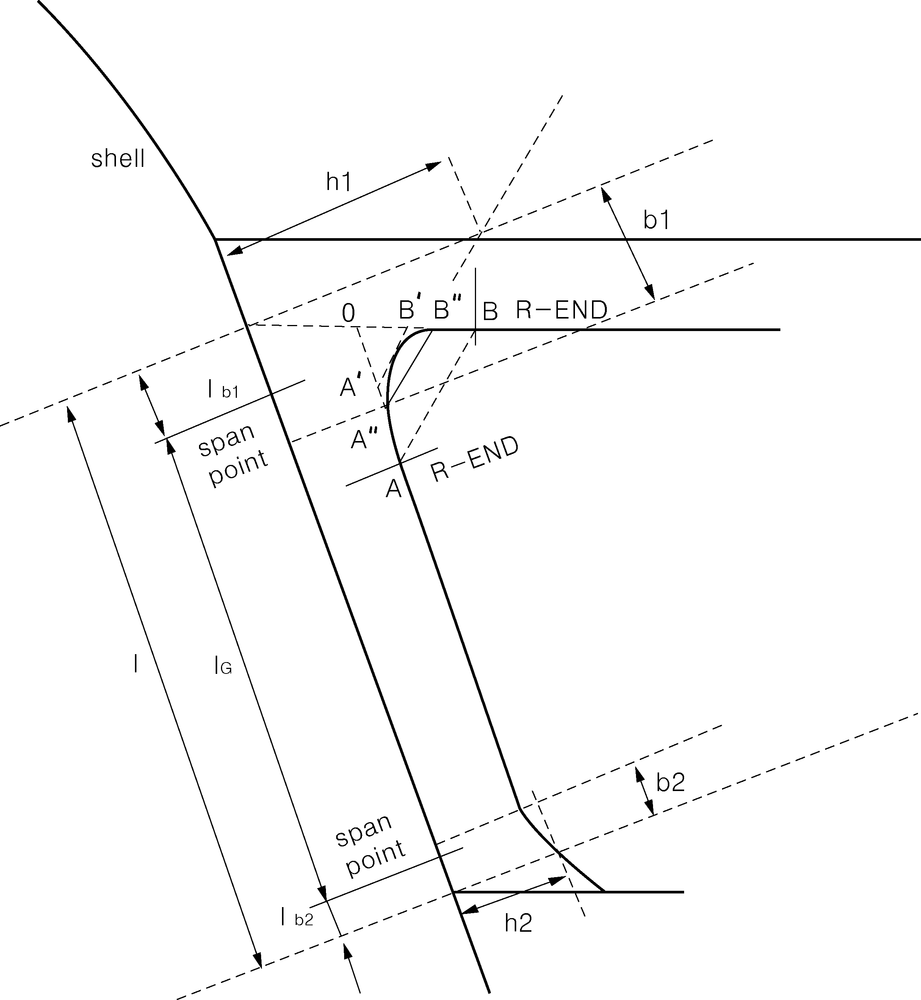
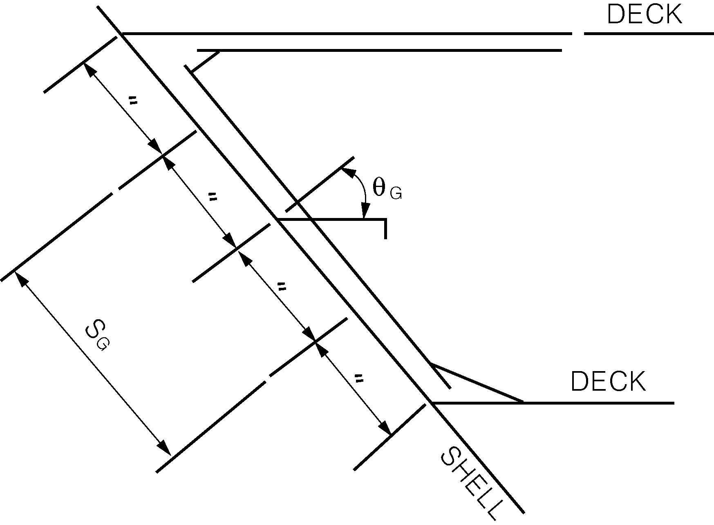
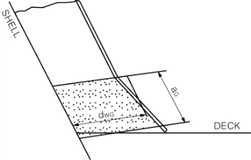
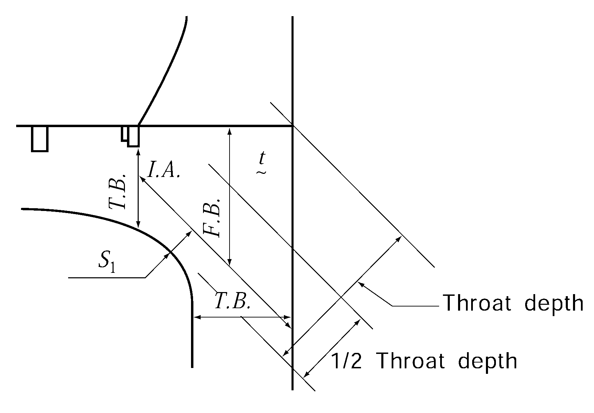

# PART 3 Hull Structures

> RULES FOR CLASSIFICATION OF STEEL SHIPS / RA-03-E / 2025 / EN / Guidance

## CHAPTER 9 WEB FRAMES AND SIDE STRINGERS

### Section 1 General

#### 104. Web frames and side stringers at a location where flare is specially large (2019) 【See Rule】

- **1.** For ships with large flare($K_v + K_f$ exceeds 0.4), the thickness $t _{wG}$ of web plate and section modulus $Z _{G}$, of side stringers supporting transverse frames and web frames supporting these side stringers, which are fitted in the bow flare located above the load line and forward of 0.2 $L$ is considered to endure large wave impact pressure, are not to be less than those obtained from the following formulae. *(2020)*
  Required thickness of web plate : $t _{wG} = \frac{433 P S _{G} l _{G}}{d _{wG} \sigma _{y} \cos \theta _{G}}$ (mm)
  Required section modulus : $Z _{G} = \frac{PS _{G} l _{G} ^{2}}{24 \sigma _{y} \cos \theta _{G}} \times 10 ^{3}$(cm^3)
  where,
  $P$ = slamming impact pressure as specified in **Ch 7, 108.** (kPa)
  $S _{G}$ = spacing of girder (m)
  $l _{G}$ = unsupported length of girder taking into account geometry of girder at end parts (m). Where form of girder at end parts is arc form such as **Fig 3.8.1** this length is to be modified considering it triangle, as follows.
  - **(1)** To join R-ENDs together. ($AB$)
  - **(2)** To draw tangent line $A ' B '$ with arc, parallel to $AB$.
  - **(3)** To put point $A ''$ so that $AA '' = (2/3) AA '$ and to put $B ''$ so that $BB '' = (2/3) BB '$, and triangle $OA '' B ''$ is considered as bracket of triangle.
    $l _{G} = l - l _{b1} - l _{b2}$
    $l$ : length of girder measured along the shell plating, refer to **Fig 3.8.1**
    #eqnID-871_s2and $l _{b2}$ = bracket length for span correction as obtained from the following formulae (m)
    $l _{b1} = b _{1} (1 - \frac{d _{wG}}{h _{1}} ) \times 10 ^{-3}$
    $l _{b2} = b _{2} (1 - \frac{d _{wG}}{h _{2}} ) \times 10 ^{-3}$
    $b _{1}$, $b _{2}$, $h _{1}$ and $h _{2}$ : refer to **Fig 3.9.1**
    $d _{wG}$ = depth of web plate (mm)
    $\sigma _{y}$ = specified yield stress of the material (N/mm^2)
    $\theta _{G}$ = angle between girder and vertical axis of shell plate (deg). Refer to **Fig 3.9.2**
    $Z _{G}$ = section modulus of girder as obtained from the following formula. (cm^3)
    $Z _{G} = 0.1 A _{fG} d _{wG} + \frac{1}{3000} d _{wG} ^{2} t _{wG}$
    $A _{fG}$ = sectional area of flange (cm^2)
    $t _{wG}$ = thickness of web plate of girder (mm)

    |  **Fig 3.9.1** **Fig 3.9.1** |  **Fig 3.9.2** **Fig 3.9.2** |
    | --- | --- |
- **2.** Buckling strength of the web plates of girders supporting frames in above **1.** is to be in accordance with followings. Compressive stress $\sigma _{a}$ for the web plates is not to exceed the critical value $\sigma _{acr} ^{*}$ obtained from the following.
  $\sigma _{acr} ^{*} = \sigma _{acr} ^{}$(N/mm^2), where $\sigma _{acr} \leq \frac{\sigma _{y}}{2}$
  $\sigma _{acr} ^{*} = \sigma _{y} (1 - \frac{\sigma _{y}}{4 \sigma _{acr}} )$ (N/mm^2), where $\sigma _{acr} > \frac{\sigma _{y}}{2}$
  $\sigma _{y}$ = as specified in **1.**
  $\sigma _{acr}$= reference buckling stress of the web plates as obtained from the following formula
  $\sigma _{acr} = 3.6 E ( \frac{t _{wG} ^{*}}{S} ) ^{2}$ (N/mm^2)
  $E=2.06 \times 10 ^{5}$, Modulus of elasticity (N/mm^2)
  $t _{wG}$ = as specified in **1.**
  $\sigma _{a}$ = compressive stress working on web plates as obtained from the following formula
  $\sigma _{a} = \frac{0.5P S _{G}}{t _{wG} ^{} \cos \theta _{G}}$ (N/mm^2)
  $P$, $S _{G}$ and $\theta _{G}$ = as specified in **1.**
- **3.** Buckling strength of girder webs at end parts in above **1.** is to be in accordance with followings (1) and (2).
  - **(1)** Shearing stress $\tau$ for the web plates of girders at end parts is not to exceed the critical value $\tau_cr^*$ obtained from the following.
    $\tau _{cr} ^{*} = \tau _{cr}$(N/mm^2), where $\tau _{cr} \leq \frac{\tau _{F}}{2}$
    $\tau _{cr} ^{*} = \tau _{F} (1- \frac{\tau _{F}}{4 \tau _{cr}} )$(N/mm^2), where $\tau _{cr} > \frac{\tau _{F}}{2}$
    $\tau _{F} = \frac{\sigma _{y}}{\sqrt {3}}$
    $\sigma _{y}$= specified yield stress of the material (N/mm^2)
    $\tau _{cr}$= shear buckling stress for web plates of girders at end parts as obtained from the following formula
    $\tau _{cr} = 0.9 k _{s} E ( \frac{t _{wG} ^{*}}{d _{wG} ^{*}} )$ (N/mm^2)
    $k _{s}$ = coefficient as obtained from **Table 3.9.1** depending on $a _{G} /d _{wG} ^{*}$. For intermediate values of $a _{G} /d _{wG} ^{*}$, $k _{s}$ is to be obtained by linear interpolation.
    $a _{G}$ = length of web plate at end parts (mm) See **Fig 3.9.3**
    $E$ = modulus of elasticity, $2.06 \times 10 ^{5}$ (N/mm^2)
    $t _{wG} ^{*}$= thickness of web plate of girder at end parts (mm)
    $d _{wG} ^{*}$= mean depth of web plate of girder at end parts (mm)
    $\tau$ = shear stress for web plate at end parts as obtained from the following formula
    $\tau = \frac{250 P S _{G} l}{d _{wG} ^{*} t _{wG} ^{*} \cos \theta _{G}}$
    
    **Fig 3.9.3**

    | $a _{G} /d _{wG} ^{*}$ | 0.3 and under | 0.4 | 0.5 | 0.6 | 0.7 | 0.8 | 0.9 | 1.0 | 1.2 | 1.4 and over |
    | --- | --- | --- | --- | --- | --- | --- | --- | --- | --- | --- |
    | $k _{s}$ | 64 | 38 | 25 | 19 | 15 | 12 | 10 | 9 | 8 | 7 |
  - **(2)** Bending stress $\sigma _{b}$ for the web plates at end parts is not to exceed the critical value $\sigma _{bcr} ^{*}$ obtained from the following.
    $\sigma _{bcr} ^{*} = \sigma _{bcr}$ (N/mm^2), where $\sigma _{bcr} \leq \frac{\sigma _{y}}{2}$
    $\sigma _{bcr} ^{*} = \sigma _{y} (1 - \frac{\sigma _{y}}{4 \sigma _{bcr}} )$ (N/mm^2), where $\sigma _{bcr} > \frac{\sigma _{y}}{2}$
    $\sigma _{y}$ = yield stress of the material (N/mm^2)
    $\sigma _{bcr}$= bending buckling stress (N/mm^2) of web as obtained from following
    $\sigma _{bcr} = 0.9 k _{b} E ( \frac{t _{wG} ^{*}}{d _{wG} ^{*}} ) ^{2}$ (N/mm^2)
    $k _{b}$ = coefficient as obtained from **Table 3.9.2** depending on $a _{G} /d _{wG} ^{*}$. For intermediate values of $a _{G} /d _{wG} ^{*}$, $k _{b}$ is to be obtained by linear interpolation.
    $\sigma _{b}$ = bending stress working on web as obtained from the following formula
    $\sigma _{b} = \frac{P S _{G} l _{G} ^{2}}{24 Z _{G} ^{*} \cos \theta _{G}} \times 10 ^{3}$ (N/mm^2)
    $Z _{G} ^{*}$ = sectional modulus of web plate at end parts (cm^3)
    $Z _{G} ^{*} = 0.1 A _{fG} d _{wG} ^{*} + \frac{1}{3000} d _{wG} ^{*} ^{2} t _{wg} ^{*}$

    | $a _{G} /d _{wG} ^{*}$ | 0.5 and under | 0.6 | 0.7 | 0.8 | 0.9 and over |
    | --- | --- | --- | --- | --- | --- |
    | $k _{b}$ | 12 | 10 | 8.8 | 8.0 | 7.8 |
- **4.** For ships whose $L$ and $C _{b}$ are not less than 250 m and 0.8 respectively, the provisions of **Sub-part 1 Ch 10, Sec 1, 3.3** of **Rule Pt 13** are to be applied.

### Section 4 Side Transverse (2020)

#### 404. Attachments 【See Rules】

- **1.** With respect to the requirements of **404. 1** of the Rules, in case where the side transverse and adjacent structures are sufficiently strengthened, the requirements of **404. 1** may be considered as appropriate.

### Section 5 Cantilever Beams

#### 503. Connections 【See Rule】

- **1.** To prevent the buckling of end brackets of cantilever beams connected with web frames, stiffeners are to be fitted to the brackets with at suitable spacing in order to make their panels smaller as shown in **Fig 3.9.4.**
  
  **Fig 3.9.4 Compensation of bracket**
- **2.** Within the range of 1/2 of the throat depth of the end bracket from the side of face plate, stiffeners such as inverted angle are to be arranged in the direction of compression at the spacing($S_1$) obtained from the following formula as the standard.
  $S_1 = 35(t-2.5)$(mm)
  $t$ = thickness of bracket (mm) 
