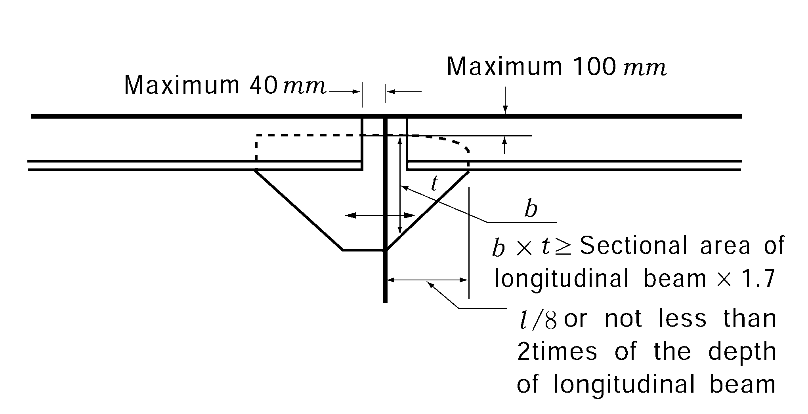
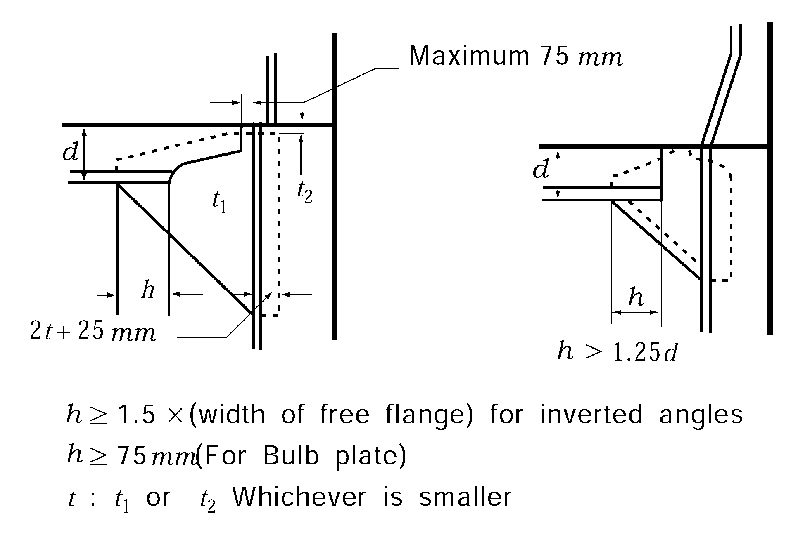

# PART 3 Hull Structures

> RULES FOR CLASSIFICATION OF STEEL SHIPS / RA-03-E / 2025 / EN / Guidance

## CHAPTER 10 BEAMS

### Section 1 General

#### 102. Connections of ends of beams 【See Rule】

- **1.** The standards of end connections of longitudinal beams are as shown below.
- **2.** The standards of end connections of transverse beams by means of brackets are as shown below.
  
  **Fig 3.10.1** 
  **Fig 3.10.2**

#### 106. Long machinery opening 【See Rule】

Where the length of machinery opening is not less than 20 m, a cross tie is to be provided at middle of opening.

### Section 2 Deck Load

#### 201. Value of _s2 【See Rule】

- **1.** The value of $h$ is to be prescribed in suitable documents like as loading manual specified in **Ch 3, 103.** of the Rules to aid the ship's master.
- **2.** In application to **201. 2** (4) of the Rules, the term "the discretion of the Society" means **Ch 1, 203. 2** (2) (C) of the Guidance.

### Section 3 Longitudinal Beams

#### 303. Section modulus 【See Rule】

The section modulus of longitudinal beams outside the line of hatchway openings of the strength deck for the parts forward and afterward the midship part of ship may be determined by the interpolation between the requirements of **303. 1** and **2** of the Rules. In general, the interpolation may be made at the mid position of each building block in ship lengthwise. However, where the length of block is over 15 m, it may be properly divided.

### Section 4 Transverse Beams

#### 402. Proportion 【See Rule】

- **1.** Where the span/depth ratio of transverse beams exceeds 30 in strength decks or 40 in effective decks and superstructure decks, the second moduli of beams are to be increased in the corresponding ratios.
- **2.** In bulk carrier, ore carrier, etc. over 200 m in their length, the slenderness ratio of transverse beams inside the line of hatchway openings of the strength deck is recommended that is to be below 60. 
