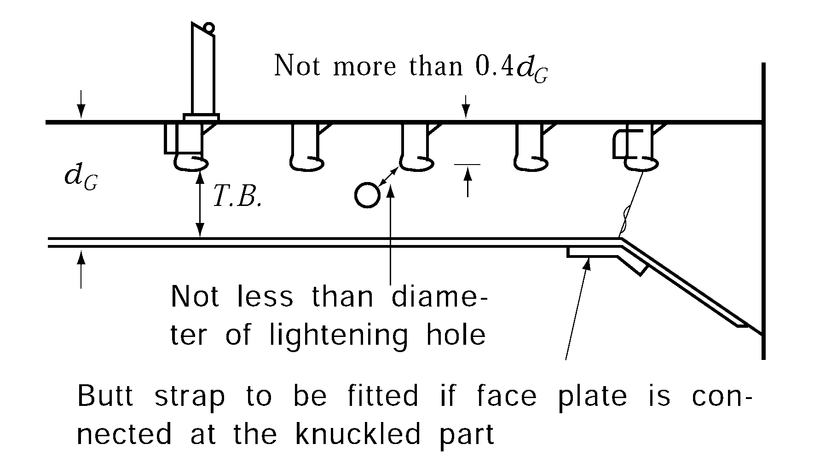
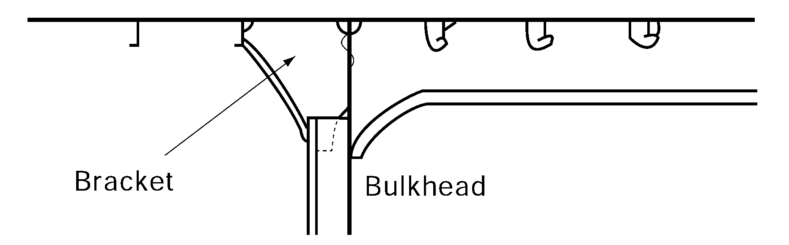
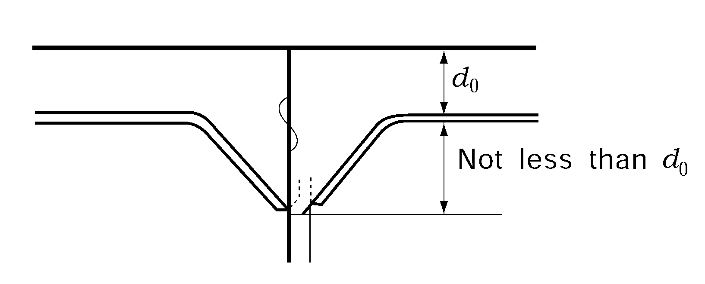
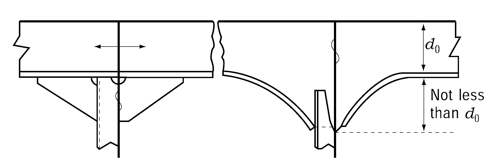
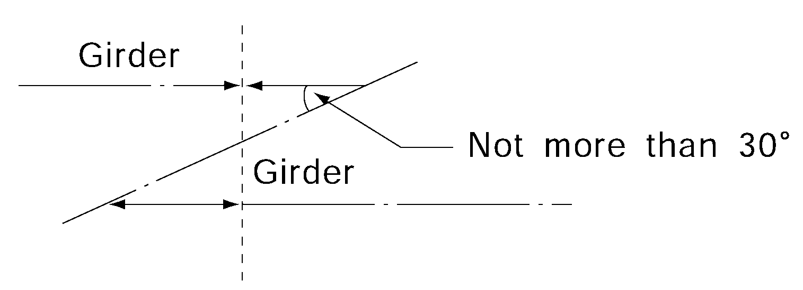

# PART 3 Hull Structures

> RULES FOR CLASSIFICATION OF STEEL SHIPS / RA-03-E / 2025 / EN / Guidance

## CHAPTER 11 DECK GIRDERS

### Section 1 General

#### 103. Construction 【See Rule】

- **1.** At the upper and lower ends of pillars and other places where concentrated loads are expected, girders are to be fitted with tripping brackets and slots in girders are to be fitted with collars. Under the end bulkheads of superstructures, only collars are required. Collars are also to be fitted at the slots near the toe of end bracket.
- **2.** Butt joints of girder webs are to be avoided at corners of slots. Butt joints of face plates are to be likewise avoided at knuckled parts. If butt joints of face plates are inevitably placed at knuckled parts, butt straps are to be provided as shown in **Fig 3.11.1.** The depth of slots is not to exceed 0.4$d_G$. If this limit is exceeded, collars are to be fitted with the depth not exceeding 0.5$d_G$. These requirements may be suitably modified for superstructures.
  
  **Fig 3.11.1**
- **3.** Sizes of lightening holes are to be as follows.
  Where slots are provided , $d \leq \frac{d_G}{4}$
  Where slots are not provided , $d \leq \frac{d_G}{3}$
  $d_G$ = depth of girder
  $d$ = diameter of lightening holes
- **4.** In RO-RO ships, etc., the scantlings of girders may be determined by the direct strength calculation.
- **5.** Where the value obtained from the following formulas equal to or greater than 1.6, special consideration is to be given to the beams on the shell side or bulkhead side in the region of mid-span of girders because of added stress due to forced deflection.
  $\frac{I _b l ^4}{I _g S b ^3}$
  $I_b$ and $I_g$ = actual moment of inertia of beams and girders (cm^4)
  $b$ and $l$ = span of beams and girders (m)
  $S$ = spacing of beams (m)

#### 104. End connection 【See Rule】

- **1.** Where a girder stops at a bulkhead, a bracket is to be fitted on the reverse side. (See **Fig 3.11.2**)
- **2.** **Continuity of deck girders**
  - **(1)** The depth of bracket is, as a standard, to be equal to twice the depth of web. If the depth of bracket is smaller than this standard, suitable equivalent means, such as gusset plate, is to be provided.(See **Fig 3.11.3**)
    
    **Fig 3.11.2** 
    **Fig 3.11.3**
  - **(2)** Girders to be considered for the section modulus calculation of hull girder are to penetrate bulk-heads as a whole including the web and face plate, or to be so connected at the ends as to give an equivalent effectiveness. (See **Fig 3.11.4**)
  - **(3)** Where deck girders are discontinuous, they are to be sufficiently overlapped. (See **Fig 3.11.5**) 
    
    **Fig 3.11.4** 
    **Fig 3.11.5**
