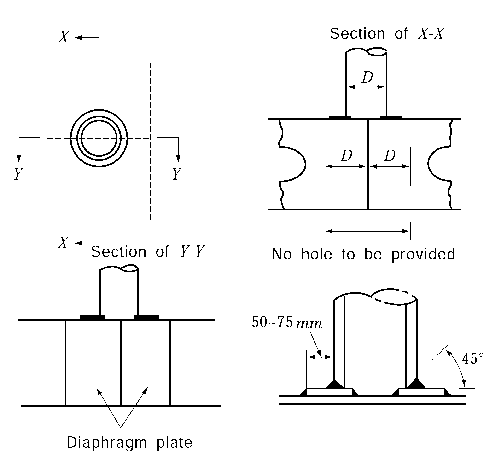

# PART 3 Hull Structures

> RULES FOR CLASSIFICATION OF STEEL SHIPS / RA-03-E / 2025 / EN / Guidance

## CHAPTER 12 PILLARS

### Section 1 General

#### 102. Pillars in holds 【See Rule】

Compensation of under pillars is to be as shown in **Fig 3.12.1.**

**Fig 3.12.1 Compensation of under pillars**

### Section 2 Scantling of Pillars

#### 201. Sectional area 【See Rule】

Sectional area of pillars which are regarded as fixed ends may be obtained from the following formula.
$A= \frac{0.223 W}{2.72-\frac{0.5 l}{k_0}}$(cm^2) 
