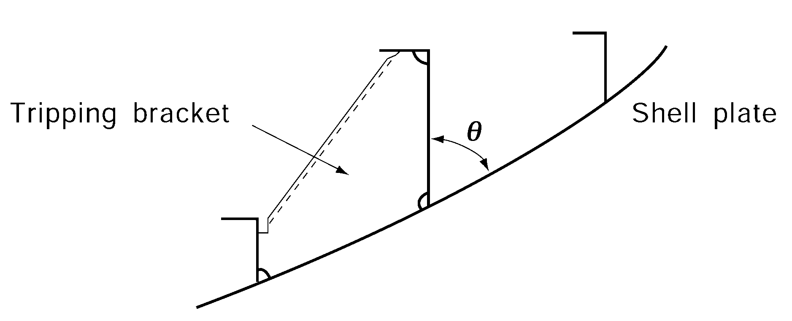
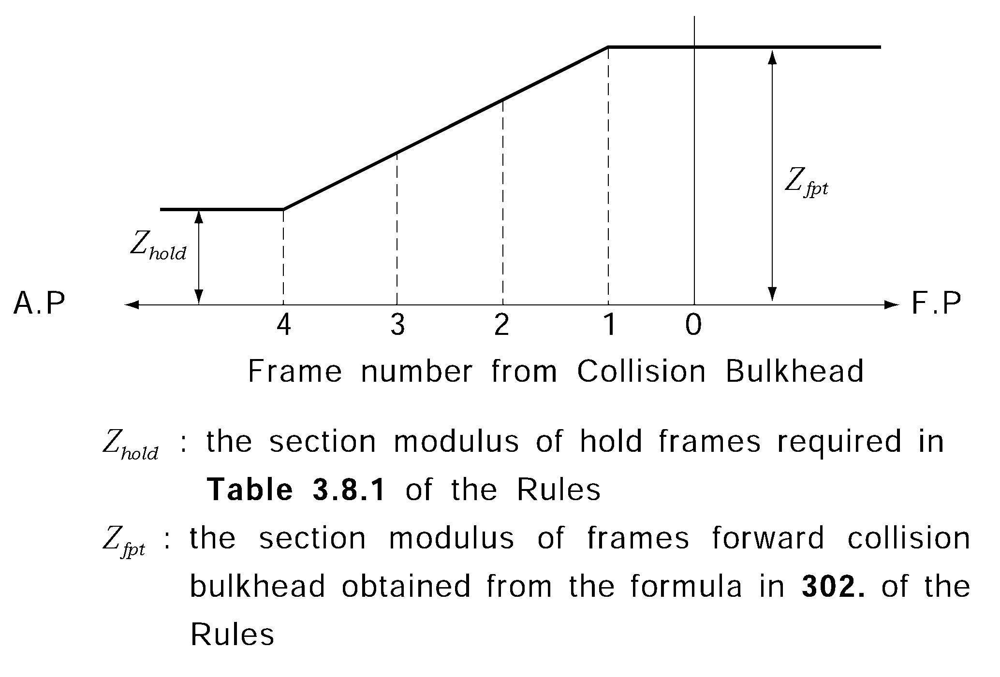

# PART 3 Hull Structures

> RULES FOR CLASSIFICATION OF STEEL SHIPS / RA-03-E / 2025 / EN / Guidance

## CHAPTER 13 ARRANGEMENTS TO RESIST PANTING

### Section 1 General

#### 102. Swash plate 【See Rule】

Scantlings of swash plates which are used for deep tanks at fore and aft peak tanks are to be complied with **203. 2** (2) of the Rules.

#### 103. Stringers fitted up with extremely small angle 【See Rule】

In case the angle between webs of girders and shell plating is not more than 75°, substantially the following treatment (1) and (2) are to be required (See **Fig 3.13.1**). And where the webs of girder are inclined provided to shell plating, actual section modulus of girder is to be calculated against neutral axis parallel to shell plating.

### Section 2 Arrangements to Resist Panting forward the Collision Bulkhead

#### 204. Longitudinal framing 【See Rule】

For the applying **204. 2** (2) of the Rules, where the side transverses are supported by side stringers or panting stringers, $d_2$ in the formula for the depth of side stringers is not applied.

#### 205. Bulbous bow 【See Rule】

In application to **205.** of the Rules, the term "specially considered by the Society" means to apply **Pt 13, Sub Pt 1, Ch 10, Sec 1, 2.5** of the Rules and to accept in accordance with **Pt 1, Ch 1, 105.** of the Rules.

### Section 4 Arrangements to Resist Panting between Both Peaks

#### 401. Abaft collision bulkhead 【See Rule】

The reinforcement is recommended such that, between the 0.15$L$ from the fore end, side stringers are provided in line with stringer plates or side stringers in way of the fore peak tank in association with web frames provided at a suitable interval. Even in case where it is impracticable to provide with frame and side stringer, at least the reinforcement as the followings is to be provided.

- **1.** Appropriate range of scantlings of hold frames abaft the collision bulkhead are to be reinforced to not less than the value in **302.** of the Rules by gradually increasing scantlings of hold frames from the prescribed **Table 3.8.1** of the Rules.
- **2.** Solid brackets are to be provided and firmly connected with collision bulkhead and hold frame abaft the collision bulkhead at appropriate positions in way of depth of ship. 

  |  **Fig 3.13.1 In case the angle between webs of****girders and shell plating is small** **Fig 3.13.1 In case the angle between webs of** **girders and shell plating is small** |  **Fig 3.13.2** **Fig 3.13.2** |
  | --- | --- |
