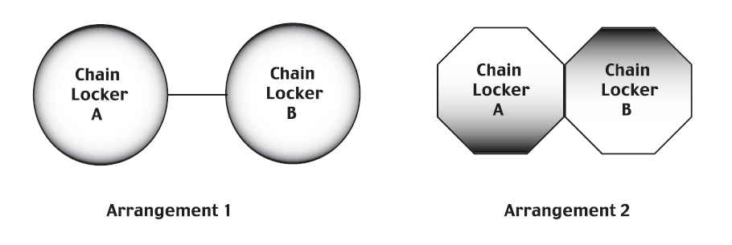
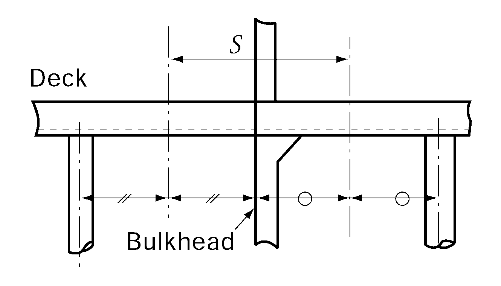
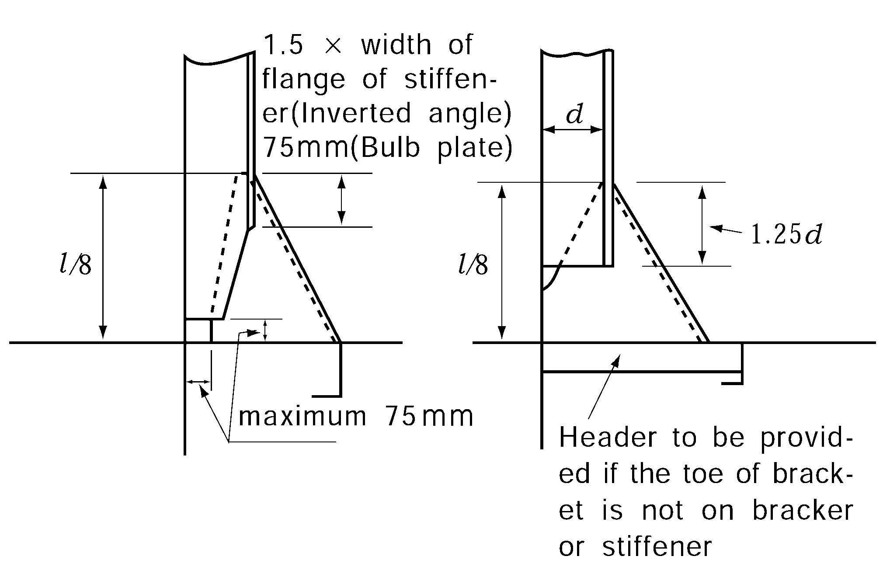
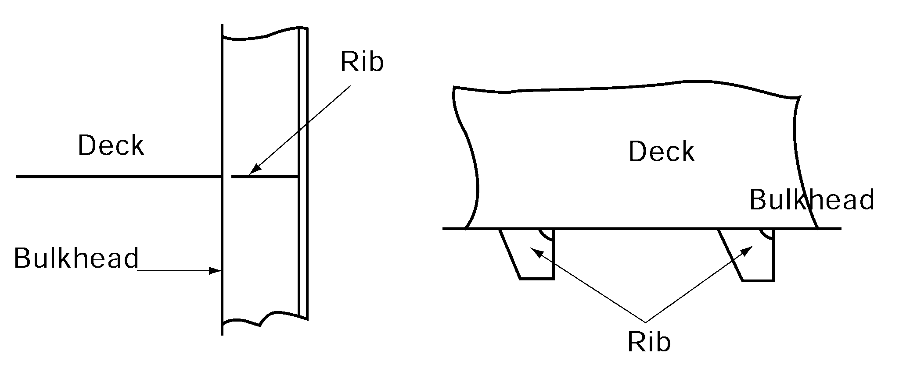
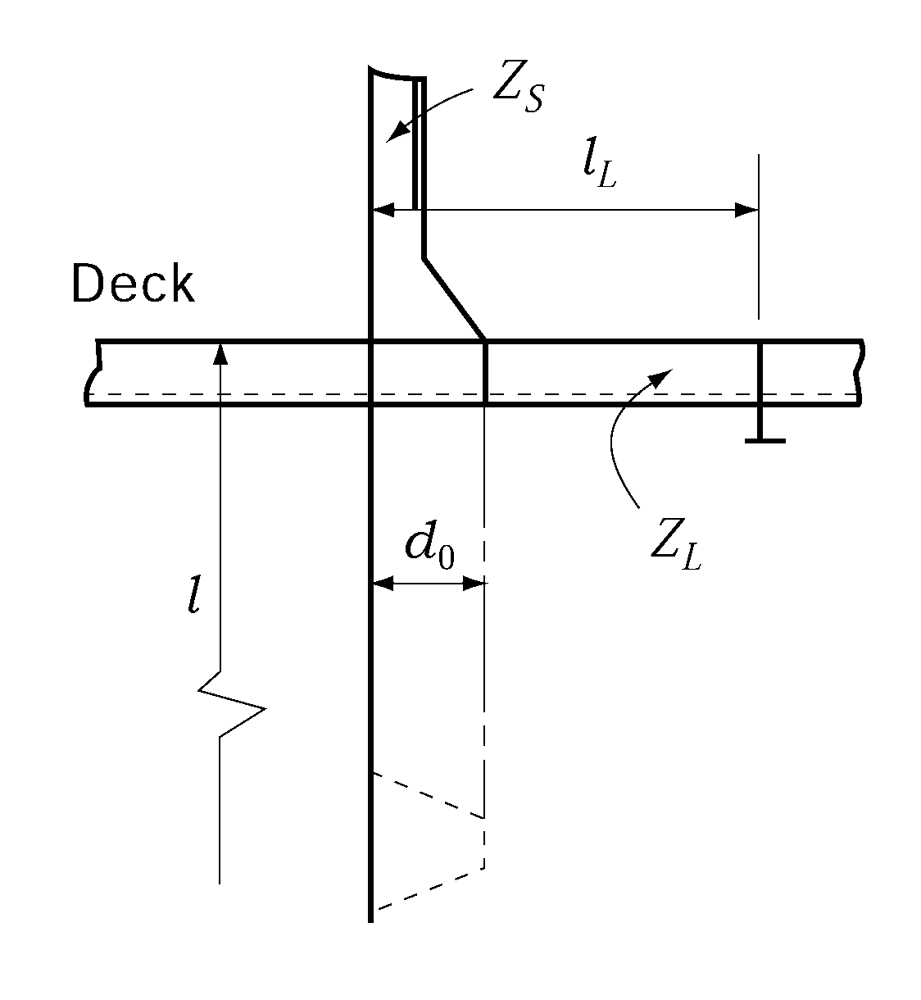
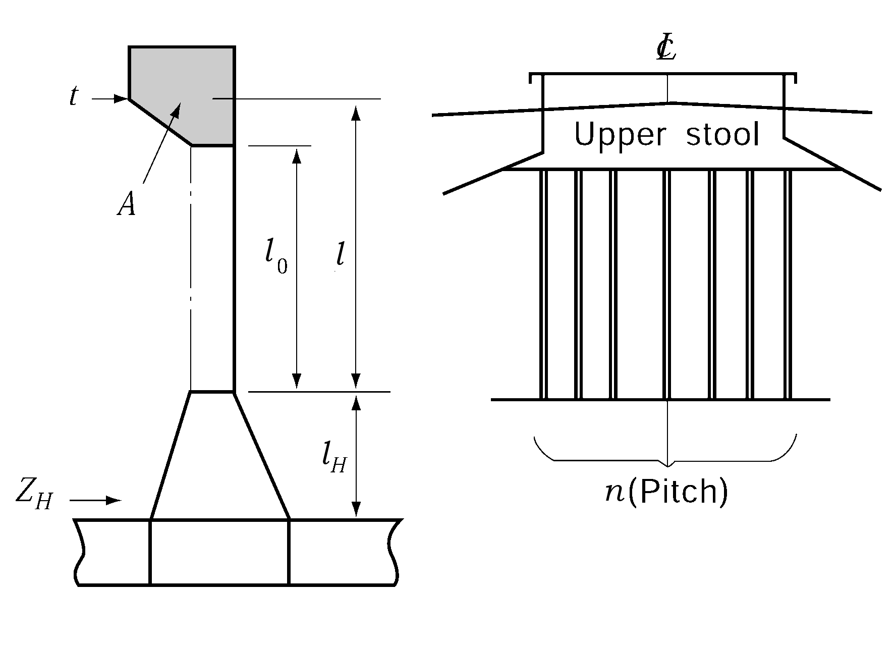
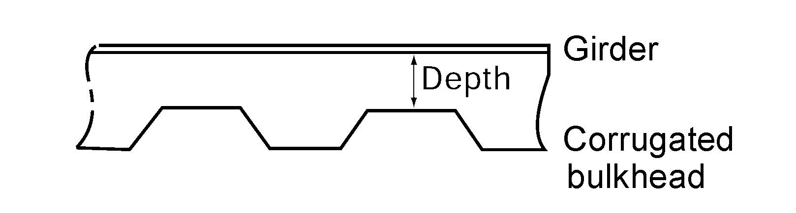
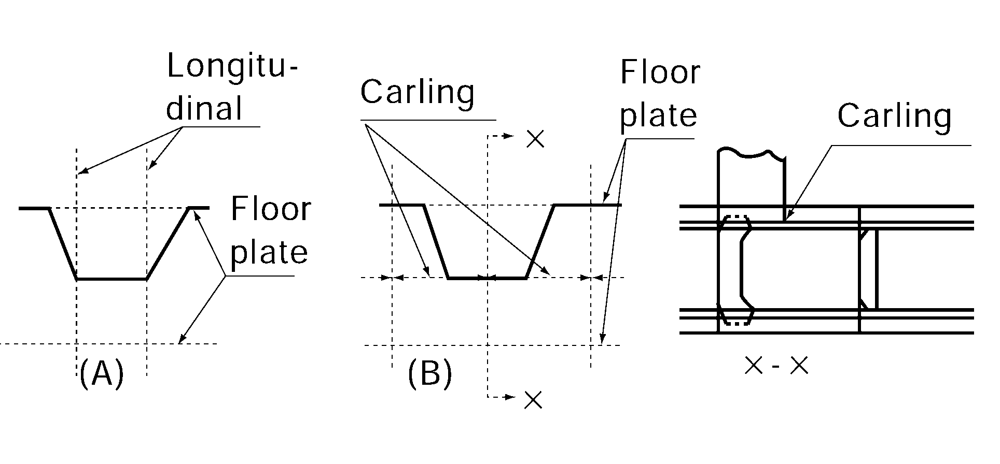
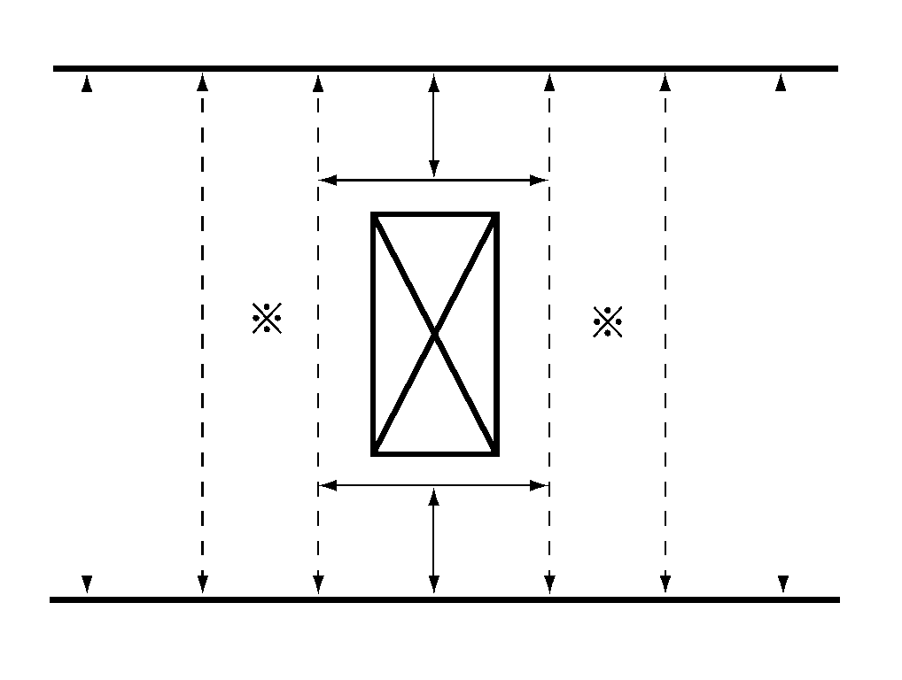

# PART 3 Hull Structures

> RULES FOR CLASSIFICATION OF STEEL SHIPS / RA-03-E / 2025 / EN / Guidance

## CHAPTER 14 WATERTIGHT BULKHEAD

### Section 2 Arrangements of Watertight Bulkheads

#### 201. Collision bulkheads 【See Rule】

- **1.** In ships with bow doors, the collision bulkhead under the deck just above the freeboard deck is to comply with the **201., 202.** and **205.** of the Rules.
- **2.** The expression "accepted by the Society" means that an application submitted together with calculations verifying that no part of the bulkhead deck will be immersed even when the compartment forward of collision bulkhead is flooded under the loading condition (without trim) corresponding to the load line.

#### 204. Hold bulkheads 【See Rule】

- **1.** In case the spacing between bulkheads is not more than $0.7 \sqrt { L}$(m), these bulkheads are regarded as one bulkhead.
- **2.** The expression "to the approval of the Society" in **204. 2** of the Rules means that the ships are complied with the International convention or relative Laws of flag state for damage stability and subdivision regulation, for other ships are to be complied with the following **3.**
- **3.** **Omission standard**
  - **(1)** The arrangement of watertight bulkheads may be different from that specified of the Rules, provided that, under the loading condition corresponding to the load line, the final waterline will not exceed the upper surface of bulkhead deck at side even after any one compartment, except the machinery space, has been flooded. In this case, the ratio of flooding used in the flooding calculations are to be as follows.
    Cargo Space
    empty hold …………………………………………… $0.95$
    loaded with general cargoes ……………………… $0.60$
    loaded with timber…………………………………… $0.55$
    loaded with ore……………………………………… $0.50$
    loaded with car or containers…………………………………$0.95 - 0.35 \times \frac{V_C}{V_0}$
    Where, $V_C$ is the volume occupied by cars and/or containers, and $V_0$ the moulded volume of the compartment.
    Deep tanks
    filled out with liquid ………………………………… $0$
    empty tanks …………………………………………… $0.95$
  - **(2)** In case the spacing between bulkheads is not more than $0.7 sqrtL$(m), these bulkheads are regarded as one bulkhead
- **4.** For the ships which are not less than 186 m in length, the number of hold bulkheads is not to be less than that determined by the above mentioned **3.**

#### 207. Chain lockers 【See Rule】

- **1.** In application to **207. 1** of the Rules, the term "Bulkheads between separate cable lockers, or which form a common boundary of cable lockers" is referred to **Fig 3.14.1.**
- **2.** In application to **207. 4** of the Rules, examples of acceptable arrangements of the term "permanently attached closing appliances to minimize water ingress" are as follows.
  - **(1)** Steel plates with cutouts to accomodate chain links
  - **(2)** Canvas hoods with a lashing arrangement that maintains the cover in the secured position
    
    **Fig 3.14.1 Arrangements of chain Locker**

### Section 3 Construction of Watertight Bulkhead

#### 303. Stiffeners 【See Rule】

- **1.** **Scantlings of bulkheads stiffeners just under deck girders**
  The scantlings of bulkhead stiffeners supporting under deck girders are to comply with the following formula.
  $C \frac{Z_0}{Z} +\frac{W}{A} \leq C$
  $Z_0$ = required section modulus of stiffener (cm^2)
  $Z$ = actual section modulus (cm^3)
  $A$ = sectional area of stiffener (cm^2)
  (including effective breadth)
  $W$ = axial load of stiffener obtained from the following formula.
  $W = S b h$(kN)
  $S$ = distance between mid-spaces of adjacent girders supported by stiffeners (See **Fig 3.14.2**)
  $b$ and $h$ = as specified in **Ch 11, 201.** of the Rules. However, in ships having two or more decks, $W$ may not be considered.
  $C$ = 17.7
  
  **Fig 3.14.2 Measurements of** #eqnID-990
- **2.** **Scantlings of bulkheads stiffeners just under cargo gears and deck girders.**
  The scantlings of bulkhead stiffeners just under cargo gears and deck girders are to comply with the above **1.** using the value obtained from following formula as axial load to stiffener. Where the stiffeners support only tare weight of cargo gears, the first term in the formula may be zero.
  $W = S b h + P$(kN)
  $S$, $b$, $h$ = as specified in above **1.**
  $P$ = tare weight of cargo gears (kN)
  In case of derrick systems, it may be acceptable to use the value shown in **Table 3.14.1** of the Guidance.

  **Table 3.14.1 Tare weight of derrick system**

  | Type of derrick post Arrangement of derrick booms | Independent Type | Gate Type |
  | --- | --- | --- |
  | Booms arranged only on fore or aft side | 2.0$w$ | 2.3$w$ |
  | Booms arranged on both sides | 2.7$w$ | 3.0$w$ |
  | Note; $w$ is a safe working load (kN) of each boom. However, in case of booms are arranged in both sides, average value is to be taken |   |   |
- **3.** Scantlings of brackets of stiffeners is to be in accordance with **Fig 3.14.3.**
- **4.** Where a deck terminates at the bulkhead, the stiffeners are to have ribs at the level of the deck. (See **Fig 3.14.4**)
  
  **Fig 3.14.3** 
  **Fig 3.14.4 Rib**

#### 304. Corrugated bulkheads 【See Rule】

- **1.** **Section modulus of corrugated bulkheads**
  - **(1)** Where the end connection of corrugated bulkhead is specially strong, the coefficient $C$ in **304.** of the Rules may be the value taken from **Table 3.14.2** in calculating the section modulus per half pitch. The term "specially strong end connection" means one of the followings.

    **Table 3.14.2 Value of** $C$

    | Col | One end Another end | Supported by girder | Upper end connected to deck | Upper end connected to stool |
    | --- | --- | --- | --- | --- |
    | 1 | Supported by girder, or lower end connected to deck or to double bottom | As per Rules | $\frac{4}{2+m_1 +\frac{Z_2}{Z_0}}$ | $\frac{4}{2+m_2 +\frac{Z_2}{Z_0}}$ |
    | 2 | Lower end connected to stool | ${4.8 \left(1+\frac{l_H}{l}\right)}^\frac{2}{2 + \frac{Z_1}{Z_0} + \frac{Z_H}{Z_0}}$ | ${4.8 \left(1+\frac{l_H}{l}\right)}^\frac{2}{2 + m_1 + \frac{Z_H}{Z_0}}$ | ${4.8 \left(1+\frac{l_H}{l}\right)}^\frac{2}{2 + m_2 + \frac{Z_H}{Z_0}}$ |
    | 2 | Lower end connected to stool | However, it is not to be less than the value of column 1. |   |   |
    | NOTE: $Z_0$, $Z_1$, $Z_2$, $lH$ and $l$ are to be in accordance with the Rules $m_1$ = It is to be obtained from the following formula for the upper. $\frac{1}{Z_0} \left\{Z_S +\left(\frac{l_L + d_0}{l_L - d_0} +1.0 \right) Z_L}\right\}$ $Z_S$ = the section modulus of the continuous stiffener at the upper end (cm^3) $l_L$, $Z _l$ = span and section modulus of the longitudinal member connected to the upper end (See **Fig 3.14.5**) $d_0$ = as specified of the Rules $m_2$ = as obtained from the following formula, whichever is smaller. $\frac{1}{Z_0} \times \frac{1.050At}{n}$, $3.6 \left({\frac{l}{l_0}}\right)^2 -3$ $A$ = area enclosed into upper stool (See **Fig 3.14.6**) $t$ = average plate thickness of upper stool (mm) (See **Fig 3.14.6**) $n$ = number of pitches of corrugation supported by upper stool (m) (See **Fig 3.14.6**) $l_0$ = distance between insides of upper and lower stool (m) (See **Fig 3.14.6**) $Z_H$= section modulus per half pitch of lower end of lower stool (See **Fig 3.14.6**) |   |   |   |   |
    - **(A)** connection of upper end of corrugated bulkhead to deck, where the $m_1$ specified below is greater than 0.2
    - **(B)** connection of upper end of corrugated bulkhead to stool, where the $m_2$ specified below is greater than 0.6
    - **(C)** connection of lower end of corrugated bulkhead to stool, where the plate thickness of stool is not less than 1/2 of the thickness of face plate of corrugated bulkhead.
- **2.** **Construction of corrugated bulkheads**
  - **(1)** Stiffeners are to be provided at the ends of under deck girders.
  - **(2)** Where the brackets are fixed to the bulkhead plate, pads or headers are to be fitted at the bracket toe.
  - **(3)** The angle of corrugation is to be not less than 45
  - **(4)** Girders fitted to corrugated bulkheads are to be balanced girders, except where the strength of such girders is at least equivalent to that of girders fitted to flat bulkheads. In calculating the actual section modulus of girder, the depth of girder is taken as shown in **Fig 3.14.7.** The bulkhead plate of corrugated bulkhead is not to be included into the section modulus of the girder as effective attached plate.
  - **(5)** The lower end of corrugated bulkhead is to be constructed as shown **Fig 3.14.8** (A) or (B). The construction of the upper end is recommended to follow the construction of the lower end.
    
    **Fig 3.14.5** 
    **Fig 3.14.6**
    
    **Fig 3.14.7 Measurements of depth of girder** 
    **Fig 3.14.8**

### Section 4 Watertight Door

#### 402. Type of watertight doors 【See Rule】

- **1.** Watertight doors provided in watertight bulkheads are to be sliding type as far as practicable. If hinged doors are used, they are to be accessible at any time and, further, to be protected against damages due to cargoes, etc. by suitable means.
- **2.** For passenger ships the watertight doors and their controls are to be located in compliance with **Table 3.14.3** and **SOLAS II-1/13.5.3, II-1/13.7.1.2.2.** *(2020)*

#### 403. Strength and watertightness 【See Rule】

The term of “where deemed necessary by the Society” in **403. 1** of the Rules means cases other than those specified in the following (1) to (3):

#### 404. Control (2020) 【See Rule】

- **1.** Where it is necessary to operate the power unit for remote operation of the watertight door required by **404.** of the Rules, means to operate the power unit are also to be provided at remote control stations. For passenger ships, the operation of such remote control is to be in accordance with **SOLAS II-1/13** For tankers, where there is a permanent access from a pipe tunnel to the main pump room, the watertight door shall be capable of being manually closed from outside the main pump room entrance in addition to the requirements above.
- **2.** With respect to the provisions of **404. 2** of the Rules, for passenger ships, the angle of list at which operation by hand is to be possible is 15 degrees.
- **3.** Where indicated in **Table 3.14.3**, the doors are to be capable of being remotely closed by power from the bridge and by hand also from a position above the bulkhead deck for passenger ships as required by **SOLAS II-1/13 7.1.4.**
- **4.** Remote controls required by **404.** of the Rules, are to be in accordance with the followings.
  - **(1)** The operating console at the navigation bridge is to have a “master switch” with following two modes of control. This switch is normally to be in the “local control” mode. The “doors closed” mode is only used in an emergency or for testing purposes. Special consideration is to be given to the reliability of the “master switch”.
  - **(2)** The operating console at the navigation bridge is to be provided with a diagram showing the location of each door, with visual indicators to show whether each door is opened or closed. A red light is to indicate a door is fully opened and a green light is to indicate a door is fully closed. When the door is being closed remotely, the red light is to indicate the intermediate position by flashing. The indicating circuit is to be independent of the control circuit for each door. This applies to cargo ships and passenger ships.
- **5.** Where remote control is required by **404.** of the Rules, signboard/instructions are to be placed in way of the door advising how to act when the door is in “remote control” mode.
- **6.** With respect to the provisions of **404.** of the Rules, where a watertight door is located adjacent to a fire door, both doors are to be capable of independent operation, remotely if required and from both sides of the each door. Watertight doors may also serve as fire doors but need not be fire-tested if fitted on cargo ships or if fitted below the bulkhead deck on passenger ships. However, such doors fitted above the bulkhead deck on passenger ships shall be tested to the FTP Code in accordance with the fire rating of the division they are fitted in. If it is not practicable to ensure self-closing, means of indication on the bridge showing whether these doors are open or closed and a notice stating ‘To be kept closed at sea’ can be alternative of the self-closing.
- **7.** The wording “navigation bridge” stated in **404.** of the Rules means the place always served by a watch officer and it normally represents the navigation bridge deckhouse.
- **8.** With respect to the provisions of **404. 2** of the Rules, an operation capability of the listed ship is to be verified by prototype tests, etc. *(2022)*
- **9.** With respect to the provisions of **404. 2** of the Rules, power operated doors are also to be capable of being opened and closed by power, as well as to by manual. *(2022)*
- **10.** Locking device for closing apparatus itself or a box of operation device by the key is acceptable as "a device which prevents unauthorized opening" required in **408. 2** of the Rules. *(2021)*
- **11.** **Category of watertight doors for passenger ships**
  - **(1)** Category B
    A watertight door that may be opened during navigation when work in the immediate vicinity of the door necessitates it being opened, according to **SOLAS regulation II-1/22.3.** The door must be immediately closed when the task which necessitated it being open is finished.
  - **(2)** Category C
    A watertight door that may be opened during navigation to permit the passage of passengers or crew, according to **SOLAS regulation II-1/22.3.** The door must be immediately closed when transit through the door is complete.
  - **(3)** Category D
    A watertight door that shall be closed before the voyage commences and shall be kept closed during navigation.
    - **(A)** A watertight door of a width of more than 1.2 m in machinery spaces as permitted by **SOLAS regulation II-1/13.9**. The door shall remain closed during navigation except in case of urgent necessity at the discretion of the master according to **SOLAS regulation II-1/22.4.**
    - **(B)** Additionally, watertight doors fitted in watertight bulkheads dividing cargo between deck spaces in accordance with **SOLAS regulation II-1/13.8.1** or dividing cargo spaces in accordance with **SOLAS regulation II-1/14.2**, shall be closed before the voyage commences and shall be closed during navigation according to **SOLAS regulation II-1/22.5.**

#### 405. Indication 【See Rule】

- **1.** For watertight doors with dogs/cleat for securing watertightness, position indicators required by **405. 1** of the Rules are to be provided to show whether all dogs/cleats fully and properly engage or not.
- **2.** With respect to the provisions of **405. 1** of the Rules, a position indicator may not be required for doors which are designed to confirm easily whether the doors are open or closed and, if applicable, all dogs/cleats fully and properly engage or not.
- **3.** The door position indicating system required by **405.** of the Rules is to be of self-monitoring type and the means for testing of the indicating system are to be provided at the position where the indicators are fitted.
- **4.** An indication required by **405. 2** of the Rules is to be placed locally showing that the door is in the “remote control” mode specified in **404. 2** (i.e. red light).

#### 406. Alarm (2020) 【See Rule】

- **1.** An audible alarm required by **406.** of the Rules is to sound from the door begins to move and continue to sound until the door is completely closed. Other audible alarms shall be provided that are distinct from those in the area. For passenger ships the alarm shall sound for at least 5 s but not more than 10 s before the door begins to move and shall continue sounding until the door is completely closed.
- **2.** In the case of remote closure by hand operation, an alarm is required to sound only while the door is actually moving. In passenger areas and areas of high ambient noise, the audible alarms are to be supplemented by visual signals at both sides of the doors.
- **3.** All watertight doors, including sliding doors, operated by hydraulic door actuators, either a central hydraulic unit or an independent hydraulic unit for each door is to be provided with a low fluid level alarm or low gas pressure alarm, as applicable or some other means of monitoring loss of stored energy in the hydraulic accumulators. This alarm is to be both audible and visible and shall be located on the central operating console at the navigation bridge. For passenger ships this alarm is to be both audible and visible and shall be located on the central operating console at the navigation bridge. For cargo ships, this alarm shall be both audible and visible and should be located at the navigation bridge. *(2021)*

#### 407. Source of power 【See Rule】

The term of “electrical installations” stated in **407. 2** of the Rules means electrical motors for opening and closing the doors and their control components, indicators whether the doors are opened or closed, audible alarms, limit switches to confirm the door position and their associated cables. The degree of protection for these electrical installations is to be at least IPX6 in accordance with the (KS C ) IEC 60529. However, passenger ship is to comply with the following :

#### 409. Sliding doors 【See Rule】

- **1.** The section modulus of stiffeners adjacent to both sides of sliding doors (the one asterisked in **Fig 3.14.9**) are to be determined by the formula for stiffeners of deep tank bulkheads. the upper end of $h$ in the formula is to be the bulkhead deck at the centreline of hull.
  
  **Fig 3.14.9**

#### 412. Test (2021) 【See Rule】

- **1.** Doors above freeboard or bulkhead deck, which are not immersed by an equilibrium or intermediate waterplane but become intermittently immersed at angles of heel in the required range of positive stability beyond the equilibrium position are to be hose tested.
- **2.** Pressure Testing
  - **(1)** The head of water used for the pressure test shall correspond at least to the head measured from the lower edge of the door opening, at the location in which the door is to be fitted in the vessel, to the bulkhead deck or freeboard deck, as applicable, or to the most unfavourable damage waterplane, if that be greater. Testing may be carried out at the factory or other shore based testing facility prior to installation in the ship.
  - **(2)** The following acceptable leakage criteria should apply
    - Doors with gaskets No leakage
    - Doors with metallic sealing Max leakage 1 liter/min.
  - **(3)** Limited leakage may be accepted for pressure tests on large doors located in cargo spaces employing gasket seals or guillotine doors located in conveyor tunnels, in accordance with the following
    Leakage rate(liter/min.) = $\frac{(P + 4.572) \times h^3}{6},568$
    where
    $P$ = perimeter of door opening ($\mathrm{m}$)
    $h$ = test head of water ($\mathrm{m}$)
  - **(4)** However, in the case of doors where the water head taken for the determination of the scantling does not exceed 6.10 $\mathrm{m}$, the leakage rate may be taken equal to 0.375 liter/min if this value is greater than that calculated by the above-mentioned formula.
  - **(5)** For doors on passenger ships which are normally open and used at sea or which become submerged by the equilibrium or intermediate waterplane, a prototype test shall be conducted, on each side of the door, to check the satisfactory closing of the door against a force equivalent to a water height of at least 1 m above the sill on the centre line of the door.
- **3.** All watertight doors shall be subject to a hose test in accordance with **Annex 1-16 of Guidance Pt 1.** after installation in a ship. Hose testing is to be carried out from each side of a door unless, for a specific application, exposure to floodwater is anticipated only from one side. Where a hose test is not practicable because of possible damage to machinery, electrical equipment insulation or outfitting items, it may be replaced by means such as an ultrasonic leak test or an equivalent test. 
  **Table 3.14.3 Doors in Internal Watertight Bulkheads and External Watertight Boundaries in Passenger Ships** ***(2025)***

  | Position | 1. | 2. | 3. | 4. | 5. | 6. | 7. | 8. |
  | --- | --- | --- | --- | --- | --- | --- | --- | --- |
  | Position | Regulation | Category | Type | Remote Closure | Remote Indication | Audible /Visual Closing Alarm | Notice | Comments |
  | (1) Below Bulkhead Deck | SOLAS II-1/10，13.4, 13.5.1, 13.5.2, 13.6.1 to 13.6.8, 13.7.1, 13.7.3, 13.7.4, 16.2, 22.1 and 22.3 | B, C | POS | Yes | Yes | Yes (local) | No | For guidance regarding watertight doors on passenger ships which may be opened during navigation, see IMO MSC.1/Circ.1564. |
  | (1) Below Bulkhead Deck | SOLAS II-1/10 13.8.1, 13.8.2, 16.2, 22.2, 22.5 and 22.13 | D | S, H | No | No | No | Yes |   |
  | (1) Below Bulkhead Deck | SOLAS II-1/10, 13.9, 22.2 and 22.4 | D | POS | Yes | Yes | Yes(local) | No |   |
  | (1) Below Bulkhead Deck | SOLAS II-1/10 and 14.2 | D | S, H | No | Yes | No | Yes |   |
  | (2) At or above bulkhead deck and below the worst intermediate or final equilibrium waterline | SOLAS II-1/10， 16.2, 17.2, 22.1, and 22.3 | B, C | POS | Yes | Yes | Yes (local) | No | For guidance regarding watertight doors on passenger ships which may be opened during navigation, see IMO MSC.1/Circ.1564. See Explanatory Note to Regulation 17.2 of Res.MSC.429(98)/Rev.2. |

  | Position | 1. | 2. | 3. | 4. | 5. | 6. | 7. | 8. |
  | --- | --- | --- | --- | --- | --- | --- | --- | --- |
  | Position | Regulation | Category | Type | Remote Closure | Remote Indication | Audible /Visual Closing Alarm | Notice | Comments |
  | (3) At or above bulkhead deck, and above the worst intermediate and final equilibrium waterlines, but immersed in the required range of positive stability. | SOLAS II-1/17.3 | N/A | POS, POH | Yes | Yes | Yes (local) | No | May remain open, but shall always be ready to be immediately closed. See Explanatory Note to Regulation 17.3 of Res.MSC.429(98)/Rev.2. |
  | (3) At or above bulkhead deck, and above the worst intermediate and final equilibrium waterlines, but immersed in the required range of positive stability. | SOLAS II-1/17.3 | N/A | S, H | No | Yes | No | Yes | Normally closed. If hinged, this door shall be of single action type. See Explanatory Note to Regulation 17.3 of Res.MSC.429(98)/Rev.2. |
  | (4) At or above bulkhead deck on ro-ro passenger ships. | SOLAS II-1/17-1.1.1 to 17-1.1.3, 22.8, 23.3 to 23.9 | N/A | S, H | No | Yes | Yes (remote /local) | Yes | Permanently closed. The Administration may permit some accesses to be opened in accordance with Reg. II-1/23.6 and 23.8. |

  | Position relative to bulkhead deck or freeboard deck | 1. | 2. | 3. | 4. | 5. | 6. | 7. | 8. |
  | --- | --- | --- | --- | --- | --- | --- | --- | --- |
  | Position relative to bulkhead deck or freeboard deck | Regulation | Frequency of Use while at sea | Type | Remote Closure | Remote Indication | Audible / Visual Closing Alarm | Notice | Comments |
  | (1) Below | SOLAS II-1/15.10, 16.2, 22.7 and 22.13 | Perm. Closed | S, H | No | Yes | No | Yes |   |
  | (2) At or above | SOLAS II-1/16.2, 17.6, 22.8 to 22.13 | Norm. Closed / Perm. Closed | S, H | No | Yes | No | Yes | If hinged, normally closed door shall be of single action type. |
  | (2) At or above | SOLAS II-1/16.2, 17-1, 23.3, 23.5, 23.6 and 23.8 | Norm. Closed / Perm. Closed | S, H | No | Yes | Yes (remote/local) | Yes |   |

  Type
  - Power operated, sliding or rolling POS
  - Power operated, hinged POH
  - Sliding or Rolling S
  - Hinged H
