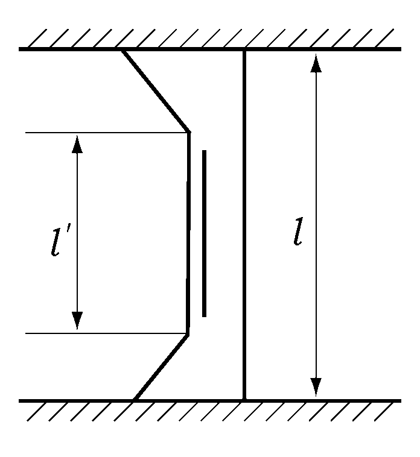
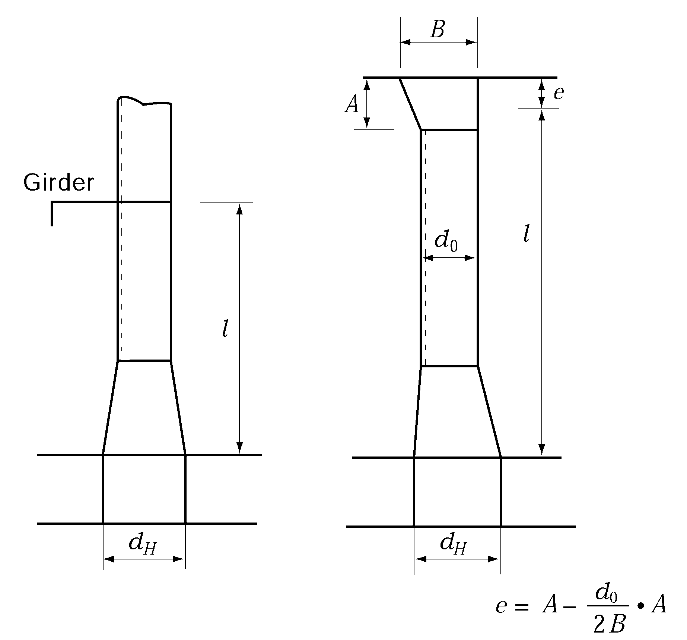
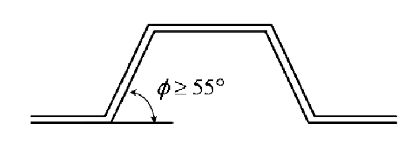

# PART 3 Hull Structures

> RULES FOR CLASSIFICATION OF STEEL SHIPS / RA-03-E / 2025 / EN / Guidance

## CHAPTER 15 DEEP TANKS

### Section 1 General

#### 103. Swash bulkhead 【See Rule】

- **1.** **The length of deep tanks is not to exceed the following limits.** ***(2020)***
  - **(1)** Where longitudinal bulkhead is not provided or longitudinal bulkhead is provided in the centreline only; 0.15 $L_f$(m) or 10 m, whichever is greater.
  - **(2)** Where two or more bulkheads are provided
- **0.** 2 $L_f$(m). However, 0.15 $L_f$(m) in the bow and stern parts of bulk carriers. Further, where the breadth of wing tank is less than $4L + 500$(mm), the inner wall is not be regarded as a longitudinal bulkhead.
- **2.** **Swash bulkhead**
  - **(1)** Except in the bow and stern parts, longitudinal bulkheads are to be provided through the whole breadth from side to side in deep tanks of the ship. However, when it can be confirmed by the safety data of ship that such bulkheads will be unnecessary.
  - **(2)** In fresh water tanks, fuel oil tanks or other tanks which may not be kept completely full during navigations, swash bulkheads or deep girders are to be provided in the centreline as well as in positions approximately $B/4$ distant from the ship's sides, except when it can be confirmed by the data on the rolling period of the ship and the inherent period of oscillation of water or oil in the tanks, that they will be unnecessary.

#### 104. Minimum thickness 【See Rule】

The thickness of floors, girders, transverses, stringers and end brackets in membrane tank LNG ship's deep tank are not to be less than that obtained from the following formula:
$t = 7.5 + 0.01 L _{2}$ (mm)
$L _{2}$ : length of ship (m). Where, however, $L$ exceeds 300 m, $L _{2}$ is to be taken as 300 m.

### Section 2 Bulkheads of Deep Tank

#### 202. Bulkhead plates 【See Rule】

- **1.** In the provision of $h$ specified in **202.** in the Rules, for bottom and side shell plating, a water head corresponding to the minimum draught amidship $d_\min$ ($\mathrm{m}$*)* under all operating conditions of the ship may be deducted therefrom. The deductible water head at the top of keel is to be $d_\min$, value at point $d_\min$ above the top of keel, 0, and value at an intermediate point is to be obtained by linear interpolation.
- **2.** For the thickness of deep tank bulkhead plating in membrane tank LNG ship's holds, the following value of $\alpha$ and $h$ is to be used for the formula specified in **202.** in the Rules.
  $\alpha$ = either $\alpha_1$ or $\alpha_2$ according to value of $y$. However, value of $\alpha$ is not to be less than $\alpha_3$.
  $\alpha _{1} =17.8 f _{D} \left( \frac{y-y _{B}}{Y '} \right) for y \geq y _{B}$
  $\alpha _{2} =17.8 f _{B} \left( \frac{y _{B} -y}{y _{B}} \right) for y\(\alpha_3 = \beta \left( { \frac{B - 2b}{B}} \right)$
  $h$ = water head($\mathrm{m}$*),* equal to the greater of the value obtained from internal pressure in **Pt 7, Ch 5, 413. 2.** and the value of the following formula $h _{s}$ *(2018)*
  $h _{s}$ : sloshing pressure $P _{s}$ is to be calculated by dividing 10.
  $P _{s} =P _{static,100\%FL} + P _{slh} (kN/m ^{2} )$
  $P _{static ,100\%FL}$ : static pressure when the height of the liquid cargo is the maximum tank height $(kN/m ^{2} )$
  $P _{static ,100\%FL} = \rho g h _{Tank} +P _{PV}$ $(kN/m ^{2} )$
  $P _{slh}$ : $P _{slh-l}$ or $P _{slh-t}$
  $P _{slh-l}$ : Sloshing pressure due to longitudinal liquid motion is to be determined by the following formula and applied to the transverse bulkhead
  $P _{slh-l} = \rho gl _{Tank} f _{slh} \left[ 0.4- \left( 0.39- \frac{1.7l _{Tank}}{L} \right) \frac{L}{350} \right] (kN/m ^{2} )$
  $P _{slh-t}$ : Sloshing pressure due to transverse liquid motion is to be determined by the following formula and applied to the longitudinal bulkhead
  $P _{slh-t} =7 \rho gf _{slh} \left( \frac{b _{Tank}}{B} -0.3 \right) GM ^{0.75} (kN/m ^{2} )$
  $\rho$ : Design density of LNG (ton/m^3).
  $GM$ : Metacentric height (m) in the considered loading condition in the loading manual.
  $l _{Tank}$ : length of tank (m).
  $b _{Tank}$ : breadth of tank (m).
  $h _{Tank}$ : height of tank (m).
  $h _{fill}$ : Filling height measured from tank bottom (m).
  $P _{PV}$ : Design vapour pressure, in kN/m^2, but not less than 25 kN/m^2.
  $f _{slh}$ : Coefficient to be taken as ;

  | $h _{fill}$ | $f _{slh}$ |
  | --- | --- |
  | 0.0$h _{Tank}$ | 0.0 |
  | 0.1$h _{Tank}$ | $f _{slh} =1.5 \left[ 1-2 \left( 0.3- \frac{h _{fill}}{h _{Tank} ^{2}} \right) ^{2} \right]$ |
  | 0.3$h _{Tank}$ | $f _{slh} =2.0 \left[ 1-2 \left( 0.3- \frac{h _{fill}}{h _{Tank} ^{2}} \right) ^{2} \right]$ |
  | 1.0$h _{Tank}$ | $f _{slh} =1.5 \left[ 1-2 \left( 0.3- \frac{h _{fill}}{h _{Tank} ^{2}} \right) ^{2} \right]$ |
  | For intermediate values of $h _{fill}$, $f _{slh}$ are to be obtained by linear interpolation. |   |
- **3.** For the thickness of deep tank bulkhead plating in Type A independent tanks, the following value of $C_2$ and $h$ is to be used for the formula specified in 202. in the Rules
  $C_2$ = 3.6
  $h$ = water head ($\mathrm{m}$), equal to internal pressure in **Pt 7, Ch 5, 413. 2.** is to be calculated by multiplying 100.

#### 203. Bulkhead stiffeners 【See Rule】

- **1.** For stiffeners having "strongly connected bracket" the span may be taken as $4l'/3$ for calculating, if the arm length of brackets exceed $l/8$. (See **Fig 3.15.1**).
- **2.** End connections of stiffeners at the top of deep tanks stiffeners of deep tank bulkheads, which are not in line with stiffeners of tween deck bulkheads at the top of the tank, are to have bracket ends.
- **3.** Scantlings of bulkheads stiffeners supporting under deck girders are to be calculated according to **Ch 14, 303. 1** of the Guidance, taking $C$ as 9.81
- **4.** In the provision of $h$ specified in **203.** in the Rules, for side shell plating, a water head corresponding to the minimum draught amidship $d_\min$ ($\mathrm{m}$*)* under all operating conditions of the ship may be deducted therefrom. The deductible water head at the top of keel is to be $d_\min$, value at point $d_\min$ above the top of keel, 0, and value at an intermediate point is to be obtained by linear interpolation.
- **5.** The section modulus of deep tank bulkhead stiffeners in membrane tank LNG ship's holds is not to be less than that obtained from the following formula:
  $Z=90C _{1} C _{2} C _{3} S h l ^{2} \mathrm{cm ^{3} }$
  Where:
  $h$ = as specified in **202. 3.**
  $C _{1}$, $S$, and $l$ = as specified in **Pt 7, Ch 10, 105.**
  $C_2$ = value obtained from the following formula.
  $C_2 = \frac{K}{18}$
  The value $C_2$ for $h_1$ is to be obtained from the following formula.
  $C_2 = \frac{K}{24 - \alpha K}$, minimum $C_2 = \frac{K}{18}$ for Longitudinal bulkhead of longitudinal framing system
  $C_2 = \frac{K}{18}$ for Longitudinal bulkhead of transverse framing system, transverse bulkhead
  $\alpha$ = either $\alpha_1$ or $\alpha_2$ according to value of $y$. However, value of $\alpha$ is not to be less than $\alpha_3$.
  $\alpha _{1} =17.8 f _{D} \left( \frac{y-y _{B}}{Y '} \right) for y \geq y _{B}$
  $\alpha _{2} =17.8 f _{B} \left( \frac{y _{B} -y}{y _{B}} \right) for y\(\alpha_3 = \beta \left( { \frac{B - 2b}{B}} \right)$
  $C_3$ = as determined from **Pt 7, Ch 10, Table 7.10.6** according to the fixity condition of stiffener ends;
- **6.** The section modulus of deep tank bulkhead stiffeners in Type A independent tanks is not to be less than that obtained from the following formula. Where the corrosion of bulkhead plating of Type A independent tanks does not occur, the following formula may be multiplied by 0.85
  $Z=100C _{1} C _{2} S h l ^{2} \mathrm{cm ^{3} }$
  $h$ = water head, equal to internal pressure in **Pt 7, Ch 5, 413. 2.** is to be calculated by dividing 10.
  $C _{1}$ = coefficient given in the following value:
  $\left. C _{1} = \max \left( \frac{2.66}{R _{m}} , \frac{1.33}{R _{e}} \right) \times 9.81$
  $R _{m}$ : specified minimum tensile strength at room temperature (N/mm^2)
  $R _{e}$ : specified minimum yield stress at room temperature (N/mm^2)
  $S$ and $l$ = as specified in **Pt 7, Ch 10, 105.**
  $C_2$ = as specified in **Pt 7, Ch 10, Table 7.10.6.**
  
  **Fig 3.15.1**

#### 204. Girders supporting bulkhead stiffeners 【See Rule】

- **1.** Girders fitted to corrugated bulkheads are to be balanced girders. In case it is difficult to form a balanced girder, the neutral axis of the girder is to be brought as close as possible to the bulkhead plate.
- **2.** In the provision of $h$ specified in **204.** in the Rules, for side shell plating, a water head corresponding to the minimum draught amidship $d_\min$($\mathrm{m}$) under all operating conditions of the ship may be deducted therefrom. The deductible water head is to be of $d_\min$ at the top of keel, 0(zero) at the position of minimum draft and the values at an intermediate point is to be obtained by linear interpolation.

#### 207. Corrugated bulkheads 【See Rule】

- **1.** Upper and lower structures supporting corrugated bulkheads *(2016)*
  - **(1)** In cases where stools are not fitted with corrugated bulkhead, the standard upper and lower structures supporting the corrugated bulkheads are to be in accordance with **Table 3.15.1.**

    | Type of corrugated bulkhead |   | Location | Supporting structure |
    | --- | --- | --- | --- |
    | Vertically corrugated bulkhead | Transverse | Lower | Floors with a thickness that is the same as that of the lower part of a corrugated bulkhead are to be arranged beneath both flanges of the corrugated bulkhead or a floor and bracket with a thickness that is the same as that of the lower part of a corrugated bulkhead is to be arranged beneath one flange of the corrugated bulkhead and a bracket with a web depth that is not less than 0.5 times the depth of the corrugation is to be arranged beneath the other side flange of the corrugated bulkhead.(See **Fig** 3.15.2) Brackets are to be arranged below inner bottom and hopper tank plating in line with corrugation webs as far as practicable. |
    | Vertically corrugated bulkhead | Longitudinal | Upper | An on-deck longitudinal girder or an on-deck longitudinal with a web thickness of not less than 80% of the thickness of the upper part of a corrugated bulkhead is to be arranged above both flanges of the corrugated bulkhead. |
    | Vertically corrugated bulkhead | Longitudinal | Lower | Girders(center girders or side girders) with a thickness that is the same as that of the lower part of a corrugated bulkhead are to be arranged beneath both flanges of the corrugated bulkhead or a girder with a thickness that is the same as that of the lower part of a corrugated bulkhead is to be arranged beneath one flange of the corrugated bulkhead and an inner bottom longitudinal with a web depth that is not less than 0.5 times the depth of the corrugation or an equivalent stiffener is to be arranged beneath the other side flange of the corrugated bulkhead. Brackets are to be arranged below inner bottom in line with corrugation webs as far as practicable. |
    | Horizontally corrugated bulkhead | Transverse | Lower | A floor with a thickness that is the same as that of the lower part of a corrugated bulkhead is to be arranged beneath the web of the corrugated bulkhead. |
    | Horizontally corrugated bulkhead | Longitudinal | Upper | An on-deck longitudinal girder with a web thickness that is not less than 80% of the thickness of the upper part of a corrugated bulkhead is to be arranged above the web of the corrugated bulkhead. |
    | Horizontally corrugated bulkhead | Longitudinal | Lower | A girder(center girder or side girder) with a thickness that is the same as that of the lower part of a corrugated bulkhead is to be arranged beneath the web of the corrugated bulkhead |
  - **(2)** In cases where a stool is fitted with a corrugated bulkhead, the standard lower stool and structures supporting such a lower stool are to be in accordance with the following (a) and (b);
  - **(3)** In cases (1) and (2) above, any openings such as slots or scallops providing penetration for stiffeners to a floor, web of transverses or girders are to be eliminated or covered by collar plates.
- **2.** **Section modulus of corrugated bulkheads** ***(2016)***
  Where the width $d_H$ in the direction of ship's length of stool of a corrugated bulkhead at the inner bottom is less than 2.5 times the web depth $d_0$ of corrugated bulkhead, the span $l$ between supports is to be measured as shown in **Fig 3.15.3.** Further, the section modulus per half pitch of corrugated bulkhead and the section modulus of lower stool at the inner bottom are to be obtained from the formula in **207. 2** of the Rules, using the value of $C$ specified in **Table 3.15.2.**
- **3.** **Construction of corrugated bulkheads** ***(2016)***
  The corrugation angle, $\phi$, of a corrugated bulkhead is not to be less than 55°. (See **Fig 3.15.4**)
- **4.** In evaluating the corrugated bulkheads of compartments intended to carry liquid cargoes with specific gravity, $\rho$, more than 1.0, the scantlings of the corrugated bulkheads are to be calculated by multiplying h by $\rho$ before using the formulae specified in **207. 1 to 3** of the Rules. *(2016)*
  
  **Fig 3.15.3 When** #eqnID-1152**, Measurements of** #eqnID-1153

  **Table 3.15.2 Coefficient** $C$

  | upper end support | Supported by girder | Connected to deck | Connected to stool |
  | --- | --- | --- | --- |
  | Section modulus of corrugated bulkhead | 1.00 | 0.85 | 0.78 |
  | Section modulus of stool at bottom | 1.00 | 1.50 | 1.35 |

  
  **Fig 3.15.4 Definition of the corrugation angle of a corrugated bulkhead**

#### 209. Reduction of scantlings 【See Rule】

- **1.** Where the bulkhead stiffeners, girder and corrugated bulkheads are not contact with sea water, the section modulus of these members required by **203., 204., 207. 2** in the rules and **203. 5** in the guidance may be reduced by 5 %.
- **2.** In spite of the requirements in **209.** in the rules, the thickness of inner bottom plating, hopper plating, inner hull longitudinal bulkhead plating, champer plating, inner deck plating and transverse bulkhead plating ,which is protected by cargo containment system, in membrane tank LNG ship's holds may be reduced by 1.5 mm from the requirements in **202.** in the guidance. Transverse bulkhead plating forming cofferdam structures may be additionally reduced by 0.5 mm *(2018)*
- **3.** Where the corrosion of bulkhead plating of Type A independent tanks does not occur, the thickness of bulkhead plating may be reduced by 2.5 mm from the requirements in **202.** 
