# PART 3 Hull Structures

> RULES FOR CLASSIFICATION OF STEEL SHIPS / RA-03-E / 2025 / EN / Guidance

## Annex 3-1 Guidance for Survey and Composition of Loading Manuals

### 1. Composition of loading manual

The loading manual is to be composed to the followings;

#### (1) General

Explanation of guidance for loading which is related to the ship's strength and in aiding of ship's master for its performance and condition.

#### (2) Standard loading condition

Explanation for the ship's standard loading condition

#### (3) Strength calculation for other conditions than standard loading condition. (See 5)

However, the ships relating category 2 of **Ch 3, Table 3.3.3** are not necessary.

### 2. Contents is to be included in 'General'

#### (1) General explanatory notes for the arrangements, scantlings, structure and characteristics

#### (2) Precaution for loading

For the standard loading conditions the results of analysis of structural strength including transverse strength and local strength and operational precautions based on the results of analysis of the strength are to be specified. For loading different from the standard loading conditions, such items of precautions that no excessive stress as viewed from hull strength might be caused are to be specified. And further, precautions relative to weight shifting involving the transfer of ballast water and cargo for making the standard loading conditions or any other arbitrary loading conditions are to be specified. Although specific contents may differ on each ship, precautions must be generally taken on the following points in preparing the Loading Manual;

- **(A)** The minimum bow draught required for the structural strength of the strengthened bottom forward
- **(B)** Limitation to loading height of cargo holds
- **(C)** Acceptability of alternate loading, two-port loading, etc.
- **(D)** Limitation to liquid levels in tanks
- **(E)** Limitation to loading with respect to local strength and transverse strength (e.g. limitations to the maximum design cargo weight on deck or hatch cover)
- **(F)** Limitation to loading with respect to longitudinal hull strength
- **(G)** Precautions for ballasting / deballasting and drydocking

#### (3) Allowable values for longitudinal still water bending moment and still water shearing force, and allowable stresses

Allowable values of longitudinal still water bending moment and still water shearing force calculated in accordance with the requirements of **4.** are to be prescribed. And, definition of positive (+) and negative (-) symbols of shearing force and longitudinal bending moment are to be prescribed in **5.2.**

#### (4) For bulk carriers, ore carriers and combination carriers of 150 m in length and above in _s2, the followings are included in addition to the above (1) to (3);

- **(A)** For bulk carriers, envelop results or envelop data and allowable values to shearing force and still water bending moment under the cargo hold flooding.
- **(B)** Where the cargos are fully loaded, empty cargo holds. if the ship is not permitted to remaining empty hold, this is to be noted in loading manual.
- **(C)** Maximum allowable and minimum required mass of cargo and double bottom contents of each hold as a function of draught at mid-hold position.
- **(D)** Maximum allowable and minimum required mass of cargo and double bottom contents of any two adjacent holds as a function of the mean draught in way of these holds. This mean draught may be calculated by averaging the draught of the two mid-hold positions. The calculating methods for allowable mass including the mass in (C) above are to be in accordance with **Annex 7-4 "Guidance for calculating the maximum allowable and minimum required mass of cargo and double bottom contents for bulk carriers"**
- **(E)** Allowable loading weight of tank top and characteristic for the cargoes other than bulk cargoes
- **(F)** Allowable loading weight of cargo hatch covers and deck. If cargo is not approved to load on the cargo hatch covers and deck, this is to be noted in loading manual.
- **(G)** Ratio of maximum ballast exchanging and loading plans of ballast. And it is also to be prescribed that these are to be agreed with terminal including the ratio of ballasting exchange.

### 3. Standard loading condition

#### (1) In general, the following design cargo and ballast loading conditions, based on amount of bunker, fresh water and stores at departure and arrival, are to be considered for the calculations of still water bending moment and shear force.

Where the amount and disposition of consumables at any intermediate stage of the voyage are considered more severe, calculations for such intermediate conditions are to be submitted in addition to those for departure and arrival conditions.
Also, where any ballasting and/or deballasting is intended during voyage, calculations of the intermediate condition just before and just after ballasting and/or deballasting any ballast tank are to be submitted and where approved included in the loading manual for guidance.

- **(A)** Cargo ships, roll on roll off ships, refrigerated cargo ships, bulk carriers, ore carriers, etc. *(2020)*
  - **(a)** Light load condition
  - **(b)** Ballast conditions (at arrival and departure)
  - **(c)** Homogeneous loading conditions of cargo (at arrival and departure)
  - **(d)** All non-homogeneous loading conditions as given in the specifications (at arrival and departure)
  - **(e)** Specially approved loading conditions for short voyage or in smooth water, where necessary
  - **(f)** Temporary severe loading conditions during cargo loading or unloading, where necessary
  - **(g)** Conditions for entering dry dock while afloat
  - **(h)** If applicable, Guidance for the ballasting exchange while the ship is at sea.
  - **(i)** All loading conditions specified Rule **Pt 7, Ch 3, Sec 2** for bulk carriers with notation BC-A, BC-B or BC-C, as applicable.
- **(B)** Oil tankers
  - **(a)** Light load condition
  - **(b)** Ballast conditions (at arrival and departure)
  - **(c)** Homogeneous loading conditions (at arrival and departure)
  - **(d)** All non-homogeneous loading conditions as given in the specifications (at arrival and departure)
  - **(e)** Conditions which largely differ from the standard ballast condition due to tank cleaning or other work while the ship is at sea
  - **(f)** Temporary severe loading conditions during cargo loading or where necessary, unloading
  - **(g)** Conditions for entering dry dock while afloat
  - **(h)** If applicable, Guidance for the ballast exchanging while the ship is at sea.
- **(C)** Chemical tankers
  - **(a)** The same conditions as specified in (B) for oil tankers
  - **(b)** The loading conditions specified in the Operation Manual
  - **(c)** Loading conditions for cargo items included in the approved list of cargoes, which are with high density, or require heating or isolated stowage.
  - **(d)** If applicable, Guidance for the ballast exchanging while the ship is at sea.
- **(D)** Ships carrying liquefied gas as in bulk
  - **(a)** Light load condition
  - **(b)** Ballast conditions (at arrival and departure)
  - **(c)** Homogeneous loading conditions (at arrival and departure)
  - **(d)** Loading conditions involving empty or partially loaded tanks
  - **(e)** Loading conditions where two or more kinds of cargoes with largely different specific gravity are loaded in different tanks
  - **(f)** Loading in smooth water where an increased vapour pressure is approved
  - **(g)** Temporary severe loading conditions during cargo loading or unloading, where necessary.
  - **(h)** Conditions for entering dry dock while afloat
  - **(i)** If applicable, Guidance for the ballast exchanging while the ship is at sea.
- **(E)** Combination carriers
  - **(a)** The same conditions as specified respectively in (A) and (B) above for cargo ships and oil tankers
  - **(b)** If applicable, Guidance for the ballast exchanging while the ship is at sea.
- **(F)** For bulk carriers, ore carriers and combination carriers of 150 m length and above in $L _{f}$, the following loading conditions are to be included in addition to the above (A) and (E) loading conditions. However, the following (d) and (e) loading conditions may be followed by the specification agreed between owner and builder, and also if some of the following loading conditions are not included in the Loading Manual a note to this effect is to be given in the Loading Manual.
  - **(a)** Alternate light and heavy cargo loading conditions at maximum draught, where applicable.
  - **(b)** Homogeneous light and heavy cargo loading conditions at maximum draught.
  - **(c)** Ballast conditions, For vessels having ballast holds adjacent to topside wing, hopper and double bottom tanks, it shall be strengthwise acceptable that the ballast holds are filled when the topside wing, hopper and double bottom tanks are empty. Partial filling of fore peak tank is not acceptable in design ballast conditions, unless effective means are provided to prevent accidental overfilling.
  - **(d)** Short voyage conditions where the vessel is to be loaded to maximum draught but with limited amount of bunkers.
  - **(e)** Multiple port loading/unloading conditions.
  - **(f)** Deck cargo condition, where applicable.
  - **(g)** Guidance for typical loading/unloading sequences where the vessel is loaded from commencement of cargo loading to reaching full deadweight capacity, for homogeneous conditions, alternate conditions where applicable and relevant part loaded conditions is to be included. When this guidance is composed, precaution must be taken on loading rate, ballast and deballasting rates and applicable strength limitations, and the followings in this guidance are to be included.
  - **(i)** The typical loading sequences as relevant should include the following loading conditions
    ① Loading conditions in above (a), (b), (d), (e) and (f)
    ② Block loading
    ① How much cargo is filled in each hold during the different steps.
    ② How much ballast is discharged from each ballast tank during the different steps.
    ③ The maximum still water bending moment and shear at the end of each step.
    ④ The ship's trim and bow, stern and mean draught at the end of each step.
    ⑤ The ship's air-draught when necessary.
    - **(ii)** The loading/unloading sequences may be port specific or typical.
    - **(iii)** The sequence is to be built up step by step from commencement of cargo loading to reaching full deadweight capacity. Each time the loading equipment changes position to a new hold defines a step. In addition to longitudinal strength, the local strength of each hold is to be considered.
    - **(iv)** For each load condition above mentioned in (i), the summary for all steps is to include the followings,
  - **(v)** The form of guidance for loading/unloading sequences is referred to **Table 4.**
- **(G)** Partially filled ballast tanks in ballast loading conditions
  - **(a)** Ballast loading conditions involving partially filled peak and/or other ballast tank at departure, arrival or during intermediate conditions are not permitted to be used as design conditions unless:
  - **(i)** design stress limits are satisfied for all filling levels between empty and full, and
    - **(ii)** for bulk carriers, Rule **Pt 7, Ch 3, Sec 10**, as applicable, is complied with for all filling levels between empty and full.
  - **(b)** To demonstrate compliance with all filling levels between empty and full, it will be acceptable if, in each condition at departure, arrival and any intermediate condition, the tanks intended to be partially filled are assumed to be:
  - **(i)** empty
    - **(ii)** full
    - **(iii)** partially filled at intended level
  - **(c)** Where multiple tanks are intended to be partially filled, all combinations of empty, full or partially filled at intended level for those tanks are to be investigated.
  - **(d)** However, for conventional ore carriers with large wing water ballast tanks in cargo area, where empty or full ballast water filling levels of one or maximum two pairs of those tanks lead to the ship's trim exceeding one of the following conditions, it is sufficient to demonstrate compliance with maximum, minimum and intended partial filling levels of those one or maximum two pairs of ballast tanks such that the ship's condition does not exceed any of these trim limits. Filling levels of all other wing ballast tanks are to be considered between empty and full.
    The trim conditions mentioned above are:
  - **(i)** trim by stern of 3% of the ship's length, or
    where;
    I : the distance from propeller centerline to the waterline
    D : propeller diameter (see **Fig 1**)
    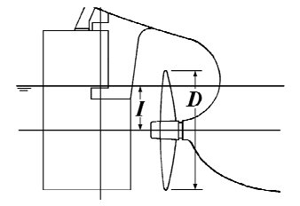
    **Fig 1 Immersion of propeller**
    The maximum and minimum filling levels of the above mentioned pairs of side ballast tanks are to be indicated in the loading manual.
    **Par 6** contains the guidance for partially filled ballast tanks in ballast loading conditions. *(2022)*
    - **(ii)** trim by bow of 1.5% of the ship's length, or
    - **(iii)** any trim that cannot maintain propeller immersion(I/D) not less than 25 %,
- **(H)** Partially filled ballast tanks in cargo loading conditions
  In cargo loading conditions, the requirements of (G), applies to the peak tanks only.
- **(I)** Sequential ballast water exchange
  Requirements of (G) and (H) are not applicable to ballast water exchange using the sequential method. However, bending moment and shear force calculations for each deballasting or ballasting stage in the ballast water exchange sequence are to be included in the loading manual or ballast water management plan of any vessel that intends to employ the sequential ballast water exchange method.

#### (2) Graphical illustration of standard loading conditions

- **(A)** To enable the ship master to readily grasp the relationships between loading conditions and hull strength under the standard loading conditions and to utilize them as guidance for planning the loading, the results of calculation of longitudinal still water bending moment ($M_S$) and still water shearing force ($F_S$) at each condition are to be subjected to graphical illustration together with the respective allowable values. In this case, the directions of positive and negative are also to be specified for $M_S$ and $F_S$.
- **(B)** The above mentioned results of calculation are to be shown on a single page or on two spread pages as far as possible on each condition, together with arrangement plan of compartments (tanks and cargo holds), cargo stowage table and the results of trim and stability calculations. Descriptive examples of these are shown **5.3.** Restrictions imposed for operation of the ship in the standard loading conditions if any, are to be specified.

#### (3) Additional notation, BLU

- **(A)** In addition to the requirements in **3** (1) (F) (g), the additional special feature notation **BLU** shall be assigned to ships which for bulk carriers with notation **BC-A** or **BC-B** and Ore carriers satisfied with the The average loading rate is 16,000 ton/h and if the average loading rate is not this value, loading rates are specified in the loading manual and submitted for the approval of the Society. The average loading rate is defined as rate achieved from start to completion of total cargo loading divided by time elapsed. Special consideration shall be given if loading with two or more loaders simultaneous is specified and provided as part of the documentation for approval.
  Relevant loading sequences for the following conditions shall be defined:
  — homogeneous condition
  — part loading conditions (if applicable)
  — alternate conditions (if applicable)
  Each step in the loading sequences from commencement of cargo loading to full deadweight is reached, stepwise and time-wise synchronized with the de-ballasting operation, shall be documented. Each time the loading equipment changes position to a new cargo hold is defined as a step.
  Time-wise synchronized in this context means that the de-ballasting is completed within the same time as the loading step.
  The typical loading sequences shall also be developed to not exceed applicable strength limitations.
  For all relevant loading sequences, considering one, two or more loaders acting simultaneously as applicable, a summary of all steps shall be included with at least the following information included:
  - how much cargo is filled in each cargo hold during the different steps
  - how much ballast is discharged from each ballast tank during the different steps
  - the maximum still water bending moment and shear force at the end of each step
  - the ship's trim and draught at the end of each step
  - the ship's draught aft and forward, trim and air-draught, if restrictions are applicable
  - the ship's local strength criteria for single and adjacent hold loading
  If the Master deems necessary due to operational reasons to deviate from the approved loading sequence calculations with loading ratings, he may do so provided he is in compliance with SOLAS Ch.VI Pt. B, Reg.7.3 and on this condition agree with the terminal on a new loading plan.
- **(B)** The de-ballast capacity of the vessel at loading berth prior to commencement of loading, including arrangement of ballast tanks and relevant piping system, shall meet the requirements for the average loading rates. If average loading rate is higher than 16,000 ton/h as specified in (A), the loading operation is not be interrupted due to de-ballast operations.
- **(C)** The vessel shall be fitted with a separate stripping system. To enhance de-ballasting and stripping, the trim is to be by stern during the whole operation as far as practicable.
- **(D)** The vessel shall be designed such that minimum 100% of maximum permissible cargo intake per cargo hold can be loaded in one pour.
- **(E)** Inner bottom strength shall be according to the requirements as given in Rule **Pt.11 Ch. 12, Sec.1** for CSR Bulk carriers or Rule **Pt.7 Ch.2, 202.** for Ore carriers or Rule **Pt.7 Ch.3, 304. 3** for Bulk carriers.
- **(F)** The vessel shall be fitted with a remote sounding for water ballast and fuel oil storage tanks and draught reading system with an on-line interface into the software of the onboard loading computer.
- **(G)** Check of local strength for single and adjacent hold loading pattern shall be integrated into the software of the onboard loading computer.

### 4. Allowable values for longitudinal strength

The allowable values for longitudinal still water bending moment and still water shearing force which are specified in the Loading Manual are to be determined with the consideration given to the design condition of the ship. Those values, however, are not to exceed the values specified in the following, at positions of transverse section of the hull where deemed necessary by the Surveyor.

#### (1) Allowable still water longitudinal bending moment (_s2)

For the ships specified in **Ch 3, 104. 1** (1) of the Rules, the values obtained from the following (A) or (B), whichever is smaller, is to be taken as the allowable value for each positive and negative moment at a transverse section of the ship under consideration. However, these values are to be also complied with **Ch 3, Sec 4.**

- **(A)** Value determined by longitudinal bending moment
  $M _{S} (+) = 175fZ \times 10 ^{-3} -M _{W} (+)$(kN-m)
  $M_S (-) = 175fZ \times 10^-3 - M_W (-)$(kN-m)
  $f$ = for the ships using the value $f_B$ or $f_D$ specified in **Ch 3, 124.** of the Rules, those values is to be used. For the ships not using those values, the value $1/K$ is to be used.
  $Z$ = section modulus of transverse section of the ship with respect to the ship's bottom or strength deck at the position under consideration (cm^3)
  $M_W (+)$, $M_W (-)$ is to be in accordance with **Ch 3, Table 3.3.1** of the Rules.
- **(B)** Value determined by torsional bending moment
  In case where torsional moment is generated in the hull due to uneven cargo stowage, the warping stress value used in applying **Pt 7, Ch 4, 202.** of the Guidance is to be deducted from the value in [ ] in the following formula.
  $M_S (+) = \left[\frac{175}{K} - \sqrt { (0.75 \sigma_V (+))^2 + \sigma_H^2 +\sigma_W^2 }\right] Z_\frac{V}{1000}$(kN-m)
  $M_S (-)=- \left[ \frac{175}{K} - \sqrt {(0.75 \sigma _{V} (-)) ^{2} + \sigma _{H} ^{2} + \sigma _{W} ^{2}} \right] \frac{Z _{V}}{1000}$(kN-m)
  $\sigma_V (+)$, $\sigma _{V} (-)$ is to be obtained from the following formula.
  $\sigma_V (+)= \frac{M_W (+)}{Z _{V}} \times 10^3$
  $\sigma_V (-)= \frac{M_W (-)}{Z _{V}} \times 10^3$
  $M_W (+)$, $M_W (-)$ = as specified in **Ch 3, Table 3.3.1** of the Rules.
  $\sigma_H$, $\sigma_w$, $Z_V$ = as specified in **Pt 7, Ch 4, Sec 2** of the Guidance.

#### (2) For the ships under Ch 3, 104. 1 (2) and (3) of the Rules and for the ships which are not under (1) and (3), longitudinal still water bending moment at the positions of transverse section of the ship under consideration for each positive and negative moment is to be determined from the preceeding (1) (A) and to satisfy the requirements Ch 3, Sec 4 of the Rules.

#### (3) The allowable value for shearing force (_s2)

- **(A)** The allowable value for shearing force is to be obtained from the following formula.
  $F_S (+) = \frac{110}{K} \times \frac{t_S I}{0.5Q} \times 10^-2 - F_W (+)$(kN)
  $F_S (-) = - \frac{110}{K} \times \frac{t_S I}{0.5Q} \times 10^-2 - F_W (-)$(kN)
  $t_S$ = thickness of side shell plating at positions under consideration. However, for the ships having longitudinal bulkheads, thickness of the part of longitudinal bulkheads are to be included (mm)
  $I$, $Q$, $F_W (+)$ and $F_W (-)$ = as specified in **Ch 3, 301.** of the Rules.
- **(B)** When the shearing force of the thickness of side shell plating is directly calculated, the value of preceeding (A) or the value to be obtained from following formula is to be taken, whichever is smaller.
  $F (+) = F \tau _\frac{P}{\tau} - F_W (+)$(kN)
  $F (-) = -F \tau _\frac{P}{\tau} - F_W (-)$(kN)
  $F$ = the shearing force acting on transverse section of the ship used in the direct strength calculation which is in accordance with **Ch 3, 301.** of the Guidance.
  $F_W (+)$, $F_W (-)$ = As specified in **Ch 3, 301.** of the Rules
  $\tau_P$ = allowable shearing force as specified in **Ch 3, 301.** of the Guidance. (N/mm^2)
  $\tau$ = shearing force acting on transverse section of the ship determined by the direct strength calculation, where the greatest value among those which occur in side shell plating, bilge hopper tanks and top side tanks is to be taken (N/mm^2).
- **(C)** The allowable value for shearing force in still water bending moment determined by the preceeding (A) and (B) is to be also complied with **Ch 3, Sec 4** of the Rules.

#### (4) Allowable values for still water bending moment and shearing force in harbour water free from the effects of waves may be obtained by taking half the values of the wave induced longitudinal bending moment and shearing force as specified in (1) and (2) respectively.

### 5. Composition of loading manual

#### 5.1 Method of longitudinal strength for loading conditions different from the standard loading condition

- **(1)** Confirmation items for longitudinal strength
  Calculating and checking method of longitudinal strength for loading conditions different from the standard loading condition is to be in accordance with **Fig 2** and the following items are to be included for each point of output.
  - **(A)** Still water bending moment ($M_S$)
  - **(B)** Still water shearing force ($F_S$)
  - **(C)** Still water shearing force for alternate loading condition ($F_C$) (shearing force modified by alternate loading to $F_S$). However, for the ships designed without consideration of load distribution by double bottom structure, confirmation of still water shearing force for alternate loading condition may be dispensed
- **(2)** Point of output for checking longitudinal strength
  - **(A)** At least six points of output of longitudinal still water bending moment are to be properly arranged in the range (including the midship 0.5 $L$).
  - **(B)** The points of output of still water shearing force are to be arranged at a position of fore and aft bulkheads of cargo loaded compartments and/or similar spaces. However, where the distance between transverse bulkheads is small such as cofferdam, checking of strength at either one of the bulkheads may be omitted. Also, where the shearing force is considered to be apparently small, checking of strength may be omitted.
- **(3)** Grouping of loads in calculation
  - **(A)** Loads in those tanks symmetrically arranged on both sides of the ship may be summarized in same group in calculation.
  - **(B)** In case where two or more hatch openings are provided for one cargo hold, calculations to be made for each such hatch opening. However, where separation according to type of cargo is unnecessary, calculation may be made by hold.
- **(4)** Procedure for checking longitudinal strength
  - **(A)** In order to facilitate checking of allowable cargo loading, the relation between loading and longitudinal strength, and the procedure of checking longitudinal strength are to be explained by using flow chart or any other proper means. Descriptive examples are shown in **5.4.**
  - **(B)** The following allowable values corresponding to values calculated in (1) above are to be clearly specified so that the shipmaster can judge the adequacy of cargo loading without making mistakes.
    - **(a)** Allowable value for longitudinal still water bending moment (allowable value of $M_S$)
    - **(b)** Allowable value for still water shearing force (allowable value of $F_S$)
  - **(C)** Terms and symbols used for describing the calculated values and allowable values are to be same as used in (1) and (4) (B).
- **(5)** Method of Calculation
  - **(A)** Calculations of longitudinal still water bending moment ($M_S$) and still water shearing force ($F_S$)
    Longitudinal still water bending moment and still water shearing force are to be determined basing upon direct strength calculation.
  - **(B)** Calculation of still water shearing force in alternate loading ($F_C$)
    Corrective calculations in case where the adjoining holds are alternately loaded are to be made according to the method as given in **5.6.**
  - **(C)** Calculation of these are to be attached to Loading Manual.
    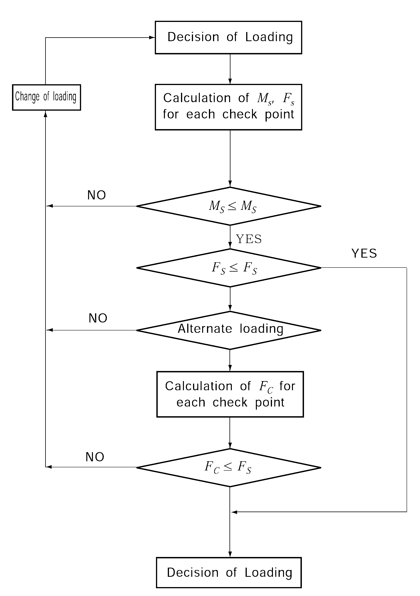
    **Fig 2 Flow chart of confirmation of longitudinal strength**

#### 5.2 Descriptive example for the allowable value for longitudinal bending moment and still water shearing force.

For the permissible value of still water bending moments and shearing forces are to be as follows at sea and in harbor.
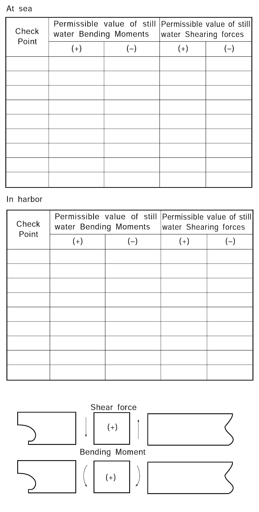

#### 5.3 Descriptive example for standard loading conditions

CONDITION NO.Ⅱ NORMAL BALLAST CONDITION DEPARTURE
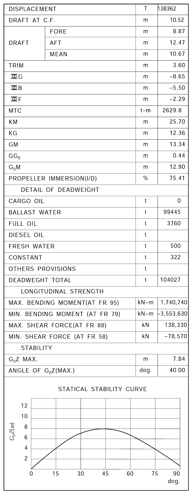

|   | CARGO OIL (BALLAST WATER) |   |   |   |   |   |   |   |   |   |   |   |   |
| --- | --- | --- | --- | --- | --- | --- | --- | --- | --- | --- | --- | --- | --- |
| TANK | NO1 CT | NO2 CT | NO3 CT | NO4 CT | NO5 CT | NO1 WT | NO2 WT | NO3 WT | NO5 WT | NO6 WT | NO7 WT | NO8 WT | SLOPT |
| WEIGHT (t) | 0 | 0 | 0 | 0 | 0 | 0 | 0 | 20000 | 0 | 27284 | 14000 | 0 | 0 |
| VOL/CAP (%) | 0 | 0 | 0 | 0 | 0 | 0 | 0 | 74 | 0 | 98 | 53 | 0 | 0 |

|   | BALLAST WATER |   |   | FRESH WATER |   |   |   | FUEL OIL |   |   |   |
| --- | --- | --- | --- | --- | --- | --- | --- | --- | --- | --- | --- |
| TANK | FPT | NO4 WT | APT | FWT | DRWT | TSWT (F) | TSWT (A) | FOT (P) | FOT (S) | FOST (P) | FOST (S) |
| WEIGHT (t) | 9919 | 27288 | 954 | 200 | 170 | 60 | 70 | 995 | 994 | 1091 | 680 |
| VOL/CAP (%) | 98 | 98 | 98 | 50 | 54 | 53 | 50 | 33 | 33 | 98 | 98 |

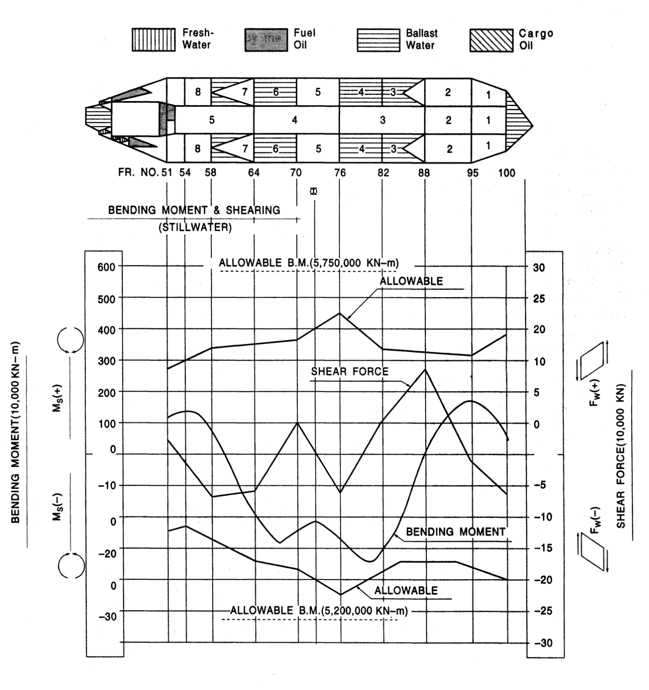
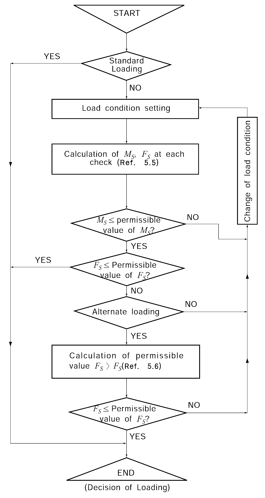
**Fig 3**

#### 5.4 Descriptive example on the procedure of calculation of longitudinal still water bending moment and still water shearing force

Adjustments in loading and judging procedure
In case where loading different from the standard loading conditions is made, the longitudinal still water bending moment ($M_S$) and still water shearing force($F_S$, $F_C$) are to be obtained by the procedures stated below and the loading is to be adjusted in such a manner that the values as obtained above do not exceed the respective allowable values. Since the allowable value are set in such a manner that the stresses acting on the hull due to longitudinal bending moment and shearing force predictable while the ship is sailing in the ocean do not exceed the allowable limits to the structural strength of the specific part of the hull under consideration, the strength of the ship during at sea can be ensured so far as the values of $M_S$, $F_S$ and $F_C$ at each point of output do not exceed the corresponding allowable values.
The longitudinal bending moment and shearing force to be checked are as follows
Still water bending moment ($M_S$)
Still water shearing force ($F_S$)
Still water shearing force acting on longitudinal bulkhead ($F_C$)
Explanatory notes on details of calculation procedures will be given in **5.5** and **5.6,** but calculation and its verification are to be made according to the following flow Chart in **Fig 3.**

- **(1)** Calculate values of $M_S$ and $F_S$ at each point of output through the use of the form as shown **Table 3** in **5.5** by giving the quantities of loading for each cargo hold and tank.
- **(2)** Check if the values of $M_S$ at each point of exceed the allowable value of $M_S$ shown in **Fig 3.** If they are verified to be in the range between the positive and negative allowable proceed to the next step. In case where exceed the allowable values, alternate loading is to be made.
- **(3)** Check if the values of $F_S$ at each point of output obtained in (1) exceed the allowable value of $F_S$ as shown in **Fig 3.** If they are verified to be in the range between the positive and negative allowable values, the loading may be acceptable. In case where they exceed the allowable values, proceed to the next step.
- **(4)** Check if the point of output exceeding the allowable value of $F_S$ falls within the area subjected to alternate loading. In case where the alternate loading is found to be irrelevant, alternation in loading should be made. If alternate loading is found to be irrelevant, proceed to the next step.
- **(5)** On points of output exceeding the allowable value of $F_S$, $F_C$ is to be calculated in accordance with **Table 5.**

#### 5.5 Method of calculation of longitudinal still water bending moment and still water shearing force

- **(1)** General explanation
  In applying this method of calculation of longitudinal strength, the longitudinal still water bending moment and still water shearing force at various locations of the hull under the actual loading condition of the ship can be obtained.
  The method of calculation and symbols for longitudinal strength are as follows
  $\sum W$ = Integral value of deadweight from the fore end of $L$ to each point of output (shearing force due to dead-weight) (1,000 tons)
  $SS$ = Integral value of (buoyancy-light weight) from the fore end of $L$ to each point of output (shearing force due to (buoyancy-light weight)×(1,000 tons)
  $\sum M _t$ = Double integral value of deadweight from the fore end of $L$ to each point of output (bending moment due to deadweight)× (1,000 tons-m)
  $SB$ = Double integral value of buoyancy and the ship's weight from the fore end of $L$ to each point of output (bending moment due to buoyancy and the ship's light weight) (1,000 tons-m)
  The longitudinal still water shearing force($F_S$) and still water bending moment ($M_S$) at each point of output can be calculated by the following formula
  $F_S = (SS - \sum ) \times 9800$(kN)
  $M_S = ( smallsumM-SB) \times 9800$(kN-m)
  where the sign convention of $F_S$ and $M_S$ is the same of each allowable value, as shown in the following figures
  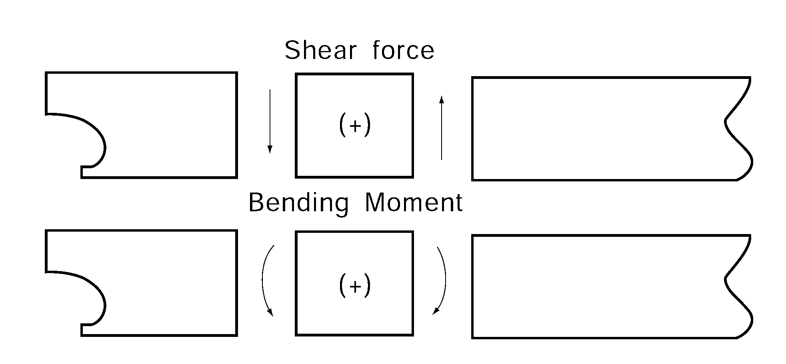
  In this method of calculation of longitudinal strength, the shearing forces ($SS$) and the bending moments ($SB$) due to buoyancy and the ship's light weight are calculated for every metre of draught and the longitudinal strength data, a list of shearing forces and bending moments for respective set-up draughts are prepared. In **Table 4,** an example of numerical table for one set for the specific draught is given for an example.
  Accordingly, by calculating only the shearing force and bending moment due to dead weight, the longitudinal still water shearing force ($F_S$) and still water bending moment ($M_S$) for each point of output can easily be obtained on board the ship.
- **(2)** Procedure for calculation of Longitudinal strength
  The calculation of longitudinal strength may be proceeded by filling up the spaces given in **Table 3.** The procedure is given as follows
  - **(A)** After draught ($DA$) and trim
    The after draught and trim, in the conditions for which the calculation of longitudinal strength is to be made, are to be filled up in the blank spaces. In this case, the trim by the bow is to be noted with negative sign (-).
  - **(B)** Base draught ($DB$) and difference of draught ($\Delta D$)
    A draught, closes to but is less than the after draught is to be selected from among the base draughts given in the longitudinal strength data and is to be filled up in the space for the base draught, and the difference between the after draught and the selected base draught is to be entered in the space for the difference ($\Delta D$).
  - **(C)** Column for Weight
    One-thousandth of the deadweight (ton) in the respective compartments is to be entered in this column.
  - **(D)** Column for $W i$
    This column is for indicating the dead-weight in the respective compartments exerted on points of longitudinal strength output, which is obtained by multiplying the deadweight by the ratio (ratio of compartment to be included in each point of output).
  - **(E)** Column for $M i$
    This column is for indicating the moment around the midship which is created by the deadweight in the respective compartments, and here the value of $W _i \times$$G$ is to be entered.
  - **(F)** $smallsumW i$, $smallsumM i$
    The accumulations of $W i$ and $M i$. included between the fore end and each point of output are to be filled up here.
  - **(G)** $SS$ and $SB$
    $SS$ and $SB$ indicate the shearing force and the bending moment due to buoyancy and the ship's light weight respectively and they are to be calculated according to the following procedures
    The base value (column ①) and the respective correction factors ($CD$ and $CT$) at each point of output is to be transferred from the longitudinal strength data for the draught adopted as the base draught to the corresponding space.
    This is to correct the difference between the base draught and the actual draught. The correction is to be made by multiplying the correction factor ($CD$) by the difference of draught ($\Delta D$).

    **#underline{○ CONDITION} #underline{AFT DRAFT (DA) : (m)} #underline{BASE DRAFT (DB) : (m)} #underline{DIFFERENCE(△D)=DA-DB : (m)} #underline{TRIM : (m)}**

    | $i$ | D.W.ITEM | WEIGHT 1/1,000 | RATIO | LOAD ($W _{i}$) | G | MOMENT |
    | --- | --- | --- | --- | --- | --- | --- |
    | 1 | FORE PEAK TANK |   | 1.000 |   | 140.08 |   |
    | FR. 99 |   | ∑ $W _{i}$ = ( ) #eqnID-12741 |   |   | ∑ $M _{i}$ = ( ) #eqnID-12761 |   |
    | 2 | No. 1C.O.T. (C) |   | 1.000 |   | 121.30 |   |
    | 3 | No. 1C.O.T. (P/S) |   | 1.000 |   | 120.20 |   |
    | FR. 94 |   | ∑ $W _{i}$ = ( ) #eqnID-12781~3 |   |   | ∑ $M _{i}$ = ( ) #eqnID-12801~3 |   |
    | 4 | No. 2C.O.T. (C) |   | 0.500 |   | 94.80 |   |
    | 5 | No. 2C.O.T. (P/S) |   | 1.000 |   | 94.63 |   |
    | FR. 88 |   | ∑ $W _{i}$ = ( ) #eqnID-12821~5 |   |   | ∑ $M _{i}$ = ( ) #eqnID-12841~5 |   |
    | 6 | No. 2C.O.T. (C) |   | 0.500 |   | 64.80 |   |
    | 7 | No. 3C.O.T. (P/S) |   | 1.000 |   | 64.80 |   |
    | FR. 82 |   | ∑ $W _{i}$ = ( ) #eqnID-12861~7 |   |   | ∑ $M _{i}$ = ( ) #eqnID-12881~7 |   |
    | 8 | No. 3W.B.T. (C) |   | 0.500 |   | 34.80 |   |
    | 9 | No. 4C.O.T. (P/S) |   | 1.000 |   | 34.80 |   |
    | FR. 76 |   | ∑ $W _{i}$ = ( ) #eqnID-12901~7 |   |   | ∑ $M _{i}$ = ( ) #eqnID-12921~9 |   |
    | 10 | No. 3W.B.T. (C) |   | 0.500 |   | 4.80 |   |
    | 11 | No. 5C.O.T. (P/S) |   | 1.000 |   | 4.80 |   |
    | FR. 70 |   | ∑ $W _{i}$ = ( ) #eqnID-12941~7 |   |   | ∑ $M _{i}$ = ( ) #eqnID-12961~11 |   |
    | 12 | No. 4C.O.T. (C) |   | 0.500 |   | -25.20 |   |
    | 13 | No. 6C.O.T. (P/S) |   | 1.000 |   | -25.19 |   |
    | FR. 64 |   | ∑ $W _{i}$ = ( ) #eqnID-12981~7 |   |   | ∑ $M _{i}$ = ( ) #eqnID-13001~13 |   |
    | 14 | No. 4C.O.T. (C) |   | 0.500 |   | -55.20 |   |
    | 15 | No. 7C.O.T. (P/S) |   | 1.000 |   | -55.07 |   |
    | FR. 58 |   | ∑ $W _{i}$ = ( ) #eqnID-13021~7 |   |   | ∑ $M _{i}$ = ( ) #eqnID-13041~15 |   |
    | 16 | No. 5C.O.T. (C) |   | 0.674 |   | -80.17 |   |
    | 17 | No. 8C.O.T. (P/S) |   | 1.000 |   | -79.93 |   |
    | FR. 54 |   | ∑ $W _{i}$ = ( ) #eqnID-13061~7 |   |   | ∑ $M _{i}$ = ( ) #eqnID-13081~17 |   |
    | 18 | No. 5C.O.T. (C) |   | 0.326 |   | -95.08 |   |
    | 19 | SLOP TANK (P/S) |   | 1.000 |   | -94.74 |   |
    | FR. 52 |   | ∑ $W _{i}$ = ( ) #eqnID-13101~7 |   |   | ∑ $M _{i}$ = ( ) #eqnID-13121~19 |   |

    | ITEM | SHEARING FORCE ($F _{S}$) |   |   |   | BENDING MOMENT ($M _{S}$) |   |   |   |
    | --- | --- | --- | --- | --- | --- | --- | --- | --- |
    | BASE VALUE |   |   | ① |   |   |   | ① |   |
    | DRAFT CORRECTION | CD ( ) ×　△　D |   | ② |   | CD ( ) ×　△　D |   | ② |   |
    | TRIM CORRECTION | CT ( ) × TRIM |   | ③ |   | CT ( ) × TRIM |   | ③ |   |
    | BUOYANCY & L.W. | ①+②+③ |   | SS |   | ①+②+③ |   | SB |   |
    | DEADWEIGHT | ∑$W i$ |   | ∑W |   | ∑W × (-132.8) + ∑$M i$ ( ) |   | ∑W |   |
    | CALCULATED VALUE | (SS-∑W) × 9,800 |   |   |   | (∑M - SB) × 9,800 |   |   |   |
    | ALLOWABLE VALUE | ALLOWABLE SHEARING FORCE | 110,000~-99,080 |   |   | ALLOWABLE BENDING MOMENT | 2,790,000~-2,183,600 |   |   |
    | BASE VALUE |   |   | ① |   |   |   | ① |   |
    | DRAFT CORRECTION | CD ( ) ×　△　D |   | ② |   | CD ( ) ×　△　D |   | ② |   |
    | TRIM CORRECTION | CT ( ) × TRIM |   | ③ |   | CT ( ) × TRIM |   | ③ |   |
    | BUOYANCY & L.W. | ①+②+③ |   | SS |   | ①+②+③ |   | SB |   |
    | DEADWEIGHT | ∑$W i$ |   | ∑W |   | ∑W × (-109.8) + ∑$M i$ ( ) |   | ∑W |   |
    | CALCULATED VALUE | (SS-∑W) × 9,800 |   |   |   | (∑M - SB) × 9,800 |   |   |   |
    | ALLOWABLE VALUE | ALLOWABLE SHEARING FORCE | 129,000~-113,370 |   |   | ALLOWABLE BENDING MOMENT | 4,340,000~-3,321,300 |   |   |
    | BASE VALUE |   |   | ① |   |   |   | ① |   |
    | DRAFT CORRECTION | CD ( ) ×　△　D |   | ② |   | CD ( ) ×　△　D |   | ② |   |
    | TRIM CORRECTION | CT ( ) × TRIM |   | ③ |   | CT ( ) × TRIM |   | ③ |   |
    | BUOYANCY & L.W. | ①+②+③ |   | SS |   | ①+②+③ |   | SB |   |
    | DEADWEIGHT | ∑$W i$ |   | ∑W |   | ∑W × (-79.8) + ∑$M i$ ( ) |   | ∑W |   |
    | CALCULATED VALUE | (SS-∑W) × 9,800 |   |   |   | (∑M - SB) × 9,800 |   |   |   |
    | ALLOWABLE VALUE | ALLOWABLE SHEARING FORCE | 128,000~-112,030 |   |   | ALLOWABLE BENDING MOMENT | 6,040,000~-4,449,800 |   |   |
    | BASE VALUE |   |   | ① |   |   |   | ① |   |
    | DRAFT CORRECTION | CD ( ) ×　△　D |   | ② |   | CD ( ) ×　△　D |   | ② |   |
    | TRIM CORRECTION | CT ( ) × TRIM |   | ③ |   | CT ( ) × TRIM |   | ③ |   |
    | BUOYANCY & L.W. | ①+②+③ |   | SS |   | ①+②+③ |   | SB |   |
    | DEADWEIGHT | ∑$W i$ |   | ∑W |   | ∑W × (-49.8) + ∑$M i$ ( ) |   | ∑W |   |
    | CALCULATED VALUE | (SS-∑W) × 9,800 |   |   |   | (∑M - SB) × 9,800 |   |   |   |
    | ALLOWABLE VALUE | ALLOWABLE SHEARING FORCE | 122,000~-112,720 |   |   | ALLOWABLE BENDING MOMENT | 6,590,000~-4,459,000 |   |   |
    | BASE VALUE |   |   | ① |   |   |   | ① |   |
    | DRAFT CORRECTION | CD ( ) ×　△　D |   | ② |   | CD ( ) ×　△　D |   | ② |   |
    | TRIM CORRECTION | CT ( ) × TRIM |   | ③ |   | CT ( ) × TRIM |   | ③ |   |
    | BUOYANCY & L.W. | ①+②+③ |   | SS |   | ①+②+③ |   | SB |   |
    | DEADWEIGHT | ∑$W i$ |   | ∑W |   | ∑W × (-19.8) + ∑$M i$ ( ) |   | ∑W |   |
    | CALCULATED VALUE | (SS-∑W) × 9,800 |   |   |   | (∑M - SB) × 9,800 |   |   |   |
    | ALLOWABLE VALUE | ALLOWABLE SHEARING FORCE | 113,000~-112,900 |   |   | ALLOWABLE BENDING MOMENT | 6,520,000~-4,159,000 |   |   |
    | BASE VALUE |   |   | ① |   |   |   | ① |   |
    | DRAFT CORRECTION | CD ( ) ×　△　D |   | ② |   | CD ( ) ×　△　D |   | ② |   |
    | TRIM CORRECTION | CT ( ) × TRIM |   | ③ |   | CT ( ) × TRIM |   | ③ |   |
    | BUOYANCY & L.W. | ①+②+③ |   | SS |   | ①+②+③ |   | SB |   |
    | DEADWEIGHT | ∑$W i$ |   | ∑W |   | ∑W × (-10.2) + ∑$M i$ ( ) |   | ∑W |   |
    | CALCULATED VALUE | (SS-∑W) × 9,800 |   |   |   | (∑M - SB) × 9,800 |   |   |   |
    | ALLOWABLE VALUE | ALLOWABLE SHEARING FORCE | 113,500~-113,690 |   |   | ALLOWABLE BENDING MOMENT | 6,520,000~-4,459,000 |   |   |
    | BASE VALUE |   |   | ① |   |   |   | ① |   |
    | DRAFT CORRECTION | CD ( ) ×　△　D |   | ② |   | CD ( ) ×　△　D |   | ② |   |
    | TRIM CORRECTION | CT ( ) × TRIM |   | ③ |   | CT ( ) × TRIM |   | ③ |   |
    | BUOYANCY & L.W. | ①+②+③ |   | SS |   | ①+②+③ |   | SB |   |
    | DEADWEIGHT | ∑$W i$ |   | ∑W |   | ∑W × (-40.2) + ∑$M i$ ( ) |   | ∑W |   |
    | CALCULATED VALUE | (SS-∑W) × 9,800 |   |   |   | (∑M - SB) × 9,800 |   |   |   |
    | ALLOWABLE VALUE | ALLOWABLE SHEARING FORCE | 102,000~-113,180 |   |   | ALLOWABLE BENDING MOMENT | 6,520,000~-4,159,000 |   |   |
    | BASE VALUE |   |   | ① |   |   |   | ① |   |
    | DRAFT CORRECTION | CD ( ) ×　△　D |   | ② |   | CD ( ) ×　△　D |   | ② |   |
    | TRIM CORRECTION | CT ( ) × TRIM |   | ③ |   | CT ( ) × TRIM |   | ③ |   |
    | BUOYANCY & L.W. | ①+②+③ |   | SS |   | ①+②+③ |   | SB |   |
    | DEADWEIGHT | ∑$W i$ |   | ∑W |   | ∑W × (-70.2) + ∑$M i$ ( ) |   | ∑W |   |
    | CALCULATED VALUE | (SS-∑W) × 9,800 |   |   |   | (∑M - SB) × 9,800 |   |   |   |
    | ALLOWABLE VALUE | ALLOWABLE SHEARING FORCE | 93,000~-112,030 |   |   | ALLOWABLE BENDING MOMENT | 6,030,000~-4,422,200 |   |   |
    | BASE VALUE |   |   | ① |   |   |   | ① |   |
    | DRAFT CORRECTION | CD ( ) ×　△　D |   | ② |   | CD ( ) ×　△　D |   | ② |   |
    | TRIM CORRECTION | CT ( ) × TRIM |   | ③ |   | CT ( ) × TRIM |   | ③ |   |
    | BUOYANCY & L.W. | ①+②+③ |   | SS |   | ①+②+③ |   | SB |   |
    | DEADWEIGHT | ∑$W i$ |   | ∑W |   | ∑W × (-90.2) + ∑$M i$ ( ) |   | ∑W |   |
    | CALCULATED VALUE | (SS-∑W) × 9,800 |   |   |   | (∑M - SB) × 9,800 |   |   |   |
    | ALLOWABLE VALUE | ALLOWABLE SHEARING FORCE | 100,400~-111,370 |   |   | ALLOWABLE BENDING MOMENT | 1,100,000~-3,358,000 |   |   |
    | BASE VALUE |   |   | ① |   |   |   | ① |   |
    | DRAFT CORRECTION | CD ( ) ×　△　D |   | ② |   | CD ( ) ×　△　D |   | ② |   |
    | TRIM CORRECTION | CT ( ) × TRIM |   | ③ |   | CT ( ) × TRIM |   | ③ |   |
    | BUOYANCY & L.W. | ①+②+③ |   | SS |   | ①+②+③ |   | SB |   |
    | DEADWEIGHT | ∑$W i$ |   | ∑W |   | ∑W × (-100.0) + ∑$M i$ ( ) |   | ∑W |   |
    | CALCULATED VALUE | (SS-∑W) × 9,800 |   |   |   | (∑M - SB) × 9,800 |   |   |   |
    | ALLOWABLE VALUE | ALLOWABLE SHEARING FORCE | 102,000~-112,370 |   |   | ALLOWABLE BENDING MOMENT | 3,830,000~-3,321,300 |   |   |

    In case where the ship has any trim, the correction for trim is to be made by multiplying the correction factor ($CT$) by the value of trim (m).
    The base value 0, corrected value for the difference of draught ② and the corrected value for trim ③ are to be summed up and the sums are to be filled up in the spaces for $SS$ and $SB$.

    **Table 4 Longitudinal strength data (for buoyancy & light ship weight)** ***** Each value shows(actual value/1,000) ***** **Base draft 12.000 meter**

    | SHEAR FORCE (UNIT MT) |   |   |   |   | BENDING MOMENT (UNIT MT-M) |   |   |
    | --- | --- | --- | --- | --- | --- | --- | --- |
    | CALCULATION POSITION | BASE VALUE (S.F.) | DRAFT CORRECTION (CD) | TRIM CORRECTION (CT) |   | BASE VALUE (B.M.) | DRAFT CORRECTION (CD) | TRIM CORRECTION (CT) |
    | FRAME (99) FRAME (94) FRAME (88) FRAME (82) FRAME (76) FRAME (70) FRAME (64) FRAME (58) FRAME (54) FRAME (52) | 2.876 11.902 26.933 42.272 57.510 72.780 88.048 102.735 110.924 114.087 | 0.401 1.4031 2.932 4.471 6.009 7.548 9.087 10.638 11.599 12.026 | -0.398 -1.298 -2.545 -3.647 -4.594 -5.389 -6.029 -6.515 -6.740 -6.818 |   | 18.730 181.011 760.620 1798.719 3295.504 5249.910 7662.468 10528.060 12667.050 13770.015 | 2.903 23.039 87.944 198.979 356.179 559.546 809.082 1104.844 1327.222 1443.008 | -3.078 -22.151 -80.102 -173.183 -297.098 -447.489 -619.135 -807.690 -940.344 -1006.792 |
    - **(a)** Correction factors ($CD$ and $CT$) in accordance with base value, difference of draught and trim
    - **(b)** Correction for difference of draught ($\Delta D$) (column ②)
    - **(c)** Correction for trim (column ③)
    - **(d)** Summation
  - **(H)** $smallsum W$ and $smallsum M$
    $smallsum W$ and $smallsum M$ indicate the shearing force and bending moment due to deadweight respectively which are obtained by the following procedure
    $smallsum W$ is the accumulation($smallsumW i$) of dead-weight at each point of output which is to be transferred in this column.
    $smallsum M$ is the bending moment at each point of output converted from the bending moment ($smallsumM i$) around the midship due to deadweight at each point of output, and the values obtained from the following formula is to be entered.
    $smallsum W \times (corrected lever ) + smallsum M i$
    - **(a)** Column for $smallsum W$
    - **(b)** Column for $smallsum M$
  - **(I)** Still water shearing force
    Still water shearing force($F _{S}$) indicated the actual still water shearing force under loading condition at each point of output and is obtained from by the following formula.
    $F _{S} =(SS ․smallsum W) \times 9800$(kN)
  - **(J)** Longitudinal still water bending moment ($M _{S}$)
    Longitudinal still water bending moment indicates the actual longitudinal still water bending moment under loading condition at each point of output, and is obtained from the following formula
    $M _{S} =(\sum M - SB) \times 9800$(kN-m)

#### 5.6 Method of calculation of shearing force in alternate loading

In case where the adjoining holds are loaded alternately, the shearing force is to be corrected in accordance with the calculation form shown in **Table 5.**

- **(1)** Method of calculation (See **Fig 4**)
  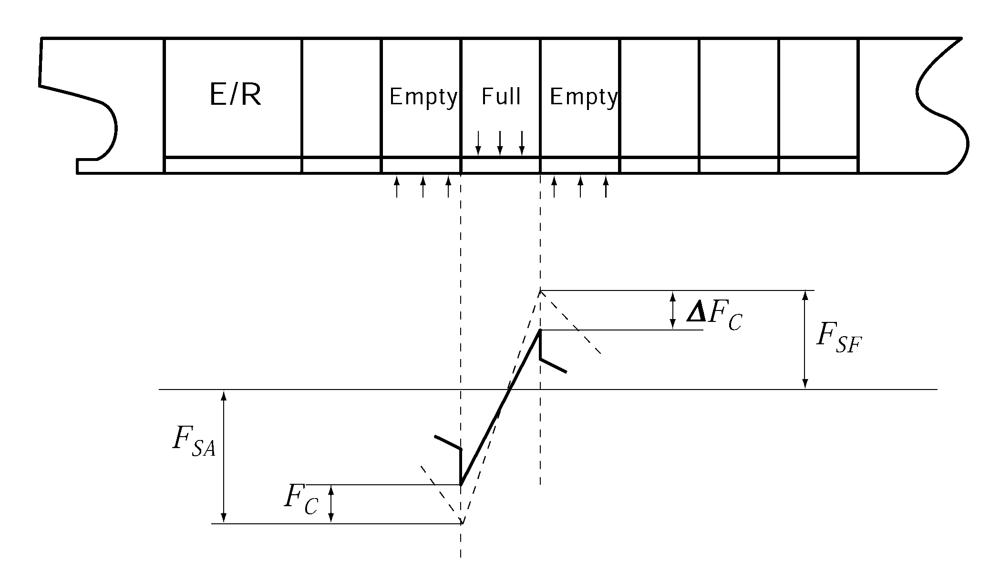
  **Fig 4 Correction of still water shearing force in alternate loading condition**

  **Table 5 Example of calculation sheets for shearing force (**$F _{C}$**) when alternately loaded.**

  |   |   |   | FR. 37 | FR. 70 |   | FR. 102 |   | FR. 125 |   | FR. 158 |   | FR. 181 |   | FR. 205 |
  | --- | --- | --- | --- | --- | --- | --- | --- | --- | --- | --- | --- | --- | --- | --- |
  | ① | $F _{S}$ (kN) |   |   |   |   |   |   |   |   |   |   |   |   |   |
  | Holds |   |   | No. 6 Cargo Hold |   | No. 5 Cargo Hold |   | No. 4 Cargo Hold |   | No. 3 Cargo Hold |   | No. 2 Cargo Hold |   | No. 1 Cargo Hold |   |
  | ② | $F _{SF} -F _{SA}$(kN) |   |   |   |   |   |   |   |   |   |   |   |   |   |
  | Top Side Tank |   |   | No. 4 Top Side Tank |   |   |   | No. 3 Top Side Tank |   |   |   | No. 2 Top Side Tank |   | No. 1 Top Side Tank |   |
  | ③ | Weight of TST (kN) |   |   |   |   |   |   |   |   |   |   |   |   |   |
  | ④ | $C$ (Load ratio) |   | 0.5 |   | 0.5 |   | 0.5 |   | 0.5 |   | 1.0 |   | 1.0 |   |
  | ⑤ | $F _{T}$ (③×④) |   |   |   |   |   |   |   |   |   |   |   |   |   |
  | ⑥ | $F _{SF} -F _{SA} -F _{T}$ (②-⑤) |   |   |   |   |   |   |   |   |   |   |   |   |   |
  | ⑦ | $C$ (coefficient) |   | 0.305 |   | 0.264 |   | 0.264 |   | 0.250 |   | 0.264 |   | 0.302 |   |
  | ⑧ | $\Delta F_C$ (⑥×⑦) |   |   |   |   |   |   |   |   |   |   |   |   |   |
  | ⑨ | $F_CA$ and $F_CF$ |   | $F_CA$ ①+⑧ | $F_CF$ ①-⑧ | $F_CA$ ①+⑧ | $F_CF$ ①-⑧ | $F_CA$ ①+⑧ | $F_CF$ ①-⑧ | $F_CA$ ①+⑧ | $F_CF$ ①-⑧ | $F_CA$ ①+⑧ | $F_CF$ ①-⑧ | $F_CA$ ①+⑧ | $F_CF$ ①-⑧ |
  | ⑨ | $F_CA$ and $F_CF$ |   |   |   |   |   |   |   |   |   |   |   |   |   |
  | ⑩ | Permissible shearing forces (kN) | + | 30,200 | 25,500 |   | 26,300 |   | 27,600 |   | 27,600 |   | 25,200 |   | 29,300 |
  | ⑩ | Permissible shearing forces (kN) | - | -28,100 | -25,200 |   | -25,200 |   | -27,600 |   | -28,700 |   | -28,500 |   | -30,400 |
  - **(A)** Still water shearing force ($F _{S}$) (column ①) (kN)
    Still water shearing force obtained in **5.5** is to be transferred to column ①.
  - **(B)** Load between transverse bulkheads
    ($F _{SF} -F _{SA}$) (column ②) (kN)
    For each hold, still water shearing force ($F _{S}$) at aft end bulkhead of hold is given as $F _{SA}$*,* and shearing force ($F _{S}$) at fore end bulkhead of hold is given as $F _{SF}$, and the difference, $F _{SF} -F _{SA}$ is entered in column ②.
  - **(C)** Ballast weight of topside tank (column ③) (kN)
    Where topside tank is loaded with ballast etc., the weight of the load (tons) is multiplied by **9.8** and the corresponding value (kN) is entered in column ③.
  - **(D)** Ballast weight of topside tank between bulkheads ($F_ T$) (column ⑤) (kN)
    This column represents, for each hold, ballast ($F_ T$) of topside tank supported by transverse bulkheads at fore and aft ends of the holds, and a value derived by multiplying the ballast weight of top side tank by the load ratio C in column ④ is recorded.
  - **(E)** Load acting on double bottoms($F_SA - F_SF -F_T$) (column ⑥) (kN)
    This column represents, for each hold, the load which acts on the double bottoms of the holds, and (value of column ② **―** value of column ⑤) is recorded.
  - **(F)** Shearing force modifier ($\Delta F_c$) (column ⑧) (kN)
    This column represents, for each hold, the shearing force modifier which modifies the shearing force at fore and aft ends bulkhead of the hold, and the value obtained by multiplying the load in column ⑥ by a coefficient $C$ (column ⑦) in accordance with **Ch 3, Table 3.3.6** of the Guidance is recorded.
  - **(G)** Shearing force at fore and aft of transverse bulkhead ($F_CA$ and $F_CF$) (column ⑨) (kN)
    This column represents shearing force at fore side of aft end bulkhead of hold ($F_CA$) or shearing force at aft side of fore end bulkhead of hold ($F_CF$) is given in the following (a) and (b).
    $F_CA = F_SA + \Delta F_c$
    where
    $F_SA$ = shearing force at aft end bulkhead of hold under consideration, whose value is recorded in column ①.
    $\Delta F_c$= shearing force modifier at the hold under consideration whose value is recorded in column ⑧.
    $F_CF = F_SF + \Delta F_c$
    where
    $F_SF$ = shearing force at fore end bulkhead of hold under consideration, whose value is recorded in column ①.
    $\Delta F_c$ = as given in the preceding (a).
    - **(a)** The shearing force at the fore side of aft end bulkhead of hold is to be givens $F_CA$ as follows.
    - **(b)** the shearing force at the aft side of fore end bulkhead of hold is to be given as *FCF* as follows.
  - **(H)** Allowable value of shearing force (kN)
    The allowable values of shearing force are indicated in the column ⑩, and thus the value of shearing force in alternate loading condition (value of column ⑨) is to be in the range between these two allowable values.
    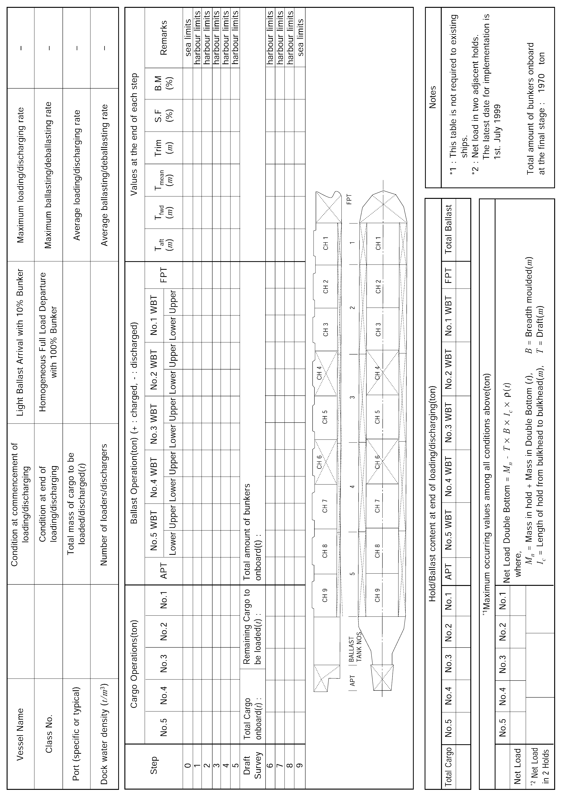
    **Table 6 Form of the guidance for cargo loading/unloading**

### 6. Guidelines for ballast loading conditions of cargo vessels involving partially filled ballast tanks (2022)

#### 6.1 General

- **(1)** **Par 6** is the recommendation of partially filled ballast tanks in ballast loading conditions.
- **(2)** Case A and B are generally applicable for ballast loading conditions for any cargo vessel which might have one Ballast Water (BW) Tank (or one pair of BW Tanks) partially filled.
- **(3)** Case C is showing the conditions necessary for checking longitudinal strength for a conventional ore carrier with two pairs of large wing water ballast tanks partly filled during the ballast voyage.
- **(4)** Where applicable, similar considerations are to be given to other cargo vessels covered by **Ch 3, Sec 1** where ballast loading conditions involving partially filled ballast tanks may cause concerns for the longitudinal strength of the vessels.
- **(5)** In the Figures, the conditions only intended for strength verification (not operational) are marked with a star (*).

#### 6.2 Case A and B

- **(1)** Case A
  **Fig 5** shows Case A, with a cargo vessel where partial filling of BW Tank no. 6 (P/S) is permitted and may take place at any time during the ballast voyage. Intermediate condition(s) should be specified as shown in the Figure, however filling/partial filling of BW Tank no. 6 (P/S) may be done at any step to keep acceptable trim and propeller immersion during the ballast voyage.
  To obtain full operational flexibility regarding the filling level of BW Tank no. 6 (P/S), loading conditions A2 (full at departure)* and A8 (empty at arrival)* shall be added for strength verification. Additional conditions (full and empty BW Tank no. 6 (P/S)) related to the intermediate conditions A3-A6 are not necessary as A2* and A8* will be the most critical one.
- **(2)** Case B
  **Fig 6** shows Case B, with a cargo vessel where partial filling of BW Tank no. 6 (P/S) to a given level (f_6-int%) will be done after a specified % consumables is reached, see conditions B2 and B3. Before this % consumables (shown as 50% in this Figure) is reached, BW Tank no. 6 (P/S) shall be kept empty. When reaching a given level of consumables (shown as 20% in Figure 2), BW Tank no. 6 (P/S) shall be kept full, see conditions B5 and B6. Two additional intermediate conditions (B4* and B7*) shall be added for longitudinal strength verification
  In order to categorize a vessel according to Case B, clear operational guidance for partial filling of ballast tanks, in association with the consumption level as shown in Figure 2, is to be given in the loading manual. If such operational guidance is not given, Case A is to be applied. Case A has no limitation of consumables, whereas Case B has limitation of consumables.

  |  |  Notes (1) For peak tanks intended to be partially filled, all combinations of full or partially filled at intended level for those tanks are to be investigated. (2) The intermediate condition(s) to be specified incl. % consumables. (3) For bulk carriers carrying ore and with large wing water ballast tanks full/empty may be replaced with maximum/minimum filling levels according to trim limitations given in 3. (1) (G). Case A, Partial filling of ballast tank No. 6 (P/S) is permitted at any stage during voyage. The intermediate conditions are specified, however other partial filling of BW Tank No. 6 (P/S) may be applied to keep acceptable trim and propeller immersion during the ballast voyage. Conditions only intended for strength verification (not operational) are marked: * |
  | --- | --- |

  |  |  Notes (1) For peak tanks intended to be partially filled, all combinations of full or partially filled at intended level for those tanks are to be investigated. (2) The intermediate condition(s) to be specified incl. % consumables. (3) For bulk carriers carrying ore and with large wing water ballast tanks full/empty may be replaced with maximum/minimum filling levels according to trim limitations given in 3 (1) (G). Case B, Partial filling of BW Tank No. 6 (P/S) only allowed during intermediate conditions, in this example between 50 - 20 % consumables. Conditions only intended for strength verification (not operational) are marked: * |
  | --- | --- |

#### 6.3 Case C – Conventional (with usual arrangement of WBT) ore carrier with two pairs of partially filled ballast water tanks

- **(1)** **Fig 7(a)** show the operational loading conditions, departure condition (C1), four intermediate conditions (C2-C5) and arrival condition (C6), for a conventional (with usual arrangement of WBT) ore carrier with partial filling of both BW tank no.1 (P/S) and 7 (P/S) during voyage.

  | Loading cond. | Consumables | Filling level, WBT 1 (P/S) | Filling level, WBT 7 (P/S) |
  | --- | --- | --- | --- |
  | C1 - Departure | 100 % | f_1dep% | f_7dep% |
  | C2 – Intermediate 1 | 50 % ^(i) | f_1dep% | f_7dep% |
  | C3 – Intermediate 2 | 50 % ^(i) | f_1int% | f_7int% |
  | C4 – Intermediate 3 | 20 % ^(i) | f_1int% | f_7int% |
  | C5 – Intermediate 4 | 20 % ^(i) | f_1arr% | f_7arr% |
  | C6 - Arrival | 10 % | f_1arr% | f_7arr% |
  | Note: ^(i) % consumables to be specified, indicated to 50% and 20 % |   |   |   |
- **(2)** **Fig 7(b)** shows the additional twelve loading conditions (C1-1 ~ C1-12) which shall be added for longitudinal strength verification of the departure condition (C1).
- **(3)** **Fig 7(c), (d), (e)** and **(f)** show the additional 32 loading conditions (C2-1 ~ C2-12, C3-1 ~ C3-4, C4-1 ~ C4-12 and C5-1 ~ C5-4) which shall be added for longitudinal strength verification of the intermediate conditions (C2 ~ C5).
- **(4)** **Fig 7(g)** shows the additional twelve loading conditions (C6-1 ~ C6-12) which shall be added for longitudinal strength verification of the arrival condition (C6).
- **(5)** For the additional loading conditions, the maximum and the minimum filling level of BW tank are according to trim and propeller immersion limitations given in 3 (1) (G):
- **(6)** However, for conventional ore carriers with large wing water ballast tanks in cargo area, where empty or full ballast water filling levels of one or maximum two pairs of these tanks lead to the ship’s trim exceeding one of the following conditions, it is sufficient to demonstrate compliance with maximum, minimum and intended partial filling levels of these one or maximum two pairs of ballast tanks such that the ship’s condition does not exceed any of these trim limits. Filling levels of all other wing ballast tanks are to be considered between empty and full. The trim conditions mentioned above are:
  I = the distance from propeller centerline to the waterline
  D = propeller diameter
  (see **Fig 1**)

  | 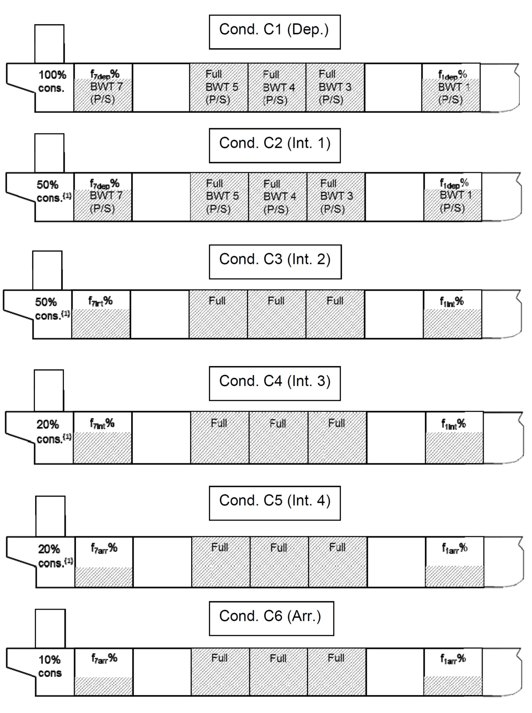 | Note: (1) The intermediate condition(s) to be specified incl. % consumables. |
  | --- | --- |

  | 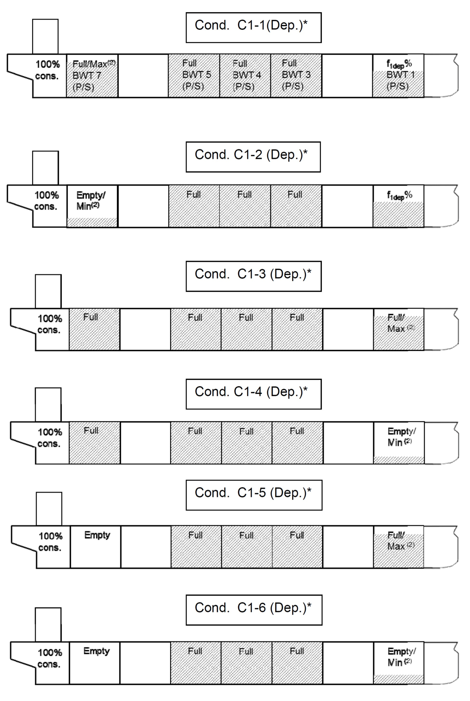 | 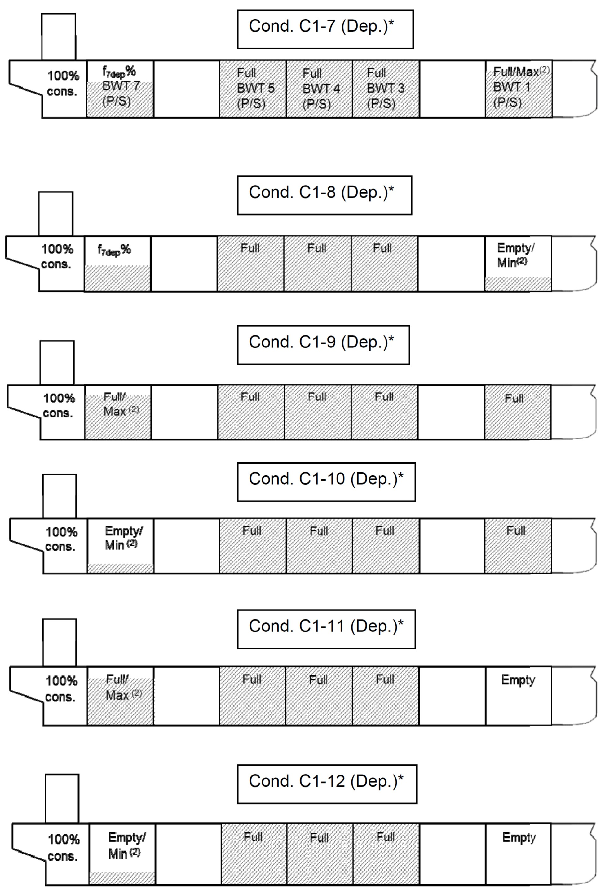 |
  | --- | --- |
  | Note: (1) The intermediate condition(s) to be specified incl. % consumables. (2) Maximum and minimum filling level of BW tank according to trim and propeller immersion limitations given in 3. (1) (G). Departure conditions C1-1 ~ C1-12, only intended for strength verification (not operational) are marked: * |   |

  | 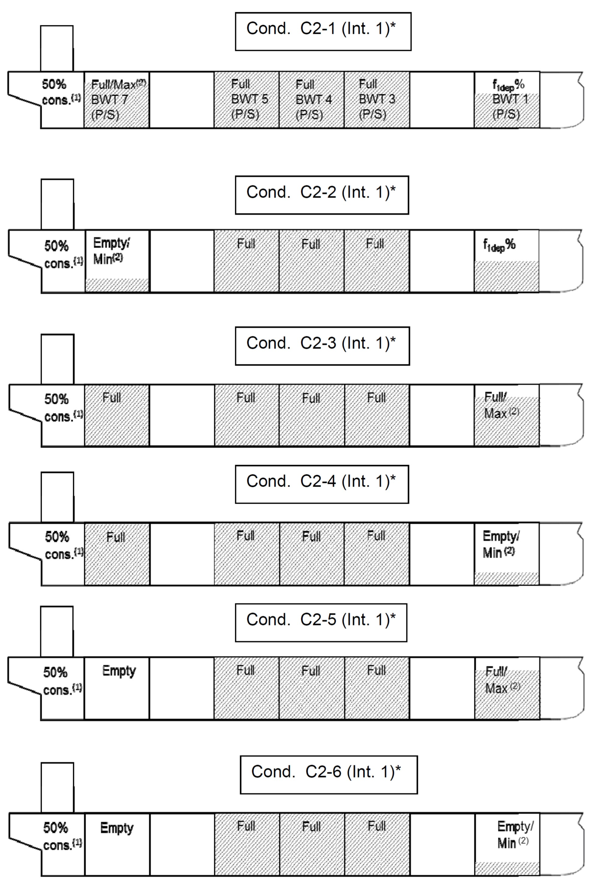 |  |
  | --- | --- |
  | Note: (1) The intermediate condition(s) to be specified incl. % consumables. (2) Maximum and minimum filling level of BW tank according to trim and propeller immersion limitations given in 3. (1) (G). Departure conditions C2-1 ~ C2-12, only intended for strength verification (not operational) are marked: * |   |

  | 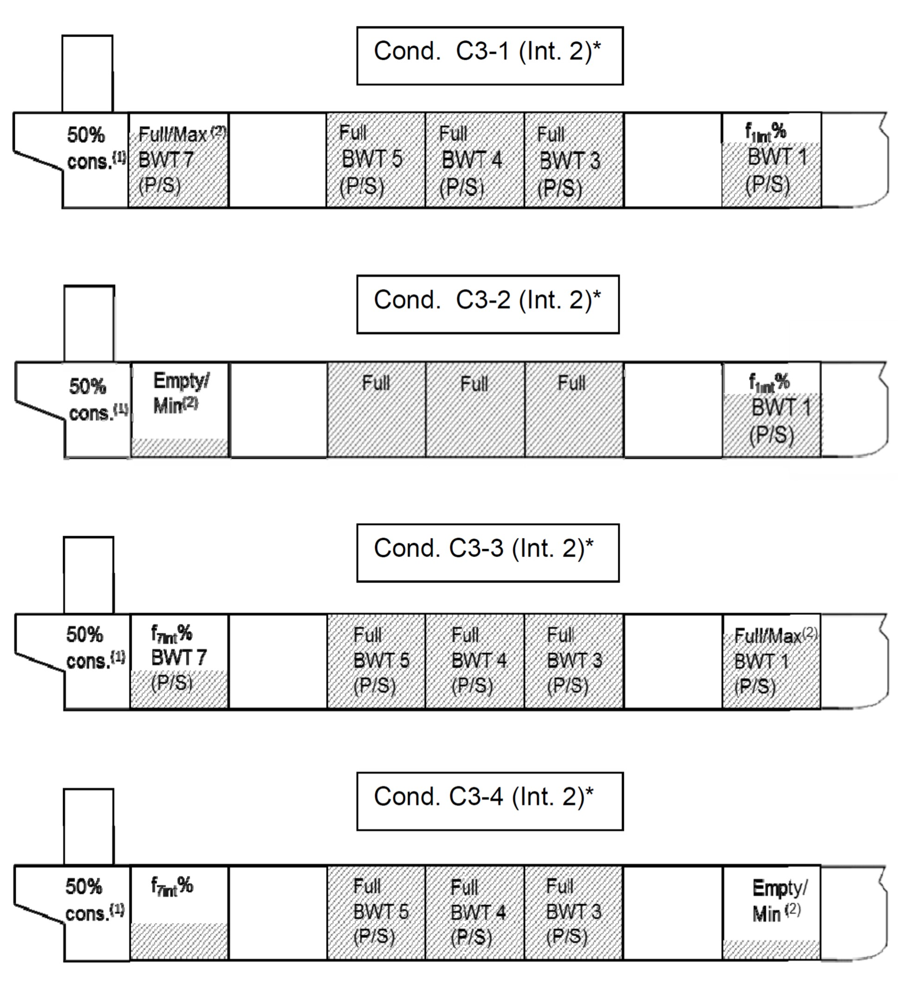 | Note: (1) The intermediate condition(s) to be specified incl. % consumables. (2) Maximum and minimum filling level of BW tank according to trim and propeller immersion limitations given in 3. (1) (G). Departure conditions C3-1 ~ C3-4, only intended for strength verification (not operational) are marked: * |
  | --- | --- |

  |  | 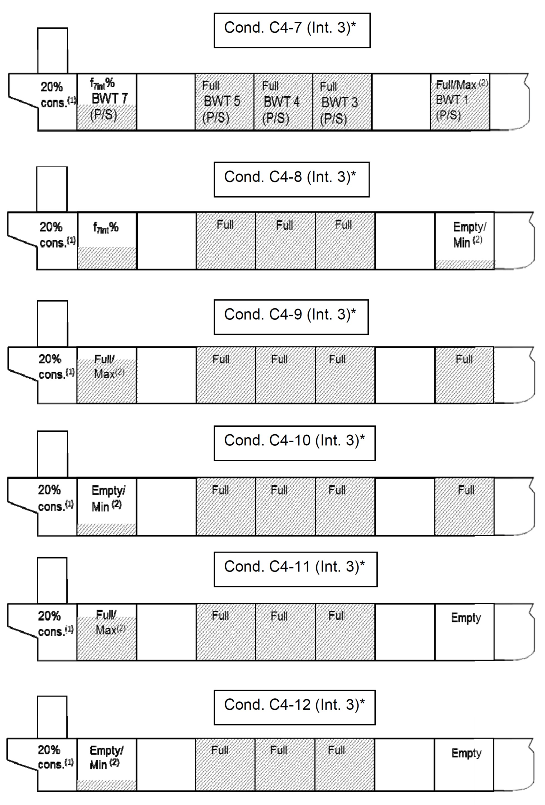 |
  | --- | --- |
  | Note: (1) The intermediate condition(s) to be specified incl. % consumables. (2) Maximum and minimum filling level of BW tank according to trim and propeller immersion limitations given in 3. (1) (G). Departure conditions C4-1 ~ C4-12, only intended for strength verification (not operational) are marked: * |   |

  |  | Note: (1) The intermediate condition(s) to be specified incl. % consumables. (2) Maximum and minimum filling level of BW tank according to trim and propeller immersion limitations given in 3 (1) (G). Departure conditions C5-1 ~ C5-4, only intended for strength verification (not operational) are marked: * |
  | --- | --- |

  | 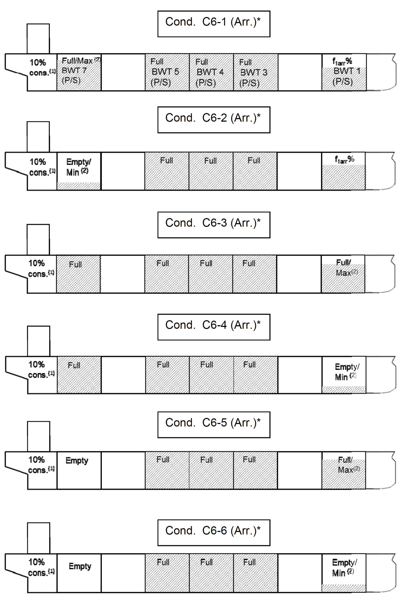 | 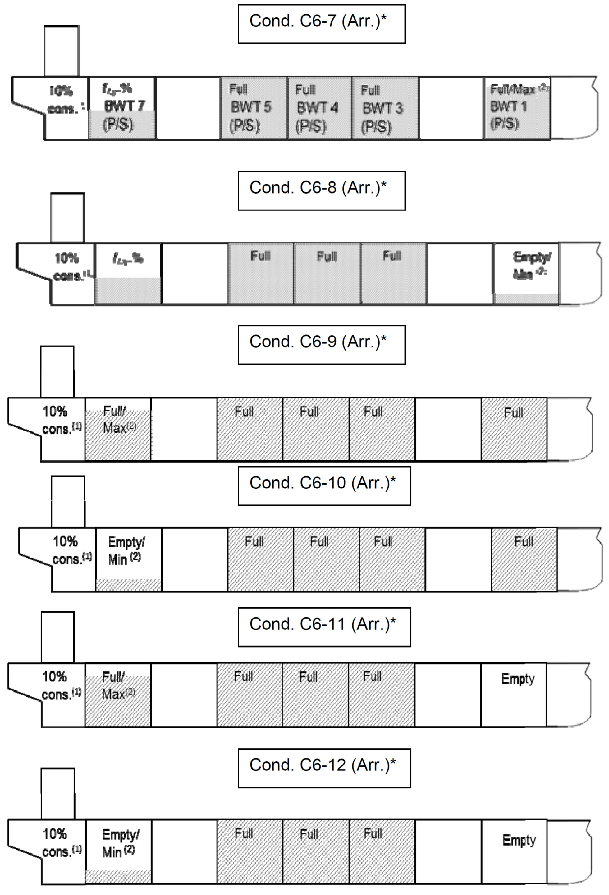 |
  | --- | --- |
  | Note: (1) The intermediate condition(s) to be specified incl. % consumables. (2) Maximum and minimum filling level of BW tank according to trim and propeller immersion limitations given in 3 (1) (G). Departure conditions C6-1 ~ C6-12, only intended for strength verification (not operational) are marked: * |   |
