# PART 3 Hull Structures

> RULES FOR CLASSIFICATION OF STEEL SHIPS / RA-03-E / 2025 / EN / Guidance

## Annex 3-3 Guidance for the Fatigue Strength Assessment of Ship Structures

### 1. General (2020)

#### (1) This Annex is the Guidance which assesses the fatigue strength of a ship structure. This guidance provides a guideline for a simplified fatigue analysis method, fatigue analysis method by hold analysis and fatigue analysis method by global analysis (See Fig 1)

#### (2) The ships, which are to be complied with Rule Pt 13 and Pt 14, are to meet all the requirements of the corresponding parts. For other ships deemed necessary by the Society in consideration of the ship's kind, size and configuration, the requirements in this Annex are to be applied.

#### (3) For ships which were checked based on the above fatigue analysis method, following class notation is assigned from (A) to (C), including information about evaluated sea area.

NA - North Atlantic
WW - Worldwide

- **(A)** The method of simplified fatigue analysis : **SeaTrust(FSA1[NA(or WW)])**
- **(B)** The method of fatigue analysis by hold analysis : **SeaTrust(FSA2[NA(or WW)])**
- **(C)** The method of fatigue analysis by global analysis : **SeaTrust(FSA3[NA(or WW)])**
  However, in case that **SeaTrust(FSA2)** or **SeaTrust(FSA3)** is assigned to ships , **SeaTrust(FSA1)** is to be performed.

#### (4) Upon the request of the applicant, the design fatigue life which is exceeding 25 years for ships complied with to Pt 13 and Pt 14 or exceeding 20 years for other ships can be reviewed additionally. In this case, [XX years] is added to the class notation in (3) above (e.g. SeaTrust(FSA1[WW, 30 years])).

#### (5) In case of special purpose ships, new type of ships or ships requiring more precise fatigue strength assessment, fatigue analysis method by global analysis is to be applied to assess the fatigue strength. A spectral fatigue analysis method or a transfer function method may apply to fatigue analysis by global analysis.

#### (6) Other equivalent methods may be applied to assess the fatigue strength when deemed appropriate by the Society.

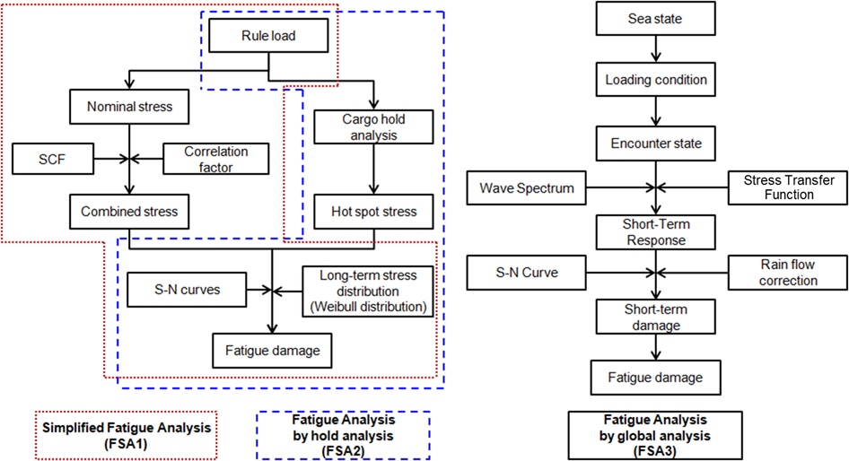
**Fig 1 Fatigue analysis method**

### 2. Definition of stress

In the fatigue analysis, three kinds of stresses; i. e. the nominal stress, the hot spot stress and notch stress can be used. The hot spot stress approach and edge stress approach are to be employed in this Guidance.

#### (1) Nominal stress

The Nominal stress is global stress calculated in a sectional area, disregarding the local stress-raising effects of the structural discontinuities, weld bead shape, etc.

#### (2) Hot spot stress

- **(A)** The hot spot stress includes all stress-raising effects by a structural discontinuity. It does not include the stress peak effect caused by the local notch and the weld bead shape. The hot spot stress in plate structure is divided into the membrane stress and the bending stress. It is linearly distributed in thicknesswise. In general, hot spot stress is greater than the nominal stress, but hot spot stress is equal to nominal stress at the position far enough from the discontinuity of structures.
- **(B)** For the calculation of the hot spot stress, multiplying nominal stress by stress concentration factor or the three dimensional finite element analysis is to be performed. Then, it can be determined by extrapolating maximum principal stresses outside the region affected by the weld geometry. The stress range near welding toe is to be used consistently depending on the effect by type and size of the finite element.

#### (3) Notch stress

Hot spot region is the location where occurs a fatigue crack as the welding toe. The total stress at the location is defined as the notch stress.

#### (4) Edge stress

Edge stress on plate members includes the nominal stress of the plates and stress-raising effects on the edge of plates. It is calculated by using the finite element method.

### 3. Fatigue life assessment

#### (1) Hot spot stress approach

It is not easy to calculate the nominal stresses nor to select the corresponding S-N curves for complex ship structure. Therefore, for the fatigue strength assessment of a ship structure, the hot spot stress by geometrical discontinuity of the structure is to be calculated using the finite element method or the stress concentration factors. The S-N curve which is not including the stress concentration effect is to be applied the hot spot stress approach. In this case, only the structural geometry effects are accounted for, while local notch effects like the weld geometry are considered to be implicitly included in the S-N curve.

#### (2) Design S-N curve

- **(A)** In order to assess the fatigue strength of ship structure, S-N curves as shown in **Fig 2** are to be used where D curve is to be used for welded structures, C curve for the edge of plate and B curve for the grounded edge of plate.
- **(B)** In case of welded area, if the calculated fatigue life is not to be less than L/1.47(L:Design Life) excluding the grinding effects, whichever is greater, an improvement in fatigue life up to the design fatigue life will be granted considering the grinding effect for weld toe. (Welded area is the area of transverse butt weld, T and cruciform weld, and longitudinal attachment weld excluding longitudinal end connections). This benefit can only be achieved in a corrosion free condition and may only be considered provided that a suitable protective coating is applied after the post-weld treatment and maintained during the design lifetime.
  Where grinding is applied, full details of the grinding standard including the extent, smoothness particulars, final weld profile, and grinding workmanship and quality acceptance criteria are to be clearly shown on the applicable drawings. Grinding is preferably to be carried out by rotary burr and to extend below the plate surface in order to remove toe defects and the ground area is to have effective corrosion protection.
  The treatment is to produce a smooth concave profile at the weld toe with the depth of the depression penetrating into the plate surface to at least 0.5 mm below the bottom of any visible undercut. The depth of groove produced is to be kept to a minimum, and, in general, kept to a maximum of 1 mm. In no circumstances is the grinding depth to exceed 2 mm or 7 % of the plate gross thickness, whichever is smaller. Grinding has to extend to areas well outside the highest stress region.
- **(C)** The design S-N curves are defined as the mean(the curves of (A) above) minus two standard deviations and thus correspond to survival probability of 97.6 %. The slopes of these curves are changed beyond $N=10 ^{7}$ cycles considering Haibach effect. (see **Fig 2**) *(2020)*
  $\log N=\log K _{2} -m \log \Delta \sigma$
  $\log K _{2} =\log K _{1} -2\log \delta$
  where,
  $K _{1}$ : Constant related to mean S-N curve, as given in **Table 1**.
  $K _{2}$ : Constant related to design S-N curve, as given in **Table 1**.
  $\delta$ : Standard deviation of log (N), as given in **Table 1**.
  $\Delta \sigma$ : Stress range at $N=10 ^{7}$ cycles related to design S-N curve, in N/mm^2, as given in **Table 1**.

  | Class | $K _{1}$ |   | $m$ | Standard deviaton, $\delta$ | $K _{2}$ | Design stress range (N/mm^2) |   |
  | --- | --- | --- | --- | --- | --- | --- | --- |
  | Class | $K _{1}$ | $\log _{10} K _{1}$ | $m$ | $\log _{10} \delta$ | $K _{2}$ | $\Delta \sigma$, 10^7 cycles | 2×10^6 cycles |
  | B | 2.343E15 | 15.3697 | 4.0 | 0.1821 | 1.013E15 | 100.2 | 149.9 |
  | C | 1.082E14 | 14.0342 | 3.5 | 0.2041 | 4.227E13 | 78.2 | 123.9 |
  | D | 3.988E12 | 12.6007 | 3.0 | 0.2095 | 1.519E12 | 53.4 | 91.3 |

  | Curve | $K _{2}$ | $m$ | Design stress range at 2×10^6 cycles, N/mm^2 |
  | --- | --- | --- | --- |
  | B | 5.05E14 | 4.0 | 126.1 |
  | C | 2.12E13 | 3.5 | 101.6 |
  | D | 7.60E11 | 3.0 | 72.4 |

  |  **(a) In-air environment** **(a) In-air environment** |
  | --- |
  | 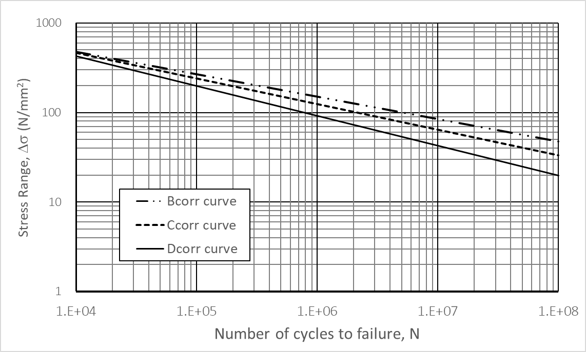 (b) Corrosive environment (b) Corrosive environment |

#### (3) Corrosion effect (2020)

For unprotected joints exposed to sea water, the design S-N curve is to be modified with half life time of S-N curve in air. However, no slope change is incorporated in the S-N curve at $10 ^{7}$ cycles:
$\log N = \log K _{2} -m \log \Delta \sigma$
where,
$N$ : Predicted number of cycles to failure under stress range $\Delta \sigma$.
$K _{2}$ : Constant related to design S-N curve as given in **Table 1** (b).
However, in case that the hull structure members in ballast tanks are protected against the corrosion by effective means, the design S-N curve in air is to be applied for the first half of the design life and the free-corrosion S-N curve for the remainder of the design life. In calculation, the stresses are determined with as-built scantlings.

#### (4) Mean stress effect

- **(A)** Since most fatigue tests are conducted under pulsating tension loading, the effect of mean tensile stresses, which tend to reduce the fatigue life, is accounted for in the S-N curves. The beneficial effect of compressive stresses may be considered when these S-N curves are used for the fatigue strength assessment.
- **(B)** The correction of stress range with the consideration of mean stress effect is to follow **Annex C 1.4.5.11.** of Rule **Pt 12**.

#### (5) Thickness effect

- **(A)** The fatigue performance of a structural detail depends on member thickness. For the same stress range the joint's fatigue resistance may decrease as the member thickness increases. This effect (also called the ‘scale effect’) is caused by the local geometry of the weld toe in relation to the thickness of the adjoining plates and the stress gradient over the thickness. The basic design S-N curves are applicable to thicknesses that do not exceed the reference thickness of 22 mm.
- **(B)** The correction of stress range with the consideration of thickness effect is to follow **Annex C 1.4.5.11.** of Rule **Pt 12**.

#### (6) Material effect (2020)

For base material free edge, the fatigue stress range can be corrected to consider base material strength in accordance with **Pt 13**, **Ch 9**, **Sec 3**, **3.1.3**.

#### (7) Calculation of fatigue life

According to the Miner-Palmgren linear cumulative damage rule, the fatigue damage ratio $D$ is calculated. The fatigue life is given by $L/D$ (years) where $L$ is design life (years).

### 4. Simplified fatigue analysis

The simplified fatigue analysis based on stress concentration factor is to be used to evaluate the fatigue strength of the longitudinal stiffener end connection. The hull girder bending load and the local load are taken into account in this analysis. The former accounts for the vertical wave bending moment and the horizontal wave bending moment, and the latter for the wave load. In this guidance, the loads are determined at the probability level of exceedance $10 ^{{-4}}$.

#### (1) Fatigue design load

- **(A)** Hull girder bending load
  - **(a)** Vertical wave induced bending moment
    The vertical wave induced bending moments are obtained from the following formulae.
    $M _{w} (+)= 0.19fC _{1} C _{2} L ^{2} B C _{b}$(kN-m)
    $M _{w} (-)=-0.11fC _{1} C _{2} L ^{2} B(C _{b} +0.7)$(kN-m)
    where,
    $f$ = factor to transform the load from $10 ^{-8}$ to $10 ^{{-4}}$ probability level, and to be calculated as follows.
    $f=0.5 ^{1/ \xi }$
    $\xi$ = Weibull shape parameter as specified in (4) (B).
    $C _{b}$ = the block coefficient. However, it is to be taken as 0.6, where it is less than 0.6.
    $C _{1}$ = wave coefficient as specified in **Ch 3, 201. Table 3.3.1** of the Rules
    $C _{2}$ = distribution factor as presented respectively in **Ch 3, 201. Tables 3.3.1** of the Rules.
  - **(b)** Horizontal wave induced bending moment
    The horizontal wave bending moment is obtained from the following formula:
    $M _{H} =0.18fC _{1} C _{H} L ^{2} d(C _{b} +0.7)$(kN-m)
    where,
    $f$ = factor as specified in (a)
    $C _{1}$ and $C _{b}$ = as specified in (a)
    $C _{H}$ = as specified in **Pt 7, Ch 4, 205.** of the Guidance
- **(B)** Local wave load
  - **(a)** Local wave pressure
    The wave pressure on the ship's side is to be taken as follows:
  - **(i)** For the load point on and above the waterline:
    $p _{T} = p _{T} ^{f} K _{1} \left( 1 - \frac{h}{a _{w}} \right)$(kN/m^2)
    $p _{T} = p _{T} ^{f} K _{1} \left( 1 - \frac{K _{2} h}{d} \right)$(kN/m^2)
    where,
    $p _{T} ^{f} =0.095L+34.0$(kN/m^2)
    $K _{1}$ = Coefficient as specified in the following formulae
    for 0.4$L$ amidships = 1.0
    afterward of AP = 1.5
    forward of FP = $\frac{5.5 (0.85 - C _{b} )}{1-C _{b} ^{2}} +2.0$
    For intermediate longitudinal positions, $K _{1}$ is to be obtained by interpolation.
    $K _{2}$ = Coefficient as specified in the following formulae
    for 0.4$L$ amidships = 0.5
    at the ends of ship = 1.0
    For intermediate longitudinal positions, $K _{2}$ is to be obtained by interpolation.
    $a _{w}$ = as specified in (b)
    $h$ = vertical distance from the waterline to the load point
    $C _{b}$ = block coefficient. Where, however, when $C _{b}$ exceeds 0.85, $C _{b}$ is to be taken as 0.85.
    - **(ii)** For the load point below the waterline:
  - **(b)** Local wave pressure range
    The local wave pressure range $P _{d}$ is to be calculated as follows. (See **Fig 3**)
    
    **Fig 3 Local wave pressure range** #eqnID-2351
  - **(i)** For the load point on and above the waterline:
    $p _{d } = p _{T} ^{f} K _{1} \left( 1 - \frac{h}{a _{w}} \right)$(kN/m^2)
    $p _{d } = 10 h + p _{T} ^{f} K _{1} \left( 1 - \frac{K _{2} h}{d} \right)$(kN/m^2)
    $p _{d } = 2 p _{T} ^{f} K _{1} \left( 1 - \frac{K _{2} h}{d} \right)$(kN/m^2)
    $a _{w}$ : the vertical distance from the waterline to the point of the maximum pressure range, $p _{d,\max}$, given as:
    $a _{w } = \frac{1}{\frac{1}{2d} + \frac{10}{p _{T} ^{f}}}$
    - **(ii)** For the load point between the waterline and $p _{d,\max}$ :
    - **(iii)** For the load point on and below $p _{d,\max}$ :
- **(C)** Internal pressure loads due to ship motion
  - **(a)** Dynamic internal pressure loads
    The dynamic internal pressure, $p _{i}$ in kN/m^2, from liquid cargo or ballast water is not to be less than that obtained from the following formulas, which is the greater:
    $p _{i} = 2f \rho _{c} a _{v} h _{s }$(kN/m^2)
    $p _{i} = 2f \rho _{c} a _{t} |y _{s} |$(kN/m^2)
    $f$ = as specified in (A) (a) above
    $\rho _{c}$ = density of liquid cargo and density of sea water, 1.025$ton/m ^{3}$
    $h _{s}$ = vertical distance from point considered to surface inside tank (m)
    $y _{s}$ = horizontal distance from center of free surface of liquid in tank to point considered (m)
    $a _{v}$ or $a _{t}$ = accelerations in vertical or horizontal direction as specified in (b) (ⅵ)
  - **(b)** Accelerations due to ship motion
  - **(i)** Acceleration due to heave motion
    The acceleration due to heave motion of a ship is given by the following formula.
    $a _{z} = \frac{V ^{1.2}}{2 \sqrt {L}} + \frac{361}{L} + 0.49$(m/sec^2)
    $V$ : ship design speed (knots)
    The acceleration due to sway motion of a ship is given by the following formula.
    $a _{y} = \frac{178}{L} + 0.36$(m/sec^2)
    The acceleration due to pitch motion is given by the following formula.
    $a _{\theta } = \theta \times \left( \frac{2 \pi}{T _{\theta }} \right) ^{2} \times l _{\theta }$(m/sec^2)
    $\theta$ = maximum pitch angle (single amplitude) given by the following formula
    $\theta = \frac{19.62}{L} +0.022$(rad)
    $T _{\theta }$ = period of pitch given by the following formula
    $T _{\theta } = 1.86 \sqrt {\frac{L}{g}}$ (sec)
    $l _{\theta }$ = distance from axis of rotation for pitching to center of tank/mass (m), and the axis of rotation may be taken as the smaller of $(D/4+d/2)$ and $D/2$ above the base line at 0.45$L$ from A.P.
    The acceleration due to roll motion is given by the following formula.
    $a _{\phi } = \phi \times \left( \frac{2 \pi}{T _{\phi }} \right) ^{2} \times l _{\phi }$(m/sec^2)
    $\phi$ = maximum roll angle (single amplitude) given by the following formula
    $\phi = kC _{s} f _{0} \sqrt {0.131 - 0.005T _{\phi }}$(rad)
    $k$ = 1.0 for ships without bilge keel
    = 0.8 for ships with bilge keel (including ships with anti-rolling tank)
    $C _{s}$ = 0.82 for bulk carriers and tankers
    = 0.96 in generals
    $f _{0}$ = values obtained from the following formula.
    $f _{0} = 0.86+2.72C _{b} -(B/d) \times (0.11+0.34C _{b} )$
    Where$C _{b}$ is under 0.45, $C _{b}$ is to be taken as 0.45, and where $C _{b}$ is 0.7 and over, $C _{b}$ is to be taken as 0.7. And where $B/d$ is under 2.4, $B/d$ is to be taken as 2.4, and where $B/d$ is 3.5 and over, $B/d$ is to be taken as 3.5.
    $T _{\phi }$ = period of roll given by the following formula.
    $T _{\phi } = \frac{4C _{f} B}{\sqrt {GM _{T}}}$ (sec)
    Where $T _{\phi }$ is under 6.0, $T _{\phi }$ is to be taken as 6.0, and where $T _{\phi }$ is 20.0 and over, $T _{\phi }$ is to be taken as 20.0.
    $C _{f}$ = values obtained from the following formula.
    $C _{f} =0.373-0.023 \left( B/d \right) -0.043(L/100)$
    Where$B/d$ is under 2.4, $B/d$ is to be taken as 2.4, and where $B/d$ is 3.5 and over, $B/d$ is to be taken as 3.5.
    $GM _{T}$ = metacentric height (m). Where, however, the values of the $GM _{T}$ have not been calculated for relevant loading condition, the following approximate values may be used:
    $0.07B$ in general
    $0.12B$ for single skin tankers, bulk carriers and fully loaded double hull tankers
    $0.25B$ for bulk carriers in the ballast condition
    $0.33B$ for double hull tankers in the ballast condition
    $l_\phi$ = distance from axis of rotation for rolling to center of tank/mass (m), and the axis of rotation may be taken as the smaller of $\left( D/4 + d/2 \right)$ and $D/2$ above the base line at 0.45$L$ from A.P.
    - **(ii)** Accelerations due to sway motion
    - **(iii)** Accelerations due to pitch motion
    - **(iv)** Accelerations due to roll motion
  - **(v)** Accelerations due to yawing
    The acceleration due to yawing is given by the following formula.
    $a _{\psi } = \left( \frac{6.95}{L} -0.017 \right) l _{\psi }$(m/sec^2)
    $l _{\psi }$ = distance from axis of rotation for yawing to center of tank/mass (m), and the axis of rotation may be taken as stipulated in (ⅲ).
    ① Combined vertical acceleration
    $a _{v} = \sqrt {a _{z} ^{2} +a _{\phi z} ^{2} +a _{\theta z} ^{2}}$(m/sec^2)
    $a _{z}$ = as specified in (ⅰ)
    $a _{\phi z}$ = vertical component of roll acceleration given by the following formula
    $a _{\phi z} = \phi \left( \frac{2 \pi}{T _{\phi }} \right) ^{2} l _{\phi y}$(m/sec^2)
    $\phi$ and $T _{\phi }$ = as specified in (ⅳ)
    $l _{\phi y}$ = transverse distance from axis of rotation for rolling to center of tank/mass (m), and the axis of rotation may be taken as stipulated in (ⅲ).
    $a _{\theta z}$ = vertical component of pitch acceleration given by the following formula
    $a _{\theta z} = \theta \left( \frac{2 \pi}{T _{\theta }} \right) ^{2} l _{\theta x}$(m/sec^2)
    $\theta$ and $T _{\theta }$ = as specified in (ⅲ)
    $l _{\theta x}$ = longitudinal distance from axis of rotation for pitching to center of tank/mass (m), and the axis of rotation may be taken as stipulated in (ⅲ).
    ② Combined horizontal acceleration
    $a _{t} = \sqrt {a _{y} ^{2} +a _{\phi y} ^{2} +a _{\psi y} ^{2}}$(m/sec^2)
    $a _{y}$ = as specified in (ⅱ)
    $a _{\phi y}$ = horizontal component of roll acceleration given by the following formula
    $a _{\phi y} = \phi \left( \frac{2 \pi}{T _{\phi }} \right) ^{2} l _{\phi z}$(m/sec^2)
    $\phi$ and $T _{\phi }$ = as specified in (ⅳ)
    $l _{\phi z}$ = vertical distance from axis of rotation for rolling to center of tank/mass (m), and the axis of rotation may be taken as stipulated in (ⅲ).
    $a _{\psi y}$ = horizontal component of yaw acceleration given by the following formula
    $a _{\psi y} = \left( \frac{6.95}{L} -0.017 \right) l _{\psi x}$(m/sec^2)
    $l _{\psi x}$ = longitudinal distance from axis of rotation for yawing to center of tank/mass (m), and the axis of rotation may be taken as stipulated in (iii).
    - **(vi)** Combined accelerations

#### (2) Nominal stress calculation

- **(A)** Nominal stress due to axial load
  - **(a)** The wave induced vertical hull girder bending stress range for the structural member is to be calculated as follows:
  - **(i)** For the structural member above the neutral axis:
    $\Delta \sigma _{nom,V } = \frac{M _{w} (+) - M _{w} (-)}{Z _{D}} \frac{z - z _{NA}}{D - z _{NA}} \times 10 ^{3}$(N/mm^2)
    $\Delta \sigma _{nom,V } = \frac{M _{w} (+) - M _{w} (-)}{Z _{B}} \frac{z _{NA } - z}{z _{NA}} \times 10 ^{3}$(N/mm^2)
    where,
    $Z _{D}$ = the section moduli at the strength deck about the horizontal neutral axis (cm^3)
    $Z _{B}$ = the section moduli at the bottom about the horizontal neutral axis (cm^3)
    $z$ = the vertical distances from the bottom to the structural member under consideration (m)
    $z _{NA}$ = the vertical distances from the bottom to the horizontal neutral axis (m)
    - **(ii)** For the structural member below the neutral axis:
  - **(b)** The wave induced horizontal hull girder bending stress range for the structural member is calculated as follows:
    $\Delta \sigma _{nom,H } = \frac{2 M _{H}}{Z _{H}} \frac{y}{B/2} \times 10 ^{3}$(N/mm^2)
    where,
    $Z _{H}$ = the section modulus at the ship's side about the ship's centerline (cm^3)
    $y$ = the horizontal distance from the ship's centerline to the structural member under consideration (m)
  - **(c)** Hull girder wave bending stress range
    The hull girder wave bending stress range is not to be less than that obtained from the following formula, whichever is the greater:
    $\Delta \sigma _{nom,g } = 0.5 \Delta \sigma _{nom,V } + \Delta \sigma _{nom,H}$(N/mm^2)
    $\Delta \sigma _{nom,g } = \Delta \sigma _{nom,V}$(N/mm^2)
- **(B)** Nominal stress due to lateral load
  Nominal stress on the flange of a longitudinal, at the connection with a transverse web, can be analyzed by using a uniformly loaded beam with both ends fixed in consideration of the effective breadth of the shell plating. In addition, nominal stress is to account for the increased stress due to the asymmetrical section of the longitudinal. Then, the nominal stress on the flange of the longitudinal is defined as
  $\Delta \sigma _{nom,l} = \sqrt {\Delta \sigma _{e} ^{2 } + \Delta \sigma _{i} ^{2 } + 2 \rho _{c} \Delta \sigma _{e} \Delta \sigma _{i}}$
  $\rho_c$ = the correlation factor between the wave load and internal load, being taken as$\rho_c =-0.6$
  $\Delta \sigma _{e}$ = nominal stress due to external sea pressure load is determined according to the following formula.
  $\Delta \sigma _{e} = (1 + C _{t} ) \frac{p _{d} S l ^{2}}{12 Z _{f}} \times 10 ^{3}$ (N/mm^2)
  $\Delta \sigma _{i}$ = nominal stress due to liquid cargo or ballast water is determined according to the following formula.
  $\Delta \sigma _{i} = (1 + C _{t} ) \frac{p _{i} S l ^{2}}{12 Z _{f}} \times 10 ^{3}$(N/mm^2)
  $p _{d}$ = wave pressure (N/mm^2) as specified in (1) (B) (b).
  $p _{i}$ = internal pressure load (kN/m^2) due to liquid cargo or ballast water as specified in (1) (C) (a).
  $S$ = spacing of longitudinal (m)
  $l$ = spacing of transverse web (m)
  $Z _{f}$ = section modulus of longitudinal (cm^3)
  $C _{t}$ = the stress increasing factor due to the asymmetrical section of a longitudinal is to be calculated as follows:
  $C _{t} =1.68 (0.38 + A _{f} /A _{w} )(e ^{2 } + 0.28e)$
  $e = \frac{b}{b _{f}}$
  $A _{f}$ = flange area (cm^2)
  $A _{w}$ = web area (cm^2)
  $b$ = distance from the flange center to the web center (cm) (See **Fig 4**)
  $b _{f}$ = breadth of the flange (cm) (See **Fig 4**)
  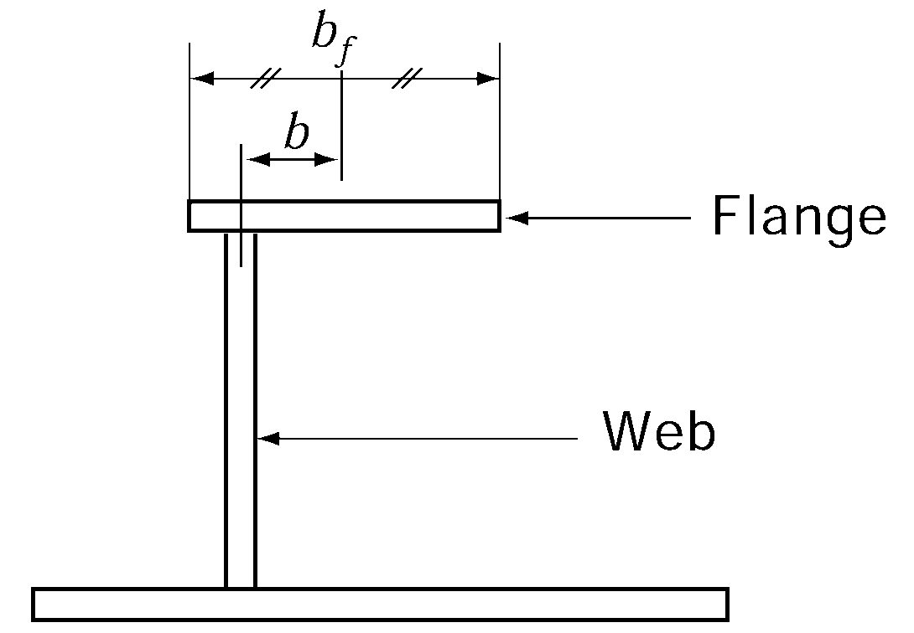
  **Fig 4** #eqnID-2473 **and** #eqnID-2474
- **(C)** Nominal stress due to relative deflection
  - **(a)** At the connection of a longitudinal to a transverse bulkhead, the additional bending stress, due to the relative deflection between the transverse bulkhead and the adjacent transverse web, is to be considered and defined as
    $\Delta \sigma _{nom,r } = \frac{6E I \delta}{Z _{f} l ^{2}} \times 10 ^{-5}$(N/mm^2)
    where,
    $\delta$ = relative deflection between transverse bulkhead and transverse web (m)
    $I$ = moment of inertia of longitudinal (cm^4)
    $E$ = elastic modulus, $2.06 \times 10 ^{5}$(N/mm^2) for steel.
    $Z _{f}$ = section modulus of longitudinal (cm^3)
    $l$ = spacing of transverse web (m)
    The relative deflection between the transverse bulkhead and the transverse web can be determined by the three dimensional hold analysis. However, when the relative deflection is not known, the nominal stress due to the relative deflection is assumed to be 50% of the nominal stress due to the lateral load as follows:
    $\Delta \sigma _{nom,r} = 0.5 \Delta \sigma _{nom,l}$
    Where the longitudinal is fitted with soft toe brackets on both sides of the transverse bulkhead, the additional bending stress due to the relative deflection may not be considered in the fatigue analysis.
  - **(b)** In case of double side skin construction, nominal stress due to relative deflection may be calculated according to the Rule **Pt 12, Annex C, 1.4.4.11.**

#### (3) Stress concentration factor

- **(A)** The stress concentration factor is defined as the ratio of the hot spot stress $\Delta \sigma _{hot}$ to the nominal stress $\Delta \sigma _{nom}$. In the weld connection of the longitudinal and transverse (or trans. BHD) stiffeners, the hot spot stress may be calculated using the stress concentration factors $K _{s,l}$ , $K _{s,a}$ in **Table 2** as follow:
  $\Delta \sigma _{hot,g } = K _{s,g } \Delta \sigma _{nom,g}$
  $\Delta \sigma _{hot,l } = K _{s,l } \Delta \sigma _{nom,l}$
  where,
  $K _{s,g}$ = the stress concentration factor by axial load
  $K _{s,l}$ = the stress concentration factor by lateral load
  $\Delta \sigma _{nom,g}$ = nominal stress as specified in (2) (A) (c)
  $\Delta \sigma _{nom,l}$ = nominal stress as specified in (2) (B)
- **(B)** For end structures of longitudinals, the stress concentration factor due to relative deflection is considered to be the same value as the stress concentration factor due to lateral load.

  | ID | Connection type(2)(3) | Point 'A' |   | Point 'B' |   |
  | --- | --- | --- | --- | --- | --- |
  | ID | Connection type(2)(3) | $K _{s,g}$ | $K _{s,l}$ | $K _{s,g}$ | $K _{s,l}$ |
  | 1(1) | 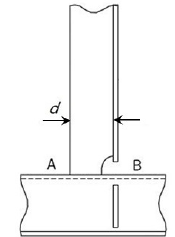 | 1.28 for $d \leq 150$ 1.36 for$1501.45 for \(d > 250$ | 1.40 for $d \leq 150$ 1.50 for $1501.60 for \(d > 250$ | 1.28 for $d \leq 150$ 1.36 for $1501.45 for \(d > 250$ | 1.60 |
  | 2(1) |  | 1.28 for $d \leq 150$ 1.36 for$1501.45 for \(d > 250$ | 1.40 for $d \leq 150$ 1.50 for $1501.60 for \(d > 250$ | 1.14 for $d \leq 150$ 1.24 for $1501.34 for \(d > 250$ | 1.27 |
  | 3 |  | 1.28 | 1.34 | 1.52 | 1.67 |
  | 4 | 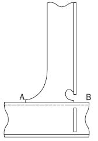 | 1.28 | 1.34 | 1.34 | 1.34 |
  | 5 |  | 1.28 | 1.34 | 1.28 | 1.34 |
  | 6 | 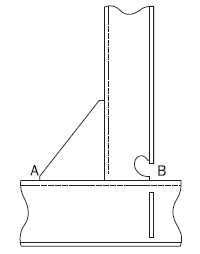 | 1.52 | 1.67 | 1.34 | 1.34 |
  | 7 |  | 1.52 | 1.67 | 1.52 | 1.67 |

  | ID | Connection type(2)(3) | Point 'A' |   | Point 'B' |   |
  | --- | --- | --- | --- | --- | --- |
  | ID | Connection type(2)(3) | $K _{s,g}$ | $K _{s,l}$ | $K _{s,g}$ | $K _{s,l}$ |
  | 8 | 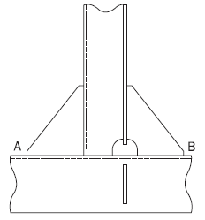 | 1.52 | 1.67 | 1.52 | 1.67 |
  | 9 | 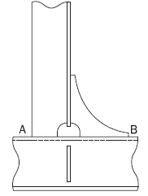 | 1.52 | 1.67 | 1.28 | 1.34 |
  | 10 | 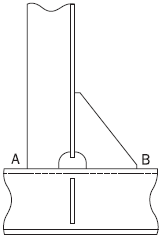 | 1.52 | 1.67 | 1.52 | 1.67 |
  | 11 |  | 1.28 | 1.34 | 1.52 | 1.67 |
  | 12 | 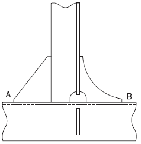 | 1.52 | 1.67 | 1.28 | 1.34 |
  | 13 | 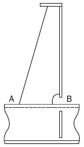 | 1.52 | 1.67 | 1.52 | 1.67 |
  | 14 | 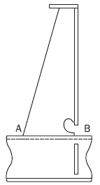 | 1.52 | 1.67 | 1.34 | 1.34 |

  | ID | Connection type(2)(3) | Point 'A' |   | Point 'B' |   |
  | --- | --- | --- | --- | --- | --- |
  | ID | Connection type(2)(3) | $K _{s,g}$ | $K _{s,l}$ | $K _{s,g}$ | $K _{s,l}$ |
  | 15 |  | 1.52 | 1.67 | 1.52 | 1.67 |
  | 16 | 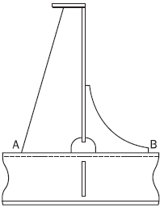 | 1.52 | 1.67 | 1.28 | 1.34 |
  | 17 | 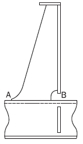 | 1.28 | 1.34 | 1.52 | 1.67 |
  | 18 | 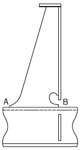 | 1.28 | 1.34 | 1.34 | 1.34 |
  | 19 |  | 1.28 | 1.34 | 1.28 | 1.34 |
  | 20 |  | 1.28 | 1.34 | 1.52 | 1.67 |
  | 21 | 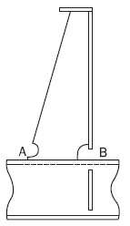 | 1.28 | 1.34 | 1.52 | 1.67 |

  | ID | Connection type(2)(3) | Point 'A' |   | Point 'B' |   |
  | --- | --- | --- | --- | --- | --- |
  | ID | Connection type(2)(3) | $K _{s,g}$ | $K _{s,l}$ | $K _{s,g}$ | $K _{s,l}$ |
  | 22 | 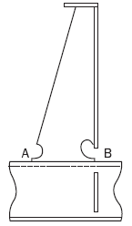 | 1.28 | 1.34 | 1.34 | 1.34 |
  | 23 |  | 1.28 | 1.34 | 1.28 | 1.34 |
  | 24 |  | 1.28 | 1.34 | 1.52 | 1.67 |
  | 25(1) |  | 1.28 for $d \leq 150$ 1.36 for$1501.45 for \(d > 250$ | 1.40 for $d \leq 150$ 1.50 for $1501.60 for \(d > 250$ | 1.14 for $d \leq 150$ 1.24 for $1501.34 for \(d > 250$ | 1.25 for $d \leq 150$ 1.36 for $1501.47 for \(d > 250$ |
  | 26 |  | 1.28 | 1.34 | 1.34 | 1.47 |
  | 27 |  | 1.52 | 1.67 | 1.34 | 1.47 |
  | 28 |  | 1.52 | 1.67 | 1.34 | 1.47 |

  | ID | Connection type(2)(3) | Point 'A' |   | Point 'B' |   |
  | --- | --- | --- | --- | --- | --- |
  | ID | Connection type(2)(3) | $K _{s,g}$ | $K _{s,l}$ | $K _{s,g}$ | $K _{s,l}$ |
  | 29 | 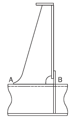 | 1.28 | 1.34 | 1.34 | 1.47 |
  | 30 | 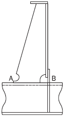 | 1.28 | 1.34 | 1.34 | 1.47 |
  | 31(4) | 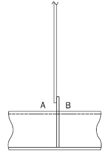 | 1.13 | 1.20 | 1.13 | 1.20 |
  | 32 (4)(5)(6) | 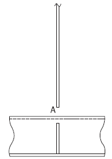 | 1.13 | 1.14 | N/A | N/A |
  | NOTE: (1) The attachment length d, in mm, is defined as the length of the welded attachment on the longitudinal stiffener flange without deduction of scallop. (2) Where the longitudinal stiffener is a flat bar and there is a web stiffener/bracket welded to the flat bar stiffener, the stress concentration factor listed in the table is to be multiplied by a factor of 1.12 when the thickness of attachment is thicker than the 0.7 times thickness of flat bar stiffener. This also applies to unsymmetrical profiles where there is less than 8 mm clearance between the edge of the stiffener flange and the attachment, e.g. bulb or angle profiles where the clearance of 8 mm cannot be achieved. (3) Designs with overlapped connection / attachments, See **Sub-part 1 Ch 9, Sec 4, 5.2.3** of Rule **Pt 13**. (4) ID. 31 and 32 refer to details where web stiffeners are omitted or not connected to the longitudinal stiffener flange. See **Sub-part 1 Ch 9, Sec 4, 5.2.4** of Rule **Pt 13**. (5) For connection type ID. 32 with no collar and/or web plate welded to the flange, the stress concentration factors provided in this table are to be used irrespective of slot configuration. (6) The fatigue assessment point ‘A’ is located at the connection between the stiffener web and the transverse web frame or lug plate. |   |   |   |   |   |

#### (4) Combined stress range

- **(A)** The combined stress used to calculate the fatigue life of a ship structure is the hot spot stress, which is to be determined from multiplying the nominal stress in (2) by stress concentration factor in (3). The combined stress determined at the probability level of $10 ^{-4}$ is to be complied with the following formulae as the combination of the stress component due to the local load, the hull girder bending load and the relative deflection.
  $DELTA sigma 0 `=~f E TIMES max {cases{DELTA sigma hot,g +0.6( DELTA sigma hot,l + DELTA sigma hot,r )&eqalign{#
  }#0.6 DELTA sigma hot,g +` DELTA sigma hot,l +` DELTA sigma hot,r&}}$
  where,
  $f _{E}$ : Reduction factor on derived combined stress range accounting for the long-term sailing routes of a ship, the following values may be used:
  $f _{E}$ = 1.0 for shuttle tankers and vessels that frequently operate in the North Atlantic or in other harsh environments
  Elsewhere : $f _{E}$ = 0.8
- **(B)** The long-term distribution of the stress range may be represented by the two parameter Weibull distribution. The Weibull shape parameter depends on ship type, location of structural member, sea environment, etc. In this guidance, however, the Weibull shape parameter $\xi$ for a longitudinal may be taken as
  $\xi = 1.1 - 0.35 \frac{L - 100}{300}$
- **(C)** The Weibull shape parameter of the combined stress range is assumed to be the same value as the local stress range.

#### (5) Calculation of fatigue damage ratio (2020)

- **(A)** According to the Miner-Palmgren linear cumulative damage rule, the fatigue damage ratio $D$ is calculated using numerical integration as follows:
  $D = \Sigma \frac{n _{i}}{N _{i}}$
  where,
  $n _{i}$ = number of stress cycles in stress block $i$ for long-term distribution of the combined stress range
  $N _{i}$ = number of cycles to failure at the $i$-th constant stress range.
  If the long-term distribution of the stress range follows a Weibull one, the damage ratio $D _{air}$ is given by the following formula:
  $D _{air } = \frac{N _{t}}{K _{2}} \frac{\Delta \sigma _{0}^{m}}{(lnN _{0} ) ^{m/ \xi }} \cdot \mu _{7} \cdot \Gamma \left( 1 + \frac{m}{\xi} \right)$
  where,
  $K _{2}$ = Constant of the design S-N curve, as given in **Table 1** (a) for in-air environment
  $N _{0}$ = Number of cycles corresponding to the reference probability of exceedance of 10^-4.
  $N _{0} =10000$
  $\xi$ = Weibull shape parameter
  $\Gamma$ = complete Gamma function given by the following formula
  $\Gamma (z) = \int _{0} ^{\infty } {} t ^{z - 1} e ^{-t} dt$
  $\gamma$ = incomplete Gamma function given by the following formula.
  $\gamma (z,x) = \int _{0} ^{x} {} t ^{z - 1} e ^{-t} dt$
  $\mu _{7}$ = Coefficient taking into account the change of inverse slope of the S-N curve, $m$.
  $\mu _{7} =1- \frac{\left\{ \gamma \left( 1+ \frac{m}{\xi} ,t _{7} \right) -t _{7}^{- \frac{2}{\xi}} \cdot \gamma \left( 1+ \frac{m+2}{\xi} ,t _{7} \right) \right\}}{\Gamma \left( 1+ \frac{m}{\xi} \right)}$
  $t _{7}$ = as specified in the following formula
  $t _{7} = \left( \frac{\Delta \sigma _{7}}{\Delta \sigma _{0}} \right) ^{\xi } \ln N _{0}$
  $\Delta \sigma _{7 }$ = stress range of the design S-N curve at $N = 10 ^{7}$ cycles
  $N _{t}$ = the total number of stress cycles for a design life of ships and considering voyage days of 85% for the design life of $Y$(years), the total number of stress cycles is given by the following formula.
  $N _{t} = \frac{2.68 \times 10 ^{7}}{4 \log L} \times Y$
- **(B)** For unprotected joints exposed to sea water, the damage ratio $D_cor$ is given by
  $D _{cor } = \frac{N _{t}}{K _{2}} \frac{\Delta \sigma _{0}^{m}}{(lnN _{0} ) ^{m / \xi }} \Gamma (1 + \frac{m}{\xi} )$
  $K _{2}$ = Constant of the design S-N curve, as given in **Table 1** (b) for corrosive environment.
  However, for the structural members protected by effective means in ballast tanks, the damage ratio $D$ is to be calculated as follows:
  $D = 0.5 D _{air } + 0.5 D _{cor}$
- **(C)** In case of considering the full loaded condition and the ballast condition as the load condition, the relevant draft is to be applied in the calculation of the local wave pressure range and the fatigue damage ratio at each condition ($D _{Full}$ and $D _{Ballast}$) is to be calculated. Therefore, the formula for calculating the total fatigue damage can be expressed as follow:
  $D = p _{lF} D _{Full} + p _{lB} D _{Ballast}$
  $p _{lF}$ and $p _{lB}$ = probability at the full loaded condition and the ballast condition, where, however, the values are not given, 0.5 may be used respectively. However, if deemed necessary by the Society, fatigue strength assessment may be carried out by adjusting the operating ratio in accordance with the loading manual. The following shows the general operating rates for representative ship types.- LNG carrier(Membrane type): Full load condition - 0.5 / Ballast condition – 0.5- RO-RO ship: Full load condition - 0.7 / Ballast condition – 0.3.
  In case of ore carriers, unless otherwise provided, loading condition with high and low density cargo also has a same probability level. Probability level at heavy ballast condition and normal ballast condition, 0.3 and 0.2 may be used respectively. If no heavy ballast condition, only normal ballast condition is to be considered in fatigue strength assessment.

#### (6) Locations of member subjected to fatigue strength assessment

Structural members for which the fatigue strength assessment is to be required in accordance with the simplified fatigue analysis are longitudinals and locations of the members are given in **Table 3.**
Fatigue assessment is performed for midship transverse section, fore and after transverse section of watertight bulkheads located in the ship’s midship hold. For the cases where deemed necessary, the Society may require the fatigue assessment for other transverse sections

|   | Locations |
| --- | --- |
| 1 | Intersection of bottom or inner bottom longitudinals and floor or transverse bulkhead |
| 2 | Intersection of side shell or inner skin bulkhead longitudinals and transverse or transverse bulkhead |
| 3 | Intersection of deck longitudinals and transverse or transverse bulkhead |

### 5. Fatigue analysis by hold analysis

Procedure based on finite element stress analysis is used to determine hot spot stress at weld toe of specified structural details, from very fine mesh models. The hot spot stress is generally highly dependent on the finite element model used for representing the structure.

#### (1) Fatigue design load

- **(A)** Hull girder bending load
  - **(a)** Vertical still water bending moment
    Vertical still water bending moments are obtained from values corresponding to the actual loading condition.
  - **(b)** Vertical wave induced bending moment
    Vertical wave induced bending moments are to be in accordance with **Par 4** (1) (A) (a).
- **(B)** Local wave load
  The wave pressure on the ship's side is to be taken as follows, but not to be taken less than 0.
  - Wave induced load for wave crest : $p _{e} =p _{es } + p _{ed}$$( \mathrm{kN}/m ^{2} )$
  - Wave induced load for wave trough : $p _{e} =p _{es } - p _{ed}$$( \mathrm{kN}/m ^{2} )$
  where,
  $p _{es} = \rho g h$
  $p _{ed} = p _{T}$
  $\rho$ : sea water density, 1.025$( \mathrm{t}/m ^{3} )$
  $h, p _{T}$ : as specified in Par 4 (1) (B).
- **(C)** Internal loads
  Internal loads applied to structural model are loads due to liquid( ballast water, etc) and ore cargo grain cargo, etc. Internal loads are to be taken as follows, but not to be taken less than 0.
  $p _{i} = p _{is} + p _{id }$
  Accelerations due to ship motion are to be in accordance with **Par 4** (1) (C) (b).
  - **(a)** Loads due to liquid cargo and ballast water
  - **(i)** Loads due to liquid cargo and ballast water are to be taken as follows.
    $p _{is} = 9.81 \rho _{c} h _{"top"}$ $( \mathrm{kN}/m ^{2} )$
    $\rho _{c}$ : density of liquid cargo and density of sea water, 1.025$( \mathrm{t}/m ^{3} )$
    $h _{"top"}$ : height of considered position from tank top$( \mathrm{m})$
    $p _{id} = f \rho _{c} C _{v} a _{v} h _{s} ( \mathrm{kN}/m ^{2} )$
    $p _{id} = f \rho _{c} C _{t} a _{t} \left| y _{s} \right| ( \mathrm{kN}/m ^{2} )$
    $f$, $\rho _{c}$, $h _{s}$ $y _{s}$, $a _{v}$, $a _{t}$ : as specified in **Par 4** (1) (C) (a).
    $C _{v}$, $C _{t}$ : as specified in **Table 5** and **Table 6**.
    - **(ii)** The dynamic internal pressure, $p _{i}$ , from liquid cargo or ballast water is not to be less than that obtained from the following formulas, which is the greater:
  - **(b)** Loads due to ore cargo grain cargo, etc.
  - **(i)** The height and surface of the cargo are to be determined in accordance with **Par 4** (1) (C) (a) (ii) of the Guidance.
    $p _{is} = 9.81 \gamma hk ^{2} (kN/m ^{2} )$
    $\gamma$ : density of cargo $( \mathrm{t}/m ^{3} )$
    $h$ : vertical distance from the panel in consideration to the surface of the cargo right above the panel ($\mathrm{m}$)
    $k$ : $\cos ^{2} \beta +(1-\sin \psi )\sin ^{2} \beta$
    $\beta$ : Angle, in deg, between panel considered and the horizontal plane.
    $\psi$ : Assumed angle of repose, in deg, of bulk cargo(considered drained and removed) to be taken as follows.
    $\psi$ = 30° in general
    $\psi$ = 35° for iron ore
    $\psi$ = 25° for cement
    $p _{id} = f \gamma C _{v} a _{v} hk ^{2} (kN/m ^{2} )$
    $f, C _{v} , a _{v}$ : as specified in (a) (ii)
    $\gamma , h, k$ : as specified in (ii)
    - **(ii)** The loads , $p _{is}$ , on the vertical walls of the hold are to be determined by the following formula.
    - **(iii)** The dynamic internal pressure, $p _{id}$ , from cargo is to be taken as follows.

#### (2) Calculation of hot spot stress

- **(A)** Structural model
  The modelling is to be done in accordance with **III. Hold Analysis** and the portion to be evaluated is to be within the cargo hold evaluation range.
- **(B)** Boundary conditions
  The boundary conditions is to be accordance with **Table 4**.

  | Location |   | Translation |   |   | Rotation |   |   |
  | --- | --- | --- | --- | --- | --- | --- | --- |
  | Location |   | $\delta_X$ | $\delta_Y$ | $\delta_Z$ | $\theta_X$ | $\theta_Y$ | $\theta_Z$ |
  | Aft End | Independent point | 0 | 1 | 1 | 0 | 0 | 0 |
  | Aft End | Cross section | 0 | Rigid link | Rigid link | Rigid link | 0 | 0 |
  | Aft End | Intersection of CL and inner bottom | 1 | 0 | 0 | 0 | 0 | 0 |
  | Fore End | Independent point | 0 | 1 | 1 | 1 | 0 | 0 |
  | Fore End | Cross section | 0 | Rigid link | Rigid link | Rigid link | 0 | 0 |
  | Note 1 : fixed 0 : free |   |   |   |   |   |   |   |
- **(C)** Load
  - **(a)** Applied load
    The following load components are to be considered : hull girder bending load, local wave load and internal load as specified in (1).
  - **(b)** Loading conditions
    **Table 5** and **Table 6** gives the standard load cases which are to be considered in the assessment.

    | No. | Load case | Loading pattern | External load |   | Hull girder load |   | $\mathrm{C} _{t}$ or $\mathrm{C} _{v}$ |
    | --- | --- | --- | --- | --- | --- | --- | --- |
    | No. | Load case | Loading pattern | Still water load | Wave induced load | Still water bending moments^2) | Wave bending moments^3) | $\mathrm{C} _{t}$ or $\mathrm{C} _{v}$ |
    | F-1 | Full load condition |  | $d _{s}$^1) | Trough | $\mathrm{M} _{s}$ | $\mathrm{M} _{w} (-)$ | 1 |
    | F-2 | Full load condition |   | $d _{s}$^1) | Crest | $\mathrm{M} _{s}$ | $\mathrm{M} _{w} (+)$ | -1 |
    | B-1 | Normal ballast condition |  | Ballast draft^4) | Trough | $\mathrm{M} _{s}$ | $\mathrm{M} _{w} (-)$ | 1 |
    | B-2 | Normal ballast condition |   | Ballast draft^4) | Crest | $\mathrm{M} _{s}$ | $\mathrm{M} _{w} (+)$ | -1 |
    | Remark) ^1) $d _{s}$ : scantling draught ^2) $\mathrm{M} _{s}$ : Still water bending moment in loading manual is to be applied. ^3) $\mathrm{M} _{w}$ : as specified in Par 4 (1) (A) (a). ^4) Ballast draft in loading manual is to be applied. |   |   |   |   |   |   |   |

    | No | Load case | Internal load | Loading pattern | External load |   | Hull girder load |   | $\mathrm{C} _{t}$ or $\mathrm{C} _{v}$ |
    | --- | --- | --- | --- | --- | --- | --- | --- | --- |
    | No | Load case | Internal load | Loading pattern | Still water load | Wave induced load | Still water bending moments^2) | Wave bending moments^3) | $\mathrm{C} _{t}$ or $\mathrm{C} _{v}$ |
    | F1-1 | Full load condition | High density |  | $d _{s}$^1) | Trough | $\mathrm{M} _{s}$ | $\mathrm{M} _{w} (-)$ | 1 |
    | F1-2 | Full load condition | High density |   | $d _{s}$^1) | Crest | $\mathrm{M} _{s}$ | $\mathrm{M} _{w} (+)$ | -1 |
    | F2-1 | Full load condition | Low density |  | $d _{s}$^1) | Trough | $\mathrm{M} _{s}$ | $\mathrm{M} _{w} (-)$ | 1 |
    | F2-2 | Full load condition | Low density |   | $d _{s}$^1) | Crest | $\mathrm{M} _{s}$ | $\mathrm{M} _{w} (+)$ | -1 |
    | B1-1 | Normal ballast condition | - |  | Ballast draft^4) | Trough | $\mathrm{M} _{s}$ | $\mathrm{M} _{w} (-)$ | 1 |
    | B1-2 | Normal ballast condition | - |   | Ballast draft^4) | Crest | $\mathrm{M} _{s}$ | $\mathrm{M} _{w} (+)$ | -1 |
    | B2-1 | Heavy ballast condition | - |  | Ballast draft^4) | Trough | $\mathrm{M} _{s}$ | $\mathrm{M} _{w} (-)$ | 1 |
    | B2-2 | Heavy ballast condition | - |   | Ballast draft^4) | Crest | $\mathrm{M} _{s}$ | $\mathrm{M} _{w} (+)$ | -1 |
    | Remark) ^1) $d _{s}$ : scantling draught ^2) $\mathrm{M} _{s}$ : Still water bending moment in loading manual is to be applied. ^3) $\mathrm{M} _{w}$ : as specified in Par 4 (1) (A) (a). ^4) Ballast draft in loading manual is to be applied. |   |   |   |   |   |   |   |   |
- **(D)** Finite element analysis
  The finite element model of the structure is to consist of shell elements. At the hot spot region, the 4-noded quadrilateral shell elements of the size $t \times t$ are used, where $t$ is the plate thickness. The weld bead is not included in the finite element model. In order to determine the surface stress distribution of the shell element, fictitious beams without stiffness are put on the connection line of shell element and stress evaluation is to be performed by the structural analysis. Also, stress evaluation is to be obtained from the shell element by the structural analysis. In case, FE models are to be based on as built scantlings and the beam element stresses are calculated taking account of shear flexibility. Hot spot stress is to follow (a) or **Sub-part 1 Ch 9, Sec 5,** [3] and [4] of Rule **Pt 13**.
  - **(a)** Calculation of hot spot stress
    The hot spot stress is to be calculated by means of the surface stress distribution from the FE analysis. The hot spot stress approach at weld toe in accordance with the connection types is shown in **Fig 5.** In order to eliminate the notch effect and to consider the weld leg length, the hot spot stress at the weld toe is obtained by a linear extrapolation of the stresses determined at the locations $0.5 t$ and $1.5 t$ from the weld toe.
    $\sigma _{hot} = \frac{3 \sigma (0.5t) - \sigma (1.5t)}{2}$
    $\sigma (X)$ : Using the Lagrange interpolation method, the stress at a location $X$ from the weld toe is to be generally calculated as follows
    $\sigma (X) = c _{1} (X) \sigma _{1 } + c _{2} (X) \sigma _{2 } + c _{3} (X) \sigma _{3 } + c _{4} (X) \sigma _{4}$
    $c _{1} (X) = \frac{(X-X _{2} ) (X-X _{3} ) (X-X _{4} )}{(X _{1} -X _{2} )(X _{1} -X _{3} )(X _{1} -X _{4} )}$
    $c _{2} (X) = \frac{(X-X _{1} ) (X-X _{3} ) (X-X _{4} )}{(X _{2} -X _{1} )(X _{2} -X _{3} )(X _{2} -X _{4} )}$
    $c _{3} (X) = \frac{(X-X _{1} ) (X-X _{2} ) (X-X _{4} )}{(X _{3} -X _{1} )(X _{3} -X _{2} )(X _{3} -X _{4} )}$
    $c _{4} (X) = \frac{(X-X _{1} ) (X-X _{2} ) (X-X _{3} )}{(X _{4} -X _{1} )(X _{4} -X _{2} )(X _{4} -X _{3} )}$
    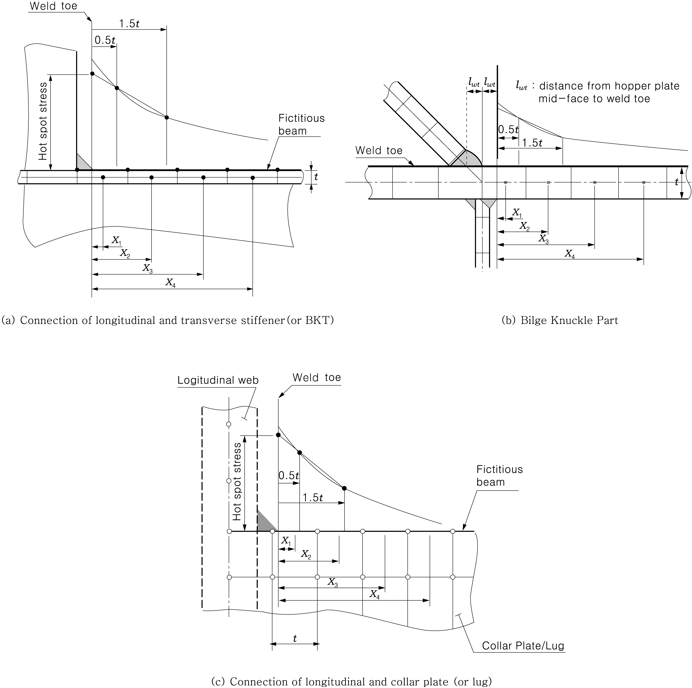
    **Fig 5 Determination of hot spot stress**
  - **(b)** Calculation of edge stress
    The FE model of the plate structure is to consist of 4-noded quadrilateral shell elements of size $t \times t$ in the vicinity of the edge, where $t$ is the plate thickness. In order to calculate the edge stress, fictitious beams without stiffness are put on the edge of the plate. In the structural analysis, the edge stresses are obtained from these beam element stresses.

#### (3) Calculation of fatigue damage ratio

Calculation of fatigue damage ratio for fatigue analysis by hold analysis is to be in accordance with the requirements in **Par 4** (5).

#### (4) Locations of member subjected to fatigue strength assessment

Structural members for the fatigue strength assessment by hold analysis are to be in accordance with the requirements in **Par 6** (6).

### 6. Spectral fatigue analysis

#### (1) General

For assessment of the spectral fatigue analysis, the Short-term closed-form method is to be applied in this Guidance. The part fatigue damage from each cell in the wave scatter diagram can be calculated using the closed-form expressions by incorporating a S-N curve and the Miner-Palmgren rule. The fatigue damage for a life time of a ship is a sum of all the part fatigue damage considering.

#### (2) Wave load analysis is to comply with Annex 3-2, II. Direct Global Structural Analysis, 5 of the Guidance. (2020)

#### (3) Calculation of hot spot stress is to be in accordance with the requirements in Par 5 (2) (D).

#### (4) Short-term response

- **(A)** Since the wave is assumed to be stationary in a short-term sea state, its statistical properties are specified by the wave spectrum. The wave spectrum for the different sea states can be given by the following Bretschneider or two parameter Pierson-Moskowitz spectrum.
  $S _{\eta } ( \omega |H _{s} ,T _{z} ) = \frac{H _{s} ^{2}}{4 \pi} \left( \frac{2 \pi}{T _{z}} \right) ^{4} \omega ^{-5} \exp \left[ - \frac{1}{\pi} \left( \frac{2 \pi}{T _{z}} \right) ^{4} \omega ^{-4} \right]$
  where,
  $\omega$ = wave frequency (rad/sec)
  $H _{s}$ = significant wave height
  $T _{z}$ = wave period
- **(B)** Using the stress transfer function $H ( \omega | \theta )$, the response spectrum of the ship can be calculated as follows.
  $S ( \omega | H _{s} ,T _{z} , \theta ) = \left| H ( \omega | \theta ) \right| ^{2} S _{\eta } ( \omega |H _{s} ,T _{z} )$
  where
  $\theta$ = wave heading angle
  $H ( \omega | \theta )$ = stress response to a regular wave with unit amplitude for different frequencies and wave heading angles
- **(C)** The area under the response spectrum and the second moment of the response spectrum can be calculated as follows.
  $m _{0} = \int _{\omega } ^{} { \sum _{\theta _{0} -90 {}^{\circ} } ^{\theta _{0} +90 {}^{\circ} }} f _{s} ( \theta ) S( \omega |H _{s} , T _{z} , \theta )$
  $m _{2} = \int _{\omega } ^{} { \sum _{\theta _{0} -90 {}^{\circ} } ^{\theta _{0} +90 {}^{\circ} }} f _{s} ( \theta ) \left| \omega - \frac{\omega ^{2} V}{g} \cos \theta \right| ^{ 2} S( \omega |H _{s} , T _{z} , \theta )$
  using a spreading function usually defined as $f _{s} ( \theta ) = k \cos ^{2} ( \theta )$
  where $k$ is selected such that :
  $\sum _{\theta_0 - 90 {}^{\circ} } ^{\theta_0 + 90 {}^{\circ}}f_s (\theta) = 1$
  where,
  $\theta_0$ : Main wave heading
  $\theta$ : Relative spreading around the main wave heading

#### (5) Short-term fatigue damage (2020)

- **(A)** Referring to the cell $(i,j)$ in the wave scatter diagram associated with a significant wave height $H _{si}$ and a zero up-crossing wave period $T _{zj}$, if the stress range distribution is represented by a probability density function $g _{ij}$, the number of stress cycles within $s$ and $s+ds$ is obtained from the following formulae.
  $n _{ij} = T f _{ij } p _{ij } g _{ij } ds$
  $T$ = design life of a ship
  $p _{ij}$ = probability of occurrence of $H _{si}$ and $T _{zj}$
  $f _{ij}$ = Zero up-crossing frequency of stress response in the sea state.
  $f _{ij} = \frac{1}{2 \pi} \sqrt {\frac{m _{2ij}}{m _{0ij}}}$
  $m _{0ij}$, $m _{2ij}$ = area under the response spectrum and the second moment of the response spectrum as specified in (2) (C) above
  $g _{ij}$ = probability density function as specified in (B)
- **(B)** The part fatigue damage $D _{ij}$ for a sea state $(i,j)$ can be calculated from,
  $D _{ij} = \frac{n _{T}}{K _{2}} r _{ij} p _{ij } \int _{0} ^{\infty } {} s ^{m} g _{ij} ds$
  $n _{T}$ = total stress cycles for a life time of a ship given by the following formula
  $n_T = f T$
  $K _{2}$, $m$ = life intercepts and negative inverse slopes of the design S-N curve, as given in **Table 1** (a) for in-air environment and in **Table 1** (b) for corrosive environment
  $p _{ij}$ = as specified in (A) above
  $r _{ij}$ = ratio of the response zero up-crossing frequency in a given sea state to the average crossing frequency given by the following formula
  $r _{ij} = \frac{f _{ij}}{f}$
  $f$ = average frequency given by the following formula
  $f = \sum _{i} ^{} \sum _{j} ^{} p _{ij} f _{ij}$
  $g _{ij}$ = probability density function of the stress range for a sea state $(i,j)$ expressed as follows
  $g _{ij} = \frac{s}{4 m _{0ij}} \exp \left( - \frac{s ^{2}}{8 m _{0ij}} \right)$
  $m _{0ij}$, $m _{2ij}$ = as specified in (A) above
  where a bi-linear S-N curve is used to consider Haibach effect, the short-term fatigue damage ratio may be calculated from,
  $D _{ij} = 2 ^{\frac{3m}{2}} \frac{n _{T}}{K _{2}} \Gamma \left( \frac{m}{2} +1 \right) \lambda _{ij} \mu _{ij} r _{ij} p _{ij} m _{0ij}^{\frac{m}{2}}$
  where,
  $\mu _{ij}$ = as specified in the following formula
  $\mu _{ij } = 1 - \frac{\gamma \left( \frac{m}{2} +1, t _{ij} \right) - \frac{1}{t _{ij}} \gamma \left( \frac{m+2}{2} +1, t _{ij} \right)}{\Gamma \left( \frac{m}{2} + 1 \right)}$
  $m, K _{2} , n _{T} , r _{ij} , p _{ij} , m _{0ij}$ = as specified in (B)
  $t _{ij} = \frac{s _{7} ^{2}}{8 m _{0ij}}$
  $s _{7}$ = the stress range of the design S-N curve at $N = 10 ^{7}$ cycles
  $\Gamma$ and $\gamma$ = complete Gamma function and incomplete Gamma function, respectively
  $\lambda _{ij}$ = Rain flow correction factor in a given sea state
  $\lambda _{ij} = a + (1-a) (1- \epsilon _{ij} ) ^{b}$
  $a = 0.926 - 0.033 m$
  $b = 1.587 m - 2.323$
  $\epsilon _{ij} = \sqrt {1 - \frac{m _{2ij} ^{2}}{m _{0ij} m _{4ij}}}$

#### (6) Long-term cumulative fatigue damage (2020)

- **(A)** Taking account of all heading directions and loading conditions, the long-term cumulative fatigue damage ratio in air is calculated as follows.
  $D _{air} = 2 ^{\frac{3m}{2}} \frac{n _{T}}{K _{2}} \Gamma \left( \frac{m}{2} +1 \right) \sum _{i} ^{} \sum _{j} ^{} \sum _{k} ^{} \sum _{l} ^{} \lambda _{ijkl} \mu _{ijkl} r _{ijkl} p _{ijkl} m _{0ijkl}^{\frac{m}{2}}$
  $K _{2}$, $m$ : life intercepts and negative inverse slopes of the design S-N curve, as given in **Table 1** (a)
  $p _{ijkl}$ = combined probability given by the following formula
  $p _{ijkl} = p _{ij} p _{k} p _{l}$
  $p _{k}$, $p _{l}$ = probability for the heading angle and the loading condition, respectively
- **(B)** For unprotected joints exposed to sea water, the damage ratio $D_cor$ is given by
  $D _{cor} = 2 ^{\frac{3m}{2}} \frac{n _{T}}{K _{2}} \Gamma \left( \frac{m}{2} +1 \right) \sum _{i} ^{} \sum _{j} ^{} \sum _{k} ^{} \sum _{l} ^{} \lambda _{ijkl} \gamma _{ijkl} p _{ijkl} m _{0ijkl}^{\frac{m}{2}}$
  $K _{2}$, $m$ : life intercepts and negative inverse slopes of the design S-N curve, as given in **Table 1** (b)
  However, for the structural members protected by effective means in ballast tanks, the damage ratio $D$ is to be calculated as follows:
  $D = 0.5 D _{air} + 0.5 D _{cor}$

#### (7) Structural members to be assessed for fatigue strength

- **(A)** General
  - **(a)** Structural members subject to fatigue strength assessments are selected considering the structural system of the ship, and the importance, functions, etc of the members.
  - **(b)** Structural members in which fatigue cracks are likely to initiate because of stress concentration due to structural discontinuities, and structural members at locations where watertightness problems are likely to occur due to cracks in the compartments, are selected for the fatigue assessment on priority.
- **(B)** Structural members subject to the fatigue strength assessment according to ship type
  - **(a)** Structural members being of possible assessment for the fatigue strength according to ship type
  - **(i)** Tankers : as specified in **Table 7**
    - **(ii)** Bulk carriers : as specified in **Table 8**
    - **(iii)** Container carriers : as specified in **Table 9**
    - **(iv)** Ore carriers : as specified in **Table 10**
  - **(v)** LNG ships(Membrane Tank) : as specified in **Table 11**
    - **(vi)** RO-RO ships : **Table 12** *(2020)*
  - **(b)** Locations with high stresses are selected from the locations mentioned in (a) above and the fatigue strength is assessed.
  - **(c)** Notwithstanding the requirements in (a) and (b), additional fatigue assessment may be required for other locations where deemed necessary by the Society.

    | Symbol | Members | Locations |   |   |
    | --- | --- | --- | --- | --- |
    | a | Inner bottom plating, slant plating | Intersection of double bottom floor and bilge hopper slant plating |  | 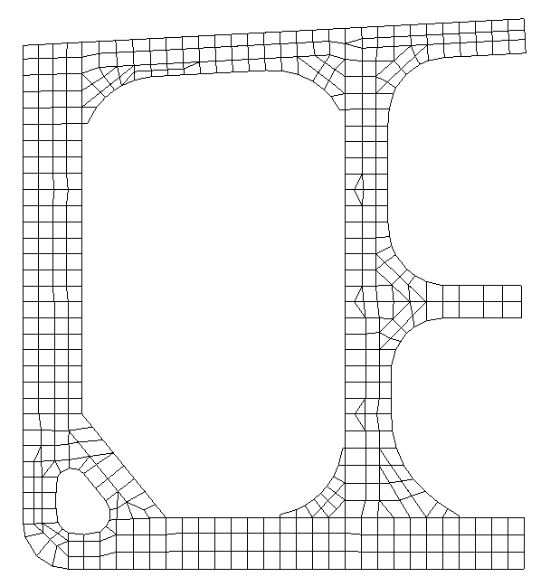 d d b a c c c |
    | b | Side longitudinal bulkhead plating, slant plating | Intersection of side longitudinal bulkhead and bilge hopper slant plating | 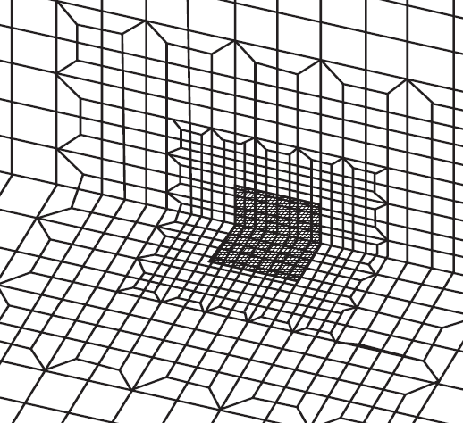 |   |
    | c | Inner bottom plating, longitudinal bulkhead | Intersection of double bottom floor and transverse on longitudinal bulkhead |  |   |
    | d | Side longitudinal bulkhead plating, Longitudinal bulkhead plating | Intersection of deck transverse and side longitudinal bulkhead | 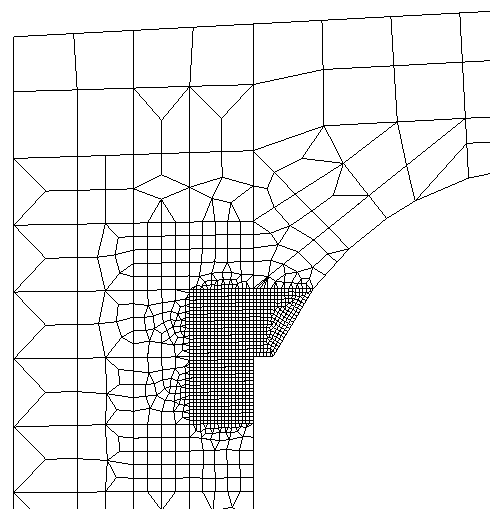 |   |
    | d | Side longitudinal bulkhead plating, Longitudinal bulkhead plating | Intersection of deck transverse and longitudinal bulkhead | 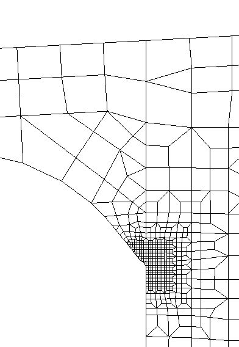 |   |

    | Symbol | Members | Locations |   |
    | --- | --- | --- | --- |
    | e | Side longitudinal bulkhead plating, Longitudinal bulkhead plating | Intersection of horizontal girder and side longitudinal bulkhead | 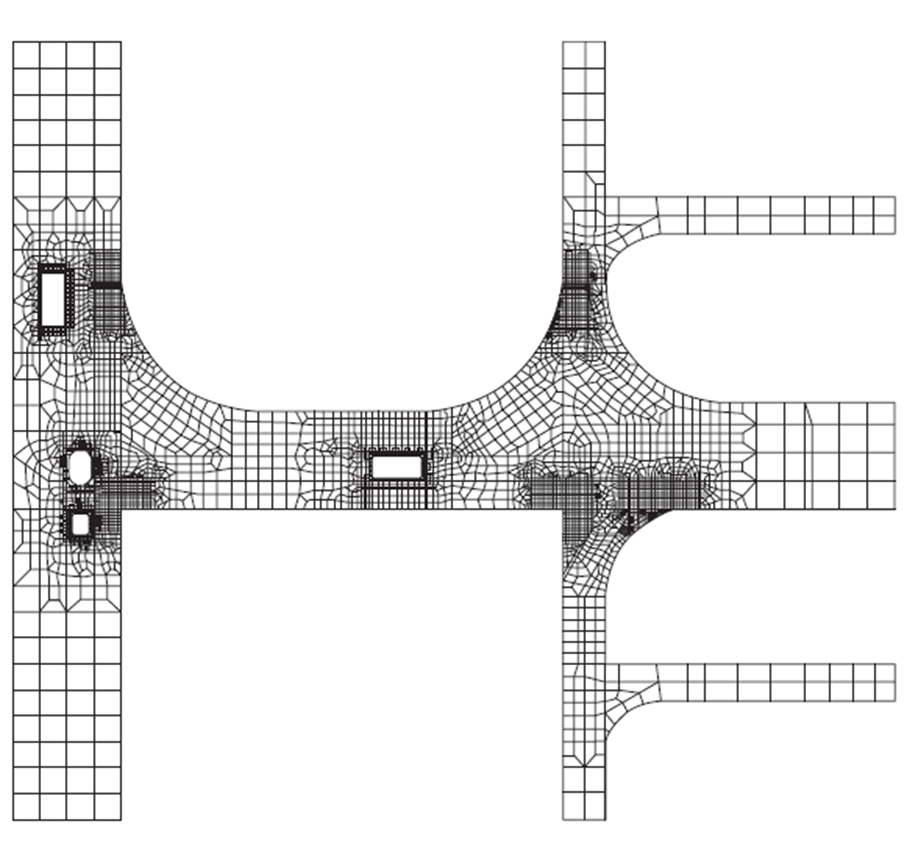 e e e e |
    | e | Side longitudinal bulkhead plating, Longitudinal bulkhead plating | Intersection of horizontal girder and longitudinal bulkhead |   |
    | f | Side longitudinal bulkhead plating, Longitudinal bulkhead plating | Intersection of swash bulkhead and side longitudinal bulkhead | 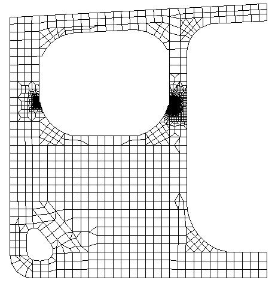 f f |
    | f | Side longitudinal bulkhead plating, Longitudinal bulkhead plating | Intersection of swash bulkhead and longitudinal bulkhead |   |
    | g | Side longitudinal bulkhead plating | Intersection of cross tie and side longitudinal bulkhead |  g g |

    | Symbol | Members | Locations |   |   |
    | --- | --- | --- | --- | --- |
    | a | Inner bottom plating, Sloping plate of bilge hopper tanks | Intersection of sloping plate of lower stool, girder, floor plate and inner bottom plating |  |  a b c d |
    | b | Sloping plate of bilge hopper tanks | Intersection of lower end of hold frame and sloping plate of bilge hopper tank | 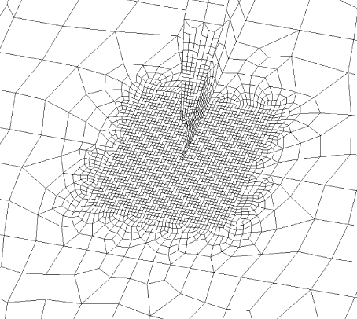 |   |
    | c | Sloping plate of topside tanks | Intersection of upper end of hold frame and sloping plate of topside tanks |  |   |
    | d | Sloping plate of topside tanks | Intersection of end of hatch coaming and sloping plate of topside tanks |  |   |
    | e | Transverse bulkhead | Intersection of sloping plate of lower stool and transverse bulkhead | 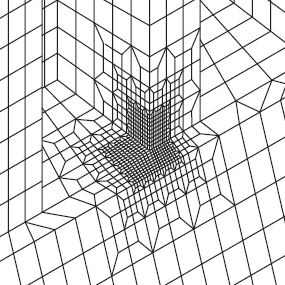 | h e f g |
    | f | Transverse bulkhead | Intersection of sloping plate of upper stool and upper part of transverse bulkhead |  | h e f g |
    | g | Transverse bulkhead | Intersection of slant plating of topside tanks and upper part of transverse bulkhead |  | h e f g |
    | h | Sloping plate of lower stool, Inner bottom plating | Intersection of inner bottom plate and sloping plate of lower stool |  | h e f g |

    | Symbol | Members | Locations |   |   |
    | --- | --- | --- | --- | --- |
    | a | Hatch | Typical hatch coaming and corner in the midship | 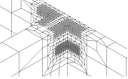 | 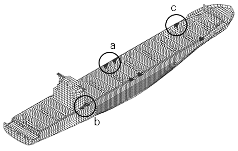 |
    | d | Hatch | After hatch coaming and corner in the after cargo hold (in front of engine room forward bulkhead) | 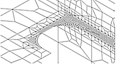 |   |
    | d | Hatch | After hatch coaming and corner in the after cargo hold (in front of engine room forward bulkhead) |  |   |
    | c | Hatch | Hatch coaming and corner within the forward part of the cargo area |  |   |
    | d | Hatch | Typical hatch coaming and corner in the midship |  |  |
    | e | Hatch | Hatch coaming and corner located behind engine room forward bulkhead |  |   |
    | e | Hatch | Hatch coaming and corner located behind engine room forward bulkhead |  |   |
    | f | Hatch | Hatch coaming and corner in first bulkhead in front of engine room forward bulkhead |  |   |
    | g | Hatch | Hatch coaming and corner adjacent to the collision bulkhead |  |   |
    | h | Hatch | Hatch coaming and corner adjacent to the deckhouse. | 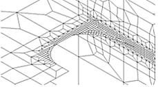 |   |

    | Symbol | Members | Locations |   |   |
    | --- | --- | --- | --- | --- |
    | a | Inner bottom plating, Sloping plate of bilge hopper tanks | Intersection of sloping plate of lower stool, girder, floor plate and inner bottom plating |  | 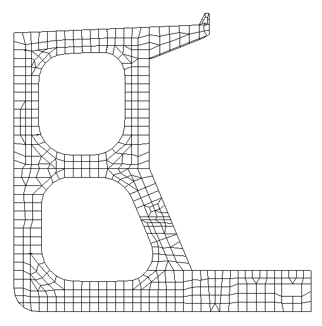 b a |
    | b | Hatch | End bracket of longitudinal hatch coaming |  |   |
    | b | Hatch | Hatch corner of cargo hold |  |   |
    | c | Sloping plate of lower stool, Inner bottom plating | Intersection of inner bottom plate and sloping plate of lower stool | 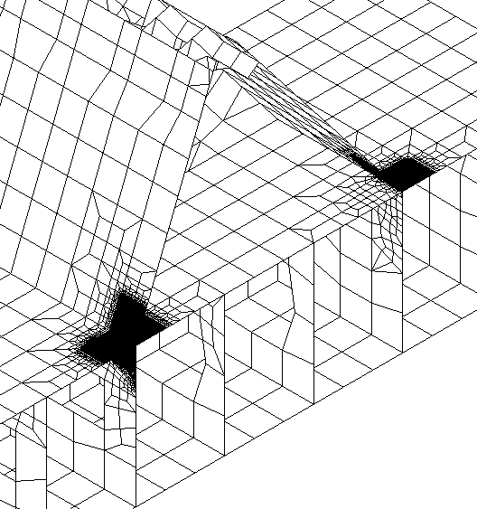 | 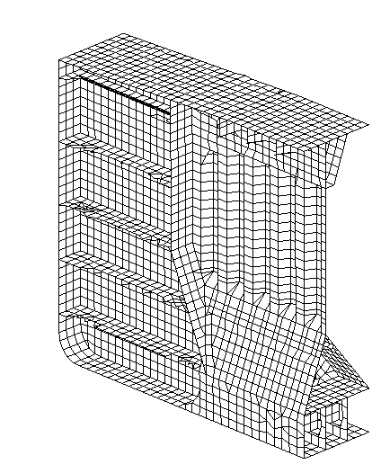 d c |
    | d | Transverse bulkhead | Intersection of sloping plate of lower stool and transverse bulkhead | 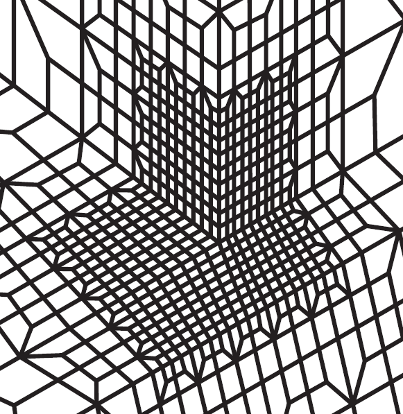 |   |

    | Symbol | Members | Locations |   |   |
    | --- | --- | --- | --- | --- |
    | a | Inner bottom plating, Sloping plate of bilge hopper tank | Intersection of sloping plate of lower stool, girder, floor plate and inner bottom plating |  |  d a b c |
    | b | Side longitudinal bulkhead plating, slant plating | Intersection of side longitudinal bulkhead and bilge hopper slant plating | 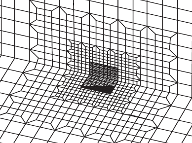 |   |
    | c | Side longitudinal bulkhead, Inner trunk slant plating | Intersection of side longitudinal bulkhead and inner trunk slant plating | 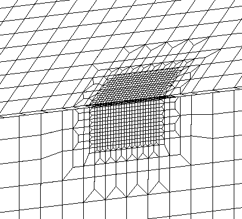 |   |
    | d | Inner trunk slant plating, Inner trunk deck plating | Intersection of inner trunk slant plating and inner trunk deck plating | 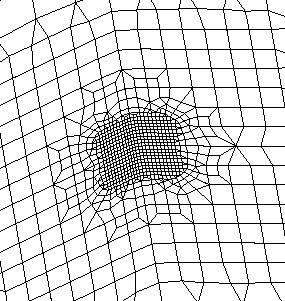 |   |
    | e | Transverse bulkhead, Inner bottom plating | Intersection of inner bottom plate and transverse bulkhead plate | 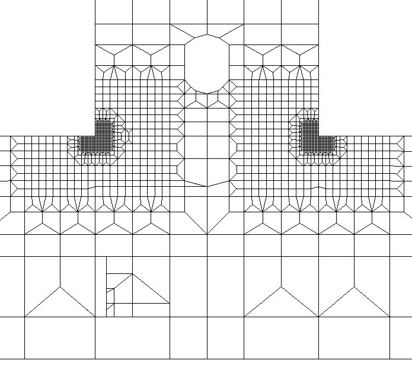 |  e f |
    | f | Stringer plating | Intersection of side stringer plate and stringer plate of transverse bulkhead |  |   |

    | Symbol | Members | Locations |   |   |
    | --- | --- | --- | --- | --- |
    | a | Pillar and deck | Connections between deck and pillar (top) |  |  |
    | a | Pillar and deck | Connections between deck and pillar (bottom) |  |   |
    | b | Side transverse, deck | Connections between side transverse and deck (top) |  |   |
    | b | Side transverse, deck | Connections between side transverse and deck (bottom) |  |   |
    | c | Bracket, deck | Connections between superstructure and deck |  |   |
    | d | Opening | Openings in engine room | 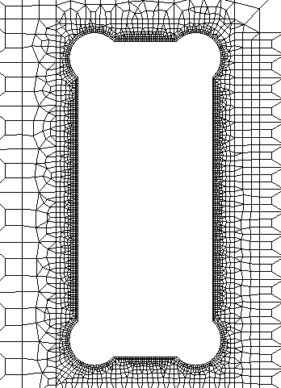 | 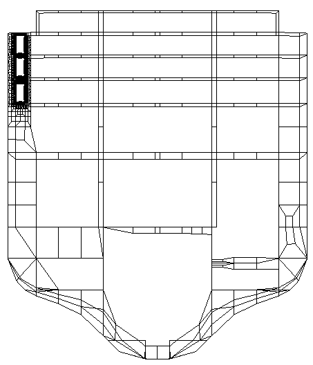 d |

### 7. Transfer function method

#### (1) General

In order to perform the spectral fatigue assessment, structural analyses for all wave loads calculated for all heading directions and frequencies have to be carried out to obtain stress transfer functions. However, in the transfer function method, a discrete unit load approach is used. The loads acting on the hull are divided into several load components. The transfer functions for the each load component are determined using a seakeeping software for each wave condition and the influence coefficients for structure are computed by finite element analysis for each unit load. The non-linear effect of the wave induced load at the waterline region can also be considered in the transfer function method.

#### (2) Stress transfer function

The stress transfer function may be obtained by multiplying the load transfer function by the stress influence coefficient which means the stress value due to the unit load. The combined stress transfer function is to be obtained by a linear summation of each stress transfer function as follows:

$H( \omega , \theta )=2 \left[ \sum _{i=1} ^{3} A _{i} F _{i} ( \omega , \theta )+ \alpha \sum _{i=1} ^{n _{st}} \sum _{ji=1} ^{6} B _{ij} P _{ij} ( \omega , \theta )+ \sum _{i=1} ^{n _{st}} \sum _{ji=1} ^{2} C _{ij} W _{ij} ( \omega , \theta ) \right]$

- **(A)** Hull girder load
  $A _{i}$ = stress influence coefficient due to unit hull girder load
  $A _{1}$ = stress influence coefficient due to unit vertical bending moment
  $A _{2}$ = stress influence coefficient due to unit horizontal bending moment
  $A _{3}$ = stress influence coefficient due to unit torsional moment
  $F _{i} ( \omega , \theta )$ = transfer function of hull girder load
  $F _{1} ( \omega , \theta )$ = transfer function of vertical bending moment
  $F _{2} ( \omega , \theta )$ = transfer function of horizontal bending moment
  $F _{3} ( \omega , \theta )$ = transfer function of torsional moment
- **(B)** Wave pressure
  $P _{ij} ( \omega , \theta )$ : transfer function for pressure coefficient of 5th order power function, $P _{j}$, at the $i$-th station of a ship is given by the following formula.
  $P(b) \cong \sum _{j=1} ^{6} P _{j} bj ^{j-1}$
  $P(b)$ = external pressure distribution with the girth-wise coordinate
  $b$ = girth-wise coordinate, $b=0$ at keel
  $P _{j}$ = coefficient of the power function is to be determined by the regression analysis for the calculated hydrodynamic pressures at the $i$-th station of a ship
  $B _{ij}$ = stress influence coefficient due to the $j$-th unit pressure distribution at the $i$-th station of a ship and the $j$-th unit pressure distribution is as follows:
  $j=1$ for uniform pressure (1)
  $j=2$ for linear distributed pressure$(b)$
  $j=3$ for quadratic distributed pressure$(b ^{2} )$
  $j=4$ for cubic distributed pressure$(b ^{3} )$
  $j=5$ for forth order distributed pressure$(b ^{4} )$
  $j=6$ for fifth order distributed pressure$(b ^{5} )$
- **(C)** Cargo load
  $C _{ij}$ = stress influence coefficient due to unit inertia force at the $i$-th station of a ship
  $C _{i1}$ = stress influence coefficient due to unit vertical inertia force at the $i$-th station of a ship
  $C _{i2}$ = stress influence coefficient due to unit horizontal inertia force at the $i$-th station of a ship
  $W _{ij} ( \omega , \theta )$ = transfer function due to the inertia force of cargo weight at the $i$-th station of a ship
  $W _{i1} ( \omega , \theta )$ = transfer function due to vertical inertia force at the $i$-th station of a ship
  $W _{i2} ( \omega , \theta )$ = transfer function due to horizontal inertia force at the $i$-th station of a ship
- **(D)** In order to consider the non-linear effect of the stress range in the waterline region, the reduction factor,$\alpha$, is to be used as follows:
  $\alpha = 0.5 \left( 1- \frac{h}{a _{w}} \right)$ : above the waterline
  $\alpha = 0.5$ : at the waterline
  $\alpha = 1.0$ : below $a_w$
  $h$ and $a _{w}$ = as specified in **Par 4** (1) (B) (a)
  For intermediate location between the waterline and $a _{w}$, $\alpha$ is to be obtained by interpolation

#### (3) Using stress transfer function obtained from (2) above, the short-term response spectrum is to be calculated according to Par 6 (3). The short-term fatigue damage ratio and the long-term cumulative fatigue damage ratio are to be obtained according to Par 6 (4) and (5), respectively. The requirements not listed in this paragraph are to be in accordance with Par 6. #imgID-465_s2
