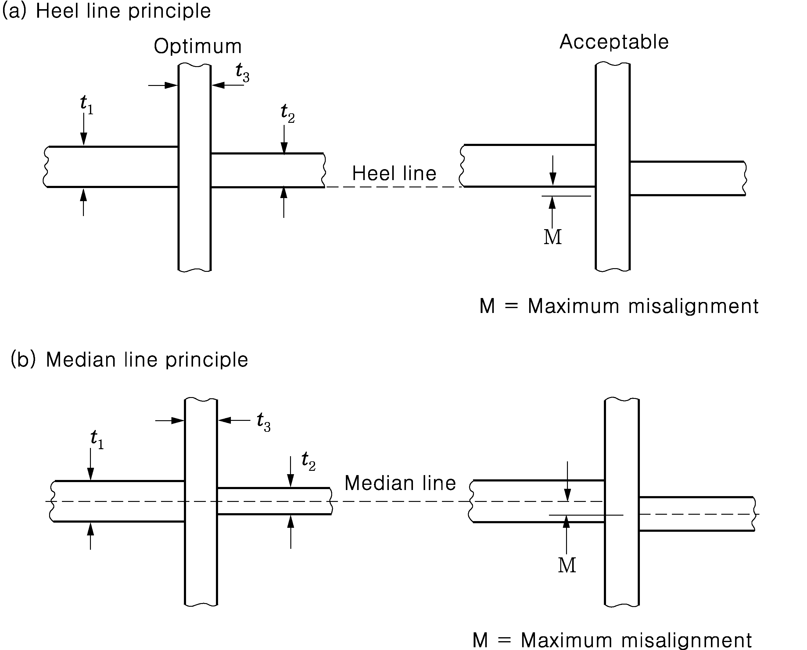
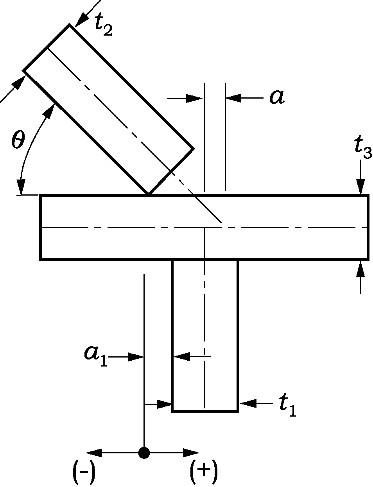
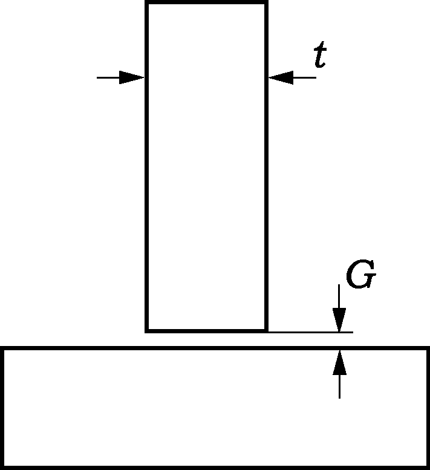
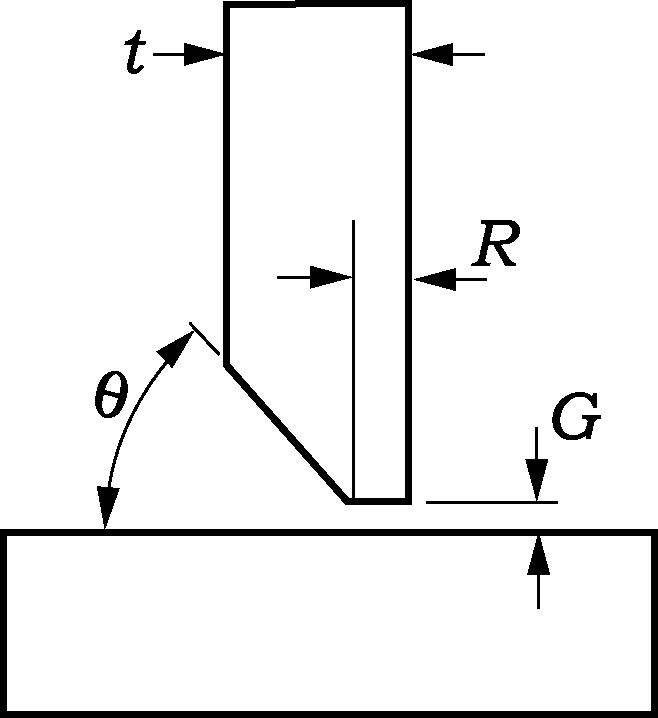
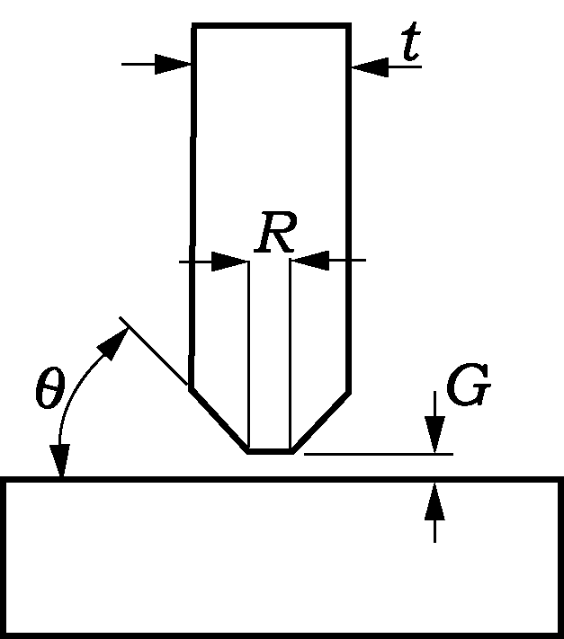
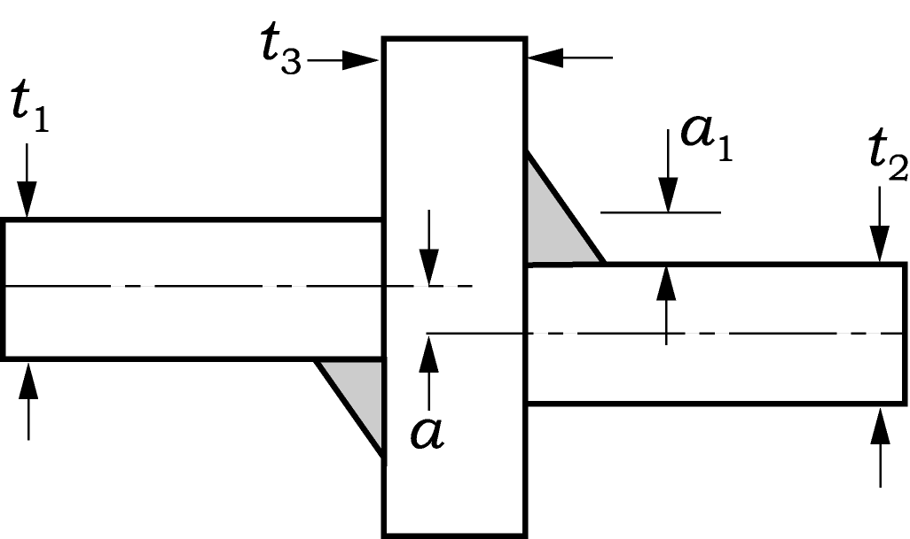
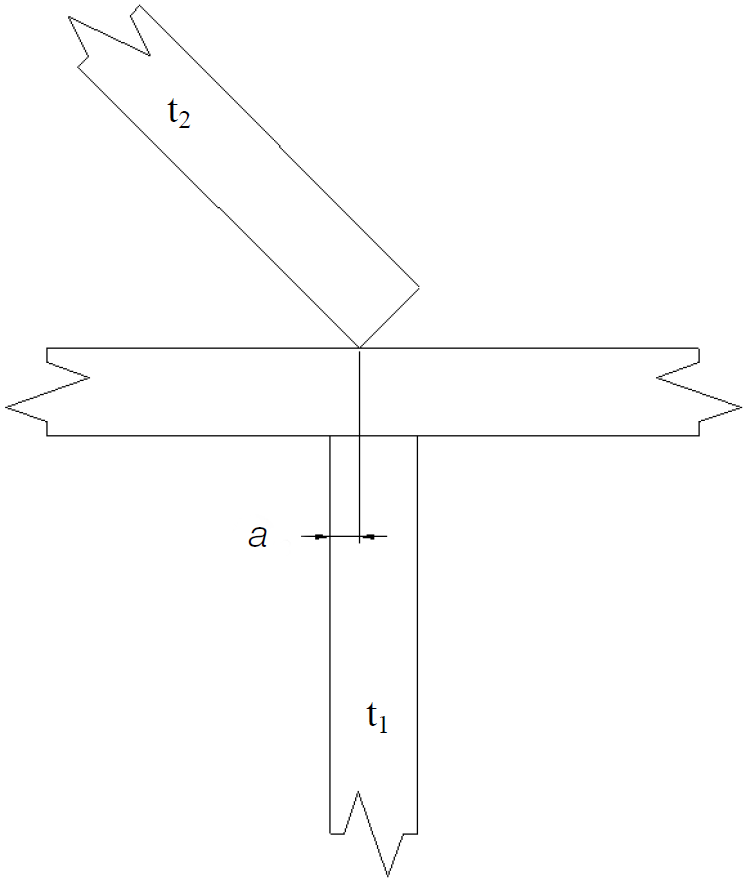
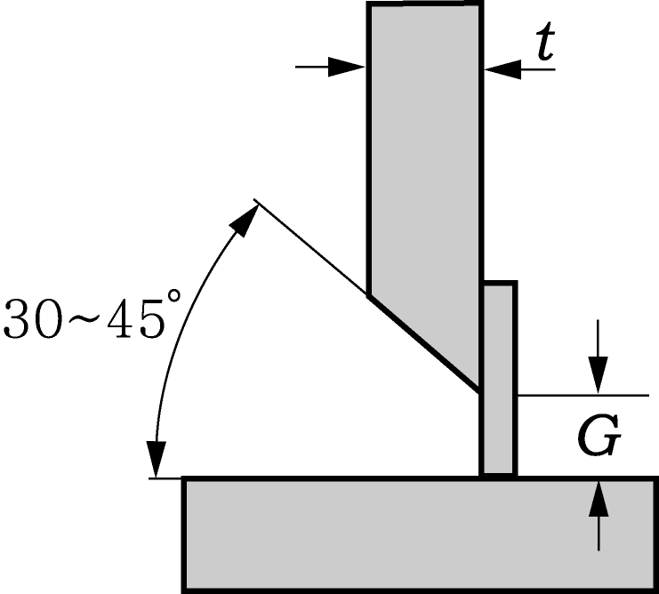

# PART 3 Hull Structures

> RULES FOR CLASSIFICATION OF STEEL SHIPS / RA-03-E / 2025 / EN / Guidance

## Annex 3-4 Guidance for the Hull Construction Monitoring Procedure

### 1. General

#### (1) Introduction

- **(A)** The general quality of a vessel is enhanced by superior structural design, improved construction procedures and effective through life monitoring. In structural terms, the performance of structural elements or connections between members is dependent on the adoption of adequate quality control measures relating to both the quality of detail design and the construction. The detail design, the methods of manufacture and the degree of quality control significantly affect the fatigue performance of a structure. This is particularly evident at locations within the structure identified as 'critical'.
- **(B)** Misalignment, inappropriate edge preparation, excessive gap, weld sequence and weld quality alters the fatigue properties of these joints. Setting appropriate controls on the key factors affecting fatigue performance at the design stage and utilising enhanced monitoring procedures at critical locations ensures that a high degree of workmanship is achieved and avoids unnecessary remedial action in the later stages of the build process.
- **(C)** The links to Direct Strength Assessment (DSA) and Direct Fatigue Assessment (DFA) within the Hull Construction Monitoring (HCM) procedure ensure that a seamless transition of quality monitoring is achieved throughout the life of the vessel.
- **(D)** The SeaTrust HCM procedure forms an element of an integrated approach to the design, construction and monitoring of the critical areas of ship structures. The application of the HCM procedure enhances not only the confidence of the Owner and this Society in the hul1 construction but also quality control procedures employed by the Shipyard at the structurally critical locations.

#### (2) Objective

- **(A)** The main objective of the SeaTrust HCM procedure is to ensure that the locations within the ship structure, that have been identified as critical, are built to both an acceptable quality standard and approved construction procedures.
- **(B)** The HCM procedure is applied in addition to the requirements for vessels built under special survey, and is based on the application of enhanced controls on alignment, fit-up, edge preparation and workmanship to the critical areas of the relevant hul1 structures to attain the required structural performance.
- **(C)** A secondary objective is that during the service life of the vessel, the Hull Construction Monitoring Plan(HCMP) is used to focus the attention of any future classification survey to the critical locations.

#### (3) Outline of the procedure

- **(A)** The pre-construction meeting includes advice to the Builder's representatives and owners site manager on the specific application of the Hull Construction Monitoring procedure.
- **(B)** At the plan development and approval stage, the application of the HCM procedure identifies the areas and locations within the ship structure that may experience high levels of stress or fatigue damage assessed on the basis of DSA and DFA results and procedures. The critical areas are those areas of the ship structure that have been shown by structural analysis and service experience to have a higher probability of failure than the surrounding ship structure. The critical locations are specific points identified within the critical areas that are prone to fatigue, and where detail design improvement may have to be undertaken. Particular emphasis is placed on those primary structural locations specified as having enhanced fatigue life specifications within the DFA procedures.
- **(C)** In order to promote a satisfactory level of strength and fatigue performance, detailed construction tolerances are agreed between this Society and the Shipbuilder for each ship considered for the HCM notation in accordance with the Hull Construction Monitoring Standards. The HCMP is prepared by the builder as a catalogue of the critical locations together with the required construction tolerances and an outline of the quality control and quality assurance procedures to be applied. The completed HCMP is sent to this Society for review and subsequent approval.
- **(D)** The Shipyard quality personnel are responsible for the inspection and recording of results during the construction of the ship in accordance with approved yard procedures and the requirements of this society. This site Surveyor provide third party inspection to confirm that the alignment, fit-up, workmanship and construction tolerances conform to the agreed standard specified in the HCMP. Where the approved construction tolerances are exceeded, the Shipbuilder undertakes corrective action to the satisfaction of the requirements of the HCMP.
- **(E)** On satisfactory completion of the HCM requirements, this Society assigns the "**SeaTrust (HCM)"** notation. Upon completion of the ship, the site Surveyor sends a copy of the approved HCMP to head office.
- **(F)** During the lifetime of the vessel, the HCMP is maintained on board and is used to focus periodical surveys on the critical locations in order to monitor the structural integrity and performance.
- **(G)** The Construction Monitoring Procedure has been subdivided into three phases to be applied sequentially as shown in **Table 1** and **Fig 1.**

  | Phase I | Plan approval | Analysis to determine the critical locations |
  | --- | --- | --- |
  | Phase II | Survey during Construction | Survey to ensure satisfactory construction standards |
  | Phase III | Lifetime application of HCMP | Monitor the structural integrity using the HCMP |

#### (4) Scope of application

- **(A)** The requirements in this Annex apply at the request of the applicant.
- **(B)** Notwithstanding the requirements in (A), the ship built in accordance with **Common Structural Rules for Bulk Carriers and Oil Tankers**(Pt. 13) shall be applied.
- **(C)** This procedure is applied to areas of the structure that have been identified as being critical locations through the application of the SeaTrust procedures for Direct Structural Assessment (DSA) and Direct Fatigue Assessment (DFA).
- **(D)** The procedure is adopted in association with requirements of this Society for vessels constructed under Special Survey.
- **(E)** Any subsequent modifications or repairs to the ship's structure are, where applicable, to be in accordance with this procedure.

#### (5) Classification notation

- **(A)** Upon satisfactory application of this procedure, the vessels may be eligible to be assigned the Hull Construction Monitoring notation **"SeaTrust (HCM)".**

### 2. Hull Construction Monitoring Standard

#### (1) Hull Construction Monitoring Standard

- **(A)** The Hull Construction Monitoring Standard (HCMS) sets down the Construction Monitoring tolerances to be achieved at the critical locations in order that the requirements for the HCM notation are met. The HCMS covers such aspects of construction such as:
  . Alignment
  . Fit-up
  . Remedial Measures
- **(B)** When identifying the critical locations, particular consideration should be given to critical locations identified by DSA or DFA that constitute a unit joint and critical joints assembled in areas where environmental controls are difficult to apply such as in the erection area or building dock.
- **(C)** In all cases, the construction standards and tolerances not indicated in this standard are to be at least equivalent to the approved yard, national or international ship construction standards in use.
- **(D)** The quality standards for the alignment, fit-up and repair of critical structural components during new construction are shown in **Table 2** to **Table 5.**

#### (2) Scope of the Hull Construction Monitoring Standard

- **(A)** The HCMS does not replace the shipbuilding construction standard employed by the shipyard and accepted by this society. It is a supplementary standard supported by a survey procedure to promote a higher level of structural performance throughout the life of the ship.
- **(B)** The construction and manufacture of the structural details in way of the identified critical areas shall be carried out in accordance with the following:
  . Rules and Regulations for the Classification of Ships.
  . The approved construction tolerances contained within the Hull Construction Monitoring Plan.
  . The associated non-destructive examination (NDE) requirements, if necessary, at the discretion of the attending Surveyor.

#### (3) Structural Alignment Considerations

- **(A)** The consistent application of remedial measures to correct poor fit-up and alignment is one of the key indicators that a problem may exist in the construction procedures.
- **(B)** Any inaccuracy in the welding of blocks into erection units will have an amplified effect at the erection stage. If adequate dimensional control has not been exercised it will be necessary to cut away edges to align the units being erected. This has the effect of causing further misalignments in adjacent units that will also require modification.
- **(C)** The most critical types of welded structural connection are angled cruciform joints such as the sloping hopper plate connection with the inner bottom plating and the outer longitudinal girder of double hull tankers. At these locations, adequate dimensional control is a prerequisite to ensure good alignment.
- **(D)** The application and maintenance of a suitable alignment method such as 100 mm offset lines is recommended to aid accurate fit up and alignment. For critical structural members it is recommended that any reference marks are indicated in a permanent manner, on both sides of the plate and the actual misalignment checked using jigs/templates, if necessary.
  
  **Fig 2 Recommended alignment of primary members**
- **(E)** In general, there are two types of alignment method in use ; the median line principle and the heel or moulded principle. These principles are outlined in **Fig 2.** While both alignment methods are generally acceptable, in cases where a more onerous trading pattern is specified or enhanced service life expectations are required, consideration should be given to the application of a suitable alignment method appropriate to the design criteria in order to achieve a preferable level of alignment. In addition to alignment considerations it may also be preferable to apply a more stringent tolerance beyond those detailed in this procedure. In order to eliminate difficulties associated with alignment, a prudent consideration by the shipyard would be to ensure, where practicable, that the thickness of all structural members is reasonably compatible within regions where critical locations are likely to be identified.
- **(F)** In addition to the basic design criteria, certain joints may be identified as requiring an enhanced level of alignment through the application of service experience. The joints identified may depend upon the ship type and the structural configuration but in general the following joints may require additional consideration:
  . Lower hopper knuckle on bulk carriers and oil tankers.
  . Lower stool connection to floors in way of longitudinal girders in bulk carriers.
  . Lower cofferdam bulkhead cruciform joint on membrane type gas carriers.
  . Upper hopper knuckle on membrane type gas carriers.
  . Aft end cargo area transition zone on membrane type gas carriers.
  . Fore end cargo area transition zone on membrane type gas carriers.
- **(G)** When verifying the alignment of structural members, it should be noted that it is often impractical to directly measure the median line alignment and a heel line approach is used in lieu of direct measurement of alignment at median lines. Where the heel line approach is used, the maximum median line tolerances maybe converted into heel line values using the equations given in **Fig 3.**
- **(H)** In cases where two or more critical locations are connected by a secondary stiffening arrangement i.e. double bottom/inner bottom longitudinals, it may be considered prudent to ensure that the alignment is maintained.

#### (4) Construction considerations

- **(A)** At the sub-assembly stage, a high degree of accuracy may be obtained using methods such as 'backmarking' prior to fit-up.
- **(B)** It is generally found that a consistently higher degree of accuracy is achieved within the assembly shop where the conditions are controlled since blocks and pre-erection units are generally of a smaller size. This makes it easier to meet the specified construction tolerances during fit-up and alignment.
- **(C)** If the critical connections are part of much larger erection joints in the building dock or berth it is much harder to control the alignment and fit-up of the interface and weld quality due to the size of the units and other external factors.
  During all stages of construction, but particularly when fabrication and erection takes place external to the construction hall, measures are to be taken to screen and pre-warm, as necessary, the general and local weld areas. Surfaces are to be dry and rapid cooling of welded joints is to be prevented.

#### (5) Quality control and quality assurance

- **(A)** The construction standards are to be received general approval as part of the certification procedures and their application is included with the quality plan submitted to this Society for approval.
- **(B)** The construction standards and tolerances to be applied to the critical areas are to be agreed between this Society and the shipbuilder.
- **(C)** In all cases the applied tolerances and standards are not to be less than those specified in the IACS "Shipbuilding and Repair Quality Standard".
- **(D)** Any deviation from the approved structural configuration and/or approved procedures is to be submitted to this Society for consideration.
  
  $a _{1\max} = \frac{1}{2} ( \frac{t _{2}}{\sin \theta} + \frac{t _{3}}{\tan \theta} -t _{1} )+M$ $M= \frac{t _{\min}}{3} (\max 5 mm)$
  $a _{1\min} = \frac{1}{2} ( \frac{t _{2}}{\sin \theta} + \frac{t _{3}}{\tan \theta} -t _{1} )-M$ $t _{\min} =\min [ t _{1,} t _{2,} t _{3} ]$
  $a _{1\max}$ = max heel line tolerance measured in the direction of the acute angle
  $a _{1\min}$ = max heel line tolerance measured in the direction of the abuse angle
  $\theta$ = angle of sloping plate to the horizontal
  $t_1$ = thickness of girder or transverse member
  $t_2$ = thickness of sloping plate
  $t_3$ = thickness of table member
  **Comparison of equivalent tolerances**

  | $t_1$ | $t_2$ | $t_3$ | $\theta$ | $a _{1\max}$ | $a _{1\min}$ | Med. Line |
  | --- | --- | --- | --- | --- | --- | --- |
  | 12 12 14 14 | 22 26 22 26 | 20 20 20 20 | 60 60 45 45 | 16.5 18.8 23.2 26.0 | 8.5 10.8 13.9 16.7 | 4 4 4.7 4.7 |

  **Fig 3 Equivalent heel line tolerances**

### 3. Phase 1 - Plan Development and Approval

#### (1) Objectives

- **(A)** The first objective of this stage is to identify the critical locations as defined in l.2.3 of this document.
- **(B)** The second objective is to compile the HCMP prior to submission to this Society for approval.

#### (2) Identification of the critical locations

- **(A)** Experience with ships in service has enabled this Society to provide information to assist the Shipbuilder in determining the critical locations that may be vulnerable to fatigue. Particular emphasis is placed on are as where high stress magnitudes may be anticipated and for which correct alignment is important.
- **(B)** The critical locations are to be clearly identified and labelled on the appropriate structural drawings contained within the HCMP and submitted to this Society for approval.

#### (3) Hull construction monitoring plan

- **(A)** The hull construction monitoring plan (HCMP) is a document compiled by the shipyard to provide a record of the enhanced quality standards and procedures employed by the Shipbuilder to ensure that an increased level of construction quality control is employed at those areas of the structure that have been identified as critical to the vessel.
- **(B)** Prior to commencement of surveys for any newbuilding project, the HCMP is submitted to Head Office of this Society for formal approval. The HCMP is reviewed by both this society's site Surveyor and Plan Approval Surveyor in order that the findings of practical construction, structural analysis and fatigue analysis are uniquely reflected in the plan. Once approval is given, this society's site Surveyors maintain efficient contact between all interested parties to ensure that the requirements of the HCMP are fully understood and are complied with.
- **(C)** The HCMP is supplemental to and does not replace the Quality Plan provided by the Shipbuilder.
- **(D)** On receipt of the approved HCMP, the Shipbuilder, in association with this Society's Surveyor, ensures that all of the requirements contained within the HCMP are met in addition to any shipbuilding standards used.
- **(E)** A typical HCMP is to contain the following information:
  . Appropriate structural plans with the critical locations clearly marked.
  . Details of appropriate construction tolerances including any 'design offset' at the critical locations are to be included on the appropriate structural plans for approval.
  . Summary table of all critical locations indicating tolerances applied.
  . Alignment verification methods used, i.e. Offset marking.
  . Outline of quality controls in place during block construction, pre-erection and erection.
  . Outline of Q.A procedures used.
  . Methods for recording and reporting of inspection results.
  . Details of standard remedial measures to be employed where required.
  . Non destructive testing plan(where non destructive testing plan is submitted separately, it may not be included in HCMP.)
- **(F)** A copy of the approved HCMP is maintained on board either in electronic or hard copy format through-out the life of the vessel. The HCMP is to be used to focus survey on those areas of the structure identified during the design process as being critical to the operational effectiveness of the vessel.

### 4. Phase 2 - Construction Monitoring

#### (1) Fabrication and pre-erection

- **(A)** The attending Surveyor and the Shipbuilder's quality control personnel agree a satisfactory inspection routine that embodies both the Shipbuilders Quality Control and the Construction Monitoring requirements. The Owner's Representatives shall be notified of the agreed inspection routine.
- **(B)** Measures are, in general, to be taken to screen and pre-warm, as necessary, the general and local weld areas. Surfaces are to be dry and rapid cooling of welded joints is to be prevented. For any given welding method, the welding procedures are to be approved by this society. In addition, the Shipbuilder ensures that all welding operators employed on that process are qualified as approved by this society.
- **(C)** The fabrication plans and other appropriate specifications, procedures and work instructions necessary for each phase of the fabrication process are to be made available at the appropriate inspection locations. The Shipbuilder maintains the inspection status of the critical structural components at appropriate stages in the fabrication process. This may include the direct marking of individual components. The marking method used is to be discussed and agreed with the attending Surveyor.
- **(D)** Prior to the welding of critical joints, the Shipbuilder liaises with the attending Surveyor with respect to arranging appropriate 'fit-up' inspection, if necessary. Records of inspection and measurements are to be easily referenced against the relevant structural components and be accessible to this society.
- **(E)** The workmanship employed throughout the stages of material preparation and assembly of pre-fabricated units is to conform to the relevant standards defined in the HCMP. Faulty workmanship or non-compliance with the specified tolerances noted by the Surveyor is to be rectified to the Surveyors satisfaction before progressing to the next stage of production.

#### (2) Assembly of units

- **(A)** The assembly welding sequences, in general, are to be agreed prior to construction and to the satisfaction of the attending Surveyor. At each stage of assembly, particular attention is to be paid to ensure that the fit-up, alignment and welding of units is in accordance with the approved plans and to the approved HCM tolerances.
- **(B)** Where a critical connection is also an erection joint, the attending Surveyor is to liaise with the Shipyard to provide adequate inspection to ensure that the required construction tolerances are achieved. During unit erection it is common for plates to be released and material cropped to allow acceptable fit-up and alignment. This process often results in damage to the surrounding plating detrimental to the strength of the structure. It is recommended that where such practices have been employed, full penetration welding is specified for the re-welding of the structure. Where insert plates have been used, it is recommended that these plates are left loose until such time that acceptable fit-up and alignment has been achieved.

#### (3) Inspection of welds

- **(A)** Regular examination of the NDE records, in conjunction with the Shipbuilder, verifies that the quality of welding operations is satisfactory. Any departure from acceptable standards is to be investigated, including additional tests as considered desirable.
- **(B)** Finished welds are to undergo a visual inspection by the attending Surveyor. The Shipbuilder shall ensure that all welds presented for visual inspection are clean, having all rust and weld slag removed and be free of coatings that may impair the inspection. The inspection is to verify that all welds are sound, free from cracks, undercut, notches, substantially free from lack of fusion, incomplete penetration, slag inclusion and porosity. The surface of all finished welds shall be inspected to ensure that they are reasonably smooth, substantially free of overlap and undercut. Fillet welds are to be inspected to ensure that they are continuous around scallops, brackets, stiffeners, etc. thus avoiding craters and incipient cracks at points of stress concentration.
- **(C)** Weld sizes shall be inspected to ensure they are consistent over their entire length and are of the correct dimensions. Finished weld profile characteristics can have a marked effect upon joint fatigue. The approved dimensional requirements are to be verified using a suitable gauge and shall meet the criteria specified in the HCM Standard.
- **(D)** In addition to visual inspection, non-destructive testing for at least 10 % of the critical locations are to be carried out. The Surveyor may request the additional non-destructive testing according to the quality of workmanship of the shipyard. Welds may be examined using approved methods such as Ultrasonic, Magnetic Particle, Radiographic, Eddy Current, Dye Penetrant or other acceptable methods appropriate to the configuration of the weld.
- **(E)** The Shipyard production personnel involved in the fabrication joints to undergo NDE are not to be informed of the exact locations of the NDE prior to welding. Similarly, the proposed location of NDE is not to be marked or indicated on the plates prior to welding.
- **(F)** The quality of a finished weld often varies with the method used due to factors such as heat input and the process itself. When specifying an NDE procedure, full consideration is to be given to the weld process employed to ensure that the method of NDE is suitable for the type of weld under consideration.
- **(G)** Where defects are observed, additional NDE is to be carried out to determine the full extent. Unacceptable weld defects detected by NDE inspection are to be repaired or completely removed and re-welded as appropriate using approved procedures and consumables.
- **(H)** Prior to any repair or re-welding at critical locations, the joint is to be inspected by the attending Surveyor to ensure that the alignment and gap comply with the specified tolerances.
- **(I)** In critical areas where repairs and rewelds have been undertaken, the Surveyor is to ensure that excessive welding leading to distortion, stress concentration has not taken place. Re-inspection using the appropriate method of NDE shall be carried out until no further defects are discovered.
- **(J)** Only where absolutely necessary should methods for fatigue strength improvement be considered at the fabrication stage and then only as remedial measures. In these cases, strict quality control procedures are to be applied.

#### (4) Departure from the approved arrangements

- **(A)** Modifications or alterations to the design or construction of a particular structural arrangement or detail in way of an identified critical area are to be approved by this society.
- **(B)** In this case, the Shipbuilder is to re-submit to this society, the appropriate plans indicating all of the required changes. Reassessment of the structure may be a requirement along with the submission of a revised HCMP. Any reassessment carried out by this Society with regard to post-approval modifications or alterations may be chargeable to the Shipbuilder.

### 5. Construction Monitoring Compliance

#### (1) Compliance

- **(A)** The attending Surveyor shall ensure that during the various stages of the construction process, all structure in way of fatigue critical locations has been examined in accordance with the inspection plan.
- **(B)** The attending Surveyor is to ensure that, where applicable, all of the requirements of the HCMP have been met in addition to any rules and standards applied.
- **(C)** On satisfactory completion of all inspections, the Surveyor shall confirm that the structure complies with the approved HCM tolerances and assign the appropriate notation "SeaTrust (HCM)".

#### (2) Non-Compliance

- **(A)** Throughout the various stages of construction, the attending Surveyor shall inform the Shipbuilder immediately, upon completion of an inspection, of any defined critical joint or location that does not comply with the approved HCMP.
- **(B)** Where the Shipbuilder is to utilize remedial measures or corrective action not stated in the HCMP, an agreement should be reached on an approved remedial plan to ensure that compliance is reached through discussions between this Society and the Shipbuilder. The proposal shall contain details of any modifications to the structural arrangement, scantlings, welding processes to be employed and NDE to be performed.
- **(C)** Through discussions between this Society and the Shipbuilder an agreement shall be reached on an approved remedial plan. Repairs, re-work and inspection shall be carried out in accordance with the approved remedial plan until compliance is granted.

### 6. Phase 3 - Lifetime Application

#### (1) Through life monitoring

- **(A)** The Surveyor attending future classification surveys shall identify, from the HCMP, those structural locations that will require special consideration and extended examination during survey.
- **(B)** The nature of the critical locations requires that the Surveyor pay particular attention to defects such as corrosion, local damage, evidence of cracking, and local coating breakdown.
- **(C)** All repairs undertaken at the critical locations identified in the HCMP are to be undertaken in accordance with these procedures.

#### (2) Structural alterations

- **(A)** In cases where a vessel has undergone significant structural alteration, any locations subsequently identified as being critical to the structural integrity are to be constructed to the tolerances specified in the original HCMP. A revised HCMP is to be produced as early as practicable in the design process in accordance with these procedures and submitted for approval.
- **(B)** Joints not previously identified but subsequently found to be critical are to be examined in detail to ensure that no construction irregularities such as severe misalignment and weld imperfections exist.

  | Detail | Heel | Median |
  | --- | --- | --- |
  |  | $a _{1\max} \geq a_1 \geq a_{1\min}$ where, $a _{1\max} = \frac{1}{2} (t_1 - t_2 ) + M$ $a _{1\min} = \frac{1}{2} (t_1 - t_2 ) - M$ | $a \leq M$ |
  |  | Median line tolerances may be converted to an equivalent heel line tolerance using the equations given below. $a _{1\max} \geq a_1 \geq a_{1\min}$ where, $a _{1\max} = \frac{1}{2} left( t_\frac{2}{\sin \theta} + t_\frac{3}{\tan \theta} -t_1 right) + M$ $a _{1\min} = \frac{1}{2} left( t_\frac{2}{\sin \theta} + t_\frac{3}{\tan \theta} -t_1 right) - M$ | $a \leq M$ |
  | $M = t_\frac{\min}{3}$ (max 5 mm) where, $t_\min$ = min ($t_1$, $t_2$, $t_3$) |   |   |

  | Detail | HCM Standard | Remark |
  | --- | --- | --- |
  |  | $a \leq \frac{t _{\min}}{3}$ Where a is the ‘overhang’ of the thinner plate. | $t_\min$ = min($t_1$, $t_2$, $t_3$) |
  |  | $a \leq \frac{t _{\min}}{3}$ Where a is the ‘overhang’ of the thinner plate. | $t_\min$ = min($t_1$, $t_2$, $t_3$) |
  | - Where deemed necessary by the Society(thick insert plate etc), heel line principle alignment may be applied |   |   |

  | Detail | HCM Standard | Remark |
  | --- | --- | --- |
  |  | $G \leq 2$mm |   |
  |  | $\alpha$ = 45°- 60° $\beta$ = 70°- 90° $G \leq 2$mm |   |
  |  | $G \leq 2$mm $R \leq 3$mm $\theta$ = 50° |   |
  |  | $t > 19$mm $G \leq 3$mm $R \leq 3$mm $\theta$ = 50° |   |

  | Detail | Heel | Median |
  | --- | --- | --- |
  |  | $a_{1\max} + 0.5M \geq a_1 \geq a_{1\max}$ or $a_{1\min} > a_1 \geq a_{1\min} - 0.5M$ Increase weld leg by 15 % $a_1 \geq a_{1\max} + 0.5M$ or $a_1 \geq a_{1\min} - 0.5M$ Release and refit over a minimum 50$a$ where $M = t_\frac{\min}{3}$ (max 5 mm) $t_\min$ = min($t_1$, $t_2$, $t_3$) | $t_\min /3 < a \leq t_\min /2$ Increase weld leg by 15 % $a > t_\min /2$ Release and refit over a minimum 50$a$ |
  |  | $a_{1\max} + 0.5M \geq a_1 \geq a_{1\max}$ or $a_{1\min} > a_1 \geq a_{1\min} - 0.5M$ Increase weld leg by 15 % $a_1 \geq a_{1\max} + 0.5M$ or $a_1 \geq a_{1\min} - 0.5M$ Release and refit over a minimum 50$a$ where $M = t_\frac{\min}{3}$ (max 5 mm) $t_\min$ = min($t_1$, $t_2$, $t_3$) | $t_\min /3 < a \leq t_\min /2$ Increase weld leg by 15 % $a > t_\min /2$ Release and refit over a minimum 50$a$ |

  | Detail | HCM Standard | Remark |
  | --- | --- | --- |
  |  | $t_\min /3 < a \leq t_\min /2$ Increase weld leg by 15 % $a > t_\min /2$ Release and refit over a minimum 50$a$ | $t_\min$ = min($t_1$, $t_2$) |
  |  | $t_\min /3 < a \leq t_\min /2$ Increase weld leg by 15 % $a > t_\min /2$ Release and refit over a minimum 50$a$ | $t_\min$ = min($t_1$, $t_2$) |

  | Detail | Repair Standard | Note |
  | --- | --- | --- |
  |   | 2 mm#eqnID-28685 mm : length of weld to Rule leg by +($G - 2$) |   |
  |   | 5 mm#eqnID-287016 mm : champer to 30°- 45°, build up with welding on one side, with or without backing bar, remove backing strip if used, back gouge and seal with weld. |   |
  |   |  |   |
  |   | #eqnID-287116 mm or $G > 1.5 t$ Insert plate of min width 300 mm to be used |   |
  |   |  |   |
