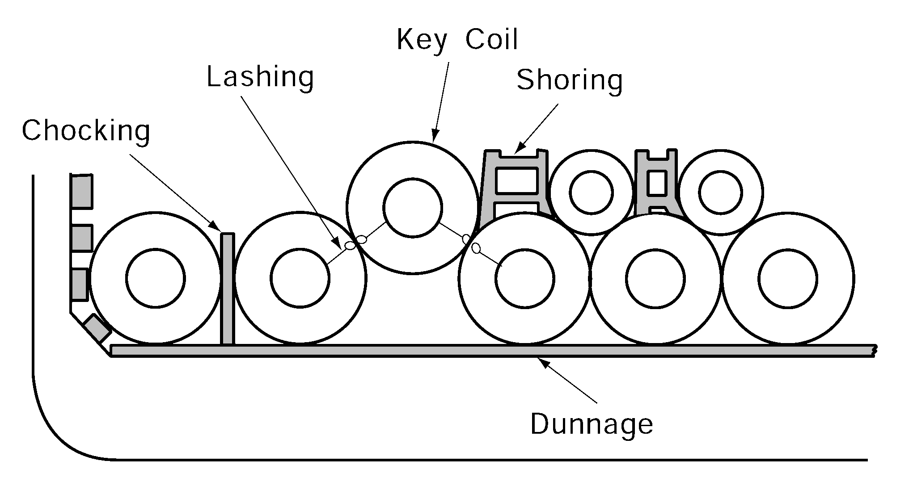

# PART 3 Hull Structures

> RULES FOR CLASSIFICATION OF STEEL SHIPS / RA-03-E / 2025 / EN / Guidance

## Annex 3-5 Guidance for structural members for ships intended to carry out the steel coils

### 1. Application

#### (1) The requirements in this Annex apply to structural members of inner bottom plating and hopper slopping tanks for ships intended to carry out the steel coils.

#### (2) In addition to the requirements in this Annex, the scantlings for structural members are to be complied with related regulations.

#### (3) This calculation method is a standard means of securing steel coils as like to Fig 1.

#### (4) When steel coils are lined up two or more tiers, the lowest tier of steel coils is assumed to be in contact with inner bottom plating and hopper slopping tanks. In other cases, these requirement are to be to the satisfaction of the Society.

#### (5) For hopper tank, the requirements in this Annex apply to the structural members in contact with steel coils from inner bottom plating.

**Fig 1 Standard means of securing steel coils**

### 7. Arrangement of steel coils between floors

For steel coils loaded with respect to the locations of floors in the inner bottom, the scantlings of structural members for inner bottom plating and hopper slopping tanks are to be in accordance with the following and to be complied with related regulations. (See **Fig 3**)

#### (1) The number _s2 of load point dunnages per elementary plate panels is to be taken as : _s2

#### (2) The distance _s2 between outermost load point dunnages per elementary plate panel is to be taken as the distance between the outermost dunnage supporting one row of steel coils

| **Rules for the Classification of Steel Ships** **Guidance Relating to the Rules for the** **Classification of Steel Ships** |
| --- |
| **PART 3 HULL STRUCTURES** Published by **KR** 36, Myeongji ocean city 9-ro, Gangseo-gu, BUSAN, KOREA TEL : +82 70 8799 7114 FAX : +82 70 8799 8999 Website : http://www.krs.co.kr |
|   |

| CopyrightⒸ 2025, KR Reproduction of this Rules and Guidance in whole or in parts is prohibited without permission of the publisher. |
| --- |
