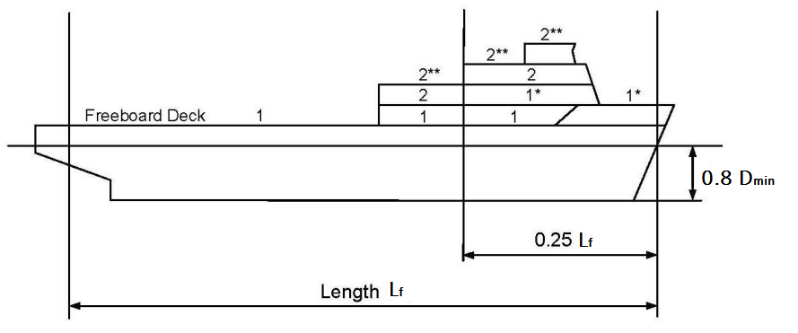
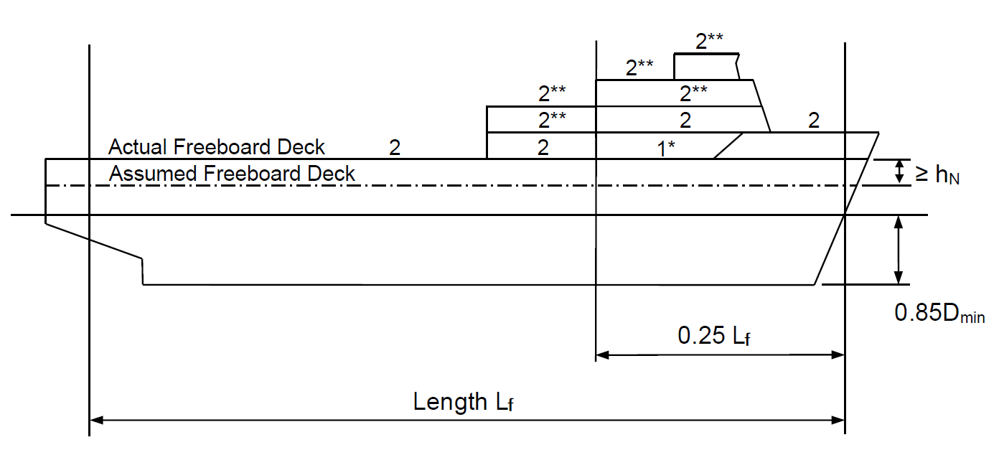
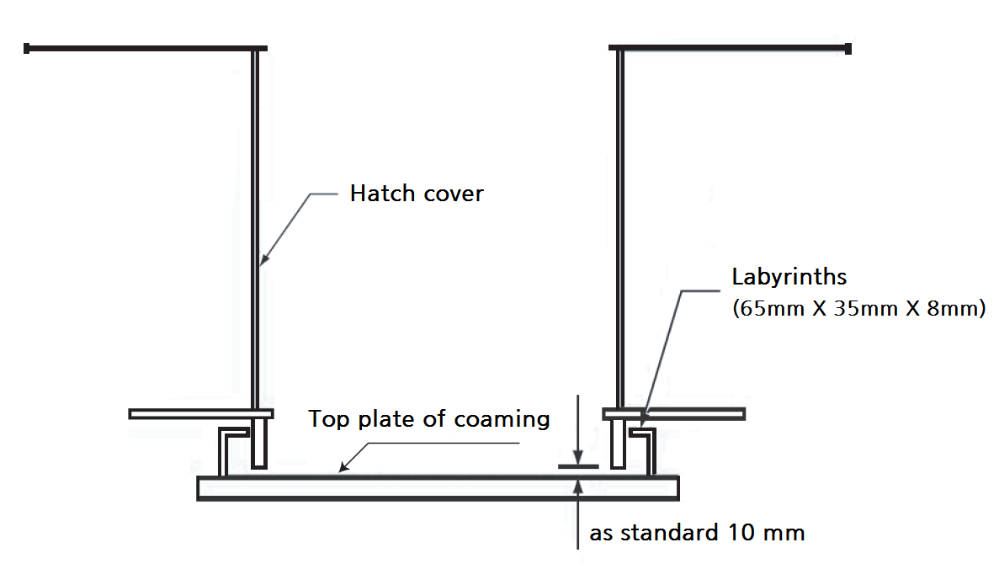

# PART 4 Hull Equipment

> RULES FOR CLASSIFICATION OF STEEL SHIPS / RA-04-E / 2025 / EN / Rules

## CHAPTER 2 HATCHWAYS AND OTHER DECK OPENINGS

### Section 1 General

#### 101. Application

- **1.** The requirements apply to all ships except bulk carriers to which Part 13 is applied, are for hatch covers and coaming in position 1 and 2 on weather decks. The requirements in **Ch 9** apply to steel hatch covers of small hatches fitted on the exposed fore deck. *(2024)*
- **2.** The construction and means for securing the weathertightness of cargo and other hatchways in position 1 and 2 as defined **102.** shall be equivalent to the requirements of hatchways closed by weathertight covers of steel or other equivalent materials, unless approved by the Administration. **【See Guidance】**
- **3.** As specified in this chapter, parts of the requirements are for some specific ship types as categorized below: *(2024)*
  **Type-1 ships** : including all ships except bulk carriers, self-unloading bulk carriers, ore carriers and combination carriers
  **Type-2 ships** : including all bulk carriers, self-unloading bulk carriers, ore carriers and combination carriers

#### 102. Position of exposed deck openings 【See Guidance】

For the purpose of this Chapter, two positions of exposed deck openings are defined as follows:
Position 1 = Upon exposed freeboard and raised quarter decks, and upon exposed superstructure decks situated forward of a point located 0.25$L _{f}$ from the forward end of $L _{f}$.
Position 2 = Upon exposed superstructure decks situated abaft 0.25$L_f$ from the forward end of $L _{f}$ and upon exposed superstructure decks situated forward of a point located 0.25$L _{f}$ from the forward end of $L _{f}$ and located at least two standard heights of superstructure above the freeboard deck.

#### 103. Height of hatchway coamings

- **1.** The height of coamings above the upper surface of deck is to be not less than followings.
  Position 1 : 600 mm
  Position 2 : 450 mm
- **2.** The height of hatch cover and coamings in exposed portions of higher than the superstructure decks is to be to the satisfaction of the Society.
- **3.** For hatchways closed by steel weathertight hatch covers fitted with gaskets and clamping devices, the height of coamings may be reduced from those prescribed in Par 1 or omitted entirely. In this case, the scantling of hatch cover, gasket, clamping device and drainage to be subject to the satisfaction of the Society.

#### 104. Hatch covers 【See Guid ance】

- **1.** Hatch covers on exposed decks are to be weathertight.
  Hatch covers in closed superstructures need not be weathertight. However, hatch covers fitted in way of ballast tanks, fuel oil tanks or other tanks are to be watertight.
- **2.** In the case of sand carriers and dredgers, hatchway covers may be omitted at the discretion of the Society.
- **3.** Ship's hatch covers complying with the provisions of Guidelines for the Assignment of Reduced Freeboards for Dredgers(Annex 1 of Rules for the Classification of Dredgers) may be omitted in accordance with Guidelines for the Assignment of Reduced Freeboards for Dredgers.

#### 105. Material

Hatch covers and coamings are to be made of material in accordance with the definitions of **Pt 2, Ch 1** of the Rules. Material class I of **Pt 3, Ch 1, Table 3.1.10** is to be applied for top plate, bottom plate and primary supporting members. The use of materials other than steel is considered by checking that criteria adopted for scantlings are such as to ensure strength and stiffness equivalent to those of steel hatch covers.

#### 106. Net scantlings

- **1.** Unless otherwise quoted, the scantling of this Chapter are net scantlings.
- **2.** The net thicknesses are the member thicknesses necessary to obtain the minimum net scantlings required by **Sec 3** and **Sec 4**.
- **3.** The required gross thicknesses are obtained by adding corrosion additions given in **Table 4.2.1**.
- **4.** Strength calculations using FEM are to be performed with net scantlings. *(2024)*

#### 107. Corrosion additions

- **1.** The corrosion addition for steel hatch covers, hatch coamings is equal to the value specified in **Table 4.2.1**.
  For structural members made of stainless steel and aluminium alloys, the corrosion addition $t _{c}$ is to be taken equal to 0 mm.
- **2.** **Renewal thickness**
  Structural drawings for hatch covers and hatch coamings complying with this Chapter are to indicate the renewal thickness ($t _{renewal}$) for each structural elements, given by the following formula in addition to the as built thickness ($t _{as-built}$). If the thickness for voluntary addition is included in the as built thickness, the value may be at the discretion of the Society.
  $t _{renewal} =t _{as-built} -t _{c} +0.5$(mm)
  where,
  $t _{c}$ : Corrosion addition according to **Table 4.2.1**
  In case that corrosion addition $t _{c}$ is 1.0 mm, renewal thickness may be given by the following formula.
  $t _{renewal} =t _{as-built} -t _{c}$(mm)

  | Application | Structure | $t _{c}$ ($\mathrm{mm}$) |
  | --- | --- | --- |
  | Container ships, car carriers, paper carriers, passenger vessels | Hatch covers | 1.0 |
  | Container ships, car carriers, paper carriers, passenger vessels | Hatch coamings | 1.5 |
  | Type-2 ships | Single skin hatch covers | 2.0 |
  | Type-2 ships | Top plating and bottom plating of double skin hatch covers | 2.0 |
  | Type-2 ships | Internal structure of double skin hatch covers | 1.5 |
  | Type-2 ships | Hatch coamings and coaming stays | 1.5 |
  | All other ship types | Single skin hatch covers | 2.0 |
  | All other ship types | Top plating and bottom plating of double skin hatch covers | 1.5 |
  | All other ship types | Internal structure of double skin hatch covers and closed box girders | 1.0 |
  | All other ship types | Hatch coaming parts including stays and stiffeners | 1.5 |
- **3.** **Steel renewal**
  - **(1)** The treatment in relation to gauged thickness are to be obtained from **Table 4.2.2.**
  - **(2)** Where applied protection coating, coating applied in accordance with the coating manufacturer's requirements. Coating is to be maintained in GOOD condition, as defined in **Pt 1, Ch 2, 101. 20** of the **Rules**. *(2024)*
  - **(3)** For the internal structure of double skin hatch covers, thickness gauging is required when hatch cover top or bottom plating renewal is to be carried out or when this is deemed necessary, at the discretion of the Society’s surveyor, on the basis of the plating corrosion or deformation condition. In these cases, steel renewal for the internal structures is required where the gauged thickness is less than $t _{n et}$ . **【See Guidance】**

    | Treatment | Where $t _{c} \geq 1.5 mm$ | Where $t _{c} =1.0 mm$ |
    | --- | --- | --- |
    | Steel renewal | $t _{g} \(t _{g} \leq t _{n et}$ |   |
    | Apply protection coating or annual gauging | \(t _{n et it} +0.5 \(t _{n et it} |   |

### Section 2 Design Load

#### 201. Hatch cover and coaming design load

- **1.** Design load of hatch covers and hatch coamings is to be not less than the value obtained from **202.** to **206.**
- **2.** **Definitions**
  $x$ = longitudinal co-ordinate of mid point of assessed structural member measured from aft end of length $L$ or $L _{f}$, as applicable
  $h _{N}$ = standard superstructure height(m)
  = 1.05 + 0.01$L _{LL}$, 1.8 ≤ $h _{N}$ ≤ 2.3
  $D _{\min}$ = minimum depth found by drawing a line parallel to the keel line of the vessel(including skeg) tangent to the moulded sheer line of the freeboard deck

#### 202. Vertical weather design load

- **1.** The vertical weather load $P _{V}$ on the hatch cover panels is given by **Table 4.2.3**. *(2024)*
- **2.** The vertical weather design load needs not to be combined with cargo loads according to **204.** and **205.**
- **3.** Where an increased freeboard is assigned, the design load for hatch covers according to **Table 4.2.3** on the actual freeboard deck may be as required for a superstructure deck, provided the summer freeboard is such that the resulting draught will not be greater than that corresponding to the minimum freeboard calculated from an assumed freeboard deck situated at a distance at least equal to the standard superstructure height $h_N$ below the actual freeboard deck, see **Fig 4.2.2**.
- **4.** For hatch covers of cargo holds designed for carriage of ballast or liquid cargo, the internal lateral pressures are also to be considered in accordance with **Pt 3, Ch 15** of the **Rules.** *(2024)*

  | Position | $L _{f}$(m) | Vertical weather load $P _{V}$ ($\mathrm{kN}/m ^{2}$) |   |
  | --- | --- | --- | --- |
  | Position | $L _{f}$(m) | $\frac{x}{L _{f}} \leq 0.75$ | $0.75< \frac{x}{L _{f}} \leq 1.0$ |
  | 1 | 24 m≤$L _{f}$≤ 100 m | $\frac{9.81}{76} \left( 1.5L _{f} +116 \right)$ | on freeboard deck $\frac{9.81}{76} \left[ \left( 4.28L _{f} +28 \right) \frac{x}{L _{f}} -1.71L _{f} +95 \right]$ |
  | 1 | 24 m≤$L _{f}$≤ 100 m | $\frac{9.81}{76} \left( 1.5L _{f} +116 \right)$ | upon exposed superstructure decks located at least one superstructure standard height above the freeboard deck(*) $\frac{9.81}{76} \left( 1.5L _{f} +116 \right)$ |
  | 1 | $L _{f}$> 100 m | $34.3$ $(9.81 \times 3.5)$ | on freeboard deck for type B ships $9.81 \left[ \left( 0.0296L _{1} +3.04 \right) \frac{x}{L _{f}} -0.0222L _{1} +1.22 \right]$ |
  | 1 | $L _{f}$> 100 m | $34.3$ $(9.81 \times 3.5)$ | on freeboard deck for type B-60 or B-100 ships $9.81 \left[ \left( 0.1452L _{1} -8.52 \right) \frac{x}{L _{f}} -0.1089L _{1} +9.89 \right]$ $L _{1} =L _{f}$ but not more than 340 m |
  | 1 | $L _{f}$> 100 m | $34.3$ $(9.81 \times 3.5)$ | upon exposed superstructure decks located at least one superstructure standard height above the freeboard deck(*) $34.3$ $(9.81 \times 3.5)$ |
  | 2 | 24 m≤$L _{f}$≤ 100 m | $\frac{9.81}{76} \left( 1.1L _{f} +87.6 \right)$ |   |
  | 2 | $L _{f}$> 100 m | $(9.81 \times 2.6)$ |   |
  | 2 | $L _{f}$> 100 m | upon exposed superstructure decks located at least one superstructure standard height above the lowest Position 2 deck(**) $20.6$$(9.81 \times 2.1)$ |   |
  | (Remark) (*), (**) means *, ** of **Fig 4.2.1** and **Fig. 4.2.2** |   |   |   |

  
  * reduced load upon exposed superstructure decks located at least one superstructure standard height above the freeboard deck
  ** reduced load upon exposed superstructure decks of vessels with L_f > 100m located at least one superstructure standard height above the lowest Position 2 deck
  Fig 4.2.1 Positions 1 and 2 *(2024)*
  
  * reduced load upon exposed superstructure decks located at least one superstructure standard height above the freeboard deck
  ** reduced load upon exposed superstructure decks of vessels with L_f > 100m located at least one superstructure standard height above the lowest Position 2 deck
  Fig 4.2.2 Positions 1 and 2 for an increased freeboard *(2024)*

#### 203. Horizontal weather design load (2024)

- **1.** **Horizontal weather design load**
  The horizontal weather load $P _{H}$ is obtained from the following formulae and not to be less than the values given by **Table 4.2.4**.
  $P _{H} =f _{n} f _{c} \left( f _{b} c _{L} C _{w} -z \right) \mathrm{kN/m ^{2} }$
  $C _{w}$ = $\frac{L}{25} +4.1$ for $L$ < 90 $\mathrm{m}$
  = $10.75- \left( \frac{300-L}{100} \right) ^{1.5}$ for 90 $\mathrm{m}$ ≤ $L$ < 300 $\mathrm{m}$
  = $10.75$ for 300 $\mathrm{m}$ ≤ $L$ < 350 $\mathrm{m}$
  = $10.75- \left( \frac{L-350}{150} \right) ^{1.5}$ for 350 $\mathrm{m}$ ≤ $L$ ≤500 $\mathrm{m}$
  $c _{L}$ = $\sqrt {\frac{L}{90}}$ for $L$ < 90 $\mathrm{m}$
  = 1 for $L$ ≥ 90 $\mathrm{m}$
  $f _{n}$ = $20+ \frac{L _{1}}{12}$ for unprotected front coamings and hatch cover skirt plates
  $f _{n}$ = $10+ \frac{L _{1}}{12}$ for unprotected front coamings and hatch cover skirt plates, where the
  distance from the actual freeboard deck to the summer load line exceeds the
  minimum non-corrected tabular freeboard according to ICLL by at least one
  standard superstructure height $h _{N}$
  $f _{n}$ = $5+ \frac{L _{1}}{15}$ for side and protected front coamings and hatch cover skirt plates
  $f _{n}$ = $7+ \frac{L _{1}}{100} -8 \frac{x '}{L}$ for aft ends of coamings and aft hatch cover skirt plates abaft amidships
  $f _{n}$ = $5+ \frac{L _{1}}{100} -4 \frac{x '}{L}$ for aft ends of coamings and aft hatch cover skirt plates forward of amidships
  $L _{1}$ = length of ship, need not be taken greater than 300 $\mathrm{m}$
  $f _{b}$ = $1.0+ \left( \frac{x ' /L-0.45}{C _{b1} +0.2} \right) ^{2}$ for $\frac{x'}{L} <0.45$
  = $1.0+1.5 \left( \frac{x ' /L-0.45}{C _{b1} +0.2} \right) ^{2}$ for $\frac{x '}{L} \geq 0.45$
  $0.6 \leq C _{B} \leq 0.8$, when determining scantlings of aft ends of coamings and aft hatch cover skirt plates forward of amidships, $C _{B}$ need not be taken less than 0.8.
  $x'$ = distance in m between the transverse coaming or hatch cover skirt plate considered and aft end of the length $L$. When determining side coamings or side hatch cover skirt plates, the side is to be subdivided into parts of approximately equal length, not exceeding 0.15 $L$ each, and $x'$ is to be taken as the distance between aft end of the length L and the centre of each part considered.
  $z$ = vertical distance in m from the summer load line to the midpoint of stiffener span, or to the middle of the plate field
  $f _{c} = 0.3+0.7b ' /B '$
  $b'$ = breadth of coaming in m at the position considered
  $B'$ = actual maximum breadth of ship in m on the exposed weather deck at the position considered.
  $b'/B'$ is not to be taken less than 0.25.

  | $L$ | $P _{H- \min}$ ($\mathrm{kN}/m ^{2}$) |   |
  | --- | --- | --- |
  | $L$ | unprotected fronts hatch coaming and hatch cover skirt plates | elsewhere |
  | ≤ 50 | 30 | 15 |
  | $50 \(25+ \frac{L}{10}$ $12.5+ \frac{L}{20}$ |   |   |
  | ≥ 250 | 50 | 25 |
- **2.** Horizontal weather design load applicable to coamings of Type-2 ships
  - **(1)** The pressure $P _{coam}$, in kN/m^2, on the No. 1 forward transverse hatch coaming is given by:
    $P _{coam}$ = 220, where there is a forecastle to which $l _{F}$ according to **Pt 7, Ch 3, Sec 3** is applied
    = 290 in the other cases
  - **(2)** The pressure $P _{coam}$, in kN/m^2, on the other coamings is given by:
    $P _{coam}$ = 220
    Note :
    The horizontal weather design loads($P _{H}$, $P _{coam}$) need not be included in the direct strength calculation of the hatch cover, unless it is utilized for the design of substructures of horizontal support according to **505**.

#### 204. Cargo loads

The load due to cargo load on hatch covers is to be accordance with **Par 1, 2** and partial cargo load to be considered with together.

- **1.** **Distributed loads** ***(2024)***
  The load on hatch covers due to distributed cargo loads $P _{L}$ resulting from heave and pitch is to be determined according to the following formula:
  $P _{L} =P _{Cargo} \left( 1+a _{V} \right)$ ($\mathrm{kN}/m ^{2}$)
  $P _{Cargo}$ = uniform static cargo load ($\mathrm{kN}/m ^{2}$)
  $a _{V}$ = acceleration addition as follows:
  $a _{V} = F \cdot m$
  $F=0.11 \frac{v _{0}}{\sqrt {L}}$
  $m$ = $m _{0} -5 \left( m _{0} -1 \right) \frac{x}{L}$ for 0 ≤ $\frac{x}{L}$ ≤ 0.2
  = 1.0 for 0.2 < $\frac{x}{L}$ ≤ 0.7
  = $1+ \frac{m _{0} +1}{0.3} \left[ \frac{x}{L} -0.7 \right]$ for 0.7 < $\frac{x}{L}$ ≤ 1.0
  $m _{0}$ = $1.5+F$
  $v _{0}$ = maximum speed at summer load line draught, $v _{0}$ is not to be taken less than $\sqrt {L}$ in knots
- **2.** **Point loads**
  The loads due to single forces $P$ resulting from heave and pitch (i.e. ship in upright condition) are to be determined as follows:
  $P=P _{S} \left( 1+a _{V} \right)$ ($RMkN$)
  $P _{S}$ = static point loads due to cargo loads($RMkN$)
  $a _{V}$ = acceleration addition given in **Par 1**

#### 205. Container loads (2024)

The loads defined in the followings are to be applied where containers are stowed on the hatch cover.

- **1.** The load applied at each corner of a container stack, and resulting from heave and pitch(i.e. ship in upright condition)is to be determined as follows:
  $P=9.81 \times \frac{M}{4} (1+a _{V} )$ ($RMkN$)
  $a _{V}$ = acceleration addition given in **204. 1**
  $M$ = maximum designed mass of container stack (t)
- **2.** Where containers are stowed on hatch covers the following loads (kN) due to heave, pitch, and the ship's rolling motion(i.e. ship in heel condition) are to be considered, see also **Fig 4.2.3**.
  $\mathrm{A} _{z} =9.81 \frac{M}{2} \cdot \left( 1+a _{V} \right) \cdot \left( 0.45-0.42 \frac{h _{m}}{b} \right)$
  $\mathrm{B} _{z} =9.81 \frac{M}{2} \cdot \left( 1+a _{V} \right) \cdot \left( 0.45+0.42 \frac{h _{m}}{b} \right)$
  $\mathrm{B} _{y} =2.4 \cdot M$
  $a _{V}$ = acceleration addition according to **204. 1**
  $\mathrm{M}$ = maximum designed mass of container stack ($t$)
  $= \sum _{} ^{} W _{i}$
  $h _{m}$ = designed height of centre of gravity of stack above hatch cover supports (m)
  $= \sum _{} ^{} (z _{i} \times W _{i} )/M$
  $z _{i}$ = distance from hatch cover top to the centre of #eqnID-479_s1th container (m)
  $W _{i}$ = weight of #eqnID-481_s1th container (t)
- **3.** Values of $A _{z}$ and $B _{z}$ applied for the assessment of hatch cover strength are to be shown in the drawings of the hatch covers.
  
  Fig 4.2.3 Forces due to container loads
- **4.** It is recommended that container loads $A _{z}$, $B _{z}$ and $B _{y}$ as calculated above are considered as limit for foot point loads of container stacks in the calculations of cargo securing (container lashing).
- **5.** **Partial loading**
  - **(1)** The load cases defined in **Par 1** to **5** are also to be considered for partial non homogeneous loading which may occur in practice, e.g. where specified container stack places are empty.
  - **(2)** For each hatch cover, the heel directions, as shown in **Table 4.2.5**, are to be considered.
  - **(3)** The load case partial loading of container hatch covers can be evaluated using a simplified approach, where the hatch cover is loaded without the outermost stacks that are located completely on the hatch cover.
  - **(4)** If there are additional stacks that are supported partially by the hatch cover and partially by container stanchions then the loads from these stacks are also to be neglected, refer to **Table 4.2.5**.
  - **(5)** In addition, the case where only the stack places supported partially by the hatch cover and partially by container stanchions are left empty is to be assessed in order to consider the maximum loads in the vertical hatch cover supports.
  - **(6)** It may be necessary to also consider partial load cases where more or different container stack places are left empty. Therefore, the Society may require that additional partial load cases be considered.
- **6.** **Mixed stowage of 20’ and 40’ containers on hatch cover**
  In the case of mixed stowage (20'+40' container combined stack), the foot point forces at the fore and aft end of the hatch cover are not to be higher than resulting from the design stack weight for 40’ containers, and the foot point forces at the middle of the cover are not to be higher than resulting from the design stack weight for 20’ containers.

  | Heel direction | ) |   |
  | --- | --- | --- |
  | Hatch covers supported by the longitudinal hatch coaming with all container stacks located completely on the hatch cover |   |   |
  | Hatch covers supported by the longitudinal hatch coaming with the outermost container stack supported partially by the hatch cover and partially by container stanchions |   |   |
  | Hatch covers not supported by the longitudinal hatch coaming (center hatch covers) |   |   |

#### 206. Loads due to elastic deformations of the ship's hull

Hatch covers, which in addition to the loads according to **202.** to **205.** are loaded in the ship's transverse direction by forces due to elastic deformations of the ship's hull, are to be designed such that the sum of stresses does not exceed the permissible values given in **302. 1.**

### Section 3 Hatch cover strength criteria

#### 301. General

- **1.** The ordinary stiffeners and primary supporting members of the hatch covers are to be continuous over the breadth and length of the hatch covers, as far as practical. When this is impractical, sniped end connections are not to be used and appropriate arrangements are to be adopted to ensure sufficient load carrying capacity.
- **2.** Generally, the spacing of primary supporting members parallel to the direction of stiffeners is not to exceed 1/3 of the span of primary supporting members. If sufficient strength based on FE analysis can be verified, this requirement may be waived. *(2024)*
- **3.** The breadth of the primary supporting member flange is to be not less than 40 % of their depth for laterally unsupported spans greater than 3 m. Tripping brackets attached to the flange may be considered as a lateral support for primary supporting members. *(2024)*

#### 302. Permissible stresses and deflections

- **1.** **Permissible Stresses** ***(2024)***
  - **(1)** All hatch cover structural members are to comply with the following formulae.
    $\sigma _{vm} \leq \sigma _{a}$ for shell elements in general.
    $\sigma _{axial} \leq \sigma _{a}$ for rod or beam elements in general.
    $\sigma _{a}$ : Allowable stress as defined in Table 4.2.6
    $R _{eH} _{}$ : Specified minimum yield stress, in N/mm^2, of the material
    $\sigma _{vm}$ : Von Mises stress, in N/mm^2, to be taken as follows:
    $\sigma _{vm} = \sqrt {\sigma _{x}^{2} - \sigma _{x} \sigma _{y} + \sigma _{y}^{2} +3 \tau _{xy}^{2}}$
    $\sigma _{x}$ : Normal stress, in N/mm^2, in $x$-direction.
    $\sigma _{y}$ : Normal stress, in N/mm^2, in $y$-direction.
    $\tau _{xy}$ : Shear stress, in N/mm^2, in the $x$-$y$ plane.
    $\sigma _{axial}$: Axial stress in rod or beam elements, in N/mm^2.
    Indices $x$ and $y$ are coordinates of a two-dimensional Cartesian system in the plane of the considered structural element.
  - **(2)** In case of FEM calculations using shell (or plate) elements, the stresses are to be read from the centre of the individual element. It is to be observed that, in particular, at flanges of unsymmetrical girders, the evaluation of stress from element centre may lead to non-conservative results. Thus, a sufficiently fine mesh is to be applied in these cases or, the stress at the element edges shall not exceed the allowable stress. Where shell elements are used, the stresses are to be evaluated at the mid plane of the element.
  - **(3)** Stress concentrations are to be assessed to the satisfaction of the Society.

    | Members of | Subject to | $\sigma_a$ ($\mathrm{N}/mm ^{2}$ **)** |
    | --- | --- | --- |
    | Hatch cover structure | External pressure, as defined in **202.** | $0.80R _{eH}$ |
    | Hatch cover structure | Other loads, as defined in **203.** to **206.** | $0.90R _{eH}$, for load combination : S+D $0.72R _{eH}$, for load combination: S |
- **2.** **Deflection**
  - **(1)** The vertical deflection of primary supporting members due to the vertical weather design load according to **202.** is to be not more than the following formulae.
    $\delta =0.0056l _{g}$ ($\mathrm{m}$)
    $l _{g}$ = greatest span of primary supporting members
  - **(2)** Where hatch covers are arranged for carrying containers and mixed stowage is allowed, i.e., a 40' container stowed on top of two 20' containers, particular attention should be paid to the deflections of hatch covers. Further the possible contact of deflected hatch covers with in hold cargo has to be observed.

#### 303. Net plate thickness of hatch cover

- **1.** The local net plate thickness $t$($\mathrm{mm}$) of the hatch cover top plating is not to be less than: *(2024)*
  $t=0.0158F _{p} S \sqrt {\frac{P}{0.95R _{eH}}}$ ($\mathrm{mm}$)
  and to be not less than 1 % of the spacing of the stiffener or 6 $\mathrm{mm}$ if that be greater.
  $F _{p}$ = factor for combined membrane and bending response
  = 1.5 in general
  = $1.9 \sigma / \sigma _{a}$, for $\frac{\sigma}{\sigma _{a}} \geq 0.8$ for the attached plate flange of primary supporting members
  $S$ = stiffener spacing ($\mathrm{mm}$)
  $P$ = pressure $P _{V}$ and $P _{L}$ ($\mathrm{kN}/m ^{2}$) as defined in **202.** and **204. 1.**
  $\sigma$ = Maximum normal stress($\mathrm{N}/mm ^{2}$) of hatch cover top plating as determined by **Fig 4.2.4**
  $\sigma _{a}$ = allowable stress as defined in **Table. 4.2.6**
  
  Fig 4.2.4 Determination of normal stress of the hatch cover plating
- **2.** For plates under compression buckling strength according to **307.** is to be demonstrated.
- **3.** **Lower plating of double skin hatch covers and box girders**
  - **(1)** The thickness to fulfill the strength requirements is to be obtained from the calculation according to **302. 1** under consideration of permissible stresses according to **306.**
  - **(2)** The net thickness must not be less than 5 mm when the lower plating is taken into account as a strength member of the hatch cover.
  - **(3)** When project cargo is intended to be carried on a hatch cover, the net thickness must not be less than the following formulae. Project cargo means especially large or bulky cargo lashed to the hatch cover. Examples are parts of cranes or wind power stations, turbines, etc. Cargoes that can be considered as uniformly distributed over the hatch cover, e.g., timber, pipes or steel coils need not to be considered as project cargo. *(2024)*
    $t = 6.5s \times 10 ^{-3}$ ($\mathrm{mm}$)
    $s$ = stiffener spacing ($\mathrm{mm}$)
  - **(4)** When the lower plating is not considered as a strength member of the hatch cover, the thickness of the lower plating should be determined according to the Society. **【See Guidance】**
- **4.** **Local net plate thickness of h atch covers for wheel loading 【 See Guidance】**
  The local net plate thickness of hatch covers for wheel loading have to be derived from the Society.

#### 304. Net scantling of stiffeners

- **1.** The net section modulus $Z$ and net shear area $A$ of hatch cover stiffeners must not be less than. The net section modulus of the stiffeners is to be determined based on an attached plate width assumed equal to the stiffener spacing. *(2024)*
  $Z= \frac{Psl ^{2}}{f _{bc} \sigma _{a}}$ ($\mathrm{cm} ^{3}$)
  $A _{shr} = \frac{8.7Psl}{\sigma _{a}} 10 ^{-3}$ ($\mathrm{cm} ^{2}$)
  $l$ = stiffener span, in m, to be taken as the spacing, in m, of primary supporting members or the distance between a primary supporting member and the edge support, as applicable. When brackets are fitted at both ends of all stiffener spans, the secondary stiffener span may be reduced by an amount equal to 2/3 of the minimum brackets arm length, but not greater than 10% of the unsupported span, for each bracket
  $s$ = stiffener spacing (mm)
  $P$ = pressure $P _{V}$ and $P _{L}$ ($\mathrm{kN}/m ^{2}$) as defined in **202.**, **204. 1.**
  $f _{bc}$ = boundary coefficient of stiffener, taken equal to:
  $f _{bc} =8$, in the case of stiffener simply supported at both ends or simply supported at one end and clamped at the other end
  $f _{bc} =12$, in the case of stiffener clamped at both ends.
  $\sigma _{a}$ = allowable stress as defined in **Table 4.2.6**
- **2.** For stiffeners of lower plating of double skin hatch covers, requirements mentioned above are not applied due to the absence of lateral loads. The requirements of **Par 5, 6** are not applied to stiffeners of lower plating of double skin hatch covers if the lower plating is not considered as strength member. For double skin hatch covers of holds designed for ballast or liquid cargo, the stiffeners on lower plating are to be considered in accordance with **Pt 3, Ch 15** of the **Rules.** *(2024)*
- **3.** The net thickness of the stiffener (except u-beams/trapeze stiffeners) web is to be taken not less than 4 mm.
- **4.** The net section modulus of the stiffeners is to be determined based on an attached plate width assumed equal to the stiffener spacing. *(2024)*
- **5.** Stiffeners parallel to primary supporting members and arranged within the effective breadth according to **305. 1** must be continuous at crossing primary supporting member and may be regarded for calculating the cross sectional properties of primary supporting members.
- **6.** Where apply to **Par 5**, It is to be verified that the combined stress of those stiffeners induced by the bending of primary supporting members and lateral pressures does not exceed the permissible stresses according to **302. 1**.
- **7.** For hatch cover stiffeners under compression sufficient safety against lateral and torsional buckling according **307.** is to be verified. *(2024)*
- **8.** For hatch covers subject to wheel loading or point loading stiffener scantlings are to be determined by direct calculations under consideration of the permissible stresses according to **302. 1** or are to be determined according to the Society.

#### 305. Net scantling of primary supporting members

- **1.** **Primary supporting members**
  - **(1)** Scantlings of primary supporting members are obtained from calculations according to **306.** under consideration of permissible stresses according to **302. 1.**
  - **(2)** For all components of primary supporting members sufficient safety against buckling must be verified according to **307.** For biaxial compressed attach plates this is to be verified within the effective widths according to **307. 5.** (2).
  - **(3)** The net thickness ($\mathrm{mm}$) of webs of primary supporting members shall not be less than: *(2024)*
    $t$ = $6.5s \times 10 ^{-3}$ ($\mathrm{mm}$)
    $t _{\min}$ = $5$ $\mathrm{mm}$
    $\mathrm{s}$ = stiffener spacing ($\mathrm{mm}$)
- **2.** **Skirt plates fo hatch cover**
  - **(1)** Scantlings of edge girders are obtained from the calculations according to **306.** under consideration of permissible stresses according to **302. 1.**
  - **(2)** The net thickness, in $\mathrm{mm}$, of the outer edge girders exposed to wash of sea shall not be less than the largest of the following values: *(2024)*
    $t =0.0158s \sqrt {\frac{P _{H}}{0.95R _{eH _{}}}} \mathrm{mm}$
    $t =8.5s \times 10 ^{-3} \mathrm{mm} _{}$
    $t _{\min}$ = $5$ $\mathrm{mm}$
    $P _{H}$ = horizontal weather load as defined in **203.**
    $s$ = stiffener spacing ($\mathrm{mm}$)
- **3.** **Primary supporting members and skirt plates of variable cross-section**
  The net section modulus of primary supporting members with a variable cross-section is to be not less than the greater of the value obtained from the following formulae and the use of these formulae is limited to the determination of the strength of primary supporting members in which abrupt changes in the cross-section.
  - **(1)** Net section modules
    $Z=Z _{CS}$(cm^3)
    $Z=(1+ \frac{3.2 \alpha - \psi -0.8}{7 \psi +0.4} )Z _{CS}$(cm^3)
  - **(2)** Net moment of inertia *(2024)*
    $I=I _{CS}$(cm^4)
    $I=(1+8 \alpha ^{3} ( \frac{1- \phi}{0.2+3 \sqrt {\phi }} ))I _{CS}$(cm^4)
    $Z _{CS}$ : Net section modules(cm^3) of primary surporting stiffener complying with the checking criteria in **Par 1**. (1) or **Par 2.** (1)
    $\alpha = \frac{l _{1}}{l _{0}}$
    $\psi = \frac{Z _{1}}{Z _{0}}$
    $l _{1}$ : Length of the variable section part(m) (see **Fig 4.2.5**)
    $l _{0}$ : Span measured(m) between end supports (see **Fig 4.2.5**)
    $Z _{1}$ : Net section modulus at end(cm^3) (see **Fig 4.2.5**)
    $Z _{0}$ : Net section modulus calculated with considering the net thickness at mid-span(cm^3) (see **Fig 4.2.5**)
    $I _{CS}$ : Net moment of inertia of primary surporting stiffener complying with the checking criteria in **Par 1.** (1) **or Par 2.** (1)
    $\phi = \frac{I _{1}}{I _{0}}$
    $I _{1}$ : Net moment of inertia at end (cm^4) (see **Fig 4.2.5**)
    $I _{0}$ : Net moment of inertia at mid-span between supports (cm^4) (see **Fig 4.2.5**)
    
    Fig 4.2.5 Variable cross-section stiffener *(2024)*

#### 306. Strength calculations (2024)

Stress calculation for hatch covers may be carried out by FE analysis. The stress calculation model in this section is to be used for both yielding and buckling strength assessments in accordance with **302.** and **307.** respectively. The net scantlings as defined in **106.** are to be used.

- **1.** **General requirements for FEM calculations**
  - **(1)** For the strength assessments of hatch covers by means of FE analysis, the hatch cover geometry shall be idealized as realistically as possible.
  - **(2)** In no case shall element width be larger than stiffener spacing. The ratio of element length to width shall not exceed 3.
  - **(3)** In way of force transfer points and cutouts the mesh is to be refined where applicable.
  - **(4)** The element size along the height of webs of primary supporting member is not to exceed one-third of the web height.
  - **(5)** Stiffeners, which support plates subjected to lateral pressure loads, are to be included in the FE model idealization. Stiffeners may be modelled by using beam elements, or shell/plate elements.
  - **(6)** Buckling stiffeners may be disregarded for the stress calculation.
  - **(7)** Hatch covers fitted with U-type stiffeners as shown in Fig 4.2.6 are to be assessed by means of FE analysis. The geometry of the U-type stiffeners is to be accurately modelled using shell/plate elements.
  - **(8)** Nodal points are to be properly placed on the intersections between the webs of a U-type stiffener and the hatch cover plate, and between the webs and flange of the U-type stiffener.
    
    Fig 4.2.6 Example of hatch cover fitted with U-type stiffeners *(2024)*
  - **(9)** Wherever applicable the following boundary conditions are to be applied to the FE model :
    - **(A)** Boundary nodes in way of a bearing pad on the hatch coamings are to be fixed against displacement in the direction perpendicular to the pad.
    - **(B)** Lifting stoppers are to be fixed against displacements in the direction determined by the stoppers.
    - **(C)** For a folding type hatch cover, the FE nodes connected through a hinge are to have the same translational displacement in the direction perpendicular to the hatch cover top plating.

#### 307. Buckling strength of hatch cover (2024)

- **1.** **General**
  Buckling strength of all hatch cover structures is to be checked. Buckling assessments in accordance with **307. 2.** and **3.** The net scantlings as defined in **106.** are to be used for buckling check.
- **2.** **Slenderness requirements**
  - **(1)** Stiffeners are to comply with the applicable slenderness and proportion requirements given in **Part 13, Sub 1, Ch 8, Sec 2** [3.1.1], [3.1.2].
  - **(2)** For buckling stiffeners on webs of primary supporting members, the ratio $h _{w} /t _{w}$ is to comply with the following formula:
    $\frac{h _{w}}{t _{w}}$ ≤ $15 \sqrt {\frac{235}{R _{eH}}}$
  - **(3)** The slenderness requirements need not be applied to the lower boundary of double skin hatch covers unless the cargo hold is designed for carriage of ballast or liquid cargo.
- **3.** **Buckling requirements**
  - **(1)** Application
    - **(A)** These requirements apply to the buckling assessment of hatch cover structures subjected to compressive and shear stresses and lateral pressures.
    - **(B)** The buckling assessment is to be performed for the following structural elements :
      - **(i)** Stiffened and unstiffened panels, including curved panels and panels stiffened with U-type stiffeners.
        - **(ii)** Web panels of primary supporting members in way of openings.
    - **(C)** The procedure and detailed requirements for buckling assessment are given in Part 13, Sub 1, Ch 8, including idealization of irregular plate panels, definition of reference stresses and buckling criteria.
  - **(2)** Panel types and assessment methods
    - **(A)** The plate panel of a hatch cover structure is to be modelled as stiffened panel (SP) or unstiffened panel (UP).
    - **(B)** Assessment Method A (-A) and Method B (-B) as defined in **Part 13, Sub 1, Ch 8, Sec 1,** [3] are to be used in accordance with **Table 4.2.7, Figure 4.2.7** and **Figure 4.2.8.**
    - **(C)** For a web panel with opening, the procedure for opening should be used for its buckling assessment.
    - **(D)** For a hatch cover fitted with U-type stiffeners, the additional buckling assessment requirements specific for panels with U-type stiffeners in **Part 13, Sub 2, Ch 1, Sec 5,** [5.6.4] are also to be followed.
  - **(3)** Applied lateral pressure and stresses
    The buckling assessment of hatch covers is based on the lateral pressure as defined in 202. and 203., and stresses obtained from FE analysis, refer to 306.
  - **(4)** Safety factors
    For all hatch cover structural members, safety factor $S=1.0$ is to be applied to both of the plating and stiffener buckling capacity formulas as defined in **Part 13, Sub 1, Ch 8, Sec 5,** [2.2] and **Part 13, Sub 1, Ch 8, Sec 5,** [2.3], respectively.
  - **(5)** Buckling acceptance criteria
    A structural member is considered to have an acceptable buckling strength if it satisfies the following criterion :
    $\eta _{ act} \leq \eta _{all}$
    $\eta _{act}$ : Buckling utilisation factor based on the applied stress, as defined in Part 13, Sub 1, Ch 8, Sec 5 and Part 13, Sub 2, Ch 1, Sec 5 [5.6.4].
    $\eta _{all}$ : Allowable buckling utilisation factor, taken as givenin Table 4.2.8

    | Structural component | Subject to | Allowable buckling utilisation factor, $\eta _{all}$ |
    | --- | --- | --- |
    | Plates and stiffeners Web of PSM | External pressure, as defined in **Sec 2, 202.** | 0.80 |
    | Plates and stiffeners Web of PSM | Other loads, as defined in **Sec 2, 203.** to **206.** | 0.90 for load combination: S+D 0.72 for load combination: S |

    | Structural elements | Assessment method(1)(2) | Normal panel definition |
    | --- | --- | --- |
    | Hatch cover top/bottom plating structures, see **Fig. 4.2.7** |   |   |
    | Hatch cover top/bottom plating | SP-A | Length: between transverse girders Width: between longitudinal girders |
    | Irregularly stiffened panels | UP-B | Plate between local stiffeners/PSM |
    | Hatch cover web panels of primary supporting members, see **Fig. 4.2.8** |   |   |
    | Web of transverse/longitudinal girder (single skin type) | UP-B | Plate between local stiffeners/face plate/PSM |
    | Web of transverse/longitudinal girder (double skin type) | SP-B(3) | Length: between PSM Width: full web depth |
    | Web panel with opening | Procedure for opening | Plate between local stiffeners/face plate/PSM |
    | Irregularly stiffened panels | UP-B | Plate between local stiffeners/face plate/PSM |
    | Note 1 : SP and UP stand for stiffened and unstiffened panel respectively. Note 2 : A and B stand for Method A and Method B respectively. Note 3 : In case that the buckling carlings/brackets are irregularly arranged in the web of transverse/longitudinal girder, UP-B method may be used. |   |   |

    
    Fig 4.2.7 Hatch cover top/bottom plating structures *(2024)*
    
    Fig 4.2.8 Hatch cover webs of primary supporting members *(2024)*

### Section 4 Hatch Coamings strength criteria

#### 401. General

- **1.** **1**. The stiffeners of the hatch coamings are to be continuous over the breadth and length of the hatch coamings.
- **2.** Coamings are to be stiffened on their upper edges with a stiffener suitably shaped to fit the hatch cover closing appliances. Moreover, when covers are fitted with tarpaulins, an angle or a bulb section is to be fitted all around coamings of more than 3 m in length or 600 mm in height; this stiffener is to be fitted at approximately 250 mm below the upper edge. The width of the horizontal flange of the angle is not to be less than 180 mm.
- **3.** Where hatch covers are fitted with tarpaulins, coamings are to be strengthened by brackets or stays with a spacing not greater than 3 m. Where the height of the coaming exceeds 900 mm, additional strengthening may be required. However, reductions may be granted for protected transverse coamings.
- **4.** When two hatches are close to each other, underdeck stiffeners are to be fitted to connect the longitudinal coamings with a view to maintaining the continuity of their strength. Similar stiffening is to be provided over 2 frame spacings at ends of hatches exceeding 9 frame spacings in length.
- **5.** Where watertight metallic hatch covers are fitted, other arrangements of equivalent strength may be adopted.
- **6.** Construction and scantling of hatchway coaming for deep tanks are also to comply with the requirements of **Pt 3, Ch 15** of the Rules.

#### 402. Net plate thickness of coamings

The net thickness of weather deck hatch coamings shall not be less than the larger of the following values and longitudinal strength aspects are to be observed.

- **1.** **Type-1 ships :** ***(2024)***
  $t=0.0142s \sqrt {\frac{P _{H}}{0.95R _{eH}}}$ ($\mathrm{mm}$)
  $t _{\min} =6+ \frac{L _{1}}{100}$ ($\mathrm{mm}$)
  $P _{H}$ = horizontal weather load according to **203. 1**
  $R _{eH }$ = minimum yield stress($\mathrm{N}/mm ^{2}$) of the material
  $s$ = stiffener spacing (mm)
  $L _{1}$ = length of ship (m), need not be taken greater than 300 m
- **2.** **Type-2 ships :** ***(2024)***
  $t=0.016s \sqrt {\frac{P _{coam}}{0.95R _{eH}}}$ ($\mathrm{mm}$)
  $t _{\min} =9.5$ ($\mathrm{mm}$)
  $P _{coam}$ = horizontal weather load according to **203.2**
  $s$, $R _{eH }$ = according to **Par 1**

#### 403. Net scantling of stiffeners of coamings (2024)

- **1.** For stiffeners with both ends constraint the net section modulus $Z$ and net shear area $A _{shr}$ calculated on the basis of net thickness, must not be less than:
  - **(1)** Type-1 ships
    $A _{shr} = \frac{P _{H} s l}{R _{eH}} 10 ^{-2}$ ($\mathrm{cm} ^{2}$)
    $f _{bc}$ = 12 in general
    = 8, for the end spans of stiffeners sniped at the coaming corners
    $l$ = stiffener span, in m, to be taken as the spacing of coaming stays
    $s$ = stiffener spacing in mm
    $t _{gr} =19.6 \sqrt {\frac{P _{H } s(l-0.0005s)}{1000R _{eH}}}$ ($\mathrm{mm}$)
    $l, s$ = according to (A)
    $P _{H} , R _{eH}$ = according to 402. 1
    - **(A)** $Z= \frac{P _{H} sl ^{2}}{f _{bc} R _{eH}}$ ($\mathrm{cm} ^{3}$)
    - **(B)** Note that for sniped stiffeners of coaming at hatch corners shear area at the fixed support has to be 1.35 times of the value determined by (A). The gross thickness of the coaming plate at the sniped stiffener end shall not be less than:
  - **(2)** Type-2 ships
    $Z=1.21 \frac{P _{coam} sl ^{2}}{f _{bc} c _{p} R _{eH}}$
    ($\mathrm{cm} ^{3}$)
    $f _{bc}$ = 16 in general
    = 12 for the end spans of stiffeners sniped at the coaming corners
    $l$ = span, in m, of stiffeners
    $s$ = spacing, in mm, of stiffeners
    $P _{H}$ = horizontal weather load according to **203. 1**
    $P _{coam}$ = horizontal weather load according to **203. 2**
    $c _{p}$ = ratio of the plastic section modulus to the elastic section modulus of the stiffeners with an attached plate breadth, in mm, equal to 40$t$, where t is the plate net thickness
    = 1.16 in the absence of more precise evaluation
- **2.** In addition, for both Type-1 and Type-2 ships, horizontal stiffeners on hatch coamings, which are part of the longitudinal hull structure are to be have net thickness deducted by corrosion additions specified in **Table 4.2.1** and to be accordance with buckiling strength specified in **Pt 3, Ch 3, 403., 2** of the Rules.

#### 404. Coaming stays

- **1.** **Coaming stay section modulus** ***(2024)***
  - **(1)** The net section modulus $Z$ of coaming stays at the connection with deck shall not be less than:
    $Z = \frac{P s _{c} H _{c}^{2}}{1.9 R _{eH}}$ ($\mathrm{cm} ^{3}$)
    $t _{w} = \frac{2Ps _{c} H _{C}^{}}{hR _{eH}}$ ($\mathrm{mm} ^{}$)
    $H _{c}$ = stay height, in m
    $s _{c}$ = stay spacing, in mm
    $h$ = stay depth, in mm, at the connection with the deck
    $P$ = pressure on coaming, in $\mathrm{kN}/m ^{2}$
    $P _{H}$ = according to **203. 1**
    $P _{coam}$ = according to **203. 2**
  - **(2)** For other designs of coaming stays, such as those shown in **Fig 4.2.9** (c), (d), the stresses are to be determined through FEM. The calculated stresses are to comply with the permissible stresses according to **302. 1.**
  - **(3)** Coaming stays are to be supported by appropriate substructures. For calculating the section modulus of coaming stays, their face plate area is to be taken into account only when it is welded with full penetration welds to the deck plating and adequate underdeck structure is fitted to support the stresses transmitted by it.
  - **(4)** Double continuous fillet welding is to be adopted for the connections of stay webs with deck plating and the weld throat thickness is to be not less than $0.44 t _{w}$.
  - **(5)** For Type-2 ships, toes of stay webs are to be connected to the deck plating with full or partial penetration double bevel welds extending over a distance not less than 15% of the stay width.

    |  (a) (a) |  (b) (b) |
    | --- | --- |
    |  (c) (c) |  (d) (d) |
- **2.** **Coaming stays under friction load**
  For coaming stays, which transfer friction forces at hatch cover supports, sufficient fatigue strength is to be considered according to Society, refer to **507. 2.**

#### 405. Further requirements for hatch coamings

- **1.** **Longitudinal strength**
  - **(1)** Hatch coamings which are part of the longitudinal hull structure are to be designed according to the requirements for longitudinal strength of **Pt 3, Ch 3** of the Rules.
  - **(2)** For structural members welded to coamings and for cutouts in the top of coamings sufficient fatigue strength is to be verified.
  - **(3)** Longitudinal hatch coamings with a length exceeding $0.1 \cdot L$ m are to be provided with tapered brackets or equivalent transitions and a corresponding substructure at both ends. At the end of the brackets they are to be connected to the deck by full penetration welds of minimum 300 mm in length.
- **2.** **Local details**
  - **(1)** The design of local details is to comply with the requirements in this section for the purpose of transferring the pressures on the hatch covers to the hatch coamings and, through them, to the deck structures below.
  - **(2)** Hatch coamings and supporting structures are to be adequately stiffened to accommodate the loading from hatch covers, in longitudinal, transverse and vertical directions.
  - **(3)** The normal stress $\sigma$ and the shear stress $\tau$ (N/mm^2) induced in the underdeck structures by the loads transmitted by stays are to comply with the following formulae :
    $\sigma \leq 0.95 R _{eH}$
    $\tau \leq 0.5 R _{eH}$
  - **(4)** Unless otherwise stated, weld connections and materials are to be dimensioned and selected in accordance with **Pt 2** and **Pt 3, Ch 1, Sec 4, 5**.
- **3.** **Stays**
  On ships carrying cargo on hatch cover, such as timber, coal or coke, the stays are to be spaced not more than 1.5 m apart.
- **4.** **Extend of coaming plates**
  Coaming plates are to extend to the lower edge of the deck beams or hatch side girders are to be fitted that extend to the lower edge of the deck beams. Extended coaming plates and hatch side girders are to be flanged or fitted with face bars or half-round bars. **Fig 4.2.10** gives an example.
  
  Fig 4.2.10 Example for the extend of coaming plates ***(2024)***
- **5.** **Coamings of small hatchways**
  The coaming plate thickness is to be accordance with the following and small hatchways means having opening area less than 1.5m^2.
  #eqnID-646_s1m : $4 + 0.05L$(mm)
  #eqnID-648_s1m : $9.0$ (mm)
  Coamings are to be suitably strengthened where their height exceeds 0.8 m or their greatest horizontal dimension exceeds 1.2 m, unless their shape ensures an adequate rigidity.

### Section 5 Hatch cover details - Closing Arrangement, Securing Devices and Stoppers

#### 501. Weathertightness

- **1.** Where the hatchway is exposed, the weathertightness is to be ensured by gaskets and clamping devices sufficient in number and quality.
- **2.** Weathertightness may also be ensured means of tarpaulins is granted by the Administration.

#### 502. General

- **1.** Panel hatch covers are to be secured by appropriate devices (bolts, wedges or similar) suitably spaced alongside the coamings and between cover elements. The securing and stop arrangements are to be fitted using appropriate means which cannot be easily removed.
- **2.** In addition to the requirements above, all hatch covers, and in particular those carrying deck cargo, are to be effectively secured against horizontal shifting due to the horizontal forces resulting from ship motions.
- **3.** Towards the ends of the ship, vertical acceleration forces may exceed the gravity force. The resulting lifting forces are to be considered when dimensioning the securing devices according to **504.**
- **4.** Hatch coamings and supporting structure are to be adequately stiffened to accommodate the loading from hatch covers.
- **5.** Hatch covers provided with special sealing devices, insulated hatch covers, flush hatch covers and those having coamings of a reduced height (see **103.**) are considered by the Society on a case by case basis. **【See Guidance】**
- **6.** In the case of hatch covers carrying containers, the scantlings of the closing devices are to take into account the possible upward vertical forces transmitted by the containers.

#### 503. Gaskets

- **1.** The weight of hatch covers and any cargo stowed thereon, together with inertia forces generated by ship motions, are to be transmitted to the ship's structure through steel to steel contact. This may be achieved by continuous steel to steel contact of the hatch cover skirt plate with the ship's structure or by means of defined bearing pads.
- **2.** The sealing is to be obtained by a continuous gasket of relatively soft elastic material compressed to achieve the necessary weathertightness. Similar sealing is to be arranged between cross-joint elements.
- **3.** Where fitted, compression flat bars or angles are to be well rounded where in contact with the gasket and to be made of a corrosion-resistant material.
- **4.** The gasket and the securing arrangements are to maintain their efficiency when subjected to large relative movements between the hatch cover and the ship's structure or between hatch cover elements. If necessary, suitable devices are to be fitted to limit such movements.
- **5.** The gasket material is to be of a quality suitable for all environmental conditions likely to be encountered by the ship, and is to be compatible with the cargoes transported.
- **6.** The material and form of gasket selected are to be considered in conjunction with the type of hatch cover, the securing arrangement and the expected relative movement between the hatch cover and the ship's structure.
- **7.** The gasket is to be effectively secured to the hatch cover.
- **8.** **8**. Coamings and steel parts of hatch covers in contact with gaskets are to have no sharp edges.
- **9.** Metallic contact is required for an earthing connection between the hatch cover and the hull structures.
- **10.** The specification or grade of the gaskets is to be indicated on the drawings. *(2024)*
- **11.** **Exemption of gaskets**
  In case of container ship accordance with the following requirements, gaskets may be omitted and clamping devices for steel hatchway covers may be suitably dispensed.
  - **(1)** The hatchway coamings should be not less than 600 mm in height.
  - **(2)** The exposed deck on which the hatch covers are located is situated above a depth H(x). H(x) is to be shown to comply with the following criteria(See **Fig 4.2.11**): *(2024)*
    $H(x) \geq T _{fb} +f _{b} +h$ (m)
    $T _{fb}$ = draught, in m, corresponding to the assigned summer load line
    $f _{b}$ = minimum required freeboard, in m, determined in accordance with **ICLL Reg. 28** as modified by further regulations as applicable
    $h$ = 4.6 m for 
    = 6.9 m for $\frac{x}{L _{f}} >0.75$
  - **(3)** The non-weathertight gaps between hatch cover panels should be considered as unprotected openings with respect to the requirements of intact and damage stability calculations. They should be as small as possible commensurate with the capacity of the bilge system and expected water ingress, and the capacity and operational effectiveness of the fire-fighting system and, generally, should not exceed 50 mm.
  - **(4)** Labyrinths, gutter bars, or equivalents should be fitted proximate to the edges panel in way of the gaps to minimize the amount of water that can enter the container hold from the top surface of each panel. In general, the height of such means is not to be less than 65mm from the top of the coaming and gutter bars or from the top of the panel, and the gaps between hatch cover and the top of the coaming are not to exceed 10mm(See **Fig 4.2.12**) *(2024)*
  - **(5)** The gaps between pannels are to be less than 50mm where the hatch cover has several pannels.
  - **(6)** Bilge alarms should be provided in each hold fitted with non-weathertight cover.
  - **(7)** The requirements of MSC/Circ.1087 was applied when carry dangerous goods.
    
    **Fig 4.2.11 Definition of** #eqnID-655 ***(2024)***
    
    **Fig 4.2.12 Example of Labyrinths** ***(2024)***

#### 504. Clamping devices

- **1.** **Arrangements**
  - **(1)** The clamping and stopping devices are to be arranged so as to ensure sufficient compression on gaskets between hatch covers and coamings and between adjacent hatch covers.
  - **(2)** Arrangement and spacing are to be determined with due attention to the effectiveness for weathertightness, depending on the type and the size of the hatch cover, as well as on the stiffness of the hatch cover edges between the clamping devices.
  - **(3)** At cross-joints of multipanel covers, (male/female) vertical guides are to be fitted to prevent excessive relative vertical deflections between loaded/unloaded panels.
  - **(4)** The location of stoppers is to be compatible with the relative movements between hatch covers and the ship's structure in order to prevent damage to them. The number of stoppers is to be as small as possible.
- **2.** **Spacing**
  The spacing of the clamping devices is to be generally not greater than 6 m.
- **3.** **Construction**
  - **(1)** Clamping devices with reduced scantlings may be accepted provided it can be demonstrated that the possibility of water reaching the deck is negligible.
  - **(2)** Clamping devices are to be of reliable construction and securely attached to the hatchway coamings, decks or hatch covers.
  - **(3)** Individual clamping devices on same hatch cover are to have approximately the same stiffness characteristics.
  - **(4)** Where rod cleats are fitted, resilient washers or cushions are to be incorporated.
  - **(5)** Where hydraulic cleating is adopted, a positive means is to be provided so that it remains mechanically locked in the closed position in the event of failure of the hydraulic system.
- **4.** **Area of securing devices** ***(2024)***
  - **(1)** The gross cross-sectional area of the clamping devices is not to be less than. Rods or bolts are to have a gross diameter not less than 19 mm for hatchways exceeding 5 $\mathrm{m} ^{2}$ in area.
    $A=0.28 q S _{SD} k _{l}$ ($\mathrm{cm} ^{2}$)
    $q$ = packing line pressure (N/mm), minimum 5 N/mm
    $S _{SD}$ = spacing between securing devices (m), not to be taken less than 2 m
    $k _{l} = \left( 235/R _{eH} \right) ^{e}$
    $R _{eH}$ = minimum yield strength of the material ($\mathrm{N}/mm ^{2}$) but is not to be taken greater than $0.7R _{m}$, where $R _{m}$ is the tensile strength of the material ($\mathrm{N}/mm ^{2}$).
    $e$ = 0.75 for $R _{eH}$ > 235 $\mathrm{N}/mm ^{2}$
    = 1.00 for $R _{eH}$ ≤ 235 $\mathrm{N}/mm ^{2}$
  - **(2)** The stiffness of edge girders is to be sufficient to maintain adequate sealing pressure between clamping devices. The moment of inertia, in cm^4, of edge girders is not to be less than **【See Guidance】**
    $I = 6 q S _{SD}^{ 4}$
    $q$, $S _{SD}$ = according to (1)
  - **(3)** Clamping devices of special design in which significant bending or shear stresses occur may be designed as anti-lifting devices according to 506. and the load shall be obtained from the following formulae.
    $P=q \times S _{SD} \mathrm{kN}$
    $q$, $S _{SD}$ = according to (1)

#### 505. Stoppers

- **1.** For the design of the stopper against shifting the horizontal mass forces $F _{h} =ma$ are to be calculated with the following accelerations. The accelerations in longitudinal direction and in transverse direction do not need to be considered as acting simultaneously. *(2024)*
  $a _{x} =0.2g$ in longitudinal direction
  $a _{y} =0.5g$ in transverse direction
  $m$ = Sum of mass of cargo lashed on the hatch cover and mass of hatch cover
- **2.** The greater of the design loads resulting from **203.** and **Par 1** is to be applied for the dimensioning of the stoppers and their substructures. But the permissible stress in stoppers and their substructures, in the cover, and of the coamings is to be determined according to **302. 1**
- **3.** **3**. Arrangement of stoppers are accordance with the provisions in **704. 2** are to be observed and are to be considered the requirements in **507.**
- **4.** Specifically for Type-2 ships, the following additional requirements are to be complied with: *(2024)*
  - **(1)** Hatch covers are to be effectively secured, by means of stoppers, against the transverse forces arising from a pressure of 175 $\mathrm{kN}/m ^{2}$.
  - **(2)** With the exclusion of No.1 hatch cover, hatch covers are to be effectively secured, by means of stoppers, against the longitudinal forces acting on the forward end arising from a pressure of 175 $\mathrm{kN}/m ^{2}$.
  - **(3)** No. 1 hatch cover is to be effectively secured, by means of stoppers, against the longitudinal forces acting on the forward end arising from a pressure of 230 $\mathrm{kN}/m ^{2}$. But this pressure may be reduced to 175 $\mathrm{kN}/m ^{2}$ where there is a forecastle to which $l _{F}$ according to Part 7, Ch 3, Sec 13 is applied.
  - **(4)** The equivalent stresses in stoppers and their supporting structures, and calculated in the throat of the stopper welds are not to exceed the allowable value of 0.8$R _{eH}$.

#### 506. Anti lifting devices (2024)

- **1.** When cargo is loaded on hatch covers, the securing devices are to be provided for anti lifting by the lifting forces resulting from loads according to **205.**, refer **Fig 4.2.13.**
- **2.** Under these loadings of **Par 1** the equivalent stress in the anti lifting devices is not to exceed:
  $\sigma _{vm} =150/k _{l}$ ($\mathrm{N}/mm ^{2}$)
  $k _{l}$= according to **504. 4** (1)
  
  Fig 4.2.13 Lifting forces at a hatch cover *(2024)*
- **3.** Anti lifting devices are to be omitted in the case in which the height $h _{E}$(mm) of the transverse cover guides is not less than that obtained from the following formula but shall be not less than the height of skirt plate + 150mm.(See **Fig 4.2.14**)
  $h _{E} = 1.75 \sqrt {(2se+d ^{2} )} -0.75d$
  $e$ = Largest distance(mm) from he inner edges of the transverse cover guides to the ends of the cover edge plate
  $s$ = Total clearance(mm), $10 \leq s \leq 40$
  $d$ = Distance between the upper edge of transverse stopper and the hatch cover supports
  
  Fig 4.2.14 Height of transverse cover guides *(2024)*

#### 507. Hatch cover supports

- **1.** For the transmission of the support forces resulting from the load cases specified in **Sec. 2** and of the horizontal mass forces specified in **505. 1**, supports are to be provided which are to be designed such that the nominal surface pressures in general do not exceed the following values: *(2024)*
  $p _{n \max} =d p _{n}$ ($\mathrm{N}/mm ^{2}$), But for metallic supporting surfaces not subjected to relative displacements the nominal surface pressure applies $p _{n \max} =3 p _{n}$ ($\mathrm{N}/mm ^{2}$)
  $d = 3.75-0.015L$
  $d _{\max}$ = 3.0
  $d _{\min}$ = 1.0 in general
  = 2.0 for partial loading conditions
  $p _{n}$ = see **Table 4.2.9**
- **2.** Where large relative displacements of the supporting surfaces are to be expected, the use of material having low wear and frictional properties is recommended.
- **3.** Drawings of the supports must be submitted. In the drawings of supports the permitted maximum pressure given by the material manufacturer must be specified.

  | Support material | $p _{n}$($\mathrm{N}/mm ^{2}$) when loaded by |   |
  | --- | --- | --- |
  | Support material | Vertical force | Horizontal force (on stoppers) |
  | Hull structural steel | 25 | 40 |
  | Hardened steel | 35 | 50 |
  | Lower friction materials | 50 | - |
- **4.** The substructures of the supports must be of such a design, that a uniform pressure distribution is achieved.
- **5.** Irrespective of the arrangement of anti lifting devices, the supports must be able to transmit the following force $P _{h}$ in the longitudinal and transverse direction: *(2024)*
  $P _{h} = \mu \frac{P _{V}}{\sqrt {d}}$
  $P _{V}$ = vertical supporting force on related supports
  $\mu$ = frictional coefficient, the value equal to 0.5 in general, For non-metallic, low-friction support materials on steel, the friction coefficient may be reduced but not to be less than 0.35 and to the satisfaction of the Society.
  $d$ = according to **Par 1**
- **6.** Supports as well as the adjacent structures and substructures are to be designed such that the permissible stresses according to **302. 1** are not exceeded.
- **7.** For substructures and adjacent structures of supports subjected to horizontal forces $P _{h}$, a fatigue strength analysis is to be considered.

#### 508. Container foundations on hatch covers

The substructures of container foundations are to be designed for cargo and container loads according to **Sec 2**, applying the permissible stresses according to **302. 1.**

#### 509. Drainage

- **1.** Drain channels are provided inside the line of gasket by means of a gutter bar or vertical extension of the hatch side and end coaming, drain openings are to be provided at appropriate positions of the drain channels.
- **2.** Drain openings in hatch coamings are to be arranged with sufficient distance to areas of stress concentration (e.g. hatch corners, transitions to crane posts).
- **3.** **3**. Drain openings are to be arranged at the ends of drain channels and are to be provided with efficient means for preventing ingress of water from outside, such as non-return valves or equivalent. It is unacceptable to connect fire hoses to the drain openings for this purpose.
- **4.** Cross-joints of multi-panel covers are to be provided with drainage of water from the space above the gasket and a drainage channel below the gasket.
- **5.** If a continuous outer steel contact is arranged between the cover and the ship's structure, drainage from the space between the steel contact and the gasket is also to be provided.

### Section 6 Hatch ways closed by Portable Hatch Cover and weathertighted by Tarpaulins and Battens

#### 601. Application

The requirements of this section apply to hatch covers of **ICLL　Annex B Reg 15** was provided on exposed deck with approval of Administration according to **ICLL Annex B Reg 14**.

#### 602. Hatch Covers

- **1.** The width of each supporting surface for hatch covers shall be at least 65 mm and shall be inclined as necessary to complete close.
- **2.** For steel portable beam of **604.** and steel pontoon cover of **605.** according to the requirement of this section shall be designed with consider the design loads and allowable stress as following and shall be accordance with (3).
  - **(1)** The design loads $P$ are defined in **Table 4.2.10** *(2024)*

    | $L _{f}$ | Position 1 | Position 2 |
    | --- | --- | --- |
    | $L _{f} =24.0 \mathrm{m}$ | 19.6 $\mathrm{kN}/m^2$ | 14.7 $\mathrm{kN}/m^2$ |
    | $L _{f} \geq 100.0 \mathrm{m}$ | 34.3 $\mathrm{kN}/m^2$ | 25.5 $\mathrm{kN}/m^2$ |
    | In cases, $L _{f}$ at intermediate lengths shall be obtained by liner interpolation. |   |   |
  - **(2)** The allowable stress are to be accordance with following formulae. *(2024)*
    $\sigma _{a} =0.68R _{eH}$ ($\mathrm{N}/mm ^{2}$)
    $R _{eH}$ = minimum yield strength of the material ($\mathrm{N}/mm ^{2}$)
  - **(3)** The deflection $\delta$ of portable beams and pontoon covers shall be less than the value obtained from following formulae.
    $\delta =0.0044l _{g}$ (m)
    $l _{g}$ = longest span of spans between supporting point of primary stiffener.

#### 603. Hatch Covers

- **1.** Where covers are made of wood, the thickness shall be at least 60 mm in association with a span of not more than 1.5 m.
- **2.** The proper hand grip for hatch covers are to be provided according to weight, size of hatch covers except if structural unnecessary.
- **3.** Hatch covers are to be clearly marked to indicate the deck, hatchway and position to which they belong.
- **4.** The wood for hatchway covers is to be of good quality, straight grained and reasonably free from knots, sap and shakes.
- **5.** The ends of all wood covers are to be protected by encircling steel band.

#### 604. Portable beams

- **1.** Carriers and sockets for portable beams for support to hatch covers are to be of substantial construction, having a minimum beaming surface of 75 mm, and are to be provided with means for efficient fitting and securing of the beams.
- **2.** Coamings are to be stiffened in way of carriers and sockets by providing stiffeners from these fittings to the deck or equivalent strengthening.
- **3.** Where sliding type of beams is used, the arrangement is to ensure that the beams remain properly in position where the hatchway is closed.
- **4.** The depth of portable beams and the width of their face plates are to be suitable to ensure lateral stability of the beams. The depth of beams at their ends is not to be less than 0.4 times the depth at mid-span or 150 mm, whichever is greater.
- **5.** Carriers or sockets for portable beams shall be of substantial construction, and shall provide means for the efficient fitting and securing of the beams. Where rolling types of beams are used, the arrangements shall ensure that the beams remain properly in position when the hatchway is closed.
- **6.** The upper face plates of portable beams are to extend to the extreme ends of the beams. The web plates, for at least 180 mm at each ends, are to be increased in thickness to at least twice that at mid-span or to be reinforced with doubling plates.
- **7.** Portable beams are to be provided with suitable gear for lifting on and off without getting upon them.
- **8.** Portable beams are to be clearly marked to indicate the deck, hatchway and position to which they belong.

#### 605. Steel pontoon cover

- **1.** The depth of steel pontoon covers at supports is not to be less than one-third the depth at mid-span or 150 mm, whichever is greater.
- **2.** The width of bearing surface for steel pontoon covers is not to be less than 75 mm.
- **3.** Steel pontoon covers are to be clearly marked to indicate the deck, hatchway and position to which they belong.

#### 606. Tarpaulins and securing arrangements for hatchway closed by portable covers

- **1.** **Tarpaulins**
  At least two layers of tarpaulins complying with the requirements in **Ch 8, Sec 7** are to be provided for each exposed hatchway on the freeboard or superstructure decks and at least one layer of such tarpaulin is to be provided for each exposed hatchway elsewhere.
- **2.** **Wedges**
  Wedges are to be of tough wood, generally not more than 200 mm in length and 50 mm in width. They are generally to be tapered not more than 1 : 6 and their thickness of fore end is to be not less than 13 mm.
- **3.** **Battens**
  Battens are to be efficient for securing the tarpaulins and not to be less than 65 mm in width and 9 mm in thickness.
- **4.** **Cleats**
  Cleats are to be set to fit the taper of the wedges. They are to be at least 65 mm wide and to be spaced not more than 600 mm from centre to centre. The cleats along each side are to be arranged not more than 150 mm apart from the hatch corners.
- **5.** **Securing of hatch covers**
  - **(1)** For all hatches in exposed decks and superstructures steel bars or equivalent means shall be provided in order efficiently and independently to secure each section of hatch covers after tarpaulins are battened down. Hatch covers of more than 1.5 m in length shall be secured by at least two securing appliances.
  - **(2)** At all other hatchways in exposed on weather decks, ring bolts or other suitable fittings for lashing are to be provided.

### Section 7 Miscellaneous Openings

#### 701. Protection of machinery space openings

- **1.** Machinery space openings are to be efficiently enclosed by steel casings.
- **2.** Access openings in the machinery spaces are to be provided with steel doors and to be located in enclosed positions as far as possible. Access openings above freeboard deck not within an enclosed superstructure are to be provided with doors capable of being closed and secured from both sides. Access openings in such casings on exposed freeboard decks shall be fitted with doors complying with **Pt 3, Ch 16, 301.** of the Rules.
- **3.** The sills of which shall be at least 600 mm above the deck if in position 1, and at least 380 mm above the deck if in position 2.
- **4.** For ships assigned deducted freeboards, access openings of casting of machinery spaces on freeboard decks or sunken poop decks are to be guided to spaces or passages with equivalent strength of such casting and are to be segregated by double doors with inner sill heigth shall be not less than 230 mm.

#### 702. Companionways and Miscellaneous Openings 【See Guidance】

- **1.** **Manhole and flush scuttles**
  Manholes and flush scuttles in position 1 or 2 or within superstructures other than enclosed superstructures shall be closed by substantial covers capable of being made watertight. Unless secured by closely spaced bolts, the covers shall be permanently attached.
- **2.** **Companionways**
  - **(1)** Openings in freeboard decks other than hatchways, machinery space openings, manholes and flush scuttles shall be protected by an enclosed superstructure, or by a deckhouse or companionway of equivalent strength and weathertightness.
  - **(2)** Any such opening in an exposed superstructure deck, in the top of a deckhouse on the freeboard deck which gives access to a space below the freeboard deck or a space within an enclosed superstructure shall be protected by an efficient deckhouse or companionway.
  - **(3)** Doorways in such companionways or deckhouses of (1), (2) shall be fitted with doors in accordance with **Pt 3, Ch 16, 301.**
  - **(4)** In position 1 the height of sills to the doorways in companionways of (1) to (3) shall be at least 600 mm. In position 2 it shall be at least 380 mm.
  - **(5)** Where access is provided from the deck above as an alternative to access from the freeboard deck, then the height of sills into a bridge or poop shall be 380 mm. The same shall apply to deckhouses on the freeboard deck. Where access is not provided from above, the height of the sills to doorways in deckhouses on the freeboard deck shall be 600 mm.
  - **(6)** Where the closing appliances of access openings in superstructures and deckhouses are not in accordance with regulation **Pt 3, Ch 16, 301.**, interior deck openings shall be considered exposed (i.e. situated in the open deck).
  - **(7)** Openings in the top of a deckhouse on a raised quarterdeck or superstructure of less than standard height, having a height equal to or greater than the standard quarterdeck height, shall be provided with an acceptable means of closing but need not be protected by an efficient deckhouse or companionway as defined in the regulation, provided that the height of the deckhouse is at least the standard height of a superstructure.
    Openings in the top of the deck house on a deck house of less than a standard superstructure height may be treated in a similar manner. 
