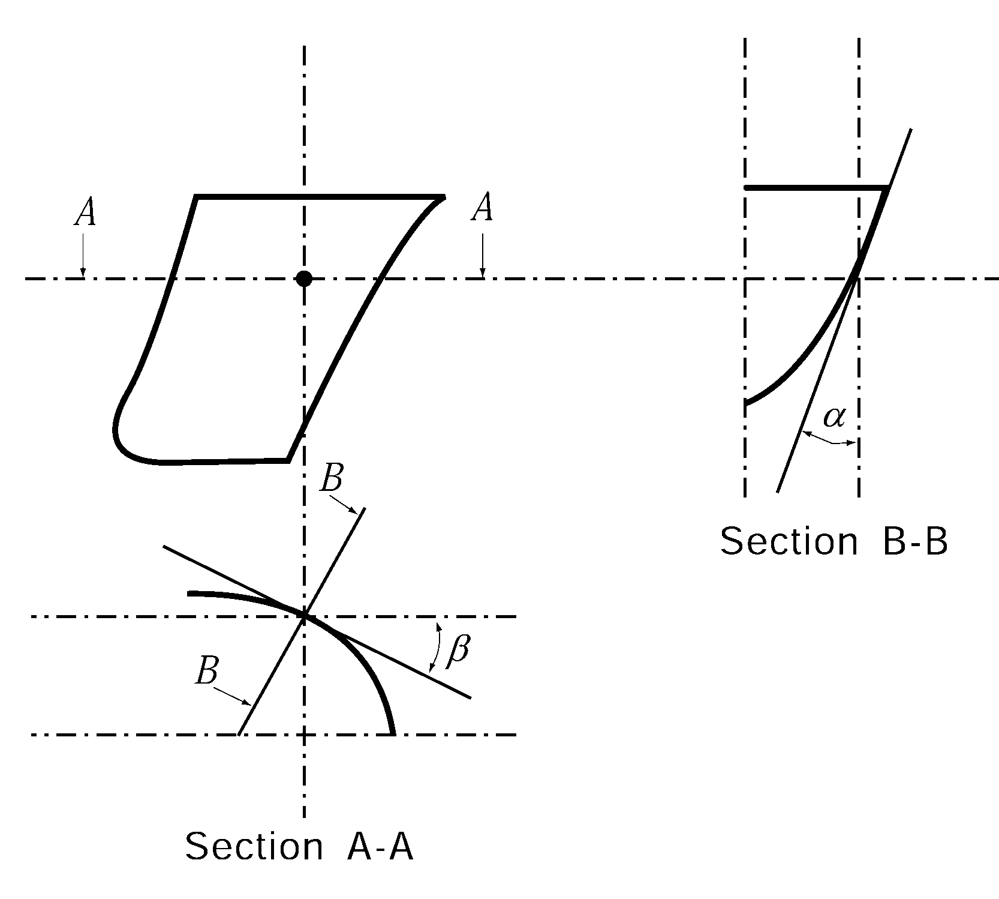
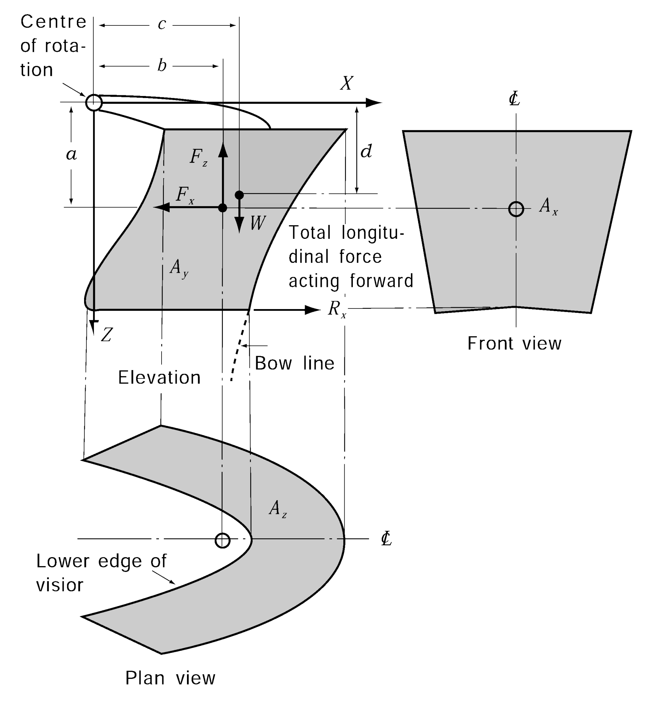
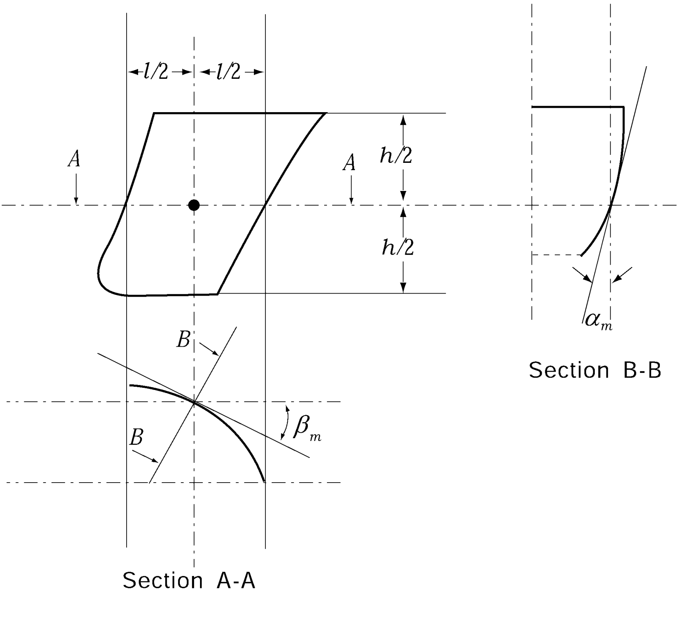
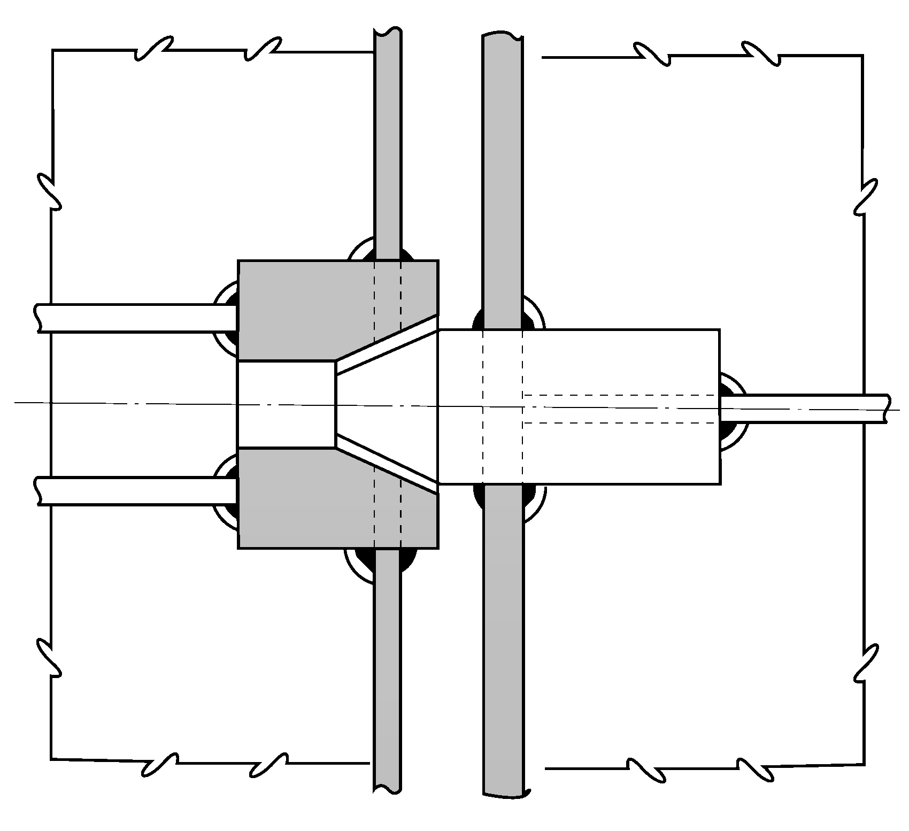

# PART 4 Hull Equipment

> RULES FOR CLASSIFICATION OF STEEL SHIPS / RA-04-E / 2025 / EN / Rules

## CHAPTER 3 BOW DOORS, SIDE AND STERN DOORS

### Section 1 Bow Doors and Inner Doors

#### 101. General

- **1.** **Application**
  - **(1)** These requirements apply to the arrangement, strength and securing of bow doors and inner doors leading to a complete or long forward enclosed superstructure or to a long non-enclosed superstructure, where fitted to attain minimum bow height equivalence.
  - **(2)** The requirements apply to all ro-ro passenger ships and ro-ro cargo ships engaged on international voyages and also to ro-ro passenger ships and ro-ro cargo ships engaged only in domestic (non-international) voyages, except where specifically indicated otherwise herein. Where differently deliberated by the competent Flag Administrations, shall be in accordance with the relevant requirements of Flag Administrations.
  - **(3)** The requirements are not applicable to high speed, light displacement craft as defined in the IMO Code of Safety for High Speed Craft.
  - **(4)** The bow door and inner door of all existing ro-ro passenger ships constructed before or on 30 June 1996 are to be deemed appropriate by the Society. **【See Guidance】**
- **2.** **Kinds of bow doors**
  The kinds of bow doors which are applied by this Chapter are generally two types as follows. However, other types of bow doors will be specially considered in association with the applicable requirements of these rules by the Society, except for following (1) and (2).
  - **(1)** Visor door
    Visor doors opened by rotating upwards and outwards about a horizontal axis through two or more hinges located near the top of the door and connected to the primary structure of the door by longitudinally arranged lifting arms.
  - **(2)** Side-opening door
    Side-opening doors opened either by rotating outwards about a vertical axis through two or more hinges located near the outboard edges or by horizontal translation by means of linking arms arranged with pivoted attachments to the door and the ship. It is anticipated the side-opening bow doors are arranged in pairs.
- **3.** **Arrangement**
  Arrangements for the bow door and inner door are to comply with the following (1) to (5)
  - **(1)** Bow doors are to be situated above the freeboard deck except that where a watertight recess fitted for arrangement of ramps or other related mechanical devices is located forward of the collision bulkhead and above the deepest waterline, the bow doors may be situated above the recess.
  - **(2)** An inner door which is to be part of the collision bulkhead is to be fitted. The inner door does not need to be fitted directly above the bulkhead. Where the vehicle ramp is arranged as a part of collision bulkhead, and its position complies with requirements of **Pt 3, Ch 14, 201.** of the Rules, the vehicle ramp may be regarded as an inner door. If this is not possible, a separate inner weather door is to be installed.
  - **(3)** Bow doors and inner doors are to be arranged so as to preclude the possibility of the bow door causing structural damage to the inner door or to the collision bulkhead in the case of damage to or detachment of the bow door. If this is not possible, a separate inner weathertight door is to be installed, as indicated in **Pt 3, Ch 14, 201.** of the Rules
  - **(4)** Bow doors are to be so fitted as to ensure tightness consistent with operational conditions and to give effective protection to inner doors. Inner doors forming part of the collision bulkhead are to be weathertight over the full height of the cargo space and arranged with fixed sealing supports on the aft side of the doors.
  - **(5)** The requirements for inner doors are based on the assumption that vehicle are effectively lashed and secured against movement in stowed position.
- **4.** **Definitions**
  The definitions which are used in this Chapter are as follows.
  - **(1)** Securing device
    A device used to keep the door closed by preventing it from rotating about its hinges or its pivoted attachments to the ship.
  - **(2)** Supporting device
    A device used to transmit external or internal loads from the door to a securing device and from the securing device to the ship's structure, or a device other than a securing device, such as a hinge, stopper or other fixed devices, that transmits loads from the door to the ship's structure.
  - **(3)** Locking device
    A device that locks a securing device in the closed position.
  - **(4)** Ro-ro passenger ship
    Passenger ship with ro-ro spaces or special category spaces.
  - **(5)** Ro-ro spaces
    Ro-ro spaces are spaces not normally sub-divided in any way and normally extending to either a substantial length or the entire length of the ship, in which motor vehicles with fuel in their tanks for their own propulsion and/or goods (packaged or in bulk, in or on rail or road cars, vehicles (including road or rail tankers), trailers, containers, pallets, demountable tanks or in or on similar stowage units or, other receptacles) can be loaded and unloaded normally in a horizontal direction.
  - **(6)** Special category spaces
    Special category spaces are those enclosed vehicle spaces above or below the bulkhead deck, into and from which vehicles can be driven and to which passengers have access. Special category spaces may be accommodated on more than one deck provided that the total overall clear height for vehicles does not exceed 10 m.

#### 102. Strength criteria

- **1.** **Primary structure and securing and supporting devices**
  Scantlings of the primary members, securing and supporting devices of bow doors and inner doors are to be determined to withstand the design loads defined in **103.**, using the following permissible stresses of **Table 4.3.1.**

  | Stress | Permissible stress (N/mm^2) |
  | --- | --- |
  | Shear stress ($\tau$) | $\tau = 80/K$ |
  | Bending stress ($\sigma$) | $\sigma = 120/K$ |
  | Equivalent stress $left( \sigma_e = \sqrt{\sigma^2 + 3 \tau^2} right)$ | $\sigma_e = 150/K$ |
  | $K$ = material factor as specified in **Table 4.3.2** |   |
- **2.** The buckling strength of primary members is to be verified as being adequate.
- **3.** **Stress of steel bearings in securing and supporting devices**
  For steel to steel bearings in securing and supporting devices, the nominal bearing pressure calculated by dividing the design force by the projected bearing area is not to exceed 0.8$\sigma_y$.
  $\sigma_y$ = the yield stress of the bearing material
- **4.** **Tensile stress on threaded bolts**
  The arrangement of securing and supporting devices is to be such that threaded bolts do not carry support forces. The maximum tension in way of bolts not carrying support forces is not to exceed 125/$K$ (N/mm^2).
  $K$ = material factor as specified in **Table 4.3.2.**

#### 103. Design loads

- **1.** **Bow doors**
  - **(1)** External pressure
    Design external pressure $P_e$, to be considered for the scantlings of primary members, securing and supporting devices of bow doors is to be taken as indicated by the following formula.
    $P_e = 2.75 lambdaC_H (0.22 + 0.15 \tan \alpha) (0.4V \sin \beta +0.6 \sqrt {L} ) ^{2}$(kN/m^2)
    where :
    $V$ = contractual ship's speed, in knots
    $L$ = ship's length, in m, as specified in **Pt 3, Ch 1, 102.** of the Rules, but need not be taken greater than 200 m.
    $\lambda$ = coefficient depending on the area where the ship is intended to be operated :
    for sea going ships $\lambda=1.0$
    for ships operated in coastal waters $\lambda=0.8$
    for ships operated in sheltered waters $\lambda=0.5$
    $C_H$ = coefficient that obtained from ship length as specified in **Table 4.3.3.**
    $\alpha$ = flare angle at the point to be considered, defined as the angle between a vertical line and the tangent to the side shell plating measured in a vertical plane normal to the horizontal tangent to the shell plating (See **Fig 4.3.1**).
    $\beta$ = entry angle at the point to be considered, defined as the angle between a longitudinal line parallel to the centerline and the tangent to the shell plating in a horizontal plane (See **Fig 4.3.1**).

    | Material | $K$ |
    | --- | --- |
    | *A, B, D* or *E* | 1.0 |
    | *AH* 32, *DH* 32 or *EH* 32 | 0.78 |
    | *AH* 36, *DH* 36 or *EH* 36 | 0.72 |

    | $L$ | $C_H$ |
    | --- | --- |
    | $L < 80 m$ | $L/80$ |
    | $L \geq 80 m$ | 1.0 |

    
    Fig 4.3.1 Entry and flare angle
  - **(2)** External forces
    The design external forces considered in determining scantlings of securing and supporting devices of bow doors are not to be taken less than those given by the following formulae.
    $F_x = P_e _m A_x$
    $F_y = P_e _m A_y$
    $F_z = P_e _m A_z$
    $F_x$ = the design external force (kN) in the longitudinal direction.
    $F_y$ = the design external force (kN) in the horizontal direction.
    $F_z$ = the design external force (kN) in the vertical direction.
    $A_x$ = area, in m^2, of the transverse vertical projection of the door between the levels of the bottom of the door and the top of the upper deck bulwark, or between the bottom of the door and the top of the door, including the bulwark, where it is part of the door, whichever is the lesser. (see **Fig 4.3.2**)
    Where the flare angle of the bulwark is at least 15 degrees less than the flare angle of the adjacent shell plating, the height from the bottom of the door may be measured to the upper deck or to the top of the door, whichever is lesser. In determining the height from the bottom of the door to the upper deck or to the top of the door, the bulwark is to be excluded.
    $A_y$ = area, in m^2, of the longitudinal vertical projection of the door between the levels of the bottom of the door and the top of the upper deck bulwark, or between the bottom of the door and the top of the door, including the bulwark, where it is part of the door, whichever is the lesser. (see **Fig 4.3.2**)
    Where the flare angle of the bulwark is at least 15 degrees less than the flare angle of the adjacent shell plating, the height from the bottom of the door may be measured to the upper deck or to the top of the door, whichever is lesser.
    $A_z$ = area, in m^2, of the horizontal projection of the door between the levels of the bottom of the door and the top of the upper deck bulwark, or between the bottom of the door and the top of the door, including the bulwark, where it is part of the door, whichever is the lesser. (see **Fig 4.3.2**)
    Where the flare angle of the bulwark is at least 15 degrees less than the flare angle of the adjacent shell plating, the height from the bottom of the door may be measured to the upper deck or to the top of the door, whichever is lesser.
    $h$ = height(m) of the door between the levels of the bottom of the door and the upper deck, or between the bottom of the door and the top of the door, whichever is lesser.
    $l$ = fore and aft length(m^2) of the door at a height #eqnID-7722_s1 above the bottom of the door.
    $P_em$= external pressure, in kN/m^2, as given in **103.1** (1) with angles $\alpha_m$ and $\beta_m$ defined as follows :
    $\alpha_m$ = flare angle measured at a point on the bow door #eqnID-7772_s1 aft of the stem line on a plane #eqnID-7782_s1 above the bottom of the door (See **Fig 4.3.3**).
    $\beta_m$ = entry angle measured at a point on the bow door #eqnID-7802_s1 aft of the stem line on a plane #eqnID-7812_s1 above the bottom of the door (See **Fig 4.3.3**).
    For doors, including bulwark, of unusual form or proportions, e.g. ships with a rounded nose and large stem angles, the area and angles used for determination of the design values of external forces may require to be specially considered.
    
    Fig 4.3.2 Visor type bow door 
    Fig 4.3.3 #eqnID-782 and #eqnID-783
  - **(3)** For visor doors the closing moment $M_y$ under external loads, in kN-m, is to be taken as the following formula.
    $M_y = F_x a + 10 W c - F_z b$(kN-m)
    $F_x$ and $F_z$ = as specified in above (2).
    $W$ = mass of the visor door (*ton*)
    $a$ = vertical distance from visor pivot to the centroid of the transverse vertical projected area of the visor door (m)
    $b$ = horizontal distance from visor pivot to the centroid of the horizontal projected area of the visor door (m)
    $c$ = horizontal distance from the visor pivot to the center of gravity of the visor mass (m)
  - **(4)** Moreover, the lifting arms of a visor door and its supports are to be dimensioned for the static and dynamic forces applied during the lifting and lowering operations, and a minimum wind pressure of 1.5 kN/m^2 is to be taken into account.
- **2.** **Inner door**
  - **(1)** External pressure
    The design external pressure, in kN/m^2, considered for the scantlings of primary members, securing and supporting devices and surrounding structure of inner doors is to be taken as the greater of $P_e1$ or $P_e2$ as given by the following formulae.
    $P_e1 = 0.45 L {\mathrm{kN/m^2 }}, P_e2 = 10 h {\mathrm{kN/m^2 }}$
    $h$ = the distance from the load point to the top of the cargo space (m).
    $L$ = ship's length(m), as defined in **Pt 3, Ch 1, 102.** of the Rules . But need not be taken greater than 200 m.
  - **(2)** Internal pressure
    The design internal pressure, $P_i$, considered for the scantlings of securing devices of inner doors is not to be less than 25 kN/m^2.

#### 104. Scantlings of bow doors

- **1.** **General**
  - **(1)** The strength of bow doors is to be commensurate with that of the surrounding structure.
  - **(2)** Bow doors are to be adequately stiffened and means are to be provided to prevent lateral or vertical movement of the doors when closed. For visor doors adequate strength for the opening and closing operations is to be provided in the connections of the lifting arms to the door structure and to the ship structure.
- **2.** **Primary structure**
  Scantlings of the primary members are generally to be supported by direct strength calculations in association with the external pressure given in **103. 1.** (1) and permissible stresses given in **Table 4.3.1**. Normally, formulae for simple beam theory may be applied to determine the bending stress. Members are to be considered to have simply supported end connections.
- **3.** **Secondary stiffeners**
  Secondary stiffeners are to be supported by primary members constituting the main stiffening of the door. The section modulus of secondary stiffeners is not to be less than that required for end framing. Consideration is to be given, where necessary, to differences in fixity between ship's frames and bow doors stiffeners. In addition, stiffener webs are to have a net sectional area, *A*, not less than that obtained from the following formula.
  $A = \frac{QK}{10}$ (cm^2)
  $Q$ = shear force (kN) in the stiffener calculated by using uniformly distributed external pressure $P_e$
  $P_e$ = as specified in **103. 1.** (1)
  $K$ = material factor as specified in **Table 4.3.2**
- **4.** **Plating**
  The thickness of bow door plating is to be not less than that required for the side shell plating, using bow door stiffener spacing, but in no case less than the minimum required thickness of fore end shell plating.

#### 105. Scantlings of inner doors

- **1.** **General**
  - **(1)** Scantlings of the primary members are generally to be supported by direct strength calculations in association with the external pressure given in **103. 2.** (1) and permissible stresses given in **Table 4.3.1.** Normally, formulate for simple beam theory may be applied.
  - **(2)** Where inner doors also serve as a vehicle ramps, the scantlings are not to be less than those required for vehicle decks.

#### 106. Securing and supporting of bow doors

- **1.** **General**
  - **(1)** Bow doors are to be fitted with adequate means of securing and supporting so as to be commensurate with the strength and stiffness of the surrounding structure.
  - **(2)** The hull supporting structure in way of the bow doors is to be suitable for the same design loads and design stresses as the securing and supporting devices.
  - **(3)** Where packing is required, the packing material is to be of a comparatively soft type, and the supporting forces are to be carried by the steel structure only. Other types of packing may be considered.
  - **(4)** Maximum design clearance between securing and supporting devices is not generally to exceed 3 mm.
  - **(5)** A means is to be provided for mechanically fixing the door in the open position.
  - **(6)** Only the active supporting and securing devices having an effective stiffness in the relevant direction are to be included and considered to calculate the reaction forces acting on the devices.
  - **(7)** Small and/or flexible devices such as cleats intended to provide load compression of the packing material are not generally to be included in the calculations.
  - **(8)** The number of securing and supporting devices are generally to be the minimum practical whilst taking into account the requirements for redundant provision given in **Par 2** (6), (7) and the available space for adequate support in the hull structure.
  - **(9)** For opening outwards visor doors, the pivot arrangement is generally to be such that the visor is self closing under external loads, that $M_y >0$. Moreover, the closing moment $M_y$ as given in **103. 1,** (3) (A) is to be not less than:
    $M_yo = 10 Wc + 0.1 \sqrt{a^2 + b^2} \times \sqrt {F_x^2 +F_z^2}$(kN-m)
    $W$, $a$, $b$, $c$, $F_x$ and $F_z$ = as specified in **103.**
- **2.** **Scantlings**
  - **(1)** Securing and supporting devices are to be adequately designed so that they can withstand the reaction forces within the permissible stresses given in **Table 4.3.1.**
  - **(2)** For visor doors the reaction forces applied on the effective securing and supporting devices assuming the door as a rigid body are determined for the following combination of external loads acting simultaneously together with the self weight of the door :
    where $F_x$, $F_y$ and $F_z$ are determined as indicated in **103. 1.** (2) and applied at the centroid of projected areas.
    - **(A)** Case 1 $F_x$ and $F_z$
    - **(B)** Case 2 0.7 $F_y$ acting on each side separately together with 0.7 $F_x$ and 0.7 $F_z$
  - **(3)** For side-opening doors the reaction forces applied on the effective securing and supporting devices assuming the door as a rigid body are determined for the following combination of external loads acting simultaneously together with the self weight of the door:
    where $F_x$, $F_y$ and $F_z$ are determined as indicated in **103. 1.** (2) and applied at the centroid of projected areas.
    - **(A)** Case 1 $F_x$, $F_y$ and $F_z$
    - **(B)** Case 2 0.7 $F_x$ and 0.7 $F_z$ acting on both doors and 0.7 $F_y$ acting on each door separately.
  - **(4)** The support forces as determined according to above (2) (A) and (3) (A) shall generally give rise to a zero moment about the transverse axis through the centroid of the area $A_x$. For visor doors, longitudinal reaction forces of pin and/or wedge supports at the door base contributing to this moment are not to be of the forward direction.
  - **(5)** The distribution of the reaction forces acting on the securing and supporting devices may require to be supported by direct calculations taking into account the flexibility of the hull structure and the actual position and stiffness of the supports.
  - **(6)** The arrangement of securing and supporting devices in way of these securing devices is to be designed with redundancy so that in the event of failure of any single securing or supporting device the remaining devices are capable to withstand the reaction forces without exceeding by more than 20 percent the permissible stresses as given in **Table 4.3.1.**
  - **(7)** For visor doors, two securing devices are to be provided at the lower part of the door, each capable of providing the full reaction force required to prevent opening of the door within the permissible stresses given in **Table 4.3.1.** The opening moment $M_0$, in kN-m, to be balanced by this reaction force, is not to be taken less than:
    $M_0 = 10 W d + 5A_x a$(kN-m)
    where :
    $A_x$ = as specified in **103. 1.** (2)
    $a$ = as specified in **103. 1.** (3)
    $d$ = vertical distance from the hinge axis to centre of gravity of the door (m)
    $W$ = as specified in **103. 1.** (3)
  - **(8)** For visor doors, the securing and supporting devices excluding the hinges should be capable of resisting the vertical design force ($F_z - 10 W$), in kN, within the permissible stresses given in **Table 4.3.1.**
  - **(9)** All load transmitting elements in the design load path, from door through securing and supporting devices into the ship structure, including welded connections, are to be to the same strength standard as required for the securing and supporting devices. These elements include pins, supporting brackets and back-up brackets.
  - **(10)** For side-opening doors, thrust bearing has to be provided in way of girder ends at the closing of the two leaves to prevent on leaf to shift towards the other one under effect of unsymmetrical pressure (See **Fig 4.3.4**). Each part of the thrust bearing has to be kept secured on the other part by means of securing devices.
    
    Fig 4.3.4 Example of thrust bearing

#### 107. Securing and locking arrangement

Securing devices are to be equipped with mechanical locking arrangement (self locking or separate arrangement), or to be of the gravity type. Those devices are to comply with the requirements of the following **Par 1** and **2.**

- **1.** **Operation**
  Securing devices are to be simple to operate and easily accessible. The opening and closing systems as well as securing and locking devices are to be interlocked in such a way that they can only operate in the proper sequence.
  - **(1)** Hydraulic securing devices
    Where hydraulic securing devices are applied, the system is to be mechanically lockable in closed position. This means that, in the event of loss of the hydraulic fluid, the securing devices remain locked. The hydraulic system for securing and locking devices is to be isolated from other hydraulic circuits, when in closed position.
  - **(2)** Bow doors and inner doors giving access to vehicle decks are to be provided with an arrangement for remote control, from a position above the freeboard deck, of
    - **(A)** the closing and opening of the doors, and
    - **(B)** associate securing and locking devices for every door.
  - **(3)** Remote control
    Indication of the open/closed position of every door and every securing and locking device is to be provided at the remote control stations. The operating panels for operation of doors are to be inaccessible to unauthorized persons. A notice plate, giving instructions to the effect that all securing devices are to be closed and locked before leaving harbour, is to be placed at each operating panel and is to be supplemented by warning indicator lights.
- **2.** **Indication and monitoring**
  - **(1)** Separate indicator lights and audible alarms are to be provided on the navigation bridge and on the operating panel to show that the bow door and inner door are closed and that their securing and locking devices are properly positioned. The indication panel is to be provided with a lamp test function. It shall not be possible to turn off the indicator light.
  - **(2)** The indicator system is to be designed on the fail safe principle and is to show by visual alarms if the door is not fully closed and not fully locked and by audible alarms if securing devices become open or locking devices become unsecured. The power supply for the indicator system for operating and closing doors is to be independent of the power supply for operating and closing the doors and is to be provided with a back-up power supply from the emergency source of power or other secure power supply e.g. UPS. The sensors of the indicator system are to be protected from water, ice formation and mechanical damage.
  - **(3)** The indication panel on the navigation bridge is to be equipped with a mode selection function “harbour/sea voyage”, so arranged that audible alarm is given on the navigation bridge if the vessel leaves harbour with the bow door or inner door not closed or with any of the securing devices not in the correct position.
  - **(4)** A water leakage detection system with audible alarm and television surveillance is to be arranged to provide an indication to the navigation bridge and to the engine control room of leakage through the inner door.
  - **(5)** Between the bow door and the inner door a television surveillance system is to be fitted with a monitor on the navigation bridge and in the engine control room. The system is to monitor the position of the doors and a sufficient number of their securing devices. Special consideration is to be given for the lighting and contrasting colour of objects under surveillance.
  - **(6)** A drainage system is to be arranged in the area between bow door and ramp or where no ramp is fitted between the bow door and inner door. The system is to be equipped with an audible alarm function to the navigation bridge being set off when the water levels in these areas exceed 0.5m or the high water level alarm, whichever is lesser.
  - **(7)** The indicator system is considered designed on the fail - safe principal in above (2) to (6) when:
    - a power failure alarm
    - an earth failure alarm
    - a lamp test
    - separate indication for door closed, door locked, door not closed and door not locked.
    - **(A)** The indication panel is provided with:
    - **(B)** Limit switches electrically closed when the door is closed (when more limit switches are provided they may be connected in series).
    - **(C)** Limit switches electrically closed when securing arrangements are in place (when more limit switches are provided they may be connected in series).
    - **(D)** Two electrical circuits (also in one multicore cable), one for the indication of door closed / not closed and the other for door locked / not locked.
    - **(E)** In case of dislocation of limit switches, indication to show : not closed / not locked / securing arrangement not in place - as appropriate.
  - **(8)** For ro-ro passenger ships on international voyages, the special category spaces and ro-ro spaces are to be continuously patrolled or monitored by effective means, such as television suveillance, so that any movement of vehicles in adverse weather conditions or unauthorized access by passengers thereto, can be detected whilst the ship is underway.

#### 108. Operating and maintenance manual

- **1.** An Operating and Maintenance Manual for the bow door and inner door is to be provided on board and is to contain necessary information after approval of this Society.
  - **(1)** main particulars and design drawings
    - **(A)** special safety precautions
    - **(B)** details of vessel
    - **(C)** equipment and design loading (for ramps)
    - **(D)** key plan of equipment (doors and ramps)
    - **(E)** manufacturer’s recommended testing for equipment
    - **(F)** description of equipment for
      - **(a)** bow doors
      - **(b)** inner bow doors
      - **(c)** bow ramp/doors
      - **(d)** side doors
      - **(e)** stern doors
      - **(f)** central power pack
      - **(g)** bridge panel
      - **(h)** engine control room panel
  - **(2)** service conditions
    - **(A)** limiting heel and trim of ship for loading/unloading
    - **(B)** limiting heel and trim for door operations
    - **(C)** doors/ramps operating instructions
    - **(D)** doors/ramps emergency operating instructions
  - **(3)** maintenance
    - **(A)** schedule and extent of maintenance
    - **(B)** trouble shooting and acceptable clearances
    - **(C)** maufacturer’s maintenance procedures
  - **(4)** register of inspections, including inspection of locking, securing and supporting devices, repairs and renewals.
    This Manual has is to be submitted for approval that the above mentioned items are contained in the OMM and that the maintenance part includes the necessary information with regard to inspections, trouble-shooting and acceptance / rejection criteria.
- **2.** Documented operating procedures for closing and securing the bow door and inner door are to be kept on board and posted in appropriate place.

### Section 2 Side and Stern Doors

#### 201. General

- **1.** **Application**
  - **(1)** These rules give requirements for the arrangement, strength and securing of side shell doors, abaft the collision bulkhead, and stern doors leading into enclosed spaces.
  - **(2)** The side shell door and stern door of all existing ro-ro passenger ships constructed before or on 30 June 1997 are to be as deemed appropriate by the Society. **【See Guidance】**
- **2.** **Arrangement**
  - **(1)** Stern doors for passenger vessels are to be situated above the freeboard deck. Stern doors for ro-ro cargo ships and side shell doors may be either below or above the freeboard deck.
  - **(2)** The side and stern doors are to be so fitted as to ensure tightness and structural integrity commensurate with their location and the surrounding structure.
  - **(3)** In general, the lower edge of door openings is not to be below a line drawn parallel to the freeboard deck at side, which is at its lowest point at least 230 mm above the upper edge of the uppermost load line.
  - **(4)** Where side door and stern door are unavoidably provided below the line as stipulated in above (3), the following conditions are to be satisfied.
    - **(A)** Compartment being equivalent to watertight-bulkhead in strength and watertightness is to be provided and the second door is to be fitted for the compartment.
    - **(B)** Detecting device for sea water leakage is to be provided in the compartment and drainage means of the compartment with a screw-down stop valve capable of being controlled from easily accessible position is to be provided.
  - **(5)** Doors are generally to be arranged to open outwards.
- **3.** **Definitions**
  The definitions specified in this Section are to be in accordance with **101. 4.**

#### 202. Strength criteria

- **1.** **Primary structure and securing and supporting devices**
  Scantlings of the primary members, securing and supporting devices of doors are to be determined to withstand the design loads defined in **203.**, using the following permissible stresses of **Table 4.3.1.**
- **2.** The bucking strength of primary members is to be verified as being adequate.
- **3.** **Steel of steel bearings in securing and supporting devices**
  For steel to steel bearings in securing and supporting devices, the nominal bearing pressure calculated by dividing the design force by the projected bearing area is not to exceed 0.8$\sigma_y$.
  $\sigma_y$ = the yield stress of the bearing material.
- **4.** **Tensile stress on threaded bolts**
  The arrangements of securing and supporting devices is to be such that threaded bolts do not carry support forces. The maximum tension in way of threads bolts not carrying support forces is not to exceed 125$/K$(N/mm^2).
  $K$ = material factor as specified in **Table 4.3.2.**

#### 203. Design Loads

The design forces considered for the scantlings of primary members, securing and supporting devices are not to be less than the following **Par 1** to **3.**

- **1.** Design forces for securing or supporting devices of doors opening inwards :
  External force : $F_e = A P_e + F_p$(kN)
  Internal force : $F_i = F_0 + 10 W$(kN)
- **2.** Design forces for securing or supporting devices of doors opening outwards :
  External force : $F_e = AP_e$(kN)
  Internal force : $F_i = F_0 + 10 W + F_p$(kN)
- **3.** Design forces for primary members is to be taken as the greater of the following two formulae :
  External force : $F_e = AP_e$(kN)
  Internal force : $F_i = F_0 + 10W$(kN)
  where :
  $A$ = area, in $m^2$, of the door opening
  $W$ = mass of the door (*ton*)
  $F_p$ = total paking force in kN, packing line pressure is normally not to be taken less than 5 N/mm.
  $F_0$ = the greater of $F_c$ and 5$A$(kN)
  $F_c$ = accidental force, in kN, due to loose of cargo etc., to be uniformly distributed over the area $A$ and not to be taken less than 300 kN. For small doors such as bunker doors and pilot doors, the value of $F_c$ may be appropriately reduced. However, the value of $F_c$ may be taken as zero, provided an additional structure such as an inner ramp is fitted, which is capable of protecting the door from accidental forces due to loose cargoes.
  $P_e$ = external design pressure, in kN/m^2, determined at the centre of gravity of the door opening and not taken less than the value obtained from the following formulae.
  for $Z_G < T$, $10(T - Z_G ) + 25$
  for $Z_G \geq T$, $25$
  However, for stern doors of ships fitted with bow doors, $P_e$ is not to be taken less than:
  $P_e = 0.6 lambdaC_H (0.8 + 0.6 sqrtL )^2$(kN/m^2)
  where :
  $C_H$ = coefficient that obtained from ship's length as specified in **Table 4.3.3.**
  $L$ = ship's length, in m, as specified in **Pt 3, Ch 1, 102.** of the Rules, but need not be taken greater than 200 m
  $Z_G$ = height of the center of area of the door, in m, above the baseline
  $\lambda$ = coefficient depending on the area where the ship is intended to be operated :
  for sea going ships $\lambda$ = 1
  for ships operated in coastal waters $\lambda$ = 0.8
  for ships operated in sheltered waters $\lambda$ = 0.5
  $T$ = draught, in m, at the highest subdivision load line

#### 204. Scantlings

- **1.** **General**
  - **(1)** In general the strength of side and stern doors is to be equivalent to the strength of the surrounding structure.
  - **(2)** Side and stern door openings in the side shell are to have well rounded corners and adequate compensation is to be arranged with web frames at sides and stringers or equivalent above and below.
  - **(3)** Side and stern doors are to be adequately stiffened, and means are to be provided to prevent movement of the doors when closed. Adequate strength is to be provided in the connections of the lifting/maneuvering arms and hinges to the door structure and to the ship structure.
  - **(4)** Where side and stern doors also serve as vehicle ramps, the design of the hinges should take into account the ship angle of trim which may result in uneven loading on the hinges.
- **2.** **Plating**
  - **(1)** The thickness of the side and stern door plating is not to be less than the side shell plating calculated with the door stiffener spacing, and in no case to be less than the minimum shell plate thickness.
  - **(2)** Where side and stern doors also serve as vehicle ramps, the plating is not to be less than required for vehicle decks.
- **3.** **Stiffeners**
  - **(1)** The section modulus of horizontal or vertical stiffeners is not to be less than required for side framing. Consideration is to be given, where necessary, to differences in fixity between ship's frame and door stiffeners.
  - **(2)** Where side and stern doors also serve as vehicle ramps, the stiffener scantlings are not to be less than required for vehicle decks.
  - **(3)** Where necessary, side and stern door stiffeners are to be supported by girders or stringers.
- **4.** **Primary members**
  - **(1)** Scantlings of primary members are generally to be supported by direct calculations in association with the design forces given in **203. 3** and permissible stresses given in **Table 4.3.1.** Normally, formulae for simple beam theory may be applied to determine the bending stress. Members are to be considered to have simply supported end connections.
  - **(2)** The webs of girders and stringers are to be adequately stiffened, preferably in a direction perpendicular to the shell plating.
  - **(3)** The girder system is to be given sufficient stiffness to ensure integrity of the boundary support of the door.
  - **(4)** Edge stiffeners/girders should be adequately stiffened against rotation and are to have a moment of inertia, $I$, not less than that obtained from following formula.
    $I = 8 P_I d ^4$(cm^4)
    $d$ = distance (m) between closing devices.
    $P_I$ = packing line pressure along edges, not to be taken less than 5 N/mm.
  - **(5)** For edge girders supporting main door girders between securing devices, the moment of inertia is to be increased in relation to the additional force.

#### 205. Securing and supporting

- **1.** **General**
  - **(1)** Side shell doors and stern doors are to be fitted with adequate means of securing and supporting so as to be commensurate with the strength and stiffness of the surrounding structure.
  - **(2)** A means is to be provided for mechanically fixing the door in the open position.
  - **(3)** The hull supporting structure in way of the doors is to be suitable for the same design loads and design stresses as the securing and supporting devices.
  - **(4)** Where packing is required, the packing material is to be of a comparatively soft type, and the supporting forces are to be carried by the steel structure only. Other types of packing may be considered.
  - **(5)** Maximum design clearance between securing and supporting devices is not generally to exceed 3 mm.
  - **(6)** Only the active supporting and securing devices having an effective stiffness in the relevant direction are to be included and considered to calculate the reaction forces acting on the devices.
  - **(7)** Small and/or flexible devices such as cleats intended to provide local compression of the packing material are not generally to be included in the calculations.
  - **(8)** The number of securing and supporting devices are generally to be the minimum practical whilst taking into account the requirement for redundant provision given in **Par 2,** (3) and the available space for adequate support in the hull structure.
- **2.** **Scantlings**
  - **(1)** Securing and supporting devices are to be adequately designed so that they can withstand the reaction forces within the permissible stresses given in **Table 4.3.1.**
  - **(2)** The distribution of the reaction forces action on the securing devices and supporting devices may require to be supported by direct calculations taking into account the flexibility of the hull structure and the actual position of the supports.
  - **(3)** The arrangement of securing devices and supporting devices in way of these securing devices is to be designed with redundancy so that in the event of failure of any single securing or supporting device the remaining devices are capable to withstand the reaction forces without exceeding by more than 20 percent the permissible stresses as given in **Table 4.3.1.**
  - **(4)** All load transmitting elements in the design load path, from the door through securing and supporting devices into the ship's structure, including welded connections, are to be to the same strength standard as required for the securing and supporting devices. These elements include pins, supporting brackets and back-up brackets.

#### 206. Securing and locking arrangement

Securing devices are to be equipped with mechanical locking arrangement (self locking or separate arrangement), or to be of the gravity type. Those devices are to comply with the requirements of the following **Par 1** and **2.**

- **1.** **Operation**
  Securing devices are to be simple to operate and easily accessible. The opening and closing systems as well as securing and locking devices are to be interlocked in such a way that they can only operate in the proper sequence.
  - **(1)** Doors which are located partly or totally below the free board deck with a clear opening area greater than 6 m^2 are to be provided with an arrangement for remote control, from a position above the freeboard deck, of
    - **(A)** the closing and opening of the doors,
    - **(B)** associated securing and locking devices.
  - **(2)** Remote control
    For doors which are required to be equipped with a remote control arrangement, indication of the open/closed position of the door and the securing and locking device is to be provided at the remote control stations. The operating panels for operation of doors are to be inaccessible to unauthorized persons. A notice plate, giving instructions to the effect that all securing devices are to be closed and locked before leaving harbour, is to be placed at each operating panel and is to be supplemented by warning indicator lights.
  - **(3)** Hydraulic securing devices
    Where hydraulic securing devices are applied, the system is to be mechanically lockable in closed position. This means that, in the event of loss of the hydraulic fluid, the securing devices remain locked. The hydraulic system for securing and locking devices is to be isolated from other hydraulic circuits, when closed position.
- **2.** **Systems for indication/monitoring**
  The following requirements apply to doors in the boundary of special category spaces or ro-ro spaces. For cargo ships, where no part of the door is below the uppermost waterline and the area of the door opening is not greater than 6 m^2, then the requirements of this section need not be applied.
  - **(1)** Indicators
    The indicator system is to be designed on the fail safe principle and in accordance with the following (A) to (D).
    Separate indicator lights and audible alarms are to be provided on the navigation bridge and on each operating panel to indicate that the doors are closed and that their securing and locking devices are properly positioned. The indication panel on the navigation bridge is to be equipped with mode a section function "harbour/sea voyage", so arranged that audible alarm is given if vessel leaves harbor with side shell or stern doors not closed or with any of the securing devices not in the correct position.
    Indicator lights are to be designed so that they cannot be manually turned off. The indication panel is to be provided with a lamp test-function
    The power supply for the indicator system is to be independent of the power supply for operating and closing the doors and is to be provided with a backup power supply.
    The sensors of the indicator system are to be protected from water, ice formation and mechanical damage.
    - **(A)** Location and type
    - **(B)** Indicator lights
    - **(C)** Power supply
    - **(D)** Protection of sensors
  - **(2)** Water leakage protection
    - **(A)** For passenger ships, a water leakage detection system with audible alarm and television surveillance is to be arranged to provide an indication to the navigation bridge and to the engine control room of leakage through the side shell and stern doors.
    - **(B)** For cargo ships, a water leakage detection system with audible alarm is to be arranged to provide an indication to the navigation bridge of leakage through the side shell and stern doors.

#### 207. Operating and maintenance manual

- **1.** An Operating and Maintenance Manual for the bow door and inner door is to be provided on board and is to contain necessary information after approval of this society.
  - **(1)** main particulars and design drawings
    - **(A)** special safety precautions
    - **(B)** details of vessel
    - **(C)** equipment and design loading (for ramps)
    - **(D)** key plan of equipment (doors and ramps)
    - **(E)** manufacturer’s recommended testing for equipment
    - **(F)** description of equipment for
      - **(a)** bow doors
      - **(b)** inner bow doors
      - **(c)** bow ramp/doors
      - **(d)** side doors
      - **(e)** stern doors
      - **(f)** central power pack
      - **(g)** bridge panel
      - **(h)** engine control room panel
  - **(2)** service conditions
    - **(A)** limiting heel and trim of ship for loading/unloading
    - **(B)** limiting heel and trim for door operations
    - **(C)** doors/ramps operating instructions
    - **(D)** doors/ramps emergency operating instructions
  - **(3)** maintenance
    - **(A)** schedule and extent of maintenance
    - **(B)** trouble shooting and acceptable clearances
    - **(C)** maufacturer’s maintenance procedures
  - **(4)** register of inspections, including inspection of locking, securing and supporting devices, repairs and renewals.
    This Manual has is to be submitted for approval that the above mentioned items are contained in the OMM and that the maintenance part includes the necessary information with regard to inspections, trouble-shooting and acceptance / rejection criteria.
- **2.** Documented operating procedures for closing and securing side shell and stern doors are to be kept on board and posted at the appropriate places. 
