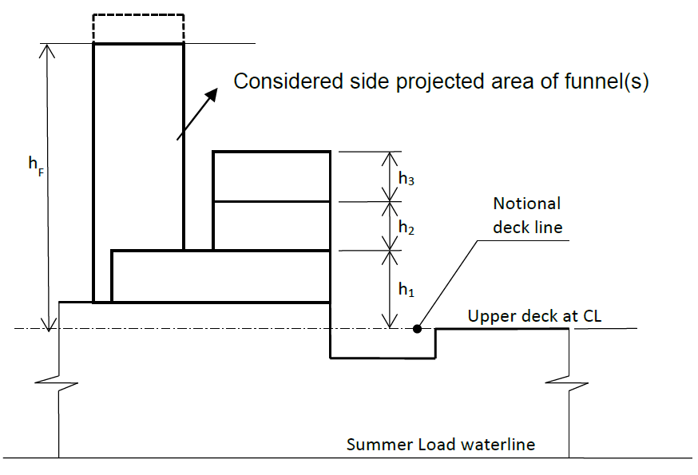
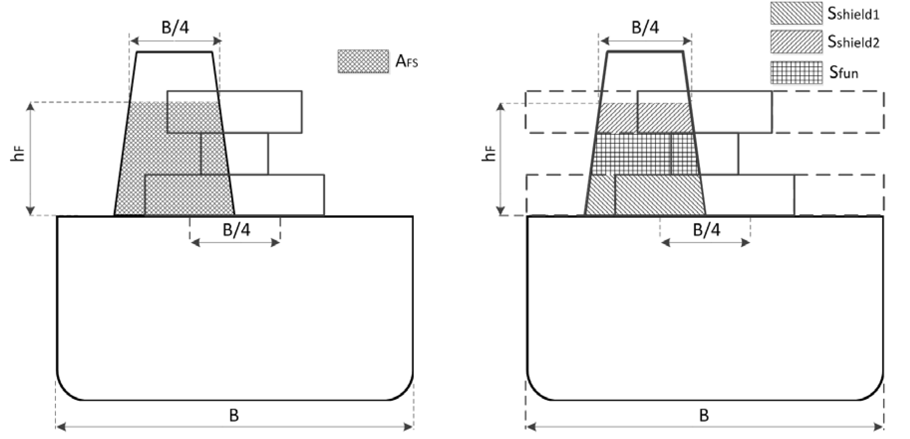
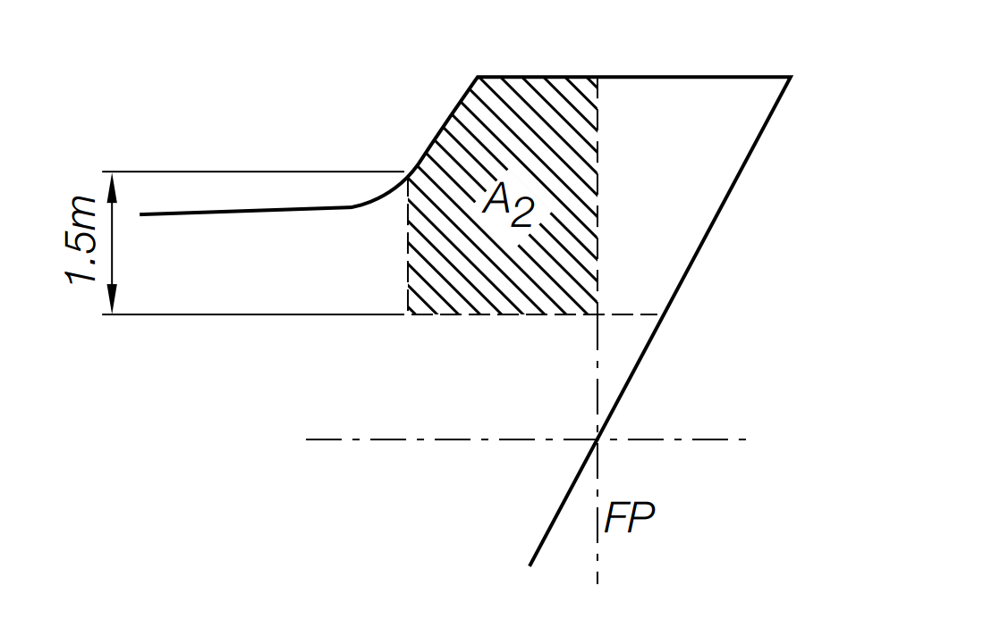
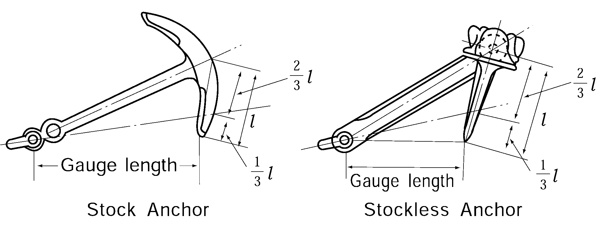
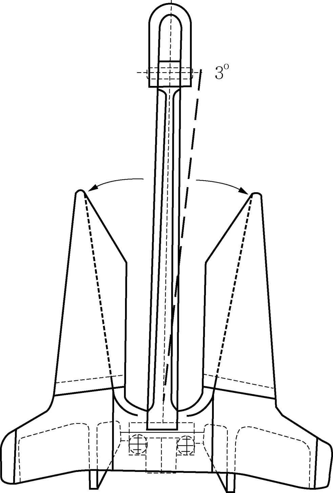
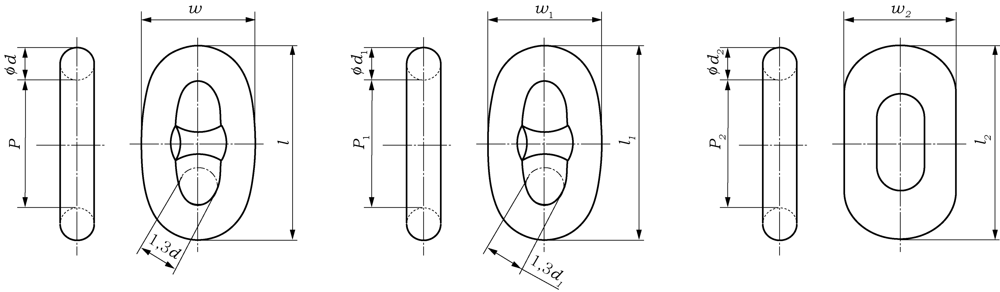

# PART 4 Hull Equipment

> RULES FOR CLASSIFICATION OF STEEL SHIPS / RA-04-E / 2025 / EN / Rules

## CHAPTER 8 EQUIPMENT NUMBER AND EQUIPMENT

### Section 1 General

#### 101. General and application 【See Guidance】

- **1.** All ships, according to their equipment number of provisions in **Sec 2,** are to be provided with anchors, chain cables, ropes, etc. which are not less than given in **Table 4.8.1.**
- **2.** **2**. The anchoring equipment required by Sec. 1 through 6 applies to vessels with unrestricted service. The requirements given in **Sec 1. 101. 5.** (1) B, **101. 5.** (6), **Sec 2, Sec 3** apply to vessels with restricted service area. Unrestricted service means a vessel engaged on international voyages, and not bounded by any limitations on operating environment reflected in vessel class notation. *(2024)*
- **3.** **3**. The anchors, chain cables and ropes (hereinafter referred to as "equipment") which are required to be tested and inspected to be used for ships classed with the Society are to comply with the requirements of this Chapter.
- **4.** The equipment other than those prescribed in this Chapter may be used where specially approved in connection with the design and use. In such case, the detailed data relating to the process of manufacture of the equipment are to be submitted for approval.
- **5.** All ships are to be provided with suitable appliances for handling of anchors as follows.
  - **(1)** General
    - **(A)** All ships are to be provided with suitable appliances for handling of anchors.
    - **(B)** The bower anchors given in **Table 4.8.1** are to be connected to their cables and stored on board ready for use. Anchor and chain cable are should be accordance with **Sec 3, 4**.
  - **(2)** Chain locker
    - **(A)** Chain locker is to have adequate capacity and be of a suitable from to provide for the proper stowage of the chain cable, allowing an easy direct lead for the cable into the chain pipes when the cable is fully stowed. Port and starboard cables are to have separate spaces.
    - **(B)** Chain locker boundaries and access opening are to be watertight and adequate drainage facilities for the chain locker are to be provided.
    - **(C)** Spurling pipes for chain cable leading to chain locker are to be of suitable size and provided with chafing lips.
    - **(D)** Securing of the inboard ends of chain cables.
      - **(a)** The inboard ends of the chain cables are to be secured to the structures by fastening able to withstand a force not less than 15% BL nor more than 30% BL (BL = breaking load of the chain cable).
      - **(b)** The fastening is to be provided with a mean suitable to permit, in case of emergency, an easy slipping of the chain cable to sea, operable from an accessible position outside the chain locker.
  - **(3)** Chain stopper
    - **(A)** Chain stopper are to be provided to secure each chain cable once it is paid out.
    - **(B)** Securing arrangements of chain stopper are to be capable of withstanding a load equal to 80% of the breaking load of the chain cable as required by **Table 4.8.8** of **411.**, without undergoing permanent deformation.
  - **(4)** Windlass
    Windlass of sufficient power and suitable for the size of chain is to be fitted to the ship. Where an owner requires equipment significantly in excess of Rule requirements, it is the owner's responsibility to specify increased windlass power.
  - **(5)** Hawse pipes
    - **(A)** Hawse pipes are to be of a suitable size and configuration to ensure adequate clearance and an easy lead of the chain cable from the chain stopper through the ship's side. Hawse pipes are to be of sufficient strength.
    - **(B)** Their position and slope are to be so arranged as to create an easy lead for the chain cables and efficient housing for the anchors, where the latter are of the retractable type, avoiding damage to the hull during these operations. For this purpose, charfing lips of suitable form with ample lay-up and radius adequate to the size of the chain cable are to be provided at the shell and deck. The shell plating in way of the hawse pipes is to be reinforced as necessary.
    - **(C)** Where hawse pipes are not fitted, alternative arrangements will be specially considered.
    - **(D)** Hawse pipes are to be securely attached to thick, doubling or insert plates, by continuous welds.
    - **(E)** Hawse pipes and anchor pockets are to have full rounded flanges or rubbling bars in order to minimize the nip on the cable and to minimize the probability of cable links being subjected to high bending stresses. The radius of curvature is to be such that at least three links of chain will bear simultaneously on the rounded parts of the upper and lower ends of the hawse pipes in those areas where the chain cable is supported during paying out and hoisting and when the ship is at anchor.
    - **(F)** On ships provided with a bulbous bow, where it is not possible to obtain a suitable clearance between shell plating and the anchors during anchor handling, local reinforcements of the bulbous bow are to be provided in the form of increased shell plate thickness.
  - **(6)** Supporting hull structures of anchor windlass and chain stopper
    The supporting hull structures of anchor windlass and chain stopper is to be sufficient to accommodate the operating and sea loads.
    The design loads are to be taken not less than:
    - for chain stoppers, 80% of the chain cable breaking load
    - for windlasses, where no chain stopper is fitted or the chain stopper is attached to the windlass, 80% of the chain cable breaking load
    - for windlasses, where chain stoppers are fitted but not attached to the windlass, 45% of the chain cable breaking load
    The design loads are to be applied in the direction of the chain cable.
    The sea loads are to be taken according to **Ch 9, Sec 3.**
    The stresses acting on the supporting hull structures of windlass and chain stopper, based on net thickness obtained by deducting the corrosion addition, tc, given in **101. 4.** (6). (D), are not to be greater than the following permissible values:
    ⓐ For strength assessment by means of beam theory or grillage analysis:
    - Normal stress : 1.0 R_eH
    - Shear stress : 0.6 R_eH
    The normal stress is the sum of bending stress and axial stress. The shear stress to be considered corresponds to the shear stress acting perpendicular to the normal stress. No stress concentration factors are to be taken into account.
    ⓑ For strength assessment by means of finite element analysis:
    - Von Mises stress : 1.0 R_eH
    For strength assessment by means of finite element analysis the mesh is to be fine enough to represent the geometry as realistically as possible. The aspect ratios of elements are not to exceed 3. Girders are to be modelled using shell or plane stress elements. Symmetric girder flanges may be modelled by beam or truss elements. The element height of girder webs must not exceed one-third of the web height. In way of small openings in girder webs, the web thickness is to be reduced to a mean thickness over the web height. Large openings are to be modelled. Stiffeners may be modelled using shell, plane stress, or beam elements. The mesh size of stiffeners is to be fine enough to obtain proper bending stress. If flat bars are modeled using shell or plane stress elements, dummy rod elements are to be modelled at the free edge of the flat bars and the stresses of the dummy elements are to be evaluated. Stresses are to be read from the centre of the individual element. For shell elements the stresses are to be evaluated at the mid plane of the element.
    R_eH is the specified minimum yield stress of the material.
    The corrosion addition, $t _{c}$, is not to be less than the following values:
    ⓐ Ships covered by Common Structural Rules for Bulk Carriers and Oil Tankers: Total corrosion additions to be as defined in these rules.
    ⓑ Other ships:
    - For the supporting hull structure, according to the Society’s Rules for the surrounding structure (e.g. deck structures, bulwark structures).
    - For pedestals and foundations on deck which are not part of a fitting according to an accepted industry standard : 2.0 mm.
    - For shipboard fittings not selected from an accepted industry standard : 2.0 mm.
    - **(A)** Design loads
    - **(B)** Sea loads
    - **(C)** Permissible streses
    - **(D)** Corrosion addition

#### 102. Materials

- **1.** The materials for equipment specified in this Chapter are to comply with the requirements in each Section and **Pt 2, Ch 1** of the Rules**.**
- **2.** The test pieces and testing procedures for materials of equipment are to comply with the requirements in each Section and **Pt 2, Ch 1** of the Rules**.**

#### 103. Process of manufacture

The process of manufactures for equipment specified in this Chapter is to comply with the requirements in each Section.

#### 104. Tests and inspections

- **1.** All equipment prescribed in this Chapter are to be tested and inspected in the presence of the Society's Surveyor in accordance with the requirements of this Chapter and are to comply with the requirements for the tests and inspections.
- **2.** Where equipment having characteristics differing from those prescribed in this Chapter are to be tested and inspected according to the approved specification for the testing.
- **3.** The tests and inspections for equipment may be dispensed with, where these equipment have appropriate certificates accepted by the Society. **【See Guidance】**

#### 105. Execution of tests and inspections

- **1.** The manufacturers shall afford the Surveyor all necessary facilities and access to all relevant parts of the works to enable him to verify that the approved process is adhered to.
- **2.** All tests and inspections of equipment are to be carried out at the place of manufacturer prior to delivery.

#### 106. Marking for accepted equipments

Equipment which have satisfactory complied with the required in this Chapter are to be stamped in accordance with the provisions in each Section.

### Section 2 Equipment Number

#### 201. Equipment number 【See Guidance】

Equipment number is the value obtained from the following formula:
$E= \Delta ^{\frac{2}{3}} +2.0(hB+S _{fun} )+ \frac{A}{10}$
where:
$\Delta$ = molded displacement in tonnes to the summer load waterline.
$B$ = moulded breadth, in m
$h$ = effective height, in m, from the summer load waterline to the top of the uppermost house
$h=a+ \sum _{} ^{} h _{i}$
$a$ = vertical distance at hull side, in m, from the Summer Load waterline amidships to the upper deck
$h _{i}$ = height, in m, on the centreline of each tier of houses having a breadth greater than B/4.
for the lowest tier h1 is to be measured at centreline from the upper deck or from a notional deck line where there is local discontinuity in the upper deck, see figure below for an example,
$S _{fun}$ = effective front projected area of the funnel, in m², defined as:
$S _{fun} =A _{FS} -S _{shield}$
$A _{FS}$ = front projected area of the funnel, in m², calculated between the upper deck at centreline, or notional deck line where there is local discontinuity in the upper deck, and the effective height $h _{F}$. $A _{FS}$ is taken equal to zero if the funnel breadth is less than or equal to B/4 at all elevations along the funnel height.
$h _{F}$ = effective height of the funnel, in m, measured from the upper deck at centreline, or notional deck line where there is local discontinuity in the upper deck, and the top of the funnel. The top of the funnel may be taken at the level where the funnel breadth reaches B/4.
$S _{shield}$= the section of front projected area $A _{FS}$, in m², which is shielded by all deck houses having breadth greater than B/4 . If there are more than one shielded section, the individual shielded sections i.e $S _{shield1}$, $S _{shield2}$ etc as shown in **Figure 4.8.2** to be added together. To determine #eqnID-940_s1the deckhouse breadth is assumed B for all deck houses having breadth greater than B/4 as shown for $S _{shield1}$, $S _{shield2}$ in **Figure 4.8.2.**
$A$ = side projected area, in m², of the hull, superstructures, houses and funnels above the Summer Load waterline which are within the equipment length of the ship and also have a breadth greater than B/4. The side projected area of the funnel is considered in $A$ when $A _{FS}$ is greater than zero. In this case, the side projected area of the funnel should be calculated between the upper deck, or notional deck line where there is local discontinuity in the upper deck, and the effective height $h _{F}$.

**Fig 4.8.1**

**Fig 4.8.2**
Notes:

- **1.** When calculating h, sheer and trim are to be ignored, i.e. h is the sum of freeboard amidships plus the height (at centreline) of each tier of houses having a breadth greater than B/4.
- **2.** If a house having a breadth greater than B/4 is above a house with a breadth of B/4 or less, then the wide house is to be included but the narrow house ignored.
- **3.** Screens or bulwarks 1.5 m or more in height are to be regarded as parts of houses when determining h and A. The height of the hatch coamings and that of any deck cargo, such as containers, may be disregarded when determining h and A. With regard to determining A, when a bulwark is more than 1.5 m high, the area shown below as A2 is to be included in A.
  
- **4.** The equipment length of the ship is the length between perpendiculars but is not to be less than 96% nor greater than 97% of the extreme length on the Summer Load waterline (measured from the forward end of the waterline).
- **5.** When several funnels are fitted on the ship, the above parameters are taken as follows:
  $h _{F}$ : effective height of the funnel, in m, measured from the upper deck, or notional deck line where there is local discontinuity in the upper deck, and the top of the highest funnel. The top of the highest funnel may be taken at the level where the sum of each funnel breadth reaches B/4.
  $A _{FS}$ : sum of the front projected area of each funnel, in m², calculated between the upper deck, or notional deck line where there is local discontinuity in the upper deck, and the effective height $h _{F}$. $A _{FS}$ is to be taken equal to zero if the sum of each funnel breadth is less than or equal to B/4 at all elevations along the funnels height.
  $A$ : Side projected area, in m², of the hull, superstructures, houses and funnels above the Summer Loadwaterline which are within the equipment length of the ship. The total side projected area of the funnels is to be considered in the side projected area of the ship, $A$, when $A _{FS}$ is greater than zero. The shielding effect of funnels in transverse direction may be considered in the total side projected area, i.e., when the side projected areas of two or more funnels fully or partially overlap, the overlapped area needs only to be counted once.

#### 202. Mass of anchors

- **1.** The mass of individual bower anchors may vary by ±7 % of the mass given in **Table 4.8.1** provided that the total mass of stipulated number of bower anchors is not less than obtained from multiplying the mass per anchor by the number given in **Table 4.8.1.** Where, however, an approval by the Society is obtained, the anchors which are increased in mass by more than 7 % may be used.
- **2.** Where stock anchors are used, the mass excluding the stock, is not to be less than 0.80 times the mass specified in **Table 4.8.1** for ordinary stockless bower anchors.
- **3.** Where high holding power anchors are used, the mass of each anchor may be 0.75 times the mass specified in **Table 4.8.1.**
- **4.** Where super high holding power anchors are used, the mass of each anchor may be 0.5 times the mass specified in **Table 4.8.1.** However, the mass of super high holding anchor is generally not to exceed 1500 kg.

#### 203. Chain cables and stream lines

- **1.** Chain cables for bower anchors are to be stud link chains of Grade 1, 2 or 3 specified in **Sec 4.** However, Grade 1 chains made of Class 1 chain bars (*RSBC* 31) are not to be used in association with high holding power anchors.
- **2.** As for chain cables or wire ropes for stream lines, the breaking test load specified in **Sec 4** or **5** is not to be less than the breaking load given in **Table 4.8.1** respectively.
- **3.** Steel wire rope instead of stud link chain cable are to be in accordance with the Guidance relating to the Rules specified by the Society for vessels of special design or operation such as crane barges. **【See Guidance】**
- **4.** The total length of chain given in **Table 4.8.1** is to be divided in approximately equal parts between the two bower anchors.
- **5.** Wire rope may be used in place of chain cable on ships subject to the following conditions: *(2024)*
  - **(1)** with less than 90 m in length and which will need an anchor for emergency purposes, i.e., not intended to use their anchor in normal temporary anchoring operation, or
  - **(2)** with the anchoring equipment used for positioning with a minimum of 4 points anchoring, e.g., for cable or pipe laying.
- **6.** Use of wire rope is subject to the following conditions: *(2024)*
  - **(1)** The length of the wire rope is to be equal to 1.5 times the corresponding tabular length of chain cable (**Table 4.8.1**) and their strength is to be equal to that of tabular chain cable of Grade 1 (**Table 4.8.8**).
  - **(2)** The anchor weight shall be increased by 25% compared to anchor associated with chain cable according to **Table 4.8.1**.
  - **(3)** A short length of chain cable is to be fitted between the wire rope and anchor having a length of 12.5 m or the distance between anchor in stowed position and winch, whichever is less.
  - **(4)** All surfaces being in contact with the wire need to be rounded with a radius of not less than 10 times the wire rope diameter (including stem).
  - **(5)** Steel wire shall be selected to fit for purpose based on the manufacturer recommendation and shall be provided with guidance for maintenance and inspection.

#### 204. Tow lines and mooring lines

- **1.** As for wire ropes and hemp ropes used as tow lines and mooring lines, the breaking test load specified in **Sec 5** or **6** is not to be less than the breaking load given **Table 4.8.1** respectively.
- **2.** For ships having the ratio $A/E$ above 0.9, the following number of ropes should be added to the number required by **Table 4.8.1** for mooring lines. However, this is to be applied only when the equipment number is not more than 2000.

  | $\frac{A}{E}$ | Number of mooring line |
  | --- | --- |
  | $0.9 < \frac{A}{E} \leq 1.1$ | 1 |
  | $1.1 < \frac{A}{E} \leq 1.2$ | 2 |
  | $\frac{A}{E} > 1.2$ | 3 |
  | NOTES: *A* = value specified in **201.** (2) *E* = equipment number. |   |
- **3.** The length of individual mooring lines may be reduced up to 7 % of the length given in **Table 4.8.1** provided that total length of the stipulated number of mooring lines is not less than obtained from multiplying the length by the number given in **Table 4.8.1.**
- **4.** For mooring lines connected with powered winches where the rope is stored on the drum, steel cored wire ropes of suitable flexible construction may be used instead of fibre cored wire ropes subject to the approval by the Society.

  | Equipment letter | Equipment number |   | Stockless bower anchors |   | Stud link chain cables for bower anchors |   |   |   | Tow line |   |   | Mooring line |   |   |   |
  | --- | --- | --- | --- | --- | --- | --- | --- | --- | --- | --- | --- | --- | --- | --- | --- |
  | Equipment letter | Equipment number |   | Number | Mass per anchor (kg) | Total length (m) | Diameter (mm) |   |   | Length per line (m) | Ship design minimum breaking load |   | Number | Length per line (m) | Ship design minimum breaking load |   |
  | Equipment letter | Exce- eding | Not exceeding | Number | Mass per anchor (kg) | Total length (m) | Grade 1 | Grade 2 | Grade 3 | Length per line (m) | (kN) | (kg) | Number | Length per line (m) | (kN) | (kg) |
  | A1 A2 A3 A4 A5 | - 70 90 110 130 | 70 90 110 130 150 | 2 2 2 2 2 | 180 240 300 360 420 | 220 220 247.5 247.5 275 | 14 16 17.5 19 20.5 | 12.5 14 16 17.5 17.5 |   | 180 180 180 180 180 | 98 98 98 98 98 | 10000 10000 10000 10000 10000 | 3 3 3 3 3 | 80 100 110 110 120 | 37 40 42 48 53 | 3750 4100 4300 4900 5400 |
  | B1 B2 B3 B4 B5 | 150 175 205 240 280 | 175 205 240 280 320 | 2 2 2 2 2 | 480 570 660 780 900 | 275 302.5 302.5 330 357.5 | 22 24 26 28 30 | 19 20.5 22 24 26 | 20.5 22 24 | 180 180 180 180 180 | 98 112 129 150 174 | 10000 11400 13200 15300 17700 | 3 3 4 4 4 | 120 120 120 120 140 | 59 64 69 75 80 | 6000 6500 7000 7650 8150 |
  | C1 C2 C3 C4 C5 | 320 360 400 450 500 | 360 400 450 500 550 | 2 2 2 2 2 | 1020 1140 1290 1440 1590 | 357.5 385 385 412.5 412.5 | 32 34 36 38 40 | 28 30 32 34 34 | 24 26 28 30 30 | 180 180 180 180 190 | 207 224 250 277 306 | 21100 22800 25500 28200 31200 | 4 4 4 4 4 | 140 140 140 140 160 | 85 96 107 117 134 | 8650 9800 10900 11900 13700 |
  | D1 D2 D3 D4 D5 | 550 600 660 720 780 | 600 660 720 780 840 | 2 2 2 2 2 | 1740 1920 2100 2280 2460 | 440 440 440 467.5 467.5 | 42 44 46 48 50 | 36 38 40 42 44 | 32 34 36 36 38 | 190 190 190 190 190 | 338 371 406 441 480 | 34500 37800 41400 45000 48900 | 4 4 4 4 4 | 160 160 160 170 170 | 143 160 171 187 202 | 14600 16300 17400 19100 20600 |
  | E1 E2 E3 E4 E5 | 840 910 980 1060 1140 | 910 980 1060 1140 1220 | 2 2 2 2 2 | 2640 2850 3060 3300 3540 | 467.5 495 495 495 522.5 | 52 54 56 58 60 | 46 48 50 50 52 | 40 42 44 46 46 | 190 190 200 200 200 | 518 559 603 647 691 | 52800 57000 61500 66000 70500 | 4 4 4 4 4 | 170 170 180 180 180 | 218 235 250 272 293 | 22200 24000 25500 27700 29900 |
  | F1 F2 F3 F4 F5 | 1220 1300 1390 1480 1570 | 1300 1390 1480 1570 1670 | 2 2 2 2 2 | 3780 4050 4320 4590 4890 | 522.5 522.5 550 550 550 | 62 64 66 68 70 | 54 56 58 60 62 | 48 50 50 52 54 | 200 200 200 220 220 | 738 786 836 888 941 | 75300 80100 85200 90600 96000 | 4 4 4 5 5 | 180 180 180 190 190 | 309 336 352 352 362 | 31500 34300 35900 35900 36900 |
  | G1 G2 G3 G4 G5 | 1670 1790 1930 2080 2230 | 1790 1930 2080 2230 2380 | 2 2 2 2 2 | 5250 5610 6000 6450 6900 | 577.5 577.5 577.5 605 605 | 73 76 78 81 84 | 64 66 68 70 73 | 56 58 60 62 64 | 220 220 220 240 240 | 1024 1109 1168 1259 1356 | 104400 113100 119100 128400 138300 | 5 5 5^3) | 190 190 190^3) | 384 411 437^3) | 39200 41900 44600^3) |
  | H1 H2 H3 H4 H5 | 2380 2530 2700 2870 3040 | 2530 2700 2870 3040 3210 | 2 2 2 2 2 | 7350 7800 8300 8700 9300 | 605 632.5 632.5 632.5 660 | 87 90 92 95 97 | 76 78 81 84 84 | 66 68 70 73 76 | 240 260 260 260 280 | 1453 1471 1471 1471 1471 | 148200 150000 150000 150000 150000 |   |   |   |   |

#### 205. Emergency towing arrangements on tankers

- **1.** For tankers which operate in international service area, emergency towing arrangements shall be fitted at both ends on board every tanker of not less than 20,000 *tonnes* deadweight.
- **2.** Tankers constructed on or after 1 July 2002 are to be in accordance with the requirements in the following Sub-paragraphs.
  - **(1)** The arrangements shall, at all times, be capable of rapid deployment in the absence of main power on the ship to be towed and easy connection to the towing ship. At least one of the emergency towing arrangements shall be pre-rigged ready for rapid deployment.
  - **(2)** Emergency towing arrangements at both ends shall be of adequate strength taking into account the size and deadweight of the ship, and the expected forces during bad weather conditions. The design, construction and prototype testing of emergency towing arrangement are to be in accordance with **Ch 3, Sec 7-1.** in **"Guidance for Approval of Manufacturing Process and Type Approval, etc".**
- **3.** For tankers constructed before 1 July 2002, the design, construction and prototype testing of emergency towing arrangements are to be in accordance with **Ch 3, Sec 7-1.** in **"Guidance for Approval of Manufacturing Process and Type Approval, etc".**

  | Equipment letter | Equipment number |   | Stockless bower anchors |   | Stud link chain cables for bower anchors |   |   |   | Tow line |   |   | Mooring line |   |   |   |
  | --- | --- | --- | --- | --- | --- | --- | --- | --- | --- | --- | --- | --- | --- | --- | --- |
  | Equipment letter | Equipment number |   | Number | Mass per anchor (kg) | Total length (m) | Diameter (mm) |   |   | Length per line (m) | Ship design minimum breaking load |   | Number | Length per line (m) | Ship design minimum breaking load |   |
  | Equipment letter | Exceeding | Not exceeding | Number | Mass per anchor (kg) | Total length (m) | Grade 1 | Grade 2 | Grade 3 | Length per line (m) | (kN) | (kg) | Number | Length per line (m) | (kN) | (kg) |
  | J1 J2 J3 J4 J5 | 3210 3400 3600 3800 4000 | 3400 3600 3800 4000 4200 | 2 2 2 2 2 | 9900 10500 11100 11700 12300 | 660 660 687.5 687.5 687.5 | 100 102 105 107 111 | 87 90 92 95 97 | 78 78 81 84 87 | 280 280 300 300 300 | 471 471 1471 | 150000 150000 150000 |   |   |   |   |
  | K1 K2 K3 K4 K5 | 4200 4400 4600 4800 5000 | 4400 4600 4800 5000 5200 | 2 2 2 2 2 | 12900 13500 14100 14700 15400 | 715 715 715 742.5 742.5 | 114 117 120 122 124 | 100 102 105 107 111 | 87 90 92 95 97 | 300 300 300 300 300 |   |   |   |   |   |   |
  | L1 L2 L3 L4 L5 | 5200 5500 5800 6100 6500 | 5500 5800 6100 6500 6900 | 2 2 2 2 2 | 16100 16900 17800 18800 20000 | 742.5 742.5 742.5 742.5 770 | 127 130 132 | 111 114 117 120 124 | 97 100 102 107 111 |   |   |   |   |   |   |   |
  | M1 M2 M3 M4 M5 | 6900 7400 7900 8400 8900 | 7400 7900 8400 8900 9400 | 2 2 2 2 2 | 21500 23000 24500 26000 27500 | 770 770 770 770 770 |   | 127 132 137 142 147 | 114 117 122 127 132 |   |   |   |   |   |   |   |
  | N1 N2 N3 N4 N5 | 9400 10000 10700 11500 12400 | 10000 10700 11500 12400 13400 | 2 2 2 2 2 | 29000 31000 33000 35500 38500 | 770 770 770 770 770 |   | 152 | 132 137 142 147 152 |   |   |   |   |   |   |   |
  | O1 O2 | 13400 14600 | 14600 16000 | 2 2 | 42000 46000 | 770 770 |   |   | 157 162 |   |   |   |   |   |   |   |
  | NOTES : 1. Length of chain cables may be that including shackles for connection 2. Tow line and mooring line are not a condition of Classification, but is listed in this table only for guidance. Side projected area of deck cargo as given by the nominal capacity condition is to be taken into account for calculation of equipment number.(For detail, refer to IACS Rec.10 Anchoring, Mooring and Towing Equipment 2.1 and 2.2) 3. The mooring lines for ships with Equipment Number EN ≦ 2000 are taken this table, for ships with an Equipment Number EN > 2000 are to be in accordance with the Guidance relating to the Rules specified by the Society. 4. For ships of length less than 90m, alternative methodology described in Annex 4-4 may be used. *(2024)* |   |   |   |   |   |   |   |   |   |   |   |   |   |   |   |

### Section 3 Anchors

#### 301. Application

Anchors to be equipped on ships in accordance with the provisions in this Chapter are to be in compliance with the requirements in this Section or to be of equivalent quality.

#### 302. Kinds

The kinds of anchors are as follows:

#### 303. Materials

- **1.** Cast steel anchor flukes, shanks, swivels and shackles are to be manufactured and tested in accordance with the requirements in **Pt 2, Ch 1, 501.** of the Rules and comply with the requirements for castings for welded construction. The steel is to be fine grain treated with Aluminium. If test programme B is selected in **309. 1** then Charpy V notch (CVN) impact testing of cast material is required.
- **2.** Forged steel anchor pins, shanks, swivels and shackles are to be manufactured and tested in accordance with the requirements in **Pt 2, Ch 1, 601.** of the Rules. Shanks, swivels and shackles are to comply with the requirements for carbon and carbon-manganese steels for welded construction.
- **3.** Rolled billets, plate and bar for fabricated steel anchors are to be manufactured and tested in accordance with the requirements in **Pt 2, Ch 1, 301.** of the Rules.
- **4.** Rolled bar intended for pins, swivels and shackles are to be manufactured and tested in accordance with the requirements in **Pt 2, Ch 1, 301.** and **601.** of the Rules.
- **5.** Cast steels for super high holding power anchor are to be subjected to the impact test according to the followings.
  - **(1)** One set of three V notch impact test specimens specified in **Pt 2, Ch 1** of the Rules are to be taken.
  - **(2)** The average absorbed energy is not to be less than 27 J at 0 °C. However, when the average absorbed energy of two or more test specimens among a set of test specimens is less than 27 J or when the average absorbed energy of a single test specimen is less than 19 J, the test is to be considered to have failed.
  - **(3)** Anchor rings of super high holding power anchor are to comply with the requirements of impact test for Grade 3 chain in **Ch 8, Table 4.8.10.**
- **6.** All SHHP anchors are to comply with the following material requirements:

  | Welded Steel Anchors | **Pt 2, Ch 1, 301.** of the Rules - Normal and Higher Strength Hull Structural Steel |
  | --- | --- |
  | Welded Steel Anchors | **Pt 2, Ch 2, Sec 6** of the Rules - Approval of consumables for welding normal and higher strength hull structural steel |
  | Cast Steel Anchors | **Pt 2, Ch 1, 501.** of the Rules - Hull and machinery steel castings |
  | Anchor Shackles | **Pt 2, Ch 1, 601.** of the Rules - Hull and machinery steel forgings |
  | Anchor Shackles | **Pt 2, Ch 1, 501.** of the Rules - Hull and machinery steel castings |

  (1) The base steel grades in welded SHHP anchors are to be selected with respect to the material grade requirements for Class II of **Pt 3, Ch 1, 405.** of the Rules.
  - **(2)** The welding consumables are to meet the toughness for the base steel grades in accordance with **Pt 2, Ch 2, Sec 6** of the Rules.
  - **(3)** The toughness of the anchor shackles for SHHP anchors is to meet that for Grade 3 anchor chain in accordance with **Sec 4.**

#### 304. Constructions and dimensions

- **1.** The construction and form of anchors are to comply with a standard deemed appropriate by the Society(JIS etc.) or equivalent to this, the special forms of anchors are to be approved by the Society.
- **2.** The high holding power anchors and super high holding anchors, except in accordance with the provision in the above **Par 1,** are to be tested by the holding power indicated by the Society and are to comply with the test requirements. **【See Guidance】**
- **3.** Welded construction of fabricated anchors is to be done in accordance with procedures approved by the Society. Welding is to be carried out by qualified welders, following the approved welding procedures, using approved welding consumables.
- **4.** Assembly and fitting are to be done in accordance with the design details. Securing of the anchor pin, shackle pin or swivel nut by welding is to be done in accordance with an approved procedure.

#### 305. Heat Treatment

- **1.** Components for cast of forged anchors are to properly heat treated in accordance with the requirements in **Pt 2. Ch 1** of the Rules**.**
- **2.** The welding for rolled steel fabricated anchors may require stress relief after welding depending upon weld thickness. The manufacturers are to obtain approval by the Society in advance concerning stress relief after weld. Stress relief temperature are not to be exceed the tempering of the base material.

#### 306. Quality and Repair of Defects

- **1.** Anchors are to be free from cracks, notches, inclusions and other defects impairing the performance of the products.
- **2.** Any necessary repairs to forged and cast anchors are to be agreed by the Surveyor and carried out in accordance with the repair criteria indicated in **Pt 2, Ch 1, 501.** and **601.** of the Rules. Repairs to fabricated anchors are to be agreed by the Surveyor and carried out in accordance with qualified weld procedures, by qualified welders, following the parameters of the welding procedures used in construction.

#### 307. Dimensions and Forms

- **1.** Length of the arm is as follows.
  - **(1)** Length of the arm is the distance from the centre of the pin in case of anchors having the head pin and from the top of the crown in case of anchors of the other types to the tip of the flukes. (See **Fig 4.8.3**)
  - **(2)** Where the crown is of concave form, the intersection of the centre line of the shank with the plane in contact with the top of the arms is considered as the top of the crown.
    
    **Fig 4.8.3 Anchors**
- **2.** Assembly and fitting of anchors are as follows unless specially approved by the Society.
  - **(1)** The clearance either side of the shank within the shackle jaws is to be given in **Table 4.8.2** in accordance with the anchor mass.
  - **(2)** The shackle pin is to be a push fit in the eyes of the shackle, which are to be chamfered on the outside to ensure a good tightness when the pin is clenched over on fitting. The shackle pin to hole tolerance is to be given in **Table 4.8.3** in accordance with diameter of the shackle pins.
  - **(3)** The trunnion pin is to be a snug fit within the chamber and be long enough to prevent horizontal movement. The gap is to be no more than 1% of the chamber length.
  - **(4)** The lateral movement of the shank is not exceed 3 degrees. (See **Fig 4.8.4**)
- **3.** The dimensional inspections of anchors are to be performed by the manufacture. The manufacture is to show the data of measurement to the surveyor.

  | Anchor mass(t) | over up | - 3 | 3 5 | 5 7 | 7 - |
  | --- | --- | --- | --- | --- | --- |
  | Tolerance(mm) | up to | 3 | 4 | 6 | 12 |

  | The diameter of shackle pin(mm) | 57 up | 57 over |
  | --- | --- | --- |
  | Hole tolerance(mm) | 0.5 up | 1.0 up |

  
  **Fig 4.8.4 Allowable range of the lateral movement of the shank**

#### 308. Mass

- **1.** The mass of the stock of a stock anchor is not to be less than one-fourth of the mass of anchor excluding stock.
- **2.** The mass of stockless anchor excluding shank is not to be less than three-fifths of the total mass of the anchor.
- **3.** The mass of the anchor is to exclude the mass of the swivel, unless this is an integral component.
- **4.** The mass inspections of anchors are to be performed by the manufacture before executing proof test. The manufacture is to show the data of measurement to the surveyor.
- **5.** In case of stock anchors, the mass of the anchor excluding stock and the mass of the stock are to be measured separately. In case of stockless anchors the total mass of anchor and the mass of shank are to be measured.

#### 309. Testing and certification

- **1.** **Test programme**
  - **(1)** The Society can request that either programme A or programme B be applied.

    | Programme A | Programme B |
    | --- | --- |
    | Drop test Hammering test Proof load test Visual inspection General NDE - | Drop test - Proof load test Visual inspection General NDE Extended NDE |
  - **(2)** Applicable programmes for each product form are as belows.

    | Product test | Product form |   |   |
    | --- | --- | --- | --- |
    | Product test | Cast components | Forged components | Fabricated/Welded components |
    | Programme A | O | X | X |
    | Programme B(1) | O(2) | O | O |
    | Notes (1) The Drop test requirement in Programme B is applicable for Cast Components. (2) CVN impact tests are to be carried out to demonstrate at least 27 joules average at 0ºC |   |   |   |
- **2.** **Drop and hammering tests**
  In case of test programme A, Cast steel anchors are to be subjected to the following tests prior to the execution of the proof tests and are to comply with the test requirements.
  - **(1)** Drop tests
  - **(2)** Hammering tests
    After the drop test specified in (1), the anchor is to be slung clear of the ground and thoroughly hammered with a hammer which the mass is 3 kg and over, and is to be found free from cracks or other defects.
  - **(3)** For fracture and unsoundness detected in a drop test or hammering test, repairs are not permitted and the components is to be rejected.
- **3.** **Proof tests**
  - **(1)** Anchors are to be tested in accordance with the requirements in **Table 4.8.4,** applying the required load corresponding to the mass of anchor (excluding the mass of stock for stock anchor) at the position of one-third of the length of the arm from the tip of the fluke, for every arm or for both arms simultaneously or for each position in case of the anchor having the head pin, and to be found free from cracks, deformation or other defects. In every test, the difference between the gauge lengths, where one-tenth of the required load was applied first and where the load has been released to one-tenth of the required load from the full load, may be permitted not to exceed 1 % of the gauge length. (See **Fig 4.8.1**)
    On completion of the proof load tests the anchors made in more than one piece are to be examined for free rotation of their heads over the complete angle.
  - **(2)** The proof test load, however, for high holding power anchors is to be the load specified for an ordinary anchor of which mass is equal to 4/3 times the actual total mass of high holding power anchor.

    | Mass of anchor (kg) | Proof test load (kN) | Mass of anchor (kg) | Proof test load (kN) | Mass of anchor (kg) | Proof test load (kN) | Mass of anchor (kg) | Proof test load (kN) |
    | --- | --- | --- | --- | --- | --- | --- | --- |
    | 25 30 35 40 45 | 12.6 14.5 16.9 19.1 21.2 | 1000 1050 1100 1150 1200 | 199 208 216 224 231 | 4500 4600 4700 4800 4900 | 622 631 638 645 653 | 10000 10500 11000 11500 12000 | 1010 1040 1070 1090 1110 |
    | 50 55 60 65 70 | 23.2 25.2 27.1 28.9 30.7 | 1250 1300 1350 1400 1450 | 239 247 255 262 270 | 5000 5100 5200 5300 5400 | 661 669 677 685 691 | 12500 13000 13500 14000 14500 | 1130 1160 1180 1210 1230 |
    | 75 80 90 100 120 | 32.4 33.9 36.3 39.1 44.3 | 1500 1600 1700 1800 1900 | 278 292 307 321 335 | 5500 5600 5700 5800 5900 | 699 706 713 721 728 | 15000 15500 16000 16500 17000 | 1260 1270 1300 1330 1360 |
    | 140 160 180 200 225 | 49.0 53.3 57.4 61.3 65.8 | 2000 2100 2200 2300 2400 | 349 362 376 388 401 | 6000 6100 6200 6300 6400 | 735 740 747 754 760 | 17500 18000 18500 19000 19500 | 1390 1410 1440 1470 1490 |
    | 250 275 300 325 350 | 70.4 74.9 79.5 84.1 88.8 | 2500 2600 2700 2800 2900 | 414 427 438 450 462 | 6500 6600 6700 6800 6900 | 767 773 779 786 794 | 20000 21000 22000 23000 24000 | 1520 1570 1620 1670 1720 |
    | 375 400 425 450 475 | 93.4 97.9 103 107 112 | 3000 3100 3200 3300 3400 | 474 484 495 506 517 | 7000 7200 7400 7600 7800 | 804 818 832 845 861 | 25000 26000 27000 28000 29000 | 1770 1800 1850 1900 1940 |
    | 500 550 600 650 700 | 116 124 132 140 149 | 3500 3600 3700 3800 3900 | 528 537 547 557 567 | 8000 8200 8400 8600 8800 | 877 892 908 922 936 | 30000 31000 32000 34000 36000 | 1990 2030 2070 2160 2250 |
    | 750 800 850 900 950 | 158 166 175 182 191 | 4000 4100 4200 4300 4400 | 577 586 595 604 613 | 9000 9200 9400 9600 9800 | 949 961 975 987 998 | 38000 40000 42000 44000 46000 48000 | 2330 2410 2490 2570 2650 2730 |
    | NOTE ; Where mass of anchor is intermediate in this Table, proof test load is to be determined by linear interpolation |   |   |   |   |   |   |   |
  - **(3)** The proof test load for super high holding power anchors is to be the load specified for an ordinary anchor of which the mass is 2 times the actual mass of super high holding power anchor.
- **4.** **Visual inspection**
  After proof loading visual inspection of all accessible surfaces is to be carried out.
- **5.** **General non-destructive examination**
  - **(1)** For ordinary anchors and HHP anchors, after proof loading, general non-destructive examination is to be carried out as indicated in the following Table.

    | Location | Method of NDE |
    | --- | --- |
    | Feeders of castings | PT or MT |
    | Risers of castings | PT or MT |
    | Weld repairs | PT or MT |
    | Forged components | Not required |
    | Fabrication welds | PT or MT |
  - **(2)** For SHHP anchors, after proof loading, general non-destructive examination is to be carried out as indicated in the following Tables.

    | Location | Method of NDE |
    | --- | --- |
    | Feeders of castings | One of PT or MT and UT |
    | Risers of castings | One of PT or MT and UT |
    | All surfaces of castings | PT or MT |
    | Weld repairs | One of PT or MT and UT |
    | Forged components | Not required |
    | Fabrication welds | PT or MT |

    At sections of high load or at suspect areas, the Society may impose volumetric non-destructive examination, e.g, ultrasonic inspection or radiographic inspection.
  - **(3)** The NDE methods and acceptance criteria are to comply with the **Pt 2, Annex 2-2** and **Annex 2-7** of the Guidance relating to the Rules
  - **(4)** If defects are detected by non-destructive test, repairs are to be carried out in accordance with **306. 2.**
- **6.** **Extended non-destructive examination**
  - **(1)** In case of programme B, after proof loading, extended non-destructive examination is to be carried out as indicated in the following Table.
  - **(2)** The NDE methods and acceptance criteria are to comply with the **Pt 2, Annex 2-2** and **Annex 2-7** of the Guidance relating to the Rules
  - **(3)** If defects are detected by non-destructive test, repairs are to be carried out in accordance with **306. 2.**

    | Location | Method of NDE |
    | --- | --- |
    | Feeders of castings | One of PT or MT and UT |
    | Risers of castings | One of PT or MT and UT |
    | All surfaces of castings | PT or MT |
    | Random areas of castings | UT |
    | Weld repairs | PT or MT |
    | Forged components | Not required |
    | Fabrication welds | PT or MT |

#### 310. Retests

Where the result of the impact test is unsatisfactory, retest is to be in accordance with the requirements in **Pt 2, Ch 1, 109.** of the Rules.

#### 311. Marking

- **1.** Where anchors have satisfactorily passed the tests and inspections, they are to be stamped with the mass of anchor (excluding the mass of stock in stock anchors), at the middle position of the shank and the Society's brand and the test number at the position two-thirds of the length of arm from the tip of the fluke on the same side. Where the anchor is formed with separate shank and arms, the Society's brand and the test number are also to be stamped on the shank in the neighbourhood of the head pin, and in case of stock anchor, the mass of stock, the Society's brand and the test number are also to be stamped on the stock.
- **2.** In case of high holding power anchors, alphabet H is to be stamped in front of the Society's brand in addition to the stamps specified in the above **Par 1.**
- **3.** In case of super high holding power anchors, alphabet SH is to be stamped before the Society's brand in addition to the stamps specified in the above **Par 1.**

#### 312. Painting

Anchors are not to be painted until the tests and inspections are finished.

### Section 4 Chains

#### 401. Applications 【See Guidance】

- **1.** The materials, design, manufacture and testing of stud link anchor chain cables to be equipped on ships, shackles and swivels (hereinafter referred to as "accessories") are to comply with the requirements in this Section or to be of equivalent quality. Where, in exceptional cases, studless short link chain cables are used with the consent of this Society, they must comply with recognized national or international standards. Chafing chain for Emergency Towing Arrangements (ETA) are to be in accordance with the Guidance relating to the Rules specified by the Society.
- **2.** Offshore mooring chains and chafing chain for Emergency Towing Arrangements (ETA) are to be in accordance with the Guidance relating to the Rules specified by the Society.

#### 402. Chain cable grades

Depending on the nominal tensile strength of the chain cable steel used for manufacture, stud link chain cables are to be subdivided into Grades 1, 2 and 3.

#### 403. Materials

- **1.** Chains are to be made of the materials given in **Table 4.8.5** according to their grades and manufacturing processes, respectively.
- **2.** The studs are to be made of steel corresponding to that of the chain or from rolled, cast or forged mild steels. The use of other materials, e.g. grey or nodular cast iron is not permitted.

  **Table 4.8.5 Mechnical properties of rolled steel bars**

  | Materials Manufacturing Process Chain cable grades | Materials for Chain Links${} ^{(1)}$ |   |   | Materials for Accessories${} ^{(2)}$ |   |
  | --- | --- | --- | --- | --- | --- |
  | Materials Manufacturing Process Chain cable grades | Flash butt welded | Cast | Forged | Cast | Forged |
  | Grade 1 chain | Grade 1 chain bar (RSBC 31) | - |   | Grade 2 cast steel for chain (RSCC 50) | Grade 2 steel forging for chain (RSFC 50) |
  | Grade 2 chain | Grade 2 chain bar (RSBC 50) | Grade 2 cast steel for chain (RSCC 50) | Grade 2 steel forging for chain (RSFC 50) | Grade 2 cast steel for chain (RSCC 50) | Grade 2 steel forging for chain (RSFC 50) |
  | Grade 3 chain | Grade 3 chain bar (RSBC 70) | Grade 3 cast steel for chain (RSCC 70) | Grade 3 steel forging for chain (RSFC 70) | Grade32 cast steel for chain (RSCC 70) | Grade 2 steel forging for chain (RSFC 70) |
  | NOTE : (1) Materials for Grade 2 chains may be used for Grade 1 chains. (2) Materials for Grade 2 chains may be used for accessories for Grade 2 chains. |   |   |   |   |   |

#### 404. Design

- **1.** Chains and accessaries must be designed according to a standard recognized by the Society, such as ISO 1704.
- **2.** There is to be an odd number of links in each length of chains, except where swivels are fitted.
- **3.** Where designs do not comply with this and where accessories are of welded construction, drawings giving full details of the design, the manufacturing process and the heat treatment are to be submitted to the Society for approval.

#### 405. Manufacturing Process

- **1.** Chains should preferably be manufactured by flash butt welding using Grade 1, 2 or 3 bar material. Manufacture of the links by drop forging or castings is permitted. Their manufactures are to obtain approval by the Society in advance concerning their manufacturing methods.
- **2.** On request, pressure butt welding may also be approved for studless Grade 1 and 2 chain cables, provided that the nominal diameter of the chain cable does not exceed 26 mm.
- **3.** Studs are to be securely fastened by press fitting or welding with an approved procedure. Inserted studs are to be pressed completely to the centre position of the link and at right angles to the sides of the link and welding of studs is to satisfy the requirements specified in **408.** of the Rules.
- **4.** Accessories such as shackles, swivels and swivel shackles are to be forged or cast in steel of at least Grade 2. The welded construction of these parts may also be approved.

#### 406. Heat treatment

- **1.** According to the grade of steel, chains and accessories are to be supplied in one of the conditions specified in **Table 4.8.6**. However Grade 2 flash butt welded chains subjected to sufficient preheating may not be required heat treatment on the approval by the Society.
- **2.** The heat treatment shall in every case be performed before the proof load test, the breaking load test, and all mechanical testing.

  | Grade | Chains | Accessories |
  | --- | --- | --- |
  | 1 | As welded or Normalized | NA |
  | 2 | As welded or Normalized${} ^{(1)}$ | Normalized |
  | 3 | Normalized, Normalized and tempered or Quenched and tempered | Normalized, Normalized and tempered or Quench and tempered |
  | NOTE : (1) Grade 2 chain cables made by forging or casting are to be supplied in the normalized condition. |   |   |

#### 407. Quality and repair of defects

- **1.** Chains and accessories must have a clean surface consistent with the method of manufacture and be free from cracks, notches, inclusions and other defects imparing the performance of the product. The flashes produced by upsetting or drop forging must be properly removed.
- **2.** Minor surface defects other than preceding **Par 1**, can be partly removed by grinder. In this case the grinding is so as to leave gentle transition to the surrounding surface and, in principle, local grinding up to 5 % of the nominal link diameter may be permitted.
- **3.** Permissible wear down of stud link chain cable for bower anchors
  When a length of chain cable is so worn that the mean diameter of a link, at its most worn part, is reduced by 12 % or more from its required nominal diameter it is to be renewed.
  The mean diameter is half the value of the sum of the minimum diameter found in one cross-section of the link and of the diameter measured in a perpendicular direction in the same cross-section.

#### 408. Welding of studs

The welding of studs is to be in accordance with an approved procedure subject to the following conditions:

- **1.** The studs must be of weldable steel
- **2.** The studs are to be welded at one end only, i.e., opposite to the weldment of the link. The stud ends must fit the inside of the link without appreciable gap.
- **3.** The welds, preferably in the flat position, shall be executed by qualified welders using suitable welding consumables.
- **4.** All welds must be carried out before the final heat treatment of the chain cable.
- **5.** The welds must be free from defects liable to impair the proper use of the chain. Under-cuts, end craters and similar defects shall, where necessary, be ground off.

#### 409. Shape and proportions

- **1.** The shape and proportions of links and accessories must conform to a recognized standard, such as ISO 1704 or the designs specially approved, and are generally to be as given in **Fig 4.8.5.** and **4.8.6. 【See Guidance】**
- **2.** The nominal diameter of chains is to be denoted by the diameter of the common link.
- **3.** One length of chains is the distance from the outer end of the internal bent portion of the link at one end of the chain to that at the other end of the chain. The standard length of anchor chains is 27.5 m.
- **4.** Links of every kind, shackles and swivels are to be of uniform shape and their bent portions are to be sufficient to allow each link to work smoothly.
  

  | $d$ = nominal diameter of common link $l$ = 6 $d$ $p$ = 4 $d$ $w$ ≈ 3.6 $d$ (a) Common link | $d$ = nominal diameter of common link $d _{1}$ = diameter of enlarged link ≈ 1.1$d$ $l _{1}$ = 6 $d _{1}$ $p _{1}$ = 4 $d _{1}$ $w _{1}$≈ 3.6 $d _{1}$ (b) Enlarged link | $d$ = nominal diameter of common link $d _{2}$ = diameter of end link ≈ 1.2$d$ $l _{2}$ = $p _{2}$ + 2$d _{2}$ ≈ 6.75$d$ $p _{2}$ = 4.35 $d$ $w _{2}$ ≈ 4 $d$ (c) End link |
  | --- | --- | --- |
  | **Fig 4.8.5 Shape and proportions of links** |   |   |

  ![#tblID-54#eqnID-1039 = nominal diameter of common link#eqnID-1040 = diameter of anchor shackle ≈ 1.4 #eqnID-1041#eqnID-1042 ≈ 8.7 #eqnID-1043#eqnID-1044 = #eqnID-1045 ≈ 4.6 #eqnID-1046#eqnID-10475 = 5.2 #eqnID-1048#eqnID-1049 ≈ 0.9 #eqnID-1050#eqnID-1051 ≈ 1.8 #eqnID-1052#eqnID-1053 ≈ 3.1 #eqnID-1054#eqnID-1055 ≈ 0.2 #eqnID-1056#eqnID-1057 ≈ 0.1 #eqnID-1058#eqnID-1059 = nominal diameter of taper pin#eqnID-1060 = nominal length of taper pin#eqnID-1061 ≈ 1.4 #eqnID-1062(a) Anchor shackle#eqnID-1063 = nominal diameter of common link#eqnID-1064 = diameter of joining shackle ≈ 1.3 #eqnID-1065#eqnID-1066 ≈ 7.1 #eqnID-1067#eqnID-1068 = #eqnID-1069 ≈ 3.4 #eqnID-1070#eqnID-1071 = 4 #eqnID-1072#eqnID-1073 ≈ 0.8 #eqnID-1074#eqnID-1075 ≈ 1.6 #eqnID-1076#eqnID-1077 ≈ 2.8 #eqnID-1078#eqnID-1079 ≈ 0.2 #eqnID-1080#eqnID-1081 ≈ 0.1 #eqnID-1082#eqnID-1083 = nominal diameter of taper pin#eqnID-1084 = nominal length of taper pin#eqnID-1085 ≈ 0.6 #eqnID-1086#eqnID-1087 ≈ 0.5 #eqnID-1088(b) Joining shackle](images/image55.png)
  #tblID-54#eqnID-1039 = nominal diameter of common link#eqnID-1040 = diameter of anchor shackle ≈ 1.4 #eqnID-1041#eqnID-1042 ≈ 8.7 #eqnID-1043#eqnID-1044 = #eqnID-1045 ≈ 4.6 #eqnID-1046#eqnID-10475 = 5.2 #eqnID-1048#eqnID-1049 ≈ 0.9 #eqnID-1050#eqnID-1051 ≈ 1.8 #eqnID-1052#eqnID-1053 ≈ 3.1 #eqnID-1054#eqnID-1055 ≈ 0.2 #eqnID-1056#eqnID-1057 ≈ 0.1 #eqnID-1058#eqnID-1059 = nominal diameter of taper pin#eqnID-1060 = nominal length of taper pin#eqnID-1061 ≈ 1.4 #eqnID-1062**(a) Anchor shackle**#eqnID-1063 = nominal diameter of common link#eqnID-1064 = diameter of joining shackle ≈ 1.3 #eqnID-1065#eqnID-1066 ≈ 7.1 #eqnID-1067#eqnID-1068 = #eqnID-1069 ≈ 3.4 #eqnID-1070#eqnID-1071 = 4 #eqnID-1072#eqnID-1073 ≈ 0.8 #eqnID-1074#eqnID-1075 ≈ 1.6 #eqnID-1076#eqnID-1077 ≈ 2.8 #eqnID-1078#eqnID-1079 ≈ 0.2 #eqnID-1080#eqnID-1081 ≈ 0.1 #eqnID-1082#eqnID-1083 = nominal diameter of taper pin#eqnID-1084 = nominal length of taper pin#eqnID-1085 ≈ 0.6 #eqnID-1086#eqnID-1087 ≈ 0.5 #eqnID-1088**(b) Joining shackle**
  
  #tblID-55#eqnID-1107 = nominal diameter of common link#eqnID-1108 = diameter of kenter shackle = #eqnID-1109#eqnID-1110 = 6 #eqnID-1111#eqnID-1112 = 4 #eqnID-1113#eqnID-1114 ≈ 4.2 #eqnID-1115#eqnID-1116 = nominal diameter of taper pin#eqnID-1117 ≈ 3.4#eqnID-1118 = length of taper pin#eqnID-1119 ≈ 1.52#eqnID-1120#eqnID-1121 ≈ 0.67#eqnID-1122#eqnID-1123 ≈ 1.83#eqnID-1124**(c) Kenter shackle**

  | $d$ = nominal diameter of common link |
  | --- |
  | **(d) Swivel** |

  **Fig 4.8.6 Shape and proportions of accessories**

#### 410. Dimension tolerances

The tolerances for chains and accessories are to comply with the following requirements in **Par 1** and **2** and the dimensions thereof are to be measured after the execution of a proof test.

- **1.** **Chain**
  - **(1)** Two measurements are to be taken at the same location of each kind of link : one in the plane of the link (see $d _{p}$ in **Fig 4.8.7**) and one perpendicular to the plane of the link. The negative tolerance at the crown part of each kind of link is to comply with the requirements in accordance with its nominal diameter as given in **Table 4.8.7** and the plus tolerance may be up to 5% of the nominal diameter. The cross sectional area of the crown must have no negative tolerance.
  - **(2)** The tolerances other than the crown part of each kind of link are to be up to +5 % of the nominal diameter, but are not to be negative. The approved manufacturer's specification is applicable to the plus tolerance of the diameter at the flush-butt weld.
    
    **Fig 4.8.7 the position of studs**

    | Nominal Diameter ($\mathrm{mm}$) | over |   | 40 | 84 | 122 |
    | --- | --- | --- | --- | --- | --- |
    | Nominal Diameter ($\mathrm{mm}$) | up to | 40 | 84 | 122 |   |
    | Negative Tolerances ($\mathrm{mm}$) |   | 1 | 2 | 3 | 4 |
  - **(3)** The maximum allowable tolerance on assembly measured over a length of 5 links are to be ±2.5 %, but not to be negative(measured with the chain under tension after proof load test), the length of 5 links is based on the distance from the outer end of the internal bent portion of the link at one end of the chain to that at the other end of the chain.
  - **(4)** The tolerances except for the requirements specified in (1) to (3) above are to be ±2.5 %.
  - **(5)** The tolerances of stud positions are to comply with the standard as follows, except the final link at each end of one length of chain.
    where, Xand $\alpha$are as specified in **Fig 4.8.7.**
    - **(A)** Maximum off-centre distance X: 10 % of the nominal diameter($d$)
    - **(B)** Maximum deviation "$\alpha$" from the 90° position : 4°
- **2.** **Accessories**
  The tolerance of the diameter at the bent portions of center shackles are to be equal +5 %, but may not be negative. All other dimensions are subjected to manufacturing tolerances of ±2.5 %

#### 411. Mass

The mass of chains is to comply with the standard mass given in **Table 4.8.8** in accordance with their kind, and to be measured after the execution of proof tests.

| Nominal dia. $d$ (mm) | Grade 1 chain |   | Grade 2 chain |   | Grade 3 chain |   | Mass of chain per metre (kg) |
| --- | --- | --- | --- | --- | --- | --- | --- |
| Nominal dia. $d$ (mm) | Breaking test load (kN) | Proof test load (kN) | Breaking test load (kN) | Proof test load (kN) | Breaking test load (kN) | Proof test load (kN) | Mass of chain per metre (kg) |
| 12.5 14 16 17.5 19 | 66 82 107 128 150 | 46 58 75 89 105 | 92 115 150 179 211 | 66 82 107 128 150 | 132 165 215 256 301 | 92 115 150 179 211 | 3.422 4.292 5.606 6.707 7.906 |
| 20.5 22 24 26 28 | 175 200 237 278 321 | 123 140 167 194 225 | 244 280 332 389 449 | 175 200 237 278 321 | 349 401 476 556 642 | 244 280 332 389 449 | 9.203 10.60 12.61 14.80 17.17 |
| 30 32 34 36 38 | 368 417 468 523 581 | 257 291 328 366 406 | 514 583 655 732 812 | 368 417 468 523 581 | 735 833 937 1050 1160 | 514 583 655 732 812 | 19.71 22.43 25.32 28.38 31.62 |
| 40 42 44 46 48 | 640 703 769 837 908 | 448 492 538 585 635 | 896 981 1080 1170 1270 | 640 703 769 837 908 | 1280 1400 1540 1680 1810 | 896 981 1080 1170 1270 | 35.04 38.63 42.40 46.34 50.46 |
| 50 52 54 56 58 | 981 1060 1140 1220 1290 | 686 739 794 851 909 | 1370 1480 1590 1710 1810 | 981 1060 1140 1220 1290 | 1960 2110 2270 2430 2600 | 1370 1480 1590 1710 1810 | 54.75 59.22 63.86 68.68 73.67 |
| 60 62 64 66 68 | 1380 1470 1560 1660 1750 | 969 1030 1100 1160 1230 | 1940 2060 2190 2310 2450 | 1380 1470 1560 1660 1750 | 2770 2940 3130 3300 3500 | 1940 2060 2190 2310 2450 | 78.84 84.18 89.70 95.40 101.3 |
| 70 73 76 78 | 1840 1990 2150 2260 | 1290 1390 1500 1580 | 2580 2790 3010 3160 | 1840 1990 2150 2260 | 3690 3990 4300 4500 | 2580 2790 3010 3160 | 107.3 116.7 126.5 133.2 |
| 81 84 87 | 2410 2580 2750 | 1690 1800 1920 | 3380 3610 3850 | 2410 2580 2750 | 4820 5160 5500 | 3380 3610 3850 | 143.7 154.5 165.8 |
| 90 92 95 97 98 | 2920 3040 3230 3340 3407 | 2050 2130 2260 2340 2382 | 4090 4260 4510 4680 4768 | 2920 3040 3230 3340 3407 | 5840 6080 6440 6690 6810 | 4090 4260 4510 4680 4768 | 177.4 185.4 197.6 206.1 210.3 |
| 100 102 105 107 108 | 3530 3660 3850 3980 4046 | 2470 2560 2700 2790 2829 | 4940 5120 5390 5570 5663 | 3530 3660 3850 3980 4046 | 7060 7320 7700 7960 8088 | 4940 5120 5390 5570 5663 | 219.0 227.8 241.4 250.7 255.4 |

| Nominal dia. $d$ (mm) | Grade 1 chain |   | Grade 2 chain |   | Grade 3 chain |   | Mass of chain per metre (kg) |
| --- | --- | --- | --- | --- | --- | --- | --- |
| Nominal dia. $d$ (mm) | Breaking test load (kN)) | Proof test load (kN) | Breaking test load (kN) | Proof test load (kN) | Breaking test load (kN) | Proof test load (kN) | Mass of chain per metre (kg) |
| 111 114 117 | 4250 4440 4650 | 2970 3110 3260 | 5940 6230 6510 | 4250 4440 4650 | 8480 8890 9300 | 5940 6230 6510 | 269.8 284.6 299.8 |
| 120 122 | 4850 5000 | 3400 3500 | 6810 7000 | 4850 5000 | 9720 9990 | 6810 7000 | 315.4 326.0 |
| 124 127 | 5140 5350 | 3600 3750 | 7200 7490 | 5140 5350 | 10280 10710 | 7200 7490 | 336.7 353.2 |
| 130 132 137 | 5570 5720 6080 | 3900 4000 4260 | 7800 8000 8510 | 5570 5720 6080 | 11140 11420 12160 | 7800 8000 8510 | 370.1 381.6 411.0 |
| 142 147 | 6450 6840 | 4520 4790 | 9030 9560 | 6450 6840 | 12910 13660 | 9030 9560 | 441.6 473.2 |
| 152 157 | 7220 7600 | 5050 5320 | 10100 10640 | 7220 7600 | 14430 15200 | 10100 10640 | 506.0 539.8 |
| 162 | 7990 | 5590 | 11170 | 7990 | 15970 | 11170 | 574.7 |
| NOTE : Where nominal diameter is less than 12.5 mm or intermediate in this Table, breaking test loads, proof test loads and mass of chain per metre are to be determinated by the following table : Grade ; Manufacturing method ; Condition of supply ; Number of test specimens Tensile test for base metal ; Charpy V-notch impact test Base metal ; Weldment 2 ; Flush-butt welded ; As welded ; 1 ; 3 ; 3 Normalized ; - ; - ; - Forged or Cast ; Normalized ; 1 ; 3$d ^{2} (44-0.08d)$ ; - 3 ; Flush-butt welded ; Normalized, Normalized and tempered, Quenched and tempered ; 1 ; 3 ; 3 Forged or Cast ; Normalized, Normalized and tempered, Quenched and tempered ; 1 ; 3 ; - NOTE : (1) For chain cables, Charpy V-notch impact test is not required. Kind Breaking test load (kN) Proof test load (kN) Mass (kg) Grade 1 chain 0.00981$d ^{2} (44-0.08d)$ 0.00686$d ^{2} (44-0.08d)$ 0.0219$d ^{2}$ Grade 2 chain 0.01373$d ^{2} (44-0.08d)$ 0.00981$d ^{2} (44-0.08d)$ 0.0219$d ^{2}$ Grade 3 chain 0.01961$d ^{2} (44-0.08d)$ 0.01373$d ^{2} (44-0.08d)$ 0.0219$d ^{2}$ where : $d$ = Nominal diameter (mm) |   |   |   |   |   |   |   |
| Grade | Manufacturing method | Condition of supply | Number of test specimens |   |   |   |   |
| Grade | Manufacturing method | Condition of supply | Tensile test for base metal | Charpy V-notch impact test |   |   |   |
| Grade | Manufacturing method | Condition of supply | Tensile test for base metal | Base metal | Weldment |   |   |
| 2 | Flush-butt welded | As welded | 1 | 3 | 3 |   |   |
| 2 | Flush-butt welded | Normalized | - | - | - |   |   |
| 2 | Forged or Cast | Normalized | 1 | 3$d ^{2} (44-0.08d)$ | - |   |   |
| 3 | Flush-butt welded | Normalized, Normalized and tempered, Quenched and tempered | 1 | 3 | 3 |   |   |
| 3 | Forged or Cast | Normalized, Normalized and tempered, Quenched and tempered | 1 | 3 | - |   |   |
| NOTE : (1) For chain cables, Charpy V-notch impact test is not required. |   |   |   |   |   |   |   |

#### 412. Test and inspection of chain

- **1.** **General**
  - **(1)** Finished chain cables are to be subjected to the proof load test and the breaking load test in the presence of the Surveyor, and shall not fracture or exhibit cracking.
  - **(2)** Special attention is to be given to the visual inspection of the flash-butt weld, if present. For this purpose, the chain cables must be free from paint and anti-corrosion media.
- **2.** **Breaking load tests 【See Guidance】**
  - **(1)** For the breaking load test, one sample comprising at least of three links is to be taken from every four lengths or fraction of chain cables. However, where one length of chain is short and the total length of two lengths of chain is less than 27.5 metres, such two lengths may be regarded as one length.
  - **(2)** The test specimens are to withstand satisfactorily the breaking test loads specified in **Table 4.8.8** according to their grades. The breaking load is to be maintained for a minimum of 30 seconds
  - **(3)** Where the capacity of the testing machine does not reach the breaking test loads specified in **Table 4.8.8**, the breaking test may be substituted by a method approved by the Society.
  - **(4)** The links concerned shall be made in a single manufacturing cycle together with the chain cable and must be welded and heat treated together with it. Only after this they may be separated from the chain cable in the presence of the Surveyor.
- **3.** **Proof load tests**
  The proof tests are to be carried out for each length of the chains which satisfactorily complied with the breaking tests, and the chains are to withstand the proof test loads specified in **Table 4.8.8** without cracking, breakage or any other defects. The test is to be carried out after the chains were heat treated where necessary.
- **4.** **Retest**
  - **(1)** Breaking load tests
    - **(A)** Where the test is not satisfactory, the chain may be retested by taking out another set of test specimens from the same length of chain, and where the test specimens comply with the requirements, the remaining three lengths of chain may be accepted. Where the retest fails, the length of chain from which the test specimen have been taken is rejected, and the remaining three chains are to be subjected to the breaking tests individually. If one of such test fails to meet the requirements, all the remaining three lengths of the chain are rejected.
    - **(B)** Where the missing chain links due to the preparation of the retest of **Par 5** above are replaced by new chain links, the test specimens manufactured by the same procedure are to be subjected to the breaking test, and are to comply with the requirements.
  - **(2)** Proof load tests
    Where the test is not satisfactory, the chain may be retested only once more by link of same manufacturing process after replacing the defective link. Where, however, more than 5 % of the total links are found defective, the retest is not permitted. In addition, an investigation is to be made to identify the cause of the failure.
- **5.** **Mechanical tests on grade 2 and 3 chain cable**
  - **(1)** Grade 2 and grade 3 chain cables are to be subjected to the mechanical tests, and are to comply with the requirements.
  - **(2)** Mechanical test specimens are to be taken from every four lengths in accordance with **Table 4.8.9.** For forged or cast chain cables where the batch size is less than four lengths, the sampling frequency will be by heat and heat treatment charge.
  - **(3)** An additional link (or where the links are small, several links) for mechanical test specimen removal is (are) to be provided in a length of chain cable not containing the specimen for the breaking test. The specimen link must be manufactured and heat treated together with the length of chain cable. Mechanical tests are to be carried out in the presence of the Surveyor. Mechanical properties of chain links are to comply with requirements given in **Table 4.8.10.**
  - **(4)** Test procedure and forms of test specimens are to comply with the requirements in **Pt 2, Ch 1**, **Sec 2** of the Rules.
  - **(5)** Where the test results of mechanical properties of chain links do not conform to the requirements, additional tests are to be carried out in accordance with the requirements specified in **Pt 2, Ch 1, 306. 9** of the Rules**.**

#### 413. Test and inspection of accessories

- **1.** **Proof load test**
  Each kind of accessory is to be tested to the proof test loads specified in **Table 4.8.8,** in accordance with the kinds and diameters of the chains to be connected therewith, and they are to withstand the test without crack, breakage or any other defect. This test may be carried out simultaneously with the proof test for the chains or together with any chains of the same diameter with which shackles and swivels are connected.
- **2.** **Breaking load test**
  - **(1)** From each manufacturing batch (same accessory type, grade, size and heat treatment charge, but not necessarily representative of each heat of steel or individual purchase order) of 25 units or less of detachable links, shackles, swivels, swivel shackles, enlarged links, and end links, and from each manufacturing batch of 50 units or less of kenter shackles, one unit is to be subjected to the breaking load test at the break load specified for the corresponding chain given by **Table 4.8.8.** Enlarged links and end links need not be tested provided that they are manufactured and heat treated together with the chain cable.
  - **(2)** Where the test of Par (1) above is not satisfactory, the accessories may be retested by taking out two units from the same lot. If one such test fails to meet the requirements, the entire unit test quantity is rejected.
  - **(3)** Accessories used for the breaking load test must not be put into further use. However, the accessories, which have been successfully tested in accordance with Par (1) of the above and are manufactured with the following (A) or (B) may be used in service at the discretion of the Society.
    - **(A)** the material having higher strength characteristics than those specified for the part in question(e.g. grade 3 materials for accessories for grade 2 chain).
    - **(B)** the same grade materials as the chain but with increased dimensions subject to the successful procedure tests that such accessories are so designed that the breaking strength is not less than 1.4 times the breaking load of the chain which they are intended
  - **(4)** When the accessories are in accordance with the following requirements in (A) to (C), no breaking load test is required subject to the approval by the Society. **【See Guidance】**
    - **(A)** The breaking load test has been demonstrated on the occasion of the approval testing of parts of the same design.
    - **(B)** The tensile test and impact test have been demonstrated by each manufacturing lot.
    - **(C)** Non-destructive testing has been demonstrated before forwarding the products.
- **3.** **Mechanical properties and tests**
  - **(1)** Unless otherwise specified, the forging or casting must at least comply with the mechanical properties given in **Table 4.8.10**, when properly heat treated. For test sampling, forgings or castings of similar dimensions originating from the same heat treatment charge and the same heat of steel are to be combined into one test unit.
  - **(2)** Mechanical tests are to be carried out in the presence of the Surveyor depending on the type and grade of material used. From each test unit, one tensile test specimen and three Charpy V-notch impact test specimens are to be taken in accordance with **Table 4.8.9.**
  - **(3)** Test procedure and forms of test specimens are to comply with the requirements in **Pt 2, Ch 1, Sec 2** of the Rules**.**
  - **(4)** Where the test results do not conform to the requirements, additional tests are to be carried out in accordance with the requirements specified in **Pt 2, Ch 1, 306. 9** of the Rules**.**

    | Grade | Manufacturing method | Condition of supply | Number of test specimens |   |   |
    | --- | --- | --- | --- | --- | --- |
    | Grade | Manufacturing method | Condition of supply | Tensile test for base metal | Charpy V-notch impact test |   |
    | Grade | Manufacturing method | Condition of supply | Tensile test for base metal | Base metal | Weldment |
    | 2 | Flush-butt welded | As welded | 1 | 3 | 3 |
    | 2 | Flush-butt welded | Normalized | - | - | - |
    | 2 | Forged or Cast | Normalized | 1 | 3${} ^{(1)}$ | - |
    | 3 | Flush-butt welded | Normalized, Normalized and tempered, Quenched and tempered | 1 | 3 | 3 |
    | 3 | Forged or Cast | Normalized, Normalized and tempered, Quenched and tempered | 1 | 3 | - |
    | NOTE : (1) For chain cables, Charpy V-notch impact test is not required. |   |   |   |   |   |

    | Grade | Tensile test |   |   |   | Impact test${} ^{(1)(2)(3)}$ |   |   |
    | --- | --- | --- | --- | --- | --- | --- | --- |
    | Grade | Yield point or proof stress (N/mm^2) | Tensile strength (N/mm^2) | Elongation ($L=5d$) (%) | Reduction of area (%) | Testing temperature (°C) | Minimum mean absorbed energy(J) |   |
    | Grade | Yield point or proof stress (N/mm^2) | Tensile strength (N/mm^2) | Elongation ($L=5d$) (%) | Reduction of area (%) | Testing temperature (°C) | Base Metal | Weldment |
    | 2 | 295 min. | 490~690 | 22 min. | - | 0 | 27 | 27 |
    | 3 | 410 min. | 690 min. | 17 min. | 40 min. | 0 | 60 | 50 |
    | NOTE : (1) When the absorbed energy of two or more test specimens among a set of test specimens is less in value than the specified minimum mean absorbed energy or when the absorbed energy of a single test specimen is less in value than 70 % of the specified minimum mean absorbed energy, the test is considered to have failed. (2) For grade 3 chain, impact test can be carried out at -20℃ with the consent of the Society. The minimum mean absorbed energy to be not less than 27 J for weldment and 35 J for base metal (3) For Grade 2 chain heat treated, no impact testing is required. |   |   |   |   |   |   |   |

#### 414. Marking and certification

- **1.** **Marking**
  Where chains and accessories have satisfactorily passed the tests and inspections, they are to be stamped with the Society's brand, kind of chain and certificated numbers. Chain cables which meet the requirements are to be stamped at both ends of each length at least with the following marks; cf. **Fig 4.8.8.**
  
  **Fig 4.8.8 Marking of chain cables**
- **2.** **certification**
  chains and accessories which meet the requirements are to be certified by the Society at least with the following items:
  - Manufacturer's name
  - Grade
  - Chemical composition (including total aluminum content)
  - Nominal diameter/weight
  - Proof/break loads
  - Heat treatment
  - Marks applied to chain
  - Length
  - Mechanical properties, where applicable

#### 415. Painting

Chains and accessories are not to be painted until the tests and inspections are finished.

### Section 5 Steel Wire Ropes

#### 501. Application

- **1.** The steel wire ropes used for steering ropes, mast riggings, stream wires, tow lines or mooring lines (hereinafter referred to as "steel wire rope") to be equipped on ships in accordance with the provisions in **Sec 2** are to comply with the requirements in this Section or to be of equivalent quality.
- **2.** The provisions in this Section are applicable to the wire ropes constructed with fibre rope core and from individual wires having the tensile strength level of 1470 N/mm^2 [150 kgf/mm^2]. However, wire ropes constructed from other individual wires than those described above or steel wire ropes constructed with an independent wire rope core may be used where specially approved in connection with their manufacture.

#### 502. Kinds

- **1.** Steel wire ropes are classified by Composition, lay direction as specified in **Table 4.8.11.**
- **2.** Generally, steel wire ropes having a great number of individual wires are used for running riggings since they provide more flexibility while ropes with fewer individual wires are used for standing riggings since they provide less elongation and greater wear-resistant.

  | Designation system | 7wires 6strands | 12wires 6strands | 19wires 6strands | 24wires 6strands | 30wires 6strands | 37wires 6strands | Warrington seals 36wires 6strands |
  | --- | --- | --- | --- | --- | --- | --- | --- |
  | Composition mark | 6 × 7 | 6 × 12 | 6 × 19 | 6 × 24 | 6 × 30 | 6 × 37 | 6 × WS(36) |
  | Sectional view |  |  |  |  |  |  |  |
  | Lay direction |  Ordinary Z twisting(O/Z) Ordinary S twisting(O/S) Lang Z twisting(L/Z) Lang S twisting(L/S) |   |   |   |   |   |   |

#### 503. Processes of manufacture

- **1.** The individual wires composing the strands of steel wire ropes are to consist of wires of KS D 3559 (hard steel wires) or equivalent thereto or heat treated materials.
- **2.** The individual wires are to have no joint for the whole length of a steel wire rope. However, in an unavoidable case in the manufacturing process, they may be jointed by welding, brazing or twisting at only one position for each 10 *metre* length of strand.
- **3.** The individual wires are to be galvanized after being drawn or to be drawn after being galvanized.
- **4.** Synthetic fabrics or natural fibres of good quality which suitably contains grease are to be used for fibre core of steel wire ropes and strands. The grease is to be free from acid or heavy alkali.
- **5.** Steel wire ropes are to be left-hand lay and the strands are to be right-hand lay (called as "ordinary Z twisting").
- **6.** Diameter, degree of twist, etc. are to be finished uniformly for the whole length of the steel wire ropes.
- **7.** If not specified, basically grease is to be applied to steel wire rope.

#### 504. Diameter of individual wires and steel wire ropes

- **1.** The measuring result of the individual wires composing the strand of steel wire ropes is not to exceed the limits given in **Table 4.8.12.**

  | Nominal diameter of individual wire (mm) | Difference between maximum and minimum diameters (mm) |
  | --- | --- |
  | \(0.20 0.06 |   |
  | \(1.00 0.09 |   |
  | \(2.24 0.12 |   |
  | \(3.75 0.14 |   |
- **2.** The diameter of steel wire ropes is the diameter of the circumscribed circle of ropes; cf. **Fig 4.8.9** and it is taken as an average diameter measured at any two or more positions except within 1.5 metres from the ends of ropes. In this case, the tolerance for the diameter less than 10 mm of ropes is to be within +10 % and 0 %, the tolerance for the diameter more than 10mm of ropes is to be within +7 % and 0 %.
  
  Fig 4.8.9 How to measure diameter of steel wire ropes

#### 505. Mass

The mass of steel wire ropes is as given in **Table 4.8.13** according to the kind and diameter for the reference.

#### 506. Breaking tests

- **1.** Steel wire ropes are to be subjected to the breaking tests for each one length.
- **2.** Where steel wire ropes are continuously manufactured by the same machine with the same wires and divided into several lengths, the test may be carried out on one length selected by the Surveyor at random. Where this test is satisfactory, the tests for the other lengths may be dispensed with.
- **3.** The tests for steel wire ropes are to be carried out in accordance with the follows:
  - **(1)** Diameters and finished construction
    - **(A)** Diameter of steel wire ropes is to satisfy 504.
    - **(B)** Through the entire length, wire ropes should be free from defects such as dent, scratch which are detrimental to practical use.
  - **(2)** Breaking load tests

    | Diameter of steel wire ropes | The distance between the grips |
    | --- | --- |
    | up to 6 mm | not less than 300 mm |
    | over 6 mm 20 mm or less | not less than 600 mm |
    | 20 mm over | not less than 30 times of diameter of steel wire ropes |

    | Comp-osition mark | 6 × 7 |   | 6 × 12 |   | 6 × 19 |   | 6 × 24 |   | 6 × 30 |   | 6 × 37 |   | 6 × WS(36) |   |
    | --- | --- | --- | --- | --- | --- | --- | --- | --- | --- | --- | --- | --- | --- | --- |
    | Diameter of steel wire rope (mm) | Break-ing test load (kN) | Mass per metre in length (kg) | Break-ing test load (kN) | Mass per metre in length (kg) | Break-ing test load (kN) | Mass per metre in length (kg) | Break-ing test load (kN) | Mass per metre in length (kg) | Break-ing test load (kN) | Mass per metre in length (kg) | Breaki-ng test load (kN) | Mass per metre in length (kg) | Breaki-ng test load (kN) | Mass per metre in length (kg) |
    | 3.15 4 5 6.3 8 9 | 5.24 8.45 13.2 21.0 33.8 42.8 | 0.037 0.059 0.093 0.147 0.237 0.300 | 5.22 8.15 12.9 20.9 26.4 | 0.044 0.068 0.108 0.175 0.221 | 8.03 12.5 19.9 32.1 40.7 | 0.058 0.091 0.144 0.233 0.295 | 29.3 37.1 | 0.212 0.269 |   |   | 19.6 31.6 40.0 | 0.143 0.230 0.291 | 32.3 40.9 | 0.253 0.321 |
    | 10 11.2 12 12.5 14 16 18 | 52.8 66.2 - 82.5 103 135 171 | 0.371 0.465 - 0.580 0.727 0.950 1.20 | 32.6 40.9 - 50.9 63.9 83.5 106 | 0.273 0.343 - 0.427 0.535 0.699 0.885 | 50.2 63.0 72.3 78.4 98.4 128 163 | 0.364 0.457 0.524 0.569 0.713 0.932 1.18 | 45.8 57.4 65.9 71.5 89.7 117 148 | 0.332 0.416 0.478 0.519 0.651 0.850 1.08 |   |   | 49.4 61.9 71.1 77.1 96.7 126 160 | 0.359 0.451 0.517 0.561 0.704 0.920 1.16 | 50.4 63.3 - 78.8 98.9 129 163 | 0.396 0.496 - 0.618 0.776 1.01 1.28 |
    | 20 22.4 24 25 28 | 211 265 - 330 414 | 1.48 1.86 - 2.32 2.91 | 130 164 | 1.09 1.37 | 201 252 - 314 393 | 1.46 1.83 - 2.28 2.85 | 183 230 264 286 359 | 1.33 1.67 1.91 2.08 2.60 | 256 322 | 1.94 2.43 | 197 248 284 308 387 | 1.44 1.80 2.07 2.25 2.82 | 202 253 - 315 396 | 1.58 1.99 - 2.47 3.10 |
    | 30 31.5 33.5 35.5 37.5 | 475 524 592 665 742 | 3.34 3.68 4.16 4.67 5.22 |   |   | 452 | 3.28 | 412 454 514 577 644 | 2.99 3.29 3.73 4.18 4.67 | 369 407 460 517 577 | 2.79 3.07 3.47 3.90 4.35 | 444 490 554 622 694 | 3.23 3.57 4.03 4.53 5.05 | 454 501 566 636 709 | 3.56 3.93 4.44 4.99 5.57 |
    | 40 42.5 45 47.5 | 845 | 5.93 |   |   |   |   | 732 827 927 1030 | 5.31 6.00 6.72 7.49 | 656 | 4.95 | 790 892 1000 1110 | 5.75 6.49 7.28 8.11 | 807 911 1020 1140 | 6.33 7.15 8.01 8.93 |
    | 50 53 56 |   |   |   |   |   |   | 1140 | 8.30 |   |   | 1230 1390 1550 | 8.98 10.1 11.3 | 1260 1420 1580 | 9.90 11.1 12.4 |
    | 60 63 |   |   |   |   |   |   |   |   |   |   | 1780 1960 | 12.9 14.3 | 1820 | 14.2 |
    | NOTES: (1) The diameter of steel wire ropes not included in **Table 4.8.13** may be in accordance with the Guidance relating to the Rules specified by the Society. |   |   |   |   |   |   |   |   |   |   |   |   |   |   |
    - **(A)** The test piece of which both ends are either loosened and solidified to cone with suitable metal alloy or gripped by other suitable methods, is to be set to the testing machine and gradually pulled until breaks down.
    - **(B)** One test piece is to be taken from each length of steel wire ropes.
    - **(C)** The distance between the grips is taken table below. However, in case of exceeding 2 metres, the distance between the grips should be 2 metres.
    - **(D)** The test pieces are to withstand the breaking test loads specified in **Table 4.8.13** according to the grade and diameter of steel wire rope.
    - **(E)** Where the test piece has broken down at the parts of the grips before reaching the required breaking load, one more test piece taken from the steel wire rope may be retested.

#### 507. Individual wire tests

- **1.** Individual wire tests are to be carried out each one length.
- **2.** Where steel wire ropes are continuously manufactured by the same machine with the same wires and divided into selected lengths, the test may be carried out on one length selected by the Surveyor at random. Where this test is satisfactory, the tests for the other lengths may be dispensed with.
- **3.** For tests on the individual wires, a suitable length of a strand is to be cut off the rope and unstranded. The number of wires to be taken therefrom for tests is to be as specified in **Table 4.8.14.**(except for the core of the strand) Any straightening of test pieces which may be needed is to be done at the room temperature by a suitable method without injuring the test pieces.
- **4.** In each of the individual wire tests, if some parts of the test results do not meet the requirements and the number of failed test pieces is not more than permissible number of failed test pieces given in **Table 4.8.15**, it may be considered as passed the tests. (except for Mass of Zinc Coating)

  | Composition mark | Number of test Pieces |
  | --- | --- |
  | 6 × 7 | 3 |
  | 6 × 12 | 6 |
  | 6 × 19 | 6 |
  | 6 × 24 | 8 |
  | 6 × 30 | 10 |
  | 6 × 37 | 12 |
  | 6 × WS (36) | 19 |

  | Composition mark | Permissible number of failed test pieces |
  | --- | --- |
  | 6 × 7 | 0 |
  | 6 × 12 | 1 |
  | 6 × 19 | 1 |
  | 6 × 24 | 1 |
  | 6 × 30 | 1 |
  | 6 × 37 | 1 |
  | 6 × WS (36) | 2 |
- **5.** The individual wire tests are to be carried out in accordance with the following requirements:
  - **(1)** Inspection of diameter and appearance
    - **(A)** Diameter of individual wire is to meet the requirement specified in **504.**
    - **(B)** The full length of individual wire, very smooth at its surface and circular at the cross section, shall have no detrimental defects even for a scratch when use.
  - **(2)** Breaking tests
    - **(A)** The distance between grips is to be 100 mm where the diameter of test piece is less than 1.0 mm, or 200 mm where the diameter of test piece is 1.0 mm and over.
    - **(B)** The test piece is to be set to the testing machine and gradually pulled until broken down. The difference between individual breaking load and average value is to be within ±8 %.
    - **(C)** Where the test piece has broken down at the parts of the grips before reaching the required breaking load, one more test piece taken from the steel wire rope may be retested.
  - **(3)** Twisting Tests

    | Diameter of individual wire (mm) | Number of minimum twisting |   |
    | --- | --- | --- |
    | 0.20 ≤ $d$ ≤ 1.00 | 21 |   |
    | 1.00 < $d$ ≤ 2.24 | 20 |   |
    | 2.24 < $d$ ≤ 3.75 | 18 |   |
    | 3.75 < $d$ ≤ 4.50 | 17 |   |
    | NOTES: 1. Where it is necessary to modify the interval of the grips, the number of times of twisting is to be increased or decreased in direct proportion to the interval of the grips. 2. Twisting speed of individual wires is to be as table below. Kind of fibre rope ; Filament (material) Hemp rope ; Manila hemp Synthetic fibre rope ; Vinylon rope ; Vinylon Polyethylene rope ; Polyethylene Polyester rope ; Polyester Polypropylene rope ; Polypropylene Polyamide rope ; Polyamide Diameter of individual wire (mm) Twisting speed(1 rpm) 0.20 ≤ $d$ ≤ 1.00 up to 180 1.00 < $d$ ≤ 3.60 up to 60 3.60 < $d$ ≤ 4.50 up to 30 |   |   |
    | Kind of fibre rope |   | Filament (material) |
    | Hemp rope |   | Manila hemp |
    | Synthetic fibre rope | Vinylon rope | Vinylon |
    | Synthetic fibre rope | Polyethylene rope | Polyethylene |
    | Synthetic fibre rope | Polyester rope | Polyester |
    | Synthetic fibre rope | Polypropylene rope | Polypropylene |
    | Synthetic fibre rope | Polyamide rope | Polyamide |
    - **(A)** In twisting tests, the test piece with the length 100 times the diameter of the test piece is to be gripped hard at the ends, and then one end is to be revolved in twisting speed specified in **Table 4.8.16** until the test piece is broken down. The number of twisting is to be not less than minimum number of twisting specified in **Table 4.8.16.**
    - **(B)** Where the test piece has been broken down at the parts of the grips, and the results of the test do not comply with minimum number of twisting of the requirements, one more test piece taken from the steel wire rope may be retested.
  - **(4)** Wrapping Tests
    - **(A)** The test pieces are to be wrapped at least eight times around the wire with the same diameter as the test piece. Where they are unwrapped, the number of broken test pieces is to be measured.

#### 508. Inspection

Steel wire ropes will be accepted, where the results of the breaking and individual wire tests and the inspection of the dimensions and appearance of each length are satisfactory.

#### 509. Marking

The steel wire ropes which have satisfactorily passed the tests and inspections are to be sealed with lead and affixed with the Society's brand, the test number and grade number on the lead.

### Section 6 Fibre Ropes

#### 601. Application

- **1.** Hemp ropes and synthetic fibre ropes used for tow lines and mooring lines to be equipped on ships in accordance with the provisions in **Sec 2** (hereinafter referred to as "fibre rope") are to comply with the requirements in this Section.
- **2.** Filaments and fibre ropes having characteristics differing from those specified in this Section are to comply with the requirements in **101. 4.**

#### 602. Kinds of fibre ropes

Fibre ropes are classified into 9 kinds as shown in **Table 4.8.17.** However, fibre ropes not included in **Table 4.8.17** may be in accordance with the relevant industry standard.

| Kind of fibre rope |   | Filament (material) |
| --- | --- | --- |
| Hemp rope |   | Manila hemp |
| Synthetic fibre rope | Vinylon rope | Vinylon |
| Synthetic fibre rope | Polyethylene rope | Polyethylene |
| Synthetic fibre rope | Polyester rope | Polyester |
| Synthetic fibre rope | Polypropylene rope | Polypropylene |
| Synthetic fibre rope | Polyamide rope | Polyamide |

#### 603. Processes of manufacture

Synthetic fibre ropes are to be manufactured by approved processes at approved works.

#### 604. Materials

- **1.** Hemp ropes are to be made of pure manila hemp not containing any other similar fibre.
- **2.** Synthetic fibre ropes are to be made of pure filaments not containing any other filaments, which are not to be restored.

#### 605. Construction of fibre ropes and others

- **1.** Hemp ropes are, in general, to be composed of three strands and synthetic fibre ropes are to be composed of three or eight strands.
- **2.** Three strand ropes are, in general, to be made of strands twisted together with a *Z* lay, these strands themselves being made with an *S* lay. Eight strand ropes are, in general, to be formed of four pairs of strands, the pairs being constituted successively of two strands twisted in the *S* direction and than of two strands twisted in the *Z* direction.
- **3.** The number of the yarns of a strand is to be same, and the dimensions and laying of the yarns composing ropes are to be uniform for the whole length of the rope.
- **4.** The lead for the strand is, in general, to be below 3.2 times the nominal diameter for three strand rope and below 3.5 times the nominal diameter for eight strand rope.
- **5.** Polyamide ropes are to be suitably heat treated by induction furnace or others to set the lay and obtain dimensional stability. Vinylon and polypropylene ropes may be subjected to suitable heat treatment, if necessary.
- **6.** Synthetic fibre ropes may be subjected to resin treatment and dye treatment subject to the approval by the Society.
- **7.** Oil of good quality is to be used in manufacturing hemp ropes. Ropes are not to contain excessive quantity of oil.

#### 606. Diameter

The diameter of fibre ropes is to be measured on circumscribed circle of the ropes under the load equal to 5 % of the breaking test load specified in **607.** Its tolerance is to be ±3 % of its nominal diameter.

#### 607. Breaking tests 【See Guidance】

Breaking tests for fibre ropes are to be carried out in accordance with the following requirements. However, relevant industry standards may be followed if the breaking test required by industry standard is different from these requirements. Industry standard means international standard(ISO etc.) or standards issued by national association(KS, DIN, JMSA etc.) which are recognized in the country where the ship is built.

#### 608. Inspection of appearance and dimensions

Fibre ropes are to be inspected on the appearance and dimensions and they are to be in good order.

#### 609. Marking

The fibre rope which has satisfactorily passed the tests and inspections is to be sealed with lead and affixed with the Society's brand indicating compliance with the rule requirements and the test number. Furthermore, diameter, mass, kind of ropes, coil length, manufacturing number and manufacturer are to be marked in proper way.

### Section 7 Hatch Tarpaulins

#### 701. Application

- **1.** Hatch tarpaulins to be equipped on ships in accordance with the provisions in **Ch 2** are to comply with the requirements in this Section or to be of equivalent quality.
- **2.** The tests and inspections for hatch tarpaulins made of synthetic materials are to be to the discretion of the Society. **【See Guidance】**

#### 702. Grades

The grades of tarpaulins are as follows:
Grade *A* tarpaulins (Mark, *TA*)
Grade *B* tarpaulins (Mark, *TB*)

#### 703. Materials

Tarpaulins are to be made from cloths woven with flax yarn or cotton yarn of good quality.

#### 704. Sewing

The overlapping, sewing threads and method of sewing for the purpose of joining the cloths used for tarpaulins are to be to the satisfaction of the Surveyor.

#### 705. Mass

The mass of cloths used for tarpaulins before waterproof treatment is not to be less than 650 g/m^2 for Grade *A* tarpaulins and 490 g/m^2 for Grade *B* tarpaulins. Where, however, the waterproof mediums other than tar are used, the minimum mass may be reduced to 85 % of the above mass according to the characteristics of the mediums.

#### 706. Tensile Tests

The strength of cloths used for tarpaulins before the waterproof treatment is not to be less than 80 kg for Grade *A* tarpaulins and 60 kg for Grade *B* tarpaulins in warp and woof, being tested with test pieces 30 mm wide and 200 mm long. Where, however, the waterproof mediums other than tar are used, the minimum strength may be reduced to 85 % of the above value according to the characteristics of the mediums.

#### 707. Waterproof treatments

- **1.** Waterproof mediums are to be made of suitable tar, grease or chemicals.
- **2.** Tarpaulins are to pass the waterproofness tests which the Surveyor considers appropriate.
- **3.** The waterproof medium applied to the tarpaulin is to prove free from adhesion, cracking or any other defect on its surface where it is folded at the temperature which is appropriate to this society.

#### 708. Making

For the hatch tarpaulins which have been satisfactorily tested and inspected, the Society‘s brand, manufacturer, test number and grade identification of the hatch tarpaulins are to be marked on suitable places of the hatch tarpaulins.

### Section 8 Side Scuttles

#### 801. Application

The side scuttles to be fitted up on ships according to the requirements in **Ch 4** (hereinafter referred to as side scuttle) are to comply with the requirements in this Section or to be of equivalent quality.

#### 802. Types

Side scuttles are classified into following three types and divided into "fixed type" and "hinged type" according to the types of glass holders of the scuttles, and divided into "bolted type" and "welded type" according to the method of fastening the scuttles.

#### 803. Construction and dimensions

The construction and dimensions of the main parts of the side scuttles are to be in accordance with the requirements in the followings and **Table 4.8.19** through **Table 4.8.21** according to their nominal diameters and classes. And the area of opening of side scuttles is not to exceed 0.16 m^2.
The maximum allowable pressure for standard side scuttle is to be in accordance with the requirements as given **Table 4.8.19** through **Table 4.8.21**.
When glazing, glass pane is to be centralized in the glass holder of hinged side scuttles or in the main frame of non-opening side scuttles so that there is the same clearance all round.

| Main parts of side scuttle |   | Nominal dia. of scuttle (mm) |   |   |   |   |
| --- | --- | --- | --- | --- | --- | --- |
| Main parts of side scuttle |   | 200 | 250 | 300 | 350 | 400 |
| Max. allowable pressure (kPa) |   | 328 | 302 | 328 | 241 | 297 |
| Glass thickness (mm) |   | 10 | 12 | 15 | 15 | 19 |
| Obscured glass thickness (mm)* |   | 15 | 19 | - | - | - |
| Min. number of fasteners | Glass holder | 2 | 3 | 3 | 3 | 3 |
| Min. number of fasteners | Deadlight | 2 | 2 | 3 | 3 | 3 |

| Main parts of side scuttle |   | Nominal dia. of scuttle (mm) |   |   |   |   |   |
| --- | --- | --- | --- | --- | --- | --- | --- |
| Main parts of side scuttle |   | 200 | 250 | 300 | 350 | 400 | 450 |
| Max. allowable pressure (kPa) |   | 210 | 134 | 146 | 154 | 118 | 146 |
| Glass thickness (mm) |   | 8 | 8 | 10 | 12 | 12 | 15 |
| Obscured glass thickness (mm)* |   | 12 | 12 | 15 | 19 | 19 | - |
| Min. number of fasteners | Glass holder | 2 | 3 | 3 | 3 | 3 | 4 |
| Min. number of fasteners | Deadlight | 2 | 2 | 3 | 3 | 3 | 3 |

| Main parts of side scuttle |   | Nominal dia. of scuttle (mm) |   |   |   |   |   |
| --- | --- | --- | --- | --- | --- | --- | --- |
| Main parts of side scuttle |   | 200 | 250 | 300 | 350 | 400 | 450 |
| Max. allowable pressure (kPa) |   | 118 | 75 | 93 | 68 | 82 | 65 |
| Glass thickness (mm) |   | 6 | 6 | 8 | 8 | 10 | 10 |
| Obscured glass thickness (mm)* |   | 10 | 10 | 12 | 12 | 15 | 15 |
| Min. number of fasteners | Glass holder | 2 | 2 | 3 | 3 | 3 | 3 |

* Thickness of obscured glass panes when the obscured surface is facing inwards

#### 804. Materials

- **1.** **Main components of the side scuttle**
  The materials used for the main components of side scuttles (main frame, glassholder, glass retaining ring and deadlight) are to be in accordance with the requirements as given in **Table 4.8.22.** These materials are to have the following properties.
  - **(1)** Resistant corrosion
  - **(2)** Mechanical properties as given in **Table 4.8.23.**
    One tensile test specimen is to be taken from each cast. Where the number of casting from one cast exceed 50, an additional specimen is to be taken from each 50 castings of fraction thereof.
- **2.** **Closing devices**
  The materials used for bolts, pins and nuts of closing devices and hinge pins for glassholder are to have the following properties. For aluminum alloy side scuttle, the swingbolts of closing device and the hinge pins of glassholder are to be made of non-corrodible steel, stainless steel or such alloy which are not likely to cause corrosion of side scuttle bolts or pins.
  - **(1)** Resistant corrosion
  - **(2)** Mechanical properties as given in **Table 4.8.24.**
    One tensile test specimen is to be taken from each cast. Where the number of casting from one cast exceed 50, an additional specimen is to be taken from each 50 castings of fraction thereof.
- **3.** **Glass panes**
  Toughened safety glass panes according to ISO21005 or glass panes of equivalent quality are to be used. For fire resistant glass panes, glass panes according to ISO5797 or glass panes of equivalent quality are to be used.
- **4.** Where steel or iron is used, the side scuttles are to be galvanized.

  | Type | Method of fastening | Material |   |   |
  | --- | --- | --- | --- | --- |
  | Type | Method of fastening | Main frame | Glassholder and/or glass retaining ring | Deadlight |
  | A | Bolted | Copper alloy(1) |   | Iron or steel(2) |
  | A | Welded | Mild steel | Copper alloy | Iron or steel(2) |
  | A | Welded | Mild steel |   |   |
  | B | Bolted | Copper alloy(1) |   | Iron or steel(2) |
  | B | Bolted | Aluminium alloy(3) |   |   |
  | B | Welded | Mild steel | Copper alloy | Iron or steel(2) |
  | B | Welded | Mild steel |   |   |
  | B | Welded | Aluminium alloy |   |   |
  | B | Welded | Aluminium alloy(4) | Aluminium alloy(3) |   |
  | C | Bolted | Copper alloy(1) |   | - |
  | C | Bolted | Aluminium alloy(3) |   | - |
  | C | Bolted | Mild steel | Copper alloy | - |
  | C | Bolted | Mild steel |   | - |
  | C | Bolted | Aluminium alloy |   | - |
  | C | Welded | Aluminium alloy(4) | Aluminium alloy(3) | - |
  | (Note) (1) The use of brass(cast or wrought) or gun metal is optional. (2) The use of iron(spheroidal graphite cast iron) or steel(mild steel or cast steel) is optional. (3) The use of cast or wrought alloy is optional. (4) The use of plate or extruded material is optional. |   |   |   |   |

  | Type | Minimum tensile strength (N/mm^2) | Minimum elongation (%) |
  | --- | --- | --- |
  | A | 300 | 15 |
  | B | 180 | 10 |
  | C | 140 | 3 |

  | Type | Swing bolt and pin, hinge pin |   | Nut |   |
  | --- | --- | --- | --- | --- |
  | Type | Minimum tensile strength (N/mm^2) | Minimum elongation (%) | Minimum tensile strength (N/mm^2) | Minimum elongation (%) |
  | A | 350 | 20 | 250 | 14 |
  | B | 350 | 15 | 250 | 14 |
  | C | 250 | 14 | 180 | 8 |

#### 805. Testing

- **1.** **Watertightness test**
  The side scuttles are to be tested by being subjected to the hydraulic pressure given in **Table 4.8.25.** An equivalent hydraulic test is to be carried out by means of batch tests (approximately 10% of the delivery patch, with a minimum of two side scuttle) with glass pane and open deadlight, and without glass pane and closed deadlight.
- **2.** **Mechanical strength test**
  - **(1)** A prototype side scuttle without glass pane and with closed deadlight is to be subjected to a mechanical strength test by a punch method according to the test pressures given in **Table 4.8.26.** For this test, ISO614 is to be used as a guide.
  - **(2)** The punch is to be placed on that side of the deadlight which could be subjected to direct contact with the sea. Where the construction of the deadlight makes it necessary, a plate of 100 mm diameter and 10 mm thickness may be placed between the punch and the deadlight.
  - **(3)** When subjected to the pressure given in **Table 4.8.26**, the permanent deformation of the deadlight is not to exceed 1% of the normal size of the side scuttle.
- **3.** **Fire-resistant test**
  Side scuttles for fire-resistant constructions are to be subjected to prototype testing as given in ISO5797.

  | Type | Test pressure (kPa) |   |
  | --- | --- | --- |
  | Type | With glass pane, deadlight open | Without glass pane, deadlight closed |
  | A | 150 | 100 |
  | B | 75 | 50 |
  | C | 35 | - |

  | Type | Test pressure (kPa) |
  | --- | --- |
  | A | 240 |
  | B | 120 |

#### 806. Dispensation with tests

The tensile test specified in **804.** and fire-resistance test specified in **805. 3.** for side scuttles may be dispensed with, where these scuttles have appropriate certificates accepted by the Society.

#### 807. Marking

For the side scuttles which have been satisfactorily tested and inspected, the Society's brand, test number and grade identification of the side scuttles are to be stamped on suitable places of the side scuttles.

### Section 9 Rectangular Windows

#### 901. Application

The rectangular windows to be fitted up on ships according to the requirements in **Ch 4** are to comply with the requirements in this chapter or to be of equivalent quality.

#### 902. Types

Rectangular windows are classified into the following two types, divided into "fixed type" and "hinged type" according to the types of glassholders of the windows and divided into "bolted type" and "welded type" according to the method of fastening the windows.

#### 903. Construction and dimensions

The construction and dimensions of the main parts of the rectangular windows are to be in accordance with the requirements in the following Sub-paragraphs and are determined in **Table 4.8.27** and **Table 4.8.28** in accordance with their nominal diameters and classes.
The maximum allowable pressure for rectangular window is to be in accordance with the requirements as given in **Table 4.8.27** and **Table 4.8.28.** Where one or both dimensions(width and height) of a window are different from above, maximum allowable pressure(p) is to be determined using the following formula.
$p= 40000t^\frac{2}{betab^2}$(kPa)
$t$ : glass thickness (mm)
$\beta$ : factor obtained from the graph of **Fig 4.8.10**
$b$ : minor dimension of the window (mm)

| Items | Nominal size, width (mm) × height (mm) |   |   |   |   |   |   |   |
| --- | --- | --- | --- | --- | --- | --- | --- | --- |
| Items | 300×425 | 355×500 | 400×560 | 450×630 | 500×710 | 560×800 | 900×630 | 1000×710 |
| Maximum allowable pressure (kPa) | 99 | 71 | 80 | 63 | 80 | 64 | 81 | 64 |
| Glass thickness (mm) | 10 | 10 | 12 | 12 | 15 | 15 | 19 | 19 |
| Obscured glass thickness (mm) | 15 | 15 | 19 | 19 | - | - | - | - |
| Minimum number of fasteners | 4 | 4 | 4 | 4 | 6 | 6 | 6 | 8 |

| Items | Nominal size, width (mm) × height (mm) |   |   |   |   |   |   |   |   |
| --- | --- | --- | --- | --- | --- | --- | --- | --- | --- |
| Items | 300×425 | 355×500 | 400×560 | 450×630 | 500×710 | 560×800 | 900×630 | 1000×710 | 1100×800 |
| Maximum allowable pressure (kPa) | 63 | 45 | 36 | 28 | 36 | 28 | 32 | 25 | 31 |
| Glass thickness (mm) | 8 | 8 | 8 | 8 | 10 | 10 | 12 | 12 | 15 |
| Obscured glass thickness (mm) | 12 | 12 | 12 | 12 | 15 | 15 | 19 | 19 | - |
| Minimum number of fasteners | 4 | 4 | 4 | 4 | 6 | 6 | 6 | 8 | 8 |

Fig 4.8.10 Curve for determination of #eqnID-1174 based on window size ratio
When glazing, glass pane is to be centralized in the glassholder of hinged type rectangular windows or in the main frame of fixed type rectangular windows so that there is the same clearance all round.
All sidewards opening rectangular windows are to be provided with a fitted fixing device like hook.
$t _{l} = \sqrt {\frac{\sum _{i=1} ^{n} t _{i} ^{3}}{t _{\max}}} \geq t _{t}$
$t _{l}$ : equivalent thickness of laminated toughened safety glass in mm.
$t _{t}$ : thickness of toughened safety glass, in mm, as obtained from (1)
$n$ : number of laminated layers
$t _{i}$ : thickness of each glass pane layer in the laminate in mm
$t _{\max}$ : the largest thickness of the n panes in mm
The minimum thickness however for any glass pane layer is not to be less than 4 mm.

#### 904. Materials

- **1.** **Main frame, glassholder and glass retaining frame**
  The materials used for the main components of the rectangular windows(such as main frame, glassholder and glass retaining frame) are to be in accordance with the requirements as given in **Table 4.8.29** and these materials are to have the following properties.

  | Type of rectangular window | Method of fastening the rectangular window | Material |   |   |
  | --- | --- | --- | --- | --- |
  | Type of rectangular window | Method of fastening the rectangular window | Main frame | Glassholder | Glass retaining ring |
  | Hinged | Bolted | Brass(1) |   |   |
  | Hinged | Bolted | Aluminium alloy(1) |   |   |
  | Hinged | Welded | Mild steel | Brass(1) |   |
  | Hinged | Welded | Mild steel |   | Brass(1) |
  | Hinged | Welded | Mild steel |   |   |
  | Hinged | Welded | Mild steel | Aluminium alloy(1) |   |
  | Hinged | Welded | Aluminium alloy (only wrought or extruded) | Aluminium alloy(1) |   |
  | Fixed | Bolted | Brass(1) | - | Brass(1) |
  | Fixed | Bolted | Aluminium alloy(1) | - | Aluminium alloy(1) |
  | Fixed | Welded | Mild steel | - | Brass(1) |
  | Fixed | Welded | Mild steel | - | Mild steel |
  | Fixed | Welded | Mild steel | - | Aluminium alloy(1) |
  | Fixed | Welded | Aluminium alloy (only wrought or extruded) | - | Aluminium alloy(1) |
  | (Note) (1) The use of cast or wrought alloy is optional. |   |   |   |   |
  - **(1)** resistant to corrosion
  - **(2)** minimum mechanical properties as given in **Table 4.8.30**(One tensile test specimen is to be taken from each cast. Where the number of castings from one cast exceeds 50, an additional specimen is to be taken from each 50 castings of fraction thereof).

    | Type of rectangular window | Tensile strength (N/mm^2) min. | Elongation (%) min. |
    | --- | --- | --- |
    | Type *E* | 180 | 10 |
    | Type *F* | 140 | 3 |
- **2.** **Closing device and hinge pin**
  The materials used for bolts, pins and nuts of closing devices and hinge pins for glassholder are to have the following properties.
  For aluminum alloy rectangular windows, the bolts (screw-in bolt or swingbolt) of closing device and the hinge pin of the glassholder are to be made of non-corrodible steel, stainless steel or such alloy which are not likely to cause corrosion of rectangular windows, bolts and pins.
  - **(1)** resistant to corrosion
  - **(2)** no effect on the corrosion resistance of other parts
  - **(3)** minimum mechanical properties as given in **Table 4.8.31**(One tensile test specimen is to be taken from each cast. Where the number of casting from one cast exceeds 50, an additional specimen is to be taken from each 50 castings of fraction thereof. For aluminum extruded shapes of aluminum alloy, the extruded shapes of the same dimensions, made from same cast and heat treated simultaneously, are treated as one lot and one tensile test specimen is to be taken from every lot. Where the number of extruded shapes from every lot exceeds 50, an additional specimen is to be taken from each 50 lots of fraction thereof.)

    | Type of rectangular window | Swingbolt and pin, hinge pin |   | Nut |   |
    | --- | --- | --- | --- | --- |
    | Type of rectangular window | Minimum tensile strength (N/mm^2) | Minimum elongation (%) | Minimum tensile strength (N/mm^2) | Minimum elongation (%) |
    | Type *E* | 350 | 15 | 250 | 14 |
    | Type *F* | 250 | 14 | 180 | 8 |
- **3.** **Glass panes**
  Toughened safety glass panes according to ISO21005 of glass panes of equivalent quality are to be used. For fire resistant glass panes, glass panes according to ISO5797 or glass panes of equivalent quality are to be used. For heated glass panes, glass panes according to ISO3434 or glass panes of equivalent quality are to be used.
- **4.** Where steel or iron is used, the rectangular windows are to be galvanized.

#### 905. Testing

- **1.** **Watertightness test**
  An equivalent hydraulic test is to be carried out by means of batch tests(approximately 10% of the delivery batch, with a minimum one window) at a test pressure 25 kPa.
- **2.** **Mechanical strength test**
  A prototype rectangular window is to be subject to a mechanical strength test by a suitable test method, applying a load equivalent to the pressures in **Table 4.8.32.**

  | Types | Test pressure (kPa) |
  | --- | --- |
  | E | 75 |
  | F | 35 |
- **3.** **Fire-resistant test**
  Rectangular windows for fire-resistant constructions are to be subjected to prototype testing as given in ISO5797.
- **4.** **Test for heated windows**
  Heated rectangular windows are to be subjected to the electrical testing as given in ISO3434 clause 6.

#### 906. Dispensation with tests 【See Guidance】

The tensile test specified in **904.** and fire-resistant test specified in **905. 3** may be dispensed with, where these windows have appropriate certificates accepted by the Society.

#### 907. Marking

For the rectangular windows which have been satisfactorily tested and inspected, the Society's brand, test number and grade identification of the rectangular windows are to be stamped on suitable. 
