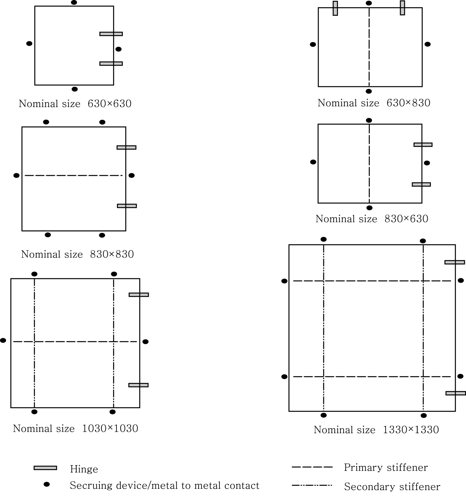
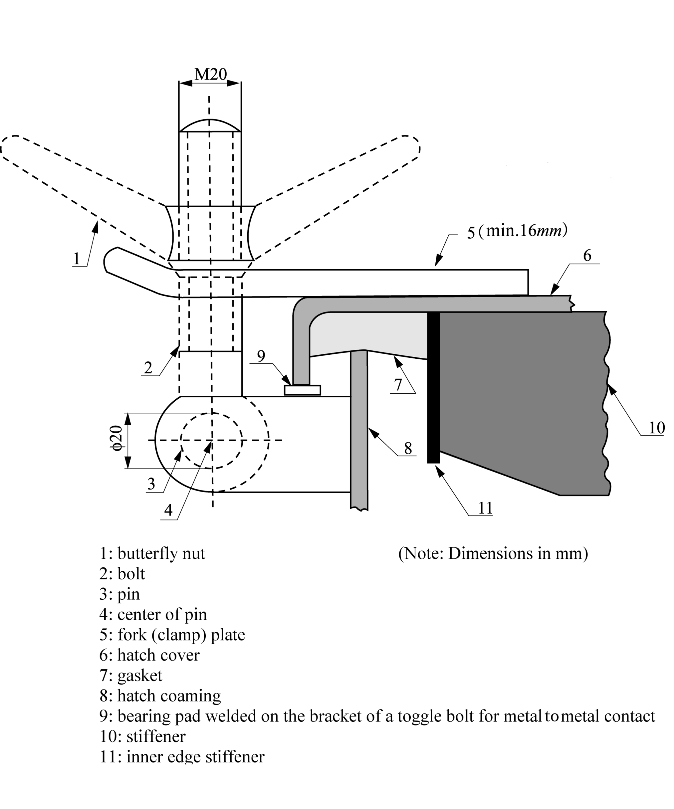
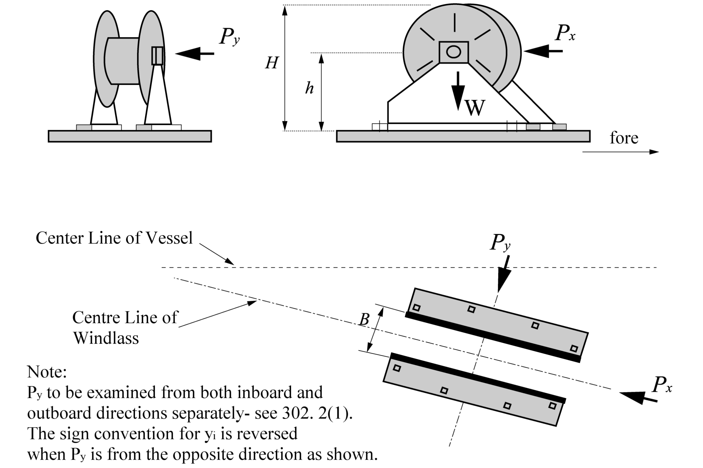

# PART 4 Hull Equipment

> RULES FOR CLASSIFICATION OF STEEL SHIPS / RA-04-E / 2025 / EN / Rules

## CHAPTER 9 STRENGTH AND SECURING OF SMALL HATCHES, FITTINGS AND EQUIPMENT ON THE FORE DECK

### Section 1 Application and Implementation

#### 101. Application

- **1.** For ships that are contracted for construction on or after 1 January 2004 on the exposed deck over the forward 0.25$L$, applicable to:
  All ship types of sea going service of length 80 m or more, where the height of the exposed deck in way of the hatch is less than 0.1$L$ or 22 m above the summer load waterline, whichever is the lesser.
- **2.** For ships that are contracted for construction prior to 1 January 2004 only for hatches on the exposed deck giving access to spaces forward of the collision bulkhead, and to spaces which extend over this line aft-wards, applicable to:
  Bulk carriers, general dry cargo ships (excluding container vessels, vehicle carriers, Ro-Ro ships and woodchip carriers), and combination carriers (e.g. OBO ships, Ore/Oil Carriers, etc.), of length 100 m or more.
- **3.** This chapter does not apply to small hatches on container ship giving access to a cargo hold which comply with UI LL64 except the requirement of clause 4 & 5. Such hatch covers are considered non-weathertight regardless of whether it is actually weathertight or not. However, for scantlings of small hatches, the strength requirements in 202. of this chapter UR could be applied instead of clause 6 of UI LL64. *(2024)*

#### 102. Implementation

The detail requirements for implementation of this chapter, refer to **Pt 1, Ch 2, 1801.** of the Rules.

### Section 2 Strength and Securing of Small Hatches on the Exposed Fore Deck

#### 201. General

- **1.** The strength of, and securing devices for, small hatches fitted on the exposed fore deck are to comply with the requirements of this Section.
- **2.** Small hatches in the context of this Section are hatches designed for access to spaces below the deck and are capable to be closed weather-tight or watertight, as applicable. Their opening is normally 2.5 square meters or less.
- **3.** Hatches designed for use of emergency escape are to comply with the requirements of this Section, excepting **203. 1** (1) and (2) **204. 3** and **205. 【See Guidance】**

#### 202. Strength

- **1.** For small rectangular steel hatch covers, the plate thickness, stiffener arrangement and scantlings are to be in accordance with **Table 4.9.1**, and **Fig 4.9.1**. Stiffeners, where fitted, are to be aligned with the metal-to-metal contact points, required in **204. 1** (see **Fig 4.9.1.**) Primary stiffeners are to be continuous. All stiffeners are to be welded to the inner edge stiffener, see **Fig 4.9.2.**
- **2.** The upper edge of the hatchway coamings is to be suitably reinforced by a horizontal section, normally not more than 170 to 190 mm from the upper edge of the coamings.
- **3.** For small hatch covers of circular or similar shape, the cover plate thickness and reinforcement is to be in accordance with the requirement specified by the Society. **【See Guidance】**
- **4.** For small hatch covers constructed of materials other than steel, the required scantlings are to provide equivalent strength.

#### 203. Primary securing devices

- **1.** Small hatches located on exposed fore deck subject to the application of this section are to be fitted with primary securing devices such that their hatch covers can be secured in place and weather-tight by means of a mechanism employing any one of the following methods:
  - **(1)** Butterfly nuts tightening onto forks (clamps),
  - **(2)** Quick acting cleats, or
  - **(3)** Central locking device.
- **2.** Dogs (twist tightening handles) with wedges are not acceptable.

#### 204. Requirements for primary securing

- **1.** The hatch cover is to be fitted with a gasket of elastic material. This is to be designed to allow a metal to metal contact at a designed compression and to prevent over compression of the gasket by green sea forces that may cause the securing devices to be loosened or dislodged. The metal-to-metal contacts are to be arranged close to each securing device in accordance with **Fig 4.9.1** and of sufficient capacity to withstand the bearing force.
- **2.** The primary securing method is to be designed and manufactured such that the designed compression pressure is achieved by one person without the need of any tools.
- **3.** For a primary securing method using butterfly nuts, the forks (clamps) are to be of robust design. They are to be designed to minimize the risk of butterfly nuts being dislodged while in use; by means of curving the forks upward, a raised surface on the free end, or a similar method. The plate thickness of unstiffened steel forks is not to be less than 16 mm. An example arrangement is shown in **Fig 4.9.2**.
- **4.** For small hatch covers located on the exposed deck forward of the fore-most cargo hatch, the hinges are to be fitted such that the predominant direction of green sea will cause the cover to close, which means that the hinges are normally to be located on the fore edge.
- **5.** On small hatches located between the main hatches, for example between Nos. 1 and 2, the hinges are to be placed on the fore edge or outboard edge, whichever is practicable for protection from green water in beam sea and bow quartering conditions.

#### 205. Secondary securing device

Small hatches on the fore deck are to be fitted with an independent secondary securing device e.g. by means of a sliding bolt, a hasp or a backing bar of slack fit, which is capable of keeping the hatch cover in place, even in the event that the primary securing device became loosened or dislodged. It is to be fitted on the side opposite to the hatch cover hinges.

| Nominal size (mm x mm) | Cover plate thickness (mm) | Primary stiffeners | Secondary stiffeners |
| --- | --- | --- | --- |
| Nominal size (mm x mm) | Cover plate thickness (mm) | Flat Bar (mm x mm) ; number |   |
| 630×630 | 8 | - | - |
| 630×830 | 8 | 100×8 ; 1 | - |
| 830×630 | 8 | 100×8 ; 1 | - |
| 830×830 | 8 | 100×10 ; 1 | - |
| 1030×1030 | 8 | 120×12 ; 1 | 80×8 ; 2 |
| 1330×1330 | 8 | 150×12 ; 2 | 100×10 ; 2 |

Fig 4.9.1 Arrangement of stiffeners

Fig 4.9.2 Example of a primary securing method

### Section 3 Strength Requirements for Fore Deck Fittings and Equipment

#### 301. General

- **1.** This section provides strength requirements to resist green sea forces for the following items : air pipes, ventilator pipes and their closing devices, the securing of windlasses.
- **2.** For windlasses, these requirements are additional to those appertaining to the anchor and chain performance criteria of **Pt 5, Ch 8** of the Rules**.**
- **3.** Where mooring winches are integral with the anchor windlass, they are to be considered as part of the windlass.

#### 302. Applied loading

- **1.** Air pipes, ventilator pipes and their closing devices
  - **(1)** The pressures $p$, in kN/m^2 acting on air pipes, ventilator pipes and their closing devices may be calculated from:
    $p = 0.5 \rho V^2 C_d C_s C_p$(kN/m^2)
    where :
    $\rho$ = density of sea water (1.025 t/m^3)
    $V$ = velocity of water over the fore deck
    = 13.5m/sec for *d*≤*d_1*
    = $13.5 \sqrt {2(1- \frac{d}{d _{l}}}$ (m/sec) for 0.5*d _1 ＜d＜d _1*
    *d =* distance from summer load waterline to exposed deck
    *d_1* = 0.1*L* or 22m whichever is the lesser
    $C_d$ = shape coefficient
    = 0.5 for pipes,
    = 1.3 for air pipe or ventilator heads in general,
    = 0.8 for an air pipe or ventilator head of cylinderical form with its axis in the vertical direction.
    $C_s$ = slamming coefficient (3.2)
    $C_p$ = protection coefficient:
    = 0.7 for pipes and ventilator heads located immediately behind a breakwater or forecastle,
    = 1.0 elsewhere and immediately behind a bulwark.
  - **(2)** Forces acting in the horizontal direction on the pipe and its closing device may be calculated from (1) using the largest projected area of each component.
- **2.** **Windlasses**
  - **(1)** The following pressures and associated areas are to be applied (see **Fig 4.9.3**):
    - 200 kN/m^2 normal to the shaft axis and away from the forward perpendicular, over the projected area in this direction,
    - 150 kN/m^2 parallel to the shaft axis and acting both inboard and outboard separately, over the multiple of $f$ times the projected area in this direction,
    where $f$ is defined as:
    $f = 1 + B/H$, but not greater than 2.5
    where:
    $B$ = width of windlass measured parallel to the shaft axis,
    $H$ = overall height of windlass.
  - **(2)** Forces in the bolts, chocks and stoppers securing the windlass to the deck are to be calculated. The windlass is supported by $N$ bolt groups, each containing one or more bolts, see **Fig 4.9.4.**
  - **(3)** The axial force $R_i$ in bolt group (or bolt) $i$, positive in tension, may be calculated from:
    $R_x _i = \frac{P_x hx_i A_i}{I_x} , R_y _i = \frac{P_y hy_i A_i}{I_y} , R_i = R_x _i + R_y _i - R_si$
    where:
    $P_x$ = force (kN) acting normal to the shaft axis
    $P_y$ = force (kN) acting parallel to the shaft axis, either inboard or outboard whichever gives the greater force in bolt group $i$
    $h$ = shaft height above the windlass mounting (cm)
    $x_i$, $y_i$ = $x$ and $y$ coordinates of bolt group $i$ from the centroid of all $N$ bolt groups, positive in the direction opposite to that of the applied force (cm)
    $A_i$ = cross sectional area of all bolts in group $i$ (cm^2)
    $I_x = smallsum A_i x_i^2$ for $N$ bolt groups
    $I_y = smallsum A_i y_i^2$ for $N$ bolt groups
    $R_si$ = static reaction at bolt group $i$, due to weight of windlass.
  - **(4)** Shear forces $F_x _i$, $F_y _i$ applied to the bolt group $i$, and the resultant combined force $F_i$ may be calculated from:
    $F_{x i} = \frac{P_x - \alpha g M}{N} , F_{y i} = \frac{P_y - \alpha g M}{N} , F_i = \sqrt{F_{x i}^2 + F_{y i}^2$
    $\alpha$ = coefficient of friction (0.5)
    $M$ = mass of windlass (*tonnes*)
    $g$ = gravity acceleration (9.81 m/s^2)
    $N$ = number of bolt groups.
  - **(5)** Axial tensile and compressive forces in (3) and lateral forces in (4) are also to be considered in the design of the supporting structure.

#### 303. Strength Requirements

- **1.** **Air pipes, ventilator pipes and their closing devices**
  - **(1)** These requirements are additional to **Pt 5, Ch 6, Sec 2** of the Rules**.**
  - **(2)** Bending moments and stresses in air and ventilator pipes are to be calculated at critical positions: at penetration pieces, at weld or flange connections, at toes of supporting brackets. Bending stresses in the net section are not to exceed 0.8$\sigma_y$, where $\sigma_y$ is the specified minimum yield stress or 0.2% proof stress of the steel at room temperature. Irrespective of corrosion protection, a corrosion addition to the net section of 2.0 mm is then to be applied.
  - **(3)** For standard air pipes of 760 mm height closed by heads of not more than the tabulated projected area, pipe thicknesses and bracket heights are specified in **Table 4.9.2** Where brackets are required, three or more radial brackets are to be fitted. Brackets are to be of gross thickness 8 mm or more, of minimum length 100 mm, and height according to **Table 4.9.2** but need not extend over the joint flange for the head. Bracket toes at the deck are to be suitably supported.
  - **(4)** For other configurations, loads according to **302.** are to be applied, and means of support determined in order to comply with the requirements of (2). Brackets, where fitted, are to be of suitable thickness and length according to their height. Pipe thickness is not to be taken less than as indicated in **Pt 5, Ch 6, 102** of the Rules**.**
  - **(5)** For standard ventilators of 900 mm height closed by heads of not more than the tabulated projected area, pipe thicknesses and bracket heights are specified in **Table 4.9.3** Brackets, where required are to be as specified in (3).
  - **(6)** For ventilators of height greater than 900 mm, brackets or alternative means of support are to be fitted according to the requirements of each Society. Pipe thickness is not to be taken less than as indicated in **Pt 5, Ch 6, 102** of the Rules**.**
  - **(7)** All component parts and connections of the air pipe or ventilator are to be capable of withstanding the loads defined in **302. 1.**
  - **(8)** Rotating type mushroom ventilator heads are unsuitable for application on the exposed deck over the forward 0.25$L$
- **2.** **Windlass mounts**
  - **(1)** Tensile axial stresses in the individual bolts in each bolt group $i$ are to be calculated. The horizontal forces $F_{x i}$ and $F_{y i}$ are normally to be reacted by shear chocks. Where "fitted" bolts are designed to support these shear forces in one or both directions, the von Mises equivalent stresses in the individual bolts are to be calculated, and compared to the stress under proof load. Where pourable resins are incorporated in the holding down arrangements, due account is to be taken in the calculations. The safety factor against bolt proof strength is to be not less than 2.0.
  - **(2)** The strength of above deck framing and hull structure supporting the windlass and its securing bolt loads as defined in **302. 2** is to be according to the requirements of the Society.
- **3.** **Chain stoppers**
  - **(1)** A chain stopper is generally to be fitted between the windlass and the hawse pipe in order to relieve the windlass of the pull of the chain cable when the ship is at anchor. A chain stopper is to be capable of withstanding a load equal to 80% of the breaking load of the chain cable without undergoing permanent deformation.
  - **(2)** National Standards, internationally recognized Codes or Standards considered as equivalent for those may be applied instead of requirements of this Section. 

    | Nominal pipe diameter (mm) | Minimum fitted gross thickness (mm) | Maximum projected area of head (cm^2) | Height(1) of bracket (mm) |
    | --- | --- | --- | --- |
    | 40A(3) | 6.0 | - | 520 |
    | 50A(3) | 6.0 | - | 520 |
    | 65A | 6.0 | - | 480 |
    | 80A | 6.3 | - | 460 |
    | 100A | 7.0 | - | 380 |
    | 125A | 7.8 | - | 300 |
    | 150A | 8.5 | - | 300 |
    | 175A | 8.5 | - | 300 |
    | 200A | 8.5(2) | 1900 | 300(3) |
    | 250A | 8.5(2) | 2500 | 300(2) |
    | 300A | 8.5(2) | 3200 | 300(2) |
    | 350A | 8.5(2) | 3800 | 300(2) |
    | 400A | 8.5(2) | 4500 | 300(2) |
    | (1) Brackets (see **303. 1.** (3)) need not extend over the joint flange for the head. (2) Brackets are required where the as fitted (gross) thickness is less than 10.5 mm, or where the tabulated projected head area is exceeded. (3) Not permitted for new ships. Reference **Pt 5, Ch 6** of the Rules. Note: For other air pipe heights, the relevant requirements of **303. 1.** are to be applied. |   |   |   |

    | Nominal pipe diameter (mm) | Minimum fitted gross thickness (mm) | Maximum projected area of head (cm^2) | Height of bracket (mm) |
    | --- | --- | --- | --- |
    | 80A | 6.3 | - | 460 |
    | 100A | 7.0 | - | 380 |
    | 150A | 8.5 | - | 300 |
    | 200A | 8.5 | 550 | - |
    | 250A | 8.5 | 880 | - |
    | 300A | 8.5 | 1200 | - |
    | 350A | 8.5 | 2000 | - |
    | 400A | 8.5 | 2700 | - |
    | 450A | 8.5 | 3300 | - |
    | 500A | 8.5 | 4000 | - |

    Note: For other ventilator heights, the relevant requirements of **303. 1** are to be applied.
    
    **Fig 4.9.3 Direction of force and weight**
    
    **Fig 4.9.4 Sign convention**
