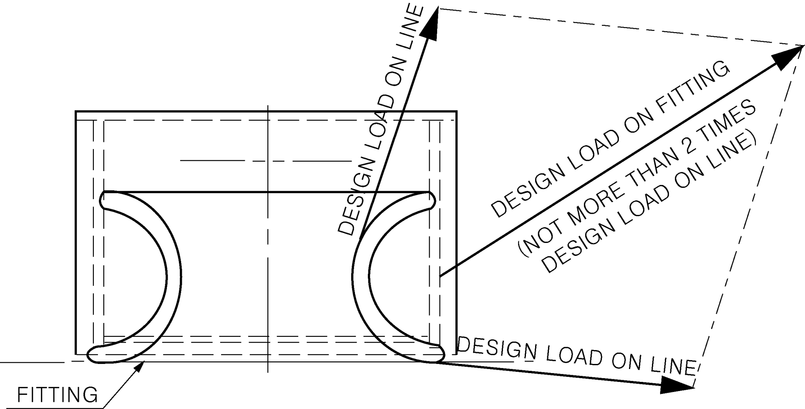
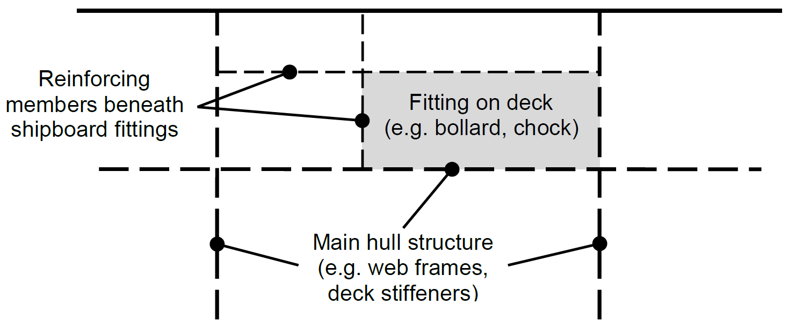
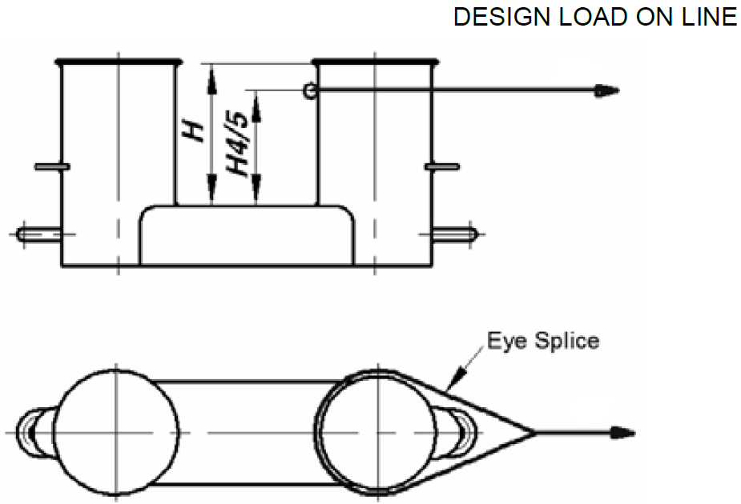
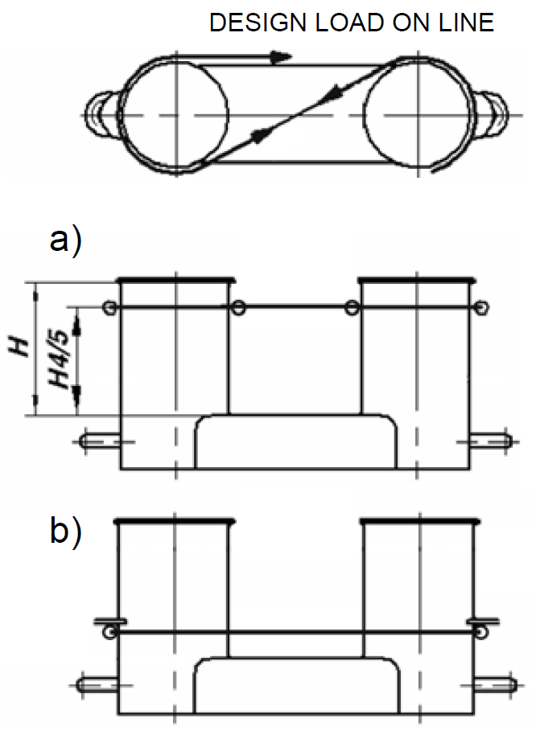

# PART 4 Hull Equipment

> RULES FOR CLASSIFICATION OF STEEL SHIPS / RA-04-E / 2025 / EN / Rules

## CHAPTER 10 SHIPBOARD EQUIPMENT, FITTINGS AND SUPPORTING HULL STRUCTURES ASSOCIATED WITH TOWING AND MOORING

### Section 1 Definitions and Scope of Application

#### 101. Application

- **1.** Conventional ships(new displacement-type vessels ships of 500 GT and above, excluding high speed craft, special purpose vessels ships, and offshore units of all types.) are to be provided with arrangements, equipment and fittings of sufficient safe working load to enable the safe conduct of all towing and mooring operations associated with the normal operations of the ship.
- **2.** This Chapter is to apply to design and construction of shipboard fittings and supporting structures used for the normal towing and mooring operations. Normal towing means towing operations necessary for manoeuvring in ports and sheltered waters associated with the normal operations of the ship.
- **3.** For ships, not subject to SOLAS Regulation II-1/3-4 Paragraph 1, but intended to be fitted with equipment for towing by another ship or a tug, e.g. such as to assist the ship in case of emergency as given in SOLAS Regulation II-1/3-4 Paragraph 2, the requirements designated as ‘other towing’ in this Unified Requirement are to be applied to design and construction of those shipboard fittings and supporting hull structures.
- **4.** This Chapter is not applicable to design and construction of shipboard fittings and supporting hull structures used for special towing services defined as:
  - **(1)** Escort towing: Towing service, in particular, for laden oil tankers or LNG carriers, required in specific estuaries. Its main purpose is to control the ship in case of failures of the propulsion or steering system. It should be referred to local escort requirements and guidance given by, e.g., the Oil Companies International Marine Forum (OCIMF).
  - **(2)** Canal transit towing: Towing service for ships transiting canals, e.g. the Panama Canal. It should be referred to local canal transit requirements.
  - **(3)** Emergency towing for tankers: Towing service to assist tankers in case of emergency. For the emergency towing arrangements, ships subject to SOLAS regulation II-1/3-4 Paragraph 1 are to comply with that regulation and resolution MSC.35(63) as may be amended.
- **5.** IACS Recommendation No. 10 “Anchoring, Mooring and Towing Equipment” may be referred to for recommendations concerning mooring and towing.
- **6.** The net minimum scantlings of the supporting hull structure are to comply with the requirements given in **201. 5** and **202. 5**. The net thicknesses, $t _{n et}$, are the member thicknesses necessary to obtain the above required minimum net scantlings. The required gross thicknesses are obtained by adding the total corrosion additions, $t _{c}$, given in **204.**, to $t _{n et}$. Shipboard fittings are to comply with the requirements given in **201. 4** and **202. 4**. For shipboard fittings not selected from an accepted industry standard the corrosion addition, $t _{c}$, and the wear allowance, $t _{w}$, given in **204.** and **205.**, respectively, are to be considered.
- **7.** The mooring equipment of single point moorings which fitted on ships such as oil tanker the delivery of which is after 1 January 2009 are to be in accordance with the Guidance relating to the Rules specified by the Society. **【See Guidance】**

#### 102. Definitions

- **1.** Conventional ships means new displacement-type ships of 500 GT and above, excluding high speed craft, special purpose ships, and offshore units of all types. As per MSC.266(84), ‘Special purpose ship’ means a mechanically self-propelled ship which by reason of its function carries on board more than 12 special personnel.
- **2.** Shipboard fittings mean those components limited to the following: Bollards and bitts, fairleads, stand rollers, chocks used for normal mooring of the ship and the similar components used for normal or other towing of the ship. Other components such as capstans, winches, etc. are not covered by this Unified Requirement. Any weld or bolt or equivalent device connecting the shipboard fitting to the supporting structure is part of the shipboard fitting and if selected from an industry standard subject to that standard.
- **3.** Supporting hull structures means that part of the ship structure on/in which the shipboard fitting is placed and which is directly submitted to the forces exerted on the shipboard fitting. The supporting hull structure of capstans, winches, etc. used for the normal or other towing and mooring operations mentioned above is also subject to this chapter.
- **4.** Industry standard means international standard(ISO etc.) or standards issued by national association(KS, DIN, JMSA etc.) which are recognized in the country where the ship is built.
- **5.** The nominal capacity condition is defined as the theoretical condition where the maximum possible deck cargoes are included in the ship arrangement in their respective positions. For container ships the nominal capacity condition represents the theoretical condition where the maximum possible number of containers is included in the ship arrangement in their respective positions.
- **6.** Ship Design Minimum Breaking Load (MBL_SD) means the minimum breaking load of new, dry mooring lines or tow line for which shipboard fittings and supporting hull structures are designed in order to meet mooring restraint requirements or the towing requirements of other towing service.
- **7.** Line design break force(LDBF) means the minimum force at which a new, dry, spliced mooring line will break at. This is for all synthetic cordage material. This value is declared by the manufacturer on each line's mooring line certificate and is stated on a manufacturer's line data sheet. LDBF of a line should be 100% ~ 105% of the ship design minimum breaking load(MBL_SD). *(2024)*

### Section 2 Towing and Mooring

#### 201. Towing

- **1.** **Strength**
  The strength of shipboard fittings used for normal towing operations at bow, sides and stern and their supporting hull structures are to comply with the requirements of this chapter.
  Where a ship is equipped with shipboard fittings intended to be used for other towing services, the strength of these fittings and their supporting hull structures are to comply with the requirements of this chapter.
  For fittings intended to be used for, both, towing and mooring, A2.2 applies to mooring.
- **2.** **Arrangement**
  Shipboard fittings for towing are to be located on stiffeners, and/or girders, which are part of the deck construction so as to facilitate efficient distribution of the towing load. Other equivalent arrangements may be accepted (for chocks in bulwarks, etc.) provided the strength is confirmed adequate for the intended service.
- **3.** **Load considerations**
  The minimum design load applied to supporting hull structures for shipboard fittings is to be:
  - **(1)** For normal towing operations
- **1.** 25 times the intended maximum towing load (e.g. static bollard pull) as indicated on the towing and mooring arrangements plan.
  - **(2)** For other towing service
    the ship design minimum breaking load according to **Ch 8, Table 4.8.1.**
  - **(3)** For fittings intended to be used for, both, normal and other towing operations, the greater of the design loads according to (1) and (2).
    Notes:
    1) Side projected area including that of deck cargoes as given by the ship nominal capacity condition is to be taken into account for selection of towing lines and the loads applied to shipboard fittings and supporting hull structure.
    2) The increase of the line design break force for synthetic ropes according to Recommendation No. 10 needs not to be taken into account for the loads applied to shipboard fittings and supporting hull structure.
    When a safe towing load TOW greater than that determined according to **201. 6** is requested by the applicant, then the design load is to be increased in accordance with the appropriate TOW/design load relationship given by **201. 3** and **201. 6.**
    The design load is to be applied to fittings in all directions that may occur by taking into account the arrangement shown on the towing and mooring arrangements plan. Where the towing line takes a turn at a fitting the total design load applied to the fitting is equal to the resultant of the design loads acting on the line, see **Fig 4.10.1**. However, in no case does the design load applied to the fitting need to be greater than twice the design load on the line.
    
    Fig 4.10.1 Application of design load
- **4.** **Shipboard fittings**
  Shipboard fittings may be selected from an industry standard accepted by the Society and at least based on the following loads.
  - **(1)** For normal towing operations
    the intended maximum towing load (e.g. static bollard pull) as indicated on the towing and mooring arrangements plan,
  - **(2)** For other towing service
    the ship design minimum breaking load of the tow line according to **Ch 8, Table 4.8.1.** (see Notes in **201. 3**)
  - **(3)** For fittings intended to be used for, both, normal and other towing operations, the greater of the loads according to (1) and (2).
    Towing bitts (double bollards) may be chosen for the towing line attached with eye splice if the industry standard distinguishes between different methods to attach the line, i.e. figure-of-eight or eye splice attachment.
    When the shipboard fitting is not selected from an accepted industry standard, the strength of the fitting and of its attachment to the ship is to be in accordance with **201. 3** and **201. 5**. Towing bitts (double bollards) are required to resist the loads caused by the towing line attached with eye splice. For strength assessment beam theory or finite element analysis using net scantlings is to be applied, as appropriate. Corrosion additions are to be as defined in **204.** A wear down allowance is to be included as defined in **205.** At the discretion of the Society, load tests may be accepted as alternative to strength assessment by calculations.
- **5.** **Supporting hull structures**
  The design load applied to supporting hull structure is to be in accordance with **201. 3**.
  - **(1)** The reinforced members beneath shipboard fittings are to be effectively arranged for any variation of direction (horizontally and vertically) of the towing forces acting the shipboard fittings, see **Fig 4.10.2** for a sample arrangement. Proper alignment of fitting and supporting hull structure is to be ensured.
    
    **Fig 4.10.2 Sample arrangement of reinforcing members**
  - **(2)** The acting point of the towing force on shipboard fittings is to be taken at the attachment point of a towing line or at a change in its direction. For bollards and bitts the attachment point of the towing line is to be taken not less than 4/5 of the tube height above the base, see **Fig 4.10.3**.
    
    **Fig 4.10.3 Acting point of the towing force**
  - **(3)** Allowable stresses under the design load conditions as specified in **201. 3** are as follows:
    Normal stress : 1.0 R_eH
    Shearing stress : 0.6 R_eH
    Normal stress is the sum of bending stress and axial stress with the corresponding shearing stress acting perpendicular to the normal stress. No stress concentration factors being taken into account.
    Von Mises stress : 1.0 R_eH
    For strength assessment by means of finite element analysis the mesh is to be fine enough to represent the geometry as realistically as possible. The aspect ratios of elements are not to exceed 3. Girders are to be modelled using shell or plane stress elements. Symmetric girder flanges may be modelled by beam or truss elements. The element height of girder webs must not exceed one-third of the web height. In way of small openings in girder webs the web thickness is to be reduced to a mean thickness over the web height as per individual Class Society rules. Large openings are to be modelled. Stiffeners may be modelled by using shell, plane stress, or beam elements. The mesh size of stiffeners is to be fine enough to obtain proper bending stress. If flat bars are modeled using shell or plane stress elements, dummy rod elements are to be modelled at the free edge of the flat bars and the stresses of the dummy elements are to be evaluated. Stresses are to be read from the centre of the individual element. For shell elements the stresses are to be evaluated at the mid plane of the element.
    R_eH is the specified minimum yield stress of the material.
    - **(A)** For strength assessment by means of beam theory or grillage analysis:
    - **(B)** For strength assessment by means of finite element analysis:
- **6.** **Safe Towing Load (TOW)**
  - **(1)** The safe towing load (TOW) is the safe load limit of shipboard fittings used for towing purpose.
  - **(2)** TOW used for normal towing operations is not to exceed 80% of the design load per **201. 3** (1).
  - **(3)** TOW used for other towing operations is not to exceed 80% of the design load according to **201. 3** (2).
  - **(4)** For fittings used for both normal and other towing operations, the greater of the safe towing loads according to (2) and (3) is to be used.
  - **(5)** TOW, in t, of each shipboard fitting is to be marked (by weld bead or equivalent) on the deck fittings used for towing. For fittings intended to be used for, both, towing and mooring, SWL, in t, according to **202. 6** is to be marked in addition to TOW.
  - **(6)** The above requirements on TOW apply for the use with no more than one line. If not otherwise chosen, for towing bitts (double bollards) TOW is the load limit for a towing line attached with eye-splice.
  - **(7)** The towing and mooring arrangements plan mentioned in **203.** is to define the method of use of towing lines.

#### 202. Mooring

- **1.** **Strength**
  The strength of shipboard fittings used for mooring operations and of their supporting hull structures as well as the strength of supporting hull structures of winches and capstans is to comply with the requirements of this Chapter.
- **2.** **Arrangements**
  Shipboard fittings, winches and capstans for mooring are to be located on stiffeners and/or girders, which are part of the deck construction so as to facilitate efficient distribution of the mooring load. Other equivalent arrangements may be accepted (for chocks in bulwarks, etc.) provided the strength is confirmed adequate for the service.
- **3.** **Load considerations**
  - **(1)** The minimum design load applied to supporting hull structures for shipboard fittings is to be 1.15 times the ship design minimum breaking load according to **Ch 8, Table 4.8.1.**
  - **(2)** The minimum design load applied to supporting hull structures for winches is to be 1.25 times the intended maximum brake holding load, where the maximum brake holding load is to be assumed not less than 80% of the ship design minimum breaking load according to **Ch 8, Table 4.8.1**, see Notes. For supporting hull structures of capstans, 1.25 times the maximum hauling-in force is to be taken as the minimum design load.
  - **(3)** When a safe working load SWL greater than that determined according to **202. 6** is requested by the applicant, then the design load is to be increased in accordance with the appropriate SWL/design load relationship given by **202. 3** and **202. 6**.
  - **(4)** The design load is to be applied to fittings in all directions that may occur by taking into account the arrangement shown on the towing and mooring arrangements plan. Where the mooring line takes a turn at a fitting the total design load applied to the fitting is equal to the resultant of the design loads acting on the line, refer to the **Fig 4.10.1** in **201. 3**. However, in no case does the design load applied to the fitting need to be greater than twice the design load on the line.
    Notes:
    1) If not otherwise specified by Recommendation No. 10, side projected area including that of deck cargoes as given by the ship nominal capacity condition is to be taken into account for selection of mooring lines and the loads applied to shipboard fittings and supporting hull structure.
    2) The increase of the line design break force for synthetic ropes according to Recommendation No. 10 needs not to be taken into account for the loads applied to shipboard fittings and supporting hull structures.
- **4.** **Shipboard fittings**
  - **(1)** Shipboard fittings may be selected from an industry standard accepted by the Society and at least based on the ship design minimum breaking load according to **Ch 8, Table 4.8.1**. (see Notes in **202. 3**)
  - **(2)** Mooring bitts (double bollards) are to be chosen for the mooring line attached in figure-of-eight fashion if the industry standard distinguishes between different methods to attach the line, i.e. figure-of-eight or eye splice attachment.
  - **(3)** When the shipboard fitting is not selected from an accepted industry standard, the strength of the fitting and of its attachment to the ship is to be in accordance with **202. 3** and **202. 5**. Mooring bitts (double bollards) are required to resist the loads caused by the mooring line attached in figure-of-eight fashion, see Note. For strength assessment beam theory or finite element analysis using net scantlings is to be applied, as appropriate. Corrosion additions are to be as defined in **204.** A wear down allowance is to be included as defined in **205.** At the discretion of the classification Society, load tests may be accepted as alternative to strength assessment by calculations.
    Notes:
    With the line attached to a mooring bitt in the usual way (figure-of-eight fashion), either of the two posts of the mooring bitt can be subjected to a force twice as large as that acting on the mooring line. Disregarding this effect, depending on the applied industry standard and fitting size, overload may occur.
- **5.** **Supporting hull structures**
  The design load applied to supporting hull structure is to be in accordance with **202. 3**.
  - **(1)** The arrangement of reinforced members beneath shipboard fittings, winches and capstans is to consider any variation of direction (horizontally and vertically) of the mooring forces acting upon the shipboard fittings, see **Fig 4.10.2** in **201. 5** for a sample arrangement. Proper alignment of fitting and supporting hull structure is to be ensured.
  - **(2)** The acting point of the mooring force on shipboard fittings is to be taken at the attachment point of a mooring line or at a change in its direction. For bollards and bitts the attachment point of the mooring line is to be taken not less than 4/5 of the tube height above the base, see a) in **Fig 4.10.4**. However, if fins are fitted to the bollard tubes to keep the mooring line as low as possible, the attachment point of the mooring line may be taken at the location of the fins, see b) in **Fig 4.10.4**.

    |  |
    | --- |
    | **Fig 4.10.4 Acting point of the mooring force** |
  - **(3)** Allowable stresses under the design load conditions as specified in **202. 3** are as follows:
    Normal stress : 1.0 R_eH
    Shearing stress : 0.6 R_eH
    Normal stress is the sum of bending stress and axial stress. No stress concentration factors being taken into account.
    Von Mises stress : 1.0 R_eH
    For strength assessment by means of finite element analysis the mesh is to be fine enough to represent the geometry as realistically as possible. The aspect ratios of elements are not to exceed 3. Girders are to be modelled using shell or plane stress elements. Symmetric girder flanges may be modelled by beam or truss elements. The element height of girder webs must not exceed one-third of the web height. In way of small openings in girder webs the web thickness is to be reduced to a mean thickness over the web height as per individual Class Society rules. Large openings are to be modelled. Stiffeners may be modelled by using shell, plane stress, or beam elements. The mesh size of stiffeners is to be fine enough to obtain proper bending stress. If flat bars are modeled using shell or plane stress elements, dummy rod elements are to be modelled at the free edge of the flat bars and the stresses of the dummy elements are to be evaluated. Stresses are to be read from the centre of the individual element. For shell elements the stresses are to be evaluated at the mid plane of the element.
    R_eH is the specified minimum yield stress of the material.
    - **(A)** For strength assessment by means of beam theory or grillage analysis:
    - **(B)** For strength assessment by means of finite element analysis:
- **6.** **Safe Working Load (SWL)**
  - **(1)** The Safe Working Load (SWL) is the safe load limit of shipboard fittings used for mooring purpose.
  - **(2)** Unless a greater SWL is requested by the applicant according to **202. 3** (3), the SWL is not to exceed the ship design minimum breaking load according to **Ch 8, Table 4.8.1**, see Notes in **202. 3.**
  - **(3)** The SWL, in t, of each shipboard fitting is to be marked (by weld bead or equivalent) on the deck fittings used for mooring. For fittings intended to be used for, both, mooring and towing, TOW, in t, according to **201. 6** is to be marked in addition to SWL.
  - **(4)** The above requirements on SWL apply for the use with no more than one mooring line.
  - **(5)** The towing and mooring arrangements plan mentioned in **203.** is to define the method of use of mooring lines.

#### 203. Towing and mooring arrangements plan

- **1.** The SWL and TOW for the intended use for each shipboard fitting is to be noted in the towing and mooring arrangements plan available on board for the guidance of the Master. It is to be noted that TOW is the load limit for towing purpose and SWL that for mooring purpose. If not otherwise chosen, for towing bitts it is to be noted that TOW is the load limit for a towing line attached with eye-splice.
- **2.** Information provided on the plan is to include in respect of each shipboard fitting. *(2024)*
  - **(1)** Location on the ship
  - **(2)** Fitting type
  - **(3)** SWL/TOW
  - **(4)** Purpose (mooring / harbour towing / other towing)
  - **(5)** Method of applying load of towing or mooring line including limiting fleet angle i.e. angle of change in direction of a line at the fitting. Item (3) with respect to items (4) and (5), is subject to approval by the Society.
    Furthermore, information provided on the plan is to include:
  - **(1)** The arrangement of mooring lines showing number of lines (N)
  - **(2)** The ship design minimum breaking load (MBL_SD)
  - **(3)** The acceptable environmental conditions refer for minimum conditions to IACS Recommendation No. 10 “Anchoring, Mooring and Towing Equipment” for the recommended ship design minimum breaking load for ships with Equipment Number EN > 2000:
    - **(A)** 30 second mean wind speed from any direction.($v _{w}$ or $v _{w} ^{ *}$ according to IACS Recommendation No. 10)
    - **(B)** Maximum current speed acting on bow or stern (±10°).
  - **(4)** For ships of less than 3,000 gross tonnage engaged in international voyages and contracted for construction on or after 1 January 2024, the following shall be additionally included on the plan and provided on board;
    - **(A)** Maximum brake holding load;
    - **(B)** Technical specification document of the mooring lines (including manufacturers' recommended minimum diameter D of each fitting in contact with the mooring lines and the Line Design Break Force (LDBF) of the mooring lines); and
    - **(C)** Properties of mooring lines related to LDBF and bend radius (D/d ratio)^(1)(including warning that the wear rate of lines may be higher for lower diameter(ref. Par. 5.6 of MSC.1/Circ.1620)
  - **(5)** For ships of 3,000 gross tonnage and above engaged in international voyages and contracted for construction on or after 1 January 2024, the following shall be included in addition to those specific under Par. (4) and provided on board;
    (Notes)
    ^(1) Bend radius (D/d ratio) means the diameter, D, of a mooring fitting divided by the diameter, d, of a mooring line that is led around or through the fitting. (ref. Par.2.1 of MSC.1/Circ.1620)
    - **(A)** A document shall be provided by the designer for information and as a supplement to the towing and mooring arrangements plan, confirming that MSC.1/Circ.1619 has been considered. The document shall explicitly state that the deviations compared to MSC.1/Circ.1619, if any, were unavoidable;
    - **(B)** Deviations shall be recorded, if any, (Par. 6.1 of MSC.1 Circ./ 1619), justification and suitable safety measures shall be provided (Par. 6.2 of MSC.1/Circ.1619) in the supplement to the towing and mooring arrangements plan. A reference to the supplement shall be included in the towing and mooring arrangements plan (Par. 6.3 of MSC.1/Circ.1619);
    - **(C)** If deviations are not found necessary, and the supplement is not needed, then this shall be mentioned explicitly in the towing and mooring arrangements plan; and
    - **(D)** The mooring maximum brake holding load shall be less than 100% of the Ship Design Minimum Breaking Load (MBL_SD) (Par. 5.2.3.3 and 5.2.4 of MSC.1/Circ.1619). The winches shall be fitted with brakes that allow for the reliable setting of the brake rendering load.
- **3.** The information as given in **2.** is to be incorporated into the pilot card in order to provide the pilot proper information on harbour and other towing operations.

#### 204. Corrosion addition

The corrosion addition, $t _{c}$, is not to be less than the following values:

- **1.** Ships covered by Common Structural Rules for Bulk Carriers and Oil Tankers: Total corrosion additions to be as defined in these rules.
- **2.** Other ships:
  - **(1)** For the supporting hull structure, according to the Society’s Rules for the surrounding structure (e.g. deck structures, bulwark structures).
  - **(2)** For pedestals and foundations on deck which are not part of a fitting according to an accepted industry standard : 2.0 mm.
  - **(3)** For shipboard fittings not selected from an accepted industry standard : 2.0 mm.

#### 205. Wear allowance

In addition to the corrosion addition given in **204.** the wear allowance, $t _{w}$, for shipboard fittings not selected from an accepted industry standard is not to be less than 1.0 mm, added to surfaces which are intended to regularly contact the line.

#### 206. Survey after construction 【Se e Guidance】

The condition of deck fittings, their pedestals or foundations, if any, and the hull structures in the vicinity of the fittings are to be examined in accordance with the Society’s Rules.
