# PART 4 Hull Equipment

> RULES FOR CLASSIFICATION OF STEEL SHIPS / RA-04-E / 2025 / EN / Guidance

## CHAPTER 1 RUDDERS

### Section 1 General

#### 101. Application 【See Rule】

- **1.** **Rudders having three or more pintles**
  The scantling of each member of rudders having three or more pintles is to be determined in accordance with the requirements in the **Pt 4, Ch 1** of the Rules correspondingly. However, the moment and the force acting on each member are to be determined by the direct calculation method, in accordance with the requirements in **Sec 4** of the Guidance.
- **2.** **Nozzle rudders**
  Nozzle rudders are to be as specified in (1) and (2) below respectively, unless the rudder force and rudder torque are required to be determined by tests or detailed theoretical calculation.
  In other rudders, the scantling of each member is to be determined by obtaining the rudder force and rudder torque through tests or detailed theoretical calculations, and correspondingly applying the requirements in **Pt 4, Ch 1** of the Rules. Results of tests or theoretical calculations are to be submitted to the Society.
  - **(1)** The scantling of each member of a nozzle rudder with flaps and fish tail rudders is to be determined in accordance with the requirements in **Pt 4, Ch 1** of the Rules. In applying the Rules, however, values of factor $K_2$ in Sec 2 are 1.9 for ahead, 1.5 for astern and values of factor $\alpha$ in Sec 3 are to be in accordance with the discretion of the Society.
  - **(2)** Nozzle rudder area
    In applying the Rules, the total rudder area and the rudder area ahead of the centreline of the rudder stock are to be calculated as follows:
    Total rudder area ($A$) : $2h(b _{1} +b _{2} )+ \Sigma h ' (a _{1} + a _{2} )$($\mathrm{m}^2$)
    Rudder area ahead of the centreline of the rudder stock ($A_f$) : $2h b _{2}$($\mathrm{m}^2$)
    $a _{1} , a _{2, } b _{1,} b _{2,} h and h '$ = as specified in **Fig 4.1.1**
    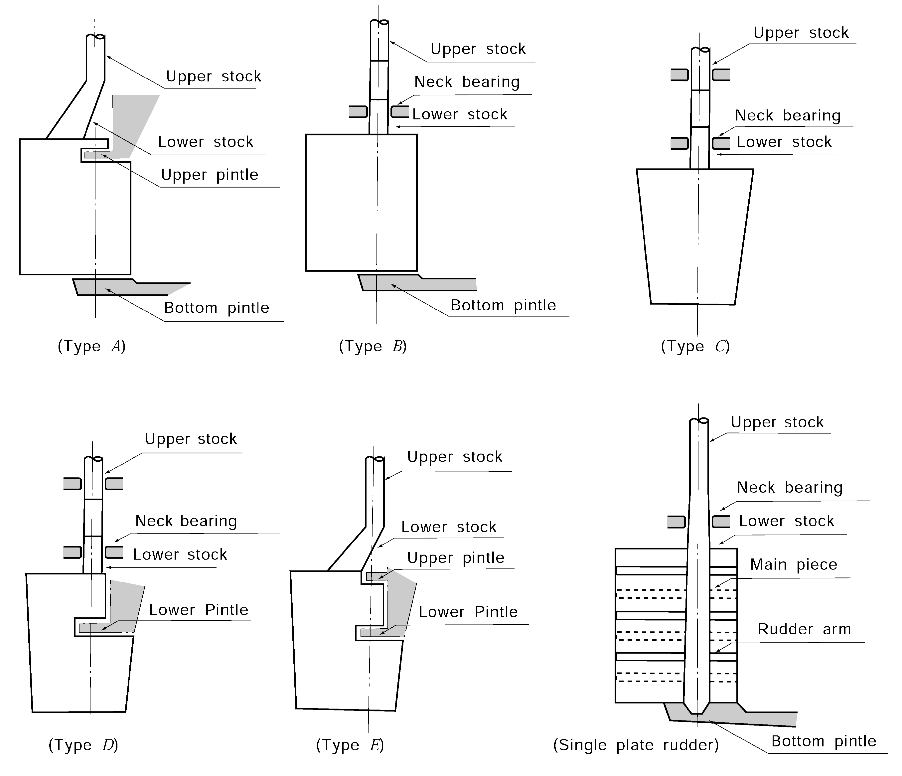
    **Fig 4.1.1 Nozzle rudder area**
- **3.** **Rudders designed for helm angle exceeding 35°**
  The scantling of each member of a rudder designed for helm angle exceeding 35° is to be determined in accordance with the requirements in **Pt 4, Ch 1** of the Rules correspondingly, on the basis of the rudder force and rudder torque obtained through tests or detailed theoretical calculations. The results of tests and theoretical calculations are to be submitted to the Society.
- **4.** For the single plate rudder, 1.0 may be taken as a coefficient $K_2$ for the ahead and astern conditions.
- **5.** For the Type $C$ rudders, safety devices (eg: Locking Ring, Nut Stopper, Nut Lock, etc.) are to be provided to prevent unwinding of the rudders.

#### 103. Materials 【See Rule】

- **1.** If the diameter of rudder stock is small, cast carbon steel is not to be used.
- **2.** Rolled bar steel (*RSFB* 45) may be treated in the same way as forging steel (*RSF* 45)

### Section 4 Rudder Strength Calculation

#### 401. Rudder strength calculation 【See Rule】

- **1.** **General**
  The bending moment, shear force, and supporting force acting on the rudder and rudder stock may be evaluated using the basic rudder models as outlined in **3** to **7.**
- **2.** **Moments and forces to be evaluated** ***(2024)***
  The bending moment $M_R$ and the shear force $Q_1$ acting on the rudder body, the bending moment $M_b$ acting on the bearing, the bending moment $M _{c}$ acting on the top of the cone coupling and the bending moment $M_s$ acting on the coupling between the rudder stock and rudder main piece and the supporting force $B_1$, $B_2$, $B_3$ are to be obtained and to be used for analyzing the stresses in accordance with the **Pt 4, Ch 1** of the Rules.
  **3 . Type C rudders(Spade rudder)**
  - **(1)** General data
    The data on the spade rudder models is as follows(See **Fig 4.1.2** of the Guidance):
    $\ell _{10} \sim \ell _{30}$ = Lengths of the individual girders of the system (m)
    $I _{10} \sim I _{30}$ = Moments of inertia of these girders (cm^4)
    Load of rudder body
    $P _{R} = \frac{F _{R}}{1000 \ell _{10}}$(kN/m)
    $F_R$ : as specified in **Pt 4, Ch 1, Sec 2** of the Rules
  - **(2)** The moments and forces may be determined by the following formulae: *(2024)*
    $M _{b} =F _{R} [ \ell _{20} + \frac{\ell _{10} (2x _{1} +x _{2} )}{3(x _{1} +x _{2} )} ]$ (N-m)
    $B_2 = F_R + B_3$(N)
    $B _{3} = \frac{M _{b}}{l _{30}}$
    The maximum moment, $M _{c}$, in top of the cone coupling as shown in **Fig 4.1.2** is applicable for the connection between the rudder and the rudder stock.
    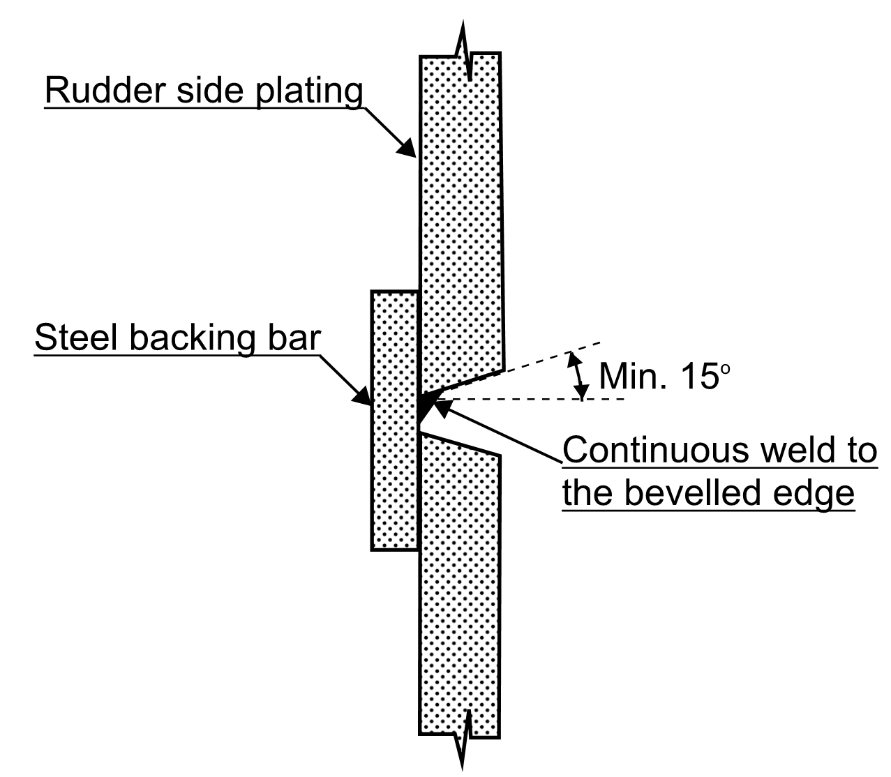
    **Fig 4.1.2 Type C rudder (Spade rudder)** *(2024)*
    **4 . Spade rudder with trunk** ***(2024)***
  - **(1)** General data
    The data on the spade rudder with trunk models is as follows(See **Fig 4.1.3(a)** and **Fig 4.1.3(b)** of the Guidance):
    $\ell _{10} \sim \ell _{30}$ = Lengths of the individual girders of the system (m)
    $I _{10} \sim I _{30}$ = Moments of inertia of these girders (cm^4)
    Load of rudder body
    $P _{R} = \frac{F _{R}}{1000 ( \ell _{10} + \ell _{20} )}$(kN/m)
    $F_R$ : as specified in **Pt 4, Ch 1, Sec 2** of the Rules
  - **(2)** For spade rudder with trunk extending inside the rudder, the strength shall be checked against the following two case ;
    a) pressure applied on the entire rudder area
    b) pressure applied only on rudder area below the middle of neck bearing.
    The moments and forces for the two cases defined above may be determined according to **Fig 4.1.3(a)** and **Fig 4.1.3(b),** respectively.
    $M _{FR1} = F _{R 1} (CG _{ 1Z} - \ell _{10} )$ (N-m)
    $M _{FR2} = F _{R 2} ( \ell _{10} -CG _{ 2Z} )$ (N-m)
    $F _{R1}$ : Rudder force over the rudder blade area $A _{1}$
    $F _{R2}$ : Rudder force over the rudder blade area $A _{2}$
    $CG _{ 1Z}$ : Vertical position of the centre of gravity of the rudder blade area $A _{1}$ from base
    $CG _{ 2Z}$ : Vertical position of the centre of gravity of the rudder blade area $A _{2}$ from base
    $F _{R} = F _{R 1} + F _{R 2}$ (N)
    $B _{2} = F _{R} +B _{3}$ (N)
    $B _{3} = (M _{FR2} -M _{FR1} )/( \ell _{20} + \ell _{30} )$ (N)
    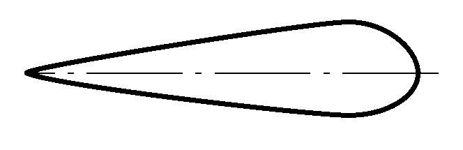
    Fig 4.1.3(a) *(2024)*Full rudder force #eqnID-45 and total rudder torque #eqnID-46 with rudders stock bending moment #eqnID-47
    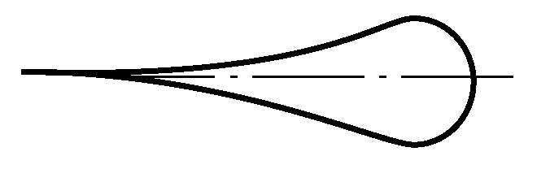
    Fig 4.1.3(b) *(2024)*Rudder force #eqnID-48 corresponding to rudder torque #eqnID-49 acting at rudder blade area #eqnID-50 with rudders stock bending moment #eqnID-51
- **5.** **Type B rudders(Rudder supported by sole piece)**
  - **(1)** General data
    The data on the rudder supported by sole piece models is as follows(See **Fig 4.1.4** of the Guidance):
    $\ell _{10} \sim \ell _{50}$ = Lengths of the individual girders of the system (m)
    $I_10 \sim I_50$ = Moments of inertia of these girders (cm^4)
    For rudders supported by a sole piece the length $\ell _{20}$ is the distance between lower edge of rudder body and centre of sole piece and $I_20$ the moment of inertia of the pintle in the sole piece.
    $I _{50}$ = Moments of inertia of sole piece around the z-axis (cm^4)
    $\ell _{50}$ = Effective length of sole piece (m)
    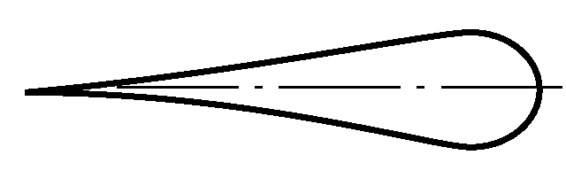
    Fig 4.1.4 Type B rudder(Rudder supported by sole piece)
    Load of rudder body
    $P _{R} = \frac{F _{R}}{1000 \ell _{10}}$(kN/m)
    $F_R$ : as specified in **Pt 4, Ch 1, Sec 2** of the Rules
    $Z$ is spring constant of support in the sole piece, obtained from the following formula.
    $Z= \frac{6.18 I _{ 50}}{\ell _{50} ^{3}}$(kN/m)
  - **(2)** The moments and forces may be determined by an approximate simplified method given in **Fig 4.1.4** of the Guidance)
- **6.** **Type D rudders(Semi spade rudder with one elastic support)**
  - **(1)** General data
    The data on the semi spade rudder with one elastic support models is as follows(See **Fig 4.1.5** of the Guidance):
    $\ell _{10} \sim \ell _{50}$ = Lengths of the individual girders of the system (m)
    $I_10 \sim I_50$ = Moments of inertia of these girders (cm^4)
    $Z$ is spring constant of support in the rudder horn, obtained from the following formula.
    $Z= \frac{1}{f _{b} +f _{t}}$(kN/m)
    $f _{b}$ is unit displacement of rudder horn(m) due to a unit force of 1 kN acting in the centre of support, obtained from the following formula.
    $f _{b} = \frac{1.3 d ^{ 3}}{6.18 I _{n}}$ (m/kN)
    $I _{n}$ : Moments of inertia of rudder horn around the x-axis (cm^4)
    $f _{t}$ is unit displacement due to torsion, obtained from the following formula.
    $f _{t} = \frac{d e ^{2} \sum _{} ^{} u _{i} /t _{i}}{3.14 \cdot 10 ^{8} F _{T} ^{ 2}}$ (m/kN)
    $F _{T}$ : mean sectional area of rudder horn ($\mathrm{m}^{ 2}$)
    $u _{i}$ : breadth of the individual plates forming the mean horn sectional area (mm)
    $t _{i}$ : thickness within the individual breadth $u _{i}$ (mm)
    $d$ : Height of the rudder horn defined in **Fig 4.1.5** of the Guidance. This value is measured downwards from the upper rudder horn end, at the point of curvature transition, to the mid-line of the lower rudder horn pintle (m)
    $e$ : distance as defined in **Fig 4.1.6** of the Guidance.
    Load of rudder body
    $P _{R10} = \frac{F _{R2}}{1000 \ell _{10}}$(kN/m)
    $P _{R20} = \frac{F _{R1}}{1000 \ell _{20}}$(kN/m)
    $F_R1$ and $F_R2$ : as specified in **Pt 4, Ch 1, Sec 2** of the Rules
  - **(2)** The moments and forces may be determined by the following formulae:
    $M_R = \frac{F_R2 l_10}{2}$(N-m)
    $M_b = \frac{F_R l_10^2}{10 (l_20 + l_30 )}$(N-m)
    $M_s = \frac{2 M_R l_10 l_30}{(l_20 + l_30 ) ^2}$(N-m)
    $B_1 = \frac{F_R h_c}{l_20 + l_30}$(N)
    $B _{2} =F _{R} -B _{1,} \min B _{2} =F _{R} /4$(N)
    $B_3 = \frac{M_b}{l_40}$(N)
    $Q_1 = F_R2$(N)
  - **(3)** The loads on the rudder horn are as follows(See **Fig 4.1.6** of the Guidance):
    $M _{b}$ is bending moment, obtained from the following formula.
    $M _{b } = B _{1} z$ (N-m)
    $M _{bmax} = B _{1} d$ (N-m)
    $Q$ is shear force and to be taken as $B _{1}$, obtained from the following formula.
    $B _{1} = \frac{F _{R} b}{( \ell _{20} + \ell _{30} )}$ (N)
    $M _{T(z)}$ is torsional moment, obtained from the following formula.
    $M _{T(z)} =B _{1} e _{(z)}$ (N-m)
    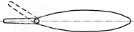
    Fig 4.1.5 Type D rudder(Semi spade rudder with one elastic support)
    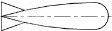
    Fig 4.1.6 Rudder horn
- **7.** **Type E rudders(Semi spade rudder with 2-conjugate elastic support)**
  - **(1)** General data
    The data on the semi spade rudder with 2-conjugate elastic support models is as follows(See **Fig 4.1.7** and **Fig 4.1.8** of the Guidance):
    $K _{11,} K _{12,} K _{22}$ : Rudder horn compliance constants calculated for rudder horn with 2-conjugate elastic supports
    The 2-conjugate elastic supports are defined in terms of horizontal displacements, $y _{i}$, by the following equations:
    at the lower rudder horn bearing: $y _{1} =-K _{12} B _{2} -K _{22} B _{1}$
    at the upper rudder horn bearing: $y _{2} =-K _{11} B _{2} -K _{12} B _{1}$
    $y _{1,} y _{2}$ : Horizontal displacements at the lower and upper rudder horn bearings, respectively (m)
    $B _{1} , B _{2}$ : Horizontal support forces at the lower and upper rudder horn bearings, respectively (kN)
    $K _{11,} K _{12,} K _{22}$ : Obtained, in m/kN, from the following formulae:
    $K _{11} =1.3 \frac{\lambda ^{3}}{3EJ _{1h}} + \frac{e ^{2} \lambda}{GJ _{th}}$
    $K _{12} =1.3 \left[ \frac{\lambda ^{3}}{3EJ _{1h}} + \frac{\lambda ^{2} (d- \lambda )}{2EJ _{1h}} \right] + \frac{e ^{2} \lambda}{GJ _{th}}$
    $K _{22} =1.3 \left[ \frac{\lambda ^{3}}{3EJ _{1h}} + \frac{\lambda ^{2} (d- \lambda )}{EJ _{1h}} + \frac{\lambda (d- \lambda ) ^{2}}{EJ _{1h}} + \frac{(d- \lambda ) ^{3}}{3EJ _{2h}} _{} \right] + \frac{e ^{2} d}{GJ _{th}}$
    $d$ : Height of the rudder horn, in m, defined in **Fig 4.1.7** of the Guidance. This value is measured downwards from the upper rudder horn end, at the point of curvature transition, to the mid-line of the lower rudder horn pintle.
    $\lambda$ : Length, in m, as defined **Fig 4.1.7** of the Guidance. This length is measured downwards from the upper rudder horn end, at the point of curvature transition, to the mid-line of the upper rudder horn bearing. For $\lambda$ = 0, the above formulae converge to those of spring constant $Z$ for a rudder horn with 1-elastic support, and assuming a hollow cross section for this part.
    $e$ : Rudder-horn torsion lever, in m, as defined in **Fig 4.1.7** of the Guidance (value taken at $z = d/2$)
    $J _{1h}$ : Moment of inertia of rudder horn about the *x* axis, in $\mathrm{m} ^{4}$, for the region above the upper rudder horn bearing. Note that $J _{1h}$ is an average value over the length $\lambda$ (see **Fig 4.1.7** of the Guidance)
    $J _{2h}$ : Moment of inertia of rudder horn about the *x* axis, in $\mathrm{m} ^{4}$, for the region between the upper and lower rudder horn bearings. Note that $J _{2h}$ is an average value over the length $d$ - $\lambda$ (see **Fig 4.1.7** of the Guidance)
    $J _{th}$ : Torsional stiffness factor of the rudder horn($\mathrm{m} ^{4}$), For any thin wall closed section:
    $J _{th} = \frac{4F _{T} ^{ 2}}{\sum _{i} ^{} \frac{u _{i}}{t _{i}}}$
    $F _{T}$ : Mean of areas enclosed by outer and inner boundaries of the thin walled section of rudder horn(m^2)
    $u _{i}$ : Length of the individual plates forming the mean horn sectional area.(mm)
    $t _{i}$ : Thickness, in mm, of the individual plates mentioned above.(mm)
    Note that the $J _{th}$ value is taken as an average value, valid over the rudder horn height.
    Load of rudder body
    $P _{R10} = \frac{F _{R2}}{1000 \ell _{10}}$(kN/m)
    $P _{R20} = \frac{F _{R1}}{1000 \ell _{20}}$(kN/m)
    $F_R1$ and $F_R2$ : as specified in **Pt 4, Ch 1, Sec 2** of the Rules
  - **(2)** The moments and forces may be determined by an approximate simplified method given in **Fig 4.1.7** of the Guidance)
  - **(3)** Rudder horn bending moment
    The bending moment acting on the generic section of the rudder horn is to be obtained from the following formulae:
    between the lower and upper supports provided by the rudder horn:
    $M _{H} = F _{A1} z$ (N-m)
    above the rudder horn upper-support:
    $M _{H} = F _{A1} z+F _{A2} (z-d _{lu} )$ (N-m)
    $F_{ A1}$ : Support force at the rudder horn lower-support, in N, to be obtained according to **Fig 4.1.7** of the Guidance, and taken equal to $B_{ 1}$.
    $F _{A2}$ : Support force at the rudder horn upper-support, in N, to be obtained according to **Fig 4.1.7** of the Guidance, and taken equal to $B _{2}$.
    $z$ : Distance, in m, defined in **Fig 4.1.8** of the Guidance, to be taken less than the distance $d$, in m, defined in the same figure.
    $d _{lu}$ : Distance, in m, between the rudder-horn lower and upper bearings (according to **Fig 4.1.7** of the Guidance)
    $d _{lu} = d- \lambda$
  - **(4)** Rudder horn shear force
    The shear force $Q_{ H}$ acting on the generic section of the rudder horn is to be obtained from the following formulae:
    between the lower and upper rudder horn bearings:
    $Q _{H} =F _{ A1}$ (N)
    above the rudder horn upper-bearing:
    $Q _{H} =F _{A1} +F _{A2}$ (N)
    $F_{ A1}$ and $F _{A2}$ : Support forces (N)
    The torque $M _{T}$ acting on the generic section of the rudder horn is to be obtained from the following formulae:
    between the lower and upper rudder horn bearings:
    $M _{T} =F _{A1} e _{(z)}$ (N-m)
    above the rudder horn upper-bearing:
    $M _{T} =F _{A1} e _{(z)} +F _{A2} e _{(z)}$ (N-m)
    $F_{ A1}$ and $F _{A2}$ : Support forces (N)
    $e(z)$ : Torsion lever, in m, defined in **Fig 4.1.8** of the Guidance.
  - **(5)** Rudder horn shear stress calculation
    The shear stress acting on the generic section of the rudder horn is to be obtained from the following formulae:
    between the lower and upper rudder horn bearings:
    $\tau _{S} = \frac{F _{A1}}{A _{H}}$ (N/mm^2)
    above the rudder horn upper-bearing:
    $\tau _{S} = \frac{F _{A1} +F _{A2}}{A _{H}}$ (N/mm^2)
    $F_{ A1}$ and $F _{A2}$ : Support forces (N)
    $A _{H}$ : Effective shear sectional area of the rudder horn in y-direction (mm^2)
    The torsional stress to be obtained for hollow rudder horn from the following formula. For solid rudder horn, the torsional stress is to be considered by the Society on a case by case basis.
    $\tau _{T} = \frac{M _{T} 10 ^{-3}}{2F _{T} t _{H}}$ (N/mm^2)
    $M _{T}$ : Torque (N-m)
    $F _{T} ^{{} _{{} _{}}}$ : Mean of areas enclosed by outer and inner boundaries of the thin walled section of rudder horn (m^2)
    $t _{H}$ : Plate thickness of rudder horn (mm). For a given cross section of the rudder horn, the maximum value of $\tau _{T}$ is obtained at the minimum value of $t _{H}$.
  - **(6)** Rudder horn bending stress calculation
    For the generic section of the rudder horn within the length $d$ defined in **Fig 4.1.8** of the Guidance, the following bending stresses are to be calculated:
    $\sigma _{B} = \frac{M _{H}}{Z _{x}}$ (N/mm^2)
    $M _{H}$ : Bending moment at the section considered (N-m)
    $F _{T} ^{{} _{{} _{}}}$ : Section modulus around the $x$-axis (cm^3)
    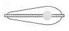
    Fig 4.1.7 Type E rudders(Semi spade rudder with 2-conjugate elastic support)
    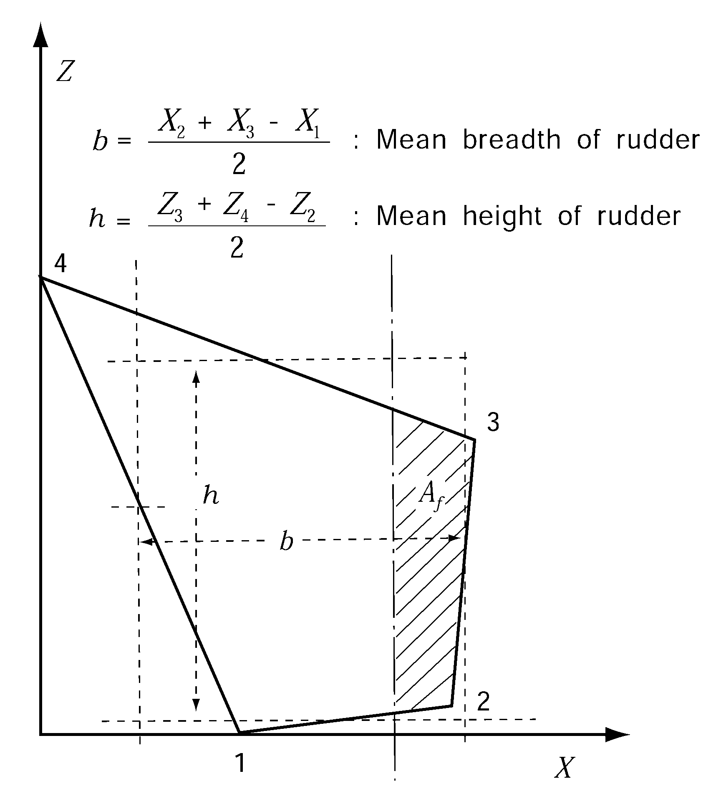
    Fig 4.1.8 Rudder horn

### Section 5 Rudder Stocks

#### 501. Upper stocks 【See Rule】

- **1.** **Taper of upper stock at joint with tiller**
  Where the upper stocks are tapered for fitting the tiller, the taper is not to exceed 1/12.5 in diameter.
- **2.** **Keyways**
  - **(1)** The depth of the keyway may be neglected in determining the diameter of the rudder stock.
  - **(2)** All corners of keyways are to be properly rounded.
- **3.** Each part of the rudder stocks of Type $B$, $C$ and $D$ rudders is to be so constructed as shown **Fig 4.1.9** of the Guidance.
  
  Fig 4.1.9 Rudder stock of type B, C and D rudder

#### 503. Deformations

Before significant reductions in rudder stock diameter are granted due to the application of steels with specified minimum yield stresses exceeding 235 (N/mm^2) are granted, the Society may require the evaluation of the rudder stock deformations. Large deformations of the rudder stock are to be avoided in order to avoid excessive edge pressures in way bearings.

### Section 6 Rudder Plates, Rudder Frames and Rudder Main Pieces

#### 603. Rudder main pieces 【See Rule】

- **1.** In Type $D$ and Type $E$ rudders, the effective breadth of rudder plate $B_e$ to be as shown in **Fig 4.1.10** of the Guidance**.** However, the cover plate which is removed to lift up the rudder is not to be included into the section modulus. These requirements also apply to Type $A$ rudders correspondingly.
- **2.** Material factor $K_m$ is to be for the lowest strength material among the materials used in the section considered.
  
  Fig 4.1.10 Effective breadth of rudder plate #eqnID-178

#### 605. Connections 【See Rule】

In principle, edge bars are to be fitted to the aft end of the rudder. However, considering the size and form of the rudder, weld ability, etc., edge bars and or chill plates may be omitted. (See **Fig 4.1.11** of the Guidance)
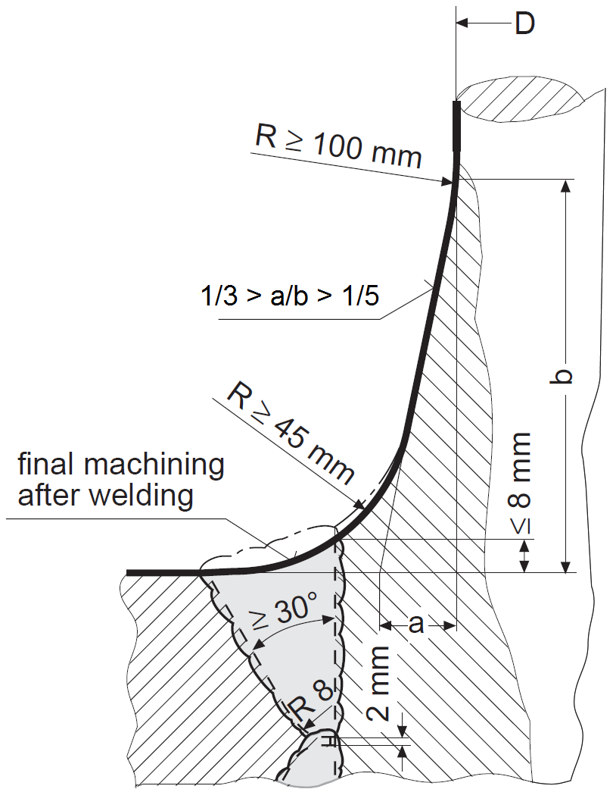
Fig 4.1.11 Structure of end part of rudder

### Section 7 Couplings between Rudder Stocks and Main Pieces

#### 701. Horizontal flange coupling 【See Rule】

- **1.** **Diameters of coupling bolts in Type** $A$ **and Type** $E$ **rudders**
  In appling to **Pt 4, Ch 1, 701.** of the Rules, the diameters of coupling bolts $d _b$ in Type $A$ and Type $E$ rudders are to be determined in accordance with the requirements in **Pt 4, Ch 1, 502.** of the Rules, assuming that the lower stock is cylindrical.
- **2.** **Locking device for nuts of coupling bolts**
  The nuts of coupling bolts are to have locking devices. They may be split pins.

#### 702. Vertical flange couplings 【See Rule】

- **1.** **Diameter of coupling bolt in Type** $A$ **and** $E$ **rudders**
  In appling to **Pt 4, Ch 1, 701.** of the Rules, the diameter of the coupling bolt $d _b$ in Type *A* and *E* rudders are to be determined in accordance with **Pt 4, Ch 1, 502.** of the Rules, assuming that the lower stock is cylindrical.
- **2.** **Locking devices for nuts of coupling bolts**
  The nuts of coupling bolts are to have locking devices. They may be split pins.

#### 703. Cone coupling 【See Rule】

- **1.** **General**
  - **(1)** The lower stock is to be securely connected to the rudder body with slugging nuts or hydraulic arrangements. Shipbuilders are to submit data on this connection to the Society.
  - **(2)** Special attention is to be paid to corrosion of the lower stock.
- **2.** Keys provided on the cone coupling for rudder stocks fitted into the rudder body and secured by a nut(Cone couplings without hydraulic arrangements for mounting and dismounting the coupling), where the entire rudder torque is transmitted by the key at the couplings as described in **703. 1** (8) of the Rules, the following requirements are to be complied with:
  - **(1)** The shear area $A_k$ of keys is not to be less than:
    $A_k = \frac{30 T_R K_k}{d_k}$(mm^2)
    $d_k$ = rudder stock diameter at the mid-point of length of the key (mm)
    *K_k* = material factor for the key as given in **Pt 4, Ch 1, 103.** of the Rules
    $T_R$ = rudder torque obtained from **Pt 4, Ch 1, Sec 3** of the Rules
  - **(2)** The abutting surface area $A_c$ between key and rudder stock or between key and rudder body, respectively, is not be less than:
    $A_c = \frac{10 T_R K_\min}{d_k}$(mm^2)
    where:
    $K_\min$ = material factor for key, rudder stock, or rudder body as given in **Pt 4, Ch 1, 103.** of the Rules, whichever is smaller in comparison between the factors for key and rudder stock, and for key and rudder body in contact.
    $d_k$ and $T_R$ = as specified in (1).

### Section 8 Pintles

#### 802. Construction of pintles 【See Rule】

- **1.** **Locking device for pintle nut**
  Split pins are not recommendable as the locking device for the pintle nuts. Locking rings or other equivalent devices(Nut stopper or Nut lock, etc,.) are to be used, as shown in **Fig 4.1.13** of the Guidance.
- **2.** **Preventing corrosion of pintles**
  To prevent corrosion of pintles, the end of the sleeve is to be filled with red lead, grease packing, bituminous enamel, rubber(Neoprene) etc., as shown in **Fig 4.1.13** of the Guidance.
- **3.** **Combination of pintle and rudder frame in monoblock**
  In ships exceeding 80 m in length, combination of pintle and rudder frame into a monoblock is not recommended.
  
  Fig 4.1.13 Locking device and preventing device of corrosion of pintle nut

### Section 9 Bearings of Rudders Stock and Pintles

#### 901. Minimum bearing surface 【 See Rule】

Where a metal bush is used, the sleeve is to be a different material from the bush (for example, sleeve : $BC_3$ and bush : $BC_2$).

#### 903. Bearing clearances 【See Rule】

Where a bush is non-metal, the standard bearing clearances is to be 1.5 ~ 2.0 mm in diameter.

### Section 10 Rudder Accessories

#### 1001. Rudder carriers 【See Rule】

- **1.** **Materials of rudder carriers and intermediate bearings** ***(2024)***
  When metallic materials are applied to rudder carrier and intermediate bearings, they are not to be of cast iron.
- **2.** **Thrust bearing of rudder carrier**
  - **(1)** The bearing is to be provided with a bearing disc made of bronze or other equivalent materials.
  - **(2)** The calculated bearing pressure is not to exceed 0.98 MPa(0.1 kg/mm^2) as a standard. In calculating the weight of rudder, its buoyancy is to be neglected.
  - **(3)** The bearing part is to be well lubricated by dripping oil, automatic grease feeding, or a similar method.
  - **(4)** The bearing is to be designed to be structurally below the level of lubricating oil at all times. (See **Fig 4.1.14** of the Guidance)
    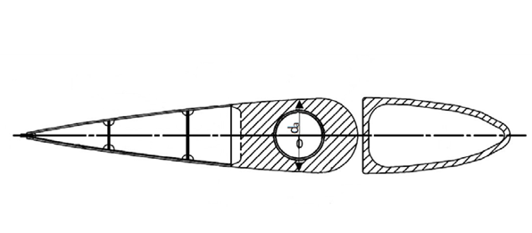
    Fig 4.1.14 Rudder carrier
- **3.** **Watertightness of rudder carrier part**
  - **(1)** In rudder trunks which are open to the sea, a seal or stuffing box is to be fitted above the deepest load waterline to prevent water from entering the steering gear compartment and the lubricant from being washed away from the rudder carrier. If the top of the rudder trunk is below the waterline at scantling draught (without trim), two separate watertight seals or stuffing boxes are to be provided. *(2024)*
  - **(2)** It is recommended that the packing gland in the stuffing box have an appropriate clearance from the rudder stock corresponding to the position of the stuffing box. The standard clearance is to be 4 mm for the stuffing box provided at the neck or intermediate bearing, and 2 mm for the stuffing box at the upper stock bearing.
- **4.** **Assembling of rudder carriers**
  In split type rudder carriers, at least two bolts are to be used on each side of the rudder for assembling.
- **5.** **Installation of rudder carriers**
  - **(1)** In ships exceeding 80 m in length, it is recommended that the rudder carrier is directly installed on the seat on a deck.
  - **(2)** A spigot type seat is not recommended to be installed on the deck.
  - **(3)** The hull construction in way of the rudder carrier is to be suitably reinforced.
- **6.** **Bolts fixing rudder carriers and intermediate bearing**
  - **(1)** As a standard, at least one half of the bolts fixing the rudder carrier and the intermediate bearing are to be reamer bolts. If stoppers for preventing the rudder carrier from moving are to be fitted on the deck, all bolts may be of ordinary bolts. In using chocks as stoppers, all of them are to be carefully arranged not to be driven in the same direction. (See **Fig 4.1.15** of the Guidance)
  - **(2)** (A) In ships provided with electro hydraulic steering gears, the total sectional area of the bolts fixing the rudder carriers or the bearing just under the tiller to the deck is not to be less than that obtained from the following formula:
    $A = 0.1 d _u^2$(mm^2)
    $d _u$ = required diameter of upper stock(mm)
    
    Fig 4.1.15 Fixing arrangement of rudder carrier on deck
    - **(B)** Where the arrangement of steering gear is such that each of two filler arms is connected with an actuator and two actuators function simultaneously, or is of any other type where the rudder stock is free from horizontal force, the total sectional area of bolts fixing the rudder carrier to the deck may be reduced to 60 % of the area required in (A).
    - **(C)** Where all the bolts fixing the rudder carrier to the deck are reamer bolts, the total sectional area of bolts may be reduced to 80 % of the area required by (A) and (B).

#### 1002. Jumping stoppers 【See Rule】 (2024)

The clearance between the jumping stopper and the rudder carrier is considered to be 2 mm as a standard and the recommended values given by manufacturer may be accepted.

### Section 11 Propeller Nozzles

#### 1101. Application 【See Rule】

In **1101. 1** of the Rules, the term "specially considered" means the cases as considered in accordance with **Pt 1, Ch 1, 105.** of the Rules. 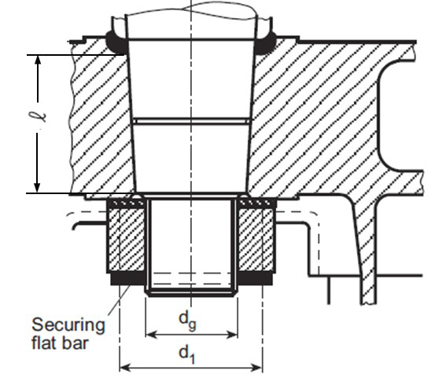
