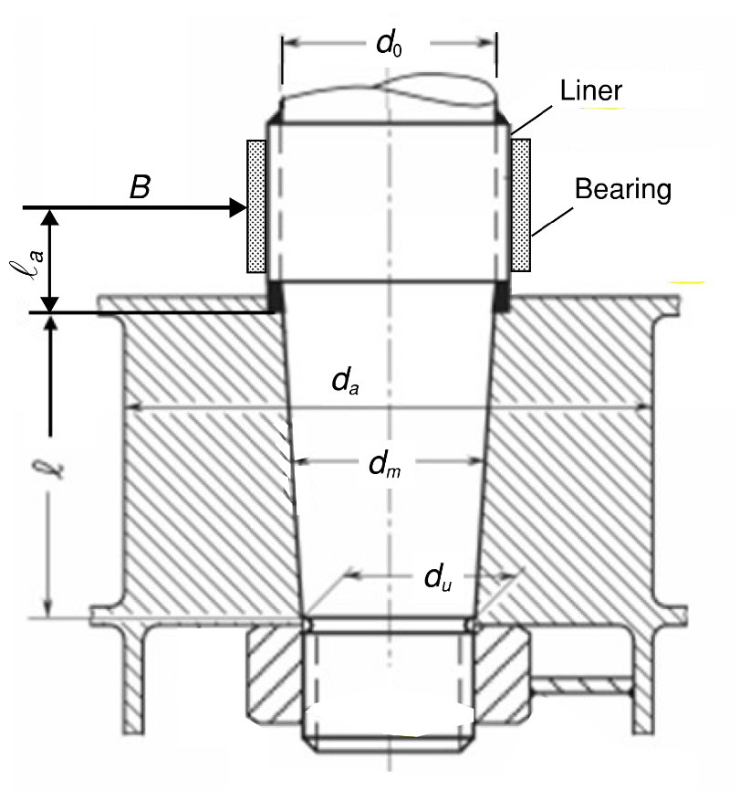

# PART 4 Hull Equipment

> RULES FOR CLASSIFICATION OF STEEL SHIPS / RA-04-E / 2025 / EN / Guidance

## CHAPTER 2 HATCHWAYS AND OTHER DECK OPENINGS

### Section 1 General

#### 101. Application 【See Rule】

The regulation of **101. 2** of the Rules is not to be applied to the vessel which engaged in domestic service only.

#### 102. Position of exposed deck openings 【See Rule】

In application of **102.** of the Rules, the details are as follows.
Position 1 - Upon freeboard decks and raised quarterdecks, or other exposed decks* lower than one standard height of superstructure above the freeboard deck, and upon exposed decks* situated forward of a point located a quarter of the ship's length from the forward perpendicular that are located lower than two standard heights of superstructure above the freeboard deck.
Position 2 - Upon exposed decks* situated abaft a quarter of the ship's length from the forward perpendicular and located at least one standard height of superstructure above the freeboard deck and lower than two standard heights of superstructure above the freeboard deck.
- Upon exposed decks* situated forward of a point located a quarter of the ship's length from the forward perpendicular and located at least two standard heights of superstructure above the freeboard deck and lower than three standard heights of superstructure above the freeboard deck.
* "Exposed decks" include top decks of superstructures, deckhouses, companionways and other similar deck structures.

#### 104. Hatch covers 【See Rule】

- **1.** Steel hatch covers in way of tanks loading cargo oil of flash point below 60 °C are to be paid enough attention in order to keep oil-tightness and air-tightness and to prevent occurring sparks due to striking of the surrounding metal fittings. And their gaskets are to be of materials certified as oilproof and fireproof by the relative standard.
- **2.** In principle, double plating hatch covers are not to be used in way of oil tanks. However, if they are to be used, their construction is to be easily drained out and vented by air.
- **3.** In **104. 2** of the Rules, the term "the discretion of the society" means that the hatch cover comply with below requirements. In this article sand carrier and dredger mean that the ships are be engaged in gathering, transporting, dredging or reclamation etc. for sand, soil, gravel etc.
  - **(1)** For the ship which operates in domestic-costal service area, the requirement for exemption of hatchway covers of sand carrier and dredger is as follows.
    Barge and self-propelled ship which is fitted with a buoyancy tank in each side and hopper door in bottom should have sufficient reserved buoyancy and stability in assumed the worst flooded condition of cargo hold.
    Barges which have buoyancy tanks of sufficient capacity for both sides and are considered to have sufficient reserve buoyancy and stability even in assumed worst flooded condition of the cargo hold. However, barges intend to sail to Jeju Island are to have hatch covers.
    For non self-propelled ship : #eqnID-201_s2m
    (where, $B$ = Breadth)
    - **(A)** Barge and self-propelled ship having hopper door
    - **(B)** Barge not having a hopper door
    - **(C)** For the exemption of hatchway cover installation, it should be met with the following conditions in assumed the worst flooded condition.
      - **(a)** The upper deck side line should be not flooded
      - **(b)** For self-propelled ship : #eqnID-200_s2m
  - **(2)** For the ship which operates in international service area and is fitted with door or valve in bottom, the requirement for exemption of hatchway cover installation of sand carrier and dredger is as follows.
    In this case, it should be possible to operate both systems from bridge, and the cargo releasing arrangements should be such that asymmetrical jettisoning of the cargo should not be possible even partially.
    - **(A)** The intact stability is to be met with the requirement of **IS Code part A.** In this case, the calculation is to include the homogeneous full load condition of cargo in each cargo hold loaded up to the top of the hatchway coaming.
    - **(B)** When the wetted cargo with the design bulk density of minimum 2.2 *ton/m3* is homogeneously loaded to the assigned freeboard in each hold and assuming that the void space of the cargo hold above the cargo surface is filled with the sea water induced by the flooding, the stability of the above (A) is to be satisfied.
    - **(C)** The damage stability is to be met with **SOLAS Ch. II-1, B-1**
    - **(D)** The doors or valves on bottom area are to be met with following requirements.
      - **(a)** The opening of the bottom dump doors should be effective in less than one(1) minute.
      - **(b)** In the case of bottom door not to be opened by gravity, the opening should be possible even after the main power source or the ram mechanism actuating the bottom dump doors have been put out of order.
    - **(E)** Draft indicator is to be fitted on the bridge.
    - **(F)** Where the additional requirements other than described above are necessary, the ship is to be met with those requirements also.

#### 107. Corrosion additions 【See Rule】

In **107. 3.** (3) of the Rules, the term "when this is deemed necessary, at the discretion of the individual class society's surveyor" means the acceptance in accordance with **Pt 1, Ch 1, 801. 3** of the Guidance.

#### 108. Operation and maintenance manual for hatch cover

It is recommended that ships with steel weathertight covers are supplied with an operation and maintenance manual including following (1) to (5)

### Section 2 Design Load

#### 204. Cargo load

When the cargoes loaded on hatch covers of exposed parts and lower deck, the loading height, loading condition, etc, is to be clearly shown in the drawings for approval. In case of loading freight containers, the kind of them and loading position are to be additionally described.

### Section 3 Hatch cover strength criteria

#### 303. Net plate thickness of hatch cover

- **1.** In **303. 3** (4) of the Rules, the term "should be determined according to the Society" means the case where the lower plating not be less than 2.0 mm. **【See Rule】**
- **2.** In **303. 4** of the Rules, the term "have to be derived from the Society" means to comply with **Pt 7, Ch 7, 301.** of the Guidance. **【See Rule】**

### Section 5 Hatch cover details - Closing Arrangement, Securing Devices and Stoppers

#### 502. General 【See Rule】

In **502. 6** of the Rules, the term "considered by the Society" means the cases as considered in accordance with **Pt 1, Ch 1, 105.** of the Rules.

#### 504. Clamping devices

- **4.** **Area of securing devices**
  - **(2)** $S _{SD}$(m) is maximum of the distances, $S _{i}$, between two consecutive securing devices, measured along the hatch cover periphery (see **Fig 4.2.1**), not to be taken as less than 2.5$S _{c}$(m). **【See Rule】** *(2024)*
    $S _{c} =\max(S _{1.1} , S _{1.2} )$ ($\mathrm{m}$)
    
    **Fig 4.2.1 Spacing of clamping device** *(2024)*

### Section 7 Miscellaneous Openings

#### 702. Companionways 【See Guidance】

- **1.** **Grouping into deckhouse and companionway**
  - **(1)** A structure is regarded as a deckhouse where its inside is always accessible through access openings provided on the top of the structure or through under-deck passageways, even when all access openings in the boundary walls are closed
  - **(2)** A structure is regarded as a companionway where its inside is not accessible through any other way, when all access openings in the boundary walls are closed. 
