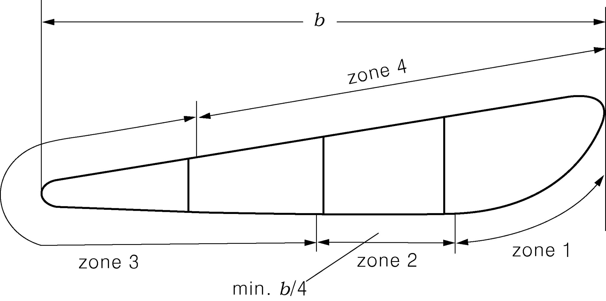

# PART 4 Hull Equipment

> RULES FOR CLASSIFICATION OF STEEL SHIPS / RA-04-E / 2025 / EN / Guidance

## CHAPTER 3 BOW DOORS, SIDE AND STERN DOORS

### Section 1 Bow Doors and Inner Doors

#### 101. General

- **1.** **Application**
  - **(1)** The following measures are to be complied with by all existing ro-ro passenger ships with the date of building before or on the 30th June 1996, including, when not differently deliberated by the competent flag Administrations, ships only engaged on domestic sea voyages.
    - **(A)** The structural condition of bow doors and inner doors, especially the primary structure, the securing and supporting arrangements and the hull structure alongside and above the doors, are to be specially examined and any defects rectified.
    - **(B)** The operating procedures of the bow door and inner door are to comply with the requirements of **Pt 4, Ch 3, 108.** of the Rules.
    - **(C)** The location and arrangement of inner doors are to comply with the applicable requirements of the **SOLAS** Convention and with **Pt 4, Ch 3, 101. 3.** (3) of the Rules.
    - **(D)** Ships with visor door are to comply with **Pt 4, Ch 3, 106. 2.** (7) of the Rules. requiring redundant provision of securing devices preventing the upward opening of the bow door. In addition, where the visor door is not self closing under external loads (i. e. the closing moment $M_y$ calculated in accordance with **Pt 4, Ch 3, 103. 1.** (3) (A) of the Rules is less than zero) then the opening moment $M_0$ is not to be taken less than $-M_y$. If drainage arrangements in the space between the inner and bow doors are not fitted, the value of $M_0$ is to be specially considered. Where available space above the tanktop does not enable the full application of **Pt 4, Ch 3, 106. 2.** (7) of the Rules, equivalent measures are to be taken to ensure that the door has positive means for being kept closed during seagoing operation.
    - **(E)** For visor doors, the securing and supporting device excluding the hinges to be capable of bearing the vertical design force ($F_z - 10W$), in kN, within the permissible stresses given in **Table 4.3.1** of the Rules.
    - **(F)** For side-opening doors, the structural arrangements for supporting vertical loads, including securing devices, supporting devices and, where applicable, hull structure above the door, are to be re-assessed in accordance with the applicable requirements of **Pt 4, Ch 3, 106.** of the Rules and modified accordingly.
    - **(G)** The securing and locking arrangements for bow doors and inner doors which may lead to the flooding of a special category space or Ro-Ro cargo space as defined in the **Pt 4, Ch 3, 101. 4** of the Rules, are to comply with the following requirements: **【See Rule】**
      - **(a)** Separate indicator lights and audible alarms are to be provided on the navigation bridge and on each operating panel to indicate that the doors are closed and that their securing and locking devices are properly positioned. The indication panel is to be provided with a lamp test function. It shall not be possible to turn off the indicator light.
      - **(b)** The indication panel on the navigation bridge is to be equipped with a mode selection function harbour / sea voyage, so arranged that audible alarm is given if the vessel leaves harbour with side shell or stern doors not closed or with any of the securing devices not in the correct position.
      - **(c)** A water leakage detection system with audible alarm and television surveillance is to be arranged to provide an indication to the navigation bridge and to the engine control room of any leakage through the doors.

### Section 2 Side Shell Doors and Stern Doors

#### 201. General

- **1.** **Application**
  - **(1)** The following measures are to be complied with by all existing ro-ro passenger ships with the date of building before or on the 30th June 1997, including, when not differently deliberated by the competent flag Administrations, ships only engaged on domestic sea voyages.
    - **(A)** The structural condition of side shell doors and stern doors, especially the primary structure, the securing and supporting arrangements and the hull structure alongside and above the doors, are to be specially examined and any defects rectified.
    - **(B)** The structural arrangement of securing devices and supporting devices of inwards opening doors in way of these securing devices and, where applicable, of the surrounding hull structure is to be reassessed in accordance with the applicable requirements of **Pt 4, Ch 3, 205.** of the Rules and modified accordingly.
    - **(C)** The securing and locking arrangements for side and stern doors which may lead to the flooding of a special category space or Ro-Ro cargo space as defined in the **Pt 4, Ch 3, 101. 4** of the Rules, are to comply with the following requirements: **【See Rule】**
      - **(a)** Separate indicator lights and audible alarms are to be provided on the navigation bridge and on each operating panel to indicate that the doors are closed and that their securing and locking devices are properly positioned. The indication panel is to be provided with a lamp test function. It shall not be possible to turn off the indicator light.
      - **(b)** The indication panel on the navigation bridge is to be equipped with a mode selection function harbour / sea voyage, so arranged that audible alarm is given if the vessel leaves harbour with side shell or stern doors not closed or with any of the securing devices not in the correct position.
      - **(c)** A water leakage detection system with audible alarm and television surveillance is to be arranged to provide an indication to the navigation bridge and to the engine control room of any leakage through the doors.
    - **(D)** Documented operating procedures for closing and securing side shell and stern doors are to be kept on board and posted at the appropriate places. 
