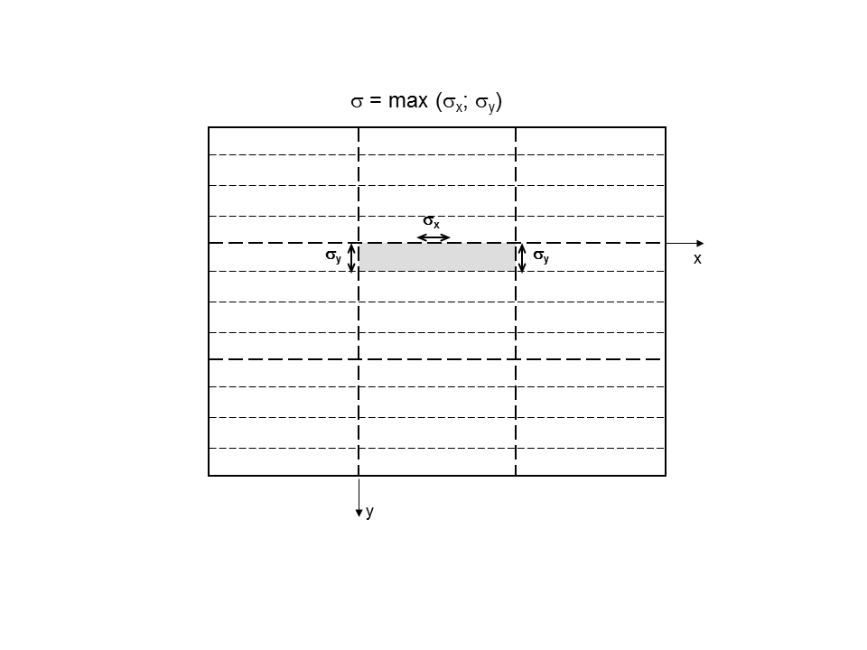
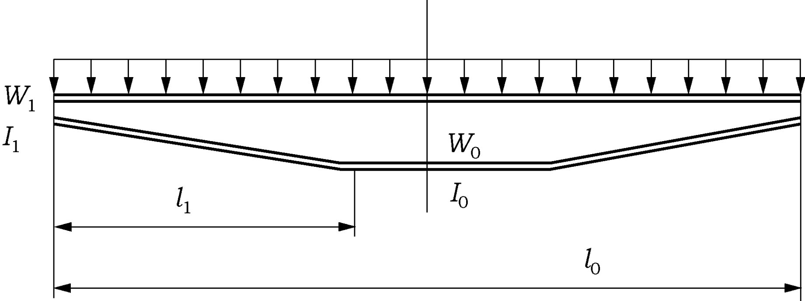
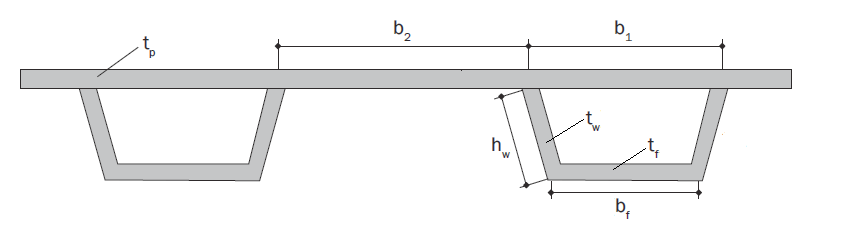
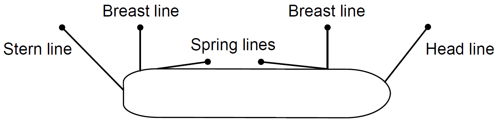
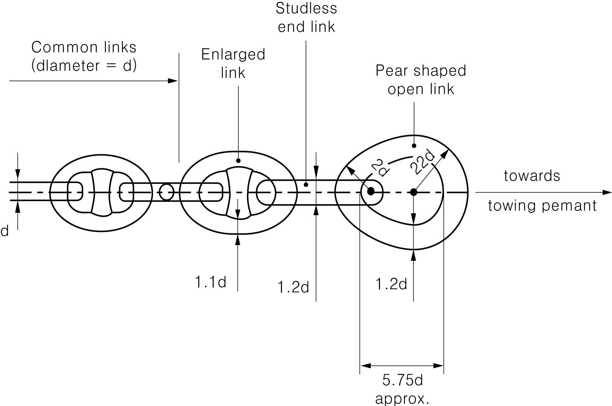
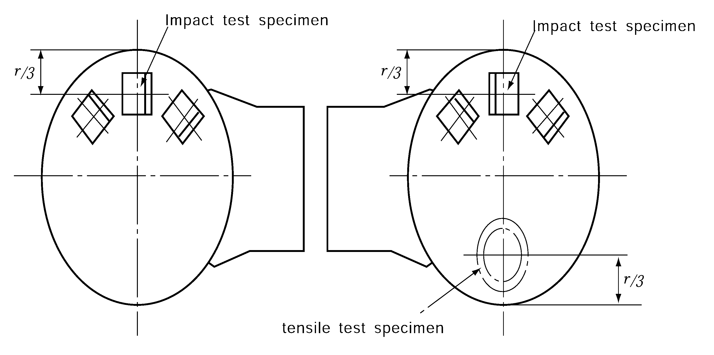
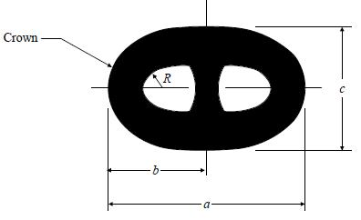
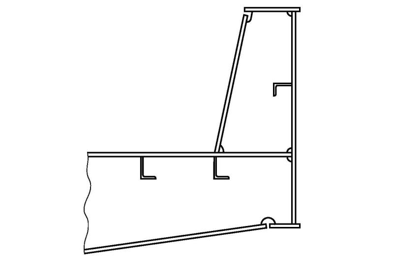
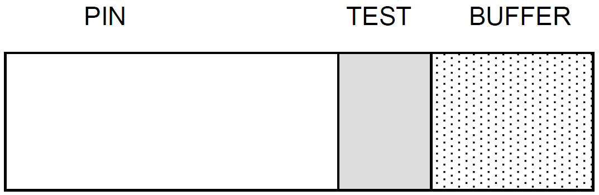

# PART 4 Hull Equipment

> RULES FOR CLASSIFICATION OF STEEL SHIPS / RA-04-E / 2025 / EN / Guidance

## CHAPTER 8 EQUIPMENT NUMBER AND EQUIPMENT

### Section 1 General

#### 101. General and application 【See Rule】

- **1.** The anchoring equipment required herewith applies to self-propelled vessels over 100GT, except for: *(2024)*
  - **(1)** inland navigation vessels,
  - **(2)** military vessels,
  - **(3)** government ships operated for non-commercial purposes,
  - **(4)** high speed and light crafts,
  - **(5)** yachts
- **2.** Due to be assigned scantling draft($d_s$), if draft($d_f$) for designed ship and draft assigning is smaller than designed draft($d$), equipment number and equipment are to be as follows:
  - **(1)** For scantling draft($d_s$), equipment number and equipment corresponded with scantling draft ($d_s$) is to be equipped. In this case, if $d_s - d$ is not less than 300 mm, ship length ($L_s$) corresponded with $d_s$ is to be used.
  - **(2)** If $d_f$ is not less than $d$ (for ship assigned $d_s$, $d_f$ > $d_s$), equipment number and equipment are to be decided by the scantling which is corresponded with $d_f$. If $d_f - d$ is not less than 300 mm, equipment number is to be calculated with ship length which is corresponded with $d_f$
- **3.** **Superstructure which is not regarded as a deckhouse due to strength**
  Even though superstructure is not regarded as a deckhouse due to strength, if side wall is extended to side shell and deck is provided, it may be regarded as a superstructure. However, for the superstructure having unusually short end parts of deckhouse may be regarded as a deckhouse.
- **4.** **Design of the anchoring equipment**
  - **(1)** The anchoring equipment required herewith is intended for temporary mooring of a ship within a harbour or sheltered area when the ship is awaiting berth, tide, etc. **Annex 4-3** may be referred to for recommendations concerning anchoring equipment for ships in deep and unsheltered water.
  - **(2)** The Equipment Number (EN) formulae for anchoring equipment as given in **201.** of the Rules are based on an assumed maximum current speed of 2.5 m/s, maximum wind speed of 25 m/s and a minimum scope of chain cable of 6, the scope being the ratio between length of chain paid out and water depth. For ships with an equipment length greater than 135 m, alternatively the required anchoring equipment can be considered applicable to a maximum current speed of 1.5 m/s, a maximum wind speed of 11 m/s and waves with maximum significant height of 2 m.
  - **(3)** It is assumed that under normal circumstances a ship will uses only one bow anchor and chain cable at a time.
  - **(4)** In addition to planned anchoring for normal operations, anchoring equipment should be ready to use for ship safety in emergency situations such as loss of manoeuvrability, unscheduled repairs and other unexpected situations. *(2024)*

#### 104. Tests and inspections 【See Rule】

In **104. 3** of the Rules, the "appropriate certificates accepted by the Society" means the certificates issued by any Society which is subject to verification of compliance with QSCS(Quality System Certification Scheme) of IACS and the relevant flag state or MED certificates.

### Section 2 Equipment Number

#### 201. Equipment number 【See Rule】

- **1.** **Equipment for tugs** ***(2024)***
  - **(1)** The equipment number is to be following formula;
    $E = \Delta ^{\frac{2}{3}} +2.0( aB + \sum _{} ^{} h _{i} b _{i} )+ \frac{A}{10}$
    $\Delta , a, h _{i} , A$ = as specified in 201. of the Rules.
    $b _{i}$ = widest breath of superstructure or deckhouse of each tier having a breadth greater than B/4 (m).
  - **(2)** For tugs under 45m in length intended for towing service only, one anchor may be used onboard provided that the second anchor and its relevant chain cable holds readily available to be installed. In case of loss of anchor, the tug is to remain in port until replace anchor equipment is installed onboard.
- **2.** **Significant figures**
  - **(1)** The scantling unit(m) of length, height, breadth has two significant figures and third figure is raised to a unit.
  - **(2)** $\Delta$ has a only positive number.
  - **(3)** Each item of formula
    ($\Delta ^{\frac{2}{3}} , 2.0(hB+S _{fun} ), \frac{A}{10}$) has a only positive number with raising to unit from first figure.
- **3.** $\Delta$**,** $a$
  - **(1)** The values of $\Delta$, $a$ is to be in accordance with designed summer load line. However, ships assigned scantling draft $d_s$ use the value $d_s$.
  - **(2)** When the principle dimensions($L$, $B$ and $D$) is changed (for example, $L$ is changed when $d_f - d$ is greater than 300 mm), equipment number may be recalculated.
  - **(3)** When draft is changed, it is in accordance with the regulation **101. 2** of this chapter.
- **4.** Measurement of breadth of superstructures
  - **(1)** The structures are to be treated as divided into the upper and lower structures by a deck level. A continuous superstructure or deckhouse situated on one tier is to be treated as a single structure irrespective of the mode of variation of their breadth and height-continuous or discontinuous, and the breadth is to be the largest one as shown in **Fig 4.8.1**.
    
    Fig 4.8.1
  - **(2)** As for detached independent deck-houses on one tier, breadths of respective deckhouses are to be measured separately to determine whether they should be included or not. (See **Fig 4.8.2**)

    |  Fig 4.8.2 Fig 4.8.2 |  Fig 4.8.3 Fig 4.8.3 |
    | --- | --- |
    |  Fig 4.8.4 Fig 4.8.4 |   |
- **5.** $A$**(side project area)**
  - **(1)** $A$(side project area) is to be following formula;
    $A=aL+ \sum h _{j} l$(m^2)
    $a$ : as specified in **201**. of the Rules.
    $\sum h _{j} l$ : summing up of the products of the height $h _{j}$(m) and length $l$ (m) of superstructures, deckhouses, trunks or funnels which are located above the uppermost continuous deck within the length of ship and also have a breadth greater than $B/4$ and a height greater than 1.5 m.
  - **(2)** The area of deck camber may disregarded when determining $A$(side project area).
  - **(3)** The structures are to be treated as divided into the upper and lower structures by a deck level. A continuous superstructure or deckhouse situated on one tier is to be treated as a single structure even when its breadth and/or height vary discontinuously. The length is to be the maximum extreme length of the structure. However, if the height is not more than 1.5m, the part of the single structure may be ignored.
  - **(4)** The height of structure($h _{j}$) having a breadth greater than $B/4$ is the between deck height of respective tiers of structure at the centerline.
  - **(5)** The following items may be excluded from the $A$(side project area)
    
    Fig 4.8.5
- **6.** **Mooring lines for ships with EN > 2000**
  The minimum recommended strength and number of mooring lines for ships with an Equipment Number EN > 2000 are given in (1) and (2), respectively. The length of mooring lines is given by (3).
  The strength of mooring lines and the number of head, stern, and breast lines for ships with an Equipment Number EN > 2000 are based on the side-projected area A1. Side projected area A1 should be calculated similar to the side-projected area A according to **201.** of the rules but considering the following conditions:
  - The ballast draft should be considered for the calculation of the side-projected area A1. For ship types having small variation in the draft, like e.g. passenger and RO/RO vessels, the side projected area A1 may be calculated using the summer load waterline.
  - Wind shielding of the pier can be considered for the calculation of the side-projected area A1 unless the ship is intended to be regularly moored to jetty type piers. A height of the pier surface of 3 m over waterline may be assumed, i.e. the lower part of the side-projected area with a height of 3 m above the waterline for the considered loading condition may be disregarded for the calculation of the side-projected area A1.
  - Deck cargoes at the ship nominal capacity condition should be included for the determination of side-projected area A1. For the condition with cargo on deck, the summer load waterline may be considered. Deck cargoes may not need to be considered if ballast draft condition generates a larger side-projected area A1 than the full load condition with cargoes on deck. The larger of both side-projected areas should be chosen as side-projected area A1.
  The mooring lines as given here under are based on a maximum current speed of 1.0 m/s and the following maximum wind speed vw, in m/s:
  $V _{W} = 25.0 - 0.002 (A _{1} - 2000)$ : for passenger ships, ferries, and car carriers with $rm 2000 m ^{2 } < A _{1} \leq 4000 m ^{2}$
  $= 21.0$ : for passenger ships, ferries, and car carriers with $\mathrm{A} _{1} > 4000 m ^{2}$
  $= 25.0$ : for other ships
  The wind speed is considered representative of a 30 second mean speed from any direction and at a height of 10 m above the ground. The current speed is considered representative of the maximum current speed acting on bow or stern (± 10°) and at a depth of one-half of the mean draft. Furthermore, it is considered that ships are moored to solid piers that provide shielding against cross current.
  Additional loads caused by, e.g., higher wind or current speeds, cross currents, additional wave loads, or reduced shielding from non-solid piers may need to be particularly considered. Furthermore, it should be observed that unbeneficial mooring layouts can considerably increase the loads on single mooring lines.
  Note:
  The following is defined with respect to the purpose of mooring lines, see also figure below:
  Breast line : A mooring line that is deployed perpendicular to the ship, restraining the ship in the off-berth direction.
  Spring line : A mooring line that is deployed almost parallel to the ship, restraining the ship in fore or aft direction.
  Head/Stern line : A mooring line that is oriented between longitudinal and transverse direction, restraining the ship in the off-berth and in fore or aft direction. The amount of restraint in fore or aft and off-berth direction depends on the line angle relative to these directions.
  
  - **(1)** Ship design minimum breaking load
    The ship design minimum breaking load, in kN, of the mooring lines should be taken as:
    $MBL _{SD} = 0.1 \cdot A _{1} +350$
    The ship design minimum breaking load may be limited to 1275 kN (130 t). However, in this case the moorings are to be considered as not sufficient for environmental conditions given by this section. For these ships, the acceptable wind speed $V _{ W} ^{ *}$, in m/s, can be estimated as follows:
    $V _{ W}^{ *} = V _{W} \cdot \sqrt {\frac{MBL _{SD}^{*}}{MBL _{SD}}}$ (m/s)
    where $V _{ W}^{ }$ is the wind speed as per this section, $MBL _{SD }^{*}$ the ship design minimum breaking load of the mooring lines intended to be supplied and $MBL _{SD }^{}$ the ship design minimum breaking load as recommended according to the above formula. However, the ship design minimum breaking load should not be taken less than corresponding to an acceptable wind speed of 21 m/s:
    $MBL _{SD}^{*} \geq \left( \frac{21}{V _{W}} \right) ^{2} \cdot MBL _{SD}$
    If lines are intended to be supplied for an acceptable wind speed $V _{ W} ^{ *}$ higher than $V _{ W}^{ }$ as per this section, the ship design minimum breaking load should be taken as:
    $MBL _{SD}^{*} \geq \left( \frac{V _{W}^{ * ^{ }}}{V _{W}} \right) ^{2} \cdot MBL _{SD}$
  - **(2)** Number of mooring lines
    The total number of head, stern and breast lines (see Note in (1)) should be taken as:
    $n = 8.3 \cdot 10 ^{{} _{-4}} \cdot A _{1} +6$
    For oil tankers, chemical tankers, bulk carriers, and ore carriers the total number of head, stern and breast lines should be taken as:
    $n = 8.3 \cdot 10 ^{{} _{-4}} \cdot A _{1} +4$
    The total number of head, stern and breast lines should be rounded to the nearest whole number.
    The number of head, stern and breast lines may be increased or decreased in conjunction with an adjustment to the ship design minimum breaking load of the lines. The adjusted ship design minimum breaking load, $MBL _{SD }^{*}$, should be taken as:
    $MBL _{SD }^{ **} = 1.2 \cdot MBL _{SD} \cdot n/n ^{**} \leq MBL _{SD}$ for increased number of lines,
    $MBL _{SD }^{ **} = MBL _{SD} \cdot n/n ^{**}$ for reduced number of lines.
    where $MBL _{SD}$ is $MBL _{SD}$ or $MBL _{SD}^{ *}$ specified in (1), as appropriate, $n ^{**}$ is the increased or decreased total number of head, stern and breast lines and n the number of lines for the considered ship type as calculated by the above formulas without rounding.
    Vice versa, the ship design minimum breaking load of head, stern and breast lines may be increased or decreased in conjunction with an adjustment to the number of lines.
    The total number of spring lines (see Note in this section) should be taken not less than:
    Two lines where EN < 5000,
    Four lines where EN ≥ 5000.
    The ship design minimum breaking load of spring lines should be the same as that of the head, stern and breast lines. If the number of head, stern and breast lines is increased in conjunction with an adjustment to the ship design minimum breaking load of the lines, the number of spring lines should be taken as follows, but rounded up to the nearest even number.
    $n _{s}^{*} = MBL _{SD} /MBL _{SD}^{** _{ }} \cdot n _{s}$
    where $MBL _{SD}$ is $MBL _{SD}$ or $MBL _{SD}^{ *}$ specified in (1), as appropriate, $n _{s}$ is the number of spring lines as given above and $n _{s} ^{*}$ the increased number of spring lines.
  - **(3)** Length of mooring lines
    For ships with EN > 2000 the length of mooring lines may be taken as 200 m.
    The lengths of individual mooring lines may be reduced by up to 7% of the above given lengths, but the total length of mooring lines should not be less than would have resulted had all lines been of equal length.
- **7.** **Tow line**
  The tow lines are given in **Table 4.8.1** of the rules and are intended as own tow line of a ship to be towed by a tug or other ship. For the selection of the tow line from **Table 4.8.1** of the rules, the Equipment Number EN should be taken according to **6**.

#### 203. Chain cables and stream lines 【See Rule】

- **1.** Steel wire rope instead of stud link chain cable may be accepted for vessels of special design or operation such as crane barges if recognized by the Society. The acceptance will be based on a case-by-case evaluation, including consideration of operational and safety aspects. If steel wire rope is accepted, the following to be fulfilled.
  - **(1)** The steel wire rope shall have at least the same breaking strength as the stud link chain cable.
  - **(2)** The length of the steel wire rope shall be at least 50 % above the table value for the chain cable.
  - **(3)** The anchor weight shall be increased by 25 %.
  - **(4)** A length of chain cable shall be fitted between the anchor and the steel wire rope. The length shall be taken as the smaller of the follows.
    - **(A)** 12.5 m
    - **(B)** The distance between the anchor in stowed position and the winch
- **2.** The Society may consider the acceptance if the effect of mooring equipment for operating condition is equivalent to the Rules to the satisfaction to the Society.

### Section 3 Anchors

#### 304. Constructions and dimensions 【See Rule】

In the Rules, "holding power indicated by the Society" means 2 times of holding power to stockless anchor having same mass in case of high holding power anchors and 4 times of holding power to stockless anchor having same mass in case of super high holding power anchors by the results of holding power test by the type approval tests in **Ch 3, Sec 6** of the **Guidance for Approval of Manufacturing Process and Type Approval, Etc.**

### Section 4 Chains

#### 401. Application 【See Rule】

- **1.** “Chafing chain for Emergency Towing Arrangements (ETA)” specified in **Pt 4, Ch 8, 401. 2** of the Rules are as follows.
  - **(1)** Scope
    These requirements apply to the chafing chain for chafing gear of two types of Emergency Towing Arrangements (ETA) with specified safe working load (SWL) of 1,000kN (ETA1000) and 2,000kN (ETA2000). Chafing chains other than those specified can be used subject to special agreement with the Society.
  - **(2)** Approval of manufacturing
    The chafing chain is to be manufactured by works approved by the Society.
  - **(3)** Materials
    The materials used for the manufacture of the chafing chain are to satisfy the requirements in **403.** of the Rules.
  - **(4)** Design, manufacture, testing and certification of chafing chain
    
    Fig 4.8.10 Typical outboard chafing chain end

    | Type of ETA | Nominal diameter of common link, d min. |   |
    | --- | --- | --- |
    | Type of ETA | Grade 2 | Grade 3 |
    | ETA1000 | 62mm | 52mm |
    | ETA2000 | 90mm | 76mm |
    - **(A)** The chafing chain is to be designed, manufactured, tested and certified in accordance with the requirements in **Pt 4, Ch 8, Sec 4** of the Rules.
    - **(B)** The arrangement at the end connected to the strongpoint and the dimensions of the chafing chain are determined by the type of ETA. The other end of the chafing chain is to be fitted with a pear-shaped open link allowing connection to a shackle corresponding to the type of ETA and chain cable grade. A typical arrangement of this chain end is shown in **Fig 4.8.10.**
    - **(C)** The common link is to be of stud link type grade 2 or 3.
    - **(D)** The chafing chain is to be able to withstand a breaking load not less than twice the SWL. For each type of ETA, the nominal diameter of common link for chafing chains is to comply with the value indicated in **Table 4.8.1.**
- **2.** “The Offshore mooring chains deemed appropriate by the Society” specified in **Pt 4, Ch 8, 401. 2** of the Rules are as follows.
  - **(1)** General
    - **(A)** Scope
      - **(a)** These requirements apply to the materials, design, manufacture and testing of offshore mooring chain and accessories intended to be used for applications such as:mooring of mobile offshore units, mooring of floating production units, mooring of offshore loading systems and mooring of gravity based structures during fabrication.
      - **(b)** Mooring equipment covered are common stud and studless links, connecting common links (splice links), enlarged links, end links, detachable connecting links (shackles), end shackles, subsea connectors, swivels and swivel shackles.
      - **(c)** Studless link chain is normally deployed only once, being intended for long-term permanent mooring systems with pre-determined design life.
      - **(d)** Requirements for chafing chain for single point mooring arrangements are given in **Par 3**.
    - **(B)** Chain grades
      - **(a)** Depending on the nominal tensile strength of the steels used for manufacture, chains are to be subdivided into five grades, i.e.: R3, R3S, R4, R4S and R5.
      - **(b)** Manufacturers propriety specifications for R4S and R5 may vary subject to design conditions and the acceptance of the Society.
      - **(c)** Each Grade is to be individually approved. Approval for a higher grade does not constitute approval of a lower grade. If it is demonstrated to the satisfaction of the Society that the higher and lower grades are produced to the same manufacturing procedure using the same chemistry and heat treatment, consideration will be given to qualification of a lower grade by a higher. The parameters applied during qualification are not to be modified during production.
  - **(2)** Materials

    **Table 4.8.2 Materials for offshore chain link**

    | Kind of offshore chain | Materials | Grade of material |
    | --- | --- | --- |
    | Grade *R* 3 | Grade *R* 3 offshore chain bar | *RSBCR* 3 |
    | Grade *R* 3S | Grade *R* 3S offshore chain bar | *RSBCR* 3S |
    | Grade *R* 4 | Grade *R* 4 offshore chain bar | *RSBCR* 4 |
    | Grade *R* 4S | Grade *R* 4S offshore chain bar | *RSBCR* 4S |
    | Grade *R* 5 | Grade *R* 5 offshore chain bar | *RSBCR* 5 |

    **Table 4.8.3 Materials for accessories of offshore chains**

    | Kind of connected offshore chain | Manufacturing process |   |   |   |
    | --- | --- | --- | --- | --- |
    | Kind of connected offshore chain | Casting | Grade of material | Forging | Grade of material |
    | Grade *R* 3 | Grade *R* 3 steel casting | *RSCCR* 3 | Grade *R* 3 steel forging | *RSFCR* 3 |
    | Grade *R* 3S | Grade *R* 3S steel casting | *RSCCR* 3S | Grade *R* 3S steel forging | *RSFCR* 3S |
    | Grade *R* 4 | Grade *R* 4 steel casting | *RSCCR* 4 | Grade *R* 4 steel forging | *RSFCR* 4 |
    | Grade *R* 4S | Grade *R* 4S steel casting | *RSCCR* 4S | Grade *R* 4S steel forging | *RSFCR* 4S |
    | Grade *R* 5 | Grade *R* 5 steel casting | *RSCCR* 5 | Grade *R* 5 steel forging | *RSFCR* 5 |
    - **(A)** Offshore chains are to be made of the materials given in **Table 4.8.2** of the Guidance according to their grades and manufacturing processes, respectively.
    - **(B)** Accessories for offshore chains are to be made of the materials given in **Table 4.8.3** of the Guidance corresponding to the grades of the connected offshore chain.
  - **(3)** Design and manufacture
    Records of bar heating, flash welding and heat treatment shall be made available for inspection by the Surveyor.
    ① Platen motion
    ② Current as a function of time
    ③ Hydraulic pressure
    
    Fig 4.8.11 Sampling of chain links

    **Table 4.8.4 Mechanical properties**

    | Kinds of offshore chains | Tensile test |   |   |   | Impact test(1) |   |   |
    | --- | --- | --- | --- | --- | --- | --- | --- |
    | Kinds of offshore chains | Yeild strength(2) (N/mm^2) | Tensile strength(2) (N/mm^2) | Elongation ($L=5d$)(%) | Reduction of area (%) | Testing temperature (°C) | Minimum mean absorbed energy (J) |   |
    | Kinds of offshore chains | Yeild strength(2) (N/mm^2) | Tensile strength(2) (N/mm^2) | Elongation ($L=5d$)(%) | Reduction of area (%) | Testing temperature (°C) | except welded part | welded part |
    | Grade *R* 3 | 410 min. | 690 min. | 17 min. | 50 min. | -20(3) | 40 min.(3) | 30 min.(3) |
    | Grade *R* 3S | 490 min. | 770 min. | 15 min. | 50 min. | -20(3) | 45 min.(3) | 33 min.(3) |
    | Grade *R* 4 | 580 min. | 860 min. | 12 min. | 50 min. | -20 | 50 min. | 36 min. |
    | Grade *R* 4S | 700 min. | 960 min. | 12 min. | 50 min. | -20 | 56 min. | 40 min. |
    | Grade *R* 5 | 760 min. | 1000 min. | 12 min. | 50 min. | -20 | 58 min. | 42 min. |
    | (Notes) (1) When the absorbed energy of two or more test specimens among a set of test specimens is less in value than the specified minimum mean absorbed energy or when the absorbed energy of a single test specimen is less in value 70 % of the specified minimum mean absorbed energy, the test is considered to have failed. (2) Aim value of yield to tensile ration is maximum 0.92 (3) Impact test of Grade *R* 3 and *R* 3S offshore chains may be carried out at the temperature of 0°C where approved by the Society. In this case, minimum mean absorbed energy is not to be less than following values. except welded part ; welded part (a) Grade *R* 3 ; 60 J ; 50 J (b) Grade *R* 3S ; 65 J ; 53 J except welded part welded part (a) Grade *R* 3 60 J 50 J (b) Grade *R* 3S 65 J 53 J |   |   |   |   |   |   |   |
    |   | except welded part | welded part |   |   |   |   |   |
    | (a) Grade *R* 3 | 60 J | 50 J |   |   |   |   |   |
    | (b) Grade *R* 3S | 65 J | 53 J |   |   |   |   |   |

    **Table 4.8.5 Breaking and proof test loads, mass and length over 5 links for offshore chains**

    | Test Load | Grade *R*3 Stud Link | Grade *R*3S Stud Link | Grade *R*4 Stud Link | Grade *R*4S Stud Link | Grade *R*5 Stud Link |
    | --- | --- | --- | --- | --- | --- |
    | Proof test load (kN) | 0.0148$d ^{2}$(44-0.08$d$) | 0.0180$d ^{2}$(44-0.08$d$) | 0.0216$d ^{2}$(44-0.08$d$) | 0.0240$d ^{2}$(44-0.08$d$) | 0.0251$d ^{2}$(44-0.08$d$) |
    | Breaking test load (kN) | 0.0223$d ^{2}$(44-0.08$d$) | 0.0249$d ^{2}$(44-0.08$d$) | 0.0274$d ^{2}$(44-0.08$d$) | 0.0304$d ^{2}$(44-0.08$d$) | 0.0320$d ^{2}$(44-0.08$d$) |
    | Test Load | Grade *R*3 Studless | Grade *R*3S Studless | Grade *R*4 Studless | Grade *R*4S Studless | Grade *R*5 Studless |
    | Proof test load (kN) | 0.0148$d ^{2}$(44-0.08$d$) | 0.0174$d ^{2}$(44-0.08$d$) | 0.0192$d ^{2}$(44-0.08$d$) | 0.0213$d ^{2}$(44-0.08$d$) | 0.0223$d ^{2}$(44-0.08$d$) |
    | Breaking test load (kN) | 0.0223$d ^{2}$(44-0.08$d$) | 0.0249$d ^{2}$(44-0.08$d$) | 0.0274$d ^{2}$(44-0.08$d$) | 0.0304$d ^{2}$(44-0.08$d$) | 0.0320$d ^{2}$(44-0.08$d$) |
    | Chain Weight (kg/m) | Stud Link = 0.0219$d ^{2}$ |   |   |   |   |
    | Chain Weight (kg/m) | Studless chain Weight calculations for each design are to be submitted. |   |   |   |   |
    | Length over 5 links (mm) | over 22d up to 22.55$d$ |   |   |   |   |

    ① The negative tolerance on the nominal diameter
    measured at the crown:

    |   |   |   |   |   |   |   |   |
    | --- | --- | --- | --- | --- | --- | --- | --- |
    | Nominal diameter (mm) | over |   | 40 | 84 | 122 | 152 | 184 |
    | Nominal diameter (mm) | up to | 40 | 84 | 122 | 152 | 184 | 222 |
    | negative tolerance(mm) |   | -1 | -2 | -3 | -4 | -6 | -7.5 |

    Note 1: The cross sectional area at the crown must have no negative tolerance. For diameters of 20 mm or greater, Tthe plus tolerance may be up to 5 percent of the nominal diameter. For diameters less than 20 mm the plus tolerance is to be agreed with the Society at the time of approval. The cross sectional area at the crown must have no negative tolerance.
    Note 2: The cross sectional area at the crown is to be calculated using the average of the diameters with negative tolerance and plus tolerance, measurements are to be taken from at least 2 locations approximately 90 degrees apart.
    ② Diameter measured at locations other than the crown:
    The diameter is to have no negative tolerance. The plus tolerance may be up to 5 percent of the nominal diameter. except at the butt weld where it is to be in accordance to manufacturer’s specification, which is to be agreed with the Society. For diameters less than 20 mm, the plus tolerance is to be agreed with the Society at the time of approval.
    ③ The allowable manufacturing tolerance on a length of five links is + 2.5 percent, but may not be negative.
    ④ All other dimensions are subject to a manufacturing tolerance of ± 2.5 percent, provided always that all parts fit together properly.
    ⑤ The tolerances for stud link and studless common links are to be measured in accordance with **Fig 4.8.12** of the Guidance.
    ⑥ For stud link chains studs must be located in the links centrally and at right angles to the sides of the link. The following tolerances in **Fig 4.8.12** of the Guidance are acceptable provided that the stud fits snugly and its ends lie flush against the inside of the link:
    Stud link - The internal link radii (R) and external radii should be uniform
    

    | Designation(1) | Description | Nominal Dimension of the Link | Minus Tolerance | Plus Tolerance |
    | --- | --- | --- | --- | --- |
    | $a$ | Link Length | 6$d$ | 0.15$d$ | 0.15$d$ |
    | $b$ | Link Half Length | $a$*/2 | 0.l$d$ | 0.1$d$ |
    | $c$ | Link Width | 3.6$d$ | 0.09$d$ | 0.09$d$ |
    | $e$ | Stud Angular Misalignment | 0 degrees | 4 degrees | 4 degrees |
    | $R$ | Inner Radius | 0.65$d$ | 0 | ----- |

    Notes:
    - **(A)** Design
      - **(a)** Drawings accompanied by design calculations, giving detailed design of chain and accessories made by or supplied through the chain manufacturer are to be submitted for approval. Typical designs are given in ISO 1704. For studless chain the shape and proportions are to comply with the requirements of this paragraph. Other studless proportions are to be specially approved. It should be considered that new or non-Standard designs of chain, shackles or fittings, may require a fatigue analysis and possible performance, fatigue or corrosion fatigue testing.
      - **(b)** In addition, for stud link chain, drawings showing the detailed design of the stud shall be submitted for information. The stud shall give an impression in the chain link which is sufficiently deep to secure the position of the stud, but the combined effect of shape and depth of the impression shall not cause any harmful notch effect or stress concentration in the chain link.
      - **(c)** Machining of Kenter shackles shall result in fillet radius min. 3 percent of nominal diameter.
    - **(B)** Chain cable manufacturing process
      - **(a)** General
      - **(i)** Offshore mooring chains are to be manufactured only by works approved by the Classification Society. For this purpose approval tests are to be carried out, the scope of which is to include proof and breaking load tests, measurements and mechanical tests including fracture mechanics tests.
        - **(ii)** Offshore mooring chains shall be manufactured in continuous lengths by flash butt welding and are to be heat treated in a continuous furnace; batch heat treatment is not permitted, except in special circumstances where short lengths of chain are delivered, such as chafing chain. (Ref. **Par 3**).
        - **(iii)** The use of joining shackles to replace defective links is subject to the written approval of the end purchaser in terms of the number and type permitted. The use of connecting common links is restricted to 3 links in each 100 m of chain.
      - **(b)** Chain cable manufacturing process records
      - **(c)** Bar heating
      - **(i)** Bars for links shall be heated by electric resistance, induction or in a furnace.
        - **(ii)** For electric resistance heating or induction heating, the heating phase shall be controlled by an optical heat sensor. The controller shall be checked at least once every 8 hours and records made.
        - **(iii)** For furnace heating, the heat shall be controlled and the temperature continuously recorded using thermocouples in close proximity to the bars. The controls shall be checked at least once every 8 hours and records made.
      - **(d)** Flash welding of chain cable
      - **(i)** The following welding parameters shall be controlled during welding of each link:
        - **(ii)** The controls shall be checked at least every 4 hours and records made.
      - **(e)** Heat treatment of chain cable
      - **(i)** Chain shall be austenitized, above the upper transformation temperature, at a combination of temperature and time within the limits established.
        - **(ii)** When applicable, chain shall be tempered at a combination of temperature and time within the limits established. Cooling after tempering shall be appropriate to avoid temper embrittlement.
        - **(iii)** Temperature and time or temperature and chain speed shall be controlled and continuously recorded.
        - **(iv)** Grain determination shall be made for the final product. The austenitic grain size for R3, R3S, R4, R4S and R5 is to be 6 or finer in accordance with ASTM E112 or equivalent grain size index in accordance to ISO 643. Measurements for circular sections are to be taken at surface, 1/3 radius and centre for the base material, HAZ and weld.
      - **(f)** Mechanical properties
      - **(i)** The mechanical properties of finished chain and accessories are to be in accordance with **Table 4.8.4** of the Guidance. For the location of test specimens see **Fig 1.** of **Pt 2, Annex 2-9** of the Guidance and **Fig 4.8.11** of the Guidance.
      - **(g)** Proof and breaking test loads
      - **(i)** Chains and accessories are to withstand the proof and break test loads given in **Table 4.8.5** of the Guidance.
      - **(h)** Freedom from defects
      - **(i)** All chains are to have a workmanlike finish consistent with the method of manufacture and be free from defects. Each link is to be examined in accordance with **(4) (E)** using approved procedures.
      - **(i)** Dimensions and dimensional tolerances
      - **(i)** The shape and proportion of links and accessories must conform to ISO 1704:1991 or the designs specially approved.
        - **(ii)** The following tolerances are applicable to links:
  - **(1)** Dimension designation is shown in above figure.
    $d$ = Nominal diameter of chain
    $a$* = Actual link length
    Studless - The internal link radii (R) and external radii should be uniform.
    

    | Designation(1) | Description | Nominal Dimension of the Link | Minus Tolerance | Plus Tolerance |
    | --- | --- | --- | --- | --- |
    | $a$ | Link Length | 6$d$ | 0.15$d$ | 0.15$d$ |
    | $b$ | Link Width | 3.35$d$ | 0.09$d$ | 0.09$d$ |
    | $R$ | Inner Radius | 0.65$d$ | 0 | ----- |

    Notes:
  - **(1)** Dimension designation is shown in above figure.
    $d$ = Nominal diameter of chain
  - **(2)** Other dimension ratios are subject to special approval.
    Fig 4.8.12 Stud link and studless common link, proportions dimensions and tolerances
  - **(4)** Testing and inspection of finished chain

    **Table 4.8.6 Number of breaking test**

    | Nominal diameter of offshore chain $d$(mm) | Maximum sampling interval(m) |
    | --- | --- |
    | $d \leq 48$ | 91 |
    | $48 < d \leq 60$ | 110 |
    | $60 < d \leq 73$ | 131 |
    | $73 < d \leq 85$ | 152 |
    | $85 < d \leq 98$ | 175 |
    | $98 < d \leq 111$ | 198 |
    | $111 < d \leq 124$ | 222 |
    | $124 < d \leq 137$ | 250 |
    | $137 < d \leq 149$ | 274 |
    | $149 < d \leq 162$ | 297 |
    | $162 < d \leq 175$ | 322 |
    | \(175 346 |   |
    | \(186 370 |   |
    | \(198 395 |   |
    | \(210 420 |   |

    Links shall be free from:
    - relevant linear indications exceeding 1.6 mm in transverse direction
    - relevant linear indications exceeding 3.2 mm in longitudinal direction
    - relevant non-linear indications exceeding 4.8 mm.
    Single probe technique has limitations as far as testing of the central region is concerned and the flash weld imperfections such as flat spots may have poor reflectivity. Where it is deemed necessary, detectability of imperfections may need to be carried out by using a tandem technique, TOFD or phased array.
    - At each end.
    - At intervals not exceeding 100 m.
    - On connecting common links.
    - On links next to shackles or connecting common links.
    The marking shall be permanent and legible throughout the expected lifetime of the chain.
    - Chain grade(e.g. KR-R3, KR-R3S, KR-R4, KR-R4S and KR-R5 for stud link, KR-R3-SL, KR-R3S-SL, KR-R4-SL, KR-R4S-SL and KR-R5-SL for studless)
    - Certificate No.
    - Society's stamp
    - **(A)** General
      - **(a)** This Sub-paragraph applies to but is not limited to finished chain cable such as common stud and studless links, end links, enlarged end links and connecting common links (splice links).
      - **(b)** All chain is to be subjected to proof load tests, sample break load tests and sample mechanical tests after final heat treatment in the presence of a Surveyor. Where the manufacturer has a procedure to record proof loads and the Surveyor is satisfied with the adequacy of the recording system, he need not witness all proof load tests. The Surveyor is to satisfy himself that the testing machines are calibrated and maintained in a satisfactory condition. Prior to inspection the chain is to be free from scale, paint or other coating and is to have a suitably prepared surface as per the applied NDE testing standard. The chain shall be sand or shot blast to meet this requirement.
    - **(B)** Proof and break load tests
      - **(a)** The entire length of chain shall withstand the proof load specified in **Table 4.8.5** of the Guidance without fracture and shall not crack in the flash weld. The load applied shall not exceed the proof load by more than 10% when stretching the chain. Where plastic straining is used to set studs, the applied load is not to be greater than that qualified in approval tests.
      - **(b)** A break-test specimen consisting of at least 3 links is to be either taken from the chain or produced at the same time and in the same manner as the chain. The test frequency is to be based on tests at sampling intervals according to **Table 4.8.6** of the Guidance provided that every cast is represented. Each specimen shall be capable of withstanding the break load specified without fracture and shall not crack in the flash weld. It shall be considered acceptable if the specimen is loaded to the specified value and maintained at that load for 30 seconds.
      - **(c)** For chain diameters over 100mm, alternative break-test proposals to the above breaktest will be considered whereby a one link specimen is used. Alternatives are to be approved by the Classification Society, every heat is to be represented, the test frequency is to be in accordance with **Table 4.8.6** of the Guidance, and it is to be demonstrated and proven that the alternative test represents an equivalent load application to the three link test.
      - **(d)** If the loading capacity of the testing machine is insufficient, an alternative load testing machine is to be used that does have sufficient capacity (e.g. two loading machines in parallel) provided the testing and calibration procedure are agreed with the Society.
    - **(C)** Dimensions and dimensional tolerances
      - **(a)** After proof load testing measurements are to be taken on at least 5 per cent of the links in accordance with (3) (B) (i).
      - **(b)** The entire chain is to be checked for the length, five links at a time. By the five link check the first five links shall be measured. From the next set of five links, at least two links from the previous five links set shall be included. This procedure is to be followed for the entire chain length. The measurements are to be taken preferably while the chain is loaded to 5 - 10 % of the minimum proof load. The tolerances for the 5 link measurements are indicated in **Table 4.8.5** of the Guidance, any deviations from the 5 link tolerances are to be agreed by the client and Society. The links held in the end blocks may be excluded from this measurement.
      - **(c)** Chain dimensions are to be recorded and the information retained on file.
    - **(D)** Mechanical tests
      - **(a)** Links of samples detached from finished, heat treated chain shall be sectioned for determination of mechanical properties. A test unit shall consist of one tensile and nine impact specimens. The tensile specimen shall be taken in the side opposite the flash weld. Three impact specimens shall be taken across the flash weld with the notch centred in the middle. Three impact specimens shall be taken across the unwelded side and three impact specimens shall be taken from the bend region.
      - **(b)** The test frequency is to be based on tests at sampling intervals according to **Table 4.8.3** of the Guidance provided that every cast is represented. Mechanical properties shall be as specified in **Table 4.8.4** of the Guidance.
      - **(c)** The frequency of impact testing in the bend may be reduced at the discretion of the Society provided it is verified by statistical means that the required toughness is consistently achieved.
      - **(d)** Hardness tests are to be carried out on finished chain. The frequency and locations are to be agreed with the Society. The recorded values are for information only and used as an additional check to verify that the heat treatment process has been stable during the chain production.
    - **(E)** Non-destructive examination after proof load testing
      - **(a)** All surfaces of every link shall be visually examined. Burrs, irregularities and rough edges shall be contour ground. Links shall be free from mill defects, surface cracks, dents and cuts, especially in the vicinity where gripped by clamping dies during flash welding. Studs shall be securely fastened. Chain is to be positioned in order to have good access to all surfaces. In order to allow optimal access to the surface area it is recommended that chain be hung in the vertical position, however access to inspect the interlink area may only be possible with the chain in the horizontal position.
      - **(b)** Testing is to be performed in accordance with a recognized Standard and the procedures, together with acceptance/rejection criteria are to be submitted to the Society for review. Manufacturers shall prepare written procedures for NDE. NDE personnel shall be qualified and certified according to ISO 9712, ACCP or equivalent. Personnel qualification to an employer or responsible agency based qualification scheme as SNT-TC-1A may be accepted if the employer's written practice is reviewed and found acceptable and the Level III is ASNT Level III, ISO 9712 Level III or ACCP Professional Level III and certified in the applicable method. NDE operators shall be qualified to at least level II.
      - **(c)** Magnetic particles shall be employed to examine the flash welded area including the area gripped by the clamping dies. Procedures are to be submitted to the Society for approval. Procedures and equipment in accordance with those approved shall be used. Frequency of examination shall be every link. Additionally, 10% of links are to be tested on all accessible surfaces. Link surfaces and the surface at the flash weld shall be free from cracks, lack of fusion and gross porosity. Testing shall be performed in accordance with ASTM E709 or another recognized standard (e.g. ISO 9934) using wet continuous fluorescent magnetization technique. Non fluorescent techniques can be accepted in special cases where the standard inspection procedures are impractical.
      - **(d)** Ultrasonics shall be employed to examine the flash weld fusion. Procedures are to be submitted to the Society for approval. Procedures and equipment in accordance with those approved shall be used. On-site calibration standards for chain configurations shall be approved. Frequency of examination shall be every link. The flash weld shall be free from defects causing ultrasonic back reflections equal to or greater than the calibration standard. The flash butt welds shall be ultrasonic tested (UT) in accordance with ASTM E587 or another recognized standard using single probe, angle-beam shear waves in the range from 45 to 70°.
      - **(e)** Stud welds, if used, shall be visually inspected. The toes of the fillets shall have a smooth transition to the link with no undercuts exceeding 1.0 mm. Additionally, at least 10% of the stud welds distributed through the length shall be dye penetrant tested according to ASTM E1417 or magnetic particle tested according to ASTM E1444 or equivalent. Cracks, lack of fusion or gross porosity are not acceptable. If defects are found, testing shall be extended to all stud welds in that length.
    - **(F)** Retest, rejection and repair criteria
      - **(a)** If the length over 5 links is short, the chain may be stretched by loading above the proof test load specified provided that the applied load is not greater than that approved and that only random lengths of the chain need stretching. If the length exceeds the specified tolerance, the over length chain links shall be cut out and (b) shall apply.
      - **(b)** If single links are found to be defective or to do not meet other applicable requirements, defective links may be cut out and a connecting common link inserted in their place. The individual heat treatment and inspection procedure of connecting common links is subject to the Society's approval. Other methods for repair are subject to the written approval of the Society and the end purchaser. Weld repair of chain is not permitted.
      - **(c)** If a crack, cut or defect in the flash weld is found by visual or magnetic particle examination, it shall be ground down no more than 5% of the link diameter in depth and streamlined to provide no sharp contours. The final dimensions must still conform to the agreed standard.
      - **(d)** If indications of interior of flash weld defects, in reference to the accepted calibration standards are detected during ultrasonic examination, (b) shall apply.
      - **(e)** If link diameter, length, width and stud alignment do not conform to the required dimensions, these shall be compared to the dimensions of 40 more links; 20 on each side of the affected link. If a single particular dimension fails to meet the required dimensional tolerance in more than 2 of the sample links, all links shall be examined. (b) shall apply.
      - **(f)** If a break load test fails, a thorough examination with the Surveyor informed in a timely manner is to be carried out to identify the cause of failure. Two additional break test specimens representing the same sampling length of chain are to be subjected to the break load test. Based upon satisfactory results of the additional tests and the results of the failure investigation, it will be decided what lengths of chain can be accepted. Failure of either or both additional tests will result in rejection of the sampling length of chain represented and (b) shall apply.
      - **(g)** If a link fails during proof load testing, a thorough examination with the Surveyor informed in a timely manner is to be carried out to identify the probable cause of failure of the proof test. In the event that two or more links in the proof loaded length fail, that section of proof loaded length is to be rejected. The above failure investigation is to be carried out especially with regard to the presence in other lengths of factors or conditions thought to be causal to failure.
      - **(h)** In addition to the above failure investigation, a break test specimen is to be taken from each side of the one failed link, and subjected to the breaking test. Where multiple chains are produced simultaneously it is recognised that the preceding flash butt welded link and subsequent flash butt welded link will be on an alternative chain length or the other end of the chain length. In such cases the Classification Society may require that two additional break tests are to be taken from the lengths of chain that include the preceding and subsequent welded links. Based upon satisfactory results of both break tests and the results of the failure investigation, it will be decided what length of chain can be considered for acceptance. Failure of either or both breaking tests will result in rejection of the same proof loaded length. Replacement of defective links is to be in accordance with (b). If the investigation identifies defects in the flash butt weld or a lower strength flash weld “a glue-weld” is found, additional NDT such as phased array UT is to be carried out to identify if other links are affected. A full assessment of the flash butt welding machine is to be carried out, together with assessment of the condition of the bar ends prior to welding.
      - **(i)** Re-test requirements for tensile tests are to be in accordance with **Pt 2, Ch 1, 109.** of the Rules. Failure to meet the specified requirements of either or both additional tests will result in rejection of the sampling length of chain represented and (b) shall apply.
      - **(j)** Re-test requirements for Charpy impact tests are to be in accordance with **Pt 2, Ch 1, 109.** of the Rules. Failure to meet the requirements will result in rejection of the sampling length represented and (b) shall apply.
    - **(G)** Marking
      - **(a)** The chain shall be marked at the following places:
      - **(b)** All marked links shall be stated on the certificate, and the marking shall make it possible to recognize leading and tail end of the chain. In addition to the above required marking, the first and last common link of each individual charge used in the continuous length shall be traceable and adequately marked.
      - **(c)** The chain shall be marked on the studs as follows:
      - **(d)** The Certificate number may be exchanged against an abbreviation or equivalent. If so, this shall be stated in the certificate.
      - **(e)** The chain certificate shall contain information on number and location of connecting common links. The certificate number and replacement link number may be exchanged against an abbreviation or equivalent. If so, this shall be stated in the certificate.
    - **(H)** Documentation
      - **(a)** A complete Chain Inspection and Testing Report in booklet form shall be provided by the chain manufacturer for each continuous chain length. This booklet shall include all dimensional checks, test and inspection reports, NDT reports, process records, photographs as well as any nonconformity, corrective action and repair work.
      - **(b)** Individual certificates are to be issued for each continuous single length of chain.
      - **(c)** All accompanying documents, appendices and reports shall carry reference to the original certificate number.
      - **(d)** The manufacturer will be responsible for storing, in a safe and retrievable manner, all documentation produced for a period of at least 10 years.
  - **(5)** Testing and inspection of accessories
    ① Alternative testing is described in a written procedure and manufacturing procedure specification (MPS).
    ② A finite element analysis is provided at the break load and demonstrates that the accessory has a safety margin over and above the break load of the chain.
    ③ Strain age testing (as per approved procedure by the Society) is carried out on the material grade produced to the same parameters at the time of qualification.
    ④ If an accessory is of a large size that will make heat treating in batches unfeasible or has a unique design, strain gauges are to be applied during the proof and break load tests during initial qualification and during production. The strain gauge results from production are to be comparable with the results from qualification.
    These tolerances do not apply to machined surfaces.
    The use of separate representative coupons is not permitted except as indicated in (e) below.
    For non-circular sections, 1/4t (thickness) from the surface is considered appropriate.
    Rolled plates are to be tested to the Standard to which they are produced.
    
    Fig 4.8.13 Buffer and test piece location
    Manufacturers shall prepare written procedures for NDE. NDE personnel shall be qualified and certified according to ISO 9712, ACCP or equivalent. Personnel qualification to an employer or responsible agency based qualification scheme as SNT-TC-1A may be accepted if the employer's written practice is reviewed and found acceptable and the Level III is ASNT Level III, ISO 9712 Level III or ACCP Professional Level III and certified in the applicable method. NDE operators shall be qualified to at least level II.
    Magnetic particle testing (MT) of forgings:
    - EN 10228-1, ASTM A275, using wet continuous magnetization technique or equivalent standards such as ISO 4986, IACS Rec 69
    Ultrasonic testing (UT) of forgings:
    - EN 10228-3, ASTM A388, ISO 13588
    Magnetic particle testing (MT) of castings:
    - ASTM E709, using wet continuous magnetization technique
    Ultrasonic testing (UT) of castings:
    - ASTM A609, ISO 13588
    All surfaces shall be magnetic particle tested (MT). Testing shall be performed in accordance with standards referenced using the fluorescent technique. As a minimum surfaces shall be free from:
    - relevant linear indications exceeding 1.6 mm in transverse direction
    - relevant linear indications exceeding 3.2 mm in longitudinal direction
    - relevant non-linear indications exceeding 4.8 mm.
    When required by the Society, ultrasonic testing is to be carried out on 100% of cast or forged accessories. The acceptance/rejection criteria established for the design is to be met.
    - Chain grade(e.g. KR-R3, KR-R3S, KR-R4, KR-R4S and KR-R5 for stud link, KR-R3-SL, KR-R3S-SL, KR-R4-SL, KR-R4S-SL and KR-R5-SL for studless)
    - **(A)** General
      - **(a)** This Sub-paragraph applies to but is not limited to mooring equipment accessories such as detachable connecting links (shackles), detachable connecting plates (triplates), end shackles, swivels and swivel shackles, and subsea connectors.
      - **(b)** All accessories are to be subjected to proof load tests, sample break load tests and sample mechanical tests after final heat treatment in the presence of a Surveyor. Where the manufacturer has a procedure to record proof loads and the Surveyor is satisfied with the adequacy of the recording system, he need not witness all proof load tests. The Surveyor is to satisfy himself that the testing machines are calibrated and maintained in a satisfactory condition. Prior to testing and inspection the chain accessories are to be free from scale, paint or other coating.
      - **(c)** For accessory production a Manufacturing Procedure Specification (MPS) is to be submitted to the Classification Society that details all critical aspects of accessory production, casting, forging, heat treating (including arrangement and spacing of components in the heat treatment furnaces), quenching, mechanical testing, proof and break loading and NDE.
    - **(B)** Proof and break load tests
      - **(a)** All accessories are to be subjected to the proof load specified for the corresponding stud link chain.
      - **(b)** Chain accessories are to be tested at the break load prescribed for the grade and size of chain for which they are intended. At least one accessory out of every batch or every 25 accessories, whichever is less, is to be tested.
      - **(i)** For individually produced, individually heat treated, accessories or accessories produced in small batches (less than 5), alternative testing will be subject to special consideration. Alternative testing is to be approved by the Classification Ssociety and the following additional conditions may apply.
      - **(c)** A batch is defined as accessories that originate from the same heat treatment charge and the same heat of steel. Reference **Par 3** and **Par 4** of **Pt 2, Annex 2-9** of the Guidance.
      - **(d)** The accessories which have been subjected to the break load test are to be destroyed and not used as part of an outfit, with the exceptions given in (e).
      - **(e)** Where the accessories are of increased dimension or alternatively a material with higher strength characteristics is used, they may be included in the outfit at the discretion of the Society, provided that;
      - **(i)** the accessories are successfully tested at the prescribed breaking load appropriate to the chain for which they are intended, and
        - **(ii)** it is verified by procedure tests that such accessories are so designed that the breaking strength is not less than 1.4 times the prescribed breaking load of the chain for which they are intended.
        - **(iii)** strain age properties have been carried out on the material grade produced to the same parameters.
        - **(iv)** strain gauges are to be applied during the break load test in the high stress locations to monitor that the strains stay within allowable limits.
    - **(C)** Dimensions and dimensional tolerances
      - **(a)** At least one accessory (of the same type, size and nominal strength) out of 25 is to be checked for dimensions after proof load testing. The manufacturer is to provide a statement indicating compliance with the purchaser's requirements.
      - **(b)** The following tolerances are applicable to accessories:
      - **(i)** Nominal diameter: + 5 percent, - 0 percent
        - **(ii)** Other dimensions: ± 2.5 percent
    - **(D)** Mechanical tests
      - **(a)** Accessories are to be subjected to mechanical testing as described in **Par 3** and **Par 4** of **Pt 2, Annex 2-9** of the Guidance. Mechanical tests are to be taken from proof loaded full size accessories that have been heat treated with the production accessories they represent. At least one accessory out of every batch or every 25 accessories, whichever is less, is to be tested. Hardness tests are to be carried out on finished accessories. The frequency and locations are to be agreed with the Society. The recorded values are for information only and used as an additional check to verify that the heat treatment process has been stable during the accessory production.
      - **(b)** Test location of forged shackles. Forged shackle bodies and forged Kenter shackles are to have a set of three impact tests and a tensile test taken from the crown of the shackle. Tensile tests on smaller diameter shackles can be taken from the straight part of the shackle, where the geometry does not permit a tensile specimen from the crown. The tensile properties and impact values are to meet the requirements of **Table 4.8.4** of the Guidance in the locations specified in **Fig 1** of **Pt 2, Annex 2-9** of the Guidance, with the Charpy pieces on the outside radius.
      - **(c)** The locations of mechanical tests of cast shackles and cast Kenter shackles can be taken from the straight part of the accessory. The tensile properties and impact values are to meet the requirements of **Table 4.8.4** of the Guidance in the locations specified in **Fig 1** of **Pt 2, Annex 2-9** of the Guidance.
      - **(d)** The locations of mechanical tests of other accessories with complex geometries are to be agreed with the Society.
      - **(e)** For individually produced (heat treated) accessories or accessories produced in small batches, (less than 5), alternative testing can be proposed to the Society. Each proposal for alternative testing is to be detailed by the manufacturer in a written procedure and submitted to the Society, and the following additional conditions may apply:
      - **(i)** If separately forged or cast coupons are used, they are to have a cross-section and, for forged coupon, a reduction ratio similar to that of the accessories represented, and are to be heat treated in the same furnace and quenched in the same tank at the same time, as the actual forgings or castings. Thermocouples are to be attached to the coupon and to the accessories.
        - **(ii)** If separately forged or cast coupons are agreed, it is to be verified by procedure test that coupon properties are representative of accessory properties.
      - **(f)** A batch is defined as accessories that originate from the same heat treatment charge and the same heat of steel. Reference **Par 3** and **Par 4** of **Pt 2, Annex 2-9** of the Guidance.
      - **(g)** Mechanical tests of pins are to be taken as per **Fig 1** of **Pt 2, Annex 2-9** of the Guidance from the mid length of a sacrificial pin of the same diameter as the final pin. For oval pins the diameter taken is to represent the smaller dimension. Mechanical tests may be taken from an extended pin of the same diameter as the final pin that incorporates a test prolongation and a heat treatment buffer prolongation, where equivalence with mid length test values have been established. The length of the buffer is to be at least equal to 1 pin diameter dimension which is removed after the heat treatment cycle is finished. The test coupon can then be removed from the pin. The buffer and test are to come from the same end of the pin as per **Fig 4.8.13** of the Guidance.
    - **(E)** Non-destructive examination after proof load testing
      - **(a)** All chain accessories are to be subjected to a close visual examination. Special attention is to be paid to machined surfaces and high stress regions. Prior to inspection, chain accessories are to have a suitably prepared surface as per the applied NDE testing standard. All non-machined surfaces are to be sand or shot blast to permit a thorough examination. Where applicable, accessories shall be dismantled for inspection of internal surfaces. All accessories are to be checked by magnetic particles or dye penetrant. UT of accessories may be required by the Society. The acceptance /rejection criteria of UT established for the design is to be met.
      - **(b)** Testing is to be performed in accordance with a recognized Standard, such as those indicated below, or equivalent. The procedures, together with acceptance/rejection criteria are to be submitted to the Society for review.
      - **(c)** The manufacturer is to provide a statement that non destructive examination has been carried out with satisfactory results. This statement should include a brief reference to the techniques and to the operator's qualification.
      - **(d)** Weld repairs of finished accessories are not permitted.
    - **(F)** Test failures
      - **(a)** In the event of a failure of any test the entire batch represented is to be rejected unless the cause of failure has been determined and it can be demonstrated to the Surveyor's satisfaction that the condition causing the failure is not present in any of the remaining accessories.
    - **(G)** Marking
      - **(a)** Each accessory is to be marked as follows:
      - **(b)** The Certificate number may be exchanged against an abbreviation or equivalent. If so, this shall be stated in the certificate.
    - **(H)** Documentation
      - **(a)** A complete Inspection and Testing Report in booklet form shall be provided by the manufacturer for each order. This booklet shall include all dimensional checks, test and inspection reports, NDT reports, process records and example photographs of components positioned in furnaces, as well as any nonconformity, corrective action and repair work.
      - **(b)** Each type of accessory shall be covered by separate certificates.
      - **(c)** All accompanying documents, appendices and reports shall carry reference to the original certificate number.
      - **(d)** The manufacturer will be responsible for storing, in a safe and retrievable manner, all documentation produced for a period of at least 10 years.
- **3.** “Chafing Chain for Single Point Mooring arrangements” specified in **Pt 4, Ch 8, 401. 2** of the Rules are as follows.
  - **(1)** Scope
    These requirements apply to short lengths (approximately 8 m) of 76 mm diameter chain to be connected to hawsers for the tethering of oil carriers to single point moorings, FPSO's and similar uses.
  - **(2)** Approval of Manufacturing
    The chafing chain is to be manufactured by works approved by the Society according to **Ch 2, 1023.** of **Guidance for Approval of Manufacturing Process and Type Approval, Etc.**.
  - **(3)** Materials
    The materials used for the manufacture of the chafing chain are to satisfy the requirements of **Pt 2, Annex 2-9** of the Guidance.
  - **(4)** Design, manufacturing, testing and certification
    Note 1: Documented evidence of satisfactory testing of similar diameter mooring chain in the prior 6 month period may be used in lieu of break testing subject to agreement with the society.
    Note 2: The requirements herein are also applicable to other diameter chafing chains, such as 84 mm and 96 mm, subject to compliance with the proof and break load requirements specified for the chain grade and diameters in **Table 4.8.5** of the Guidance.
    - **(A)** The chafing chain is to be designed, manufactured, tested and certified in accordance with the requirements specified in **2** (3), (4) and (5), except that batch heat treatment is permitted.
    - **(B)** The arrangement of the end connections is to be of an approved type.
    - **(C)** The common link is to be of the stud link type - Grade R3 or R4.
    - **(D)** The chafing chain is to be capable of withstanding the breaking test loads of 4884 kN (Grade R3) and 6001 kN (Grade R4). See Note 1.
    - **(E)** The chain lengths shall be proof load tested in accordance with **2** (4) (B). The test load for Grade R3 is 3242 kN and for Grade R4 is 4731 kN.

#### 409. Dimensions and forms

- **1.** In **Pt 4, Ch 8, 409. 1** of the Rules, when manufacturer would make chains different from standard dimensions, the dimension tables are to be approved by the Society except the case where the dimensions comply with KS or ISO. **【See Rule】**
- **2.** For anchor chain cables for large anchor specified in **Pt 4, Ch 8, 203. 1** of the Rules, the length of the shackle and accessories may be included in one length of chain.

#### 412. Breaking test of chains 【See Rule】

- **1.** The omissions of breaking test of chains due to the shortage of capacity of testing machine specified in **Pt 4, Ch 8, 412. 2** of the Rules, is to be in accordance with the following requirements in (1) to (3).
  - **(1)** Chains are to be comply with the requirements as follows.
    - **(A)** Chains are to be Grade 2 or Grade 3 chain.
    - **(B)** Breaking loads specified in **Table 4.8.7** of the Rules are to be above 6000 kN.
    - **(C)** Chains are to be heat treated.
    - **(D)** Breaking test had been demonstrated at approval test for manufacturing process for the nominal diameter or more.
    - **(E)** For welded chains specified in **Pt 4, Ch 8, 413.** of the Rules is to pass the mechanical test of chain link.
  - **(2)** Following tests are to be carried out as an alternative test. Manufacturers are to obtain approval of the concrete testing plan by the Society in advance. The test is able to confirm the strength of welded part for welded chain.
    - **(A)** Non-destructive inspection
    - **(B)** Marco-structure inspection
    - **(C)** Bend test
    - **(D)** Tensile test
    - **(E)** For Grade 3 chain impact test may be required for reference.
  - **(3)** Where the test had been performed as specified in (2) without breaking test, "Alternative breaking test has been applied" is indicated in the certificate.

#### 413. Test and inspection of accessories 【See Rule】

In **413. 2** (4) of the Rules, the term "subject to the approval by the Society" means the case where the result of test and inspection of **413. 2** (4) (A) to (C) are accepted as following.

### Section 5 Steel Wire Ropes

#### 506. Rope test

- **1.** The values not included in breaking loads of steel wire ropes in **Table 4.8.13** specified in **Pt 4, Ch 8, 506.** of the Rules are to be as follows.
  Breaking loads of rope = area coefficient × strand efficiency coefficient × tensile strength(KN/$\mathrm{mm} ^{2}$) × (diameter of rope)^2
  Area coefficient and strand efficiency coefficient according to composition mark of steel wire ropes are to be as follows.

  | Composition mark of steel wire ropes | Area coefficient | Strand efficiency coefficient |
  | --- | --- | --- |
  | 6 x 7 | 0.399 | 0.90 |
  | 6 x 12 | 0.252 | 0.88 |
  | 6 x 19 | 0.397 | 0.86 |
  | 6 x 24 | 0.358 | 0.87 |
  | 6 x 30 | 0.317 | 0.88 |
  | 6 x 37 | 0.395 | 0.85 |
  | 6 x WS(36) | 0.429 | 0.80 |

### Section 6 Fibre Ropes

#### 607. Breaking tests 【See Rule】

| Industry Standard | Fibre Rope |
| --- | --- |
| KS K ISO1140 | Fibre ropes — Polyamide — 3-, 4-, 8- and 12- strand ropes |
| KS K ISO1141 | Fibre ropes — Polyester — 3-, 4-, 8- and 12- strand ropes |
| KS K ISO 1346 | Fibre ropes — Polypropylene split film, monofilament and multifilament (PP2) and polypropylene high-tenacity multifilament (PP3) — 3-, 4-, 8- and 12- strand ropes |
| KS K ISO10556 | Fibre ropes of polyester/polyolefin dual fibres— 3-, 4-, 8- and 12- strand ropes |
| KS K ISO10572 | Mixed polyolefin fibre ropes — 3-, 4-, 8- and 12- strand ropes |
| ISO 1969 | Fibre ropes — Polyethylene — 3- and 4- strand ropes |

In **607.** (4) of the Rules, the term “specially considered” means the cases as follows.

### Section 7 Hatch Tarpaulins

#### 701. Application 【See Rule】

Test and inspection of hatch tarpaulins made of synthetic materials is in accordance with **"Regulations for Type Approval Test and Inspection of Ship and Ship's Articles"**

### Section 9 Rectangular Windows

#### 906. Dispensation with tests 【See Rule】

In **906.** of the Rules, the "appropriate certificates accepted by the Society" means the certificates issued by any Society which is subject to verification of compliance with QSCS(Quality System Certification Scheme) of IACS and the relevant flag state or MED certificates. 
