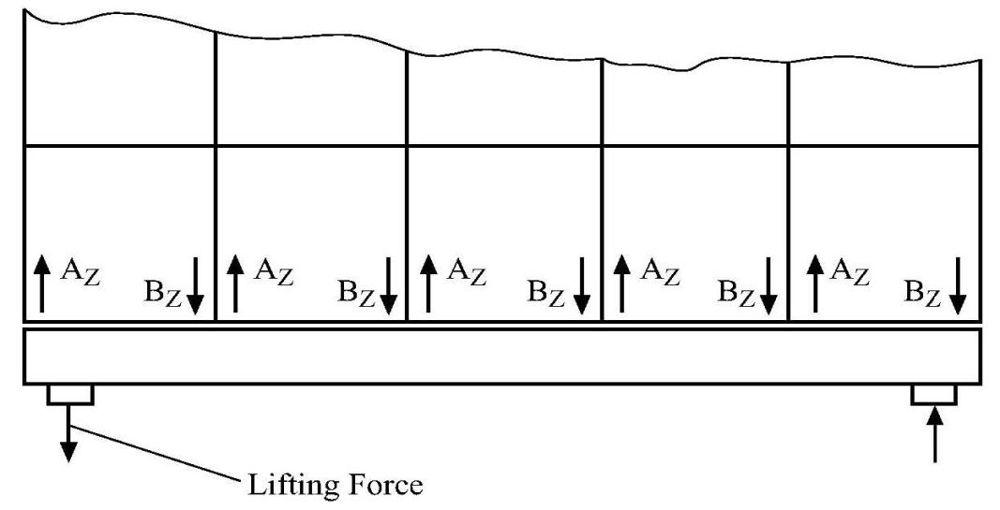
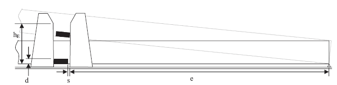

# PART 4 Hull Equipment

> RULES FOR CLASSIFICATION OF STEEL SHIPS / RA-04-E / 2025 / EN / Guidance

## CHAPTER 10 SHIPBOARD EQUIPMENT, FITTINGS AND SUPPORTING HULL STRUCTURES ASSOCIATED WITH TOWING AND MOORING

### Section 1 Definitions and Scope of Application

#### 101. Application 【See Rule】

In application of **Pt 4, Ch 10, 101. 7** of the Rules, the details are as follows.

- **1.** **General**
  - **(1)** Application
    This instruction, in case of survey requested by an applicants(shipowner's, shipyard's or manufacturer's, hereafter referred to as "applicants"), is to be applied to mooring equipment of SPM using standard equipment complying with the recommendations of the Oil Companies International Marine Forum(hereafter referred to as "OCIMF") fitted onboard ships such as oil tankers(hereafter referred to as "ships"), the delivery of which is after 1 January 2009.
  - **(2)** General arrangement of mooring equipment of SPM
    However, pedestal roller may not be installed according to arrangement of winch/capstan.

    | DWT ≤ 150,000 | 150,000 < DWT |
    | --- | --- |
    |  |  |
    - **(A)** The components of the ship's equipment required for mooring equipment of SPM are the chain stopper, fairlead, pedestal roller, winch or capstan.(See **Fig 4.10.1**)
    - **(B)** For mooring at SPM terminals, ships are to be provided forward with equipment to haul a standardized chafing chain of 76 mm in diameter connection to structure of single point mooring or end of the hawser wire of single buoy mooring terminals.
    - **(C)** When the chafing chain is carried on board the ship as a component for mooring equipment of SPM, chafing chain is comply with the requirements in **Pt 4, Ch 8, 401. 3** of the Guidance.
- **2.** **Design and specification of material**
  - **(1)** Forward chain stoppers

    | Deadweight (ton) | Chain stoppers |   |
    | --- | --- | --- |
    | Deadweight (ton) | Number | Safe working load(SWL) (ton) |
    | DWT ≤ 100,000 | 1 | 200 |
    | 100,000 < DWT ≤ 150,000 | 1 | 250 |
    | 150,000 < DWT | 2 | 350 |

    $\sigma _{VM} \leq \sigma _{y}$
    Where,
    $\sigma _{VM}$ : The equivalent stress in the equipment components(bolts, etc.) induced by the loads.
    $\sigma _{y}$ : Permissible stress, to be taken, in $RM N/mm ^{2}$, (= $R _{eH}$)
    $R _{eH}$ : Minimum yield stress, in $RM N/mm ^{2}$, of the material
    However, use of spheroidal graphite iron casting may be accepted for the main component of the chain stopper provided that:
    - **(A)** Chain stopper is to secured the chafing chain as a strong point. The number of chain stoppers and their safe working loads(SWL) are defined in **Table 4.10.1.**
    - **(B)** Chain stoppers are to be capable of securing the 76 mm common stud links of the chafing chain when the stopping device is in the closed position, and capable of passing freely the chafing chain and its associated fittings when the stopping device is in the open position.
    - **(C)** Chain stoppers may be of the hinged bar or pawl type or of other equivalent design.
    - **(D)** The stopping device of the chain stopper is to be arranged, when in the closed position, to prevent it from gradually working to the open position, which would release the chafing chain and allow it to pay out. Stopping devices are to be easy and safe to operate and, in the open position, are to be properly secured.
    - **(E)** Chain stoppers are to be located between 2.7 m and 3.7 m inward of the hull from the bow fairlead. Fairlead and pedestal roller are to be located in line with each other.
    - **(F)** Stopper supporting structures are to be trimmed to compensate for any camber and/or sheer of the deck. The leading edge of the stopper base plate is to be faired to allow for the unimpeded entry of the chafing chain into the stopper.
    - **(G)** Where the chain stopper is bolted to a seating welded to the deck, the bolts are to be satisfied with the following strength criteria. However, in such condition, efficient thrust chocks capable of withstanding a horizontal force equal to 2.0 times the required working strength are to be installed.
    - **(H)** The steel grade of bolts is to be not less than grade 8.8 as defined by **KS B ISO898-1** (Grade 10.9 is recommended). Bolts are to be pre-stressed in compliance with appropriate standards and tightening is to be suitably checked.
    - **(I)** The chain stopper is to be made of rolled steel, steel forging or steel casting complying with the requirements of **Pt 2, Ch 1** of the Rules.
      - **(a)** the component concerned is not to be a welded part
      - **(b)** the spheroidal graphite iron casting is of ferritic structure with an elongation not less than 12%
      - **(c)** the yield stress at 0.2% proof load is measured and surveyed
      - **(d)** the internal structure of the component is inspected by means of non-destructive examinations
    - **(J)** The material used for the stopping device (pawl or hinged bar) of chain stoppers is to have mechanical properties similar to Grade R3 chain cable.
  - **(2)** Fairleads
    - **(A)** One fairlead is to be fitted for each chain stopper.
    - **(B)** For ships of over 150,000 ton DWT, two fairleads are required and the fairleads are to be spaced 2.0 m or more center to center apart, if practicable, and in no case more than 3.0 m apart. For ships of 150,000 ton DWT or less, only one fairlead is to be fitted on the centerline.
    - **(C)** Fairleads are normally of a closed type such as Panama chocks and are to have an opening large enough to pass the largest portion of the chafing chain, pick-up rope and associated fittings. For this purpose, the inner dimensions of the bow fairlead opening are to be at least 600 mm in width and 450 mm in height.
    - **(D)** Fairleads are to be oval or round in shape. The lips of the fairleads are to be suitably faired in order to prevent the chafing chain from fouling on the lower lip when heaving inboard. The bending ratio(bearing surface diameter of the fairlead to chafing chain diameter) is to be not less than 7 to 1.
    - **(E)** Fairleads are to be located as close as possible to the deck and, in any case, to be in such a position that the chafing chain is approximately parallel to the deck when it is pulled between the chain stopper and the fairlead.
    - **(F)** Fairleads are to be made of rolled steel, steel forging or steel casting complying with the requirements of **Pt 2, Ch 1** of the Rules.
  - **(3)** Pedestal roller
    - **(A)** Pedestal rollers are to be positioned to enable a direct pull to be achieved on the continuation of the direct lead line between the fairlead and chain stopper. They are to be fitted not less than 3.0 m behind the chain stopper.
    - **(B)** Pedestal rollers are to be capable of withstanding a horizontal force equal to the greater of the following values. Stresses generated by this horizontal force are to comply with the strength criteria indicated in **Par 2** (1) (G).
      - **(a)** 22.5 ton
      - **(b)** the resultant force due to an assumed pull of 22.5 ton in the pick-up rope
    - **(C)** It is recommended that the pedestal roller should have a diameter not less than 7 times the diameter of the pick-up rope. Where the diameter of the pick-up rope is unknown, the roller diameter should be at least 400 mm.
  - **(4)** Winches or capstans
    - **(A)** Winches or capstans used to handle the mooring gear are to be capable of heaving inboard a load of at least 15 ton. For this purpose winches or capstans are to be capable of exerting a continuous duty pull of not less than 15 ton and withstanding a braking pull of not less than 22.5 ton.
    - **(B)** If a winch storage drum is used to stow the pick-up rope, it is to be of sufficient size to accommodate 150 m of rope of 80 mm diameter.
- **3.** **Type approval**
  The prototype testing of mooring equipment of SPM is to be in accordance with **Ch 3, Sec 7-2.** in **"Guidance for Approval of Manufacturing Process and Type Approval, Etc".**
- **4.** **Certificate Etc.**
  - **(1)** Issuing, valid term and renewal for the approval certificate are to be complied with **Ch 3, Sec 1** in **"Guidance for Approval of Manufacturing Process and Type Approval, Etc".**
  - **(2)** Some components of mooring equipment of SPM may be also used for the bow emergency towing arrangements provided that the requirements of instruction are to be complied with and type approval of bow emergency towing arrangement complied with **Ch 3, Sec 7-1.** in **"Guidance for Approval of Manufacturing Process and Type Approval, Etc".**
- **5.** **Component's inspection of mooring equipment of SPM**
  Where components of mooring equipment of SPM have undergone the type approval of this Society and satisfactorily passed the tests and inspections required as followings, the certificate will be issued when applicants request the inspection of components.
  - **(1)** Chain stoppers used to mooring equipment of SPM are according to the followings.
    - **(A)** The materials are to comply with the requirements in **Pt 2, Ch 1** of the Rules and dimensions are to comply with an approved drawings.
    - **(B)** Performance of chain stopper is to comply with the requirements in **101. 2** (1).
    - **(C)** Chain stoppers are to be wholly examined by ultrasonic test in principle, but, if impracticable, may be examined by effective non-destructive test such as magnetic particle test.
    - **(D)** Where chain stoppers have satisfactorily passed the tests and inspections required in this Society, safe working load and identification numbers are to be marked permanently.
  - **(2)** Fairleads used to mooring equipment of SPM are to be in accordance with the following requirements.
    - **(A)** The materials are to comply with the requirements in **Pt 2, Ch 1** of the Rules and dimensions are to comply with an approved drawings.
    - **(B)** Performance of fairleads is to comply with the requirements in **101. 2** (2).
    - **(C)** Fairleads are to be wholly examined by ultrasonic test in principle, but, if impracticable, may be examined by effective non-destructive test such as magnetic particle test.
  - **(3)** Pedestal roller and winches or capstans used to mooring equipment of SPM are to comply with the requirements in **101. 2** (3), (4) and to be verified by means of certificate/report of inspection issued by manufacturer.
- **6.** **Installation inspection of mooring equipment of SPM on board**
  Where mooring equipment of SPM type approved by this Society is requested for the installation inspection onboard by ship owner or by shipyard, the equipment is to be satisfactorily passed drawing approval and the tests as followings, the fitness certificate including supporting hull structure is to be issued.
  - **(1)** Documentation
    Prior to installation of the mooring equipment of SPM on a ship, the applicants are to submit the three copies of the following drawings and data for approval and information.
    - **(A)** Documentation for approval
      - **(a)** General layout of the forecastle arrangements and mooring at single point moorings
      - **(b)** Construction drawing of the bow chain stoppers, fairleads and pedestal roller, together with material specifications and relevant calculations
      - **(c)** Drawings and relevant calculations of the local ship structures supporting the loads applied to chain stoppers, fairleads, pedestals roller and winches or capstans
    - **(B)** Informations
      - **(a)** Specifications of winches or capstans giving the continuous duty pull and brake holding force
      - **(b)** Deadweight(ton) of the ship at summer load line
      - **(c)** Certificate and Type test record
  - **(2)** Design and material requirements
    Design and material requirements are to comply with the requirements in **Par 2.**
  - **(3)** Supporting hull structures
    
    Fig 4.10.2 General arrangement of chain stopper and fairlead
    - **(A)** General arrangement of chain stopper and fairlead is comply with **Fig 4.10.1** and **Fig 4.10.2**
    - **(B)** The bulwark plating and stays are to be suitably reinforced in the region of the fairleads.
    - **(C)** Deck structures in way of bow chain stoppers, including deck seatings and deck connections, are to be suitably reinforced to resist a horizontal load equal to 2 times the required safe working load and, in such condition, to meet the strength criteria(based on net thickness) specified in **Par 2** (1) (G).
    - **(D)** Minimum thickness of the deck structures in way of the strongpoint and in way of fairlead as well as the deck connections is defined local structure strength calculation and to be at least 15 mm.
    - **(E)** For deck bolted chain stoppers, reinforcements are to comply with the requirements in **2** (1) (G) and (H).
    - **(F)** The deck structures in way of the pedestal roller and in way of winches or capstans as well as the deck connections are to be reinforced to withstand, respectively, the horizontal force defined in **Par 2** (3) (B) or the braking pull defined in **Par 2** (4) (A) and to meet the strength criteria specified in **Par 2** (1) (G).
  - **(4)** Installation inspection on a ship
    - **(A)** Components to be installed and inspected including support structure in accordance with an approved arrangement by this Society and components are to have no permanent deformation provided that proof test loads are equivalent to the required safe working load at least 1 minute as given **Table 4.10.1**. However, load test may be exempted in the following cases:
      - **(a)** where mooring equipment of SPM with type approved by this Society, inspection has been approved in accordance with the requirements in **Par 5.**
      - **(b)** where mooring equipment of SPM without type approved by this Society, strength calculation sheets provided that 2 times the required safety factor should be submitted and approved by this Society and inspection has been approved in accordance with the requirements in **Par 5.** provided that proof test loads equivalent to safe working load.
    - **(B)** Supporting hull structures are to comply with the requirements in **Par 6** (3).
    - **(C)** Main welds of the chain stoppers with the hull structure are to be 100 % inspected by means of non-destructive examinations.
    - **(D)** Onboard status of an instruction manual and approved drawings are to be confirmed.

### Section 2 Towing and Mooring

#### 206. Survey after construction 【See Rule】

The condition of deck fittings, their pedestals, if any, and the hull structures in the vicinity of the fittings are to comply with regulations specified in **Pt 1, Ch 2, 202.** of the Rules. 
