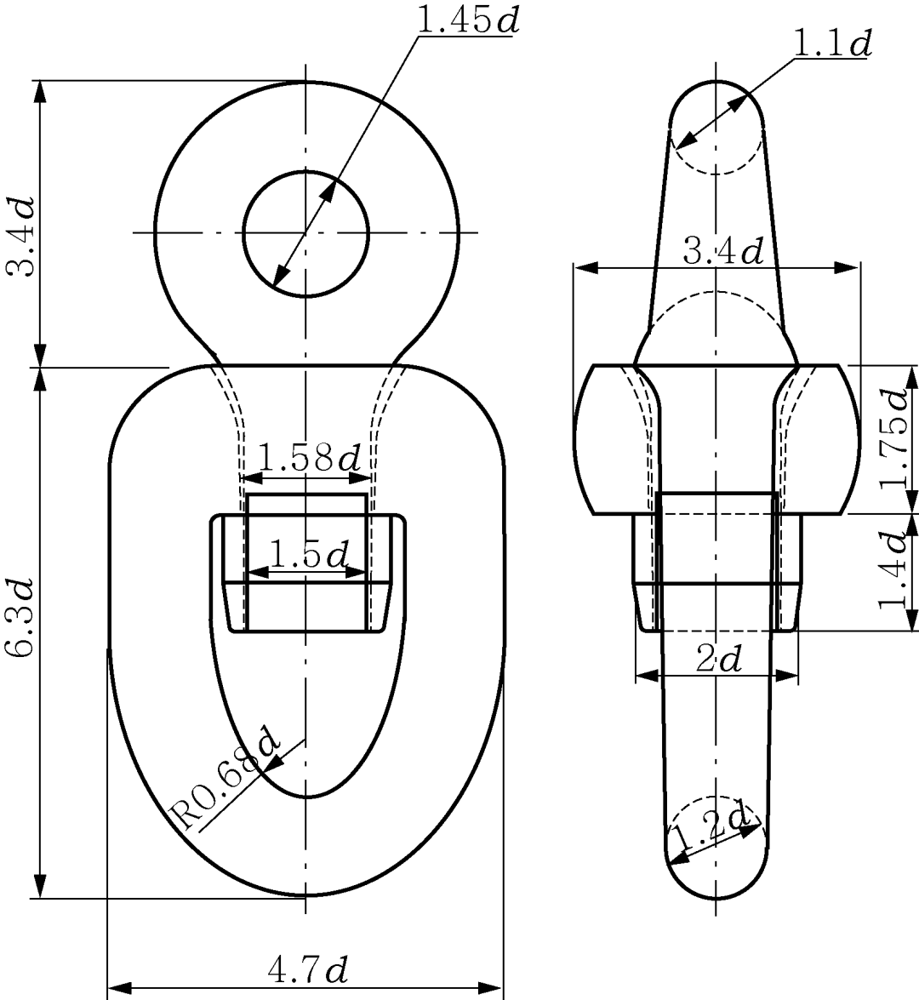
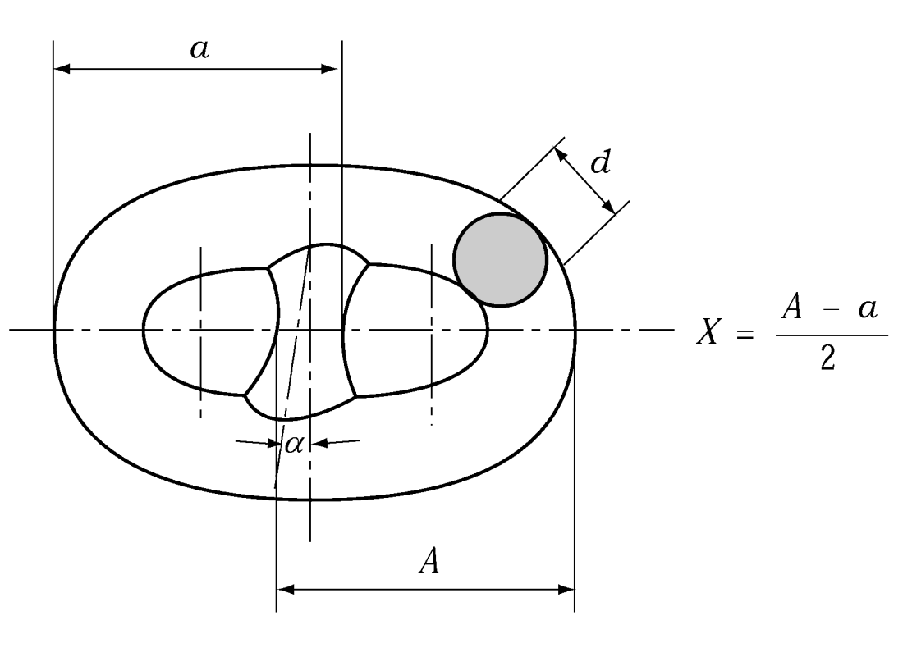
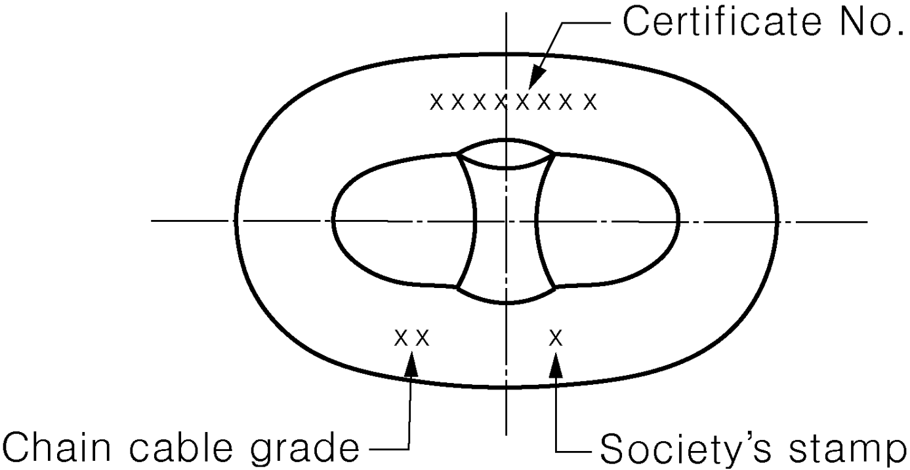
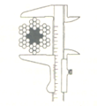
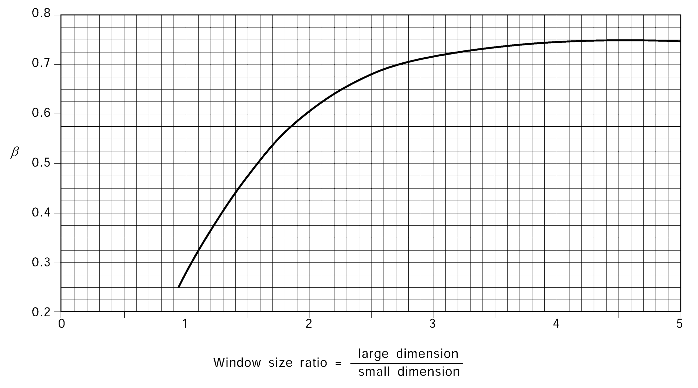

# PART 4 Hull Equipment

> RULES FOR CLASSIFICATION OF STEEL SHIPS / RA-04-E / 2025 / EN / Guidance

## CHAPTER 11 ACCESS TO AND WITHIN SPACES IN,AND FORWARD OF, THE CARGO AREA OF OIL TANKERS AND BULK CARRIERS

### Section 1 General

#### 101. Application 【See Rule】

- **1.** In application of **101. 1** of the Rules, the details are as follows.
  - **(1)** The contents of Res. MSC.151/8(78) can be applied for ships which were keeling on and after 1 Jan. 2005 instead of Res. MSC.133/4(76).
  - **(2)** Oil tankers:
    The regulation is only applicable to oil tankers having integral tanks for carriage of oil in bulk, which is contained in the definition of oil in Annex 1 of MARPOL 73/78. Independent oil tanks can be excluded. SOLAS Regulation II‐1/3‐6 is not normally applied to FPSO or FSO unless the Administration decides otherwise.

#### 102. Means of access to cargo and other spaces 【See Rule】

- **1.** In application of **102. 1** of the Rules, the details are as follows.
  Each space for which close-up inspection is not required such as fuel oil tanks and void spaces forward of cargo area, may be provided with a means of access necessary for overall survey intended to report on the overall conditions of the hull structure.
- **2.** In application of **102. 2** of the Rules, the details are as follows.
  - **(1)** Some possible alternative means of access are listed under **202. 9** of the Rules. Always subject to acceptance as equivalent by the Administration, alternative means such as an unmanned robot arm, ROV’s and dirigibles with necessary equipment of the permanent means of access for overall and close‐up inspections and thickness measurements of the deck head structure such as deck transverses and deck longitudinals of cargo oil tanks and ballast tanks, are to be capable of:
    - safe operation in ullage space in gas‐free environment;
    - introduction into the place directly from a deck access.
- **3.** In application of **102. 3** of the Rules, the details are as follows.
  - **(1)** Inspection
    The MA arrangements, including portable equipment and attachments, are to be annually inspected by the crew or competent inspectors and the inspections should be recorded in Part 2 of the Ships Structure Access Manual. In addition, prior to any space examinations that utilized the permanent means of access, an inspection to confirm the condition of the permanent means of access should be recorded for each space. *(2025)*
  - **(2)** Procedures
    - **(A)** Any company authorised person using the MA shall assume the role of inspector and check for obvious damage prior to using the access arrangements. Whilst using the MA the inspector is to verify the condition of the sections used by close up examination of those sections and note any deterioration in the provisions. Should any damage or deterioration be found, the effect of such deterioration including loss of coating and wastage is to be assessed as to whether the damage or deterioration affects the safety for continued use of the access. Deterioration found that is considered to affect safe use is to be determined as “substantial damage” and measures are to be put in place to ensure that the affected section(s) are not to be further used prior effective repair. Substantial damage should be reported in Part 2 of the Ship Structure Access Manual. *(2025)*
    - **(B)** Statutory survey of any space that contains MA shall include verification of the continued effectiveness of the MA in that space. Survey of the MA shall not be expected to exceed the scope and extent of the survey being undertaken. If the MA is found deficient the scope of survey should be extended if this is considered appropriate.
    - **(C)** Records of all inspections are to be established based on the requirements detailed in the ships Safety Management System. The records are to be readily available to persons using the MAs and a copy attached to the MA Manual. The latest record for the portion of the MA inspected should include as a minimum the date of the inspection, the name and title of the inspector, a confirmation signature, the sections of MA inspected, verification of continued serviceable condition or details of any deterioration or substantial damage found and repairs carried out. A file of permits issued should be maintained for verification. Inspection records of permanent means of access should be made available to classification society surveyors prior to survey. *(2025)*

#### 103. Safe access to cargo holds, cargo tanks, ballast tanks and other spaces 【See Rule】

- **1.** In application of **103. 1** of the Rules, the details are as follows.
  - **(1)** Access to a double side skin space of bulk carriers may be either from a topside tank or double bottom tank or from both.
  - **(2)** The wording "not intended for the carriage of oil or hazardous materials" applies only to "similar compartments", i.e. safe access can be through a pump-room, deep cofferdam, pipe tunnel, cargo hold or double hull space.
- **2.** In application of **103. 2** of the Rules, the details are as follows.
  A cargo oil tank of less than 35 m length without a swash bulkhead requires only one access hatch.
  Where rafting is indicated in the ship structures access manual as the means to gain ready access to the under deck structure, the term "similar obstructions" referred to in the regulation includes internal structures (e.g., webs >1.5 m deep) which restrict the ability to raft (at the maximum water level needed for rafting of under deck structure) directly to the nearest access ladder and hatchway to deck. When rafts or boats alone, as an alternative means of access, are allowed under the conditions specified in the ESP Code, as amended, permanent means of access are to be provided to allow safe entry and exit. This means:
  - **(1)** access direct from the deck via a vertical ladder and small platform fitted approximately 2 m below the deck in each bay; or
  - **(2)** access to deck from a longitudinal permanent platform having ladders to deck in each end of the tank. The platform shall, for the full length of the tank, be arranged in level with, or above, the maximum water level needed for rafting of under deck structure. For this purpose, the ullage corresponding to the maximum water level is to be assumed not more than 3 m from the deck plate measured at the midspan of deck transverses and in the middle length of the tank. (See Figure below). A permanent means of access from the longitudinal permanent platform to the water level indicated above is to be fitted in each bay (e.g., permanent rungs on one of the deck webs inboard of the longitudinal permanent platform).

#### 104. Ship structure access manual 【See Rule】

- **1.** In application of **104. 1** of the Rules, the details are as follows.
  Access manual should address spaces listed in paragraph 3 of SOLAS II‐1/3‐6.
  As a minimum the English version should be provided
  The ship structure access manual is to contain at least the following two parts:
  Part 1 : Plans, instructions and inventory required by paragraphs 4.1.1 to 4.1.7 of SOLAS II‐1/3‐6. This part is to be approved by the Administration or the organization recognised by the Administration
  Part 2 : Form of record of inspections and maintenance, and change of inventory of portable equipment due to additions or replacement after construction. This part is be approved for its form only at new building.
  The following matters are to be addressed in the ship structure access manual:
  - **(1)** The access manual should clearly cover scope as specified in the regulations for use by crews, surveyors and port state control officers.
  - **(2)** Approval / re‐approval procedure for the manual, i.e. any changes of the permanent, portable, movable or alternative means of access within the scope of the regulation and the Technical provisions are subject to review and approval by the Administration or by the organization recognised by the Administration.
  - **(3)** Verification of MA is to be part of safety construction survey for continued effectiveness of the MA in that space which is subject to the statutory survey.
  - **(4)** Inspection of MA by the crew and/or a competent inspector of the company as a part of regular inspection and maintenance.
  - **(5)** Actions to be taken if MA is found unsafe to use.
  - **(6)** In case of use of portable equipment plans showing the means of access within each space indicating from where and how each area in the space can be inspected;
- **2.** In application of **104. 2** of the Rules, the details are as follows.
  - **(1)** Critical structural areas are to be identified by advanced calculation techniques for structural strength and fatigue performance, if available, and feed back from the service history and design development of similar or sister ships.
  - **(2)** Reference is to be made to the following publications for critical structural areas, where applicable:
    - Oil tankers: Guidance Manual for Tanker Structures by TSCF;
    - Bulk carriers: Bulk Carriers Guidelines for Surveys, Assessment and Repair of Hull Structure by IACS;
    - Oil tankers and bulk carriers: the ESP Code, as amended.

#### 105. General technical specifications 【See Rule】

- **1.** In application of **105. 1** of the Rules, the details are as follows.
  The minimum clear opening of 600 mm × 600 mm may have corner radii up to 100 mm maximum. The clear opening is specified in MSC/Circ.686 to keep the opening fit for passage of personnel wearing a breathing apparatus. In such a case where as a consequence of structural analysis of a given design the stress is to be reduced around the opening, it is considered appropriate to take measures to reduce the stress such as making the opening larger with increased radii, e.g. 600 mm × 800 mm with 300 mm radii, in which a clear opening of 600 mm × 600 mm with corner radii up to 100 mm maximum fits.
- **2.** In application of **105. 2** of the Rules, the details are as follows.
  - **(1)** The minimum clear opening of not less than 600 mm × 800 mm may also include an opening with corner radii of 300 mm. An opening of 600 mm in height × 800 mm in width may be accepted as access openings in vertical structures where it is not desirable to make large opening in the structural strength aspects, i.e. girders and floors in double bottom tanks.
  - **(2)** Subject to verification of easy evacuation of injured person on a stretcher the vertical opening 850 mm × 620 mm with wider upper half than 600 mm, while the lower half may be less than 600 mm with the overall height not less than 850 mm is considered acceptable alternative to the traditional opening of 600 mm × 800 mm with corner radii of 300 mm.
    
  - **(3)** If a vertical opening is at a height of more than 600 mm steps and handgrips are to be provided. In such arrangements it should be demonstrated that an injured person can be easily evacuated.

### Section 2 Technical Provisions for Means of Access for Inspections

#### 201. Definitions 【See Rule】

- **1.** In application of **201. 1** of the Rules, the details are as follows.
  - **(1)** rung
    
  - **(2)** tread
  - **(3)** flight of an inclined ladder
    
  - **(4)** stringer
  - **(5)** vertical ladder
  - **(6)** overhead obstruction & (7) distance below deck head
    overhead obstruction
    
  - **(8)** cross deck
    

#### 202. Technical provisions 【 See Rule】

- **1.** In application of **202. 1** of the Rules, the details are as follows.
  The permanent means of access to a space can be credited for the permanent means of access for inspection.
- **2.** In application of **202. 3** of the Rules, the details are as follows.
  - **(1)** Sloping structures are structures that are sloped by 5 or more degrees from horizontal plane when a ship is in upright position at even‐keel.
  - **(2)** Guard rails are to be fitted on the open side and should be at least 1,000 mm in height. For stand alone passageways guard rails are to be fitted on both sides of these structures. Guardrail stanchions are to be attached to the PMA. The distance between the passageway and the intermediate bar and the distance between intermediate bar and the top rail shall not be more than 500 mm.
  - **(3)** Discontinuous top handrails are allowed, provided the gap does not exceed 50 mm.
    The same maximum gap is to be considered between the top handrail and other structural members (i.e. bulkhead, web frame, etc.).
    The maximum distance between the adjacent stanchions across the handrail gaps is to be 350 mm where the top and mid handrails are not connected together and 550 mm when they are connected together.
    The maximum distance between the stanchion and other structural members is not to exceed 200 mm where the top and mid handrails are not connected together and 300 mm when they are connected together.
    When the top and mid handrails are connected by a bent rail, the outside radius of the bent part is not to exceed 100 mm (see Figure below).
    
  - **(4)** Non‐skid construction is such that the surface on which personnel walks provides sufficient friction to the sole of boots even the surface is wet and covered with thin sediment.
  - **(5)** “Substantial construction” is taken to refer to the as-designed strength as well as the residual strength during the service life of the vessel. Durability of passageways together with guard rails should be ensured by the initial corrosion protection and inspection and maintenance during services.
  - **(6)** For guard rails, use of alternative materials such as GRP should be subject to compatibility with the liquid carried in the tank. Non‐fire resistant materials should not be used for means of access to a space with a view to securing an escape route at a high temperature.
  - **(7)** Requirements for resting platforms placed between ladders are equivalent to those applicable to elevated passageways.
    
- **3.** In application of **202. 4** of the Rules, the details are as follows.
  Where the vertical manhole is at a height of more than 600 mm above the walking level, it should be demonstrated that an injured person can be easily evacuated.
  
- **4.** In application of **202. 5** of the Rules, the details are as follows.
  - **(1)** MA for access to ballast tanks, cargo tanks and spaces other than FPT:
    For oil tankers:
    The uppermost section of the vertical ladder, measured clear of the overhead obstructions in way of the tank entrance, should not be less than 2.5 m but not exceed 3.0 m and should comprise a ladder linking platform which should be displaced to one side of a vertical ladder. However, the vertical distance of the upper most section of the vertical ladder may be reduced to 1.6 m, measured clear of the overhead obstructions in way of the tank entrance, if the ladder lands on a longitudinal or athwartship permanent means of access fitted within that range. Adjacent sections of the ladder are to be laterally offset from each other by at least the width of the ladder (see paragraph 20 of MSC/Circ.686 and refer to the interpretation of Technical Provision, resolution MSC.158(78), paragraph 3.13.2 and paragraph 3.13.6); or
    - **(A)** Tanks and subdivisions of tanks having a length of 35 m or more with two access hatchways:
      - **(a)** First access hatchway: Inclined ladder or ladders are to be used.
      - **(b)** Second access hatchway:
      - **(i)** A vertical ladder may be used. In such a case where the vertical distance is more than 6 m, vertical ladders should comprise one or more ladder linking platforms spaced not more than 6 m apart vertically and displaced to one side of the ladder.
        - **(ii)** Where an inclined ladder or combination of ladders is used for access to the space, the uppermost section of the ladder, measured clear of the overhead obstructions in way of the tank entrance, should be vertical for not less than 2.5 m but not exceed 3.0 m and should comprise a landing platform continuing with an inclined ladder. However, the vertical distance of the upper most section of the vertical ladder may be reduced to 1.6 m, measured clear of the overhead obstructions in way of the tank entrance, if the ladder lands on a longitudinal or athwartship permanent means of access fitted within that range. The flights of the inclined ladders are normally to be not more than 6 m in vertical height. The lowermost section of the ladders may be vertical for the vertical distance not exceeding 2.5 m.
    - **(B)** Tanks less than 35 m in length and served by one access hatchway an inclined ladder or combination of ladders are to be used to the space as specified in (1) (ii) above.
    - **(C)** In double hull spaces of less than 2.5 m width the access to the space may be by means of vertical ladders that comprises one or more ladder linking platforms spaced not more than 6 m apart vertically and displaced to one side of the ladder. The uppermost section of the vertical ladder, measured clear of the overhead obstructions in way of the tank entrance, should not be less than 2.5 m but not exceed 3.0 m and should comprise a ladder linking platform which should be displaced to one side of a vertical ladder. However, the vertical distance of the upper most section of the vertical ladder may be reduced to 1.6 m, measured clear of the overhead obstructions in way of the tank entrance, if the ladder lands on a longitudinal or athwartship permanent means of access fitted within that range. Adjacent sections of the ladder should be laterally offset from each other by at least the width of the ladder. (see paragraph 20 of MSC/Circ.686 and refer to the interpretation of Technical Provision, resolution MSC.158(78), paragraph 3.13.2 and paragraph 3.13.6)
    - **(D)** Access from deck to a double bottom space may be by means of vertical ladders through a trunk. The vertical distance from deck to a resting platform, between resting platforms or a resting platform and the tank bottom is not be more than 6 m unless otherwise approved by the Administration.
  - **(2)** MA for inspection of the vertical structure of oil tankers:
    Vertical ladders provided for means of access to the space may be used for access for inspection of the vertical structure.
    Unless stated otherwise in Table 1 of TP, vertical ladders that are fitted on vertical structures for inspection should comprise one or more ladder linking platforms spaced not more than 6 m apart vertically and displace to one side of the ladder. Adjacent sections of ladder should be laterally offset from each other by at least the width of the ladder. (see paragraph 20 of MSC/Circ.686 and refer to the interpretation of Technical Provision, resolution MSC.158(78), paragraph 3.13.2 and paragraph 3.13.6)
  - **(3)** Obstruction distances
    The minimum distance between the inclined ladder face and obstructions, i.e. 750 mm and, in way of openings, 600 mm specified in **202. 5** of the Rules is to be measured perpendicular to the face of the ladder.
- **5.** In application of **202. 6** of the Rules, the details are as follows.
  - **(1)** Vertical height of handrails is not to be less than 890 mm from the center of the step and two course handrails need only be provided where the gap between stringer and top handrail is greater than 500 mm.
  - **(2)** The requirement of two square bars for treads specified in TP 3.6 is based upon the specification of construction of ladders in paragraph 3(e) of Annex 1 to resolution A.272(VIII), which addresses inclined ladders. TP.3.4 allows for single rungs fitted to vertical surfaces, which is considered for a safe grip. For vertical ladders, when steel is used, the rungs should be formed of single square bars of not less than 22 mm by 22 mm for the sake of safe grip.
  - **(3)** The width of inclined ladders for access to a cargo hold is to be at least 450 mm to comply Australian AMSA Marine Orders Part 32, Appendix 17.
  - **(4)** The width of inclined ladders other than an access to a cargo hold is to be not less than 400 mm.
  - **(5)** The minimum width of vertical ladders is to be 350 mm and the vertical distance between the rungs is to be equal and is to be between 250 mm and 350 mm.
  - **(6)** A minimum climbing clearance in width is to be 600 mm other than the ladders placed between the hold frames.
  - **(7)** The vertical ladders should be secured at intervals not exceeding 2.5 m apart to prevent vibration.
    
    
- **6.** In application of **202. 8** of the Rules, the details are as follows.
  
- **7.** In application of **202. 9** (6) of the Rules, the details are as follows. A mechanical device such as hooks for securing at the upper end of a ladder is considered an appropriate securing device if a movement fore/aft and sideways can be prevented at the upper end of the ladder. In **202. 9** (7) the Rules, the "other means of access, approved by and acceptable to this Society" means the case where the means are approved by **Pt 1, Ch 1, 105.** of the Rules. or equivalent means.
- **8.** In application of **202. 10** and **11** of the Rules, the details are as follows.
  See the **202. 10** and **11** of the Guidances.
  
  
- **9.** In application of **202. 13** of the Rules, the details are as follows.
  - **(1)** Either a vertical or an inclined ladder or a combination of them may be used for access to a cargo hold where the vertical distance is 6 m or less from the deck to the bottom of the cargo hold.
    
  - **(2)** Adjacent sections of vertical ladder need to be installed so that the following provisions are complied with:
    - **(A)** the minimum “lateral offset”. between two adjacent sections of vertical ladder, is the distance between the sections, upper and lower, so that the adjacent stringers are spaced at least 200 mm apart, measured from half thickness of each stringer.
    - **(B)** adjacent sections of vertical ladder shall be installed so that the upper end of the lower section is vertically overlapped, in respect to the lower end of the upper section, to a height of 1500 mm in order to permit a safe transfer between ladders.
    - **(C)** no section of the access ladder shall be terminated directly or partly above an access opening.

#### 203. Corrosion protection 【See Ru le】

In application of **203.** of the Rules, the details are as follows.

- **1.** Permanent means of access in dedicated seawater ballast tanks in all types of ships and double-side skin spaces of bulk carriers
  - **(1)** Permanent means of access arrangements that are integral to the ship structure shall be coated in accordance with the Performance standard for protective coatings for dedicated seawater ballast tanks of all types of ships and double-side skin spaces of bulk carriers (PSPC) (resolution MSC.215(82)).
  - **(2)** Guidelines for PMAs that are not part of the structural strength elements
    - **(A)** Hot dip galvanizing should be employed as the primary means for corrosion protection for the ladders, rails, walkways, gratings, stanchions, etc. Hot dip galvanizing and repairs of damages should be performed in accordance with KS D ISO 1461
    - **(B)** The galvanized items should be subsequently coated in accordance with KS M ISO 12944-5 or the coating manufacturer’s recommendation.
    - **(C)** Where protective coating is applied as the sole means of corrosion protection for these PMAs, the standard in resolution MSC.215(82) should be applied to the extent possible. In such cases, the protective coating should at least comply with the requirements of the PSPC for the job specification, coating system (epoxy-based system) and total NDFT (320 μm).
- **2.** Permanent means of access in void spaces
  - **(1)** Permanent means of access arrangements in void spaces that are integral to the ship structure should be coated in accordance with the Performance standard for protective coatings for void spaces (resolution MSC.244(83)).
  - **(2)** Guidelines for PMAs that are not part of the structural strength elements

    | Vertical Ladder – Ladder through the linking platform  |
    | --- |

    | **Vertical Ladder – Side mount**  |
    | --- |
    - **(A)** Hot dip galvanizing should be employed as the primary means for corrosion protection for these PMAs. The galvanized items should be subsequently coated according to the coating manufacturer’s recommendation.
    - **(B)** Where protective coating is applied as the sole means of corrosion protection for these items, the Performance standard for protective coatings for void spaces (resolution MSC.244(83)), should be applied to the extent possible. In such case, the protective coating should at least comply with the requirements for the coating system (epoxy-based system) and total NDFT (200 μm) of that standard. 
- **10.** In application of **202. 14** of the Rules, the "deck" is defined as weather deck and the details are as follows.
  
