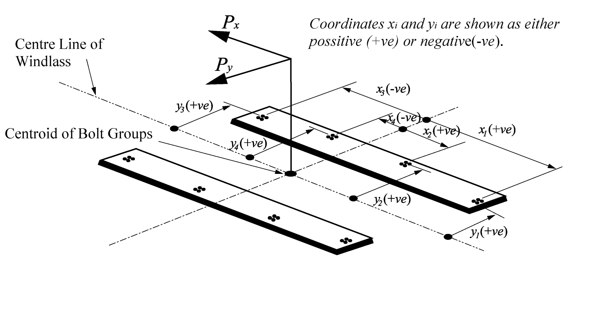

# PART 4 Hull Equipment

> RULES FOR CLASSIFICATION OF STEEL SHIPS / RA-04-E / 2025 / EN / Guidance

## Annex 4-1 Means of Access for Ballast and Cargo Tanks of Oil Tankers

### 1. Water ballast tanks, except those specified in Par 2, and cargo oil tanks

#### 1.1

- **(1)** Sub‐paragraphs .1, .2 and .3 define access to underdeck structure, access to the uppermost sections of transverse webs and connection between these structures.
- **(2)** Sub‐paragraphs .4, .5 and .6 define access to vertical structures only and are linked to the presence of transverse webs on longitudinal bulkheads.
- **(3)** If there are no underdeck structures (deck longitudinals and deck transverses) but there are vertical structures in the cargo tank supporting tranverse and longitudinal bulkheads, access in accordance with sub‐paragraphs from .1 through to .6 is to be provided for inspection of the upper parts of vertical structure on transverse and longitudinal bulkheads.
- **(4)** If there is no structure in the cargo tank, section 1.1 of Table 1 is not applicable.
- **(5)** Section 1 of **Table 4.11.1** is also to be applied to void spaces in cargo area, comparable in volume to spaces covered by the regulation II‐1/3‐6, except those spaces covered by Section 2.
- **(6)** The vertical distance below the overhead structure is to be measured from the underside of the main deck plating to the top of the platform of the means of access at a given location.
- **(7)** The height of the tank is to be measured at each tank. For a tank the height of which varies at different bays item 1.1 is to be applied to such bays of a tank that have height 6 $\mathrm{m}$ and over.

#### 1.1.1

#### 1.1.2 There is need to provide continuous longitudinal permanent means of access when the deck longitudinals and deck transverses are fitted on deck but supporting brackets are fitted under the deck.

#### 1.1.3 Means of access to tanks may be used for access to the permanent means of access for inspection.

#### 1.1.4 The permanent fittings required to serve alternative means of access such as wire lift platform, that are to be used by crew and surveyors for inspection should provide at least an equal level of safety as the permanent means of access stated by the same paragraph. These means of access shall be carried on board the ship and be readily available for use without filling of water in the tank. Therefore, rafting is not acceptable under this provision. Alternative means of access are to be part of Access Manual which is to be approved on behalf of the flag State. For water ballast tanks of 5 m or more in width, such as on an ore carrier, side shell plating shall be considered in the same way as “longitudinal bulkhead”.

#### 1.1.5

### 2. Water ballast wing tanks of less than 5 m width forming double side spaces and their bilge hopper sections

#### 2.1 Par 2 of Table 4.11.1 is also to be applied to wing tanks designed as void spaces. Paragraph 2.1.1 represents requirements for access to underdeck structures, while paragraph 2.1.2 is a requirement for access for survey and inspection of vertical structures on longitudinal bulkheads (transverse webs).

#### 2.1.1

- **(1)** For a tank the vertical distance between horizontal upper stringer and deck head of which varies at different sections item 2.1.1 is to be applied to such sections that falls under the criteria.
- **(2)** The continuous permanent means of access may be a wide longitudinal, which provides access to critical details on the opposite side by means of platforms as necessary on web frames. In case the vertical opening of the web frame is located in way of the open part between the wide longitudinal and the longitudinal on the opposite side, platforms shall be provided on both sides of the web frames to allow safe passage through the web frame.
- **(3)** Where two access hatches are required by SOLAS regulation II‐1/3‐6.3.2, access ladders at each end of the tank are to lead to the deck.
  

#### 2.1.2 The continuous permanent means of access may be a wide longitudinal, which provides access to critical details on the opposite side by means of platforms as necessary on web frames. In case the vertical opening of the web is located in way of the open part between the wide longitudinal and the longitudinal on the opposite side, platforms shall be provided on both sides of the web to allow safe passage through the web. A "reasonable deviation" as noted in TP/1.4, of not more than 10% may be applied where the permanent means of access is integral with the structure itself.

#### 2.2

- **(1)** Permanent means of access between the longitudinal continuous permanent means of access and the bottom of the space is to be provided.
- **(2)** The height of a bilge hopper tank located outside of the parallel part of vessel is to be taken as the maximum of the clear vertical distance measured from the bottom plating to the hopper plating of the tank.
- **(3)** The foremost and aftmost bilge hopper ballast tanks with raised bottom, of which the height is 6 m and over, a combination of transverse and vertical MA for access to the upper knuckle point for each transverse web is to be accepted in place of the longitudinal permanent means of access.
  

#### 2.2.1 2.2.2

 

#### 2.3

