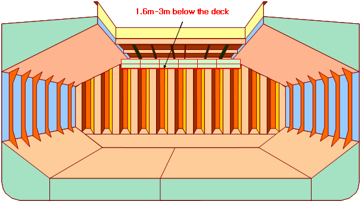

# PART 4 Hull Equipment

> RULES FOR CLASSIFICATION OF STEEL SHIPS / RA-04-E / 2025 / EN / Guidance

## Annex 4-2 Means of Access for Bulk Carriers

### 1. Cargo holds

#### 1.1

- **(1)** Means of access shall be provided to the crossdeck structures of the foremost and aftermost part of the each cargo hold.
- **(2)** Interconnected means of access under the cross deck for access to three locations at both sides and in the vicinity of the centerline is acceptable as the three means of access.
- **(3)** Permanent means of access fitted at three separate locations accessible independently, one at each side and one in the vicinity of the centerline is acceptable.
- **(4)** Special attention is to be paid to the structural strength where any access opening is provided in the main deck or cross deck.
- **(5)** The requirements for bulk carrier cross deck structure is also considered applicable to ore carriers.
  

#### 1.2

#### 1.3 Particular attention is to be paid to preserve the structural strength in way of access opening provided in the main deck or cross deck.

#### 1.4 “Full upper stools” are understood to be stools with a full extension between top side tanks and between hatch end beams.

#### 1.5

- **(1)** The movable means of access to the underdeck structure of cross deck need not necessarily be carried on board the vessel. It is sufficient if it is made available when needed.
- **(2)** The requirements for bulk carrier cross deck structure is also considered applicable to ore carriers.

#### 1.6

- **(1)** The maximum vertical distance of the rungs of vertical ladders for access to hold frames is to be 350 mm.
- **(2)** If safety harness is to be used, means should be provided for connecting the safety harness in suitable places in a practical way.
  

#### 1.7 Portable, movable or alternative means of access also is to be applied to corrugated bulkheads.

#### 1.8 Readily available means ;

Able to be transported to location in cargo hold and safely erected by ship's staff.

#### 1.10

### 2. Ballast tanks

#### 2.1 2.2

 

#### 2.3 If the longitudinal structures on the sloping plate are fitted outside of the tank a means of access is to be provided.

#### 2.5

- **(1)** The height of a bilge hopper tank located outside of the parallel part of vessel is to be taken as the maximum of the clear vertical height measured from the bottom plating to the hopper plating of the tank.
- **(2)** It should be demonstrated that portable means for inspection can deployed and made readily available in the areas where needed.
  

#### 2.5.2 A wide longitudinal frame of at least 600 mm clear width may be used for the purpose of the longitudinal continuous permanent means of access. The foremost and aftermost bilge hopper ballast tanks with raised bottom, of which the height is 6 m and over, a combination of transverse and vertical MA for access to the sloping plate of hopper tank connection with side shell plating for each transverse web can be accepted in place of the longitudinal permanent means of access.

#### 2.5.3

#### 2.6 The height of web frame rings should be measured in way of side shell and tank base. #imgID-85_s2
